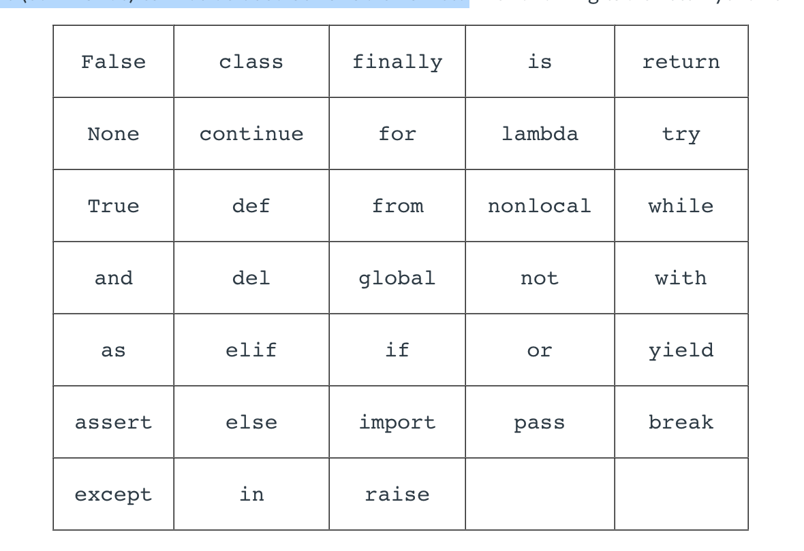
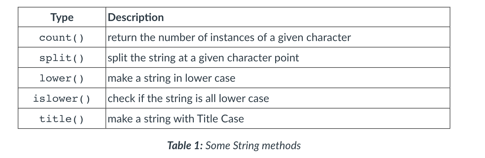
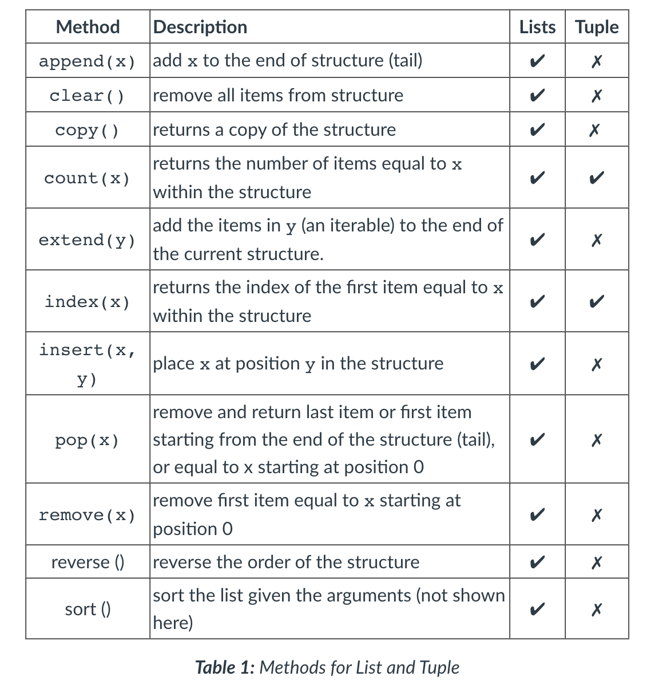
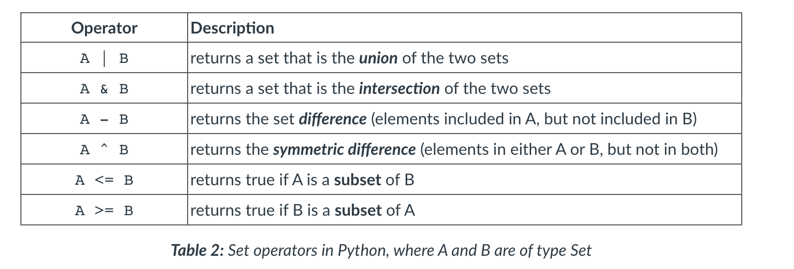
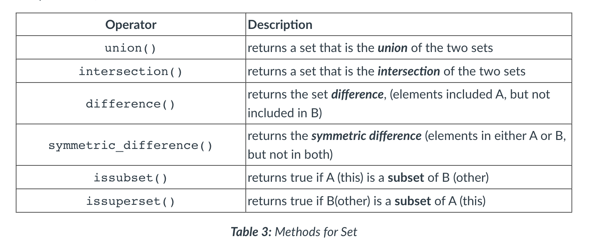
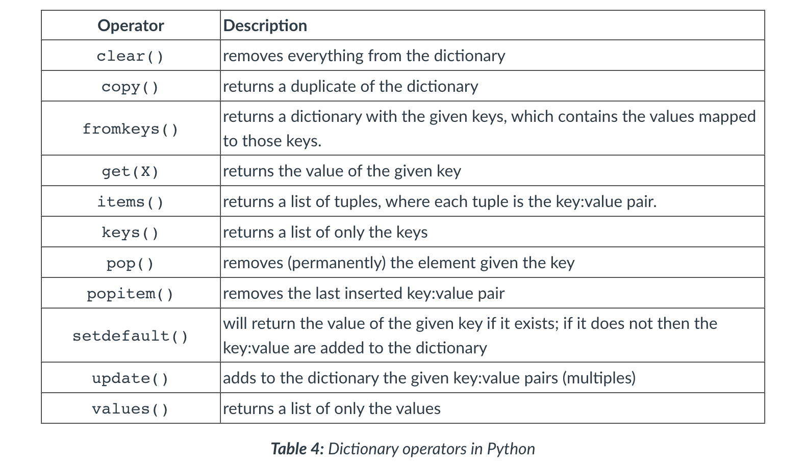
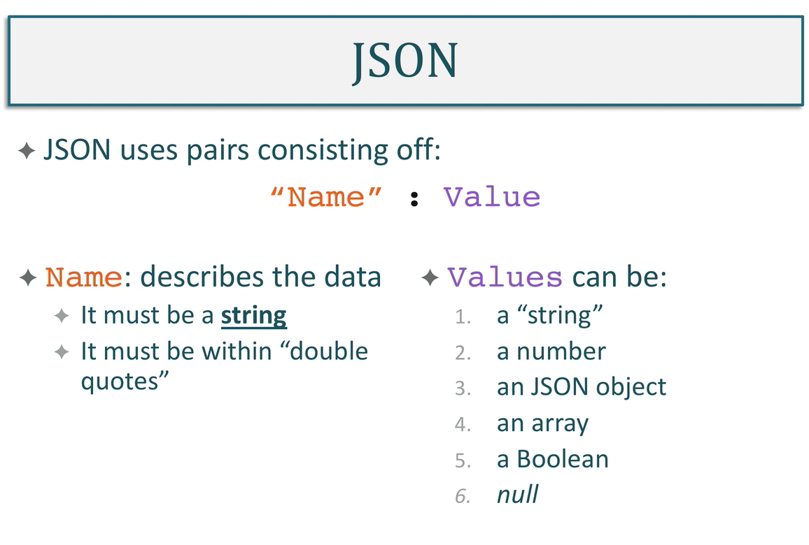
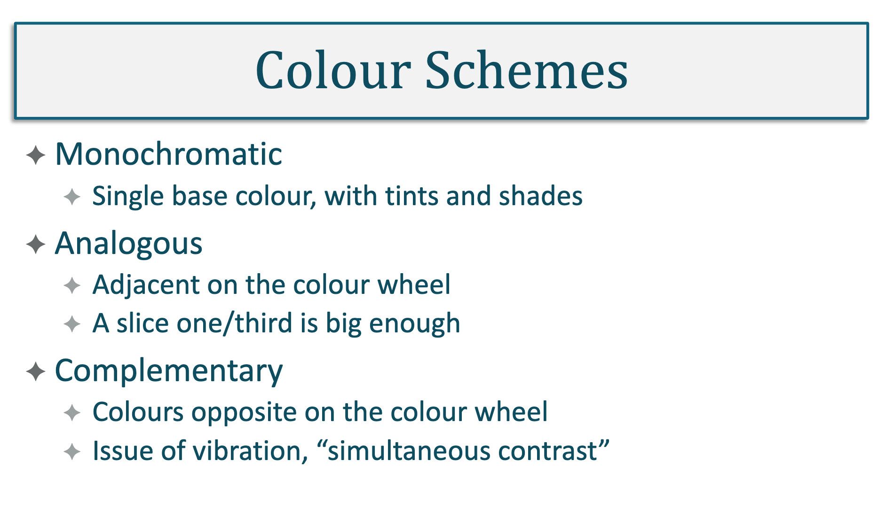

## MSC Software Engineering Lesson Notes

This module is for MSC Software Engineering lessons notes.

## Overview

- [Week-1](/advance-programming/Week-1.md)
- [Week-2](/advance-programming/Week-2.md)
- [Week-3](/advance-programming/Week-3.md)
- [Week-4](/advance-programming/Week-4.md)
- [Week-5](/advance-programming/Week-5.md)
- [Week-6](/advance-programming/Week-6.md)
- [Week-7](/advance-programming/Week-7.md)
- [Books](/advance-programming/Books.md)

# WEEK 1

#### Main Topics

#### Sub titles:

# Variables

* There are no primitive types as there are in Java. The closest Python gets to this is a set of single value types
  referred to as 'Scalar types'.
* Unlike in Java, Python does not let you declare variables without assigning a value to them. So variables in Python
  are only declared at the point they are needed and assigned an initial value.
  

```py
  In [5]: num1 = 6
  In [6]: num2 = 105
  In [7]: sum = num1 + num2
  In [8]: product = num1 * num2
  In [9]: quotient = num2 / num1
  In [10]: difference = num1 - num2
  In [11]: print(f"Sum: {sum}, product: {product}")
  Sum: 111, product: 630

  In [12]: print(f"Quotient: {quotient}, difference: {difference}")
  Quotient: 17.5, different: -99
  ```

* The result of integer division (105 / 6) will produce a floating point value as a result. So the variable quotient
  will hold the value 17.5, not 17 as you would get in Java. To get the quotient as a whole number and the remainder
  separately you need to use the following operators:

```
In [13]: wholeNum = 105//6
In [14]: remainder = 105 % 6
In [15]: print(f"Whole number: {wholeNum}, Remainder: {remainder}")
Whole number: 17, Remainder: 3
```

  

# Decision / Conditions

* Python are if, elif and else
* Python is that it uses spaces “ ” (indentation) to define code structures, or 'blocks', whereas Java uses curly braces
  { } for this job.

```
In [1]: num1 = 56                                                     
In [2]: num2 = 37                                                     
In [3]: if num1 > num2:
     ...:     print(f"{num1} is larger than {num2}")
     ...: elif num1 < num2:
     ...:     print(f"{num1} is smaller than {num2}")
     ...: else:
     ...:     print("Both numbers are the same.")
56 is larger than 37

```

## Single line conditions

* do_something_if_TRUE if condition else otherwise do_something_else

## Condition statements


# Loops

* Python has two structures for iteration: a for style loop and a while loop.

*** for loop :**

* renge() : The method range() is used to generate a list of valid values (steps) for each iteration. In Python 3.x the
  range() method returns an immutable sequence of type range, whereas in Python 2.x it returns a List. A common
  misconception is that range() still produces a List type, which is incorrect as range is a type in itself.
    * `range(start, end, steps)`
    * ins sample 3 (inclusive) and ends at 5, making the 6 exclusive.

``` 
  In [1]: for i in range(3,6):                                           
    ...:     print(i)
    ...:     
    3
    4
    5
  ```

* **while loop:**
* The while loop requires a counter defined outside the loop and an increment (or decrement) defined inside the loop

```
In [2]: count = 0
In [3]: while count <= 4:
   ...:     print(count)
   ...:     count += 1
   ...:     
0
1
2
3
4

```

* have an else clause attached at their end

```
 In [4]: while count < 6:
   ...:     print(count)
   ...:     count +=2
   ...: else:
   ...:     print("Finished!")
   ...:      
0
2
4
Finished!
```

* Loop controls
  

# Best Practice

* **Naming conventions:**
    * Variable names should be lower case.
    * Function names should be lower case.
    * Classes and Module names should be in Title Case.
    * Constants should be UPPER CASE with an underscore (_) used for spaces.

* Short variable names such as x, y, i, j are only used in enclosed structures such as a loop.
* All other variable names should clearly define what the variable holds in the context of the program, or function,
  they are defined within.
    * Function names should focus on what the function does and not on how it is implemented.
* Python coders typically use either snake_case or camelCase to differentiate words used in their variable names.
* the keywords (commands) cannot be used as variable names. like below:
  

* **White space:**
    * An expected standard is to use 2 or 4 spaces for indentation. Tabs should generally be avoided as their size
      varies in different IDEs and can be identified as an error by the Python interpreter.
    * Lines of code should not exceed 79 characters.

```
i = x + 1             # clear
i=x+1                 # not so clear

# grouping to make related operators and operands clearer
a = (b+4) * (c-7)           # clear
a = ( b + 4 ) * ( c - 7 )   # not so clear 
```

* Comments:

```
# a single line comment or

# a block comment both use 
# the hash symbol

area = pi * radius**2  #comment after a line of code 
```

# Strings and I/O

* [Python API](https://docs.python.org/3/library/string.html)
* They can be defined using either 'single quotes' or using "double quotes".
* Strings are an index from position 0 and each individual character can be accessed and manipulated using this index.
  The string “blue bird.” is 10 characters long and is an index from 0 to 9.
* Using this index, individual characters can be accessed easily using the square bracket notation [ ]
* Just like Java strings, Python strings are **immutable**; they cannot be changed once created. Even if a method looks
  as if it is adapting an existing string, it is not. It is creating a new one and discarding (in some cases) the old
  one

``` 
In [1]: myString = "Blue Birds."
In [2]: myString[5]
Out[2]: 'B'
```

* This index and the square brackets [] can be used to create a slice (substring) of a string.

``` 
In [3]: endOfString = myString[3:]
In [4]: endOfString
Out[4]: 'e Bird.'
In [5]: middleOfString = myString[3:6]
In [6]: middleOfString
Out[6]: 'e B'
```

* built-in functions:
    * [build in functions](https://docs.python.org/3/library/functions.html)
    * some built-in functions for string
      

## Formatting Strings

* One of the most useful methods that the string object provides is the format() metho
    * 2 ways to use

* .format()

```
In [7]: firstName = "Frank"
In [8]: age = 34
In [9]: "My name is {} and I am {} years old.".format(firstName, age)
Out[9]: 'My name is Frank and I am 34 years old.' 
```

* f placed before the string and the variables are embedded in the {}

```  
In [10]: f"My name is {firstName} and I am {age} years old."
Out[10]: 'My name is Frank and I am 34 years old.'
```

* for numbers

``` 
In [11]: pi = 3.14159
In [12]: rad = 6
In [13]: cir = 2 * pi * rad
In [14]: f"A radius of {rad:.2f}cm gives a circumference of {cir:.2f}cm"
Out[14]: 'A radius of 6.00cm gives a circumference of 37.70cm'

# 42. Formatting numbers, first a float to 2dp, second an integer to 4dp float
print(f"42. I am {myHeight:.2f}m tall and weigh {myWeight:.4f}kg")
```

## Console Output

* print() command

```
In [15]: print("A string:", myString, "A number:", 1567)
A string: Blue Birds. A number: 1567
```

* four keyword arguments that can be placed at the end of the argument list as required. These are sep, end, file and
  flush.
    * For formatting purposes, sep adds a separator between previous arguments (the default is a space), and end changes
      how the output should be terminated (the default is a new line

``` 
In [16]: print(56,78,"pink", sep="*",end="!")
56*78*pink!
```

## Console Input

* The input() method captures and returns anything entered in the console.
* The returned content is always a string, so if integers or floating point values are required by the program, then the
  string will need to be cast to the appropriate type
    * Simply wrap the input() method in either int() or float()

``` 
In [17]: name = input("Name: ")
Name: Frank
In [18]: num1 = int(input(f"{name} please enter a number: "))
Frank please enter a number: 45
In [19]: num2 = int(input("and a second number: "))
and a second number: 67
In [20]: sum = num1 + num2
In [21]: f"{name} the sum of {num1} and {num2} is {sum}."
Out[21]:'Frank the sum of 45 and 67 is 112.'

```

* user try catch

``` 
    try:
        myAge = int(input("Enter your age: "))
    except:
        print("Something has gone wrong")
```

# Lab

* Exercise one
* Write a program that outputs a times table from a given (user entered) integer value. It should start at 2 and output
  only the EVEN multiples. If the user entered the value 13, the even times table would be outputted in the following
  format:

* The even timetable for 13 is:
* 2 times 13 is 26 4 times 13 is 52 6 times 13 is 78 This program should continue until the user chooses to exit. You
  should format this so that the text “times” and “is” is always in the same column. The program should output up to and
  including 20 times the user value.

```
def lab1():
    try:
        inputNumber = int(input("Enter Number: "))
        for i in range(2, 21, 2):
            result = i * inputNumber;
            print(f'{i} times {inputNumber:.2f} is  {result:.2f} ')
    except:
        print("there is a problem")

```

* Exercise two
* In the sample code given for 'Iteration' in 1.1, there is a program for printing out a left-sided triangle of stars.
* Adapt the code to create a right-sided triangle. Adapt the code to output a diamond. Write a menu system so the user
  can choose the left or right-sided triangle, or diamond. Enable the program to take user input for the symbol used to
  generate the pattern and dictate the size of the pattern. The output from the program should look like this:

                                                *
      *                      *                 ***
      **                    **                *****
      ***                  ***                 ***
      ****                ****                  *

Left-sided Right-sided Diamond

``` 

def lab2():
    try:
        selected = int(input("Pres number of types that you want to select :  "
                             "\n 1-Left-sided "
                             "\n 2-Right-sided "
                             "\n 3-Diamond "))
        size = int(input("size :  "))
        text = "\n"
        for x in range(1, size):
            if selected == 1:
                text += str("*" * x) + "\n"
            elif selected == 2:
                text += str(" " * (size - x)) + ("*" * x) + "\n"
            elif selected == 3:
                if x <= size / 2:
                    text += str(" " * (size - x)) + ("*" * x) + (" " * (size - x)) + "\n"
                else:
                    text += str(" " * x) + ("*" * (size - x)) + (" " * x) + "\n"
        print(text)
    except:
        print("there is a problem")
```

* Exercise three
* Write a program that outputs a calendar, given two values inputted by the user. If the user inputs the values of 30
  and 7, the following structure will be produced, where 30 generates the number of days in the month and 7 (
  Sunday) indicates which day of the week the calendar starts on. The user should only be able to input a valid range of
  numbers, and regardless of the values entered the calendar should always output 7 lines (even if some of them are
  blank)
  .

``` 

def lab3():
    try:
        days = int(input("Count of days in a month : "))
        startWeekDay = int(input("Start week day : "))
        print("Calender")
        calender = "M\tT\tW\tTh\tF\tS\tSu"
        print(calender)
        startWeekDay -=1
        text = "\t" * startWeekDay

        for day in range(1, days + 1):
            if startWeekDay % 7 == 0:
                text += "\n"
            text += (str(day) + "\t")
            startWeekDay += 1
        print(text)

    except:
        print("there is a problem")
```

# Data Structure

* Python provides a number of built-in data structures.
* Sequence types include range, lists and tuples and more complex types are dictionaries and sets.

## List[]

* List is mutable
* Can contain a mix of any object.
* To create a list, square brackets [] are placed around comma-separated literals or variables
* A list has an index start at 0
* Negative index (-2) will start from the tail of the list
* List can be used to act as a stack (Last-In-First-Out) but do not make efficient queues (First-In-First-Out) for large
  sets of data.

```
In [1]: myNum = 98
In [2]: myList = [45, 6.78, "Frank", myNum]
In [3]: myList
Out[3]: [45, 6.78, 'Frank', 98]

In [4]: myList[1:3]
Out[4]: [6.78, 'Frank']

In [5]: myList[-2]
Out[5]: 'Frank' 
```

``` 
In [6]: for x in myList:
   ...:     print(x, end="*")
   ...:     
45*6.78*Frank*98*

In [7]: if 'Frank' in myList:   
   ...:     print("Frank, You are in position:", myList.index('Frank'))
   ...:
Frank, You are in position: 2
```

* Lists can contain other lists and therefore create a matrix as shown here (3 lists, each containing 4 elements):

``` 
In [8]: matrix = []
In [9]: num = 1
In [10]: for x in range(1,4):
    ...:     temp = []
    ...:     for y in range(1,5):
    ...:         num *= 2
    ...:         temp.append(num)
    ...:     matrix.append(temp)
    ...:     
In [11]: matrix
Out[11]: [[2, 4, 8, 16], [32, 64, 128, 256], [512, 1024, 2048, 4096]]

```

* If the delimiter is a space, this is the default for the split() method; otherwise, the delimiting character is passed
  as an argument to the split() method. Lists can also be created by joining elements together using the join() method.
  

* When to use:
    * List[] is best used when you are wanting to make frequent changes to the data set.
    * They are more suited to small sets of data as methods such as insert are computationally expensive.
    * If the data contains duplicates, a list is more appropriate than a set{}, and if natural ordering is required
      there are methods to easily enable this.

## Tuple()

* tuples are immutable (cannot be changed).
* Tuples are created using parentheses() and a comma-separated "," list of literals or variables.

``` 
In [12]: myTuple = ("Cat", "Mouse", 56, 78)
In [13]: mySequence = 78,45,56,20
In [14]: type(myTuple)
Out[14]: tuple

In [15]: type(mySequence)
Out[15]: tuple
```

* slice can use

``` 
In [16]: anotherTuple = myTuple[0:2]
In [17]: anotherTuple
Out[17]: ('Cat', 'Mouse')

In [18]: type(anotherTuple)
Out[18]: tuple

In [19]: singleton = (45678,)
In [20]: singleton
Out[20]: (45678,)
```

* When to use:
    * Tuple() is best used when it is imperative that no accidental changes can be made to the data, retaining data
      integrity.
    * Extracting parts as a list[] for manipulation can then be achieved while being assured that the actual data has
      not been changed.
    * They are more suited to large sets of data and can contain duplicates. A sorted list[] (copy) can be generated
      from a tuple().

## Set{}

* Sets are an unordered collection of objects which must be unique (no duplicates)
* Sets are mutable, but can only contain immutable (hashable) objects.

``` 
In [21]: mySet = {'A', '5', 5, "Jam"}
In [22]: mySet
Out[22]: {'5', 5, 'A', 'Jam'}
In [23]: mySet.add(5.0)
In [24]: mySet
Out[24]: {'5', 5, 'A', 'Jam'}
```

* They also have methods for removing individual elements such as pop(), remove() and discard()
  <br> </br>
  <br> </br>
* When to use:
* Set{} should be used when there is a requirement to specifically apply set functions to the data.
* There is a need to ensure that there are no duplicates within the data set, and none can be added.

## Dictionary{K:V}

* Dictionaries are a mapping data structure; they map keys to values (referred to as a 'key-value pair').
* In a dictionary, the key must be unique, but the values do not need to be.
* As with the other data structures, the key and values can be any object and can mix types.

``` 
In [25]: weekdays = {1:"Mon", 2:"Tues", 3:"Wed", 4: "Thur", 5:"Fri"}
In [26]: weekdays
Out[26]: {1: 'Mon', 2: 'Tues', 3: 'Wed', 4: 'Thur', 5: 'Fri'}
```


* When to use:
* Dictionary{K:V} is best used when you want to map a set of objects to a set of identifiers.
* They are highly versatile and the built-in functionality makes it easy to extract and sort both keys and values.

## Conversions

* Python has a number of methods that help with converting between data structures and other object types, such as
  strings
* The zip() method can be used to combine two iterable objects together.
    * For example, two lists could be combined to form a dictionary, where one list is acting as the key and the other
      as the value.
    * This produces a list of tuples that each contain a pair of objects, which can then be cast using the dict()
      constructor (short for dictionary). The following demonstrates this:

``` 
In [27]: nums = list(range(1,9,2))
In [28]: nums
Out[28]: [1, 3, 5, 7]

In [29]: names = ["Jan", "Sam", "Pam", "Joe"]
In [30]: numNames = zip(nums,names)
In [31]: listTuples =list(numNames)
In [32]: listTuples
Out[32]: [(1, 'Jan'), (3, 'Sam'), (5, 'Pam'), (7, 'Joe')]
In [33]: dictNames = dict(listTuples)
In [34]: dictNames
Out[34]: {1: 'Jan', 3: 'Sam', 5: 'Pam', 7: 'Joe'}

```

* If the two iterables are not equal in size the returns structure will be paired to the smaller of the two and the rest
  discarded.
* Once a zipped object is unzipped, its contents are gone.

* packing

``` 
In [35]: fruit = ["apple", "pear", "banana", "grapefruit"] #Packing
In [36]: a,*b,c = fruit #Unpacking
In [37]: print(a, b, c)
apple ['pear', 'banana'] grapefruit
```

* The asterisk (*) in line 36 can be interpreted as “and the rest” and is performing a mini-repack.

# Activity 4: Data structures

* Using an appropriate Python data structure, implement two programs that demonstrate the behaviour of a stack (LIFO)
  queue (FIFO). For each program, you should create a menu system to enable the user to manipulate the structure, and
  the program should keep running until the user chooses to exit. An example menu for a stack would be:

``` 
1. Push
2. Pop
3. View

```

# Functions

* functions are defined using the def keyword.

``` 
# A function definition with no arguments
def functionName ():
  statement1
  statement2
```

## Arguments

``` 
# A single required argument passed in
def functionName (argument1Label):  

# Two required arguments passed in
def functionName (argument1Label, argument2Label):
```

* A single asterisk * operator is used to indicate a variable number of attributes e.g. *args whereas two asterisks are
  used to indicate keywords consisting of variable_name = value pairs e.g. **kwargs as shown below:

``` 
# A variable length argument, 0 to many can be passed in
def functionName (argument1Label, args*, **kwargs):

# calling the function
funtionName("Normal", arg1, arg2, arg3, keyword1="value", keyword2="value"

```

* Default value

``` 
# An argument with a default value 
def functionName (argument1Label="Default Value"):
```

* All arguments in Python are ‘passed by object-reference’. This means that if the argument is changed within the body
  of the function, this will also change the value of variable outside of the function. However, this is only true for
  mutable objects. If the object is immutable it cannot be changed at all. Here is an example of List as it is mutable:

```
In [1]: myList = [3,4,5]
In [2]: myList
Out[2]: [3, 4, 5]
In [3]: id(myList)
Out[3]: 4597091080
In [4]: def extend(aList):
   ...:     print(id(aList)    # Prints out the reference in aList
   ...:     aList.append([9,8,7])
   ...: 
In [5]: extend(myList)         # Pass myList into the function
4597091080                     # Outputs the id of aList (same as myList)
In [6]: myList
Out[6]: [3, 4, 5, [9, 8, 7]]   # MyList has changed
In [7]: id(myList)
Out[7]: 4597091080             # MyList id has not changed

```

* However, this is not true if values are re-assigned to the same variable, using the assignment operator, within the
  body of the function.

``` 
In [8]: myList
Out[8]: [1, 2, 3]
In [9]: id(myList)
Out[9]: 4597265480
In [10]: def extendAgain(myList):
    ...:     myList = ['a','b','c']        # Creates a new variable
    ...:     myList.append([9,8,7])
    ...:     print("Function:",myList)
    ...:     print("Function", id( myList))
In [11]: extendAgain(myList)
Function: ['a', 'b', 'c', [9, 8, 7]]
Function 4597284296                    # myList has a different id
In [12]: myList                        # inside the function
Out[12]: [1, 2, 3]
In [13]: id(myList)
Out[13]: 4597265480
```

## Return

``` 
# A function with a return statement that returns the contents of X
def functionName ():
  # do some stuff
  return X
```

* Un/Packing variables

```
In [14]: myList = [1,2,3,4]
In [15]: def swap(aList):
    ...:     a,b,c,d = myList             # Unpack 
    ...:     return b,d,a,c               # Reorder and pack
In [16]: swapList = swap(myList)
In [17]: swapList
Out[17]: (2, 4, 1, 3)
In [18]: type(swapList)
Out[18]: tuple
```

```  
In [19]: def combine(nums, names):
    ...:     a,b,c = nums
    ...:     d,e,f = names
    ...:     return { a:d, b:e, c:f }
In [20]: names = ["Tanveer", "Fleur", "Takeo"]
In [21]: numbers = [1,2,3]
In [22]: myMap = combine(numbers, names)
In [23]: myMap
Out[23]: {1: 'Tanveer', 2: 'Fleur', 3: 'Takeo'}

```

## Variable Scope

``` 
In [24]: name = "Tanveer"                      # Global variable
In [25]: def printHeader():
    ...:     title = "Employee of the month"   # Local Variable
    ...:     # Accessing both local and global variables
    ...:     print(f"{title}: ** {name} **")   
    ...:                               
In [26]: printHeader()
Employee of the month: ** Tanveer **
In [27]: title   # Variable no longer exists generates an error
-------------------------------------------------------------------------
NameError 
```

# Modules and Classes

* Modules are files containing useful functions that can be imported into many programs.
* Classes are a means of encapsulating attributes (data) and methods (behaviour) in a template that can be used to
  create many similarly structured objects.

## Modules

* To use the functions in this file in another program it first needs to be imported, like any other external package.
  As follows:
    * ``` import FileName ```

* access the functions in this file by making a call as follows:

```  
# for a function that simply does something
FileName.functionName()

# Parameters can be passed the same as in any other
FileName.functionName(parameter1, parameter2)

# Values can be returned form the function, the same as in any other
variable = FileName.functionName()

```

## Classes

* Objects are instances of a class, whereas the class is the structure that is written in code to provide a template for
  the attributes and methods (functionality) of each object.
* general structure of an object in OOP:
    * Constructors are used to instantiate one or more copies of the class and are called when an object is first
      created.
    * Objects consist of fields/attributes that hold the state of the object.
    * Methods/functions that define the behaviour of the object.

* The keyword class is used to identify the code structure representing a class.

``` 
class NameOfClass (object):
```

* In Python, a constructor is referred to as the initialisation method as every class has to override the function __
  init__ from the class object.
* In order to ensure that any attributes that are passed at construction time are referenced by the object, and still
  exist when the method goes out of scope (completes), the first parameter for __
  init__  should always be the term self.
* This simply enables the reference for the object to be associated with the variables (object attributes) and methods
  created within this class.

```  
def __init__(self):
```

* To define attributes within the class the values that are passed in at initialisation can be assigned to the local (
  internal) environment as follows:

``` 
  self.variableName = parameterName
```

* Class methods (behaviours) are then defined within the body of the class using the def keyword, followed by an
  appropriate label. For all your methods, the first parameter should be self, to ensure a reference to the current
  object. Other parameters can be added and as with normal functions, a return statement can be used at the end of the
  method.

``` 
def myMethod(self):
```

* Notice that when an object is created, and any methods are called on it, there is no requirement to pass anything in
  for the self parameter. Python handles this internally. If other parameters have been defined in the initialisation
  method, or other class methods, these would be required within the method calls.

``` 
variableName = MyObject()    #creating object from the class

varaibleName.MyMethod()      #accessing a method defined 
                             #in the class for that object
```

``` 
In [1]: class Person(object):
   ...:     def __init__(self, name, address, age):
   ...:         self.name = name
   ...:         self.address = address
   ...:         self.age = age
   ...:     
   ...:     def personalDetails(self):
   ...:         return self.name, self.address, self.age

In [2]: fleur = Person("Fleur", "Paris", 32)
In [3]: tanveer = Person("Tanveer", "Mumbai", 19)
In [4]: fleur.personalDetails()    
Out[4]: ('Fleur', 'Paris', 32)
In [5]: tanveer.personalDetails()
Out[5]: ('Tanveer', 'Mumbai', 19)
```

## Inheritance (is a relationship)

* There are three slightly different approaches to inheritance
    * The simplest approach is: Class X inherits all the methods from class Y. This is known as implicit inheritance
        * ``` class Tutor(Person): ```
        * Unlike Java, Python can support multiple inheritance by adding multiple parent classes in the class
          declaration. However, this is strongly discouraged as it can generate confusing and unmanageable code.

    * The second approach is to inherit some methods and override others by providing a method with the same signature (
      name and parameters) in the child class. When the child class is instantiated, the local (child) version of the
      method will be used, not the inherited (parent) version.

    * The third approach is where the methods and attributes of the parent class are required, but the child class also
      needs to extend these with its own methods and or attributes. This requires a call to super in the methods and is
      most often used in the initialisation method (constructor) to ensure the attributes of the parent are instantiated
      for the child.

```       
super(localClassName, self).__init__()    # call to parent class # constructor
super(localClassName, self).methodName()  # call to extend a method from # parent class
```

* Child of Person Class

```
In [6]: class Tutor(Person):
   ...:         id = 0
   ...:         def __init__(self, name, address, age, salary, id):
   ...:             super(Tutor, self).__init__(name, address, age)
   ...:             self.salary = salary
   ...:             self.id = id
   ...:         def personalDetails(self):
   ...:             return super(Tutor, self).personalDetails(), 
   ...:             self.salary, self.id 
   ...:            

In [7]: class Student(Person):
   ...:         def __init__(self, name, address, age, id):
   ...:             super(Student, self).__init__(name, address, age)
   ...:             self.id = id
   ...:
   ...:         def personalDetails(self):
   ...:             return super(Student, self).personalDetails(),self.id
   ...:      
   
In [8]: jane = Tutor("Jane", "New York", 45, 34000, 67930)
In [9]: jane.personalDetails()
Out[9]: (('Jane', 'New York', 45), 34000)
In [10]: takeo = Student("Takeo", "Tokyo", 23, "CMOD00045678")
In [11]: takeo.personalDetails()
Out[11]: (('Takeo', 'Tokyo', 23), 'CMOD00045678')

```

## Composition (has a relationship)

* Composition in OOP is where one class contains another class as an attribute
* The keyword **None** can be assigned to an object attribute until the details of that object are worked out. If the
  object already exists, like a built-in Python object, a default or empty object can be assigned, simply using comments
  to sketch out the attributes until the constructor is built. This creates a placeholder constructor using the keyword
  None, until everything is ready to be created.

``` 
In [12]: class Person(object):
    ...:     name = None   # Place holder for an object 
    ...:                   # that needs to be created
    ...:     age = 0       # setting a default value for an Integer
    ...:     pastJobs = [] # creating an empty List
    ...:     # CONTAINS: DOB object - reminder to add 
    ...:     # this to the constructor
    ...:     
    ...:     # A sketch for a constructor
    ...:     def __init__(self, name, age, dob): 
    ...:         None # yet to be defined 
```

# TODO:

* McKinney W. (2017) Python for Data Analysis. 2nd Ed. O'Reilly Media - Chapter 2
* Lee K. D. (2014) Python Programming Fundamentals. 2ndEd. Undergraduate Topics in Computer Science. Springer, Cham. pp
  39-61
* Lee K. D. (2014)Python Programming Fundamentals. 2nd Ed. Undergraduate Topics in Computer Science. Springer, Cham, pp
  63-89.
* [Pep8 guide](https://peps.python.org/pep-0008/)
* Padmanabhan T. R. (2016) Programming with Python. Undergraduate Topics in Computer Science. Springer, Cham. pp 137-174
* Beazley. D. Jones B. K.  (2013) Python Cookbook. 3rd Ed. O'Reilly Media pp 1-36
* Stephenson B. (2014) The Python Workbook. A Brief Introduction with Exercises and Solutions. Springer, Cham. pp 49-60,
  and 61-67

* Lee K. D. (2014) Python Programming Fundamentals. 2nd Ed. Undergraduate Topics in Computer Science. Springer, Cham, pp
  115-143
* Stephenson B. (2014) The Python Workbook. A Brief Introduction with Exercises and Solutions. Springer, Cham, pp 39-47
* **1.14 Activity 5: Functions**
* Lee K. D. (2014)Python Programming Fundamentals. 2ndEd. Undergraduate Topics in Computer Science. Springer, Cham:
    * pp 91-113
    * pp 163-188
* **1.16 - Activity 6: Modules and Classes**

# WEEK 2

#### Main Topics

#### Sub titles:

# Data encoding

## Binary

* All computers communicate using binary (base 2) at the lowest level.
* However, as this is very difficult for humans to understand when it is in long strings, it is represented in blocks of
  bits called bytes: 01100001 is a single byte. Even with spaces between each byte, it can still be challenging to read
  as well as taking up a lot of physical space.
* Therefore, binary values are more frequently written in Octal (base 8)
  or Hexadecimal (base 16).

## Encoding vs Format

* Encoding is the way in which each symbol is represented by the computer
* The data’s format is the way strings of symbols are arranged within a file and whether or not there is any extra
  information or structure to them (metadata)
* For example: A string containing “a,m,x” has both encoding and format.
    * **Encoding**: Each symbol could be represented as an 8-bit binary code. So a = 01100001, m = 01101101, x =
      01111000 and the comma = 101100. Notice these are all lower case characters; the upper case equivalents would have
      a different code.
    * **Format**: Each of the letters "a", "m", "x" are separated by a comma which is acting as a separator (
      delimitator) between each character, and is adding structure to the string.
        * This type of formatting is used to separate words, sentences and values in whole documents and is referred to
          as Comma Separated Values or CSV for short.
        * Files with a .CSV extension are in this format and can be read by spreadsheet applications such as Microsoft
          Excel.

* These terms “encoding” and “format” can often be used to mean either low-level symbol representation or high-level
  structure of data, and in some cases both.

## ASCII

* One of the most common encoding standards is ASCII (American Standard Code for Information Interchange), which was
  first released in 1963.
* ASCII uses a 7-bit binary sequence, giving a maximum of 128 code points which are used to encode alphanumeric
  characters, punctuation and codes for non-printable control charters such as a cage return (‘\n’).
* This is a very small set of encoded symbols, and it was realised fairly early on that a more extensive and flexible
  system was needed
  </br></br>

* ASCII is the default encoding in HTML 4.01, which is still used in about 5% of web pages. Python 2.X’s default
  encoding is ASCII

## Unicode

* The Unicode standard provides both a structuring system and an encoding system, unlike ASCII, that enables consistency
  and extensibility.
* Unicode logically groups symbols into character sets; for example, the capital letter A is part of Basic Latin. Each
  character set is allocated a range of values, with Basic Latin occupying the range 0000–007F (Hexadecimal)
* Unicode code points all have the prefix U+ and are represented as a hexadecimal value. For example, the upper case
  Basic Latin symbol A is represented by U+0041

### Universal Coded Character Set (UCS)

* Like Unicode, UCS provides an organised structure for mapping symbols to code points and is defined by the
  International Standard ISO/IEC 10646 (Links to an external site.). The code points for each symbol in this standard
  are identical to those defined in Unicode, and the two organisations ensure this compatibility.

* As with Unicode, UCS is only concerned with the mapping of symbols, and unlike Unicode, provides no additional
  attributes for symbols. The encoding is left to other formats, some of which are defined within the UCS standard.
  These include UCS-2, UTC-16 and UCS4. However, UTF-8 is more frequently used for encoding UCS.

## UTF-8

* One of the reasons for its popularity is its compatibility with ASCII, as it preserves the ASCII code values, making
  translation fairly straightforward.
* UTF-8 is a variable length encoding system which uses a minimum of one byte when encoding low code points, with up to
  four bytes are available for symbols with higher code point values. Unicode restricts the number of bits used for
  encoding to twenty-one, which leaves a number of “padding bits” in each byte used.
  </br></br>
  </br></br>
  </br></br>

## UTF-16 and UTF-32

* UTF-16 is a 16-bit variable length encoding form, which uses a minimum of two bytes.
* Whereas UTF-8 can encode the first 128 symbols in one byte, UTF-16 will use two.
* So the capital letter A is represented as 01000001 in UTF-8, and it will be represented by 00000000 01000001 in UTF16
* This is not as widely used as UTF-8, but provides the encoding for larger systems such as operating systems like
  Microsoft Windows, and high-level languages like Java. Very few documents or web-pages use this encoding system.

* UTF-32 is even less popular, and uptake of this standard is generally regarded as being very poor. It is a fixed
  length encoding form and uses 4 bytes (32bits) to encode the 21 maximum bit representation of each Unicode symbol.

# File formats

* Files are used or generated by programs for three main reasons:
    * Data back-up: the program simply needs a way to store data/settings when it is closed so it can resume with that
      data.
    * Data input: the quantity of data that needs to be inputted into a program is too vast to be undertaken by hand via
      a user interface.
    * Data consumption: the results the program produces need to be made available for human consumption or transferred
      to other applications for further processing.

## Structured vs unstructured data

* **Unstructured data**, there is generally more flexibility in what it can contain, but there is little organisation of
  the data and no semantic information (metadata). Plain text .txt and .CSV files are examples of this.
* **Structured data** contains embed semantics about what the data is and how it is related to other bits of data.
  Relational databases such as MySQL or Oracle provide a sophisticated level of structure, organisation and
  relationships.
* **Semi-structured data** can be achieved in files using various mark-languages such as XML (eXtensible Mark-up
  Language) and OWL (Web Ontology Language). These provide a degree of semantics and/or metadata. HTML (Hypertext
  Mark-up Language) is perhaps the most prolific file format in use today, which provides the browser with structural
  information about the data, with CSS (Cascading Style Sheets) providing layout instructions for that structure.

## MetaData

* One of the key advantages of using structured or semi-structured data is that it provides information about that data.
* The term metadata means “data about data” and is used to refer to this sort of information.
    * For example, the string “79 North Goldfield Avenue.” is just a collection of characters to a computer. However, if
      we provided some metadata around the string such as <address>“79 North Goldfield Avenue.”</address> some meaning (
      in a rudimentary way) can be inferred by the computer, or more specifically, by the program being run on the
      computer.
* This type of metadata is referred to as 'mark-up'. Other forms of metadata exist such as the creation and last edited
  date stamps generated by Microsoft word documents.

## Plain txt

* Plain text files are exactly that - no formatting, no styling, just a string of symbols.

## docX

* Document files like those produced by word processors (MS Word, Pages and OpenOffice) contain extra information to
  give the contents structure and style. They also have metadata attached about the creation and editing of the file.
  Previous versions of this file type .doc use a proprietary format from Microsoft which requires a specific parser to
  handle. The current version .docX is based on XML, making it much easier to access and manipulate in non-Microsoft
  applications.

# Comma Separated Values .CSV

* This is a common file structure used for large data sets requiring little or no semantic information or metadata
  </br></br>
  </br></br>
  </br></br>

# eXtensible Mark-up Language .XML

* XML was developed in the 1970's and is a language that is able to describe data in many ways, providing strong
  semantic information, and other metadata.
* However, it is often perceived as difficult to handle and overly complex. Many common formats such as HTML and .docX
  have been derived from XML’s approach to structuring documents.
* XML validation:
* The first, a DTD, known as a Document Type Definition is a simple set of syntax for describing the relationship
  between parent and child elements, and which attributes belong to which tags. The second method for validation is to
  use an XML Schema. This is a validation document that is itself written in XML. This enables it to be highly
  extensible and take advantage of the XML structure. It is much easier to maintain than a DTD. Both these documents, a
  DTD and XML Schema serve the purpose of being used by a program to validate the correctness of an XML document  
  </br></br>
  </br></br>
  </br></br>
  </br></br>
  </br></br>
  </br></br>
  </br></br>
  </br></br>
  </br></br>
  </br></br>

## JavaScript Object Notation .JSON

* JSON was developed in response to the growing need for a lightweight data transfer structure in asynchronous internet
  communications.
* Originally designed to work with JavaScript it now has a growing following, and support for it has been developed in
  many other languages, including Python.

## .yaml

* YAML Ain't Markup Language (Links to an external site.) (a recursive acronym) is similar in many ways to JSON in being
  lightweight and breaking away from the complexity of languages like XML.
* It extends the functionality of JSON by providing structures like Maps. Like Python, indentation is used to provide
  structure and meaning within the syntax, making this a human-readable format
  </br></br>
  </br></br>

## HDF5 format

* This file format is specifically designed for storing large quantities of scientific data, within groups and
  subgroups. While not in general use compared to some of the above file formats it is used with specialist areas of
  science. HDF stands for hierarchical data format. This format provides the facility for metadata and is designed to
  support data compression.

# File input and output

## Relative and Absolute Paths

* There are two ways to define a path to a file or folder.
    * Absolute path: the whole folder structure is given, starting at the root/drive element.
        * “C:Work\Uni\Code\File.txt”
    * Relative path: a path is defined from the perspective of the current position in the path.
        * “File.txt”
        * To get to it from a relative perspective the program has to go up one level to Code and then back down into
          data to get to the file. To do this the relative path starts with ../ to indicate the jump up the structure.
        * “..\Data\File.txt”

</br></br>

## Hidden characters

* The lesson on encoding demonstrated that key strokes such as tabs and line feeds (LF) are all present as symbols
  within the text. These characters are invisible when a text file is viewed in a standard text editor. They are often
  referred to as non-printing characters. However, they are an important part of the structure of the document and a
  symbol that can be identified within a text file by a program, given its encoding.

## Reading from a file

* To read from a file the open() command is used, which returns a file object.

```
open(file, mode, buffering, encoding, errors, newline, closefd, opener) 
```

* The first parameter is the path of the file and is always required.
* The default value for mode is ‘r’, which is used when no explicit flag is given.
* The third parameter is an integer value that indicates whether or not a buffer will be used.
* Text files default to 1, line buffering. Other possible values are given BELOW

``` 
In [1]: file = open("Pop_Goes_The_Weasel.txt")
In [2]: file.readline()
Out[2]: 'Half a pound of tuppenny rice,\n'

In [3]: file.readline()
Out[3]: 'Half a pound of treacle.\n
```

* The whole file can be read at once by using the read() function as demonstrated here:

``` 
In [4]: file = open("Pop_Goes_The_Weasel.txt")
In [5]: file.read()
Out[5]: 'Half a pound of tuppenny rice,\nHalf a pound of treacle.\nThat’s the way the money goes,\nPop! goes the weasel.\n'
```

* The method read() can take an integer parameter that indicates how many characters to read in at a time:

``` 
In [8]: file = open("Pop_Goes_The_Weasel.txt")
In [9]: print(file.read(10))
Half a pou
```

* The file object can also be passed to a 'for loop' to iterate over each line at a time (perform multiple reads) and
  stop when it reaches the end of the file:

``` 
In [10]: file = open("Pop_Goes_The_Weasel.txt")
In [11]: for line in file:
    ...:     temp = line.rstrip('\n')
    ...:     print(f"** {temp:32}  **")
    ...:
** Half a pound of tuppenny rice,    **
** Half a pound of treacle.          **
** That’s the way the money goes,    **
** Pop! goes the weasel.             **
```

## Writing to a file

* To write to a file the same function is called, open(), but this time a mode must be indicated.
* When writing to a file there are four possible actions that may need to be performed:
    * Start writing at the beginning of a file, with all existing content being overwritten.
    * Start writing at the beginning of a new (empty) file.
    * Start writing at the end of an existing file
    * Start writing at a specific point within a file, so some existing content is kept, and some is overwritten.

* The returned value 28 indicates how many characters were written to the file.
* The code below completes as the file “Humpty_Dumpty.txt” does not exist, so a new one is created and then written too.

``` 
In [12]: file = open("Pop_Goes_The_Weasel.txt", 'w')
In [13]: file.write("Humpty Dumpty sat on a wall.")
Out[13]: 28


In [17]: file = open("Humpty_Dumpty.txt", 'w')
In [18]: file.write("Humpty Dumpty sat on a wall.")
Out[18]: 28

In [19]: file.write("Humpty Dumpty had a great fall.")
Out[19]: 31

In [20]: file.write("All the king's horses and all the king's men")
Out[20]: 44

In [21]: file.write("Couldn't put Humpty together again.")
Out[21]: 35

In [22]: file.close()

```

* The second action is slightly more complicated as there is a need to check if the file exists so that data is not
  accidentally erased. Fortunately, Python has been designed to accommodate this and comes with an exclusive flag ‘x’
  that fails to write if the file exists:
    * In the example above, the code throws an exception, FileExistsError, as the file exists.

```
In [16]: file = open("Pop_Goes_The_Weasel.txt", 'x')
-------------------------------------------------------------------------

FileExistsError                           Traceback (most recent call last)
<ipython-input-45-f7523625772f> in <module>()
----> 1 file = open("Pop_Goes_The_Weasel.txt", 'x')

FileExistsError: [Errno 17] File exists: 'Pop_Goes_The_Weasel.txt
```

* The third action, **appending (retain the existing file content and add more to it) to the end of an existing file**,
  uses the character flag ‘a’.
    * However, here the file has to exist and if it does not a FileNotFoundError exception will be generated.

``` 
In [23]: file = open("Humpty_Dumpty.txt", 'a')
In [24]: file.write("Half a pound of tuppenny rice,\n")
Out[24]: 31

In [25]: file.write("Half a pound of treacle.\n")
Out[25]: 25

In [26]: file.close()
In [27]: file = open("Humpty_Dumpty.txt")
In [28]: for line in file:
    ...:     print(line)
    ...:     
Humpty Dumpty sat on a wall.
Humpty Dumpty had a great fall.
All the king's horses and all the king's men
Couldn't put Humpty together again.
Half a pound of tuppenny rice,
Half a pound of treacle.
```

* Depending on what the program requires, there may be a need to temporarily store parts of the file, or use regular
  expressions (see lesson 5) to find, change or extract parts of the file.
* Here is an example that keeps the first two lines of the new nursery rhyme and adds two (overwriting the existing
  content) from the previous nursery rhyme.

```
In [29]: file = open("Pop_Goes_The_Weasel.txt", 'r+')
In [30]: print("File pointer: ", file.tell())
File pointer:  0

In [31]: for line in file:
   ...:     print(line)
   ...:     
Half a pound of tuppenny rice,
Half a pound of treacle.
That's the way the money goes,
Pop! goes the weasel.

In [32]: print("File pointer: ", file.tell())
File pointer:  109

In [33]: file.seek(56,0)
Out[33]: 56

In [34]: file.write("All the king's horses and all the king's men\n")
Out[34]: 45

In [35]: print("File pointer: ", file.tell())
File pointer:  101

In [36]: file.write("Couldn't put Humpty together again.\n") 
Out[36]: 36

In [37]: print("File pointer: ", file.tell())
File pointer:  137

In [38]: file.seek(0,0)
Out[38]: 0

In [39]: for line in file:
    ...:     print(line)
    ...:    
Half a pound of tuppenny rice,
Half a pound of treacle.
All the king's horses and all the king's men
Couldn't put Humpty together again.
```

## Binary access

* To access the file in binary mode the ‘b’ flag needs to be set, followed by read(‘r’), write(‘w’) or both (‘+’), as
  demonstrated below.
* Reading a byte from a text file produces text when outputted. The small b before the character indicates that this is
  a translation from a byte.

``` 
In [40]: file = open("Pop_Goes_The_Weasel.txt", 'br')
In [41]: for line in file:
   ...:     print(line)
   ...:    
In [42]: print(file.read(1))
b'H'
```

## Closing a File

* Opening a file for any type of read or write operations takes up system resources. These resources are unavailable for
  any other application running on the same system while the program is using them.
    * 2 ways to close
        * ``` In [43]: file.close() ```
        * With

``` 
      In [44]:  with open("Pop_Goes_The_Weasel.txt") as file:
    ...:     for line in file:
    ...:        print(line, end="")
    ...:           
    Half a pound of tuppenny rice,
    Half a pound of treacle.
    That's the way the money goes,
    Pop! goes the weasel. 
```

# Exception handling

</br></br>

* Try … except statement
    * the except statement is excepting all and any exceptions

```   
In [47]: fileName = "myFile.txt"
In [48]: try:
...:     file = open(fileName)
...: except:
...:     print("An I/O error has been generated.")
...:     
An I/O error has been generated.
```

* This will catch spesific exceptions

``` 
In [49]: import sys
    ...: fileName = "Humpty_Dumpty.txt"
    ...: try:
    ...:     file = open(fileName)
    ...:     line = file.read()
    ...:     words = line.split()
    ...:     value = int(words[0])
    ...: except FileNotFoundError:
    ...:     print("The file does not exist")
    ...: except ValueError:
    ...:     print("That is not a number")
    ...: except OSError as err:
    ...:     print("OS error: {0}".format(err))
    ...: except:
    ...:     print("Unexpected Error", sys.exc_info()[0])
    ...:     
That is not a number
```

* Optional else.. finally

``` 
In [50]: fileName = "Humpty_Dumpty.txt"
    ...: try:
    ...:     file = open(fileName)
    ...: except FileNotFoundError:
    ...:     print("The file does not exist")
    ...: else:
    ...:     for line in file:
    ...:         print(line, end="")
    ...: finally:
    ...:     print("\nClosing file")
    ...:     file.close()
    ...:     
All Humpty Dumpty sat on a wall.
Humpty Dumpty had a great fall.
All the king's horses and all the king's men
Couldn't put Humpty together again.
Closing file


In [51]: fileName = "MissingFile.txt"
    ...: try:
    ...:     file = open(fileName)
    ...: except FileNotFoundError:
    ...:     print("The file does not exist")
    ...: else:
    ...:     for line in file:
    ...:         print(line, end="")
    ...: finally:
    ...:     print("\nClosing file")
    ...:     file.close()
    ...:     
The file does not exist
Closing file
```

## Re-raising an exception

* Java provides the throw andthrows keywords to enable errors to be passed back to the point the method is called.
  Python does not enable this but does allow exceptions to be raised manually within the code, without an error having
  occurred.

``` 
In [52]: import sys
    ...: fileName = "MissingFile.txt"
    ...: try:
    ...:     file = open(fileName)
    ...: except BaseException as err:
    ...:     print("Unexpected Error caught: ", err)
    ...:     print("then passed else where")
    ...:     raise err
Unexpected Error caught:  [Errno 2] No such file or directory: 'MissingFile.txt'
then passed else where
--------------------------------------------------------------------
FileNotFoundError                       Traceback (most recent call last)
<ipython-input-17-4eebae96f330> in <module>()
      6     print("Unexpected Error caught: ", err)
      7     print("then passed else where")
----> 8     raise err
```

## User-defined exceptions

* The base class for user-defined exceptions is the Exception class which should be used as the parent for new
  generalised exceptions. It is best practice that these classes are named with names that end with Error to clearly
  identify them.

## Assertions

* An assertion is simply a test of some condition, which throws an error if the condition returns false. In Python the
  assertion statement has the following structure:
  ``` assert condition, “optional message” ```

``` 
In [53]: num = 9
In [54]: num2 =20
In [55]: assert (num > num2), "num is too small"
--------------------------------------------------------------------
AssertionError                          Traceback (most recent call last)
<ipython-input-8-d7d11f55a261> in <module>()
----> 1 assert (num > num2), "num is too small"
AssertionError: num is too small
```

# Regular expressions

* A regular expression (regex for short) is a system of symbols (metacharacters) and rules that enable sophisticated
  pattern matching within text. Regex is used to find specific parts (one or many) of text or to find and replace parts
  of text. Each regex pattern and the string it is to be applied to is submitted to a sophisticated pattern matching
  engine that is optimised for these types of tasks.

## Revisiting Strings

* Python provides a range of string functions that do basic pattern matching and string manipulation such as:
* .format()Recall that format() or f (at the beginning of a string) enables some simple formatting instructions to be
  applied such as:
    * replacing a part of a string with contents of a variable
    * adding space (width) within strings
    * outputting values to given decimal places.
* .split() Enables a string to be broken into parts and given a delimitator which can be a character or a string to be
  matched.
* .isalnum() A Boolean check for whether or not the string is alphanumeric. There is a range of isX() functions testing
  capitalisation, for spaces, etc. These are worth exploring for basic string testing.
* .replace() Returns a string where a given string pattern is replaced by a second string pattern.

## Python re library

* The python re library provides support for regular expressions. Most of the functions for applying a regex to a string
  require at least the pattern string (regex) and the string to be analysed, passed as parameters.
* The library also provides a series of flags (optional) which can be used with most of the functions, which enables the
  adjustment of pattern matching engine’s interpretation of some of the regex metacharacters
  </br></br>

## Constructing a regular expression

* Before applying these functions, a regular expression needs to be constructed. Regular expressions are simply strings
  denoting a pattern that needs to be matched by the pattern matching engine. To find a word the matching engine just
  needs the sequence of characters that represent that word.
  </br></br>
  </br></br>

## RAW STRING

* Python strings can be used to express the regular expression to be submitted to the matching engine. However, this is
  not always the most effective way, depending on the type of pattern that needs to be matched. Sometimes a pattern
  needs to match a literal that is also a regex metacharacter. Which can be overly complexed using Python strings
  </br></br>
  </br></br>

## Using compile

* Another way to submit a regex is by generating a regular expression object via the compile() function. This function
  will take both Python and raw strings to generate the object. The advantage of using an object is that the same regex
  can then be applied to more than one string without error. Here is an example of how to compile a regex and apply it
  to two different strings:

``` 
In [56]: import re
In [57]: pattern = re.compile('.*U|Y.*Y|U')
In [58]: result = pattern.match("Universiy of York")
In [59]: if result:
    ...:     print("match")
    ...: else:
    ...:     print("no match")
    ...: 
match
In [60]: result = pattern.match("York has a University")
In [61]: if result:
    ...:     print("match")
    ...: else:
    ...:     print("no match")
    ...:     
match
```

## Match object

* Both search() and match() return a match object or None if no match was made. While this can be used simply to test if
  a match has been made (as demonstrated in the video above) it also contains other information about the match that can
  be queried to identify specific matches to the regular expression. Some of the functions that can be used on a match
  object are:
    * group() return one or more subgroups of the match
    * re() the regular expression passed to search() or match()
    * string() the string passed to search() or match()

### Python String functions or Regex?

* Sometimes sting processing may be simpler using standard python constructs. Python code is easier to construct and
  read but compared to the regex engine, is slow to perform. On the other hand, some regular expressions are very
  complex, and require a deeper understanding of the regex engine to optimise, and may result in difficult to understand
  expressions. This is a design decision that will need to be made given the nature of the program and the types of data
  set it is going to be working with.

# Parsing

* When iterating over a file containing strings of symbols in order to identify specific patterns, this is referred to
  as parsing. The formal definition of ‘to parse’ is ‘analysing a string to resolve it into logical syntactical
  components’. There are a number of reasons to parse a document for use with a program such as:
    * extract (copy only) data into a program
    * interpreting data, the transformation from one format to another
    * inserting/deleting data at a specific point.

## CSV

* https://docs.python.org/3/library/csv.html
* Python provides a standard CSV parser. This can be accessed using import CSV (Links to an external site.). This parser
  can be used with other delimiters, such as an excel-tab. The reader(), reads in from a file and generates a list of
  strings unless specific flags are set to return other types. It uses the iterator protocol and __next__() function to
  enable each element to be accessed. Similarly, the writer() writes to a file and transforms given strings into
  delimitated strings. There are a number of helper functions to set and determine the dialect of CSV files as not all
  will use the standard comma.
  </br></br>
  </br></br>

## XML

* Most XML parsers operate in one of two ways, either SAX (Simple API for XML) or DOM (Document Object Model). Their
  differences are:
* DOM:
    * Is model based
    * The whole document is loaded into memory
    * Is read and write so edits can be made to the document
    * The tree can be traversed in any direction
    * Slow at runtime
* SAX:
    * Is event based (this will be covered in more detail in next week’s lessons),
    * Only small parts of the document are in memory at any one time
    * Is read-only
    * Steps through the document (triggering events like tagStart) so data can only be extracted at the current position
    * Fast at runtime
* Some of the submodules allow for validation, either via XML Schema (XSD) or DTD and handle namespaces. XPath is a
  means of traversing XML documents and is also supported in some modules.
* One of the simplest to get started with is **xml.etree.ElementTree.** This can load the XML document into memory like
  DOM using parse(), or treat it like SAX using **interparse**() which returns partial structures that can be held in
  memory. It does not have the full feature set provided by the DOM library for manipulation, but its lightweight
  approach and faster processing will be suitable for most general XML tasks.
  </br></br>
  </br></br>
  </br></br>
  </br></br>
  </br></br>
  </br></br>
  </br></br>

## JSON

* Reading and writing to JSON format requires import json (Links to an external site.) and works with Python objects and
  structures. There is not a perfect match between Python and JSON and Table 1 shows how the translation works.
* Similar to the other formats there are a number of flags that can be set to fine tune the translation process. This
  class can generate the JSONDecodeError when things go wrong importing a JSON file.
  </br></br>
  </br></br>
  </br></br>
  </br></br>
  </br></br>
  </br></br>

# Databases

* The three types of dtabases that will be examined here are:
    * Relational databases – modelled as a set of tables (columns as attributes, rows as instances) and their
      relationships.
    * Document oriented database – modelled as a collection of documents, each of which can contain data with different
      structures.
    * Object oriented database – modelled as a collection of objects with hierarchical structures.

## Relational

* They are designed as a set of tables, relations, that are linked together by using unique identifiers in each table,
  referred to as primary keys.
* There is a complex design process referred to as normalisation that aims to reduce data redundancy by breaking up
  chunks of data into separate tables.
* Relational databases use Structured Query Language (SQL) for their creation and manipulation. While there are
  generally standard commands to SQL, individual vendors of Databases adapt this to provide specialist features.
    * Postgres
    * MySQL
    * SQLite

### Structured Query Language (SQL)

* SQL provides commands for the creation, maintenance and querying of a relational database.
* Each table is referred to by a label and each column within that table is a labelled attribute. Some of the columns
  within a table will be designated as primary keys (unique identifier within this table) and foreign keys (columns
  referenced by other tables).
* Commands:
    * CREATE() : command would be used to define the details of the table's structure, including the columns labels
      along with their data type, size and whether or not they can be empty
    * INSERT()
    * DROP()
    * UPDATE()
    * UNION and JOIN (Intersection).
      </br></br>
      </br> </br>

## Document Database

* Transferring the data stored in JSON file into and out of a relational database would defeat the point of JSON’s
  lightweight approach. Therefore using a document database to be able to store and retrieve JSON formatted files makes
  a lot of sense.

* MongoDB
* CouchDB
* Couchbase

* in search method find(), 0 -> exclude, 1-> include.

</br></br>
</br></br>
</br></br>
</br></br>
</br></br>
</br></br>
</br></br>
</br></br>
</br></br>
</br></br>
</br></br>
</br></br>
</br></br>
</br></br>
</br></br>

## Object orientated database

* As the name suggests these databases are based on the concept of an object as OOP languages, such as Java, perceive
  them.
* The aim was to minimise or avoid any conversion or decomposition as there is with relational databases.
* Querying an object store would result in the whole object being returned for inspection, rather than parts of it (as
  would be the case if they were returned from a relational table).
* Db4o

# Production

* Each production consists of up to three aspects that should be considered at each stage:
    * Design: What models, frameworks and other documentation should you produce to support your ideas.
    * Implementation: What code structures you should consider building and testing to demonstrate how the data is used
      in your programme.
    * Reflection: Consider the decisions you have made. Why have you made specific selections and what particular parts
      of the data/scenario have informed your choices.

## Production 1: Data translation for storage

To enable a program to function each time it runs there needs to be an external and persistent data storage system that
retains the state of the data. There are two considerations here. The physical storage medium for the data, such as a
file or database and the format/structure of the data such as CSV or XML. This week you have explored a number of
different formats in both regards as follows:

CSV XML JSON MongoDB SQL Database Other file formats? Select ONE format that you consider as most suited to the data in
the scenario and the aims of the program. The format selected should support both the nature of the data and the aims of
the application being designed. It should provide distinct advantages and minimal limitations over other data formats.
It should not be selected solely because it is the easiest to program, although this can be included as an advantage if
applicable.

### Design:

Produce a model that shows how the data needs to be restructured to take best advantage of the selected format and work
more effectively within the program. Where you have created groups or objects from the data show how they relate to each
other.

### Implementation:

Implement a parser that reads in the original data file. You may want to create a subset of the data file for testing
and speed. Your program should then perform the translation from the original format/structure into your selected
format. The result of this process should then be outputted to its relevant physical medium (files/database).

At this stage there is no requirement to handle data types (other than those inherent in the data format, i.e. numbers
and “Strings”), conversions or missing data. The program can be demonstrated as a simple console based application,
requiring the input of the file name by the user and sufficient output to demonstrate the correctness of the translation
process.

Your program should produce regular output statements to the console so that it is easy to follow what the program is
doing and provides a visual demonstration of the translation process. This will also be handy for any debugging
required.

### Reflection on design decisions:

Write a 200-word reflection that states the reason for your format selection and the advantages the format leads to the
data and application and any limitations on the future use of this data within the selected format. You should consider
what literature supports your reasoning/decisions.

# TODO

* Padmanabhan T. R. (2016) Programming with Python. Undergraduate Topics in Computer Science. Springer, Cham Sections:
  7.1-7.2
* Beazley. D., Jones B. K.  (2013) Python Cookbook. 3rd Ed. O'Reilly Media, Sections: 6.9-6.10
* McKinney W. (2017) Python for Data Analysis. 2nd Ed. O'Reilly Media. Section 6.2
* Beazley. D., Jones B. K.  (2013) Python Cookbook. 3rd Ed. O'Reilly Media: 6.1-6.7 (Links to an external site.)
* McKinney W. (2017) Python for Data Analysis. 2nd Ed. O'Reilly Media.
    * Section 3.3
    * Section 6.1
* Padmanabhan T. R. (2016) Programming with Python. Undergraduate Topics in Computer Science. Springer, Cham pp
  175-197Links to an external site.
* Stephenson B. (2014) The Python Workbook. A Brief Introduction with Exercises and Solutions. Springer, Cham pp
  69-78Links to an external site.
* [Python Exceptions](https://docs.python.org/3/library/exceptions.html)
* Stephenson B. (2014) The Python Workbook. A Brief Introduction with Exercises and Solutions. Springer, Cham. pp
  69-78Links to an external site.
* Beazley. D., Jones B. K.  (2013)Python Cookbook.3rd Ed. O'Reilly Media. Chapter 14 (Links to an external site.)
* https://docs.python.org/3/library/re.html
* Igual L., Seguí S. (2017) Introduction to Data Science. Undergraduate Topics in Computer Science. Springer, Cham.
  Section 10.2Links to an external site.

# WEEK 3

#### Main Topics

* articulate the considerations required to develop event-driven programs
* demonstrate how closures and lambda expressions are used in Python
* utilise state diagrams to model simple interactions and explore approaches to event-driven design
* demonstrate the application of event-driven programming through the construction of GUIs in Python library Tkinter
* utilise a range of GUI components to design and construct effective interfaces.

#### Sub titles:

# Event driven programming

* Events can be user interactions such as clicking the mouse or changes in temperature detected by a sensor.
* Events within each specialised system will be categorised and labelled so that the program can link the type of event
  with the type of response or action it needs to perform. This linking is managed by an event handler, as shown in
  Figure 1, that performs the action associated with the event.
* The event handler always needs to be listening for a potential event so it is active within a loop, continually
  checking for an event. When an event occurs, a callback function is triggered to initialise the associated action in
  response to the event.
* Programming languages approach this process slightly differently, but they will usually provide the implementation for
  the main loop within the event handler.
* The programmer will then simply generate the code for the ‘Action’ and associate it with the handler in some way.
* The event handler will then also need to be associated with an aspect of the system and the type of events it needs to
  listen for.
  </br> </br>

* What can be captured is an understanding of the state of the program given the occurrence of an event. So in the
  example above (Fig. 1), it can be said that before the button ‘add text’ is activated there is no text in the text
  box. This is the state of the text box and the program prior to the button being clicked. All being well, the state
  will change after the button is pressed, and text will appear in the text box.
* Being able to model the events and determine the state of the program at any given point will at least identify if
  there are any potential issues. The more complex the program, the larger the number of potentially different states,
  not all of which may be possible to capture. For example, if a program contains 10 buttons, all of which can have two
  states - on or off - then there are 2^10 (1024) potential states for the whole program to be in.

## Designing with events

* type of program is deterministic in nature.
    * In sequential programming regardless of any iteration, the number of branching statements or function calls, it is
      always possible (however complex) to step through the program and map out all possible paths.
      </br> </br>

* non-deterministic
    * With event-driven programming, mapping out all possible paths is not possible.
    * Because an event can happen at any point in the runtime of the program, the program flow cannot be determined
      absolutely
    * This means that there is a level of uncertainty that needs to be considered when designing a program that has an
      event-driven approach.
    * When an event is generated, what generated the event, and where in the context of the program's current state that
      event fits, are both aspects that need to be considered.
      </br> </br>

# Formal tools

* UML (Universal Modeling Language) provides a range of different modelling techniques and standard notation (to some
  degree) that are effective at communicating program designs.
* The state diagram is one such model that is useful when developing event-driven programs.

## UML

* UML is maintained by the OMG (Object Management Group) and provides a range of modelling tools and frameworks to
  enable system analysis and specification. It is an industry standard specification used in many different scenarios,
  by governments and businesses alike.
    * [Full specification here](https://www.omg.org/spec/UML/)

## State diagram notation

* A state diagram has two fixed points, the start and the end. Between the boxes contain the state details of various
  elements in the system, and the lines between them define the action that changes these from one state to another.
  </br> </br>
* Notations and meanings of State Machine Diagrams
  </br> </br>
  </br> </br>

* UML is designed with some flexibility in mind, and while some organisations and development teams a have strict rules
  about how it is used, UML’s aim is to ensure clear communication.
* When creating UML diagrams of any type the following information should always be included in the diagram (usually in
  a note box top left or along the bottom in a bar):
    * What the diagram is showing in a short meaningful title:
        * Interface 2 – not meaningful
        * User depositing money into an account – more meaningful
    * The author
    * The date it was last updated
    * The version number
        * Diagrams like code should always be copied and edited not overwritten.
    * Any adaptions to the standard notation – a key

* [Seidl M., Scholz M., Huemer C., Kappel G. (2015) The State Machine Diagram. In: UML @ Classroom. Undergraduate Topics in Computer Science. Springer, Cham. Chapter 5: pp. 85-106](https://link-springer-com.libproxy.york.ac.uk/content/pdf/10.1007/978-3-319-12742-2.pdf)  
  </br> </br>

## Closures and Lambda expressions

* Two very useful structures when creating complex GUIs are closures and Lambda expressions which will be introduced
  here.

## Closures

* A closure is not an entity (structure) but rather a state that can be generated, which is useful within programming. A
  closure is a stored function that has its initial environment (local variables within the enclosing scope) stored with
  it, which can be used even when the original enclosing scope has been discarded.
* Closures are a way of creating anonymous functions and providing data hiding in Python.

## first-class entities

* To be able to create a closure the concept of a function (method) is required to be classified as first class entity
  within the programming language. This term, first class, simply means that an entity can have all the standard
  operations applied to it, such as being assigned to a variable, returned from a function, and modified.
* However as functions are first-class entities in Python we can assign the function to a variable, simply by using the
  function’s name on the right-hand side of an assignment statement.
    * in line 3

``` 
In [1]: def addValues(num1, num2):
   ...:     sum = num1 + num2
   ...:     return sum

In [2]: addValues(6,9)
Out[2]: 15

In [3]: myFunction = addValues
In [4]: myFunction(11,4)
Out[4]: 15

```

## Nested functions and scope

* When we call "outerFun()", "innerFun()" is also calling.
* When nonlocal is not added, the inner method creates a different myNumber variable, and outer myNumber is different,
  thats why "UnboundLocalError Traceback (most recent call last)" throws. Thats why need to be carefull.

``` 
In [11]: myNumber = 10
In [12]: def outerFun(val1, val2):
    ...:    global myNumber
    ...:    myNumber += val1
    ...:    print("Outer function:", myNumber, val1, val2)
    ...:    def innerFun(myNumber):
    ...:        myNumber -= val2
    ...:        print("Inner Funtion", myNumber, val1, val2)
    ...:        def ininnerFun():
    ...:            nonlocal myNumber
    ...:            myNumber += val1
    ...:            print("InInner Funtion", myNumber, val1, val2)
    ...:        ininnerFun()
    ...:    innerFun(myNumber)
    ...:    
In [13]: outerFun(5,2)
Outer function: 15 5 2
Inner Funtion 13 5 2
InInner Funtion 18 5 2
In [14]: outerFun(5,2)
Outer function: 20 5 2
Inner Funtion 18 5 2
InInner Funtion 23 5 2
```

## Defining a closure

* This is where the closure is happening. The returned function printSum() is reliant on values in the enclosing scope,
  in this case, the value in sum. So the printSum() function is stored in the variable result with its enclosing scope,
  sum, so it can do its job when needed, which is a closure. The outer function addValues() no longer exists.
* with a clear view

``` 
In [18]: def addValues(num1, num2):
    ...:   sum = num1 + num2
    ...:   def printSum():
    ...:     # uses enclosing scope
    ...:     print("The sum is: ", sum)
    ...:   # call to the nested sum
    ...:   return printSum
    ...: 
In [19]: result = addValues(13,17)
In [20]: del addValues
In [21]: result()
The sum is:  30
```

# Lambda function

* A lambda function is a short anonymous function, that can take any number of parameters (more often referred to as
  arguments in this context), return a value, but only contains a single expression.
    * ``` lambda arguments : expression ```

``` 
In [22]: x = lambda y : y * 2
In [23]: print(x(5))
10
```

* lambda functions can be used to create closures (functions that retain their enclosing scope), making it possible to
  generate a set of similar (related) functions with very little code

``` 
In [24]: def includeVAT(price):
    ...:     return lambda x : (price * 1.2) * x
    ...: 
In [25]: itemCost = includeVAT(0.57)
In [26]: itemCost(10)
Out[26]: 6.84
```

* In the above code, the parameter price is used to generate a lambda expression that finds the cost of a number of
  items including the UK Value Added Tax (VAT) percentage. The lambda expression stored in the variable itemCost (line
    25) is the equation: (0.57*1.2) * x, where x is yet to be provided when the expression is used. In line 26 the
        lambda expression is accessed via the itemCost variable and passed the value 10 which will replace x in the
        equation. So: (
        0.57 * 1.2) * 10 = 6.84.
* **This type of structure is often used when creating and assigning behaviours to multiple GUI components and
  generating on-the-fly code of events that may only happen once given a specific set of circumstances.**

``` 
In [27]: itemCosts = []
In [28]: for i in range(1,9):
    ...:     itemCosts.append(includeVAT(i))
In [29]: print("5 items at £7: £", itemCosts[6](5), "including VAT")
5 items at £7: £ 42.0 including VAT
```

* Padmanabhan T. R. (2016) Programming with Python. Undergraduate Topics in Computer Science. Springer, Cham Section
  4.1.1 Lambda FunctionLinks to an external site.
* Beazley. D., Jones B. K.  (2013) Python cookbook 3rd Ed. O'Reilly Media Functions 7.7 – p224

# Graphical user interface design

* At the end of this lesson you will be able to:
    * Select and justify GUI components for representing specific program requirements
    * Apply a wireframe diagram to express ideas for GUI design
* [Foundation for Interaction Design](https://www.interaction-design.org/literature)
* [W3C: Web Content Accessibility Guidelines](https://www.w3.org/TR/WCAG20/)
* [Usability.gov for guidelines and best practice](https://www.usability.gov/)
* [UX Design resources and guidelines](http://uxdesign.com/ux-defined)

# Interface components

* Here are some components:
    1. Label – adding text
    2. Button – something to click
    3. Text Box – somewhere to input text
    4. Radio Button – to select one from many
    5. Check Box – to select something
    6. Table – to present or enter information
    7. Scroll bar – to move across/down information in presented in a contained space
    8. Menu bar – to provide functionality
    9. Tabs - to move between views within the same window
       </br> </br>

* For wireframe:
    * Pencil – open source project developing a GUI prototyping tool. Available across platforms.
    * Lucidchart is an online-only application for many types of diagram which is available under your Google drive
      account.
      </br> </br>

# Basic Design Principles and User Testing

* While assembling a reasonable prototype for demonstration purposes, designing interactive interfaces in themselves is
  a specialist area in computing. One of the most cited sets of design Heuristics, which are still applicable, are Jakob
  Nielsen’s 10 Usability Heuristics for User Interface Design. These are available on
  the [Nielson/Norman Group](https://www.nngroup.com/articles/ten-usability-heuristics/)  for research-based user
  experience.

    </br> </br>
* brief introduction to a set of GUI design principles as laid out by Jeff Johnson in Designing with the Mind in mind
* The most important of these principles in the context of GUI design are; proximity, similarity, continuity, closure,
  symmetry, figure ground and common fate.
* Proximity:
    * The first principle, proximity, states that the relative distance between objects determines how they are
      associated with each other. By changing the distances, we can generate visual groups.
      </br> </br>
* Similarity:
    * Objects with the same properties such as size, shape, colour and other styling look similar and tend to be
      associated as a group. This affect is more pronounced when proximity is applied as well. Both proximity and
      similarity are effective at communicating a set of related functions to the user.
    * Here is an example of a pop-up box that appears when you are attempting to close an application holding an unsaved
      file. Here we see that the save buttons are grouped on the right, with a large space and separated from the
      un-save button which has the potential to lose all data. Both proximity and similarity, button shape and size are
      used here.
      </br> </br>

* Continuity:
    * demonstrates how the brain adds information that is not necessarily there.
      </br> </br>
    * It is perceived as one continuous shape; in this case a sea monster, with our brain filling in the missing
      information under the sea line.
* Closure :
    * is also about adding extra information to perceive a whole object.
      </br> </br>
      </br> </br>
    * Top left: is this a collection of triangles with a single rectangle, or, is it a stack of rectangles? You are more
      likely to have perceived a stack with the brain adding the missing information to create complete shapes.
* Symmetry:
    * It seeks to even things out and find balance. In this way, the images are simplified into more comprehensive
      shapes
      </br> </br>
    * Here the pattern on the left side is more likely to be perceived as overlapping squares, than either of the two
      shapes on the right. One a rotated L shape, and the second a complex 8-sided figure. An example of this can be
      commonly found in art and design programs to provide controls for changing the colour of an objects fill or its
      outline. Here we understand that the two shapes are squares, one overlapping the other. One to control the fill,
      and one to control its outline.
* Foreground and background :
    * is a way in which we separate what is of interest (foreground) from everything else (background). Visual clues
      such as size and colour also help to enhance direct this focus. Small shapes in front of large ones are perceived
      as being closer to us and therefore of more interest. However, the viewer can switch their interest and focus on
      what may be in the background. Visual illusions can be created by balancing this figure ground effect. So, the
      view can be easily switched between the two.   
      </br> </br>
      </br> </br>
    * Movement is a tricky thing to make effective in interface design. Anything that moves immediately becomes the
      focus of attention. However, when multiple elements move together in the same way, this works as a mechanism for
      grouping them. As movement is dynamic, it is perceived that will happen to one element will happen to all
      elements. A good example of this is selecting and moving multiple files in a folder system. When three folders are
      selected and moved together to place them in another folder, it is expected that what will happen to one of the
      folders in the moving group will happen to all the folders in the moving group. Those that are not moving will not
      be affected by this action

## Colors:

* [Platton](https://paletton.com/#uid=1000u0kllllaFw0g0qFqFg0w0aF)
  </br> </br>
  </br> </br>
  </br> </br>
  </br> </br>

### Further Reading:

* Johnson, J. (2014) Designing with the mind in mind: simple guide to understanding user interface design guidelines.
  Morgan Kaufmann – Appendix for list of design rules
* Marcus A. (2015) Patterns Within Patterns. In: HCI and User-Experience Design. Human–Computer Interaction Series.
  Springer, London pp. Pages 101-107

## User testing and evaluation

* One of the best ways to understand how effective a GUI is, is to test it with end users of the system.
* This can happen at all stages of the design and development process to help inform how the interface is enabling
  access to the functionality of the system. The processes and principles of user testing of GUI (or any interface)
  design form a key part of what HCI(Human-Computer Interaction) and other research areas investigate. User testing can
  take a number of different forms, usually dependent on the software’s development stage, or the nature of what needs
  to be tested. This can include; needs analysis, validation, tests, exploratory tests and evaluation test. Figure 1
  below gives an overview of the different tests and where they are more typically applied in the development process.
  </br> </br>

* Tests can be of a variety of types, using observations or asking users to complete evaluation forms. They may be
  performed on a prototype system, paper or digital, the live system, or other similar systems to understand what types
  of challenges users face. The testing and evaluation methodology may differ if the system under development is
  completely new, or an update or extension to an existing system. Again, this is a subject in its own right and is not
  going to be explored here, however performing simple observation tests with users when building a system can help give
  the designer a better idea of layout and interaction.

# Introducing Tkinter for GUIs in Python

* [Tkinter](https://docs.python.org/3/library/tk.html) is part of the Python standard GUI library , making it available
  anywhere Python is available.

## Thinker Packages

* Tkinter contains two key packages which extend the basic functionality and components offered by Tkinter directly.
  These are:
    * [tkinter.tix](https://docs.python.org/3/library/tkinter.tix.html#module-tkinter.tix) – provides an extended set of
      widgets, not available in Tkinter
    * [tkinter.ttk](https://docs.python.org/3/library/tkinter.ttk.html#module-tkinter.ttk) – provides a themed set of
      widgets. Note that here there are differences in the way attributes are set from the standard Tkinter widgets.

## Main window

* Each window comes with some basic functionality for minimising, maximising and exiting. A window has a number of
  attributes that can be set, such as size and its name (title).

``` 
In [30]: from tkinter import *
In [31]: window = Tk()
In [32]: window.title("Main Frame")
In [33]: window.mainloop()
```

* The call to mainloop() starts the window running. This activates a loop that is listening for any events, such as
  minimising and maximising the window.
  </br> </br>

## Adding Components

* In Tkinter, Components are referred to as ‘**widgits**’. Each widget comes with a range of attributes that can be set
  to determine how it looks and how it behaves. Widgets (components) are fairly standard across all programming
  languages that provide a GUI API, whether they are application-based or web-based.
* To add a widgit in Python it needs to be: linked to a parent structure (like the initial window) within which it will
  be placed; apply rules for its positioning within the parent structure and be made visible to the user.
* The first parameter passed to a widget on creation is the parent structure.
* In the code below the parent for both the label and the button is the Tk object stored in the window variable.
* Positioning and visibility are both generated by the pack() function, which is applying a layout manager. In this
  case, with no other settings being applied, it will stack the objects centrally within the given area.
* The geometry() function is determining the initial size of the main window, as shown below:

``` 
In [34]: from tkinter import *
In [35]: window = Tk()
In [36]: window.title("Main Frame")
Out[36]: ''
In [37]: window.geometry("200x50")
Out[37]: ''
In [38]: text = Label(window, text="Hello World")
In [39]: button1 = Button(window, text='Press Me!')
In [40]: button1.pack()
In [41]: text.pack()
In [42]: window.mainloop()
```

  </br> </br>

## Container Widgets

* Container widgets are widgets specifically designed to hold other widgets and treat them as a group
* They act as the parent to the contained widgets and are often referred to as high-level widgets.

``` 
In [43]: from tkinter import *
In [44]: window = Tk()
In [45]: window.title("Main Frame")
Out[45]: ''
In [46]: window.geometry("300x100")
Out[46]: ''
In [47]: left = Frame(borderwidth=5)
In [48]: text = Label(left, text="Hello World")
In [49]: button1 = Button(left, text='Press Me!')
In [50]: left.pack(side='left')
In [50]: button1.pack()
In [51]: text.pack()
In [52]: window.mainloop()
```

* Extending the previous code, here a Frame object has been added, and the label and button attached to this as their
  parent object. The Frame has been given a wide border using borderwidth, and when pack is applied it has instructed to
  place the frame to the left of the main window as shown
  </br> </br>
* Other container-like components have more specific functionality or styling, such as:
    * ttk.LabelFrame
    * ttk.NoteBook
    * Tkinter.PanedWidow
    * NOTE: that the first two are within the ttk extension package to Tkinter and will need to be imported from there.

# Layout managers

* There are three layout managers (often referred to as geometry managers in Python) within Tkinter:
    * pack() – **simply packs components into as small a space as possible**, the minimum effort required. Best used
      with fixed sized (window resizing turned off) as it can produce unexpected layouts. Most suitable for groups of
      components that can be organised in a simple row or column.
    * grid() – **uses an underlying grid of rows and columns,** which are used to coordinate placement. Components can
      span more than one row or column. Containing windows can be resized and commands set to how components should be
      laid out in response to this. Most suitable for highly structured interfaces, with many components.
    * place() – **uses absolute position** (exact coordinates) to place objects. Requires alternative coordinates for
      window resizing or use with a fixed window. This is the most flexible layout and also the most complex to apply.
      </br> </br>

```  
import tkinter as tk 
from tkinter import ttk
window = tk.Tk()
window.title("Grid Layout")
window.geometry("400x200")

for i in range(0,12):
    ttk.Label(window, text='A'+str(i), anchor="center").grid (row=0, column=i, sticky='NSEW')
    window.grid_columnconfigure(i,weight=1)
for i in range(0,6):
    ttk.Label(window, text='B'+str(i), anchor="center").grid(row=1, column=i+(1*i), columnspan=2, sticky='NSEW')    
    
ttk.Label(window, text='C'+str(i), anchor="center").grid( row=2, column=0, columnspan=12, sticky='NSEW')    
window.grid_rowconfigure(0, weight=1)
window.grid_rowconfigure(1, weight=1)
window.grid_rowconfigure(2, weight=1)
window.mainloop()
    
```

* The .grid() function (demonstrated above) is applied to each generated labels within the loop.
    * Within this, the row and column values for the label is set. **columnspan** determines how many columns the label
      sits across given its start position.
    * The attribute **sticky** can take combinations of the characters **N (north) S (south) W (west) and E (east)** to
      indicate in which directions the Label should stretch to if the space it is allocated is larger than its natural
      size (which is determined by the text it contains in a Label component). In this case, it is going to stretch in
      all directions.

* the layout manager will still try to fit everything into the smallest possible space. To counteract this and ensure
  all the window is taken up ("400x200") the rows and columns need a weighted priority. By giving them all the value of
  1 via the grid_columnconfigure() and grid_rowconfigure() function all space is used. As the window is resized, all the
  labels will resize to fill the window. Figure 1 shows (A) without grid_columnconfigure() and gird_rowconfigure() set,
  and (B) with them all set with a weight of 1.
  </br> </br>

``` 
In [64]:import tkinter as tk
    ...: from tkinter import ttk
In [65]: window = tk.Tk()
    ...: window.title("Place Layout")
    ...: window.geometry("400x200")
    ...: 
Out[65]: ''
In [66]: label1 = ttk.Label(window, text='A1')
    ...: label2 = ttk.Label(window, text='A2')
    ...: label3 = ttk.Label(window, text='A3')
    ...: label4 = ttk.Label(window, text='A4')
In [67]: label1.place(height=150, width=100, x=0, y=0)
    ...: label2.place(height=100, width=50, x=150, y=100)
    ...: label3.place(height=50, width=50, x=175, y=125)
    ...: label4.place(x=300, y=150)
    ...: window.mainloop()
```

* The place() function takes attributes for defining the x, y positioning of the labels, as well as sizing the area
  allocated to the label using height and width, which are optional. The coordinates, in this case, are in relation to
  the parent (containing) component, in this case, the main window.
  </br> </br>

# Adding style

* There are two ways of adding style in Tkinter,
    * one for standard tk objects and
    * one for the more recent ttk package.

* tk objects have a series of attributes that can be added to define styling elements such as background (bg) and
  foreground (fg) colours, depending on the object type, and are fairly straightforward to apply, as shown here:

``` 
In [64]: lab1 = tk.Label(window, text='York', fg='SteelBlue', bg='LightGray')
```

* ttk package is more complex and more flexible requiring the use of string tags
    * Adding a Style() object is created from the ttk package within tkinter.
    * The first parameter in the configure() function is a text label that identifies this particular object and its
      configuration, which is then used to link it to the components that need to be styled in that way. The tag label
      can be one of the sets of predefined tags that are associated with each component type. The following code will
      define all buttons to be changed to the given styling using the tag TButton:

``` 
In [65]: ttk.Style().configure("TButton", foreground='SteelBlue', background='LightGray')
```

* To define different styling for the same components a sub-tag is used.

``` 
In [66]: style1 = ttk.Style()
In [67]: style1.configure("Yell.TLabel", foreground="blue", background="yellow", padding=3)
...
In [68]: ttk.Label(window, text='A', anchor="center", style='Yell.TLabel')
```

* Themes (a style collection to apply across the GUI components) can also be set from a range of pre-defined styles or
  defined by the programmer. Some components have their own functions for defining styling such as the tag_configure()
  function within ttk.Treeview component.

### Color

* Colours can be defined by a series of string labels, which are equivalent to those used in CSS (Cascading Style
  Sheets) for web pages. They can also be denoted as their hexadecimal value, for defining red, green, blue (additive
  colour system) values for each colour. A list of both can be
  found [here](https://www.tcl.tk/man/tcl8.6/TkCmd/colors.html).
* **NOTE**: Hexadecimal (base 16) uses the symbols 0 to F. Colours are defined in values from 0 to 255 (decimal values)
  which are represented as a two-digit hexadecimal value in the order of Red, Green, Blue (RGB). So the colour ‘yellow
  green’ (python label) has the RGB values 154 (R) 205 (G) 50 (B) which are represented as 9A (R) CD (G) 32 (B) in
  hexadecimal. When using hexadecimal the hash symbol (#) is placed before the values like this ‘#9ACD32’ will give the
  same colour in Python as the label ‘yellow green’.

### Sizing

* For sizing in Tkinter any integer value, with no associated units, defaults to pixels. However units of size can be
  represented in c,I,m,p, which are centimetres, inches, millimetres and printers points respectively.

## Canvas component

* The canvas component is a freeform area for defining customised shapes and styling, as well as adding images (of
  various files types). Coordinates are calculated from the top left (0,0) in the form x and y. Each element is drawn in
  the order it is coded, which means that shapes drawn at the beginning of the code, can be overlapped by those drawn
  later. Shapes include ovals, rectangles, arc, line and polygon with a range of different parameters that can be passed
  to define and style each shape. Text can also be added.

``` 
In [69]: from tkinter import *
In [70]: window = Tk()
    ...: window.title("Canvas Example")
    ...: 
Out[70]: ''
In [71]: c = Canvas(window, width=350,height=400)
    ...: c.pack()
    ...: 
In [72]: # coordinates: x-y top-left, followed by x-y bottom right
   ...: c.create_rectangle(40, 40, 110, 110, fill="#FD6707", outline='#C5D906',)
Out[72]: 1
In [73]: # coordinates are: x-y top-left, followed by x-y bottom right (as a rectangle)
    ...: c.create_oval(90,120,190,170, width=10, outline='#FD6707')
Out[73]: 2
In [74]: # each pair of values is x-y for a specified point within the canvas space
    ...: star = [100, 140, 110, 110, 140, 100, 110, 90, 100, 60, 90, 90, 60, 100, 90, 110]
    ...: c.create_polygon(star, outline='#925BCC', fill='#C5D906', width=3)
    ...: 
Out[74]: 3
In [75]: img = PhotoImage(file="Sunrise.png")
    ...: c.create_image(20,180, anchor=NW, image=img)
    ...: 
Out[75]: 4
In [76]: window.mainloop()
```

  </br> </br>

# Implementing interaction

## Binding event handlers

* Each widget in Tkinter that can generate an event needs to associate with (bound to) an event handler. To do this a
  function call needs to be passed to the command parameter of the widget, as shown here:

``` 
ttk.Button(window, text='GET', width=6, command=get_def)
```

* The button widget in the code above is passed the name of the function only(no parentheses), in this case, get_def.
  When the button is ‘clicked’ the action that is performed will be the contents of this function. The python event
  manager is listening for ‘click’ events, identifies where the event occurred and call the associated event handler (
  the function) on this button widget. This is referred to as a callback. The following code sample shows this in in a
  more complete way, defining the content of the callback function.

``` 
In [77]: import tkinter as tk
    ...: from tkinter import ttk
    ...: 
In [78]: def get_def():
    ...:   term = term_entry.get()
    ...:   # clears the text box from previous entries
    ...:   output.delete(0.0, tk.END)
    ...:   if term in computer_defs:
    ...:     definition = computer_defs[term]
    ...:   else:
    ...:     definition = "sorry that term is not in the dictionary"
    ...:   output.insert(tk.END, definition)
    ...:   
In [79]: window = tk.Tk()
    ...: window.title("Computer Science Definitions")
    ...: window.configure(background='black')
    ...: 
In [80]: # text to output to the user
    ...: instruction='Enter a term you would like to know the definition of:'
In [81]: # adding a logo
    ...: logo = tk.PhotoImage(file="Logo.png")
    ...: tk.Label(window, image=logo, bg='black').grid(row=0,column=0, sticky='EW')
    ...: 
In [82]: # adding instruction for user
    ...: tk.Label(window, text=instruction, bg='black', fg='white', font='none 12 bold').
    ...: grid(row=1,column=0, sticky='EW')
In [83]: # create a text entry box
    ...: term_entry = tk.Entry(window, width=20, bg='white')
    ...: term_entry.grid(row=2, column=0)
    ...:
In [84]: # add a button
   ...: ttk.Button(window, text='GET', width=6, command=get_def).grid(row=3, column=0)
In [85]: # lable for output
   ...: tk.Label(window, text='\nDefinition:', bg='black', fg='white', font='none 12 bold').grid(row=4,column=0, sticky='EW')
   ...:   
In [86]: # output for the definiton (large text box)
    ...: output = tk.Text(window, width=75, height=6, wrap='word', background='white')
    ...: output.grid(row=5, column=0, columnspan=2)
    ...: 
In [87]: # create the dictionary to extract terms
    ...: computer_defs = {'term':'Def', 'term2':'Def2'}
   ...:   
In [88]: window.mainloop()
```

* Line 78 is the function that will be performed when the button in line 84 is ‘clicked’. Like any other function, the
  call-back function has access to the objects within the main body of the program.
* In block 7 is the Entry() widget in which the user will place the term they want a definition for. The callback
  function also accesses that data to perform its action by applying the .get() method to the Entry() object.
  </br> </br>

## Special variables

* There are a number of widgets whose purpose is to get data from the user (data entry widgets). The simplest of these
  is the Entry() object for single line text entry (as shown above), but others such as Listbox() and Scale() can get
  data in different ways.

``` 
import tkinter as tk
from tkinter import ttk

def change(event):
    userOutput['text']=entryValue.get()
window = tk.Tk()
window.title("Special Variables")

userInput = tk.Entry(window)
userInput.pack()
userOutput = tk.Label(window)
userOutput.pack()

entryValue = tk.StringVar()
entryValue.set("A  string")
userInput["textvariable"] = entryValue
userInput.bind('<Key-Return>', change)

window.mainloop()
```

* The call-back function change() (line 2)is attached to the Entry() object using the bind() function, line 7. This
  takes a label representing the type of event to listen for, in this case <Key-Return> and the name of the function.
  Block 5 creates one of Tkinter's special variables that enable this functionality and hold a value. In this case
  tk.SpringVar is used for managing Strings. This special variable is then associated with the Entry() textvariable
  parameter, and is effectively adding listener to the Entry() object. If no callback function is bound to the Entry()
  object, the special variable simply acts as a holder for the value entered by the user.
  </br> </br>

```
import tkinter as tk
from tkinter import ttk
window = tk.Tk()
window.title("Favourite Programming Language")
window.geometry("400x200")

def show_best():
    user_selection.configure(text=languages.get(best.get()))
languages = {1:"Python", 2:"Perl", 3:"Java", 4:"C++", 5:"Ruby"}
best = tk.IntVar()
best.set(1)

tk.Label(window, text='Choose a language:').pack()

for val, language in languages.items():
    tk.Radiobutton(window, text=language, variable=best, value=val, command=show_best).pack()

tk.Label(window, text='You selected:').pack()
user_selection = tk.Label(window, text='none')
user_selection.pack()
window.mainloop()
```

  </br> </br>

## Other methods and constants

* For all the objects in the Tkinter API there are also other parameters (for styling) and other functions for acting on
  the object.
* Tkinter also has a number of constants that can be used with widgets. Such as tk.END used in the first code example
  which determines the end of the test within the text box. The
  tkinter [library pages](https://docs.python.org/3.7/library/tkinter.html) give details of each widget and their
  respective attributes.

### Further Reading:

* Lee K. D. (2014) Python Programming Fundamentals. 2nd Ed. Undergraduate Topics in Computer Science. Springer, Cham Ch
  6 - pp 145-161
* Dawson, M. (2011) Python Programming for the Absolute Beginner, 3rd ed. Cengage Learning. Ch 10

# Other event-driven contexts

* Event-driven programming is a key concept and underpinning paradigm used to develop many of the more sophisticated
  systems running today

## Client-Server Architecture

* A server is a piece of software providing a service of some form. In the context of the WWW, servers offer the service
  of providing web pages. To offer a service it has to be ‘listening’ for requests for that service.
* Where the requests are the ‘events’ and the type of request being made will be ‘handled’ by the server and trigger an
  appropriate ‘action’. While not identical to the processes within a GUI, it is the concept of the event that drives
  the application on the server side. Thus when designing such systems it is effective to think in terms of user
  requests and the application's response to them.
  </br> </br>

## Internet of Things (IoT)

* IoT devices are generally small and their software light-weight with a limited range of functionality.
* They have a number of different configurations,
    * one of which may be client-server.
    * Another may be ‘push’ based architecture as shown in below. Where multiple clients are pushing (messaging) a
      single control server with data, temperature readings for example.
    * Central control may then be processing or passing on that data, depending on the nature of the system.
    * It may be a system of devices that do not have a central control but can all communicate with each other, whenever
      it is required, a peer-to-peer network

* In all these cases messages or data is being passed from one device to another and all require some type of action to
  that message.
* the central control may not be responding back to each sensor, but it will have to ‘listen’ for the incoming message
  and ‘handle’ the data appropriately by performing some sort of ‘action’. Even if that is simply storing the data for
  later.
  </br> </br>

# Production

## Design:

Produce a set of wireframe designs for the application. These do not need to be final, changes can be made after the
formative submissions, however they should focus on giving a complete view of the applications interface (not a
collection of different ideas for one part of the interface). It should be clear how one part of the interface leads to
another, and where any additional windows are opened.

Alongside this produce a set of integration diagrams (state-machines are a possible option here) to demonstrate 2 or 3
key areas of interaction. It should be clear which aspects of the interface these interactions relate too.

## Implementation:

Create a first iteration implementation of the interface design. This may include small adaptations that are different
from the design but you should aim for at least 90% of the design being similar. That is to say it should be very clear
that one (design) is a model of the other (implementation). Avoid designing via coding, you will find the result
disjointed. The key to GUI is design on paper first build second.

## Reflection on design decisions:

Write a 200-word reflection that states the reason for the selection of the layout and components for the interfaces
design. Clearly identify which specific aspects of the requirements or data’s structure informed the decisions. You
should consider what literature supports your reasoning/decisions

# WEEK 4

#### Main Topics

* understanding the NumPy and pandas' APIs for data analysis
* introducing the concept of data cleaning.

#### Sub titles:

# Mathematics refresher

## Descriptive statistics

* Read the following chapters which cover the measures of central tendency and measures of spread:
    * [Chapter 2 in Hinton, P, R. (2014) Statistics explained. London: Routledge](https://ebookcentral.proquest.com/lib/york-ebooks/reader.action?docID=1656789&ppg=24)
    * [Chapter 4 & 5 in Diamond, Ian., and Jefferies, J. (2001) Beginning Statistics: An Introduction for Social Scientists. Routledge](https://methods-sagepub-com.libproxy.york.ac.uk/book/beginning-statistics/n5.xml)

* mean
* mode
* median
* variance
* standard deviation
* quartile
* percentile
* normal distribution
* positive skew
* negative skew

## Set Theory

* Read the following chapter which covers set theory to some depth, not all are required:
    * [Chapter 2 (pp. 23-41) in O’Regan G. (2013) Mathematics in Computing London: Springer-Verlag](https://link-springer-com.libproxy.york.ac.uk/content/pdf/10.1007/978-1-4471-4534-9.pdf)

* set
* subset
* universal set
* union
* intersection
* algebra of sets

## Matrix mathematics

* Read the following pages which cover set theory to some depth, not all are required:
    * Pages 149-184 in Vince J. (2015) Matrices. In: Foundation Mathematics for Computer Science. Springer, Cham
    * Chapter 13, (pp 223-233) in O’Regan G. (2013) Mathematics in Computing London Springer-Verlag

* addition and multiplication
* matrix decompositions

## Regression and correlation

* Read the following chapter which covers regression and correlation techniques:
    * Chapter 20 in Hinton, P, R. (2014) Statistics explained. London: Routledge

* regression
* correlation

## Probability

* Read the following pages and pay close attention to the following terms and how they are used: independent and
  dependent probability.
    * Chapter 12, Section 12.4 in O’Regan G. (2013) Mathematics in Computing London: Springer-VerlagLinks to an external
      site.

* independent probability
* dependent probability.

### Further reading

* [Cramer, D., and Howitt, D.(Editors) (2004) The SAGE Dictionary of Statistics](https://eu.alma.exlibrisgroup.com/leganto/readinglist/citation/37246671830001381?institute=44YORK_INST&auth=SAML)

# NumPy

* NumPy is an API APIs in Python that support the cleaning and analysis of very large data sets with more efficiency
  than standard Python structures
* NumPy contains a highly effective way of managing data in single and multi-dimensional arrays.
* Resiurces:
    * [NumPy Documentation](https://numpy.org/)
    * [Anaconda installing packages guide](https://docs.conda.io/projects/conda/en/latest/user-guide/tasks/manage-pkgs.html)

* NumPy is a well developed and large library containing a wide range of functionality including:
    * A high-performance multidimensional array the ndarray
    * Functions for generating random values for testing and dummy data
    * New data types to express numbers more effectively with scalar and dtype
    * A plethora of mathematical functions (ufunc) that can be applied to all the values in the array
* Many more specialised mathematical techniques, and packages for connecting to other systems, languages and data
  sources.

* Python for Data Analysis, 2nd Edition, chapter 4 has so many examples for NumPy

# Pandas

* Panda is API that supports the analysis of large data sets.
* Like NumPy it provides specialist data structures, two this time the Series and DataFrame, and a range of functions
  that make it easier to manipulate, update and perform calculations with that data.
* Resources:
    * [Pandas](https://pandas.pydata.org/)
* pandas is a well-developed library with a large supporting open source community. It is being continually developed as
  new requirements for data scientists come to light.
    * two specialised data sets, Series for handling single labelled (key:value) data in a single row, and DataFrame for
      handling tabulated data, with column and row headers
    * integration with NumPy so that many of the functions there can be used with pandas objects
    * an extended set of statistical functions, including correlation and covariance, as well as being able to generate
      all common statistics from one function
    * set functions for determining membership and describing data in terms of counts and unique values.

* Python for Data Analysis, 2nd Edition, chapter 5 has so many examples for Pandas

# Preparing for data analysis

* make data analysis easier and consistent, data needs to be cleaned and anomalies handled effectively.

## Data reading and writing

* data needs to be read into programs and stored externally from the program. This requires reading and writing files,
  sometimes in very specific formats such as .CSV and .JSON. pandas provides a range of built-in functions for reading
  and writing data from various file types into a DataFrame. There are a number of optional parameters that can be set
  to tailor the transfer of data to specific requirements, such as managing missing data, skipping or retrieving headers
  for rows/columns, and combining data prior to entry into the DataFrame.

* Python for Data Analysis, 2nd Edition, chapter 6.1 of Python for Data Analysis that discusses and demonstrates the
  functionality provided by pandas for reading and writing from files into DataFrames. Much of the theory here in
  relation to data encoding and file formats have already been covered.

## Serialization

* Serialization is the process of storing and retrieving program objects, to and from a binary representation. Python
  provides an API called pickle (pickling an object is to serialize it) for this purpose, and pandas objects can access
  this through the to_pickle() method.
* Python for Data Analysis, 2nd Edition, Investigate the pickle() method (section 6.2Links to an external site. of
  Python for Data Analysis is a good place to start) and find examples of different objects that can be/have been
  pickled. Practice pickling and unpickling different objects in Python.

## Cleaning data

* When facing a new data analysis task, the first thing to do is get familiar with the data set that will be used. The
  next thing is to consider what parts of the data set are required to satisfy an information need. This may be as
  simple as portioning the data, it also may include cleaning and reshuffling the date. First, consider how data may
  need to be cleaned.
    * Removing missing data
    * Removing duplicate data
    * Replacing values
    * Renaming axis
    * Discretization and Binning
    * Removing outliers
* Python for Data Analysis, 2nd Edition, 7.1 and 7.2 to find out more about data cleaning and transformation.

# Note:

* Cleaning data:  Week 4 Codes in [here](./codes/4/Wk4_Activity_Example_Solutions/week4_act3_ex1.ipynb)

# Production

## Design:

* Consider the steps required for cleaning and shaping and any of the calculations (functions) you want to develop.
  Write pseudocode to sketch these out before you write code. Mentally or on paper walk the data through your pseudocode
  steps to test how effective your solution is.

## Implementation:

* The first stage is to clean the data and make sure it is fit for purpose. Examine the data careful to identify
  anomalies and then consider how your program can identify these and correct/delete or change. You will need to
  consider how you are going to handle erroneous or missing values. You should output a sample of the data that
  demonstrates how cleaning has changed the data.

* The next stage is to reshape the data as per any requirements of the brief. Is all the data needed to provide the
  required results? Is any of it duplicated? Is there data across different sources that needs to be brought together?
  Again, output a sample to the console to demonstrate how this has changed the structure of the data.

* Finally develop and test a set of functions (or objects and methods) that applies the statistical analysis to the data
  set, outputting the results to the console.

* Capture the results of your data cleaning, shaping and functions with screenshots of the consol. There is no
  requirement at this stage for anything to be functioning in through the GUI. Make sure it is clear what your output is
  testing/demonstrating (output simple informative statements).

## Reflection on design decisions:

* Write a 200-word reflection that states why you have selected specific tools from NumPy or pandas. This may be the
  data structure you have used, the functions you have applied to clean and shape the data. Clearly identify which
  specific aspects of the requirements or data’s structure informed the decisions. You should consider what literature
  supports your reasoning/decisions.

