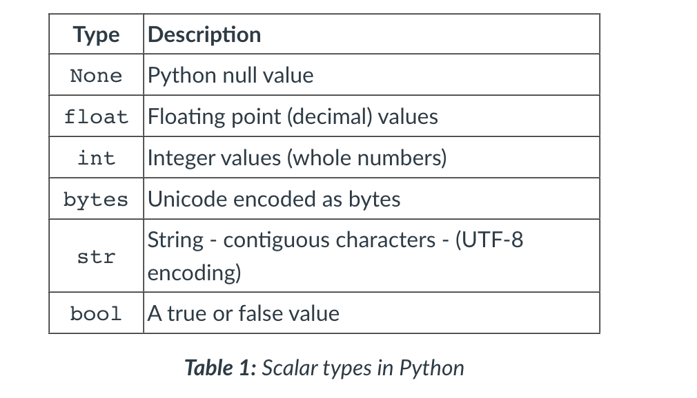
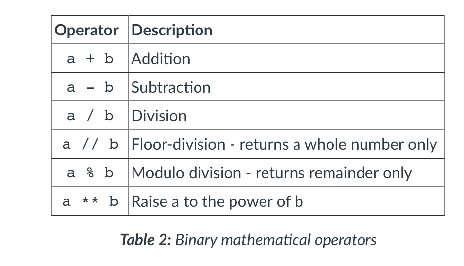
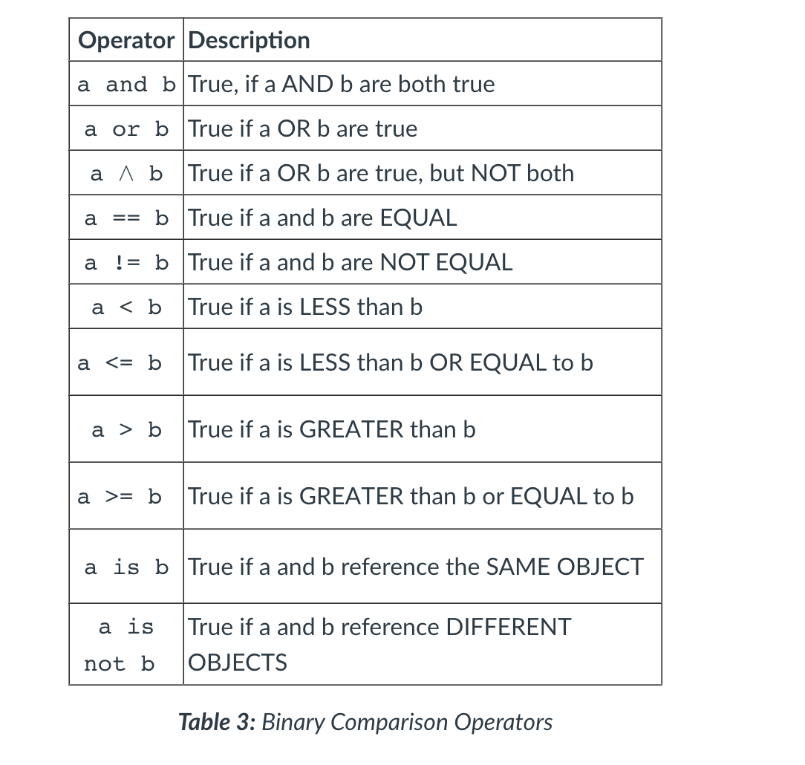
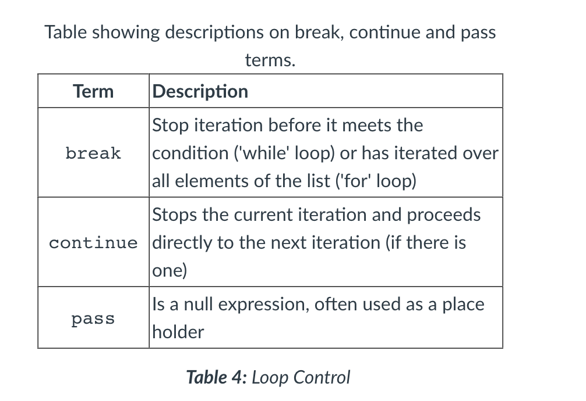
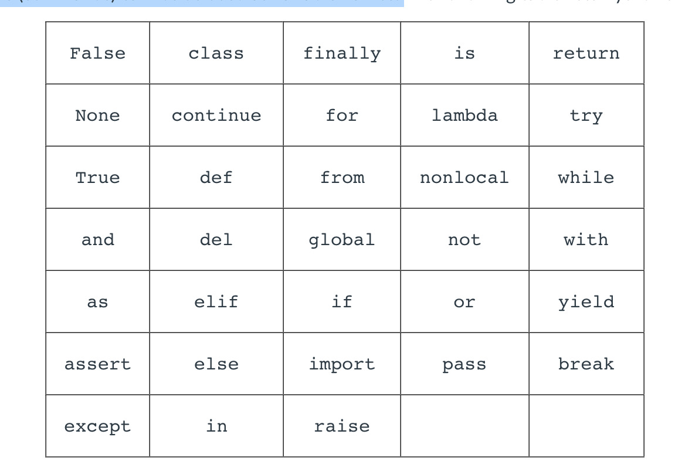
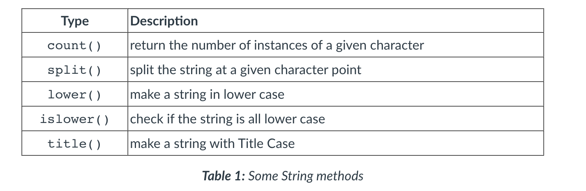
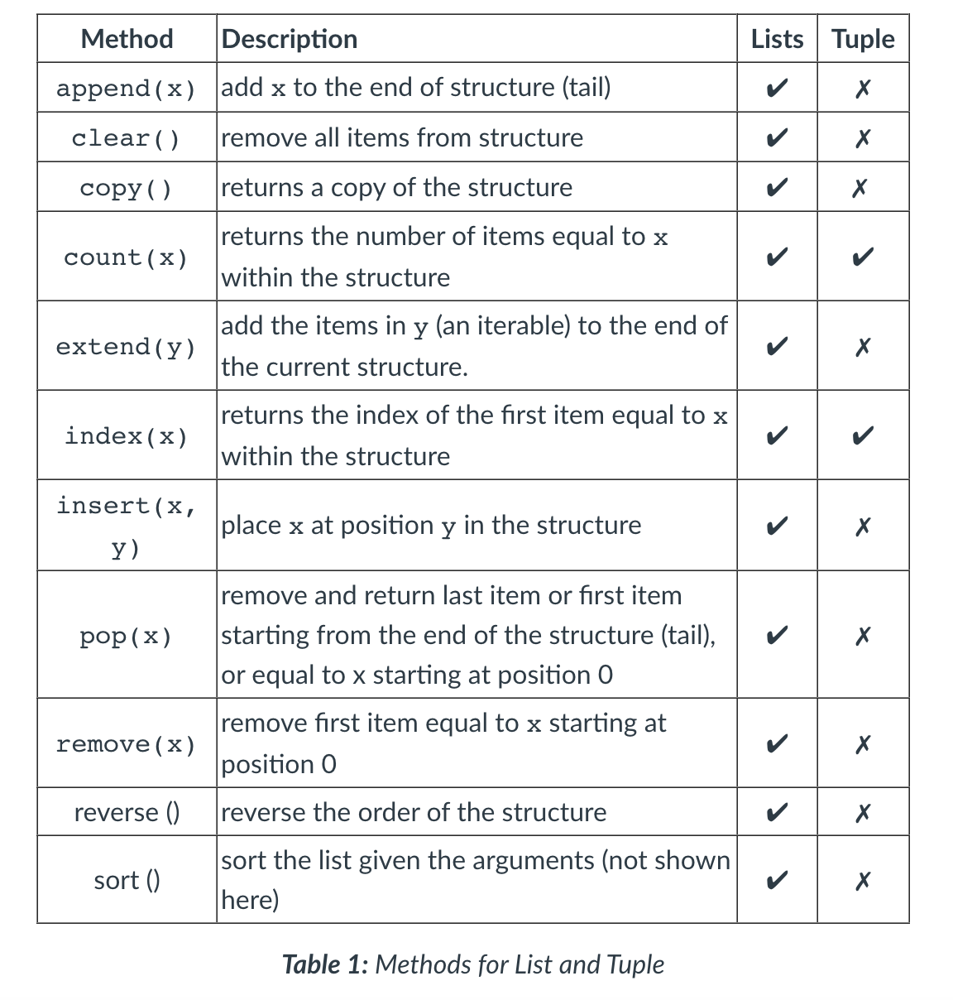
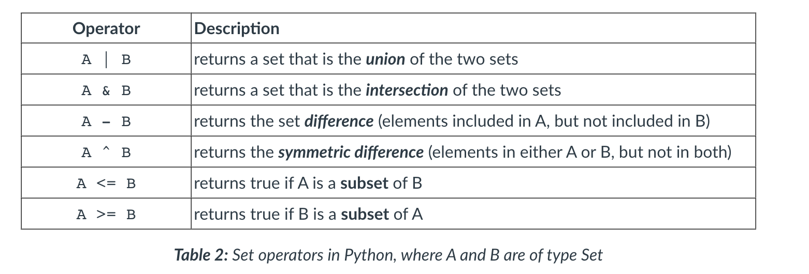
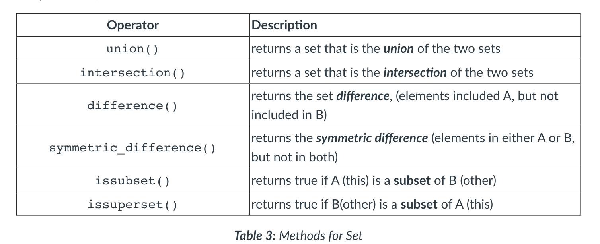
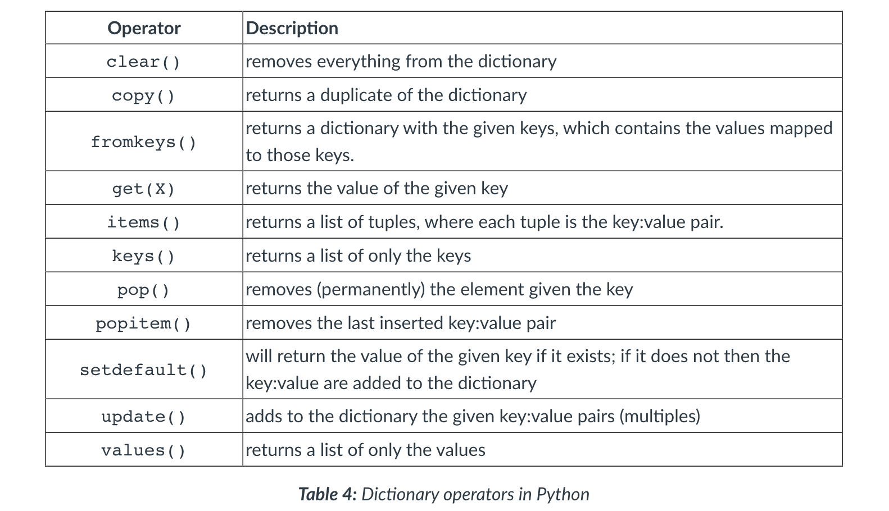

#### Main Topics

#### Sub titles:

# Variables

* There are no primitive types as there are in Java. The closest Python gets to this is a set of single value types
  referred to as 'Scalar types'.
* Unlike in Java, Python does not let you declare variables without assigning a value to them. So variables in Python
  are only declared at the point they are needed and assigned an initial value.
  

```py
  In [5]: num1 = 6
  In [6]: num2 = 105
  In [7]: sum = num1 + num2
  In [8]: product = num1 * num2
  In [9]: quotient = num2 / num1
  In [10]: difference = num1 - num2
  In [11]: print(f"Sum: {sum}, product: {product}")
  Sum: 111, product: 630

  In [12]: print(f"Quotient: {quotient}, difference: {difference}")
  Quotient: 17.5, different: -99
  ```

* The result of integer division (105 / 6) will produce a floating point value as a result. So the variable quotient
  will hold the value 17.5, not 17 as you would get in Java. To get the quotient as a whole number and the remainder
  separately you need to use the following operators:

```
In [13]: wholeNum = 105//6
In [14]: remainder = 105 % 6
In [15]: print(f"Whole number: {wholeNum}, Remainder: {remainder}")
Whole number: 17, Remainder: 3
```

  

# Decision / Conditions

* Python are if, elif and else
* Python is that it uses spaces “ ” (indentation) to define code structures, or 'blocks', whereas Java uses curly braces
  { } for this job.

```
In [1]: num1 = 56                                                     
In [2]: num2 = 37                                                     
In [3]: if num1 > num2:
     ...:     print(f"{num1} is larger than {num2}")
     ...: elif num1 < num2:
     ...:     print(f"{num1} is smaller than {num2}")
     ...: else:
     ...:     print("Both numbers are the same.")
56 is larger than 37

```

## Single line conditions

* do_something_if_TRUE if condition else otherwise do_something_else

## Condition statements



# Loops

* Python has two structures for iteration: a for style loop and a while loop.

*** for loop :**

* renge() : The method range() is used to generate a list of valid values (steps) for each iteration. In Python 3.x the
  range() method returns an immutable sequence of type range, whereas in Python 2.x it returns a List. A common
  misconception is that range() still produces a List type, which is incorrect as range is a type in itself.
    * `range(start, end, steps)`
    * ins sample 3 (inclusive) and ends at 5, making the 6 exclusive.

``` 
  In [1]: for i in range(3,6):                                           
    ...:     print(i)
    ...:     
    3
    4
    5
  ```

* **while loop:**
* The while loop requires a counter defined outside the loop and an increment (or decrement) defined inside the loop

```
In [2]: count = 0
In [3]: while count <= 4:
   ...:     print(count)
   ...:     count += 1
   ...:     
0
1
2
3
4

```

* have an else clause attached at their end

```
 In [4]: while count < 6:
   ...:     print(count)
   ...:     count +=2
   ...: else:
   ...:     print("Finished!")
   ...:      
0
2
4
Finished!
```

* Loop controls
  

# Best Practice

* **Naming conventions:**
    * Variable names should be lower case.
    * Function names should be lower case.
    * Classes and Module names should be in Title Case.
    * Constants should be UPPER CASE with an underscore (_) used for spaces.

* Short variable names such as x, y, i, j are only used in enclosed structures such as a loop.
* All other variable names should clearly define what the variable holds in the context of the program, or function,
  they are defined within.
    * Function names should focus on what the function does and not on how it is implemented.
* Python coders typically use either snake_case or camelCase to differentiate words used in their variable names.
* the keywords (commands) cannot be used as variable names. like below:
  

* **White space:**
    * An expected standard is to use 2 or 4 spaces for indentation. Tabs should generally be avoided as their size
      varies in different IDEs and can be identified as an error by the Python interpreter.
    * Lines of code should not exceed 79 characters.

```
i = x + 1             # clear
i=x+1                 # not so clear

# grouping to make related operators and operands clearer
a = (b+4) * (c-7)           # clear
a = ( b + 4 ) * ( c - 7 )   # not so clear 
```

* Comments:

```
# a single line comment or

# a block comment both use 
# the hash symbol

area = pi * radius**2  #comment after a line of code 
```

# Strings and I/O

* [Python API](https://docs.python.org/3/library/string.html)
* They can be defined using either 'single quotes' or using "double quotes".
* Strings are an index from position 0 and each individual character can be accessed and manipulated using this index.
  The string “blue bird.” is 10 characters long and is an index from 0 to 9.
* Using this index, individual characters can be accessed easily using the square bracket notation [ ]
* Just like Java strings, Python strings are **immutable**; they cannot be changed once created. Even if a method looks
  as if it is adapting an existing string, it is not. It is creating a new one and discarding (in some cases) the old
  one

``` 
In [1]: myString = "Blue Birds."
In [2]: myString[5]
Out[2]: 'B'
```

* This index and the square brackets [] can be used to create a slice (substring) of a string.

``` 
In [3]: endOfString = myString[3:]
In [4]: endOfString
Out[4]: 'e Bird.'
In [5]: middleOfString = myString[3:6]
In [6]: middleOfString
Out[6]: 'e B'
```

* built-in functions:
    * [build in functions](https://docs.python.org/3/library/functions.html)
    * some built-in functions for string
      

## Formatting Strings

* One of the most useful methods that the string object provides is the format() metho
    * 2 ways to use

* .format()

```
In [7]: firstName = "Frank"
In [8]: age = 34
In [9]: "My name is {} and I am {} years old.".format(firstName, age)
Out[9]: 'My name is Frank and I am 34 years old.' 
```

* f placed before the string and the variables are embedded in the {}

```  
In [10]: f"My name is {firstName} and I am {age} years old."
Out[10]: 'My name is Frank and I am 34 years old.'
```

* for numbers

``` 
In [11]: pi = 3.14159
In [12]: rad = 6
In [13]: cir = 2 * pi * rad
In [14]: f"A radius of {rad:.2f}cm gives a circumference of {cir:.2f}cm"
Out[14]: 'A radius of 6.00cm gives a circumference of 37.70cm'

# 42. Formatting numbers, first a float to 2dp, second an integer to 4dp float
print(f"42. I am {myHeight:.2f}m tall and weigh {myWeight:.4f}kg")
```

## Console Output

* print() command

```
In [15]: print("A string:", myString, "A number:", 1567)
A string: Blue Birds. A number: 1567
```

* four keyword arguments that can be placed at the end of the argument list as required. These are sep, end, file and
  flush.
    * For formatting purposes, sep adds a separator between previous arguments (the default is a space), and end changes
      how the output should be terminated (the default is a new line

``` 
In [16]: print(56,78,"pink", sep="*",end="!")
56*78*pink!
```

## Console Input

* The input() method captures and returns anything entered in the console.
* The returned content is always a string, so if integers or floating point values are required by the program, then the
  string will need to be cast to the appropriate type
    * Simply wrap the input() method in either int() or float()

``` 
In [17]: name = input("Name: ")
Name: Frank
In [18]: num1 = int(input(f"{name} please enter a number: "))
Frank please enter a number: 45
In [19]: num2 = int(input("and a second number: "))
and a second number: 67
In [20]: sum = num1 + num2
In [21]: f"{name} the sum of {num1} and {num2} is {sum}."
Out[21]:'Frank the sum of 45 and 67 is 112.'

```

* user try catch

``` 
    try:
        myAge = int(input("Enter your age: "))
    except:
        print("Something has gone wrong")
```

# Lab

* Exercise one
* Write a program that outputs a times table from a given (user entered) integer value. It should start at 2 and output
  only the EVEN multiples. If the user entered the value 13, the even times table would be outputted in the following
  format:

* The even timetable for 13 is:
* 2 times 13 is 26 4 times 13 is 52 6 times 13 is 78 This program should continue until the user chooses to exit. You
  should format this so that the text “times” and “is” is always in the same column. The program should output up to and
  including 20 times the user value.

```
def lab1():
    try:
        inputNumber = int(input("Enter Number: "))
        for i in range(2, 21, 2):
            result = i * inputNumber;
            print(f'{i} times {inputNumber:.2f} is  {result:.2f} ')
    except:
        print("there is a problem")

```

* Exercise two
* In the sample code given for 'Iteration' in 1.1, there is a program for printing out a left-sided triangle of stars.
* Adapt the code to create a right-sided triangle. Adapt the code to output a diamond. Write a menu system so the user
  can choose the left or right-sided triangle, or diamond. Enable the program to take user input for the symbol used to
  generate the pattern and dictate the size of the pattern. The output from the program should look like this:

                                                *
      *                      *                 ***
      **                    **                *****
      ***                  ***                 ***
      ****                ****                  *

Left-sided Right-sided Diamond

``` 

def lab2():
    try:
        selected = int(input("Pres number of types that you want to select :  "
                             "\n 1-Left-sided "
                             "\n 2-Right-sided "
                             "\n 3-Diamond "))
        size = int(input("size :  "))
        text = "\n"
        for x in range(1, size):
            if selected == 1:
                text += str("*" * x) + "\n"
            elif selected == 2:
                text += str(" " * (size - x)) + ("*" * x) + "\n"
            elif selected == 3:
                if x <= size / 2:
                    text += str(" " * (size - x)) + ("*" * x) + (" " * (size - x)) + "\n"
                else:
                    text += str(" " * x) + ("*" * (size - x)) + (" " * x) + "\n"
        print(text)
    except:
        print("there is a problem")
```

* Exercise three
* Write a program that outputs a calendar, given two values inputted by the user. If the user inputs the values of 30
  and 7, the following structure will be produced, where 30 generates the number of days in the month and 7 (
  Sunday) indicates which day of the week the calendar starts on. The user should only be able to input a valid range of
  numbers, and regardless of the values entered the calendar should always output 7 lines (even if some of them are
  blank)
  .

``` 

def lab3():
    try:
        days = int(input("Count of days in a month : "))
        startWeekDay = int(input("Start week day : "))
        print("Calender")
        calender = "M\tT\tW\tTh\tF\tS\tSu"
        print(calender)
        startWeekDay -=1
        text = "\t" * startWeekDay

        for day in range(1, days + 1):
            if startWeekDay % 7 == 0:
                text += "\n"
            text += (str(day) + "\t")
            startWeekDay += 1
        print(text)

    except:
        print("there is a problem")
```

# Data Structure

* Python provides a number of built-in data structures.
* Sequence types include range, lists and tuples and more complex types are dictionaries and sets.

## List[]

* List is mutable
* Can contain a mix of any object.
* To create a list, square brackets [] are placed around comma-separated literals or variables
* A list has an index start at 0
* Negative index (-2) will start from the tail of the list
* List can be used to act as a stack (Last-In-First-Out) but do not make efficient queues (First-In-First-Out) for large
  sets of data.

```
In [1]: myNum = 98
In [2]: myList = [45, 6.78, "Frank", myNum]
In [3]: myList
Out[3]: [45, 6.78, 'Frank', 98]

In [4]: myList[1:3]
Out[4]: [6.78, 'Frank']

In [5]: myList[-2]
Out[5]: 'Frank' 
```

``` 
In [6]: for x in myList:
   ...:     print(x, end="*")
   ...:     
45*6.78*Frank*98*

In [7]: if 'Frank' in myList:   
   ...:     print("Frank, You are in position:", myList.index('Frank'))
   ...:
Frank, You are in position: 2
```

* Lists can contain other lists and therefore create a matrix as shown here (3 lists, each containing 4 elements):

``` 
In [8]: matrix = []
In [9]: num = 1
In [10]: for x in range(1,4):
    ...:     temp = []
    ...:     for y in range(1,5):
    ...:         num *= 2
    ...:         temp.append(num)
    ...:     matrix.append(temp)
    ...:     
In [11]: matrix
Out[11]: [[2, 4, 8, 16], [32, 64, 128, 256], [512, 1024, 2048, 4096]]

```

* If the delimiter is a space, this is the default for the split() method; otherwise, the delimiting character is passed
  as an argument to the split() method. Lists can also be created by joining elements together using the join() method.
  

* When to use:
    * List[] is best used when you are wanting to make frequent changes to the data set.
    * They are more suited to small sets of data as methods such as insert are computationally expensive.
    * If the data contains duplicates, a list is more appropriate than a set{}, and if natural ordering is required
      there are methods to easily enable this.

## Tuple()

* tuples are immutable (cannot be changed).
* Tuples are created using parentheses() and a comma-separated "," list of literals or variables.

``` 
In [12]: myTuple = ("Cat", "Mouse", 56, 78)
In [13]: mySequence = 78,45,56,20
In [14]: type(myTuple)
Out[14]: tuple

In [15]: type(mySequence)
Out[15]: tuple
```

* slice can use

``` 
In [16]: anotherTuple = myTuple[0:2]
In [17]: anotherTuple
Out[17]: ('Cat', 'Mouse')

In [18]: type(anotherTuple)
Out[18]: tuple

In [19]: singleton = (45678,)
In [20]: singleton
Out[20]: (45678,)
```

* When to use:
    * Tuple() is best used when it is imperative that no accidental changes can be made to the data, retaining data
      integrity.
    * Extracting parts as a list[] for manipulation can then be achieved while being assured that the actual data has
      not been changed.
    * They are more suited to large sets of data and can contain duplicates. A sorted list[] (copy) can be generated
      from a tuple().

## Set{}

* Sets are an unordered collection of objects which must be unique (no duplicates)
* Sets are mutable, but can only contain immutable (hashable) objects.

``` 
In [21]: mySet = {'A', '5', 5, "Jam"}
In [22]: mySet
Out[22]: {'5', 5, 'A', 'Jam'}
In [23]: mySet.add(5.0)
In [24]: mySet
Out[24]: {'5', 5, 'A', 'Jam'}
```

* They also have methods for removing individual elements such as pop(), remove() and discard()
  
  
* When to use:
* Set{} should be used when there is a requirement to specifically apply set functions to the data.
* There is a need to ensure that there are no duplicates within the data set, and none can be added.

## Dictionary{K:V}

* Dictionaries are a mapping data structure; they map keys to values (referred to as a 'key-value pair').
* In a dictionary, the key must be unique, but the values do not need to be.
* As with the other data structures, the key and values can be any object and can mix types.

``` 
In [25]: weekdays = {1:"Mon", 2:"Tues", 3:"Wed", 4: "Thur", 5:"Fri"}
In [26]: weekdays
Out[26]: {1: 'Mon', 2: 'Tues', 3: 'Wed', 4: 'Thur', 5: 'Fri'}
```


* When to use:
* Dictionary{K:V} is best used when you want to map a set of objects to a set of identifiers.
* They are highly versatile and the built-in functionality makes it easy to extract and sort both keys and values.

## Conversions

* Python has a number of methods that help with converting between data structures and other object types, such as
  strings
* The zip() method can be used to combine two iterable objects together.
    * For example, two lists could be combined to form a dictionary, where one list is acting as the key and the other
      as the value.
    * This produces a list of tuples that each contain a pair of objects, which can then be cast using the dict()
      constructor (short for dictionary). The following demonstrates this:

``` 
In [27]: nums = list(range(1,9,2))
In [28]: nums
Out[28]: [1, 3, 5, 7]

In [29]: names = ["Jan", "Sam", "Pam", "Joe"]
In [30]: numNames = zip(nums,names)
In [31]: listTuples =list(numNames)
In [32]: listTuples
Out[32]: [(1, 'Jan'), (3, 'Sam'), (5, 'Pam'), (7, 'Joe')]
In [33]: dictNames = dict(listTuples)
In [34]: dictNames
Out[34]: {1: 'Jan', 3: 'Sam', 5: 'Pam', 7: 'Joe'}

```

* If the two iterables are not equal in size the returns structure will be paired to the smaller of the two and the rest
  discarded.
* Once a zipped object is unzipped, its contents are gone.

* packing

``` 
In [35]: fruit = ["apple", "pear", "banana", "grapefruit"] #Packing
In [36]: a,*b,c = fruit #Unpacking
In [37]: print(a, b, c)
apple ['pear', 'banana'] grapefruit
```

* The asterisk (*) in line 36 can be interpreted as “and the rest” and is performing a mini-repack.

# Activity 4: Data structures

* Using an appropriate Python data structure, implement two programs that demonstrate the behaviour of a stack (LIFO)
  queue (FIFO). For each program, you should create a menu system to enable the user to manipulate the structure, and
  the program should keep running until the user chooses to exit. An example menu for a stack would be:
``` 
1. Push
2. Pop
3. View

```


# TODO:

* McKinney W. (2017) Python for Data Analysis. 2nd Ed. O'Reilly Media - Chapter 2
* Lee K. D. (2014) Python Programming Fundamentals. 2ndEd. Undergraduate Topics in Computer Science. Springer, Cham. pp
  39-61
* Lee K. D. (2014)Python Programming Fundamentals. 2nd Ed. Undergraduate Topics in Computer Science. Springer, Cham, pp
  63-89.
* [Pep8 guide](https://peps.python.org/pep-0008/)
* Padmanabhan T. R. (2016) Programming with Python. Undergraduate Topics in Computer Science. Springer, Cham. pp 137-174
* Beazley. D. Jones B. K.  (2013) Python Cookbook. 3rd Ed. O'Reilly Media pp 1-36
* Stephenson B. (2014) The Python Workbook. A Brief Introduction with Exercises and Solutions. Springer, Cham. pp 49-60,
  and 61-67

