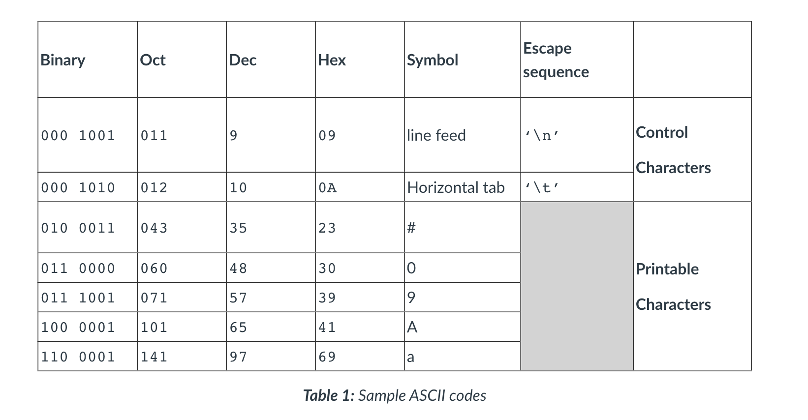
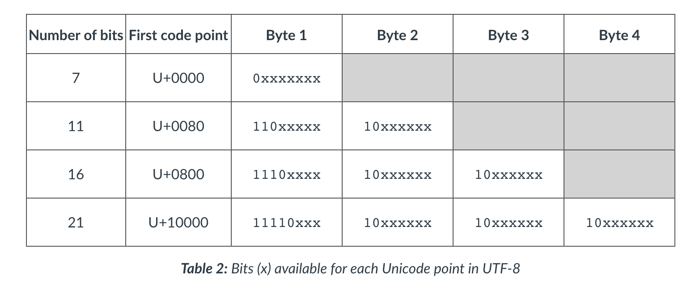
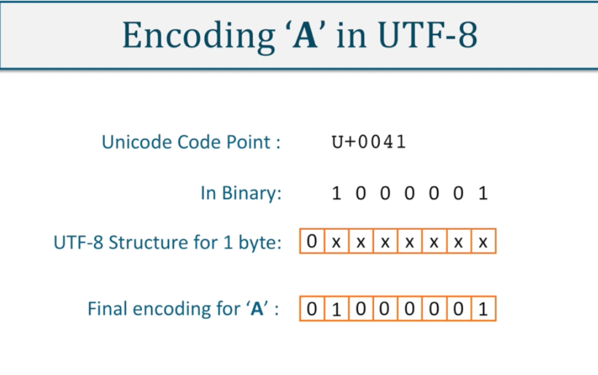
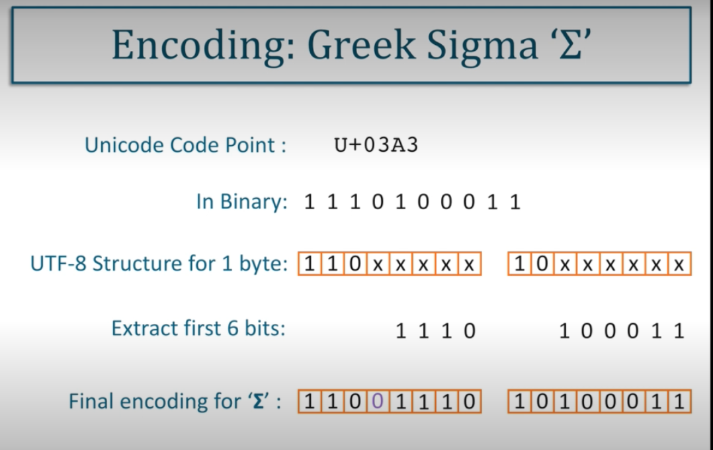

#### Main Topics

#### Sub titles:

# Data encoding

## Binary

* All computers communicate using binary (base 2) at the lowest level.
* However, as this is very difficult for humans to understand when it is in long strings, it is represented in blocks of
  bits called bytes: 01100001 is a single byte. Even with spaces between each byte, it can still be challenging to read
  as well as taking up a lot of physical space.
* Therefore, binary values are more frequently written in Octal (base 8)
  or Hexadecimal (base 16).

## Encoding vs Format

* Encoding is the way in which each symbol is represented by the computer
* The data’s format is the way strings of symbols are arranged within a file and whether or not there is any extra
  information or structure to them (metadata)
* For example: A string containing “a,m,x” has both encoding and format.
    * **Encoding**: Each symbol could be represented as an 8-bit binary code. So a = 01100001, m = 01101101, x =
      01111000 and the comma = 101100. Notice these are all lower case characters; the upper case equivalents would have
      a different code.
    * **Format**: Each of the letters "a", "m", "x" are separated by a comma which is acting as a separator (
      delimitator) between each character, and is adding structure to the string.
        * This type of formatting is used to separate words, sentences and values in whole documents and is referred to
          as Comma Separated Values or CSV for short.
        * Files with a .CSV extension are in this format and can be read by spreadsheet applications such as Microsoft
          Excel.

* These terms “encoding” and “format” can often be used to mean either low-level symbol representation or high-level
  structure of data, and in some cases both.

## ASCII

* One of the most common encoding standards is ASCII (American Standard Code for Information Interchange), which was
  first released in 1963.
* ASCII uses a 7-bit binary sequence, giving a maximum of 128 code points which are used to encode alphanumeric
  characters, punctuation and codes for non-printable control charters such as a cage return (‘\n’).
* This is a very small set of encoded symbols, and it was realised fairly early on that a more extensive and flexible
  system was needed
  

* ASCII is the default encoding in HTML 4.01, which is still used in about 5% of web pages. Python 2.X’s default
  encoding is ASCII

## Unicode

* The Unicode standard provides both a structuring system and an encoding system, unlike ASCII, that enables consistency
  and extensibility.
* Unicode logically groups symbols into character sets; for example, the capital letter A is part of Basic Latin. Each
  character set is allocated a range of values, with Basic Latin occupying the range 0000–007F (Hexadecimal)
* Unicode code points all have the prefix U+ and are represented as a hexadecimal value. For example, the upper case
  Basic Latin symbol A is represented by U+0041

### Universal Coded Character Set (UCS)

* Like Unicode, UCS provides an organised structure for mapping symbols to code points and is defined by the
  International Standard ISO/IEC 10646 (Links to an external site.). The code points for each symbol in this standard
  are identical to those defined in Unicode, and the two organisations ensure this compatibility.

* As with Unicode, UCS is only concerned with the mapping of symbols, and unlike Unicode, provides no additional
  attributes for symbols. The encoding is left to other formats, some of which are defined within the UCS standard.
  These include UCS-2, UTC-16 and UCS4. However, UTF-8 is more frequently used for encoding UCS.

## UTF-8

* One of the reasons for its popularity is its compatibility with ASCII, as it preserves the ASCII code values, making
  translation fairly straightforward.
* UTF-8 is a variable length encoding system which uses a minimum of one byte when encoding low code points, with up to
  four bytes are available for symbols with higher code point values. Unicode restricts the number of bits used for
  encoding to twenty-one, which leaves a number of “padding bits” in each byte used.
  
  
  

## UTF-16 and UTF-32

* UTF-16 is a 16-bit variable length encoding form, which uses a minimum of two bytes.
* Whereas UTF-8 can encode the first 128 symbols in one byte, UTF-16 will use two.
* So the capital letter A is represented as 01000001 in UTF-8, and it will be represented by 00000000 01000001 in UTF16
* This is not as widely used as UTF-8, but provides the encoding for larger systems such as operating systems like
  Microsoft Windows, and high-level languages like Java. Very few documents or web-pages use this encoding system.

* UTF-32 is even less popular, and uptake of this standard is generally regarded as being very poor. It is a fixed
  length encoding form and uses 4 bytes (32bits) to encode the 21 maximum bit representation of each Unicode symbol.

# TODO

* Padmanabhan T. R. (2016) Programming with Python. Undergraduate Topics in Computer Science. Springer, Cham Sections:
  7.1-7.2
* Beazley. D., Jones B. K.  (2013) Python Cookbook. 3rd Ed. O'Reilly Media, Sections: 6.9-6.10