#### Main Topics

#### Sub titles:

# Data encoding

## Binary

* All computers communicate using binary (base 2) at the lowest level.
* However, as this is very difficult for humans to understand when it is in long strings, it is represented in blocks of
  bits called bytes: 01100001 is a single byte. Even with spaces between each byte, it can still be challenging to read
  as well as taking up a lot of physical space.
* Therefore, binary values are more frequently written in Octal (base 8)
  or Hexadecimal (base 16).

## Encoding vs Format

* Encoding is the way in which each symbol is represented by the computer
* The data’s format is the way strings of symbols are arranged within a file and whether or not there is any extra
  information or structure to them (metadata)
* For example: A string containing “a,m,x” has both encoding and format.
    * **Encoding**: Each symbol could be represented as an 8-bit binary code. So a = 01100001, m = 01101101, x =
      01111000 and the comma = 101100. Notice these are all lower case characters; the upper case equivalents would have
      a different code.
    * **Format**: Each of the letters "a", "m", "x" are separated by a comma which is acting as a separator (
      delimitator) between each character, and is adding structure to the string.
        * This type of formatting is used to separate words, sentences and values in whole documents and is referred to
          as Comma Separated Values or CSV for short.
        * Files with a .CSV extension are in this format and can be read by spreadsheet applications such as Microsoft
          Excel.

* These terms “encoding” and “format” can often be used to mean either low-level symbol representation or high-level
  structure of data, and in some cases both.

## ASCII

* One of the most common encoding standards is ASCII (American Standard Code for Information Interchange), which was
  first released in 1963.
* ASCII uses a 7-bit binary sequence, giving a maximum of 128 code points which are used to encode alphanumeric
  characters, punctuation and codes for non-printable control charters such as a cage return (‘\n’).
* This is a very small set of encoded symbols, and it was realised fairly early on that a more extensive and flexible
  system was needed
  

* ASCII is the default encoding in HTML 4.01, which is still used in about 5% of web pages. Python 2.X’s default
  encoding is ASCII

## Unicode

* The Unicode standard provides both a structuring system and an encoding system, unlike ASCII, that enables consistency
  and extensibility.
* Unicode logically groups symbols into character sets; for example, the capital letter A is part of Basic Latin. Each
  character set is allocated a range of values, with Basic Latin occupying the range 0000–007F (Hexadecimal)
* Unicode code points all have the prefix U+ and are represented as a hexadecimal value. For example, the upper case
  Basic Latin symbol A is represented by U+0041

### Universal Coded Character Set (UCS)

* Like Unicode, UCS provides an organised structure for mapping symbols to code points and is defined by the
  International Standard ISO/IEC 10646 (Links to an external site.). The code points for each symbol in this standard
  are identical to those defined in Unicode, and the two organisations ensure this compatibility.

* As with Unicode, UCS is only concerned with the mapping of symbols, and unlike Unicode, provides no additional
  attributes for symbols. The encoding is left to other formats, some of which are defined within the UCS standard.
  These include UCS-2, UTC-16 and UCS4. However, UTF-8 is more frequently used for encoding UCS.

## UTF-8

* One of the reasons for its popularity is its compatibility with ASCII, as it preserves the ASCII code values, making
  translation fairly straightforward.
* UTF-8 is a variable length encoding system which uses a minimum of one byte when encoding low code points, with up to
  four bytes are available for symbols with higher code point values. Unicode restricts the number of bits used for
  encoding to twenty-one, which leaves a number of “padding bits” in each byte used.
  </br></br>
  </br>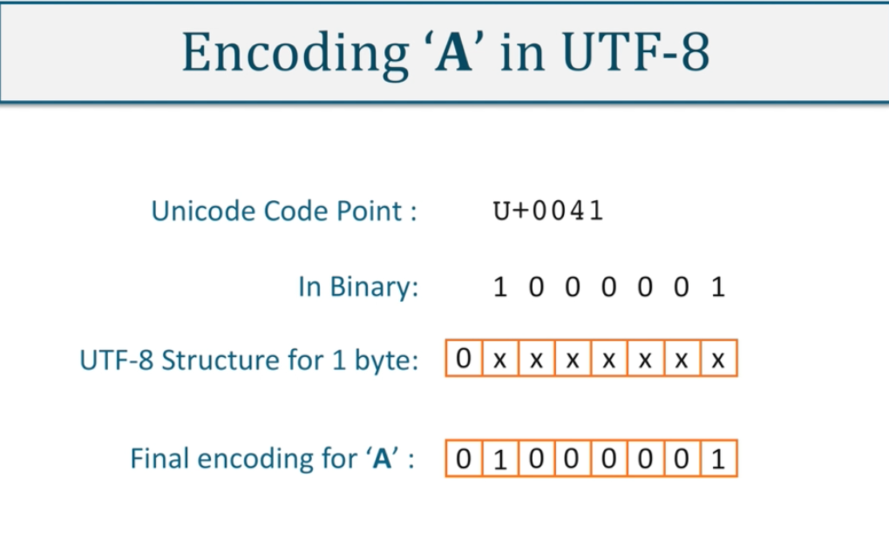</br>
  </br></br>

## UTF-16 and UTF-32

* UTF-16 is a 16-bit variable length encoding form, which uses a minimum of two bytes.
* Whereas UTF-8 can encode the first 128 symbols in one byte, UTF-16 will use two.
* So the capital letter A is represented as 01000001 in UTF-8, and it will be represented by 00000000 01000001 in UTF16
* This is not as widely used as UTF-8, but provides the encoding for larger systems such as operating systems like
  Microsoft Windows, and high-level languages like Java. Very few documents or web-pages use this encoding system.

* UTF-32 is even less popular, and uptake of this standard is generally regarded as being very poor. It is a fixed
  length encoding form and uses 4 bytes (32bits) to encode the 21 maximum bit representation of each Unicode symbol.

# File formats

* Files are used or generated by programs for three main reasons:
    * Data back-up: the program simply needs a way to store data/settings when it is closed so it can resume with that
      data.
    * Data input: the quantity of data that needs to be inputted into a program is too vast to be undertaken by hand via
      a user interface.
    * Data consumption: the results the program produces need to be made available for human consumption or transferred
      to other applications for further processing.

## Structured vs unstructured data

* **Unstructured data**, there is generally more flexibility in what it can contain, but there is little organisation of
  the data and no semantic information (metadata). Plain text .txt and .CSV files are examples of this.
* **Structured data** contains embed semantics about what the data is and how it is related to other bits of data.
  Relational databases such as MySQL or Oracle provide a sophisticated level of structure, organisation and
  relationships.
* **Semi-structured data** can be achieved in files using various mark-languages such as XML (eXtensible Mark-up
  Language) and OWL (Web Ontology Language). These provide a degree of semantics and/or metadata. HTML (Hypertext
  Mark-up Language) is perhaps the most prolific file format in use today, which provides the browser with structural
  information about the data, with CSS (Cascading Style Sheets) providing layout instructions for that structure.

## MetaData

* One of the key advantages of using structured or semi-structured data is that it provides information about that data.
* The term metadata means “data about data” and is used to refer to this sort of information.
    * For example, the string “79 North Goldfield Avenue.” is just a collection of characters to a computer. However, if
      we provided some metadata around the string such as <address>“79 North Goldfield Avenue.”</address> some meaning (
      in a rudimentary way) can be inferred by the computer, or more specifically, by the program being run on the
      computer.
* This type of metadata is referred to as 'mark-up'. Other forms of metadata exist such as the creation and last edited
  date stamps generated by Microsoft word documents.

## Plain txt

* Plain text files are exactly that - no formatting, no styling, just a string of symbols.

## docX

* Document files like those produced by word processors (MS Word, Pages and OpenOffice) contain extra information to
  give the contents structure and style. They also have metadata attached about the creation and editing of the file.
  Previous versions of this file type .doc use a proprietary format from Microsoft which requires a specific parser to
  handle. The current version .docX is based on XML, making it much easier to access and manipulate in non-Microsoft
  applications.

# Comma Separated Values .CSV

* This is a common file structure used for large data sets requiring little or no semantic information or metadata
  </br></br>
  </br></br>
  </br>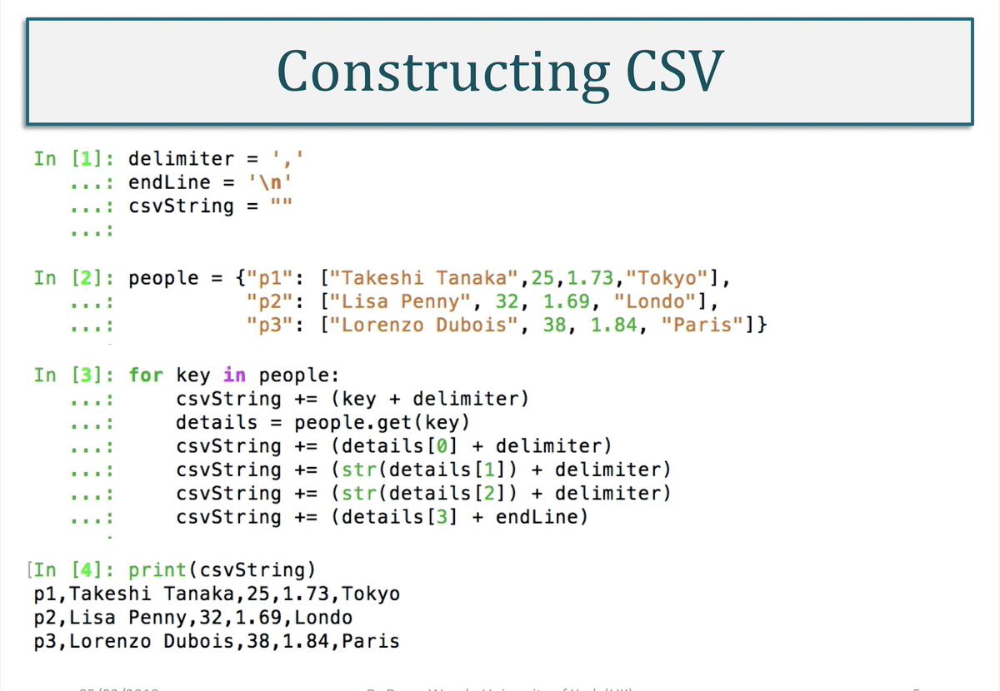</br>

# eXtensible Mark-up Language .XML

* XML was developed in the 1970's and is a language that is able to describe data in many ways, providing strong
  semantic information, and other metadata.
* However, it is often perceived as difficult to handle and overly complex. Many common formats such as HTML and .docX
  have been derived from XML’s approach to structuring documents.
* XML validation:
* The first, a DTD, known as a Document Type Definition is a simple set of syntax for describing the relationship
  between parent and child elements, and which attributes belong to which tags. The second method for validation is to
  use an XML Schema. This is a validation document that is itself written in XML. This enables it to be highly
  extensible and take advantage of the XML structure. It is much easier to maintain than a DTD. Both these documents, a
  DTD and XML Schema serve the purpose of being used by a program to validate the correctness of an XML document  
  </br>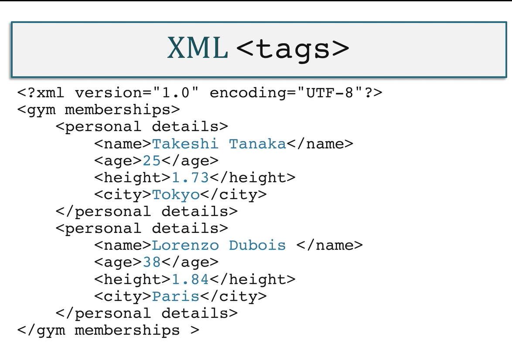</br>
  </br></br>
  </br>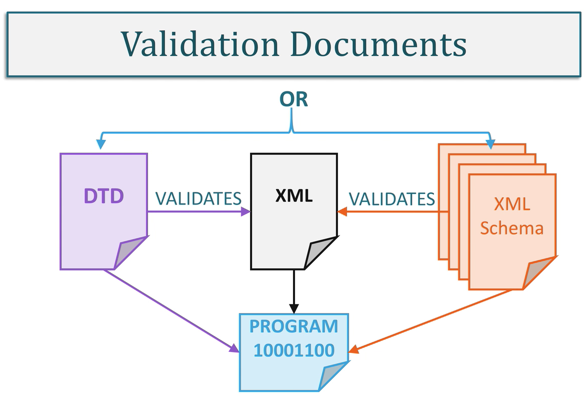</br>
  </br>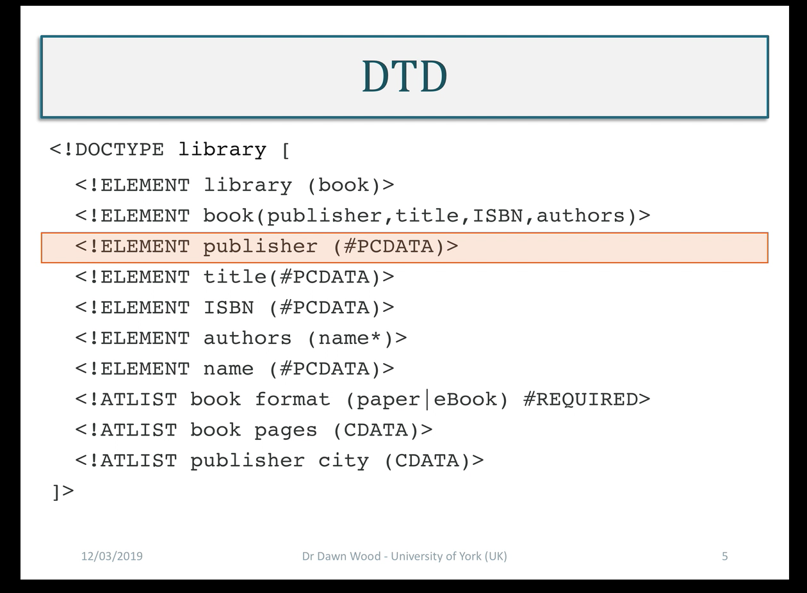</br>
  </br></br>
  </br>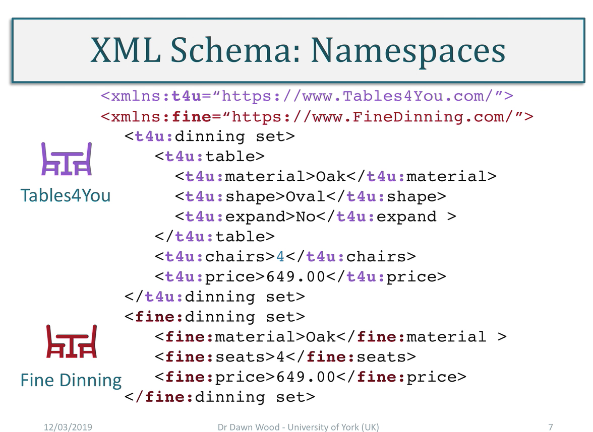</br>
  </br>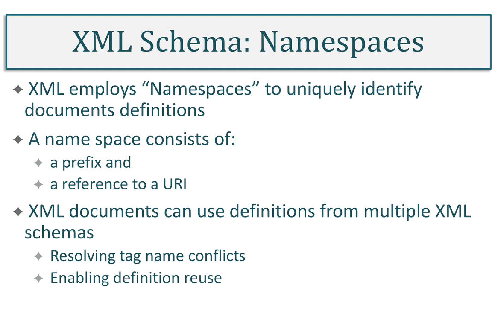</br>
  </br></br>
  </br>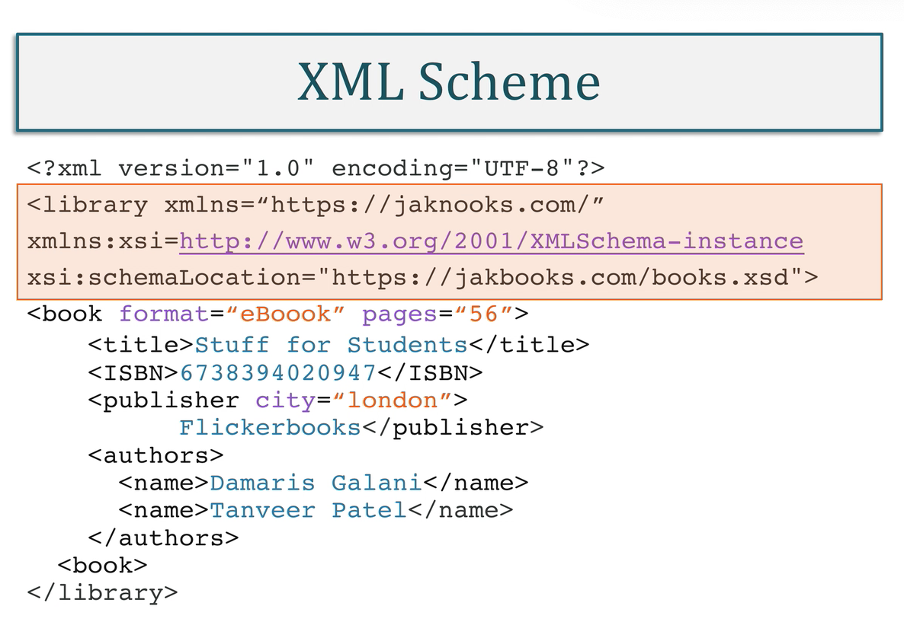</br>
  </br></br>

## JavaScript Object Notation .JSON

* JSON was developed in response to the growing need for a lightweight data transfer structure in asynchronous internet
  communications.
* Originally designed to work with JavaScript it now has a growing following, and support for it has been developed in
  many other languages, including Python.

## .yaml

* YAML Ain't Markup Language (Links to an external site.) (a recursive acronym) is similar in many ways to JSON in being
  lightweight and breaking away from the complexity of languages like XML.
* It extends the functionality of JSON by providing structures like Maps. Like Python, indentation is used to provide
  structure and meaning within the syntax, making this a human-readable format
  </br></br>
  </br>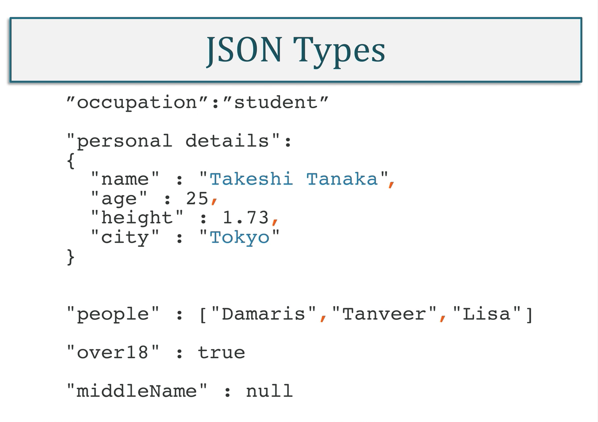</br>

## HDF5 format

* This file format is specifically designed for storing large quantities of scientific data, within groups and
  subgroups. While not in general use compared to some of the above file formats it is used with specialist areas of
  science. HDF stands for hierarchical data format. This format provides the facility for metadata and is designed to
  support data compression.

# File input and output

## Relative and Absolute Paths

* There are two ways to define a path to a file or folder.
    * Absolute path: the whole folder structure is given, starting at the root/drive element.
        * “C:Work\Uni\Code\File.txt”
    * Relative path: a path is defined from the perspective of the current position in the path.
        * “File.txt”
        * To get to it from a relative perspective the program has to go up one level to Code and then back down into
          data to get to the file. To do this the relative path starts with ../ to indicate the jump up the structure.
        * “..\Data\File.txt”

</br></br>

## Hidden characters

* The lesson on encoding demonstrated that key strokes such as tabs and line feeds (LF) are all present as symbols
  within the text. These characters are invisible when a text file is viewed in a standard text editor. They are often
  referred to as non-printing characters. However, they are an important part of the structure of the document and a
  symbol that can be identified within a text file by a program, given its encoding.

## Reading from a file

* To read from a file the open() command is used, which returns a file object.

```
open(file, mode, buffering, encoding, errors, newline, closefd, opener) 
```

* The first parameter is the path of the file and is always required.
* The default value for mode is ‘r’, which is used when no explicit flag is given.
* The third parameter is an integer value that indicates whether or not a buffer will be used.
* Text files default to 1, line buffering. Other possible values are given BELOW

``` 
In [1]: file = open("Pop_Goes_The_Weasel.txt")
In [2]: file.readline()
Out[2]: 'Half a pound of tuppenny rice,\n'

In [3]: file.readline()
Out[3]: 'Half a pound of treacle.\n
```

* The whole file can be read at once by using the read() function as demonstrated here:

``` 
In [4]: file = open("Pop_Goes_The_Weasel.txt")
In [5]: file.read()
Out[5]: 'Half a pound of tuppenny rice,\nHalf a pound of treacle.\nThat’s the way the money goes,\nPop! goes the weasel.\n'
```

* The method read() can take an integer parameter that indicates how many characters to read in at a time:

``` 
In [8]: file = open("Pop_Goes_The_Weasel.txt")
In [9]: print(file.read(10))
Half a pou
```

* The file object can also be passed to a 'for loop' to iterate over each line at a time (perform multiple reads) and
  stop when it reaches the end of the file:

``` 
In [10]: file = open("Pop_Goes_The_Weasel.txt")
In [11]: for line in file:
    ...:     temp = line.rstrip('\n')
    ...:     print(f"** {temp:32}  **")
    ...:
** Half a pound of tuppenny rice,    **
** Half a pound of treacle.          **
** That’s the way the money goes,    **
** Pop! goes the weasel.             **
```

## Writing to a file

* To write to a file the same function is called, open(), but this time a mode must be indicated.
* When writing to a file there are four possible actions that may need to be performed:
    * Start writing at the beginning of a file, with all existing content being overwritten.
    * Start writing at the beginning of a new (empty) file.
    * Start writing at the end of an existing file
    * Start writing at a specific point within a file, so some existing content is kept, and some is overwritten.

* The returned value 28 indicates how many characters were written to the file.
* The code below completes as the file “Humpty_Dumpty.txt” does not exist, so a new one is created and then written too.

``` 
In [12]: file = open("Pop_Goes_The_Weasel.txt", 'w')
In [13]: file.write("Humpty Dumpty sat on a wall.")
Out[13]: 28


In [17]: file = open("Humpty_Dumpty.txt", 'w')
In [18]: file.write("Humpty Dumpty sat on a wall.")
Out[18]: 28

In [19]: file.write("Humpty Dumpty had a great fall.")
Out[19]: 31

In [20]: file.write("All the king's horses and all the king's men")
Out[20]: 44

In [21]: file.write("Couldn't put Humpty together again.")
Out[21]: 35

In [22]: file.close()

```

* The second action is slightly more complicated as there is a need to check if the file exists so that data is not
  accidentally erased. Fortunately, Python has been designed to accommodate this and comes with an exclusive flag ‘x’
  that fails to write if the file exists:
    * In the example above, the code throws an exception, FileExistsError, as the file exists.

```
In [16]: file = open("Pop_Goes_The_Weasel.txt", 'x')
-------------------------------------------------------------------------

FileExistsError                           Traceback (most recent call last)
<ipython-input-45-f7523625772f> in <module>()
----> 1 file = open("Pop_Goes_The_Weasel.txt", 'x')

FileExistsError: [Errno 17] File exists: 'Pop_Goes_The_Weasel.txt
```

* The third action, **appending (retain the existing file content and add more to it) to the end of an existing file**,
  uses the character flag ‘a’.
    * However, here the file has to exist and if it does not a FileNotFoundError exception will be generated.

``` 
In [23]: file = open("Humpty_Dumpty.txt", 'a')
In [24]: file.write("Half a pound of tuppenny rice,\n")
Out[24]: 31

In [25]: file.write("Half a pound of treacle.\n")
Out[25]: 25

In [26]: file.close()
In [27]: file = open("Humpty_Dumpty.txt")
In [28]: for line in file:
    ...:     print(line)
    ...:     
Humpty Dumpty sat on a wall.
Humpty Dumpty had a great fall.
All the king's horses and all the king's men
Couldn't put Humpty together again.
Half a pound of tuppenny rice,
Half a pound of treacle.
```

* Depending on what the program requires, there may be a need to temporarily store parts of the file, or use regular
  expressions (see lesson 5) to find, change or extract parts of the file.
* Here is an example that keeps the first two lines of the new nursery rhyme and adds two (overwriting the existing
  content) from the previous nursery rhyme.

```
In [29]: file = open("Pop_Goes_The_Weasel.txt", 'r+')
In [30]: print("File pointer: ", file.tell())
File pointer:  0

In [31]: for line in file:
   ...:     print(line)
   ...:     
Half a pound of tuppenny rice,
Half a pound of treacle.
That's the way the money goes,
Pop! goes the weasel.

In [32]: print("File pointer: ", file.tell())
File pointer:  109

In [33]: file.seek(56,0)
Out[33]: 56

In [34]: file.write("All the king's horses and all the king's men\n")
Out[34]: 45

In [35]: print("File pointer: ", file.tell())
File pointer:  101

In [36]: file.write("Couldn't put Humpty together again.\n") 
Out[36]: 36

In [37]: print("File pointer: ", file.tell())
File pointer:  137

In [38]: file.seek(0,0)
Out[38]: 0

In [39]: for line in file:
    ...:     print(line)
    ...:    
Half a pound of tuppenny rice,
Half a pound of treacle.
All the king's horses and all the king's men
Couldn't put Humpty together again.
```

## Binary access

* To access the file in binary mode the ‘b’ flag needs to be set, followed by read(‘r’), write(‘w’) or both (‘+’), as
  demonstrated below.
* Reading a byte from a text file produces text when outputted. The small b before the character indicates that this is
  a translation from a byte.

``` 
In [40]: file = open("Pop_Goes_The_Weasel.txt", 'br')
In [41]: for line in file:
   ...:     print(line)
   ...:    
In [42]: print(file.read(1))
b'H'
```

## Closing a File

* Opening a file for any type of read or write operations takes up system resources. These resources are unavailable for
  any other application running on the same system while the program is using them.
    * 2 ways to close
        * ``` In [43]: file.close() ```
        * With

``` 
      In [44]:  with open("Pop_Goes_The_Weasel.txt") as file:
    ...:     for line in file:
    ...:        print(line, end="")
    ...:           
    Half a pound of tuppenny rice,
    Half a pound of treacle.
    That's the way the money goes,
    Pop! goes the weasel. 
```

# Exception handling

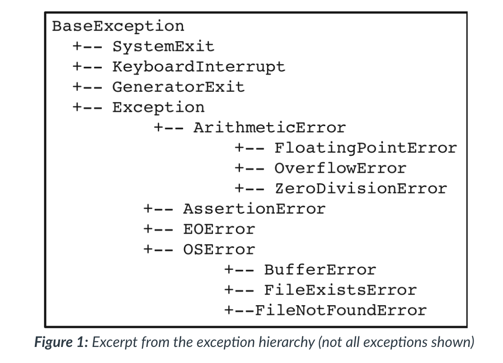

* Try … except statement
    * the except statement is excepting all and any exceptions

```   
In [47]: fileName = "myFile.txt"
In [48]: try:
...:     file = open(fileName)
...: except:
...:     print("An I/O error has been generated.")
...:     
An I/O error has been generated.
```

* This will catch spesific exceptions

``` 
In [49]: import sys
    ...: fileName = "Humpty_Dumpty.txt"
    ...: try:
    ...:     file = open(fileName)
    ...:     line = file.read()
    ...:     words = line.split()
    ...:     value = int(words[0])
    ...: except FileNotFoundError:
    ...:     print("The file does not exist")
    ...: except ValueError:
    ...:     print("That is not a number")
    ...: except OSError as err:
    ...:     print("OS error: {0}".format(err))
    ...: except:
    ...:     print("Unexpected Error", sys.exc_info()[0])
    ...:     
That is not a number
```

* Optional else.. finally

``` 
In [50]: fileName = "Humpty_Dumpty.txt"
    ...: try:
    ...:     file = open(fileName)
    ...: except FileNotFoundError:
    ...:     print("The file does not exist")
    ...: else:
    ...:     for line in file:
    ...:         print(line, end="")
    ...: finally:
    ...:     print("\nClosing file")
    ...:     file.close()
    ...:     
All Humpty Dumpty sat on a wall.
Humpty Dumpty had a great fall.
All the king's horses and all the king's men
Couldn't put Humpty together again.
Closing file


In [51]: fileName = "MissingFile.txt"
    ...: try:
    ...:     file = open(fileName)
    ...: except FileNotFoundError:
    ...:     print("The file does not exist")
    ...: else:
    ...:     for line in file:
    ...:         print(line, end="")
    ...: finally:
    ...:     print("\nClosing file")
    ...:     file.close()
    ...:     
The file does not exist
Closing file
```

## Re-raising an exception

* Java provides the throw andthrows keywords to enable errors to be passed back to the point the method is called.
  Python does not enable this but does allow exceptions to be raised manually within the code, without an error having
  occurred.

``` 
In [52]: import sys
    ...: fileName = "MissingFile.txt"
    ...: try:
    ...:     file = open(fileName)
    ...: except BaseException as err:
    ...:     print("Unexpected Error caught: ", err)
    ...:     print("then passed else where")
    ...:     raise err
Unexpected Error caught:  [Errno 2] No such file or directory: 'MissingFile.txt'
then passed else where
--------------------------------------------------------------------
FileNotFoundError                       Traceback (most recent call last)
<ipython-input-17-4eebae96f330> in <module>()
      6     print("Unexpected Error caught: ", err)
      7     print("then passed else where")
----> 8     raise err
```

## User-defined exceptions

* The base class for user-defined exceptions is the Exception class which should be used as the parent for new
  generalised exceptions. It is best practice that these classes are named with names that end with Error to clearly
  identify them.

## Assertions

* An assertion is simply a test of some condition, which throws an error if the condition returns false. In Python the
  assertion statement has the following structure:
  ``` assert condition, “optional message” ```

``` 
In [53]: num = 9
In [54]: num2 =20
In [55]: assert (num > num2), "num is too small"
--------------------------------------------------------------------
AssertionError                          Traceback (most recent call last)
<ipython-input-8-d7d11f55a261> in <module>()
----> 1 assert (num > num2), "num is too small"
AssertionError: num is too small
```

# Regular expressions

* A regular expression (regex for short) is a system of symbols (metacharacters) and rules that enable sophisticated
  pattern matching within text. Regex is used to find specific parts (one or many) of text or to find and replace parts
  of text. Each regex pattern and the string it is to be applied to is submitted to a sophisticated pattern matching
  engine that is optimised for these types of tasks.

## Revisiting Strings

* Python provides a range of string functions that do basic pattern matching and string manipulation such as:
* .format()Recall that format() or f (at the beginning of a string) enables some simple formatting instructions to be
  applied such as:
    * replacing a part of a string with contents of a variable
    * adding space (width) within strings
    * outputting values to given decimal places.
* .split() Enables a string to be broken into parts and given a delimitator which can be a character or a string to be
  matched.
* .isalnum() A Boolean check for whether or not the string is alphanumeric. There is a range of isX() functions testing
  capitalisation, for spaces, etc. These are worth exploring for basic string testing.
* .replace() Returns a string where a given string pattern is replaced by a second string pattern.

## Python re library

* The python re library provides support for regular expressions. Most of the functions for applying a regex to a string
  require at least the pattern string (regex) and the string to be analysed, passed as parameters.
* The library also provides a series of flags (optional) which can be used with most of the functions, which enables the
  adjustment of pattern matching engine’s interpretation of some of the regex metacharacters
  

## Constructing a regular expression

* Before applying these functions, a regular expression needs to be constructed. Regular expressions are simply strings
  denoting a pattern that needs to be matched by the pattern matching engine. To find a word the matching engine just
  needs the sequence of characters that represent that word.
  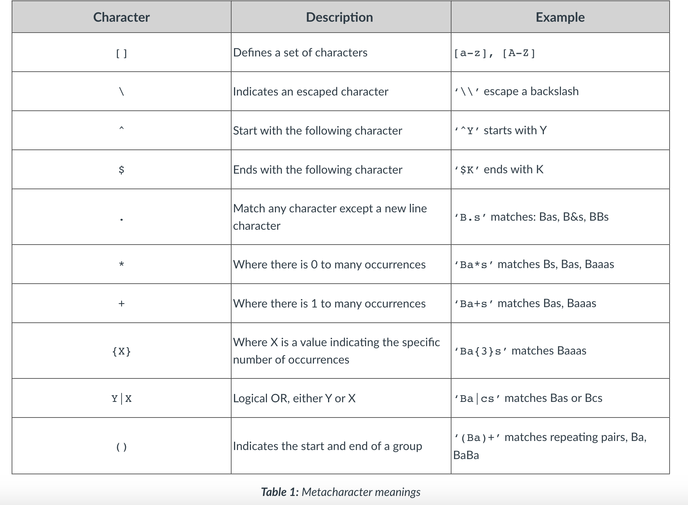
  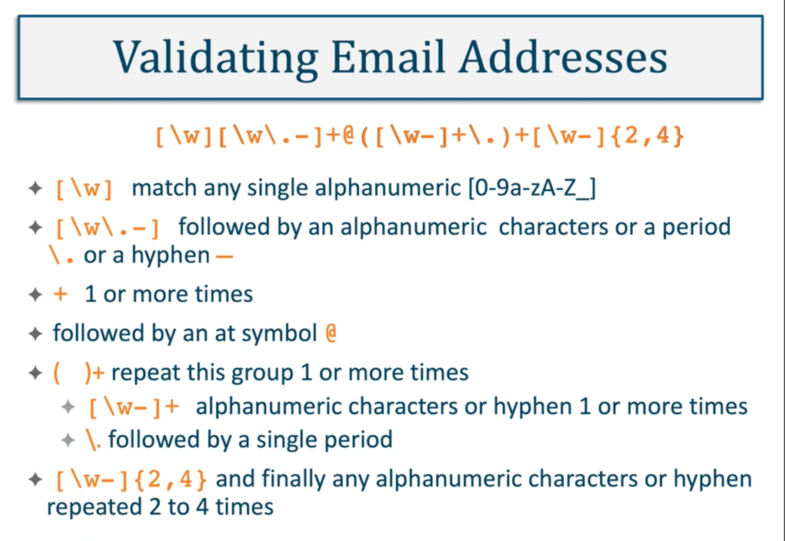

## RAW STRING

* Python strings can be used to express the regular expression to be submitted to the matching engine. However, this is
  not always the most effective way, depending on the type of pattern that needs to be matched. Sometimes a pattern
  needs to match a literal that is also a regex metacharacter. Which can be overly complexed using Python strings
  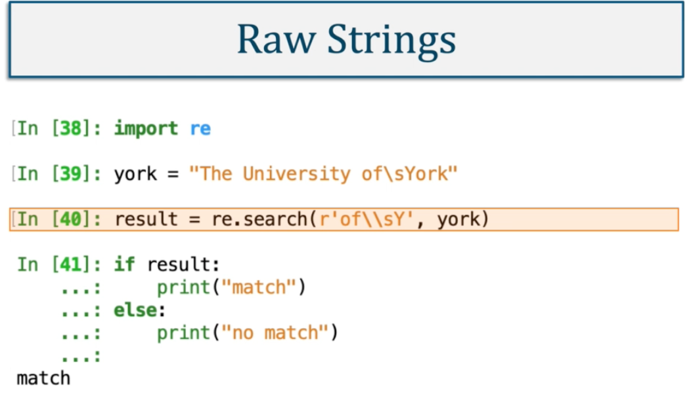
  

## Using compile

* Another way to submit a regex is by generating a regular expression object via the compile() function. This function
  will take both Python and raw strings to generate the object. The advantage of using an object is that the same regex
  can then be applied to more than one string without error. Here is an example of how to compile a regex and apply it
  to two different strings:

``` 
In [56]: import re
In [57]: pattern = re.compile('.*U|Y.*Y|U')
In [58]: result = pattern.match("Universiy of York")
In [59]: if result:
    ...:     print("match")
    ...: else:
    ...:     print("no match")
    ...: 
match
In [60]: result = pattern.match("York has a University")
In [61]: if result:
    ...:     print("match")
    ...: else:
    ...:     print("no match")
    ...:     
match
```

## Match object

* Both search() and match() return a match object or None if no match was made. While this can be used simply to test if
  a match has been made (as demonstrated in the video above) it also contains other information about the match that can
  be queried to identify specific matches to the regular expression. Some of the functions that can be used on a match
  object are:
    * group() return one or more subgroups of the match
    * re() the regular expression passed to search() or match()
    * string() the string passed to search() or match()

### Python String functions or Regex?

* Sometimes sting processing may be simpler using standard python constructs. Python code is easier to construct and
  read but compared to the regex engine, is slow to perform. On the other hand, some regular expressions are very
  complex, and require a deeper understanding of the regex engine to optimise, and may result in difficult to understand
  expressions. This is a design decision that will need to be made given the nature of the program and the types of data
  set it is going to be working with.

# Parsing

* When iterating over a file containing strings of symbols in order to identify specific patterns, this is referred to
  as parsing. The formal definition of ‘to parse’ is ‘analysing a string to resolve it into logical syntactical
  components’. There are a number of reasons to parse a document for use with a program such as:
    * extract (copy only) data into a program
    * interpreting data, the transformation from one format to another
    * inserting/deleting data at a specific point.

## CSV

* https://docs.python.org/3/library/csv.html
* Python provides a standard CSV parser. This can be accessed using import CSV (Links to an external site.). This parser
  can be used with other delimiters, such as an excel-tab. The reader(), reads in from a file and generates a list of
  strings unless specific flags are set to return other types. It uses the iterator protocol and __next__() function to
  enable each element to be accessed. Similarly, the writer() writes to a file and transforms given strings into
  delimitated strings. There are a number of helper functions to set and determine the dialect of CSV files as not all
  will use the standard comma.
  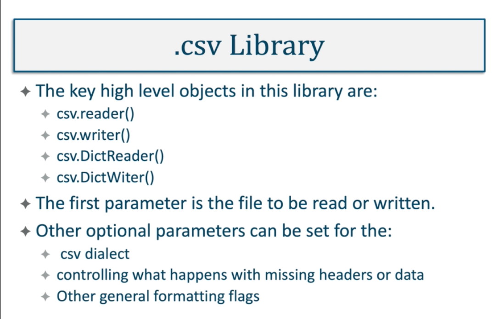
  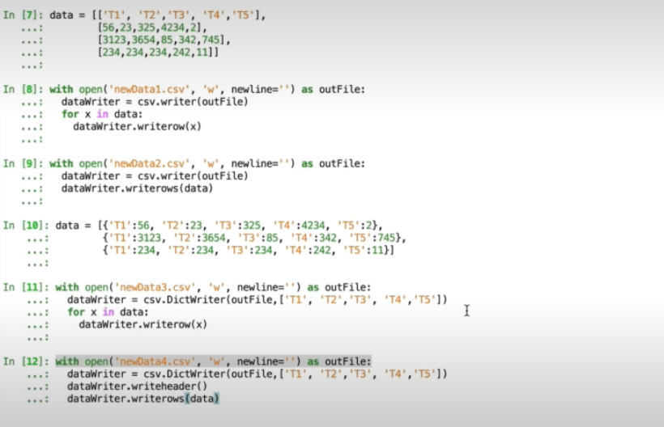

## XML

* Most XML parsers operate in one of two ways, either SAX (Simple API for XML) or DOM (Document Object Model). Their
  differences are:
* DOM:
    * Is model based
    * The whole document is loaded into memory
    * Is read and write so edits can be made to the document
    * The tree can be traversed in any direction
    * Slow at runtime
* SAX:
    * Is event based (this will be covered in more detail in next week’s lessons),
    * Only small parts of the document are in memory at any one time
    * Is read-only
    * Steps through the document (triggering events like tagStart) so data can only be extracted at the current position
    * Fast at runtime
* Some of the submodules allow for validation, either via XML Schema (XSD) or DTD and handle namespaces. XPath is a
  means of traversing XML documents and is also supported in some modules.
* One of the simplest to get started with is **xml.etree.ElementTree.** This can load the XML document into memory like
  DOM using parse(), or treat it like SAX using **interparse**() which returns partial structures that can be held in
  memory. It does not have the full feature set provided by the DOM library for manipulation, but its lightweight
  approach and faster processing will be suitable for most general XML tasks.
  
  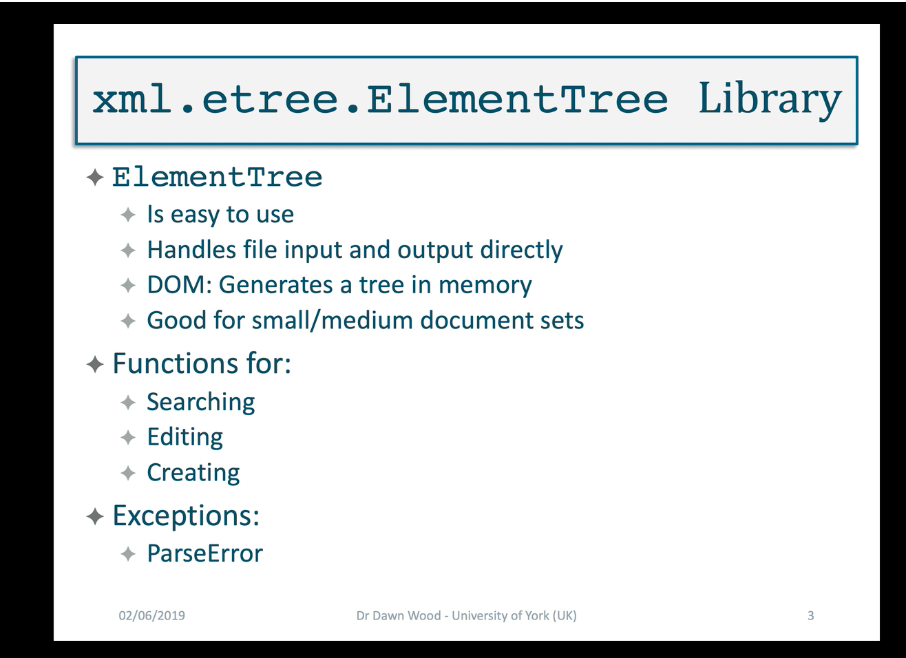
  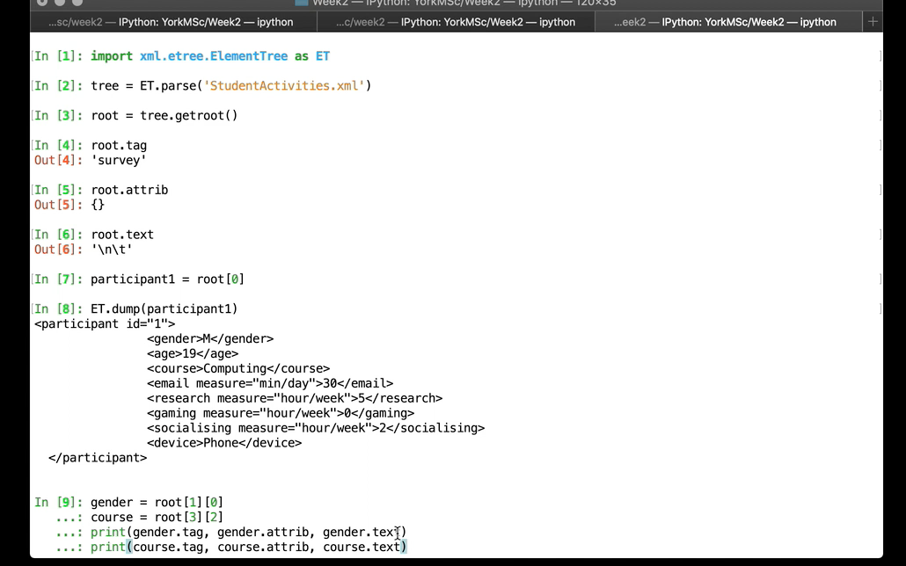
  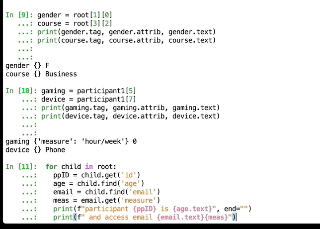
  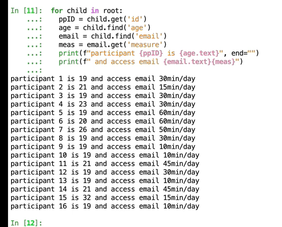
  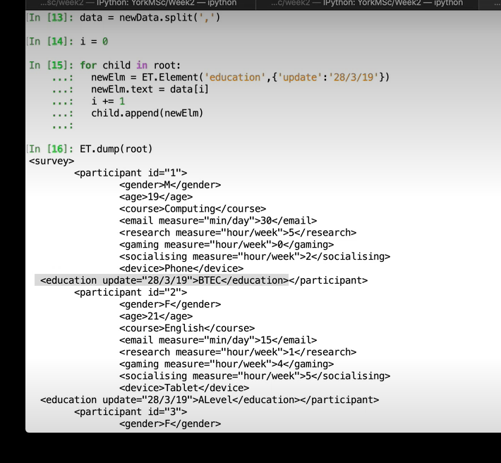
  

## JSON

* Reading and writing to JSON format requires import json (Links to an external site.) and works with Python objects and
  structures. There is not a perfect match between Python and JSON and Table 1 shows how the translation works.
* Similar to the other formats there are a number of flags that can be set to fine tune the translation process. This
  class can generate the JSONDecodeError when things go wrong importing a JSON file.
  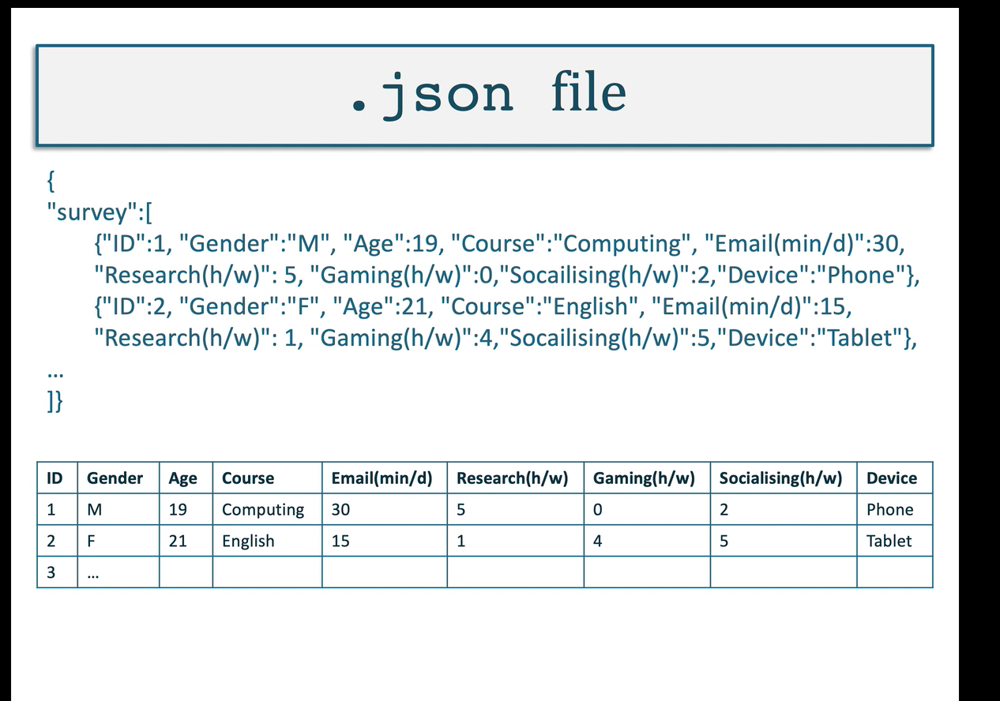
  
  
  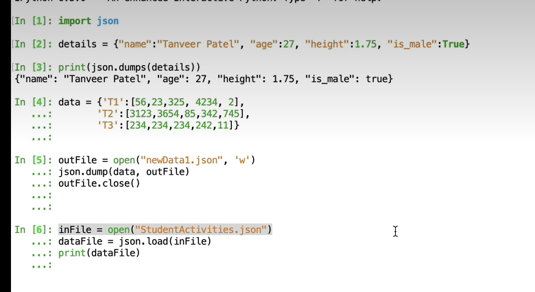
  
  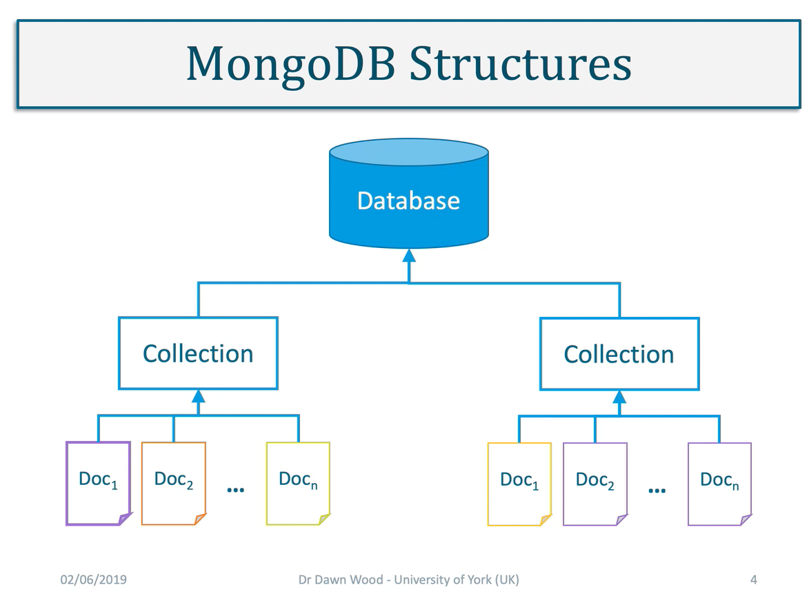

# Databases

* The three types of dtabases that will be examined here are:
    * Relational databases – modelled as a set of tables (columns as attributes, rows as instances) and their
      relationships.
    * Document oriented database – modelled as a collection of documents, each of which can contain data with different
      structures.
    * Object oriented database – modelled as a collection of objects with hierarchical structures.

## Relational

* They are designed as a set of tables, relations, that are linked together by using unique identifiers in each table,
  referred to as primary keys.
* There is a complex design process referred to as normalisation that aims to reduce data redundancy by breaking up
  chunks of data into separate tables.
* Relational databases use Structured Query Language (SQL) for their creation and manipulation. While there are
  generally standard commands to SQL, individual vendors of Databases adapt this to provide specialist features.
    * Postgres
    * MySQL
    * SQLite

### Structured Query Language (SQL)

* SQL provides commands for the creation, maintenance and querying of a relational database.
* Each table is referred to by a label and each column within that table is a labelled attribute. Some of the columns
  within a table will be designated as primary keys (unique identifier within this table) and foreign keys (columns
  referenced by other tables).
* Commands:
    * CREATE() : command would be used to define the details of the table's structure, including the columns labels
      along with their data type, size and whether or not they can be empty
    * INSERT()
    * DROP()
    * UPDATE()
    * UNION and JOIN (Intersection).
      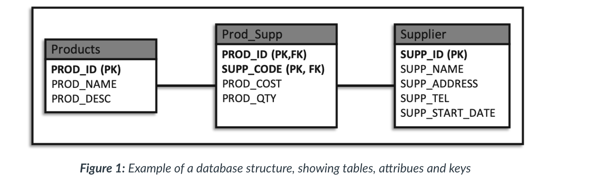
      

## Document Database

* Transferring the data stored in JSON file into and out of a relational database would defeat the point of JSON’s
  lightweight approach. Therefore using a document database to be able to store and retrieve JSON formatted files makes
  a lot of sense.

* MongoDB
* CouchDB
* Couchbase

* in search method find(), 0 -> exclude, 1-> include.


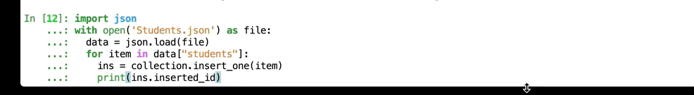


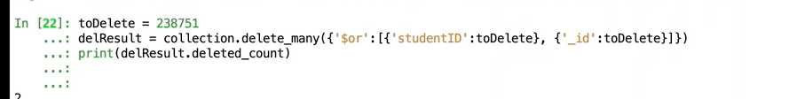

## Object orientated database

* As the name suggests these databases are based on the concept of an object as OOP languages, such as Java, perceive
  them.
* The aim was to minimise or avoid any conversion or decomposition as there is with relational databases.
* Querying an object store would result in the whole object being returned for inspection, rather than parts of it (as
  would be the case if they were returned from a relational table).
* Db4o

# Production

* Each production consists of up to three aspects that should be considered at each stage:
    * Design: What models, frameworks and other documentation should you produce to support your ideas.
    * Implementation: What code structures you should consider building and testing to demonstrate how the data is used
      in your programme.
    * Reflection: Consider the decisions you have made. Why have you made specific selections and what particular parts
      of the data/scenario have informed your choices.

## Production 1: Data translation for storage

To enable a program to function each time it runs there needs to be an external and persistent data storage system that
retains the state of the data. There are two considerations here. The physical storage medium for the data, such as a
file or database and the format/structure of the data such as CSV or XML. This week you have explored a number of
different formats in both regards as follows:

CSV XML JSON MongoDB SQL Database Other file formats? Select ONE format that you consider as most suited to the data in
the scenario and the aims of the program. The format selected should support both the nature of the data and the aims of
the application being designed. It should provide distinct advantages and minimal limitations over other data formats.
It should not be selected solely because it is the easiest to program, although this can be included as an advantage if
applicable.

### Design:

Produce a model that shows how the data needs to be restructured to take best advantage of the selected format and work
more effectively within the program. Where you have created groups or objects from the data show how they relate to each
other.

### Implementation:

Implement a parser that reads in the original data file. You may want to create a subset of the data file for testing
and speed. Your program should then perform the translation from the original format/structure into your selected
format. The result of this process should then be outputted to its relevant physical medium (files/database).

At this stage there is no requirement to handle data types (other than those inherent in the data format, i.e. numbers
and “Strings”), conversions or missing data. The program can be demonstrated as a simple console based application,
requiring the input of the file name by the user and sufficient output to demonstrate the correctness of the translation
process.

Your program should produce regular output statements to the console so that it is easy to follow what the program is
doing and provides a visual demonstration of the translation process. This will also be handy for any debugging
required.

### Reflection on design decisions:

Write a 200-word reflection that states the reason for your format selection and the advantages the format leads to the
data and application and any limitations on the future use of this data within the selected format. You should consider
what literature supports your reasoning/decisions.

# TODO

* Padmanabhan T. R. (2016) Programming with Python. Undergraduate Topics in Computer Science. Springer, Cham Sections:
  7.1-7.2
* Beazley. D., Jones B. K.  (2013) Python Cookbook. 3rd Ed. O'Reilly Media, Sections: 6.9-6.10
* McKinney W. (2017) Python for Data Analysis. 2nd Ed. O'Reilly Media. Section 6.2
* Beazley. D., Jones B. K.  (2013) Python Cookbook. 3rd Ed. O'Reilly Media: 6.1-6.7 (Links to an external site.)
* McKinney W. (2017) Python for Data Analysis. 2nd Ed. O'Reilly Media.
    * Section 3.3
    * Section 6.1
* Padmanabhan T. R. (2016) Programming with Python. Undergraduate Topics in Computer Science. Springer, Cham pp
  175-197Links to an external site.
* Stephenson B. (2014) The Python Workbook. A Brief Introduction with Exercises and Solutions. Springer, Cham pp
  69-78Links to an external site.
* [Python Exceptions](https://docs.python.org/3/library/exceptions.html)
* Stephenson B. (2014) The Python Workbook. A Brief Introduction with Exercises and Solutions. Springer, Cham. pp
  69-78Links to an external site.
* Beazley. D., Jones B. K.  (2013)Python Cookbook.3rd Ed. O'Reilly Media. Chapter 14 (Links to an external site.)
* https://docs.python.org/3/library/re.html
* Igual L., Seguí S. (2017) Introduction to Data Science. Undergraduate Topics in Computer Science. Springer, Cham.
  Section 10.2Links to an external site.


 