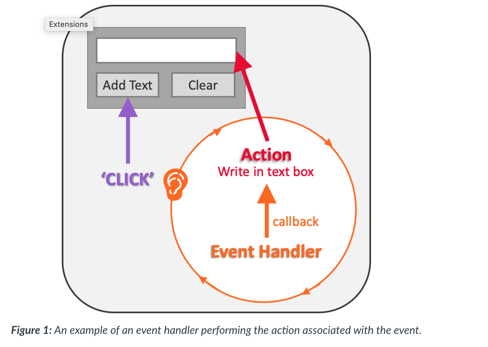
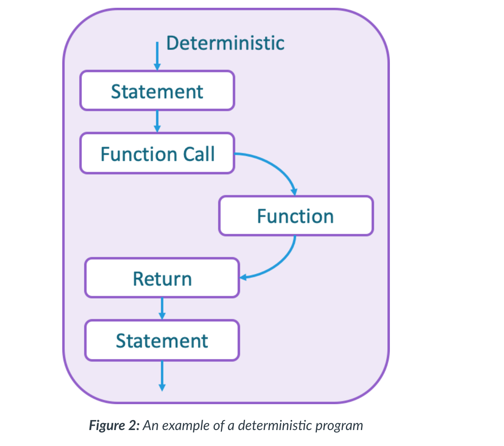
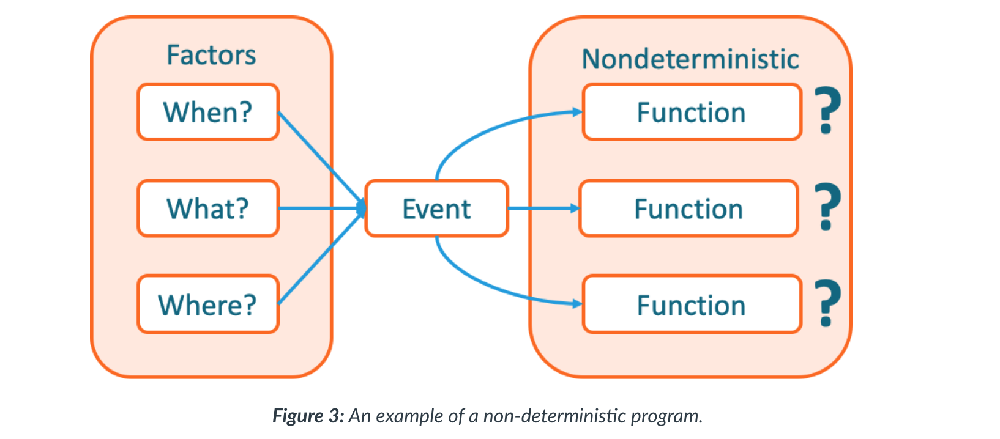
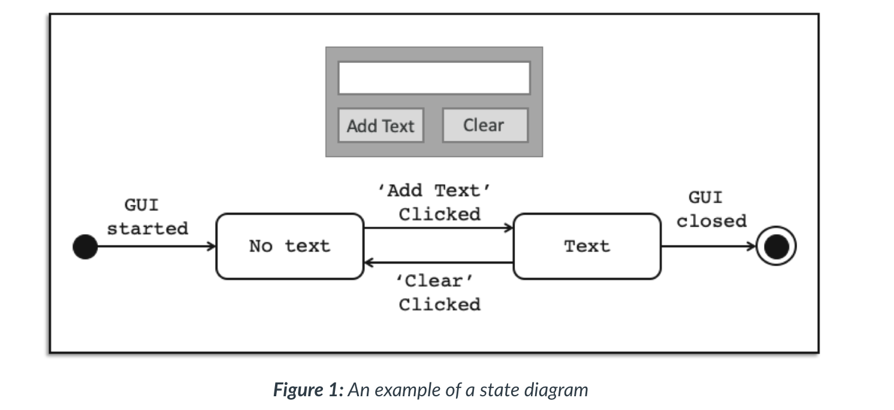
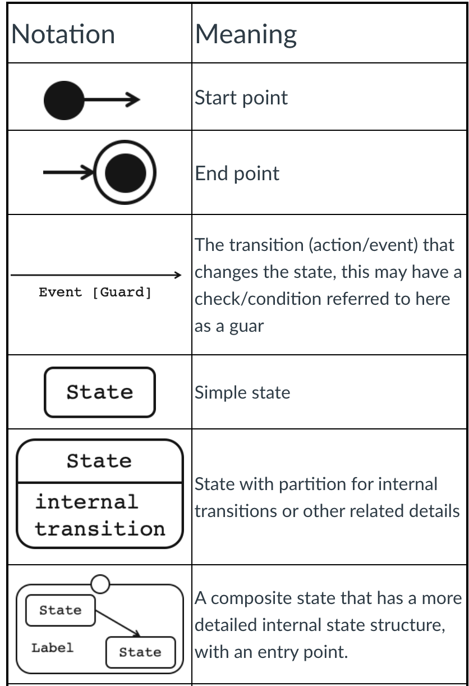
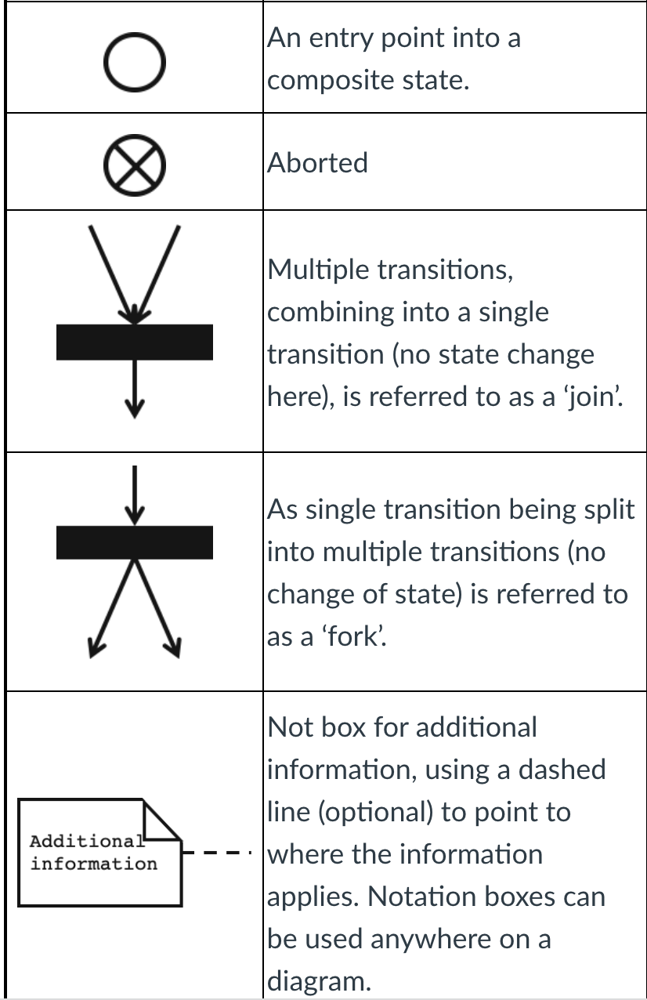
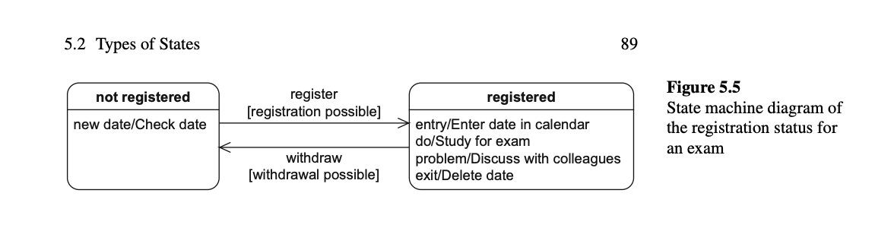

#### Main Topics

* articulate the considerations required to develop event-driven programs
* demonstrate how closures and lambda expressions are used in Python
* utilise state diagrams to model simple interactions and explore approaches to event-driven design
* demonstrate the application of event-driven programming through the construction of GUIs in Python library Tkinter
* utilise a range of GUI components to design and construct effective interfaces.

#### Sub titles:

# Event driven programming

* Events can be user interactions such as clicking the mouse or changes in temperature detected by a sensor.
* Events within each specialised system will be categorised and labelled so that the program can link the type of event
  with the type of response or action it needs to perform. This linking is managed by an event handler, as shown in
  Figure 1, that performs the action associated with the event.
* The event handler always needs to be listening for a potential event so it is active within a loop, continually
  checking for an event. When an event occurs, a callback function is triggered to initialise the associated action in
  response to the event.
* Programming languages approach this process slightly differently, but they will usually provide the implementation for
  the main loop within the event handler.
* The programmer will then simply generate the code for the ‘Action’ and associate it with the handler in some way.
* The event handler will then also need to be associated with an aspect of the system and the type of events it needs to
  listen for.
  </br> </br>

* What can be captured is an understanding of the state of the program given the occurrence of an event. So in the
  example above (Fig. 1), it can be said that before the button ‘add text’ is activated there is no text in the text
  box. This is the state of the text box and the program prior to the button being clicked. All being well, the state
  will change after the button is pressed, and text will appear in the text box.
* Being able to model the events and determine the state of the program at any given point will at least identify if
  there are any potential issues. The more complex the program, the larger the number of potentially different states,
  not all of which may be possible to capture. For example, if a program contains 10 buttons, all of which can have two
  states - on or off - then there are 2^10 (1024) potential states for the whole program to be in.

## Designing with events

* type of program is deterministic in nature.
    * In sequential programming regardless of any iteration, the number of branching statements or function calls, it is
      always possible (however complex) to step through the program and map out all possible paths.
      </br> </br>

* non-deterministic
    * With event-driven programming, mapping out all possible paths is not possible.
    * Because an event can happen at any point in the runtime of the program, the program flow cannot be determined
      absolutely
    * This means that there is a level of uncertainty that needs to be considered when designing a program that has an
      event-driven approach.
    * When an event is generated, what generated the event, and where in the context of the program's current state that
      event fits, are both aspects that need to be considered.
      </br> </br>

# Formal tools

* UML (Universal Modeling Language) provides a range of different modelling techniques and standard notation (to some
  degree) that are effective at communicating program designs.
* The state diagram is one such model that is useful when developing event-driven programs.

## UML

* UML is maintained by the OMG (Object Management Group) and provides a range of modelling tools and frameworks to
  enable system analysis and specification. It is an industry standard specification used in many different scenarios,
  by governments and businesses alike.
    * [Full specification here](https://www.omg.org/spec/UML/)

## State diagram notation

* A state diagram has two fixed points, the start and the end. Between the boxes contain the state details of various
  elements in the system, and the lines between them define the action that changes these from one state to another.
  </br> </br>
* Notations and meanings of State Machine Diagrams
  </br> </br>
  </br> </br>

* UML is designed with some flexibility in mind, and while some organisations and development teams a have strict rules
  about how it is used, UML’s aim is to ensure clear communication.
* When creating UML diagrams of any type the following information should always be included in the diagram (usually in
  a note box top left or along the bottom in a bar):
    * What the diagram is showing in a short meaningful title:
        * Interface 2 – not meaningful
        * User depositing money into an account – more meaningful
    * The author
    * The date it was last updated
    * The version number
        * Diagrams like code should always be copied and edited not overwritten.
    * Any adaptions to the standard notation – a key

* [Seidl M., Scholz M., Huemer C., Kappel G. (2015) The State Machine Diagram. In: UML @ Classroom. Undergraduate Topics in Computer Science. Springer, Cham. Chapter 5: pp. 85-106](https://link-springer-com.libproxy.york.ac.uk/content/pdf/10.1007/978-3-319-12742-2.pdf)  
  </br> </br>

## Closures and Lambda expressions

* Two very useful structures when creating complex GUIs are closures and Lambda expressions which will be introduced
  here.

## Closures

* A closure is not an entity (structure) but rather a state that can be generated, which is useful within programming. A
  closure is a stored function that has its initial environment (local variables within the enclosing scope) stored with
  it, which can be used even when the original enclosing scope has been discarded.
* Closures are a way of creating anonymous functions and providing data hiding in Python.

## first-class entities

* To be able to create a closure the concept of a function (method) is required to be classified as first class entity
  within the programming language. This term, first class, simply means that an entity can have all the standard
  operations applied to it, such as being assigned to a variable, returned from a function, and modified.
* However as functions are first-class entities in Python we can assign the function to a variable, simply by using the
  function’s name on the right-hand side of an assignment statement.
    * in line 3

``` 
In [1]: def addValues(num1, num2):
   ...:     sum = num1 + num2
   ...:     return sum

In [2]: addValues(6,9)
Out[2]: 15

In [3]: myFunction = addValues
In [4]: myFunction(11,4)
Out[4]: 15

```

## Nested functions and scope

* When we call "outerFun()", "innerFun()" is also calling.
* When nonlocal is not added, the inner method creates a different myNumber variable, and outer myNumber is different,
  thats why "UnboundLocalError Traceback (most recent call last)" throws. Thats why need to be carefull.

``` 
In [11]: myNumber = 10
In [12]: def outerFun(val1, val2):
    ...:    global myNumber
    ...:    myNumber += val1
    ...:    print("Outer function:", myNumber, val1, val2)
    ...:    def innerFun(myNumber):
    ...:        myNumber -= val2
    ...:        print("Inner Funtion", myNumber, val1, val2)
    ...:        def ininnerFun():
    ...:            nonlocal myNumber
    ...:            myNumber += val1
    ...:            print("InInner Funtion", myNumber, val1, val2)
    ...:        ininnerFun()
    ...:    innerFun(myNumber)
    ...:    
In [13]: outerFun(5,2)
Outer function: 15 5 2
Inner Funtion 13 5 2
InInner Funtion 18 5 2
In [14]: outerFun(5,2)
Outer function: 20 5 2
Inner Funtion 18 5 2
InInner Funtion 23 5 2
```

## Defining a closure

* This is where the closure is happening. The returned function printSum() is reliant on values in the enclosing scope,
  in this case, the value in sum. So the printSum() function is stored in the variable result with its enclosing scope,
  sum, so it can do its job when needed, which is a closure. The outer function addValues() no longer exists.
* with a clear view

``` 
In [18]: def addValues(num1, num2):
    ...:   sum = num1 + num2
    ...:   def printSum():
    ...:     # uses enclosing scope
    ...:     print("The sum is: ", sum)
    ...:   # call to the nested sum
    ...:   return printSum
    ...: 
In [19]: result = addValues(13,17)
In [20]: del addValues
In [21]: result()
The sum is:  30
```

# Lambda function

* A lambda function is a short anonymous function, that can take any number of parameters (more often referred to as
  arguments in this context), return a value, but only contains a single expression.
    * ``` lambda arguments : expression ```

``` 
In [22]: x = lambda y : y * 2
In [23]: print(x(5))
10
```

* lambda functions can be used to create closures (functions that retain their enclosing scope), making it possible to
  generate a set of similar (related) functions with very little code

``` 
In [24]: def includeVAT(price):
    ...:     return lambda x : (price * 1.2) * x
    ...: 
In [25]: itemCost = includeVAT(0.57)
In [26]: itemCost(10)
Out[26]: 6.84
```

* In the above code, the parameter price is used to generate a lambda expression that finds the cost of a number of
  items including the UK Value Added Tax (VAT) percentage. The lambda expression stored in the variable itemCost (line
    25) is the equation: (0.57*1.2) * x, where x is yet to be provided when the expression is used. In line 26 the
        lambda expression is accessed via the itemCost variable and passed the value 10 which will replace x in the
        equation. So: (
        0.57 * 1.2) * 10 = 6.84.
* **This type of structure is often used when creating and assigning behaviours to multiple GUI components and
  generating on-the-fly code of events that may only happen once given a specific set of circumstances.**

``` 
In [27]: itemCosts = []
In [28]: for i in range(1,9):
    ...:     itemCosts.append(includeVAT(i))
In [29]: print("5 items at £7: £", itemCosts[6](5), "including VAT")
5 items at £7: £ 42.0 including VAT
```

* Padmanabhan T. R. (2016) Programming with Python. Undergraduate Topics in Computer Science. Springer, Cham Section
  4.1.1 Lambda FunctionLinks to an external site.
* Beazley. D., Jones B. K.  (2013) Python cookbook 3rd Ed. O'Reilly Media Functions 7.7 – p224

#  Graphical user interface design

