#### Main Topics

* articulate the considerations required to develop event-driven programs
* demonstrate how closures and lambda expressions are used in Python
* utilise state diagrams to model simple interactions and explore approaches to event-driven design
* demonstrate the application of event-driven programming through the construction of GUIs in Python library Tkinter
* utilise a range of GUI components to design and construct effective interfaces.

#### Sub titles:

# Event driven programming

* Events can be user interactions such as clicking the mouse or changes in temperature detected by a sensor.
* Events within each specialised system will be categorised and labelled so that the program can link the type of event
  with the type of response or action it needs to perform. This linking is managed by an event handler, as shown in
  Figure 1, that performs the action associated with the event.
* The event handler always needs to be listening for a potential event so it is active within a loop, continually
  checking for an event. When an event occurs, a callback function is triggered to initialise the associated action in
  response to the event.
* Programming languages approach this process slightly differently, but they will usually provide the implementation for
  the main loop within the event handler.
* The programmer will then simply generate the code for the ‘Action’ and associate it with the handler in some way.
* The event handler will then also need to be associated with an aspect of the system and the type of events it needs to
  listen for.
  </br> </br>

* What can be captured is an understanding of the state of the program given the occurrence of an event. So in the
  example above (Fig. 1), it can be said that before the button ‘add text’ is activated there is no text in the text
  box. This is the state of the text box and the program prior to the button being clicked. All being well, the state
  will change after the button is pressed, and text will appear in the text box.
* Being able to model the events and determine the state of the program at any given point will at least identify if
  there are any potential issues. The more complex the program, the larger the number of potentially different states,
  not all of which may be possible to capture. For example, if a program contains 10 buttons, all of which can have two
  states - on or off - then there are 2^10 (1024) potential states for the whole program to be in.

## Designing with events

* type of program is deterministic in nature.
    * In sequential programming regardless of any iteration, the number of branching statements or function calls, it is
      always possible (however complex) to step through the program and map out all possible paths.
      </br> </br>

* non-deterministic
    * With event-driven programming, mapping out all possible paths is not possible.
    * Because an event can happen at any point in the runtime of the program, the program flow cannot be determined
      absolutely
    * This means that there is a level of uncertainty that needs to be considered when designing a program that has an
      event-driven approach.
    * When an event is generated, what generated the event, and where in the context of the program's current state that
      event fits, are both aspects that need to be considered.
      </br> </br>

# Formal tools

* UML (Universal Modeling Language) provides a range of different modelling techniques and standard notation (to some
  degree) that are effective at communicating program designs.
* The state diagram is one such model that is useful when developing event-driven programs.

## UML

* UML is maintained by the OMG (Object Management Group) and provides a range of modelling tools and frameworks to
  enable system analysis and specification. It is an industry standard specification used in many different scenarios,
  by governments and businesses alike.
    * [Full specification here](https://www.omg.org/spec/UML/)

## State diagram notation

* A state diagram has two fixed points, the start and the end. Between the boxes contain the state details of various
  elements in the system, and the lines between them define the action that changes these from one state to another.
  </br> </br>
* Notations and meanings of State Machine Diagrams
  </br> </br>
  </br> </br>

* UML is designed with some flexibility in mind, and while some organisations and development teams a have strict rules
  about how it is used, UML’s aim is to ensure clear communication.
* When creating UML diagrams of any type the following information should always be included in the diagram (usually in
  a note box top left or along the bottom in a bar):
    * What the diagram is showing in a short meaningful title:
        * Interface 2 – not meaningful
        * User depositing money into an account – more meaningful
    * The author
    * The date it was last updated
    * The version number
        * Diagrams like code should always be copied and edited not overwritten.
    * Any adaptions to the standard notation – a key

* [Seidl M., Scholz M., Huemer C., Kappel G. (2015) The State Machine Diagram. In: UML @ Classroom. Undergraduate Topics in Computer Science. Springer, Cham. Chapter 5: pp. 85-106](https://link-springer-com.libproxy.york.ac.uk/content/pdf/10.1007/978-3-319-12742-2.pdf)  
  </br> </br>

## Closures and Lambda expressions

* Two very useful structures when creating complex GUIs are closures and Lambda expressions which will be introduced
  here.

## Closures

* A closure is not an entity (structure) but rather a state that can be generated, which is useful within programming. A
  closure is a stored function that has its initial environment (local variables within the enclosing scope) stored with
  it, which can be used even when the original enclosing scope has been discarded.
* Closures are a way of creating anonymous functions and providing data hiding in Python.

## first-class entities

* To be able to create a closure the concept of a function (method) is required to be classified as first class entity
  within the programming language. This term, first class, simply means that an entity can have all the standard
  operations applied to it, such as being assigned to a variable, returned from a function, and modified.
* However as functions are first-class entities in Python we can assign the function to a variable, simply by using the
  function’s name on the right-hand side of an assignment statement.
    * in line 3

``` 
In [1]: def addValues(num1, num2):
   ...:     sum = num1 + num2
   ...:     return sum

In [2]: addValues(6,9)
Out[2]: 15

In [3]: myFunction = addValues
In [4]: myFunction(11,4)
Out[4]: 15

```

## Nested functions and scope

* When we call "outerFun()", "innerFun()" is also calling.
* When nonlocal is not added, the inner method creates a different myNumber variable, and outer myNumber is different,
  thats why "UnboundLocalError Traceback (most recent call last)" throws. Thats why need to be carefull.

``` 
In [11]: myNumber = 10
In [12]: def outerFun(val1, val2):
    ...:    global myNumber
    ...:    myNumber += val1
    ...:    print("Outer function:", myNumber, val1, val2)
    ...:    def innerFun(myNumber):
    ...:        myNumber -= val2
    ...:        print("Inner Funtion", myNumber, val1, val2)
    ...:        def ininnerFun():
    ...:            nonlocal myNumber
    ...:            myNumber += val1
    ...:            print("InInner Funtion", myNumber, val1, val2)
    ...:        ininnerFun()
    ...:    innerFun(myNumber)
    ...:    
In [13]: outerFun(5,2)
Outer function: 15 5 2
Inner Funtion 13 5 2
InInner Funtion 18 5 2
In [14]: outerFun(5,2)
Outer function: 20 5 2
Inner Funtion 18 5 2
InInner Funtion 23 5 2
```

## Defining a closure

* This is where the closure is happening. The returned function printSum() is reliant on values in the enclosing scope,
  in this case, the value in sum. So the printSum() function is stored in the variable result with its enclosing scope,
  sum, so it can do its job when needed, which is a closure. The outer function addValues() no longer exists.
* with a clear view

``` 
In [18]: def addValues(num1, num2):
    ...:   sum = num1 + num2
    ...:   def printSum():
    ...:     # uses enclosing scope
    ...:     print("The sum is: ", sum)
    ...:   # call to the nested sum
    ...:   return printSum
    ...: 
In [19]: result = addValues(13,17)
In [20]: del addValues
In [21]: result()
The sum is:  30
```

# Lambda function

* A lambda function is a short anonymous function, that can take any number of parameters (more often referred to as
  arguments in this context), return a value, but only contains a single expression.
    * ``` lambda arguments : expression ```

``` 
In [22]: x = lambda y : y * 2
In [23]: print(x(5))
10
```

* lambda functions can be used to create closures (functions that retain their enclosing scope), making it possible to
  generate a set of similar (related) functions with very little code

``` 
In [24]: def includeVAT(price):
    ...:     return lambda x : (price * 1.2) * x
    ...: 
In [25]: itemCost = includeVAT(0.57)
In [26]: itemCost(10)
Out[26]: 6.84
```

* In the above code, the parameter price is used to generate a lambda expression that finds the cost of a number of
  items including the UK Value Added Tax (VAT) percentage. The lambda expression stored in the variable itemCost (line
    25) is the equation: (0.57*1.2) * x, where x is yet to be provided when the expression is used. In line 26 the
        lambda expression is accessed via the itemCost variable and passed the value 10 which will replace x in the
        equation. So: (
        0.57 * 1.2) * 10 = 6.84.
* **This type of structure is often used when creating and assigning behaviours to multiple GUI components and
  generating on-the-fly code of events that may only happen once given a specific set of circumstances.**

``` 
In [27]: itemCosts = []
In [28]: for i in range(1,9):
    ...:     itemCosts.append(includeVAT(i))
In [29]: print("5 items at £7: £", itemCosts[6](5), "including VAT")
5 items at £7: £ 42.0 including VAT
```

* Padmanabhan T. R. (2016) Programming with Python. Undergraduate Topics in Computer Science. Springer, Cham Section
  4.1.1 Lambda FunctionLinks to an external site.
* Beazley. D., Jones B. K.  (2013) Python cookbook 3rd Ed. O'Reilly Media Functions 7.7 – p224

# Graphical user interface design

* At the end of this lesson you will be able to:
    * Select and justify GUI components for representing specific program requirements
    * Apply a wireframe diagram to express ideas for GUI design
* [Foundation for Interaction Design](https://www.interaction-design.org/literature)
* [W3C: Web Content Accessibility Guidelines](https://www.w3.org/TR/WCAG20/)
* [Usability.gov for guidelines and best practice](https://www.usability.gov/)
* [UX Design resources and guidelines](http://uxdesign.com/ux-defined)

# Interface components

* Here are some components:
    1. Label – adding text
    2. Button – something to click
    3. Text Box – somewhere to input text
    4. Radio Button – to select one from many
    5. Check Box – to select something
    6. Table – to present or enter information
    7. Scroll bar – to move across/down information in presented in a contained space
    8. Menu bar – to provide functionality
    9. Tabs - to move between views within the same window
       </br> </br>

* For wireframe:
    * Pencil – open source project developing a GUI prototyping tool. Available across platforms.
    * Lucidchart is an online-only application for many types of diagram which is available under your Google drive
      account.
      </br> </br>

# Basic Design Principles and User Testing

* While assembling a reasonable prototype for demonstration purposes, designing interactive interfaces in themselves is
  a specialist area in computing. One of the most cited sets of design Heuristics, which are still applicable, are Jakob
  Nielsen’s 10 Usability Heuristics for User Interface Design. These are available on
  the [Nielson/Norman Group](https://www.nngroup.com/articles/ten-usability-heuristics/)  for research-based user
  experience.

    </br> 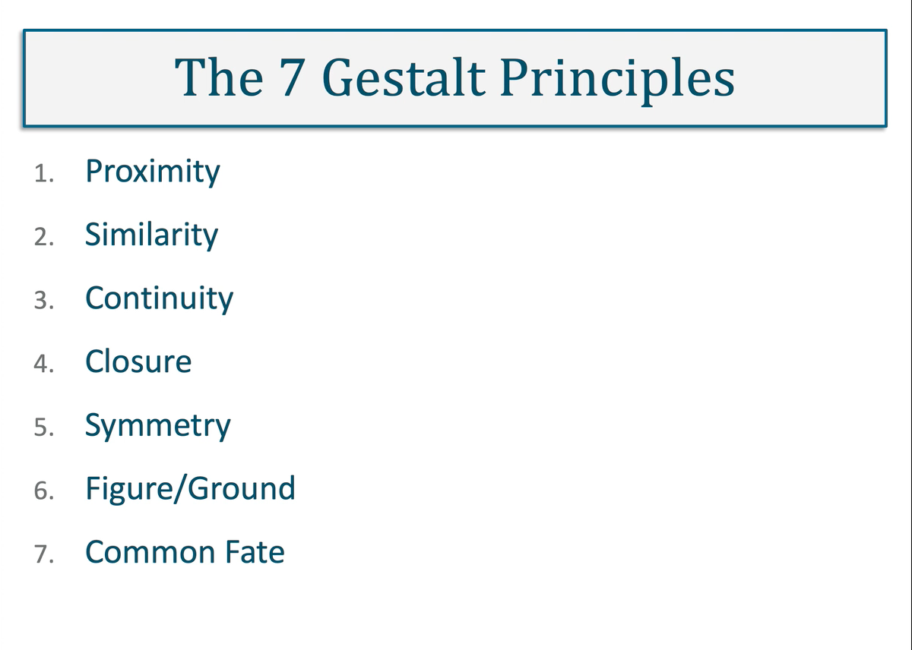</br>
* brief introduction to a set of GUI design principles as laid out by Jeff Johnson in Designing with the Mind in mind
* The most important of these principles in the context of GUI design are; proximity, similarity, continuity, closure,
  symmetry, figure ground and common fate.
* Proximity:
    * The first principle, proximity, states that the relative distance between objects determines how they are
      associated with each other. By changing the distances, we can generate visual groups.
      </br> </br>
* Similarity:
    * Objects with the same properties such as size, shape, colour and other styling look similar and tend to be
      associated as a group. This affect is more pronounced when proximity is applied as well. Both proximity and
      similarity are effective at communicating a set of related functions to the user.
    * Here is an example of a pop-up box that appears when you are attempting to close an application holding an unsaved
      file. Here we see that the save buttons are grouped on the right, with a large space and separated from the
      un-save button which has the potential to lose all data. Both proximity and similarity, button shape and size are
      used here.
      </br> 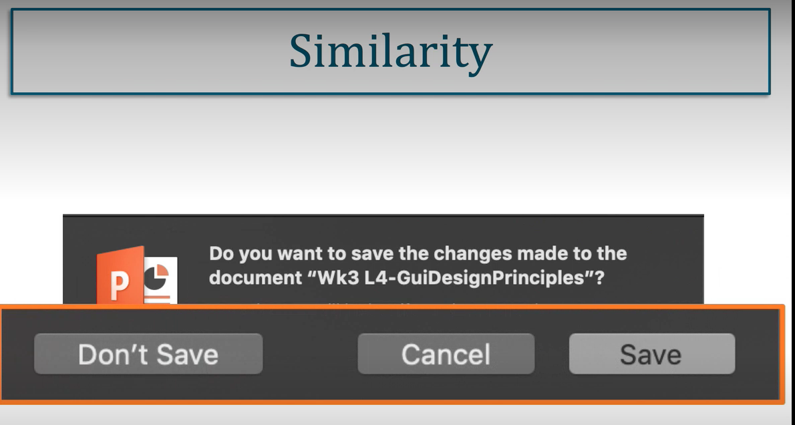</br>

* Continuity:
    * demonstrates how the brain adds information that is not necessarily there.
      </br> </br>
    * It is perceived as one continuous shape; in this case a sea monster, with our brain filling in the missing
      information under the sea line.
* Closure :
    * is also about adding extra information to perceive a whole object.
      </br> 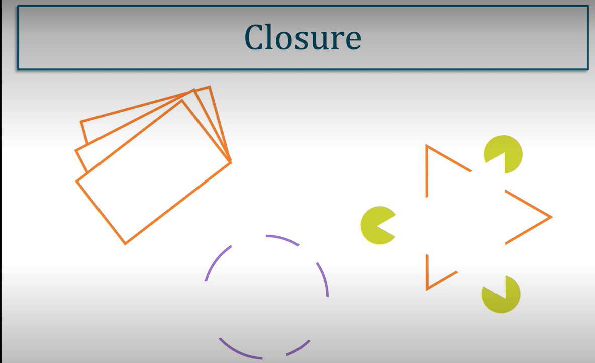</br>
      </br> 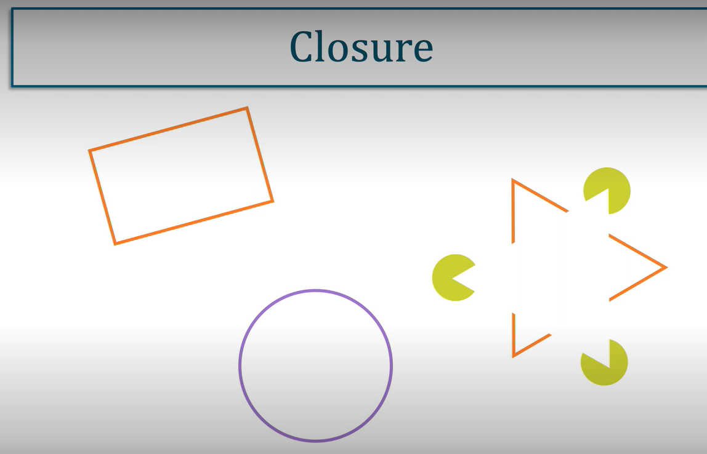</br>
    * Top left: is this a collection of triangles with a single rectangle, or, is it a stack of rectangles? You are more
      likely to have perceived a stack with the brain adding the missing information to create complete shapes.
* Symmetry:
    * It seeks to even things out and find balance. In this way, the images are simplified into more comprehensive
      shapes
      </br> 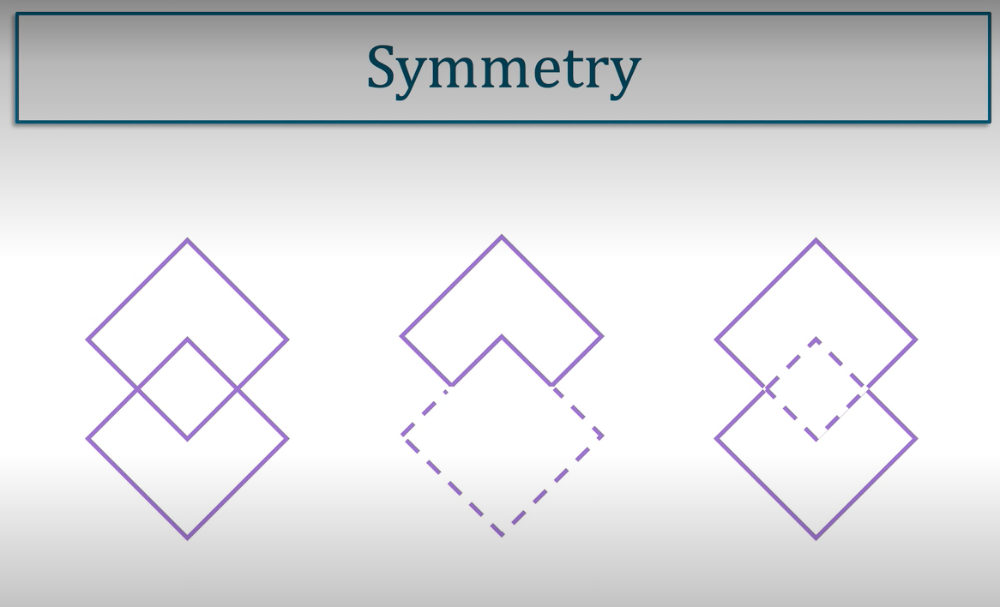</br>
    * Here the pattern on the left side is more likely to be perceived as overlapping squares, than either of the two
      shapes on the right. One a rotated L shape, and the second a complex 8-sided figure. An example of this can be
      commonly found in art and design programs to provide controls for changing the colour of an objects fill or its
      outline. Here we understand that the two shapes are squares, one overlapping the other. One to control the fill,
      and one to control its outline.
* Foreground and background :
    * is a way in which we separate what is of interest (foreground) from everything else (background). Visual clues
      such as size and colour also help to enhance direct this focus. Small shapes in front of large ones are perceived
      as being closer to us and therefore of more interest. However, the viewer can switch their interest and focus on
      what may be in the background. Visual illusions can be created by balancing this figure ground effect. So, the
      view can be easily switched between the two.   
      </br> 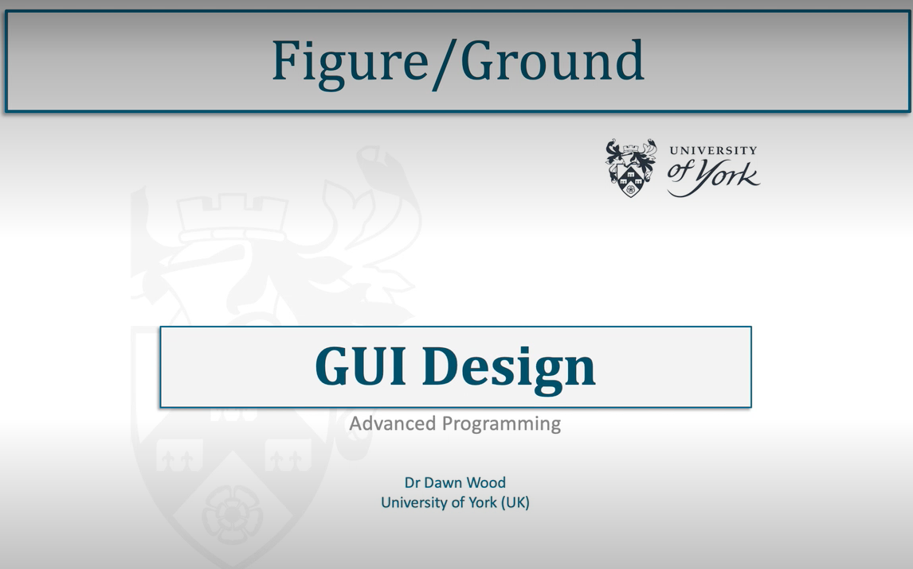</br>
      </br> </br>
    * Movement is a tricky thing to make effective in interface design. Anything that moves immediately becomes the
      focus of attention. However, when multiple elements move together in the same way, this works as a mechanism for
      grouping them. As movement is dynamic, it is perceived that will happen to one element will happen to all
      elements. A good example of this is selecting and moving multiple files in a folder system. When three folders are
      selected and moved together to place them in another folder, it is expected that what will happen to one of the
      folders in the moving group will happen to all the folders in the moving group. Those that are not moving will not
      be affected by this action

## Colors:

* [Platton](https://paletton.com/#uid=1000u0kllllaFw0g0qFqFg0w0aF)
  </br> </br>
  </br> </br>
  </br> </br>
  </br> </br>

### Further Reading:

* Johnson, J. (2014) Designing with the mind in mind: simple guide to understanding user interface design guidelines.
  Morgan Kaufmann – Appendix for list of design rules
* Marcus A. (2015) Patterns Within Patterns. In: HCI and User-Experience Design. Human–Computer Interaction Series.
  Springer, London pp. Pages 101-107

## User testing and evaluation

* One of the best ways to understand how effective a GUI is, is to test it with end users of the system.
* This can happen at all stages of the design and development process to help inform how the interface is enabling
  access to the functionality of the system. The processes and principles of user testing of GUI (or any interface)
  design form a key part of what HCI(Human-Computer Interaction) and other research areas investigate. User testing can
  take a number of different forms, usually dependent on the software’s development stage, or the nature of what needs
  to be tested. This can include; needs analysis, validation, tests, exploratory tests and evaluation test. Figure 1
  below gives an overview of the different tests and where they are more typically applied in the development process.
  </br> </br>

* Tests can be of a variety of types, using observations or asking users to complete evaluation forms. They may be
  performed on a prototype system, paper or digital, the live system, or other similar systems to understand what types
  of challenges users face. The testing and evaluation methodology may differ if the system under development is
  completely new, or an update or extension to an existing system. Again, this is a subject in its own right and is not
  going to be explored here, however performing simple observation tests with users when building a system can help give
  the designer a better idea of layout and interaction.

# Introducing Tkinter for GUIs in Python

* [Tkinter](https://docs.python.org/3/library/tk.html) is part of the Python standard GUI library , making it available
  anywhere Python is available.

## Thinker Packages

* Tkinter contains two key packages which extend the basic functionality and components offered by Tkinter directly.
  These are:
    * [tkinter.tix](https://docs.python.org/3/library/tkinter.tix.html#module-tkinter.tix) – provides an extended set of
      widgets, not available in Tkinter
    * [tkinter.ttk](https://docs.python.org/3/library/tkinter.ttk.html#module-tkinter.ttk) – provides a themed set of
      widgets. Note that here there are differences in the way attributes are set from the standard Tkinter widgets.

## Main window

* Each window comes with some basic functionality for minimising, maximising and exiting. A window has a number of
  attributes that can be set, such as size and its name (title).

``` 
In [30]: from tkinter import *
In [31]: window = Tk()
In [32]: window.title("Main Frame")
In [33]: window.mainloop()
```

* The call to mainloop() starts the window running. This activates a loop that is listening for any events, such as
  minimising and maximising the window.
  </br> </br>

## Adding Components

* In Tkinter, Components are referred to as ‘**widgits**’. Each widget comes with a range of attributes that can be set
  to determine how it looks and how it behaves. Widgets (components) are fairly standard across all programming
  languages that provide a GUI API, whether they are application-based or web-based.
* To add a widgit in Python it needs to be: linked to a parent structure (like the initial window) within which it will
  be placed; apply rules for its positioning within the parent structure and be made visible to the user.
* The first parameter passed to a widget on creation is the parent structure.
* In the code below the parent for both the label and the button is the Tk object stored in the window variable.
* Positioning and visibility are both generated by the pack() function, which is applying a layout manager. In this
  case, with no other settings being applied, it will stack the objects centrally within the given area.
* The geometry() function is determining the initial size of the main window, as shown below:

``` 
In [34]: from tkinter import *
In [35]: window = Tk()
In [36]: window.title("Main Frame")
Out[36]: ''
In [37]: window.geometry("200x50")
Out[37]: ''
In [38]: text = Label(window, text="Hello World")
In [39]: button1 = Button(window, text='Press Me!')
In [40]: button1.pack()
In [41]: text.pack()
In [42]: window.mainloop()
```

  </br> </br>

## Container Widgets

* Container widgets are widgets specifically designed to hold other widgets and treat them as a group
* They act as the parent to the contained widgets and are often referred to as high-level widgets.

``` 
In [43]: from tkinter import *
In [44]: window = Tk()
In [45]: window.title("Main Frame")
Out[45]: ''
In [46]: window.geometry("300x100")
Out[46]: ''
In [47]: left = Frame(borderwidth=5)
In [48]: text = Label(left, text="Hello World")
In [49]: button1 = Button(left, text='Press Me!')
In [50]: left.pack(side='left')
In [50]: button1.pack()
In [51]: text.pack()
In [52]: window.mainloop()
```

* Extending the previous code, here a Frame object has been added, and the label and button attached to this as their
  parent object. The Frame has been given a wide border using borderwidth, and when pack is applied it has instructed to
  place the frame to the left of the main window as shown
  </br> </br>
* Other container-like components have more specific functionality or styling, such as:
    * ttk.LabelFrame
    * ttk.NoteBook
    * Tkinter.PanedWidow
    * NOTE: that the first two are within the ttk extension package to Tkinter and will need to be imported from there.

# Layout managers

* There are three layout managers (often referred to as geometry managers in Python) within Tkinter:
    * pack() – **simply packs components into as small a space as possible**, the minimum effort required. Best used
      with fixed sized (window resizing turned off) as it can produce unexpected layouts. Most suitable for groups of
      components that can be organised in a simple row or column.
    * grid() – **uses an underlying grid of rows and columns,** which are used to coordinate placement. Components can
      span more than one row or column. Containing windows can be resized and commands set to how components should be
      laid out in response to this. Most suitable for highly structured interfaces, with many components.
    * place() – **uses absolute position** (exact coordinates) to place objects. Requires alternative coordinates for
      window resizing or use with a fixed window. This is the most flexible layout and also the most complex to apply.
      </br> 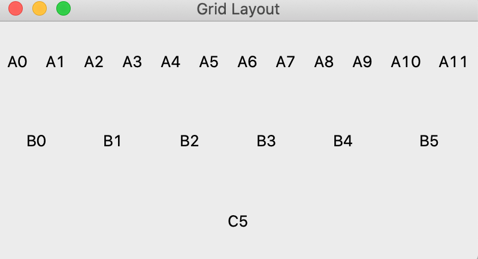</br>

```  
import tkinter as tk 
from tkinter import ttk
window = tk.Tk()
window.title("Grid Layout")
window.geometry("400x200")

for i in range(0,12):
    ttk.Label(window, text='A'+str(i), anchor="center").grid (row=0, column=i, sticky='NSEW')
    window.grid_columnconfigure(i,weight=1)
for i in range(0,6):
    ttk.Label(window, text='B'+str(i), anchor="center").grid(row=1, column=i+(1*i), columnspan=2, sticky='NSEW')    
    
ttk.Label(window, text='C'+str(i), anchor="center").grid( row=2, column=0, columnspan=12, sticky='NSEW')    
window.grid_rowconfigure(0, weight=1)
window.grid_rowconfigure(1, weight=1)
window.grid_rowconfigure(2, weight=1)
window.mainloop()
    
```

* The .grid() function (demonstrated above) is applied to each generated labels within the loop.
    * Within this, the row and column values for the label is set. **columnspan** determines how many columns the label
      sits across given its start position.
    * The attribute **sticky** can take combinations of the characters **N (north) S (south) W (west) and E (east)** to
      indicate in which directions the Label should stretch to if the space it is allocated is larger than its natural
      size (which is determined by the text it contains in a Label component). In this case, it is going to stretch in
      all directions.

* the layout manager will still try to fit everything into the smallest possible space. To counteract this and ensure
  all the window is taken up ("400x200") the rows and columns need a weighted priority. By giving them all the value of
  1 via the grid_columnconfigure() and grid_rowconfigure() function all space is used. As the window is resized, all the
  labels will resize to fill the window. Figure 1 shows (A) without grid_columnconfigure() and gird_rowconfigure() set,
  and (B) with them all set with a weight of 1.
  </br> </br>

``` 
In [64]:import tkinter as tk
    ...: from tkinter import ttk
In [65]: window = tk.Tk()
    ...: window.title("Place Layout")
    ...: window.geometry("400x200")
    ...: 
Out[65]: ''
In [66]: label1 = ttk.Label(window, text='A1')
    ...: label2 = ttk.Label(window, text='A2')
    ...: label3 = ttk.Label(window, text='A3')
    ...: label4 = ttk.Label(window, text='A4')
In [67]: label1.place(height=150, width=100, x=0, y=0)
    ...: label2.place(height=100, width=50, x=150, y=100)
    ...: label3.place(height=50, width=50, x=175, y=125)
    ...: label4.place(x=300, y=150)
    ...: window.mainloop()
```

* The place() function takes attributes for defining the x, y positioning of the labels, as well as sizing the area
  allocated to the label using height and width, which are optional. The coordinates, in this case, are in relation to
  the parent (containing) component, in this case, the main window.
  </br> 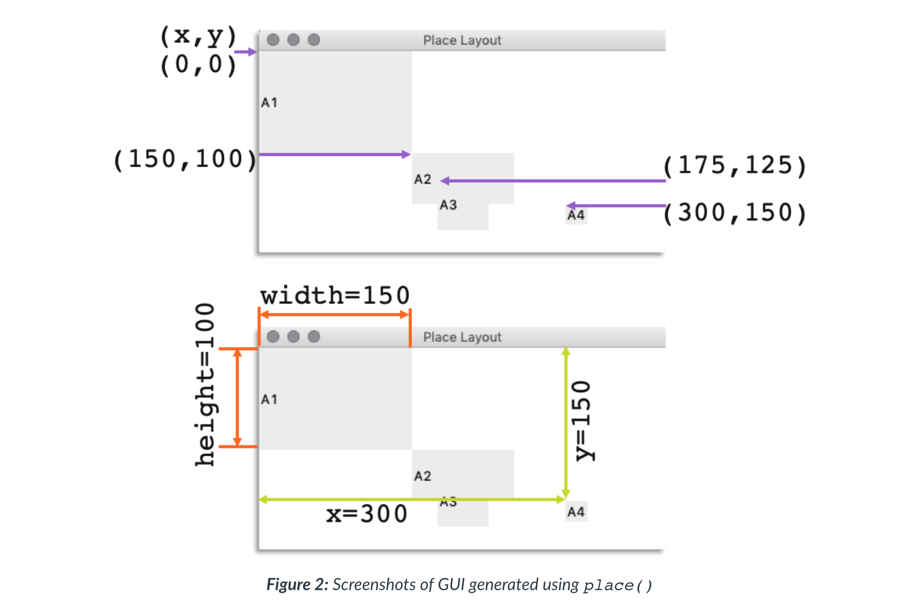</br>

# Adding style

* There are two ways of adding style in Tkinter,
    * one for standard tk objects and
    * one for the more recent ttk package.

* tk objects have a series of attributes that can be added to define styling elements such as background (bg) and
  foreground (fg) colours, depending on the object type, and are fairly straightforward to apply, as shown here:

``` 
In [64]: lab1 = tk.Label(window, text='York', fg='SteelBlue', bg='LightGray')
```

* ttk package is more complex and more flexible requiring the use of string tags
    * Adding a Style() object is created from the ttk package within tkinter.
    * The first parameter in the configure() function is a text label that identifies this particular object and its
      configuration, which is then used to link it to the components that need to be styled in that way. The tag label
      can be one of the sets of predefined tags that are associated with each component type. The following code will
      define all buttons to be changed to the given styling using the tag TButton:

``` 
In [65]: ttk.Style().configure("TButton", foreground='SteelBlue', background='LightGray')
```

* To define different styling for the same components a sub-tag is used.

``` 
In [66]: style1 = ttk.Style()
In [67]: style1.configure("Yell.TLabel", foreground="blue", background="yellow", padding=3)
...
In [68]: ttk.Label(window, text='A', anchor="center", style='Yell.TLabel')
```

* Themes (a style collection to apply across the GUI components) can also be set from a range of pre-defined styles or
  defined by the programmer. Some components have their own functions for defining styling such as the tag_configure()
  function within ttk.Treeview component.

### Color

* Colours can be defined by a series of string labels, which are equivalent to those used in CSS (Cascading Style
  Sheets) for web pages. They can also be denoted as their hexadecimal value, for defining red, green, blue (additive
  colour system) values for each colour. A list of both can be
  found [here](https://www.tcl.tk/man/tcl8.6/TkCmd/colors.html).
* **NOTE**: Hexadecimal (base 16) uses the symbols 0 to F. Colours are defined in values from 0 to 255 (decimal values)
  which are represented as a two-digit hexadecimal value in the order of Red, Green, Blue (RGB). So the colour ‘yellow
  green’ (python label) has the RGB values 154 (R) 205 (G) 50 (B) which are represented as 9A (R) CD (G) 32 (B) in
  hexadecimal. When using hexadecimal the hash symbol (#) is placed before the values like this ‘#9ACD32’ will give the
  same colour in Python as the label ‘yellow green’.

### Sizing

* For sizing in Tkinter any integer value, with no associated units, defaults to pixels. However units of size can be
  represented in c,I,m,p, which are centimetres, inches, millimetres and printers points respectively.

## Canvas component

* The canvas component is a freeform area for defining customised shapes and styling, as well as adding images (of
  various files types). Coordinates are calculated from the top left (0,0) in the form x and y. Each element is drawn in
  the order it is coded, which means that shapes drawn at the beginning of the code, can be overlapped by those drawn
  later. Shapes include ovals, rectangles, arc, line and polygon with a range of different parameters that can be passed
  to define and style each shape. Text can also be added.

``` 
In [69]: from tkinter import *
In [70]: window = Tk()
    ...: window.title("Canvas Example")
    ...: 
Out[70]: ''
In [71]: c = Canvas(window, width=350,height=400)
    ...: c.pack()
    ...: 
In [72]: # coordinates: x-y top-left, followed by x-y bottom right
   ...: c.create_rectangle(40, 40, 110, 110, fill="#FD6707", outline='#C5D906',)
Out[72]: 1
In [73]: # coordinates are: x-y top-left, followed by x-y bottom right (as a rectangle)
    ...: c.create_oval(90,120,190,170, width=10, outline='#FD6707')
Out[73]: 2
In [74]: # each pair of values is x-y for a specified point within the canvas space
    ...: star = [100, 140, 110, 110, 140, 100, 110, 90, 100, 60, 90, 90, 60, 100, 90, 110]
    ...: c.create_polygon(star, outline='#925BCC', fill='#C5D906', width=3)
    ...: 
Out[74]: 3
In [75]: img = PhotoImage(file="Sunrise.png")
    ...: c.create_image(20,180, anchor=NW, image=img)
    ...: 
Out[75]: 4
In [76]: window.mainloop()
```

  </br> </br>

# Implementing interaction

## Binding event handlers

* Each widget in Tkinter that can generate an event needs to associate with (bound to) an event handler. To do this a
  function call needs to be passed to the command parameter of the widget, as shown here:

``` 
ttk.Button(window, text='GET', width=6, command=get_def)
```

* The button widget in the code above is passed the name of the function only(no parentheses), in this case, get_def.
  When the button is ‘clicked’ the action that is performed will be the contents of this function. The python event
  manager is listening for ‘click’ events, identifies where the event occurred and call the associated event handler (
  the function) on this button widget. This is referred to as a callback. The following code sample shows this in in a
  more complete way, defining the content of the callback function.

``` 
In [77]: import tkinter as tk
    ...: from tkinter import ttk
    ...: 
In [78]: def get_def():
    ...:   term = term_entry.get()
    ...:   # clears the text box from previous entries
    ...:   output.delete(0.0, tk.END)
    ...:   if term in computer_defs:
    ...:     definition = computer_defs[term]
    ...:   else:
    ...:     definition = "sorry that term is not in the dictionary"
    ...:   output.insert(tk.END, definition)
    ...:   
In [79]: window = tk.Tk()
    ...: window.title("Computer Science Definitions")
    ...: window.configure(background='black')
    ...: 
In [80]: # text to output to the user
    ...: instruction='Enter a term you would like to know the definition of:'
In [81]: # adding a logo
    ...: logo = tk.PhotoImage(file="Logo.png")
    ...: tk.Label(window, image=logo, bg='black').grid(row=0,column=0, sticky='EW')
    ...: 
In [82]: # adding instruction for user
    ...: tk.Label(window, text=instruction, bg='black', fg='white', font='none 12 bold').
    ...: grid(row=1,column=0, sticky='EW')
In [83]: # create a text entry box
    ...: term_entry = tk.Entry(window, width=20, bg='white')
    ...: term_entry.grid(row=2, column=0)
    ...:
In [84]: # add a button
   ...: ttk.Button(window, text='GET', width=6, command=get_def).grid(row=3, column=0)
In [85]: # lable for output
   ...: tk.Label(window, text='\nDefinition:', bg='black', fg='white', font='none 12 bold').grid(row=4,column=0, sticky='EW')
   ...:   
In [86]: # output for the definiton (large text box)
    ...: output = tk.Text(window, width=75, height=6, wrap='word', background='white')
    ...: output.grid(row=5, column=0, columnspan=2)
    ...: 
In [87]: # create the dictionary to extract terms
    ...: computer_defs = {'term':'Def', 'term2':'Def2'}
   ...:   
In [88]: window.mainloop()
```

* Line 78 is the function that will be performed when the button in line 84 is ‘clicked’. Like any other function, the
  call-back function has access to the objects within the main body of the program.
* In block 7 is the Entry() widget in which the user will place the term they want a definition for. The callback
  function also accesses that data to perform its action by applying the .get() method to the Entry() object.
  </br> 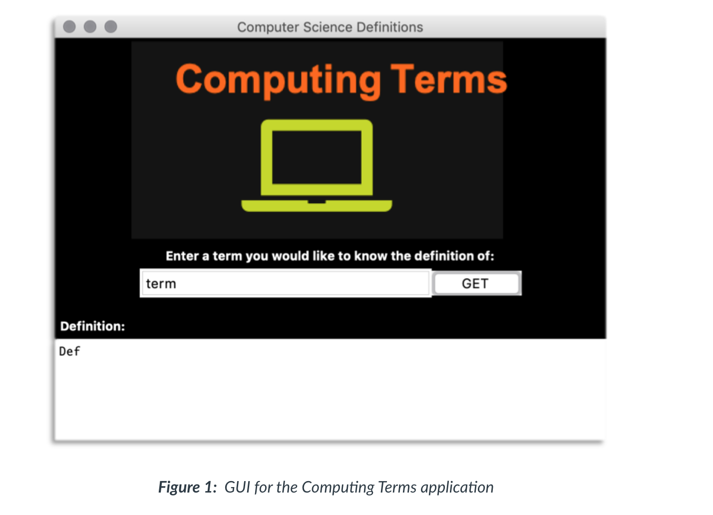</br>

## Special variables

* There are a number of widgets whose purpose is to get data from the user (data entry widgets). The simplest of these
  is the Entry() object for single line text entry (as shown above), but others such as Listbox() and Scale() can get
  data in different ways.

``` 
import tkinter as tk
from tkinter import ttk

def change(event):
    userOutput['text']=entryValue.get()
window = tk.Tk()
window.title("Special Variables")

userInput = tk.Entry(window)
userInput.pack()
userOutput = tk.Label(window)
userOutput.pack()

entryValue = tk.StringVar()
entryValue.set("A  string")
userInput["textvariable"] = entryValue
userInput.bind('<Key-Return>', change)

window.mainloop()
```

* The call-back function change() (line 2)is attached to the Entry() object using the bind() function, line 7. This
  takes a label representing the type of event to listen for, in this case <Key-Return> and the name of the function.
  Block 5 creates one of Tkinter's special variables that enable this functionality and hold a value. In this case
  tk.SpringVar is used for managing Strings. This special variable is then associated with the Entry() textvariable
  parameter, and is effectively adding listener to the Entry() object. If no callback function is bound to the Entry()
  object, the special variable simply acts as a holder for the value entered by the user.
  </br> 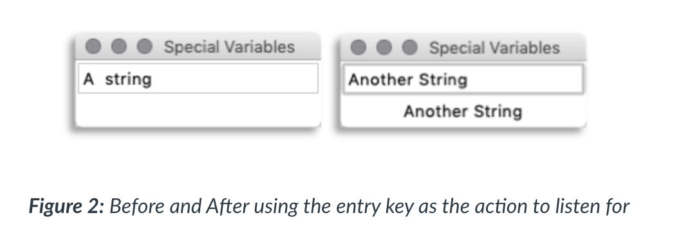</br>

```
import tkinter as tk
from tkinter import ttk
window = tk.Tk()
window.title("Favourite Programming Language")
window.geometry("400x200")

def show_best():
    user_selection.configure(text=languages.get(best.get()))
languages = {1:"Python", 2:"Perl", 3:"Java", 4:"C++", 5:"Ruby"}
best = tk.IntVar()
best.set(1)

tk.Label(window, text='Choose a language:').pack()

for val, language in languages.items():
    tk.Radiobutton(window, text=language, variable=best, value=val, command=show_best).pack()

tk.Label(window, text='You selected:').pack()
user_selection = tk.Label(window, text='none')
user_selection.pack()
window.mainloop()
```

  </br> </br>

## Other methods and constants

* For all the objects in the Tkinter API there are also other parameters (for styling) and other functions for acting on
  the object.
* Tkinter also has a number of constants that can be used with widgets. Such as tk.END used in the first code example
  which determines the end of the test within the text box. The
  tkinter [library pages](https://docs.python.org/3.7/library/tkinter.html) give details of each widget and their
  respective attributes.

### Further Reading:

* Lee K. D. (2014) Python Programming Fundamentals. 2nd Ed. Undergraduate Topics in Computer Science. Springer, Cham Ch
  6 - pp 145-161
* Dawson, M. (2011) Python Programming for the Absolute Beginner, 3rd ed. Cengage Learning. Ch 10

# Other event-driven contexts

* Event-driven programming is a key concept and underpinning paradigm used to develop many of the more sophisticated
  systems running today

## Client-Server Architecture

* A server is a piece of software providing a service of some form. In the context of the WWW, servers offer the service
  of providing web pages. To offer a service it has to be ‘listening’ for requests for that service.
* Where the requests are the ‘events’ and the type of request being made will be ‘handled’ by the server and trigger an
  appropriate ‘action’. While not identical to the processes within a GUI, it is the concept of the event that drives
  the application on the server side. Thus when designing such systems it is effective to think in terms of user
  requests and the application's response to them.
  </br> 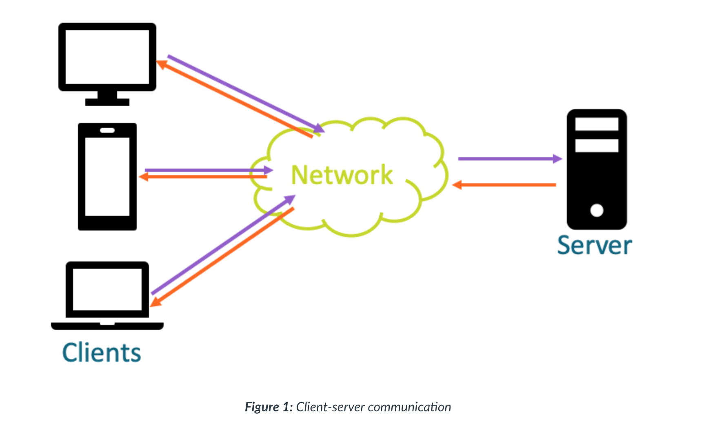</br>

## Internet of Things (IoT)

* IoT devices are generally small and their software light-weight with a limited range of functionality.
* They have a number of different configurations,
    * one of which may be client-server.
    * Another may be ‘push’ based architecture as shown in below. Where multiple clients are pushing (messaging) a
      single control server with data, temperature readings for example.
    * Central control may then be processing or passing on that data, depending on the nature of the system.
    * It may be a system of devices that do not have a central control but can all communicate with each other, whenever
      it is required, a peer-to-peer network

* In all these cases messages or data is being passed from one device to another and all require some type of action to
  that message.
* the central control may not be responding back to each sensor, but it will have to ‘listen’ for the incoming message
  and ‘handle’ the data appropriately by performing some sort of ‘action’. Even if that is simply storing the data for
  later.
  </br> 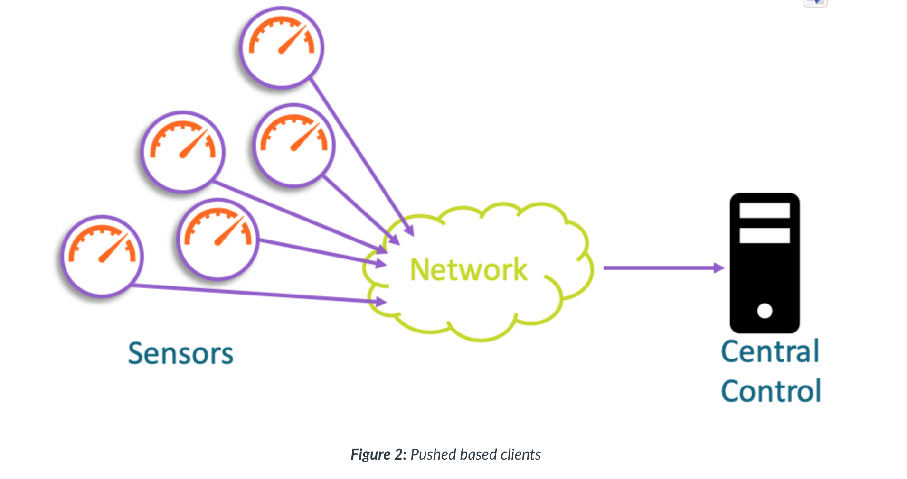</br>

# Production

## Design:

Produce a set of wireframe designs for the application. These do not need to be final, changes can be made after the
formative submissions, however they should focus on giving a complete view of the applications interface (not a
collection of different ideas for one part of the interface). It should be clear how one part of the interface leads to
another, and where any additional windows are opened.

Alongside this produce a set of integration diagrams (state-machines are a possible option here) to demonstrate 2 or 3
key areas of interaction. It should be clear which aspects of the interface these interactions relate too.

## Implementation:

Create a first iteration implementation of the interface design. This may include small adaptations that are different
from the design but you should aim for at least 90% of the design being similar. That is to say it should be very clear
that one (design) is a model of the other (implementation). Avoid designing via coding, you will find the result
disjointed. The key to GUI is design on paper first build second.

## Reflection on design decisions:

Write a 200-word reflection that states the reason for the selection of the layout and components for the interfaces
design. Clearly identify which specific aspects of the requirements or data’s structure informed the decisions. You
should consider what literature supports your reasoning/decisions