## MSC Big Data Analytics Lesson Notes

This module is for MSC Big Data Analytics lessons notes.

## Overview

- [Week-1](#week-1)
- [Week-2](#week-2)
- [Week-3](#week-3)
- [Week-4](#week-4)
- [Week-5](#week-5)
- [Week-6](#week-6)
- [Week-7](#week-7)
- [Books](/big-data-analytics/Books.md)

# WEEK 1

#### Main Topics

After completing this Week you should be able to:

* Reasons might want to ask questions of data
* Explaining the way data is structured in analytics
* Describing a reasonable data science process, and explaining why each step is important
* Applying some basic descriptive statistics
* Explaining why validity and privacy are important concerns in big data analytics

#### Sub titles:

* [Reasons to ask question of data](#reasons-to-ask-question-of-data)
    * [Research Questions](#research-questions)
    * [Data Science](#data-science)
        * [Data Gathering](#data-gathering)
        * [History of Data analysis](#history-of-data-analysis)
        * [Where Is Data Science Used?](#where-is-data-science-used)
            * [Sales and marketing](#sales-and-marketing)
            * [Governments using data science](#governments-using-data-science)
            * [Data science in professional sports](#data-science-in-professional-sports)
        * [Myths about Data Science](#myths-about-data-science)
    * [Possible uses of data science](#possible-uses-of-data-science)
        * [Five projects that are harnessing big data for good](#five-projects-that-are-harnessing-big-data-for-good)
        * [Data science can help us fight human trafficking](#data-science-can-help-us-fight-human-trafficking)
        * [Big data’s arrival in sport is changing the rules of the game](#big-datas-arrival-in-sport-is-changing-the-rules-of-the-game)
        * [Explainer: what is big data?](#explainer-what-is-big-data)
        * [Big data: The next frontier for innovation, competition, and productivity](#big-data-the-next-frontier-for-innovation-competition-and-productivity)
* [Describing a reasonable data science process](#describing-a-reasonable-data-science-process)
    * [What are data and what is a data set ?](#what-are-data-and-what-is-a-data-set-)
    * [The CRISP-DM Process](#the-crisp-dm-process)
* [Describe the way data is structured in analytics](#describe-the-way-data-is-structured-in-analytics)
    * [Input: Concepts, instance, attributes](#input-concepts-instance-attributes)
    * [Concept](#concept)
    * [Example (aka Instances)](#example-aka-instances)
    * [Relations](#relations)
    * [Attribute](#attribute)
* [Statistic](#statistics)
    * [Data basics](#data-basics)
        * [Types of variables](#types-of-variables)
        * [Relationships between variables](#relationships-between-variables)
        * [Explanatory and response variables](#explanatory-and-response-variables)
        * [Observational studies and Experiments](#observational-studies-and-experiments)
    * [Examining numerical data](#examining-numerical-data)
* [Data Validity and Privacy](#data-validity-and-privacy)
* [Todo](#todo)

# Reasons to ask question of data

## Research Questions

* A research question is a question, and it describes something about the world that you don’t know, and that you intend
  to find out.
    * For example, what is the population of York?
* Criterion for research questions:
    * Criterion 1: It needs to be in the form of a question.
    * Criterion 2: It needs to be a complete question
        * For example : are videos a better way to learn? -> Are videos a better way to learn than text? => That’s
          better, it’s a bit more specific
    * Criterion 3: t needs to be narrow enough to answer using data we can collect, and the tools we have available.
        * For example : “are beans healthy?” -> "s there a correlation - statistical term - between average bean
          consumption - a particular measure which will need some operationalising, but it’s a measure you could take -
          and self-reported sick days?"
            * Likewise, it’s not trivial to measure, although the fact that it’s self-report makes it a bit easier; it
              also makes it less reliable but that’s by the by here. But you see you’ve got something you can really
              start to think about measurement and statistical analysis.

* Finding RQ’s is a craft skill:
    * What questions matter to you?
    * What data do you have? or extension, “what data can you easily get?”
    * Write down the questions that come up in your head.
* Always iterate

## Data science

* Data science encompasses a set of principles, problem definitions, algorithms, and processes for extracting non-
  obvious and useful patterns from large data sets.
    * Machine learning (ML) focuses on the design and evaluation of algorithms for extracting patterns from data.
        * “Machine learning” tends to be used when talking about specific algorithms used
            * The field of ML is at the core of modern data science because it provides algorithms that are able to
              automatically analyze large data sets to extract potentially interesting and useful patterns.
            * ML can be seen as automated techniques for finding patterns in data
            * Machine learning involves using a variety of advanced statistical and computing techniques to process data
              to find patterns.
            * GPUs have been adapted and optimized for ML use, which has contributed to large speedups in data
              processing and model training.
            * Data mining generally deals with the analysis of structured data and often implies an emphasis on
              commercial applications.
    * “Data science” is an umbrella term — it includes both of the others
* They can be used interchangeably in many practical contexts

* Data science can extract different type of patterns. Some examples below:
    * Identify groups of customers exhibiting similar behavior and tastes. In business jargon, this task is known as
      **customer segmentation**, and in data science terminology it is called **clustering**
    * Identifies products that are frequently bought together, a process called **association rule mining**.
    * Identify strange or abnormal events, such as fraudulent insurance claims, a process known as **anomaly** or
      **outlier detection**.
    * Identify classification rules as known **prediction**.
        * **Prediction** means deriving unknown properties of an entity from its known properties
        * So it is best to think of prediction patterns as predicting the missing value of an attribute rather than as
          predicting the future.
* Data science becomes useful when we have a large number of data examples and when the patterns are too complex for
  humans to discover and extract manually
* Features or variables means attributes of the data.
* The phrase **actionable insight** is sometimes used in this context to describe what we want the extracted patterns to
  give us.
    * **insight** highlights that the pattern should give us relevant information about the problem that isn’t obvious.
    * **actionable** highlights that the insight we get should also be something that we have the capacity to use in
      some way

### Data Gathering

* Transactional or operational data : Transactional data include event information such as the sale of an item, the
  issuing of an invoice, the delivery of goods, credit card payment, insurance claims, and so on.
* Non-transactional data: Such as demographic data, also have a long history.
* in 1970 Edgar F. Codd published a paper about **relational data** and relational database came up.
* Relational data model: the relational data model, which was revolutionary in terms of setting out how data were (at
  the time) stored, indexed, and retrieved from databases. The relational data model enabled users to extract data from
  a database using simple queries that defined what data the user wanted without requiring the user to worry about the
  underlying structure of the data or where they were physically stored.
    * Relational databases store data in tables with a structure of one row per instance and one column per attribute.
      This structure is ideal for storing data because it can be decomposed into natural attributes.
    * The development of structured query language (SQL) is using.
* Data warehouses: Data warehouses has the technology that was able to bring the data together and reconcile the data
  from disparate databases and that facilitated more complex analytical data operations. This business challenge led to
  the development of data warehouses.
* Meta data: Describe the structure and properties of the raw data.
* NoSQL databases :
    * A NoSQL database stores data as objects with attributes, using an object notation language such as the JavaScript
      Object Notation (JSON).
    * The advantage of using an object representation of data (in contrast to a relational table-based model) is that
      the set of attributes for each object is encapsulated within the object, which results in a flexible
      representation.

* **MapReduce** is a framework on Hadoop. In the MapReduce framework, the data and queries are mapped onto (or
  distributed across) multiple servers, and the partial results calculated on each server are then reduced (merged)
  together.

* Big Data is often defined in terms of the three Vs:
    * Three Vs:
        * Volume:  the extreme volume of data
        * Variety: the variety of the data types,
        * Velocity: and the velocity at which the data must be processed.

### History of Data analysis

* The simplest form of statistical analysis of data is the summarization of a data set in terms of summary (descriptive)
  statistics (including mea- sures of a central tendency, such as the arithmetic mean, or measures of variation, such as
  the range).
    * New developments in mathematics enabled statisticians to move beyond descriptive statistics and to start doing
      statistical learning.

* An engineer named William Playfair was inventing statistical graphics and laying the foundations for modern data
  visualization and exploratory data analysis.
    * He invented line, bar charts
* The advantage of visualizing quantitative data is that it allows us to 12 Chapter 1 use our powerful visual abilities
  to summarize, compare, and interpret data.
* t-distributed stochastic neighbor embedding (t-SNE) algorithm is a useful technique for reducing high-dimensional data
  down to two or three dimensions.
* Maximum likelihood estimate ia a method to draw conclusions based on the relative probability of events
* After the 1940s things started to move faster from the discovery of pattern recognition, neural networks, first steps
  of Machine Learning and then moved onto deep-learning neural networks and ensemble models in our times. Deep-Learning
  refers to a family of Neural Nets with multiple layers.
* The Knowledge Discovery in Databases (KDD), explains the required multidisciplinary approach to analyse large
  databases.
* The terms knowledge discovery in databases and data mining describe the same concept, the distinction being that data
  mining is more prevalent in the business communities and KDD more prevalent in academic communities.
* Breiman’s distinction between a statistical focus on models that explain the data versus an algorithmic focus on
  models that can accurately predict the data highlights a core difference between statisticians and ML researchers
* Today most data science projects are more aligned with the ML approach of build- ing accurate prediction models and
  less concerned with the statistical focus on explaining the data.

* **Skill set for a data scientist**.
    * Data scientists should have some domain expertise
    * Desirable skills: Machine learning, Communication ,Computer science ,Expertise in the application domain of the
      project , Working within the applicable ethical and legal codes
* Data Scientist needs to use HPC technologies.
    * High-performance computing (HPC) involves aggregating computing power to deliver higher performance than one can
      get from a standalone computer.
* computer science skills are also required to be able to understand and develop the ML models and integrate them into
  the production or analytic or back-end applications in an organization.


* When are rigorous processes likely to be useful?
    * When we have a large volume of data examples
    * When we have are trying to find patterns over many attributes of entities

* What are the most important reasons computer science skills are valuable for a data scientist?
    * Understanding and developing machine learning algorithms
    * Using high-performance computing techniques for data processing

* Why have increases in networked app use stimulated
    * The volume of amount and variety of available data has increased

### Where Is Data Science Used?

* Data science drives decision making in nearly all parts of modern societies.
* Cases to show impact of ata science:
    * consumer companies using data science for sales and marketing;
        * The equivalent of up-selling and cross-selling in the online world is the “recommender system.”
    * governments using data science to improve health, criminal justice, and urban planning;
    * professional sporting franchises using data science in player recruitment.

#### Sales and marketing

* By tracking the past customers activities, behavior, analyzing social media trends, analyzing credit card activity
  they are using to recommend some product to customers.
* The equivalent of up-selling and cross-selling in the online world is the “recommender system.”
* Chris Anderson’s book The Long Tail (2008) argues that as pro- duction and distribution get less expensive, markets
  shift from selling large amounts of a small number of hit items to selling smaller amounts of a larger number of niche
  items.

#### Governments using data science

* Governments have recognized the advantages of adopting data science and uses it in different areas from
  health/targetted drop development to track, analyze & control environmental, energy, and transport systems and to
  inform long-term urban planning.
* Data science is also being used to predict crime hot spots and recidivism.

#### Data science in professional sports

* The MoneyBall movie tells the true story of how the Oakland A’s baseball team used data science to improve its player
  recruitment.
* The Moneyball story is a very clear example of how data science can give an organization an advantage in a competitive
  market space. However, from a pure data science perspective perhaps the most important aspect of the moneyball story
  is that it highlights that sometimes the primary value of data science is the **identification of informative
  attributes**.

### Myths about Data Science

* One of the big- gest myths is the belief that data science is an autonomous process that we can let loose on our data
  to find the answers to our problems.
    * In reality, data science requires skilled human oversight throughout the different stages of the process. Humans
      analysts are needed to frame the problem, to design and prepare the data, to select which ML algorithms are most
      appropriate, to critically interpret the results of the analysis, and to plan the appropriate action to take based
      on the insight(s) the analysis has revealed.
* The second big myth of data science is that every data science project needs big data and needs to use deep learning.
    * In general, having more data helps, but having the right data is the more important requirement.
* A third data science myth is that modern data science software is easy to use, and so data science is easy to do.
    * The danger with data science is that people can be intimidated by the technology and believe whatever results the
      soft- ware presents to them. They may, however, have unwittingly framed the problem in the wrong way, entered the
      wrong data, or used analysis techniques with inappropriate assumptions.
    * Data science properly requires both appropriate domain knowledge and the expertise regarding the properties of the
      data and the assumptions underpin- ning the different ML algorithms.
* The last myth about data science we want to mention here is the belief that data science pays for itself quickly.
    * Depends on the context of the organization.
    * data science will not give positive results on every project. Sometimes there is no hidden gem of insight in the
      data,and sometimes the organization is not in a position to act on the insight the analysis has revealed.

# Possible uses of data science

## Five projects that are harnessing big data for good

* [Five projects that are harnessing big data for good](https://theconversation.com/five-projects-that-are-harnessing-big-data-for-good-104844)
* The data science boom shouldn’t be limited to business insights and profit margins. When used ethically, big data can
  help solve some of society’s most difficult social and environmental problems.

### 1. Finding humanitarian hot spots

* This project was made with Australian Red Cross to figure out where the humanitarian hot spots are in Victoria.
* They use social media data to map everyday humanitarian activity to specific locations and found that the hot spots of
  volunteering and charity activity are located in and around Melbourne CBD and the eastern suburbs
* These kinds of insights can help local aid organisations channel volunteering activity in times of acute need.

### 2. Improving fire safety in homes

* In the United States, Enigma Labs built open data tools to model and map risk at the level of individual
  neighbourhoods.
* Their model combines national census data with a geocoder tool (TIGER), as well as analytics based on local fire
  incident data, to provide a risk score.

### 3. Mapping police violence in the US

* The Mapping Police Violence project in the US monitors, make sense of, and visualises police violence.
* It draws on three crowdsourced databases, but also fills in the gaps using a mix of social media, obituaries, criminal
  records databases, police reports and other sources of information

### 4. Optimising waste management

* These smart bins have solar-powered trash compactors that regularly compress the garbage inside throughout the day.
* This eliminates waste overflow and reduces unnecessary carbon emissions, with an 80% reduction in waste collection.

### 5. Identifying hotbeds of street harassment

* A group of four women – and many volunteer supporters – in Egypt developed HarassMap to engage with, and inform, the
  community in an effort to reduce sexual harassment.
* The platform they built uses anonymised, crowdsourced data to map harassment incidents that occur in the street in
  order to alert its users of potentially unsafe areas.

## Data science can help us fight human trafficking

* [Data science can help us fight human trafficking](https://theconversation.com/data-science-can-help-us-fight-human-trafficking-81647)
* Millions individuals worldwide are trapped in some form of modern-day slavery.
* Human trafficking occurs in every country in the world, because it’s one of the largest sources of profit for global
  organized crime, second only to illicit drugs.
* They have some problems:
    * Finding people at risk: They collect some data from goverment or organizations to understand the people who is at
      risk
    * Victim identification and location: Trafficking networks are dynamic. Traffickers are likely to frequently change
      distribution and transportation routes to avoid detection, leaving law enforcement and analysts with incomplete
      information as they attempt to identify and dismantle trafficking networks.
    * Network disruption: Interrupting the flow of people, money and other components of trafficking is critical to
      identifying trafficking networks, disrupting their infrastructure at the source and eliminating them.
* In operations research, scientists apply mathematical methods to answer complex questions about patterns in data and
  predict future trends or behaviors.

## Big data’s arrival in sport is changing the rules of the game

* [Big data’s arrival in sport is changing the rules of the game](https://theconversation.com/big-datas-arrival-in-sport-is-changing-the-rules-of-the-game-33519)
* Using data analysis in sport is complex – not just because of the sheer volume of it, but in finding ways to structure
  and relay many highly dynamic pieces of information to a coach, manager or athlete in order to make quick strategic
  decisions.
* Wearable clothes can collect health data and can use to increase performance of the athletes.
* Not only athletes ,data can use for fans too.
    * By understanding how fans engage with the sport or a team’s brand, decisions can be made about tailored sports
      advertising or broadcast content

## Explainer: what is big data?

* [Explainer: what is big data?](https://theconversation.com/explainer-what-is-big-data-13780)
* Big Data, as the name implies, relates to very large sets of data collected through free or commercial services on the
  internet.
* It is impossible to remove/withdraw information from big data - information once added will persist indefinitely in
  the cloud
* virtually any information that is stored electronically, including information within personal devices, offline data
  storage, even information thought to be deleted, has the potential to be included in big data.
* Data mining is the process of analysing inter-data relationships – connecting the dots and finding hidden meanings and
  relationships that can provide startling new insights.
* It may be argued that the capability to fully analyse internet-scale data will be key to nations in maintaining their
  prosperity and perhaps even security. The future may indeed rest with those with the best big data technologies.

## Big data: The next frontier for innovation, competition, and productivity

* [Big data: The next frontier for innovation, competition, and productivity](https://www.mckinsey.com/business-functions/mckinsey-digital/our-insights/big-data-the-next-frontier-for-innovation)
* The amount of data in our world has been exploding, and analyzing large data sets—so-called big data—will become a key
  basis of competition, underpinning new waves of productivity growth, innovation, and consumer surplus.
* MGI studied big data in five domains—healthcare in the United States, the public sector in Europe, retail in the
  United States, and manufacturing and personal-location data globally.

* There are 5 ways for big data can create a value:
    * Big data can unlock significant value by making information transparent and usable at much higher frequency.
    * As organizations create and store more transactional data in digital form, they can collect more accurate and
      detailed performance information on everything from product inventories to sick days, and therefore expose
      variability and boost performance.
    * Big data allows ever-narrower segmentation of customers and therefore much more precisely tailored products and
      services.
    * Sophisticated analytics can improve decision making.
    * Bid data can used to improve the development of the next generation products and services.

* The use of big data will become a key basis of competition growth for individual firms.
* The use of big data will underpin new waves of productivity growth and consumer surplus.
* Some sectors are set for greater gains.
* There will be a shortage of talent necessary for organizations to take advantage of big data
* Several issues will have to be addressed to capture the full potential of big data. Policies related to privacy,
  security, intellectual property, and even liability will need to be addressed in a big data world.

# Describing a reasonable data science process

## What are data and what is a data set ?

* Data science is fundamentally de- pendent on data. In its most basic form, a datum or a piece of information is an
  abstraction of a real-world entity (person, object, or event).
* The terms variable, feature, and attribute are often used interchangeably to denote an individual abstraction
    * Each entity is typically described by a number of attributes.
* A **data set** consists of the data relating to a collection of entities, with each entity described in terms of a set
  of attributes.
    * A data set is organized in an n * m data matrix called the analytics record, where n is the number of entities (
      rows) and m is the number of at- tributes (columns
* The terms data set and analytics record are often used interchangeably, with the analytics record being a particular
  representation of a data set.

* The terms instance, example, entity, object, case, individual, and record are used in data science literature to refer
  to a **row**.
* The construction of the analytics record is a prerequisite of doing data science.
* Understanding and recognizing different attribute types is a fundamental skill for a data scientist. The standard
  types are **numeric**, **nominal**, and **ordinal**.
* **Numeric** attributes describe measurable quantities that are represented using integer or real values.
* Numeric attributes can be measured on either an **interval scale** or a **ratio scale**.
    * Interval attributes are measured on a scale with a fixed but arbitrary interval and arbitrary origin
        * ie. date and time measurements.
        * It is appropriate to apply order- ing and subtraction operations to interval attributes, but other arithmetic
          operations (such as multiplication and division) are not appropriate
    * Ratio scales are similar to interval scales, but the scale of measurement possesses a true-zero origin.
        * A value of zero indicates that none of the quantity is being measured.
        * Celcius is interval, Kelvin is rational scale.
* **Nominal** (also known as categorical) attributes take values from a finite set. These values are names (hence
  “nominal”)
  for categories, classes, or states of things.
    * ie marital status (sin- gle, married, divorced) and beer type (ale, pale ale, pils, porter, stout, etc.).
    * A binary attribute is a special case of a nominal attribute where the set of possible values is restricted to just
      two values. Boolean
    * Nominal attributes cannot have ordering or arithmetic operations applied to them.
* **Ordinal** attributes are similar to nominal attributes, with the difference that it is possible to apply a rank
  order over the categories of ordinal attributes.
    * ie “strongly dislike, dislike, neutral, like, and strongly like.”
    * there is no notion of equal distance between these values. As a result, it is not appropriate to apply arithmetic
      operations (such as averaging) on ordinal attributes

* The data type of an attribute (numeric, ordinal, nominal) affects the methods we can use to analyze and understand the
  data, including both the basic statistics we can use to describe the distribution of values that an attribute takes
  and the more complex algorithms we use to identify the patterns of relationships between attributes.

* 2 characteristics of data science cannot be overemphasized:
    * for data science to be successful, we need to pay a great deal of attention to how we create our data
    * we also need to “sense check” the results of a data science process. The pattern may simply be based on the biases
      in our data design and capture.

* **Structured data** are data that can be stored in a table, and every instance in the table has the same structure (
  i.e., set of attributes).
    * Structured data can be easily stored, organized, searched, reordered, and merged with other structured data.
* **Unstructured data** are data where each instance in the data set may have its own internal structure, and this
  structure is not necessarily the same in every instance
    * ie collections of human text (emails, tweets, text messages, posts, novels, etc.) can be considered unstructured
      data, as can collections of sound, image, music, video, and multimedia files.
* We can often extract structured data from unstructured data using techniques from artificial intelligence (such as
  natural-language processing and ML), digital signal processing, and computer vision. However processes is expensive
  and time-consuming and can add significant financial overhead and time delays to a data science project.
* Data can also be **derived** from other pieces of data.
    * ie the average salary in a company or the variance in the temperature of a room across a period of time.
* It is frequently the case that the real value of a data science project is the identification of one or more important
  derived attributes that provide insight into a problem
* There are generally two terms for gathered raw data: captured data and exhaust data (Kitchin 2014a).
    * **Captured data** are collected through a direct measurement or observation that is designed to gather the data.
    * By contrast, **exhaust data** are a by-product of a process whose primary purpose is something other than data
      capture.
        * primary purpose of the Amazon website is to enable users to make purchases from the site. However, each
          purchase generates volumes of exhaust data: what items the user put into her basket, how long she stayed on
          the site, what other items she viewed, and so on.
    * One of the most common types of exhaust data is **metadata**—that is, data that describe other data.
* DIKW pyramid: Eliot’s hierarchy mirrors the standard model of the structural relationships between wisdom,
  knowledge,information, and data known as the DIKW pyramid
    * Data are created through abstractions or measurements taken from the world.
    * Information is data that have been processed, structured, or contextualized so that it is meaningful to humans.
    * Knowledge is information that has been interpreted and understood by a human so that she can act on it if
      required.
    * Wisdom is acting on knowledge in an appropriate way.


## The CRISP-DM Process

* Cross Industry Standard Process for Data Mining (CRISP- DM)
* Most of the companies are using this pyramid to follow.
* The main advantage of CRISP-DM is that it is designed to be independent of any software, vendor, or data-analysis
  technique.
* CRISP-DM was originally developed by a consortium of organizations consisting of leading data science vendors, end
  users, consultancy companies, and researchers.


* CRISP-DM lifecycle consists of 6 stages:
    * Business understanding
        * investigating the business objectives and requirements, deciding whether data mining can be applied to meet
          them, and determining what kind of data can be collected to build a deployable model.
    * Data understanding
        * In the fist 2 steps, the data scientist is trying to define the goals of the project by understanding the
          business needs and the data that the business has available to it.
        * The process typically involves identifying a business problem and then exploring if the appropriate data are
          available to develop a data-driven solution to the problem
        * an initial dataset is established and studied to see whether it is suitable for further processing. If the
          data quality is poor, it may be necessary to collect new data based on more stringent criteria.
    * Data preparation
        * The focus of the data-preparation stage is the creation of a data set that can be used for the data analysis
        * This involves creating the data set by integrating data from different sources, also identifying outliers and
          missing values and cleaning data.
        * Preparation involves preprocessing the raw data so that machine learning algorithms can produce a
          model—ideally, a structural description of the information that is implicit in the data.
    * Modeling
        * This is the stage where automatic algorithms are used to extract useful patterns from the data and to create
          models that encode these patterns. ML is using for it.
        * the initial model test results will uncover problems in the data. This can help to investigate the data errors
          in first hand for data science and they can revisit data again and fix.
        * Preprocessing may include model building activities as well, because many preprocessing tools build an
          internal model of the data to transform it. In fact, data preparation and modeling usually go hand in hand. It
          is almost always necessary to iterate: results obtained during modeling provide new insights that affect the
          choice of preprocessing techniques.
    * Evaluation
        * Do the structural descriptions inferred from the data have any predictive value, or do they simply reflect
          spurious regularities?
        * If the evaluation step shows that the model is poor, you may need to reconsider the entire project and return
          to the business understanding step to identify more fruitful business objectives or avenues for data
          collection. If, on the other hand, the model’s accuracy is sufficiently high, the next step is to deploy it in
          practice.
    * Deployment
        * These 2 process are focused on how the models fit the business and its processes.
        * The evaluation phase involves assessing the models in the broader context defined by the business needs. This
          also help data science can validate business needs, improve the model and last controls
        * The deployment phase involves examining how to deploy the selected models into the business environment.
            * This involves planning how to integrate the models into the organization’s techni- cal infrastructure and
              business processes.

* Outer Ciscle means iterate whole the process periodicly
    * Because there are many reasons why a data-driven model can become obsolete:
        * the business’s needs might have changed;
        * the process the model emulates and provides insight into might have changed
        * the data streams the model uses might have changed

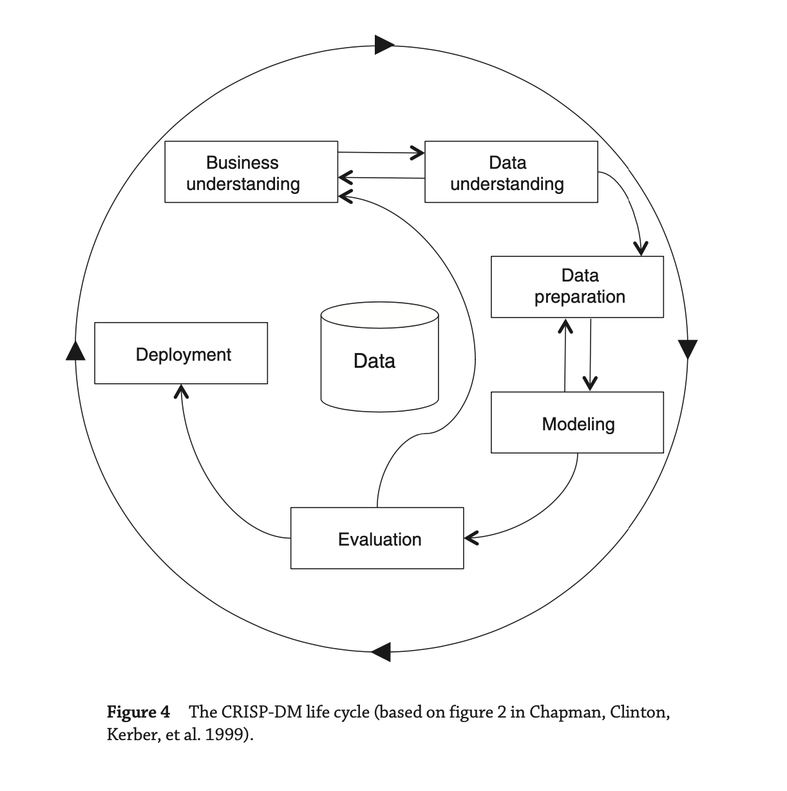

* According to a survey, data scientists spend 79% of their time on data preparation, 19% for collection and 60% for
  cleaning up & reshaping etc, building training sets, mining data for patterns and refining algorithms 16% and 5% for
  other tasks.


# Describe the way data is structured in analytics

## Input: Concepts, instance, attributes

* The input takes the form of concepts, instances, and attributes. We call the thing that is to be learned a **concept**
  **description**.
* The result of the learning process is a description of the concept that is, ideally, intelligible in that it can be
  understood, discussed, and disputed, and operational in that it can be applied to actual examples.
* The set of the data given to ML named as instance and each instance was an individual, independent example of the
  concept to be learned.
* Each instance is characterized by the values of attributes that measure different aspects of the instance.There are
  many different types of attribute, although typical machine learning schemes deal only with numeric and nominal, or
  categorical, ones.

## Concept

* 4 different learning in data mining:
    * Classification learning : the learning scheme is presented with a set of classified examples from which it is
      expected to learn a way of classifying unseen examples.
    * Association learning:any association among features is sought, not just ones that predict a particular class
      value.
    * Clustering : groups of examples that belong together are sought
    * Numeric prediction : the outcome to be predicted is not a discrete class but a numeric quantity.
* The result to be learned called as **concept** and the output produced by a learning scheme the **concept
  description**.
* Classification learning is sometimes called **supervised** because, in a sense, the scheme operates under supervision
  by being provided with the actual outcome for each of the training examples the play or don’t play judgment,
    * The success of classification learning can be judged by trying out the concept description that is learned on an
      independent set of test data for which the true classifications are known but not made available to the machine
* Association rules differ from classification rules in two ways:
    * they can “predict” any attribute, not just the class,
    * they can predict more than one attribute’s value at a time
* Because of differ there are far more association rules than classification rules, and the challenge is to avoid being
  swamped by them
* Association rules usually involve only nonnumeric attributes: thus you wouldn’t normally look for association rules in
  the iris dataset.

* Clustering is used to group items that seem to fall naturally together, when there is no specified class,
    * The challenge is to find these clusters and assign the instances to them—and to be able to assign new instances to
      the clusters as well
    * The success of clustering is often measured subjectively in terms of how useful the result appears to be to a
      human user. It may be followed by a second step of classification learning in which rules are learned that give an
      intelligible description of how new instances should be placed into the clusters.

## Example (aka Instances)

* The input to a machine learning scheme is a set of instances.
* These instances are the things that are to be classified, or associated, or clustered.
* In the standard scenario, each instance is an individual, independent example of the concept to be learned.
* Instances are characterized by the values of a set of predetermined attributes
* The instances are the rows of the tables that represent each data point, record.

## Relations

* The idea of specifying only positive examples and adopting a standing assumption that the rest are negative is called
  the **closed world assumption**.
* You can take a relationship between different nodes of a tree and recast it into a set of independent instances
* Relational data is more complex than a flat file.
* Denormalization called a process of flattening that is technically. In database terms, you take two relations and join
  them together to make one.
    * It is always possible to do this with any (finite) set of (finite) relations, but denormalization may yield sets
      of rows that need to be aggregated to form independent instances.
* Problems in denormalization:
    * When you create some other superrelations for each data set, then the computational and can cause enormous cost in
      space
    * It can generate spurious regularities in the data, and it is essential to check the data for such artifacts before
      applying a learning scheme
* Computer scientists usually use recursion to deal with situations in which the number of possible examples is
  infinite.
    * This is addressed in a subdiscipline of machine learning called **inductive logic programming**
    * Potentially infinite concepts can be dealt with by learning rules that are recursive.
    * The real drawbacks of such techniques, however, are that they do not cope well with noisy data, and they tend to
      be so slow as to be unusable on anything but small artificial datasets.
* Some important real-world problems are most naturally expressed in a multi-instance format, where each example is
  actually a separate set of instances. This “**multi-instance**” setting covers some important real-world applications.
    * The goal of multi-instance learning is still to produce a concept description,
        * But the task is more difficult because the learning algorithm has to contend with incomplete information about
          each training example.

## Attribute

* Each instance that provides the input to machine learning is characterized by its values on a fixed, predefined set of
  features or attributes
* Attributes are the columns of table.
* **Numeric attributes**, sometimes called **continuous** attributes, measure numbers—either real or integer valued.
* **Nominal attributes** take on values in a prespecified, finite set of possibilities and are sometimes called
  categorical.
    * The values them- selves serve just as labels or names, for example, in the weather data the attribute outlook has
      values sunny, overcast, and rainy.
    * There is no ordering and distance value each other, does not make sense to add the values together, multiply them,
      or even compare their size.
    * Nominal attributes are sometimes called categorical, enumerated, or discrete. Enumerated is the standard term used
      in computer science to denote a categorical data type;
    * A special case of the nominal scale is the **dichotomy**, which has only two members—often designated as true and
      false, or yes and no in the weather data. Such attributes are sometimes called Boolean.
* **Ordinal attributes** are ones that make it possible to rank order the categories. However, although there is a
  notion of ordering, there is no notion of distance.
    * For example : hot > mild > cool or strongly dislike, dislike , like , strongy like
    * Ordinal attributes are often coded as numeric data, or perhaps continuous data, but without the implication of
      mathematical continuity.
* **Ratio quantities** are ones for which the measurement scheme inherently defines a zero point.
    * For example, when measuring the distance from one object to another, the distance between the object and itself
      forms a natural zero.
    * Ratio quantities are treated as real numbers: any mathematical operations are allowed.
* Notice that the distinction between nominal and ordinal attributes is not always straightforward and obvious
* Metadata is data about data. Machine learning systems can use a wide variety of other information about attributes, we
  use metadata for it.

# Statistics

## Intro

* A summary statistic is a single number summarizing a large amount of data.
* the primary results of the study after 1 year could be described by two summary statistics: the proportion of people
  who had a stroke in the treatment and control groups.
    * Proportion who had a stroke in the treatment (stent) group: 45/224 = 0.20 = 20%.
    * Proportion who had a stroke in the control group: 28/227 = 0.12 = 12%.
* This summary statistic is important for 2 reasons:
    * First, This is contrary when doctors expected which was that stents would reduce the rate of strokes
    * Second, It leads to a statistical question: do the data show a “real” difference between the groups?
* The larger the difference we observe (for a particular sample size), the less believable it is that the difference is
  due to chance. So what we are really asking is the following: is the difference so large that we should reject the
  notion that it was due to by chance?
* Important! Do not generalize the results of this study to all patients and all stents.


## Data basics

* Data matrix is a convenient and common way to organize data, especially if collecting data in a spreadsheet.
* Each row of a data matrix corresponds to a **unique case (observational unit)**
* Each column corresponds to a **variable**.
* Image below , each row represents an instance of a loan   
  

### Types of variables


* Numerical variable can take a wide range of numerical values
    * It is sensible to add, subtract, or take averages with those values.
    * Discrete values are values only can take non-negative numeric values
    * Decimal variables also called continuous.
* Categorical variable are to categorise the data and possible values are called the variable’s **levels**
    * When there is no ordering between these values is meaningful, they are called **nominal** variables.
    * When there is a natural ordering, ie level of education -> high school, college etc, then it is **ordinal**.

### Relationships between variables

* Examining summary statistics could provide insights for each of the three questions about counties. Additionally,
  graphs can be used to visually explore data.
* The scatterplot suggests a relationship between the two variables: counties with a higher rate of multi-units tend to
  have lower homeownership rates.
* When two variables show some connection with one another, they are called associated variables (dependent).
    * Negative association sample, counties with more units in multi-unit structures are associated with lower
      homeownership
    * Possiive association: where counties with higher median household income tend to have higher rates of population
      growth.

* A pair of variables are either related in some way (associated) or not (independent). No pair of variables is both
  associated and independent.

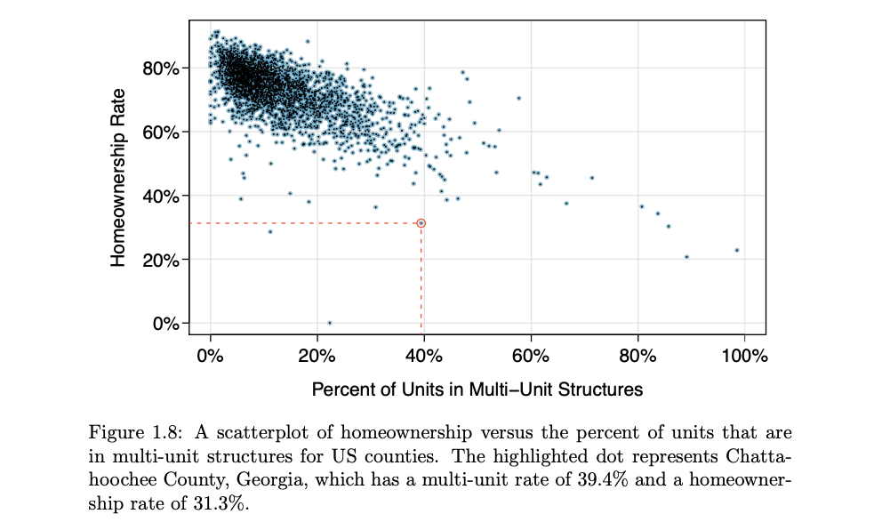

### Explanatory and response variables

* When we suspect one variable might causally affect another, we label the **first** variable the **explanatory
  variable** and the **second** the **response variable**.
    * explanatory variable --- might affect ---> response variable
* For many pairs of variables, there is no hypothesized relationship, and these labels would not be applied to either
  variable in such cases.

### Observational studies and Experiments

* Researchers perform an **observational study** when they collect data in a way that does not directly interfere with
  how the data arise.
    * researchers may collect information via surveys, review medical or company records, or follow a cohort of many
      similar individuals to form hypotheses about why certain diseases might develop.
* When researchers want to investigate the possibility of a causal connection, they conduct an **experiment**.
    * Usually, there will be both an explanatory and a response variable. When individuals/test units are randomly
      assigned to a group, the experiment is called a randomised experiment.
* **Association != Causation** association does not imply causation, and causation can only be inferred from a
  randomized experiment.

## Examining numerical data

* **Scatterplot** : A scatterplot provides a case-by-case view of data for two numerical variables.
    * Scatterplots are helpful in quickly spotting associations relating variables, whether those associations come in
      the form of simple trends or whether those relationships are more complex.

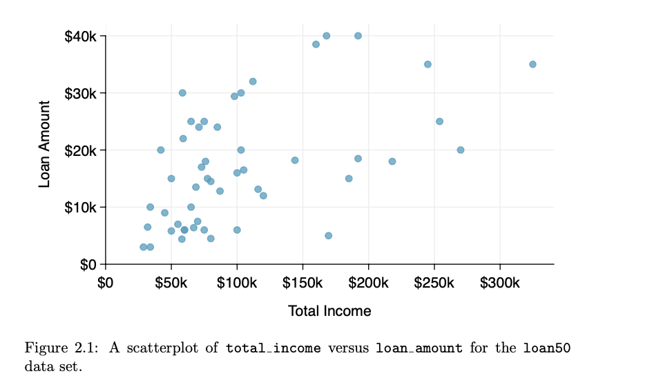  

* **Dot plots and the mean:** Sometimes two variables are one too many: only one variable may be of interest.
    * In these cases, a dot plot provides the most basic of displays. A dot plot is a one-variable scatterplot; an
      example using the interest rate of 50 loans is shown
    * The **mean**, often called the **average**, is a common way to measure the center of a **distribution** of data.
        * The mean is useful because it allows us to rescale or standardize a metric into something more easily
          interpretable and comparable

    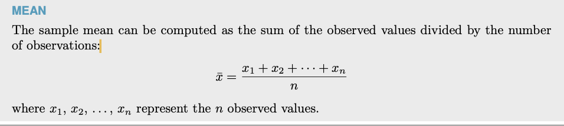

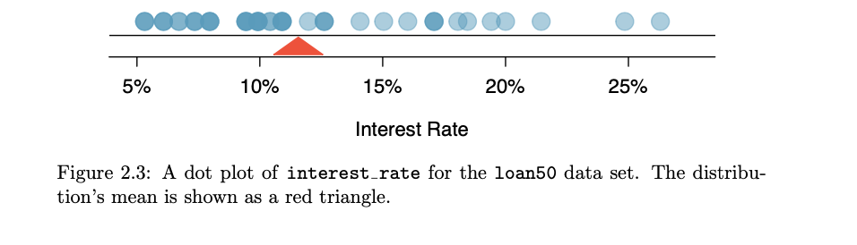


* **Histogram and shape:**
    * Dot plots show the exact value for each observation. This is useful for small data sets, but they can become hard
      to read with larger samples. Rather than showing the value of each observation, we prefer to think of the value as
      belonging to a bin.
    * These binned counts are plotted as bars into what is called a histogram, which resembles a more heavily binned
      version of the stacked dot plot
    * Histograms provide a view of the **data density**. Higher bars represent where the data are relatively more
      common.
    * Histograms are especially convenient for understanding the shape of the data distribution.
    * Long tail to identify skew : When data trail off in one direction, the distribution has a long tail. If a
      distribution has a long left tail, it is **left skewed.** If a distribution has a long right tail, it is **right
      skewed.** When is equal then it is symentric.
    * Histograms can be used to identify modes. A **mode** is represented by a prominent peak in the distribution.
        * Distributions are called unimodal, bimodal, and multimodal, respectively.

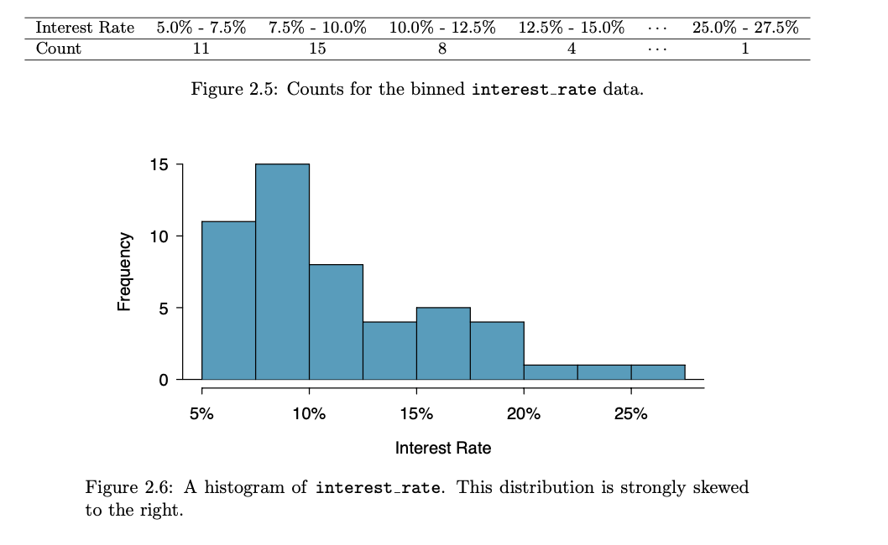<br>
<br>

* **Deviation:** We call the distance of an observation from its mean its deviation.
    * Below are the deviations for the 1st, 2nd, 3rd, and 50th observations in the interest rate variable:
      <br>
* **Variance:** If we square these deviations and then take an average, the result is equal to the sample variance,
  denoted by s2
    * in a short desc, The variance is the average squared distance from the mean.
    * We divide by n − 1, rather than dividing by n, when computing a sample’s variance; there’s some mathematical
      nuance here, but the end result is that doing this makes this statistic slightly more reliable and useful

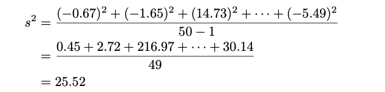<br>

* **Standard deviation** is defined as the square root of the variance:
  <br>
    * The standard deviation is the square root of the variance.
    * The standard deviation is useful when considering how far the data are distributed from the mean.
    * Deviations does two things:
        * First, it makes large values relatively The standard deviation is defined as the square root of the variance:
          much larger
        * it gets rid of any negative signs by square

<br>

* **Box plot:** A box plot summarizes a data set using five statistics while also plotting unusual observations.
    * The first step in building a box plot is drawing a dark line denoting the **median**, which splits the data in
      half.
      <br>
* **Median**:
  If the data are ordered from smallest to largest, the median is the observation right in the middle. If there are an
  even number of observations, there will be two values in the middle, and the median is taken as their average.
* **Interquartile range**: The IQR is the length of the box in a box plot. It is computed as **IQR = Q3 − Q1** where Q1
  and Q3 are the 25th and 75th percentiles.
    * The two boundaries of the box are called the **first quartile** (the 25th percentile, i.e. 25% of the data fall
      below this value) and the **third quartile** (the 75th percentile), and these are often labeled Q1 and Q3,
      respectively.
* The **whiskers** attempt to capture the data outside of the box. However, their reach is never allowed to be more than
  1.5 × IQR. They capture everything within this reach
    * Extending out from the box, the whiskers attempt to capture the data outside of the box but their reach is never
      allowed to be more than 1.5 × IQR, Q3 + 1.5 * IQR and Q1 - 1.5 * IQR.
    * Any observation lying beyond the whiskers are labeled with dot and called **outlier**
* An **outlier** is an observation that appears extreme relative to the rest of the data. Examining data for outliers
  serves many useful purposes, including
    * Identifying strong skew in the distribution.
    * Identifying possible data collection or data entry errors.
    * Providing insight into interesting properties of the data.

* **Robust statistics**:
    * The median and IQR are called **robust statistics** because **extreme observations have little effect** on their
      values: moving the most extreme value generally has little influence on these statistics.
    * On the other hand, the mean and standard deviation are **more heavily influenced by changes** in extreme
      observations, which can be important in some situations

  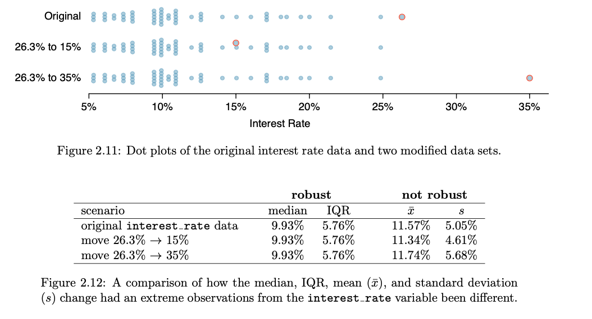<br>

* Transforming data (special topic):  When data are very strongly skewed, we sometimes transform them so they are easier
  to model.
    * A transformation is a rescaling of the data using a function.
        * For instance, a plot of the logarithm (base 10) of county populations results in the new histogram in Figure
          2.13(b). This data is symmetric, and any potential outliers appear much less extreme than in the original data
          set.
    * By reigning in the outliers and extreme skew, transformations like this often make it easier to build statistical
      models against the data
    * Transformations other than the logarithm can be useful, too. For instance, the square root ( original observation)
      and inverse ( 1 / original observation ) are commonly used by data scientists.
    * Common goals in transforming data are to see the data structure differently, reduce skew, assist in modeling, or
      straighten a nonlinear relationship in a scatterplot.

      <br>
      <br>

# Data Mining and Ethics

* The useful data, the data that's about people, usually have implications. Therefore data miners should be aware of
  these and act responsibly.
* The discriminative application of data mining, like who does and doesn't get the loan, is common but when it
  discriminates based on race, sexual orientation etc, then it's unethical and/or illegal.
    * However, using racial or sexual information might still be required for medical diagnosis. So, it depends on the
      application.
* There is also the chance of building models that indirectly rely on discriminating information. For example, excluding
  racial information but using postcode is problematic where certain ethnicities group in certain areas.
* Reidentification techniques have provided shocking insights into the difficulty of anonymizing data. It turns out,
  e.g., that over 85% of Americans can be identified from publicly available records using just three pieces of
  information: five-digit ZIP code, birthdate and gender or if city info is available instead of zipcode, over 50% of
  Americans can still be identified.
    * Stories abound of companies releasing allegedly anonymous data in good faith, only to find that many individuals
      are easily identifiable.
    * For example from Netflix rating data, it's possible to identify all the movies someone has watched if a few movies
      they rated and their approximate dates are known,
    * The moral is that if you really do remove all possible identification information from a database, you will
      probably be left with nothing useful.
* Before people make a decision to provide personal information they need to know how it will be used and what it will
  be used for.
    * This information needs to provide straightforwardly in plain language they can understand not not in legalistic
      small print
    * The potential use of data mining techniques may stretch far beyond what was conceived when the data was originally
      collected. Thats why it has to be clear to determine the conditions under which the data was collected and for
      what purposes it may be used
* The ownership of data doesn't bestow the right to use it in ways other than those purported when it was originally
  recorded, however, in reality, the situation is complex.
* The discriminative type of applications of insurance companies, for example, ie higher insurance premiums for younger
  males, are based on stereotypes and statistical correlations.
* As well as community standards, purely statistical correlations also must be subject to logical and scientific
  standards. For example, if statistics show that red car owners as posing greater credit risks, this begs for further
  investigation and explanation.
* Machine learning is a technology that we need to take seriously.

## Smartphone data tracking is more than creepy

* [Shutterstock Smartphone data tracking is more than creepy – here’s why you should be worried](https://theconversation.com/smartphone-data-tracking-is-more-than-creepy-heres-why-you-should-be-worried-91110)

## With smart cities, your every step will be recorded

* [With smart cities, your every step will be recorded](https://theconversation.com/with-smart-cities-your-every-step-will-be-recorded-94527)

# TODO:

    * 1.8.1 Activity -> Diez 1.1-1.8 do it.
    * 1.8.3 Activity -> Diez 2.1-2.1.8 fo it
    * 1.8.4 Activity 
    * 1.9.1 Discussion
    * Week 1: Activity Forum: https://onlinestudy.york.ac.uk/courses/577/discussion_topics/19736?module_item_id=48187


# WEEK 2

#### Main Topics

* Regression and prediction — the two forms of prediction
* Using linear regression to predict numerical values
* Using decision trees to predict classifications
* Evaluating predictions

#### Sub titles:

* [Key concepts in machine learning](#key-concepts-in-machine-learning)
    * [FIELDED APPLICATIONS](#fielded-applications)
    * [MACHINE LEARNING AND STATISTICS](#machine-learning-and-statistics)
* [Machine Learning 101](#machine-learning-101)
    * [Supervised versus Unsupervised Learning](#supervised-versus-unsupervised-learning)
* [Standard Data Science Tasks](#standard-data-science-tasks)
    * [Clustering (Who Are Our Customers?)](#clustering-who-are-our-customers)
    * [Anomaly Detection or outlier analysis (Is This Fraud?)](#anomaly-detection-or-outlier-analysis-is-this-fraud)
    * [Association-Rule Mining (Do You Want Fries with That?)](#association-rule-mining-do-you-want-fries-with-that)
    * [Classification (Churn or No Churn, That Is the Question)](#classification-churn-or-no-churn-that-is-the-question)
    * [Regression (How Much Will It Cost?)](#regression-how-much-will-it-cost)
* [Linear regression](#linear-regression)
* [Correlations](#correlations)
    * [Correlations & Regression](#correlations--regression)
* [Knowledge presentation](#knowledge-presentation)
* [Decision trees](#decision-trees)
* [Evaluating learned models](#evaluating-learned-models)
    * [Predict Performance](#predict-performance)
    * [Cross Validation](#cross-validation)
    * [Evaluating Numeric Prediction](#evaluating-numeric-prediction)
    * [Confusion matrices and accuracy scores](#confusion-matrices-and-accuracy-scores)
    * [Receiver Operation Characteristic Curve (ROC)](#receiver-operation-characteristic-curve-roc)
* [TODO](#todo)

# Key concepts in machine learning

* What is a concise definition of “machine learning”?
* What is the difference between “machine learning” and “data mining”?
* Why is it valuable to think about machine learning as part of a wider process?
* Should we make a clear distinction between “machine learning” and “statistics”?

* In data mining, the data is stored electronically and the search is automated—or at least augmented—by computer.
* As the world grows in complexity, overwhelming us with the data it generates, data mining becomes our only hope for
  elucidating hidden patterns. Intelligently analyzed data is a valuable resource. It can lead to new insights, better
  decision making, and, in commercial settings, competitive advantages.
* Data mining is about solving problems by analyzing data already present in databases.
* In today’s highly competitive, customer-centered, service-oriented economy, data is the raw material that fuels
  business growth.
* Data mining is defined as the process of discovering patterns in data. The process must be automatic or (more usually)
  semiautomatic. The patterns discovered must be meaningful in that they lead to some advantage—e.g., an economic
  advantage. The data is invariably present in substantial quantities.
* Useful patterns allow us to make nontrivial predictions on new data. There are two extremes for the expression of a
  pattern: as a black box whose innards are effectively incomprehensible and as a transparent box whose construction
  reveals the structure of the pattern.
    * The difference is whether or not the patterns that are mined are represented in terms of a structure that can be
      examined, reasoned about, and used to inform future decisions. Such patterns we call structural because they
      capture the decision structure in an explicit way. In other words, they help to explain something about the data.
    * Most of this book is about techniques for finding and describing structural patterns in data, but there are
      applications where black-box methods are more appropriate because they yield greater predictive accuracy, and we
      also cover those.
* STRUCTURAL PATTERNS
    * Part of a structural description of this information might be as follows:
      If tear production rate 5 reduced then recommendation 5 none Otherwise, if age 5 young and astigmatic 5 no then
      recommendation 5 soft
    * Structural descriptions need not necessarily be couched as rules such as these. Decision trees, which specify the
      sequences of decisions that need to be made along with the resulting recommendation, are another popular means of
      expression.
    * The rules do not really generalize from the data; they merely summarize it. In most learning situations, the set
      of examples given as input is far from complete, and part of the job is to generalize to other, new examples.
    * The preceding rules classify the examples correctly, whereas often, because of errors or noise in the data,
      misclassifications occur even on the data that is used to create the classifier.
* MACHINE LEARNING
    * Our dictionary defines “to learn” as
        * to get knowledge of by study, experience, or being taught; to become aware by information or from observation;
        * to commit to memory;
        * to be informed of, ascertain;
        * to receive instruction.
    * First 2 is hard for computers but the last 3 computers can do easly
    * Learning implies thinking. Learning implies purpose. Something that learns has to do so intentionally. That is why
      we wouldn’t say that a vine has learned to grow round a trellis in a vineyard—we’d say it has been trained.
      Learning without purpose is merely training
    * Thus on closer examination the second definition of learning, in operational, performance-oriented terms, has its
      own problems when it comes to talking about computers. To decide whether something has actually learned, you need
      to see whether it intended to, whether there was any purpose involved
    * Philosophical discussions of what is really meant by “learning,” like discussions of what is really meant by
      “intention” or “purpose,” are fraught with difficulty.

* DATA MINING
    * Data mining is a practical topic and involves learning in a practical, not a theoretical, sense. We are interested
      in techniques for finding patterns in data, patterns that provide insight or enable fast and accurate decision
      making.
    * Many learning techniques look for structural descriptions of what is learned, descriptions that can become fairly
      complex and are typically expressed as sets of rules such as the ones described previously or the decision trees
    * Experience shows that in many applications of machine learning to data mining, the explicit knowledge structures
      that are acquired, the structural descriptions, are at least as important as the ability to perform well on new
      examples.
        * People frequently use data mining to gain knowledge, not just predictions.

* Weather problem:
    * In general, examples in a dataset are characterized by the values of features, or attributes, that measure
      different aspects of the example
    * A set of rules that are intended to be interpreted in sequence is called a decision list. Interpreted as a
      decision list, the rules correctly classify all of the examples in the table, whereas taken individually,
    * n the slightly more complex form shown in Table 1.3, two of the attributes—temperature and humidity—have numeric
      values. This means that any learning scheme must create inequalities involving these attributes, rather than
      simple equality tests as in the former case. This is called a numeric-attribute problem—in this case, a
      mixed-attribute problem because not all attributes are numeric.
    * The rules we have seen so far are classification rules: they predict the classification of the example in terms of
      whether to play or not. It is equally possible to disregard the classification and just look for any rules that
      strongly associate different attribute values. These are called association rules.

* Contact lences: an idealized problem
    * People frequently use machine learning techniques to gain insight into the structure of their data rather than to
      make predictions for new cases. In fact, a prominent and successful line of research in machine learning began as
      an attempt to compress a huge database of possible chess endgames and their outcomes into a data structure of
      reasonable size.
    * The data structure chosen for this enterprise was not a set of rules but a decision tree.
    * a structural description for the contact lens data in the form of a decision tree, which for many purposes is a
      more concise and perspicuous representation of the rules and has the advantage that it can be visualized more
      easily.

* Ireses: Classic numeric data set
    * These rules are very cumbersome, and we will see in Chapter 3, Output: knowledge representation, how more compact
      rules can be expressed that convey the same information.

* CPU performance: Introducing Numeric prediction
    * The classic way of dealing with continuous prediction is to write the outcome as a linear sum of the attribute
      values with appropriate weights, e.g.,

    * This is called a linear regression equation, and the process of determining the weights is called linear
      regression, a well-known procedure in statistics
    * The basic regression method is incapable of discovering nonlinear relationships, but variants exist

* Labor negotiations: More realistic example
    * In fact, Fig. 1.3B is a more accurate representation of the training dataset than Fig. 1.3A. But it is not
      necessarily a more accurate representation of the underlying concept of good versus bad contracts. Although it is
      more accurate on the data that was used to train the classifier, it may perform less well on an independent set of
      test data. It may be “overfitted” to the training data—following it too slavishly.

* soybean classification:
    * An often quoted early success story in the application of machine learning to practical problems is the
      identification of rules for diagnosing soybean diseases. The data is taken from questionnaires describing plant
      diseases.
    * These rules nicely illustrate the potential role of prior knowledge—often called domain knowledge—in machine
      learning, for in fact the only difference between the two descriptions is leaf condition is normal versus leaf
      malformation is absent. Now, in this domain, if the leaf condition is normal then leaf malformation is necessarily
      absent, so one of these conditions happens to be a special case of the other

## FIELDED APPLICATIONS

* Being fielded applications, the illustrations that follow tend to stress the use of learning in performance
  situations, in which the emphasis is on the ability to perform well on new examples.
    * WEB MINING
        * Search engine companies examine the hyperlinks in web pages to come up with a measure of “prestige” for each
          web page and website. Dictionaries define prestige as “high standing achieved through success or influence.”
        * A metric called PageRank, introduced by the founders of Google and used in various guises by other search
          engine developers too, attempts to measure the standing of a web page. The more pages that link to your
          website, the higher its prestige.
        * Another way in which search engines tackle the problem of how to rank web pages is to use machine learning
          based on a training set of example
        * queries—documents that contain the terms in the query and human judgments about how relevant the documents are
          to that query. Then a learning algorithm analyzes this training data and comes up with a way to predict the
          relevance judgment for any document and query.
        * Search engines mine the content of the Web. They also mine the content of your queries—the terms you search
          for—to select advertisements that you might be interested in
        * And then there are social networks and other personal data. We live in the age of selfrevelation: people share
          their innermost thoughts in blogs and tweets, their photographs, their music and movie tastes, their opinions
          of books, software, gadgets, and hotels, their social life. They may believe they are doing this anonymously,
          or pseudonymously, but often they are incorrect
    * DECISIONS INVOLVING JUDGMENT
    * When you apply for a loan, you have to fill out a questionnaire asking for relevant financial and personal
      information.
        * made in two stages: first, statistical methods are used to determine clear “accept” and “reject” cases. The
          remaining borderline cases are more difficult and call for human judgment.
    * A machine learning procedure was used to produce a small set of classification rules that made correct predictions
      on two-thirds of the borderline cases in an independently chosen test set.
        * Not only did these rules improve the success rate of the loan decisions, but the company also found them
          attractive because they could be used to explain to applicants the reasons behind the decision.
        * Although the project was an exploratory one that took only a small development effort, the loan company was
          apparently so pleased with the result that the rules were put into use immediately.
    * SCREENING IMAGES
    * Radar satellites provide an opportunity for monitoring coastal waters day and night, regardless of weather
      conditions.
    * A hazard detection system has been developed to screen images for subsequent manual processing.
    * Machine learning allows the system to be trained on examples of spills and nonspills supplied by the user and lets
      the user control the tradeoff between undetected spills and false alarms.
    * DIAGNOSIS
    * Diagnosis is one of the principal application areas of expert systems. Although the hand-crafted rules used in
      expert systems often perform well, machine learning can be useful in situations in which producing rules manually
      is too labor intensive.
    * The goal was not to determine whether or not a fault existed, but to diagnose the kind of fault, given that one
      was there.
        * Thus there was no need to include fault-free cases in the training set. The measured attributes were rather
          low level and had to be augmented by intermediate concepts,
        * i.e., functions of basic attributes, which were defined in consultation with the expert and embodied some
          causal domain knowledge
        * It is interesting to note, however, that the system was put into use not because of its good performance but
          because the domain expert approved of the rules that had been learned
    * MARKETING AND SALES
    * Market basket analysis is the use of association techniques to find groups of items that tend to occur together in
      transactions, e.g., supermarket checkout data.
    * For many retailers this is the only source of sales information that is available for data mining.
        * or example, automated analysis of checkout data may uncover the fact that customers who buy beer also buy
          chips, a discovery that could be significant from the supermarket operator’s point of view (although rather an
          obvious one that probably does not need a data mining exercise to discover)

## MACHINE LEARNING AND STATISTICS

* In truth, you should not look for a dividing line between machine learning and statistics because there is a
  continuum—and a multidimensional one at that—of data analysis techniques.

* If forced to point to a single difference of emphasis, it might be that statistics has been more concerned with
  testing hypotheses, whereas machine learning has been more concerned with formulating the process of generalization as
  a search through possible hypotheses. But this is a gross oversimplification: statistics is far more than just
  hypothesis-testing, and many machine learning techniques do not involve any searching at all.
* In the past, very similar schemes have developed in parallel in machine learning and statistics
    * Decision tree induction:  Four statisticians at Californian universities published a book on Classification and
      regression trees in the mid-1980s, and throughout the 1970s and early 1980s a prominent Australian machine
      learning researcher, J. Ross Quinlan, was developing a system for inferring classification trees from examples.
    * similar methods have arisen involves the use of nearest-neighbor methods for classification. These are standard
      statistical techniques that have been extensively adapted by machine learning researchers, both to improve
      classification performance and to make the procedure more efficient computationally.
* Right from the beginning, when constructing and refining the initial example set, standard statistical methods apply:
  visualization of data, selection of attributes, discarding outliers, and so on.
* Many learning algorithms use statistical tests when constructing rules or trees and for correcting models that are
  “overfitted” in that they depend too strongly on the details of the particular examples used to produce them
* Statistical tests are used to validate machine learning models and to evaluate machine learning algorithms.

# Machine Learning 101

* Machine learning is the field of study that develops the algorithms that the computers follow in order to identify and
  extract patterns from data.
* ML algorithms and techniques are applied primarily during the modeling stage of CRISP-DM. ML involves a two-step
  process.
    * First, an ML algorithm is applied to a data set to identify useful patterns in the data. These patterns can be
      represented in a number of different ways.
        * Simply put, ML algorithms create models from data, and each algorithm is designed to create models using a
          particular representation (neural network or decision tree or other).
    * Second, once a model has been created, it is used for analysis.
        * In some cases, the structure of the model is what is important.
        * A model structure can reveal what the important attributes are in a domain.

## Supervised versus Unsupervised Learning

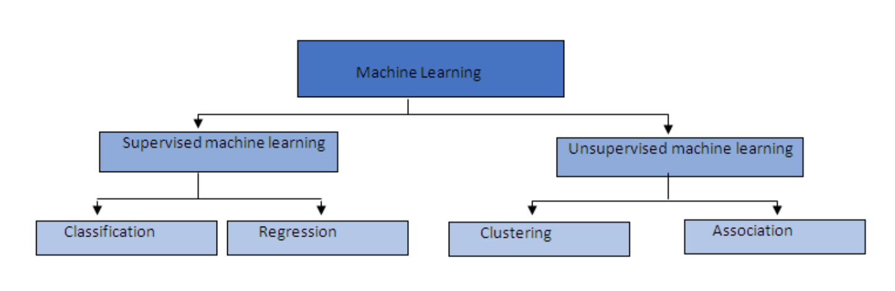

* The goal of supervised learning is to learn a function that maps from the values of the attributes describing an
  instance to the value of another attribute, known as the target attribute, of that instance.
    * For example, when supervised learning is used to train a spam filter, the algorithm attempts to learn a function
      that maps from the attributes describing an email to a value (spam/not spam) for the target attribute; the
      function the algorithm learns is the spam-filter model returned by the algorithm.
* Supervised learning works by searching through lots of different functions to find the function that best maps between
  the inputs and output.
    * However depends on the complexity, there are so many combinations of inputs and possible mappings to outputs that
      an algorithm cannot try all possible functions.
    * As a consequence, each ML algorithm is designed to look at or prefer certain types of functions during its search.
      These preferences are known as the algorithm’s **learning bias**.
* **The real challenge in using ML** is to find the algorithm **whose learning bias is the best match for a**
  **particular data set.**
    * this task involves experiments with a number of different algorithms to find out which one works best on that data
      set.
* Supervised learning is “supervised” because each of the instances in the data set lists both the input values and the
  output (target) value for each instance.
    * So the learning algorithm can guide its search for the best function by checking how each function it tries
      matches with the data set, and at the same time the data set acts as a supervisor for the learning process by
      providing feedback
* for supervised learning to take place, each instance in the data set must be labeled with the value of the target
  attribute.
* In unsupervised learning, there is no target attribute.
    * As a consequence, unsupervised-learning algorithms can be used without investing the time and effort in labeling
      the instances of the data set with a target attribute.

* The most common type of unsupervised learning is cluster analysis, where the algorithm looks for clusters of instances
  that are more similar to each other than they are to other instances in the data.
    * These clustering algorithms often begin by guessing a set of clusters and then iteratively updating the clusters

* A challenge for clustering is figuring out how to measure similarity.
    * If all the attributes in a data set are numeric and have similar ranges, then it probably makes sense just to
      calculate the Euclidean distance (better known as the straight-line distance) between the instances (or rows).
    * In some data sets, different numeric attributes have different ranges, with the result that a variation in row
      values in one attribute may not be as significant as a variation of a similar magnitude in another attribute.
        * In these cases, the attributes should be normalized so that they all have the same range
    * Another complicating factor in calculating similarity is that things can be deemed similar in many different ways.
        * Some attributes are sometimes more important than other attributes, so it might make sense to weight some
          attributes in the distance calculations, or it may be that the data set includes nonnumeric data.
* The choice of which attributes to include and exclude from a data set is a key task in data science, but for the
  purposes of this discussion we will work with the data set as is.
* In unsupervised clustering algorithm will look for groups of rows that are more similar to each other than they are to
  the other rows in the data
    * Each of these groups of similar rows defines a cluster of similar instances.
* The simple idea of looking for clusters of similar rows is very powerful and has applications across many areas of
  life. Another application of clustering rows is making product recommendations to customers.

# Standard Data Science Tasks

* Most data science projects can be classified as belonging to one of four general classes of task:
    * Clustering (or segmentation)
    * Anomaly (or outlier) detection
    * Association-rule mining
    * Prediction (including the subproblems of classification and regression)
* Understanding which task a project is targeting can help with many project decisions
    * For example, training a prediction model requires that each of the instances in the data set include the value of
      the target attribute.

* Understanding the task also informs which ML algorithm(s) to use.
* There are a large number of ML algorithms, each algorithm is designed for a particular datamining task
    * For example, ML algorithms that generate decision-tree models are designed primarily for prediction tasks

* There is a many-to-one relationship between ML algorithms and a task, so knowing the task doesn’t tell you exactly
  which algorithm to use, but it does define a set of algorithms that are designed for the task.
    * Because the data science task affects both the data set design and the selection of ML algorithms, the decision
      regarding which task the project will target has to be made early on in the project life cycle, ideally during the
      business-understanding phase of the CRISP-DM life cycle

## Clustering (Who Are Our Customers?)

* Designing a targeted marketing campaign requires an understanding of the target customer.
* A good approach is to try to identify a number of customer personas or customer profiles, each of which relates to a
  significant segment of the customer base, and then to design targeted marketing campaigns for each persona

* Human intuition about customers can often miss important nonobvious segments or not provide the level of granularity
  that is required for nuanced marketing.

* The standard data science approach to the persona type of analysis is to frame the problem as a **clustering task**.
* Clustering involves sorting the instances in a data set into subgroups containing similar instances.
    * Usually clustering requires an analyst to **first decide on the number of subgroups** she would like identified in
      the data. This decision may be based on domain knowledge or informed by project goals.
    * A clustering algorithm is then **run on the data with the desired number of subgroups input** as one of the
      algorithms parameters.
    * The algorithm then **creates that number of subgroups by grouping instances based on the similarity of their
      attribute values.**
    * Once the algorithm has created the clusters, a human domain expert reviews the clusters to interpret whether they
      are meaningful.

* one of the biggest challenges with clustering is to decide which attributes to include and which to exclude so as to
  get the best results.
    * Making this decision on attribute selection will involve iterations of experiments and human analysis of the
      results of each iteration

* The **best-known ML algorithm for clustering** is the **k-means algorithm.**
    * The k in the name signals that the algorithm looks for k clusters in the data.
    * The k-means algorithm assumes that all the attributes describing the customers in the data set are numeric. If the
      data set contains nonnumeric attributes, then these attributes need to be mapped to numeric values in order to use
      k-means, or the algorithm will need to be amended to handle these nonnumeric values.
* The goal of the k-mean algorithm is to find the position of each cluster’s center in the point cloud.
* The k-means algorithm begins by selecting k instances to act as initial cluster centers.
    * Current best practice is to use an algorithm called “**k-means++**” to select the initial cluster centers.
    * The rationale behind k-means++ is that it is a good idea to spread out the initial cluster centers as much as
      possible. So in k-means++ the first cluster center is set by randomly selecting one of the instances in the data
      set.
        * The second and subsequent cluster centers are set by selecting an instance from the data set with the
          probability that an instance selected is proportional to the squared distance from the closest existing
          cluster center.

    * Once all k cluster centers have been initialized, the algorithm works by iterating through a two-step process:
        * first, assigning each instance to the nearest cluster center,
        * updating the cluster center to be in the middle of the instances assigned to it
        * The instances are then reassigned, again to the closest updated cluster center.
        * This process of instance assignment and center updating continues until no instances are assigned to a new
          cluster center during an iteration.
* The k-means algorithm is nondeterministic, meaning that different starting positions for the cluster centers will
  likely produce different clusters.
* the algorithm is typically run several times, and the results of these different runs are then compared to see which
  clusters appear most sensible given the data scientist’s domain knowledge and understanding.
* Each cluster center defines a different customer persona, with the persona description generated from the attribute
  values of the associated cluster center
* The k-means algorithm is not required to return equal-size clusters, and, in fact, it is likely to return
  different-size clusters.
* One of the advantages of clustering as an analytics approach is that it can be applied to most types of data
    * Because of its versatility, clustering is often used as a dataexploration tool during the data-understanding stage
      of many data science projects.
    * Also, clustering is also useful across a wide range of domains.

## Anomaly Detection or outlier analysis (Is This Fraud?)

* Anomaly detection or outlier analysis involves searching for and identifying instances that do not conform to the
  typical data in a data set.

* These nonconforming cases are often referred to as **anomalies or outliers**.
* Anomaly detection is often used in analyzing financial transactions in order to identify potential fraudulent
  activities and to trigger investigations

* The first approach that most companies typically use for anomaly detection is to manually define a number of rules
  based on domain expertise that help with identifying anomalous events.
    * This rule set is often defined in SQL or in another language and is run against the data in the business databases
      or data warehouse
    * SQL now includes a MATCH_RECOGNIZE function to facilitate pattern matching in data.
    * The MATCH_RECOGNIZE function in SQL enables database programmers to write scripts that identify sequences of
      transactions on a credit card that fit this pattern and either block the card automatically or trigger a warning
      to the credit-card company.

* The **main drawback** with a rule-based approach to anomaly detection is that defining rules in this way means that
  anomalous events can be identified only after they have occurred and have come to the company’s attention

* In some ways, anomaly detection is the opposite of clustering:
    * **the goal of clustering** is to identify **groups of similar instances,** whereas the **goal of anomaly** **that
      are dissimilar to the rest of the data in the data set.**

* **Clustering can also be used** to automatically identify anomalies. There are two approaches to using clustering for
  anomaly detection.
    * The first is that the normal data will be clustered together, and the anomalous records will be in separate
      clusters.
    * The second approach is to measure the distance between each instance and the center of the cluster. The farther
      away the instance is from the center of the cluster, the more likely it is to be anomalous and thus to need
      investigation.

* Another approach to anomaly detection is to **train a prediction model**, such as a decision tree, to classify in-
  stances as anomalous or not.
    * However, training such a model normally requires a training data set that contains both anomalous records and
      normal records
    * Ideally, the data set should be balanced; in a binary-outcome case, balance would imply a 50:50 split in the data.
      In general, acquiring this type of training data for anomaly detection is not feasible: by definition, anomalies
      are rare events, occurring maybe in 1 to 2 percent or less of the data.
    * This data constraint precludes the use of normal, off-the-shelf prediction models.

* There are ML algorithms known as **one-class classifiers** that are designed to deal with the type of imbalanced data
  that are typical of anomaly-detection data sets.
    * The **one-class support-vector machine (SVM)** algorithm is a well-known **one-class classifier**.
        * In general terms, the one-class SVM algorithm examines the data as one unit (i.e., a single class) and
          identifies the core characteristics and expected behavior of the instances.
        * The algorithm will then indicate how similar or dissimilar each instance is from the core characteristics and
          expected behavior.
        * The more dissimilar an instance is, the more likely that it should be investigated.

* The fact that anomalies are rare means that they can be easy to miss and difficult to identify.
    * As a result, data scientists often combine a number of different models to detect anomalies.
    * The idea is that different models will capture different types of anomalies.
    * The different models are integrated together into a decision-management solution that enables the predictions from
      each of the models to feed into a decision of the final predicted outcome
    * For example if three or four out of the four models have identified the transaction as possible fraud, then the
      transaction would be flagged for a data scientist to investigate.

## Association-Rule Mining (Do You Want Fries with That?)

* Association-rule mining is an unsupervised-data-analysis technique that looks to find groups of items that fre-
  quently co-occur together.
    * The classic case of association mining is market-basket analysis, wherein retail companies try to identify sets of
      items that are purchased together, such as hot dogs, ketchup, and beer

* Unlike clustering and anomaly detection, which focus on identifying similarities or differences between instances (or
  rows) in a data set, association-rule mining focuses on looking at relationships between attributes (or columns) in a
  data set.

* Using association-rule mining, a business can start to answer questions about its customers’ behaviors by looking for
  patterns that may exist in the data.
    * Questions that market-basket analysis can be used to answer include: Did a marketing campaign work? Have this
      customer’s buying patterns changed?

* **The Apriori algorithm is the main algorithm** used to produce the association rules. It has a two-step process:
    * Find all combinations of items in a set of transactions that occur with a specified minimum frequency. These
      combinations are called **frequent itemsets.**
    * Generate rules that express the probable co-occurrence of items within frequent itemsets. The Apriori algorithm
      calculates the probability of an item being present in a frequent itemset given that another item or items are
      present.

* The Apriori algorithm generates association rules that express **probabilistic relationships between items in fre-
  quent itemsets**. An association rule is of the form **“IF antecedent, THEN consequent.”**
    * IF {hot-dogs, ketchup}, THEN {beer}.

* **Two main statistical measures** are linked with association rules: **support and confidence**.
    * The **support** percentage of an association rule—or the ratio of transactions that include both the antecedent
      and consequent to the total number of transactions—indicates how frequently the items in the rule occur together.
    * The **confidence** percentage of an association rule—or the ratio of the number of transactions that include both
      the antecedent and consequent to the number of transactions that includes the antecedent—is the conditional
      probability that the consequent will occur given the occurrence of the antecedent.
        * for example, a confidence of 75 percent for the association rule relating hot dogs and ketchup with beer would
          indicate that in 75 percent of cases where customers purchased both hot dogs and ketchup, they also purchased
          beer. The support score of a rule simply records the percentage of baskets in the data set where the rule
          holds. For example, a support of 5 percent indicates that 5 percent of all the baskets in the data set contain
          all three items in the rule “hot dogs, ketchup, and beer.”

* In order to control the complexity of the analysis of these rules, it is usual to prune the generated rule set to
  include only rules that have both a high support and a high confidence
    * Once the rule set has been pruned, the data scientist can then analyze the remaining rules to understand what
      products are associated with each other and apply this new information in the organization.

* Including this demographic information in the association analysis enables the analysis to be focused on particular
  demographics, which can further help marketing and targeted advertising.
    * An example of an association rule augmented with demographic information might be
        * IF gender(male) and age(< 35) and {hot-dogs, ketchup}, THEN {beer}. {Support = 2%, Confidence = 90%.}

## Classification (Churn or No Churn, That Is the Question)

* The term propensity modeling is used to describe this task because the goal is to model an individual’s propensity to
  do something
* In fact, it is estimated that it generally costs five to six times more to attract a new customer than it does to
  retain an established one (Verbeke et al. 2011). As a result, many cell phone service companies are very keen to
  retain their current customers.
* The term **customer churn** is used to describe the process of customers leaving one service and joining another.
    * So the problem of predicting which customers are likely to leave in the near future is known as **churn
      prediction.** **This is a prediction task**

* When a prediction model returns a label or category for an input, it is known as a **classification model**.
* Training a classification model requires historic data, where each instance is labeled to indicate whether the target
  event has happened for that instance.
    * For example, customerchurn classification requires a data set in which each customer (one row per customer) is
      assigned a label indicating whether he or she has churned.
* The data set will include an attribute, known as the **target attribute**, that lists this label for each customer.

* Once the churn event has been defined from a business perspective, it is then necessary to implement this definition
  in code in order to assign a target label to each customer in the data set.

* Another complicating factor in constructing the training data set for a churn-prediction model is that time lags need
  to be taken into account.
    * The goal of churn prediction is to model the propensity (or likelihood) that a customer will churn at some point
      in the future.
        * As a consequence, this type of model has a temporal dimension that needs to be considered during the creation
          of the data set.

    * The set of attributes in a propensity-model data set are drawn from two separate time periods: the **observation
      period** and the **outcome period.**
        * The **observation period** is when the values of the input attributes are calculated.
        * The **outcome period** is when the target attribute is calculated.

    * The length of this period is the length of the outcome period, and the prediction that the churn model returns is
      actually that a customer will churn within this outcome period.
    * Defining the outcome period affects what data should be used as input to the model.
        * If the model is designed to predict that a customer will churn within two months from the day the model is run
          on that customer’s record, then when the model is being trained, the input attributes that describe the
          historic customers who have already churned should be calculated using only the data that were available about
          those customers two months prior to their leaving the service.

* Nearly all customer-propensity models will use attributes describing the customer’s demographic information as input:
  age, gender, occupation, and so on.
    * In scenarios relating to an ongoing service, they are also likely to include attributes describing the customer’s
      position in the customer life cycle: coming on board, standing still midcycle, approaching end of a contract.
      There are also likely to be attributes that are specific to the industry.

* Once a labeled data set has been created, the major stage in creating a classification model is to use an ML algo-
  rithm to build the classification model.
    * During modeling, it is good practice to experiment with a number of different ML algorithms to find out which
      algorithm works best on the data set.
    * Once the final model has been selected, the likely accuracy of the predictions of this model on new instances is
      estimated by testing it on a subset of the data set that was not used during the model-training phase.
    * If a model is deemed accurate enough and suitable for the business need, the model is then deployed and applied to
      new data either in a batch process or in real time.
* A really important part of deploying the model is ensuring that the appropriate business processes and resources are
  put in place so that the model is used effectively.
  *There is no point in creating a customer-churn model unless there is a process whereby the model’s predictions result
  in triggering customer interventions so that the business retains customers.

* In addition to predicting the classification label, prediction models can also give a measure of how confident the
  model is in the prediction. This measure is called the **prediction probability** and will have a value between 0 and
    1.

    * The higher the value, the more likely the prediction is correct
    * The prediction-probability value can be used to prioritize which customers to focus on.

## Regression (How Much Will It Cost?)

* Prediction is the task of estimating the value of a target attribute for a given instance based on the values of other
  attributes (or input attributes) for that instance
* Price prediction is the task of estimating the price that a product will cost at a particular point in time.
* The accuracy of a price-prediction model is domain dependent.
* The fact that price prediction involves estimating the value of a continuous attribute means that it is treated as
  a **regression problem**
* A regression problem is structurally very similar to a classification problem; in both cases, the data science
  solution involves building a model that can predict the missing value of an attribute given a set of input attributes.
    * The only difference is that classification involves estimating the value of a categorical attribute and regression
      involves estimating the value of a continuous attribute.

* Regression analysis requires a data set where the value of the target attribute for each of the historic instances is
  listed.
* The basic structure of a regression model for price prediction is the same no matter what product it is applied to;
  all that varies are the name and number of the attributes.
    * For example, to predict the price of a house, the input would include attributes such as the size of the house,
      the number of rooms, the number of floors, the average house price in the area, the average house size in the
      area, and so on.
    * In each case, given the appropriate data, the regression algorithm works out how each of the attributes
      contributes to the final price.

* The application example of using a regression model for price prediction is illustrative only of the type of problem
  that it is appropriate to frame as a regression-modeling task.

* Regression prediction can be used in a wide variety of other real-world problems.
    * Typical regression-prediction problems include calculating profit, value and volume of sales, sizes, demand,
      distances, and dosage.

# Linear regression

* [The besssttt](https://www.youtube.com/watch?v=GhrxgbQnEEU)
* [Doğrusal Regrezsyon (Linear Regression) (Weka Eğitim Serisi 8)](https://www.youtube.com/watch?v=b8jlp1i_h5w)
* [Dogrusal Regresyon](https://www.youtube.com/watch?v=c6NgFlNiuTY)


* Linear regression captures the relationship between two (or more) variables and allows prediction.
* linear regression produces a function into which you can put one or more properties of an entity or phenomena (the
  “input” or “explanatory” variables or "predictor" ) and get out the correct value of another (the “output” or
  “response” variable).
    * For example, given a set of observations about the height and weight of many people, we could learn a linear
      regression model that could estimate someone’s weight based on their height.
* The first step in a regression analysis is to hypothesize the structure of the relationship between the input
  attributes and the target.
    * Then a parameterized mathematical model of the hypothesized relationship is defined. This parameterized model is
      called a **regression function**.
* linear-regression functions are relatively easy to interpret
* When a linear relationship is assumed, the regression analysis is called **linear regression**
* The simplest application of linear regression is modeling the relationship between two attributes: an input attribute
  X and a target attribute Y.
    * Formule: **Y =ω0 +ω1X**

* Setting the parameters of a regression function is equivalent to searching for the line that best fits the data.
    * The strategy for setting these parameters begins by guessing parameters values and then iteratively updating the
      parameters so as to reduce the overall error of the function on the data set.

* The overall error is calculated in three steps:
    * The function is applied to the data set, and for each instance in the data set it estimates the value of the
      target attribute.
    * The error of the function for each instance is calculated by subtracting the estimated value of the target
      attribute from the actual value of the target attribute.
    * The error of the function for each instance is squared, and then these squared values are summed. (so that the
      error in the instances where the function overestimates the target doesn’t cancel out with the error when it
      underestimates.)

* This measure of error is known as the sum of **squared errors (SSE)**, and the strategy of fitting a linear function
  by searching for the parameters that minimize the SSE is known as **least squares**.
    * Formula : 
    * The SSE where the data set contains n instances, targeti is the value of the target attribute for instance i in
      the data set, and predictioni is the estimate of the target by function for the same instance.
* Formulas: 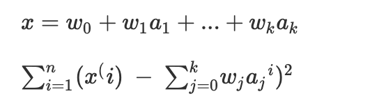

* To create a linear-regression prediction model that estimates the likelihood of an individual’s developing diabetes
  with respect to his BMI, we replace X with the BMI attribute, Y with the diabetes attribute, and apply the
  least-squares algorithm to find the best-fit line for the diabetes data set.
    * the dashed lines show the error (or residual) for each instance for this line. Using the least-squares approach,
      the best-fit line is the line that minimizes the sum of the squared residuals. The equation for this line is
        * Diabetes = −7.38431 + 0.55593 ∗ BMI .
        * The slope parameter value ω1 = 0.55593 indicates that for each increase of one unit in BMI, the model
          increases the estimated likelihood of a person developing diabetes by a little more than half a percent
        * For example, when BMI equals 20, the model returns a prediction of a 3.73 percent
    * a linear-regression model fitted using the least-squares method is actually calculating a weighted average over
      the instances. In fact, the intercept parameter value ω0 = −7.38431 ensures that the best-fit line goes through
      the point defined by the average BMI value and average diabetes value for the data set.


* The weighting of the instances is based on the distance of the instance from the line: the farther an instance is away
  from the line, the larger the residual for that instance, and the algorithm will weight that instance by the residual
  squared.

* Linear-regression models can be extended to take multiple inputs.
    * For example BMI data regression function becomes  : **Diabetes = ω0 + ω1 BMI + ω2 Exercise + ω3 Weight.**
* In statistics, a regression function that maps from multiple inputs to a single output in this way is known as a
  **multiple linear regression function**.
    * The structure of a multi-input regression function is the basis for a range of ML algorithms, including neural
      networks.

* **Residuals** are the leftover variation in the data after accounting for the model fit: **Data = Fit + Residual**
    * One goal in picking the right linear model is for these residuals to be as small as possible.
    * Under the line is the value of residuals are negative, above the line is positive .
    * A residual is usually discussed in terms of its absolute value
* RESIDUAL: Difference between observed an expected
* The residual of the ith observation (xi,yi) is the difference of the observed response (yi) and the response we would
  predict based on the model fit (yˆi ):
    * ei = yi − yˆi , we typically identify yˆ by plugging x into the model.

* [Diez -> page 320 check]

# Correlations

* [Pearson Correlation the besttt!! ](https://www.youtube.com/watch?v=2SCg8Kuh0tE&t=0s)
* CORRELATION: STRENGTH OF A LINEAR RELATIONSHIP
* A correlation describes the strength of association between two attributes.
    * In a general sense, a correlation can describe any type of association between two attributes.
* The term correlation also has a specific statistical meaning, in which it is often used as shorthand for **“Pearson
  Correlation"**

* A Pearson correlation **measures the strength of a linear relationship between two numeric attributes**.
    * It ranges in value from −1 to +1.
    * The letter r is used to denote the Pearson value or coefficient between two attributes.
        * r = 0 indicates that the two attributes are not correlated.
        * r = +1 indicates that the two attributes have a perfect positive correlation
            * meaning that every change in one attribute is accompanied by an equivalent change in the other attribute
              in the same direction
        * r = −1 indicates that the two attributes have a perfect negative correlation
            * meaning that every change in one attribute is accompanied by the opposite change in the other attribute.
        * r ≈ ±0.7 indicates a strong linear relationship between the attributes,
        * r ≈ ±0.5 indicates a moderate linear relationship,
        * r ≈ ±0.3 indicates a weak relationship,
        * r ≈ 0 indicates no relationship between the attributes.

* The fact that the definition of a statistical Pearson correlation is between two attributes might appear to limit the
  application of statistical correlation to data analysis to just pairs of attributes. However derived attributes can
  help to create a new correlation
    * For example, we know weight and height has possitive corrolation, with some mappings we can have BKM numeric
      attibute , BMI is a derived attribute and then we can use it to measure the correlation between other attributes.

* The BMI example illustrates that it is possible to create a new derived attribute by defining a function that takes
  multiple attributes as input.
    * It also shows that it is possible to calculate a Pearson correlation between this derived attribute and another
      attribute in the data set.
    * Furthermore, a derived attribute can actually have a higher correlation with a target attribute than any of the
      attributes used to generate the derived attribute have with the target.

* Attribute selection is a key task in data science
    * Designing a derived attribute that has a strong correlation with an attribute we are interested in is often where
      the real value of data science is found
* ML algorithms can learn interactions between attributes and create useful derived attributes by searching through
  different combinations of attributes and checking the correlation between these combinations and the target attribute.
    * This is why ML is useful in contexts where many weak interacting attributes contribute to the process we are
      trying to understand.

* if an input attribute is highly correlated with a target attribute, it is likely to be a useful input into the
  prediction model.
    * Similar to correlation analysis, prediction involves analyzing the relationships between attributes
    * If this correlation does not exist (or cannot be found by the algorithm), then the input attributes are irrelevant
      for the prediction problem, and the best a model can do is to ignore those inputs and always predict the central
      tendency of that target in the data set

## Correlations & Regression

* Correlation and regression are similar concepts insofar as both are techniques that focus on the relationship across
  columns in the data set.
* Correlation is focused on **exploring whether a relationship exists between two attributes**
* Regression is focused on **modeling an assumed relationship between attributes** with the purpose of being able to
  **estimate the value of one target attribute** given the values of one or more input attributes.
* n the specific cases of Pearson correlation and linear regression, a Pearson correlation measures the degree to which
  two attributes have a linear relationship, and linear regression trained using least squares is a process to find the
  best-fit line that predicts the value of one attribute given the value of another.

# Knowledge presentation

* The simplest, most rudimentary way of representing the output from machine learning is to make it just the same as the
  input—a **table**.
* Another simple style of representation is a “**linear model**,” whose output is just the sum of the attribute values,
  except that weights are applied to each attribute before adding them together.
* Linear models can also be applied to **binary classification problems**. In this case, the line produced by the model
  separates the two classes: it defines where the decision changes from one class value to the other. Such a line is
  often referred to as the **decision boundary**.
    * 1 attribute -> point
    * 2 attributes -> straight line
    * 3 attribute -> plane
    * more than 3 attributes -> hyperplane

# Decision trees

* Classification technique known as “decision tree learning”.
* Decision tree learning produces a “machine” into which you can input one or more attributes of an example and get out
  a classification.
* Differences from linear regression:
    * the output variable is categorical rather than numeric
    * input variables may be categorical as well as numeric
* Decision trees are very useful for doing simple classification that works from categorical variables to produce
  categorical predictions.
* They can also be quite effective with numerical input variables, provided that the variable range falls meaningfully
  into continuous regions.
* The models they produced are easy to understand, particularly when the number of input variables is small.
* Film 4 is an exception — the tree predicts that it should receive an 18 certificate, but the film classification board
  has in fact given it only a 15. Depending on the context, this error might or might not be a significant problem.

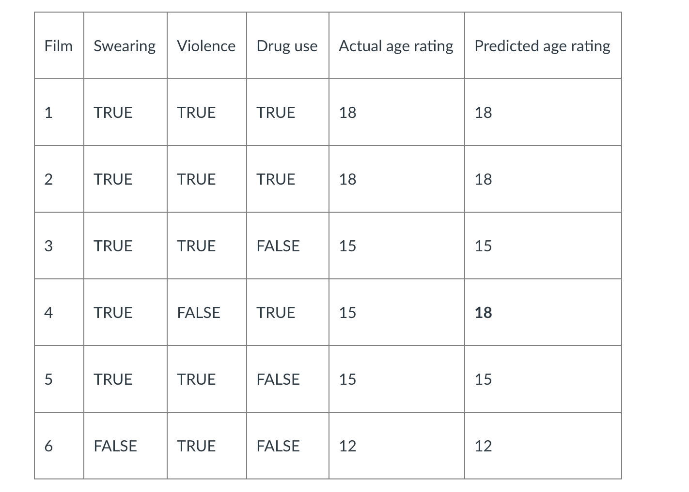</br>
</br>
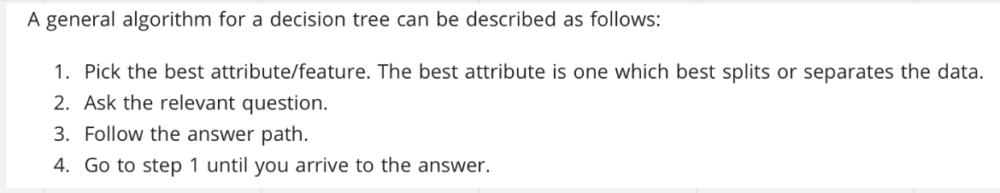

* A “divide-and-conquer” approach to the problem of learning from a set of independent instances leads naturally to a
  style of representation called a **decision tree**.

* Nodes in a decision tree involve testing a particular attribute. Usually, the test compares an attribute value with a
  constant. Leaf nodes give a classification that applies to all instances that reach the leaf, or a set of
  classifications, or a probability distribution over all possible classifications.

* If the attribute that is tested at a node is a nominal one, the number of children is usually the number of possible
  values of the attribute.
* If the attribute is numeric, the test at a node usually determines whether its value is greater or less than a
  predetermined constant, giving a two-way split.
* a numeric quantity is what is predicted, decision trees with averaged numeric values at the leaves are called **
  regression trees**.
* It is possible to combine regression equations with regression trees. Fig. 3.4C is a tree whose leaves contain linear
  expressions—i.e., regression equations— rather than single predicted values. This is called a model tree.

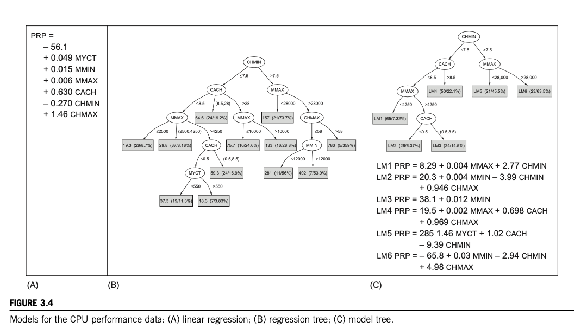

* Linear regression and neural networks work best with numeric inputs. If the input attributes in a data set are
  primarily nominal or ordinal, however, then other ML algorithms and models, such as decision trees, may be more
  appropriate.
* A decision tree encodes a set of if then, else rules in a tree structure.
* Each path in a decision tree, from root to leaf, defines a classification rule composed of a sequence of tests.
    * The goal of a decision-tree-learning algorithm is to find a set of classification rules that divide the training
      data set into sets of instances that have the same value for the target attribute

* The progenitor of most modern ML algorithms for decision-tree learning is the **ID3 algorithm** (Quinlan 1986).
    * ID3 builds a decision tree in a recursive, depth-first manner, adding one node at a time, starting with the root
      node.
    * It begins by selecting an attribute to test at the root node. A branch is grown from the root for each value in
      the domain of this test attribute and is labeled with that value.
    * ID3 use Claude Shannon entropy
      
* One of the strengths of decision trees is that they are simple to understand. Also it is possible to create very
  accurate models based on decision trees.


* The problem of constructing a decision tree can be expressed recursively.
    * First, select an attribute to place at the root node, and make one branch for each possible value. This splits up
      the example set into subsets, one for every value of the attribute.
    * Now the process can be repeated recursively for each branch, using only those instances that actually reach the
      branch.
    * If at any time all instances at a node have the same classification, stop developing that part of the tree.

* Although decision trees work well with both nominal and ordinal data, they struggle with numeric data.
    * In a decision tree, a separate branch descends from each node for each value in the domain of the attribute tested
      at the node.
    * Numeric attributes, however, have an infinite number of values in their domains, with the implication that a tree
      would need an infinite number of branches.
    * **One solution to this problem is to transform numeric attributes into ordinal attributes, although doing so
      requires the definition of appropriate thresholds, which can also be difficult.**

* Finaly, because a decision-tree-learning algorithm repeatedly divides a data set as a tree becomes large, it becomes
  more sensitive to noise (such as mislabeled instances).
    * The subset of examples on each branch becomes smaller, the smaller the data sample used to define a classification
      rule, the more sensitive to noise the rule becomes.
    * Thats why it is a good idea to keep decision trees shallow.
    * 2 approaches are there :
        * is to stop the growth of a branch when the number of instances on the branch is still less than a predefined
          threshold (e.g., 20 instances).
        * Other approaches allow the tree to grow and then prune the tree back.

# Evaluating learned models

* The error rate is just the proportion of errors made over a whole set of instances, and it measures the overall
  performance of the classifier.
* This is a surprising fact, and a very important one. Error rate on the training set is not likely to be a good
  indicator of future performance.
    * Why? Because the classifier has been learned from the very same training data, any estimate of performance based
      on that data will be optimistic, and may be hopelessly optimistic

* The error rate on the training data is called the resubstitution error, because it is calculated by resubstituting the
  training instances into a classifier that was constructed from them
    * Although it is not a reliable predictor of the true error rate on new data, it is nevertheless often useful to
      know.

* To predict the performance of a classifier on new data, we need to assess its error rate on a dataset that played no
  part in the formation of the classifier. This independent dataset is called **the test set**. We assume that both the
  training data and the test data are representative samples of the underlying problem.
    * It is important that the **test data is not used in any way to create the classifier**.

* some learning schemes involve two stages, one to come up with a basic structure and the second to optimize parameters
  involved in that structure, and separate sets of data may be needed in the two stages. Or you might try out several
  learning schemes on the training data and then evaluate them—on a fresh dataset, of course—to see which one works best

* In such situations people often talk about three datasets: **the training data, the validation data, and the test
  data**.
    * **The training data is used by one or more learning schemes to come up with classifiers**.
    * **The validation data is used to optimize parameters of those classifiers, or to select a particular one**.
    * **The test data is used to calculate the error rate of the final, optimized, method**.
    * Each of the three sets must be chosen independently: the validation set must be different from the training set to
      obtain good performance in the optimization or selection stage, and the test set must be different from both to
      obtain a reliable estimate of the true error rate.

* It may be that once the error rate has been determined, the test data is bundled back into the training data to
  produce a new classifier for actual use. There is nothing wrong with this: it is just a way of maximizing the amount
  of data used to generate the classifier that will actually be employed in practice

* Generally, the larger the training sample the better the classifier, although the returns begin to diminish once a
  certain volume of training data is exceeded. And the larger the test sample, the more accurate the error estimate.

* This limits the amount of data that can be used for training, validation, and testing, and the problem becomes how to
  make the most of a limited dataset. From this dataset, a certain amount is held over for testing—this is called the
  **holdout** procedure—and the remainder used for training (and, if necessary, part of that is set aside for
  validation).
    * There’s a dilemma here: to find a good classifier, we want to use as much of the data as possible for training; to
      obtain a good error estimate, we want to use as much of it as possible for testing.

## Predict Performance

* In statistics, a succession of independent events that either succeed or fail is called a Bernoulli process. The
  classic example is coin tossing. Each toss is an independent event. Let’s say we always predict heads; but rather than
  “heads” or “tails,” each toss is considered a “success” or a “failure.”

* Bernoulli process—a biased coin—whose true (but unknown) success rate is p. Suppose that out of N trials, S are
  successes: thus the observed success rate is f = S/N.

* The success rate is measured as Success/TotalExperimentCount, f=S/N. So, both 750/1000 and 75/100 produce 75% success
  rate. However, as the experiment count goes up, so does the confidence interval.
    * For samples >= 100, the normal distribution can be assumed. For the normal distribution, the chance that X lies
      more than 1.65 standard deviations from the mean is 10%
      

* The z value can be found from the lookup table below. For 90% confidence, P(X≥z)P({X}\ge{z})P(X≥z)  and P(X≤−z)P(
  {X}\le{-z})P(X≤−z) are 5% each.
  

* For f=75%, N=1000, confidence limits can be calculated from the formula below, ie [0.732, 0.767] for N=1000. For N=100
  is [0.691, 0.801]
    * The 6 in this expression gives two values for p that represent the upper and lower confidence boundaries.
    * 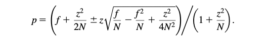

## Cross Validation

* The holdout method reserves a certain amount for testing, and uses the remainder for training (and sets part of that
  aside for validation, if required). In practical terms, it is common to hold one-third of the data out for testing and
  use the remaining two-thirds for training.

* A more general way to mitigate any bias caused by the particular sample chosen for holdout is to repeat the whole
  process, training and testing, several times with different random samples.
* In each iteration, a certain proportion of the data is randomly selected for training, possibly with stratification,
  and the remainder used for testing. The error rates on the different iterations are averaged to yield an overall error
  rate. This is the repeated holdout method of error rate estimation.
* Another alternative technique is called cross-validation where you decide on a fixed number of folds/partitions of the
  data.
    * For k-folds, we have k iterations where 1 fold/share is kept for testing and k-1 folds are used for training.
    * This is repeated k times, until each fold is used for testing. If stratification is used as well, it's called
      stratified k-fold cross-validation.
    * On each run, the error rate is calculated on the test set and finally, the average error rate is calculated.
    * Stratified 10-fold cross-validation is the most commonly used variation. The number 10 is chosen based on
      extensive testing and also some theoretical evidence showing this to give the best estimate of error.
    * A single 10-fold cross-validation might not be enough to get a reliable error estimate if the data is limited.
      Different 10-fold cross-validation experiments with the same learning scheme and dataset often produce different
      results, because of the effect of random variation in choosing the folds themselves.
    * Due to stratification, results across different complete k-fold runs might change even for the same k value.
      Therefore, it's also common practice to repeat the k-fold runs multiple times.

## Evaluating Numeric Prediction

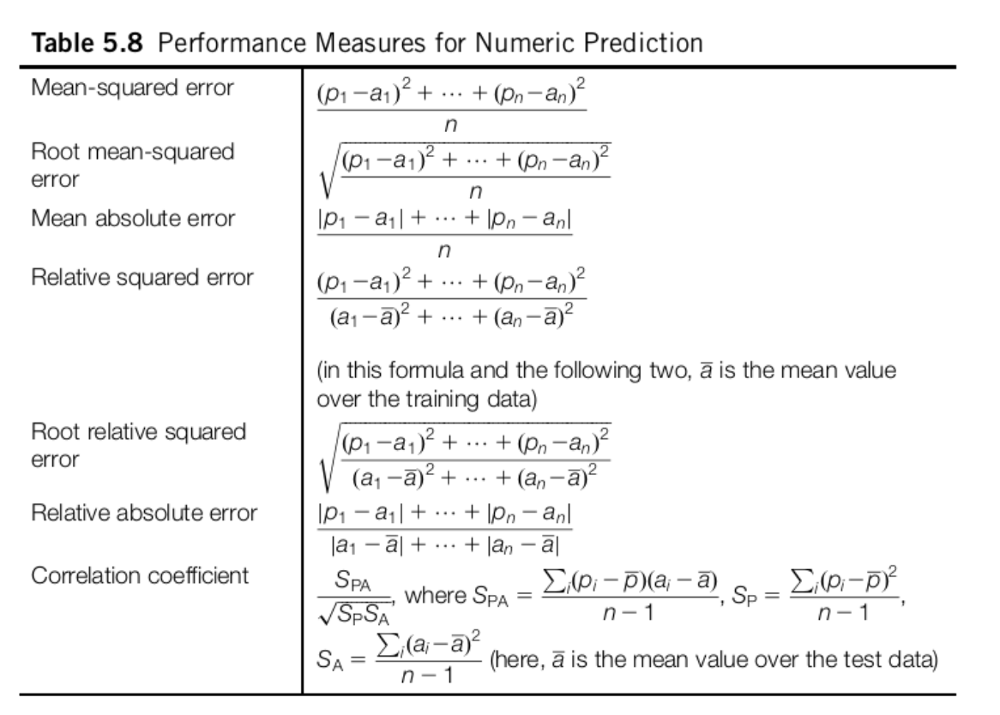

* The basic principles—using an independent test set rather than the training set for performance evaluation, the
  holdout method, cross-validation—apply equally well to numeric prediction. But the basic quality measure offered by
  the error rate is no longer appropriate: errors are not simply present or absent, they come in different sizes.

* **Mean-squared error (MSE)** is the principal and most commonly used measure; some-times the square root is taken to
  give it the same dimensions as the predicted value itself.
    * **Mean absolute error (MAE)** is an alternative: just average the magnitude of the individual errors without
      taking account of their sign.
    * Mean-squared error tends to exaggerate the effect of outliers—instances whose prediction error is larger than the
      others—
    * But absolute error does not have this effect: all sizes of error are treated evenly according to their
      magnitude.

* Sometimes it is the relative rather than absolute error values that are of importance.
    * For example, if a 10% error is equally important whether it is an error of 50 in a prediction of 500 or an error
      of 0.2 in a prediction of 2, then averages of absolute error will be meaningless: relative errors are appropriate.
      This effect would be taken into account by using the relative errors in the mean-squared error calculation or the
      mean absolute error calculation.

* Relative squared error (RSE) is made relative to what it would have been if a simple predictor had been used.
    * Thus relative squared error takes the total squared error and normalizes it by dividing by the total squared error
      of the default predictor.
    * Relative absolute error (RAE) and is just the total absolute error, with the same kind of normalization.
* **Correlation coefficient**, which measures the statistical correlation between the a’s and the p’s. (a is actual
  value, p is predicted value)
    * The correlation coefficient ranges 1,0,-1, negative values should not occur for reasonable prediction methods
* The squared error measures and root squared error measures weigh large discrepancies much more heavily than small
  ones, whereas the absolute error measures do not.
    * Taking the square root (root mean-squared error) just reduces the figure to have the same dimensionality as the
      quantity being predicted.
* The relative error figures try to compensate for the basic predictability or unpredictability of the output
  variable: if it tends to lie fairly close to its average value, then you expect prediction to be good and the relative
  figure compensates for this.

* If you have outlier in the data and you want to ignore them, MAE is a better option but if you want to account for
  them in your loss function, go for MSE/RMSE.

* [Evaluation Metrics for Regression models- MAE Vs MSE Vs RMSE vs RMSLE](https://akhilendra.com/evaluation-metrics-regression-mae-mse-rmse-rmsle/)
  

## Confusion matrices and accuracy scores

* The overall success rate is the number of correct classifications divided by the total number of classifications:
  *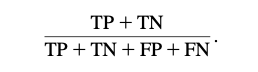
    * Error Rate = 1 - Success Rate
* In a multiclass prediction, the result on a test set is often displayed as a twodimensional **confusion matrix**
  with a row and column for each class. Each matrix element shows the number of test examples for which the actual class
  is the row and the predicted class is the column.
* To make this calculation fairer, we'd need to subtract the correct predictions that could have done by a random
  predictor. This is called the Kappa statistic.
    * Kappa is calculated as (CorrectPredictionsByTheModel CorrectPredictionsByRandomSelection) / (TotalSamples -
      CPBRS).
    * The max value for Kappa is 100%.
    * Kappa statistic is used to measure the agreement between predicted and observed categorizations of a dataset,
      while correcting for agreement that occurs by chance.
    * Like the plain success rate, Kappa does not take costs into account.


* **Cost-sensitive learning,** In the two-class situation, there is a simple and general way to make any learning
  scheme cost sensitive.
    * The idea is to generate training data with a different proportion of yes and no instances. Suppose you
      artificially increase the number of no instances by a factor of 10 and use the resulting dataset for training. If
      the learning scheme is striving to minimize the number of errors, it will come up with a decision structure that
      is biased toward avoiding errors on the no instances, because such errors are effectively penalized 10-fold. If
      data with the original proportion of no instances is used for testing, fewer errors will be made on these than on
      yes instances—i.e., there will be fewer FPs than FNs— because FPs have been weighted 10 times more heavily than
      FNs. Varying the proportion of instances in the training set is a general technique for building cost-sensitive
      classifiers.
* **Lift factor:** Imagine you are direct mailing business, and you will send 1000000 mails to households and response
  rate is %0,1 (1000), Suppose there is a data mining tool based on known information about the households, identifies a
  subset of 100,000 for which the response rate is 0.4% (400 respondents), You can calculate cst effect and choose one
  of those options to send 1 milion mails with 1000 response or 100,000 mails with 0,4 response. . In marketing
  terminology, the increase in response rate, a factor of four in this case, is known as the **lift factor** yielded
  by the learning tool. If you knew the costs, you could determine the payoff implied by a particular lift factor.

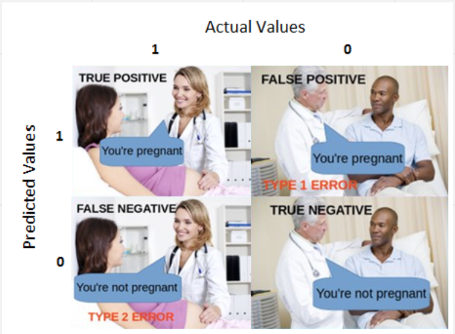

## Receiver Operation Characteristic Curve (ROC)

* [ROC and AUC, Clearly Explained!](https://www.youtube.com/watch?v=4jRBRDbJemM)
* Instead of being overwhelmed with confusion matrices, ROC graphs provide a simple way to summarize all of the
  information.
  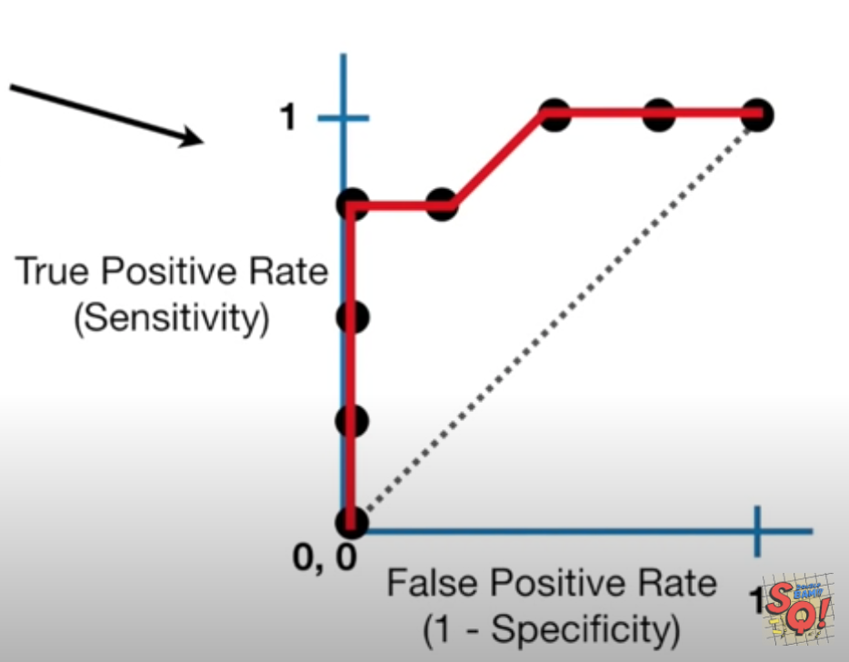
* True and False Positive rates are calculated like this.</br>
  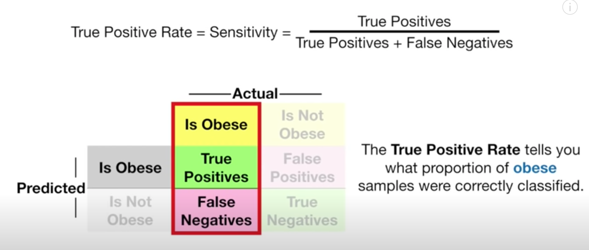</br>
  

* When one is trying to tweak the classification threshold of logistic regression, ROC comes in handy too as it
  summarises all of the confusion matrices that each threshold produces.
    * if 2 points have the same TP rates, the one with the smaller FP can be selected or depending on how many False
      positives can be accepted, the TP rate can be increased too.
* TPR is basically the recall of the positive class and is also called sensitivity in statistics.


* AUC (Area under the Curve ) can help you which categorization is better.
    * Red is better than blue in this example.
    * Red is Logistic Regression alg, blue is Random Forest and you can decide , logistic is better.

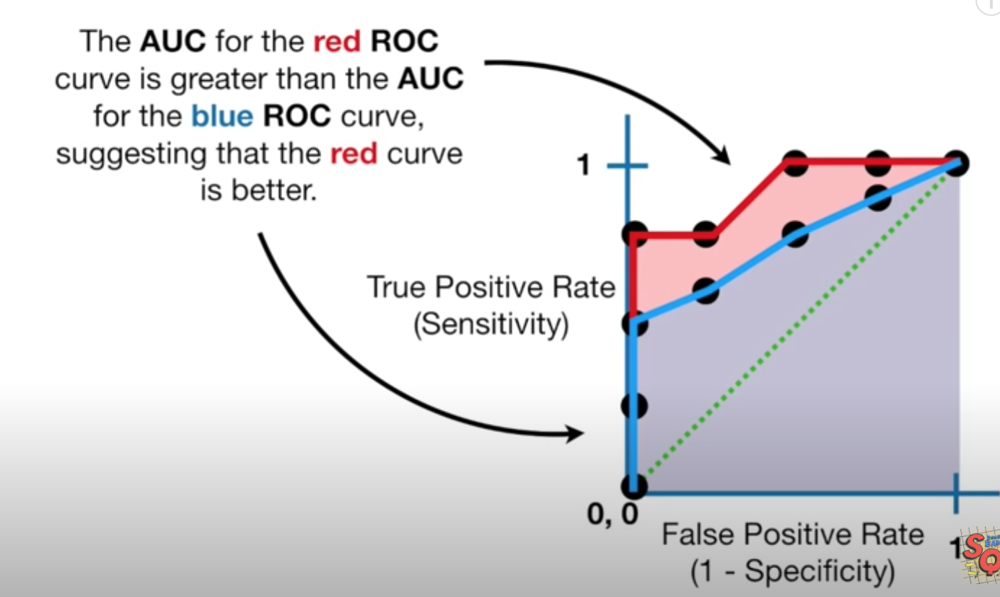

* **Precision p** is the number of correctly classified positive examples divided by the total number of examples that
  are classified as positive.
    * How likely is a member of Positive Data Set to be TP
    * Prediction does not include the number od True Negative and is not effected by imbalance.  
      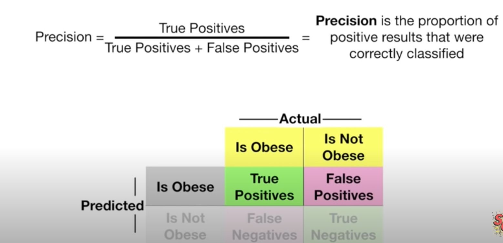</br>
      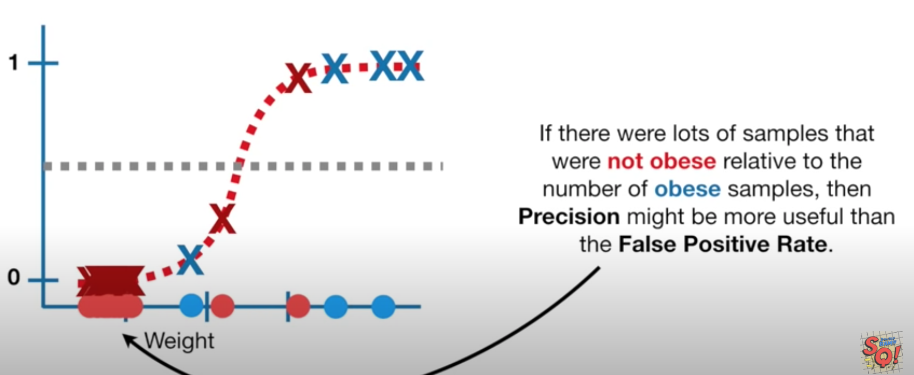</br>

* **Recall r** is the number of correctly classified positive examples divided by the total number of actual positive
  examples in the test set.
    * How representative TP is of all Actual Positives.
      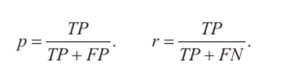

* Although in theory precision and recall are not related, in practice high precision is achieved almost always at the
  expense of recall and vice versa.
    * Therefore, **F-score**, harmonic mean of precision and recall, is used
    * Both p and r has to be high for the F-score to be high
    * The precision and recall break even point is where p and r equal or the closest
      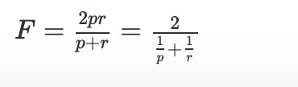

# TODO:

* Activity : 2.4.1 Activity [Diez Book - page 310, for calculations]

# WEEK 3

#### Main Topics

After completing this week you should be able to:

* Evaluate the suitability of given data for use in analysis
* Transform and clean simple tabular data using several common techniques
* Extract and create features from simple tabular data
* Integrate data from diverse sources (including multiple tables)

* After completing this week, you will have made significant steps towards achieving the following module learning
  outcomes:
    * MO2 — Manipulate a data set to extract statistics and features

#### Sub titles:

* [Evaluating the suitability of given data for use in analysis](#evaluating-the-suitability-of-given-data-for-use-in-analysis)
* [ARFF files](#arff-format-attribute-relation-file-format)
    * [Sparce Data](#sparce-data)
    * [Attribute Types](#attribute-types)
    * [Missing Values](#missing-values)
    * [Inaccurate values](#inaccurate-values)
    * [Unbalance Data](#unbalance-data)
    * [Getting to know your data](#getting-to-know-your-data)
* [Cleaning Data](#cleaning-data)
    * [Improving Decision Tree](#improving-decision-tree)
    * [Robust regression](#robust-regression)
    * [Detecting Anomalies](#detecting-anomalies)
    * [One Class Learning](#one-class-learning)
    * [Outlier Detection](#outlier-detection)
    * [Generating Arificial Data](#generating-arificial-data)
* [Attribute Selection](#attribute-selection)
    * [Scheme Independent Selection](#scheme-independent-selection)
    * [Searching Attributes in space](#searching-attributes-in-space)
    * [Scheme Spesific Selection](#scheme-spesific-selection)
* [Data Preparation and integration](#data-preparation-and-integration)
    * [Creating Analytics Base Table (ABT)](#creating-analytics-base-table-abt)

# Evaluating the suitability of given data for use in analysis

* Week 1 [What are data and what is a data set ?] title.

# ARFF Format (attribute-relation file format)


* Lines beginning with a % sign are comments.
* @relation tels the name of the data (weather)
* @attributes defines attributes (outlook, temperature, humidity, windy, play?).
    * Nominal attributes are followed by the set of values they can take on, enclosed in curly braces.
    * Values can include spaces; if so, they must be placed within quotation marks.
    * Numeric values are followed by the keyword numeric.
    * the class attribute is not distinguished in any way in the data file.
* @data line that signals the start of the instances in the dataset.
    * Instances are written one per line, with values for each attribute in turn, separated by commas.
    * If a value is missing it is represented by a single question mark (there are no missing values in this dataset).
* ARFF has 5 different attribute types:
    * numeric
    * nominal
    * string attributes
        * String attributes have values that are textual.
        * String attributes can have values that are very long—even a whole document.
    * date attributes
        * Weka uses the ISO-8601 combined date and time format yyyy-MM-dd’T’HH:mm:ss
    * relation-valued attributes
        * they allow multi-instance problems to be represented in ARFF format

```
@attribute bag relational
    @attribute outlook {sunny, overcast, rainy} @attribute temperature numeric
    @attribute humidity numeric
    @attribute windy {true, false}
@end bag
```

* Note, however, that in multi-instance learning the order in which the instances is given is generally considered
  unimportant. An algorithm might learn that cricket can be played if none of the days is rainy and at least one is
  sunny, but not that it can only be played in a certain sequence of weather events.


## Sparce Data

* Sometimes most attributes have a value of 0 for most of the instances, ie market basket data showing the purchased
  items will have a lot 0 for all the other items in the stock.
    * Another example is text mining where attributes are the words that occur in the documents.
* Sparse data files have the same @relation and @attribute tags, followed by an @data line, but the data section is
  different and contains specifications in braces such as those shown previously.
    * Instead of '0, X, 0, 0, 0, 0, Y, 0, 0, 0, “class A”', '{1 X, 6 Y, 10 “class A”}' saves space.
* Note that the omitted values have a value of 0—they are not “missing” values! If a value is unknown, it must be
  explicitly represented with a question mark.

## Attribute Types

* How an attribute is processed during cleanup also depends on how the model is going to treat that value. For example,
  if a numerical value is going to be used as numerical or ordinal.
* If a learning scheme treats numeric attributes as though they are measured on ratio scales, the question of
  normalization arises.
    * Attributes are often normalized to lie in a fixed range—usually from zero to one—by dividing all values by the
      maximum value encountered or
    * By subtracting the minimum value and dividing by the range, max-min.
    * Another normalization technique is to subtract the mean from each value and divide the result by the standard
      deviation.
        * This process is called standardizing a statistical variable and results in a set of values whose mean is zero
          and the standard deviation is one.
* For distance-based algorithms, nominal attributes can be converted to synthetic binary attributes, ie for
  sunny/cloudy/rainy, we use one binary attribute for each.
* Sometimes there is a genuine mapping between nominal attributes and numeric scales, ie the Zipcode or the leading
  digits of phone number and the geolocation.

## Missing Values

* [Understand Missing data and 5 ways to handle!](https://www.youtube.com/watch?v=sUAMiAIUhcI)
* Missing values are usually indicated with a number that normally cannot appear for that attribute, ie -1 or 0.
    * Different missing values can be distinguished by different values, ie -1: non-recorded, -2: irrelevant etc.
    * For nominal attributes, missing values may be indicated by blanks or dashes. Sometimes different kinds of missing
      values are distinguished (e.g., unknown vs unrecorded vs irrelevant values) and perhaps represented by different
      negative integers (21, 22, etc.).
* When a value is missing, the question that should be asked is, is it missing just as a random event or a decision was
  taken not to carry out a particular measurement as a result of a problem with the specimen.

* Imputation is t put most reasonable value in missing data, for example salary info 5000 euro for missing value.

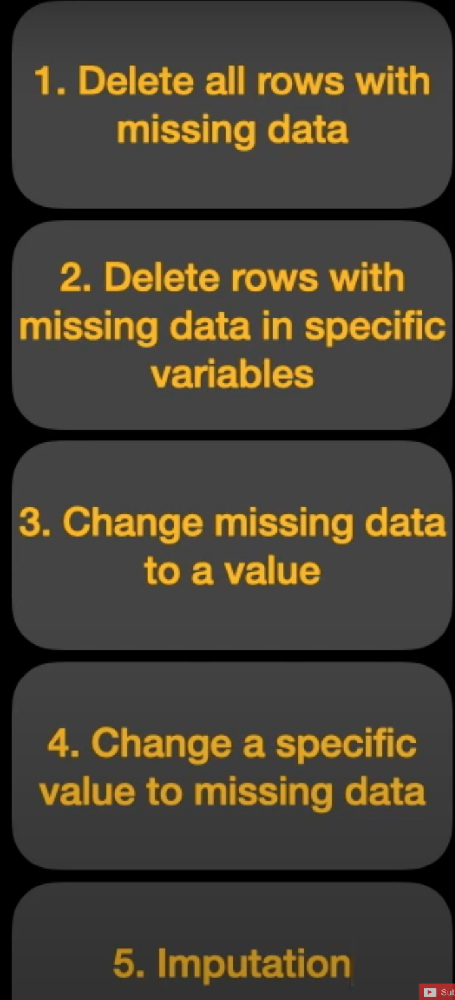<br>


## Inaccurate values

* It is important to check data mining files carefully for rogue attributes and attribute values. The data may not have
  been explicitly collected for that purpose.
* Typographic errors, ie spelling variations of a nominal attribute, extra spaces, upper/lower cases mismatches etc
  would lead to possible extra values.
    * To spot such issues, frequency tables as below and histograms can be useful.
* Typographical or measurement errors in numeric values generally cause outliers that can be detected by graphing one
  variable at a time.
    * Some incorrect values can be easy to spot due to huge variations from the rest but other times, this might require
      good domain knowledge.
* Duplicate data is another potential source of the problem, ie duplication of records leads to most ML algos giving
  them more weight.


## Unbalance Data

* In practical applications of classification schemes, it is very often the case that one class is far more prevalent
  than the others. For example, when predicting the weather in Ireland, it is pretty safe to predict that tomorrow will
  be rainy rather than sunny. Given a dataset in which these two values form the class attribute, with information
  relevant to the forecast in the other attributes, excellent accuracy is obtained by predicting rainy regardless of the
  values of the attributes.

* Always predicting the majority outcome rarely says anything interesting about the data. The problem is that raw
  accuracy, measured by the proportion of correct predictions, is not necessarily the best criterion of success. In
  practice, different costs may be associated with the two types of error.

## Getting to know your data

* Simple tools that show histograms of the distribution of values of nominal attributes, and graphs of the values of
  numeric attributes (perhaps sorted or simply graphed against instance number), are very helpful.
    * These graphical visualizations of the data make it easy to identify outliers, which may well represent errors in
      the data file—or arcane conventions for coding unusual situations, such as a missing year as 9999 or a missing
      weight as 21 kg, that no one has thought to tell you about
* Domain experts need to be consulted to explain anomalies, missing values, the significance of integers that represent
  categories rather than numeric quantities, and so on. Pairwise plots of one attribute against another, or each
  attribute against the class value, can be extremely revealing.
* In a large database, you should sample a few instances and examine them carefully.

# Cleaning Data

* 5 Principles
    * You can't fix problems until you can see them
        * Some within range values can still be problematic if they are repeated erroneously or put in by someone to
          fix 'missing' value, ie using the mean or median for this purpose.
        * So, looking for suspicious repeating values, especially with decimal places.
    * Don't' fix problems by making things worse
        * Refrain from making 'fixes' that might distort the statistics.
    * Justify your fixes
    * Sometimes you shouldn't fix
        * Even if they won't like to hear it, be honest to the audience and don't attempt to fix things that you
          actually can't.
    * Acknowledge residual uncertainty
* Data should be cleansed when acquired for many reasons:
    * Not everyone spots the data anomalies. Decision-makers may make costly mistakes on information based on incorrect
      data from applications that fail to correct for the faulty data.
    * If errors are not corrected early on in the process, the cleansing will have to be done for every project that
      uses that data.
    * Data errors may point to a business process that isn’t working as designed. we discovered clients who abused the
      couponing system and earned money while purchasing groceries.
    * Data errors may point to defective equipment, such as broken transmission lines and defective sensors.
    * Data errors can point to bugs in software or in the integration of software that may be critical to the company.

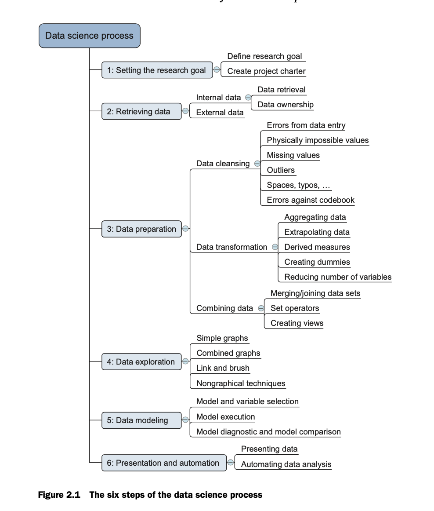</br>
</br>
</br>

## Improving Decision Tree

* Decision trees induced from training data can often be simplified, without loss of accuracy, by discarding
  misclassified instances from the training set, relearning, and then repeating until there are no misclassified
  instances.
    * Experiments show that this hardly affects the classification accuracy but significantly simplifies the DT.
    * This method also helps to verify the subtree pruning and also gives a chance to review the misclassified records
      as they might erroneous in the first place anyway.

* Tackling the noise
    * If there is attribute noise present in the training data, instead of trying to remove it, a similar noise should
      be added to the training data as well. So, training on noisy data but testing on noise-free should be avoided.
      This is more realistic as real-life attributes are likely to contain noise too.
    * If there is class noise, however, then this should either be removed or data with noise-free classes should be
      collected. But with class noise (rather than attribute noise), it is best to train on noise free instances if
      possible.

## Robust regression

* The problems caused by noisy data have been known in linear regression for years. Statisticians often check data for
  outliers and remove them manually.
    * Outliers dramatically affect the usual least-squares regression because the squared distance measure accentuates
      the influence of points far away from the regression line.

* Statistical methods that address the problem of outliers are called robust.
    * One way of making regression more robust is to use an absolute-value distance measure instead of the usual squared
      one.
        * This weakens the effect of outliers.
    * Another possibility is to try to identify outliers automatically and remove them from consideration.
        * For example, one could form a regression line and then remove from consideration those 10% of points that lie
          furthest from the line
    * A third possibility is to minimize the median (rather than the mean) of the squares of the divergences from the
      regression line.
        * It turns out that this estimator is very robust and actually copes with outliers in the X-direction as well as
          outliers in the Y-direction—which is the normal direction one thinks of outliers.

* Here the anomalous group is because they store calls total number of minutes not counts.
  </br>

* The least median of squares line lies at the exact center of this band. Note that this notion is often easier to
  explain and visualize than the normal least-squares definition of regression.
    * Unfortunately, there is a serious disadvantage to median-based regression techniques: they incur high
      computational cost, which often makes them infeasible for practical problems.

## Detecting Anomalies

* Auto-detection of outliers/anomalies is prone to errors, especially if a human expert isn't consulted
    * In statistical regression, visualizations help.
    * most classification problems cannot be so easily visualized: the notion of “model type” is more subtle than a
      regression line.
    * One solution that has been tried is to use several different learning schemes— such as a decision tree, and a
      nearest-neighbor learner, and a linear discriminant function—to filter the data.
    * Training all three schemes on the filtered data and letting them vote can yield even better results.
        * However, there is a danger to voting techniques: some learning algorithms are better suited to certain types
          of data than others, and the most appropriate scheme may simply get out-voted!

    * Method of combining the output from different classifiers, called stacking in Ensemble learning.

* One possible danger with filtering approaches is that they might conceivably just be sacrificing instances of a
  particular class (or group of classes) to improve accuracy on the remaining classes
* Automatic filtering is a poor substitute for getting the data right in the first place. And if this is too
  time-consuming and expensive to be practical, human inspection could be limited to those instances that are identified
  by the filter as suspect.

## One Class Learning

* If during training, there is only one class is available but prediction data presents records for unknown classes,
  then the one-class learner groups them as target/known and unknown classes.

## Outlier Detection

* One-class classification is often called outlier (or novelty) detection because the learning algorithm is being used
  to differentiate between data that appears normal and abnormal with respect to the distribution of the training data.
* A generic statistical approach to one-class classification is to identify outliers as instances that lie beyond a
  distance d from a given percentage p of the training data.
    * Alternatively, a probability density can be estimated for the target class by fitting a statistical distribution,
      such as a Gaussian, to the training data; any test instances with a low probability value can be marked as
      outliers.
    * If an appropriate distribution for the data at hand cannot be identified, one can adopt a non-parametric approach
      such as kernel density estimation.
        * An advantage of the density estimation approach is that the threshold can be adjusted at prediction time to
          obtain a suitable rate of outliers.
* Multi-class classifiers can be tailored to the one-class situation by fitting a boundary around the target data. * If
  the boundary is chosen too conservatively, data in the target class will erroneously be rejected. If it is chosen too
  liberally, the model will over-fit and reject too much legitimate data.

## Generating Arificial Data

* The most straightforward approach is to generate uniformly distributed data and learn a classifier that can
  discriminate this from the target.
    * However, different decision boundaries will be obtained for different amounts of artificial data.
    * To overcome this, rather than classifiers, class probability estimators such as bagged decision trees can be used.
      Then, the threshold level of the probability estimator can be adjusted as needed.
* There is one significant problem. As the number of attributes increases, it quickly becomes infeasible to generate
  enough artificial data to obtain adequate coverage of the instance space, and the probability that a particular
  artificial instance occurs inside or close to the target class diminishes to a point that makes any kind of
  discrimination impossible.
    * The solution is to generate artificial data that is as close as possible to the target class. In this case,
      because it is no longer uniformly distributed, the distribution of this artificial data—call this the “reference”
      distribution—must be taken into account when computing the membership scores for the resulting one-class model.
        * In other words, the class probability estimates of the two-class classifier must be combined with the
          reference distribution to obtain membership scores for the target class.

# Attribute Selection

* Experiments with a decision tree learner (C4.5) have shown that adding to standard datasets a random binary attribute
  generated by tossing an unbiased coin impacts classification performance, causing it to deteriorate (typically by 5 or
  10% in the situations tested)

* As you proceed further down the tree, less and less data is available to help make the selection decision. At some
  point, with little data, the random attribute will look good just by chance. Because the number of nodes at each level
  increases exponentially with depth, the chance of the rogue attribute looking good somewhere along the frontier
  multiplies up as the tree deepens.
    * The real problem is that you inevitably reach depths at which only a small amount of data is available for
      attribute selection. This is known as the fragmentation problem. If the dataset were bigger it wouldn’t
      necessarily help—you’d probably just go deeper.

* The fact that irrelevant distracters degrade the performance of decision tree and rule learners is, at first,
  surprising. Even more surprising is that relevant attributes can also be harmful.
    * The problem is that the new attribute is (naturally) chosen for splitting high up in the tree. This has the effect
      of fragmenting the set of instances available at the nodes below so that other choices are based on sparser data.
* Because of the negative effect of irrelevant attributes on most machine learning schemes, it is common to precede
  learning with an attribute selection stage that strives to eliminate all but the most relevant attributes.
    * The best way to select relevant attributes is manually, based on a deep understanding of the learning problem and
      what the attributes actually mean.

* More importantly, dimensionality reduction yields a more compact, more easily interpretable representation of the
  target concept, focusing the user’s attention on the most relevant variables.

## Scheme Independent Selection

* When selecting a good attribute subset, there are two fundamentally different approaches.
    * One is to make an independent assessment based on general characteristics of the data;
        * This is called the filter method, because the attribute set is filtered to produce the most promising subset
          before learning commences.
    * the other is to evaluate the subset using the machine learning algorithm that will ultimately be employed for
      learning
        * This is the wrapper method, because the learning algorithm is wrapped into the selection procedure.

* One simple scheme-independent method of attribute selection is to use just enough attributes to divide up the instance
  space in a way that separates all the training instances.

* Machine learning algorithms can be used for attribute selection. For instance, you might first apply a decision tree
  algorithm to the full dataset, and then select only those attributes that are actually used in the tree. While this
  selection would have no effect at all if the second stage merely built another tree, it will have an effect on a
  different learning algorithm.
    * Often the decision tree performs just as well when only the two or three top attributes are used for its construc-
      tion—and it is much easier to understand.

* Another possibility is to use an algorithm that builds a linear model—e.g., a linear support vector machine—and ranks
  the attributes based on the size of the coefficients. A more sophisticated variant applies the learning algorithm
  repeatedly. It builds a model, ranks the attributes based on the coefficients, removes the lowest-ranked one, and
  repeats the process until all attributes have been removed.
    * This method of recursive feature elimination has been found to yield better results on certain datasets (e.g.,
      when identifying important genes for cancer classification) than simply ranking attributes based on a single
      model.

* Attributes can be selected using instance-based learning methods too. You could sample instances randomly from the
  training set and check neighboring records of the same and different classes—“near hits” and “near misses.” If a near
  hit has a different value for a certain attribute, that attribute appears to be irrelevant and its weight should be
  decreased. On the other hand, if a near miss has a different value, the attribute appears to be relevant and its
  weight should be increased.

* Another way of eliminating redundant attributes as well as irrelevant ones is to select a subset of attributes that
  individually correlate well with the class but have little intercorrelation.

## Searching Attributes in space

* Most methods for attribute selection involve searching the space of attributes for the subset that is most likely to
  predict the class best. Fig. 8.1 illustrates the attribute space for the—by now all-too-familiar—weather dataset. The
  number of possible attribute subsets increases exponentially with the number of attributes, making exhaustive search
  impractical on all but the simplest problems.

* The downward direction, where you start with no attributes and add them one at a time, is called **forward selection**
  . The upward one, where you start with the full set and delete attributes one at a time, is **backward elimination**.

* In forward selection, each attribute that is not already in the current subset is tentatively added to it, and the
  resulting set of attributes is evaluated—using, e.g., cross-validation as described in the following section. This
  evaluation produces a numeric measure of the expected performance of the subset. The effect of adding each attribute
  in turn is quantified by this measure, the best one is chosen, and the procedure continues. However, if no attribute
  produces an improvement when added to the current subset, the search ends.

* Forward selection and backward elimination can be combined into a bidirectional search; again one can either begin
  with all the attributes or with none of them.

## Scheme Spesific Selection

* The performance of an attribute subset with scheme-specific selection is measured in terms of the learning scheme’s
  classification performance using just those attributes.

* The entire attribute selection process is rather computation intensive. If each evaluation involves a 10-fold
  cross-validation, the learning procedure must be executed 10 times.

* One way to accelerate the search process is to stop evaluating a subset of attributes as soon as it becomes apparent
  that it is unlikely to lead to higher accuracy than another candidate subset. This is a job for a paired statistical
  significance test, performed between the classifier based on this subset and all the other candidate classifiers based
  on other subsets. The performance difference between two classifiers on a particular test instance can be taken to be
  21, 0, or 1 depending on whether the first classifier is worse, the same as, or better than the second on that
  instance. A paired t-test can be applied to these figures over the entire test set, effectively treating the results
  for each instance as an independent estimate of the difference in performance.

* A simple method for accelerating scheme-specific search is to preselect a given number of attributes by ranking them
  first using a criterion like the information gain and discarding the rest before applying scheme-specific selection.

* Whatever way you do it, scheme-specific attribute selection by no means yields a uniform improvement in performance.
  Because of the complexity of the process, which is greatly increased by the feedback effect of including a target
  machine learning algorithm in the attribution selection loop, it is quite hard to predict the conditions under which
  it will turn out to be worthwhile. As in many machine learning situations, trial and error using your own particular
  source of data is the final arbiter.

# Data Preparation and integration

* Data integration involves taking the data from different data sources and merging them to give a unified view of the
  data from across the organization.
    * For example patient information can store differant hospital seperately, the important part of it to integrate
      correctly those data of one patient.

* The first three CRISP-DM stages take up to 70 to 80 percent of the total data science project time, with the majority
  of this time being allocated to data integration.

* Integrating data from multiple data sources is difficult even when the data are structured.
    * However, when some of the newer big-data sources are involved, where semi- or unstructured data are the norm, then
      the cost of integrating the data and managing the architecture can become significant

* The typical data-integration process will involve a number of different stages, consisting of extracting, cleaning,
  standardizing, transforming, and finally integrating to create a single unified version of the data.
    * Extracting data from multiple data sources can be challenging because many data sources can be accessed only by
      using an interface particular to that data source. As a consequence, data scientists need to have a broad skill
      set to be able to interact with each of the data sources in order to obtain the data
    * Once data have been extracted from a data source, the quality of the data needs to be checked. Data cleaning is a
      process that detects, cleans, or **removes corrupt or inaccurate data from the extracted data**.
        * For example, customer address information may have to be cleaned in order to convert it into a standardized
          format. In addition, there may be duplicate data in the data sources, in which case it is necessary to
          identify the correct customer record that should be used and to remove all the other records from the data
          sets.
    * It is important to ensure that the values used in a data set are consistent.
        * For example, one source application might use numeric values to represent a customer credit rating, but
          another might have a mixture of numeric and character values.

    * The other representations should be mapped into the standardized representation.
        * For example, imagine one of the attributes in the data set is a customer’s shoe size. Customers can buy shoes
          from various regions around the world, but the numbering system used for shoe sizes in Europe, the United
          States, the United Kingdom, and other countries are slightly different
        * Prior to doing data analysis and modeling, these data values need to be standardized.

* A wide variety of techniques can be used during this step and include data **smoothing**, **binning**, and **
  normalization** as well as writing custom code to perform a particular transformation.
    * A customer’s age is often transformed from a raw age into a general age range. This process of converting ages
      into age ranges is an example of a data- transformation technique called **binning**.
        * Although binning is relatively straightforward from a technical perspective, the challenge here is to identify
          the most appropriate range thresholds to apply during binning. Applying the wrong thresholds may obscure
          important distinctions in the data. Finding appropriate thresholds, however, may require domain specific
          knowledge or a process of trial-and-error experimentation.

## Creating Analytics Base Table (ABT)

* The final step in data integration involves creating the data that are used as input to the ML algorithms. This data
  is known as the **analytics base table**.

* The most important step in creating the analytics base table is the selection of the attributes that will be included
  in the analysis.
    * The selection is based on domain knowledge and on an analysis of the relationships between attributes.

* Attributes that are found to have a high correlation with other attributes are likely to be redundant, and so one of
  the correlated attributes should be excluded.
    * Removing redundant features can result in simpler models which are easier to understand, and also reduces the
      likelihood of an ML algorithm returning a model that is fitted to spurious patterns in the data.

* The set of attributes selected for inclusion define what is known as the analytics record.
    * An analytics record typically includes both raw and derived attributes

* After the analytics record has been designed, a set of records needs to extracted and aggregated to create a data set
  for analysis. When these records have been created and stored—for example, in a database—this data set is commonly
  referred to as the analytics base table. The analytics base table is the data set that is used as input to the ML
  algorithms.

* selection of attributes that will be included in the analysis - based on domain knowledge
* removing redundant features --> simple models, easy to understand
* design analytics records - set of records to be extracted and aggregated to create a dataset
* ABT is used as input to the ml algorithm

# WEEK 4

#### Main Topics

* Apply multiple regression and support vector regression
* Apply Naïve Bayes and support vector classification
* Choose between techniques for a given analysis in a principled way
* Identify, address and document residual threats to validity for a given analysis

After completing this week, you will have made significant steps towards achieving the following module learning
outcomes:

* MO3 — Critically evaluate and apply data mining techniques/tools to build a classifier or regression model, and
  predict values for new examples

#### Sub titles:

* [Alternative techniques for regression](#alternative-techniques-for-regression)

# Alternative techniques for regression

## Numeric Prediction: Linear Regression

* When the outcome, or class, is numeric, and all the attributes are numeric, linear regression is a natural technique
  to consider.

</br>

* where x is the class; a1, a2,..., ak are the attribute values; and w0, w1,..., wk are weights.
* The predicted value for the first instance’s class can be written as :

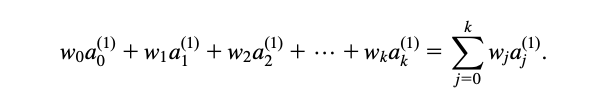</br>

* Then the sum of the squares of the differences is and This sum of squares is what we have to minimize by choosing the
  coefficients appropriately.

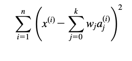</br>

* Linear regression is an excellent, simple method for numeric prediction, and it has been widely used in statistical
  applications for decades.
    * Of course, basic linear models suffer from the disadvantage of, well, linearity. If the data exhibits a nonlinear
      dependency, the best-fitting straight line will be found, where “best” is interpreted as the least mean-squared
      difference. This line may not fit very well.
        * However, linear models serve well as building blocks or starting points for more complex learning methods.
* Multiple regression

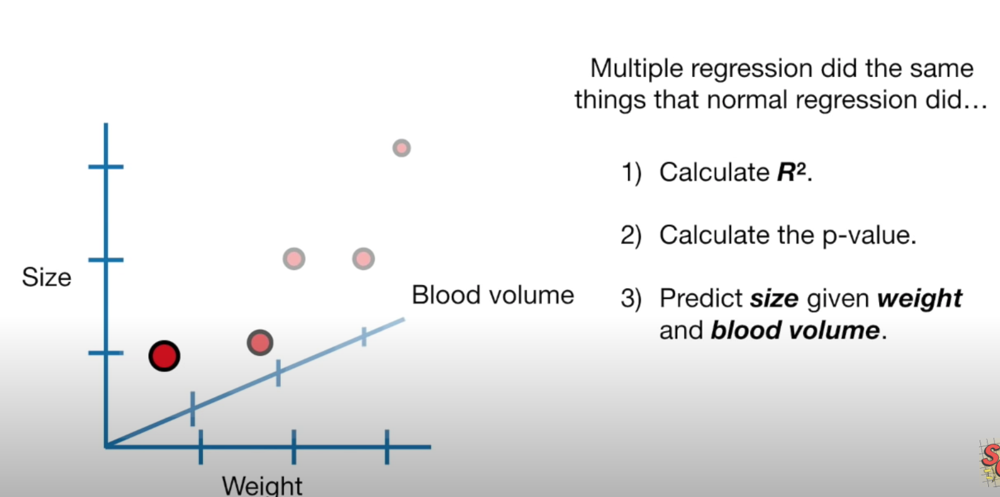</br>

## Linear Classification: Logistic Regression

* [Logistic regression](https://www.youtube.com/watch?v=yIYKR4sgzI8)

* Linear regression can easily be used for classification in domains with numeric attributes. Indeed, we can use **any**
  regression technique for classification.

* The trick is to perform a regression for each class, setting the output equal to one for training instances that
  belong to the class and zero for those that do not. The result is a linear expression for the class. Then, given a
  test example of unknown class, calculate the value of each linear expression and choose the one that is largest. When
  used with linear regression, this scheme is sometimes called **multiresponse linear regression**.

* Multiresponse linear regression has 2 drawbacks:
    * the membership values it produces are not proper probabilities because they can fall outside the range 0-1.
    * east-squares regression assumes that the errors are not only statistically independent, but are also normally
      distributed with the same standard deviation, an assumption that is blatantly violated when the method is applied
      to classification problems because the observations only ever take on the values 0 and 1.

* A related statistical technique called **logistic regression** does not suffer from these problems. Instead of
  approximating the 0 and 1 values directly, thereby risking illegitimate probability values when the target is
  overshot, logistic regression builds a linear model based on a transformed target variable.

* Transformation function called the logit transformation.

</br>

* In logistic regression the log-likelihood of the model is used instead. This is given by

</br>

## Linear Classification using the perception

* Logistic regression attempts to produce accurate probability estimates by maximizing the probability of the training
  data.
* the data can be separated perfectly into two groups using a hyperplane, it is said to be linearly separable. t turns
  out that if the data is linearly separable, there is a very simple algorithm for finding a separating hyperplane and s
  called the **perceptron learning rule**.
  </br>

* The resulting hyperplane is called a perceptron, and it’s the grandfather of neural networks
  </br>

## Linear Classification using Winnow

* The perceptron algorithm is not the only method that is guaranteed to find a separating hyperplane for a linearly
  separable problem.
    * For datases with binary attributes there is an alternative known as Winnow, The structure of the two algorithms is
      very similar. Like the perceptron, Winnow only updates the weight vector when a misclassified instance is
      encountered—it is mistake driven.

* Winnow is very effective in homing in on the relevant features in a dataset— therefore it is called an
  attribute-efficient learner. That means that it may be a good candidate algorithm if a dataset has many (binary)
  features and most of them are irrelevant.

## Extending Linear Models

* Support vector machines use linear models to implement nonlinear class boundaries.
* How can this be possible? The trick is easy: transform the input using a nonlinear mapping. In other words, transform
  the instance space into a new space. With a nonlinear mapping, a straight line in the new space does not look straight
  in the original instance space. A linear model constructed in the new space can represent a nonlinear decision
  boundary in the original space.
  </br>
    * Here, x is the outcome, a1 and a2 are the two attribute values, and there are four weights wi to be learned.
* Each data set can be modelled with a complicated enough polynomial but there are 2 major problems with this approach
    * As the number of parameters increase, the number of coefficients and the required computational power increase
      drastically and beyond the practical boundaries
    * There also is a risk of overfitting

# The Maximum Margin Hyperplane

* Support vector machines address both problems. They are based on an algorithm that finds a special kind of linear
  model: **the maximum margin hyperplane**.
    * A hyperplane is—it is just another term for a linear model
* To visualize a maximum margin hyperplane, imagine a two-class data set whose classes are linearly separable; i.e.,
  there is a hyperplane in instance space that classifies all training instances correctly. The maximum margin
  hyperplane is the one that gives the greatest separation between the classes—it comes no closer to either than it has
  to.

* The instances that are closest to the maximum margin hyperplane—the ones with minimum distance to it—are called
  support vectors.
    * There is always at least one support vector for each class, and often there are more

* The important thing is that the set of support vectors uniquely defines the maximum margin hyperplane for the learning
  problem. Given the support vectors for the two classes, we can easily construct the maximum margin hyperplane. **All
  other training instances are irrelevant**—they can be deleted without changing the position and orientation of the
  hyperplane.
  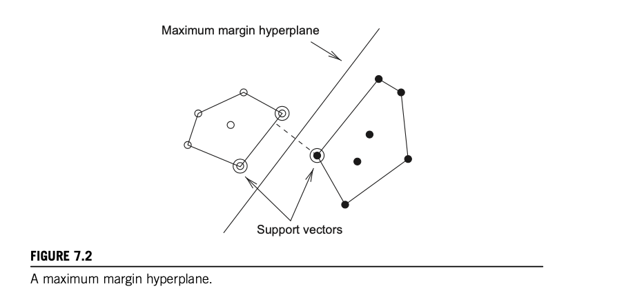</br>

## Non Linear Class Boundries

* With support vectors, overfitting is reduced.
    * The reason is that it is inevitably associated with instability: with an algorithm that overfits, changing one or
      two instance vectors will make sweeping changes to large sections of the decision boundary.
    * But the maximum margin hyperplane is relatively stable: it only moves if training instances are added or deleted
      that are support vectors—and this is true even in the high-dimensional space spanned by the nonlinear
      transformation.
    * **Overfitting is caused by too much flexibility in the decision boundary**. The support vectors are global
      representatives of the whole set of training points, and there are often relatively few of them, which gives
      little flexibility. Thus overfitting is less likely to occur.

* Computational complexity is still a problem:
    * According to the preceding equation, every time an instance is classified its dot product with all support vec-
      tors must be calculated. In the high-dimensional space produced by the nonlinear mapping this is rather expensive.
      Obtaining the dot product involves one multiplication and one addition for each attribute, and the number of
      attributes in the new space can be huge. This problem occurs not only during classification but also during
      training, because the optimization algorithms have to calculate the same dot products very frequently.
* Fortunately, it turns out that it is possible to calculate the dot product before the nonlinear mapping is performed,
  on the original attribute set. A highdimensional version of the preceding equation is simply
    *  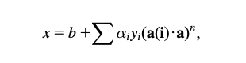</br>

* The function (x.y)^n, which computes the dot product of two vectors x and y and raises the result to the power n, is
  called a polynomial kernel.
    * A good way of choosing the value of n is to start with 1 (a linear model) and increment it until the estimated
      error ceases to improve. Usually, quite small values suffice .

* Other kernel functions can be used instead to implement different nonlinear mappings.
    * Two that are often suggested are the radial basis function (RBF) kernel and the sigmoid kernel.
    * Which one produces the best results depends on the application, although the differences are rarely large in
      practice
    * It is interesting to note that a support vector machine with the RBF kernel corresponds to a type of neural
      network called an RBF network (which we describe later), and one with the sigmoid kernel implements another type
      of neural network, a multilayer perceptron with one hidden layer (also described later).
    * Support vector machine with the RBF kernel corresponds to a type of neural network called an RBF network
    * One with the sigmoid kernel implements another type of neural network, a multilayer perceptron with one hidden
      layer

* SVM normally assumes linear separatability of the training data either in the instance space or in a transformed
  space.
    * Where this isn't the case, SVM can still be used by tuning the 'C' parameter but this is a manual, trial&error
      based process.
* we should mention that compared with other methods such as decision tree learners, even the fastest training
  algorithms for **support vector machines are slow when applied in the nonlinear setting.**
    * On the other hand, they often produce very accurate classifiers because subtle and complex decision boundaries can
      be obtained.

## Support Vector Regression

* The concept of a maximum margin hyperplane only applies to classification. However, support vector machine algorithms
  have been developed for numeric prediction that share many of the properties encountered in the classification case:
  they produce a model that can usually be expressed in terms of a few support vectors and can be applied to nonlinear
  problems using kernel functions.

* As with linear regression, the basic idea of SVR is to find a function that approximates the training points with
  minimised errors.
    * The crucial difference is that
        * All deviations up to a user-specified parameter ε are simply discarded. ε defines a tube around the regression
          function in which errors are ignored.
        * Also, when minimizing the error, the risk of overfitting is reduced by simultaneously trying to maximize the
          flatness of the function.
        * Another difference is that what is minimized is normally the predictions’ absolute error instead of the
          squared error used in linear regression.

* The value of ε controls how closely the function will fit the training data.
    * Too large a value will produce a meaningless predictor—in the extreme case, when 2ε exceeds the range of class
      values in the training data, the regression line is horizontal and the algorithm just predicts the mean class
      value.
    * For small values of ε there may be no tube that encloses all the data. In that case some training points will have
      nonzero error, and there will be a tradeoff between the prediction error and the tube’s flatness
      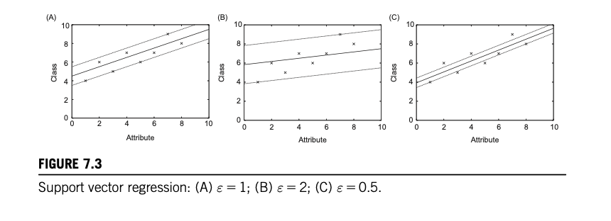</br>

* In the degenerate case ε50 the algorithm simply performs least-absolute-error regression under the coefficient size
  constraint, and all training instances become support vectors.
    * Conversely, if ε is large enough that the tube can enclose all the data, the error becomes zero, there is no
      tradeoff to make, and the algorithm outputs the flattest tube that encloses the data irrespective of the value of
      C.

# Alternative Techniques for classification

* There are 3 techniques to find what analysis techniques we would like to use:
    * Determine the techniques that could work, qualitatively:
        * Select the general type, regression vs classification
        * Determine the right specific features;
            * Descriptive vs regression : descriptive statistics like means are quite appropriate? Or do you need to be
              able to input the values of an instance and predict another field?
            * Binary vs multiway classification : “yes/no”, “true/false”
            * Do you need feature interactions, ie, does the value of one attribute affect the meaning of another. If
              yes, this is likely to require employing neural networks.
    * Narrow the search to the candidates that seem most likely to work well, quantitatively:
    * Empirically test those candidates agains each other to find winner:
        * Compare accurancy and error rates
        * Think about hypothesis testing (out of scope)

## Naive Bayes for Document classification

* An important domain for machine learning is document classification, in which each instance represents a document and
  the instance’s class is the document’s topic.
* Na ̈ıve Bayes is a popular technique for this application because it is very fast and quite accurate.
    * However, this does not take into account the number of occurrences of each word, which is potentially useful
      information when determining the category of a document.
    * Instead, a document can viewed as a bag of words—a set that contains all the words in the document, with multiple
      occurrences of a word appearing multiple times ( technically, a set includes each of its members just once,
      whereas a bag can have repeated elements).
    * Word frequencies can be accommodated by applying a modified form of Na ̈ıve Bayes called **multinominal Na ̈ıve
      Bayes**.

* the probability of a document E given its class H—in other words, the formula for computing the probability P(E|H) in
  Bayes’ rule—is below , where N 5 n1 + n2 +...+ nk is the number of words in the document.
    * Pi is estimated by computing the relative frequency of word i in the text of all training documents pertaining to
      category H.
      </br>

* In the multinomial Na ̈ıve Bayes formulation a document’s class is determined not just by the words that occur in it
  but also by the number of times they occur.
    * In general it performs better than the ordinary Na ̈ıve Bayes model for document classification, particularly for
      large dictionary sizes.

# Choosing a learning technique for a given analysis

## The Model Selection and Tuning Problem

* A key activity in computer science is taking a problem and defining it very precisely. This is necessary if you plan
  to automate solving the problem, but that’s not the only reason to do it. Sometimes defining a problem precisely helps
  you understand it.

## Model Selection and Managment Systems (MSMS)

* [Article](https://dl.acm.org/doi/pdf/10.1145/2935694.2935698)

* Model selection management systems (MSMS) : To make the iterative process of model selection easier and faster, we
  envision a unifying abstract framework that acts as a basis for a new class of analytics systems.
* Model Selection: Broadly defined, model selection is the process of building a precise prediction function to make
  “satisfactorily” accurate predictions about a data-generating process using data generated by the same process
* **Feature Engineering (FE)** is the process of converting raw data into a precise feature vector that provides the
  domain of the prediction function (a learned ML model).
    * FE includes a variety of options (a sequence of computational operations), e.g., counting words or selecting a
      feature subset. Some options, such as subset selection and feature ranking, are well studied
    * FE is considered a domain-specific “black art” , mostly because it is influenced by many technical and logistical
      factors, e.g., data and application properties, accuracy, time, interpretability, and company policies.
* **Algorithm Selection (AS)** is the process of picking an ML model, i.e., an inductive bias, that fixes the hypothesis
  space of prediction functions explored for a given application.
    * For example, logistic regression and decision trees are popular ML techniques for classification applications.
* **Parameter Tuning (PT)** is the process of choosing the values of (hyper-)parameters that many ML models and
  algorithms have.
    * For example, logistic regression is typically used with a parameter known as the regularizer. Such parameters are
      important because they control accuracy-performance tradeoffs, but tuning them is challenging partly because the
      optimization problems involved are usually non-convex .

### Model Selection Triple

* A large body of work in ML focuses on various theoretical aspects of model selection. But from a practical
  perspective, we found that analysts typically use an iterative exploratory process.
* While the process varies across analysts, we observed that the core object of their exploration is identical – an
  object we call the model selection triple (MST).
* It has three components (MST):
    * an FE “option” (loosely defined, a sequence of computation operations) that fixes the feature set that represents
      the data
    * an AS option that fixes the ML algorithm,
    * a PT option that fixes the parameter choices conditioned on the AS option.
* Model selection is iterative and exploratory because the space of MSTs is usually infinite, and it is generally
  impossible for analysts to know a priori which MST will yield satisfactory accuracy and/or insights.

### Three-Phase Iteration.

* Divide an iteration into 3 phases.
    * Steering:the analyst decides on an MST and specifies it in an ML-related language or GUI such as R, Scala, SAS, or
      Weka.
    * Execution: the system executes the MST to build and evaluate the ML model, typically on top of a data management
      platform, e.g., an RDBMS or Spark.
    * Consumption: the analyst assesses the results to decide upon the MST for the next iteration, or stops the process

* Iteration in an MSMS:
    * Steering: an MSMS should offer a framework of declarative operations that enable analysts to easily group
      logically related MSTs.
        * For example, the analyst can just “declare” the set of tree heights and feature subsets (projections).
    * Execution: an MSMS should include optimization techniques to reduce the runtime per iteration by exploiting the
      set-oriented nature of specifying MSTs.
        * For example, the system could share computations across different parameters or share intermediate
          materialized data for different feature sets.
    * Consumption: an MSMS should offer provenance management so that the system can help the analyst manage results and
      help with optimization. For example, the analyst can inspect the results using standard queries to help steer the
      next iteration, while the system can track intermediate data and models for reuse.

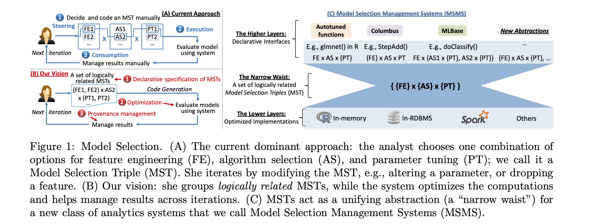</br>

# Technique comparisons

## Comparing Data mining schemes

* We often need to compare two different learning schemes on the same problem to see which is the better one to use. It
  seems simple: estimate the error using cross-validation (or any other suitable estimation procedure), perhaps repeated
  several times, and choose the scheme whose estimate is smaller.

* If there were unlimited data, we could use a large amount for training and evaluate performance on a large independent
  test set, obtaining confidence bounds just as before. However, if the difference turns out to be significant we must
  ensure that this is not just because of the particular dataset we happened to base the experiment on. What we want to
  determine is whether one scheme is beter or worse than another on average, across all possible training and test
  datasets that can be drawn from the domain. Because the amount of training data naturally affects performance, all
  datasets should be the same size: indeed, the experiment might be repeated with different sizes to obtain a learning
  curve.

* For each learning scheme we can draw several datasets of the same size, obtain an accuracy estimate for each dataset
  using cross-validation, and compute the mean of the estimates. Each cross-validation experiment yields a different,
  independent error estimate. What we are interested in is the mean accuracy across all possible datasets of the same
  size, and whether this mean is greater for one scheme or the other.

* From this point of view, we are trying to determine whether the mean of a set of samples—cross-validation estimates
  for the various datasets that we sampled from the domain—is significantly greater than, or significantly less than,
  the mean of another. This is a job for a statistical device known as the t-test, or Student’s t-test. Because the same
  cross-validation experiment can be used for both learning schemes to obtain a matched pair of results for each
  dataset, a more sensitive version of the t-test known as a paired t-test can be used.

# TODO:

* 4.4.1 Activity : Practical — applying alternative forms of regression
* 4.6.1 Activity : Practical — applying alternative forms of classification
* 4.7.2 Activity : [Important](https://onlinestudy.york.ac.uk/courses/577/files/183357?wrap=1)

# WEEK 5

#### Main Topics

After completing this week you should be able to:

* Describe the relational database mode
* Explain the problems caused by data that is too large for RAM
* Explain how Big Data causes problems for analytics

After completing this week, you will have made significant steps towards achieving the following module learning
outcomes:

* MO2 — Manipulate a data set to extract statistics and features

#### Sub titles:

* [Why databases?](#why-databases)
    * [Intro](#intro)
    * [Elements of Database System](#elements-of-database-system)
    * [Database User](#database-user)
    * [Database language](#database-language)
    * [Advantage of Database System and Database Management](#advantage-of-database-system-and-database-management)
        * [Data independence](#data-independence)
        * [Database Modeling](#database-modeling)
        * [Managing Structured, Semi-Structured, and Unstructured Data](#managing-structured-semi-structured-and-unstructured-data)
        * [Managing Data Redundancy](#managing-data-redundancy)
        * [Specifying Integrity Rules](#specifying-integrity-rules)
        * [Concurrency Control (ACID)](#concurrency-control-acid)
        * [Backup and Recovery Facilities](#backup-and-recovery-facilities)
        * [Data Security](#data-security)
        * [Performance Utilities](#performance-utilities)
* [Data and quality management](#data-management)
    * [Data Quality](#data-quality)
* [Data Governance](#data-governance)
* [Roles in Data Management](#roles-in-data-management)
* [Modelling data and the Relational Database model](#modelling-data-and-the-relational-database-model)
    * [Phases of designing Database](#phases-of-designing-database)
    * [The Entity Relationship Model](#the-entity-relationship-model)
    * [Entity Type](#entity-type)
    * [Attribute Type](#attribute-type)
    * [Basic concepts](#basic-concepts)
    * [Relationship Types](#relationship-types)
* [Relational Database Keys](#relational-database-keys)
* [Database Normalization](#database-normalization)
* [Questions](#questions)

# Why databases?

* Answer is :  the term ‘database’ can be used in both an informal way (perhaps suggesting a collection of data on which
  we might base a decision) and more formally to mean a specific approach and software structure for storing and
  manipulating data.

## Intro

* Database can store traditional , numeric and alphanumeric values and also multimedia data such as picture, video or
  audio, biometric data such as finger prints, retins scans, geographic info such as coordinates etc.

* A database can derived as a collection of related data items with a special business process or problem setting.
* A Database Management System (DBMS) is the software package used to define create, use and maintain a database.
    * Populars , Oracle, Microsoft, IBM ,My-SQL( well known open source DBMS)
* A combination of database with DBMS called database system.
* Before databases, data was stored in files and this has the danger of data duplication, redundancy and inconsistency
  as different applications kept records in different files.
    * The other option is all the applications accessing the same file store and retrieve data but then this has the
      problem of concurrency management which isn't easy either.
* Then, with databases, DBMS is in charge of delivering the data and managing the data access. DBMS also manage the
  metadata related to the stored data.
* DBM is also provides database languages that both data query and access. Well known language SQL
* The file base approach results in a strong application data dependence, where as tha database approach allows for
  applications to be independence from the data and data definitions.

* DBMS also help to achieve a looser application-data coupling as opposed to the stronger coupling with the file-based
  approach.

### Elements of Database System

* Database Model and shema provodes the definition of the database data at different levels .
* The database state, the current set of instances, represents the data in the database at a particular moment.
* Data model provides a clear and unambigous description of the data items , its relation and variour data concerns .
    * Conceptional data model is high level description of data items. should be implementation independent,
      user-friendly, and close to how the business user perceives the data. It will usually represented with Enhanced
      Entity Relationsgip (EER) model.
    * Logical data model is translation or mapping of the conceptual data modal towards special implementation
      environment. Like OOP, This describes which data stores where.
    * External data models contains various subset data items in logical model, also called views. A view describes the
      part of the database that a particular application or user group is interested in, hiding the rest of database.
* Three-layer architecture is essential for
    * In external layer has the external model , which includes views.
    * In internal layer includes internal data model, which specifies how the data stores or organised pysicaly.
* Idealy changes in one layer should have no to minimal impact on the others.
  </br>

* Catalog is the hard of the DBMS, contains data definition or metadata of the application.
    * it stores definition of views, logical and internal data models, and syncronises these 3 models to ensure
      consistency.

### Database User

* Information architect, design conceptional data by working closely with business.
* Database designer, converts conceptional data to logical and internal data model.
* Database administrator (DBA), reposnsile implementation and monitoring tha db.

### Database language

* The Database Definition Language (DDL) is used by DBA to express the DB external, logical, internal data models.
* Data Manipulation Language (DML) is used to retrieve , insert, update delete and modify data.
* SQL offers bith DDL and DML for relational DBs.

## Advantage of Database System and Database Management

* Database offers some addvantages such as,
    * data independence; managing structured, semi-structured and unstructured data;
    * database modeling;
    * managing data radundancy;
    * specifiying integrity rules;
    * conqurrency control
    * backup and recovery facilities
    * data security and performance utilities.

### Data independence

* Means that changing data definition has minimal to no impact on the applications using the data.
* Physical data independence implies that neither the applications, views, or logical data model must be changed when
  changes are made to the data storage specifications in the internal data model.
* Logical data independence implies that software applications are minimally affected by changes in the conceptual or
  logical data model. Consider the example of adding new data items, characteristics, or relationships.

### Database Modeling

* A data model is an explicit representation of the data items together with their characteristics and relationships.
  Also include integrity rules and functions.
* Popular examples of data models are the hierarchical model, the CODASYL model, the (E)ER model, the relational model,
  and the object-oriented model.

### Managing Structured, Semi-Structured, and Unstructured Data

* It is important to note that not all kinds of data but only structured data can be described according to a formal
  logical data model.
* With structured data, individual characteristics of data items can be identified and formally specified, such as the
  number, name, address, and email of a student, or the number and name of a course.
    * The advantage is the ability to express integrity rules and in this way enforce the correctness of the data
* With unstructured data, ie text documents, there are no finer-grain components in a file or series of characters that
  can be interpreted in a meaningful way by a DBMS or application.
* The data that isn't completely structured or unstructured is called semi-structured. XML and NoSQL databases deal with
  semi-structured data.
    * The semi-structured data still has a certain structure, but the structure may be very irregular or highly
      volatile.

### Managing Data Redundancy

* The DBMS is responsible for the management of redundancy by providing synchronization facilities to safeguard data
  consistency.
    * DBMS might deliberately create data redundancy for faster retrieval where the data is distributed across different
      locations.

### Specifying Integrity Rules

* These rules can be used to enforce the correctness of the data.
    * Syntactical rules specify how the data should be represented and stored. Examples are:
      customerID should be represented as an integer
* Semantic rules focus on the semantic correctness or meaning of the data. Examples are:
  customerID should be unique; account balance should be bigger than 0;
* n. In the database approach, they are specified as part of the conceptual/logical data model and are stored centrally
  in the catalog.
    * This substantially improves the efficiency and maintainability of the applications since the integrity rules are
      now directly enforced by the DBMS whenever anything is updated

### Concurrency Control (ACID)

* A DBMS has built-in facilities to support concurrent or parallel execution of database programs, which allows for good
  performance.
* A key concept is a database transaction that is a sequence of read/write operations, considered to be an atomic unit
  in the sense that either all operations are executed or none at all.
* Typically, these read/write operations can be executed at the same time by the DBMS.
* DBMS must support the **ACID** (Atomicity, Consistency, Isolation, Durability) properties.
    * **Atomicity**, or the all-or-nothing property, requires that a transaction should either be executed in its
      entirety or not at all.
    * **Consistency** assures that a transaction brings the database from one consistent state to another.
    * **Isolation** ensures that the effect of concurrent transactions should be the same as if they had been executed
      in isolation.
    * **Durability** ensures that the database changes made by a transaction declared successful can be made permanent
      under all circumstances.

### Backup and Recovery Facilities

* A key advantage of using databases is the availability of backup and recovery facilities.
    * These facilities can be used to deal with the effect of loss of data due to hardware or network errors, or bugs in
      system or application software

### Data Security

* Depending on the business application considered, some users have read access, while others have write access to the
  data (role-based functionality)
    * This can also be further refined to certain parts of the data

### Performance Utilities

* Three key performance indicators (KPIs) of a DBMS are: response time; throughput rate; and space utilization
    * The response time denotes the time elapsed between issuing a database request (e.g., a query or update
      instruction) and the successful termination thereof
    * The throughput rate represents the transactions a DBMS can process per unit of time.
    * Space utilization refers to the space utilized by the DBMS to store both the raw data and the metadata. A
      high-performing DBMS is characterized by quick response times, high throughput rates, and low space utilization

# Data and quality management

## Data Management

* Data management entails the proper management of data and the corresponding data definitions or metadata
* Just as with raw data, metadata are also data that need to be properly modeled, stored, and managed.
    * Hence, the concepts of data modeling should also be applied to metadata in a transparent way
* In a DBMS approach, metadata are stored in a catalog, sometimes also called a data dictionary or data repository,
  which constitutes the heart of the database system
    * This facilitates the efficient answering of questions such as which data are stored where in the database? Who is
      the owner of the data? Who has access to the data? How are the data defined and structured? Which transactions
      work with which data? Are the data replicated and how can consistency be guaranteed? Which integrity rules are
      defined? How frequently are backups made?

* The catalog provides an important source of information for end-users, application developers, and the DBMS itself.
    * the data definitions are generated by the DDL compiler. The DML compiler and query processor use the metadata to
      solve queries and determine the optimal access path

* The catalog should provide support for various functionalities
    * It should implement an extensible metamodel for the description of the metadata.
    * It should have facilities to import and export the data definitions and provide support for maintenance and re-use
      of metadata.
* The integrity rules stored should be continuously monitored and enforced whenever the raw data are updated. By doing
  so, the catalog guarantees that the database is always in a consistent and correct state

* A metamodel determines the type of metadata that can be stored. Just as with raw data, a database design process can
  be used to design a database storing metadata

## Data Quality

* Data quality determines the intrinsic value of the data to the business. Information technology only serves as a
  magnifier for this intrinsic value.
    * Hence, high-quality data combined with effective technology comprises a great asset, but poor-quality data
      combined with effective technology is an equally great liability.
    * This is sometimes also called the GIGO — Garbage In, Garbage Out — principle, stating that bad data result in bad
      decisions, even with the best technology available.

* Poor DQ impacts organizations in many ways.
    * At the operational level, it affects customer satisfaction, increases operational expenses, and will lead to lower
      employee job satisfaction.
    * At the strategic level, it affects the quality of the decision-making process.

* A DQ framework categorizes the different dimensions of data quality
* The intrinsic category represents the extent to which data values conform to the actual or true values.
* The contextual category measures the extent to which data are appropriate to the task of the data consumer. Obviously,
  this can vary in time and across data consumers.
* The representation category indicates the extent to which data are presented in a consistent and interpretable way.
  Hence, it relates to the format and meaning of data.
* The access category represents the extent to which data are available and obtainable in a secure manner

  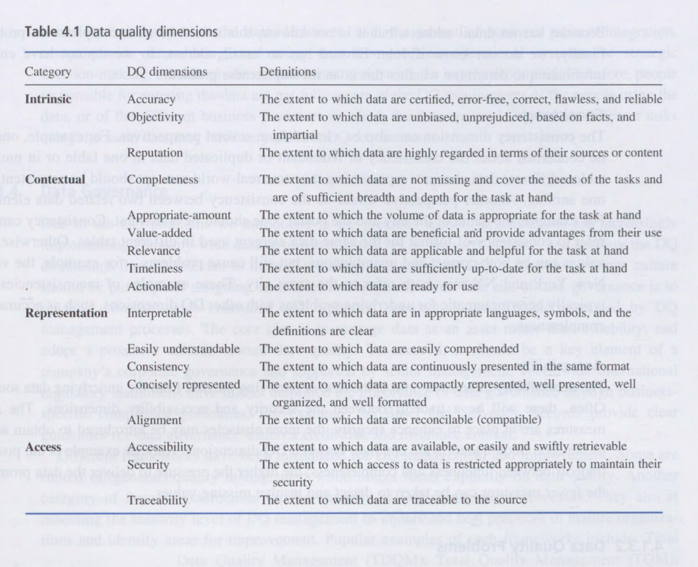</br>

* Data Quality Problems:
    * Multiple data sources: multiple sources with the same data may produce duplicates — a problem of consistency.
    * Subjective judgment in data production: data production using human judgment (e.g., opinions)
      can cause the production of biased information — a problem of objectivity.
    * Limited computing resources: lack of sufficient computing resources and/or digitalization may limit the
      accessibility of relevant data — a problem of accessibility.
    * Volume of data: large volumes of stored data make it difficult to access needed information in a reasonable time —
      a problem of accessibility.
    * Changing data needs: data requirements change on an ongoing basis due to new company strategies or the
      introduction of new technologies — a problem of relevance.
    * Different processes using and updating the same data — a problem of consistency

# Data Governance

* To manage and safeguard DQ, a data governance culture should be put in place assigning clear roles and
  responsibilities.
* The aim of data governance is to set-up a company-wide controlled and supported approach toward DQ accompanied by DQ
  management processes.
* The core idea is to manage data as an asset rather than a liability, and adopt a proactive attitude toward data
  quality
* A TDQM cycle consists of four steps — define, measure, analyze, and improve — which are performed iteratively.

  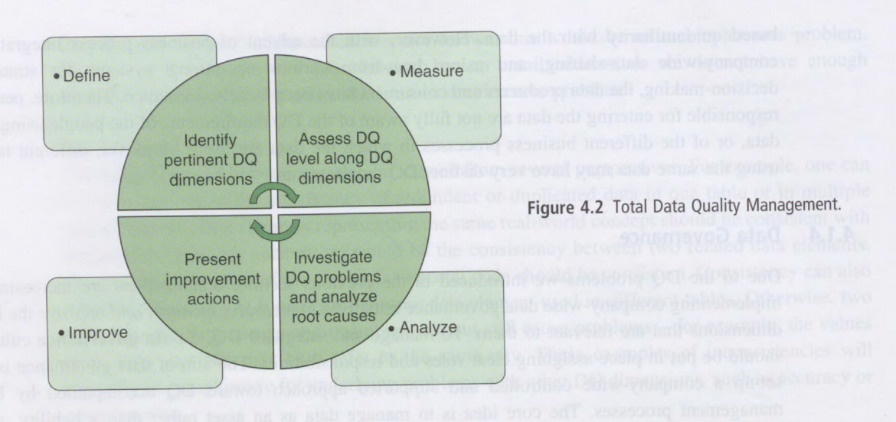</br>

# Roles in Data Management

* The **information architect** (also called information analyst) designs the conceptual data model, preferably in
  dialogue with the business users.
    * He/she bridges the gap between the business processes and the IT environment and closely collaborates with the
      database designer, who may assist in choosing the type of conceptual data model (e.g., EER or UML) and the
      database modeling tool.

* The **database designer** translates the conceptual data model into a logical and internal data model.
    * He/she also assists the application developers in defining the views of the external data model. To facilitate
      future maintenance of the database applications, the database designer should define company-wide uniform naming
      conventions when creating the various data models.

* **Data owner**, who has the authority to ultimately decide on the access to, and usage of, the data.
    * The data owner could be the original producer of the data, one of its consumers, or a third party.

* **Data stewards** are the DQ experts in charge of ensuring the quality of both the actual business data and the
  corresponding metadata.
    * They assess DQ by performing extensive and regular data quality checks.
        * A first type of action to be taken is the application of corrective measures.
            * However, data stewards are not in charge of correcting data themselves, as this is typically the
              responsibility of the data owner.
        * The second type of action to be taken upon the results of the DQ assessment involves a deeper investigation
          into the root causes of the DQ issues detected.
* The **database administrator (DBA)** is responsible for the implementation and monitoring of the database.
    * Example activities include: installing and upgrading the DBMS software; backup and recovery management;
      performance tuning and monitoring; memory management; replication management; security and authorization.
    * Closely collaborates with network and system managers

* **Data scientist** is a relatively new job profile within the context of data management.
    * He/she analyzes data using state-of-the-art analytical techniques to provide new insights into, for example,
      customer behavior.
    * A data scientist has a multidisciplinary profile combining ICT skills (e.g., programming) with quantitative
      modeling (e.g., statistics), business understanding, communication, and creativity

# Modelling data and the Relational Database model

## Phases of designing Database

* Designing a database is a multi-step process

</br>

## The Entity Relationship Model

* The Entity-Relationship model is one of the most popular models for conceptual database modelling.
* The ER model facilitates database design by providing a mechanism to express the logical properties of the part of the
  enterprise we are interested in -- the Universe of Discourse. The use of ER modelling is not limited to any particular
  database management system.
* ER modelling uses a simple graphical language to describe the system we are modelling.
* The ER diagrams are used as design tools – they capture the information about the conceptual system in a way that
  makes it easy for us to decide on the design of the actual database that implements the conceptual model.
* The ER model is a semantic model – that is, it captures the meaning of the relationships between our data, without
  dictating the syntactic structure that we will then need to implement the database.

* The ER model has an attractive and user-friendly graphical notation.
    * Hence, it has the ideal properties to build a conceptual data model. It has three building blocks: entity types,
      attribute types, and relationship types.

## Entity Type

* An **entity type** represents a business concept with an unambiguous meaning to a particular set of users. Examples of
  entity types are: supplier, student, product, or employee
    * An entity is one particular occurrence or instance of an entity type.
    * An entity type defines a collection of entities that have similar characteristics.

## Attribute Type

* An **attribute type** represents a property of an entity type. As an example, name and address are attribute types of
  the entity type supplier.

  </br>

* A **domain** specifies the set of values that may be assigned to an attribute for each individual entity. A domain for
  gender can be specified as having only two values: male and female or a date domain can define date with day, month
  and year
    * domains are not displayed in an ER model.

* A **key attribute type** is an attribute type whose values are distinct for each individual entity.
    * In other words, a key attribute type can be used to uniquely identify each entity
    * Examples are: supplier number, which is unique for each supplier A key attribute is one which allows us to
      identify a particular instance of an entity. An example of a key attribute might be a student number – a Primary
      Key as every student has a unique number, so we can use that attribute to identify each individual.
    * We can also have a key which is a combination of attributes – **a composite key.** One example of this might be a
      combination of name and address to identify an individual – some names are duplicated, and more that one person
      may live at a particular address, but the combination is (usually!) sufficient to uniquely identify a person.

* A **simple or atomic attribute** type cannot be further divided into parts. Examples are supplier number or supplier
  status.

* A **composite attribute type** is an attribute type that can be decomposed into other meaningful attribute types.
    * Think about an address attribute type, which can be further decomposed into attribute types for street, number,
      ZIP code, city, and country. Another example is name, which can be split into first name and last name

  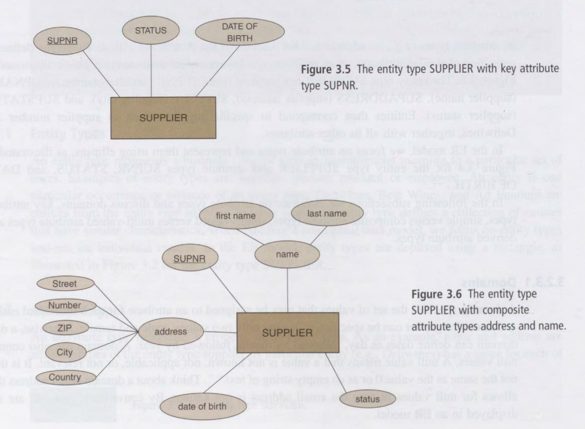</br>

* A **single-valued attribute** type has only one value for a particular entity. An example is product number or product
  name.

* A **multi-valued attribute** type is an attribute type that can have multiple values. As an example, email address can
  be a multi-valued attribute type as a supplier can have multiple email addresses
    * Multi-valued attribute types are represented using a double ellipse in the ER model

* A **derived attribute type**  is an attribute type that can be derived from. another attribute type. As an example,
  age is a derived attribute type since it can be derived from birth date.
    * Derived attribute types are depicted using a dashed ellipse, a

## Basic concepts

* Each row in a table (also called a tuple, an ordered set of parts or number of fields) corresponds to an individual
  record.
* Each record is distinct – duplicate records (rows in the table) are not allowed.
    * There must be some key attribute that allows us to distinguish one record from another. The order in which the
      records appear in the table is immaterial, as the relation represents a set.
* Each column in the table corresponds to one of the attributes of the entities represented by the table.
    * The column representing an attribute contains values from the domain of that attribute.

## Relationship Types

* A relationship represents an association between two or more entities.
* A relationship type then defines a set of relationships among instances of one, two, or more entity types.

* In the ER model, relationship types are indicated using a rhombus symbol (see below).
    * The rhombus can be thought of as two adjacent arrows pointing to each of the entity types specifying both
      directions in which the relationship type can be interpreted

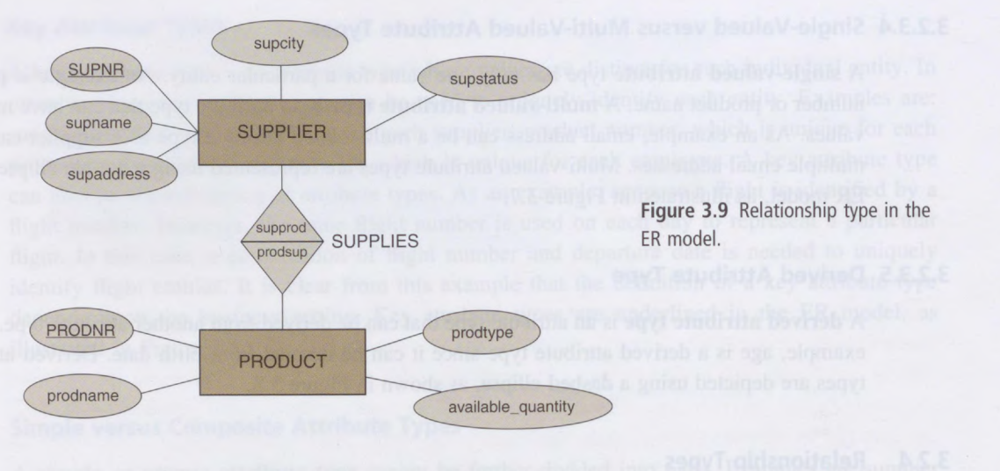</br>

* Degree and Roles
    * The **degree** of a relationship type corresponds to the number of entity types participating in the relationship
      type
        * A unary or recursive relationship type has degree one.
        * Binary: links two entity sets
        * Ternary: links three entity sets
        * N-ary: links N entity sets; ordered N-tuple (a tuple is a row in a table as opposed to an attribute which is a
          column).
            * A tuple is a set of attribute values in which no two distinct elements have the same name.
* The **roles** of a relationship type indicate the various directions that can be used to interpret it

* Cardinalities
    * Every relationship type can be characterized in terms of its cardinalities, which specify the minimum or maximum
      number of relationship instances that an individual entity can participate in.
        * If minimum cardinality is 0, it implies that an entity can occur without being connected through that
          relationship type to another entity. This can be referred to as **partial participation** since some entities
          may not participate in the relationship
            * Partial participation: Not every entity instance must participate in the relationship. We represent this
              by a single line.
        * If the minimum cardinality is 1, an entity must always be connected to at least one other entity through an
          instance of the relationship type. This is referred to as **total participation or existence dependency**,
          since all entities need to participate in the relationship, or in other words, the existence of the entity
          depends upon the existence of another
            * Total participation: Every member of the entity set must participate in the relationship. We represent
              this by a double line.

    * The maximum cardinality can either be 1 or N.
        * Relationship types are often characterized according to the maximum cardinality for each of their roles.
            * For binary relationship types, this gives four options: 1:1, 1:N (one-to-many relationship type), N:1, and
              M:N (many-to-many relationship type).

    * One-to-one: each entity in set X is associated with at most one entity in Y, and each entity in set Y is
      associated with at most one entity in X
    * One-to-many: each entity in set X is associated with more than one entity in Y, but each entity in set Y is
      associated with at most one entity in X
    * Many-to-many: each entity in set X is associated with more than one entity in Y, and each entity in set Y is
      associated with more than one entity in X

</br>

* Many to many example

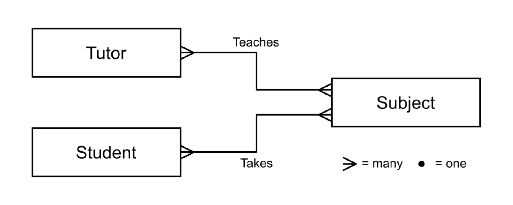</br>

* Strong/Weak Entity Type
    * A **strong entity type** is an entity type that has a key attribute type.
        * in image below, PURCHASE ORDER entity depends on SUPPLIER, but PURCHASE ORDER has its own key attribute thats
          why it is not weak.
    * In contrast, a **weak entity type** is an entity type that does not have a key attribute type of its own.
        * Weak entity types are represented in the ER model using a double-lined rectangle
        * In image below, The rhombus representing the relationship type through which the weak entity type borrows a
          key attribute type is also double-lined. The borrowed attribute type(s) is/are underlined using a dashed lin
        * Since a weak entity type needs to borrow an attribute type from another entity type, its existence will always
          be dependent on the latter
        * Image below, Room is depends on Hotel attribute m but Rooms does not have key attibute itseld , tahts why it
          is weak.

    * Entity Y is **existence dependent** on entity X if each instance of Y must have a corresponding instance of X. If
      this is the case, Y must have **total participation** in its relationship with X.
        * If Y does not have its own candidate key, Y is called a **weak entity**, and X is a **strong entity**.

* Weak entities may have a partial key, a discriminator that distinguishes instances of the weak entity that are related
  to an instance of the strong entity.

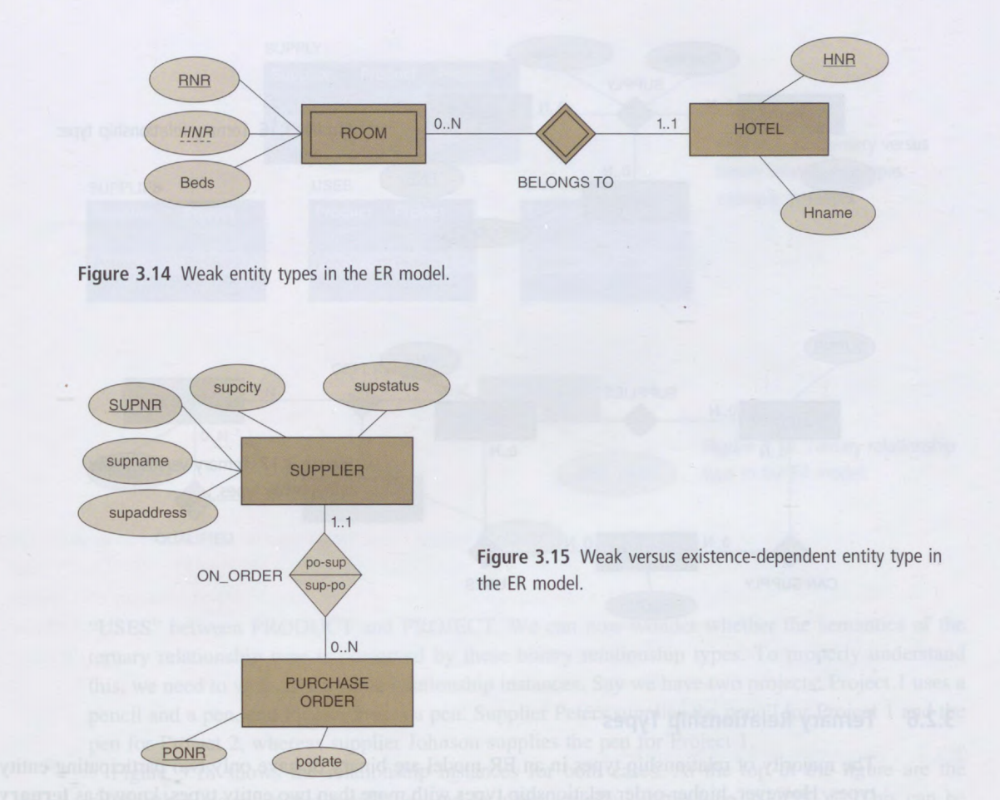</br>

* Ternary Relationship Types
    * Higher-order relationship types with more than two entity types, known as ternary relationship types, can
      occasionally occur, and special attention is needed to properly understand their meaning.

* Limitations for ER
    * the ER model presents a temporary snapshot of the data requirements of a business process. This implies that
      temporal constraints, which are constraints spanning a particular time interval, cannot be modeled.
    * the ER model cannot guarantee consistency across multiple relationship types. Some examples of business rules that
      cannot be enforced in the ER model are: an employee should work in the department that he/she manages, employees
      should work on projects

* Example for ER

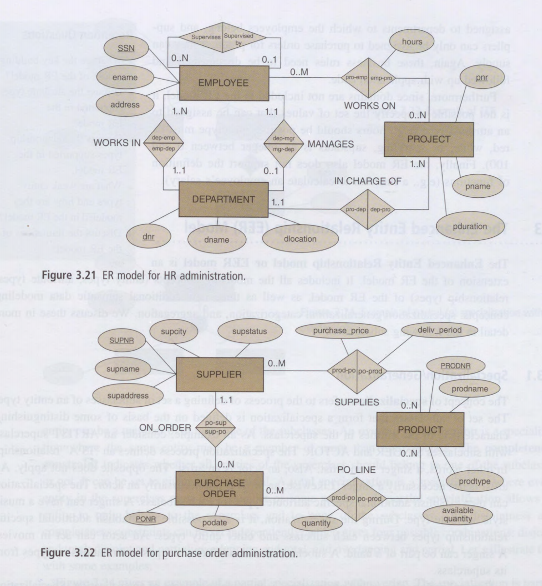</br>

# Relational Database Keys

* Relations never have duplicate tuples, so you can always tell tuples apart.
    * This implies that there is always a key (which may be a composite of all attributes, in the extreme case).

* The key may be of different types:
    * Superkey: A set of attributes that uniquely identifies tuples
    * Candidate key: A superkey such that no proper subset of itself is also a superkey (i.e. it has no unnecessary
      attributes)
    * Primary key: A candidate key chosen for unique identification of tuples
    * Candidate keys other than the primary key are called the **alternative keys**.

* The connection between the relations are established by using the concept of a **foreign key**.
    * A foreign key is an attribute, or combination of attributes, of a relation that is not the primary key of that
      relation, but is the primary key of some other relation.
        * For Example
            * In the STUDENT table, StudentId is the primary key, uniquely identifying a particular student.
            * In the ENROLL table, studentId is a foreign key, it links a student to the class they are taking,
            * But studendId is not itself a primary key for the ENROLL table.

* Representing Relations Database schemas
    * The **schema** for a relation gives the name of the relation, followed by the names of the attributes in
      parentheses:
        * Student(stuId, lastName, firstName, gender, dob, auth)
    * A database schema can have any number of relation schemas. We underline primary key in each relation schema, and
      indicate foreign keys

# Database Normalization

* The process of analysing a database structure to ensure there is no redundant data is called **normalisation**.
* If our relational model is not normalised, we may see different types of anomaly. In the data you saw earlier in the
  module, there were multiple records for each student, one for each class they had taken.
    * Insertion anomaly: if we want to insert a new record for a student, we need to make sure that the data about the
      student is consistent with the other records for that student.
    * Deletion anomaly: If we wanted to delete records about a class, and there was a student who had taken only that
      class, then the information about that student is also deleted.
    * Update anomaly: if we want to update a student, we have to find every record about the student and make sure they
      are updated consistently.

* There are three common forms of database normalisation: 1st, 2nd, and 3rd normal form, usually abbreviated to 1NF,
  2NF, and 3NF.
    * Each normal form builds on the previous form, and the relational model becomes less prone to anomalies.
    * First Normal Form – The information is stored in a relational table with each column containing atomic values.
    * Second Normal Form – The table is in first normal form and all the columns depend on the table’s primary key.
    * Third Normal Form – the table is in second normal form and all of its columns are not transitively dependent on
      the primary key

# Questions

* Explain the difference between data redundancy and data integrity
    * Data redundancy is unnecessary repetition of data. Data integrity is data as it should be / accurate, reflect
      reality

* Illustrate the concept of referential integrity with an example
    * Referential integrity will not allow the deletion of stock_number if it is being referred to by other entries or
      tables.

* In terms of a database, explain the term transaction
    * Any change in the database

* Explain where record locking might be needed while in a transaction process
    * Two transactions attempting an update at the same time on the same data. The first attempt locks the record so
      that the second attempt cannot interfere with the first transaction.

# WEEK 6

#### Main Topics

After completing this week you should be able to:

* Explain the models of databases for Big Data
* Explain how Big Data causes problems for analytics
* Explain how SQL databases can help represent a wide variety of data
* Explain how distributed computation approaches such as Hadoop can allow computation on huge volumes of data

After completing this week, you will have made significant steps towards achieving the following module learning
outcomes:

* MO4 Analyse and communicate issues with scaling up to large data sets, and use appropriate techniques to scale up the
  computation

#### Sub titles:

* [Constructing and querying a simple database](#constructing-and-querying-a-simple-database)

# Constructing and querying a simple database

* Data Description Language (DDL) is to design an instance in database (create table)
* Data Manipulation Language (DML) is using to manipulate the data.
* Qtructured Query Language (SQL) is the language used for both database definition and data manipulation in a
  relational database

* Database Table Creation is making with CREATE SQL command
    * For each table, we need to specify : The table name , attribute names ,attribute types ,primary key , any foreign
      key

```sql 
CREATE TABLE 'schooldata'.'STUDENT' (
'studentId' INT NOT NULL,
'firstName' VARCHAR(45) NULL,
'lastName' VARCHAR(45) NULL,
'Gender' VARCHAR(1) NULL,
'Dob' VARCHAR(20) NULL,
'auth' VARCHAR(45) NULL, PRIMARY KEY ('studentId'));

```

* To manipulate data

```sql
INSERT INTO STUDENT
VALUES (‘00001’, ’SAM’, ’Williams’, ’m’, 1979 / 5 / 9’, ‘Herts’)
```

# Next generation of databases

* In relational data model ‘relational model’, the database is structured as a set of tables. Within each table, each
  row corresponds to a record about some entity, and the columns in the table correspond to attributes of those
  entities. Each entity is defined by the set of attributes that it has.

* ‘NoSQL’ database technologies that are NOT built on the relational model.
* Scalability
    * RDBMS =>  With a traditional RDBMS we can try to scale up the system by adding more memory, a faster CPU and so
      on, referred to as ‘vertical scaling’, but there are limits to how far this can go

    * NoSQL => typically we aim to scale ‘horizontally’ — that is, we start distributing the work over several servers
      in a cluster, and scale up by adding servers.

* The data structures used in NoSQL databases are also typically more able to cope with data that doesn’t fit neatly
  into tables of records, such as documents, graphs or key-value pairs, making it easier to collect and process large
  volumes of unstructured data.

* Database Management Systems (DBMS) is the software that manages all the data which is stored in the secondary storage.
  </br>

# Big Data and the problems for analytics

* ‘Big data is data that contains greater variety arriving in increasing volumes and with ever-higher velocity.’ -
  Gartner’s definition, from 2001

* The problems:
    * The physical limits of our computer – if the data is too large to fit into the memory we have, will our approach
      to the problem still work?
    * The computational complexity of our algorithm – as the volume of our data increases, does the time taken increase
      more quickly so a solution becomes impossible in a reasonable time?
    * The structure of our computer – is it designed to to be efficient in handling big data, where we will spend much
      more time moving data around than processing it?

## 5V of Big Data

* 5V properties: **Volume, Velocity, Variety** that constitute native/original Big Data properties, and **Value** and **
  Veracity** as acquired as a result of data initial classification and processing in the context of a specific process
  or model. (Volume, Velocity,Variety are original Big Data 3V, then Veracity and Value added)
    * **Volume** The amount of data matters. With big data, you’ll have to process high volumes of low-density,
      unstructured data. This can be data of unknown value, such as Twitter data feeds, clickstreams on a web page or a
      mobile app, or sensor-enabled equipment. For some organizations, this might be tens of terabytes of data. For
      others, it may be hundreds of petabytes.
    * **Velocity** is the fast rate at which data is received and (perhaps) acted on. Normally, the highest velocity of
      data streams directly into memory versus being written to disk. Some internet-enabled smart products operate in
      real time or near real time and will require real-time evaluation and action.
    * **Variety** refers to the many types of data that are available. Traditional data types were structured and fit
      neatly in a relational database. With the rise of big data, data comes in new unstructured data types.
      Unstructured and semistructured data types, such as text, audio, and video, require additional preprocessing to
      derive meaning and support metadata.
    * **Value** Data has intrinsic value. But it’s of no use until that value is discovered.
    * **Veracity**  Equally important: How truthful is your data—and how much can you rely on it?

# Hadoop and distributed computation

* Hadoop is an open-source software framework
* Hadoop **provides massive storage for any kind of data**
    * Enormous processing power and the ability to handle a vast number of concurrent tasks or jobs.

* Hadoop is **not** a database system
    * But supports: the distributed storage, distributed processing, and job control

## Hadoop components

* Hadoop consists of three core components
    * a distributed file system so that data is spread across a number of servers
    * a parallel programming framework, so that computation is spread across a number of servers
    * a resource management system to coordinate the distribution of data and computation.

### Hadoop Distributed File System (HDFS)

* Hadoop is based on an open-source implementation of a clustered file system called HDFS.
    * The design of HDFS supports scalable, reliable, and cost-efficient distributed computing

* HDFS stores data files without prescribing the format, so any data in any format could be stored.
    * To give reliability and tolerance to hardware failure, multiple copies of the data are replicated across the
      cluster. The hardware itself can be standard server hardware, making implmentation cost effective.

## Hadoop MapReduce

* MapReduce’ is the programming model used within Hadoop to distribute processing of very large amounts of data.
* The processing of data is in two phases.
    * The ‘Map’ phase takes the data to be processed and splits it into small parts that can be processed quickly.
    * The results from processing these small parts are them brought together in the ‘Reduce’ phase – reducing the
      partial results down to a single combined result

</br>

## Hadoop YARN (Yet Another Resource Negotiator)

* Handles resource management and job
* YARN is responsible for allocating system resources to the various applications running in a Hadoop cluster and
  scheduling tasks to be executed on different cluster nodes.

## When to use Hadoop (and when not to!)

* When to use Hadoop
  *Large scale data processing.
  *If you have terabytes of data, then Hadoop may be a good solution for you.

    * Storing diverse data
        * Hadoop can store and process any kind of file data, so you do not need to transform your data into a
          particular form to store it in HDFS in order to then process it.

    * Parallel data processing
        * Hadoop uses the MapReduce approach to parallelize data processing. MapReduce works very well in situations
          where variables are processed one by one (e.g., counting or aggregation)


* When NOT to use Hadoop
    * Real-Time Data Analysis
        * Hadoop as originally implemented is oriented around batch processing, running long jobs over large data sets.
          For really big datasets, where you need to look at all your data, this can mean processing times in hours or
          days.
    * Smaller datasets
        * There is an overhead in using Hadoop. If you have small datasets, you are probably not going to find it
          cost-effective to use Hadoop. A more conventional RDBMS, or one of the NoSQL solutions, might be more
          appropriate.
    * Complex data
        * While Hadoop can handle data stored in many different forms, if the relationships in the data that you are
          interested in are complex (for example graph structures) then Hadoop’s approach to processing the data might
          not be the best fit.

# Different types of databases

* **Key-Value databases:** Key-value databases, or key-value stores, are an extreme form of database. The data to be
  stored could be anything, for example, a text file or image – it is treated as a ‘blob’ of data. The data is accessed
  through a key associated with it. To store a piece of data, the database forms an association between the key and the
  blob of data you wish to save. To retrieve data, you provide the key and the database returns the associated blob of
  data.

* **Document databases:** Document databases, or document stores, share the basic access and retrieval semantics of
  key-value stores, that is, they also use a unique key associated with a particular piece of data. **The main
  difference** is that instead of storing arbitrary blobs of data, document databases store data in structured formats
  called documents. XML, JSON (Java Script Object Notation) and BSON (which is a binary encoding of JSON objects) are
  some common standard encodings.

* **Graph databases:** Graph databases take a different approach to establishing relationships between data. Where the
  relational model uses tables with foreign keys to represent relationships between objects of different types, graph
  databases establish connections using the concepts of nodes, edges, and properties. Graph databases represent a piece
  of data as an individual node, which may have a number of properties. Between the nodes, edges are established to
  represent different types of relationships. In this way, graph databases allow representation of complex, hierarchical
  or network structures that may be difficult to model in a relational system.

## Big Data Architectures – NoSQL Use Cases for Key Value Databases

* [Big Data Architectures – NoSQL Use Cases for Key Value Databases](https://infocus.delltechnologies.com/april_reeve/big-data-architectures-nosql-use-cases-for-key-value-databases/)
* **NoSQL** data stores usually have a concept of “eventual consistency,” which means that all the redundancy and high
  availability is there but synchronicity may not be achieved immediately but eventually. A little data might be lost on
  rare occasions. Deal with it. If you have an application where a little data can never be lost, then don’t use a NoSQL
  database and be prepared to invest in appropriate recovery and high availability solutions.

* **Key value databases** are EXTREMELY simple databases.
    * There is a key and there is the rest of the data (the values) and that’s it.
    * You can find the value data based on searching the key field. There are no alternate keys and no foreign keys and
      no broad text searching capabilities against the values. If you want those things then you have to create them and
      it involves redundancy.
    * It is FAST. They are a lot faster than relational databases.
        * And they can scale: they can grow in size by hundreds and thousands of times without significant redesign. The
          growth in price is linear with the growth in size. It is very hard to scale relational database solutions
          quickly and the price curve is usually not linear but geometrical.

* Relational databases struggle with handling magnitude changes in volume quickly  (number of records stored) and with
  handling high volumes of transactions simultaneously (thousands or millions of state changes per second).
    * Key value NoSQL databases can handle magnitude scaling of number of records and extremely high volumes of state
      changes per second with millions of simultaneous users through distributed processing and distributed storage.
    * Key value NoSQL databases also have built in redundancy which can handle the loss of storage nodes without losing
      the whole application

* Example key value databases include Riak, Redis, Memcached, Berkeley DB, Hamster DB, Amazon Dynamo DB.

## How Can Graph Analytics Uncover Valuable Insights About Data?

* [How Can Graph Analytics Uncover Valuable Insights About Data?](https://infocus.delltechnologies.com/william_schmarzo/how-can-graph-analytics-uncover-valuable-insights-about-data/)
* Use Cases:
    * In computer science, graphs are used to represent networks of communication, data organization, computational
      devices, the flow of computation, etc
        * For instance, the link structure of a website can be represented by a directed graph, in which the vertices
          represent web pages and directed edges represent links from one page to another.
    * Graph-theoretic methods have proven useful in linguistics, since natural language often lends itself well to
      discrete structure
        * Traditionally, syntax and compositional semantics follow tree-based structures, whose expressive power lies in
          the principle of compositionality, modeled in a hierarchical graph.
    * Graph theory is used in sociology as a way,
        * or example, to measure actors’ prestige or to explore rumor spreading, notably through the use of social
          network analysis software.
    * In the world of intelligence, numerous government agencies are interested in identifying threats through the
      detection of non-obvious patterns of relationships and group communications buried in social media, email, texting
      and call detail records.
    * In life sciences, organizations can use graph analytics to conduct research in healthcare fraud for healthcare
      payers.
        * In addition to the healthcare fraud detection program, other potential graph analytics use cases include
          healthcare treatment efficacy and outcome analysis, analyzing drugs and side effects, and the analysis of
          proteins and gene pathways.
    * In the area of personalized healthcare, a startup called Lumiata wants to scale personalized medicine by
      leveraging machine learning and graphic analytics to help doctors to focus on more urgent care needs and empower
      nurses to carry more of the diagnostic chores
    * Graph Analytics can be used to address relationship-based problems in manufacturing, energy, gas exploration,
      travel, biology, conservation, computer chip design, chemistry, physics, higher education research, government,
      security, defense and many other fields.

* Advantages:
    * A key advantage of graphs is the ease with which new sources of data and new relationships can be added. Graph
      databases using Resource Description Framework (RDF) to represent the graph can easily merge and unify diverse
      datasets without significant upfront investment in data modeling.
    * The ability to quickly and easily add new data sources or new relationships within the data when needed to support
      a new line of questioning is crucial for discovery, and graphs are uniquely well qualified to support these
      requirements.

    * Graph analytics also offer sophisticated capabilities for analyzing relationships,
        * Centrality analysis: To identify the most central entities in your network, a very useful capability for
          influencer marketing.
        * Path analysis: To identify all the connections between a pair of entities, useful in understanding risks and
          exposure.
        * Community detection: To identify clusters or communities, which is of great importance to understanding issues
          in sociology and biology.
        * Sub-graph isomorphism: To search for a pattern of relationships, useful for validating hypotheses and
          searching for abnormal situations, such as hacker attacks.

* Graph analytics provide another arrow in our quiver – another tool that we can use against these vast amounts of
  social media and sensor-based data to uncover new insights about the relationships between our customers, products,
  and operations.
* Graph analytics allows us to get new, more actionable, more relevant answers to many of our traditional questions (Who
  are our most important customers? What are our most important products?), as well as answer completely new questions (
  Who are our most influential customers? Where are our largest networking or operational security risks?)

## Graph Databases for Beginners: ACID vs. BASE Explained

* [Graph Databases for Beginners: ACID vs. BASE Explained](https://neo4j.com/blog/acid-vs-base-consistency-models-explained/)
* The two most common consistency models are known by the acronyms ACID and BASE
* The key ACID guarantee is that it provides a safe environment in which to operate on your data.

* In the NoSQL database world, ACID transactions are less fashionable as some databases have loosened the requirements
  for immediate consistency, data freshness and accuracy in order to gain other benefits, like scale and resilience.

* Difference BASE and ACID
    * A BASE data store values availability (since that’s important for scale), but it doesn’t offer guaranteed
      consistency of replicated data at write time. Overall, the BASE consistency model provides a less strict assurance
      than ACID: data will be consistent in the future, either at read time (e.g., Riak) or it will always be
      consistent, but only for certain processed past snapshots (e.g., Datomic).

# ACID vs BASE consistency models

* One very important feature of a database is that the data it contains should be correct.
* ACID Consistency Model,
    * Atomic : All operations that make up a transaction succeed or every operation is rolled back to the initial
      consistent state of the database.
    * Consistent : On the completion of a transaction, all users see the same updated data.
    * Isolated :Transactions do not contend with one another to modify data. Contentious access to data is
      moderated by the database so that transactions appear to run sequentially.
    * Durable : The results of applying a transaction are permanent, even in the presence of failures.
* BASE Consistency Model
    * Basic Availability :The database appears to work most of the time.
    * Soft-state:  When the database is updated, it may be inconsistent for some period of time.
    * Eventual consistency: Stores exhibit consistency at some later point (e.g., lazily at read time).

* These BASE properties are more relaxed than we might want from a banking system, for example, but when we are
  interested more in what we can get from the data, and in the availability of the database, then BASE might be an
  acceptable approach.
    * The BASE consistency model is primarily used by NoSQL databases such as key-value and document stores.


# WEEK 7
#### Main Topics

#### Sub titles:
