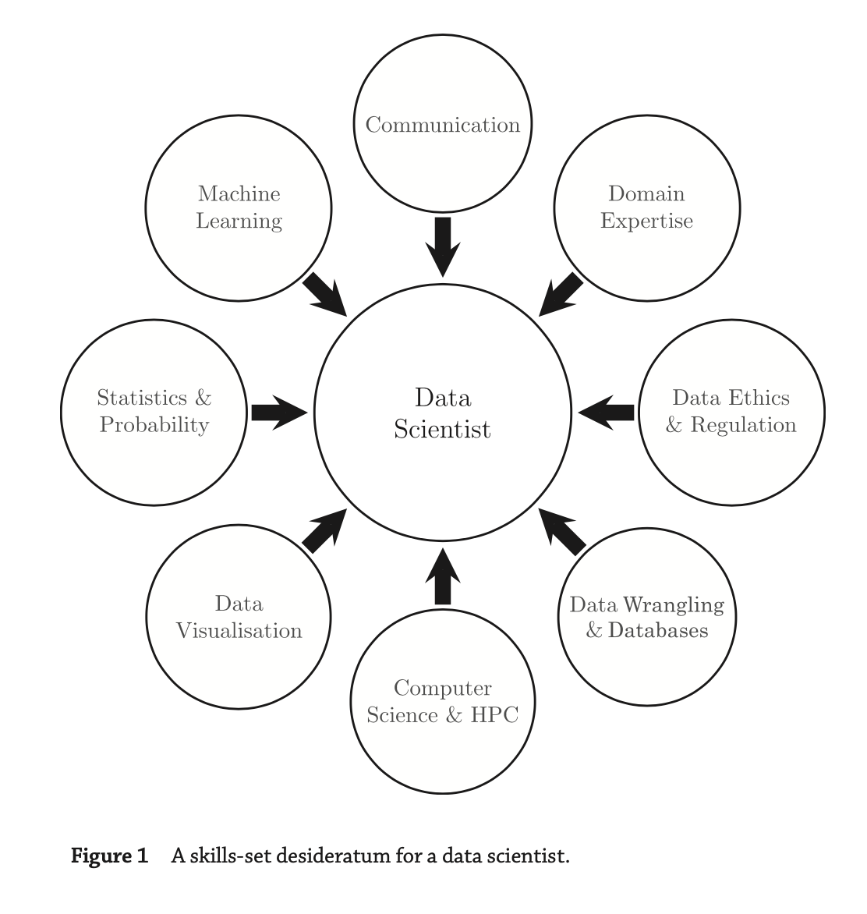

#### Main Topics

After completing this Week you should be able to:

* Reasons might want to ask questions of data
* Explaining the way data is structured in analytics
* Describing a reasonable data science process, and explaining why each step is important
* Applying some basic descriptive statistics
* Explaining why validity and privacy are important concerns in big data analytics

#### Sub titles:

- [Reasons to ask question of data](#reasons-to-ask-question-of-data)
  - [Research Questions](#research-questions)
  - [Data Science](#data-science)

# Reasons to ask question of data

## Research Questions

* A research question is a question, and it describes something about the world that you don’t know, and that you intend
  to find out.
    * For example, what is the population of York?
* Criterion for research questions:
    * Criterion 1: It needs to be in the form of a question.
    * Criterion 2: It needs to be a complete question
        * For example : are videos a better way to learn? -> Are videos a better way to learn than text? => That’s
          better, it’s a bit more specific
    * Criterion 3: t needs to be narrow enough to answer using data we can collect, and the tools we have available.
        * For example : “are beans healthy?” -> "s there a correlation - statistical term - between average bean
          consumption - a particular measure which will need some operationalising, but it’s a measure you could take -
          and self-reported sick days?"
            * Likewise, it’s not trivial to measure, although the fact that it’s self-report makes it a bit easier; it
              also makes it less reliable but that’s by the by here. But you see you’ve got something you can really
              start to think about measurement and statistical analysis.

* Finding RQ’s is a craft skill:
    * What questions matter to you?
    * What data do you have? or extension, “what data can you easily get?”
    * Write down the questions that come up in your head.
* Always iterate

## Data Science

* Data science encompasses a set of principles, problem definitions, algorithms, and processes for extracting non-
  obvious and useful patterns from large data sets.
    * Machine learning (ML) focuses on the design and evaluation of algorithms for extracting patterns from data.
    * Data mining generally deals with the analysis of structured data and often implies an emphasis on commercial
      applications.
* Data science can extract different type of patterns. Some examples below:
    * Identify groups of customers exhibiting similar behavior and tastes. In business jargon, this task is known as **
      customer segmentation**, and in data science terminology it is called **clustering**
    * Identifies products that are frequently bought together, a process called **association rule mining**.
    * Identify strange or abnormal events, such as fraudulent insurance claims, a process known as **anomaly** or **
      outlier detection**.
    * Identify classification rules as known prediction.

* If a human expert can easily create a pattern in his or her own mind, it is generally not worth the time and effort of
  using data science to “discover” it. In general, data science becomes useful when we have a large number of data
  examples and when the patterns are too complex for humans to discover and extract manually
* **Big data** are often defined in terms of the three Vs: the extreme **volume** of data, the **variety** of the data
  types, and the **velocity** at which the data must be processed.

* in 1970 Edgar F. Codd published a paper about **relational data** and relational database came up.
    * The relational data model enabled users to extract data from a database using simple queries that defined what
      data the user wanted without requiring the user to worry about the underlying structure of the data or where they
      were physically stored.
    * the development of structured query language (SQL) is using.
* In order to analyze their data, these companies needed technology that was able to bring together and reconcile the
  data from disparate databases and that facilitated more complex analytical data operations. This business challenge
  led to the development of **data warehouses**.

* After NoSQl data bases came up.
    * A NoSQL database stores data as objects with attributes, using an object notation language such as the JavaScript
      Object Notation (JSON).
    * The advantage of using an object representation of data (in contrast to a relational table-based model) is that
      the set of attributes for each object is encapsulated within the object, which results in a flexible
      representation.

* MapReduce framework, the data and queries are mapped onto (or distributed across) multiple servers, and the partial
  results calculated on each server are then reduced (merged) together.
    * Hadoop has this framework
* Skill set for a data scientist.

