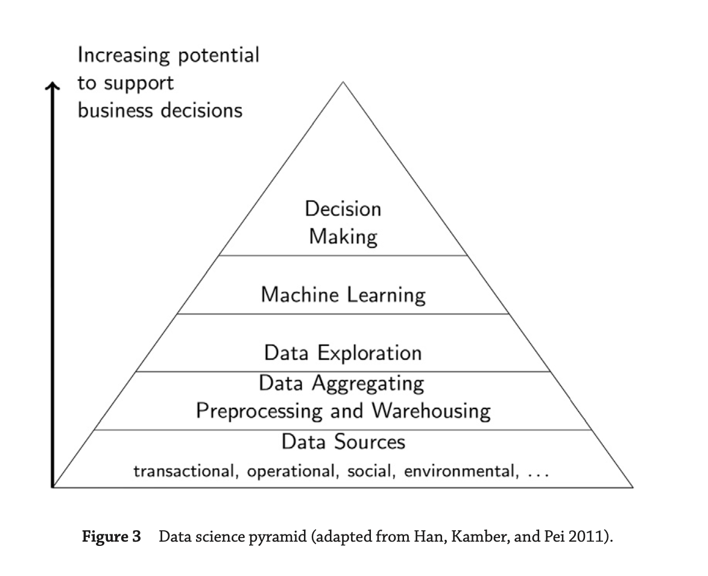

#### Main Topics

After completing this Week you should be able to:

* Reasons might want to ask questions of data
* Explaining the way data is structured in analytics
* Describing a reasonable data science process, and explaining why each step is important
* Applying some basic descriptive statistics
* Explaining why validity and privacy are important concerns in big data analytics

#### Sub titles:

- [Reasons to ask question of data](#reasons-to-ask-question-of-data)
    - [Research Questions](#research-questions)
    - [Data Science](#data-science)

# Reasons to ask question of data

## Research Questions

* A research question is a question, and it describes something about the world that you don’t know, and that you intend
  to find out.
    * For example, what is the population of York?
* Criterion for research questions:
    * Criterion 1: It needs to be in the form of a question.
    * Criterion 2: It needs to be a complete question
        * For example : are videos a better way to learn? -> Are videos a better way to learn than text? => That’s
          better, it’s a bit more specific
    * Criterion 3: t needs to be narrow enough to answer using data we can collect, and the tools we have available.
        * For example : “are beans healthy?” -> "s there a correlation - statistical term - between average bean
          consumption - a particular measure which will need some operationalising, but it’s a measure you could take -
          and self-reported sick days?"
            * Likewise, it’s not trivial to measure, although the fact that it’s self-report makes it a bit easier; it
              also makes it less reliable but that’s by the by here. But you see you’ve got something you can really
              start to think about measurement and statistical analysis.

* Finding RQ’s is a craft skill:
    * What questions matter to you?
    * What data do you have? or extension, “what data can you easily get?”
    * Write down the questions that come up in your head.
* Always iterate

## Data Science

* Data science encompasses a set of principles, problem definitions, algorithms, and processes for extracting non-
  obvious and useful patterns from large data sets.
    * Machine learning (ML) focuses on the design and evaluation of algorithms for extracting patterns from data.
        * “Machine learning” tends to be used when talking about specific algorithms used
    * Data mining generally deals with the analysis of structured data and often implies an emphasis on commercial
      applications.
    * “Data science” is an umbrella term — it includes both of the others
* They can be used interchangeably in many practical contexts
* Data science can extract different type of patterns. Some examples below:
    * Identify groups of customers exhibiting similar behavior and tastes. In business jargon, this task is known as **
      customer segmentation**, and in data science terminology it is called **clustering**
    * Identifies products that are frequently bought together, a process called **association rule mining**.
    * Identify strange or abnormal events, such as fraudulent insurance claims, a process known as **anomaly** or **
      outlier detection**.
    * Identify classification rules as known prediction.
        * Prediction means deriving unknown properties of an entity from its known properties

* If a human expert can easily create a pattern in his or her own mind, it is generally not worth the time and effort of
  using data science to “discover” it. In general, data science becomes useful when we have a large number of data
  examples and when the patterns are too complex for humans to discover and extract manually
* **Big data** are often defined in terms of the three Vs: the extreme **volume** of data, the **variety** of the data
  types, and the **velocity** at which the data must be processed.

* in 1970 Edgar F. Codd published a paper about **relational data** and relational database came up.
    * The relational data model enabled users to extract data from a database using simple queries that defined what
      data the user wanted without requiring the user to worry about the underlying structure of the data or where they
      were physically stored.
    * the development of structured query language (SQL) is using.
* In order to analyze their data, these companies needed technology that was able to bring together and reconcile the
  data from disparate databases and that facilitated more complex analytical data operations. This business challenge
  led to the development of **data warehouses**.

* After NoSQL databases came up.
    * A NoSQL database stores data as objects with attributes, using an object notation language such as the JavaScript
      Object Notation (JSON).
    * The advantage of using an object representation of data (in contrast to a relational table-based model) is that
      the set of attributes for each object is encapsulated within the object, which results in a flexible
      representation.

* MapReduce framework, the data and queries are mapped onto (or distributed across) multiple servers, and the partial
  results calculated on each server are then reduced (merged) together.
    * Hadoop has this framework
* Skill set for a data scientist.
    * Desirable skills: Machine learning, Communication ,Computer science ,Expertise in the application domain of the
      project , Working within the applicable ethical and legal codes

* When are rigorous processes likely to be useful?
    * When we have a large volume of data examples
    * When we have are trying to find patterns over many attributes of entities

* What are the most important reasons computer science skills are valuable for a data scientist?
    * Understanding and developing machine learning algorithms
    * Using high-performance computing techniques for data processing

* Why have increases in networked app use stimulated
    * The volume of amount and variety of available data has increased

# Possible uses of data science

## Five projects that are harnessing big data for good

* [Five projects that are harnessing big data for good](https://theconversation.com/five-projects-that-are-harnessing-big-data-for-good-104844)
* The data science boom shouldn’t be limited to business insights and profit margins. When used ethically, big data can
  help solve some of society’s most difficult social and environmental problems.

### 1. Finding humanitarian hot spots

* This project was made with Australian Red Cross to figure out where the humanitarian hot spots are in Victoria.
* They use social media data to map everyday humanitarian activity to specific locations and found that the hot spots of
  volunteering and charity activity are located in and around Melbourne CBD and the eastern suburbs
* These kinds of insights can help local aid organisations channel volunteering activity in times of acute need.

### 2. Improving fire safety in homes

* In the United States, Enigma Labs built open data tools to model and map risk at the level of individual
  neighbourhoods.
* Their model combines national census data with a geocoder tool (TIGER), as well as analytics based on local fire
  incident data, to provide a risk score.

### 3. Mapping police violence in the US

* The Mapping Police Violence project in the US monitors, make sense of, and visualises police violence.
* It draws on three crowdsourced databases, but also fills in the gaps using a mix of social media, obituaries, criminal
  records databases, police reports and other sources of information

### 4. Optimising waste management

* These smart bins have solar-powered trash compactors that regularly compress the garbage inside throughout the day.
* This eliminates waste overflow and reduces unnecessary carbon emissions, with an 80% reduction in waste collection.

### 5. Identifying hotbeds of street harassment

* A group of four women – and many volunteer supporters – in Egypt developed HarassMap to engage with, and inform, the
  community in an effort to reduce sexual harassment.
* The platform they built uses anonymised, crowdsourced data to map harassment incidents that occur in the street in
  order to alert its users of potentially unsafe areas.

## Data science can help us fight human trafficking

* [Data science can help us fight human trafficking](https://theconversation.com/data-science-can-help-us-fight-human-trafficking-81647)
* Millions individuals worldwide are trapped in some form of modern-day slavery.
* Human trafficking occurs in every country in the world, because it’s one of the largest sources of profit for global
  organized crime, second only to illicit drugs.
* They have some problems:
    * Finding people at risk: They collect some data from goverment or organizations to understand the people who is at
      risk
    * Victim identification and location: Trafficking networks are dynamic. Traffickers are likely to frequently change
      distribution and transportation routes to avoid detection, leaving law enforcement and analysts with incomplete
      information as they attempt to identify and dismantle trafficking networks.
    * Network disruption: Interrupting the flow of people, money and other components of trafficking is critical to
      identifying trafficking networks, disrupting their infrastructure at the source and eliminating them.
* In operations research, scientists apply mathematical methods to answer complex questions about patterns in data and
  predict future trends or behaviors.

## Big data’s arrival in sport is changing the rules of the game

* [Big data’s arrival in sport is changing the rules of the game](https://theconversation.com/big-datas-arrival-in-sport-is-changing-the-rules-of-the-game-33519)
* Using data analysis in sport is complex – not just because of the sheer volume of it, but in finding ways to structure
  and relay many highly dynamic pieces of information to a coach, manager or athlete in order to make quick strategic
  decisions.
* Wearable clothes can collect health data and can use to increase performance of the athletes.
* Not only athletes ,data can use for fans too.
    * By understanding how fans engage with the sport or a team’s brand, decisions can be made about tailored sports
      advertising or broadcast content

## Explainer: what is big data?

* [Explainer: what is big data?](https://theconversation.com/explainer-what-is-big-data-13780)
* Big Data, as the name implies, relates to very large sets of data collected through free or commercial services on the
  internet.
* It is impossible to remove/withdraw information from big data - information once added will persist indefinitely in
  the cloud
* virtually any information that is stored electronically, including information within personal devices, offline data
  storage, even information thought to be deleted, has the potential to be included in big data.
* Data mining is the process of analysing inter-data relationships – connecting the dots and finding hidden meanings and
  relationships that can provide startling new insights.
* It may be argued that the capability to fully analyse internet-scale data will be key to nations in maintaining their
  prosperity and perhaps even security. The future may indeed rest with those with the best big data technologies.

## Big data: The next frontier for innovation, competition, and productivity

* [Big data: The next frontier for innovation, competition, and productivity](https://www.mckinsey.com/business-functions/mckinsey-digital/our-insights/big-data-the-next-frontier-for-innovation)
* The amount of data in our world has been exploding, and analyzing large data sets—so-called big data—will become a key
  basis of competition, underpinning new waves of productivity growth, innovation, and consumer surplus.
* MGI studied big data in five domains—healthcare in the United States, the public sector in Europe, retail in the
  United States, and manufacturing and personal-location data globally.

* There are 5 ways for big data can create a value:
    * Big data can unlock significant value by making information transparent and usable at much higher frequency.
    * As organizations create and store more transactional data in digital form, they can collect more accurate and
      detailed performance information on everything from product inventories to sick days, and therefore expose
      variability and boost performance.
    * Big data allows ever-narrower segmentation of customers and therefore much more precisely tailored products and
      services.
    * Sophisticated analytics can improve decision making.
    * Bid data can used to improve the development of the next generation products and services.

* The use of big data will become a key basis of competition growth for individual firms.
* The use of big data will underpin new waves of productivity growth and consumer surplus.
* Some sectors are set for greater gains.
* There will be a shortage of talent necessary for organizations to take advantage of big data
* Several issues will have to be addressed to capture the full potential of big data. Policies related to privacy,
  security, intellectual property, and even liability will need to be addressed in a big data world.
  
# Describing a reasonable data science process

## The CRISP-DM Process
* Cross Industry Standard Process for Data Mining (CRISP- DM)
* Most of companies are using this pyramid to follow. 
* 

  

* The primary advantage of CRISP-DM, the main reason why it is so widely used, is that it is designed to be independent of any software, vendor, or data-analysis technique.

