#### Main Topics

After completing this Week you should be able to:

* Reasons might want to ask questions of data
* Explaining the way data is structured in analytics
* Describing a reasonable data science process, and explaining why each step is important
* Applying some basic descriptive statistics
* Explaining why validity and privacy are important concerns in big data analytics

#### Sub titles:

* [Reasons to ask question of data](#reasons-to-ask-question-of-data)
    * [Research Questions](#research-questions)
    * [Data Science](#data-science)
        * [Data Gathering](#data-gathering)
        * [History of Data analysis](#history-of-data-analysis)
        * [Where Is Data Science Used?](#where-is-data-science-used)
            * [Sales and marketing](#sales-and-marketing)
            * [Governments using data science](#governments-using-data-science)
            * [Data science in professional sports](#data-science-in-professional-sports)
        * [Myths about Data Science](#myths-about-data-science)
    * [Possible uses of data science](#possible-uses-of-data-science)
        * [Five projects that are harnessing big data for good](#five-projects-that-are-harnessing-big-data-for-good)
        * [Data science can help us fight human trafficking](#data-science-can-help-us-fight-human-trafficking)
        * [Big data’s arrival in sport is changing the rules of the game](#big-datas-arrival-in-sport-is-changing-the-rules-of-the-game)
        * [Explainer: what is big data?](#explainer-what-is-big-data)
        * [Big data: The next frontier for innovation, competition, and productivity](#big-data-the-next-frontier-for-innovation-competition-and-productivity)
* [Describing a reasonable data science process](#describing-a-reasonable-data-science-process)
    * [What are data and what is a data set ?](#what-are-data-and-what-is-a-data-set-)
    * [The CRISP-DM Process](#the-crisp-dm-process)
* [Describe the way data is structured in analytics](#describe-the-way-data-is-structured-in-analytics)
    * [Input: Concepts, instance, attributes](#input-concepts-instance-attributes)
    * [Concept](#concept)
    * [Example (aka Instances)](#example-aka-instances)
    * [Relations](#relations)
    * [Attribute](#attribute)
* [Statistic](#statistics)
    * [Data basics](#data-basics)
        * [Types of variables](#types-of-variables)
        * [Relationships between variables](#relationships-between-variables)
        * [Explanatory and response variables](#explanatory-and-response-variables)
        * [Observational studies and Experiments](#observational-studies-and-experiments)
    * [Examining numerical data](#examining-numerical-data)
* [Data Validity and Privacy](#data-validity-and-privacy)
* [Todo](#todo)

# Reasons to ask question of data

## Research Questions

* A research question is a question, and it describes something about the world that you don’t know, and that you intend
  to find out.
    * For example, what is the population of York?
* Criterion for research questions:
    * Criterion 1: It needs to be in the form of a question.
    * Criterion 2: It needs to be a complete question
        * For example : are videos a better way to learn? -> Are videos a better way to learn than text? => That’s
          better, it’s a bit more specific
    * Criterion 3: t needs to be narrow enough to answer using data we can collect, and the tools we have available.
        * For example : “are beans healthy?” -> "s there a correlation - statistical term - between average bean
          consumption - a particular measure which will need some operationalising, but it’s a measure you could take -
          and self-reported sick days?"
            * Likewise, it’s not trivial to measure, although the fact that it’s self-report makes it a bit easier; it
              also makes it less reliable but that’s by the by here. But you see you’ve got something you can really
              start to think about measurement and statistical analysis.

* Finding RQ’s is a craft skill:
    * What questions matter to you?
    * What data do you have? or extension, “what data can you easily get?”
    * Write down the questions that come up in your head.
* Always iterate

## Data science

* Data science encompasses a set of principles, problem definitions, algorithms, and processes for extracting non-
  obvious and useful patterns from large data sets.
    * Machine learning (ML) focuses on the design and evaluation of algorithms for extracting patterns from data.
        * “Machine learning” tends to be used when talking about specific algorithms used
            * The field of ML is at the core of modern data science because it provides algorithms that are able to
              automatically analyze large data sets to extract potentially interesting and useful patterns.
            * ML can be seen as automated techniques for finding patterns in data
            * Machine learning involves using a variety of advanced statistical and computing techniques to process data
              to find patterns.
            * GPUs have been adapted and optimized for ML use, which has contributed to large speedups in data
              processing and model training.
            * Data mining generally deals with the analysis of structured data and often implies an emphasis on
              commercial applications.
    * “Data science” is an umbrella term — it includes both of the others
* They can be used interchangeably in many practical contexts

* Data science can extract different type of patterns. Some examples below:
    * Identify groups of customers exhibiting similar behavior and tastes. In business jargon, this task is known as
      **customer segmentation**, and in data science terminology it is called **clustering**
    * Identifies products that are frequently bought together, a process called **association rule mining**.
    * Identify strange or abnormal events, such as fraudulent insurance claims, a process known as **anomaly** or
      **outlier detection**.
    * Identify classification rules as known **prediction**.
        * **Prediction** means deriving unknown properties of an entity from its known properties
        * So it is best to think of prediction patterns as predicting the missing value of an attribute rather than as
          predicting the future.
* Data science becomes useful when we have a large number of data examples and when the patterns are too complex for
  humans to discover and extract manually
* Features or variables means attributes of the data.
* The phrase **actionable insight** is sometimes used in this context to describe what we want the extracted patterns to
  give us.
    * **insight** highlights that the pattern should give us relevant information about the problem that isn’t obvious.
    * **actionable** highlights that the insight we get should also be something that we have the capacity to use in
      some way

### Data Gathering

* Transactional or operational data : Transactional data include event information such as the sale of an item, the
  issuing of an invoice, the delivery of goods, credit card payment, insurance claims, and so on.
* Non-transactional data: Such as demographic data, also have a long history.
* in 1970 Edgar F. Codd published a paper about **relational data** and relational database came up.
* Relational data model: the relational data model, which was revolutionary in terms of setting out how data were (at
  the time) stored, indexed, and retrieved from databases. The relational data model enabled users to extract data from
  a database using simple queries that defined what data the user wanted without requiring the user to worry about the
  underlying structure of the data or where they were physically stored.
    * Relational databases store data in tables with a structure of one row per instance and one column per attribute.
      This structure is ideal for storing data because it can be decomposed into natural attributes.
    * The development of structured query language (SQL) is using.
* Data warehouses: Data warehouses has the technology that was able to bring the data together and reconcile the data
  from disparate databases and that facilitated more complex analytical data operations. This business challenge led to
  the development of data warehouses.
* Meta data: Describe the structure and properties of the raw data.
* NoSQL databases :
    * A NoSQL database stores data as objects with attributes, using an object notation language such as the JavaScript
      Object Notation (JSON).
    * The advantage of using an object representation of data (in contrast to a relational table-based model) is that
      the set of attributes for each object is encapsulated within the object, which results in a flexible
      representation.

* **MapReduce** is a framework on Hadoop. In the MapReduce framework, the data and queries are mapped onto (or
  distributed across) multiple servers, and the partial results calculated on each server are then reduced (merged)
  together.

* Big Data is often defined in terms of the three Vs:
    * Three Vs:
        * Volume:  the extreme volume of data
        * Variety: the variety of the data types,
        * Velocity: and the velocity at which the data must be processed.

### History of Data analysis

* The simplest form of statistical analysis of data is the summarization of a data set in terms of summary (descriptive)
  statistics (including mea- sures of a central tendency, such as the arithmetic mean, or measures of variation, such as
  the range).
    * New developments in mathematics enabled statisticians to move beyond descriptive statistics and to start doing
      statistical learning.

* An engineer named William Playfair was inventing statistical graphics and laying the foundations for modern data
  visualization and exploratory data analysis.
    * He invented line, bar charts
* The advantage of visualizing quantitative data is that it allows us to 12 Chapter 1 use our powerful visual abilities
  to summarize, compare, and interpret data.
* t-distributed stochastic neighbor embedding (t-SNE) algorithm is a useful technique for reducing high-dimensional data
  down to two or three dimensions.
* Maximum likelihood estimate ia a method to draw conclusions based on the relative probability of events
* After the 1940s things started to move faster from the discovery of pattern recognition, neural networks, first steps
  of Machine Learning and then moved onto deep-learning neural networks and ensemble models in our times. Deep-Learning
  refers to a family of Neural Nets with multiple layers.
* The Knowledge Discovery in Databases (KDD), explains the required multidisciplinary approach to analyse large
  databases.
* The terms knowledge discovery in databases and data mining describe the same concept, the distinction being that data
  mining is more prevalent in the business communities and KDD more prevalent in academic communities.
* Breiman’s distinction between a statistical focus on models that explain the data versus an algorithmic focus on
  models that can accurately predict the data highlights a core difference between statisticians and ML researchers
* Today most data science projects are more aligned with the ML approach of build- ing accurate prediction models and
  less concerned with the statistical focus on explaining the data.

* **Skill set for a data scientist**.
    * Data scientists should have some domain expertise
    * Desirable skills: Machine learning, Communication ,Computer science ,Expertise in the application domain of the
      project , Working within the applicable ethical and legal codes
* Data Scientist needs to use HPC technologies.
    * High-performance computing (HPC) involves aggregating computing power to deliver higher performance than one can
      get from a standalone computer.
* computer science skills are also required to be able to understand and develop the ML models and integrate them into
  the production or analytic or back-end applications in an organization.

* When are rigorous processes likely to be useful?
    * When we have a large volume of data examples
    * When we have are trying to find patterns over many attributes of entities

* What are the most important reasons computer science skills are valuable for a data scientist?
    * Understanding and developing machine learning algorithms
    * Using high-performance computing techniques for data processing

* Why have increases in networked app use stimulated
    * The volume of amount and variety of available data has increased

### Where Is Data Science Used?

* Data science drives decision making in nearly all parts of modern societies.
* Cases to show impact of ata science:
    * consumer companies using data science for sales and marketing;
        * The equivalent of up-selling and cross-selling in the online world is the “recommender system.”
    * governments using data science to improve health, criminal justice, and urban planning;
    * professional sporting franchises using data science in player recruitment.

#### Sales and marketing

* By tracking the past customers activities, behavior, analyzing social media trends, analyzing credit card activity
  they are using to recommend some product to customers.
* The equivalent of up-selling and cross-selling in the online world is the “recommender system.”
* Chris Anderson’s book The Long Tail (2008) argues that as pro- duction and distribution get less expensive, markets
  shift from selling large amounts of a small number of hit items to selling smaller amounts of a larger number of niche
  items.

#### Governments using data science

* Governments have recognized the advantages of adopting data science and uses it in different areas from
  health/targetted drop development to track, analyze & control environmental, energy, and transport systems and to
  inform long-term urban planning.
* Data science is also being used to predict crime hot spots and recidivism.

#### Data science in professional sports

* The MoneyBall movie tells the true story of how the Oakland A’s baseball team used data science to improve its player
  recruitment.
* The Moneyball story is a very clear example of how data science can give an organization an advantage in a competitive
  market space. However, from a pure data science perspective perhaps the most important aspect of the moneyball story
  is that it highlights that sometimes the primary value of data science is the **identification of informative
  attributes**.

### Myths about Data Science

* One of the big- gest myths is the belief that data science is an autonomous process that we can let loose on our data
  to find the answers to our problems.
    * In reality, data science requires skilled human oversight throughout the different stages of the process. Humans
      analysts are needed to frame the problem, to design and prepare the data, to select which ML algorithms are most
      appropriate, to critically interpret the results of the analysis, and to plan the appropriate action to take based
      on the insight(s) the analysis has revealed.
* The second big myth of data science is that every data science project needs big data and needs to use deep learning.
    * In general, having more data helps, but having the right data is the more important requirement.
* A third data science myth is that modern data science software is easy to use, and so data science is easy to do.
    * The danger with data science is that people can be intimidated by the technology and believe whatever results the
      soft- ware presents to them. They may, however, have unwittingly framed the problem in the wrong way, entered the
      wrong data, or used analysis techniques with inappropriate assumptions.
    * Data science properly requires both appropriate domain knowledge and the expertise regarding the properties of the
      data and the assumptions underpin- ning the different ML algorithms.
* The last myth about data science we want to mention here is the belief that data science pays for itself quickly.
    * Depends on the context of the organization.
    * data science will not give positive results on every project. Sometimes there is no hidden gem of insight in the
      data,and sometimes the organization is not in a position to act on the insight the analysis has revealed.

# Possible uses of data science

## Five projects that are harnessing big data for good

* [Five projects that are harnessing big data for good](https://theconversation.com/five-projects-that-are-harnessing-big-data-for-good-104844)
* The data science boom shouldn’t be limited to business insights and profit margins. When used ethically, big data can
  help solve some of society’s most difficult social and environmental problems.

### 1. Finding humanitarian hot spots

* This project was made with Australian Red Cross to figure out where the humanitarian hot spots are in Victoria.
* They use social media data to map everyday humanitarian activity to specific locations and found that the hot spots of
  volunteering and charity activity are located in and around Melbourne CBD and the eastern suburbs
* These kinds of insights can help local aid organisations channel volunteering activity in times of acute need.

### 2. Improving fire safety in homes

* In the United States, Enigma Labs built open data tools to model and map risk at the level of individual
  neighbourhoods.
* Their model combines national census data with a geocoder tool (TIGER), as well as analytics based on local fire
  incident data, to provide a risk score.

### 3. Mapping police violence in the US

* The Mapping Police Violence project in the US monitors, make sense of, and visualises police violence.
* It draws on three crowdsourced databases, but also fills in the gaps using a mix of social media, obituaries, criminal
  records databases, police reports and other sources of information

### 4. Optimising waste management

* These smart bins have solar-powered trash compactors that regularly compress the garbage inside throughout the day.
* This eliminates waste overflow and reduces unnecessary carbon emissions, with an 80% reduction in waste collection.

### 5. Identifying hotbeds of street harassment

* A group of four women – and many volunteer supporters – in Egypt developed HarassMap to engage with, and inform, the
  community in an effort to reduce sexual harassment.
* The platform they built uses anonymised, crowdsourced data to map harassment incidents that occur in the street in
  order to alert its users of potentially unsafe areas.

## Data science can help us fight human trafficking

* [Data science can help us fight human trafficking](https://theconversation.com/data-science-can-help-us-fight-human-trafficking-81647)
* Millions individuals worldwide are trapped in some form of modern-day slavery.
* Human trafficking occurs in every country in the world, because it’s one of the largest sources of profit for global
  organized crime, second only to illicit drugs.
* They have some problems:
    * Finding people at risk: They collect some data from goverment or organizations to understand the people who is at
      risk
    * Victim identification and location: Trafficking networks are dynamic. Traffickers are likely to frequently change
      distribution and transportation routes to avoid detection, leaving law enforcement and analysts with incomplete
      information as they attempt to identify and dismantle trafficking networks.
    * Network disruption: Interrupting the flow of people, money and other components of trafficking is critical to
      identifying trafficking networks, disrupting their infrastructure at the source and eliminating them.
* In operations research, scientists apply mathematical methods to answer complex questions about patterns in data and
  predict future trends or behaviors.

## Big data’s arrival in sport is changing the rules of the game

* [Big data’s arrival in sport is changing the rules of the game](https://theconversation.com/big-datas-arrival-in-sport-is-changing-the-rules-of-the-game-33519)
* Using data analysis in sport is complex – not just because of the sheer volume of it, but in finding ways to structure
  and relay many highly dynamic pieces of information to a coach, manager or athlete in order to make quick strategic
  decisions.
* Wearable clothes can collect health data and can use to increase performance of the athletes.
* Not only athletes ,data can use for fans too.
    * By understanding how fans engage with the sport or a team’s brand, decisions can be made about tailored sports
      advertising or broadcast content

## Explainer: what is big data?

* [Explainer: what is big data?](https://theconversation.com/explainer-what-is-big-data-13780)
* Big Data, as the name implies, relates to very large sets of data collected through free or commercial services on the
  internet.
* It is impossible to remove/withdraw information from big data - information once added will persist indefinitely in
  the cloud
* virtually any information that is stored electronically, including information within personal devices, offline data
  storage, even information thought to be deleted, has the potential to be included in big data.
* Data mining is the process of analysing inter-data relationships – connecting the dots and finding hidden meanings and
  relationships that can provide startling new insights.
* It may be argued that the capability to fully analyse internet-scale data will be key to nations in maintaining their
  prosperity and perhaps even security. The future may indeed rest with those with the best big data technologies.

## Big data: The next frontier for innovation, competition, and productivity

* [Big data: The next frontier for innovation, competition, and productivity](https://www.mckinsey.com/business-functions/mckinsey-digital/our-insights/big-data-the-next-frontier-for-innovation)
* The amount of data in our world has been exploding, and analyzing large data sets—so-called big data—will become a key
  basis of competition, underpinning new waves of productivity growth, innovation, and consumer surplus.
* MGI studied big data in five domains—healthcare in the United States, the public sector in Europe, retail in the
  United States, and manufacturing and personal-location data globally.

* There are 5 ways for big data can create a value:
    * Big data can unlock significant value by making information transparent and usable at much higher frequency.
    * As organizations create and store more transactional data in digital form, they can collect more accurate and
      detailed performance information on everything from product inventories to sick days, and therefore expose
      variability and boost performance.
    * Big data allows ever-narrower segmentation of customers and therefore much more precisely tailored products and
      services.
    * Sophisticated analytics can improve decision making.
    * Bid data can used to improve the development of the next generation products and services.

* The use of big data will become a key basis of competition growth for individual firms.
* The use of big data will underpin new waves of productivity growth and consumer surplus.
* Some sectors are set for greater gains.
* There will be a shortage of talent necessary for organizations to take advantage of big data
* Several issues will have to be addressed to capture the full potential of big data. Policies related to privacy,
  security, intellectual property, and even liability will need to be addressed in a big data world.

# Describing a reasonable data science process

## What are data and what is a data set ?

* Data science is fundamentally de- pendent on data. In its most basic form, a datum or a piece of information is an
  abstraction of a real-world entity (person, object, or event).
* The terms variable, feature, and attribute are often used interchangeably to denote an individual abstraction
    * Each entity is typically described by a number of attributes.
* A **data set** consists of the data relating to a collection of entities, with each entity described in terms of a set
  of attributes.
    * A data set is organized in an n * m data matrix called the analytics record, where n is the number of entities (
      rows) and m is the number of at- tributes (columns
* The terms data set and analytics record are often used interchangeably, with the analytics record being a particular
  representation of a data set.

* The terms instance, example, entity, object, case, individual, and record are used in data science literature to refer
  to a **row**.
* The construction of the analytics record is a prerequisite of doing data science.
* Understanding and recognizing different attribute types is a fundamental skill for a data scientist. The standard
  types are **numeric**, **nominal**, and **ordinal**.
* **Numeric** attributes describe measurable quantities that are represented using integer or real values.
* Numeric attributes can be measured on either an **interval scale** or a **ratio scale**.
    * Interval attributes are measured on a scale with a fixed but arbitrary interval and arbitrary origin
        * ie. date and time measurements.
        * It is appropriate to apply order- ing and subtraction operations to interval attributes, but other arithmetic
          operations (such as multiplication and division) are not appropriate
    * Ratio scales are similar to interval scales, but the scale of measurement possesses a true-zero origin.
        * A value of zero indicates that none of the quantity is being measured.
        * Celcius is interval, Kelvin is rational scale.
* **Nominal** (also known as categorical) attributes take values from a finite set. These values are names (hence
  “nominal”)
  for categories, classes, or states of things.
    * ie marital status (sin- gle, married, divorced) and beer type (ale, pale ale, pils, porter, stout, etc.).
    * A binary attribute is a special case of a nominal attribute where the set of possible values is restricted to just
      two values. Boolean
    * Nominal attributes cannot have ordering or arithmetic operations applied to them.
* **Ordinal** attributes are similar to nominal attributes, with the difference that it is possible to apply a rank
  order over the categories of ordinal attributes.
    * ie “strongly dislike, dislike, neutral, like, and strongly like.”
    * there is no notion of equal distance between these values. As a result, it is not appropriate to apply arithmetic
      operations (such as averaging) on ordinal attributes

* The data type of an attribute (numeric, ordinal, nominal) affects the methods we can use to analyze and understand the
  data, including both the basic statistics we can use to describe the distribution of values that an attribute takes
  and the more complex algorithms we use to identify the patterns of relationships between attributes.

* 2 characteristics of data science cannot be overemphasized:
    * for data science to be successful, we need to pay a great deal of attention to how we create our data
    * we also need to “sense check” the results of a data science process. The pattern may simply be based on the biases
      in our data design and capture.

* **Structured data** are data that can be stored in a table, and every instance in the table has the same structure (
  i.e., set of attributes).
    * Structured data can be easily stored, organized, searched, reordered, and merged with other structured data.
* **Unstructured data** are data where each instance in the data set may have its own internal structure, and this
  structure is not necessarily the same in every instance
    * ie collections of human text (emails, tweets, text messages, posts, novels, etc.) can be considered unstructured
      data, as can collections of sound, image, music, video, and multimedia files.
* We can often extract structured data from unstructured data using techniques from artificial intelligence (such as
  natural-language processing and ML), digital signal processing, and computer vision. However processes is expensive
  and time-consuming and can add significant financial overhead and time delays to a data science project.
* Data can also be **derived** from other pieces of data.
    * ie the average salary in a company or the variance in the temperature of a room across a period of time.
* It is frequently the case that the real value of a data science project is the identification of one or more important
  derived attributes that provide insight into a problem
* There are generally two terms for gathered raw data: captured data and exhaust data (Kitchin 2014a).
    * **Captured data** are collected through a direct measurement or observation that is designed to gather the data.
    * By contrast, **exhaust data** are a by-product of a process whose primary purpose is something other than data
      capture.
        * primary purpose of the Amazon website is to enable users to make purchases from the site. However, each
          purchase generates volumes of exhaust data: what items the user put into her basket, how long she stayed on
          the site, what other items she viewed, and so on.
    * One of the most common types of exhaust data is **metadata**—that is, data that describe other data.
* DIKW pyramid: Eliot’s hierarchy mirrors the standard model of the structural relationships between wisdom,
  knowledge,information, and data known as the DIKW pyramid
    * Data are created through abstractions or measurements taken from the world.
    * Information is data that have been processed, structured, or contextualized so that it is meaningful to humans.
    * Knowledge is information that has been interpreted and understood by a human so that she can act on it if
      required.
    * Wisdom is acting on knowledge in an appropriate way.

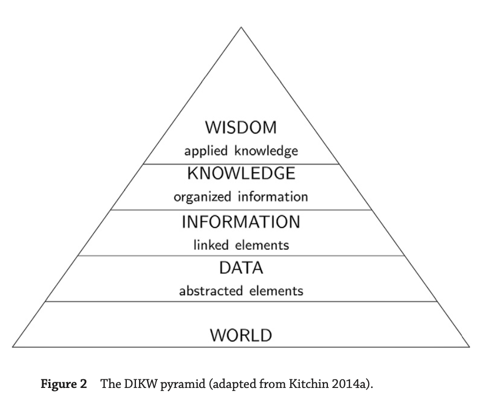

## The CRISP-DM Process

* Cross Industry Standard Process for Data Mining (CRISP- DM)
* Most of the companies are using this pyramid to follow.
* The main advantage of CRISP-DM is that it is designed to be independent of any software, vendor, or data-analysis
  technique.
* CRISP-DM was originally developed by a consortium of organizations consisting of leading data science vendors, end
  users, consultancy companies, and researchers.

* CRISP-DM lifecycle consists of 6 stages:
    * Business understanding,
    * Data understanding
        * In the fist 2 steps, the data scientist is trying to define the goals of the project by understanding the
          business needs and the data that the business has available to it.
        * The process typically involves identifying a business problem and then exploring if the appropriate data are
          available to develop a data-driven solution to the problem
    * Data preparation
        * The focus of the data-preparation stage is the creation of a data set that can be used for the data analysis
        * This involves creating the data set by integrating data from different sources, also identifying outliers and
          missing values and cleaning data.
    * Modeling
        * This is the stage where automatic algorithms are used to extract useful patterns from the data and to create
          models that encode these patterns. ML is using for it.
        * the initial model test results will uncover problems in the data. This can help to investigate the data errors
          in first hand for data science and they can revisit data again and fix.
    * Evaluation
    * Deployment
        * These 2 process are focused on how the models fit the business and its processes.
        * The evaluation phase involves assessing the models in the broader context defined by the business needs. This
          also help data science can validate business needs, improve the model and last controls
        * The deployment phase involves examining how to deploy the selected models into the business environment.
            * This involves planning how to integrate the models into the organization’s techni- cal infrastructure and
              business processes.

* Outer Ciscle means iterate whole the process periodicly
    * Because there are many reasons why a data-driven model can become obsolete:
        * the business’s needs might have changed;
        * the process the model emulates and provides insight into might have changed
        * the data streams the model uses might have changed

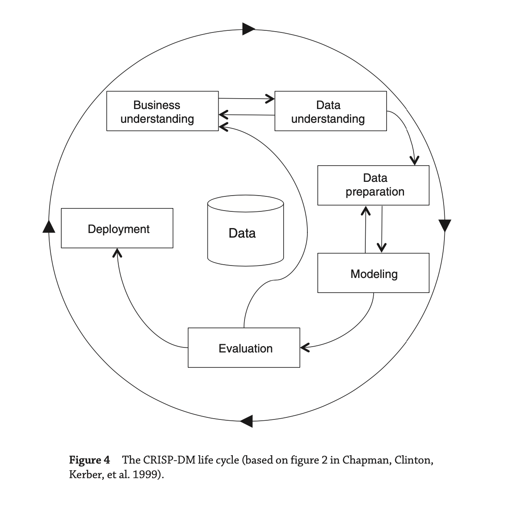

* According to a survey, data scientists spend 79% of their time on data preparation, 19% for collection and 60% for
  cleaning up & reshaping etc, building training sets, mining data for patterns and refining algorithms 16% and 5% for
  other tasks.

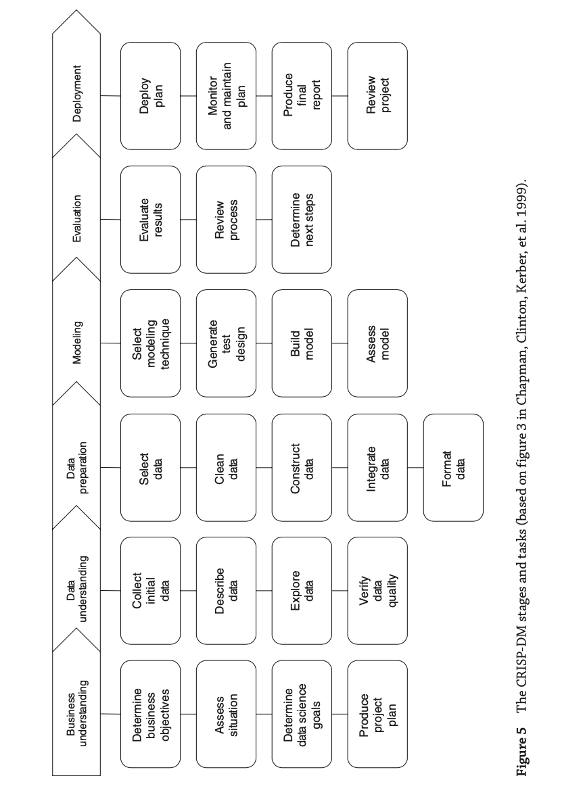

# Describe the way data is structured in analytics

## Input: Concepts, instance, attributes

* The input takes the form of concepts, instances, and attributes. We call the thing that is to be learned a **concept**
  **description**.
* The result of the learning process is a description of the concept that is, ideally, intelligible in that it can be
  understood, discussed, and disputed, and operational in that it can be applied to actual examples.
* The set of the data given to ML named as instance and each instance was an individual, independent example of the
  concept to be learned.
* Each instance is characterized by the values of attributes that measure different aspects of the instance.There are
  many different types of attribute, although typical machine learning schemes deal only with numeric and nominal, or
  categorical, ones.

## Concept

* 4 different learning in data mining:
    * Classification learning : the learning scheme is presented with a set of classified examples from which it is
      expected to learn a way of classifying unseen examples.
    * Association learning:any association among features is sought, not just ones that predict a particular class
      value.
    * Clustering : groups of examples that belong together are sought
    * Numeric prediction : the outcome to be predicted is not a discrete class but a numeric quantity.
* The result to be learned called as **concept** and the output produced by a learning scheme the **concept
  description**.
* Classification learning is sometimes called **supervised** because, in a sense, the scheme operates under supervision
  by being provided with the actual outcome for each of the training examples the play or don’t play judgment,
    * The success of classification learning can be judged by trying out the concept description that is learned on an
      independent set of test data for which the true classifications are known but not made available to the machine
* Association rules differ from classification rules in two ways:
    * they can “predict” any attribute, not just the class,
    * they can predict more than one attribute’s value at a time
* Because of differ there are far more association rules than classification rules, and the challenge is to avoid being
  swamped by them
* Association rules usually involve only nonnumeric attributes: thus you wouldn’t normally look for association rules in
  the iris dataset.

* Clustering is used to group items that seem to fall naturally together, when there is no specified class,
    * The challenge is to find these clusters and assign the instances to them—and to be able to assign new instances to
      the clusters as well
    * The success of clustering is often measured subjectively in terms of how useful the result appears to be to a
      human user. It may be followed by a second step of classification learning in which rules are learned that give an
      intelligible description of how new instances should be placed into the clusters.

## Example (aka Instances)

* The input to a machine learning scheme is a set of instances.
* These instances are the things that are to be classified, or associated, or clustered.
* In the standard scenario, each instance is an individual, independent example of the concept to be learned.
* Instances are characterized by the values of a set of predetermined attributes
* The instances are the rows of the tables that represent each data point, record.

## Relations

* The idea of specifying only positive examples and adopting a standing assumption that the rest are negative is called
  the **closed world assumption**.
* You can take a relationship between different nodes of a tree and recast it into a set of independent instances
* Relational data is more complex than a flat file.
* Denormalization called a process of flattening that is technically. In database terms, you take two relations and join
  them together to make one.
    * It is always possible to do this with any (finite) set of (finite) relations, but denormalization may yield sets
      of rows that need to be aggregated to form independent instances.
* Problems in denormalization:
    * When you create some other superrelations for each data set, then the computational and can cause enormous cost in
      space
    * It can generate spurious regularities in the data, and it is essential to check the data for such artifacts before
      applying a learning scheme
* Computer scientists usually use recursion to deal with situations in which the number of possible examples is
  infinite.
    * This is addressed in a subdiscipline of machine learning called **inductive logic programming**
    * Potentially infinite concepts can be dealt with by learning rules that are recursive.
    * The real drawbacks of such techniques, however, are that they do not cope well with noisy data, and they tend to
      be so slow as to be unusable on anything but small artificial datasets.
* Some important real-world problems are most naturally expressed in a multi-instance format, where each example is
  actually a separate set of instances. This “**multi-instance**” setting covers some important real-world applications.
    * The goal of multi-instance learning is still to produce a concept description,
        * But the task is more difficult because the learning algorithm has to contend with incomplete information about
          each training example.

## Attribute

* Each instance that provides the input to machine learning is characterized by its values on a fixed, predefined set of
  features or attributes
* Attributes are the columns of table.
* **Numeric attributes**, sometimes called **continuous** attributes, measure numbers—either real or integer valued.
* **Nominal attributes** take on values in a prespecified, finite set of possibilities and are sometimes called
  categorical.
    * The values them- selves serve just as labels or names, for example, in the weather data the attribute outlook has
      values sunny, overcast, and rainy.
    * There is no ordering and distance value each other, does not make sense to add the values together, multiply them,
      or even compare their size.
    * Nominal attributes are sometimes called categorical, enumerated, or discrete. Enumerated is the standard term used
      in computer science to denote a categorical data type;
    * A special case of the nominal scale is the **dichotomy**, which has only two members—often designated as true and
      false, or yes and no in the weather data. Such attributes are sometimes called Boolean.
* **Ordinal attributes** are ones that make it possible to rank order the categories. However, although there is a
  notion of ordering, there is no notion of distance.
    * For example : hot > mild > cool or strongly dislike, dislike , like , strongy like
    * Ordinal attributes are often coded as numeric data, or perhaps continuous data, but without the implication of
      mathematical continuity.
* **Ratio quantities** are ones for which the measurement scheme inherently defines a zero point.
    * For example, when measuring the distance from one object to another, the distance between the object and itself
      forms a natural zero.
    * Ratio quantities are treated as real numbers: any mathematical operations are allowed.
* Notice that the distinction between nominal and ordinal attributes is not always straightforward and obvious
* Metadata is data about data. Machine learning systems can use a wide variety of other information about attributes, we
  use metadata for it.

# Statistics

## Intro

* A summary statistic is a single number summarizing a large amount of data.
* the primary results of the study after 1 year could be described by two summary statistics: the proportion of people
  who had a stroke in the treatment and control groups.
    * Proportion who had a stroke in the treatment (stent) group: 45/224 = 0.20 = 20%.
    * Proportion who had a stroke in the control group: 28/227 = 0.12 = 12%.
* This summary statistic is important for 2 reasons:
    * First, This is contrary when doctors expected which was that stents would reduce the rate of strokes
    * Second, It leads to a statistical question: do the data show a “real” difference between the groups?
* The larger the difference we observe (for a particular sample size), the less believable it is that the difference is
  due to chance. So what we are really asking is the following: is the difference so large that we should reject the
  notion that it was due to by chance?
* Important! Do not generalize the results of this study to all patients and all stents.

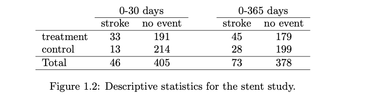

## Data basics

* Data matrix is a convenient and common way to organize data, especially if collecting data in a spreadsheet.
* Each row of a data matrix corresponds to a **unique case (observational unit)**
* Each column corresponds to a **variable**.
* Image below , each row represents an instance of a loan   
  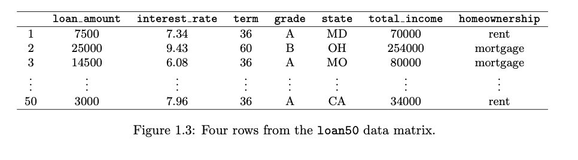

### Types of variables

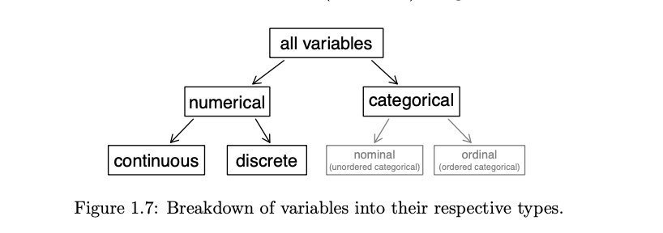

* Numerical variable can take a wide range of numerical values
    * It is sensible to add, subtract, or take averages with those values.
    * Discrete values are values only can take non-negative numeric values
    * Decimal variables also called continuous.
* Categorical variable are to categorise the data and possible values are called the variable’s **levels**
    * When there is no ordering between these values is meaningful, they are called **nominal** variables.
    * When there is a natural ordering, ie level of education -> high school, college etc, then it is **ordinal**.

### Relationships between variables

* Examining summary statistics could provide insights for each of the three questions about counties. Additionally,
  graphs can be used to visually explore data.
* The scatterplot suggests a relationship between the two variables: counties with a higher rate of multi-units tend to
  have lower homeownership rates.
* When two variables show some connection with one another, they are called associated variables (dependent).
    * Negative association sample, counties with more units in multi-unit structures are associated with lower
      homeownership
    * Possiive association: where counties with higher median household income tend to have higher rates of population
      growth.

* A pair of variables are either related in some way (associated) or not (independent). No pair of variables is both
  associated and independent.

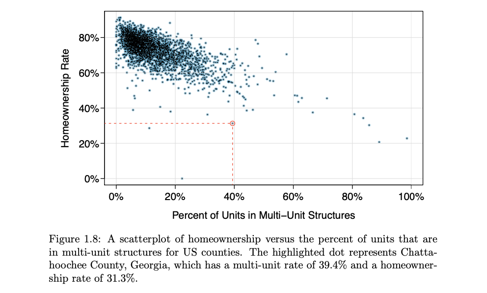

### Explanatory and response variables

* When we suspect one variable might causally affect another, we label the **first** variable the **explanatory
  variable** and the **second** the **response variable**.
    * explanatory variable --- might affect ---> response variable
* For many pairs of variables, there is no hypothesized relationship, and these labels would not be applied to either
  variable in such cases.

### Observational studies and Experiments

* Researchers perform an **observational study** when they collect data in a way that does not directly interfere with
  how the data arise.
    * researchers may collect information via surveys, review medical or company records, or follow a cohort of many
      similar individuals to form hypotheses about why certain diseases might develop.
* When researchers want to investigate the possibility of a causal connection, they conduct an **experiment**.
    * Usually, there will be both an explanatory and a response variable. When individuals/test units are randomly
      assigned to a group, the experiment is called a randomised experiment.
* **Association != Causation** association does not imply causation, and causation can only be inferred from a
  randomized experiment.

## Examining numerical data

* **Scatterplot** : A scatterplot provides a case-by-case view of data for two numerical variables.
    * Scatterplots are helpful in quickly spotting associations relating variables, whether those associations come in
      the form of simple trends or whether those relationships are more complex.

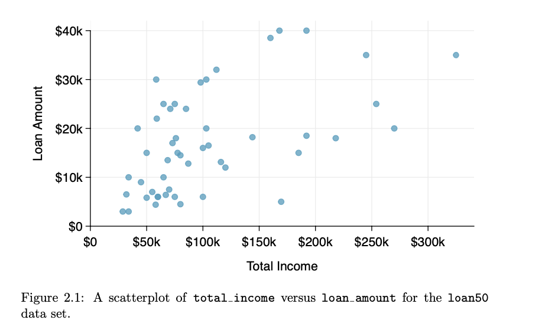  

* **Dot plots and the mean:** Sometimes two variables are one too many: only one variable may be of interest.
    * In these cases, a dot plot provides the most basic of displays. A dot plot is a one-variable scatterplot; an
      example using the interest rate of 50 loans is shown
    * The **mean**, often called the **average**, is a common way to measure the center of a **distribution** of data.
        * The mean is useful because it allows us to rescale or standardize a metric into something more easily
          interpretable and comparable

    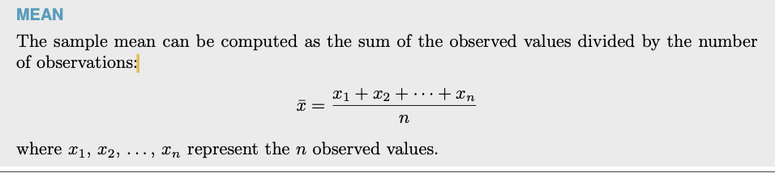

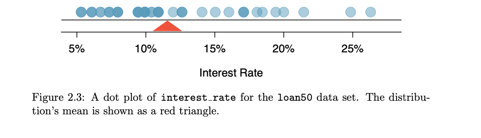
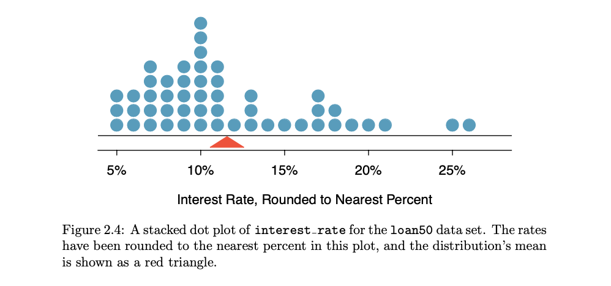

* **Histogram and shape:**
    * Dot plots show the exact value for each observation. This is useful for small data sets, but they can become hard
      to read with larger samples. Rather than showing the value of each observation, we prefer to think of the value as
      belonging to a bin.
    * These binned counts are plotted as bars into what is called a histogram, which resembles a more heavily binned
      version of the stacked dot plot
    * Histograms provide a view of the **data density**. Higher bars represent where the data are relatively more
      common.
    * Histograms are especially convenient for understanding the shape of the data distribution.
    * Long tail to identify skew : When data trail off in one direction, the distribution has a long tail. If a
      distribution has a long left tail, it is **left skewed.** If a distribution has a long right tail, it is **right
      skewed.** When is equal then it is symentric.
    * Histograms can be used to identify modes. A **mode** is represented by a prominent peak in the distribution.
        * Distributions are called unimodal, bimodal, and multimodal, respectively.

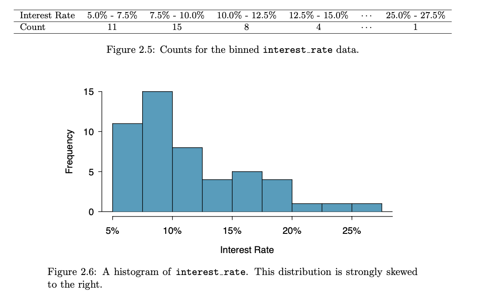 
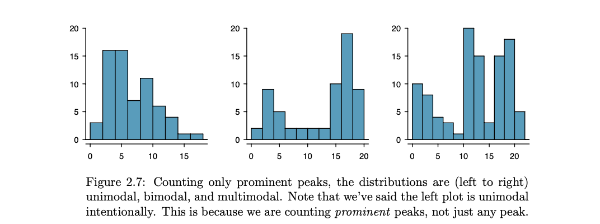 

* **Deviation:** We call the distance of an observation from its mean its deviation.
    * Below are the deviations for the 1st, 2nd, 3rd, and 50th observations in the interest rate variable:
      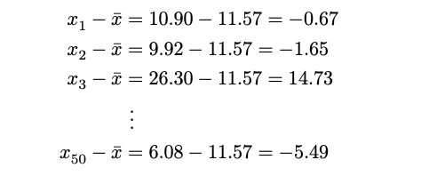 
* **Variance:** If we square these deviations and then take an average, the result is equal to the sample variance,
  denoted by s2
    * in a short desc, The variance is the average squared distance from the mean.
    * We divide by n − 1, rather than dividing by n, when computing a sample’s variance; there’s some mathematical
      nuance here, but the end result is that doing this makes this statistic slightly more reliable and useful

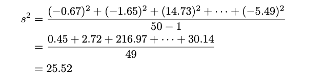 

* **Standard deviation** is defined as the square root of the variance:
   
    * The standard deviation is the square root of the variance.
    * The standard deviation is useful when considering how far the data are distributed from the mean.
    * Deviations does two things:
        * First, it makes large values relatively The standard deviation is defined as the square root of the variance:
          much larger
        * it gets rid of any negative signs by square

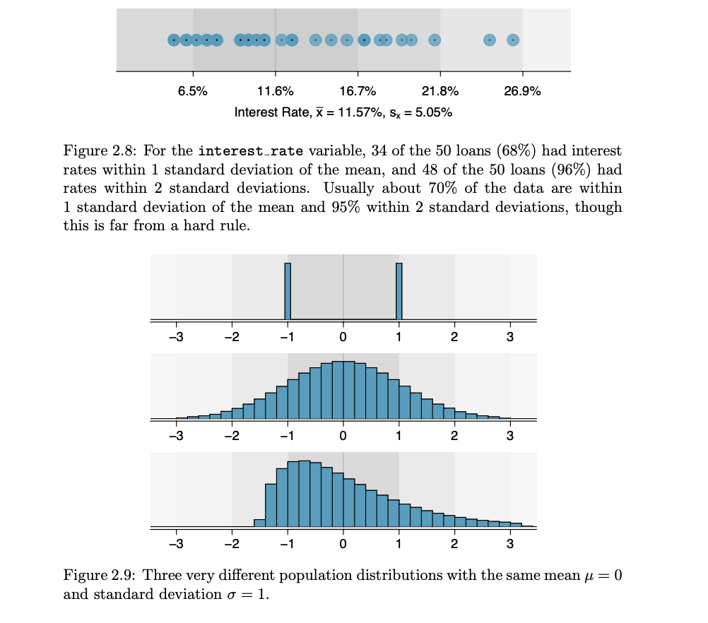 

* **Box plot:** A box plot summarizes a data set using five statistics while also plotting unusual observations.
    * The first step in building a box plot is drawing a dark line denoting the **median**, which splits the data in
      half.
      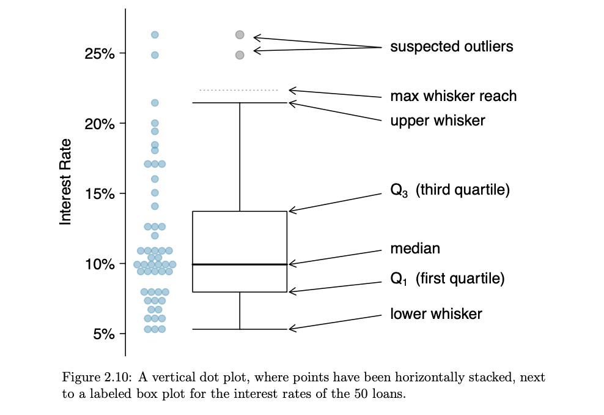 
* **Median**:
  If the data are ordered from smallest to largest, the median is the observation right in the middle. If there are an
  even number of observations, there will be two values in the middle, and the median is taken as their average.
* **Interquartile range**: The IQR is the length of the box in a box plot. It is computed as **IQR = Q3 − Q1** where Q1
  and Q3 are the 25th and 75th percentiles.
    * The two boundaries of the box are called the **first quartile** (the 25th percentile, i.e. 25% of the data fall
      below this value) and the **third quartile** (the 75th percentile), and these are often labeled Q1 and Q3,
      respectively.
* The **whiskers** attempt to capture the data outside of the box. However, their reach is never allowed to be more than
  1.5 × IQR. They capture everything within this reach
    * Extending out from the box, the whiskers attempt to capture the data outside of the box but their reach is never
      allowed to be more than 1.5 × IQR, Q3 + 1.5 * IQR and Q1 - 1.5 * IQR.
    * Any observation lying beyond the whiskers are labeled with dot and called **outlier**
* An **outlier** is an observation that appears extreme relative to the rest of the data. Examining data for outliers
  serves many useful purposes, including
    * Identifying strong skew in the distribution.
    * Identifying possible data collection or data entry errors.
    * Providing insight into interesting properties of the data.

* **Robust statistics**:
    * The median and IQR are called **robust statistics** because **extreme observations have little effect** on their
      values: moving the most extreme value generally has little influence on these statistics.
    * On the other hand, the mean and standard deviation are **more heavily influenced by changes** in extreme
      observations, which can be important in some situations

  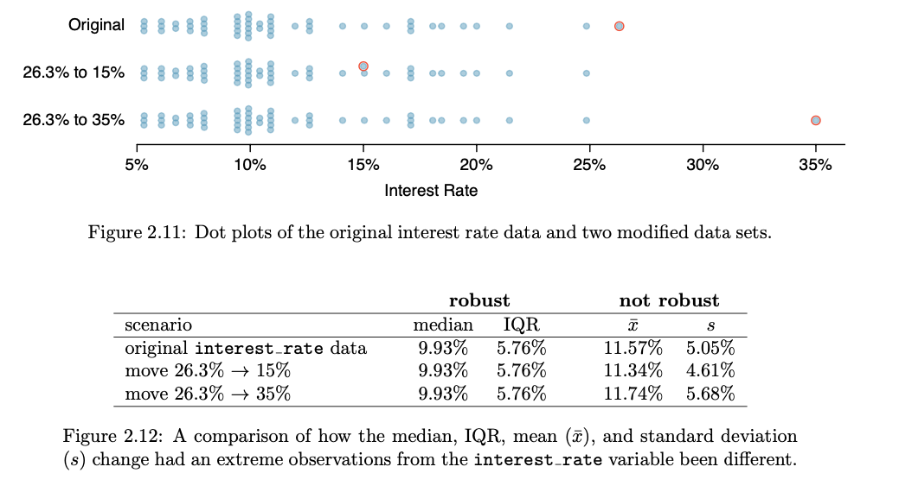 

* Transforming data (special topic):  When data are very strongly skewed, we sometimes transform them so they are easier
  to model.
    * A transformation is a rescaling of the data using a function.
        * For instance, a plot of the logarithm (base 10) of county populations results in the new histogram in Figure
          2.13(b). This data is symmetric, and any potential outliers appear much less extreme than in the original data
          set.
    * By reigning in the outliers and extreme skew, transformations like this often make it easier to build statistical
      models against the data
    * Transformations other than the logarithm can be useful, too. For instance, the square root ( original observation)
      and inverse ( 1 / original observation ) are commonly used by data scientists.
    * Common goals in transforming data are to see the data structure differently, reduce skew, assist in modeling, or
      straighten a nonlinear relationship in a scatterplot.

      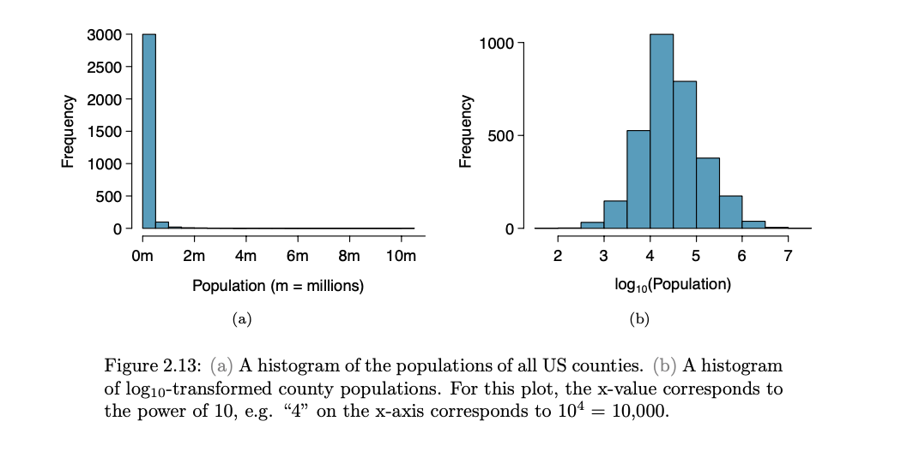 
      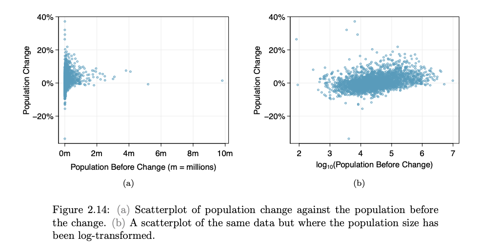 

# Data Mining and Ethics

* The useful data, the data that's about people, usually have implications. Therefore data miners should be aware of
  these and act responsibly.
* The discriminative application of data mining, like who does and doesn't get the loan, is common but when it
  discriminates based on race, sexual orientation etc, then it's unethical and/or illegal.
    * However, using racial or sexual information might still be required for medical diagnosis. So, it depends on the
      application.
* There is also the chance of building models that indirectly rely on discriminating information. For example, excluding
  racial information but using postcode is problematic where certain ethnicities group in certain areas.
* Reidentification techniques have provided shocking insights into the difficulty of anonymizing data. It turns out,
  e.g., that over 85% of Americans can be identified from publicly available records using just three pieces of
  information: five-digit ZIP code, birthdate and gender or if city info is available instead of zipcode, over 50% of
  Americans can still be identified.
    * Stories abound of companies releasing allegedly anonymous data in good faith, only to find that many individuals
      are easily identifiable.
    * For example from Netflix rating data, it's possible to identify all the movies someone has watched if a few movies
      they rated and their approximate dates are known,
    * The moral is that if you really do remove all possible identification information from a database, you will
      probably be left with nothing useful.
* Before people make a decision to provide personal information they need to know how it will be used and what it will
  be used for.
    * This information needs to provide straightforwardly in plain language they can understand not not in legalistic
      small print
    * The potential use of data mining techniques may stretch far beyond what was conceived when the data was originally
      collected. Thats why it has to be clear to determine the conditions under which the data was collected and for
      what purposes it may be used
* The ownership of data doesn't bestow the right to use it in ways other than those purported when it was originally
  recorded, however, in reality, the situation is complex.
* The discriminative type of applications of insurance companies, for example, ie higher insurance premiums for younger
  males, are based on stereotypes and statistical correlations.
* As well as community standards, purely statistical correlations also must be subject to logical and scientific
  standards. For example, if statistics show that red car owners as posing greater credit risks, this begs for further
  investigation and explanation.
* Machine learning is a technology that we need to take seriously.

## Smartphone data tracking is more than creepy

* [Shutterstock Smartphone data tracking is more than creepy – here’s why you should be worried](https://theconversation.com/smartphone-data-tracking-is-more-than-creepy-heres-why-you-should-be-worried-91110)

## With smart cities, your every step will be recorded

* [With smart cities, your every step will be recorded](https://theconversation.com/with-smart-cities-your-every-step-will-be-recorded-94527)

# TODO:

    * 1.8.1 Activity -> Diez 1.1-1.8 do it.
    * 1.8.3 Activity -> Diez 2.1-2.1.8 fo it
    * 1.8.4 Activity 
    * 1.9.1 Discussion
