#### Main Topics

* Regression and prediction — the two forms of prediction
* Using linear regression to predict numerical values
* Using decision trees to predict classifications
* Evaluating predictions

#### Sub titles:

* [Key concepts in machine learning](#key-concepts-in-machine-learning)
    * [FIELDED APPLICATIONS](#fielded-applications)
    * [MACHINE LEARNING AND STATISTICS](#machine-learning-and-statistics)
* [Machine Learning 101](#machine-learning-101)
    * [Supervised versus Unsupervised Learning](#supervised-versus-unsupervised-learning)
* [Standard Data Science Tasks](#standard-data-science-tasks)
    * [Clustering (Who Are Our Customers?)](#clustering-who-are-our-customers)
    * [Anomaly Detection or outlier analysis (Is This Fraud?)](#anomaly-detection-or-outlier-analysis-is-this-fraud)
    * [Association-Rule Mining (Do You Want Fries with That?)](#association-rule-mining-do-you-want-fries-with-that)
    * [Classification (Churn or No Churn, That Is the Question)](#classification-churn-or-no-churn-that-is-the-question)
    * [Regression (How Much Will It Cost?)](#regression-how-much-will-it-cost)
* [Linear regression](#linear-regression)
* [Correlations](#correlations)
    * [Correlations & Regression](#correlations--regression)
* [Knowledge presentation](#knowledge-presentation)
* [Decision trees](#decision-trees)
* [Evaluating learned models](#evaluating-learned-models)
    * [Predict Performance](#predict-performance)
    * [Cross Validation](#cross-validation)
    * [Evaluating Numeric Prediction](#evaluating-numeric-prediction)
    * [Confusion matrices and accuracy scores](#confusion-matrices-and-accuracy-scores)
    * [Receiver Operation Characteristic Curve (ROC)](#receiver-operation-characteristic-curve-roc)
* [TODO](#todo)

# Key concepts in machine learning

* What is a concise definition of “machine learning”?
* What is the difference between “machine learning” and “data mining”?
* Why is it valuable to think about machine learning as part of a wider process?
* Should we make a clear distinction between “machine learning” and “statistics”?

* In data mining, the data is stored electronically and the search is automated—or at least augmented—by computer.
* As the world grows in complexity, overwhelming us with the data it generates, data mining becomes our only hope for
  elucidating hidden patterns. Intelligently analyzed data is a valuable resource. It can lead to new insights, better
  decision making, and, in commercial settings, competitive advantages.
* Data mining is about solving problems by analyzing data already present in databases.
* In today’s highly competitive, customer-centered, service-oriented economy, data is the raw material that fuels
  business growth.
* Data mining is defined as the process of discovering patterns in data. The process must be automatic or (more usually)
  semiautomatic. The patterns discovered must be meaningful in that they lead to some advantage—e.g., an economic
  advantage. The data is invariably present in substantial quantities.
* Useful patterns allow us to make nontrivial predictions on new data. There are two extremes for the expression of a
  pattern: as a black box whose innards are effectively incomprehensible and as a transparent box whose construction
  reveals the structure of the pattern.
    * The difference is whether or not the patterns that are mined are represented in terms of a structure that can be
      examined, reasoned about, and used to inform future decisions. Such patterns we call structural because they
      capture the decision structure in an explicit way. In other words, they help to explain something about the data.
    * Most of this book is about techniques for finding and describing structural patterns in data, but there are
      applications where black-box methods are more appropriate because they yield greater predictive accuracy, and we
      also cover those.
* STRUCTURAL PATTERNS
    * Part of a structural description of this information might be as follows:
      If tear production rate 5 reduced then recommendation 5 none Otherwise, if age 5 young and astigmatic 5 no then
      recommendation 5 soft
    * Structural descriptions need not necessarily be couched as rules such as these. Decision trees, which specify the
      sequences of decisions that need to be made along with the resulting recommendation, are another popular means of
      expression.
    * The rules do not really generalize from the data; they merely summarize it. In most learning situations, the set
      of examples given as input is far from complete, and part of the job is to generalize to other, new examples.
    * The preceding rules classify the examples correctly, whereas often, because of errors or noise in the data,
      misclassifications occur even on the data that is used to create the classifier.
* MACHINE LEARNING
    * Our dictionary defines “to learn” as
        * to get knowledge of by study, experience, or being taught; to become aware by information or from observation;
        * to commit to memory;
        * to be informed of, ascertain;
        * to receive instruction.
    * First 2 is hard for computers but the last 3 computers can do easly
    * Learning implies thinking. Learning implies purpose. Something that learns has to do so intentionally. That is why
      we wouldn’t say that a vine has learned to grow round a trellis in a vineyard—we’d say it has been trained.
      Learning without purpose is merely training
    * Thus on closer examination the second definition of learning, in operational, performance-oriented terms, has its
      own problems when it comes to talking about computers. To decide whether something has actually learned, you need
      to see whether it intended to, whether there was any purpose involved
    * Philosophical discussions of what is really meant by “learning,” like discussions of what is really meant by
      “intention” or “purpose,” are fraught with difficulty.

* DATA MINING
    * Data mining is a practical topic and involves learning in a practical, not a theoretical, sense. We are interested
      in techniques for finding patterns in data, patterns that provide insight or enable fast and accurate decision
      making.
    * Many learning techniques look for structural descriptions of what is learned, descriptions that can become fairly
      complex and are typically expressed as sets of rules such as the ones described previously or the decision trees
    * Experience shows that in many applications of machine learning to data mining, the explicit knowledge structures
      that are acquired, the structural descriptions, are at least as important as the ability to perform well on new
      examples.
        * People frequently use data mining to gain knowledge, not just predictions.

* Weather problem:
    * In general, examples in a dataset are characterized by the values of features, or attributes, that measure
      different aspects of the example
    * A set of rules that are intended to be interpreted in sequence is called a decision list. Interpreted as a
      decision list, the rules correctly classify all of the examples in the table, whereas taken individually,
    * n the slightly more complex form shown in Table 1.3, two of the attributes—temperature and humidity—have numeric
      values. This means that any learning scheme must create inequalities involving these attributes, rather than
      simple equality tests as in the former case. This is called a numeric-attribute problem—in this case, a
      mixed-attribute problem because not all attributes are numeric.
    * The rules we have seen so far are classification rules: they predict the classification of the example in terms of
      whether to play or not. It is equally possible to disregard the classification and just look for any rules that
      strongly associate different attribute values. These are called association rules.

* Contact lences: an idealized problem
    * People frequently use machine learning techniques to gain insight into the structure of their data rather than to
      make predictions for new cases. In fact, a prominent and successful line of research in machine learning began as
      an attempt to compress a huge database of possible chess endgames and their outcomes into a data structure of
      reasonable size.
    * The data structure chosen for this enterprise was not a set of rules but a decision tree.
    * a structural description for the contact lens data in the form of a decision tree, which for many purposes is a
      more concise and perspicuous representation of the rules and has the advantage that it can be visualized more
      easily.

* Ireses: Classic numeric data set
    * These rules are very cumbersome, and we will see in Chapter 3, Output: knowledge representation, how more compact
      rules can be expressed that convey the same information.

* CPU performance: Introducing Numeric prediction
    * The classic way of dealing with continuous prediction is to write the outcome as a linear sum of the attribute
      values with appropriate weights, e.g.,

    * This is called a linear regression equation, and the process of determining the weights is called linear
      regression, a well-known procedure in statistics
    * The basic regression method is incapable of discovering nonlinear relationships, but variants exist

* Labor negotiations: More realistic example
    * In fact, Fig. 1.3B is a more accurate representation of the training dataset than Fig. 1.3A. But it is not
      necessarily a more accurate representation of the underlying concept of good versus bad contracts. Although it is
      more accurate on the data that was used to train the classifier, it may perform less well on an independent set of
      test data. It may be “overfitted” to the training data—following it too slavishly.

* soybean classification:
    * An often quoted early success story in the application of machine learning to practical problems is the
      identification of rules for diagnosing soybean diseases. The data is taken from questionnaires describing plant
      diseases.
    * These rules nicely illustrate the potential role of prior knowledge—often called domain knowledge—in machine
      learning, for in fact the only difference between the two descriptions is leaf condition is normal versus leaf
      malformation is absent. Now, in this domain, if the leaf condition is normal then leaf malformation is necessarily
      absent, so one of these conditions happens to be a special case of the other

## FIELDED APPLICATIONS

* Being fielded applications, the illustrations that follow tend to stress the use of learning in performance
  situations, in which the emphasis is on the ability to perform well on new examples.
    * WEB MINING
        * Search engine companies examine the hyperlinks in web pages to come up with a measure of “prestige” for each
          web page and website. Dictionaries define prestige as “high standing achieved through success or influence.”
        * A metric called PageRank, introduced by the founders of Google and used in various guises by other search
          engine developers too, attempts to measure the standing of a web page. The more pages that link to your
          website, the higher its prestige.
        * Another way in which search engines tackle the problem of how to rank web pages is to use machine learning
          based on a training set of example
        * queries—documents that contain the terms in the query and human judgments about how relevant the documents are
          to that query. Then a learning algorithm analyzes this training data and comes up with a way to predict the
          relevance judgment for any document and query.
        * Search engines mine the content of the Web. They also mine the content of your queries—the terms you search
          for—to select advertisements that you might be interested in
        * And then there are social networks and other personal data. We live in the age of selfrevelation: people share
          their innermost thoughts in blogs and tweets, their photographs, their music and movie tastes, their opinions
          of books, software, gadgets, and hotels, their social life. They may believe they are doing this anonymously,
          or pseudonymously, but often they are incorrect
    * DECISIONS INVOLVING JUDGMENT
    * When you apply for a loan, you have to fill out a questionnaire asking for relevant financial and personal
      information.
        * made in two stages: first, statistical methods are used to determine clear “accept” and “reject” cases. The
          remaining borderline cases are more difficult and call for human judgment.
    * A machine learning procedure was used to produce a small set of classification rules that made correct predictions
      on two-thirds of the borderline cases in an independently chosen test set.
        * Not only did these rules improve the success rate of the loan decisions, but the company also found them
          attractive because they could be used to explain to applicants the reasons behind the decision.
        * Although the project was an exploratory one that took only a small development effort, the loan company was
          apparently so pleased with the result that the rules were put into use immediately.
    * SCREENING IMAGES
    * Radar satellites provide an opportunity for monitoring coastal waters day and night, regardless of weather
      conditions.
    * A hazard detection system has been developed to screen images for subsequent manual processing.
    * Machine learning allows the system to be trained on examples of spills and nonspills supplied by the user and lets
      the user control the tradeoff between undetected spills and false alarms.
    * DIAGNOSIS
    * Diagnosis is one of the principal application areas of expert systems. Although the hand-crafted rules used in
      expert systems often perform well, machine learning can be useful in situations in which producing rules manually
      is too labor intensive.
    * The goal was not to determine whether or not a fault existed, but to diagnose the kind of fault, given that one
      was there.
        * Thus there was no need to include fault-free cases in the training set. The measured attributes were rather
          low level and had to be augmented by intermediate concepts,
        * i.e., functions of basic attributes, which were defined in consultation with the expert and embodied some
          causal domain knowledge
        * It is interesting to note, however, that the system was put into use not because of its good performance but
          because the domain expert approved of the rules that had been learned
    * MARKETING AND SALES
    * Market basket analysis is the use of association techniques to find groups of items that tend to occur together in
      transactions, e.g., supermarket checkout data.
    * For many retailers this is the only source of sales information that is available for data mining.
        * or example, automated analysis of checkout data may uncover the fact that customers who buy beer also buy
          chips, a discovery that could be significant from the supermarket operator’s point of view (although rather an
          obvious one that probably does not need a data mining exercise to discover)

## MACHINE LEARNING AND STATISTICS

* In truth, you should not look for a dividing line between machine learning and statistics because there is a
  continuum—and a multidimensional one at that—of data analysis techniques.

* If forced to point to a single difference of emphasis, it might be that statistics has been more concerned with
  testing hypotheses, whereas machine learning has been more concerned with formulating the process of generalization as
  a search through possible hypotheses. But this is a gross oversimplification: statistics is far more than just
  hypothesis-testing, and many machine learning techniques do not involve any searching at all.
* In the past, very similar schemes have developed in parallel in machine learning and statistics
    * Decision tree induction:  Four statisticians at Californian universities published a book on Classification and
      regression trees in the mid-1980s, and throughout the 1970s and early 1980s a prominent Australian machine
      learning researcher, J. Ross Quinlan, was developing a system for inferring classification trees from examples.
    * similar methods have arisen involves the use of nearest-neighbor methods for classification. These are standard
      statistical techniques that have been extensively adapted by machine learning researchers, both to improve
      classification performance and to make the procedure more efficient computationally.
* Right from the beginning, when constructing and refining the initial example set, standard statistical methods apply:
  visualization of data, selection of attributes, discarding outliers, and so on.
* Many learning algorithms use statistical tests when constructing rules or trees and for correcting models that are
  “overfitted” in that they depend too strongly on the details of the particular examples used to produce them
* Statistical tests are used to validate machine learning models and to evaluate machine learning algorithms.

# Machine Learning 101

* Machine learning is the field of study that develops the algorithms that the computers follow in order to identify and
  extract patterns from data.
* ML algorithms and techniques are applied primarily during the modeling stage of CRISP-DM. ML involves a two-step
  process.
    * First, an ML algorithm is applied to a data set to identify useful patterns in the data. These patterns can be
      represented in a number of different ways.
        * Simply put, ML algorithms create models from data, and each algorithm is designed to create models using a
          particular representation (neural network or decision tree or other).
    * Second, once a model has been created, it is used for analysis.
        * In some cases, the structure of the model is what is important.
        * A model structure can reveal what the important attributes are in a domain.

## Supervised versus Unsupervised Learning

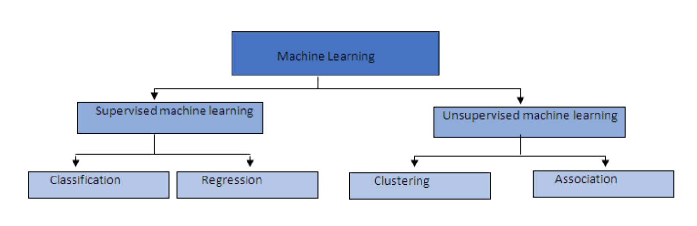

* The goal of supervised learning is to learn a function that maps from the values of the attributes describing an
  instance to the value of another attribute, known as the target attribute, of that instance.
    * For example, when supervised learning is used to train a spam filter, the algorithm attempts to learn a function
      that maps from the attributes describing an email to a value (spam/not spam) for the target attribute; the
      function the algorithm learns is the spam-filter model returned by the algorithm.
* Supervised learning works by searching through lots of different functions to find the function that best maps between
  the inputs and output.
    * However depends on the complexity, there are so many combinations of inputs and possible mappings to outputs that
      an algorithm cannot try all possible functions.
    * As a consequence, each ML algorithm is designed to look at or prefer certain types of functions during its search.
      These preferences are known as the algorithm’s **learning bias**.
* **The real challenge in using ML** is to find the algorithm **whose learning bias is the best match for a**
  **particular data set.**
    * this task involves experiments with a number of different algorithms to find out which one works best on that data
      set.
* Supervised learning is “supervised” because each of the instances in the data set lists both the input values and the
  output (target) value for each instance.
    * So the learning algorithm can guide its search for the best function by checking how each function it tries
      matches with the data set, and at the same time the data set acts as a supervisor for the learning process by
      providing feedback
* for supervised learning to take place, each instance in the data set must be labeled with the value of the target
  attribute.
* In unsupervised learning, there is no target attribute.
    * As a consequence, unsupervised-learning algorithms can be used without investing the time and effort in labeling
      the instances of the data set with a target attribute.

* The most common type of unsupervised learning is cluster analysis, where the algorithm looks for clusters of instances
  that are more similar to each other than they are to other instances in the data.
    * These clustering algorithms often begin by guessing a set of clusters and then iteratively updating the clusters

* A challenge for clustering is figuring out how to measure similarity.
    * If all the attributes in a data set are numeric and have similar ranges, then it probably makes sense just to
      calculate the Euclidean distance (better known as the straight-line distance) between the instances (or rows).
    * In some data sets, different numeric attributes have different ranges, with the result that a variation in row
      values in one attribute may not be as significant as a variation of a similar magnitude in another attribute.
        * In these cases, the attributes should be normalized so that they all have the same range
    * Another complicating factor in calculating similarity is that things can be deemed similar in many different ways.
        * Some attributes are sometimes more important than other attributes, so it might make sense to weight some
          attributes in the distance calculations, or it may be that the data set includes nonnumeric data.
* The choice of which attributes to include and exclude from a data set is a key task in data science, but for the
  purposes of this discussion we will work with the data set as is.
* In unsupervised clustering algorithm will look for groups of rows that are more similar to each other than they are to
  the other rows in the data
    * Each of these groups of similar rows defines a cluster of similar instances.
* The simple idea of looking for clusters of similar rows is very powerful and has applications across many areas of
  life. Another application of clustering rows is making product recommendations to customers.

# Standard Data Science Tasks

* Most data science projects can be classified as belonging to one of four general classes of task:
    * Clustering (or segmentation)
    * Anomaly (or outlier) detection
    * Association-rule mining
    * Prediction (including the subproblems of classification and regression)
* Understanding which task a project is targeting can help with many project decisions
    * For example, training a prediction model requires that each of the instances in the data set include the value of
      the target attribute.

* Understanding the task also informs which ML algorithm(s) to use.
* There are a large number of ML algorithms, each algorithm is designed for a particular datamining task
    * For example, ML algorithms that generate decision-tree models are designed primarily for prediction tasks

* There is a many-to-one relationship between ML algorithms and a task, so knowing the task doesn’t tell you exactly
  which algorithm to use, but it does define a set of algorithms that are designed for the task.
    * Because the data science task affects both the data set design and the selection of ML algorithms, the decision
      regarding which task the project will target has to be made early on in the project life cycle, ideally during the
      business-understanding phase of the CRISP-DM life cycle

## Clustering (Who Are Our Customers?)

* Designing a targeted marketing campaign requires an understanding of the target customer.
* A good approach is to try to identify a number of customer personas or customer profiles, each of which relates to a
  significant segment of the customer base, and then to design targeted marketing campaigns for each persona

* Human intuition about customers can often miss important nonobvious segments or not provide the level of granularity
  that is required for nuanced marketing.

* The standard data science approach to the persona type of analysis is to frame the problem as a **clustering task**.
* Clustering involves sorting the instances in a data set into subgroups containing similar instances.
    * Usually clustering requires an analyst to **first decide on the number of subgroups** she would like identified in
      the data. This decision may be based on domain knowledge or informed by project goals.
    * A clustering algorithm is then **run on the data with the desired number of subgroups input** as one of the
      algorithms parameters.
    * The algorithm then **creates that number of subgroups by grouping instances based on the similarity of their
      attribute values.**
    * Once the algorithm has created the clusters, a human domain expert reviews the clusters to interpret whether they
      are meaningful.

* one of the biggest challenges with clustering is to decide which attributes to include and which to exclude so as to
  get the best results.
    * Making this decision on attribute selection will involve iterations of experiments and human analysis of the
      results of each iteration

* The **best-known ML algorithm for clustering** is the **k-means algorithm.**
    * The k in the name signals that the algorithm looks for k clusters in the data.
    * The k-means algorithm assumes that all the attributes describing the customers in the data set are numeric. If the
      data set contains nonnumeric attributes, then these attributes need to be mapped to numeric values in order to use
      k-means, or the algorithm will need to be amended to handle these nonnumeric values.
* The goal of the k-mean algorithm is to find the position of each cluster’s center in the point cloud.
* The k-means algorithm begins by selecting k instances to act as initial cluster centers.
    * Current best practice is to use an algorithm called “**k-means++**” to select the initial cluster centers.
    * The rationale behind k-means++ is that it is a good idea to spread out the initial cluster centers as much as
      possible. So in k-means++ the first cluster center is set by randomly selecting one of the instances in the data
      set.
        * The second and subsequent cluster centers are set by selecting an instance from the data set with the
          probability that an instance selected is proportional to the squared distance from the closest existing
          cluster center.

    * Once all k cluster centers have been initialized, the algorithm works by iterating through a two-step process:
        * first, assigning each instance to the nearest cluster center,
        * updating the cluster center to be in the middle of the instances assigned to it
        * The instances are then reassigned, again to the closest updated cluster center.
        * This process of instance assignment and center updating continues until no instances are assigned to a new
          cluster center during an iteration.
* The k-means algorithm is nondeterministic, meaning that different starting positions for the cluster centers will
  likely produce different clusters.
* the algorithm is typically run several times, and the results of these different runs are then compared to see which
  clusters appear most sensible given the data scientist’s domain knowledge and understanding.
* Each cluster center defines a different customer persona, with the persona description generated from the attribute
  values of the associated cluster center
* The k-means algorithm is not required to return equal-size clusters, and, in fact, it is likely to return
  different-size clusters.
* One of the advantages of clustering as an analytics approach is that it can be applied to most types of data
    * Because of its versatility, clustering is often used as a dataexploration tool during the data-understanding stage
      of many data science projects.
    * Also, clustering is also useful across a wide range of domains.

## Anomaly Detection or outlier analysis (Is This Fraud?)

* Anomaly detection or outlier analysis involves searching for and identifying instances that do not conform to the
  typical data in a data set.

* These nonconforming cases are often referred to as **anomalies or outliers**.
* Anomaly detection is often used in analyzing financial transactions in order to identify potential fraudulent
  activities and to trigger investigations

* The first approach that most companies typically use for anomaly detection is to manually define a number of rules
  based on domain expertise that help with identifying anomalous events.
    * This rule set is often defined in SQL or in another language and is run against the data in the business databases
      or data warehouse
    * SQL now includes a MATCH_RECOGNIZE function to facilitate pattern matching in data.
    * The MATCH_RECOGNIZE function in SQL enables database programmers to write scripts that identify sequences of
      transactions on a credit card that fit this pattern and either block the card automatically or trigger a warning
      to the credit-card company.

* The **main drawback** with a rule-based approach to anomaly detection is that defining rules in this way means that
  anomalous events can be identified only after they have occurred and have come to the company’s attention

* In some ways, anomaly detection is the opposite of clustering:
    * **the goal of clustering** is to identify **groups of similar instances,** whereas the **goal of anomaly** **that
      are dissimilar to the rest of the data in the data set.**

* **Clustering can also be used** to automatically identify anomalies. There are two approaches to using clustering for
  anomaly detection.
    * The first is that the normal data will be clustered together, and the anomalous records will be in separate
      clusters.
    * The second approach is to measure the distance between each instance and the center of the cluster. The farther
      away the instance is from the center of the cluster, the more likely it is to be anomalous and thus to need
      investigation.

* Another approach to anomaly detection is to **train a prediction model**, such as a decision tree, to classify in-
  stances as anomalous or not.
    * However, training such a model normally requires a training data set that contains both anomalous records and
      normal records
    * Ideally, the data set should be balanced; in a binary-outcome case, balance would imply a 50:50 split in the data.
      In general, acquiring this type of training data for anomaly detection is not feasible: by definition, anomalies
      are rare events, occurring maybe in 1 to 2 percent or less of the data.
    * This data constraint precludes the use of normal, off-the-shelf prediction models.

* There are ML algorithms known as **one-class classifiers** that are designed to deal with the type of imbalanced data
  that are typical of anomaly-detection data sets.
    * The **one-class support-vector machine (SVM)** algorithm is a well-known **one-class classifier**.
        * In general terms, the one-class SVM algorithm examines the data as one unit (i.e., a single class) and
          identifies the core characteristics and expected behavior of the instances.
        * The algorithm will then indicate how similar or dissimilar each instance is from the core characteristics and
          expected behavior.
        * The more dissimilar an instance is, the more likely that it should be investigated.

* The fact that anomalies are rare means that they can be easy to miss and difficult to identify.
    * As a result, data scientists often combine a number of different models to detect anomalies.
    * The idea is that different models will capture different types of anomalies.
    * The different models are integrated together into a decision-management solution that enables the predictions from
      each of the models to feed into a decision of the final predicted outcome
    * For example if three or four out of the four models have identified the transaction as possible fraud, then the
      transaction would be flagged for a data scientist to investigate.

## Association-Rule Mining (Do You Want Fries with That?)

* Association-rule mining is an unsupervised-data-analysis technique that looks to find groups of items that fre-
  quently co-occur together.
    * The classic case of association mining is market-basket analysis, wherein retail companies try to identify sets of
      items that are purchased together, such as hot dogs, ketchup, and beer

* Unlike clustering and anomaly detection, which focus on identifying similarities or differences between instances (or
  rows) in a data set, association-rule mining focuses on looking at relationships between attributes (or columns) in a
  data set.

* Using association-rule mining, a business can start to answer questions about its customers’ behaviors by looking for
  patterns that may exist in the data.
    * Questions that market-basket analysis can be used to answer include: Did a marketing campaign work? Have this
      customer’s buying patterns changed?

* **The Apriori algorithm is the main algorithm** used to produce the association rules. It has a two-step process:
    * Find all combinations of items in a set of transactions that occur with a specified minimum frequency. These
      combinations are called **frequent itemsets.**
    * Generate rules that express the probable co-occurrence of items within frequent itemsets. The Apriori algorithm
      calculates the probability of an item being present in a frequent itemset given that another item or items are
      present.

* The Apriori algorithm generates association rules that express **probabilistic relationships between items in fre-
  quent itemsets**. An association rule is of the form **“IF antecedent, THEN consequent.”**
    * IF {hot-dogs, ketchup}, THEN {beer}.

* **Two main statistical measures** are linked with association rules: **support and confidence**.
    * The **support** percentage of an association rule—or the ratio of transactions that include both the antecedent
      and consequent to the total number of transactions—indicates how frequently the items in the rule occur together.
    * The **confidence** percentage of an association rule—or the ratio of the number of transactions that include both
      the antecedent and consequent to the number of transactions that includes the antecedent—is the conditional
      probability that the consequent will occur given the occurrence of the antecedent.
        * for example, a confidence of 75 percent for the association rule relating hot dogs and ketchup with beer would
          indicate that in 75 percent of cases where customers purchased both hot dogs and ketchup, they also purchased
          beer. The support score of a rule simply records the percentage of baskets in the data set where the rule
          holds. For example, a support of 5 percent indicates that 5 percent of all the baskets in the data set contain
          all three items in the rule “hot dogs, ketchup, and beer.”

* In order to control the complexity of the analysis of these rules, it is usual to prune the generated rule set to
  include only rules that have both a high support and a high confidence
    * Once the rule set has been pruned, the data scientist can then analyze the remaining rules to understand what
      products are associated with each other and apply this new information in the organization.

* Including this demographic information in the association analysis enables the analysis to be focused on particular
  demographics, which can further help marketing and targeted advertising.
    * An example of an association rule augmented with demographic information might be
        * IF gender(male) and age(< 35) and {hot-dogs, ketchup}, THEN {beer}. {Support = 2%, Confidence = 90%.}

## Classification (Churn or No Churn, That Is the Question)

* The term propensity modeling is used to describe this task because the goal is to model an individual’s propensity to
  do something
* In fact, it is estimated that it generally costs five to six times more to attract a new customer than it does to
  retain an established one (Verbeke et al. 2011). As a result, many cell phone service companies are very keen to
  retain their current customers.
* The term **customer churn** is used to describe the process of customers leaving one service and joining another.
    * So the problem of predicting which customers are likely to leave in the near future is known as **churn
      prediction.** **This is a prediction task**

* When a prediction model returns a label or category for an input, it is known as a **classification model**.
* Training a classification model requires historic data, where each instance is labeled to indicate whether the target
  event has happened for that instance.
    * For example, customerchurn classification requires a data set in which each customer (one row per customer) is
      assigned a label indicating whether he or she has churned.
* The data set will include an attribute, known as the **target attribute**, that lists this label for each customer.

* Once the churn event has been defined from a business perspective, it is then necessary to implement this definition
  in code in order to assign a target label to each customer in the data set.

* Another complicating factor in constructing the training data set for a churn-prediction model is that time lags need
  to be taken into account.
    * The goal of churn prediction is to model the propensity (or likelihood) that a customer will churn at some point
      in the future.
        * As a consequence, this type of model has a temporal dimension that needs to be considered during the creation
          of the data set.

    * The set of attributes in a propensity-model data set are drawn from two separate time periods: the **observation
      period** and the **outcome period.**
        * The **observation period** is when the values of the input attributes are calculated.
        * The **outcome period** is when the target attribute is calculated.

    * The length of this period is the length of the outcome period, and the prediction that the churn model returns is
      actually that a customer will churn within this outcome period.
    * Defining the outcome period affects what data should be used as input to the model.
        * If the model is designed to predict that a customer will churn within two months from the day the model is run
          on that customer’s record, then when the model is being trained, the input attributes that describe the
          historic customers who have already churned should be calculated using only the data that were available about
          those customers two months prior to their leaving the service.

* Nearly all customer-propensity models will use attributes describing the customer’s demographic information as input:
  age, gender, occupation, and so on.
    * In scenarios relating to an ongoing service, they are also likely to include attributes describing the customer’s
      position in the customer life cycle: coming on board, standing still midcycle, approaching end of a contract.
      There are also likely to be attributes that are specific to the industry.

* Once a labeled data set has been created, the major stage in creating a classification model is to use an ML algo-
  rithm to build the classification model.
    * During modeling, it is good practice to experiment with a number of different ML algorithms to find out which
      algorithm works best on the data set.
    * Once the final model has been selected, the likely accuracy of the predictions of this model on new instances is
      estimated by testing it on a subset of the data set that was not used during the model-training phase.
    * If a model is deemed accurate enough and suitable for the business need, the model is then deployed and applied to
      new data either in a batch process or in real time.
* A really important part of deploying the model is ensuring that the appropriate business processes and resources are
  put in place so that the model is used effectively.
  *There is no point in creating a customer-churn model unless there is a process whereby the model’s predictions result
  in triggering customer interventions so that the business retains customers.

* In addition to predicting the classification label, prediction models can also give a measure of how confident the
  model is in the prediction. This measure is called the **prediction probability** and will have a value between 0 and
    1.

    * The higher the value, the more likely the prediction is correct
    * The prediction-probability value can be used to prioritize which customers to focus on.

## Regression (How Much Will It Cost?)

* Prediction is the task of estimating the value of a target attribute for a given instance based on the values of other
  attributes (or input attributes) for that instance
* Price prediction is the task of estimating the price that a product will cost at a particular point in time.
* The accuracy of a price-prediction model is domain dependent.
* The fact that price prediction involves estimating the value of a continuous attribute means that it is treated as
  a **regression problem**
* A regression problem is structurally very similar to a classification problem; in both cases, the data science
  solution involves building a model that can predict the missing value of an attribute given a set of input attributes.
    * The only difference is that classification involves estimating the value of a categorical attribute and regression
      involves estimating the value of a continuous attribute.

* Regression analysis requires a data set where the value of the target attribute for each of the historic instances is
  listed.
* The basic structure of a regression model for price prediction is the same no matter what product it is applied to;
  all that varies are the name and number of the attributes.
    * For example, to predict the price of a house, the input would include attributes such as the size of the house,
      the number of rooms, the number of floors, the average house price in the area, the average house size in the
      area, and so on.
    * In each case, given the appropriate data, the regression algorithm works out how each of the attributes
      contributes to the final price.

* The application example of using a regression model for price prediction is illustrative only of the type of problem
  that it is appropriate to frame as a regression-modeling task.

* Regression prediction can be used in a wide variety of other real-world problems.
    * Typical regression-prediction problems include calculating profit, value and volume of sales, sizes, demand,
      distances, and dosage.

# Linear regression

* [The besssttt](https://www.youtube.com/watch?v=GhrxgbQnEEU)
* [Doğrusal Regrezsyon (Linear Regression) (Weka Eğitim Serisi 8)](https://www.youtube.com/watch?v=b8jlp1i_h5w)
* [Dogrusal Regresyon](https://www.youtube.com/watch?v=c6NgFlNiuTY)

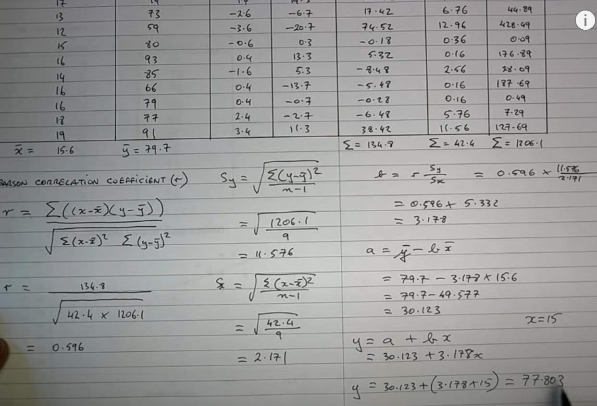

* Linear regression captures the relationship between two (or more) variables and allows prediction.
* linear regression produces a function into which you can put one or more properties of an entity or phenomena (the
  “input” or “explanatory” variables or "predictor" ) and get out the correct value of another (the “output” or
  “response” variable).
    * For example, given a set of observations about the height and weight of many people, we could learn a linear
      regression model that could estimate someone’s weight based on their height.
* The first step in a regression analysis is to hypothesize the structure of the relationship between the input
  attributes and the target.
    * Then a parameterized mathematical model of the hypothesized relationship is defined. This parameterized model is
      called a **regression function**.
* linear-regression functions are relatively easy to interpret
* When a linear relationship is assumed, the regression analysis is called **linear regression**
* The simplest application of linear regression is modeling the relationship between two attributes: an input attribute
  X and a target attribute Y.
    * Formule: **Y =ω0 +ω1X**

* Setting the parameters of a regression function is equivalent to searching for the line that best fits the data.
    * The strategy for setting these parameters begins by guessing parameters values and then iteratively updating the
      parameters so as to reduce the overall error of the function on the data set.

* The overall error is calculated in three steps:
    * The function is applied to the data set, and for each instance in the data set it estimates the value of the
      target attribute.
    * The error of the function for each instance is calculated by subtracting the estimated value of the target
      attribute from the actual value of the target attribute.
    * The error of the function for each instance is squared, and then these squared values are summed. (so that the
      error in the instances where the function overestimates the target doesn’t cancel out with the error when it
      underestimates.)

* This measure of error is known as the sum of **squared errors (SSE)**, and the strategy of fitting a linear function
  by searching for the parameters that minimize the SSE is known as **least squares**.
    * Formula : 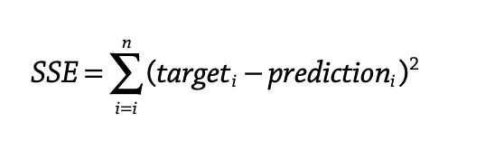
    * The SSE where the data set contains n instances, targeti is the value of the target attribute for instance i in
      the data set, and predictioni is the estimate of the target by function for the same instance.
* Formulas: 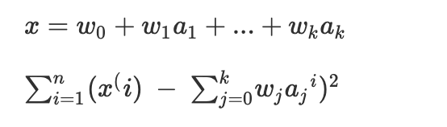

* To create a linear-regression prediction model that estimates the likelihood of an individual’s developing diabetes
  with respect to his BMI, we replace X with the BMI attribute, Y with the diabetes attribute, and apply the
  least-squares algorithm to find the best-fit line for the diabetes data set.
    * the dashed lines show the error (or residual) for each instance for this line. Using the least-squares approach,
      the best-fit line is the line that minimizes the sum of the squared residuals. The equation for this line is
        * Diabetes = −7.38431 + 0.55593 ∗ BMI .
        * The slope parameter value ω1 = 0.55593 indicates that for each increase of one unit in BMI, the model
          increases the estimated likelihood of a person developing diabetes by a little more than half a percent
        * For example, when BMI equals 20, the model returns a prediction of a 3.73 percent
    * a linear-regression model fitted using the least-squares method is actually calculating a weighted average over
      the instances. In fact, the intercept parameter value ω0 = −7.38431 ensures that the best-fit line goes through
      the point defined by the average BMI value and average diabetes value for the data set.

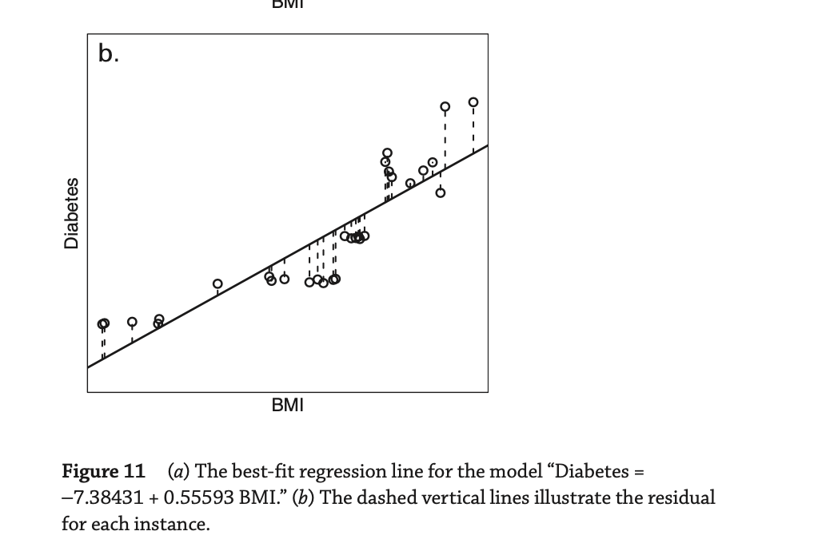

* The weighting of the instances is based on the distance of the instance from the line: the farther an instance is away
  from the line, the larger the residual for that instance, and the algorithm will weight that instance by the residual
  squared.

* Linear-regression models can be extended to take multiple inputs.
    * For example BMI data regression function becomes  : **Diabetes = ω0 + ω1 BMI + ω2 Exercise + ω3 Weight.**
* In statistics, a regression function that maps from multiple inputs to a single output in this way is known as a
  **multiple linear regression function**.
    * The structure of a multi-input regression function is the basis for a range of ML algorithms, including neural
      networks.

* **Residuals** are the leftover variation in the data after accounting for the model fit: **Data = Fit + Residual**
    * One goal in picking the right linear model is for these residuals to be as small as possible.
    * Under the line is the value of residuals are negative, above the line is positive .
    * A residual is usually discussed in terms of its absolute value
* RESIDUAL: Difference between observed an expected
* The residual of the ith observation (xi,yi) is the difference of the observed response (yi) and the response we would
  predict based on the model fit (yˆi ):
    * ei = yi − yˆi , we typically identify yˆ by plugging x into the model.

* [Diez -> page 320 check]

# Correlations

* [Pearson Correlation the besttt!! ](https://www.youtube.com/watch?v=2SCg8Kuh0tE&t=0s)
* CORRELATION: STRENGTH OF A LINEAR RELATIONSHIP
* A correlation describes the strength of association between two attributes.
    * In a general sense, a correlation can describe any type of association between two attributes.
* The term correlation also has a specific statistical meaning, in which it is often used as shorthand for **“Pearson
  Correlation"**

* A Pearson correlation **measures the strength of a linear relationship between two numeric attributes**.
    * It ranges in value from −1 to +1.
    * The letter r is used to denote the Pearson value or coefficient between two attributes.
        * r = 0 indicates that the two attributes are not correlated.
        * r = +1 indicates that the two attributes have a perfect positive correlation
            * meaning that every change in one attribute is accompanied by an equivalent change in the other attribute
              in the same direction
        * r = −1 indicates that the two attributes have a perfect negative correlation
            * meaning that every change in one attribute is accompanied by the opposite change in the other attribute.
        * r ≈ ±0.7 indicates a strong linear relationship between the attributes,
        * r ≈ ±0.5 indicates a moderate linear relationship,
        * r ≈ ±0.3 indicates a weak relationship,
        * r ≈ 0 indicates no relationship between the attributes.

* The fact that the definition of a statistical Pearson correlation is between two attributes might appear to limit the
  application of statistical correlation to data analysis to just pairs of attributes. However derived attributes can
  help to create a new correlation
    * For example, we know weight and height has possitive corrolation, with some mappings we can have BKM numeric
      attibute , BMI is a derived attribute and then we can use it to measure the correlation between other attributes.

* The BMI example illustrates that it is possible to create a new derived attribute by defining a function that takes
  multiple attributes as input.
    * It also shows that it is possible to calculate a Pearson correlation between this derived attribute and another
      attribute in the data set.
    * Furthermore, a derived attribute can actually have a higher correlation with a target attribute than any of the
      attributes used to generate the derived attribute have with the target.

* Attribute selection is a key task in data science
    * Designing a derived attribute that has a strong correlation with an attribute we are interested in is often where
      the real value of data science is found
* ML algorithms can learn interactions between attributes and create useful derived attributes by searching through
  different combinations of attributes and checking the correlation between these combinations and the target attribute.
    * This is why ML is useful in contexts where many weak interacting attributes contribute to the process we are
      trying to understand.

* if an input attribute is highly correlated with a target attribute, it is likely to be a useful input into the
  prediction model.
    * Similar to correlation analysis, prediction involves analyzing the relationships between attributes
    * If this correlation does not exist (or cannot be found by the algorithm), then the input attributes are irrelevant
      for the prediction problem, and the best a model can do is to ignore those inputs and always predict the central
      tendency of that target in the data set

## Correlations & Regression

* Correlation and regression are similar concepts insofar as both are techniques that focus on the relationship across
  columns in the data set.
* Correlation is focused on **exploring whether a relationship exists between two attributes**
* Regression is focused on **modeling an assumed relationship between attributes** with the purpose of being able to
  **estimate the value of one target attribute** given the values of one or more input attributes.
* n the specific cases of Pearson correlation and linear regression, a Pearson correlation measures the degree to which
  two attributes have a linear relationship, and linear regression trained using least squares is a process to find the
  best-fit line that predicts the value of one attribute given the value of another.

# Knowledge presentation

* The simplest, most rudimentary way of representing the output from machine learning is to make it just the same as the
  input—a **table**.
* Another simple style of representation is a “**linear model**,” whose output is just the sum of the attribute values,
  except that weights are applied to each attribute before adding them together.
* Linear models can also be applied to **binary classification problems**. In this case, the line produced by the model
  separates the two classes: it defines where the decision changes from one class value to the other. Such a line is
  often referred to as the **decision boundary**.
    * 1 attribute -> point
    * 2 attributes -> straight line
    * 3 attribute -> plane
    * more than 3 attributes -> hyperplane

# Decision trees

* Classification technique known as “decision tree learning”.
* Decision tree learning produces a “machine” into which you can input one or more attributes of an example and get out
  a classification.
* Differences from linear regression:
    * the output variable is categorical rather than numeric
    * input variables may be categorical as well as numeric
* Decision trees are very useful for doing simple classification that works from categorical variables to produce
  categorical predictions.
* They can also be quite effective with numerical input variables, provided that the variable range falls meaningfully
  into continuous regions.
* The models they produced are easy to understand, particularly when the number of input variables is small.
* Film 4 is an exception — the tree predicts that it should receive an 18 certificate, but the film classification board
  has in fact given it only a 15. Depending on the context, this error might or might not be a significant problem.

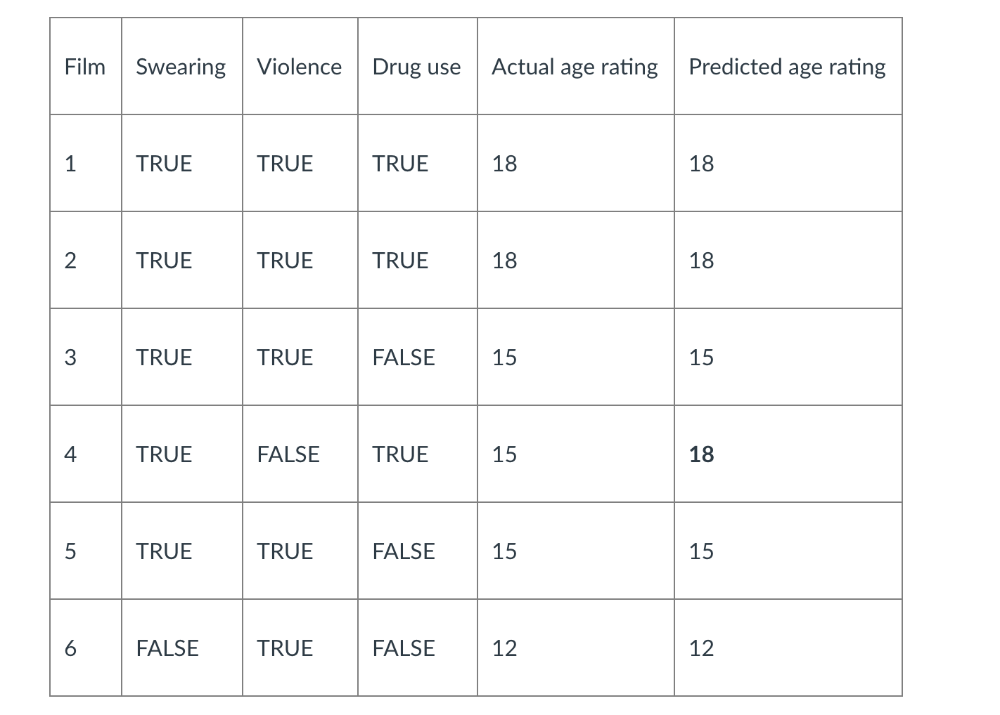 
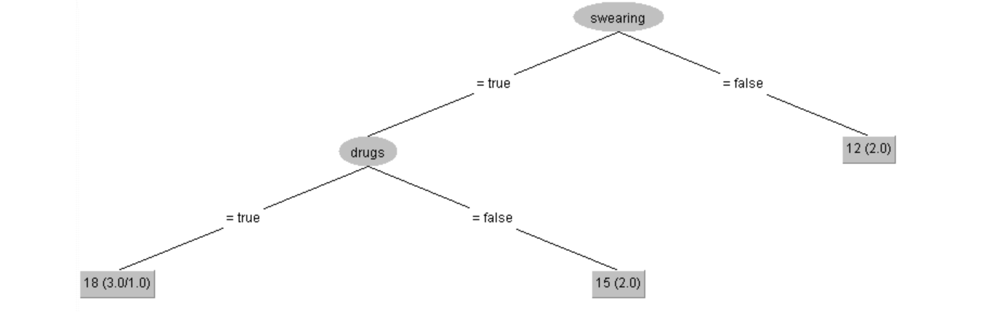 
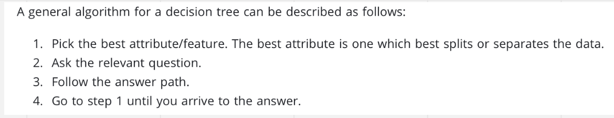

* A “divide-and-conquer” approach to the problem of learning from a set of independent instances leads naturally to a
  style of representation called a **decision tree**.

* Nodes in a decision tree involve testing a particular attribute. Usually, the test compares an attribute value with a
  constant. Leaf nodes give a classification that applies to all instances that reach the leaf, or a set of
  classifications, or a probability distribution over all possible classifications.

* If the attribute that is tested at a node is a nominal one, the number of children is usually the number of possible
  values of the attribute.
* If the attribute is numeric, the test at a node usually determines whether its value is greater or less than a
  predetermined constant, giving a two-way split.
* a numeric quantity is what is predicted, decision trees with averaged numeric values at the leaves are called **
  regression trees**.
* It is possible to combine regression equations with regression trees. Fig. 3.4C is a tree whose leaves contain linear
  expressions—i.e., regression equations— rather than single predicted values. This is called a model tree.

* Linear regression and neural networks work best with numeric inputs. If the input attributes in a data set are
  primarily nominal or ordinal, however, then other ML algorithms and models, such as decision trees, may be more
  appropriate.
* A decision tree encodes a set of if then, else rules in a tree structure.
* Each path in a decision tree, from root to leaf, defines a classification rule composed of a sequence of tests.
    * The goal of a decision-tree-learning algorithm is to find a set of classification rules that divide the training
      data set into sets of instances that have the same value for the target attribute

* The progenitor of most modern ML algorithms for decision-tree learning is the **ID3 algorithm** (Quinlan 1986).
    * ID3 builds a decision tree in a recursive, depth-first manner, adding one node at a time, starting with the root
      node.
    * It begins by selecting an attribute to test at the root node. A branch is grown from the root for each value in
      the domain of this test attribute and is labeled with that value.
    * ID3 use Claude Shannon entropy
      
* One of the strengths of decision trees is that they are simple to understand. Also it is possible to create very
  accurate models based on decision trees.

* The problem of constructing a decision tree can be expressed recursively.
    * First, select an attribute to place at the root node, and make one branch for each possible value. This splits up
      the example set into subsets, one for every value of the attribute.
    * Now the process can be repeated recursively for each branch, using only those instances that actually reach the
      branch.
    * If at any time all instances at a node have the same classification, stop developing that part of the tree.

* Although decision trees work well with both nominal and ordinal data, they struggle with numeric data.
    * In a decision tree, a separate branch descends from each node for each value in the domain of the attribute tested
      at the node.
    * Numeric attributes, however, have an infinite number of values in their domains, with the implication that a tree
      would need an infinite number of branches.
    * **One solution to this problem is to transform numeric attributes into ordinal attributes, although doing so
      requires the definition of appropriate thresholds, which can also be difficult.**

* Finaly, because a decision-tree-learning algorithm repeatedly divides a data set as a tree becomes large, it becomes
  more sensitive to noise (such as mislabeled instances).
    * The subset of examples on each branch becomes smaller, the smaller the data sample used to define a classification
      rule, the more sensitive to noise the rule becomes.
    * Thats why it is a good idea to keep decision trees shallow.
    * 2 approaches are there :
        * is to stop the growth of a branch when the number of instances on the branch is still less than a predefined
          threshold (e.g., 20 instances).
        * Other approaches allow the tree to grow and then prune the tree back.

# Evaluating learned models

* The error rate is just the proportion of errors made over a whole set of instances, and it measures the overall
  performance of the classifier.
* This is a surprising fact, and a very important one. Error rate on the training set is not likely to be a good
  indicator of future performance.
    * Why? Because the classifier has been learned from the very same training data, any estimate of performance based
      on that data will be optimistic, and may be hopelessly optimistic

* The error rate on the training data is called the resubstitution error, because it is calculated by resubstituting the
  training instances into a classifier that was constructed from them
    * Although it is not a reliable predictor of the true error rate on new data, it is nevertheless often useful to
      know.

* To predict the performance of a classifier on new data, we need to assess its error rate on a dataset that played no
  part in the formation of the classifier. This independent dataset is called **the test set**. We assume that both the
  training data and the test data are representative samples of the underlying problem.
    * It is important that the **test data is not used in any way to create the classifier**.

* some learning schemes involve two stages, one to come up with a basic structure and the second to optimize parameters
  involved in that structure, and separate sets of data may be needed in the two stages. Or you might try out several
  learning schemes on the training data and then evaluate them—on a fresh dataset, of course—to see which one works best

* In such situations people often talk about three datasets: **the training data, the validation data, and the test
  data**.
    * **The training data is used by one or more learning schemes to come up with classifiers**.
    * **The validation data is used to optimize parameters of those classifiers, or to select a particular one**.
    * **The test data is used to calculate the error rate of the final, optimized, method**.
    * Each of the three sets must be chosen independently: the validation set must be different from the training set to
      obtain good performance in the optimization or selection stage, and the test set must be different from both to
      obtain a reliable estimate of the true error rate.

* It may be that once the error rate has been determined, the test data is bundled back into the training data to
  produce a new classifier for actual use. There is nothing wrong with this: it is just a way of maximizing the amount
  of data used to generate the classifier that will actually be employed in practice

* Generally, the larger the training sample the better the classifier, although the returns begin to diminish once a
  certain volume of training data is exceeded. And the larger the test sample, the more accurate the error estimate.

* This limits the amount of data that can be used for training, validation, and testing, and the problem becomes how to
  make the most of a limited dataset. From this dataset, a certain amount is held over for testing—this is called the
  **holdout** procedure—and the remainder used for training (and, if necessary, part of that is set aside for
  validation).
    * There’s a dilemma here: to find a good classifier, we want to use as much of the data as possible for training; to
      obtain a good error estimate, we want to use as much of it as possible for testing.

## Predict Performance

* In statistics, a succession of independent events that either succeed or fail is called a Bernoulli process. The
  classic example is coin tossing. Each toss is an independent event. Let’s say we always predict heads; but rather than
  “heads” or “tails,” each toss is considered a “success” or a “failure.”

* Bernoulli process—a biased coin—whose true (but unknown) success rate is p. Suppose that out of N trials, S are
  successes: thus the observed success rate is f = S/N.

* The success rate is measured as Success/TotalExperimentCount, f=S/N. So, both 750/1000 and 75/100 produce 75% success
  rate. However, as the experiment count goes up, so does the confidence interval.
    * For samples >= 100, the normal distribution can be assumed. For the normal distribution, the chance that X lies
      more than 1.65 standard deviations from the mean is 10%
      

* The z value can be found from the lookup table below. For 90% confidence, P(X≥z)P({X}\ge{z})P(X≥z)  and P(X≤−z)P(
  {X}\le{-z})P(X≤−z) are 5% each.
  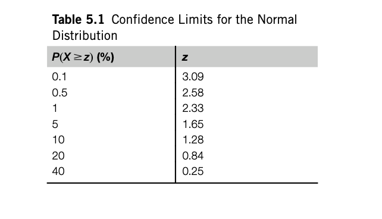

* For f=75%, N=1000, confidence limits can be calculated from the formula below, ie [0.732, 0.767] for N=1000. For N=100
  is [0.691, 0.801]
    * The 6 in this expression gives two values for p that represent the upper and lower confidence boundaries.
    * 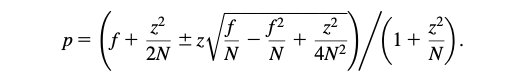

## Cross Validation

* The holdout method reserves a certain amount for testing, and uses the remainder for training (and sets part of that
  aside for validation, if required). In practical terms, it is common to hold one-third of the data out for testing and
  use the remaining two-thirds for training.

* A more general way to mitigate any bias caused by the particular sample chosen for holdout is to repeat the whole
  process, training and testing, several times with different random samples.
* In each iteration, a certain proportion of the data is randomly selected for training, possibly with stratification,
  and the remainder used for testing. The error rates on the different iterations are averaged to yield an overall error
  rate. This is the repeated holdout method of error rate estimation.
* Another alternative technique is called cross-validation where you decide on a fixed number of folds/partitions of the
  data.
    * For k-folds, we have k iterations where 1 fold/share is kept for testing and k-1 folds are used for training.
    * This is repeated k times, until each fold is used for testing. If stratification is used as well, it's called
      stratified k-fold cross-validation.
    * On each run, the error rate is calculated on the test set and finally, the average error rate is calculated.
    * Stratified 10-fold cross-validation is the most commonly used variation. The number 10 is chosen based on
      extensive testing and also some theoretical evidence showing this to give the best estimate of error.
    * A single 10-fold cross-validation might not be enough to get a reliable error estimate if the data is limited.
      Different 10-fold cross-validation experiments with the same learning scheme and dataset often produce different
      results, because of the effect of random variation in choosing the folds themselves.
    * Due to stratification, results across different complete k-fold runs might change even for the same k value.
      Therefore, it's also common practice to repeat the k-fold runs multiple times.

## Evaluating Numeric Prediction

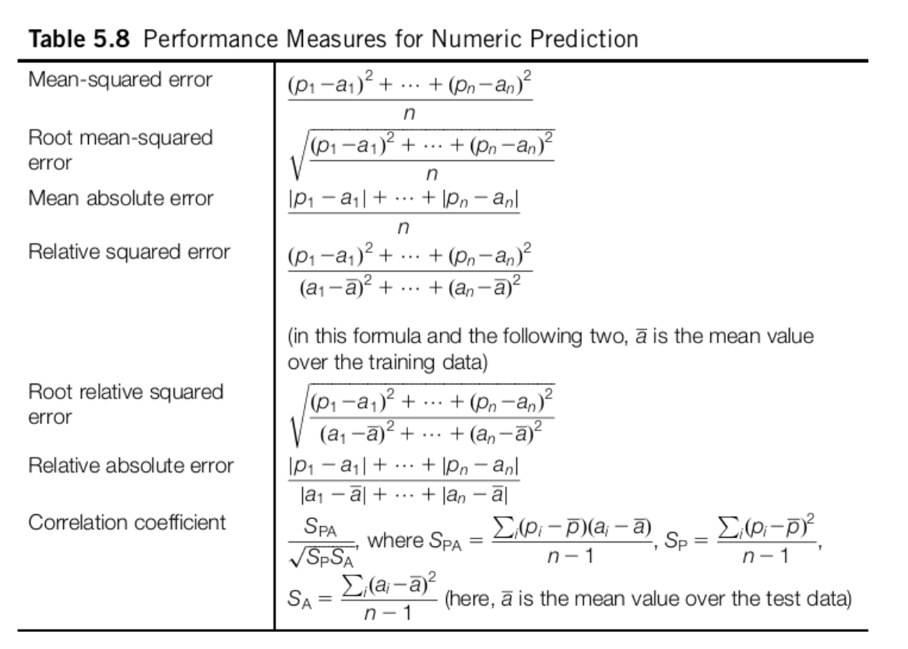

* The basic principles—using an independent test set rather than the training set for performance evaluation, the
  holdout method, cross-validation—apply equally well to numeric prediction. But the basic quality measure offered by
  the error rate is no longer appropriate: errors are not simply present or absent, they come in different sizes.

* **Mean-squared error (MSE)** is the principal and most commonly used measure; some- times the square root is taken to
  give it the same dimensions as the predicted value itself.
    * **Mean absolute error (MAE)** is an alternative: just average the magnitude of the indi- vidual errors without
      taking account of their sign.
    * Mean-squared error tends to exaggerate the effect of outliers—instances whose prediction error is larger than the
      others—
    * But absolute error does not have this effect: all sizes of error are trea- ted evenly according to their
      magnitude.

* Sometimes it is the relative rather than absolute error values that are of impor- tance.
    * For example, if a 10% error is equally important whether it is an error of 50 in a prediction of 500 or an error
      of 0.2 in a prediction of 2, then averages of absolute error will be meaningless: relative errors are appropriate.
      This effect would be taken into account by using the relative errors in the mean-squared error calculation or the
      mean absolute error calculation.

* Relative squared error (RSE) is made relative to what it would have been if a simple predictor had been used.
    * Thus relative squared error takes the total squared error and normalizes it by dividing by the total squared error
      of the default predictor.
    * Relative absolute error (RAE) and is just the total absolute error, with the same kind of normalization.
* **Correlation coefficient**, which measures the statistical correlation between the a’s and the p’s. (a is actual
  value, p is predicted value)
    * The correlation coefficient ranges 1,0,-1, negative values should not occur for reasonable prediction methods
* The squared error measures and root squared error measures weigh large discrepancies much more heavily than small
  ones, whereas the absolute error measures do not.
    * Taking the square root (root mean-squared error) just reduces the figure to have the same dimensionality as the
      quantity being predicted.
* The relative error figures try to compensate for the basic predictability or unpredict- ability of the output
  variable: if it tends to lie fairly close to its average value, then you expect prediction to be good and the relative
  figure compensates for this.

* If you have outlier in the data and you want to ignore them, MAE is a better option but if you want to account for
  them in your loss function, go for MSE/RMSE.

* [Evaluation Metrics for Regression models- MAE Vs MSE Vs RMSE vs RMSLE](https://akhilendra.com/evaluation-metrics-regression-mae-mse-rmse-rmsle/)
  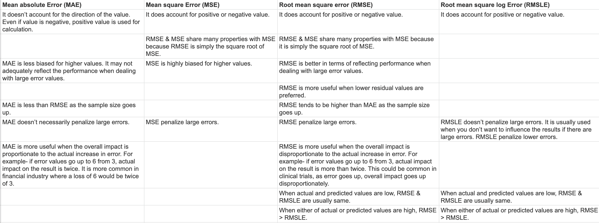

## Confusion matrices and accuracy scores

* The overall success rate is the number of correct classifica- tions divided by the total number of classifications:
    *
    * Error Rate = 1 - Success Rate
* In a multiclass prediction, the result on a test set is often displayed as a two- dimensional **confusion matrix**
  with a row and column for each class. Each matrix element shows the number of test examples for which the actual class
  is the row and the predicted class is the column.
* To make this calculation fairer, we'd need to subtract the correct predictions that could have done by a random
  predictor. This is called the Kappa statistic.
    * Kappa is calculated as (CorrectPredictionsByTheModel - CorrectPredictionsByRandomSelection) / (TotalSamples -
      CPBRS).
    * The max value for Kappa is 100%.
    * Kappa statistic is used to measure the agreement between predicted and observed categorizations of a dataset,
      while correcting for agreement that occurs by chance.
    * Like the plain success rate, Kappa does not take costs into account.

* **Cost-sensitive learning,** In the two-class situation, there is a simple and general way to make any learn- ing
  scheme cost sensitive.
    * The idea is to generate training data with a different pro- portion of yes and no instances. Suppose you
      artificially increase the number of no instances by a factor of 10 and use the resulting dataset for training. If
      the learning scheme is striving to minimize the number of errors, it will come up with a decision structure that
      is biased toward avoiding errors on the no instances, because such errors are effectively penalized 10-fold. If
      data with the original proportion of no instances is used for testing, fewer errors will be made on these than on
      yes instances—i.e., there will be fewer FPs than FNs— because FPs have been weighted 10 times more heavily than
      FNs. Varying the proportion of instances in the training set is a general technique for building cost-sensitive
      classifiers.
* **Lift factor:** Imagine you are direct mailing business, and you will send 1000000 mails to households and response
  rate is %0,1 (1000), Suppose there is a data mining tool based on known information about the households, identifies a
  subset of 100,000 for which the response rate is 0.4% (400 respondents), You can calculate cst effect and choose one
  of those options to send 1 milion mails with 1000 response or 100,000 mails with 0,4 response. . In marketing
  terminol- ogy, the increase in response rate, a factor of four in this case, is known as the **lift factor** yielded
  by the learning tool. If you knew the costs, you could determine the payoff implied by a particular lift factor.

## Receiver Operation Characteristic Curve (ROC)

* [ROC and AUC, Clearly Explained!](https://www.youtube.com/watch?v=4jRBRDbJemM)
* Instead of being overwhelmed with confusion matrices, ROC graphs provide a simple way to summarize all of the
  information.
  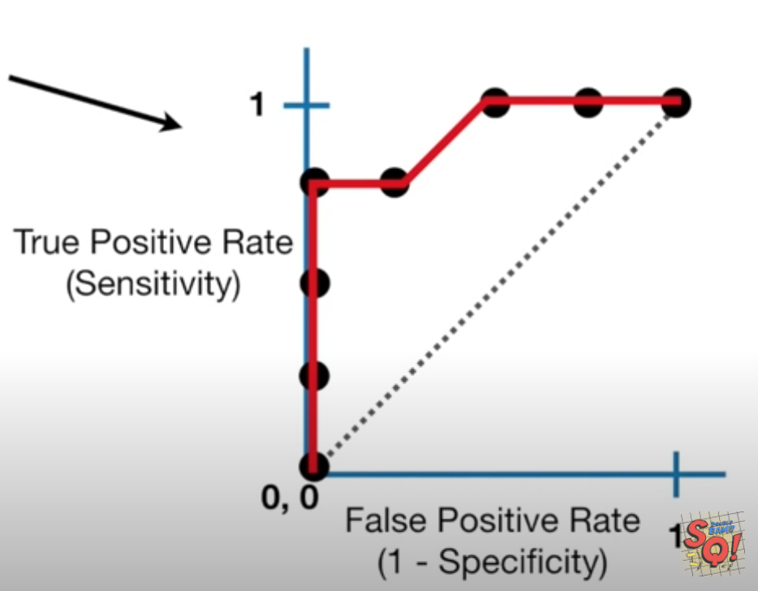
* True and False Positive rates are calculated like this. 
  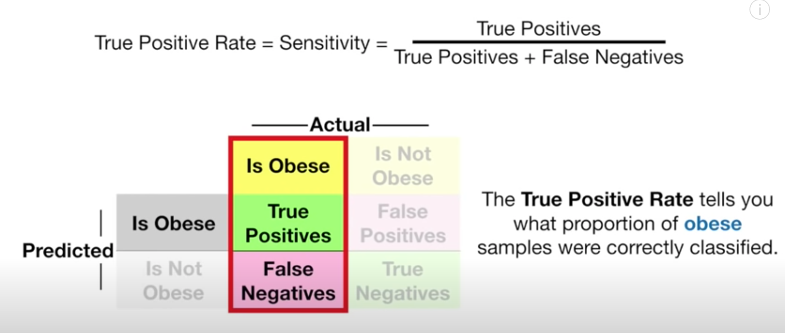 
  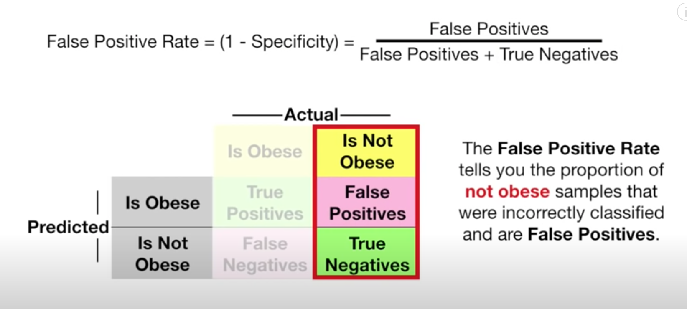

* When one is trying to tweak the classification threshold of logistic regression, ROC comes in handy too as it
  summarises all of the confusion matrices that each threshold produces.
    * if 2 points have the same TP rates, the one with the smaller FP can be selected or depending on how many False
      positives can be accepted, the TP rate can be increased too.
* TPR is basically the recall of the positive class and is also called sensitivity in statistics.

* AUC (Area under the Curve ) can help you which categorization is better.
    * Red is better than blue in this example.
    * Red is Logistic Regression alg, blue is Random Forest and you can decide , logistic is better.

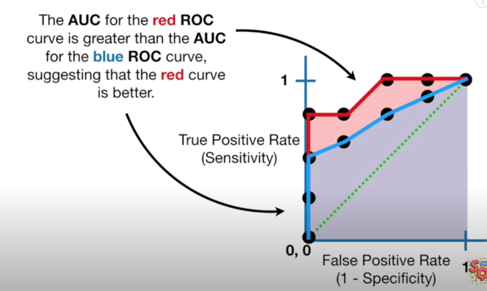

* **Precision p** is the number of correctly classified positive examples divided by the total number of examples that
  are classified as positive.
    * How likely is a member of Positive Data Set to be TP
    * Prediction does not include the number od True Negative and is not effected by imbalance.  
      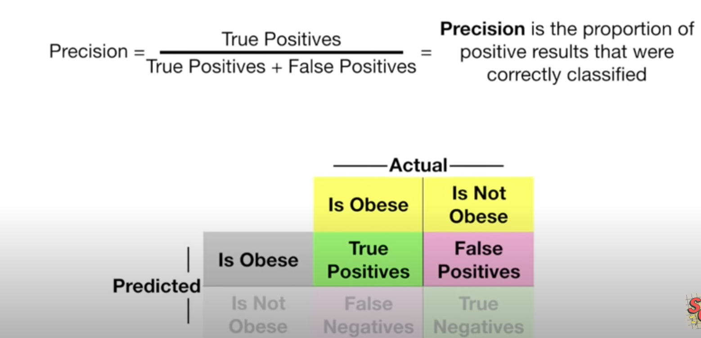 
      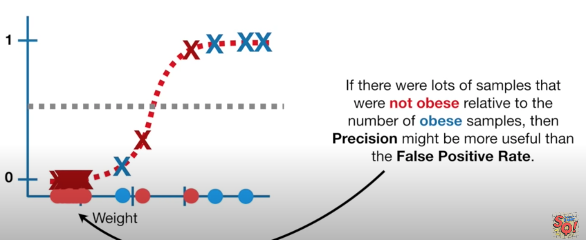 

* **Recall r** is the number of correctly classified positive examples divided by the total number of actual positive
  examples in the test set.
    * How representative TP is of all Actual Positives.
      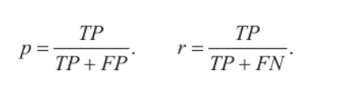

* Although in theory precision and recall are not related, in practice high precision is achieved almost always at the
  expense of recall and vice versa.
    * Therefore, **F-score**, harmonic mean of precision and recall, is used
    * Both p and r has to be high for the F-score to be high
    * The precision and recall break even point is where p and r equal or the closest
      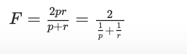

# TODO:

* Activity : 2.4.1 Activity [Diez Book - page 310, for calculations]