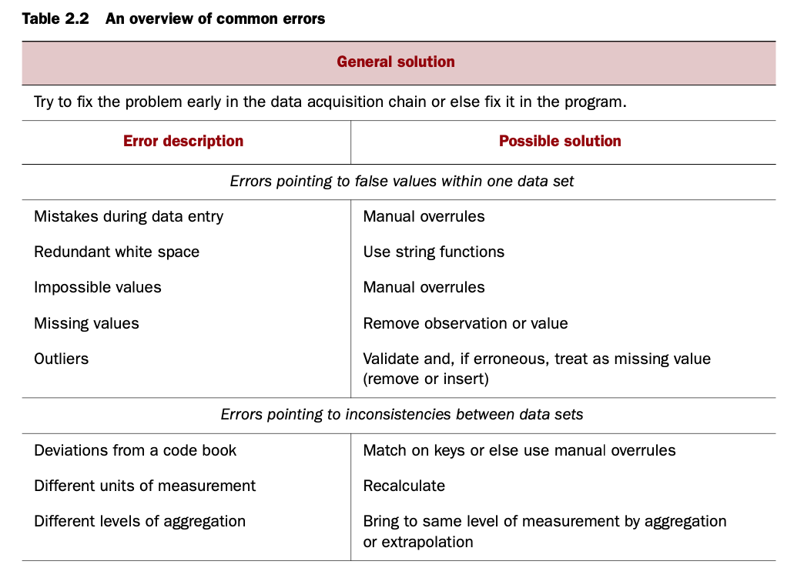

#### Main Topics

After completing this week you should be able to:

* Evaluate the suitability of given data for use in analysis
* Transform and clean simple tabular data using several common techniques
* Extract and create features from simple tabular data
* Integrate data from diverse sources (including multiple tables)

* After completing this week, you will have made significant steps towards achieving the following module learning
  outcomes:
    * MO2 — Manipulate a data set to extract statistics and features

#### Sub titles:

* [Evaluating the suitability of given data for use in analysis](#evaluating-the-suitability-of-given-data-for-use-in-analysis)
* [ARFF files](#arff-format-attribute-relation-file-format)

# Evaluating the suitability of given data for use in analysis

* Week 1 [What are data and what is a data set ?] title.

# ARFF Format (attribute-relation file format)


* Lines beginning with a % sign are comments.
* @relation tels the name of the data (weather)
* @attributes defines attributes (outlook, temperature, humidity, windy, play?).
    * Nominal attributes are followed by the set of values they can take on, enclosed in curly braces.
    * Values can include spaces; if so, they must be placed within quotation marks.
    * Numeric values are followed by the keyword numeric.
    * the class attribute is not distinguished in any way in the data file.
* @data line that signals the start of the instances in the dataset.
    * Instances are written one per line, with values for each attribute in turn, separated by commas.
    * If a value is missing it is represented by a single question mark (there are no missing values in this dataset).
* ARFF has 5 different attribute types:
    * numeric
    * nominal
    * string attributes
        * String attributes have values that are textual.
        * String attributes can have values that are very long—even a whole document.
    * date attributes
        * Weka uses the ISO-8601 combined date and time format yyyy-MM-dd’T’HH:mm:ss
    * relation-valued attributes
        * they allow multi-instance problems to be represented in ARFF format

```
@attribute bag relational
    @attribute outlook {sunny, overcast, rainy} @attribute temperature numeric
    @attribute humidity numeric
    @attribute windy {true, false}
@end bag
```

* Note, however, that in multi-instance learning the order in which the instances is given is generally considered
  unimportant. An algorithm might learn that cricket can be played if none of the days is rainy and at least one is
  sunny, but not that it can only be played in a certain sequence of weather events.


## Sparce Data

* Sometimes most attributes have a value of 0 for most of the instances, ie market basket data showing the purchased
  items will have a lot 0 for all the other items in the stock.
    * Another example is text mining where attributes are the words that occur in the documents.
* Sparse data files have the same @relation and @attribute tags, followed by an @data line, but the data section is
  different and contains specifications in braces such as those shown previously.
    * Instead of '0, X, 0, 0, 0, 0, Y, 0, 0, 0, “class A”', '{1 X, 6 Y, 10 “class A”}' saves space.
* Note that the omitted values have a value of 0—they are not “missing” values! If a value is unknown, it must be
  explicitly represented with a question mark.

## Attribute Types

* How an attribute is processed during cleanup also depends on how the model is going to treat that value. For example,
  if a numerical value is going to be used as numerical or ordinal.
* If a learning scheme treats numeric attributes as though they are measured on ratio scales, the question of
  normalization arises.
    * Attributes are often normalized to lie in a fixed range—usually from zero to one—by dividing all values by the
      maximum value encountered or
    * By subtracting the minimum value and dividing by the range, max-min.
    * Another normalization technique is to subtract the mean from each value and divide the result by the standard
      deviation.
        * This process is called standardizing a statistical variable and results in a set of values whose mean is zero
          and the standard deviation is one.
* For distance-based algorithms, nominal attributes can be converted to synthetic binary attributes, ie for
  sunny/cloudy/rainy, we use one binary attribute for each.
* Sometimes there is a genuine mapping between nominal attributes and numeric scales, ie the Zipcode or the leading
  digits of phone number and the geolocation.

## Missing Values

* [Understand Missing data and 5 ways to handle!](https://www.youtube.com/watch?v=sUAMiAIUhcI)
* Missing values are usually indicated with a number that normally cannot appear for that attribute, ie -1 or 0.
    * Different missing values can be distinguished by different values, ie -1: non-recorded, -2: irrelevant etc.
    * For nominal attributes, missing values may be indicated by blanks or dashes. Sometimes different kinds of missing
      values are distinguished (e.g., unknown vs unrecorded vs irrelevant values) and perhaps represented by different
      negative integers (21, 22, etc.).
* When a value is missing, the question that should be asked is, is it missing just as a random event or a decision was
  taken not to carry out a particular measurement as a result of a problem with the specimen.

* Imputation is t put most reasonable value in missing data, for example salary info 5000 euro for missing value.

<br>


## Inaccurate values

* It is important to check data mining files carefully for rogue attributes and attribute values. The data may not have
  been explicitly collected for that purpose.
* Typographic errors, ie spelling variations of a nominal attribute, extra spaces, upper/lower cases mismatches etc
  would lead to possible extra values.
    * To spot such issues, frequency tables as below and histograms can be useful.
* Typographical or measurement errors in numeric values generally cause outliers that can be detected by graphing one
  variable at a time.
    * Some incorrect values can be easy to spot due to huge variations from the rest but other times, this might require
      good domain knowledge.
* Duplicate data is another potential source of the problem, ie duplication of records leads to most ML algos giving
  them more weight.


## Unbalance Data

* In practical applications of classification schemes, it is very often the case that one class is far more prevalent
  than the others. For example, when predicting the weather in Ireland, it is pretty safe to predict that tomorrow will
  be rainy rather than sunny. Given a dataset in which these two values form the class attribute, with information
  relevant to the forecast in the other attributes, excellent accuracy is obtained by predicting rainy regardless of the
  values of the attributes.

* Always predicting the majority outcome rarely says anything interesting about the data. The problem is that raw
  accuracy, measured by the proportion of correct predictions, is not necessarily the best criterion of success. In
  practice, different costs may be associated with the two types of error.

## Getting to know your data

* Simple tools that show histograms of the distribution of values of nominal attributes, and graphs of the values of
  numeric attributes (perhaps sorted or simply graphed against instance number), are very helpful.
    * These graphical visualizations of the data make it easy to identify outliers, which may well represent errors in
      the data file—or arcane conventions for coding unusual situations, such as a missing year as 9999 or a missing
      weight as 21 kg, that no one has thought to tell you about
* Domain experts need to be consulted to explain anomalies, missing values, the significance of integers that represent
  categories rather than numeric quantities, and so on. Pairwise plots of one attribute against another, or each
  attribute against the class value, can be extremely revealing.
* In a large database, you should sample a few instances and examine them carefully.

# Cleaning Data

* 5 Principles
    * You can't fix problems until you can see them
        * Some within range values can still be problematic if they are repeated erroneously or put in by someone to
          fix 'missing' value, ie using the mean or median for this purpose.
        * So, looking for suspicious repeating values, especially with decimal places.
    * Don't' fix problems by making things worse
        * Refrain from making 'fixes' that might distort the statistics.
    * Justify your fixes
    * Sometimes you shouldn't fix
        * Even if they won't like to hear it, be honest to the audience and don't attempt to fix things that you
          actually can't.
    * Acknowledge residual uncertainty
* Data should be cleansed when acquired for many reasons:
    * Not everyone spots the data anomalies. Decision-makers may make costly mis- takes on information based on
      incorrect data from applications that fail to cor- rect for the faulty data.
    * If errors are not corrected early on in the process, the cleansing will have to be done for every project that
      uses that data.
    * Data errors may point to a business process that isn’t working as designed. we discovered clients who abused the
      couponing system and earned money while purchasing groceries.
    * Data errors may point to defective equipment, such as broken transmission lines and defective sensors.
    * Data errors can point to bugs in software or in the integration of software that may be critical to the company.

</br>
</br>
</br>

## Improving Decision Tree

* Decision trees induced from training data can often be simplified, without loss of accuracy, by discarding
  misclassified instances from the training set, relearning, and then repeating until there are no misclassified
  instances.
    * Experiments show that this hardly affects the classification accuracy but significantly simplifies the DT.
    * This method also helps to verify the subtree pruning and also gives a chance to review the misclassified records
      as they might erroneous in the first place anyway.

* Tackling the noise
    * If there is attribute noise present in the training data, instead of trying to remove it, a similar noise should
      be added to the training data as well. So, training on noisy data but testing on noise-free should be avoided.
      This is more realistic as real-life attributes are likely to contain noise too.
    * If there is class noise, however, then this should either be removed or data with noise-free classes should be
      collected. But with class noise (rather than attribute noise), it is best to train on noise- free instances if
      possible.

## Robust regression

* The problems caused by noisy data have been known in linear regression for years. Statisticians often check data for
  outliers and remove them manually.
    * Outliers dramatically affect the usual least-squares regression because the squared distance measure accentuates
      the influence of points far away from the regression line.

* Statistical methods that address the problem of outliers are called robust.
    * One way of making regression more robust is to use an absolute-value distance measure instead of the usual squared
      one.
        * This weakens the effect of outliers.
    * Another possibility is to try to identify outliers automatically and remove them from consideration.
        * For example, one could form a regression line and then remove from consideration those 10% of points that lie
          furthest from the line
    * A third possibility is to minimize the median (rather than the mean) of the squares of the divergences from the
      regression line.
        * It turns out that this estimator is very robust and actually copes with outliers in the X-direction as well as
          outliers in the Y-direction—which is the normal direction one thinks of outliers.

* Here the anomalous group is because they store calls total number of minutes not counts.
  </br>

* The least median of squares line lies at the exact center of this band. Note that this notion is often easier to
  explain and visualize than the normal least-squares definition of regression.
    * Unfortunately, there is a serious dis- advantage to median-based regression techniques: they incur high
      computational cost, which often makes them infeasible for practical problems.

## Detecting Anomalies

* Auto-detection of outliers/anomalies is prone to errors, especially if a human expert isn't consulted
    * In statistical regression, visualizations help.
    * most classification problems cannot be so easily visualized: the notion of “model type” is more subtle than a
      regression line.
    * One solution that has been tried is to use several different learning schemes— such as a decision tree, and a
      nearest-neighbor learner, and a linear discriminant function—to filter the data.
    * Training all three schemes on the filtered data and letting them vote can yield even better results.
        * However, there is a danger to voting techniques: some learn- ing algorithms are better suited to certain types
          of data than others, and the most appropriate scheme may simply get out-voted!

    * Method of combining the output from different classifiers, called stacking in Ensemble learning.

* One possible danger with filtering approaches is that they might conceivably just be sacrificing instances of a
  particular class (or group of classes) to improve accuracy on the remaining classes
* Automatic filtering is a poor substitute for getting the data right in the first place. And if this is too
  time-consuming and expensive to be practical, human inspection could be limited to those instances that are identified
  by the filter as suspect.

## One Class Learning

* If during training, there is only one class is available but prediction data presents records for unknown classes,
  then the one-class learner groups them as target/known and unknown classes.

## Outlier Detection

* One-class classification is often called outlier (or novelty) detection because the learning algorithm is being used
  to differentiate between data that appears normal and abnormal with respect to the distribution of the training data.
* A generic statistical approach to one-class classification is to identify outliers as instances that lie beyond a
  distance d from a given percentage p of the training data.
    * Alternatively, a probability density can be estimated for the target class by fitting a statistical distribution,
      such as a Gaussian, to the training data; any test instances with a low probability value can be marked as
      outliers.
    * If an appropriate distribution for the data at hand cannot be identified, one can adopt a non-parametric approach
      such as kernel density estimation.
        * An advantage of the density estimation approach is that the threshold can be adjusted at prediction time to
          obtain a suitable rate of outliers.
* Multi-class classifiers can be tailored to the one-class situation by fitting a boundary around the target data. * If
  the boundary is chosen too conservatively, data in the target class will erroneously be rejected. If it is chosen too
  liberally, the model will over-fit and reject too much legitimate data.

## Generating Arificial Data

* The most straightforward approach is to generate uniformly distributed data and learn a classifier that can
  discriminate this from the target.
    * However, different decision boundaries will be obtained for different amounts of artificial data.
    * To overcome this, rather than classifiers, class probability estimators such as bagged decision trees can be used.
      Then, the threshold level of the probability estimator can be adjusted as needed.
* There is one significant problem. As the number of attributes increases, it quickly becomes infeasible to generate
  enough artificial data to obtain adequate coverage of the instance space, and the probability that a particular
  artificial instance occurs inside or close to the target class diminishes to a point that makes any kind of
  discrimination impossible.
    * The solution is to generate artificial data that is as close as possible to the target class. In this case,
      because it is no longer uniformly distributed, the distri- bution of this artificial data—call this the
      “reference” distribution—must be taken into account when computing the membership scores for the resulting
      one-class model.
        * In other words, the class probability estimates of the two-class classifier must be combined with the
          reference distribution to obtain membership scores for the target class.
    
