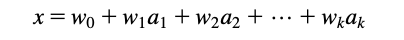
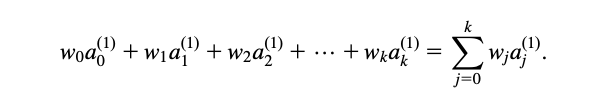
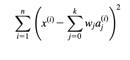
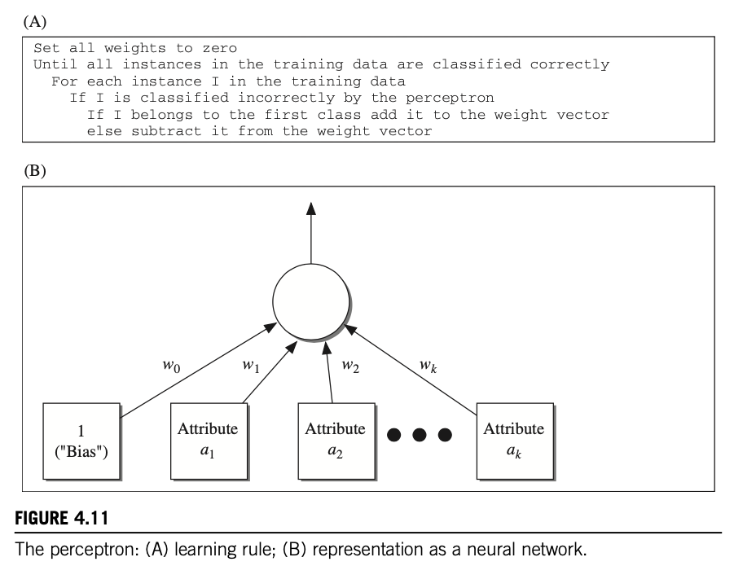
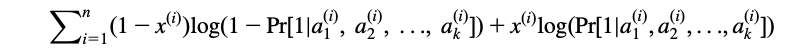
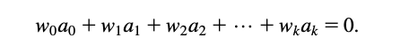
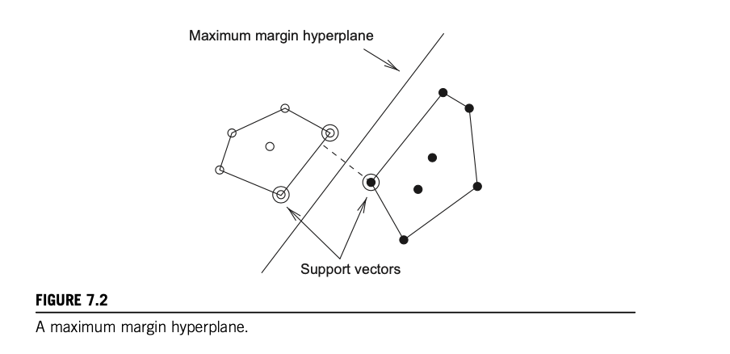
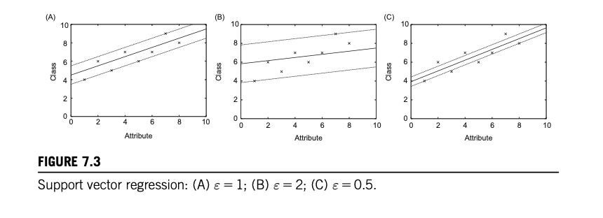
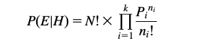
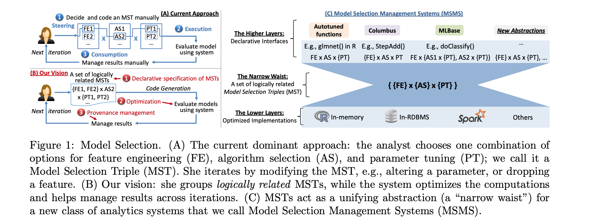

#### Main Topics

* Apply multiple regression and support vector regression
* Apply Naïve Bayes and support vector classification
* Choose between techniques for a given analysis in a principled way
* Identify, address and document residual threats to validity for a given analysis

After completing this week, you will have made significant steps towards achieving the following module learning
outcomes:

* MO3 — Critically evaluate and apply data mining techniques/tools to build a classifier or regression model, and
  predict values for new examples

#### Sub titles:

* [Alternative techniques for regression](#alternative-techniques-for-regression)

# Alternative techniques for regression

## Numeric Prediction: Linear Regression

* When the outcome, or class, is numeric, and all the attributes are numeric, linear regression is a natural technique
  to consider.
  
 
  
* where x is the class; a1, a2,..., ak are the attribute values; and w0, w1,..., wk are weights.
* The predicted value for the first instance’s class can be written as :

 

* Then the sum of the squares of the differences is and This sum of squares is what we have to minimize by choosing the
  coefficients appropriately.

 

* Linear regression is an excellent, simple method for numeric prediction, and it has been widely used in statistical
  applications for decades.
    * Of course, basic linear models suffer from the disadvantage of, well, linearity. If the data exhibits a nonlinear
      dependency, the best-fitting straight line will be found, where “best” is interpreted as the least mean-squared
      difference. This line may not fit very well.
        * However, linear models serve well as building blocks or starting points for more complex learning methods.
* Multiple regression

 

## Linear Classification: Logistic Regression

* [Logistic regression](https://www.youtube.com/watch?v=yIYKR4sgzI8)

* Linear regression can easily be used for classification in domains with numeric attributes. Indeed, we can use **any**
  regression technique for classification.

* The trick is to perform a regression for each class, setting the output equal to one for training instances that
  belong to the class and zero for those that do not. The result is a linear expression for the class. Then, given a
  test example of unknown class, calculate the value of each linear expression and choose the one that is largest. When
  used with linear regression, this scheme is sometimes called **multiresponse linear regression**.

* Multiresponse linear regression has 2 drawbacks:
    * the membership values it produces are not proper probabilities because they can fall outside the range 0-1.
    * east-squares regression assumes that the errors are not only statistically independent, but are also normally
      distributed with the same standard deviation, an assumption that is blatantly violated when the method is applied
      to classification problems because the observations only ever take on the values 0 and 1.

* A related statistical technique called **logistic regression** does not suffer from these problems. Instead of
  approximating the 0 and 1 values directly, thereby risking illegitimate probability values when the target is
  overshot, logistic regression builds a linear model based on a transformed target variable.

* Transformation function called the logit transformation.

 

* In logistic regression the log-likelihood of the model is used instead. This is given by

 

## Linear Classification using the perception

* Logistic regression attempts to produce accurate probability estimates by maximizing the probability of the training
  data.
* the data can be separated perfectly into two groups using a hyperplane, it is said to be linearly separable. t turns
  out that if the data is linearly separable, there is a very simple algorithm for finding a separating hyperplane and s
  called the **perceptron learning rule**.
   

* The resulting hyperplane is called a perceptron, and it’s the grandfather of neural networks
   

## Linear Classification using Winnow

* The perceptron algorithm is not the only method that is guaranteed to find a separating hyperplane for a linearly
  separable problem.
    * For datases with binary attributes there is an alternative known as Winnow, The structure of the two algorithms is
      very similar. Like the perceptron, Winnow only updates the weight vector when a misclassified instance is
      encountered—it is mistake driven.

* Winnow is very effective in homing in on the relevant features in a dataset— therefore it is called an
  attribute-efficient learner. That means that it may be a good candidate algorithm if a dataset has many (binary)
  features and most of them are irrelevant.

## Extending Linear Models

* Support vector machines use linear models to implement nonlinear class boundaries.
* How can this be possible? The trick is easy: transform the input using a nonlinear mapping. In other words, transform
  the instance space into a new space. With a nonlinear mapping, a straight line in the new space does not look straight
  in the original instance space. A linear model constructed in the new space can represent a nonlinear decision
  boundary in the original space.
   
    * Here, x is the outcome, a1 and a2 are the two attribute values, and there are four weights wi to be learned.
* Each data set can be modelled with a complicated enough polynomial but there are 2 major problems with this approach
    * As the number of parameters increase, the number of coefficients and the required computational power increase
      drastically and beyond the practical boundaries
    * There also is a risk of overfitting

# The Maximum Margin Hyperplane

* Support vector machines address both problems. They are based on an algorithm that finds a special kind of linear
  model: **the maximum margin hyperplane**.
    * A hyperplane is—it is just another term for a linear model
* To visualize a maximum margin hyperplane, imagine a two-class data set whose classes are linearly separable; i.e.,
  there is a hyperplane in instance space that classifies all training instances correctly. The maximum margin
  hyperplane is the one that gives the greatest separation between the classes—it comes no closer to either than it has
  to.

* The instances that are closest to the maximum margin hyperplane—the ones with minimum distance to it—are called
  support vectors.
    * There is always at least one support vector for each class, and often there are more

* The important thing is that the set of support vectors uniquely defines the maximum margin hyperplane for the learning
  problem. Given the support vectors for the two classes, we can easily construct the maximum margin hyperplane. **All
  other training instances are irrelevant**—they can be deleted without changing the position and orientation of the
  hyperplane.
   

## Non Linear Class Boundries

* With support vectors, overfitting is reduced.
    * The reason is that it is inevitably associated with instability: with an algorithm that overfits, changing one or
      two instance vectors will make sweeping changes to large sections of the decision boundary.
    * But the maximum margin hyperplane is relatively stable: it only moves if training instances are added or deleted
      that are support vectors—and this is true even in the high-dimensional space spanned by the nonlinear
      transformation.
    * **Overfitting is caused by too much flexibility in the decision boundary**. The support vectors are global
      representatives of the whole set of training points, and there are often relatively few of them, which gives
      little flexibility. Thus overfitting is less likely to occur.

* Computational complexity is still a problem:
    * According to the preceding equation, every time an instance is classified its dot product with all support vec-
      tors must be calculated. In the high-dimensional space produced by the nonlinear mapping this is rather expensive.
      Obtaining the dot product involves one multiplication and one addition for each attribute, and the number of
      attributes in the new space can be huge. This problem occurs not only during classification but also during
      training, because the optimization algorithms have to calculate the same dot products very frequently.
* Fortunately, it turns out that it is possible to calculate the dot product before the nonlinear mapping is performed,
  on the original attribute set. A highdimensional version of the preceding equation is simply
    *  

* The function ðxUyÞn, which computes the dot product of two vectors x and y and raises the result to the power n, is
  called a polynomial kernel.
    * A good way of choosing the value of n is to start with 1 (a linear model) and increment it until the estimated
      error ceases to improve. Usually, quite small values suffice .

* Other kernel functions can be used instead to implement different nonlinear mappings.
    * Two that are often suggested are the radial basis function (RBF) kernel and the sigmoid kernel.
    * Which one produces the best results depends on the application, although the differences are rarely large in
      practice
    * It is interesting to note that a support vector machine with the RBF kernel corresponds to a type of neural
      network called an RBF network (which we describe later), and one with the sigmoid kernel implements another type
      of neural network, a multilayer perceptron with one hidden layer (also described later).
    * Support vector machine with the RBF kernel corresponds to a type of neural network called an RBF network
    * One with the sigmoid kernel implements another type of neural network, a multilayer perceptron with one hidden
      layer

* SVM normally assumes linear separatability of the training data either in the instance space or in a transformed
  space.
    * Where this isn't the case, SVM can still be used by tuning the 'C' parameter but this is a manual, trial&error
      based process.
* we should mention that compared with other methods such as decision tree learners, even the fastest training
  algorithms for **support vector machines are slow when applied in the nonlinear setting.**
    * On the other hand, they often produce very accurate classifiers because subtle and complex decision boundaries can
      be obtained.

## Support Vector Regression

* The concept of a maximum margin hyperplane only applies to classification. However, support vector machine algorithms
  have been developed for numeric prediction that share many of the properties encountered in the classification case:
  they produce a model that can usually be expressed in terms of a few support vectors and can be applied to nonlinear
  problems using kernel functions.

* As with linear regression, the basic idea of SVR is to find a function that approximates the training points with
  minimised errors.
    * The crucial difference is that
        * All deviations up to a user-specified parameter ε are simply discarded. ε defines a tube around the regression
          function in which errors are ignored.
        * Also, when minimizing the error, the risk of overfitting is reduced by simultaneously trying to maximize the
          flatness of the function.
        * Another difference is that what is minimized is normally the predictions’ absolute error instead of the
          squared error used in linear regression.

* The value of ε controls how closely the function will fit the training data.
    * Too large a value will produce a meaningless predictor—in the extreme case, when 2ε exceeds the range of class
      values in the training data, the regression line is horizontal and the algorithm just predicts the mean class
      value.
    * For small values of ε there may be no tube that encloses all the data. In that case some training points will have
      nonzero error, and there will be a tradeoff between the prediction error and the tube’s flatness
       

* In the degenerate case ε50 the algorithm simply performs least-absolute-error regression under the coefficient size
  constraint, and all training instances become support vectors.
    * Conversely, if ε is large enough that the tube can enclose all the data, the error becomes zero, there is no
      tradeoff to make, and the algorithm outputs the flattest tube that encloses the data irrespective of the value of
      C.

# Alternative Techniques for classification

* There are 3 techniques to find what analysis techniques we would like to use:
    * Determine the techniques that could work, qualitatively:
        * Select the general type, regression vs classification
        * Determine the right specific features;
            * Descriptive vs regression : descriptive statistics like means are quite appropriate? Or do you need to be
              able to input the values of an instance and predict another field?
            * Binary vs multiway classification : “yes/no”, “true/false”
            * Do you need feature interactions, ie, does the value of one attribute affect the meaning of another. If
              yes, this is likely to require employing neural networks.
    * Narrow the search to the candidates that seem most likely to work well, quantitatively:
    * Empirically test those candidates agains each other to find winner:
        * Compare accurancy and error rates
        * Think about hypothesis testing (out of scope)

## Naive Bayes for Document classification

* An important domain for machine learning is document classification, in which each instance represents a document and
  the instance’s class is the document’s topic.
* Na ̈ıve Bayes is a popular technique for this application because it is very fast and quite accurate.
    * However, this does not take into account the number of occurrences of each word, which is potentially useful
      information when determining the category of a document.
    * Instead, a document can viewed as a bag of words—a set that contains all the words in the document, with multiple
      occurrences of a word appearing multiple times ( technically, a set includes each of its members just once,
      whereas a bag can have repeated elements).
    * Word frequencies can be accommodated by applying a modified form of Na ̈ıve Bayes called **multinominal Na ̈ıve
      Bayes**.

* the probability of a document E given its class H—in other words, the formula for computing the probability P(E|H) in
  Bayes’ rule—is below , where N 5 n1 + n2 +...+ nk is the number of words in the document.
    * Pi is estimated by computing the relative frequency of word i in the text of all training documents pertaining to
      category H.
       

* In the multinomial Na ̈ıve Bayes formulation a document’s class is determined not just by the words that occur in it
  but also by the number of times they occur.
    * In general it performs better than the ordinary Na ̈ıve Bayes model for document classification, particularly for
      large dictionary sizes.

# Choosing a learning technique for a given analysis

## The Model Selection and Tuning Problem

* A key activity in computer science is taking a problem and defining it very precisely. This is necessary if you plan
  to automate solving the problem, but that’s not the only reason to do it. Sometimes defining a problem precisely helps
  you understand it.

## Model Selection and Managment Systems (MSMS)

* [Article](https://dl.acm.org/doi/pdf/10.1145/2935694.2935698)

* Model selection management systems (MSMS) : To make the iterative process of model selection easier and faster, we
  envision a unifying abstract framework that acts as a basis for a new class of analytics systems.
* Model Selection: Broadly defined, model selection is the process of building a precise prediction function to make
  “satisfactorily” accurate predictions about a data-generating process using data generated by the same process
* **Feature Engineering (FE)** is the process of converting raw data into a precise feature vector that provides the
  domain of the prediction function (a learned ML model).
    * FE includes a variety of options (a sequence of computational operations), e.g., counting words or selecting a
      feature subset. Some options, such as subset selection and feature ranking, are well studied
    * FE is considered a domain-specific “black art” , mostly because it is influenced by many technical and logistical
      factors, e.g., data and application properties, accuracy, time, interpretability, and company policies.
* **Algorithm Selection (AS)** is the process of picking an ML model, i.e., an inductive bias, that fixes the hypothesis
  space of prediction functions explored for a given application.
    * For example, logistic regression and decision trees are popular ML techniques for classification applications.
* **Parameter Tuning (PT)** is the process of choosing the values of (hyper-)parameters that many ML models and
  algorithms have.
    * For example, logistic regression is typically used with a parameter known as the regularizer. Such parameters are
      important because they control accuracy-performance tradeoffs, but tuning them is challenging partly because the
      optimization problems involved are usually non-convex .

### Model Selection Triple

* A large body of work in ML focuses on various theoretical aspects of model selection. But from a practical
  perspective, we found that analysts typically use an iterative exploratory process.
* While the process varies across analysts, we observed that the core object of their exploration is identical – an
  object we call the model selection triple (MST).
* It has three components (MST):
    * an FE “option” (loosely defined, a sequence of computation operations) that fixes the feature set that represents
      the data
    * an AS option that fixes the ML algorithm,
    * a PT option that fixes the parameter choices conditioned on the AS option.
* Model selection is iterative and exploratory because the space of MSTs is usually infinite, and it is generally
  impossible for analysts to know a priori which MST will yield satisfactory accuracy and/or insights.

### Three-Phase Iteration.

* Divide an iteration into 3 phases.
    * Steering:the analyst decides on an MST and specifies it in an ML-related language or GUI such as R, Scala, SAS, or
      Weka.
    * Execution: the system executes the MST to build and evaluate the ML model, typically on top of a data management
      platform, e.g., an RDBMS or Spark.
    * Consumption: the analyst assesses the results to decide upon the MST for the next iteration, or stops the process

* Iteration in an MSMS:
    * Steering: an MSMS should offer a framework of declarative operations that enable analysts to easily group
      logically related MSTs.
        * For example, the analyst can just “declare” the set of tree heights and feature subsets (projections).
    * Execution: an MSMS should include optimization techniques to reduce the runtime per iteration by exploiting the
      set-oriented nature of specifying MSTs.
        * For example, the system could share computations across different parameters or share intermediate
          materialized data for different feature sets.
    * Consumption: an MSMS should offer provenance management so that the system can help the analyst manage results and
      help with optimization. For example, the analyst can inspect the results using standard queries to help steer the
      next iteration, while the system can track intermediate data and models for reuse.

 

# Technique comparisons

## Comparing Data mining schemes

* We often need to compare two different learning schemes on the same problem to see which is the better one to use. It
  seems simple: estimate the error using cross-validation (or any other suitable estimation procedure), perhaps repeated
  several times, and choose the scheme whose estimate is smaller.

* If there were unlimited data, we could use a large amount for training and evaluate performance on a large independent
  test set, obtaining confidence bounds just as before. However, if the difference turns out to be significant we must
  ensure that this is not just because of the particular dataset we happened to base the experiment on. What we want to
  determine is whether one scheme is beter or worse than another on average, across all possible training and test
  datasets that can be drawn from the domain. Because the amount of training data naturally affects performance, all
  datasets should be the same size: indeed, the experiment might be repeated with different sizes to obtain a learning
  curve.

* For each learning scheme we can draw several datasets of the same size, obtain an accuracy estimate for each dataset
  using cross-validation, and compute the mean of the estimates. Each cross-validation experiment yields a different,
  independent error estimate. What we are interested in is the mean accuracy across all possible datasets of the same
  size, and whether this mean is greater for one scheme or the other.

* From this point of view, we are trying to determine whether the mean of a set of samples—cross-validation estimates
  for the various datasets that we sampled from the domain—is significantly greater than, or significantly less than,
  the mean of another. This is a job for a statistical device known as the t-test, or Student’s t-test. Because the same
  cross-validation experiment can be used for both learning schemes to obtain a matched pair of results for each
  dataset, a more sensitive version of the t-test known as a paired t-test can be used.

# TODO:

* 4.4.1 Activity : Practical — applying alternative forms of regression
* 4.6.1 Activity : Practical — applying alternative forms of classification
* 4.7.2 Activity : [Important](https://onlinestudy.york.ac.uk/courses/577/files/183357?wrap=1)