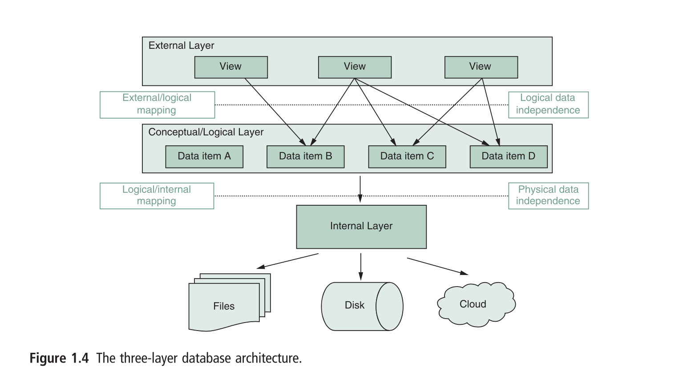
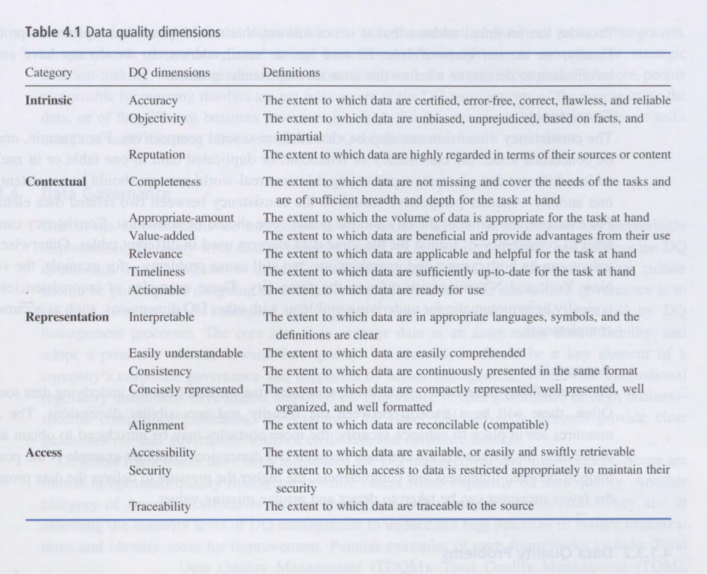
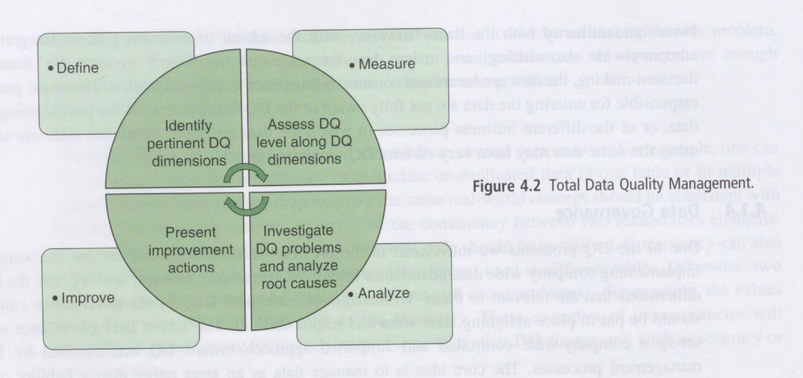
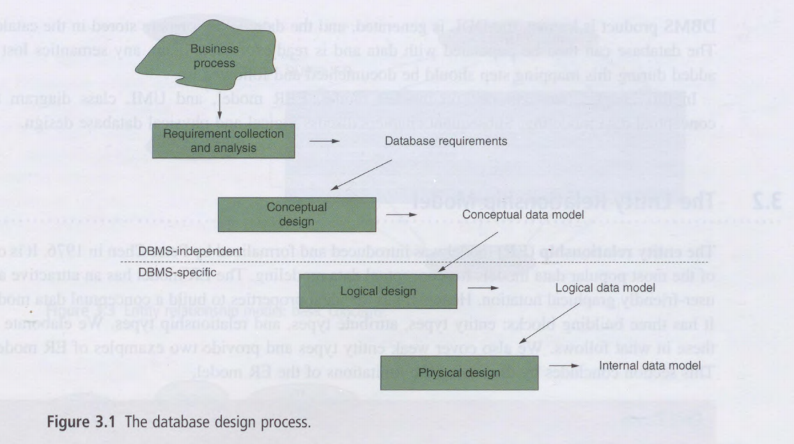
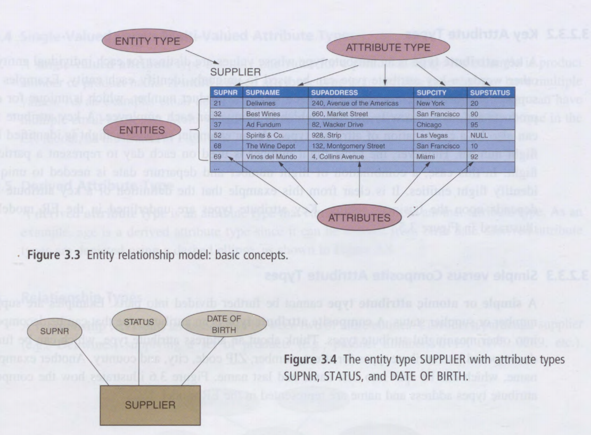
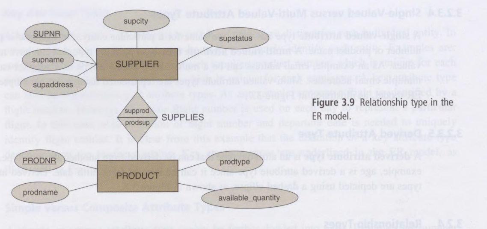
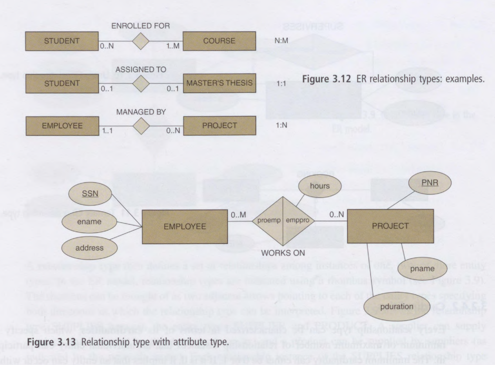
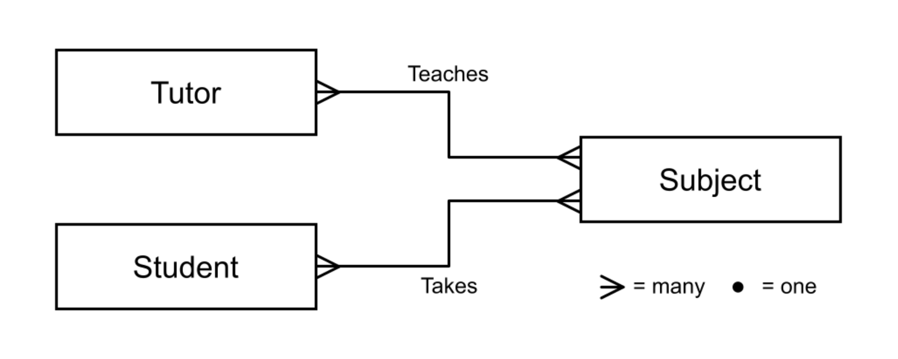
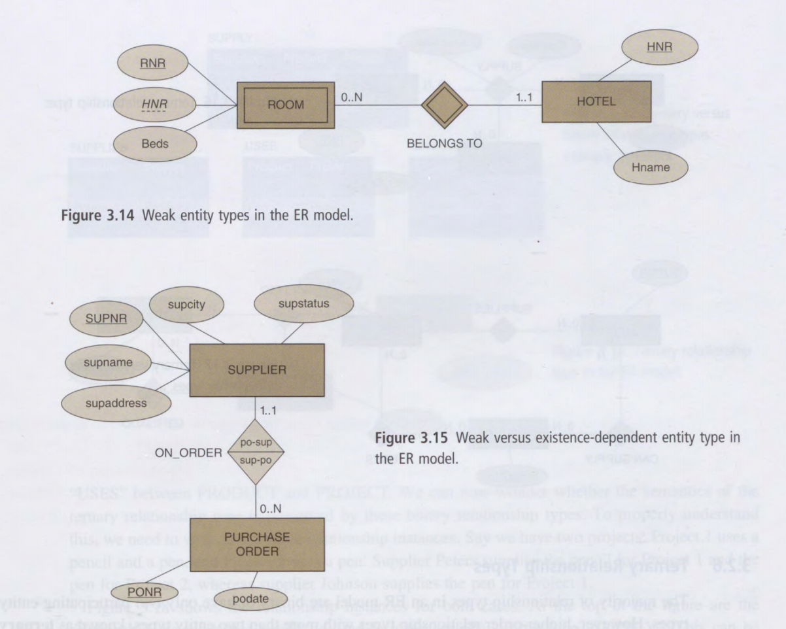
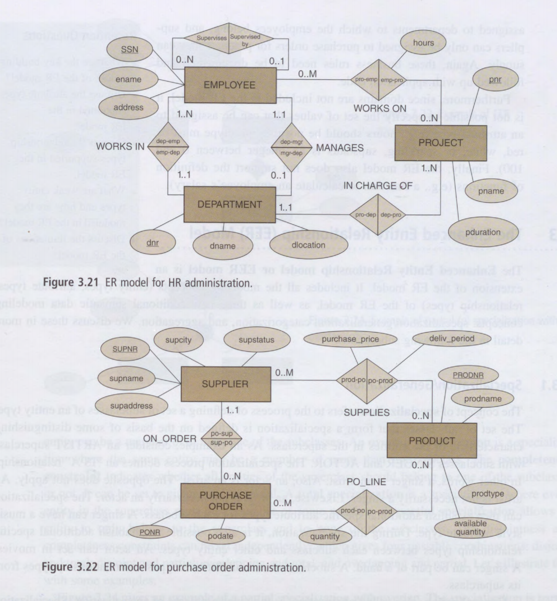

#### Main Topics

After completing this week you should be able to:

* Describe the relational database mode
* Explain the problems caused by data that is too large for RAM
* Explain how Big Data causes problems for analytics

After completing this week, you will have made significant steps towards achieving the following module learning
outcomes:

* MO2 — Manipulate a data set to extract statistics and features

#### Sub titles:

* [Why databases?](#why-databases)
    * [Intro](#intro)
    * [Elements of Database System](#elements-of-database-system)
    * [Database User](#database-user)
    * [Database language](#database-language)
    * [Advantage of Database System and Database Management](#advantage-of-database-system-and-database-management)
        * [Data independence](#data-independence)
        * [Database Modeling](#database-modeling)
        * [Managing Structured, Semi-Structured, and Unstructured Data](#managing-structured-semi-structured-and-unstructured-data)
        * [Managing Data Redundancy](#managing-data-redundancy)
        * [Specifying Integrity Rules](#specifying-integrity-rules)
        * [Concurrency Control (ACID)](#concurrency-control-acid)
        * [Backup and Recovery Facilities](#backup-and-recovery-facilities)
        * [Data Security](#data-security)
        * [Performance Utilities](#performance-utilities)
* [Data and quality management](#data-management)
    * [Data Quality](#data-quality)
* [Data Governance](#data-governance)
* [Roles in Data Management](#roles-in-data-management)
* [Modelling data and the Relational Database model](#modelling-data-and-the-relational-database-model)
    * [Phases of designing Database](#phases-of-designing-database)
    * [The Entity Relationship Model](#the-entity-relationship-model)
    * [Entity Type](#entity-type)
    * [Attribute Type](#attribute-type)
    * [Basic concepts](#basic-concepts)
    * [Relationship Types](#relationship-types)
* [Relational Database Keys](#relational-database-keys)
* [Database Normalization](#database-normalization)
* [Questions](#questions)

# Why databases?

* Answer is :  the term ‘database’ can be used in both an informal way (perhaps suggesting a collection of data on which
  we might base a decision) and more formally to mean a specific approach and software structure for storing and
  manipulating data.

## Intro

* Database can store traditional , numeric and alphanumeric values and also multimedia data such as picture, video or
  audio, biometric data such as finger prints, retins scans, geographic info such as coordinates etc.

* A database can derived as a collection of related data items with a special business process or problem setting.
* A Database Management System (DBMS) is the software package used to define create, use and maintain a database.
    * Populars , Oracle, Microsoft, IBM ,My-SQL( well known open source DBMS)
* A combination of database with DBMS called database system.
* Before databases, data was stored in files and this has the danger of data duplication, redundancy and inconsistency
  as different applications kept records in different files.
    * The other option is all the applications accessing the same file store and retrieve data but then this has the
      problem of concurrency management which isn't easy either.
* Then, with databases, DBMS is in charge of delivering the data and managing the data access. DBMS also manage the
  metadata related to the stored data.
* DBM is also provides database languages that both data query and access. Well known language SQL
* The file base approach results in a strong application data dependence, where as tha database approach allows for
  applications to be independence from the data and data definitions.

* DBMS also help to achieve a looser application-data coupling as opposed to the stronger coupling with the file-based
  approach.

### Elements of Database System

* Database Model and shema provodes the definition of the database data at different levels .
* The database state, the current set of instances, represents the data in the database at a particular moment.
* Data model provides a clear and unambigous description of the data items , its relation and variour data concerns .
    * Conceptional data model is high level description of data items. should be implementation independent,
      user-friendly, and close to how the business user perceives the data. It will usually represented with Enhanced
      Entity Relationsgip (EER) model.
    * Logical data model is translation or mapping of the conceptual data modal towards special implementation
      environment. Like OOP, This describes which data stores where.
    * External data models contains various subset data items in logical model, also called views. A view describes the
      part of the database that a particular application or user group is interested in, hiding the rest of database.
* Three-layer architecture is essential for
    * In external layer has the external model , which includes views.
    * In internal layer includes internal data model, which specifies how the data stores or organised pysicaly.
* Idealy changes in one layer should have no to minimal impact on the others.
   

* Catalog is the hard of the DBMS, contains data definition or metadata of the application.
    * it stores definition of views, logical and internal data models, and syncronises these 3 models to ensure
      consistency.

### Database User

* Information architect, design conceptional data by working closely with business.
* Database designer, converts conceptional data to logical and internal data model.
* Database administrator (DBA), reposnsile implementation and monitoring tha db.

### Database language

* The Database Definition Language (DDL) is used by DBA to express the DB external, logical, internal data models.
* Data Manipulation Language (DML) is used to retrieve , insert, update delete and modify data.
* SQL offers bith DDL and DML for relational DBs.

## Advantage of Database System and Database Management

* Database offers some addvantages such as,
    * data independence; managing structured, semi-structured and unstructured data;
    * database modeling;
    * managing data radundancy;
    * specifiying integrity rules;
    * conqurrency control
    * backup and recovery facilities
    * data security and performance utilities.

### Data independence

* Means that changing data definition has minimal to no impact on the applications using the data.
* Physical data independence implies that neither the applications, views, or logical data model must be changed when
  changes are made to the data storage specifications in the internal data model.
* Logical data independence implies that software applications are minimally affected by changes in the conceptual or
  logical data model. Consider the example of adding new data items, characteristics, or relationships.

### Database Modeling

* A data model is an explicit representation of the data items together with their characteristics and relationships.
  Also include integrity rules and functions.
* Popular examples of data models are the hierarchical model, the CODASYL model, the (E)ER model, the relational model,
  and the object-oriented model.

### Managing Structured, Semi-Structured, and Unstructured Data

* It is important to note that not all kinds of data but only structured data can be described according to a formal
  logical data model.
* With structured data, individual characteristics of data items can be identified and formally specified, such as the
  number, name, address, and email of a student, or the number and name of a course.
    * The advantage is the ability to express integrity rules and in this way enforce the correctness of the data
* With unstructured data, ie text documents, there are no finer-grain components in a file or series of characters that
  can be interpreted in a meaningful way by a DBMS or application.
* The data that isn't completely structured or unstructured is called semi-structured. XML and NoSQL databases deal with
  semi-structured data.
    * The semi-structured data still has a certain structure, but the structure may be very irregular or highly
      volatile.

### Managing Data Redundancy

* The DBMS is responsible for the management of redundancy by providing synchronization facilities to safeguard data
  consistency.
    * DBMS might deliberately create data redundancy for faster retrieval where the data is distributed across different
      locations.

### Specifying Integrity Rules

* These rules can be used to enforce the correctness of the data.
    * Syntactical rules specify how the data should be represented and stored. Examples are:
      customerID should be represented as an integer
* Semantic rules focus on the semantic correctness or meaning of the data. Examples are:
  customerID should be unique; account balance should be bigger than 0;
* n. In the database approach, they are specified as part of the conceptual/logical data model and are stored centrally
  in the catalog.
    * This substantially improves the efficiency and maintainability of the applications since the integrity rules are
      now directly enforced by the DBMS whenever anything is updated

### Concurrency Control (ACID)

* A DBMS has built-in facilities to support concurrent or parallel execution of database programs, which allows for good
  performance.
* A key concept is a database transaction that is a sequence of read/write operations, considered to be an atomic unit
  in the sense that either all operations are executed or none at all.
* Typically, these read/write operations can be executed at the same time by the DBMS.
* DBMS must support the **ACID** (Atomicity, Consistency, Isolation, Durability) properties.
    * **Atomicity**, or the all-or-nothing property, requires that a transaction should either be executed in its
      entirety or not at all.
    * **Consistency** assures that a transaction brings the database from one consistent state to another.
    * **Isolation** ensures that the effect of concurrent transactions should be the same as if they had been executed
      in isolation.
    * **Durability** ensures that the database changes made by a transaction declared successful can be made permanent
      under all circumstances.

### Backup and Recovery Facilities

* A key advantage of using databases is the availability of backup and recovery facilities.
    * These facilities can be used to deal with the effect of loss of data due to hardware or network errors, or bugs in
      system or application software

### Data Security

* Depending on the business application considered, some users have read access, while others have write access to the
  data (role-based functionality)
    * This can also be further refined to certain parts of the data

### Performance Utilities

* Three key performance indicators (KPIs) of a DBMS are: response time; throughput rate; and space utilization
    * The response time denotes the time elapsed between issuing a database request (e.g., a query or update
      instruction) and the successful termination thereof
    * The throughput rate represents the transactions a DBMS can process per unit of time.
    * Space utilization refers to the space utilized by the DBMS to store both the raw data and the metadata. A
      high-performing DBMS is characterized by quick response times, high throughput rates, and low space utilization

# Data and quality management

## Data Management

* Data management entails the proper management of data and the corresponding data definitions or metadata
* Just as with raw data, metadata are also data that need to be properly modeled, stored, and managed.
    * Hence, the concepts of data modeling should also be applied to metadata in a transparent way
* In a DBMS approach, metadata are stored in a catalog, sometimes also called a data dictionary or data repository,
  which constitutes the heart of the database system
    * This facilitates the efficient answering of questions such as which data are stored where in the database? Who is
      the owner of the data? Who has access to the data? How are the data defined and structured? Which transactions
      work with which data? Are the data replicated and how can consistency be guaranteed? Which integrity rules are
      defined? How frequently are backups made?

* The catalog provides an important source of information for end-users, application developers, and the DBMS itself.
    * the data definitions are generated by the DDL compiler. The DML compiler and query processor use the metadata to
      solve queries and determine the optimal access path

* The catalog should provide support for various functionalities
    * It should implement an extensible metamodel for the description of the metadata.
    * It should have facilities to import and export the data definitions and provide support for maintenance and re-use
      of metadata.
* The integrity rules stored should be continuously monitored and enforced whenever the raw data are updated. By doing
  so, the catalog guarantees that the database is always in a consistent and correct state

* A metamodel determines the type of metadata that can be stored. Just as with raw data, a database design process can
  be used to design a database storing metadata

## Data Quality

* Data quality determines the intrinsic value of the data to the business. Information technology only serves as a
  magnifier for this intrinsic value.
    * Hence, high-quality data combined with effective technology comprises a great asset, but poor-quality data
      combined with effective technology is an equally great liability.
    * This is sometimes also called the GIGO — Garbage In, Garbage Out — principle, stating that bad data result in bad
      decisions, even with the best technology available.

* Poor DQ impacts organizations in many ways.
    * At the operational level, it affects customer satisfaction, increases operational expenses, and will lead to lower
      employee job satisfaction.
    * At the strategic level, it affects the quality of the decision-making process.

* A DQ framework categorizes the different dimensions of data quality
* The intrinsic category represents the extent to which data values conform to the actual or true values.
* The contextual category measures the extent to which data are appropriate to the task of the data consumer. Obviously,
  this can vary in time and across data consumers.
* The representation category indicates the extent to which data are presented in a consistent and interpretable way.
  Hence, it relates to the format and meaning of data.
* The access category represents the extent to which data are available and obtainable in a secure manner

   

* Data Quality Problems:
    * Multiple data sources: multiple sources with the same data may produce duplicates — a problem of consistency.
    * Subjective judgment in data production: data production using human judgment (e.g., opinions)
      can cause the production of biased information — a problem of objectivity.
    * Limited computing resources: lack of sufficient computing resources and/or digitalization may limit the
      accessibility of relevant data — a problem of accessibility.
    * Volume of data: large volumes of stored data make it difficult to access needed information in a reasonable time —
      a problem of accessibility.
    * Changing data needs: data requirements change on an ongoing basis due to new company strategies or the
      introduction of new technologies — a problem of relevance.
    * Different processes using and updating the same data — a problem of consistency

# Data Governance

* To manage and safeguard DQ, a data governance culture should be put in place assigning clear roles and
  responsibilities.
* The aim of data governance is to set-up a company-wide controlled and supported approach toward DQ accompanied by DQ
  management processes.
* The core idea is to manage data as an asset rather than a liability, and adopt a proactive attitude toward data
  quality
* A TDQM cycle consists of four steps — define, measure, analyze, and improve — which are performed iteratively.

   

# Roles in Data Management

* The **information architect** (also called information analyst) designs the conceptual data model, preferably in
  dialogue with the business users.
    * He/she bridges the gap between the business processes and the IT environment and closely collaborates with the
      database designer, who may assist in choosing the type of conceptual data model (e.g., EER or UML) and the
      database modeling tool.

* The **database designer** translates the conceptual data model into a logical and internal data model.
    * He/she also assists the application developers in defining the views of the external data model. To facilitate
      future maintenance of the database applications, the database designer should define company-wide uniform naming
      conventions when creating the various data models.

* **Data owner**, who has the authority to ultimately decide on the access to, and usage of, the data.
    * The data owner could be the original producer of the data, one of its consumers, or a third party.

* **Data stewards** are the DQ experts in charge of ensuring the quality of both the actual business data and the
  corresponding metadata.
    * They assess DQ by performing extensive and regular data quality checks.
        * A first type of action to be taken is the application of corrective measures.
            * However, data stewards are not in charge of correcting data themselves, as this is typically the
              responsibility of the data owner.
        * The second type of action to be taken upon the results of the DQ assessment involves a deeper investigation
          into the root causes of the DQ issues detected.
* The **database administrator (DBA)** is responsible for the implementation and monitoring of the database.
    * Example activities include: installing and upgrading the DBMS software; backup and recovery management;
      performance tuning and monitoring; memory management; replication management; security and authorization.
    * Closely collaborates with network and system managers

* **Data scientist** is a relatively new job profile within the context of data management.
    * He/she analyzes data using state-of-the-art analytical techniques to provide new insights into, for example,
      customer behavior.
    * A data scientist has a multidisciplinary profile combining ICT skills (e.g., programming) with quantitative
      modeling (e.g., statistics), business understanding, communication, and creativity

# Modelling data and the Relational Database model

## Phases of designing Database

* Designing a database is a multi-step process

 

## The Entity Relationship Model

* The Entity-Relationship model is one of the most popular models for conceptual database modelling.
* The ER model facilitates database design by providing a mechanism to express the logical properties of the part of the
  enterprise we are interested in -- the Universe of Discourse. The use of ER modelling is not limited to any particular
  database management system.
* ER modelling uses a simple graphical language to describe the system we are modelling.
* The ER diagrams are used as design tools – they capture the information about the conceptual system in a way that
  makes it easy for us to decide on the design of the actual database that implements the conceptual model.
* The ER model is a semantic model – that is, it captures the meaning of the relationships between our data, without
  dictating the syntactic structure that we will then need to implement the database.

* The ER model has an attractive and user-friendly graphical notation.
    * Hence, it has the ideal properties to build a conceptual data model. It has three building blocks: entity types,
      attribute types, and relationship types.

## Entity Type

* An **entity type** represents a business concept with an unambiguous meaning to a particular set of users. Examples of
  entity types are: supplier, student, product, or employee
    * An entity is one particular occurrence or instance of an entity type.
    * An entity type defines a collection of entities that have similar characteristics.

## Attribute Type

* An **attribute type** represents a property of an entity type. As an example, name and address are attribute types of
  the entity type supplier.

   

* A **domain** specifies the set of values that may be assigned to an attribute for each individual entity. A domain for
  gender can be specified as having only two values: male and female or a date domain can define date with day, month
  and year
    * domains are not displayed in an ER model.

* A **key attribute type** is an attribute type whose values are distinct for each individual entity.
    * In other words, a key attribute type can be used to uniquely identify each entity
    * Examples are: supplier number, which is unique for each supplier A key attribute is one which allows us to
      identify a particular instance of an entity. An example of a key attribute might be a student number – a Primary
      Key as every student has a unique number, so we can use that attribute to identify each individual.
    * We can also have a key which is a combination of attributes – **a composite key.** One example of this might be a
      combination of name and address to identify an individual – some names are duplicated, and more that one person
      may live at a particular address, but the combination is (usually!) sufficient to uniquely identify a person.

* A **simple or atomic attribute** type cannot be further divided into parts. Examples are supplier number or supplier
  status.

* A **composite attribute type** is an attribute type that can be decomposed into other meaningful attribute types.
    * Think about an address attribute type, which can be further decomposed into attribute types for street, number,
      ZIP code, city, and country. Another example is name, which can be split into first name and last name

   

* A **single-valued attribute** type has only one value for a particular entity. An example is product number or product
  name.

* A **multi-valued attribute** type is an attribute type that can have multiple values. As an example, email address can
  be a multi-valued attribute type as a supplier can have multiple email addresses
    * Multi-valued attribute types are represented using a double ellipse in the ER model

* A **derived attribute type**  is an attribute type that can be derived from. another attribute type. As an example,
  age is a derived attribute type since it can be derived from birth date.
    * Derived attribute types are depicted using a dashed ellipse, a

## Basic concepts

* Each row in a table (also called a tuple, an ordered set of parts or number of fields) corresponds to an individual
  record.
* Each record is distinct – duplicate records (rows in the table) are not allowed.
    * There must be some key attribute that allows us to distinguish one record from another. The order in which the
      records appear in the table is immaterial, as the relation represents a set.
* Each column in the table corresponds to one of the attributes of the entities represented by the table.
    * The column representing an attribute contains values from the domain of that attribute.

## Relationship Types

* A relationship represents an association between two or more entities.
* A relationship type then defines a set of relationships among instances of one, two, or more entity types.

* In the ER model, relationship types are indicated using a rhombus symbol (see below).
    * The rhombus can be thought of as two adjacent arrows pointing to each of the entity types specifying both
      directions in which the relationship type can be interpreted

 

* Degree and Roles
    * The **degree** of a relationship type corresponds to the number of entity types participating in the relationship
      type
        * A unary or recursive relationship type has degree one.
        * Binary: links two entity sets
        * Ternary: links three entity sets
        * N-ary: links N entity sets; ordered N-tuple (a tuple is a row in a table as opposed to an attribute which is a
          column).
            * A tuple is a set of attribute values in which no two distinct elements have the same name.
* The **roles** of a relationship type indicate the various directions that can be used to interpret it

* Cardinalities
    * Every relationship type can be characterized in terms of its cardinalities, which specify the minimum or maximum
      number of relationship instances that an individual entity can participate in.
        * If minimum cardinality is 0, it implies that an entity can occur without being connected through that
          relationship type to another entity. This can be referred to as **partial participation** since some entities
          may not participate in the relationship
            * Partial participation: Not every entity instance must participate in the relationship. We represent this
              by a single line.
        * If the minimum cardinality is 1, an entity must always be connected to at least one other entity through an
          instance of the relationship type. This is referred to as **total participation or existence dependency**,
          since all entities need to participate in the relationship, or in other words, the existence of the entity
          depends upon the existence of another
            * Total participation: Every member of the entity set must participate in the relationship. We represent
              this by a double line.

    * The maximum cardinality can either be 1 or N.
        * Relationship types are often characterized according to the maximum cardinality for each of their roles.
            * For binary relationship types, this gives four options: 1:1, 1:N (one-to-many relationship type), N:1, and
              M:N (many-to-many relationship type).

    * One-to-one: each entity in set X is associated with at most one entity in Y, and each entity in set Y is
      associated with at most one entity in X
    * One-to-many: each entity in set X is associated with more than one entity in Y, but each entity in set Y is
      associated with at most one entity in X
    * Many-to-many: each entity in set X is associated with more than one entity in Y, and each entity in set Y is
      associated with more than one entity in X

 

* Many to many example

 

* Strong/Weak Entity Type
    * A **strong entity type** is an entity type that has a key attribute type.
        * in image below, PURCHASE ORDER entity depends on SUPPLIER, but PURCHASE ORDER has its own key attribute thats
          why it is not weak.
    * In contrast, a **weak entity type** is an entity type that does not have a key attribute type of its own.
        * Weak entity types are represented in the ER model using a double-lined rectangle
        * In image below, The rhombus representing the relationship type through which the weak entity type borrows a
          key attribute type is also double-lined. The borrowed attribute type(s) is/are underlined using a dashed lin
        * Since a weak entity type needs to borrow an attribute type from another entity type, its existence will always
          be dependent on the latter
        * Image below, Room is depends on Hotel attribute m but Rooms does not have key attibute itseld , tahts why it
          is weak.

    * Entity Y is **existence dependent** on entity X if each instance of Y must have a corresponding instance of X. If
      this is the case, Y must have **total participation** in its relationship with X.
        * If Y does not have its own candidate key, Y is called a **weak entity**, and X is a **strong entity**.

* Weak entities may have a partial key, a discriminator that distinguishes instances of the weak entity that are related
  to an instance of the strong entity.

 

* Ternary Relationship Types
    * Higher-order relationship types with more than two entity types, known as ternary relationship types, can
      occasionally occur, and special attention is needed to properly understand their meaning.

* Limitations for ER
    * the ER model presents a temporary snapshot of the data requirements of a business process. This implies that
      temporal constraints, which are constraints spanning a particular time interval, cannot be modeled.
    * the ER model cannot guarantee consistency across multiple relationship types. Some examples of business rules that
      cannot be enforced in the ER model are: an employee should work in the department that he/she manages, employees
      should work on projects

* Example for ER

 

# Relational Database Keys

* Relations never have duplicate tuples, so you can always tell tuples apart.
    * This implies that there is always a key (which may be a composite of all attributes, in the extreme case).

* The key may be of different types:
    * Superkey: A set of attributes that uniquely identifies tuples
    * Candidate key: A superkey such that no proper subset of itself is also a superkey (i.e. it has no unnecessary
      attributes)
    * Primary key: A candidate key chosen for unique identification of tuples
    * Candidate keys other than the primary key are called the **alternative keys**.

* The connection between the relations are established by using the concept of a **foreign key**.
    * A foreign key is an attribute, or combination of attributes, of a relation that is not the primary key of that
      relation, but is the primary key of some other relation.
        * For Example
            * In the STUDENT table, StudentId is the primary key, uniquely identifying a particular student.
            * In the ENROLL table, studentId is a foreign key, it links a student to the class they are taking,
            * But studendId is not itself a primary key for the ENROLL table.

* Representing Relations Database schemas
    * The **schema** for a relation gives the name of the relation, followed by the names of the attributes in
      parentheses:
        * Student(stuId, lastName, firstName, gender, dob, auth)
    * A database schema can have any number of relation schemas. We underline primary key in each relation schema, and
      indicate foreign keys

# Database Normalization

* The process of analysing a database structure to ensure there is no redundant data is called **normalisation**.
* If our relational model is not normalised, we may see different types of anomaly. In the data you saw earlier in the
  module, there were multiple records for each student, one for each class they had taken.
    * Insertion anomaly: if we want to insert a new record for a student, we need to make sure that the data about the
      student is consistent with the other records for that student.
    * Deletion anomaly: If we wanted to delete records about a class, and there was a student who had taken only that
      class, then the information about that student is also deleted.
    * Update anomaly: if we want to update a student, we have to find every record about the student and make sure they
      are updated consistently.

* There are three common forms of database normalisation: 1st, 2nd, and 3rd normal form, usually abbreviated to 1NF,
  2NF, and 3NF.
    * Each normal form builds on the previous form, and the relational model becomes less prone to anomalies.
    * First Normal Form – The information is stored in a relational table with each column containing atomic values.
    * Second Normal Form – The table is in first normal form and all the columns depend on the table’s primary key.
    * Third Normal Form – the table is in second normal form and all of its columns are not transitively dependent on
      the primary key

# Questions

* Explain the difference between data redundancy and data integrity
    * Data redundancy is unnecessary repetition of data. Data integrity is data as it should be / accurate, reflect
      reality

* Illustrate the concept of referential integrity with an example
    * Referential integrity will not allow the deletion of stock_number if it is being referred to by other entries or
      tables.

* In terms of a database, explain the term transaction
    * Any change in the database

* Explain where record locking might be needed while in a transaction process
    * Two transactions attempting an update at the same time on the same data. The first attempt locks the record so
      that the second attempt cannot interfere with the first transaction.