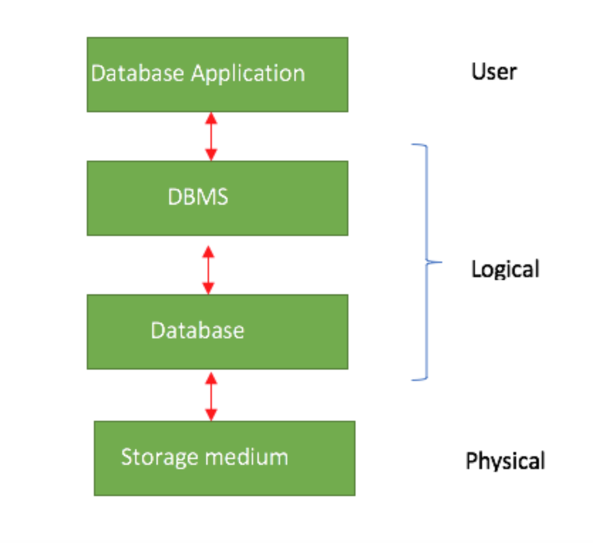
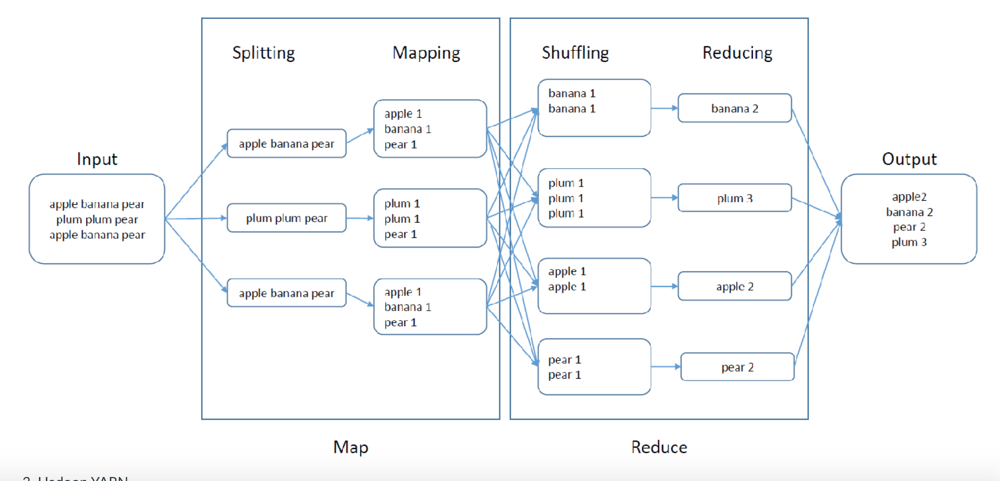

#### Main Topics

After completing this week you should be able to:

* Explain the models of databases for Big Data
* Explain how Big Data causes problems for analytics
* Explain how SQL databases can help represent a wide variety of data
* Explain how distributed computation approaches such as Hadoop can allow computation on huge volumes of data

After completing this week, you will have made significant steps towards achieving the following module learning
outcomes:

* MO4 Analyse and communicate issues with scaling up to large data sets, and use appropriate techniques to scale up the
  computation

#### Sub titles:

* [Constructing and querying a simple database](#constructing-and-querying-a-simple-database)

# Constructing and querying a simple database

* Data Description Language (DDL) is to design an instance in database (create table)
* Data Manipulation Language (DML) is using to manipulate the data.
* Qtructured Query Language (SQL) is the language used for both database definition and data manipulation in a
  relational database

* Database Table Creation is making with CREATE SQL command
    * For each table, we need to specify : The table name , attribute names ,attribute types ,primary key , any foreign
      key

```sql 
CREATE TABLE 'schooldata'.'STUDENT' (
'studentId' INT NOT NULL,
'firstName' VARCHAR(45) NULL,
'lastName' VARCHAR(45) NULL,
'Gender' VARCHAR(1) NULL,
'Dob' VARCHAR(20) NULL,
'auth' VARCHAR(45) NULL, PRIMARY KEY ('studentId'));

```

* To manipulate data

```sql
INSERT INTO STUDENT
VALUES (‘00001’, ’SAM’, ’Williams’, ’m’, 1979 / 5 / 9’, ‘Herts’)
```

# Next generation of databases

* In relational data model ‘relational model’, the database is structured as a set of tables. Within each table, each
  row corresponds to a record about some entity, and the columns in the table correspond to attributes of those
  entities. Each entity is defined by the set of attributes that it has.

* ‘NoSQL’ database technologies that are NOT built on the relational model.
* Scalability
    * RDBMS =>  With a traditional RDBMS we can try to scale up the system by adding more memory, a faster CPU and so
      on, referred to as ‘vertical scaling’, but there are limits to how far this can go

    * NoSQL => typically we aim to scale ‘horizontally’ — that is, we start distributing the work over several servers
      in a cluster, and scale up by adding servers.

* The data structures used in NoSQL databases are also typically more able to cope with data that doesn’t fit neatly
  into tables of records, such as documents, graphs or key-value pairs, making it easier to collect and process large
  volumes of unstructured data.

* Database Management Systems (DBMS) is the software that manages all the data which is stored in the secondary storage.
  </br>

# Big Data and the problems for analytics

* ‘Big data is data that contains greater variety arriving in increasing volumes and with ever-higher velocity.’ -
  Gartner’s definition, from 2001

* The problems:
    * The physical limits of our computer – if the data is too large to fit into the memory we have, will our approach
      to the problem still work?
    * The computational complexity of our algorithm – as the volume of our data increases, does the time taken increase
      more quickly so a solution becomes impossible in a reasonable time?
    * The structure of our computer – is it designed to to be efficient in handling big data, where we will spend much
      more time moving data around than processing it?

## 5V of Big Data

* 5V properties: **Volume, Velocity, Variety** that constitute native/original Big Data properties, and **Value** and **
  Veracity** as acquired as a result of data initial classification and processing in the context of a specific process
  or model. (Volume, Velocity,Variety are original Big Data 3V, then Veracity and Value added)
    * **Volume** The amount of data matters. With big data, you’ll have to process high volumes of low-density,
      unstructured data. This can be data of unknown value, such as Twitter data feeds, clickstreams on a web page or a
      mobile app, or sensor-enabled equipment. For some organizations, this might be tens of terabytes of data. For
      others, it may be hundreds of petabytes.
    * **Velocity** is the fast rate at which data is received and (perhaps) acted on. Normally, the highest velocity of
      data streams directly into memory versus being written to disk. Some internet-enabled smart products operate in
      real time or near real time and will require real-time evaluation and action.
    * **Variety** refers to the many types of data that are available. Traditional data types were structured and fit
      neatly in a relational database. With the rise of big data, data comes in new unstructured data types.
      Unstructured and semistructured data types, such as text, audio, and video, require additional preprocessing to
      derive meaning and support metadata.
    * **Value** Data has intrinsic value. But it’s of no use until that value is discovered.
    * **Veracity**  Equally important: How truthful is your data—and how much can you rely on it?

# Hadoop and distributed computation

* Hadoop is an open-source software framework
* Hadoop **provides massive storage for any kind of data**
    * Enormous processing power and the ability to handle a vast number of concurrent tasks or jobs.

* Hadoop is **not** a database system
    * But supports: the distributed storage, distributed processing, and job control

## Hadoop components

* Hadoop consists of three core components
    * a distributed file system so that data is spread across a number of servers
    * a parallel programming framework, so that computation is spread across a number of servers
    * a resource management system to coordinate the distribution of data and computation.

### Hadoop Distributed File System (HDFS)

* Hadoop is based on an open-source implementation of a clustered file system called HDFS.
    * The design of HDFS supports scalable, reliable, and cost-efficient distributed computing

* HDFS stores data files without prescribing the format, so any data in any format could be stored.
    * To give reliability and tolerance to hardware failure, multiple copies of the data are replicated across the
      cluster. The hardware itself can be standard server hardware, making implmentation cost effective.

## Hadoop MapReduce

* MapReduce’ is the programming model used within Hadoop to distribute processing of very large amounts of data.
* The processing of data is in two phases.
    * The ‘Map’ phase takes the data to be processed and splits it into small parts that can be processed quickly.
    * The results from processing these small parts are them brought together in the ‘Reduce’ phase – reducing the
      partial results down to a single combined result

</br>

## Hadoop YARN (Yet Another Resource Negotiator)

* Handles resource management and job
* YARN is responsible for allocating system resources to the various applications running in a Hadoop cluster and
  scheduling tasks to be executed on different cluster nodes.

## When to use Hadoop (and when not to!)

* When to use Hadoop
  *Large scale data processing.
  *If you have terabytes of data, then Hadoop may be a good solution for you.

    * Storing diverse data
        * Hadoop can store and process any kind of file data, so you do not need to transform your data into a
          particular form to store it in HDFS in order to then process it.

    * Parallel data processing
        * Hadoop uses the MapReduce approach to parallelize data processing. MapReduce works very well in situations
          where variables are processed one by one (e.g., counting or aggregation)


* When NOT to use Hadoop
    * Real-Time Data Analysis
        * Hadoop as originally implemented is oriented around batch processing, running long jobs over large data sets.
          For really big datasets, where you need to look at all your data, this can mean processing times in hours or
          days.
    * Smaller datasets
        * There is an overhead in using Hadoop. If you have small datasets, you are probably not going to find it
          cost-effective to use Hadoop. A more conventional RDBMS, or one of the NoSQL solutions, might be more
          appropriate.
    * Complex data
        * While Hadoop can handle data stored in many different forms, if the relationships in the data that you are
          interested in are complex (for example graph structures) then Hadoop’s approach to processing the data might
          not be the best fit.

# Different types of databases

* **Key-Value databases:** Key-value databases, or key-value stores, are an extreme form of database. The data to be
  stored could be anything, for example, a text file or image – it is treated as a ‘blob’ of data. The data is accessed
  through a key associated with it. To store a piece of data, the database forms an association between the key and the
  blob of data you wish to save. To retrieve data, you provide the key and the database returns the associated blob of
  data.

* **Document databases:** Document databases, or document stores, share the basic access and retrieval semantics of
  key-value stores, that is, they also use a unique key associated with a particular piece of data. **The main
  difference** is that instead of storing arbitrary blobs of data, document databases store data in structured formats
  called documents. XML, JSON (Java Script Object Notation) and BSON (which is a binary encoding of JSON objects) are
  some common standard encodings.

* **Graph databases:** Graph databases take a different approach to establishing relationships between data. Where the
  relational model uses tables with foreign keys to represent relationships between objects of different types, graph
  databases establish connections using the concepts of nodes, edges, and properties. Graph databases represent a piece
  of data as an individual node, which may have a number of properties. Between the nodes, edges are established to
  represent different types of relationships. In this way, graph databases allow representation of complex, hierarchical
  or network structures that may be difficult to model in a relational system.

## Big Data Architectures – NoSQL Use Cases for Key Value Databases

* [Big Data Architectures – NoSQL Use Cases for Key Value Databases](https://infocus.delltechnologies.com/april_reeve/big-data-architectures-nosql-use-cases-for-key-value-databases/)
* **NoSQL** data stores usually have a concept of “eventual consistency,” which means that all the redundancy and high
  availability is there but synchronicity may not be achieved immediately but eventually. A little data might be lost on
  rare occasions. Deal with it. If you have an application where a little data can never be lost, then don’t use a NoSQL
  database and be prepared to invest in appropriate recovery and high availability solutions.

* **Key value databases** are EXTREMELY simple databases.
    * There is a key and there is the rest of the data (the values) and that’s it.
    * You can find the value data based on searching the key field. There are no alternate keys and no foreign keys and
      no broad text searching capabilities against the values. If you want those things then you have to create them and
      it involves redundancy.
    * It is FAST. They are a lot faster than relational databases.
        * And they can scale: they can grow in size by hundreds and thousands of times without significant redesign. The
          growth in price is linear with the growth in size. It is very hard to scale relational database solutions
          quickly and the price curve is usually not linear but geometrical.

* Relational databases struggle with handling magnitude changes in volume quickly  (number of records stored) and with
  handling high volumes of transactions simultaneously (thousands or millions of state changes per second).
    * Key value NoSQL databases can handle magnitude scaling of number of records and extremely high volumes of state
      changes per second with millions of simultaneous users through distributed processing and distributed storage.
    * Key value NoSQL databases also have built in redundancy which can handle the loss of storage nodes without losing
      the whole application

* Example key value databases include Riak, Redis, Memcached, Berkeley DB, Hamster DB, Amazon Dynamo DB.

## How Can Graph Analytics Uncover Valuable Insights About Data?

* [How Can Graph Analytics Uncover Valuable Insights About Data?](https://infocus.delltechnologies.com/william_schmarzo/how-can-graph-analytics-uncover-valuable-insights-about-data/)
* Use Cases:
    * In computer science, graphs are used to represent networks of communication, data organization, computational
      devices, the flow of computation, etc
        * For instance, the link structure of a website can be represented by a directed graph, in which the vertices
          represent web pages and directed edges represent links from one page to another.
    * Graph-theoretic methods have proven useful in linguistics, since natural language often lends itself well to
      discrete structure
        * Traditionally, syntax and compositional semantics follow tree-based structures, whose expressive power lies in
          the principle of compositionality, modeled in a hierarchical graph.
    * Graph theory is used in sociology as a way,
        * or example, to measure actors’ prestige or to explore rumor spreading, notably through the use of social
          network analysis software.
    * In the world of intelligence, numerous government agencies are interested in identifying threats through the
      detection of non-obvious patterns of relationships and group communications buried in social media, email, texting
      and call detail records.
    * In life sciences, organizations can use graph analytics to conduct research in healthcare fraud for healthcare
      payers.
        * In addition to the healthcare fraud detection program, other potential graph analytics use cases include
          healthcare treatment efficacy and outcome analysis, analyzing drugs and side effects, and the analysis of
          proteins and gene pathways.
    * In the area of personalized healthcare, a startup called Lumiata wants to scale personalized medicine by
      leveraging machine learning and graphic analytics to help doctors to focus on more urgent care needs and empower
      nurses to carry more of the diagnostic chores
    * Graph Analytics can be used to address relationship-based problems in manufacturing, energy, gas exploration,
      travel, biology, conservation, computer chip design, chemistry, physics, higher education research, government,
      security, defense and many other fields.

* Advantages:
    * A key advantage of graphs is the ease with which new sources of data and new relationships can be added. Graph
      databases using Resource Description Framework (RDF) to represent the graph can easily merge and unify diverse
      datasets without significant upfront investment in data modeling.
    * The ability to quickly and easily add new data sources or new relationships within the data when needed to support
      a new line of questioning is crucial for discovery, and graphs are uniquely well qualified to support these
      requirements.

    * Graph analytics also offer sophisticated capabilities for analyzing relationships,
        * Centrality analysis: To identify the most central entities in your network, a very useful capability for
          influencer marketing.
        * Path analysis: To identify all the connections between a pair of entities, useful in understanding risks and
          exposure.
        * Community detection: To identify clusters or communities, which is of great importance to understanding issues
          in sociology and biology.
        * Sub-graph isomorphism: To search for a pattern of relationships, useful for validating hypotheses and
          searching for abnormal situations, such as hacker attacks.

* Graph analytics provide another arrow in our quiver – another tool that we can use against these vast amounts of
  social media and sensor-based data to uncover new insights about the relationships between our customers, products,
  and operations.
* Graph analytics allows us to get new, more actionable, more relevant answers to many of our traditional questions (Who
  are our most important customers? What are our most important products?), as well as answer completely new questions (
  Who are our most influential customers? Where are our largest networking or operational security risks?)

## Graph Databases for Beginners: ACID vs. BASE Explained

* [Graph Databases for Beginners: ACID vs. BASE Explained](https://neo4j.com/blog/acid-vs-base-consistency-models-explained/)
* The two most common consistency models are known by the acronyms ACID and BASE
* The key ACID guarantee is that it provides a safe environment in which to operate on your data.

* In the NoSQL database world, ACID transactions are less fashionable as some databases have loosened the requirements
  for immediate consistency, data freshness and accuracy in order to gain other benefits, like scale and resilience.

* Difference BASE and ACID
    * A BASE data store values availability (since that’s important for scale), but it doesn’t offer guaranteed
      consistency of replicated data at write time. Overall, the BASE consistency model provides a less strict assurance
      than ACID: data will be consistent in the future, either at read time (e.g., Riak) or it will always be
      consistent, but only for certain processed past snapshots (e.g., Datomic).

# ACID vs BASE consistency models

* One very important feature of a database is that the data it contains should be correct.
* ACID Consistency Model,
    * Atomic : All operations that make up a transaction succeed or every operation is rolled back to the initial
      consistent state of the database. Consistent : On the completion of a transaction, all users see the same updated
      data. Isolated :Transactions do not contend with one another to modify data. Contentious access to data is
      moderated by the database so that transactions appear to run sequentially. Durable : The results of applying a
      transaction are permanent, even in the presence of failures.
* BASE Consistency Model
    * Basic Availability :The database appears to work most of the time.
    * Soft-state:  When the database is updated, it may be inconsistent for some period of time.
    * Eventual consistency: Stores exhibit consistency at some later point (e.g., lazily at read time).

* These BASE properties are more relaxed than we might want from a banking system, for example, but when we are
  interested more in what we can get from the data, and in the availability of the database, then BASE might be an
  acceptable approach.
    * The BASE consistency model is primarily used by NoSQL databases such as key-value and document stores.