## MSC Computer And Mobile Network Lesson Notes

This module is for MSC Computer and Mobile Networks lesson notes.

## Overview

- [Week-1 - Introduction](#week-1)
- [Week-2 - Application layer](#week-2)
- [Week-3 - Transport Layer](#week-3)
- [Week-4 - Network Layer](#week-4)
- [Week-5 - Link Layer](#week-5)
- [Week-6 - Mobile and Satellite](#week-6)
- [Week-7 - Security And Cryptography](#week-7)
- [Books](/computer-and-mobile-networks/Books.md)

# WEEK 1

#### Main Topics

* Explain and demonstrate the fundamental concepts and components used to describe networks.
* Compare the theoretical ISO/OSI network stack with the TCP/IP implementation.
* Discuss the benefits and limitations of packet switching over circuit switching.

#### Sub titles:

* [Network Components](#network-components)
    * [Network Design](#network-design)
    * [The Network Edge](#the-network-edge)
        * [Access Networks](#access-networks)
            * [Home Access](#home-access)
            * [Ethernet and WIFI](#ethernet-and-wifi)
            * [3G and LTE](#3g-and-lte)
        * [Physical Media](#physical-media)
* [Protocol](#protocol)
    * [Protocol layering](#protocol-layering)
    * [ISO/OSI model](#isoosi-model)
    * [Encapsulation](#encapsulation)
* [Packet and Circuit switching](#packet-and-circuit-switching)
* [Measuring a Network](#measuring-a-network)

# Network components

* This will be about protocols that allows to communication across various medium.
* **Open System Interchange model (OSI Model)**, which is a reference (theoritical model) for all rules that apply for
  every device and every piece of software has in place to communicate.
* We have 7 layers
    * At the top layer 7, is very much nearer to the human being
    * Layer 1 is showing electricity across cables or wireless devices.

* **MAC address** - that's Media Access Control.
    * MAC address is something that's hardwired into your device by the manufacture
    * Can not be cloned and it is unique.
        * The only time you can sort of clone them is when you do a virtual network and you have to spoof MAC addresses

* **Bridge** used to be a quite clunky hardware device that allowed two sections of a sub-network to talk to each other.
  And we don't really use them anymore because they've been replaced by switches.

* **Routers**: router sits quite high up in the stack and it's got lots of intelligence, it’s got lots of tasks
    * Uses IP Addresses
    * Broadcast the LAN segment only
    * Decides which routers to send data
    * Other roles: DHCP, DNS, Firewall, IP Leasing,
    * Can use MAC addresses
    * Can repeat the signal - backward capability


</br>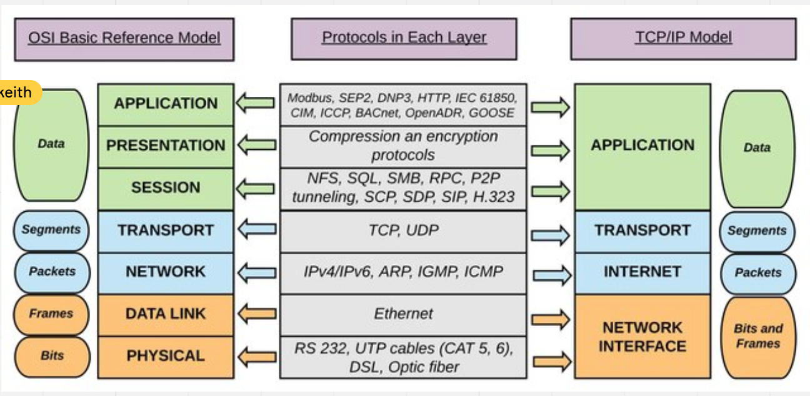
</br>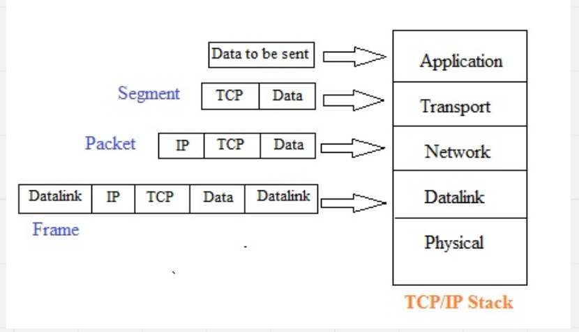

* Layer 1 is the physical layer, so it's just about some copper inside some cable, shoving electrical pulses down.
    * there's no intelligence, it just repeats and re-amplifies, or doesn't send the signal on as it goes,
    * the higher up the stack you go, the nearer to the human you go.

* OSI vs TCP Model:


* Diagram of two computers, one labelled “Source” and the other “Destination”, with a Link-layer switch and router in
  the middle


## Network Design

* At the basic level network consist 2 design
    * Physical
    * Logical

* The **Physical design** consist of all the physical devices and technology that communicate and can include:
    * The layout of devices and connections called Topology
        * Most commons: star, peer-to-peer, extended star, bus and mesh
    * End devices form the interface between the human and the network
        * these can include clients (nodes, PC’s etc) servers, file stores, printers etc
    * Intermediary devices that provide connectivity
        * switch, hub, router etc
    * Network media - the channel over which a message or data travels
        * ethernet, wireless, fibre etc

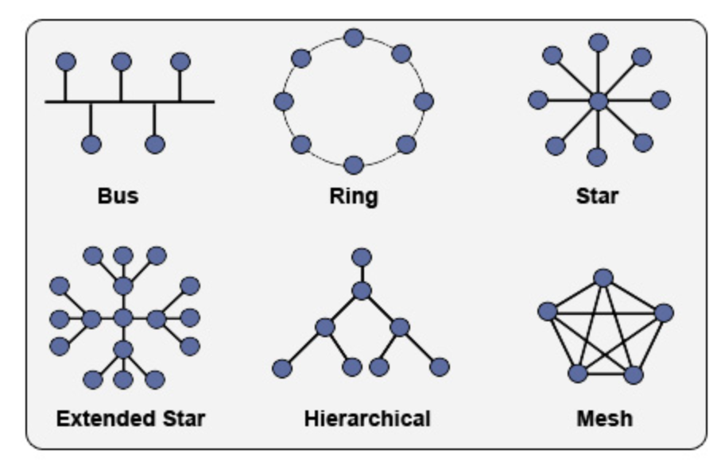

* Cisco icons are widely used and recognised in documentation


* The **logical design** is the configuration of the devices, the IP addressing scheme, the bandwidth and the protocols
* The logical design is not technology dependent and can include:
    * Protocols – set of rules to guide a communication
    * TCP and OSI models – layer models
    * IP addressing
    * Network addressing
    * Routing

* Types of devices to facilitate home access to the internet
    * **DSL** - Digital Subscriber Line – allows fast data transmission over copper telephone lines that are analogue or
      use
    * **ADSL** - Asymmetric Digital Subscriber Line - downstream is faster than upstream
    * **MODEM** - Modulator-Demodulator, uses a telephone line to create an analogue connection to a remote server.
* Types of media to transmit information between network devices
    * **TWISTED-PAIR** - insulated pairs of wires, can be shielded (STP) or unshielded (UTP), Cat5e, Cat6, Cat7.
      Traditionally used in telephone systems, where one wire carried the signal and the other grounded and absorbed
      signal interference. Network cables have four sets of wires which are paired by coloured sleeves; wires 2 and 6
      are used to send and receive data. The wires are twisted because when electromagnetic signals are conducted on
      copper wires in close proximity it causes crosstalk. Twisting the wires minimises the interference.
    * **FIBRE OPTICS** - single mode fibre (SMF) or multi-mode fibre (MMF). MMF used for shorter distances. Consists of
      thin strands of glass or plastic bound together in a sheath which transmits signals with light beams. Used for
      voice, data, or video. Expensive, great bandwidth, less susceptible to interference, thinner and lighter than
      other wires, transmits digital data. Difficult to install, expensive and harder to troubleshoot. Does not suffer
      from electrical interference.
    * **SATELLITE** - relay stations that receive signals from one earth station and rebroadcast them to another. Two
      types
        - geostationary and low earth orbiting.
    * **WIRELESS** - IEEE 802.11 WLAN standard, use access control devices such as router, devices can roam using
      signal, WiFi = Wireless Fidelity. Supports lower data rates than wired networks and can be susceptible to
      interference, e.g. weather, aircraft, microwave ovens.

* Type of devices for a core network infrastructure manage network traffic
    * **ROUTER** - Directs and forwards traffic between parts of a network. Maintains a routing table to efficiently
      direct packets from one node to another.
    * **SWITCH** - Interconnection device, reads data messages and sends to the correct port that the address is on, can
      reduce traffic on a network, has port intelligence and bandwidth allocation. Can be considered a multiport bridge.
    * **BRIDGE** - Used to connect two networks or segments together into a single aggregate network. Uses MAC
      addresses, can connect to different technologies, e.g. coaxial to Ethernet.
    * **GATEWAY** - Used to connect different, discrete, networks.
    * **HUB** - A dumb device that re-boosts signal and broadcasts from all ports. No intelligence, can amplify signals
      but shares bandwidth between all ports. Can be considered a multiport repeater.

## The Network Edge

* the computers and other devices connected to the Internet are often referred to as end systems.
    * End systems are also referred to as hosts because they host (that is, run) application programs such as a Web
      browser program
* **Hosts** are sometimes further divided into two categories: **clients** and **servers**.

### Access Networks

#### Home Access:

* Today, the two most prevalent types of broadband residential access are digital subscriber line (DSL) and cable.
* A residence typically obtains **DSL Internet access** from the same local telephone company (telco) that provides its
  wired local phone access.
    * when DSL is used, a customer’s telco is also its ISP (Internet Service Provider)
    * DSL modem uses the existing telephone line (twisted-pair copper wire)  to exchange data with a digital subscriber
      line access multiplexer (DSLAM) located in the telco’s local central office (CO).
    * The home’s DSL modem takes digital data and translates it to high- frequency tones for transmission over telephone
      wires to the CO; the analog signals from many such houses are translated back into digital format at the DSLAM.
    * On the customer side, a splitter separates the data and telephone signals arriving to the home and forwards the
      data signal to the DSL modem. On the telco side, in the CO, the DSLAM separates the data and phone signals and
      sends the data into the Internet. Hundreds or even thousands of households connect to a single DSLAM
    * The maximum rate is also limited by the distance between the home and the CO, the gauge of the twisted-pair line
      and the degree of electrical interference.
      </br>

* **Cable Internet access** makes use of the cable television company’s existing cable television infrastructure.
    * A residence obtains cable Internet access from the same company that provides its cable television
    * Fiber optics connect the cable head end to neighborhood-level junctions, from which traditional coaxial cable is
      then used to reach individual houses and apartments
    * Because both fiber and coaxial cable are employed in this system, it is often referred to as hybrid fiber coax (
      HFC).
    * Cable Internet access requires special modems, called cable modems. As with a DSL modem, the cable modem is
      typically an external device and connects to the home PC through an Ethernet port
    * At the cable head end, the cable modem termination system (CMTS) serves a similar function as the DSL network’s
      DSLAM —turning the analog signal sent from the cable modems in many downstream homes back into digital format.
    * One important characteristic of cable Internet access is that it is a shared broadcast medium. In particular,
      every packet sent by the head end travels downstream on every link to every home and every packet sent by a home
      travels on the upstream channel to the head end.
        * For this reason, if several users are simultaneously downloading a video file on the downstream channel, the
          actual rate at which each user receives its video file will be significantly lower than the aggregate cable
          down- stream rate
          </br>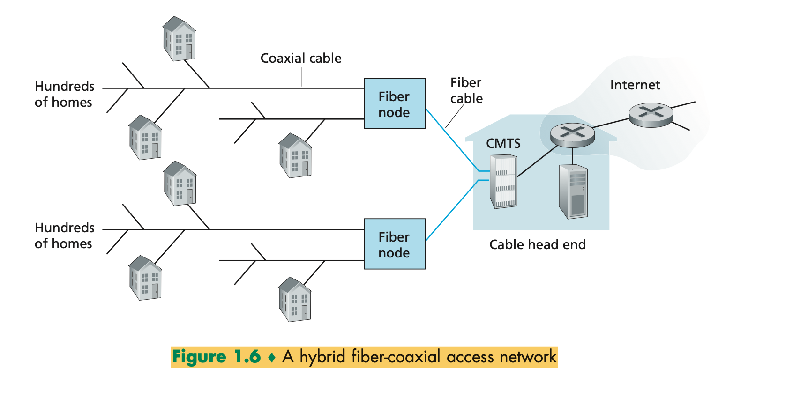

* **Fiber to the home (FTTH)** provides much higher speed
    * As the name suggests, the FTTH concept is simple—provide an optical fiber path from the CO directly to the home.
    * The simplest optical distribution network is called direct fiber, with one fiber leaving the CO for each home.
    * More commonly, each fiber leaving the central office is actually shared by many homes; it is not until the fiber
      gets relatively close to the homes that it is split into individual customer-specific fibers.
    * There are two competing optical-distribution network architectures that perform this split- ting: active optical
      networks (AONs) and passive optical networks (PONs).
        * AON is essentially switched Ethernet,

    * PON distribution architecture. Each home has an optical network terminator (ONT), which is connected by dedicated
      optical fiber to a neighborhood splitter
        * The splitter combines a number of homes onto a single, shared optical fiber, which connects to an optical line
          terminator (OLT) in the telco’s CO.
        * The OLT, providing conversion between optical and electrical signals, connects to the Internet via a telco
          router.
        * In the home, users connect a home router (typically a wireless router) to the ONT and access the Internet via
          this home router.
        * In the PON architecture, all packets sent from OLT to the splitter are replicated at the splitter (similar to
          a cable head end).  
          </br>

* **A satellite link** can be used to connect a residence to the Internet.
    * StarBand and HughesNet are two such satellite access providers

#### Ethernet and WIFI

* On corporate and university campuses, and increasingly in home settings, a local area network (LAN) is used to connect
  an end system to the edge router.
* Although there are many types of LAN technologies, Ethernet is by far the most prevalent access technology in
  corporate, university, and home networks.
* Ethernet users use twisted-pair copper wire to connect to an Ethernet switch,
* The Ethernet switch, or a network of such interconnected switches, is then in turn connected into the larger Internet.
  </br>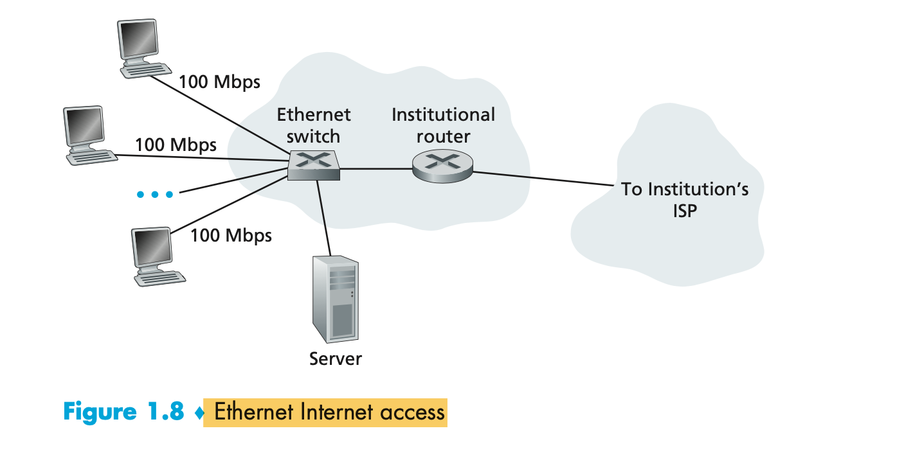

* In a wireless LAN setting, wireless users transmit/receive packets to/from an access point that is connected into the
  enterprise’s network (most likely using wired Ethernet), which in turn is connected to the wired Internet.
* A wireless LAN user must typically be within a few tens of meters of the access point.
* Wireless LAN access based on IEEE 802.11 technology, more colloquially known as WiFi
* a cable modem, providing broadband access to the Internet; and a router, which interconnects the base station and the
  stationary PC with the cable modem.   
  </br>

#### 3G and LTE

* Telecommunications companies have made enormous investments in so-called third-generation (3G) wireless, which
  provides packet-switched wide-area wire- less Internet access at speeds in excess of 1 Mbps.
    * But even higher-speed wide-area access technologies—a fourth-generation (4G) of wide-area wireless networks—are
      already being deployed.
    * LTE (for “Long-Term Evolution”) has its roots in 3G technology, and can achieve rates in excess of 10 Mbps.

### Physical Media

* when traveling from source to destination, passes through a series of transmitter-receiver pairs.
    * For each transmitter- receiver pair, the bit is sent by propagating electromagnetic waves or optical pulses across
      a **physical medium**.
        * Examples of physical media include twisted-pair copper wire, coaxial cable, multi mode fiber-optic cable,
          terrestrial radio spectrum, and satellite radio spectrum.
    * Physical media fall into two categories: guided media and unguided media.
        * Guided media, the waves are guided along a solid medium, such as a fiber-optic cable, a twisted-pair cop- per
          wire, or a coaxial cable.
        * Unguided media, the waves propagate in the atmosphere and in outer space, such as in a wireless LAN or a
          digital satellite channel.

* Twisted-Pair Copper Wire
    * The least expensive and most commonly used guided transmission medium is twisted- pair copper wire.
    * Twisted pair consists of two insulated copper wires, each about 1 mm thick, arranged in a regular spiral pattern
    * The wires are twisted together to reduce the electrical inter- ference from similar pairs close by
    * Typically, a number of pairs are bundled together in a cable by wrapping the pairs in a protective shield
    * Unshielded twisted pair (UTP) is commonly used for computer networks within a building, that is, for LANs.

* Coaxial Cable
    * Like twisted pair, coaxial cable consists of two copper conductors, but the two conductors are concentric rather
      than parallel
    * With this construction and special insulation and shielding, coaxial cable can achieve high data transmission
      rates.
    * Coaxial cable is quite common in cable television systems.
    * Coaxial cable can be used as a guided shared medium

* Fiber Optics
    * An optical fiber is a thin, flexible medium that conducts pulses of light, with each pulse representing a bit.
    * A single optical fiber can support tremendous bit rates, up to tens or even hundreds of gigabits per second.
    * They are immune to electromagnetic interference, have very low signal attenuation up to 100 kilometers, and are
      very hard to tap.
    * These characteristics have made fiber optics the preferred long-haul guided transmission media, particularly for
      overseas links

* Terrestrial Radio Channels
    * Radio channels carry signals in the electromagnetic spectrum.
    * They are an attractive medium because they require no physical wire to be installed, can penetrate walls, provide
      connectivity to a mobile user, and can potentially carry a signal for long distances
    * Terrestrial radio channels can be broadly classified into three groups:
        * operate over very short distance (e.g., with one or two meters);
        * operate in local areas, typically spanning from ten to a few hundred meters;
        * operate in the wide area, spanning tens of kilometers.

* Satellite Radio Channels
    * A communication satellite links two or more Earth-based microwave transmitter/ receivers, known as ground
      stations.
    * Two types of satellites are used in communications: geostationary satellites and low-earth orbiting (LEO)
      satellites
        * Geostationary satellites permanently remain above the same spot on Earth. This stationary presence is achieved
          by placing the satellite in orbit at 36,000 kilometers above Earth’s surface.
        * LEO satellites are placed much closer to Earth and do not remain permanently above one spot on Earth. They
          rotate around Earth (just as the Moon does) and may communicate with each other, as well as with ground
          stations.

# Protocol

* Communication between devices on a network is organised and made consistent by protocols. A protocol is an agreed set
  of actions in response to given situations.
* In computing, protocols are there to ensure that data transfer can happen regardless of the transmission media or the
  connected devices.
    * It can be thought of as ensuring that all networked devices (at the core or on the edge) speak the same language
      and consistent responses are given to specific requests.
* Protocols the rules that govern a communication between devices and rules can vary depending on protocol.
    * They’re necessary, because if you didn't have protocols in place, different equipment would try and transmit
      different types of data, different shapes of data.
    * So something needs to coexist so that everything can communicate in the same format.

* A group of protocols together is a **“protocol suite”** and they vary at the different layers of the OSI and the
  TCP/IP model,
* Communications are governed by protocols.
* Message Encoding
    * Encoding is the process of converting information into another acceptable form for transmission.
    * Decoding reverses this process to interpret the information
    * A piece of data goes to be transmitted across the network and it gets changed for a human format into the
      electrical signals.
      </br>

* The Rules:
    * Message encoding
    * Messaging format and encapsulation
    * Message size
    * Message Timing
    * Message Delivery Options

* Message Delivery Options:
    * Unicast - one to one
    * Multicast - one to multi
    * Broadcast - one to all

</br>

## Protocol layering

* Protocol layering has conceptual and structural advantages [RFC 3439]. As we have seen, layering provides a structured
  way to discuss system components. Modularity makes it easier to update system components.
  </br>

* The Internet protocol (IP) suite, which is used for transmitting data over the Internet, contains dozens of protocols.
    * Link layer - PPP, DSL, Wi-Fi, Ethernet;
        * Link layer protocols establish communication between devices at a hardware level. In order to transmit data
          from one device to another, each device's hardware must support the same link layer protocol
        * data transfer between neighboring network elements
    * Internet layer - IPv4, IPv6;
        * Internet layer protocols are used to initiate data transfers and route them over the Internet
        * routing of datagrams from source to destination
    * Transport layer - TCP, UDP;
        * Transport layer protocols define how packets are sent, received, and confirmed.
        * process-process data transfer
    * Application layer - HTTP, IMAP, FTP.
        * Application layer protocols contain commands for specific applications.
        * supporting network applications
    * Physical layer :
        * bits “on the wire”

</br>

* Application Layer
    * The application layer is where network applications and their application-layer protocols reside
    * The Internet’s application layer includes many protocols, such as the HTTP protocol (which provides for Web
      document request and transfer), SMTP (which provides for the transfer of e-mail messages), and FTP (which provides
      for the transfer of files between two end systems).
* Transport Layer
    * The Internet’s transport layer transports application-layer messages between application endpoints.
    * In the Internet there are two transport protocols, TCP and UDP, either of which can transport application-layer
      messages.
        * TCP provides a connection-oriented service to its applications. This service includes guaranteed delivery of
          application-layer messages to the destination and flow control (that is, sender/receiver speed matching). *
          TCP also breaks long messages into shorter segments and provides a congestion-control mechanism, so that a
          source throttles its transmission rate when the network is congested.
        * The UDP protocol provides a connectionless service to its applications. This is a no-frills service that
          provides no reliability, no flow control, and no congestion control.
        * transport-layer packet as a segment.
* Network Layer
    * The Internet’s network layer is responsible for moving network-layer packets known as datagrams from one host to
      another.
    * The network layer then provides the service of delivering the segment to the transport layer in the destination
      host.
    * The Internet’s network layer includes the celebrated IP protocol, which defines the fields in the datagram as well
      as how the end systems and routers act on these fields.
* Link Layer
    * To move a packet from one node (host or router) to the next node in the route, the network layer relies on the
      services of the link layer
    * In particular, at each node, the network layer passes the datagram down to the link layer, which delivers the
      datagram to the next node along the route.
    * the link- layer packets named as frames.
* Physical Layer
    * Physical layer is to move the individual bits within the frame from one node to the next.
    * The protocols in this layer are again link dependent and further depend on the actual transmission medium of the
      link (for example, twisted-pair copper wire, single-mode fiber optics).


* What if an application needs one of these services?
    * The Internet’s answer to both of these questions is the same—it’s up to the application developer. It’s up to the
      application developer to decide if a service is important, and if the ser- vice is important, it’s up to the
      application developer to build that functionality into the application.

## ISO/OSI model

* Open Systems Interconnection model (OSI model) was published as a conceptual model for network protocols and
  communications by ISO (International Standards Organisation).

* OSI has 7 layers and differences with TCP/IP layers
  </br>

* The Network layer and Presentation layer are both concerned with transporting data from end to end but the network
  layer will deliver data individually meaning it will have no relation to anything accompanying it.
* The transport layer takes the whole message as one big data packet
    * Transfer layer manages the reliable transfer of data from host to host
    * responsible for sending Acknowledgements of Successful data transfer.

## Encapsulation

</br>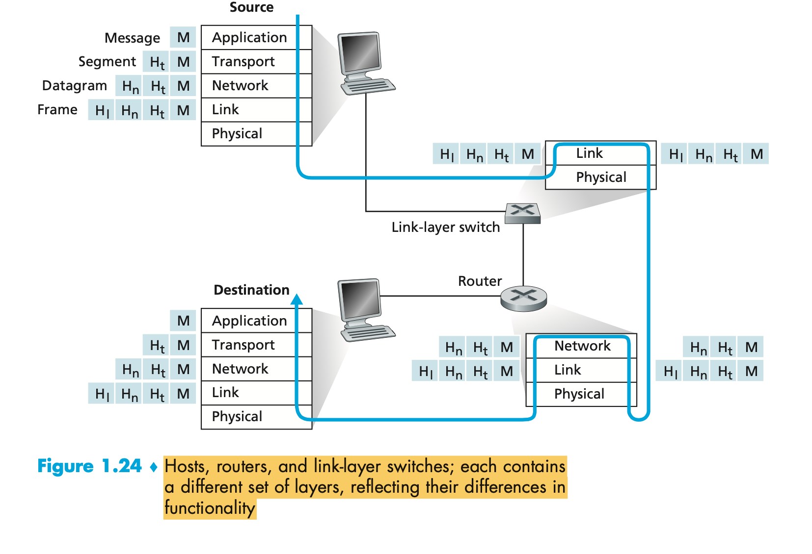

* Data generated by the user, such as a file or an email message, is referred to as user data.
    * This is usually generated within applications, not all of which have network access
    * User data is generated outside the networking model. However, when user data is to be sent across a network, it is
      often split up into smaller chunks and then wrapped by headers that provide network devices with information about
      where the data has come from, where it is going, what type of information it is and what protocols have been
      applied to it.
    * At each layer of the network stack, in this case TCP/IP, a header is added as the data is passed from layer to
      layer.
    * These encapsulated chunks of data are known as 'packets', which are transmitted across the network
    * At the receiving end, each header is stripped off as it passes back up the stack, and the information they contain
      is acted on at each layer of the stack
* The packets that are sent across a network have a very particular structure in regard to how the headers are arranged
  and what information they hold, as well as the size of the payload (user data) they can hold.

# Packet and Circuit switching

* A packet traverses a network it does not necessarily travel across a single direct line/cable.
    * Depending on its destination, it may need to travel across other networks and devices.
    * Some of these devices are responsible for routing the packets so they get to their destination, and are referred
      to as packet switches.

* Data transmitted across a packet-switched network uses a technique called store-and-forward transmission to ensure
  that whole packets are received completely before they are sent/forwarded to their next destination.
    * To achieve this, the device the packet is sent to has an output buffer, also known as an output queue.
    * Packets are stored in this buffer as they arrive.
    * When there is a lot of network traffic at a device, this buffer may be holding more than one packet.
    * Inbound packets may be arriving faster than outbound ones are leaving, thereby generating a queue in the buffer
      and causing queuing delays.
    * If the buffer does not have enough space to store an incoming packet it may be dropped, resulting in packet loss.
    * Some devices will drop packets already in the buffer to make room for inbound packets.

* All packets have a sender and receiver and, the aim is for the message to get to the receiver
    * In the Internet, every end system has an address called an IP address. When a source end system wants to send a
      packet to a destination end system, the source includes the destination’s IP address in the packet’s header.
    * To continue packet switches need some way to determine where next to send incoming packets.
    * There are two mechanisms for this: **forwarding tables** and **routing protocols**.
        * When a packet arrives at a packet switch it will read part of the packet contents to determine its IP address.
          It will then use this to map against internal information, a forwarding table, to determine where best to send
          it next. The forwarding table holds information that maps the packet switch’s outbound links (of which there
          may be many) to the address, or parts of the address.
        * Network system can change second by second. Given this rate of change, forwarding tables can soon become
          out-of-date, or may not provide the most effective next destination. So this information needs to be changed.
          they are kept up-to-date by the system itself through the use of routing protocols.
    * In a summary , each router has a forwarding table that maps destination addresses (or portions of the destination
      addresses) to that router’s outbound links.
        * When a packet arrives at a router, the router examines the address and searches its forwarding table, using
          this destination address, to find the appropriate outbound link.
        * The router then directs the packet to this outbound link.

* Circuit Switching
    * In circuit-switched networks, the resources needed along a path (buffers, link transmission rate) to provide for
      communication between the end systems are reserved for the duration of the communication session between the end
      systems
    * A circuit established and maintained in circuit switching, it establishes a connection, transfers the data and
      then disconnects.
        * So the communication line is kept open for the duration of that transfer.
        * it's not overly efficient.


* Packet Vs Circuit swwitching
    * Adventage of package Switching over Circuit
        * packet switching is more efficient in terms of bandwidth
            * it has minimal transmission latency; it's more reliable as the destination can detect the missing packet
            * it's more fault-tolerant because the packets may follow different paths in case a link is down
            * it's cost effective.
    * Disadvantages of packet switching over Circuit
        * Package switching does not give an order to packages, but circuit does.
        * Since the packets are unordered, you need to provide sequence numbers to each of the packets, which obviously
          increases the size of the packet.
        * Complexity is more at each node because there is more information that the node has to examine in order to
          move it along.
        * Transmission delay is more likely because of rerouting of packets, and packet switching is beneficial only for
          small messages.
        * for large data, circuit switching is better.

# Measuring a Network

* Networks are measured using bits (for transfer speeds) and bytes (for capacity), and their effectiveness is determined
  by the flow of traffic. The measures that are important here are delay, loss, and throughput.
* One factor that most people are aware of is **bandwidth**, which is the transmission speed of the media being used.
    * bandwidth is purchased from an internet service provider (ISP), which usually has a number of different connection
      speeds available
* Three measures that are important to identifying particular network problems are:
    * Delay - where packets are delayed in their delivery for some reason;
    * Loss - where packets are lost, resulting in re-transmission or poor quality content at the user end;
    * Throughput - a measure of the time it takes to transmit a given amount of data between two endpoints.

* Four types of delays in packet switching
    * When everybody transmits packets at the same time, the data’s just going to collide and drop and it has to be
      re-transmitted. So a **transmission delay**, it's the time taken to actually put the bits onto the medium.
    * **Propagation delay** is the time taken to get to the destination from the sender.
    * **Queuing delay** is depending on how congested your network is and largely that is solved with switches, or
      caused by switches in some cases.
    * **Processing delay**, which is the time taken for the router to process the packet header and determine which
      route to send it on according to where it exists on the network.

# WEEK 2

#### Main Topics

* Application Layer
    * Identify and describe the application layer, and its protocols and services, with reference to the OSI/ISO model
      and TCP/IP;
    * Apply application and transport layer protocols in a simple program;
    * Identify and compare different applications layer protocols, such as mail protocols, HTTP, DNS, and FTP;
    * Explain the client/server architecture from the perspective of HTTP communications.

#### Sub titles:

* [Introduction to the reference model](#introduction-to-the-reference-model)
    * [Application Layer](#application-layer)
* [Application Architectures](#application-architectures)
    * [Client / Server](#client--server)
    * [Peer To Peer (P2P)](#peer-to-peer-p2p)
* [Application Services](#application-services)
* [Building Applications](#building-applications)
    * [TCP Services](#tcp-services)
        * [SECURING TCP](#securing-tcp)
    * [Socket Programming with UDP](#socket-programming-with-udp)
* [Mail Protocols](#mail-protocols)
    * [Simple Mail Transfer Protocol (SMTP)](#simple-mail-transfer-protocol-smtp)
    * [Mail Access Protocols](#mail-access-protocols)
        * [Post Office Protocol V3 (POP3)](#post-office-protocol-v3-pop3)
        * [Internet Mail Access Protocol (IMAP)](#internet-mail-access-protocol-imap)
        * [Web-Based Email (HTTP)](#web-based-email-http)
        * [MIME Type](#mime-type)
* [HTTP Protocol](#http-protocol)
    * [HTTP Communications](#http-communications)
    * [Non-Persistent Connections](#non-persistent-connections)
    * [Persistent Connections](#persistent-connections)
    * [HTTP response and request messages](#http-response-and-request-messages)
        * [HTTP Request](#http-request)
            * [Method Types](#method-types)
        * [HTTP Response](#http-response)
* [HTTP Inspection Tools in Google Chrome](#http-inspection-tools-in-google-chrome)
* [The Domain Name Service (DNS)](#the-domain-name-service-dns)
    * [Other DNS services](#other-dns-services)
    * [DNS: Critical Network Functions via The Client-Server Paradigm](#dns-critical-network-functions-via-the-client-server-paradigm)
    * [A Distributed, Hierarchical Database](#a-distributed-hierarchical-database)
    * [DNS Caching](#dns-caching)
    * [DNS Record](#dns-record)
    * [DNS Messages](#dns-messages)
    * [Inserting Records into the DNS Database](#inserting-records-into-the-dns-database)
    * [How DNS works?](#how-dns-works)
* [Quiz Questions](#quiz-questions)
* [TODO](#todo)

# Introduction to the reference model

## Application Layer

* The application layer is all about end-user applications.
    * When you write a piece of software that is going to require access to a network, this is the set of protocols that
      need to be initiated from within the program.
    * Unlike at other layers, there are a number of protocols to choose from, depending on the software’s requirements,
      and not all of them are required.
    * For example, an email client needs to utilise a mail protocol whereas a video streaming system will not.
* The application layer requires and accesses the services provided by the transport layer to determine how
  conversations between two entities occur, whether or not the communication is connection-orientated or connectionless,
  as well as what types of guarantees are made in regard to the services, and what type of security, if any, is applied.
  This is discussed in more detail later in the week.
* At the top of the stack in both models are network applications and services that communicate with lower layers
  through the TCP and UDP ports.
* Some of the components in this layer are utilities that collect information about the network configuration.
* Some Application layer components may be an API, for example, while some may provide services such as print and name
  resolution.
  </br>

* The TCP/IP application layer corresponds to the Presentation, Application and Session layers in the OSI model
    * The OSI Presentation layer translates data into a neutral format and includes encryption and data compression
    * the OSI Session layer manages communication between applications on networked devices and includes security and
      name recognition.
      </br>

# Application Architectures

* There are 2 types of architecture while designing network which communication between the programs,
    * Client/Server
    * Peer-to-peer (P2P)

## Client / Server

* The approach is between end user (client) and some services/process needs to be done at centralised point (server)
* This model enables multiple clients to utilise the centralised services of the server
* Server is always on, and clients will connect to server when ever they need.
* For example web apps, user can enter address viw web browser, then contact to server and server can retrieve
  addresses.
    * or networked games, player can send a command via using game client app, then server can manage the players
      actions.
* Note that with the client-server architecture, clients do not directly communicate with each other; for example, in
  the Web application, two browsers do not directly communicate.
* Client-server architecture is that the server has a fixed, well-known address, called an IP address
    * Because the server has a fixed, well-known address, and because the server is always on, a client can always
      contact the server by sending a packet to the server’s IP address
* Often in a client-server application, a single-server host is incapable of keep- ing up with all the requests from
  clients
    * For this reason, a data center, housing a large number of hosts, is often used to create a powerful virtual
      server.

</br>

## Peer To Peer (P2P)

* Does not require a centralised server, instead facilitating communication directly between two devices
* A single application is usually distributed/replicated between many devices which enables both to send and receive
  communications between these applications.
* Peers are not always on, there is no guarantee that the application on a device is available
* A single peer can connect to multiple other peers provided they are available
* This type of architecture is highly scalable and evolves on demand
* but there is no guarantee that the application they are attempting to contact is available and hard to implement and
  maintain.
* For example File Sharing:
    * Sharing files is a common use for a P2P network. Each peer has a designated space on their machine where they
      store files that are made available to anyone using the P2P network.
    * The application on the user's machine is able to search, and possibly catalogue, the files available on all other
      machines.
    * When a file that is required is found, a direct connection between the machines is established to download the
      file
* In a P2P architecture, there is minimal (or no) reliance on dedicated servers in data centers.
    * Instead the application exploits direct communication between pairs of intermittently connected hosts, called
      peers.
    * The peers are not owned by the service provider, but are instead desktops and laptops controlled by users, with
      most of the peers residing in homes, universities, and offices.
    * Because the peers communicate without passing through a dedicated server, the architecture is called peer-to-peer.

* One of the most compelling features of P2P architectures is their self- scalability.
    * For example, in a P2P file-sharing application, although each peer generates workload by requesting files, each
      peer also adds service capacity to the system by distributing files to other peers.
* P2P architectures are also cost effective, since they normally don’t require significant server infrastructure and
  server bandwidth
* However, P2P applications face challenges of security, performance, and reliability due to their highly decentralized
  structure.

  </br>

# Application Services

* File and print services
    * These services fulfil all requests for file access and print services.
    * Requests for print come in across the network and up through the protocol stack on the host machine to the
      transport layers, where they are then routed through the appropriate port to the file server
* Name resolution services
    * The Domain Name Service (DNS) provides name resolution for the Internet and also for isolated TCP/IP networks.
    * This name server service runs at the application layer of the name server computer and communicates with other
      name servers to exchange name resolution information.
    * A user references a domain name and the underlying protocol software resolves that name to an IP address using
      name resolution.
* Redirection services aka redirector
    * this service intercepts service requests in the host and checks that the request can be fulfilled locally or needs
      to be forwarded to another machine on the network.
* API's
    * The Application Layer Interface (API) is a predefined collection of functions that a program can use to access
      other parts of the OS environment and communicate with them.

* Questions:
    * Five non proprietary Internet applications and three application layer protocols
        * The Web: HTTP; file transfer: FTP; remote login: Telnet; e-mail: SMTP; BitTorrent file sharing: BitTorrent
          protocol.
    * Difference between network architecture and application architecture
        * Network architecture refers to the organization of the communication process into layers (e.g., the five-layer
          Internet architecture).
        * Application architecture, is designed by an application developer and dictates the broad structure of the
          application (e.g., client-server or P2P).
    * For a communication session between a pair of processes, which process is the client and which is the server
        * The process which initiates the communication is the client; the process that waits to be contacted is the
          server.
    * Why are the terms client and server still used in peer-to-peer applications
        * In a P2P file-sharing application, the peer that is receiving a file is typically the client and the peer that
          is sending the file is typically the server.
    * What information is used by a process running on one host to identify a process running on another host
        * The IP address of the destination host and the port number of the socket in the destination process.

# Building Applications

* Programming languages are providing some API to enable to use/access protocols at the application layer and connects
  to Transfer layer.
* These languages define a construct referred to as a ‘socket’ that manages all the lower level access requirements so a
  program can use a network.
* Socket has 2 main purposes
    * listen to incoming request, typically on the server-side in a client-server model
    * send data onto network
* Socket acts as the interface between application and transport layer for a program
* A socket may have a number of attributes that can be set, such as a port number, to tailor it to the specific
  environment and requirements of the program.
* the programmer usually has little control over the transport layer, which is handled by the socket, but they can use
  the various application layer protocols which best suit the requirements of their program.
* Port numbers are predefined internal addresses
* the socket numbers are concatenating IP address of host + port address
* Here below Computer A initiates to connection to computer B through the port number
    * It combines with IP address and becomes destination address for Comp A when computer B wants to reply.
    * Request also includes data field telling computer B which socket number to use when sending back to A.
        * This is the PCA source socket address.
* When B received the request directs a response to the socket listed as PCA socket address .
  </br>

* In the Internet, the host is identified by its IP address.
    * an IP address is a 32-bit quantity that we can think of as uniquely identifying the host.
    * In addition to knowing the address of the host to which a message is destined, the sending process must also
      identify the receiving process (more specifically, the receiving socket) running in the host.
    * This information is needed because in general a host could be running many network applications. A destination
      port number serves this purpose.
    * Popular applications have been assigned specific port numbers. For example, a Web server is identified by port
      number 80. A mail server process (using the SMTP protocol) is identified by port number 25. A list of well-known
      port numbers for all Internet standard protocols can be found at [www.iana.org](www.iana.org)

* Typicaly computers with server socket keep a TCP and UDP port open, ready for unscheduled incoming call or data.
* Client determines the socket ID on the server by finding it using a DNS server.
* UDP: unreliable groups of bytes (“datagrams”)
* TCP: reliable , byte stream oriented
* Diff UDP and TCP
    * UDP is no secure, and becomes much quicker, Does not have much encapsulation
    * TCP makes more encapsulation. more secure. Secure but slower
* Port with number 0-1023 asociated with services and computing in a static way.
    * ports with numbers 1024-49151 are called user or registered ports
    * ports with numbers 49152-65535 are called dynamic, private or ephemeral ports.
* UDP: no “connection” between client & server
    * no handshaking before sending data
    * sender explicitly attaches IP destination address and port # to each packet
    * receiver extracts sender IP address and port# from received packet
    * transmitted data may be lost or received out-of-order
      </br>

## TCP Services

* The TCP service model includes a connection-oriented service and a reliable data transfer service. When an application
  invokes TCP as its transport protocol, the application receives both of these services from TCP.
* **Connection-oriented service.** TCP has the client and server exchange transport- layer control information with each
  other before the application-level mes- sages begin to flow.
    * This so-called handshaking procedure alerts the client and server, allowing them to prepare for an onslaught of
      packets.
    * After the handshaking phase, a TCP connection is said to exist between the sockets of the two processes.
    * The connection is a full-duplex connection in that the two processes can send messages to each other over the
      connection at the same time.
    * When the application finishes sending messages, it must tear down the connection.
* **Reliable data transfer service.** The communicating processes can rely on TCP to deliver all data sent without error
  and in the proper order.
    * When one side of the application passes a stream of bytes into a socket, it can count on TCP to deliver the same
      stream of bytes to the receiving socket, with no missing or duplicate bytes.

  </br>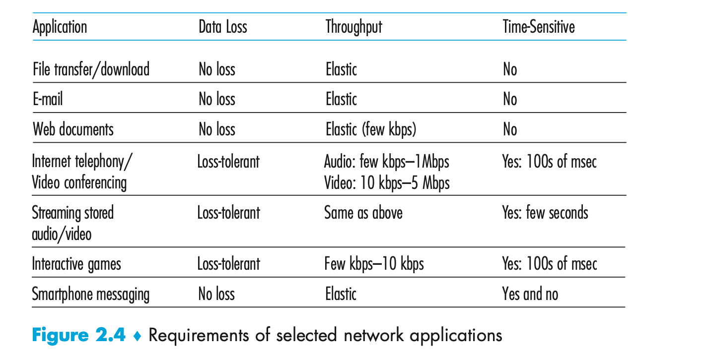

### SECURING TCP

* Neither TCP nor UDP provides any encryption—the data that the sending process passes into its socket is the same data
  that travels over the network to the destination process.
* So, for example, if the sending process sends a password in cleartext (i.e., unencrypted) into its socket, the
  cleartext password will travel over all the links between sender and receiver, potentially getting sniffed and
  discovered at any of the intervening links.
* Because privacy and other security issues have become critical for many applications, the Internet community has
  developed an enhancement for TCP, called **Secure Sockets Layer (SSL).**
* TCP-enhanced-with-SSL not only does everything that traditional TCP does but also provides critical process-to-process
  security services, including encryption, data integrity, and end-point authentication.
* We emphasize that SSL is not a third Internet transport protocol, on the same level as TCP and UDP, but instead is an
  enhancement of TCP, with the enhancements being implemented in the application layer.
* if an application wants to use the services of SSL, it needs to include SSL code (existing, highly optimized libraries
  and classes) in both the client and server sides of the application.
* SSL has its own socket API that is similar to the traditional TCP socket API.
* When an application uses SSL, the sending process passes cleartext data to the SSL socket; SSL in the sending host
  then encrypts the data and passes the encrypted data to the TCP socket.
    * The encrypted data travels over the Internet to the TCP socket in the receiving process.
    * The receiving socket passes the encrypted data to SSL, which decrypts the data.
    * Finally, SSL passes the cleartext data through its SSL socket to the receiving process.

## Socket Programming with UDP

* **UDP (User Datagram Protocol) - Unicast**
    * UDP allows two or more processes running on different hosts to communicate.
    * The host IP address, the port number and the actual data to be transferred are collectively called a ‘packet
    * UDP provides an unreliable message-oriented service model, in that it makes a best effort to deliver the packet to
      the destination in a single operation at the sending side.
* UDP differs from TCP (Transport Control Protocol)
    * UDP is a connectionless service - there is no handshaking to establish a communication pipe because UDP does not
      have a pipe.
    * When UDP communicates, it attaches the destination address to each batch of data that is being sent
    * UDP is a best-effort service; it makes no guarantee that the packet will be delivered. This is in contrast to TCP,
      which has a reliable service model.

* UDP Server Main Method

```java
import java.io.*;
import java.net.*;

class UDPServer {
    public static void main(String args[]) throws Exception {
        DatagramSocket serverSocket = new DatagramSocket(9876);
        byte[] receiveData = new byte[1024];
        byte[] sendData = new byte[1024];
        while (true) {
            DatagramPacket receivePacket = new DatagramPacket(receiveData,
                    receiveData.length);
            serverSocket.receive(receivePacket);
            String sentence = new String(receivePacket.getData());
            InetAddress IPAddress = receivePacket.getAddress();

            int port = receivePacket.getPort();
            String capitalizedSentence = sentence.toUpperCase();
            sendData = capitalizedSentence.getBytes();
            DatagramPacket sendPacket = new DatagramPacket(sendData,
                    sendData.length, IPAddress, port);
            serverSocket.send(sendPacket);
        }
    }
}
```

* UDP Client Main Method

```java
import java.io.*;
import java.net.*;

class UDPClient {
    public static void main(String args[]) throws Exception {
        BufferedReader inFromUser = new BufferedReader(new InputStreamReader(System.in));
        DatagramSocket clientSocket = new DatagramSocket();
        InetAddress IPAddress = InetAddress.getByName("localhost");
        byte[] sendData = new byte[1024];
        byte[] receiveData = new byte[1024];
        String sentence = inFromUser.readLine();
        sendData = sentence.getBytes();
        DatagramPacket sendPacket = new DatagramPacket(sendData, sendData.length, IPAddress, 9876);
        clientSocket.send(sendPacket);
        DatagramPacket receivePacket = new DatagramPacket(receiveData, receiveData.length);
        clientSocket.receive(receivePacket);
        String modifiedSentence = new String(receivePacket.getData());
        System.out.println("FROM SERVER:  " + modifiedSentence);
        clientSocket.close();
    }
}
```

# Mail Protocols

## Simple Mail Transfer Protocol (SMTP)

* Simple Mail Transfer Protocol (SMTP) is the protocol that guides email communications.
* It defines how commands and responses must be sent backwards and forwards.
* It resides in the application layer of the TCP/IP stack and operates through port 25 on the SMTP server.
* SMTP, defined in RFC 5321, is at the heart of Internet electronic mail.
* SMTP transfers messages from senders’ mail servers to the recipients’ mail servers.
* Although SMTP has numerous wonderful qualities, as evidenced by its ubiquity in the Internet, it is nevertheless a
  legacy technology that possesses certain archaic characteristics.
    * For example, it restricts the body (not just the headers) of all mail messages to simple 7-bit ASCII.

* To connect a mail server use Telnet `telnet serverName 25`
    * you are simply establishing a TCP connection between your local host and the mail server. After typing this line,
      you should immediately receive the 220 reply from the server. Then issue the SMTP commands HELO, MAIL FROM, RCPT
      TO, DATA, CRLF.CRLF, and QUIT at the appropriate times.

* **Comparison with HTTP:**
    * SMTP is primarily a push protocol—the sending mail server pushes the file to the receiving mail server. In
      particular, the TCP connection is initiated by the machine that wants to send the file.
        * HTTP is mainly a pull protocol—someone loads information on a Web server and users use HTTP to pull the
          information from the server at their convenience. In particular, the TCP connection is initiated by the
          machine that wants to receive the file
    * Second difference, which we alluded to earlier, is that SMTP requires each message, including the body of each
      message, to be in 7-bit ASCII format. If the message contains characters that are not 7-bit ASCII (for example,
      French characters with accents) or contains binary data (such as an image file), then the message has to be
      encoded into 7-bit ASCII.
        * HTTP does not have any restriction
    * A third important difference concerns how a document consisting of text and images (along with possibly other
      media types) is handled.
        * SMTP places all of the message’s objects into one message.
        * HTTP encapsulates each object in its own HTTP response message

* **Sending Mail Process**
    * First, the client SMTP (running on the sending mail server host) has TCP establish a connection to port 25 at the
      server SMTP (running on the receiving mail server host).
    * If the server is down, the client tries again later.
    * Once this connection is established, the server and client perform some application-layer handshaking—just as
      humans often introduce themselves before transferring information from one to another, SMTP clients and servers
      introduce themselves before transferring information.
    * During this SMTP handshaking phase, the SMTP client indicates the e-mail address of the sender (the person who
      generated the message) and the e-mail address of the recipient.
    * Once the SMTP client and server have introduced themselves to each other, the client sends the message.
    * SMTP can count on the reliable data transfer service of TCP to get the message to the server without errors.
    * The client then repeats this process over the same TCP connection if it has other messages to send to the server;
      otherwise, it instructs TCP to close the connection.

  </br>

    * **How does a recipient like Bob**, running a user agent on his local PC, obtain his messages, which are sitting in
      a mail server within Bob’s ISP?
        * Bob’s user agent can’t use SMTP to obtain the messages because obtaining the messages is a pull operation,
          whereas SMTP is a push protocol.
        * This completed by introducing a special mail access protocol that transfers messages from Bob’s mail server to
          his local PC.
        * There are currently a number of popular mail access protocols, including Post Office Protocol—Version 3 (POP3)
          ,Internet Mail Access Protocol (IMAP), and HTTP.

* SMTP is used to transfer mail from the sender’s mail server to the recipient’s mail server; SMTP is also used to
  transfer mail from the sender’s user agent to the sender’s mail server.
    * A mail access protocol, such as POP3, is used to transfer mail from the recipient’s mail server to the recipient’s
      user agent.

## Mail Access Protocols

### Post Office Protocol V3 (POP3)

* POP3 is an extremely simple mail access protocol and functionality is rather limited.
* It is a pull protocol that is used by local email clients.
    * This means that the email client can download and store emails as they are delivered to the server in the
      background when an internet connection is available.
* POP3 begins when the user agent (the client) opens a TCP connection to the mail server (the server) on port 110.
* With the TCP connection established, POP3 progresses through three phases: authorization, transaction, and update.
    * authorization, the user agent sends a username and a password (in the clear) to authenticate the user.
    * transaction, the user agent retrieves messages; also during this phase, the user agent can mark messages for
      deletion, remove deletion marks, and obtain mail statistics.
    * update, occurs after the client has issued the quit command
* Ending the POP3 session; at this time, the mail server deletes the messages that were marked for deletion.
* There are 2 possible responses: +OK or -ERR
* POP3 can often be configured (by the user) to “download and delete” or to “download and keep.”
* The problem od “download and delete”, when user receive the mail from one client then cn not reach from other clients.
    * In the download-and-keep mode, the user agent leaves the messages on the mail server after downloading them. In
      this case, user can reread messages from different machines; such as Work, home etc.
* POP3 server does not carry state information across POP3 sessions. This lack of state information across sessions
  greatly simplifies the implementation of a POP3 server.

### Internet Mail Access Protocol (IMAP)

* the IMAP protocol, defined in [RFC 3501], was invented.
* It is more complex than POP3
* An IMAP server will associate each message with a folder; when a message first arrives at the server, it is associated
  with the recipient’s INBOX folder.
* The recipient can then move the message into a new, user-created folder, read the message, delete the message, allow
  users to search remote folders for messages matching specific criteria ad so on
* IMAP server maintains user state information across IMAP sessions—for example, the names of the folders and which
  messages are associated with which folders.
* IMAP is that it has commands that permit a user agent to obtain components of messages. For example, a user agent can
  obtain just the message header of a message or just one part of a multipart MIME message.
    * This feature is useful when there is a low-bandwidth connection

### Web-Based Email (HTTP)

* More and more users today are sending and accessing their e-mail through their Web browsers.
* With this service, the user agent is an ordinary Web browser, and the user communicates with its remote mailbox via
  HTTP. When a recipient, such as Bob, wants to access a message in his mailbox, the e-mail message is sent from Bob’s
  mail server to Bob’s browser using the HTTP protocol rather than the POP3 or IMAP protocol.

### MIME Type

* MIME stands for Multipurpose Internet Mail Extensions and is used to identify the content type of mail messages so
  that the correct encoding and decoding can be applied.
  </br>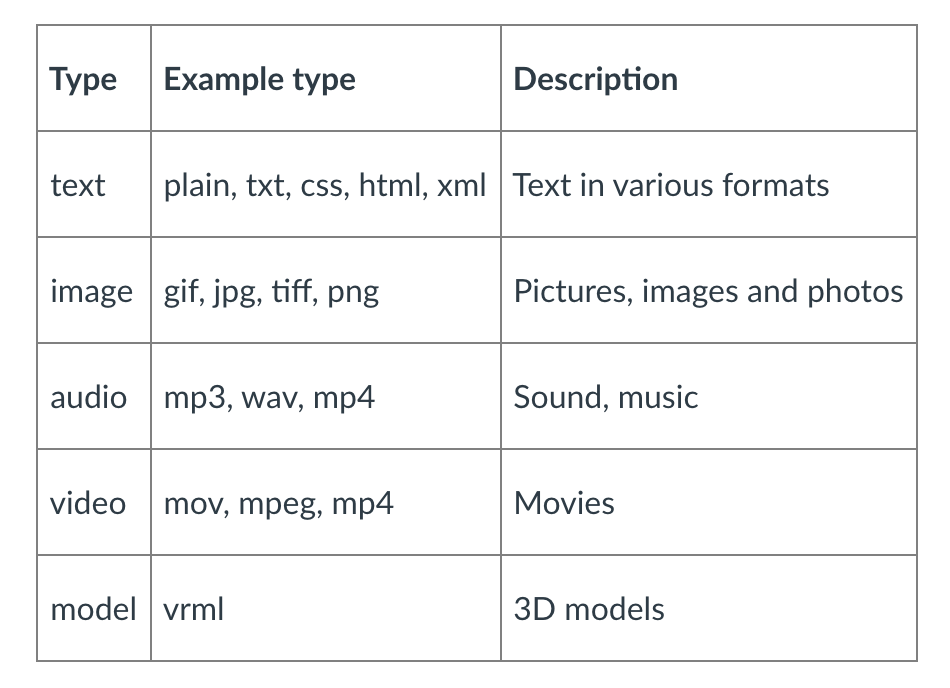

# HTTP Protocol

* Browsers use HTTP (HyperText Transfer Protocol) to make requests for these specific types of pages. This
  request-response protocol runs over TCP (transport layer) and is specifically designed for fetching web pages.
* Web browsers (such as Internet Explorer and Firefox) implement the client side of HTTP, in the context of the Web, we
  will use the words browser and client interchangeably.
* HTTP is implemented in two programs: a client program and a server program
* Web servers, which implement the server side of HTTP, house Web objects, each addressable by a URL.
* The HTTP server receives request messages from its socket interface and sends response messages into its socket
  interface.
    * Once the client sends a message into its socket interface, the message is out of the client’s hands and is **“in
      the hands”** of TCP.
    * This implies that each HTTP request message sent by a client process eventually arrives intact at the server;
      similarly, each HTTP response message sent by the server process eventually arrives intact at the client.
    * Here we see one of the great advantages of a layered architecture
        * HTTP need not worry about lost data or the details of how TCP recovers from loss or reordering of data within
          the network. That is the job of TCP and the protocols in the lower layers of the protocol stack.

* It is important to note that the server sends requested files to clients without storing any state information about
  the client.
    * If a particular client asks for the same object twice in a period of a few seconds, the server does not respond by
      saying that it just served the object to the client; instead, the server resends the object, as it has completely
      forgotten what it did earlier.
    * Because an HTTP server maintains no information about the clients, HTTP is said to be a **stateless protocol**.

* Universal Resource Locators (URLs)
    * Each page resides on a server, and that server identifies itself with a domain name.
    * Each of the pages that it enables access to has a file name and may reside within a directory structure on the
      server.
    * The combination of domain name, directory structure, and file name provides each page with a unique identifier.
    * This identifier and the protocol used to access the location are referred to collectively as the URL (
      Universal Resource Locator)
      </br>

## HTTP Communications

* The most common form of HTTP 1.0 is a simple request-response.
* HTTP is referred to as a ‘stateless protocol’, as each communication, even with the same server, is independent of any
  previous request/response and no ‘state’ information is stored regarding that communication.
* When this client-server interaction is taking place over TCP, the application developer needs to make an important
  decision—should each request/response pair be sent over a **separate** TCP connection, or should all of the requests
  and their corresponding responses be sent over the **same** TCP connection? In the former approach, the application is
  said to use **non-persistent connections**; and in the latter approach, **persistent connections**.

## Non-Persistent Connections

* At most one object sent over TCP connection
    * connection then closed
* Downloading multiple objects required multiple connections

* Here is what happens when we make a call to the server by using non-persist connection

1. The HTTP client process initiates a TCP connection to the server www .someSchool.edu on port number 80, which is the
   default port number for HTTP. Associated with the TCP connection, there will be a socket at the client and a socket
   at the server.
2. The HTTP client sends an HTTP request message to the server via its socket. The request message includes the path
   name /someDepartment/home .index. (We will discuss HTTP messages in some detail below.)
3. The HTTP server process receives the request message via its socket, retrieves the object /someDepartment/home.index
   from its storage (RAM or disk), encapsulates the object in an HTTP response message, and sends the response message
   to the client via its socket.
4. The HTTP server process tells TCP to close the TCP connection. (But TCP doesn’t actually terminate the connection
   until it knows for sure that the client has received the response message intact.)
5. The HTTP client receives the response message. The TCP connection termi- nates. The message indicates that the
   encapsulated object is an HTML file. The client extracts the file from the response message, examines the HTML file,
   and finds references to the 10 JPEG objects.
6. **The first four steps are then repeated for each of the referenced JPEG objects.**

* Back-of-the-envelope calculation to estimate the amount of time that elapses from when a client requests the base HTML
  file until the entire file is received by the client.
    * Round-trip time (RTT), which is the time it takes for a small packet to travel from client to server and then back
      to the client.
    * The RTT includes packet-propagation delays, packet- queuing delays in intermediate routers and switches, and
      packet-processing delays

* What happens when a user clicks on a hyperlink:
    * The browser to initiate a TCP connection between the browser and the Web server; this involves a **“three-way
      handshake”**—the client sends a small TCP segment to the server, the server acknowledges and responds with a small
      TCP segment, and, finally, the cli- ent acknowledges back to the server.
    * The first two parts of the three-way handshake take one RTT. After completing the first two parts of the
      handshake, the client sends the HTTP request message combined with the third part of the three-way handshake (the
      acknowledgment) into the TCP connection.
    * Once the request message arrives at the server, the server sends the HTML file into the TCP connection. This HTTP
      request/response eats up another RTT.
    * Thus, roughly, the total response time is two RTTs plus the transmission time at the server of the HTML file.  
      </br>
* Non-persistent connections have some shortcomings
    * First, a brand-new connection must be established and maintained for each requested object.
        * For each of these connections, TCP buffers must be allocated and TCP variables must be kept in both the client
          and server. This can place a significant burden on the Web server, which may be serving requests from hundreds
          of different clients simultaneously.
        * browsers often open parallel TCP connections to fetch referenced objects
    * Second, each object suffers a delivery delay of two RTTs—one RTT to establish the TCP connection and one RTT to
      request and receive an object.

## Persistent Connections

* Multiple objects can be sent over single TCP connection between client, server
* With HTTP 1.1 persistent connections, the server leaves the TCP connection open after sending a response.
* Subsequent requests and responses between the same client and server can be sent over the same connection.
* In particular, an entire Web page (in the example above, the base HTML file and the 10 images) can be sent over a
  single persistent TCP connection.
* Moreover, multiple Web pages residing on the same server can be sent from the server to the same client over a single
  persistent TCP connection.
* These requests for objects can be made back-to-back, without waiting for replies to pending requests (**
  pipelining**).
* The default mode of HTTP uses persistent connections with pipelining. Most recently, HTTP/2 [RFC 7540] builds on HTTP
  1.1 by allowing multiple requests and replies to be interleaved in the same connection, and a mechanism for
  prioritizing HTTP message requests and replies within this connection.

* Summary:
    * server leaves connection open after sending response
    * subsequent HTTP messages between same client/server sent over open connection
    * client sends requests as soon as it encounters a referenced object
    * as little as one RTT for all the referenced objects

* Here (a) is HTTP 1.0 non-persistence connection, (b) HTTP 1.1 persistence connection. (c) HTTP/2 pipelining
  </br>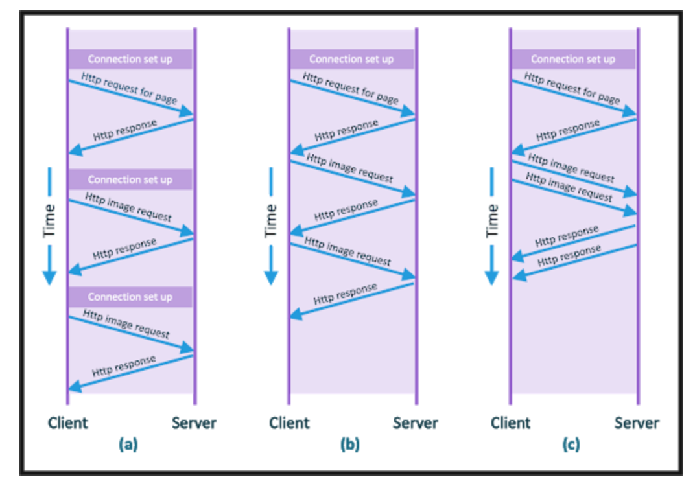

## HTTP response and request messages

* There are two types of HTTP messages: request, response

### HTTP Request

* Here is a sample of request
* The first line of an HTTP request message is called the request line; the subsequent lines are called the header
  lines.
    * The request line has three fields: the method field, the URL field, and the HTTP version field.
    * Here is general and ascii format of request  
      </br>
      </br>
* the Connection: close header line, the browser is telling the server that it doesn’t want to bother with persistent
  connections; it wants the server to close the connection after sending the requested object.
* Here is some Http request methods.
  </br>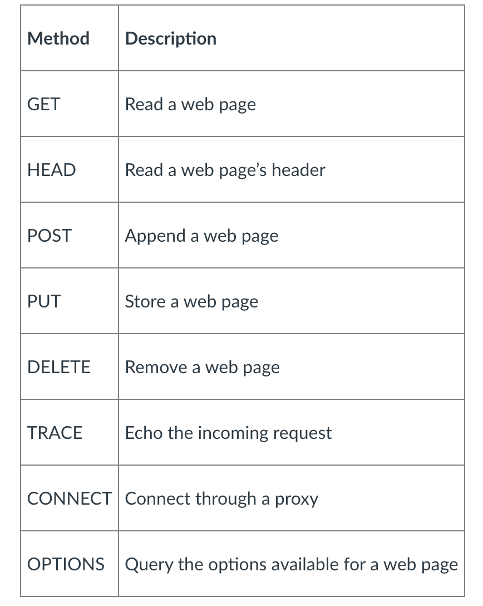

* Uploading a form input, there are some couple ways
    * Using POST message
        * web page often includes form input
        * input is uploaded to server in entity body
    * Searching GET with Request Param
        * uses GET method
        * input is uploaded in URL field of request line:www.somesite.com/animalsearch?monkeys&banana

#### Method Types

* HTTP/1.0:
    * GET
    * POST
    * HEAD
        * asks server to leave requested object out of response

* HTTP/1.1:
    * GET, POST, HEAD
    * PUT
        * uploads file in entity body to path specified in URL field
    * DELETE
        * deletes file specified in the URL field

### HTTP Response

* The response from the server may or may not contain the page requested.
* Response has three sections: an initial status line, six header lines, and then the entity body.
* If the page does not exist or the server is unable to fulfil the request, the browser may receive a status code
  indicating the problem. 404, 500 etc
    * 2xx means successful
    * 3xx redirect
    * 4xx Client error
    * 5xx Server error
* General and ascii format  
  </br>
  </br>

# HTTP Inspection Tools in Google Chrome

* To view the hosts : "chrome://dns"
* To logging on local: "chrome://net-export/"
    * You can now carry on browsing the internet as normal or carry out other activities such as reading emails. When
      you're ready to complete the log, click on the “Stop Logging” button to end the recording.
    * To see the logs a suitable viewer required

# The Domain Name Service (DNS)

* The Domain Name Service (DNS) is the Internet’s directory service.
* When we write to browser of a domain, domain names do not have IP addresses and DNS provides a system of servers that
  stores address information for hosts and uses the domain name.
* Before an HTTP request is made, the domain name in the request needs to be resolved.
    * This results in separate communications to other servers providing DNS.

* **Dynamic DNS**
    * DNS so far has used a permanent IP addressing system; however, IP addresses can be assigned dynamically through a
      router or server's **Dynamic Host Configuration Protocol (DHCP)** each time the device is started.
    * This in turn means that that device must be registered with DNS and accessible via its hostname and the DNS
      server (or router) must have a way of learning the IP address of that device for that session.
    * DNS records on the router or server are updated once the IP address is allocated.

* The DNS is
    * a distributed database implemented in a hierarchy of DNS servers,
    * an application-layer protocol that allows hosts to query the distributed database.
* The DNS servers are often UNIX machines running the Berkeley Internet Name Domain (BIND) software [BIND 2016].
* **The DNS protocol runs over UDP and uses port 53**.
    * All DNS query and reply messages are sent within UDP datagrams to port 53.

* DNS adds an additional delay—sometimes substantial—to the Internet applications that use it. Fortunately, as we
  discuss below, the desired IP address is often cached in a “nearby” DNS server, which helps to reduce DNS network
  traffic as well as the average DNS delay.

## Other DNS services:

* **Host aliasing.** A host with a complicated hostname can have one or more alias names.
    * For example, a hostname such as relay1.west-coast .enterprise.com could have, say, two aliases such as
      enterprise.com and www.enterprise.com.
    * In this case, the hostname relay1 .west-coast.enterprise.com is said to be a **canonical hostname**.

* **Mail server aliasing**. For obvious reasons, it is highly desirable that e-mail addresses be mnemonic.
    * The hostname of the Yahoo mail server is more complicated and much less mnemonic than simply yahoo.com (for
      example, the canonical hostname might be some- thing like relay1.west-coast.yahoo.com).
    * DNS can be invoked by a mail application to obtain the canonical hostname for a supplied alias hostname as well as
      the IP address of the host.

* **Load distribution.** DNS is also used to perform load distribution among replicated servers, such as replicated Web
  servers.

## DNS: Critical Network Functions via The Client-Server Paradigm

* Like HTTP, FTP, and SMTP, the DNS protocol is an application-layer protocol since it
    * runs between communicating end systems using the client-server paradigm and
    * relies on an underlying end-to-end transport protocol to transfer DNS messages between com- municating end
      systems.
* the DNS is not an application with which a user directly interacts. Instead, the DNS provides a core Internet
  function—namely, translating hostnames to their underlying IP addresses, for user applications and other software in
  the Internet

## A Distributed, Hierarchical Database

* The DNS uses a large number of servers, organized in a hierarchical fashion and distributed around the world.
* There are three classes of DNS servers—root DNS servers, top-level domain (TLD) DNS servers, and authoritative DNS
  servers—organized in a hierarchy
  </br>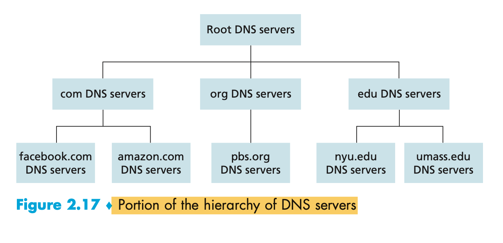

* **Root DNS servers.** There are over 400 root name servers scattered all over the world.
* **Top-level domain (TLD) servers**. For each of the top-level domains — top-level domains such as com, org, net, edu,
  and gov, and all of the country top-level domains such as uk, fr, ca, and jp — there is TLD server (or server cluster)
* **Authoritative DNS servers.** Every organization with publicly accessible hosts (such as Web servers and mail
  servers) on the Internet must provide publicly accessible DNS records that map the names of those hosts to IP
  addresses.
* **Local DNS server.** A local DNS server does not strictly belong to the hier- archy of servers but is nevertheless
  central to the DNS architecture. Each ISP—such as a residential ISP or an institutional ISP—has a local DNS server (
  also called a default name server)

* Interaction of the various DNS servers
    * In the example below, makes use of both recursive queries and iterative queries.
        * The query sent from cse.nyu.edu to dns.nyu.edu is a recursive query, since the query asks dns.nyu.edu to
          obtain the mapping on its behalf.
        * the subsequent three queries are iterative since all of the replies are directly returned to dns.nyu.edu. I

</br>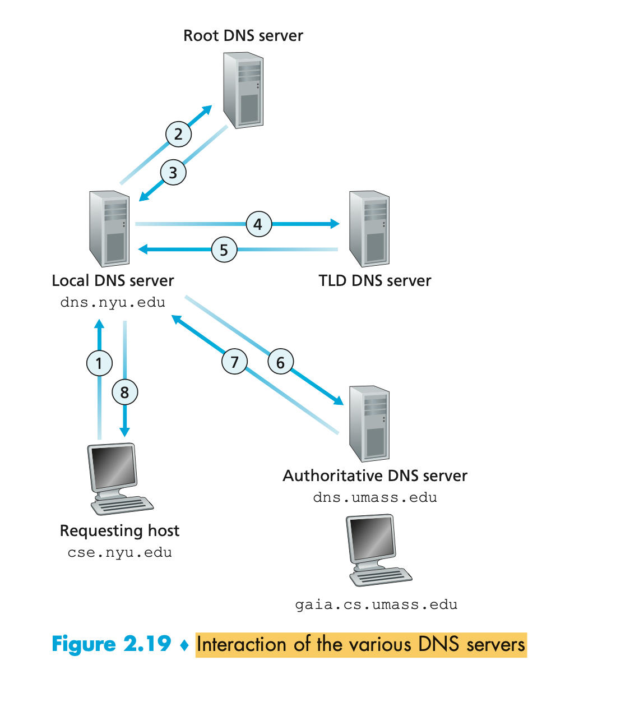

## DNS Caching

* DNS caching, a critically important feature of the DNS system.
* DNS extensively exploits DNS caching in order to improve the delay performance and to reduce the number of DNS
  messages ricocheting around the Internet
* The idea behind DNS caching is very simple. In a query chain, when a DNS server receives a DNS reply (containing, for
  example, a mapping from a hostname to an IP address), it can cache the mapping in its local memory

## DNS Record

* The DNS servers that together implement the DNS distributed database store resource records (RRs), including RRs that
  provide hostname-to-IP address map- pings. Each DNS reply message carries one or more resource records.
* A resource record is a four-tuple that contains the following fields:
    * (Name, Value, Type, TTL)
* TTL is the time to live of the resource record; it determines when a resource should be removed from a cache.
* If **Type=A,** then Name is a hostname and Value is the IP address for the host- name. Thus, a Type A record provides
  the standard hostname-to-IP address map- ping. As an example, (relay1.bar.foo.com, 145.37.93.126, A) is a Type A
  record.
* If **Type=NS**, then Name is a domain (such as foo.com) and Value is the hostname of an authoritative DNS server that
  knows how to obtain the IP addresses for hosts in the domain.
    * This record is used to route DNS queries further along in the query chain.
    * As an example, (foo.com, dns.foo.com, NS) is a Type NS record.
* If **Type=CNAME**, then Value is a canonical hostname for the alias hostname Name. This record can provide querying
  hosts the canonical name for a hostname. As an example, (foo.com, relay1.bar.foo.com, CNAME) is a CNAME record.

* If **Type=MX,** then Value is the canonical name of a mail server that has an alias hostname Name. As an example, (
  foo.com, mail.bar.foo.com, MX) is an MX record. MX records allow the hostnames of mail servers to have simple aliases.

## DNS Messages

* The first 12 bytes is the header section, which has a number of fields.
    * The first field is a 16-bit number that identifies the query.
* The question section contains information about the query that is being made.
* In a reply from a DNS server, the answer section contains the resource records for the name that was originally
  queried.
* The authority section contains records of other authoritative servers.
* The additional section contains other helpful records.

</br>

## Inserting Records into the DNS Database

* A **registrar** is a commercial entity that verifies the uniqueness of the domain name, enters the domain name into
  the DNS database (as discussed below), and collects a small fee from you for its services.
* When you register the domain name networkutopia.com with some registrar, you also need to provide the registrar with
  the names and IP addresses of your primary and secondary authoritative DNS servers.
    * Suppose the names and IP addresses are dns1.networkutopia.com, dns2.networkutopia.com, 212.2.212.1, and
      212.212.212.2.
* For each of these two authoritative DNS servers, the registrar would then make sure that a Type NS and a Type A record
  are entered into the TLD com servers.
* the registrar would insert the following two resource records into the DNS system:
    * (networkutopia.com, dns1.networkutopia.com, NS)
    * (dns1.networkutopia.com, 212.212.212.1, A)

* Once all of these steps are completed, people will be able to visit the page

## How DNS works?

1. The same user machine runs the client side of the DNS application.
2. The browser extracts the hostname, www.someschool.edu, from the URL and passes the hostname to the client side of the
   DNS application.
3. The DNS client sends a query containing the hostname to a DNS server.
4. The DNS client eventually receives a reply, which includes the IP address for the hostname.
5. Once the browser receives the IP address from DNS, it can initiate a TCP connection to the HTTP server process
   located at port 80 at that IP address.

* **With more detail explanation**
* Suppose Alice in Australia wants to view the Web page www.networkutopia.com.
    * her host will first send a DNS query to her local DNS server.
    * The local DNS server will then contact a TLD com server. (The local DNS server will also have to contact a root
      DNS server if the address of a TLD com server is not cached.)
    * This TLD server contains the Type NS and Type A resource records listed above, because the registrar had these
      resource records inserted into all of the TLD com servers.
    * The TLD com server sends a reply to Alice’s local DNS server, with the reply containing the two resource records.
    * The local DNS server then sends a DNS query to 212.212.212.1, ask- ing for the Type A record corresponding
      to www.networkutopia.com.
    * This record provides the IP address of the desired Web server, say, 212.212.71.4, which the local DNS server
      passes back to Alice’s host.
    * Alice’s browser can now initiate a TCP connection to the host 212.212.71.4 and send an HTTP request over the
      connection.

# Quiz Questions

* What is meant by a handshaking protocol?
    * A protocol uses handshaking if the two communicating entities first exchange control packets before sending data
      to each other. SMTP uses handshaking at the application layer whereas HTTP does not.

* Why do HTTP, SMTP, and POP3 run on top of TCP rather than on UDP?
    * The applications associated with those protocols require that all application data be received in the correct
      order and without gaps. TCP provides this service whereas UDP does not.

* Consider an e-commerce site that wants to keep a purchase record for each of its customers. Describe how this can be
  done with cookies.
    * When the user first visits the site, the server creates a unique identification number, creates an entry in its
      back-end database, and returns this identification number as a cookie number. This cookie number is stored on the
      user’s host and is managed by the browser. During each subsequent visit (and purchase), the browser sends the
      cookie number back to the site. Thus the site knows when this user (more precisely, this browser) is visiting the
      site.

* Describe how Web caching can reduce the delay in receiving a requested object. Will Web caching reduce the delay for
  all objects requested by a user or for only some of the objects?
    * Web caching can bring the desired content “closer” to the user, possibly to the same LAN to which the user’s host
      is connected. Web caching can reduce the delay for all objects, even objects that are not cached, since caching
      reduces the traffic on links.

* List several popular messaging apps. Do they use the same protocols as SMS?
    * A list of several popular messaging apps: WhatsApp, Facebook Messenger, WeChat, and Snapchat. These apps use
      different protocols than SMS.

* Suppose Alice, with a Web-based e-mail account (such as Hotmail or Gmail), sends a message to Bob, who accesses his
  mail from his mail server using POP3. Discuss how the message gets from Alice’s host to Bob’s host. Be sure to list
  the series of application-layer protocols that are used to move the message between the two hosts.
    * The message is first sent from Alice’s host to her mail server over HTTP. Alice’s mail server then sends the
      message to Bob’s mail server over SMTP. Bob then transfers the message from his mail server to his host over POP3.

* From a user’s perspective, what is the difference between the download-and-delete mode and the download-and-keep mode
  in POP3?
    * With download and delete, after a user retrieves its messages from a POP server, the messages are deleted. This
      poses a problem for the nomadic user, who may want to access the messages from many different machines (office PC,
      home PC, etc.). In the download and keep configuration, messages are not deleted after the user retrieves the
      messages. This can also be inconvenient, as each time the user retrieves the stored messages from a new machine,
      all of the non-deleted messages will be transferred to the new machine (including very old messages).

* Is it possible for an organization’s Web server and mail server to have exactly the same alias for a hostname (for
  example, foo.com)? What would be the type for the RR that contains the hostname of the mail server?
    * Yes, an organization’s mail server and Web server can have the same alias for a hostname. The MX record is used to
      map the mail server’s hostname to its IP address.

* Look over your received e-mails, and examine the header of a message sent from a user with a .ac.uk e-mail address. Is
  it possible to determine from the header the IP address of the host from which the message was sent? Do the same for a
  message sent from a Gmail account.
    * You should be able to see the sender's IP address for a user with a .edu email address. But you will not be able
      to see the sender's IP address if the user uses a gmail account.

# TODO:

* [What is DNS? - Introduction to Domain Name System](https://www.youtube.com/watch?v=e2xLV7pCOLI)
  </br>
  </br>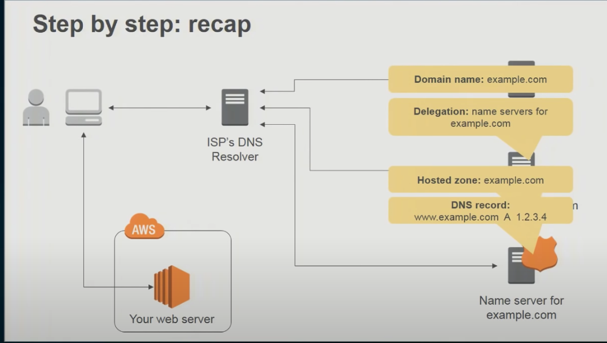

# WEEK 3

#### Main Topics

* Basics of the Transport Layer and examine:
    * Layers;
    * Fibre.

* Types of connections. Particular topics include:
    * UDP;
    * Connectionless and connection orientated.
* TCP at the Transport Layer. We touch upon the following:
    * Multiplexing and demultiplexing;
    * TCP features and structure;
    * Transport primitives;
    * TCP sockets; Go-Back-N.

#### Sub titles:

* [What is the transport layer?](#what-is-the-transport-layer)
    * [Data transfer between layers](#data-transfer-between-layers)
        * [Transport layer](#transport-layer)
* [Types of connection - UDP (connectionless)](#types-of-connection---udp-connectionless)
    * [UDP (connectionless)](#udp-connectionless)
        * [UDP Segment structure](#udp-segment-structure)
    * [Checksum](#checksum)
    * [Question](#question)
* [Encapsulation](#encapsulation)
* [TCP (connection)](#tcp-connection)
    * [The End-to-End principle](#the-end-to-end-principle)
    * [Transport Service Primitives](#transport-service-primitives)
    * [TCP Activity](#tcp-activity)
    * [GO-Bank-N Protocol (GBN)](#go-bank-n-protocol-gbn)
* [Ports and Sockets](#ports-and-sockets)
    * [Ports](#ports)
    * [Socket](#sockets)
* [Quiz](#quiz)
* [Todo](#todo)

# What is the transport layer?

* In a protocol architecture, the transport protocol sits above the network layer and just below the application layer.
* The purpose of the transport layer is to provide the logical communication link between two endpoints
* There is no consideration here as to how that happens, what devices the data passes through, or how far apart the end
  points are.
* The abstract view from the applications’ perspective is that they are communicating directly with each other
* Transport layer protocols are typically the responsibility of the end devices.
* The transport layer:
    * Takes the user data from the application layer,
    * Wrapped with its relevant application layer protocol
    * Breaks down large chunks of data into packets of data referred to as ‘segments’.
    * Adds transport layer headers to each of these segments.
    * Passes these segments to the network layer.

* Each transport layer offering different implementation of
    * reliable data transfer;
    * throughput guarantees;
    * timing guarantees;
    * security.

* Focus on Transmission Control Protocol (TCP) and User Datagram Protocol (UDP)
    * Both of them run IP layer
      </br>

### Data transfer between layers

* Application layer uses socket to pass data to network layer and receive data from network layer
    * Socket acts as a doorway to the application
    * Transport layer responsibility is to direct the data to correct socket and vice versa, when data received to the
      network layer.
* Data from network comes to the transport layer, The headers are read and removed to determine the socket the data is
  to be passed to. This process is referred to as ‘**demultiplexing**’
    * that is, removing the headers and passing the data to the socket of the correct application.

* The opposide, an application packs up its data in the appropriate application protocol and passes it to the transport
  layer through its socket interface,
    * The transport layer adds headers determined by the type of service selected (TCP or UDP), and this process is
      referred to as ‘**multiplexing**’.
* Whereas the physical network transports data from host to host (endpoints), the transport layer is abstractly
  delivering data process-to-process, from the socket of one application to the socket of another.
* Each socket on a host machine has a unique identifier, and the headers in the transport level protocol, wrapped around
  the segment, enable the identification of that socket.

## Transport layer

* a programmer has little control of the transport layer. However, they are able to select between available transport
  layer protocols, which can offer different levels of service.
* Reliable Data Transfer:
    * networks suffer from packet loss, so if a protocol provides Reliable Data Transfer then it guarantees that all
      packets will arrive at the destination.
    * If a programmer selects a protocol that provides this then they simply pass their user data into the socket
      without any further concerns.
    * The socket manages the rest according to the selected protocol.
    * Some applications, such as streaming video, are more tolerant to packet loss than others, such as Word documents,
      and so can select protocols that may not provide Reliable Data Transfer.

* Throughput guarantees:
    * The volume of network traffic fluctuates, which may have an adverse effect on some types of application, such as
      live video streaming.
    * Therefore, protocols that can offer a guaranteed consistent throughput may be an advantage here.
    * These types of applications are said to be bandwidth-sensitive.
    * Other applications, such as email, can simply make use of the bandwidth that is available and are referred to as
      having an elastic requirement in terms of bandwidth.

* Timing guarantees:
    * Some applications have time-sensitive communications like the online gaming server described previously.
    * Being able to define the maximum amount of time within which a communication is sent would be useful here to
      ensure the ‘real timeliness’ of the game's interactions between users.

* Security:
    * Transport layer protocols can provide various types of protection services to the application layer, which are
      selected when designing a program that sends data over the Internet.
    * Encryption, authentication and data integrity services are examples of the types of security that can be offered
      here.

# Types of connection - UDP (connectionless)

* Process-to-process connections come in two types: **connection-orientated** and **connectionless**.
    * These terms refer to whether or not a persistent connection between the two end processes is preserved until a
      conversation is finished.

* **A connectionless protocol** does not require or enable any acknowledgments from the recipient.
  *The sender simply attaches the receiver's address and sends the data. As there is no acknowledgment, the sender has
  no guarantee it has arrived.  (UDP)

* **A connection-orientated protocol** does guarantee that the data has arrived at the receiver.
    * A connection-oriented protocol initiates the conversation via handshaking which creates a conceptual channel
      between sender and receiver.
    * The data is checked for integrity and sequence (when multiple segments are sent), and its safe arrival is
      acknowledged.  (TCP)

## UDP (connectionless)

* **User Datagram Protocol (UDP)** is a connectionless protocol that provides the bare minimum to enable sending data
  between processes.
    * The headers of a UDP segment contain
        * the source port
        * the data, as defined by the application sending
        * the destination port of the application receiving the data
    * Length and checksum are also included.
* The port numbers are what make UDP a protocol, and with these an application can connect to an individual server
  process, rather than to a host.

* The actual destination host machine address (IP address) is added at the network layer below. Given this, UDP is an
  unreliable protocol.

* 2 things are considering to select UDP
    * Is the timely arrival is important than guarantee of data arrival
    * Is the process tolerant to lost data?

* UDP is most frequently used for real time applications, where the programmer can have more control over how to respond
  to incoming/outgoing communications and manually manage lost data.
    * It enables much more flexibility but does require the programmer to consider much more carefully how an
      application needs to respond to specific situations.
    * Reliability can be programmed into the application by design.
    * In effect, UDP is really leaving the specific protocol design, the communication process between two hosts, up to
      the programmer to define.

* UDP is lightweight in terms of overhead and segment size and does not maintain any state information regarding the
  communication.
    * In this way, an application at the server end can potentially hold communications with many more clients than if
      it was using TCP.

* UDP takes messages from the application process, attaches source and destination port number fields for the multi-
  plexing/demultiplexing service, adds two other small fields, and passes the resulting segment to the network layer.
    * The network layer encapsulates the transport-layer segment into an IP datagram and then makes a best-effort
      attempt to deliver the segment to the receiving host.
    * If the segment arrives at the receiving host, UDP uses the destination port number to deliver the segment’s data
      to the correct application process.

### UDP Segment structure

* UDP packet and its data.
  </br>
* One of the actions performed by the transport layer is to divide the application layer data into chunks so there is a
  fixed size to the amount of data in each UDP segment.
* UDP packets use a 16-bit internet checksum on the data but it’s rarely used and often disabled.
* UDP headers are:
    * Source port - the port number of the application that generates the data
    * Destination port - the port number of the receiving application (process-to-process protocol)
    * Length - the length of the UDP header and the UDP data, in bytes.
    * Checksum - this field is used for error checking. It is optional in IPv4 and mandatory in IPv6.

## Checksum

* [Binary numbering system documentation](./doc/BINARY%20NUMBERS%202021.docx)
* [P-Checksum](./doc/P-Checksum.pdf)
* [How to Calculate IP Header Checksum (With an Example)](https://www.thegeekstuff.com/2012/05/ip-header-checksum/)

* A check sum is basically a value that is computed from data packet to check its integrity.
* Through integrity, we mean a check on whether the data received is error free or not.
* This is because while traveling on network a data packet can become corrupt and there has to be a way at the receiving
  end to know that data is corrupted or not. This is the reason the checksum field is added to the header.
* At the source side, the checksum is calculated and set in header as a field.
    * At the destination side, the checksum is again calculated and crosschecked with the existing checksum value in
      header to see if the data packet is OK or not.
* [IP Protocol Header](https://www.thegeekstuff.com/2012/03/ip-protocol-header/)
  </br>

* So, as far as the algorithm goes, IP header checksum is : **16 bit one’s complement of the one’s complement sum of all
  16 bit words in the header**
    * This means that if we divide the IP header is 16 bit words and sum each of them up and then finally do a one’s
      compliment of the sum then the value generated out of this operation would be the checksum.

### Question

* An IPv4 datagram has arrived with the following information in the header (in hexadecimal notation)
  `0x45 00 00 54 00 03 58 50 20 06 00 00 7C 4E 03 02 B4 0E 0F 02`
    * Is the packet corrupted?
    * Are there any options?
    * Is the packet fragmented?
    * What is the size of the data?
    * How many more routers can the packet travel to?
    * What is the identification number of the packet?
    * What is the type of service?

* Answer
    * VER = 0x4 = 4
    * HLEN =0x5 = 5 -> 5 * 4 = 20 bytes
    * Service =0x00 = 0 (Normal/routine)
    * Total Length = 0x0054 = 84 bytes
    * Identification = 0x0003 = 3
    * Flags and Fragmentation = 0x5850 -> D = 1, M= 0, offset = 6224
    * Time to live = 0x20 = 32
    * Protocol = 0x06 = 6
    * Checksum = 0x0000??
    * Source Address: 0x7C4E0302 = 124.78.3.2
    * Destination Address: 0xB40E0F02 = 180.14.15.2

* If we see the checksum, we get 0x0000. The packet is likely to be corrupted.
* Since the length of the header is 20 bytes, there are no options.
* Since D = 1 and M = 0 and offset = 6224, the packet is not permitted to be fragmented.
* The total length is 84. Data size is 64 bytes (84-20 = 64 bytes).
* Since the value of time to live = 32, the packet may visit up to 32 more routers.
* The identification number of the packet is 3.
* The type of service is normal.

# Encapsulation

* When a host transmits data across a network to another device, the data goes through a process called “encapsulation”
  in which it is wrapped with protocol information at each layer of the OSI model.
    * Each layer communicates only with its peer layer on the receiving device.

* To communicate and exchange information, each layer uses **Protocol Data Units (PDUs)**.
    * These hold the control information attached to the data at each layer of the model.
    * They’re usually attached to the header in front of the data field, but can also be in the trailer, or end, of it.

* At a transmitting device, the data-encapsulation method works like this:
    1. User information is converted to data for transmission on the network.
    2. Data is converted to segments, and a reliable connection is set up between the transmitting and receiving hosts.
    3. Segments are converted to packets or datagrams, and a logical address is placed in the header so each packet can
       be routed through an internet work.
    4. Packets or datagrams are converted to frames for transmission on the local network.
    5. Hardware (Ethernet) addresses are used to uniquely identify hosts on a local network segment. Frames are
       converted to bits, and a digital encoding and clocking scheme is used.

</br>

# TCP (connection)

* TCP provides a very important service - a standard, general purpose method for the reliable delivery of data.
* “Reliable” here refers to the reliability between applications running on one computer to another.
* TCP provides this reliability by adding services on top of IP, which is connectionless and does not guarantee the
  delivery of packets.
* TCP is the primary transport protocol for reliable, full-duplex, virtual circuit connections inside the IP datagram.
  </br>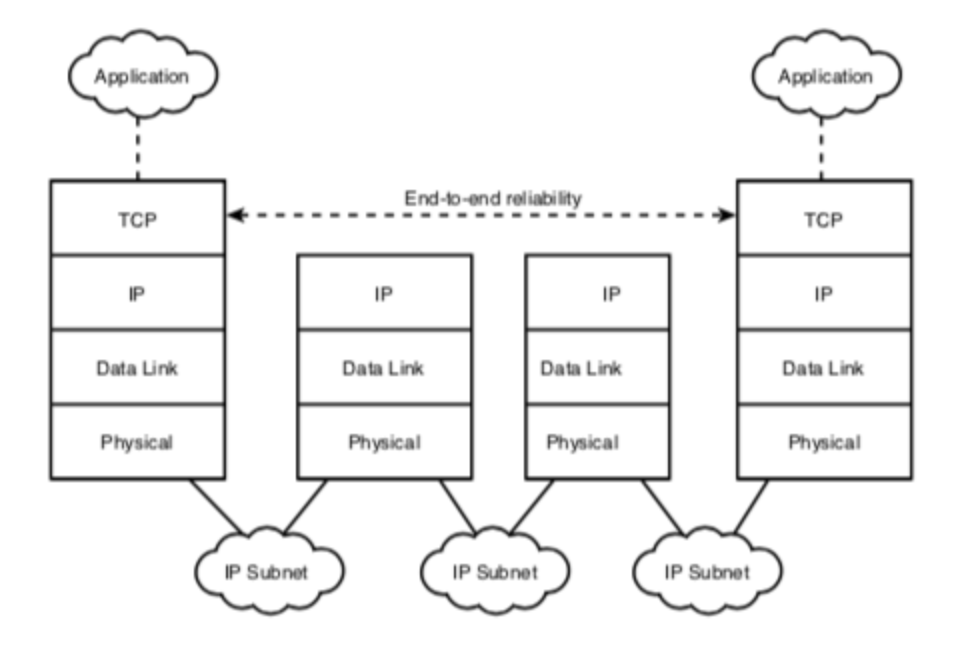

* TCP Features:
    * Basic data transfer;
    * Reliability;
    * Flow control;
    * Multiplexing;
    * Connections;
    * Precedence and security.

* TCP overview:
    * Point 2 point : one server one receiver
    * reliable, in-order byte stream : no "Message boundaries"
    * pipelined:  TCP congestion and flow control set the window size
    * Full duplex data: Bi-directional data flow in the same connection and maximum segment size (MSS)
    * Connection-oriented, handshaking inits the sender/receiver state before the data transfer
    * Flow control: sender will not overwhelmed ...

* TCP Segment Structure:

    * Header and a data field which contains the application data
    * Data gets broken down into smaller chunks, which are appropriate for the MSS (maximum segment size)
    * Source and destination port numbers are required for all transmissions - multiplexing and demultiplexing
    * The header contains a checksum field like a UDP
    * the sequence number for packets that are broken down
        * Sequence number is also byte stream "number" of first byte in segment's data
    * The acknowledgement - the ACK, for reliable data transmission.
        * sequence of next byte expected from other side
        * cumulative ACK
        * the sender to learn of the receiver’s view of the world (in this case, whether or not a packet was received
          correctly) is for the receiver to provide explicit feedback to the sender. The positive (ACK) and negative (
          NAK)
          acknowledgment replies in the message-dictation scenario are examples of such feedback.
            * In principle, these packets need only be one bit long; for example, a 0 value could indicate a NAK and a
              value of 1 could indicate an ACK.
              </br>
              </br>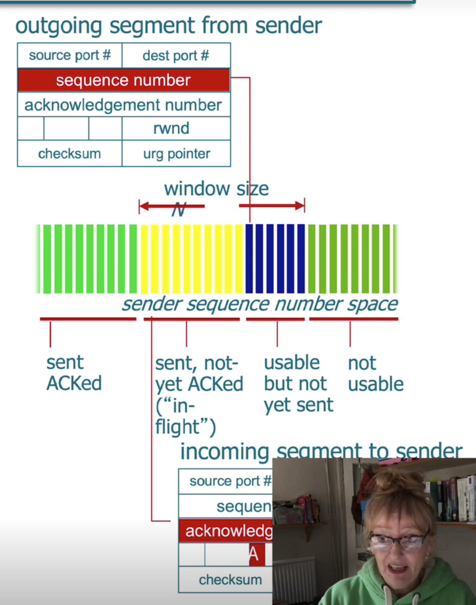

* The TCP just sees ordered but unstructured data so uses the sequential order number to organise it.
    * that means that it sees unstructured data. It doesn't know how to make sense of it.
    * it needs to make sure that it has it in the right order to interpret it at the receiving node.
    * the sequence number is critical.
    * It's byte-streamed for the first byte of a segment and over a stream, not the series of segments in that stream,

</br>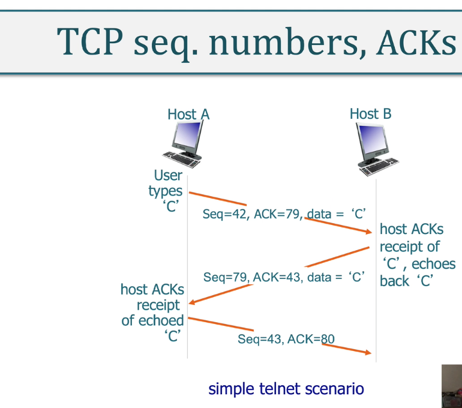

* if the user types in the letter ‘C’, the start sequence number is 42 in this slide and the client number is 79.
    * The sequence number of a segment is the sequence number of the first byte in the data field.
    * the first segment from the client has 42 in its sequence number, the first segment from the server will have
      sequence number 79.
    * The ACK number - acknowledgement number - is the sequence number of the next byte of data the host is waiting for.
    * After TCP connections are made before sending data, the client is waiting for byte 79 and the server is waiting
      for byte 42.
    * The first segment sent from the client to the server includes one byte ASCII, which represents the letter C in its
      data field, plus 42 in its sequence field, giving a total of 43, and the process is reversed for echo back.

* Setting up timeout
    * TCP uses a timeout retransmit mechanism in order to recover lost segments because otherwise they'd be flying
    * Timeout should be larger than the connection’s round-trip time - “RTT”. That is the time taken from when the
      segment is sent, to when it's acknowledged.
    * If the timeout is too small, then unnecessary retransmissions happen
    * If it's too big, then the sender responds too slow to lost packets.
    * The method of SampleRTT, where the time from segment transmission until ACK is received is measured, is used to
      decide the timeout value.
        * To be more resilient/smoother against fluctuations in RTT, this can be averaged over multiple measurements.

* Reliable Data Transfer
    * TCP creates a RDT on top of unreliable IP service
        * IP doesn't guarantee datagram delivery, it doesn't guarantee in-order delivery of datagrams, and it does not
          guarantee the integrity of the datagrams, therefor you can conclude that it's quicker.
    * TCP’s reliable data transfer service ensures that data streams that a process reads out of its TCP receive buffer
      is uncorrupted, without gaps, without duplications and in sequence order. That is, in byte order.
    * TCP:
        * Pipelined segments
        * Cumulative ACKs
        * Single retransmission timer
    * Retransmission triggered by
        * timeout events
        * duplicate ACKs

* TCP sender events
    * From the sender's viewpoint, retransmission is a life saver.
    * The sender doesn't know whether a packet of data was lost, whether an acknowledgement might have been lost or if
      the packet or the acknowledgement were simply overly delayed.
    * Implementing a time-based retransmission mechanism requires a countdown timer that can interrupt the sender after
      a given amount of time has expired.
    * The sender needs to be
        * a) start the timer each time a packet - either a first-time packet or a retransmission - is sent
        * b) respond to a timer interrupt (taking appropriate actions)
        * c) stop the timer.
          </br>

    * Normally, retransmissions are triggered by timeouts and duplicate acks.
        * It's valid to send multiple packets back to back without waiting for the ACK.
            * Then, if the ACK for the last packet is received and others are lost, the client knows that the server has
              received everything up until that point
            * If the ACKs aren't received within the timeout, then the very first non-ACKed packet is resent.

* Flow Control
    * TCP connection receives bytes in sequence, it puts the data into a buffer and the application process reads from
      it. But it can overflow if the application process is too slow at reading it, or receives too much data too
      quickly.
    * TCP has a flow-control service to stop receiver’s buffers overflowing, and it's at a speed matched with the
      service and it's part of congestion control.
    * Server tells client how much their room has in its buffer.
        * It puts the value in the receive window field of every sequential byte sent back to client, and Server sets
          the rewind to be equal to the received buffer

## The End-to-End principle

* The end-to-end principle states that the transport issues are the responsibility of other endpoints and should not be
  delegated to the core network.
* Two issues falling under this category are data corruption and congestion.
    * For data corruption, even though essentially all links on the Internet have link-layer checksums to protect
      against data corruption, TCP still adds its own checksum (in part because of a history of data errors introduced
      within routers).
    * TCP is today essentially the only layer that addresses congestion management.

## Transport Service Primitives

* Programmers never see the network service but can see some primitives
* A connection-orientated transport interface must follow the 5 principles below.
* It must allow programs to establish, use and then release connections.
  </br>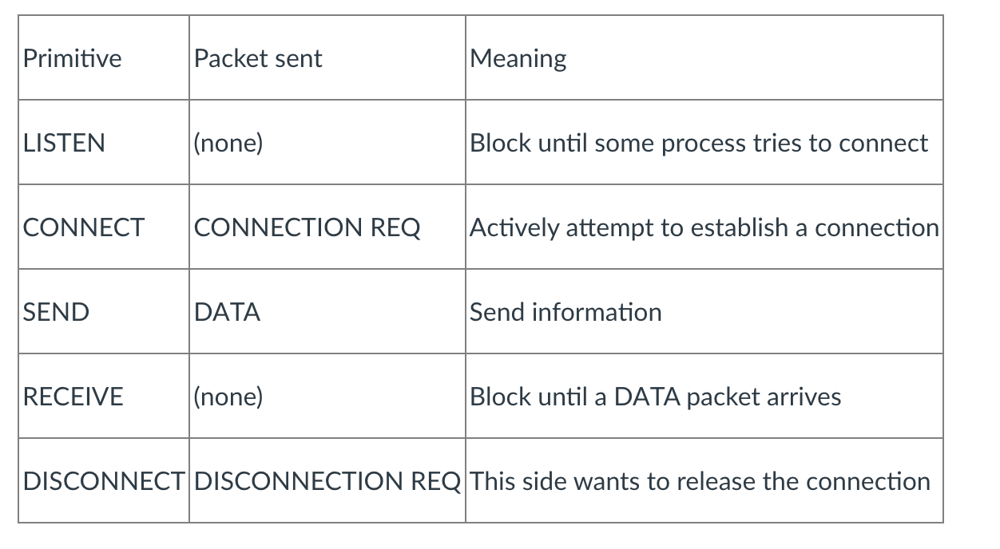
* The Transport Protocol Data Unit (TPDU) sends messages from transport entity to transport entity and these are
  contained in packets (exchanged by the network layer).
    * These packets are then contained in frames
* When a frame arrives, the data link layer processes the frame header and passes the contents of the frame payload
  field up to the network entity.
* The network entity then processes the packet header and passes the contents up to the transport entity.
  </br>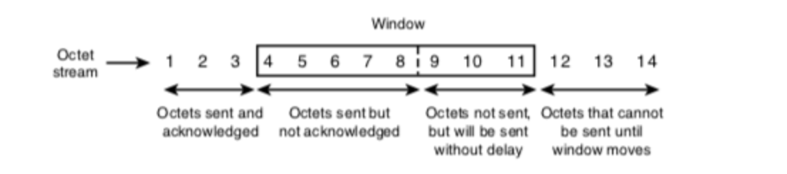

* When a client needs to communicate with the server it executes a CONNECT primitive.
    * The transport entity carries out this primitive by blocking the caller and sending a packet to the server.
    * The client’s CONNECT call causes a CONNECTION REQUEST TPDU to be sent to the server; on its arrival the transport
      entity checks to see that the server is blocked on a LISTEN.
    * It then unblocks the server and sends a CONNECTION ACCEPTED TPDU back to the client, and when the TPDU arrives,
      the client is unblocked and the connection is established.

* Data can now be exchanged using the SEND and RECEIVE primitives.
    * A (blocking) RECEIVE to wait for the other party to do a SEND can be sent by either party.

* When a connection is no longer needed, it must be released to free up table space within the two transport entities.
* Disconnection has two variants: asymmetric and symmetric.
    * **In asymmetric disconnection**, either transport user can issue a DISCONNECT primitive which results in a
      DISCONNECT TPDU being sent and actioned.
    * **In the symmetric variant**, each variant is closed separately, independent of each other. When one side sends a
      DISCONNECT, that means it has no more data to send but is still willing to accept data. A connection is only
      released when both sides have done a DISCONNECT.
      </br>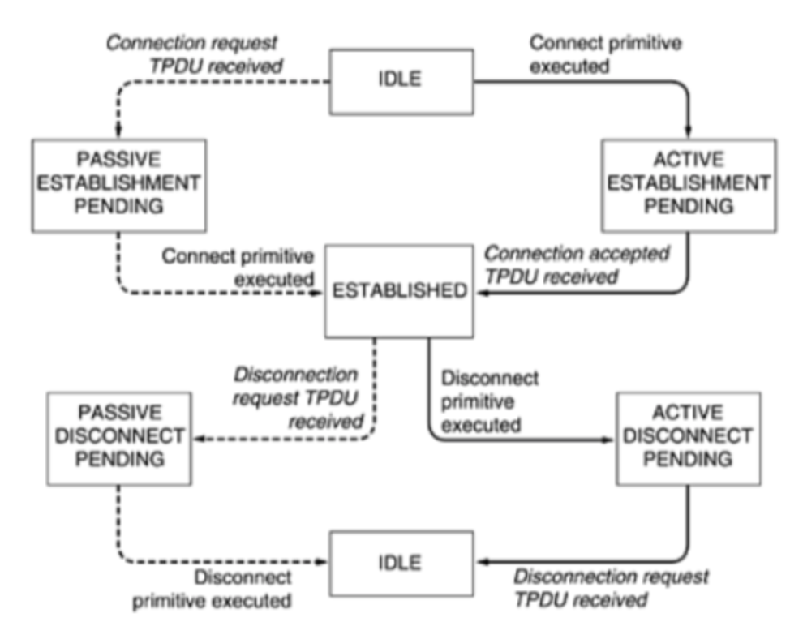

## TCP Activity

* If the server process is running, then the client can initiate a TCP connection to the server. This happens as
  follows:
    * The client creates a ‘socket’ and specifies the address of the server process, which is: IP address of the server
      and the port number of the server process.
    * When the ‘socket’ has been created in the client program, TCP in the client then initiates a three-way handshake
      and establishes a TCP connection with the server.
    * The three-way handshake takes place at the transport-layer and is completely transparent to the server and client
      programs. See the diagram below.

* During handshake:
    * the client knocks on the ‘door’ of the server process requesting a connection.
    * The server responds by opening the ‘door’ - i.e. creating a new socket, which is dedicated to that particular
      client.
    * At the end of the handshaking phase, a TCP connection exists between the client’s socket and the server's new
      socket, referred to as the server’s ‘connection socket’.

</br>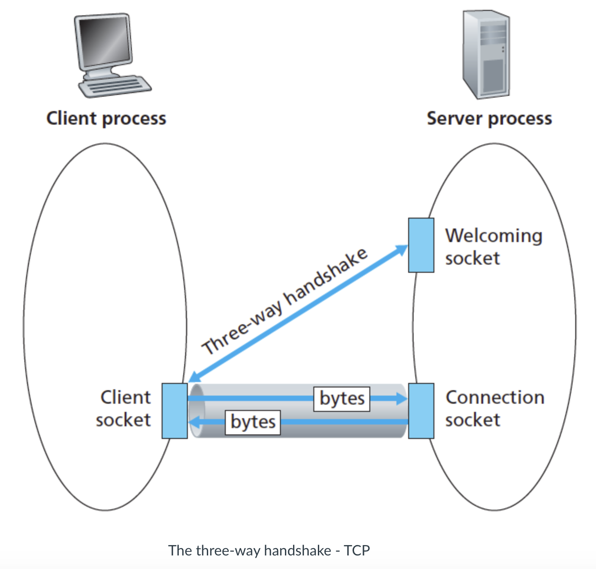

* What uses would unicast communication have?
    * Point to point communication
    * Equipment monitoring
    * Alarms

* What are the benefits of Unicast?
    * Unicast transmission has been in use for a long time, with well-established protocols and easy-to-deploy
      techniques. Well-known and trusted applications such as http, smtp, ftp and telnet all use the unicast standard
      and employ the TCP transport protocol. On a network, transmission takes place from host to host, which can reduce
      the traffic burden on a Local Area Network (LAN), as a whole.

* What are the drawbacks of Unicast?
    * If a network device is called upon to send a message to multiple nodes, it has to send multiple unicast messages,
      each addressed to a specific device. This first requires the sender to know the exact IP address of each
      destination device. In addition, each unicast client that connects to the host server uses up some network
      bandwidth. If multiple clients are involved, this may introduce scaling issues as far as network and server
      resources are concerned. The problem becomes even more pronounced if many hosts are transmitting via unicast to
      many receivers, at the same time.

</br>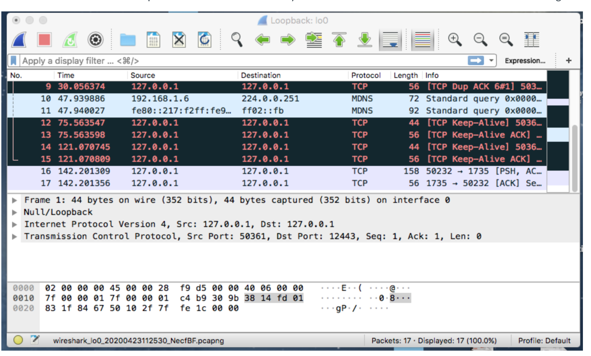

* Your TCP socket will be highlighted lilac and you should look for TCP under the ‘Protocol’ heading and an arrow
  pointing to or from the socket port 1735. You can see above that the last two lines are my communication that has been
  captured. The bottom line is the acknowledgement [ACK] and the next line up is the message [PSH]. Its source is the
  loopback 127.0.0.1 and its protocol is TCP and the ports in use are 50232 and 1735. The communication pipe is the
  connection to the server and client via port 1735 and the welcoming port is 50232, which completes the ‘three-way
  handshake’ as described earlier in the three-way handshake diagram

## GO-Bank-N Protocol (GBN)

* In a Go-Back-N (GBN) protocol, the sender is allowed to transmit multiple packets (when available) without waiting for
  an acknowledgment, but is constrained to have no more than some maximum allowable number, N, of unacknowledged packets
  in the pipeline.

</br>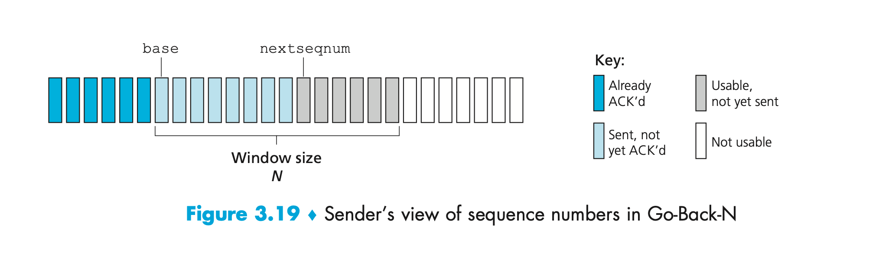

* Sequence numbers in the interval [0,base-1] correspond to packets that have already been transmitted and acknowledged.
  The inter- val [base,nextseqnum-1] corresponds to packets that have been sent but not yet acknowledged. Sequence
  numbers in the interval [nextseqnum,base+N-1] can be used for packets that can be sent immediately, should data arrive
  from the upper layer. Finally, sequence numbers greater than or equal to base+N cannot be used until an unacknowledged
  packet currently in the pipeline (specifically, the packet with sequence number base) has been acknowledged.

* A simple sliding window protocol uses "go-back-n" recovery.
* A receiver utilising Go-Back-N recovery only accepts segments that arrive in sequence and discards any out-of-sequence
  segments.
    * It always returns an acknowledgement containing the sequence number of the last segment received.
* The sender must wait for an acknowledgement once its sending buffer is full.
    * Once received, it removes all the acknowledged segments from the sending buffer and uses a retransmission timer to
      detect segment losses.
* When the go-back-n sender receives an acknowledgement, it restarts the transmission timer only if there are still
  unacknowledged segments in its sending buffer
* When the retransmission timer expires, the go-back-n sender assumes that all unacknowledged segments currently stored
  in its sending buffer have been lost
    * Thus It retransmits all the unacknowledged segments in the buffer and restarts the transmission timer.
* This is a good system to utilise the bandwidth when packet losses occur occasionally. However, if the losses are high,
  the performance drops because;
    * the go-back-n receiver does not accept out-of-sequence segments
    * the go-back-n sender retransmits all unacknowledged segments once it has detected a loss.

</br>

## Ports and Sockets

### Ports

* A port is a 16 bit number used by the host-to-host protocol to identify to which higher level protocol or application
  program it must deliver incoming messages.
* Well-known:
    * These belong to standard servers.
    * For example, Telnet uses port 23.
    * Well-known port numbers range between 1 and 1023
    * Most servers require only a single port except for the BOOTP server which uses 767 and 68, and the FTP server
      which uses 20 and 21.
    * Well-known ports are controlled and assigned by
      the [Internet Assigned Numbers Authority (IANA)](https://www.iana.org/) and on most systems can only be used by
      system processes or by programs executed by admin users.
    * Well-known ports allow clients to find servers without configuration information.
* Ephemeral
    * Some clients do not need well-known port numbers because they initiate communication with servers and the port
      numbers they are using are contained in the TCP/UDP datagrams sent.
    * Each client process is allocated a port number for as long as it needs it by the host on which it is running.
    * Ephemeral ports numbers have values greater than 1023, normally in the range of 1024 to 65535.
    * These are not controlled by IANA and can be used by most systems.

* If two different applications are trying to use the same port numbers on one host then this clash is avoided, but with
  applications requesting an available port from TCP/IP, the port is dynamically assigned and can differ from one
  invocation to the next.

* UDP, TCP and ISO TP-4 all use the same principles for port management.

### Sockets

* The socket interface is one of several application programming interfaces to the communication protocols
* A **socket** is a special type of file handle which is used by a process to request network services from the
  operating system
* A **socket address** is in triple **<protocol, local address, local port>**, e.g. <tcp, 192.168.16.8080>
* A **conversation** is the communication link between the two processes.
* An **association** is the 5-tuple that completely specifies the two processes that comprise a connection: <protocol,
  local-address, local-port, foreign-address, foreign-port>
    * so <tcp, 192.168.16, 1500, 192.168.43.75, 22> would be valid.
* A **half association** is either one of the following which specifies half a connection:
    * <protocol, local-address, local-process> or <protocol, foreign-address, foreign-process>
    * This is also called a socket or transport address.

* Two processes communicate through TCP sockets which provides a process with a full duplex byte stream connection to
  another process.

* TCP uses the same port principle as UDP to provide multiplexing.
    * Like UDP, TCP uses well-known and ephemeral ports.
    * Each side of a TCP connection has a socket that can be identified by the triple address.
    * If two processes are communicating over TCP, they have a logical connection that is uniquely identifiable by the
      two sockets involved.
    * Server processes are able to manage multiple conversations through a single port.

# QUIZ:

* The OSI has seven layers, which layer does SMTP work at?
    * Application
* You need to have secure communications using HTTPS. What port number is used by default?
    * 443
* You want to implement a mechanism that automates the IP configuration, including IP address, subnet mask, default
  gateway, and DNS information. Which protocol will you use to accomplish this?
    * Dynamic Host Configuration Protocol (DHCP) is used to provide IP information to hosts on your network. DHCP can
      provide a lot of information, but the most common is IP address, subnet mask, default gateway, and DNS
      information.
* What protocol is used to find the hardware address of a local device?
    * Address Resolution Protocol (ARP) is used to find the hardware address from a known IP address.
* You need to login to a Unix server across a network that is not secure. Which of the following protocols will allow
  you to remotely administrator this server securely?
    * SSH
* If you can ping by IP address but not by hostname, or FQDN, which of the following port numbers is related to the
  server process that is involved?
    * The problem is with DNS, which uses both TCP and UDP port 53.
* Which of the following describe the DHCP Discover message?
    * A client that sends out a DHCP Discover message in order to receive an IP address sends out a broadcast at both
      Layer 2 and Layer 3. The Layer 2 broadcast is all Fs in hex, or FF:FF:FF:FF:FF:FF. The Layer 3 broadcast is
      255.255.255.255, which means all networks and all hosts. DHCP is connectionless, which means it uses User Datagram
      Protocol (UDP) at the Transport layer, also called the Host-to-Host layer.
* What layer 4 protocol is used for a Telnet connection, and what is the default port number?
    * Telnet uses TCP at the Transport layer with a default port number of 23.
* Which statements are true regarding ICMP packets?
    * Internet Control Message Protocol (ICMP) is used to send error messages through the network, but ICMP does not
      work alone. Every segment or ICMP payload must be encapsulated within an IP datagram (or packet).
* Which of the following services use TCP?
    * SMTP, FTP, and HTTP use TCP
* Which of the following services use UDP?
    * DHCP, SNMP, and TFTP use UDP. SMTP, FTP, and HTTP use TCP.
* Which of the following are TCP/IP protocols used at the Application layer of the OSI model?
    * Telnet, File Transfer Protocol (FTP), and Trivial FTP (TFTP) are all Application layer protocols. IP is a Network
      layer protocol. Transmission Control Protocol (TCP) is a Transport layer protocol.
* Which of the following protocols is used by e-mail servers to exchange messages with one another?
    * SMTP is used by a client to send mail to its server and by that server to send mail to another server. POP3 and
      IMAP are used by clients to retrieve their mail from the server that stores it until it is retrieved. HTTP is only
      used with web-based mail services.
* If you use either Telnet or FTP, which is the highest layer you are using to transmit data?
    * Both FTP and Telnet use TCP at the Transport layer; however, they both are Application layer protocols, so the
      Application layer is the best answer for this question.
* Which of the following protocols can use TCP and UDP, permits authentication and secure polling of network devices,
  and allows for automated alerts and reports on network devices?
    * Simple Network Management Protocol, is typically implemented using version 3, which allows for a connection
      oriented service, authentication and secure polling of network devices, and allows for alerts and reports on
      network devices.
* You need to transfer files between two hosts. Which two protocol can you use?
    * Secure Copy Protocol (SCP), and File Transfer Protocol (FTP), can be used to transfer files between two systems.
* What layer in the IP stack is equivalent to the Transport layer of the OSI model?
    * The four layers of the IP stack (also called the DoD model) are Application/Process, Host-to-Host, Internet, and
      Network Access. The Host-to-Host layer is equivalent to the Transport layer of the OSI model.
* You need to make sure that your network devices have a consistent time across all devices. What protocol do you need
  to run on your network?
    * Network Time Protocol will ensure a consistent time across network devices on the network.
* Which of the following allows a server to distinguish among different simultaneous requests from the same host?
    * Through the use of port numbers, TCP and UDP can establish multiple sessions between the same two hosts without
      creating any confusion. The sessions can be between the same or different applications, such as multiple
      web-browsing sessions or a web-browsing session and an FTP session.
* Which of the following protocols uses both TCP and UDP?
    * DNS uses TCP for zone exchanges between servers and UDP when a client is trying to resolve a hostname to an IP
      address.

# TODO:

* [UDP in Java](https://www.baeldung.com/udp-in-java)
* [A Simple Java UDP Server and UDP Client](https://systembash.com/a-simple-java-udp-server-and-udp-client/)
* Spend some time researching concepts such as PPP, de-encapsulation and tunnelling with regard to encapsulation


* **The ACK value is 'x' if the segment never arrives, or is equal to the next expected sequence number**
* **The sequence number for the first segment is always the starting value**
* **If the sender doesn't send a segment, write 'x'; otherwise, the sequence number is equal to the previous sequence
  number + the segment size**

# WEEK 4

#### Main Topics

*Lesson 1, we focus on the basics of the transport layer and will:

* Examine what the layer consists of * Introduce routing and forwarding

* Lesson 2 we focus on addressing. Particular topics include:
    * IPv4
    * IPv6
    * How they are constructed and their differences
* Lesson 3 we focus on Network Addresses and how they are used on a network.

#### Sub titles:

* [What is the network layer?](#what-is-the-network-layer)
    * [Interplay between routing and forwarding](#interplay-between-routing-and-forwarding)
* [IPv4 and IPv6](#ipv4-and-ipv6)
    * [IP version 6 (IPv6)](#ip-version-6-ipv6)
* [Network Addresses](#network-addresses)
    * [Classful Addressing](#classful-addressing)
    * [Private Addresses](#private-addresses)
    * [Fragmentation & IP Packet Structure](#fragmentation--ip-packet-structure)
    * [Address Resolution Protocol (ARP)](#address-resolution-protocol-arp)
* [Questions](#questions)
* [Quiz IPv4 & IPv6](#quiz-ipv4--ipv6)
* [Todo](#todo)

# What is the network layer?

* The network layer is concerned with getting packets from the source all the way to the destination.
* The packets may be required to make many hops via the intermediate routers before they reach their destination.
* This is the lowest layer that deals with end-to-end transmission.
    * In order to achieve its goals, the network layer must know about the topology of the communication network.

* One of the major responsibilities of the network layer protocol is host-to-host data delivery.
    * In doing this, the network layer has to deal with network layer addressing, packetisation and fragmentation,
      routing (and forwarding), as well as the concept of internetworking (connecting links of various types into a
      united internetwork view)
* There are two logical types of packet-switched networks: datagram networks and virtual circuit networks.
  </br>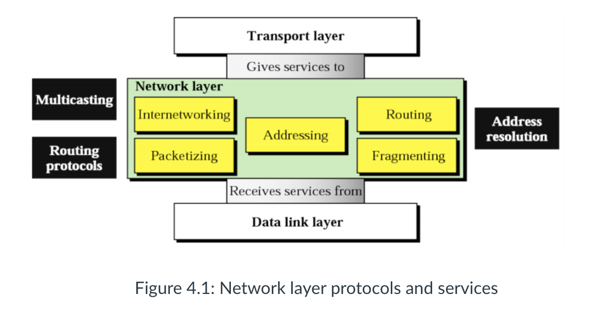

* Some of the key roles of the network layer are:
    * Forwarding packets from the sending to the receiving host.
    * On the sending side: encapsulating transport packets into datagrams.
    * On the receiving side: delivering packets to the transport layer.
    * Network layer protocols exist in every host & router.
    * Router examines header fields in all datagrams.

* The main functions of the network layer are:
    * **Forwarding**: moving packets from router’s input to appropriate router output.
    * **Routing**: determining the route taken by packet from source to destination. The algorithms that calculate these
      paths are referred to as ‘**routing algorithms**’.

## Interplay between routing and forwarding

* **Connection Setup**
    * Before datagrams (data packets) flow, two end hosts and intervening routers establish a virtual connection (VC).
    * This allows the sender and receiver to set up the necessary state information
        * for example, sequence number and initial flow-control window size
    * This is in order to set up the state before network-layer data packets within a given source-to-destination
      connection can begin to flow.
      </br>

* **Datagram Network**
    * On packet-switched computer networks data are communicated in bit chunks that are called ‘packets’.
        * Packet-switched networks that provide a connectionless, unreliable service (e.g. the Internet) are called
          datagram networks.
        * In datagram networks, there is no concept of a session state in the network core.
        * Routers treat each datagram independently and their per-datagram behaviour is statistical (the destination
          network address determines the choice of outgoing interface).
        * Therefore, different datagrams travelling from sender to receiver in a datagram network can take different
          paths.
          </br>

# IPv4 and IPv6

* The Internet layer is responsible for exchanging packets over a network between identified end devices.
    * There are 2 common protocols IPv4, IPv6

* Both protocols provide devices with a unique IP address to allow for packet delivery
* Because of the growth of the Internet, IPv4 can no longer support unique addresses for every device that requires
  Internet access, so Network Address Translation (NAT) is used to ‘hide’ non-unique private IP addresses behind unique
  public IP addresses.

* IPv4 can receive either TCP segments or UDP datagrams from the transport layer, which it encapsulates within packets.
* IPv4 Header tags
    * Source address : the 32-bit address assigned to the (network interface card) NIC of the host that created a
      packet, not the MAC address
    * Destination address : the 32-bit address of the device to which the packet is sent.
    * Data : this is the payload (pure data) that an IP carries, typically a segment or datagram from the transport
      layer. This will vary across devices and mediums .
    * Protocol : the transport layer protocol encapsulated within the packet. Protocols are identified using a service
      access point (SAP) number, which is 06 for TCP and 17 for UDP. Because the SAP of the transport layer protocol is
      identified in each packet, IP can deliver segments to the correct transport layer protocol on the receiving
      device.
    * Header checksum : checks for damage during transmission. If IPv4 discovers a damaged header, the entire packet is
      dropped. Because IPv4 does not guarantee reliable delivery of packets, it relies on TCP to arrange for
      retransmission of the segment encapsulated within the dropped packet.
    * Time to live (TTL) : specifies a lifetime for packets, which if exceeded will cause the packet to be dropped. The
      actual value initially placed in the TTL field depends on a computer’s operating system, but the maximum value is
        255. Each router that receives a packet as it is forwarded towards its destination will reduce the value of the
             TTL field by ‘1’. If a router receives a packet with a TTL value of ‘1’, it will discard the packet. This
             protects the Internet from endlessly forwarding packets that have become stuck in a loop.
* Encapsulating a segment or datagram within an IPv4 header adds an additional 20 bytes of data, and this can sometimes
  be exceeded if some of the optional fields are used.            
  </br>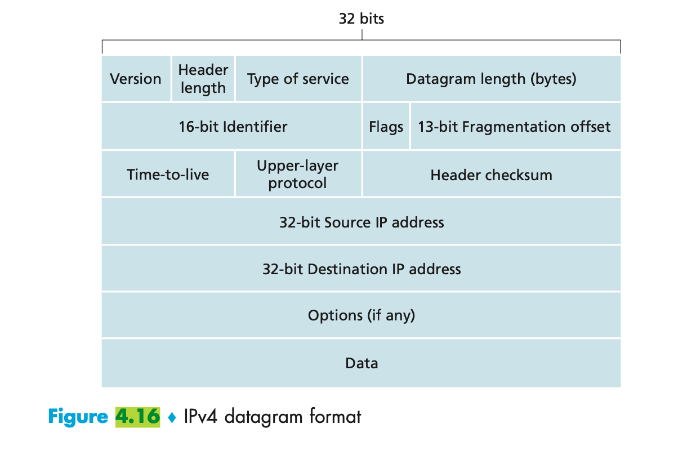

* The maximum size of the payload that can be encapsulated within a data link layer frame is dependent on the specific
  link type and is referred to as the Maximum Transmission Unit (MTU).
    * For example, Ethernet has an MTU of 1500 bytes and WiFi (wireless IEEE 802.11 protocol) has an MTU of 2400 bytes.
    * If the size of the IP datagram is larger than the link MTU, the transmitter (i.e. a source host or a router on the
      path) needs to fragment the datagram to fit into frames.
        * his is called **fragmentation** . After fragmentation, individual fragments travel to the destination host
          independently of each other and they are reassembled into the full IP datagram only at the last destination
          host.

## IP version 6 (IPv6)

* IPv4 is 32-bit , but IPv6 is 128 bits, which means that there are 2^28 IPv6 addresses.
* The packet format of IPv6 is simpler than the IPv4, which speeds up processing at routers.
* **Improvements in IPv6**
    * Increased address space: it uses 128-bit addressing, which provides a phenomenal number of addresses (
      approximately 3.4×1038). Although the address is still binary, it is represented using hexadecimal for ease of
      use, e.g. 2001:db8:acad:1:1:1:1/64.
    * Packet handling : it uses a simplified header with fewer fields than IPv4, making it easier for routers to
      process. For example, as there is no longer a header checksum, routers do not need to perform the error checking
      function and can rely entirely on TCP.
    * Eliminates NAT : it provides a large address space, so it is possible to use IPv6 public addresses on all
      networks, thus making NAT redundant. This also makes the operation of routers more straightforward.

</br>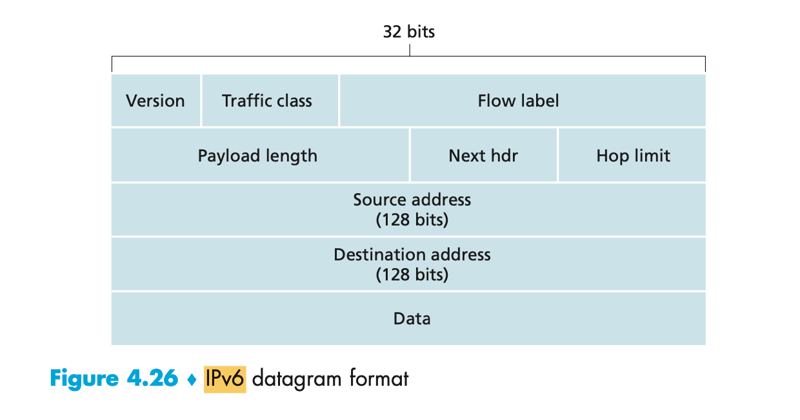

* Version (4-bits): It represents the version of Internet Protocol, i.e. 0110.
* Traffic Class (8-bits): These 8 bits are divided into two parts. The most significant 6 bits are used for Type of
  Service to let the Router Known what services should be provided to this packet. The least significant 2 bits are used
  for Explicit Congestion Notification (ECN).
* Flow Label (20-bits): This label is used to maintain the sequential flow of the packets belonging to a communication.
  The source labels the sequence to help the router identify that a particular packet belongs to a specific flow of
  information. This field helps avoid re-ordering of data packets. It is designed for streaming/real-time media.
* Payload Length (16-bits): This field is used to tell the routers how much information a particular packet contains in
  its payload. Payload is composed of Extension Headers and Upper Layer data. With 16 bits, up to 65535 bytes can be
  indicated; but if the Extension Headers contain Hop-by-Hop Extension Header, then the payload may exceed 65535 bytes
  and this field is set to 0.
* Next Header (8-bits): This field is used to indicate either the type of Extension Header, or if the Extension Header
  is not present then it indicates the Upper Layer PDU. The values for the type of Upper Layer PDU are same as IPv4’s.
* Hop Limit (8-bits): This field is used to stop packet to loop in the network infinitely. This is same as TTL in IPv4.
  The value of Hop Limit field is decremented by 1 as it passes a link (router/hop). When the field reaches 0 the packet
  is discarded.
* Source Address (128-bits): This field indicates the address of originator of the packet.
* Destination Address (128-bits): This field provides the address of intended recipient of the packet.

# Network Addresses

* The Internet Protocol (IP) is a data-oriented, best-effort protocol (doesn't guarantee delivery) used for
  communicating data across a network.
* Transmission using IP may result in duplicated packets and/or packets that are out of sequence.
* All of these contingencies are addressed by an upper-layer protocol (such as TCP) for applications that require
  reliable delivery.
* An IP address is a logical identifier for a computer or device on a network and its key feature is that they can be
  routed across networks.
* The IP address will be the unique identifier for that device (as well as the MAC) within the domain or network.
* The format of an IPv4 address is a 32-bit numeric address written as four numbers separated by full stops, sometimes
  referred to as a "dotted-quad" (IPv4). The range of each number can be from 0 to 255.
    * For example, 2.165.12.230 would be a valid IP address.

  </br>

### Classful Addressing

* The idea is to make address allocation scalable.
* In classful addressing, an IP address is divided into three sections:
    * Class type: Identifies the class type (A, B, or C).
    * Network Number: Identifies the network.
    * Host Number: Identifies the host.
    * Class A addresses support 16 million hosts on each of 126 networks.
        * 1.0.0.0 - 126.255.255.255, subnet 255.0.0.0
    * Class B addresses support 65,000 hosts on each of 16,000 networks.
        * 128.0.0.0 - 191.255.255.255, subnet 255.255.0.0
    * Class C addresses support 254 hosts on each of 2 million networks.
        * 192.0.0.0 - 223.255.255.255, subnet 255.255.255.0
* The number of unassigned Internet addresses is running out, so Classless Inter-Domain Routing (CIDR) is gradually
  replacing the classful addressing system and IPV6 addresses.

  </br>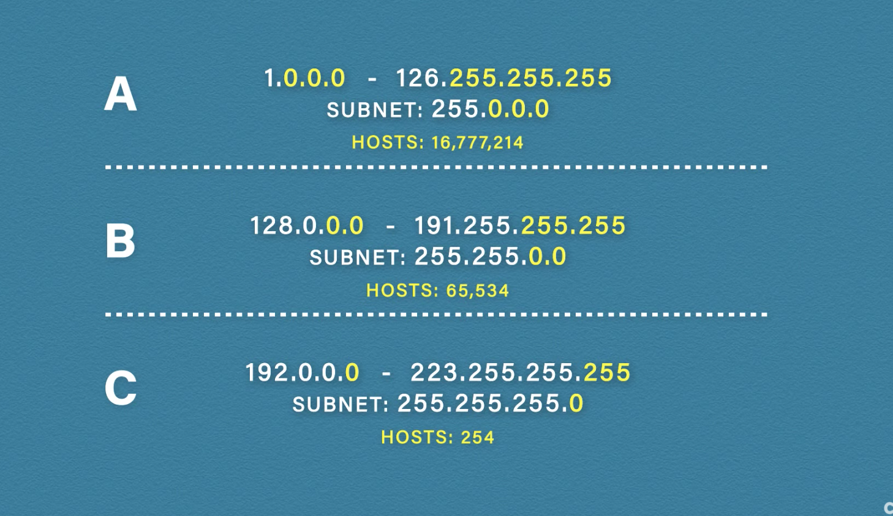

### Private Addresses

* Network hosts that do not need to have their addresses visible on the public Internet, so they are on a LAN only, can
  be assigned a private IP address (those that sit behind the router or default gateway).

* The following are the four IP address ranges reserved for private networks:
    * Class A: 10.0.0.0—10.255.255.255
    * Class B: 172.16.0.0—172.31.255.255
    * Class C: 192.168.0.0—192.168.255.255
    * APIPA : 169.254.0.0—169.254.255.255

* The Loopback address is 127.0.0.1.
    * An APIPA-generated address has high order octets with a value of 169.254.
    * A Class C registered IP address has a first octet value of 192 to 223 excluding the private range noted previously

* Public addresses has to be unique, but private addresses can use again and again. Thus saving millions public ip
  addresses.
  </br>

* [IP addresses Video](https://www.youtube.com/watch?v=LIzTo6e4FgY)

## Fragmentation & IP Packet Structure

* IP exists at the Internet layer and passes datagrams to the network access for transmission on the network.
* The various network interfaces impose a limit on the maximum payload size that can be delivered per frame, which is
  called the maximum transmission unit (MTU).
* If the MTU of the network interface device, such as an Ethernet unit, is smaller than the IP datagram, the IP module
  must divide the datagram into smaller fragments.
* Each fragment is then put into a separate IP packet for delivery across the network. Information embedded in the IP
  header informs the receiving host that the IP datagram is part of a larger block of data and must be reassembled.
* The process of fragmenting and reassembling IP datagrams is analogous to the segmentation and reassembly of segments
  performed by TCP.
  </br>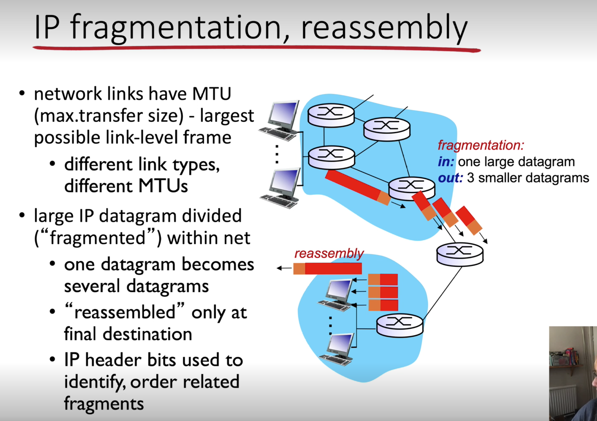
  </br>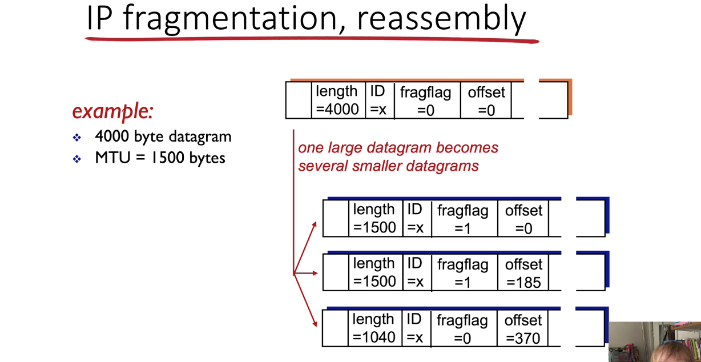

## Address Resolution Protocol (ARP)

* When an IP module requests a datagram be transmitted by the network layer, be it in an end system or an intermediate
  router, IP must first translate between the IP address and this unique physical address using another Internet layer
  service, known as the Address Resolution Protocol (ARP).
* The Address Resolution Protocol is a method for translating between the Internet layer and the network layer address.
* The ARP module in a computer or router maintains a translation table of the logical to physical mappings of which it
  is aware, called the ARP cache.
* Using the Internet and TCP/IP in an example, the basic steps of ARP translation are
    * ARP checks the local cache to see if it knows the mapping between the IP address and a physical address (the Media
      Access Control [MAC] address).
    * If there is no match, ARP broadcasts an ARP request to the local network. The broadcast is received by every
      computer and router to which the host is connected.
    * If a computer with a matching IP address exists on the local network, it sends its MAC address back. The ARP
      module adds this translation to the ARP cache for future use.
    * If a router on the local network realises that the requested IP address is outside the local network, it sends
      back its MAC address, in order for the IP datagram to be forwarded to it.

* The same process is used to forward IP datagrams between routers as a packet traverses the network. When a router is
  designated as the next hop, the MAC address of the router, rather than the receiving computer, is provided as the IP
  to MAC translation.

  </br>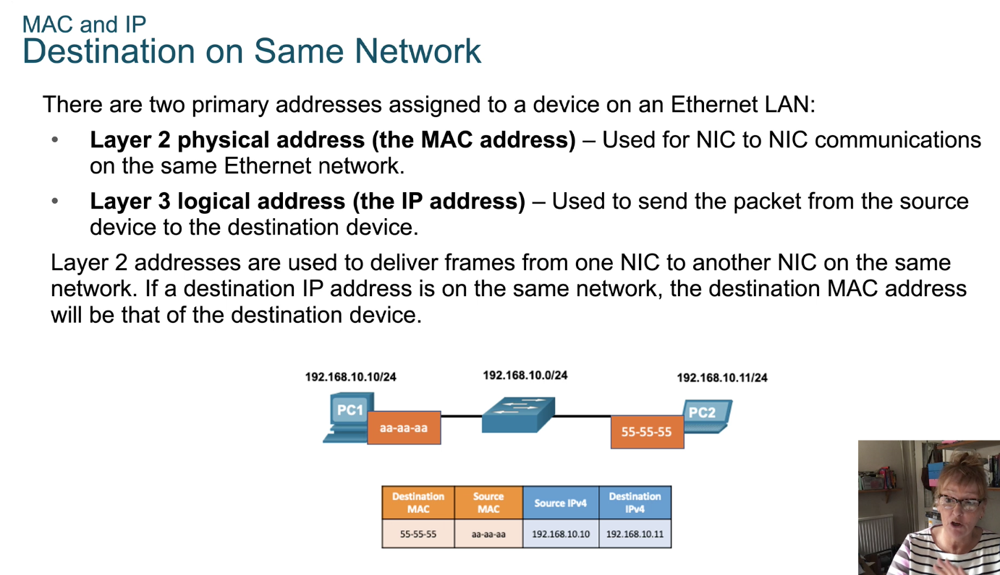
  </br>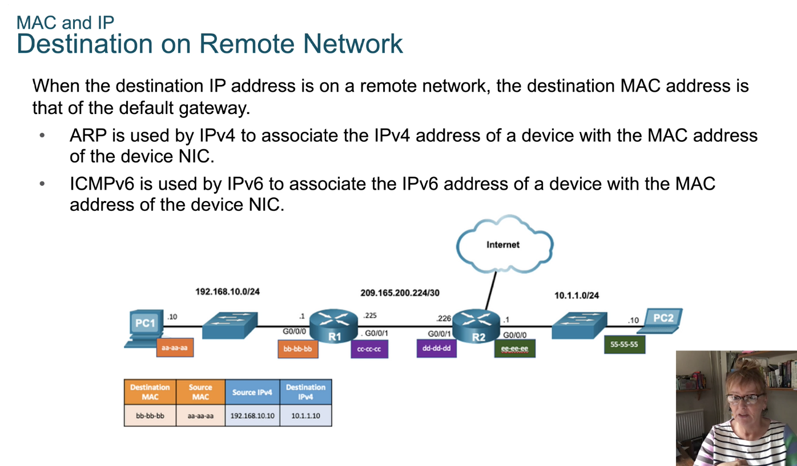

* “ARP poisoning”, that's when a host requests the MAC address of the default gateway and a threat actor sends a
  gratuitous ARP listing, listing themselves as the default gateway. The unsuspecting host then sends all of the
  messages to the threat actor who in turn forwards them out through the router but records all the data that was sent.
    * DHCP snooping builds a table of IP addresses to MAC addresses, so like your ARP table. If a threat actor tries to
      insert their own MAC address, the table recognises this change and shuts off the port that the threat actor is
      attached to.

* IPv6 Neighbour Discovery (ND) protocol provides
    * Address resolution
    * Router discovery
    * Redirection services
* ICMPv6 Neighbour Solicitation (NS) and Neighbour Advertisement (NA) messages are used for device-to-device messaging
  such as address resolution.
* NS is also used to make sure that no other device in the network has the same IPv6 address.
* ICMTPv6 Router Solicitation (RS) and Router Advertisement (RA) messages are u for messaging between devices and
  routers for router discovery.
* ICMPv6 redirect messages are used by routers for better next-hop selection.
  </br>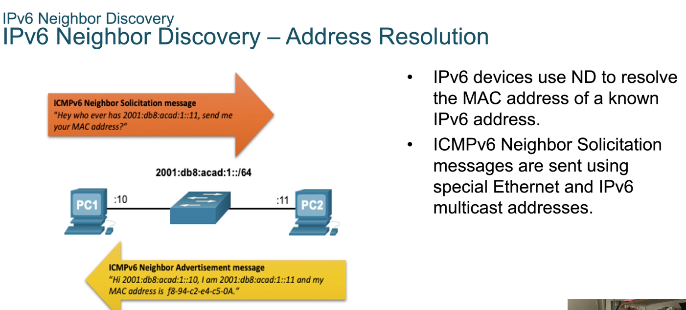

# Questions

* The name of a transport-layer packet is segment and that the name of a link-layer packet is frame. What is the name of
  a network-layer packet? Recall that both routers and link-layer switches are called packet switches. What is the
  fundamental difference between a router and link-layer switch?
    * A network-layer packet is a datagram. A router forwards a packet based on the packet’s IP (layer 3) address. A
      link-layer switch forwards a packet based on the packet’s MAC (layer 2) address.
* Network layer functionality can be broadly divided into data plane functionality and control plane functionality. What
  are the main functions of the data plane? Of the control plane?
    * The main function of the data plane is packet forwarding, which is to forward datagrams from their input links to
      their output links. For example, the data plane’s input ports perform physical layer function of terminating an
      incoming physical link at a router, perform link-layer function to interoperate with the link layer at the other
      side of the incoming link, and perform lookup function at the input ports. The main function of the control plane
      is routing, which is to determine the paths a packet takes from its source to its destination. A control plane is
      responsible for executing routing protocols, responding to attached links that go up or down, communicating with
      remote controllers, and performing management functions
* There is a distinction between the forwarding function and the routing function performed in the network layer. What
  are the key differences between routing and forwarding?
    * The key differences between routing and forwarding is that forwarding is a router’s local action of transferring
      packets from its input interfaces to its output interfaces, and forwarding takes place at very short timescales (
      typically a few nanoseconds), and thus is typically implemented in hardware. Routing refers to the network-wide
      process that determines the end-to-end paths that packets take from sources to destinations. Routing takes place
      on much longer timescales (typically seconds), and is often implemented in software.

## Quiz IPv4 & IPv6

* What is the valid range of values that may appear in an IPv4 octet? Give your answer in decimal as well as binary.
    * The range of values that an IPv4 octet can take on is 0 through 255 in decimal, which stems from the values
      00000000 through 11111111 in binary.

* Name some of the benefits of IPv6 over IPv4.
    * IPv6 has the following characteristics, among others, that make it preferable to IPv4: more available addresses,
      simpler header, options for authentication and other security.

* What is the term for the auto-configuration technology responsible for addresses that start with 169.254?
    * Automatic Private IP Addressing (APIPA) is the technology that results in hosts automatically configuring
      themselves with addresses that begin with 169.254.
    * When a workstation cannot obtain an IP address from a DHCP server, often an IP address will be autogenerated by
      automatic private IP addressing (APIPA). The IP addresses are in the range 169.254.0.1 to 169.254.255.254. The
      correct response is B. The other responses are valid IP addresses that are either statically assigned or
      dynamically assigned by a DHCP server.

* What does the IP Properties selection, 'Obtain an IP Address Automatically' indicate?
    * Filling in the Obtain an IP Address Automatically radio button in IP Properties configures the host as a DHCP
      client.

* What effect will an inappropriate DHCP server have on hosts using static IP addresses?
    * None; DHCP servers cannot override statically assigned IP information

* What is the name for a 48-bit (6-byte) numerical address physically assigned to a network interface, such as a NIC(
  network interface card)?
    * A MAC address, sometimes called a hardware address or even a burned-in address.

* What gives IPv6 the ability to reference more addresses than IPv4?
    * The fact that it has 128-bit (16-octet) addresses, compared to IPv4’s 32-bit (4-octet) addresses.

* What predecessor to DHCP, on which DHCP is based, was used to assign a workstation its IP information and to supply it
  with a boot image?
    * BootP, the Bootstrap Protocol, used the same port numbers as DHCP but supplied more simplified information to a
      diskless workstation and allowed the workstation to download a remote boot image.

* What is the Class C range of values for the first octet in decimal and in binary?
    * 192–223, 110xxxxx.

* What is the 127.0.0.1 address used for?
    * Loopback or diagnostics.

# TODO

* [What is an IP address](https://computer.howstuffworks.com/internet/basics/what-is-an-ip-address.htm)
* [IP addressing and subnetting ](https://www.cisco.com/c/en/us/support/docs/ip/routing-information-protocol-rip/13788-3.html#anc0)
* Go back 4.5.4 Wireshark activities

# WEEK 5

#### Main Topics

* Lesson 1
    * What the layer consists of
    * Broadcast domains
    * Collision domains
    * NAT
* Lesson 2:
    * ICSMA/CD
    * Error correction
* Lesson 3
    * Channel partitioning protocols
    * Switched LANs

#### Sub titles:

* [Link Layer](#link-layer)

# Link Layer

* The link layer sits at the bottom of the stack
* The datalink layer is responsible for
    * Ethernet addressing which is often referred to as MAC addressing,
    * framing and preparation of data for transmission on a LAN
        * The framing consists of combining bits into bytes, and bytes into frames, which are then encapsulated and
          passed down the layer to the physical layer.
* Messages are passed across the LAN using MAC addressing system and cyclic redundancy checks (CRC) provides error
  detection at this level.
* The network access layer accepts packets from the Internet layer and prepares them for transmission over a wide range
  of physical transmission media.
* Frames that are transmitted over a media are guided by the network protocols which include how and when they can
  transmit. This is referred to as media access control (MAC).

* The datalink layer provides error-free transfer of data frames over the physical layer:
    * Link establishment and termination
    * Frame traffic control
    * Frame sequencing
    * Frame acknowledgement
    * Frame error checking
    * Media access management

* The IEEE Ethernet Datalink layer has two sublayers :
    * Media Access Control (MAC)
    * Logical Link Control (LLC)

* Devices which work at Layer 2 include:
    * Switch
    * Network adapter
    * Bridge

* The network access layer is concerned with both software and hardware transmission which include the network interface
  card NIC’s and wifi adapters.
    * Adapters contain a signal to be sent to identify the type of transmission media and the software for framing and
      media access control services and speed of medium type.

* Ethernet has become the most common network standard and technology and is a family of related protocols standardised
  by the IEEE. However, the physical cable is often called Ethernet too.
    * Ethernet standards define the protocols and technology used within the network access layer.
* One function of Ethernet is to encapsulate Internet layer packets into PDU's called frames .
  </br>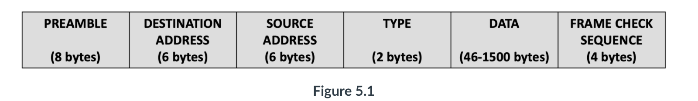
* The important fields to note are:
    * Destination address : the 48-bit MAC address assigned to the NIC. Unlike IP, this address is assigned permanently
      to the NIC during manufacture.
    * Source address : the 48-bit MAC address of the device to which the frame is sent.
    * Type : the SAP identifying the Internet layer protocol packet encapsulated within the frame. A SAP of 0x800 is
      used for IPv4, and 0x86DD for IPv6.
    * Data : the payload (amount of data) carried by the frame, typically a packet from either IPv4 or IPv6. The maximum
      size of a packet that a frame can carry is 1500 bytes.
    * Frame check sequence (FCS) : a mathematically generated code used to check that the frame has not been damaged
      during transmission – similar in function to the checksum used by TCP. Unlike TCP, if Ethernet determines that a
      frame has been damaged, it drops it and relies on TCP to arrange for retransmission of the segment the frame
      contained.

* Possible services that can be offered by a link-layer protocol include:
    * **Framing**. Almost all link-layer protocols encapsulate each network-layer data- gram within a link-layer frame
      before transmission over the link.
        * A frame consists of a data field, in which the network-layer datagram is inserted, and a number of header
          fields.
    * **Link access**. A medium access control (MAC) protocol specifies the rules by which a frame is transmitted onto
      the link.
        * For point-to-point links that have a single sender at one end of the link and a single receiver at the other
          end of the link, the MAC protocol is simple (or nonexistent)—the sender can send a frame whenever the link is
          idle.
        * The more interesting case is when multiple nodes share a single broadcast link—the so-called multiple access
          problem.
            * Here, the MAC protocol serves to coordinate the frame transmissions of the many nodes.

    * **Reliable delivery**. When a link-layer protocol provides reliable delivery service, it guarantees to move each
      network-layer datagram across the link without error.
        * Similar to a transport-layer reliable delivery service, a link-layer reliable delivery service can be achieved
          with acknowledgments and retransmissions
        * A link-layer reliable delivery service is often used for links that are prone to high error rates, such as a
          wireless link, with the goal of correcting an error locally—on the link where the error occurs—rather than
          forcing an end-to-end retransmission of the data by a transport- or application-layer protocol.
            * However, link-layer reliable delivery can be considered an unnecessary overhead for low bit-error links,
              including fiber, coax, and many twisted-pair copper links. For this reason, many wired link-layer
              protocols do not provide a reliable delivery service.

    * **Error detection and correction**. The link-layer hardware in a receiving node can incorrectly decide that a bit
      in a frame is zero when it was transmitted as a one, and vice versa.
        * Such bit errors are introduced by signal attenuation and electromagnetic noise.
        * Because there is no need to forward a datagram that has an error, many link-layer protocols provide a
          mechanism to detect such bit errors.
        * This is done by having the transmitting node include error-detection bits in the frame, and having the
          receiving node perform an error check.
        * Error detection in the link layer is usually more sophisticated and is implemented in hardware. Error
          correction is similar to error detection, except that a receiver not only detects when bit errors have
          occurred in the frame but also determines exactly where in the frame the errors have occurred (and then
          corrects these errors

## Ethernet switch operation

* when we're referring to switches, we are talking about Ethernet switches.
    * unmanaged switches (not programmable or customisable), so they just plug and play.
* A switch is a link-layer device and it selectively forwards frames to one or more outgoing ports.
    * it uses CSMA/CD - CSMA is “carrier-sense multiple access” and CD is “collision detection”,
* Frames goes in one port, traffic comes in one port and it goes out of all of the others, but only valid packets.
* If an address is on the switch's forwarding table, then it only comes out on the relevant port of the switch that can
  access the end device.
    * Otherwise, the switch pushes the packet out on all ports, apart from the one that the message originates from.
* Plug-and-play switches use buffers, they work at the application layer and nodes are not known by their MAC address
  initially; in an IP network ARP is used.
    * So ARP is “address resolution protocol” and it's the system which translates an IP address into a MAC address and
      backwards.

* Switches forward frames using the destination address to make switching decisions.
  </br>
* In above the topology includes a second Ethernet switch, which is connected to the existing switch via Port 3. Devices
  node3 and node4 have been moved to Switch 2, and their MAC addresses have been added dynamically (or automatically) to
  the MAC address table against the new ports to which they are connected.
    * Because Switch 1 connects to Switch 2 via Port 3, the MAC addresses for node3 and node4 are listed against Port 3
      on Switch 1 – this is the path Switch 1 will use to forward frames destined for either of these node's.

* Because switches dynamically add source MAC addresses to their MAC address tables, the switches have a mechanism for
  dynamically unlearning them.
    * This prevents the table being filled with MAC address entries for devices that have been disconnected from the
      network.
    * Thus, most switches only maintain entries that are currently being used for frame forwarding.
    * Once frame forwarding finishes, switches delete MAC address entries after a short delay of typically 5 minutes.

## Broadcast and Collision domains

* ARP creates a segment, which is encapsulated within a packet address, using the source IP address of PC1. However, the
  destination IP address is the ‘255.255.255.255’ address reserved by IPv4 for broadcasting to all devices within an IP
  subnet.
* The broadcast packet is encapsulated by the NIC into a frame, again using the source IP address of PC1. The
  destination MAC address is FF:FF:FF:FF:FF:FF, which is reserved by Ethernet for broadcasts to all devices within the
  local network.
* The broadcast MAC address FF:FF:FF:FF:FF:FF is used as the destination of ARP requests to find the MAC of a given IP
  address. So, all devices in the network, despite the destination MAC is not matching their own, pick up this message
  as they know it's a broadcast message, and process it.
* A broadcast domain is an area in which any "network broadcast" is sent to every device in the broadcast domain.
    * For example, if a workstation is set up to get its IP address from a DHCP server it uses a "broadcast address"
      that is sent over the network to retrieve the IP address from the DHCP server.

* A collision domain is an area where collisions can occur in a network.
* A hub creates an expense both collision domain and bordcast domain
* A switch separetes collision domains but creates one broadcast domain
* A router separetes collision and boardcast domains.
  </br>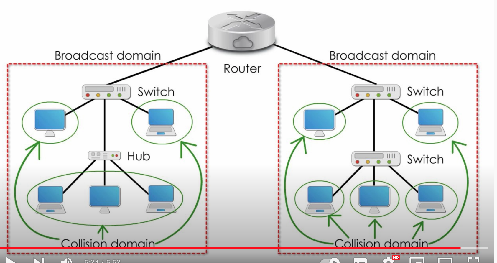

* Since no "intelligent functions" can take place with a hub (they only clean-up, amplify and retime signals) we have
  one big broadcast domain and one big collision domain.
    * Once the hub finds information being transmitted over a port it does not go to the next port, it starts back over
      at the port 1! Therefore you want your more important devices on the first ports.
    * When any collision happens, grounding both them transmit and receive pins for a short while (jamming), to stop the
      collision and then the workstation randomly picks a number of milliseconds to wait to retransmit its information,
      called back-of algorithm
      </br>
* In a switch each port becomes its own collision domain.
* A switch, unlike a hub, also has the possibility to store information to be sent out later
    * if workstation A and D were transmitting at the same time, the switch could store information from one workstation
      while passing on the transmission from the other over the backbone. This is called store-and-forward.
* A switch is an intelligent device. It allows an administrator to change the priorities of the ports to determine who
  gets to transmit first in the event of tie.
    * The information from the other ports would be stored and transmitted later after the first one is done.
* with a switch, there are many collision domains (one per port) and one big broadcast domain.
* By keeping the broadcast domain as small as possible we keep our "overhead" traffic as minimal as possible and,
  therefore, lessen any possible network traffic.
    * This switch has 1 broadcast and 8 collision domains.
      </br>

* With multiple switches there exists the possibility for excessive broadcasts that could slow our network down.
    * A router could be used to reduce the broadcast domain size.
    * Recall, each interface on a router, in fact, is its own broadcast domain.
    * now eight collision domains and two broadcast domains
      </br>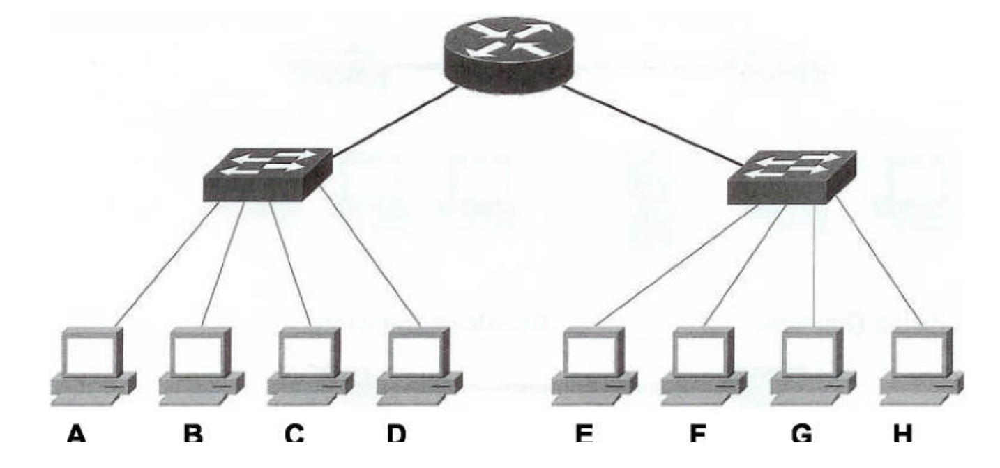

## Router operation

# WEEK 6

#### Main Topics

* In Lesson 1, we will focus upon the basics of Wireless communications and will examine:
    * Wireless technologies
    * Wireless security
* In lesson 2 we focus on wireless standards & concepts. Particular topics include:
    * Wireless standards
    * Wireless Antennas and APs
* In lesson 3, we focus on wireless security. We include the following:
    * Open and secured access
    * UK Mobile networks

#### Sub titles:

* [Cellular Wireless Technologies](#cellular-wireless-technologies)
    * [5G](#5g)
    * [IOT](#iot)
    * [802.11](#80211)
* [Wireless security](#wireless-security)
    * [Rogue APs](#rogue-aps)
    * [Ad Hoc Networks](#ad-hoc-networks)
    * [Denial of Service](#denial-of-service)
    * [Passive Attacks](#passive-attacks)
* [Questions](#questions)
* [802.11 Wireless standards](#80211-wireless-standards)
    * [Wireless Antennas](#wireless-antennas)
        * [Signal Degradation](#signal-degradation)
* [Wireless and Mobile Networks](#wireless-and-mobile-networks)
* [Open and secured access](#open-and-secured-access)
    * [UK Mobile Networks](#uk-mobile-networks)

# Cellular Wireless Technologies

</br>

* [Everything You Need to Know About 5G](https://www.youtube.com/watch?v=GEx_d0SjvS0)
  </br>

* There are two parts to any cellular network – the access network and the core network.
* The increase of mobile wireless devices and their performance sit within the access network, and demands increase
  constantly.
* The core network, however, has been slower in comparison and more incremental.
* Whether the range of protocols in the IP will cope or address the needs of the changing architecture remains to be
  seen.
* The next generation of applications will have strict resource requirements and networks will need to work closely with
  application requirements. So, if the current TCP/IP protocols won’t suffice, what should the protocols be for 5G and
  the future?

## 5G

* It began in 2019 and it was designed to improve and provide speeds of a much higher throughput, and higher than 2
  Gigabits per second while simultaneously offering improved scale, latency, capacity and reliability.
* All 5G devices will have to have new hardware that's compatible.
* 5G is designed to provide higher speeds with improved capacity, scale, latency and reliability
* The bandwidth that is available within a spectrum determines the network performance available for users.
    * In low-band spectrum, bandwidth is typically limited so data rates tend to be low.
    * In mid-band and high-band spectrum, the available bandwidth can be many times greater thus data rates can be much
      higher and faster.
* The frequency spectrum has licensed and unlicensed sections where
    * The licensed bit is governmentally authorised, purchases at auctions and operator managed.
        * The managed nature reduces the interference significantly.
    * Unlicensed and are available for all to use freely, ie WiFi/microwave
* Low band frequent < 2.5 GHz (such as TV)
    * Allows for wide area coverage
    * Has the ability to penetrate buildings, works well indoors
    * Limited BW available
    * Leads to lower data rates and congestion
    * Nearly all freqs have been allocated
* Mid band (2,5 - 6 GHz)
    * Greater capacity and speed
    * Less congested
    * More freq available
    * Shorter range
    * Signal can not go through objects
    * Require signal enhancement
* High-band > 6 GHz
    * which is in some 5G solutions, operates in the range above 6 Gigahertz – but only for a few hundred metres,
        * and so it is largely used for fixed or low mobility users.
    * Offers high capacity and speed
    * Short-range, a few 100 meters
    * Fixed users
    * Dense due to distance
    * Smaller aerials due to limited range
* Multiple Input Multiple Output (MIMO)
    * Common for devices with many aerials to enhance connectivity and speed
    * Uses complex algorithms
    * MASSIVE MIMO is the key element of 5G
    * More aerials at the base station
    * Improves throughput
* The size of the aerial or antenna is dictated by the wavelength of the signal the aerial has to transmit or receive.
* Higher frequency bands have smaller wavelengths and vice versa.
* Because of the large number of aerials required for massive MIMO, high frequency bands are better of 2GHz and over.

## IOT

* Some of the technologies IoT devices rely on are
    * **Z-Wave -** It utilises a wifi mesh topology on the 900MHz ISM band which doesn't collide with the 802.11
      networks and doesn't require a license.
      *Technological devices such as the following home devices use this protocol: lighting control, security systems,
      thermostats, windows, locks, swimming pools and garage door openers.
    * **Ant+:** Another wireless protocol for monitoring sensor data such as a person’s heart rate or a bicycle’s tire
      pressure, and can be utilised for other activities such as control of systems like indoor lighting or a television
      set. ANT+ is designed and maintained and owned by Garmin.
    * **RFID:** Objects are given an RFID tag so that the object is uniquely identifiable and accessible wirelessly.
* Truly smart objects will be embedded with both an RFID tag and a sensor to measure data. The sensor may capture
  fluctuations in the surrounding temperature, changes in quantity, or other types of information.
* The rationale for 5G was to create ways to monitor performance and assure the quality of service (QoS).
* Compared with previous generations of wireless communications the 5G technology expands the broadband capability of
  mobile networks to provide specific capabilities and the IoT
* Digital transformation will introduce further dimensions in the forms of attacks, values and vulnerabilities and raise
  issues such as security, safety and robustness.

## 802.11

</br>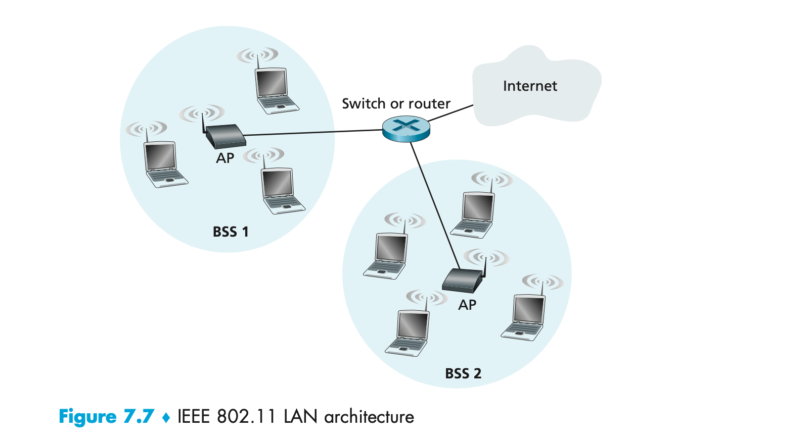

* The AP Access point in a wireless scenario is a bridge and also reach a point.
* It works on a star basis more than a mesh.
* All 802.11 MAC frames fall under one of the three types: management, control, or data.
* Management frames are used to manage the BSS. This includes probing, associating, roaming, and disconnecting clients
  from the BSS.
    * Stations send association requests to access points (APs) requesting to join the BSS. In this frame, the station
      sends all its capabilities to the AP; it will only include capabilities that the AP has also advertised in the
      beacon or probe response frame. The AP responds to the station using an association response frame that includes
      an association ID (AID). Each station within the BSS has a unique AID.
    * Stations send reassociation requests to APs that wish to roam to. The primary difference between reassociation and
      association requests is that the station will indicate the current AP it is connected to as well. If the station
      does not receive a reassociation response, ie due to load balancing, it will remain connected to the original AP
      and search for other APs.
    * As part of the active and passive scanning processes, stations send probe requests with a specific SSID, wildcard,
      or no value (null) in the “SSID Parameter Set” field to search for wireless networks. When the field is
      wildcard/null, the client is requesting any AP nearby to respond with all SSIDs using a probe response frame. When
      it contains a specific SSID, the client is requesting any AP nearby to respond if they support that SSID.
    * APs send beacons at a regular interval called the target beacon transmit time (TBTT) to advertise the SSIDs they
      service.
    * Authentication frames are used to join the BSS as part of the open system authentication process.
    * A type of management frame sent from either the station or the AP. Disassociation frames are used to terminate the
      station’s association; it is a notification and does not expect a response.
    * Deauthentication frames are used to reset the state machine for an associated client. The authentication process
      takes place prior to association therefore, if a station is deauthenticated, it is also disassociated.

* Control frames are used to control access to the medium and are used for frame acknowledgement. Control frames only
  contain a header and trailer.
    * PS-Poll frames are used in the legacy 802.11-1997 power save method to request frames buffered on the AP while the
      client was sleeping.
    * Other subtypes include RTS, CTS, ACK, CF-END, CF-END+CF-ACK
* Terminology
    * AP: Access Point
    * STA: Station. Each AP has a station associated with it too.
    * BSS: Basic Service Set where multiple STAs are connected to an AP.
    * IBSS: Independent BSS where the BSS isn't linked to any other BSS.
    * ESS: An extended service set is a wireless network, created by multiple access points, which appears to users as a
      single, seamless network
    * DS: A distributed system where a central point, ie a router, connects multiple BSSs.

# Wireless security

## Rogue APs

* APs that have been connected to your wired infrastructure without your knowledge are rogue AP’s. This may have been
  intentional or unintentional, an innocent member of staff who wanted access to the wifi or less innocently by a
  hacker, this would likely have some sinister intent.
* This is achieved by someone placing their AP on a different channel from your legitimate AP and then setting the SSID
  in the convention that yours is set.
* Wireless clients identify the network by SSID, not the MAC address or the IP address of the AP so this is a simple way
  to jam the channel that your AP is on.
* With the right DHCP software the hacker can issue clients an IP address and then they have theoretically ‘kidnapped’
  all your clients over to their network and can perform peer-to-peer attacks.
* Mitigation
    * A method to keep rogue APs out of the wireless network is to employ a wireless LAN controller (WLC) to manage your
      APs.
    * APs and controllers communicate using Lightweight Access Point Protocol (LWAPP) or the newer CAPWAP, and one of
      the message types they share is called Radio Resource Management (RRM).
    * Essentially, your APs monitor all channels by momentarily switching from their configured channel and by
      collecting packets to check for rogue activity.
    * If an AP is detected that isn’t usually managed by the controller, it’s classified as a rogue, and if a wireless
      control system is in use, that rogue can be plotted and located.

## Ad Hoc Networks

* Ad hoc networks are created peer to peer or directly between stations and not through an AP.
* This can be a dangerous configuration because there’s no corporate security in place, and since these networks are
  often created by unsophisticated users which can result in a peer-to-peer attack.
* Mitigation
    * With certain networks and hardware (Cisco for example) ad hoc networks can be identified over the air by the type
      of frames they send, which are different from those belonging to an infrastructure network.
    * When these frames are identified, the network can prevent harmful intrusions by sending out something known as
      de-authentication frames to keep your stations from associating via ad hoc mode.

## Denial of Service

* Sometimes the hacker just wants to cause some major network grief as opposed to stealing data, this can be done by
  jamming the frequency where your WLAN resides to cause a complete interruption/disruption of service (DOS) until the
  jamming signal is traced and disabled. This type of assault is known as a denial of service (DoS) attack.
* Mitigation
    * To deal with DOS attacks where someone is jamming the frequency, there is little you can do.
    * However, many DoS, man-in-the-middle, and penetration attacks operate by de-authenticating, or disassociating,
      stations from their networks.
    * Some DoS attacks take the form of simply flooding the wireless network with probe or ping requests or association
      frames, which effectively overwhelms the network and makes it unavailable for normal transmissions.
    * These types of management frames are sent unauthenticated and unencrypted.
    * Since de-authentication and disassociation frames are classified as management frames, the Management Frame
      Protection (MFP) mechanism can be used to prevent the attack.
* There are two types of MFP you can use, referred to as infrastructure and client.
    * Infrastructure Mode: This requires configuration on the AP. Wireless LAN Controllers (CISCO) generate a specific
      signature for each WLAN, which is added to each management frame it sends, and any attempt to alter this is
      detected by the Message Integrity Check (MIC) in the frame.
        * Therefore, when an AP receives a management frame from an unknown SSID, it reports the event to the controller
          and an alarm is generated.
    * Client Mode: Often rogue APs attempt to impersonate the company AP. With client MFP, all management frames between
      the APs and the stations are protected because clients can detect and drop spoofed or invalid management frames.

## Passive Attacks

* Passive attacks usually involve wireless sniffing. During a passive attack, the hacker captures large amounts of raw
  frames to analyse online with sniffing software to try to discover a key and decrypt it “on the fly.”
* Mitigation
    * In addition to the corporate tools already described, you can use an intrusion detection system (IDS) or an
      intrusion protection system (IPS) to guard against passive attacks:
        * IDS - An intrusion detection system (IDS) is used to detect several types of malicious behaviours which can
          include network attacks against vulnerable services; data-driven attacks on applications; host-based attacks
          like privilege escalation; unauthorized logins; access to sensitive files; and malware like viruses, Trojan
          horses, and worms.
        * IPS - An intrusion prevention system (IPS) is a computer security device that monitors network and/or system
          activities for malicious or unwanted behaviour and can react, in real time, to block or prevent those
          activities. For example, a network-based IPS will operate inline to monitor all network traffic.

# Questions:

* If a node has a wireless connection to the Internet, does that ode have to be mobile? Explain. Suppose that a user
  with a laptop walks around her house with her laptop, and always accesses the Internet through the same access point.
  Is this user mobile from a Network standpoint? explain your answer.?
    * No. A node can remain connected to the same access point throughout its connection to the Internet (hence, not be
      mobile). A mobile node is the one that changes its point of attachment into the network over time. Since the user
      is always accessing the Internet through the same access point, she is not mobile.
* Consider a TCP connection going over Mobile IP. True or False : The TCP connection phase between the correspondent and
  the mobile host goes through the mobiles home network, but the data transfer phase is directly between the
  correspondent and the mobile host, bypassing the home network..
    * False
* In mobile IP, what effect will mobility have on end-to-end delays of datagram between the source and destination?
    * Because datagrams must be first forward to the home agent, and from there to the mobile, the delays will generally
      be longer than via direct routing. Note that it is possible, however, that the direct delay from the correspondent
      to the mobile (i.e., if the datagram is not routed through the home agent) could actually be smaller than the sum
      of the delay from the correspondent to the home agent and from there to the mobile. It would depend on the delays
      on these various path segments. Note that indirect routing also adds a home agent processing (e.g., encapsulation)
      delay.
* Consider two mobile devices in a foreign network having a foreign agent. Is it possible for the two mobile nodes to
  use the same care-of-address in mobile IP? Explain your answer.
    * Two mobiles could certainly have the same care-of-address in the same visited network. Indeed, if the
      care-of-address is the address of the foreign agent, then this address would be the same. Once the foreign agent
      decapsulates the tunneled datagram and determines the address of the mobile, then separate addresses would need to
      be used to send the datagrams separately to their different destinations (mobiles) within the visited network.
* What are the differences between the following types of wireless channel impairments : path loss, multipath
  propagation, interference from other sources?
    * Path loss is due to the attenuation of the electromagnetic signal when it travels through matter. Multipath
      propagation results in blurring of the received signal at the receiver and occurs when portions of the
      electromagnetic wave reflect off objects and ground, taking paths of different lengths between a sender and
      receiver. Interference from other sources occurs when the other source is also transmitting in the same frequency
      range as the wireless network.

# 802.11 Wireless standards

* Wifi signals are two-way communications and are referred to as half-duplex.
* WLANS use RFs that are transmitted from the antennas in the air creating radio waves.
* These can then be absorbed, refracted or reflected by walls, water and metal surfaces resulting in low signal
  strength.
* Increasing the transmitting power, you can gain transmission distance but will suffer from heavy distortion.
* By using the higher frequencies you get better data rates but at a decreased distance.
* Using a lower frequency gives you slower speeds but of a greater distance.

## Wireless Antennas

* Wireless antennas act as both transmitters and receivers.
* There are two classes of antennas on the market today:  Omnidirectional (or point-to-multipoint) and directional, or
  Yagi (point-to-point).
    * Yagi antennas usually provide a greater range than Omni antennas of equivalent gain, because Yagis focus all their
      power in a single direction, whereas Omnis must disperse the same amount of power in all directions at the same
      time.
* A downside to using a directional antenna is that you’ve got to be much more precise when aligning communication
  points. Try and think about car aerials and how they transmit and receive.

### Signal Degradation

* Signal strength can vary according to many factors. The weaker the signal, the less reliable the connection. Factors
  are;
    * Distance - The farther away from the WAP you are, the weaker the signal. Most APs have a very limited maximum
      range that equals less than 100 meters for most systems. You can extend this range to some degree using amplifiers
      or repeaters, or even by using different antennas.
    * Barriers, ie walls - The more walls and other barriers a wireless signal has to pass through, the more
      attenuated (reduced) the signal becomes. Also, the thicker the wall, the more it interrupts the signal.
    * Protocols Used - The various wireless 802.11 protocols have different maximum ranges. As discussed earlier, the
      maximum effective range varies depending on the 802.11 protocol used.
    * Interference - Because 802.11 wireless protocols operate in the 900 MHz, 2.4 GHz, and 5 GHz ranges, interference
      can come from many sources. These include wireless devices like Bluetooth, cordless telephones, mobile phones, car
      remotes, other wireless LANs, and any other device that transmits a radio frequency (RF) near the frequency bands
      that 802.11 protocols use. Even microwave ovens—a huge adversary of 802.11b and 802.11g.

# Wireless and Mobile Networks

* wireless (mobile) phone subscribers now exceeds # wired phone subscribers (5-to-1)!
* wireless Internet-connected devices equals wireline Internet-connected devices
    * laptops, Internet-enabled phones promise anytime untethered Internet access✦two important (but different)
      challenges

* wireless:communication over wireless link
* mobility:handling the mobile user who changes point of attachment to network

* wireless hosts
    * laptop, smartphone
    * run applications
    * may be stationary (non-mobile) or mobile
    * wireless does notalways mean mobility
* base stations:
    * typically connected to wired network
    * relay - responsible for sending packets between wired network and wireless host(s) in its “area”
        * e.g., cell towers, 802.11 access points
* Wireless link
    * typically used to connect mobile(s) to base station
    * also used as backbone link
    * multiple access protocol coordinates link access various data rates, transmission distance

* Wireless network taxonomy
    * single hop:
        * infrastructure(e.g., APs): host connects to base station (WiFi,WiMAX, cellular) which connects to larger
          Internet
        * noinfrastructure: no base station, noconnection to larger Internet (Bluetooth, ad hoc nets)
    * multiple hop:
        * infrastructure(e.g., APs): host may have torelay through severalwireless nodes to connect to larger Internet:
          mesh net
        * noinfrastructure: no base station, noconnection to larger Internet. May have torelay to reach other a given
          wireless nodeMANET, VANET

* Wireless Link Characteristics
    * differences from wired link
        * decreased signal strength: radio signal attenuates as it propagates through matter (path loss)
        * interference from other sources: standardized wireless network frequencies (e.g., 2.4 GHz) shared by other
          devices (e.g., phone); devices (motors) interfere as well
        * multipath propagation: radio signal reflects off objects ground, arriving ad destination at slightly different
          times
    * make communication across (even a point to point) wireless link much more “difficult”
    * SNR: signal-to-noise ratio✦larger SNR – easier to extract signal from noise (a “good thing”)
    * SNR versus BER tradeoffs
        * given physical layer: increase power -> increase SNR->decrease BER
        * given SNR: choose physical layer that meets BER requirement, giving highest thruput
        * SNR may change with mobility: dynamically adapt physical layer (modulation technique, rate)
* Here is the PP presentation : [Presentation](./doc/6/wireless and cellular networks.pptx)

# Open and secured access

* “open-access” mode is where all the security features of a wireless device, ie a router, turned off for ease of
  initial connection and setup. This mode isn't suggested either for businesses or even homes.
* 802.11 basic security includes the use of SSIDs, open or shared-key authentication, static WEP, and optional Media
  Access Control (MAC) authentication/MAC filtering.
* Remote Authentication Dial-In User Service (RADIUS) is a networking protocol that offers several security benefits:
  authorisation, centralised access, and a record of the users and/or computers that connect to and access our networks’
  services.
    * The provision of authentication, authorisation, and accounting is called AAA, or “triple A,” and it’s part of the
      IEEE 802.1X security standard.
* Hackers uncovered ways to break through WEP’s defences and that's why IEEE came up with Temporal Key Integrity
  Protocol, TKIP, which envelopes the pre-existing WEP encryption key and upgrades it to a much more of impenetrable
  128-bit encryption.
    * TKIP also has the advantage in that it actually changes each packet’s key. Packet keys are made up of three
      things: a base key, the transmitting device’s MAC address, and the packet’s serial number.
    * Each packet is now uniquely identified, the collision attacks that used to happen using WEP are cancelled. Part of
      the packet’s serial number is also the initialisation vector, prevents something called replay attacks. So,
      replaying packets from some past wireless connection will not happen; those “recycled” packets won’t be in.¬
* Extensible Authentication Protocol (EAP) is used by WPA2 for authentication and is a framework that includes the
  802.1X framework.
    * Certificates used for credentials during authentication is an EAP method and you must have Public Key
      Infrastructure (
      PKI) in your network which means that a certificate server to issue these certificates must be in place. The
      certificate consists of a public and private key pair which are installed on all devices and renewed regularly.
      This is called assymetric because different keys are used for encryption and decryption.
    * Using certificates as a means of identifying the device or the user is considered the highest form of
      authentication and authorisation when compared to names and passwords.
* EAP - Extensible Authentication Protocol (EAP) is a framework for port-based access control that uses the same three
  components that are used in RADIUS and can include certificates, a PKI, or simple passwords.
* PEAP - Protected Extensible Authentication Protocol, also known as Protected EAP or simply PEAP, is a protocol that
  encapsulates the Extensible Authentication Protocol (EAP) within an encrypted and authenticated Transport Layer
  Security (TLS) tunnel. It requires only a server-side PKI certificate to create a secure TLS tunnel to protect user
  authentication.
* EAP-FAST - EAP-FAST works in two stages. In the first stage, a TLS tunnel is established. Unlike PEAP, however,
  EAP-FAST’s first stage is established by using a pre-shared key called a Protected Authentication Credential (PAC)
    * In the second stage, a series of type/ length/value (TLV)-encoded data is used to carry user authentication.
* EAP Transport Layer Security (EAP-TLS) is the most secure method, but it’s also the most difficult to configure and
  maintain. To use EAP-TLS, you must install a certificate on both the authentication server and the client. An
  authentication server pair of keys and a client pair of keys need to be generated first, signed using a PKI, and
  installed on the devices. On the station side, the keys can be issued for the machine itself and/or for the user. * In
  the authentication stage, the station, along with the authentication server (RADIUS, etc.), exchange certificates and
  identify each other. Mutual authentication is a solid beneficial feature, which ensures that the station it’s
  communicating with is the proper authentication server. After this process is completed, random session keys are
  created for encryption. * Finally, a pre-shared key can be used to secure wireless transmissions. This is the most
  labour intensive as it requires that all devices use the same key as the AP and that the keys be changed frequently to
  provide adequate security.

## UK Mobile Networks

* There are only four main corporations in the UK mobile phone network: EE, 02, Three and Vodaphone. All others are
  piggy-backed off these.
* The following technologies exist:
    * GSM - Global System Mobile (GSM) is a type of cellphone that contains a Subscriber Identity Module (SIM) chip.
      These chips contain all the information about the subscriber and must be present in the phone for it to function.
      One of the dangers with these phones is cell phone cloning, a process where copies of the SIM chip are made,
      allowing another user to make calls as the original user. Secret key cryptography is used (using a common secret
      key) when authentication is performed between the phone and the network.
    * FDMA - Frequency Division Multiple Access (FDMA) is one of the modulation techniques used in cellular wireless
      networks. It divides the frequency range into bands and assigns a band to each subscriber. This was used in 1G
      cellular networks.
    * TDMA - Time Division Multiple Access (TDMA) increases the speed over FDMA by dividing the channels into time slots
      and assigning slots to calls. This also helps to prevent eavesdropping in calls.
    * CDMA - Code Division Multiple Access (CDMA) assigns a unique code to each call or transmission and spreads the
      data across the spectrum, allowing a call to make use of all frequencies.

# QUIZ

* What is the frequency range of the IEEE 801.11g standard?
    * 5GHz
* Why would you use WPA instead of WEP 2?
    * The values of WPA keys can change dynamically while the system is used.
* The IEEE 802.11b/g basic standard has how many non-overlapping channels?
    * 3
* AP's come set up with what type of security enabled by default?
    * none
* What is the maximum data rate for 802.11b standard?
    * 11Mbps
* You connect a new host to your wireless network. The host is set to receive a DHCP address and the WEP key is entered
  correctly, however the host cannot connect to the network. What might e problem be?
    * MAC filtering is enabled on the AP

* Together, MIMO and OFDM technologies are the cornerstone of emerging broadband wireless networks.
    * True
* In a MIMO scheme the transmitter employs a single antenna.
    * False
* Diverse multipath fading offers multiple views of the transmitted data at the receiver, thus increasing robustness.
    * True
* In a multipath scenario where each receiving antenna would experience a different interference environment, there is a
  high probability that if one antenna is suffering a high level of fading, another antenna has sufficient signal level.
    * True
* Spatial diversity can be used when transmitting conditions are favourable and for relatively short distances compared
  to spatial multiplexing.
    * False
* A disadvantage of MU-MIMO is that the available capacity cannot be shared to meet time-varying demands.
    * False
* MIMO-MAC systems outperform point-to-point MIMO.
    * True
* In OFDM all of the subcarriers are dedicated to a single data source.
    * True
* MIMO systems are characterized by the number of antennas at each end of the wireless channel.
    * True
* OFDM cannot overcome intersymbol interference in a multipath environment.
    * False
* The IFFT operation has the effect of ensuring that the subcarriers do not interfere with each other.
    * True
* MU-MIMO techniques are used in both Wi-Fi and 4G cellular networks.
    * True
* Orthogonal Frequency-Division Multiple Access employs multiple closely spaced subcarriers.
    * True
* Subchannelisation is not useful for battery-powered devices.
    * False
* Spread spectrum is an important form of encoding for wireless communications.
    * True

# TODO:

* No read Chapter 8, Section 8.6 "Securing TCP Connections: SSL", in ethier edition of Computer Networking: A Top Down
  Approach that examines how cryptography can enhance TCP with security services, including confidential ity, data
  integrity, and end-point authentication.

* READ
    * Chapter 6, Section 6.3.2 (6th Ed.) "The 802.11 Mac Protocol" or Chapter 7, Section 7.3.2 (7th Ed.)
    * Chapter 6 Section 6.3.3. (6th Ed.) "The IEEE 802.11 Frame" or Chapter 7, Section 7.3.3 (7th Ed.)
      of Computer Networking: A Top Down Approach on the 802.11
    * Chapter 6, Section 6.5.2 (6th Ed.) "Routing to a Mobile Node" or Chapter 7, Section 7.5.2 (7th Ed.), of Computer
      Networking: A Top Down Approach on direct routing to a mobile node.

* Additional readings
    * [CDMA vs. GSM: What's the Difference?](https://uk.pcmag.com/old-wireless-carriers/11593/cdma-vs-gsm-whats-the-difference)
    * [Cellular Networks and Technology](https://www.ofcom.org.uk/spectrum/information/cellular-networks-and-technology)
    * [Fundamentals of Communications Access Technologies: FDMA, TDMA, CDMA, OFDMA, AND SDMA](https://www.electronicdesign.com/technologies/communications/article/21802209/electronic-design-fundamentals-of-communications-access-technologies-fdma-tdma-cdma-ofdma-and-sdma)

# WEEK 7

#### Main Topics

* Lesson 1, basics of network security requirements :
    * Cryptography
    * Data encryption
    * IoT
    * Symmetric -v- asymmetric cryptography
    * Certificates and Keys
    * Ethics and legal issues
* lesson 2 security.:
    * SSL
    * VPN’s
* lesson 3 :
    * IPSEC

#### Sub titles:

# Network Security requirements

Cryptographic algorithms such as encryption and hash functions play a role both in computer security threats and
computer security techniques and we will be examining these in this module.

The main security requirements of a secure system are:

Confidentiality - information is not made available to unauthorised entities, This is the most common use of
cryptographic algorithms: encrypting sensitive information for transmission over an insecure channel, such as the
Internet. In packet-based transmission, confidentiality is achieved by encrypting the information (plaintext) before
transmission and decrypting the ciphertext at the receiving end using the same (= symmetric) key.

Integrity - information has not been altered during transmission in an unauthorised manner. Some cryptographic
algorithms can be used to create digital signatures that ensure that unauthorized changes have not been made to
transmitted information.

Accountability – users must authenticate themselves before being able to access the system

Availability – in first hand this means prevention of Denial of Service (DoS) attacks.

Integrity Ensuring that information is not modified in an unauthorized fashion.

Authentication - providing the ability to confirm the claimed identity of an individual or system. Public key
cryptography can be used to create digital certificates that provide authentication capabilities.

Non-repudiation - allowing the recipient of a message to undeniably prove to a third party that the message came from
the purported sender. Digital signatures provide nonrepudiation and, when they are used, prevent the sender of a message
from later denying that he or she originated the message.

# BYOD (Bring Your Own Devices)

* Bring Your Own Devices (BYOD) is a relatively new phenomenon and is now common. Start by reading these articles
  looking at different aspects of BYOD for and organisation and then consider the questions that follow.

Question 1

Does BYOD save money?

Always
Never
Sometimes
Answer:

3. Sometimes

BYOD can save money in some ways, but cost money in others. For example, allowing users to purchase their own devices
and bring them to work might save a company money on device purchasing, but it costs money to put management systems in
place and train helpdesk staff.

Question 1

Does BYOD save money?

Always
Never
Sometimes
Answer:

3. Sometimes

BYOD can save money in some ways, but cost money in others. For example, allowing users to purchase their own devices
and bring them to work might save a company money on device purchasing, but it costs money to put management systems in
place and train helpdesk staff.

Question 2

True or false: Businesses should be concerned about the legal ramifications that exist for allowing BYOD.

True
False
Answer:
True

There are a couple of reasons that companies have to be concerned about legal issues when it comes to BYOD. Businesses
have to worry about users' privacy: If the system that the IT department uses to manage devices or track users' activity
exposes that an employee is engaging in illegal activities, the company may be obligated to report that information. An
additional BYOD challenge is that many companies are subject to information security regulations, such as in health care
or government. If employees have patient or confidential data on their personal devices, the company can face serious
legal trouble

Question 3

How can businesses reduce the risks associated with corporate data security in BYOD environments?

Write policies that state which actions are acceptable for users to perform on their devices.
Encrypt data and devices and use two-factor authentication.
Both of the above.
Answer:

3. Both of the above.

Question 4

Which of the following is not an advantage of BYOD?

It can reduce capital spending on devices.
It improves employee productivity.
It lightens the help desk staff's workload.
It helps IT embrace the cloud.
Answer:

2. It improves employee productivity.

Though advantages of BYOD include reducing spending on devices, improving productivity and helping IT embrace the
mobile- and cloud-centric way employees work today, one of the biggest BYOD challenges is that it puts more pressure on
help desk staff. Not only do staff members have to undergo training in how to deal with consumer devices and how to use
mobile management systems, but employees will also expect IT to help them with issues that may arise with their personal
devices.

Question 5

Which of the following is a BYOD challenge?

Bandwidth strain
International roaming charges
Security flaws within devices
All of the above
Answer:

4. All of the above

These are just a few challenges that companies forget to consider when they're thinking about allowing BYOD. When
businesses planned their networks, they did so with a one-device-per-user ratio in mind. But if users bring two or three
devices to work with them, that's going to adversely affect bandwidth. And companies whose workers travel
internationally have to deal with the roaming overages that their users are going to incur. Also remember that people
find ways around lock screens and other features that are meant to keep a device secure.

# Ethics and Legal considerations

Ethics has a very broad definition in computing use and this can include challenging the principles of societal
behaviour.

Points to consider may include:

The government's decisions on what should be regulated and what should not
In philosophy, the notion of intelligence and AI
In society – new apps which represent freedom or control
Ethical points to consider:

Charges for financial transactions – who decides what is fair? We are in an environment of electronic payments as
opposed to cash, but who decides on the charges?
Interactive apps / TV – collecting data from children? Who is policing this?
Decisions made now – how might they affect future generations?
Education – the levels of abstraction. Increasingly we're moving from long division to abstraction, thus removing the
need for the underlying skill – word processing and spell check is another example.
Libraries and access for all – does the technological equivalent provide these rights?
Automation of information and apps – how much does the government collect about an individual? Do you know what
information is being collected and held about you? Where does it come from and who does it go to?
Society's dependence on technology – what would be the consequences if technology was removed?
GPS – tracking a person's movements – how far will this go?
Legal consideration may include:

Security concerns / BYOD / wifi hopping
Software ownership and liability / intellectual ownership copyright
Social impacts of distributed databases
Consequences of AI
Different laws in different countries
Just because something is illegal it does not mean it is not possible!

Some of the main legislative acts which cover legal use of computing include:

Computer Fraud and Abuse Act 1984 – USA
Right of Privacy Act
Anticybersquatting Act 1999
Policy standards and Acts cover the legislation that needs to be adhered to. These include the following:

Data Protection and GDPR 2018, and then updated 2021
Computer Misuse ActCryptography 1990
Communications Act 2003
Investigatory Powers Act 2016
The Investigatory Powers (Interception by Business etc. For Monitoring and Record-Keeping Purposes) Regulations 2018
Privacy and Electronic Communications (EC Directive) Regulations 2003, amended with Privacy and Electronic
Communications (EC Directive) (Amendment) Regulations 2019

# Cryptography

Cryptography is the science of transmitting information securely. Information security professionals rely upon
cryptographic algorithms, or ciphers, to add security to communications that would otherwise be susceptible to
eavesdropping and other attacks. Crypto- graphic algorithms work to fulfil the four goals of confidentiality, integrity,
authentication and nonrepudiation.

Cryptography, the practice of using encryption and decryption algorithms to obscure information in a reversible manner,
is one of the main tools used to support two of these goals: confidentiality and integrity. In addition to supporting
those major goals, some cryptographic algorithms can also be used to provide authentication and nonrepudiation
functions.

Symmetric vs. asymmetric cryptography
Cryptographic algorithms can be assigned to one of two categories based upon the keys used by the sender and recipient.
In symmetric cryptography, both the sender and the recipient use the same key to encrypt and decrypt the message. This
key, known as a shared secret key, must be securely exchanged in advance of the communication. Alice can encrypt a
message by using the encryption algorithm with the shared secret key to transform it into the ciphertext. When Bob
receives the message, he uses the decryption algorithm, along with the same shared secret key used by Alice, to decrypt
the message.

In asymmetric cryptography, on the other hand, the sender and receiver use different, but mathematically related, keys
to encrypt and decrypt the message. Each participant in an

Key asymmetric cryptosystem has a pair of mathematically related keys: a public key and a private key. The private key
is preserved as a secret known only to the individual who owns the keypair. The public key is freely distributed to
anyone the individual wants to communicate with. The public and private keys are related in such a fashion that anything
encrypted with one key from a pair can be decrypted with the corresponding key from the same pair.

For example, if Alice wanted to use asymmetric cryptography to send a message to Bob, she encrypts the message with
Bob’s public key. Due to the nature of asymmetric cryptography, this message can then only be decrypted with the other
key from that same keypair—Bob’s private key. Bob is the only person with access to that key, so the message can only be
decrypted by Bob. In fact, Alice, who encrypted the message, does not have the ability to decrypt it herself because she
does not have access to Bob’s private key.

Symmetrical encryption (for confidentiality)
Public key cryptography algorithms are far too slow to be used for encrypting the actual traffic to be carried over the
communication link directly. For this purpose, symmetrical encryption (= encryption and decryption are performed with
the same key) must be used.

Some widely used symmetrical encryption algorithms are Advanced Encryption Standard (AES) and 3-fold Data Encryption
Standard (3DES) for encrypting blocks of information, and Rivest Cipher 4 (RC4) for encrypting streams of information.

# Public key cryptography

## Diffie-Hellman vs. RSA

Public key cryptography is generally used in two ways:

by generating a shared secret at both ends of the communications link (key agreement)
by sending a secret to the other end of the communications link (key transport)
Known as the Diffie-Hellman key agreement scheme.

Or

by sending a secret to the other end of the communications link (key transport)
The RSA (Rivest, Shamir, Aldeman) scheme.

Question 1

In what way does a hash provide a between message integrity check than a checksum (such as the Internet checksum)

Answer:
One requirement of a message digest is that given a message M, it is very difficult to find another message M’ that has
the same message digest and, as a corollary, that given a message digest value it is difficult to find a message M’’
that has that given message digest value. We have “message integrity” in the sense that we have reasonable confidence
that given a message M and its signed message digest that the message was not altered since the message digest was
computed and signed. This is not true of the Internet checksum, where it easy to find two messages with the same
Internet checksum..

Question 2

Can you 'Decrypt' a hash of a message to get the original message? Explain your answer.

Answer:
No. This is because a hash function is a one-way function. That is, given any hash value, the original message cannot be
recovered (given h such that h=H(m), one cannot recover m from h).

Question 3

What does it mean for a signed document to be verifiable and non-forgetable?

Answer:
Suppose Bob sends an encrypted document to Alice. To be verifiable, Alice must be able to convince herself that Bob sent
the encrypted document. To be non-forgeable, Alice must be able to convince herself that only Bob could have sent the
encrypted document (e.g.,, no one else could have guessed a key and encrypted/sent the document) To be non-reputable,
Alice must be able to convince someone else that only Bob could have sent the document. To illustrate the latter
distinction, suppose Bob and Alice share a secret key, and they are the only ones in the world who know the key. If
Alice receives a document that was encrypted with the key, and knows that she did not encrypt the document herself, then
the document is known to be verifiable and non-forgeable (assuming a suitably strong encryption system was used).
However, Alice cannot convince someone else that Bob must have sent the document, since in fact Alice knew the key
herself and could have encrypted/sent the document.

Question 4

Name two popular secure networking protocols in which public key certification is used.

Answer:
This is false. To create the certificate, certifier.com would include a digital signature, which is a hash of foo.com’s
information (including its public key), and signed with certifier.com’s private key.

Question 5

In the link-state routing algorithm, we would somehow need to distribute the secret authentication key to each of the
routers in the autonomous system. How do we ditribute the shared authentication key to the communicating entities?

Answer:
A public-key signed message digest is “better” in that one need only encrypt (using the private key) a short message
digest, rather than the entire message. Since public key encryption with a technique like RSA is expensive, it’s
desirable to have to sign (encrypt) a smaller amount of data than a larger amount of data.

# Pretty Good Privacy (PGP)

The Pretty Good Privacy (PGP) algorithm combines the use of symmetric and asymmetric cryptography. The process used to
encrypt a message by using PGP uses the following steps:

The sender of the message chooses a randomly generated symmetric encryption key.
The sender encrypts the message by using the symmetric encryption key and a symmetric algorithm of the sender’s choice.
The sender encrypts the randomly generated symmetric encryption key with the recipient’s public key, using an asymmetric
algorithm of the sender’s choice.
The sender transmits the encrypted message from step 2 and the encrypted key from step 3 to the recipient.
When the recipient receives the message, he or she follows the process to decrypt the message. The recipient decrypts
the encrypted key by using the recipient’s private key. The recipient now has the randomly generated symmetric
encryption key chosen by the sender. The recipient decrypts the message by using the symmetric key.

RSA vs. DSA
As with any asymmetric algorithm, the complexity of RSA lies in finding an appropriate method to generate mathematically
related, but secure, public and private keypairs. RSA does this by relying upon the difficulty of factoring the products
of large prime numbers. The algorithm itself is still considered secure today.

In addition to secure key transport, the public key encryption method RSA also offers authentication using a digital
signature. Another algorithm that can be used for this purpose is Digital Signature Algorithm (DSA).

RSA:  Key management + authentication
DSA:  Only authentication, no key management
Diffie-Hellman:  Only key management, no authentication.

# Data Encryption Standard

One of the most well-known symmetric encryption algorithms, the Data Encryption Standard (DES) was selected by the US
Government in 1976 as the standard encryption algorithm for government applications. DES is a symmetric block cipher
that uses 56-bit encryption keys to operate on 64-bit blocks of data. Though it was widely used for decades in both the
public and private sectors, the cryptographic community now considers DES insecure, due to the possibility of modern
computers successfully conducting a brute-force attack against the short encryption keys used by DES. The algorithm is
no longer approved for use by the US government, and private-sector cryptographers should consider using a different
symmetric cipher. DES transforms plaintext into ciphertext by performing a variety of cryptographic operations on 64-bit
blocks of data. The core building block of DES is the Feistel function which operates on half-blocks of data that are 32
bits long.

## Triple DES (3DES)

When cryptographers began to realize that DES was becoming cryptographically insecure, they were left in a quandary.
Organisations in both government and the private sector had invested millions of dollars in hardware and software
designed to work specifically with DES, and that investment was now facing obsolescence. Fortunately, cryptographers
discovered that they could continue to use existing DES implementations in a secure manner by sim ply running data
through the algorithm three times with different keys. This process became known as Triple DES (3DES). Because 3DES
simply uses DES multiple times, it remains a 64-bit symmetric block cipher.

Users of 3DES choose three 56-bit encryption keys, called K1, K2, and K3. They then perform three steps:

Encrypt the plaintext by using DES with K1.
Decrypt the result of step 1 by using DES with K2.
Encrypt the result of step 2 by using DES with K3.
The output of step 3 is the ciphertext output of the 3DES algorithm.

When the recipient of a 3DES-encrypted message wants to transform the ciphertext back into plaintext, the following
process is used:

Decrypt the plaintext by using DES with K3.
Encrypt the result of step 1 by using DES with K2.
Decrypt the result of step 2 by using DES with K1.
The user of 3DES can select the keys by using one of three approaches, each of which provides a different effective key
length:

In the most common approach, the keys are independent. K1, K2, and K3 are unrelated, randomly generated 56-bit keys.
This is the strongest approach, providing a key length of 168 bits (three keys of 56 bits each) that is actually reduced
to an effective key strength of 112 bits due to the existence of attacks on this approach.
In the second option, K1 and K2 are independent, but K1 = K3. This approach provides a key length of 112 bits (two keys
of 56 bits each) that is reduced to an effective key strength of 80 bits due to existing attacks.
In the final option, all three keys are the same: K1=K2=K3. 3DES.
The use of 3DES is still considered secure today, this is functionally equivalent to DES and provides the same (
insecure) key length of 56 bits. It is preserved to provide backward compatibility with systems that are not able to
perform National Institute of Standards and Technology (NIST), and it remains certified for US federal government use.

Question 1

The encryption technique is know - published, standardised and available to everyone, even a potential intruder. Then
where does the security of an encryption technique come from?

Answer:

1. Confidentiality is the property that the original plaintext message can not be determined by an attacker who
   intercepts the ciphertext-encryption of the original plaintext message. Message integrity is the property that the
   receiver can detect whether the message sent (whether encrypted or not) was altered in transit. The two are thus
   different concepts, and one can have one without the other. An encrypted message that is altered in transmit may
   still be confidential (the attacker can not determine the original plaintext) but will not have message integrity if
   the error is undetected. Similarly, a message that is altered in transit (and detected) could have been sent in
   plaintext and thus would not be confidential.

Question 2

What is the difference between known plaintext attack and chosen plaintext attack?

Answer:

4. In this case, a known plaintext attack is performed. If, somehow, the message encrypted by the sender was chosen by
   the attacker, then this would be a chosen-plaintext attack.

Question 3

Consider a 16 block cipher. How many possible input blocks does this cipher have? How many possible mappings are there?
If we view each mapping as a key, then how many possible keys does this cipher have?

Answer:

3.
    5. An 8-block cipher has 28 possible input blocks. Each mapping is a permutation of the 28 input blocks; so there
       are 28! possible mappings; so there are 28! possible keys.

Question 4

Suppose N people want to communicate with each of N - 1 other people using symmetric key encryption. All communication
between any two people, i and j, is visible to all other people in the group of N, and no other person in this group
should be able to decode their communication. How many keys are required in the system as a whole? Now suppose that
public key encryption is used. How many keys are required in this case?

Answer:
If each user wants to communicate with N other users, then each pair of users must have a shared symmetric key. There
are N*(N-1)/2 such pairs and thus there are N*(N-1)/2 keys. With a public key system, each user has a public key which
is known to all, and a private key (which is secret and only known by the user). There are thus 2N keys in the public
key system.

Question 5

Supposing you want to encrypt the message 10010111 by encrypting the decimal number that corresponds to the message.
what is the decimal number?

Answer:
175

# Message digests, certificates and key length

## Message digests (for integrity protection)

In packet-based transmission, integrity protection is ensured by using a message digest or hash algorithm to produce a
Message Authentication Code (MAC) field that is appended to the data (usually before the encryption).

If an attacker changes the content of the message during transmission, the calculated MAC and transmitted MAC at the
receiving end will nor match.

Two widely used message digest or hash algorithms are Message Digest 5 (MD5) and Secure Hash Algorithm 1 (SHA-1).

## Certificates

Key agreement (e.g. Diffie-Hellman) or key transport (e.g. RSA) schemes are vulnerable to man-in-the-middle attacks. A
solution to this problem is to send the public key over the communication link using a signed certificate.

A certificate is a document that contains, along with the public key of the sender, the name of the certificate holder
as well as the digital signature of an independent and trusted third party, called certification authority, to ensure
the validity of the transmitted information. The certificate format is usually based on ITU-T recommendation X.509.

## Key length

In the same way as long passwords make password guessing impractical, long keys make exhaustive searches impractical.

Every additional bit in the key doubles search time (and doubles the number of possible keys), so adding even a few bits
to a key’s length greatly increases the time needed to perform an exhaustive search. In addition to using long keys, it
is important to change keys frequently.

There are complete security solutions that incorporate the various security mechanisms presented on the previous slides,
that is key management schemes (Diffie-Hellman, RSA), authentication methods (RSA, DSA), encryption methods (AES, 3DES,
RC4), integrity protection methods (MD5, SHA-1), additional security measures (e.g. anti-replay protection) and
certificate management.

Important security solutions are SSL (TLS), SSH and IPSec. For wireless networks, there is Wired Equivalent Privacy (
WEP) and Wi-Fi Protected Access (WPA).

# Digital signature

Digital signatures depend upon one of the properties of asymmetric algorithms—that anything encrypted with one key from
a keypair can be decrypted with the other key from that pair.

As an alternative way of using private and public keys, if Alice encrypts a message with her private key, anybody can
decrypt the message using Alice’s public key. No one else can encrypt the message in such a way that decrypting the
message with Alice’s public key will give a valid result. In other words, Alice has authenticated herself by providing a
digital signature.

The use of asymmetric cryptography for confidentiality, the sender of the message used the recipient’s public key to
encrypt the message so that it required the recipient’s private key (known only to the recipient) to decrypt. With
digital signatures, there is a different objective—you want to create something that only you could create and that
anybody can verify. This requires using the sender’s private key to create the digital signature, which anybody can then
verify with the sender’s public key.

Here’s the process for creating a digital signature:

The sender and receiver agree upon a hash function that they will use to create a message digest.
The sender of the message uses the agreed-upon hash function to create a message digest of the message.
The sender of the message encrypts the message digest with the sender’s private key to create a digital signature.
The sender attaches the digital signature to the message and sends it to the recipient.
When the recipient of the message (or anyone else) wants to verify the digital signature, the recipient follows this
process:
Using the same hash function selected by the sender, the recipient creates a message digest from the plaintext message.
The recipient decrypts the digital signature by using the sender’s public key to obtain the message digest computed by
the sender.
The recipient compares the message digests generated by steps 1 and 2. If they match, the message is authentic.
It is very important to note that the only real conclusion you can draw from the digital signature process is that a
message is authentic if the two digests match. If the digests do not match, you don’t know what has gone wrong. The
digital signature might be forged, the message might have been intentionally tampered with, or the message might have
been inadvertently altered in transit. You also can’t tell how “close” the message is to the authentic message because
of the properties of hash functions.

# SSL

Secure Socket Layer (SSL) is a transport layer protocol (running on top of TCP) that offers security features for
applications running on top of SSL, for example, HTTP over SSL (HTTPS), Simple Mail Transfer Protocol (SMTP) over SSL,
or Lightweight Directory Access Protocol (LDAP) over SSL (LDAPS). These are client-server types of applications.

SSL was originally designed to provide security for web traffic. Early versions of SSL had several flaws that led to the
creation of SSL 3.0, and then to the creation of Transport Layer Security (TLS) 1.0, which is broadly used today. TLS is
an encryption protocol used to provide secure communication over networks to protect web traffic, email, VoIP, and other
protocols. Today, SSL and TLS are often used as interchangeable terms, although TLS is most often the correct term. Many
services are provided with both a TLS-protected version and a non-TLS version of the service, such as secure web traffic
on port 443 as HTTPS, and unencrypted web traffic on port 80 for normal HTTP. TLS has a broad range of uses, from
protecting services to providing the underlying security layer in SSL virtual private networks.

Before data transport can take place over a secure SSL connection, the connection must first be established using a
handshake procedure. During the SSL handshake, the client and server need to agree on the algorithms that will be used
to protect the data (first phase). Then, the server sends its public key in a signed certificate to the client, so that
the client can authenticate the server (second phase) using the RSA or DSA authentication method.

The client generates a so-called pre-master secret and sends this secret in encrypted form (using the server’s public
key for encryption) to the server (third phase). Both the server and client side use the pre-master secret for
generating the actual keys for symmetrical encryption as well as the message authentication code (MAC). Finally, the
client and server both calculate the MAC of the complete handshake information up to this point and send this
information to the other side (fourth phase). Now the data communication can start.

Basic SSL handshake operation

Question 1

What is the defacto e-mail encryption scheme? What does it use for authentication?

Answer:
Alice provides a digital signature, from which Bob can verify that message came from Alice. PGP uses digital signatures,
not MACs, for message integrity.

Question 2

In the SSL record, there is a field for SSL sequence numbers. True or False?

Answer:
False. SSL uses implicit sequence numbers.

Question 3

What is the purpose of the random nonces in the SSL handshake?

Answer:
The purpose of the random nonces in the handshake is to defend against the connection replay attack.

Question 4

Is there a fixed encryption algorithm in SSL?

Answer:
alse. An IKE SA is used to establish one or more IPsec SAs..

# Tunnelling

When tunnelling is used as a transition mechanism to IPv6, it involves encapsulating one type of protocol in another
type of protocol for the purpose of transmitting it across a network that supports the packet type or protocol. At the
tunnel endpoint, the packet is de-encapsulated and the contents are then processed in its native form.

Overlay tunnelling encapsulates IPv6 packets in IPv4 packets for delivery across an IPv4 network. Overlay tunnels can be
configured between border routers or between a border router and a host capable of supporting both IPv6 and IPv4.

## GRE Tunnels

Although not used as an IPv6 transition mechanism, Generic Routing Encapsulation (GRE) tunnels are worth discussing
while talking about tunneling. GRE is a general-purpose encap- sulation that allows for transporting packets from one
network through another network through a VPN. One of its benefits is its ability to use a routing protocol. It also can
carry non-IP traffic, and when implemented as a GRE over IPsec tunnel, it supports encryption. When this type of tunnel
is built, the GRE encapsulation will occur before the IPSec encryp- tion process. One key thing to keep in mind is that
the tunnel interfaces on either end must be in the same subnet.

## 6to4 Tunneling

6to4 tunneling is super useful for carrying IPv6 data over a network that is still IPv4. In some cases, you will have
IPv6 subnets or portions of your network that are all IPv6, and those networks will have to communicate with each other.
This could happen over a WAN or some other network that you do not control. So how do we fix this problem? By creating a
tunnel that will carry the IPv6 traffic for you across the IPv4 network. Now having a tun- nel is not that hard, and it
isn’t difficult to understand. It is really taking the IPv6 packet that would normally be traveling across the network,
grabbing it up, and placing an IPv4 header on the front of it that specifies an IPv4 protocol type of 41.

When you’re configuring either a manual or automatic tunnel (covered in the next two sections), three key pieces must be
configured:

The tunnel mode
The IPv4 tunnel source
A 6to4 IPv6 address that lies within 2002 ::/16

# Virtual Private Network (VPN)

A virtual private network (VPN) can be used within a public telecommunication infrastructure, such as the Internet, to
provide remote offices or individual users with secure access to their organisation's network.

Screenshot 2021-09-01 at 10.44.51.png

A typical WAN connects two or more remote LANs together using someone else’s network this could be your Internet service
provider  (ISP)—and a router. Your local host and router see these networks as remote networks and not as local networks
or local resources. This would be a WAN in its most general definition. A VPN actually makes your local host part of the
remote network by using the WAN link that connects you to the remote LAN. The VPN will make your host appear as though
it’s actually local on the remote network, resulting in having access to the remote LAN’s resources and that access is
very secure.

A VPN allows you to connect to these resources by locally attaching to the VLAN through a VPN across the WAN. The other
option is to open up a network and servers to everyone on the Internet or another WAN service, in which case the
security is compromised.

Types of VPNs are named based on the kind of role they play in a real-world business situation. There are three
different categories of VPNs:

Client-to-Site (Remote-Access) VPNs Remote-access VPNs allow remote users like telecommuters to securely access the
corporate network wherever and whenever they need to. It is typical that users can connect to the Internet but not to
the office via their VPN client because they don’t have the correct VPN address and password.

Host-to-Host VPN A host-to-host VPN is somewhat like a site-to-site in concept except that the endpoints of the tunnel
are two individual hosts. In this case all traffic is protected from the time it leaves the NIC on one host until it
reaches the NIC of the other host.

Site-to-Site VPNs Site-to-site VPNs, or intranet VPNs, allow a company to connect its remote sites to the corporate
backbone securely over a public medium like the Internet instead of requiring more expensive wide area network (WAN)
connections like Frame Relay. This is probably the best solution for connecting a remote office to a main company
office.

Extranet VPNs Extranet VPNs allow an organization’s suppliers, partners, and customers to be connected to the corporate
network in a limited way for business-to-business (B2B) communications.

VPN concentrators
Secure remote access to networks is typically handled by virtual private network (VPN) concentrators. VPN concentrators
allow remote users to securely connect to them and then provide secure encrypted communications between the remote
machine and the organisation’s network by building a secure tunnel across the Internet or other network. In addition to
providing remote access for individuals, VPN concentrators are often used to build secure networks between
organizational networks across public Internet connections.

Current VPN concentrators typically use one of two major technologies for their VPN sessions: IPSec or SSL. Both have
advantages and disadvantages:

IPSec VPNs have been the traditional answer to VPN needs. For IPSec VPNs to work, the client needs to have an IPSec VPN
client installed and configured to work with the VPN concentrator, which can be expensive in time and effort if you have
a large number of VPN users. IPSec VPNs operate at the network layer of the OSI (Open Systems Interconnection) model,
meaning that the workstation that connects appears to be a part of the network where the VPN concentrator resides—in
essence, the remote machine looks like it is on the local enterprise network. This is a benefit when applications depend
on being on the local network, but it also means that remote systems can appear inside your protected network!

SSL VPNs use the client’s web browser to connect, meaning that there’s no additional overhead for installation and
maintenance of a client. This means that they’re usually easier to support and deploy and that web-based applications
are easily used via the VPN. The disadvantage to this is that only web-based applications will work via an SSL VPN,
meaning that client-based applications won’t work out of the box without additional work to make them pass through the
SSL VPN. If your organization is reliant on client-based thick client applications, printing, or storage, SSL VPN might
not be the right solution.

SSL and SSL VPN
Secure Sockets Layer (SSL) security protocol was developed by Netscape to work with its browser. It’s based on Rivest,
Shamir, and Adleman (RSA) public-key encryption and used to enable secure Session layer connections over the Internet
between a web browser and a web server. SSL is service independent, meaning a lot of different network applications can
be secured with it—a familiar one being the ubiquitous HTTP Secure (HTTPS) protocol. Later, SSL was merged with other
Transport layer security protocols to form a new protocol called Transport Layer Security (TLS). The latest version of
Transport Layer Security (TLS 2.0) provides a number of enhancements over earlier versions. The following are the most
noteworthy:

Several improvements in the operation of a central component, the MD5/SHA-1 hash- ing function. Hashing functions are
used to ensure that the data is not changed or altered (also known as maintaining data integrity).
More flexibility in the choice of hashing and encryption algorithms on the part of the client and the server.
Enhanced support for the Advanced Encryption Standard (AES).
SSL VPN is really the process of using SSL to create a virtual private network (VPN).

A VPN is a secured connection between two systems that would otherwise have to connect to each other through a
non-secured network.

VPNs are essential for data that’s being sent within a private network that you wouldn’t want everyone on that network
to be able to see. If you need a few specific computers on the intranet to be able to communicate with each other
securely—for instance PC’s used in finance. you wouldn’t necessarily want that data sent off in a non secure or visible
format.? No way. So, the finance machines can go on a VPN emulating them on their own private, secure subnetwork.

DTLS
Datagram Transport Layer Security (DTLS) provides security for datagram-based applications by allowing them to
communicate in a way that is designed to prevent eavesdropping, tampering, or message forgery. It is based on the
stream-oriented Transport Layer Security (TLS) protocol and is intended to provide similar security guarantees.

L2TP
The Layer 2 Tunneling Protocol (L2TP), which was created by the Internet Engineering Task Force (IETF). Is used for
supporting non-TCP/IP protocols in VPNs over the Internet. L2TP is actually a combination of Microsoft’s Point-to-Point
Tunneling Protocol (PPTP) and Cisco’s Layer 2 Forwarding (L2F) technologies. A sound L2TP feature is that, because it
works at the Data Link layer (Layer 2) of the OSI model, it can support many protocols beyond just TCP/IP—a couple being
Internetwork Packet Exchange (IPX) and AppleTalk. It’s a good tool to implement if you happen to have two non-TCP/IP
networks that need to be connected via the Internet.

PPTP
PPTP acts by combining an unsecured Point-to-Point Protocol (PPP) session with a secured session using the Generic
Routing Encapsulation (GRE) protocol. Because PPTP uses two different protocols, it opens up two different network
sessions: so be aware, PPTP can cause problems when passing through a router. This is a largely why it is not used much
nowadays. It originally gained popularity because it was the first VPN protocol to be supported by Microsoft’s dial-up
networking services, but few depend on dial-up to get to the Internet anymore. PPTP’s is also not overly secure.

GRE
Generic Routing Encapsulation (GRE) is a tunnelling protocol that can encapsulate many protocols inside IP tunnels. Some
examples would be routing protocols such as EIGRP and OSPF and the routed protocol IPv6.

Generic Routing Encapsulation (GRE) encapsulating protocols between two IP VPN sites through an IP tunnel.

A GRE tunnel interface supports a header for each of the following:
A passenger protocol or encapsulated protocols like IP or IPv6, which is the protocol being encapsulated by GRE
GRE protocol
A Transport delivery protocol, typically IP GRE tunnels have the following characteristics:
GRE uses a protocol-type field in the GRE header so any Layer 3 protocol can be used through the tunnel.
GRE is stateless and has no flow control.
GRE offers no security.
GRE creates additional overhead for tunnelled packets—at least 24 bytes.
Source : Lammle, T (2016).CCNA Routing and Switching Complete Review Guide. Sybex.New York.

Implementing VPN using IPSec
Secure VPN connections can be implemented using the IPSec protocol. There exist many security solutions at higher
protocol layers (e.g. SSL, SSH). However, IPSec is the only widely available and standardised protocol (rather: set of
protocols) that operates (operate) at the network (or IP) layer. IPSec is specified by the IETF in RFC 2401.

