#### Main Topics

* Explain and demonstrate the fundamental concepts and components used to describe networks.
* Compare the theoretical ISO/OSI network stack with the TCP/IP implementation.
* Discuss the benefits and limitations of packet switching over circuit switching.

#### Sub titles:

* [Network Components](#network-components)

# Network components

* This will be about protocols that allows to communication across various medium.
* **Open System Interchange model (OSI Model)**, which is a reference (theoritical model) for all rules that apply for
  every device and every piece of software has in place to communicate.
* We have 7 layers
    * At the top layer 7, is very much nearer to the human being
    * Layer 1 is showing electricity across cables or wireless devices.

* **MAC address** - that's Media Access Control.
    * MAC address is something that's hardwired into your device by the manufacture
    * Can not be cloned and it is unique.
        * The only time you can sort of clone them is when you do a virtual network and you have to spoof MAC addresses

* **Bridge** used to be a quite clunky hardware device that allowed two sections of a sub-network to talk to each other.
  And we don't really use them anymore because they've been replaced by switches.

* **Routers**: router sits quite high up in the stack and it's got lots of intelligence, it’s got lots of tasks
    * Uses IP Addresses
    * Broadcast the LAN segment only
    * Decides which routers to send data
    * Other roles: DHCP, DNS, Firewall, IP Leasing,
    * Can use MAC addresses
    * Can repeat the signal - backward capability

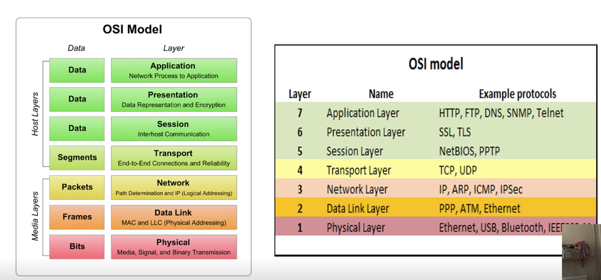

* Layer 1 is the physical layer, so it's just about some copper inside some cable, shoving electrical pulses down.
    * there's no intelligence, it just repeats and re-amplifies, or doesn't send the signal on as it goes,
    * the higher up the stack you go, the nearer to the human you go.

* OSI vs TCP Model:

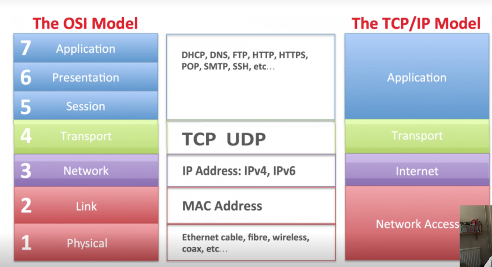

* Diagram of two computers, one labelled “Source” and the other “Destination”, with a Link-layer switch and router in
  the middle

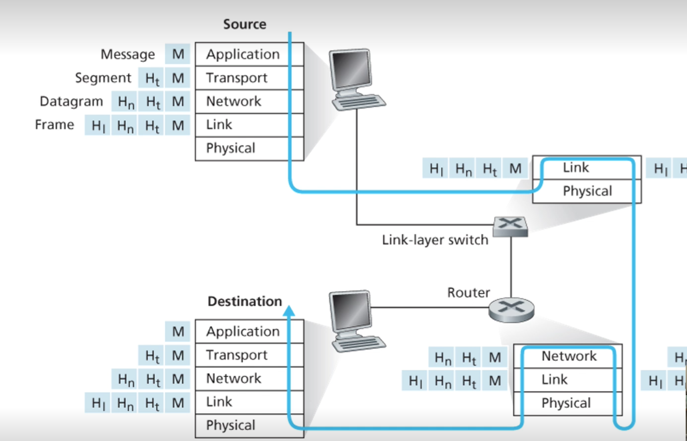

## Network Design

* At the basic level network consist 2 design
    * Physical
    * Logical

* The **Physical design** consist of all the physical devices and technology that communicate and can include:
    * The layout of devices and connections called Topology
        * Most commons: star, peer-to-peer, extended star, bus and mesh
    * End devices form the interface between the human and the network
        * these can include clients (nodes, PC’s etc) servers, file stores, printers etc
    * Intermediary devices that provide connectivity
        * switch, hub, router etc
    * Network media - the channel over which a message or data travels
        * ethernet, wireless, fibre etc

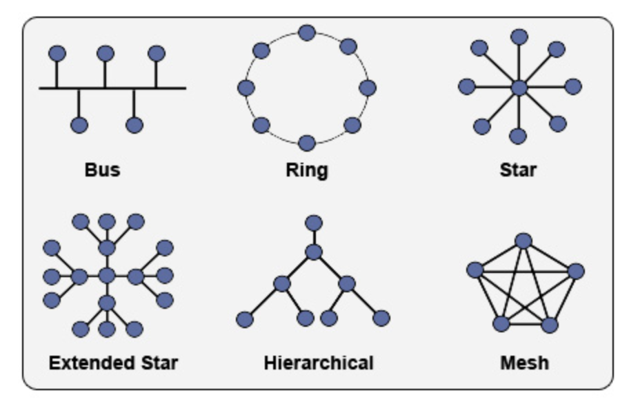

* Cisco icons are widely used and recognised in documentation

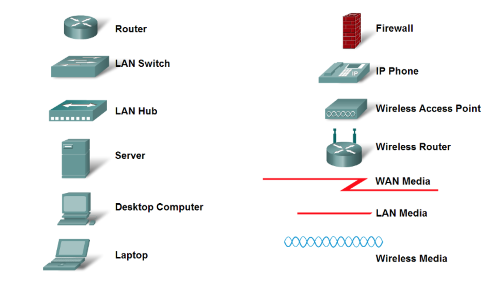

* The **logical design** is the configuration of the devices, the IP addressing scheme, the bandwidth and the protocols
* The logical design is not technology dependent and can include:
    * Protocols – set of rules to guide a communication
    * TCP and OSI models – layer models
    * IP addressing
    * Network addressing
    * Routing

* Types of devices to facilitate home access to the internet
    * **DSL** - Digital Subscriber Line – allows fast data transmission over copper telephone lines that are analogue or
      use
    * **ADSL** - Asymmetric Digital Subscriber Line - downstream is faster than upstream
    * **MODEM** - Modulator-Demodulator, uses a telephone line to create an analogue connection to a remote server.
* Types of media to transmit information between network devices
    * **TWISTED-PAIR** - insulated pairs of wires, can be shielded (STP) or unshielded (UTP), Cat5e, Cat6, Cat7.
      Traditionally used in telephone systems, where one wire carried the signal and the other grounded and absorbed
      signal interference. Network cables have four sets of wires which are paired by coloured sleeves; wires 2 and 6
      are used to send and receive data. The wires are twisted because when electromagnetic signals are conducted on
      copper wires in close proximity it causes crosstalk. Twisting the wires minimises the interference.
    * **FIBRE OPTICS** - single mode fibre (SMF) or multi-mode fibre (MMF). MMF used for shorter distances. Consists of
      thin strands of glass or plastic bound together in a sheath which transmits signals with light beams. Used for
      voice, data, or video. Expensive, great bandwidth, less susceptible to interference, thinner and lighter than
      other wires, transmits digital data. Difficult to install, expensive and harder to troubleshoot. Does not suffer
      from electrical interference.
    * **SATELLITE** - relay stations that receive signals from one earth station and rebroadcast them to another. Two
      types
        - geostationary and low earth orbiting.
    * **WIRELESS** - IEEE 802.11 WLAN standard, use access control devices such as router, devices can roam using
      signal, WiFi = Wireless Fidelity. Supports lower data rates than wired networks and can be susceptible to
      interference, e.g. weather, aircraft, microwave ovens.

* Type of devices for a core network infrastructure manage network traffic
    * **ROUTER** - Directs and forwards traffic between parts of a network. Maintains a routing table to efficiently
      direct packets from one node to another.
    * **SWITCH** - Interconnection device, reads data messages and sends to the correct port that the address is on, can
      reduce traffic on a network, has port intelligence and bandwidth allocation. Can be considered a multiport bridge.
    * **BRIDGE** - Used to connect two networks or segments together into a single aggregate network. Uses MAC
      addresses, can connect to different technologies, e.g. coaxial to Ethernet.
    * **GATEWAY** - Used to connect different, discrete, networks.
    * **HUB** - A dumb device that re-boosts signal and broadcasts from all ports. No intelligence, can amplify signals
      but shares bandwidth between all ports. Can be considered a multiport repeater.

## The Network Edge

* the computers and other devices connected to the Internet are often referred to as end systems.
    * End systems are also referred to as hosts because they host (that is, run) application programs such as a Web
      browser program
* **Hosts** are sometimes further divided into two categories: **clients** and **servers**.

### Access Networks

#### Home Access:

* Today, the two most prevalent types of broadband residential access are digital subscriber line (DSL) and cable.
* A residence typically obtains **DSL Internet access** from the same local telephone company (telco) that provides its
  wired local phone access.
    * when DSL is used, a customer’s telco is also its ISP (Internet Service Provider)
    * DSL modem uses the existing telephone line (twisted-pair copper wire)  to exchange data with a digital subscriber
      line access multiplexer (DSLAM) located in the telco’s local central office (CO).
    * The home’s DSL modem takes digital data and translates it to high- frequency tones for transmission over telephone
      wires to the CO; the analog signals from many such houses are translated back into digital format at the DSLAM.
    * On the customer side, a splitter separates the data and telephone signals arriving to the home and forwards the
      data signal to the DSL modem. On the telco side, in the CO, the DSLAM separates the data and phone signals and
      sends the data into the Internet. Hundreds or even thousands of households connect to a single DSLAM
    * The maximum rate is also limited by the distance between the home and the CO, the gauge of the twisted-pair line
      and the degree of electrical interference.
       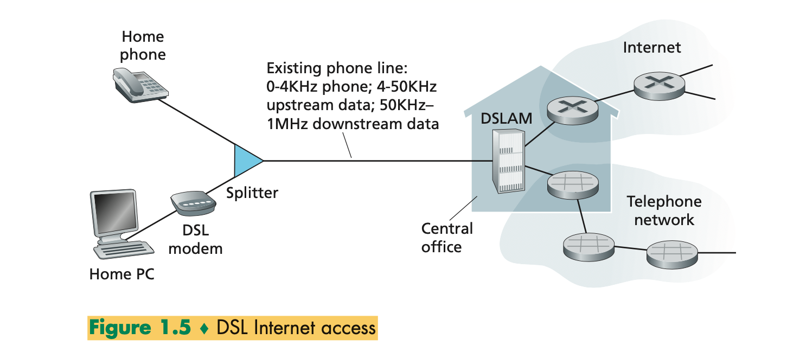

* **Cable Internet access** makes use of the cable television company’s existing cable television infrastructure.
    * A residence obtains cable Internet access from the same company that provides its cable television
    * Fiber optics connect the cable head end to neighborhood-level junctions, from which traditional coaxial cable is
      then used to reach individual houses and apartments
    * Because both fiber and coaxial cable are employed in this system, it is often referred to as hybrid fiber coax (
      HFC).
    * Cable Internet access requires special modems, called cable modems. As with a DSL modem, the cable modem is
      typically an external device and connects to the home PC through an Ethernet port
    * At the cable head end, the cable modem termination system (CMTS) serves a similar function as the DSL network’s
      DSLAM —turning the analog signal sent from the cable modems in many downstream homes back into digital format.
    * One important characteristic of cable Internet access is that it is a shared broadcast medium. In particular,
      every packet sent by the head end travels downstream on every link to every home and every packet sent by a home
      travels on the upstream channel to the head end.
        * For this reason, if several users are simultaneously downloading a video file on the downstream channel, the
          actual rate at which each user receives its video file will be significantly lower than the aggregate cable
          down- stream rate
           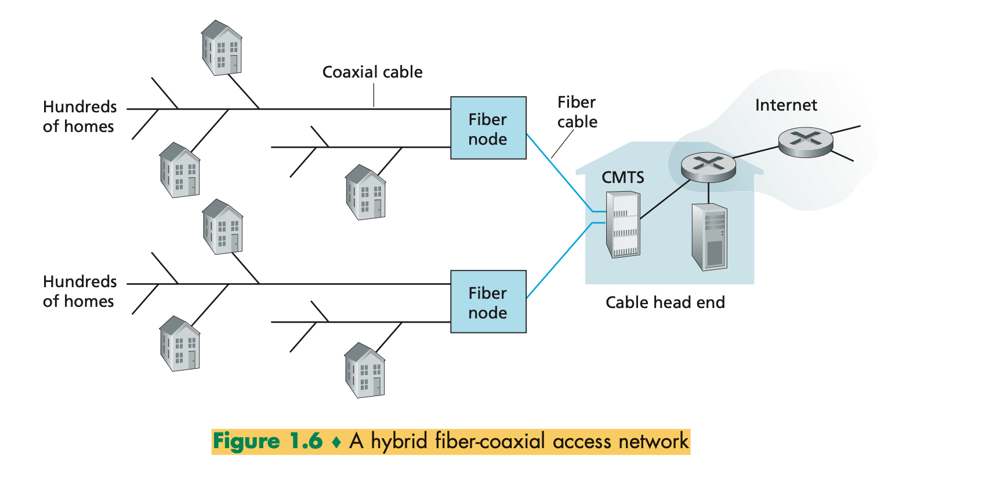

* **Fiber to the home (FTTH)** provides much higher speed
    * As the name suggests, the FTTH concept is simple—provide an optical fiber path from the CO directly to the home.
    * The simplest optical distribution network is called direct fiber, with one fiber leaving the CO for each home.
    * More commonly, each fiber leaving the central office is actually shared by many homes; it is not until the fiber
      gets relatively close to the homes that it is split into individual customer-specific fibers.
    * There are two competing optical-distribution network architectures that perform this split- ting: active optical
      networks (AONs) and passive optical networks (PONs).
        * AON is essentially switched Ethernet,

    * PON distribution architecture. Each home has an optical network terminator (ONT), which is connected by dedicated
      optical fiber to a neighborhood splitter
        * The splitter combines a number of homes onto a single, shared optical fiber, which connects to an optical line
          terminator (OLT) in the telco’s CO.
        * The OLT, providing conversion between optical and electrical signals, connects to the Internet via a telco
          router.
        * In the home, users connect a home router (typically a wireless router) to the ONT and access the Internet via
          this home router.
        * In the PON architecture, all packets sent from OLT to the splitter are replicated at the splitter (similar to
          a cable head end).  
           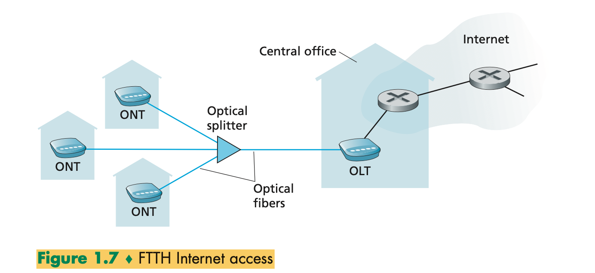

* **A satellite link** can be used to connect a residence to the Internet.
    * StarBand and HughesNet are two such satellite access providers

#### Ethernet and WIFI

* On corporate and university campuses, and increasingly in home settings, a local area network (LAN) is used to connect
  an end system to the edge router.
* Although there are many types of LAN technologies, Ethernet is by far the most prevalent access technology in
  corporate, university, and home networks.
* Ethernet users use twisted-pair copper wire to connect to an Ethernet switch,
* The Ethernet switch, or a network of such interconnected switches, is then in turn connected into the larger Internet.
   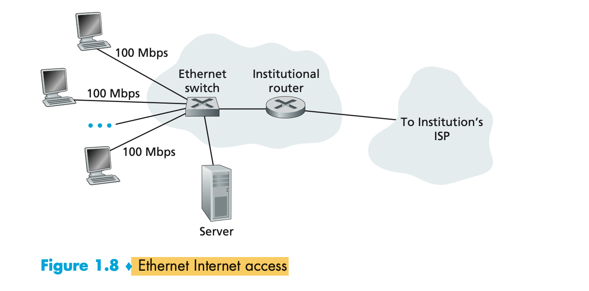

* In a wireless LAN setting, wireless users transmit/receive packets to/from an access point that is connected into the
  enterprise’s network (most likely using wired Ethernet), which in turn is connected to the wired Internet.
* A wireless LAN user must typically be within a few tens of meters of the access point.
* Wireless LAN access based on IEEE 802.11 technology, more colloquially known as WiFi
* a cable modem, providing broadband access to the Internet; and a router, which interconnects the base station and the
  stationary PC with the cable modem.   
   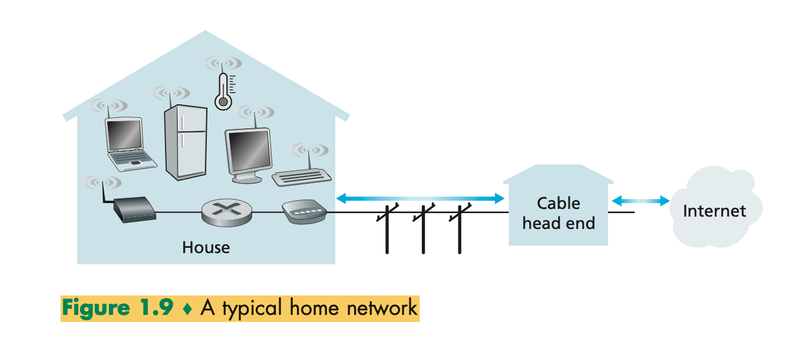

#### 3G and LTE

* Telecommunications companies have made enormous investments in so-called third-generation (3G) wireless, which
  provides packet-switched wide-area wire- less Internet access at speeds in excess of 1 Mbps.
    * But even higher-speed wide-area access technologies—a fourth-generation (4G) of wide-area wireless networks—are
      already being deployed.
    * LTE (for “Long-Term Evolution”) has its roots in 3G technology, and can achieve rates in excess of 10 Mbps.

### Physical Media

* when traveling from source to destination, passes through a series of transmitter-receiver pairs.
    * For each transmitter- receiver pair, the bit is sent by propagating electromagnetic waves or optical pulses across
      a **physical medium**.
        * Examples of physical media include twisted-pair copper wire, coaxial cable, multi mode fiber-optic cable,
          terrestrial radio spectrum, and satellite radio spectrum.
    * Physical media fall into two categories: guided media and unguided media.
        * Guided media, the waves are guided along a solid medium, such as a fiber-optic cable, a twisted-pair cop- per
          wire, or a coaxial cable.
        * Unguided media, the waves propagate in the atmosphere and in outer space, such as in a wireless LAN or a
          digital satellite channel.

* Twisted-Pair Copper Wire
    * The least expensive and most commonly used guided transmission medium is twisted- pair copper wire.
    * Twisted pair consists of two insulated copper wires, each about 1 mm thick, arranged in a regular spiral pattern
    * The wires are twisted together to reduce the electrical inter- ference from similar pairs close by
    * Typically, a number of pairs are bundled together in a cable by wrapping the pairs in a protective shield
    * Unshielded twisted pair (UTP) is commonly used for computer networks within a building, that is, for LANs.

* Coaxial Cable
    * Like twisted pair, coaxial cable consists of two copper conductors, but the two conductors are concentric rather
      than parallel
    * With this construction and special insulation and shielding, coaxial cable can achieve high data transmission
      rates.
    * Coaxial cable is quite common in cable television systems.
    * Coaxial cable can be used as a guided shared medium

* Fiber Optics
    * An optical fiber is a thin, flexible medium that conducts pulses of light, with each pulse representing a bit.
    * A single optical fiber can support tremendous bit rates, up to tens or even hundreds of gigabits per second.
    * They are immune to electromagnetic interference, have very low signal attenuation up to 100 kilometers, and are
      very hard to tap.
    * These characteristics have made fiber optics the preferred long-haul guided transmission media, particularly for
      overseas links

* Terrestrial Radio Channels
    * Radio channels carry signals in the electromagnetic spectrum.
    * They are an attractive medium because they require no physical wire to be installed, can penetrate walls, provide
      connectivity to a mobile user, and can potentially carry a signal for long distances
    * Terrestrial radio channels can be broadly classified into three groups:
        * operate over very short distance (e.g., with one or two meters);
        * operate in local areas, typically spanning from ten to a few hundred meters;
        * operate in the wide area, spanning tens of kilometers.

* Satellite Radio Channels
    * A communication satellite links two or more Earth-based microwave transmitter/ receivers, known as ground
      stations.
    * Two types of satellites are used in communications: geostationary satellites and low-earth orbiting (LEO)
      satellites
        * Geostationary satellites permanently remain above the same spot on Earth. This stationary presence is achieved
          by placing the satellite in orbit at 36,000 kilometers above Earth’s surface.
        * LEO satellites are placed much closer to Earth and do not remain permanently above one spot on Earth. They
          rotate around Earth (just as the Moon does) and may communicate with each other, as well as with ground
          stations.

# Protocol

* Communication between devices on a network is organised and made consistent by protocols. A protocol is an agreed set
  of actions in response to given situations.
* In computing, protocols are there to ensure that data transfer can happen regardless of the transmission media or the
  connected devices.
    * It can be thought of as ensuring that all networked devices (at the core or on the edge) speak the same language
      and consistent responses are given to specific requests.
* Protocols the rules that govern a communication between devices and rules can vary depending on protocol.
    * They’re necessary, because if you didn't have protocols in place, different equipment would try and transmit
      different types of data, different shapes of data.
    * So something needs to coexist so that everything can communicate in the same format.

* A group of protocols together is a **“protocol suite”** and they vary at the different layers of the OSI and the
  TCP/IP model,
* Communications are governed by protocols.
* Message Encoding
    * Encoding is the process of converting information into another acceptable form for transmission.
    * Decoding reverses this process to interpret the information
    * A piece of data goes to be transmitted across the network and it gets changed for a human format into the
      electrical signals.
       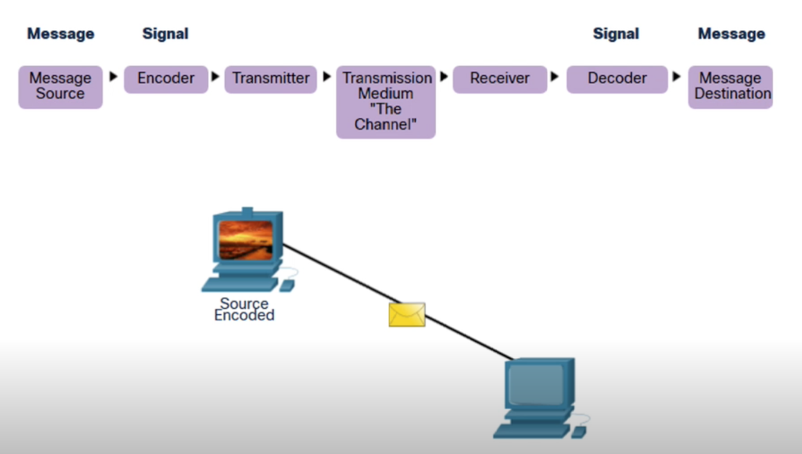

* The Rules:
    * Message encoding
    * Messaging format and encapsulation
    * Message size
    * Message Timing
    * Message Delivery Options

* Message Delivery Options:
    * Unicast - one to one
    * Multicast - one to multi
    * Broadcast - one to all

 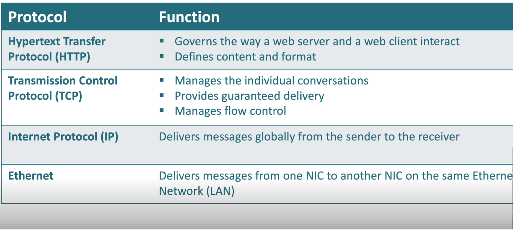

## Protocol layering

* Protocol layering has conceptual and structural advantages [RFC 3439]. As we have seen, layering provides a structured
  way to discuss system components. Modularity makes it easier to update system components.
   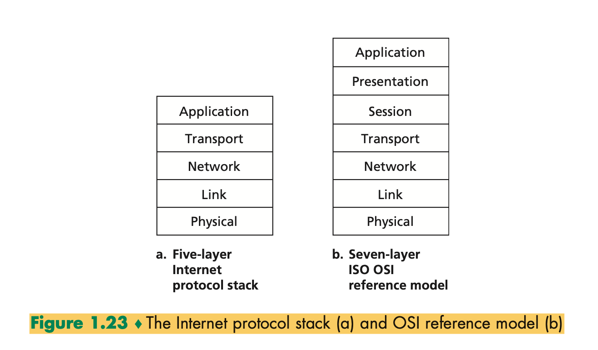

* The Internet protocol (IP) suite, which is used for transmitting data over the Internet, contains dozens of protocols.
    * Link layer - PPP, DSL, Wi-Fi, Ethernet;
        * Link layer protocols establish communication between devices at a hardware level. In order to transmit data
          from one device to another, each device's hardware must support the same link layer protocol
        * data transfer between neighboring network elements
    * Internet layer - IPv4, IPv6;
        * Internet layer protocols are used to initiate data transfers and route them over the Internet
        * routing of datagrams from source to destination
    * Transport layer - TCP, UDP;
        * Transport layer protocols define how packets are sent, received, and confirmed.
        * process-process data transfer
    * Application layer - HTTP, IMAP, FTP.
        * Application layer protocols contain commands for specific applications.
        * supporting network applications
    * Physical layer :
        * bits “on the wire”

 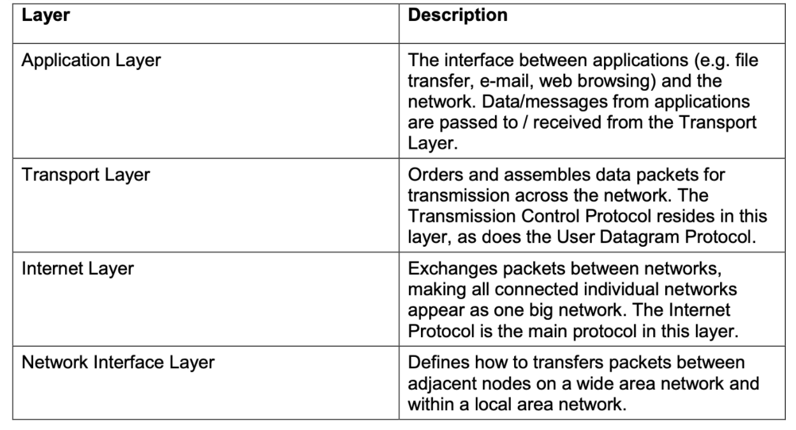

* Application Layer
    * The application layer is where network applications and their application-layer protocols reside
    * The Internet’s application layer includes many protocols, such as the HTTP protocol (which provides for Web
      document request and transfer), SMTP (which provides for the transfer of e-mail messages), and FTP (which provides
      for the transfer of files between two end systems).
* Transport Layer
    * The Internet’s transport layer transports application-layer messages between application endpoints.
    * In the Internet there are two transport protocols, TCP and UDP, either of which can transport application-layer
      messages.
        * TCP provides a connection-oriented service to its applications. This service includes guaranteed delivery of
          application-layer messages to the destination and flow control (that is, sender/receiver speed matching). *
          TCP also breaks long messages into shorter segments and provides a congestion-control mechanism, so that a
          source throttles its transmission rate when the network is congested.
        * The UDP protocol provides a connectionless service to its applications. This is a no-frills service that
          provides no reliability, no flow control, and no congestion control.
        * transport-layer packet as a segment.
* Network Layer
    * The Internet’s network layer is responsible for moving network-layer packets known as datagrams from one host to
      another.
    * The network layer then provides the service of delivering the segment to the transport layer in the destination
      host.
    * The Internet’s network layer includes the celebrated IP protocol, which defines the fields in the datagram as well
      as how the end systems and routers act on these fields.
* Link Layer
    * To move a packet from one node (host or router) to the next node in the route, the network layer relies on the
      services of the link layer
    * In particular, at each node, the network layer passes the datagram down to the link layer, which delivers the
      datagram to the next node along the route.
    * the link- layer packets named as frames.
* Physical Layer
    * Physical layer is to move the individual bits within the frame from one node to the next.
    * The protocols in this layer are again link dependent and further depend on the actual transmission medium of the
      link (for example, twisted-pair copper wire, single-mode fiber optics).

* What if an application needs one of these services?
    * The Internet’s answer to both of these questions is the same—it’s up to the application developer. It’s up to the
      application developer to decide if a service is important, and if the ser- vice is important, it’s up to the
      application developer to build that functionality into the application.

## ISO/OSI model

* Open Systems Interconnection model (OSI model) was published as a conceptual model for network protocols and
  communications by ISO (International Standards Organisation).

* OSI has 7 layers and differences with TCP/IP layers
   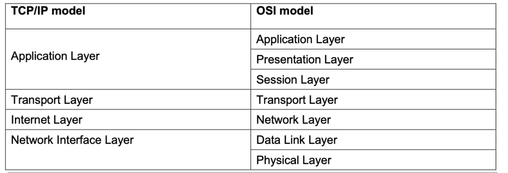

## Encapsulation

 

* Data generated by the user, such as a file or an email message, is referred to as user data.
    * This is usually generated within applications, not all of which have network access
    * User data is generated outside the networking model. However, when user data is to be sent across a network, it is
      often split up into smaller chunks and then wrapped by headers that provide network devices with information about
      where the data has come from, where it is going, what type of information it is and what protocols have been
      applied to it.
    * At each layer of the network stack, in this case TCP/IP, a header is added as the data is passed from layer to
      layer.
    * These encapsulated chunks of data are known as 'packets', which are transmitted across the network
    * At the receiving end, each header is stripped off as it passes back up the stack, and the information they contain
      is acted on at each layer of the stack
* The packets that are sent across a network have a very particular structure in regard to how the headers are arranged
  and what information they hold, as well as the size of the payload (user data) they can hold.

# Packet and Circuit switching

* A packet traverses a network it does not necessarily travel across a single direct line/cable.
    * Depending on its destination, it may need to travel across other networks and devices.
    * Some of these devices are responsible for routing the packets so they get to their destination, and are referred
      to as packet switches.

* Data transmitted across a packet-switched network uses a technique called store-and-forward transmission to ensure
  that whole packets are received completely before they are sent/forwarded to their next destination.
    * To achieve this, the device the packet is sent to has an output buffer, also known as an output queue.
    * Packets are stored in this buffer as they arrive.
    * When there is a lot of network traffic at a device, this buffer may be holding more than one packet.
    * Inbound packets may be arriving faster than outbound ones are leaving, thereby generating a queue in the buffer
      and causing queuing delays.
    * If the buffer does not have enough space to store an incoming packet it may be dropped, resulting in packet loss.
    * Some devices will drop packets already in the buffer to make room for inbound packets.

* All packets have a sender and receiver and, the aim is for the message to get to the receiver
    * In the Internet, every end system has an address called an IP address. When a source end system wants to send a
      packet to a destination end system, the source includes the destination’s IP address in the packet’s header.
    * To continue packet switches need some way to determine where next to send incoming packets.
    * There are two mechanisms for this: **forwarding tables** and **routing protocols**.
        * When a packet arrives at a packet switch it will read part of the packet contents to determine its IP address.
          It will then use this to map against internal information, a forwarding table, to determine where best to send
          it next. The forwarding table holds information that maps the packet switch’s outbound links (of which there
          may be many) to the address, or parts of the address.
        * Network system can change second by second. Given this rate of change, forwarding tables can soon become
          out-of-date, or may not provide the most effective next destination. So this information needs to be changed.
          they are kept up-to-date by the system itself through the use of routing protocols.
    * In a summary , each router has a forwarding table that maps destination addresses (or portions of the destination
      addresses) to that router’s outbound links.
        * When a packet arrives at a router, the router examines the address and searches its forwarding table, using
          this destination address, to find the appropriate outbound link.
        * The router then directs the packet to this outbound link.

* four types of delays in packet switching
    * When everybody transmits packets at the same time, the data’s just going to collide and drop and it has to be
      re-transmitted. So a **transmission delay**, it's the time taken to actually put the bits onto the medium.
    * **Propagation delay** is the time taken to get to the destination from the sender.
    * **Queuing delay** is depending on how congested your network is and largely that is solved with switches, or
      caused by switches in some cases.
    * **Processing delay**, which is the time taken for the router to process the packet header and determine which
      route to send it on according to where it exists on the network.

* Circuit Switching
    * In circuit-switched networks, the resources needed along a path (buffers, link transmission rate) to provide for
      communication between the end systems are reserved for the duration of the communication session between the end
      systems
    * A circuit established and maintained in circuit switching, it establishes a connection, transfers the data and
      then disconnects.
        * So the communication line is kept open for the duration of that transfer.
        * it's not overly efficient.

* Packet Vs Circuit swwitching
    * Adventage of package Switching over Circuit
        * packet switching is more efficient in terms of bandwidth
            * it has minimal transmission latency; it's more reliable as the destination can detect the missing packet
            * it's more fault-tolerant because the packets may follow different paths in case a link is down
            * it's cost effective.
    * Disadvantages of packet switching over Circuit
        * Package switching does not give an order to packages, but circuit does.
        * Since the packets are unordered, you need to provide sequence numbers to each of the packets, which obviously
          increases the size of the packet.
        * Complexity is more at each node because there is more information that the node has to examine in order to
          move it along.
        * Transmission delay is more likely because of rerouting of packets, and packet switching is beneficial only for
          small messages.
        * for large data, circuit switching is better.  
    
# Measuring a Network
