#### Main Topics

* Application Layer
    * Identify and describe the application layer, and its protocols and services, with reference to the OSI/ISO model
      and TCP/IP;
    * Apply application and transport layer protocols in a simple program;
    * Identify and compare different applications layer protocols, such as mail protocols, HTTP, DNS, and FTP;
    * Explain the client/server architecture from the perspective of HTTP communications.

#### Sub titles:

* [Introduction to the reference model](#introduction-to-the-reference-model)

# Introduction to the reference model

## Application Layer

* The application layer is all about end-user applications.
    * When you write a piece of software that is going to require access to a network, this is the set of protocols that
      need to be initiated from within the program.
    * Unlike at other layers, there are a number of protocols to choose from, depending on the software’s requirements,
      and not all of them are required.
    * For example, an email client needs to utilise a mail protocol whereas a video streaming system will not.
* The application layer requires and accesses the services provided by the transport layer to determine how
  conversations between two entities occur, whether or not the communication is connection-orientated or connectionless,
  as well as what types of guarantees are made in regard to the services, and what type of security, if any, is applied.
  This is discussed in more detail later in the week.
* At the top of the stack in both models are network applications and services that communicate with lower layers
  through the TCP and UDP ports.
* Some of the components in this layer are utilities that collect information about the network configuration.
* Some Application layer components may be an API, for example, while some may provide services such as print and name
  resolution.
  </br>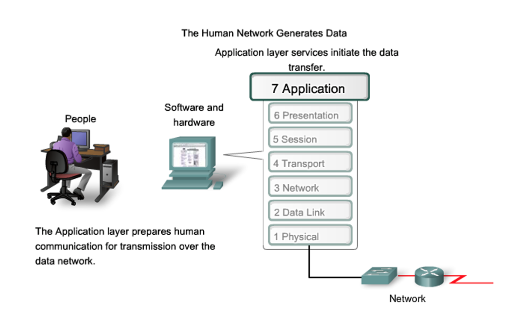

* The TCP/IP application layer corresponds to the Presentation, Application and Session layers in the OSI model
    * The OSI Presentation layer translates data into a neutral format and includes encryption and data compression
    * the OSI Session layer manages communication between applications on networked devices and includes security and
      name recognition.
      </br>

# Application Architectures

* There are 2 types of architecture while designing network which communication between the programs,
    * Client/Server
    * Peer-to-peer (P2P)

## Client / Server

* The approach is between end user (client) and some services/process needs to be done at centralised point (server)
* This model enables multiple clients to utilise the centralised services of the server
* Server is always on, and clients will connect to server when ever they need.
* For example web apps, user can enter address viw web browser, then contact to server and server can retrieve
  addresses.
    * or networked games, player can send a command via using game client app, then server can manage the players
      actions.
* Note that with the client-server architecture, clients do not directly communicate with each other; for example, in
  the Web application, two browsers do not directly communicate.
* Client-server architecture is that the server has a fixed, well-known address, called an IP address
    * Because the server has a fixed, well-known address, and because the server is always on, a client can always
      contact the server by sending a packet to the server’s IP address
* Often in a client-server application, a single-server host is incapable of keep- ing up with all the requests from
  clients
    * For this reason, a data center, housing a large number of hosts, is often used to create a powerful virtual
      server.

</br>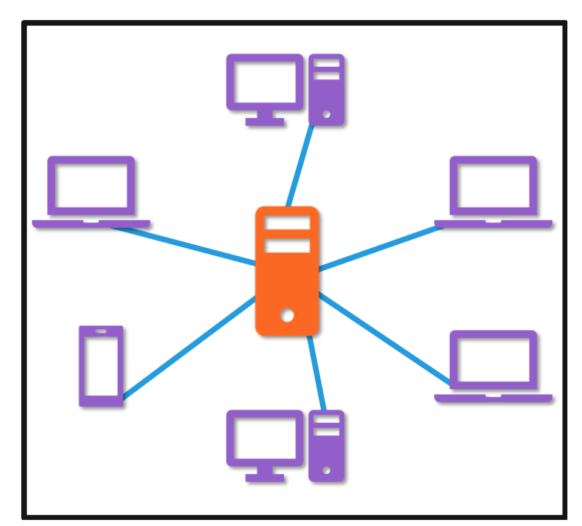

## Peer To Peer (P2P)

* Does not require a centralised server, instead facilitating communication directly between two devices
* A single application is usually distributed/replicated between many devices which enables both to send and receive
  communications between these applications.
* Peers are not always on, there is no guarantee that the application on a device is available
* A single peer can connect to multiple other peers provided they are available
* This type of architecture is highly scalable and evolves on demand
* but there is no guarantee that the application they are attempting to contact is available and hard to implement and
  maintain.
* For example File Sharing:
    * Sharing files is a common use for a P2P network. Each peer has a designated space on their machine where they
      store files that are made available to anyone using the P2P network.
    * The application on the user's machine is able to search, and possibly catalogue, the files available on all other
      machines.
    * When a file that is required is found, a direct connection between the machines is established to download the
      file
* In a P2P architecture, there is minimal (or no) reliance on dedicated servers in data centers.
    * Instead the application exploits direct communication between pairs of intermittently connected hosts, called
      peers.
    * The peers are not owned by the service provider, but are instead desktops and laptops controlled by users, with
      most of the peers residing in homes, universities, and offices.
    * Because the peers communicate without passing through a dedicated server, the architecture is called peer-to-peer.

* One of the most compelling features of P2P architectures is their self- scalability.
    * For example, in a P2P file-sharing application, although each peer generates workload by requesting files, each
      peer also adds service capacity to the system by distributing files to other peers.
* P2P architectures are also cost effective, since they normally don’t require significant server infrastructure and
  server bandwidth
* However, P2P applications face challenges of security, performance, and reliability due to their highly decentralized
  structure.

  </br>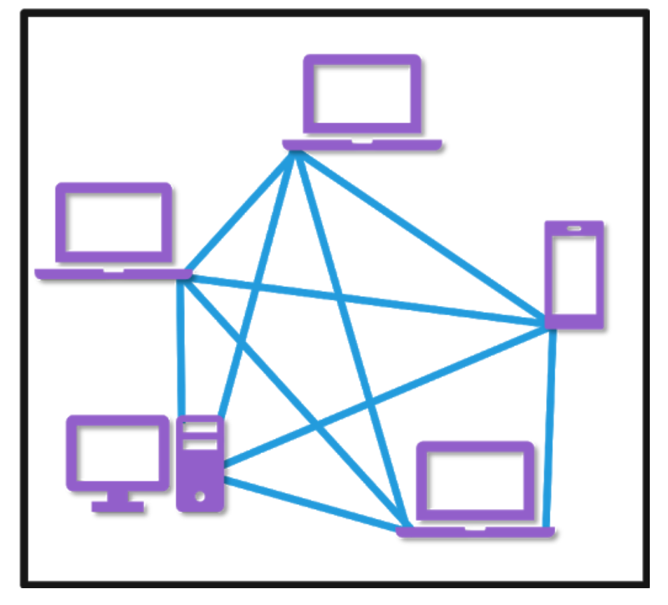

# Application Services

* File and print services
    * These services fulfil all requests for file access and print services.
    * Requests for print come in across the network and up through the protocol stack on the host machine to the
      transport layers, where they are then routed through the appropriate port to the file server
* Name resolution services
    * The Domain Name Service (DNS) provides name resolution for the Internet and also for isolated TCP/IP networks.
    * This name server service runs at the application layer of the name server computer and communicates with other
      name servers to exchange name resolution information.
    * A user references a domain name and the underlying protocol software resolves that name to an IP address using
      name resolution.
* Redirection services aka redirector
    * this service intercepts service requests in the host and checks that the request can be fulfilled locally or needs
      to be forwarded to another machine on the network.
* API's
    * The Application Layer Interface (API) is a predefined collection of functions that a program can use to access
      other parts of the OS environment and communicate with them.

* Questions:
    * Five non proprietary Internet applications and three application layer protocols
        * The Web: HTTP; file transfer: FTP; remote login: Telnet; e-mail: SMTP; BitTorrent file sharing: BitTorrent
          protocol.
    * Difference between network architecture and application architecture
        * Network architecture refers to the organization of the communication process into layers (e.g., the five-layer
          Internet architecture).
        * Application architecture, is designed by an application developer and dictates the broad structure of the
          application (e.g., client-server or P2P).
    * For a communication session between a pair of processes, which process is the client and which is the server
        * The process which initiates the communication is the client; the process that waits to be contacted is the
          server.
    * Why are the terms client and server still used in peer-to-peer applications
        * In a P2P file-sharing application, the peer that is receiving a file is typically the client and the peer that
          is sending the file is typically the server.
    * What information is used by a process running on one host to identify a process running on another host
        * The IP address of the destination host and the port number of the socket in the destination process.

# Building Applications

* Programming languages are providing some API to enable to use/access protocols at the application layer and connects
  to Transfer layer.
* These languages define a construct referred to as a ‘socket’ that manages all the lower level access requirements so a
  program can use a network.
* Socket has 2 main purposes
    * listen to incoming request, typically on the server-side in a client-server model
    * send data onto network
* Socket acts as the interface between application and transport layer for a program
* A socket may have a number of attributes that can be set, such as a port number, to tailor it to the specific
  environment and requirements of the program.
* the programmer usually has little control over the transport layer, which is handled by the socket, but they can use
  the various application layer protocols which best suit the requirements of their program.
* Port numbers are predefined internal addresses
* the socket numbers are concatenating IP address of host + port address
* Here below Computer A initiates to connection to computer B through the port number
    * It combines with IP address and becomes destination address for Comp A when computer B wants to reply.
    * Request also includes data field telling computer B which socket number to use when sending back to A.
        * This is the PCA source socket address.
* When B received the request directs a response to the socket listed as PCA socket address .
  </br>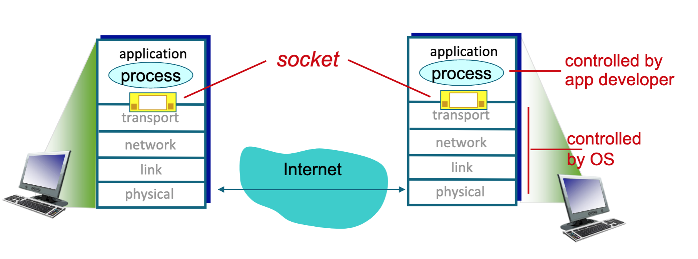

* In the Internet, the host is identified by its IP address.
    * an IP address is a 32-bit quantity that we can think of as uniquely identifying the host.
    * In addition to knowing the address of the host to which a message is destined, the sending process must also
      identify the receiving process (more specifically, the receiving socket) running in the host.
    * This information is needed because in general a host could be running many network applications. A destination
      port number serves this purpose.
    * Popular applications have been assigned specific port numbers. For example, a Web server is identified by port
      number 80. A mail server process (using the SMTP protocol) is identified by port number 25. A list of well-known
      port numbers for all Internet standard protocols can be found at [www.iana.org](www.iana.org)

* Typicaly computers with server socket keep a TCP and UDP port open, ready for unscheduled incoming call or data.
* Client determines the socket ID on the server by finding it using a DNS server.
* UDP: unreliable groups of bytes (“datagrams”)
* TCP: reliable , byte stream oriented
* Diff UDP and TCP
    * UDP is no secure, and becomes much quicker, Does not have much encapsulation
    * TCP makes more encapsulation. more secure. Secure but slower
* Port with number 0-1023 asociated with services and computing in a static way.
    * ports with numbers 1024-49151 are called user or registered ports
    * ports with numbers 49152-65535 are called dynamic, private or ephemeral ports.
* UDP: no “connection” between client & server
    * no handshaking before sending data
    * sender explicitly attaches IP destination address and port # to each packet
    * receiver extracts sender IP address and port# from received packet
    * transmitted data may be lost or received out-of-order
      </br>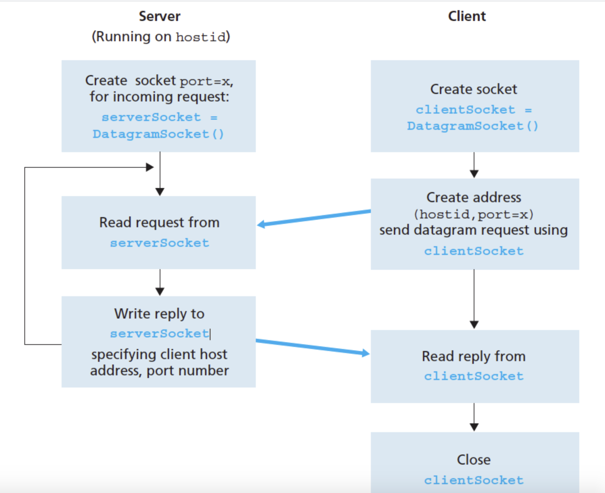

### TCP Services

* The TCP service model includes a connection-oriented service and a reliable data transfer service. When an application
  invokes TCP as its transport protocol, the application receives both of these services from TCP.
* **Connection-oriented service.** TCP has the client and server exchange transport- layer control information with each
  other before the application-level mes- sages begin to flow.
    * This so-called handshaking procedure alerts the client and server, allowing them to prepare for an onslaught of
      packets.
    * After the handshaking phase, a TCP connection is said to exist between the sockets of the two processes.
    * The connection is a full-duplex connection in that the two processes can send messages to each other over the
      connection at the same time.
    * When the application finishes sending messages, it must tear down the connection.
* **Reliable data transfer service.** The communicating processes can rely on TCP to deliver all data sent without error
  and in the proper order.
    * When one side of the application passes a stream of bytes into a socket, it can count on TCP to deliver the same
      stream of bytes to the receiving socket, with no missing or duplicate bytes.

  </br>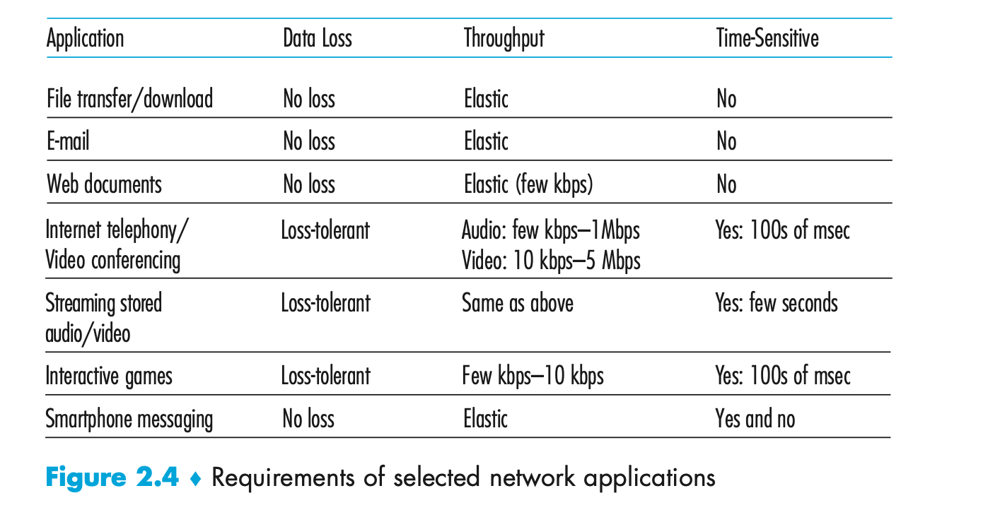

### SECURING TCP

* Neither TCP nor UDP provides any encryption—the data that the sending process passes into its socket is the same data
  that travels over the network to the destination process.
* So, for example, if the sending process sends a password in cleartext (i.e., unencrypted) into its socket, the
  cleartext password will travel over all the links between sender and receiver, potentially getting sniffed and
  discovered at any of the intervening links.
* Because privacy and other security issues have become critical for many applications, the Internet community has
  developed an enhancement for TCP, called **Secure Sockets Layer (SSL).**
* TCP-enhanced-with-SSL not only does everything that traditional TCP does but also provides critical process-to-process
  security services, including encryption, data integrity, and end-point authentication.
* We emphasize that SSL is not a third Internet transport protocol, on the same level as TCP and UDP, but instead is an
  enhancement of TCP, with the enhancements being implemented in the application layer.
* if an application wants to use the services of SSL, it needs to include SSL code (existing, highly optimized libraries
  and classes) in both the client and server sides of the application.
* SSL has its own socket API that is similar to the traditional TCP socket API.
* When an application uses SSL, the sending process passes cleartext data to the SSL socket; SSL in the sending host
  then encrypts the data and passes the encrypted data to the TCP socket.
    * The encrypted data travels over the Internet to the TCP socket in the receiving process.
    * The receiving socket passes the encrypted data to SSL, which decrypts the data.
    * Finally, SSL passes the cleartext data through its SSL socket to the receiving process.

## Socket Programming with UDP

* **UDP (User Datagram Protocol) - Unicast**
    * UDP allows two or more processes running on different hosts to communicate.
    * The host IP address, the port number and the actual data to be transferred are collectively called a ‘packet
    * UDP provides an unreliable message-oriented service model, in that it makes a best effort to deliver the packet to
      the destination in a single operation at the sending side.
* UDP differs from TCP (Transport Control Protocol)
    * UDP is a connectionless service - there is no handshaking to establish a communication pipe because UDP does not
      have a pipe.
    * When UDP communicates, it attaches the destination address to each batch of data that is being sent
    * UDP is a best-effort service; it makes no guarantee that the packet will be delivered. This is in contrast to TCP,
      which has a reliable service model.

* UDP Server Main Method

```java
import java.io.*;
import java.net.*;

class UDPServer {
    public static void main(String args[]) throws Exception {
        DatagramSocket serverSocket = new DatagramSocket(9876);
        byte[] receiveData = new byte[1024];
        byte[] sendData = new byte[1024];
        while (true) {
            DatagramPacket receivePacket = new DatagramPacket(receiveData,
                    receiveData.length);
            serverSocket.receive(receivePacket);
            String sentence = new String(receivePacket.getData());
            InetAddress IPAddress = receivePacket.getAddress();

            int port = receivePacket.getPort();
            String capitalizedSentence = sentence.toUpperCase();
            sendData = capitalizedSentence.getBytes();
            DatagramPacket sendPacket = new DatagramPacket(sendData,
                    sendData.length, IPAddress, port);
            serverSocket.send(sendPacket);
        }
    }
}
```

* UDP Client Main Method

```java
import java.io.*;
import java.net.*;

class UDPClient {
    public static void main(String args[]) throws Exception {
        BufferedReader inFromUser = new BufferedReader(new InputStreamReader(System.in));
        DatagramSocket clientSocket = new DatagramSocket();
        InetAddress IPAddress = InetAddress.getByName("localhost");
        byte[] sendData = new byte[1024];
        byte[] receiveData = new byte[1024];
        String sentence = inFromUser.readLine();
        sendData = sentence.getBytes();
        DatagramPacket sendPacket = new DatagramPacket(sendData, sendData.length, IPAddress, 9876);
        clientSocket.send(sendPacket);
        DatagramPacket receivePacket = new DatagramPacket(receiveData, receiveData.length);
        clientSocket.receive(receivePacket);
        String modifiedSentence = new String(receivePacket.getData());
        System.out.println("FROM SERVER:  " + modifiedSentence);
        clientSocket.close();
    }
}
```

# Mail Protocols

## Simple Mail Transfer Protocol (SMTP)

* Simple Mail Transfer Protocol (SMTP) is the protocol that guides email communications.
* It defines how commands and responses must be sent backwards and forwards.
* It resides in the application layer of the TCP/IP stack and operates through port 25 on the SMTP server.
* SMTP, defined in RFC 5321, is at the heart of Internet electronic mail.
* SMTP transfers messages from senders’ mail servers to the recipients’ mail servers.
* Although SMTP has numerous wonderful qualities, as evidenced by its ubiquity in the Internet, it is nevertheless a
  legacy technology that possesses certain archaic characteristics.
    * For example, it restricts the body (not just the headers) of all mail messages to simple 7-bit ASCII.

* To connect a mail server use Telnet `telnet serverName 25`
    * you are simply establishing a TCP connection between your local host and the mail server. After typing this line,
      you should immediately receive the 220 reply from the server. Then issue the SMTP commands HELO, MAIL FROM, RCPT
      TO, DATA, CRLF.CRLF, and QUIT at the appropriate times.

* **Comparison with HTTP:**
    * SMTP is primarily a push protocol—the sending mail server pushes the file to the receiving mail server. In
      particular, the TCP connection is initiated by the machine that wants to send the file.
        * HTTP is mainly a pull protocol—someone loads information on a Web server and users use HTTP to pull the
          information from the server at their convenience. In particular, the TCP connection is initiated by the
          machine that wants to receive the file
    * Second difference, which we alluded to earlier, is that SMTP requires each message, including the body of each
      message, to be in 7-bit ASCII format. If the message contains characters that are not 7-bit ASCII (for example,
      French characters with accents) or contains binary data (such as an image file), then the message has to be
      encoded into 7-bit ASCII.
        * HTTP does not have any restriction
    * A third important difference concerns how a document consisting of text and images (along with possibly other
      media types) is handled.
        * SMTP places all of the message’s objects into one message.
        * HTTP encapsulates each object in its own HTTP response message

* **Sending Mail Process**
    * First, the client SMTP (running on the sending mail server host) has TCP establish a connection to port 25 at the
      server SMTP (running on the receiving mail server host).
    * If the server is down, the client tries again later.
    * Once this connection is established, the server and client perform some application-layer handshaking—just as
      humans often introduce themselves before transferring information from one to another, SMTP clients and servers
      introduce themselves before transferring information.
    * During this SMTP handshaking phase, the SMTP client indicates the e-mail address of the sender (the person who
      generated the message) and the e-mail address of the recipient.
    * Once the SMTP client and server have introduced themselves to each other, the client sends the message.
    * SMTP can count on the reliable data transfer service of TCP to get the message to the server without errors.
    * The client then repeats this process over the same TCP connection if it has other messages to send to the server;
      otherwise, it instructs TCP to close the connection.

  </br>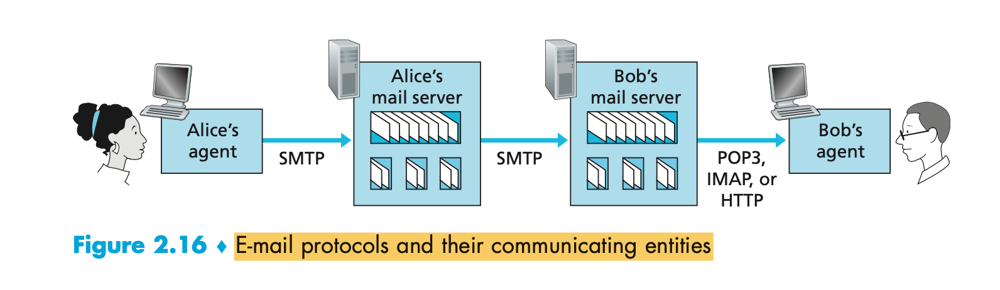

    * **How does a recipient like Bob**, running a user agent on his local PC, obtain his messages, which are sitting in
      a mail server within Bob’s ISP?
        * Bob’s user agent can’t use SMTP to obtain the messages because obtaining the messages is a pull operation,
          whereas SMTP is a push protocol.
        * This completed by introducing a special mail access protocol that transfers messages from Bob’s mail server to
          his local PC.
        * There are currently a number of popular mail access protocols, including Post Office Protocol—Version 3 (POP3)
          ,Internet Mail Access Protocol (IMAP), and HTTP.

* SMTP is used to transfer mail from the sender’s mail server to the recipient’s mail server; SMTP is also used to
  transfer mail from the sender’s user agent to the sender’s mail server.
    * A mail access protocol, such as POP3, is used to transfer mail from the recipient’s mail server to the recipient’s
      user agent.

### Mail Access Protocols

#### Post Office Protocol V3 (POP3)

* POP3 is an extremely simple mail access protocol and functionality is rather limited.
* It is a pull protocol that is used by local email clients.
    * This means that the email client can download and store emails as they are delivered to the server in the
      background when an internet connection is available.
* POP3 begins when the user agent (the client) opens a TCP connection to the mail server (the server) on port 110.
* With the TCP connection established, POP3 progresses through three phases: authorization, transaction, and update.
    * authorization, the user agent sends a username and a password (in the clear) to authenticate the user.
    * transaction, the user agent retrieves messages; also during this phase, the user agent can mark messages for
      deletion, remove deletion marks, and obtain mail statistics.
    * update, occurs after the client has issued the quit command
* Ending the POP3 session; at this time, the mail server deletes the messages that were marked for deletion.
* There are 2 possible responses: +OK or -ERR
* POP3 can often be configured (by the user) to “download and delete” or to “download and keep.”
* The problem od “download and delete”, when user receive the mail from one client then cn not reach from other clients.
    * In the download-and-keep mode, the user agent leaves the messages on the mail server after downloading them. In
      this case, user can reread messages from different machines; such as Work, home etc.
* POP3 server does not carry state information across POP3 sessions. This lack of state information across sessions
  greatly simplifies the implementation of a POP3 server.

#### Internet Mail Access Protocol (IMAP)

* the IMAP protocol, defined in [RFC 3501], was invented.
* It is more complex than POP3
* An IMAP server will associate each message with a folder; when a message first arrives at the server, it is associated
  with the recipient’s INBOX folder.
* The recipient can then move the message into a new, user-created folder, read the message, delete the message, allow
  users to search remote folders for messages matching specific criteria ad so on
* IMAP server maintains user state information across IMAP sessions—for example, the names of the folders and which
  messages are associated with which folders.
* IMAP is that it has commands that permit a user agent to obtain components of messages. For example, a user agent can
  obtain just the message header of a message or just one part of a multipart MIME message.
    * This feature is useful when there is a low-bandwidth connection

#### Web-Based Email (HTTP)

* More and more users today are sending and accessing their e-mail through their Web browsers.
* With this service, the user agent is an ordinary Web browser, and the user communicates with its remote mailbox via
  HTTP. When a recipient, such as Bob, wants to access a message in his mailbox, the e-mail message is sent from Bob’s
  mail server to Bob’s browser using the HTTP protocol rather than the POP3 or IMAP protocol.

#### MIME Type

* MIME stands for Multipurpose Internet Mail Extensions and is used to identify the content type of mail messages so
  that the correct encoding and decoding can be applied.
  </br>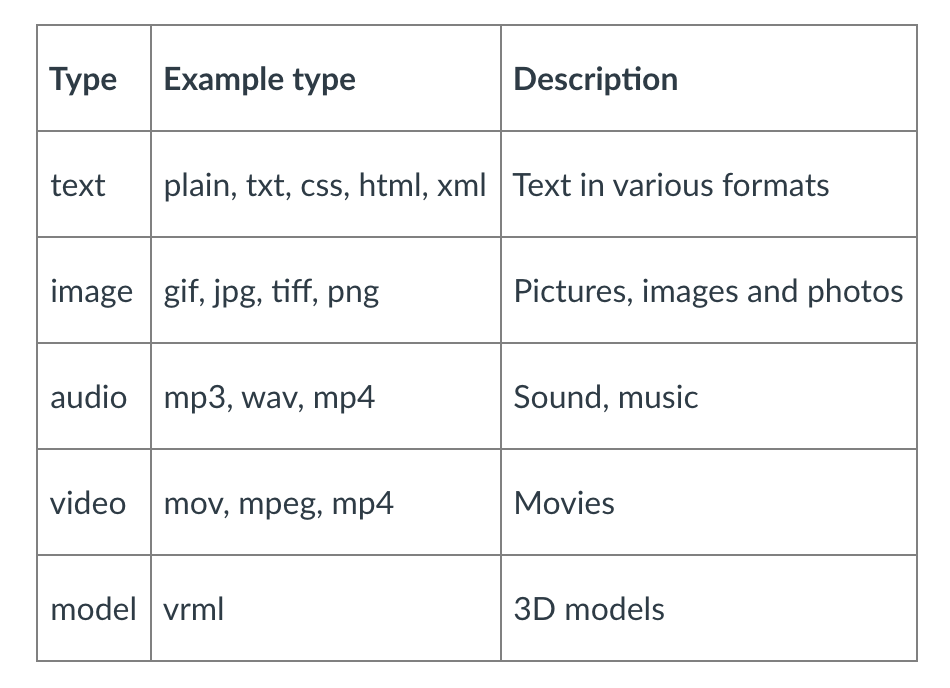

# HTTP Protocol

* Browsers use HTTP (HyperText Transfer Protocol) to make requests for these specific types of pages. This
  request-response protocol runs over TCP (transport layer) and is specifically designed for fetching web pages.
* Web browsers (such as Internet Explorer and Firefox) implement the client side of HTTP, in the context of the Web, we
  will use the words browser and client interchangeably.
* HTTP is implemented in two programs: a client program and a server program
* Web servers, which implement the server side of HTTP, house Web objects, each addressable by a URL.
* The HTTP server receives request messages from its socket interface and sends response messages into its socket
  interface.
    * Once the client sends a message into its socket interface, the message is out of the client’s hands and is **“in
      the hands”** of TCP.
    * This implies that each HTTP request message sent by a client process eventually arrives intact at the server;
      similarly, each HTTP response message sent by the server process eventually arrives intact at the client.
    * Here we see one of the great advantages of a layered architecture
        * HTTP need not worry about lost data or the details of how TCP recovers from loss or reordering of data within
          the network. That is the job of TCP and the protocols in the lower layers of the protocol stack.

* It is important to note that the server sends requested files to clients without storing any state information about
  the client.
    * If a particular client asks for the same object twice in a period of a few seconds, the server does not respond by
      saying that it just served the object to the client; instead, the server resends the object, as it has completely
      forgotten what it did earlier.
    * Because an HTTP server maintains no information about the clients, HTTP is said to be a **stateless protocol**.

* Universal Resource Locators (URLs)
    * Each page resides on a server, and that server identifies itself with a domain name.
    * Each of the pages that it enables access to has a file name and may reside within a directory structure on the
      server.
    * The combination of domain name, directory structure, and file name provides each page with a unique identifier.
    * This identifier and the protocol used to access the location are referred to collectively as the URL (
      Universal Resource Locator)
      </br>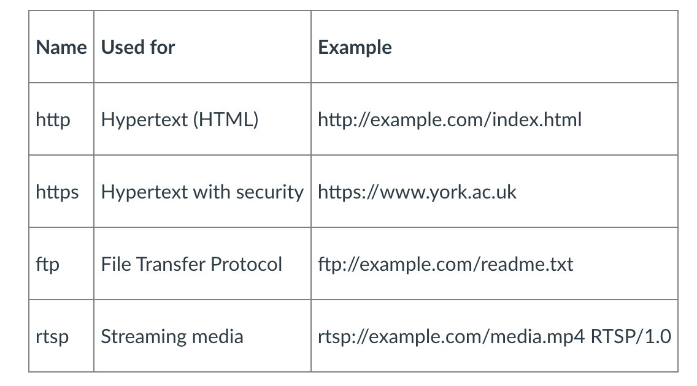

## HTTP Communications

* The most common form of HTTP 1.0 is a simple request-response.
* HTTP is referred to as a ‘stateless protocol’, as each communication, even with the same server, is independent of any
  previous request/response and no ‘state’ information is stored regarding that communication.
* When this client-server interaction is taking place over TCP, the application developer needs to make an important
  decision—should each request/response pair be sent over a **separate** TCP connection, or should all of the requests
  and their corresponding responses be sent over the **same** TCP connection? In the former approach, the application is
  said to use **non-persistent connections**; and in the latter approach, **persistent connections**.

## Non-Persistent Connections

* At most one object sent over TCP connection
    * connection then closed
* Downloading multiple objects required multiple connections

* Here is what happens when we make a call to the server by using non-persist connection

1. The HTTP client process initiates a TCP connection to the server www .someSchool.edu on port number 80, which is the
   default port number for HTTP. Associated with the TCP connection, there will be a socket at the client and a socket
   at the server.
2. The HTTP client sends an HTTP request message to the server via its socket. The request message includes the path
   name /someDepartment/home .index. (We will discuss HTTP messages in some detail below.)
3. The HTTP server process receives the request message via its socket, retrieves the object /someDepartment/home.index
   from its storage (RAM or disk), encapsulates the object in an HTTP response message, and sends the response message
   to the client via its socket.
4. The HTTP server process tells TCP to close the TCP connection. (But TCP doesn’t actually terminate the connection
   until it knows for sure that the client has received the response message intact.)
5. The HTTP client receives the response message. The TCP connection termi- nates. The message indicates that the
   encapsulated object is an HTML file. The client extracts the file from the response message, examines the HTML file,
   and finds references to the 10 JPEG objects.
6. **The first four steps are then repeated for each of the referenced JPEG objects.**

* Back-of-the-envelope calculation to estimate the amount of time that elapses from when a client requests the base HTML
  file until the entire file is received by the client.
    * Round-trip time (RTT), which is the time it takes for a small packet to travel from client to server and then back
      to the client.
    * The RTT includes packet-propagation delays, packet- queuing delays in intermediate routers and switches, and
      packet-processing delays

* What happens when a user clicks on a hyperlink:
    * The browser to initiate a TCP connection between the browser and the Web server; this involves a **“three-way
      handshake”**—the client sends a small TCP segment to the server, the server acknowledges and responds with a small
      TCP segment, and, finally, the cli- ent acknowledges back to the server.
    * The first two parts of the three-way handshake take one RTT. After completing the first two parts of the
      handshake, the client sends the HTTP request message combined with the third part of the three-way handshake (the
      acknowledgment) into the TCP connection.
    * Once the request message arrives at the server, the server sends the HTML file into the TCP connection. This HTTP
      request/response eats up another RTT.
    * Thus, roughly, the total response time is two RTTs plus the transmission time at the server of the HTML file.  
      </br>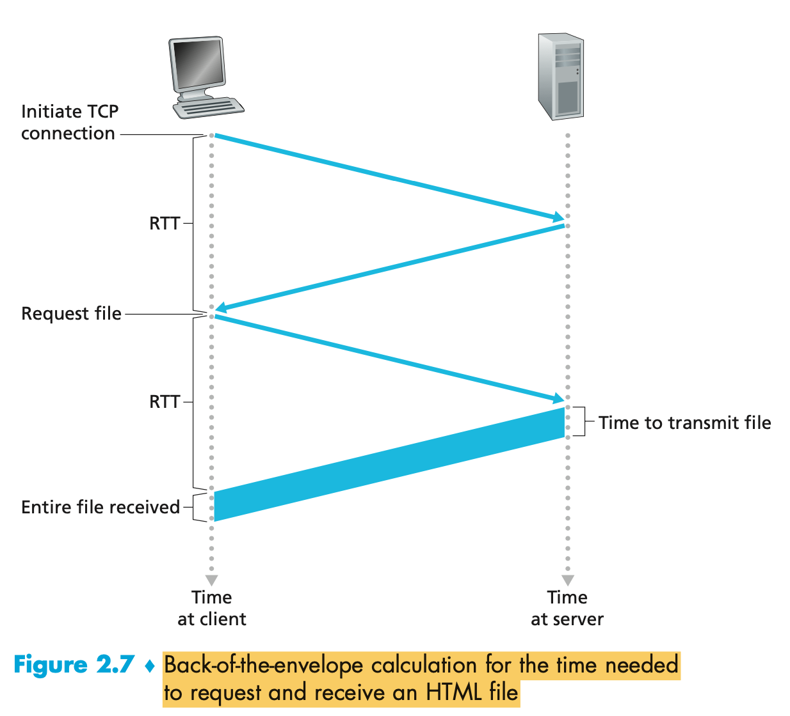
* Non-persistent connections have some shortcomings
    * First, a brand-new connection must be established and maintained for each requested object.
        * For each of these connections, TCP buffers must be allocated and TCP variables must be kept in both the client
          and server. This can place a significant burden on the Web server, which may be serving requests from hundreds
          of different clients simultaneously.
        * browsers often open parallel TCP connections to fetch referenced objects
    * Second, each object suffers a delivery delay of two RTTs—one RTT to establish the TCP connection and one RTT to
      request and receive an object.

## Persistent Connections

* Multiple objects can be sent over single TCP connection between client, server
* With HTTP 1.1 persistent connections, the server leaves the TCP connection open after sending a response.
* Subsequent requests and responses between the same client and server can be sent over the same connection.
* In particular, an entire Web page (in the example above, the base HTML file and the 10 images) can be sent over a
  single persistent TCP connection.
* Moreover, multiple Web pages residing on the same server can be sent from the server to the same client over a single
  persistent TCP connection.
* These requests for objects can be made back-to-back, without waiting for replies to pending requests (**
  pipelining**).
* The default mode of HTTP uses persistent connections with pipelining. Most recently, HTTP/2 [RFC 7540] builds on HTTP
  1.1 by allowing multiple requests and replies to be interleaved in the same connection, and a mechanism for
  prioritizing HTTP message requests and replies within this connection.

* Summary:
    * server leaves connection open after sending response
    * subsequent HTTP messages between same client/server sent over open connection
    * client sends requests as soon as it encounters a referenced object
    * as little as one RTT for all the referenced objects

* Here (a) is HTTP 1.0 non-persistence connection, (b) HTTP 1.1 persistence connection. (c) HTTP/2 pipelining
  </br>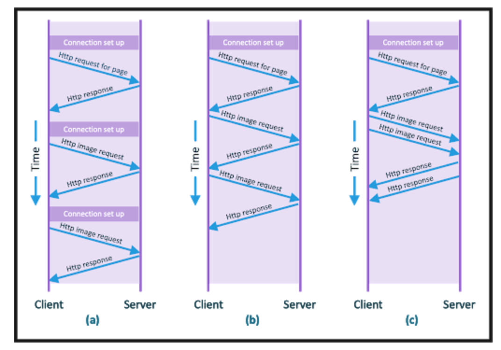

# HTTP Inspection Tools in Google Chrome

* To view the hosts : "chrome://dns"
* To logging on local: "chrome://net-export/"
    * You can now carry on browsing the internet as normal or carry out other activities such as reading emails. When
      you're ready to complete the log, click on the “Stop Logging” button to end the recording.
    * To see the logs a suitable viewer required

# HTTP response and request messages

* There are two types of HTTP messages: request, response

## HTTP Request

* Here is a sample of request
* The first line of an HTTP request message is called the request line; the subsequent lines are called the header
  lines.
    * The request line has three fields: the method field, the URL field, and the HTTP version field.
    * Here is general and ascii format of request  
      </br>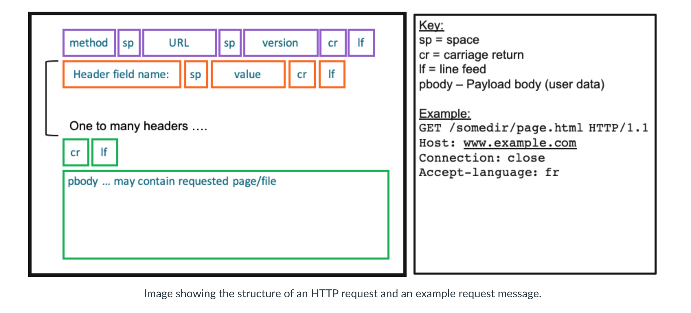
      </br>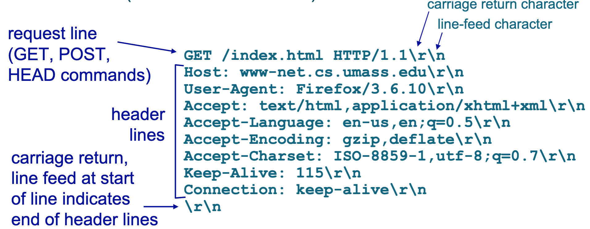
* the Connection: close header line, the browser is telling the server that it doesn’t want to bother with persistent
  connections; it wants the server to close the connection after sending the requested object.
* Here is some Http request methods.
  </br>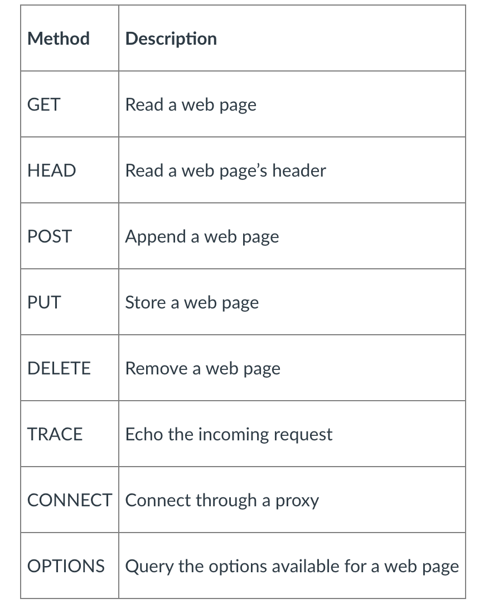

* Uploading a form input, there are some couple ways
    * Using POST message
        * web page often includes form input
        * input is uploaded to server in entity body
    * Searching GET with Request Param
        * uses GET method
        * input is uploaded in URL field of request line:www.somesite.com/animalsearch?monkeys&banana

### Method Types

* HTTP/1.0:
    * GET
    * POST
    * HEAD
        * asks server to leave requested object out of response

* HTTP/1.1:
    * GET, POST, HEAD
    * PUT
        * uploads file in entity body to path specified in URL field
    * DELETE
        * deletes file specified in the URL field

## HTTP Response

* The response from the server may or may not contain the page requested.
* Response has three sections: an initial status line, six header lines, and then the entity body.
* If the page does not exist or the server is unable to fulfil the request, the browser may receive a status code
  indicating the problem. 404, 500 etc
    * 2xx means successful
    * 3xx redirect
    * 4xx Client error
    * 5xx Server error
* General and ascii format  
  </br>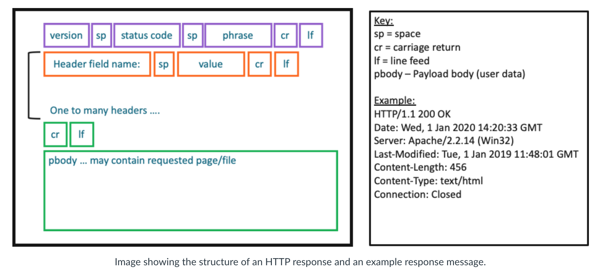
  </br>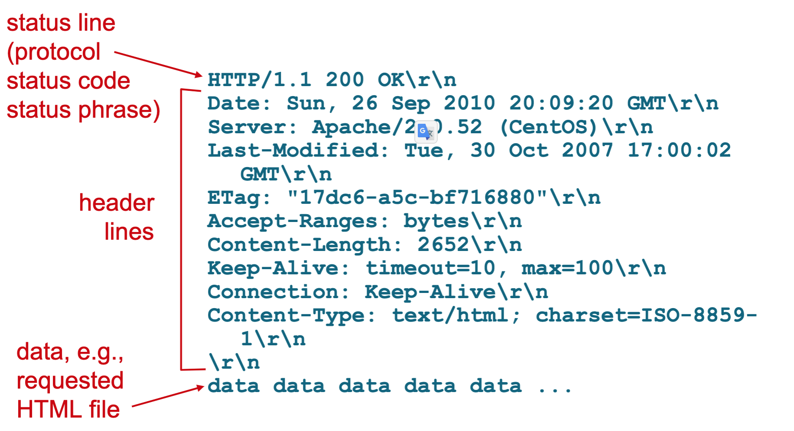

# The Domain Name Service (DNS)

* The Domain Name Service (DNS) is the Internet’s directory service.
* When we write to browser of a domain, domain names do not have IP addresses and DNS provides a system of servers that
  stores address information for hosts and uses the domain name.
* Before an HTTP request is made, the domain name in the request needs to be resolved.
    * This results in separate communications to other servers providing DNS.

* **Dynamic DNS**
    * DNS so far has used a permanent IP addressing system; however, IP addresses can be assigned dynamically through a
      router or server's **Dynamic Host Configuration Protocol (DHCP)** each time the device is started.
    * This in turn means that that device must be registered with DNS and accessible via its hostname and the DNS
      server (or router) must have a way of learning the IP address of that device for that session.
    * DNS records on the router or server are updated once the IP address is allocated.

* The DNS is
    * a distributed database implemented in a hierarchy of DNS servers,
    * an application-layer protocol that allows hosts to query the distributed database.
* The DNS servers are often UNIX machines running the Berkeley Internet Name Domain (BIND) software [BIND 2016].
* **The DNS protocol runs over UDP and uses port 53**.
    * All DNS query and reply messages are sent within UDP datagrams to port 53.

* DNS adds an additional delay—sometimes substantial—to the Internet applications that use it. Fortunately, as we
  discuss below, the desired IP address is often cached in a “nearby” DNS server, which helps to reduce DNS network
  traffic as well as the average DNS delay.

## Other DNS services:

* **Host aliasing.** A host with a complicated hostname can have one or more alias names.
    * For example, a hostname such as relay1.west-coast .enterprise.com could have, say, two aliases such as
      enterprise.com and www.enterprise.com.
    * In this case, the hostname relay1 .west-coast.enterprise.com is said to be a **canonical hostname**.

* **Mail server aliasing**. For obvious reasons, it is highly desirable that e-mail addresses be mnemonic.
    * The hostname of the Yahoo mail server is more complicated and much less mnemonic than simply yahoo.com (for
      example, the canonical hostname might be some- thing like relay1.west-coast.yahoo.com).
    * DNS can be invoked by a mail application to obtain the canonical hostname for a supplied alias hostname as well as
      the IP address of the host.

* **Load distribution.** DNS is also used to perform load distribution among replicated servers, such as replicated Web
  servers.

## DNS: CRITICAL NETWORK FUNCTIONS VIA THE CLIENT-SERVER PARADIGM

* Like HTTP, FTP, and SMTP, the DNS protocol is an application-layer protocol since it
    * runs between communicating end systems using the client-server paradigm and
    * relies on an underlying end-to-end transport protocol to transfer DNS messages between com- municating end
      systems.
* the DNS is not an application with which a user directly interacts. Instead, the DNS provides a core Internet
  function—namely, translating hostnames to their underlying IP addresses, for user applications and other software in
  the Internet

## A Distributed, Hierarchical Database

* The DNS uses a large number of servers, organized in a hierarchical fashion and distributed around the world.
* There are three classes of DNS servers—root DNS servers, top-level domain (TLD) DNS servers, and authoritative DNS
  servers—organized in a hierarchy
  </br>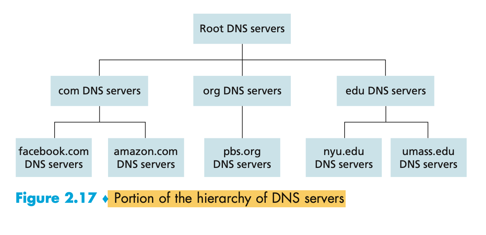

* **Root DNS servers.** There are over 400 root name servers scattered all over the world.
* **Top-level domain (TLD) servers**. For each of the top-level domains — top-level domains such as com, org, net, edu,
  and gov, and all of the country top-level domains such as uk, fr, ca, and jp — there is TLD server (or server cluster)
* **Authoritative DNS servers.** Every organization with publicly accessible hosts (such as Web servers and mail
  servers) on the Internet must provide publicly accessible DNS records that map the names of those hosts to IP
  addresses.
* **Local DNS server.** A local DNS server does not strictly belong to the hier- archy of servers but is nevertheless
  central to the DNS architecture. Each ISP—such as a residential ISP or an institutional ISP—has a local DNS server (
  also called a default name server)

* Interaction of the various DNS servers
    * In the example below, makes use of both recursive queries and iterative queries.
        * The query sent from cse.nyu.edu to dns.nyu.edu is a recursive query, since the query asks dns.nyu.edu to
          obtain the mapping on its behalf.
        * the subsequent three queries are iterative since all of the replies are directly returned to dns.nyu.edu. I

</br>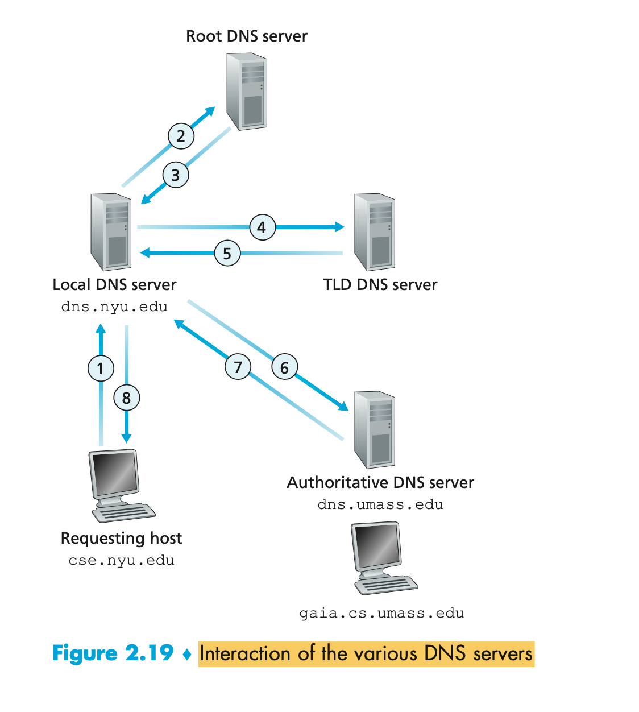

## DNS Caching

* DNS caching, a critically important feature of the DNS system.
* DNS extensively exploits DNS caching in order to improve the delay performance and to reduce the number of DNS
  messages ricocheting around the Internet
* The idea behind DNS caching is very simple. In a query chain, when a DNS server receives a DNS reply (containing, for
  example, a mapping from a hostname to an IP address), it can cache the mapping in its local memory

## DNS Record

* The DNS servers that together implement the DNS distributed database store resource records (RRs), including RRs that
  provide hostname-to-IP address map- pings. Each DNS reply message carries one or more resource records.
* A resource record is a four-tuple that contains the following fields:
    * (Name, Value, Type, TTL)
* TTL is the time to live of the resource record; it determines when a resource should be removed from a cache.
* If **Type=A,** then Name is a hostname and Value is the IP address for the host- name. Thus, a Type A record provides
  the standard hostname-to-IP address map- ping. As an example, (relay1.bar.foo.com, 145.37.93.126, A) is a Type A
  record.
* If **Type=NS**, then Name is a domain (such as foo.com) and Value is the hostname of an authoritative DNS server that
  knows how to obtain the IP addresses for hosts in the domain.
    * This record is used to route DNS queries further along in the query chain.
    * As an example, (foo.com, dns.foo.com, NS) is a Type NS record.
* If **Type=CNAME**, then Value is a canonical hostname for the alias hostname Name. This record can provide querying
  hosts the canonical name for a hostname. As an example, (foo.com, relay1.bar.foo.com, CNAME) is a CNAME record.

* If **Type=MX,** then Value is the canonical name of a mail server that has an alias hostname Name. As an example, (
  foo.com, mail.bar.foo.com, MX) is an MX record. MX records allow the hostnames of mail servers to have simple aliases.

## DNS Messages

* The first 12 bytes is the header section, which has a number of fields.
    * The first field is a 16-bit number that identifies the query.
* The question section contains information about the query that is being made.
* In a reply from a DNS server, the answer section contains the resource records for the name that was originally
  queried.
* The authority section contains records of other authoritative servers.
* The additional section contains other helpful records.

</br>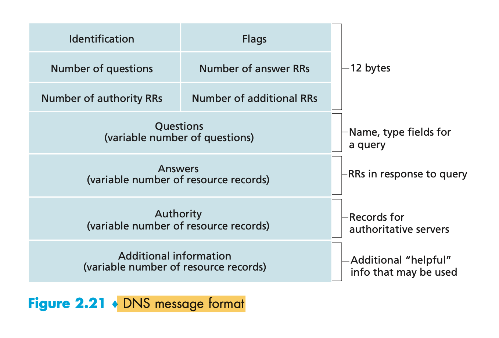

## Inserting Records into the DNS Database

* A **registrar** is a commercial entity that verifies the uniqueness of the domain name, enters the domain name into
  the DNS database (as discussed below), and collects a small fee from you for its services.
* When you register the domain name networkutopia.com with some registrar, you also need to provide the registrar with
  the names and IP addresses of your primary and secondary authoritative DNS servers.
    * Suppose the names and IP addresses are dns1.networkutopia.com, dns2.networkutopia.com, 212.2.212.1, and
      212.212.212.2.
* For each of these two authoritative DNS servers, the registrar would then make sure that a Type NS and a Type A record
  are entered into the TLD com servers.
* the registrar would insert the following two resource records into the DNS system:
    * (networkutopia.com, dns1.networkutopia.com, NS)
    * (dns1.networkutopia.com, 212.212.212.1, A)

* Once all of these steps are completed, people will be able to visit the page

## How DNS works?

1. The same user machine runs the client side of the DNS application.
2. The browser extracts the hostname, www.someschool.edu, from the URL and passes the hostname to the client side of the
   DNS application.
3. The DNS client sends a query containing the hostname to a DNS server.
4. The DNS client eventually receives a reply, which includes the IP address for the hostname.
5. Once the browser receives the IP address from DNS, it can initiate a TCP connection to the HTTP server process
   located at port 80 at that IP address.

* **With more detail explanation**
* Suppose Alice in Australia wants to view the Web page www.networkutopia.com.
    * her host will first send a DNS query to her local DNS server.
    * The local DNS server will then contact a TLD com server. (The local DNS server will also have to contact a root
      DNS server if the address of a TLD com server is not cached.)
    * This TLD server contains the Type NS and Type A resource records listed above, because the registrar had these
      resource records inserted into all of the TLD com servers.
    * The TLD com server sends a reply to Alice’s local DNS server, with the reply containing the two resource records.
    * The local DNS server then sends a DNS query to 212.212.212.1, ask- ing for the Type A record corresponding
      to www.networkutopia.com.
    * This record provides the IP address of the desired Web server, say, 212.212.71.4, which the local DNS server
      passes back to Alice’s host.
    * Alice’s browser can now initiate a TCP connection to the host 212.212.71.4 and send an HTTP request over the
      connection.

# TODO:

* [What is DNS? - Introduction to Domain Name System](https://www.youtube.com/watch?v=e2xLV7pCOLI)
  </br>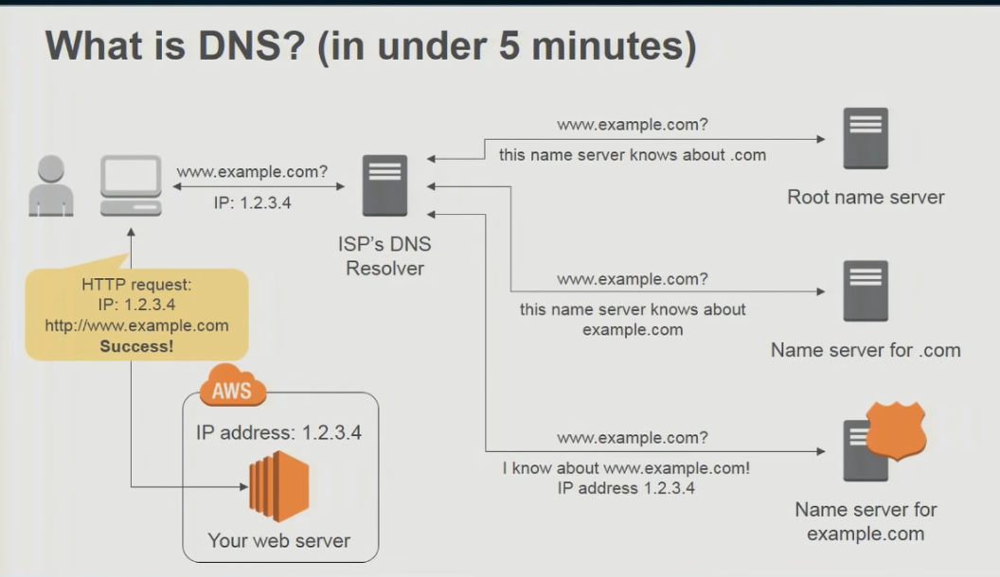
  </br>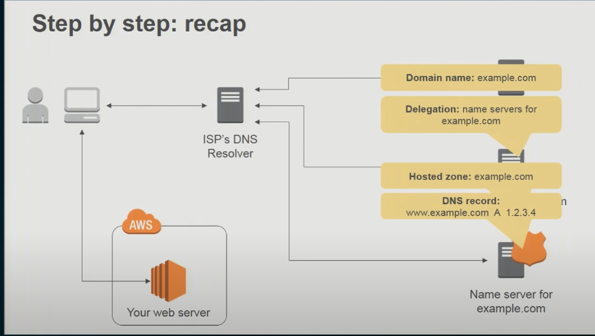