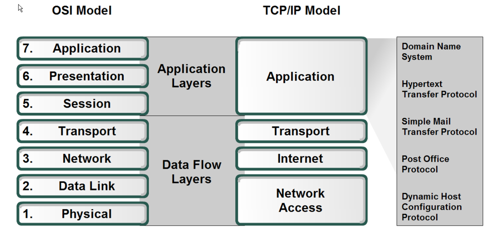

#### Main Topics

* Application Layer
    * Identify and describe the application layer, and its protocols and services, with reference to the OSI/ISO model
      and TCP/IP;
    * Apply application and transport layer protocols in a simple program;
    * Identify and compare different applications layer protocols, such as mail protocols, HTTP, DNS, and FTP;
    * Explain the client/server architecture from the perspective of HTTP communications.

#### Sub titles:

* [Introduction to the reference model](#introduction-to-the-reference-model)

# Introduction to the reference model

## Application Layer

* The application layer is all about end-user applications.
    * When you write a piece of software that is going to require access to a network, this is the set of protocols that
      need to be initiated from within the program.
    * Unlike at other layers, there are a number of protocols to choose from, depending on the software’s requirements,
      and not all of them are required.
    * For example, an email client needs to utilise a mail protocol whereas a video streaming system will not.
* The application layer requires and accesses the services provided by the transport layer to determine how
  conversations between two entities occur, whether or not the communication is connection-orientated or connectionless,
  as well as what types of guarantees are made in regard to the services, and what type of security, if any, is applied.
  This is discussed in more detail later in the week.
* At the top of the stack in both models are network applications and services that communicate with lower layers
  through the TCP and UDP ports.
* Some of the components in this layer are utilities that collect information about the network configuration.
* Some Application layer components may be an API, for example, while some may provide services such as print and name
  resolution.
   

* The TCP/IP application layer corresponds to the Presentation, Application and Session layers in the OSI model
    * The OSI Presentation layer translates data into a neutral format and includes encryption and data compression
    * the OSI Session layer manages communication between applications on networked devices and includes security and
      name recognition.
       

# Application Architectures

* There are 2 types of architecture while designing network which communication between the programs,
    * Client/Server
    * Peer-to-peer (P2P)

## Client / Server

* The approach is between end user (client) and some services/process needs to be done at centralised point (server)
* This model enables multiple clients to utilise the centralised services of the server
* Server is always on, and clients will connect to server when ever they need.
* For example web apps, user can enter address viw web browser, then contact to server and server can retrieve
  addresses.
    * or networked games, player can send a command via using game client app, then server can manage the players
      actions.
* Note that with the client-server architecture, clients do not directly communicate with each other; for example, in
  the Web application, two browsers do not directly communicate.
* Client-server architecture is that the server has a fixed, well-known address, called an IP address
    * Because the server has a fixed, well-known address, and because the server is always on, a client can always
      contact the server by sending a packet to the server’s IP address
* Often in a client-server application, a single-server host is incapable of keep- ing up with all the requests from
  clients
    * For this reason, a data center, housing a large number of hosts, is often used to create a powerful virtual
      server.

 

## Peer To Peer (P2P)

* Does not require a centralised server, instead facilitating communication directly between two devices
* A single application is usually distributed/replicated between many devices which enables both to send and receive
  communications between these applications.
* Peers are not always on, there is no guarantee that the application on a device is available
* A single peer can connect to multiple other peers provided they are available
* This type of architecture is highly scalable and evolves on demand
* but there is no guarantee that the application they are attempting to contact is available and hard to implement and
  maintain.
* For example File Sharing:
    * Sharing files is a common use for a P2P network. Each peer has a designated space on their machine where they
      store files that are made available to anyone using the P2P network.
    * The application on the user's machine is able to search, and possibly catalogue, the files available on all other
      machines.
    * When a file that is required is found, a direct connection between the machines is established to download the
      file
* In a P2P architecture, there is minimal (or no) reliance on dedicated servers in data centers.
    * Instead the application exploits direct communication between pairs of intermittently connected hosts, called
      peers.
    * The peers are not owned by the service provider, but are instead desktops and laptops controlled by users, with
      most of the peers residing in homes, universities, and offices.
    * Because the peers communicate without passing through a dedicated server, the architecture is called peer-to-peer.

* One of the most compelling features of P2P architectures is their self- scalability.
    * For example, in a P2P file-sharing application, although each peer generates workload by requesting files, each
      peer also adds service capacity to the system by distributing files to other peers.
* P2P architectures are also cost effective, since they normally don’t require significant server infrastructure and
  server bandwidth
* However, P2P applications face challenges of security, performance, and reliability due to their highly decentralized
  structure.

   

# Application Services

* File and print services
    * These services fulfil all requests for file access and print services.
    * Requests for print come in across the network and up through the protocol stack on the host machine to the
      transport layers, where they are then routed through the appropriate port to the file server
* Name resolution services
    * The Domain Name Service (DNS) provides name resolution for the Internet and also for isolated TCP/IP networks.
    * This name server service runs at the application layer of the name server computer and communicates with other
      name servers to exchange name resolution information.
    * A user references a domain name and the underlying protocol software resolves that name to an IP address using
      name resolution.
* Redirection services aka redirector
    * this service intercepts service requests in the host and checks that the request can be fulfilled locally or needs
      to be forwarded to another machine on the network.
* API's
    * The Application Layer Interface (API) is a predefined collection of functions that a program can use to access
      other parts of the OS environment and communicate with them.

* Questions:
    * Five non proprietary Internet applications and three application layer protocols
        * The Web: HTTP; file transfer: FTP; remote login: Telnet; e-mail: SMTP; BitTorrent file sharing: BitTorrent
          protocol.
    * Difference between network architecture and application architecture
        * Network architecture refers to the organization of the communication process into layers (e.g., the five-layer
          Internet architecture).
        * Application architecture, is designed by an application developer and dictates the broad structure of the
          application (e.g., client-server or P2P).
    * For a communication session between a pair of processes, which process is the client and which is the server
        * The process which initiates the communication is the client; the process that waits to be contacted is the
          server.
    * Why are the terms client and server still used in peer-to-peer applications
        * In a P2P file-sharing application, the peer that is receiving a file is typically the client and the peer that
          is sending the file is typically the server.
    * What information is used by a process running on one host to identify a process running on another host
        * The IP address of the destination host and the port number of the socket in the destination process.