#### Main Topics

* Basics of the Transport Layer and examine:
    * Layers;
    * Fibre.

* Types of connections. Particular topics include:
    * UDP;
    * Connectionless and connection orientated.
* TCP at the Transport Layer. We touch upon the following:
    * Multiplexing and demultiplexing;
    * TCP features and structure;
    * Transport primitives;
    * TCP sockets; Go-Back-N.

#### Sub titles:

* [What is the transport layer?](#what-is-the-transport-layer)
    * [Data transfer between layers](#data-transfer-between-layers)
        * [Transport layer](#transport-layer)
* [Types of connection - UDP (connectionless)](#types-of-connection---udp-connectionless)
    * [UDP (connectionless)](#udp-connectionless)
        * [UDP Segment structure](#udp-segment-structure)
    * [Checksum](#checksum)
    * [Question](#question)
* [Encapsulation](#encapsulation)
* [TCP (connection)](#tcp-connection)
    * [The End-to-End principle](#the-end-to-end-principle)
    * [Transport Service Primitives](#transport-service-primitives)
    * [TCP Activity](#tcp-activity)
    * [GO-Bank-N Protocol (GBN)](#go-bank-n-protocol-gbn)
* [Ports and Sockets](#ports-and-sockets)
    * [Ports](#ports)
    * [Socket](#sockets)
* [Quiz](#quiz)
* [Todo](#todo)

# What is the transport layer?

* In a protocol architecture, the transport protocol sits above the network layer and just below the application layer.
* The purpose of the transport layer is to provide the logical communication link between two endpoints
* There is no consideration here as to how that happens, what devices the data passes through, or how far apart the end
  points are.
* The abstract view from the applications’ perspective is that they are communicating directly with each other
* Transport layer protocols are typically the responsibility of the end devices.
* The transport layer:
    * Takes the user data from the application layer,
    * Wrapped with its relevant application layer protocol
    * Breaks down large chunks of data into packets of data referred to as ‘segments’.
    * Adds transport layer headers to each of these segments.
    * Passes these segments to the network layer.

* Each transport layer offering different implementation of
    * reliable data transfer;
    * throughput guarantees;
    * timing guarantees;
    * security.

* Focus on Transmission Control Protocol (TCP) and User Datagram Protocol (UDP)
    * Both of them run IP layer
       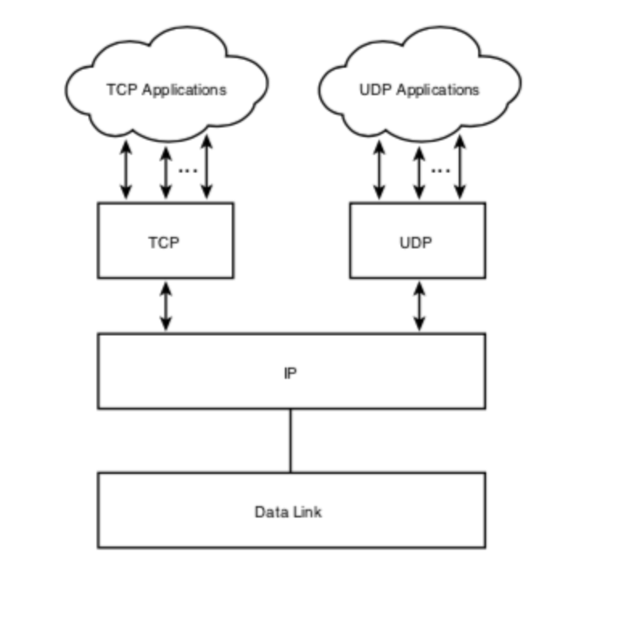

### Data transfer between layers

* Application layer uses socket to pass data to network layer and receive data from network layer
    * Socket acts as a doorway to the application
    * Transport layer responsibility is to direct the data to correct socket and vice versa, when data received to the
      network layer.
* Data from network comes to the transport layer, The headers are read and removed to determine the socket the data is
  to be passed to. This process is referred to as ‘**demultiplexing**’
    * that is, removing the headers and passing the data to the socket of the correct application.

* The opposide, an application packs up its data in the appropriate application protocol and passes it to the transport
  layer through its socket interface,
    * The transport layer adds headers determined by the type of service selected (TCP or UDP), and this process is
      referred to as ‘**multiplexing**’.
* Whereas the physical network transports data from host to host (endpoints), the transport layer is abstractly
  delivering data process-to-process, from the socket of one application to the socket of another.
* Each socket on a host machine has a unique identifier, and the headers in the transport level protocol, wrapped around
  the segment, enable the identification of that socket.

## Transport layer

* a programmer has little control of the transport layer. However, they are able to select between available transport
  layer protocols, which can offer different levels of service.
* Reliable Data Transfer:
    * networks suffer from packet loss, so if a protocol provides Reliable Data Transfer then it guarantees that all
      packets will arrive at the destination.
    * If a programmer selects a protocol that provides this then they simply pass their user data into the socket
      without any further concerns.
    * The socket manages the rest according to the selected protocol.
    * Some applications, such as streaming video, are more tolerant to packet loss than others, such as Word documents,
      and so can select protocols that may not provide Reliable Data Transfer.

* Throughput guarantees:
    * The volume of network traffic fluctuates, which may have an adverse effect on some types of application, such as
      live video streaming.
    * Therefore, protocols that can offer a guaranteed consistent throughput may be an advantage here.
    * These types of applications are said to be bandwidth-sensitive.
    * Other applications, such as email, can simply make use of the bandwidth that is available and are referred to as
      having an elastic requirement in terms of bandwidth.

* Timing guarantees:
    * Some applications have time-sensitive communications like the online gaming server described previously.
    * Being able to define the maximum amount of time within which a communication is sent would be useful here to
      ensure the ‘real timeliness’ of the game's interactions between users.

* Security:
    * Transport layer protocols can provide various types of protection services to the application layer, which are
      selected when designing a program that sends data over the Internet.
    * Encryption, authentication and data integrity services are examples of the types of security that can be offered
      here.

# Types of connection - UDP (connectionless)

* Process-to-process connections come in two types: **connection-orientated** and **connectionless**.
    * These terms refer to whether or not a persistent connection between the two end processes is preserved until a
      conversation is finished.

* **A connectionless protocol** does not require or enable any acknowledgments from the recipient.
  *The sender simply attaches the receiver's address and sends the data. As there is no acknowledgment, the sender has
  no guarantee it has arrived.  (UDP)

* **A connection-orientated protocol** does guarantee that the data has arrived at the receiver.
    * A connection-oriented protocol initiates the conversation via handshaking which creates a conceptual channel
      between sender and receiver.
    * The data is checked for integrity and sequence (when multiple segments are sent), and its safe arrival is
      acknowledged.  (TCP)

## UDP (connectionless)

* **User Datagram Protocol (UDP)** is a connectionless protocol that provides the bare minimum to enable sending data
  between processes.
    * The headers of a UDP segment contain
        * the source port
        * the data, as defined by the application sending
        * the destination port of the application receiving the data
    * Length and checksum are also included.
* The port numbers are what make UDP a protocol, and with these an application can connect to an individual server
  process, rather than to a host.

* The actual destination host machine address (IP address) is added at the network layer below. Given this, UDP is an
  unreliable protocol.

* 2 things are considering to select UDP
    * Is the timely arrival is important than guarantee of data arrival
    * Is the process tolerant to lost data?

* UDP is most frequently used for real time applications, where the programmer can have more control over how to respond
  to incoming/outgoing communications and manually manage lost data.
    * It enables much more flexibility but does require the programmer to consider much more carefully how an
      application needs to respond to specific situations.
    * Reliability can be programmed into the application by design.
    * In effect, UDP is really leaving the specific protocol design, the communication process between two hosts, up to
      the programmer to define.

* UDP is lightweight in terms of overhead and segment size and does not maintain any state information regarding the
  communication.
    * In this way, an application at the server end can potentially hold communications with many more clients than if
      it was using TCP.

* UDP takes messages from the application process, attaches source and destination port number fields for the multi-
  plexing/demultiplexing service, adds two other small fields, and passes the resulting segment to the network layer.
    * The network layer encapsulates the transport-layer segment into an IP datagram and then makes a best-effort
      attempt to deliver the segment to the receiving host.
    * If the segment arrives at the receiving host, UDP uses the destination port number to deliver the segment’s data
      to the correct application process.

### UDP Segment structure

* UDP packet and its data.
   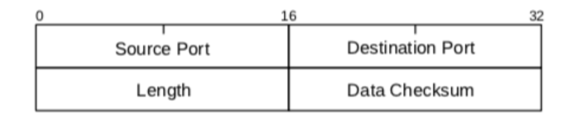
* One of the actions performed by the transport layer is to divide the application layer data into chunks so there is a
  fixed size to the amount of data in each UDP segment.
* UDP packets use a 16-bit internet checksum on the data but it’s rarely used and often disabled.
* UDP headers are:
    * Source port - the port number of the application that generates the data
    * Destination port - the port number of the receiving application (process-to-process protocol)
    * Length - the length of the UDP header and the UDP data, in bytes.
    * Checksum - this field is used for error checking. It is optional in IPv4 and mandatory in IPv6.

## Checksum

* [Binary numbering system documentation](./doc/BINARY%20NUMBERS%202021.docx)
* [P-Checksum](./doc/P-Checksum.pdf)
* [How to Calculate IP Header Checksum (With an Example)](https://www.thegeekstuff.com/2012/05/ip-header-checksum/)

* A check sum is basically a value that is computed from data packet to check its integrity.
* Through integrity, we mean a check on whether the data received is error free or not.
* This is because while traveling on network a data packet can become corrupt and there has to be a way at the receiving
  end to know that data is corrupted or not. This is the reason the checksum field is added to the header.
* At the source side, the checksum is calculated and set in header as a field.
    * At the destination side, the checksum is again calculated and crosschecked with the existing checksum value in
      header to see if the data packet is OK or not.
* [IP Protocol Header](https://www.thegeekstuff.com/2012/03/ip-protocol-header/)
   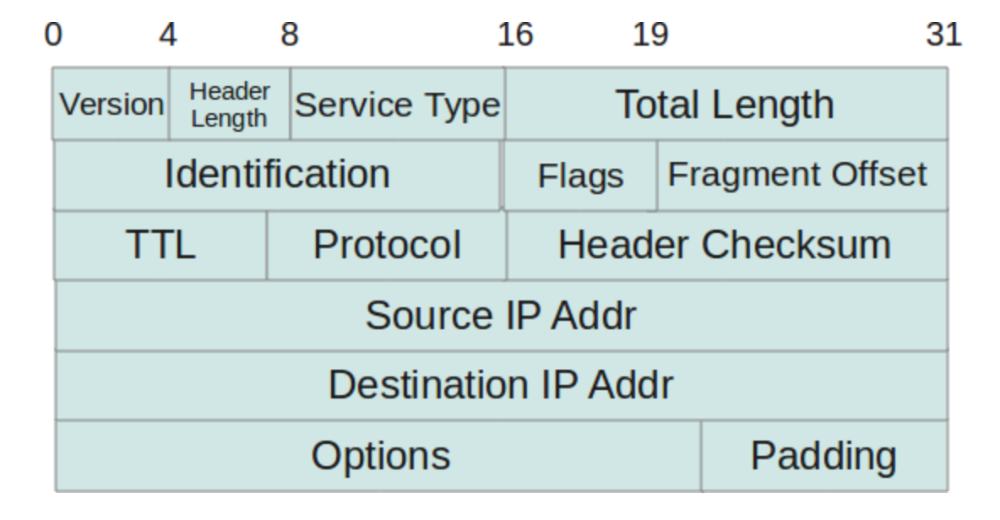

* So, as far as the algorithm goes, IP header checksum is : **16 bit one’s complement of the one’s complement sum of all
  16 bit words in the header**
    * This means that if we divide the IP header is 16 bit words and sum each of them up and then finally do a one’s
      compliment of the sum then the value generated out of this operation would be the checksum.

### Question

* An IPv4 datagram has arrived with the following information in the header (in hexadecimal notation)
  `0x45 00 00 54 00 03 58 50 20 06 00 00 7C 4E 03 02 B4 0E 0F 02`
    * Is the packet corrupted?
    * Are there any options?
    * Is the packet fragmented?
    * What is the size of the data?
    * How many more routers can the packet travel to?
    * What is the identification number of the packet?
    * What is the type of service?

* Answer
    * VER = 0x4 = 4
    * HLEN =0x5 = 5 -> 5 * 4 = 20 bytes
    * Service =0x00 = 0 (Normal/routine)
    * Total Length = 0x0054 = 84 bytes
    * Identification = 0x0003 = 3
    * Flags and Fragmentation = 0x5850 -> D = 1, M= 0, offset = 6224
    * Time to live = 0x20 = 32
    * Protocol = 0x06 = 6
    * Checksum = 0x0000??
    * Source Address: 0x7C4E0302 = 124.78.3.2
    * Destination Address: 0xB40E0F02 = 180.14.15.2

* If we see the checksum, we get 0x0000. The packet is likely to be corrupted.
* Since the length of the header is 20 bytes, there are no options.
* Since D = 1 and M = 0 and offset = 6224, the packet is not permitted to be fragmented.
* The total length is 84. Data size is 64 bytes (84-20 = 64 bytes).
* Since the value of time to live = 32, the packet may visit up to 32 more routers.
* The identification number of the packet is 3.
* The type of service is normal.

# Encapsulation

* When a host transmits data across a network to another device, the data goes through a process called “encapsulation”
  in which it is wrapped with protocol information at each layer of the OSI model.
    * Each layer communicates only with its peer layer on the receiving device.

* To communicate and exchange information, each layer uses **Protocol Data Units (PDUs)**.
    * These hold the control information attached to the data at each layer of the model.
    * They’re usually attached to the header in front of the data field, but can also be in the trailer, or end, of it.

* At a transmitting device, the data-encapsulation method works like this:
    1. User information is converted to data for transmission on the network.
    2. Data is converted to segments, and a reliable connection is set up between the transmitting and receiving hosts.
    3. Segments are converted to packets or datagrams, and a logical address is placed in the header so each packet can
       be routed through an internet work.
    4. Packets or datagrams are converted to frames for transmission on the local network.
    5. Hardware (Ethernet) addresses are used to uniquely identify hosts on a local network segment. Frames are
       converted to bits, and a digital encoding and clocking scheme is used.

 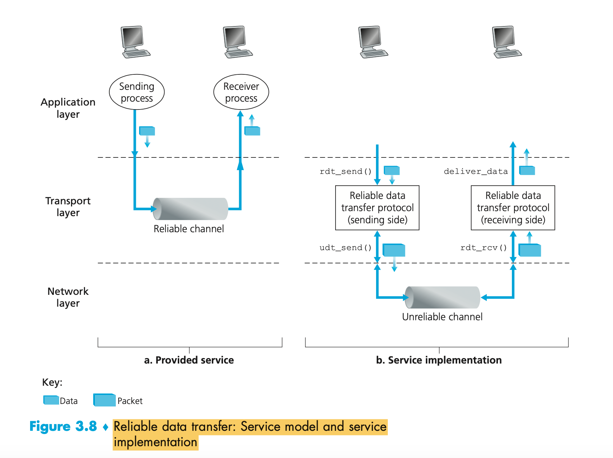

# TCP (connection)

* TCP provides a very important service - a standard, general purpose method for the reliable delivery of data.
* “Reliable” here refers to the reliability between applications running on one computer to another.
* TCP provides this reliability by adding services on top of IP, which is connectionless and does not guarantee the
  delivery of packets.
* TCP is the primary transport protocol for reliable, full-duplex, virtual circuit connections inside the IP datagram.
   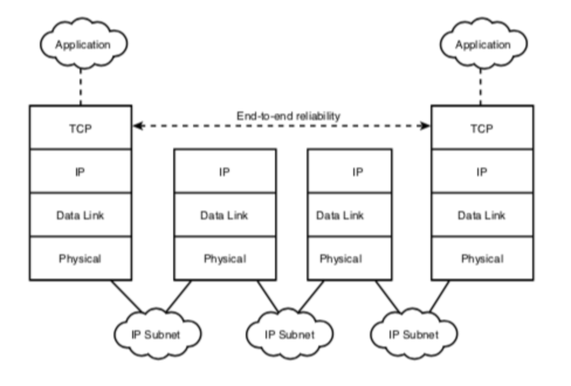

* TCP Features:
    * Basic data transfer;
    * Reliability;
    * Flow control;
    * Multiplexing;
    * Connections;
    * Precedence and security.

* TCP overview:
    * Point 2 point : one server one receiver
    * reliable, in-order byte stream : no "Message boundaries"
    * pipelined:  TCP congestion and flow control set the window size
    * Full duplex data: Bi-directional data flow in the same connection and maximum segment size (MSS)
    * Connection-oriented, handshaking inits the sender/receiver state before the data transfer
    * Flow control: sender will not overwhelmed ...

* TCP Segment Structure:

    * Header and a data field which contains the application data
    * Data gets broken down into smaller chunks, which are appropriate for the MSS (maximum segment size)
    * Source and destination port numbers are required for all transmissions - multiplexing and demultiplexing
    * The header contains a checksum field like a UDP
    * the sequence number for packets that are broken down
        * Sequence number is also byte stream "number" of first byte in segment's data
    * The acknowledgement - the ACK, for reliable data transmission.
        * sequence of next byte expected from other side
        * cumulative ACK
        * the sender to learn of the receiver’s view of the world (in this case, whether or not a packet was received
          correctly) is for the receiver to provide explicit feedback to the sender. The positive (ACK) and negative (
          NAK)
          acknowledgment replies in the message-dictation scenario are examples of such feedback.
            * In principle, these packets need only be one bit long; for example, a 0 value could indicate a NAK and a
              value of 1 could indicate an ACK.
               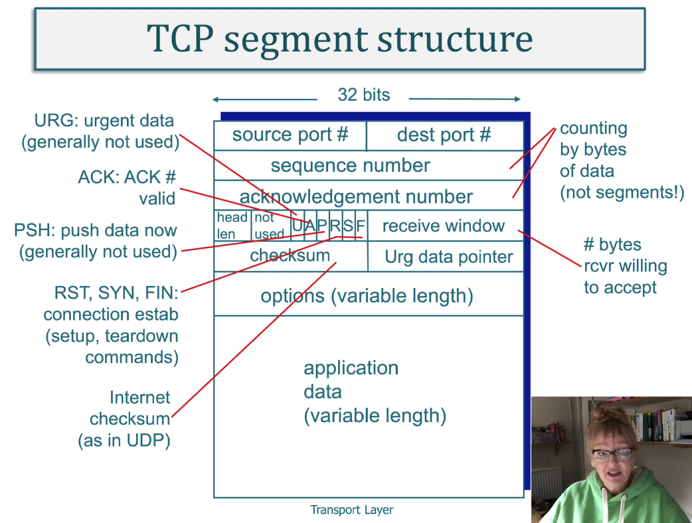
               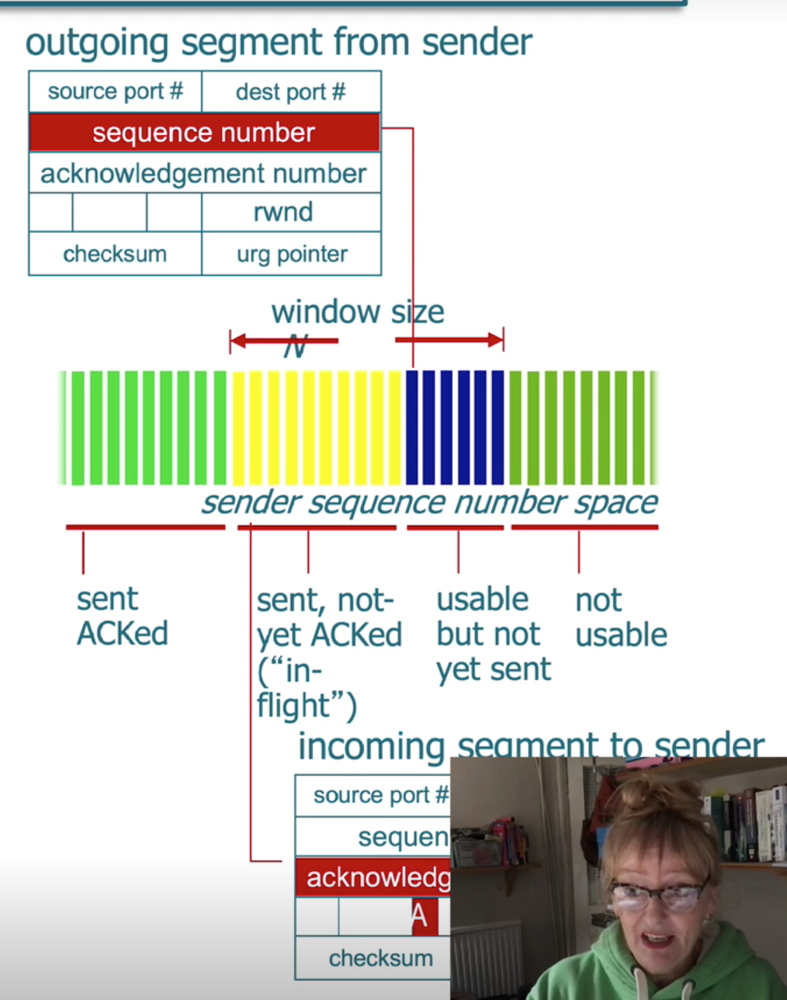

* The TCP just sees ordered but unstructured data so uses the sequential order number to organise it.
    * that means that it sees unstructured data. It doesn't know how to make sense of it.
    * it needs to make sure that it has it in the right order to interpret it at the receiving node.
    * the sequence number is critical.
    * It's byte-streamed for the first byte of a segment and over a stream, not the series of segments in that stream,

 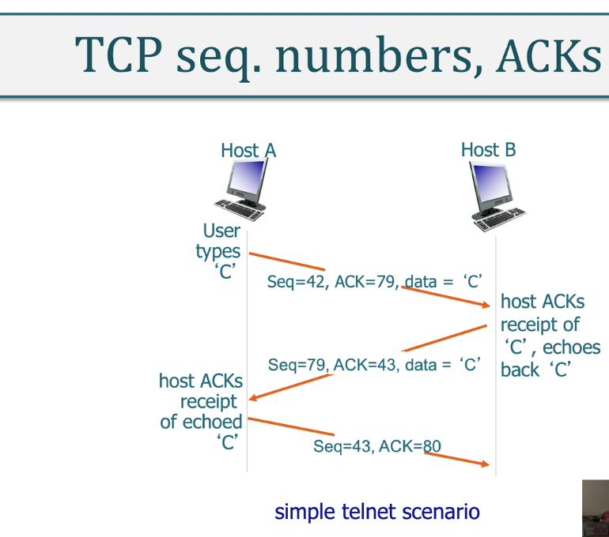

* if the user types in the letter ‘C’, the start sequence number is 42 in this slide and the client number is 79.
    * The sequence number of a segment is the sequence number of the first byte in the data field.
    * the first segment from the client has 42 in its sequence number, the first segment from the server will have
      sequence number 79.
    * The ACK number - acknowledgement number - is the sequence number of the next byte of data the host is waiting for.
    * After TCP connections are made before sending data, the client is waiting for byte 79 and the server is waiting
      for byte 42.
    * The first segment sent from the client to the server includes one byte ASCII, which represents the letter C in its
      data field, plus 42 in its sequence field, giving a total of 43, and the process is reversed for echo back.

* Setting up timeout
    * TCP uses a timeout retransmit mechanism in order to recover lost segments because otherwise they'd be flying
    * Timeout should be larger than the connection’s round-trip time - “RTT”. That is the time taken from when the
      segment is sent, to when it's acknowledged.
    * If the timeout is too small, then unnecessary retransmissions happen
    * If it's too big, then the sender responds too slow to lost packets.
    * The method of SampleRTT, where the time from segment transmission until ACK is received is measured, is used to
      decide the timeout value.
        * To be more resilient/smoother against fluctuations in RTT, this can be averaged over multiple measurements.

* Reliable Data Transfer
    * TCP creates a RDT on top of unreliable IP service
        * IP doesn't guarantee datagram delivery, it doesn't guarantee in-order delivery of datagrams, and it does not
          guarantee the integrity of the datagrams, therefor you can conclude that it's quicker.
    * TCP’s reliable data transfer service ensures that data streams that a process reads out of its TCP receive buffer
      is uncorrupted, without gaps, without duplications and in sequence order. That is, in byte order.
    * TCP:
        * Pipelined segments
        * Cumulative ACKs
        * Single retransmission timer
    * Retransmission triggered by
        * timeout events
        * duplicate ACKs

* TCP sender events
    * From the sender's viewpoint, retransmission is a life saver.
    * The sender doesn't know whether a packet of data was lost, whether an acknowledgement might have been lost or if
      the packet or the acknowledgement were simply overly delayed.
    * Implementing a time-based retransmission mechanism requires a countdown timer that can interrupt the sender after
      a given amount of time has expired.
    * The sender needs to be
        * a) start the timer each time a packet - either a first-time packet or a retransmission - is sent
        * b) respond to a timer interrupt (taking appropriate actions)
        * c) stop the timer.
           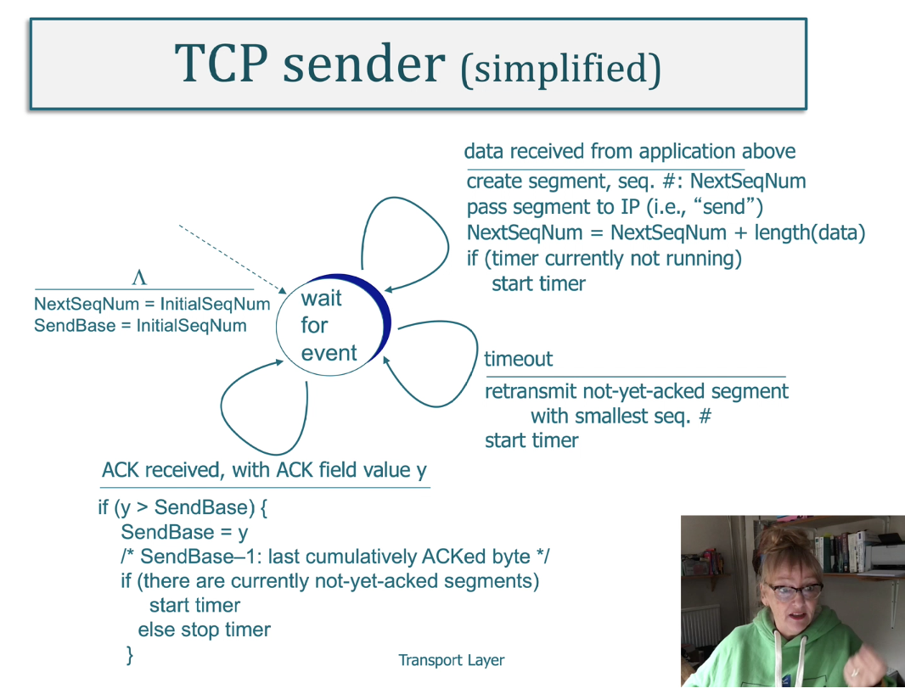

    * Normally, retransmissions are triggered by timeouts and duplicate acks.
        * It's valid to send multiple packets back to back without waiting for the ACK.
            * Then, if the ACK for the last packet is received and others are lost, the client knows that the server has
              received everything up until that point
            * If the ACKs aren't received within the timeout, then the very first non-ACKed packet is resent.

* Flow Control
    * TCP connection receives bytes in sequence, it puts the data into a buffer and the application process reads from
      it. But it can overflow if the application process is too slow at reading it, or receives too much data too
      quickly.
    * TCP has a flow-control service to stop receiver’s buffers overflowing, and it's at a speed matched with the
      service and it's part of congestion control.
    * Server tells client how much their room has in its buffer.
        * It puts the value in the receive window field of every sequential byte sent back to client, and Server sets
          the rewind to be equal to the received buffer

## The End-to-End principle

* The end-to-end principle states that the transport issues are the responsibility of other endpoints and should not be
  delegated to the core network.
* Two issues falling under this category are data corruption and congestion.
    * For data corruption, even though essentially all links on the Internet have link-layer checksums to protect
      against data corruption, TCP still adds its own checksum (in part because of a history of data errors introduced
      within routers).
    * TCP is today essentially the only layer that addresses congestion management.

## Transport Service Primitives

* Programmers never see the network service but can see some primitives
* A connection-orientated transport interface must follow the 5 principles below.
* It must allow programs to establish, use and then release connections.
   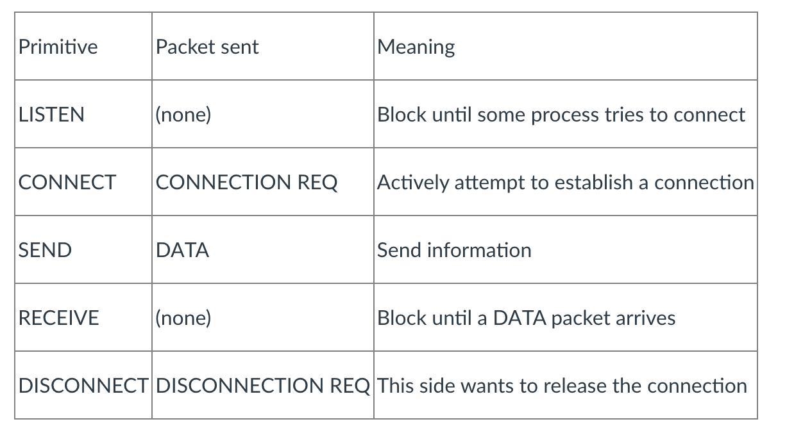
* The Transport Protocol Data Unit (TPDU) sends messages from transport entity to transport entity and these are
  contained in packets (exchanged by the network layer).
    * These packets are then contained in frames
* When a frame arrives, the data link layer processes the frame header and passes the contents of the frame payload
  field up to the network entity.
* The network entity then processes the packet header and passes the contents up to the transport entity.
   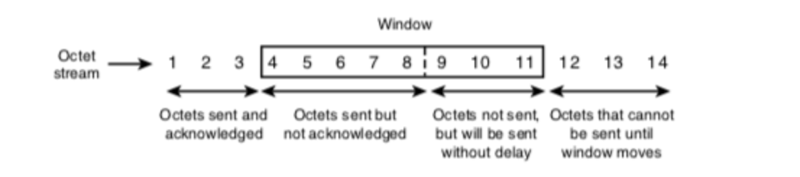

* When a client needs to communicate with the server it executes a CONNECT primitive.
    * The transport entity carries out this primitive by blocking the caller and sending a packet to the server.
    * The client’s CONNECT call causes a CONNECTION REQUEST TPDU to be sent to the server; on its arrival the transport
      entity checks to see that the server is blocked on a LISTEN.
    * It then unblocks the server and sends a CONNECTION ACCEPTED TPDU back to the client, and when the TPDU arrives,
      the client is unblocked and the connection is established.

* Data can now be exchanged using the SEND and RECEIVE primitives.
    * A (blocking) RECEIVE to wait for the other party to do a SEND can be sent by either party.

* When a connection is no longer needed, it must be released to free up table space within the two transport entities.
* Disconnection has two variants: asymmetric and symmetric.
    * **In asymmetric disconnection**, either transport user can issue a DISCONNECT primitive which results in a
      DISCONNECT TPDU being sent and actioned.
    * **In the symmetric variant**, each variant is closed separately, independent of each other. When one side sends a
      DISCONNECT, that means it has no more data to send but is still willing to accept data. A connection is only
      released when both sides have done a DISCONNECT.
       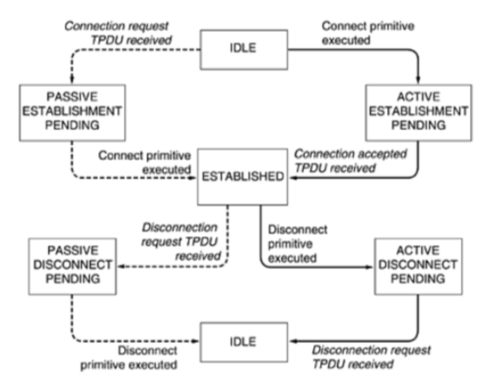

## TCP Activity

* If the server process is running, then the client can initiate a TCP connection to the server. This happens as
  follows:
    * The client creates a ‘socket’ and specifies the address of the server process, which is: IP address of the server
      and the port number of the server process.
    * When the ‘socket’ has been created in the client program, TCP in the client then initiates a three-way handshake
      and establishes a TCP connection with the server.
    * The three-way handshake takes place at the transport-layer and is completely transparent to the server and client
      programs. See the diagram below.

* During handshake:
    * the client knocks on the ‘door’ of the server process requesting a connection.
    * The server responds by opening the ‘door’ - i.e. creating a new socket, which is dedicated to that particular
      client.
    * At the end of the handshaking phase, a TCP connection exists between the client’s socket and the server's new
      socket, referred to as the server’s ‘connection socket’.

 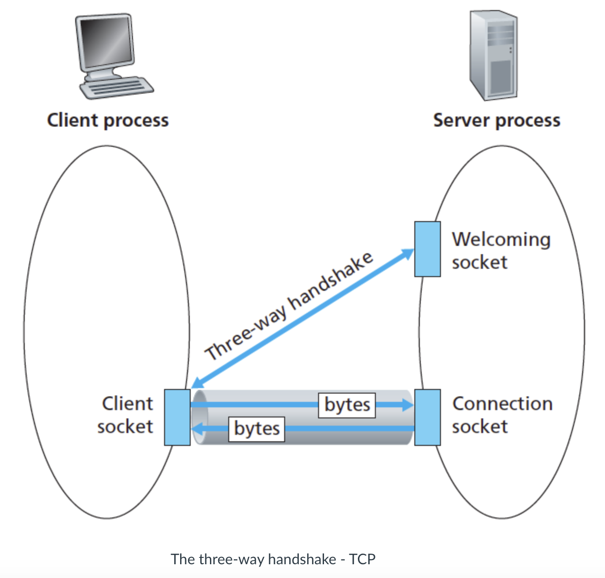

* What uses would unicast communication have?
    * Point to point communication
    * Equipment monitoring
    * Alarms

* What are the benefits of Unicast?
    * Unicast transmission has been in use for a long time, with well-established protocols and easy-to-deploy
      techniques. Well-known and trusted applications such as http, smtp, ftp and telnet all use the unicast standard
      and employ the TCP transport protocol. On a network, transmission takes place from host to host, which can reduce
      the traffic burden on a Local Area Network (LAN), as a whole.

* What are the drawbacks of Unicast?
    * If a network device is called upon to send a message to multiple nodes, it has to send multiple unicast messages,
      each addressed to a specific device. This first requires the sender to know the exact IP address of each
      destination device. In addition, each unicast client that connects to the host server uses up some network
      bandwidth. If multiple clients are involved, this may introduce scaling issues as far as network and server
      resources are concerned. The problem becomes even more pronounced if many hosts are transmitting via unicast to
      many receivers, at the same time.

 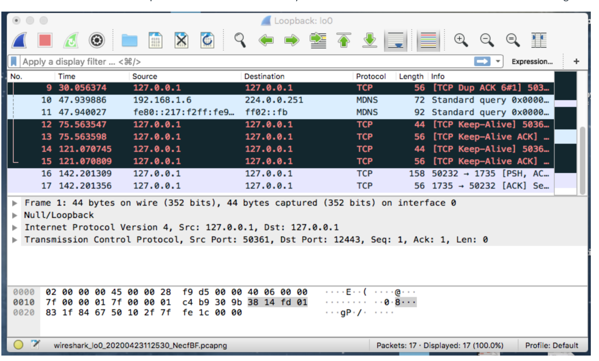

* Your TCP socket will be highlighted lilac and you should look for TCP under the ‘Protocol’ heading and an arrow
  pointing to or from the socket port 1735. You can see above that the last two lines are my communication that has been
  captured. The bottom line is the acknowledgement [ACK] and the next line up is the message [PSH]. Its source is the
  loopback 127.0.0.1 and its protocol is TCP and the ports in use are 50232 and 1735. The communication pipe is the
  connection to the server and client via port 1735 and the welcoming port is 50232, which completes the ‘three-way
  handshake’ as described earlier in the three-way handshake diagram

## GO-Bank-N Protocol (GBN)

* In a Go-Back-N (GBN) protocol, the sender is allowed to transmit multiple packets (when available) without waiting for
  an acknowledgment, but is constrained to have no more than some maximum allowable number, N, of unacknowledged packets
  in the pipeline.

 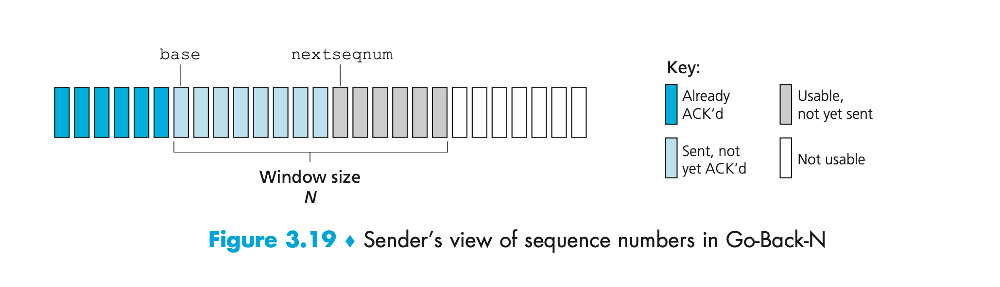

* Sequence numbers in the interval [0,base-1] correspond to packets that have already been transmitted and acknowledged.
  The inter- val [base,nextseqnum-1] corresponds to packets that have been sent but not yet acknowledged. Sequence
  numbers in the interval [nextseqnum,base+N-1] can be used for packets that can be sent immediately, should data arrive
  from the upper layer. Finally, sequence numbers greater than or equal to base+N cannot be used until an unacknowledged
  packet currently in the pipeline (specifically, the packet with sequence number base) has been acknowledged.

* A simple sliding window protocol uses "go-back-n" recovery.
* A receiver utilising Go-Back-N recovery only accepts segments that arrive in sequence and discards any out-of-sequence
  segments.
    * It always returns an acknowledgement containing the sequence number of the last segment received.
* The sender must wait for an acknowledgement once its sending buffer is full.
    * Once received, it removes all the acknowledged segments from the sending buffer and uses a retransmission timer to
      detect segment losses.
* When the go-back-n sender receives an acknowledgement, it restarts the transmission timer only if there are still
  unacknowledged segments in its sending buffer
* When the retransmission timer expires, the go-back-n sender assumes that all unacknowledged segments currently stored
  in its sending buffer have been lost
    * Thus It retransmits all the unacknowledged segments in the buffer and restarts the transmission timer.
* This is a good system to utilise the bandwidth when packet losses occur occasionally. However, if the losses are high,
  the performance drops because;
    * the go-back-n receiver does not accept out-of-sequence segments
    * the go-back-n sender retransmits all unacknowledged segments once it has detected a loss.

 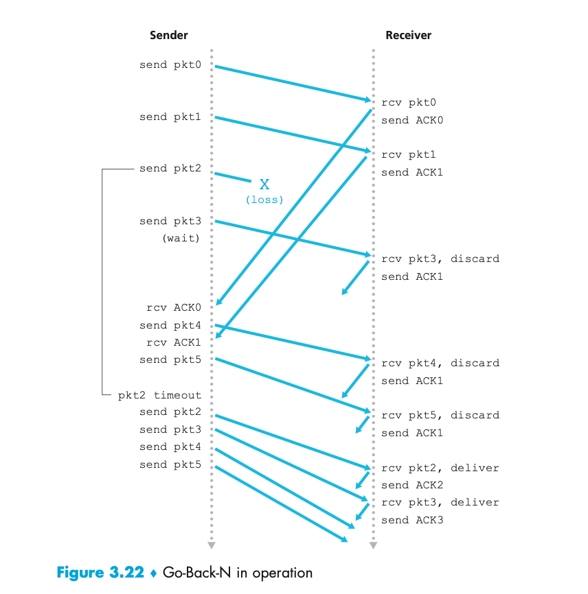

## Ports and Sockets

### Ports

* A port is a 16 bit number used by the host-to-host protocol to identify to which higher level protocol or application
  program it must deliver incoming messages.
* Well-known:
    * These belong to standard servers.
    * For example, Telnet uses port 23.
    * Well-known port numbers range between 1 and 1023
    * Most servers require only a single port except for the BOOTP server which uses 767 and 68, and the FTP server
      which uses 20 and 21.
    * Well-known ports are controlled and assigned by
      the [Internet Assigned Numbers Authority (IANA)](https://www.iana.org/) and on most systems can only be used by
      system processes or by programs executed by admin users.
    * Well-known ports allow clients to find servers without configuration information.
* Ephemeral
    * Some clients do not need well-known port numbers because they initiate communication with servers and the port
      numbers they are using are contained in the TCP/UDP datagrams sent.
    * Each client process is allocated a port number for as long as it needs it by the host on which it is running.
    * Ephemeral ports numbers have values greater than 1023, normally in the range of 1024 to 65535.
    * These are not controlled by IANA and can be used by most systems.

* If two different applications are trying to use the same port numbers on one host then this clash is avoided, but with
  applications requesting an available port from TCP/IP, the port is dynamically assigned and can differ from one
  invocation to the next.

* UDP, TCP and ISO TP-4 all use the same principles for port management.

### Sockets

* The socket interface is one of several application programming interfaces to the communication protocols
* A **socket** is a special type of file handle which is used by a process to request network services from the
  operating system
* A **socket address** is in triple **<protocol, local address, local port>**, e.g. <tcp, 192.168.16.8080>
* A **conversation** is the communication link between the two processes.
* An **association** is the 5-tuple that completely specifies the two processes that comprise a connection: <protocol,
  local-address, local-port, foreign-address, foreign-port>
    * so <tcp, 192.168.16, 1500, 192.168.43.75, 22> would be valid.
* A **half association** is either one of the following which specifies half a connection:
    * <protocol, local-address, local-process> or <protocol, foreign-address, foreign-process>
    * This is also called a socket or transport address.

* Two processes communicate through TCP sockets which provides a process with a full duplex byte stream connection to
  another process.

* TCP uses the same port principle as UDP to provide multiplexing.
    * Like UDP, TCP uses well-known and ephemeral ports.
    * Each side of a TCP connection has a socket that can be identified by the triple address.
    * If two processes are communicating over TCP, they have a logical connection that is uniquely identifiable by the
      two sockets involved.
    * Server processes are able to manage multiple conversations through a single port.

# QUIZ:

* The OSI has seven layers, which layer does SMTP work at?
    * Application
* You need to have secure communications using HTTPS. What port number is used by default?
    * 443
* You want to implement a mechanism that automates the IP configuration, including IP address, subnet mask, default
  gateway, and DNS information. Which protocol will you use to accomplish this?
    * Dynamic Host Configuration Protocol (DHCP) is used to provide IP information to hosts on your network. DHCP can
      provide a lot of information, but the most common is IP address, subnet mask, default gateway, and DNS
      information.
* What protocol is used to find the hardware address of a local device?
    * Address Resolution Protocol (ARP) is used to find the hardware address from a known IP address.
* You need to login to a Unix server across a network that is not secure. Which of the following protocols will allow
  you to remotely administrator this server securely?
    * SSH
* If you can ping by IP address but not by hostname, or FQDN, which of the following port numbers is related to the
  server process that is involved?
    * The problem is with DNS, which uses both TCP and UDP port 53.
* Which of the following describe the DHCP Discover message?
    * A client that sends out a DHCP Discover message in order to receive an IP address sends out a broadcast at both
      Layer 2 and Layer 3. The Layer 2 broadcast is all Fs in hex, or FF:FF:FF:FF:FF:FF. The Layer 3 broadcast is
      255.255.255.255, which means all networks and all hosts. DHCP is connectionless, which means it uses User Datagram
      Protocol (UDP) at the Transport layer, also called the Host-to-Host layer.
* What layer 4 protocol is used for a Telnet connection, and what is the default port number?
    * Telnet uses TCP at the Transport layer with a default port number of 23.
* Which statements are true regarding ICMP packets?
    * Internet Control Message Protocol (ICMP) is used to send error messages through the network, but ICMP does not
      work alone. Every segment or ICMP payload must be encapsulated within an IP datagram (or packet).
* Which of the following services use TCP?
    * SMTP, FTP, and HTTP use TCP
* Which of the following services use UDP?
    * DHCP, SNMP, and TFTP use UDP. SMTP, FTP, and HTTP use TCP.
* Which of the following are TCP/IP protocols used at the Application layer of the OSI model?
    * Telnet, File Transfer Protocol (FTP), and Trivial FTP (TFTP) are all Application layer protocols. IP is a Network
      layer protocol. Transmission Control Protocol (TCP) is a Transport layer protocol.
* Which of the following protocols is used by e-mail servers to exchange messages with one another?
    * SMTP is used by a client to send mail to its server and by that server to send mail to another server. POP3 and
      IMAP are used by clients to retrieve their mail from the server that stores it until it is retrieved. HTTP is only
      used with web-based mail services.
* If you use either Telnet or FTP, which is the highest layer you are using to transmit data?
    * Both FTP and Telnet use TCP at the Transport layer; however, they both are Application layer protocols, so the
      Application layer is the best answer for this question.
* Which of the following protocols can use TCP and UDP, permits authentication and secure polling of network devices,
  and allows for automated alerts and reports on network devices?
    * Simple Network Management Protocol, is typically implemented using version 3, which allows for a connection
      oriented service, authentication and secure polling of network devices, and allows for alerts and reports on
      network devices.
* You need to transfer files between two hosts. Which two protocol can you use?
    * Secure Copy Protocol (SCP), and File Transfer Protocol (FTP), can be used to transfer files between two systems.
* What layer in the IP stack is equivalent to the Transport layer of the OSI model?
    * The four layers of the IP stack (also called the DoD model) are Application/Process, Host-to-Host, Internet, and
      Network Access. The Host-to-Host layer is equivalent to the Transport layer of the OSI model.
* You need to make sure that your network devices have a consistent time across all devices. What protocol do you need
  to run on your network?
    * Network Time Protocol will ensure a consistent time across network devices on the network.
* Which of the following allows a server to distinguish among different simultaneous requests from the same host?
    * Through the use of port numbers, TCP and UDP can establish multiple sessions between the same two hosts without
      creating any confusion. The sessions can be between the same or different applications, such as multiple
      web-browsing sessions or a web-browsing session and an FTP session.
* Which of the following protocols uses both TCP and UDP?
    * DNS uses TCP for zone exchanges between servers and UDP when a client is trying to resolve a hostname to an IP
      address.

# TODO:

* [UDP in Java](https://www.baeldung.com/udp-in-java)
* [A Simple Java UDP Server and UDP Client](https://systembash.com/a-simple-java-udp-server-and-udp-client/)
* Spend some time researching concepts such as PPP, de-encapsulation and tunnelling with regard to encapsulation
