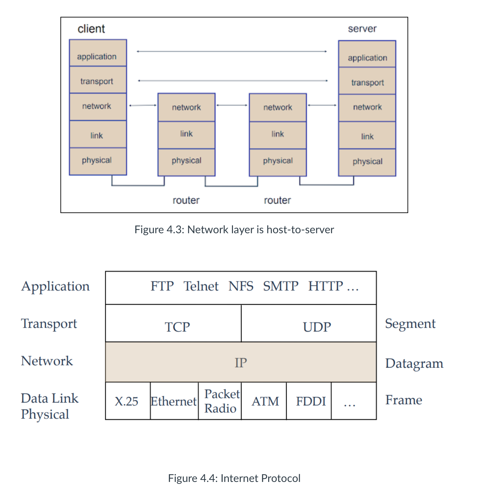
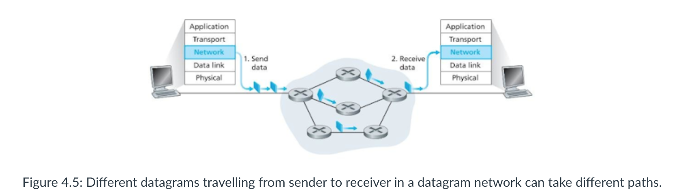
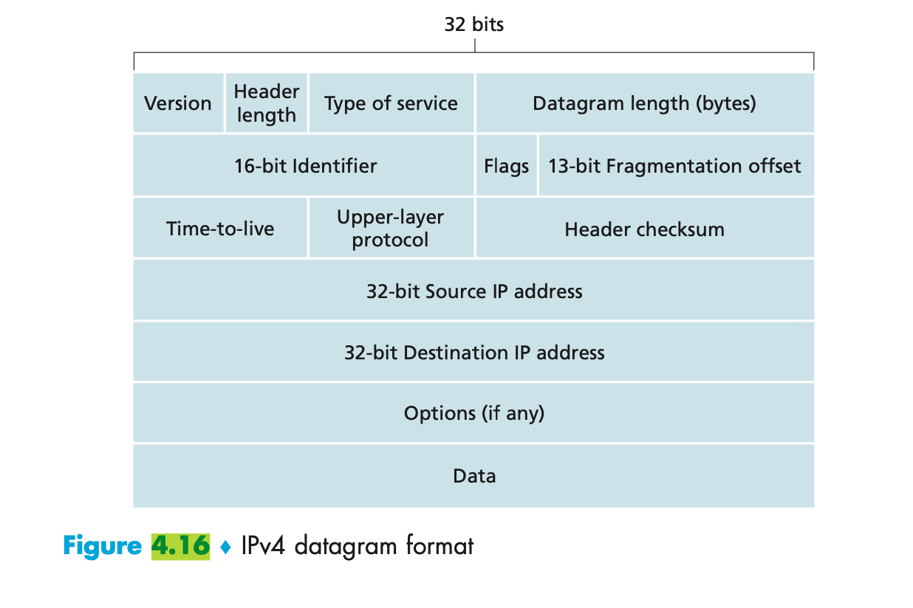
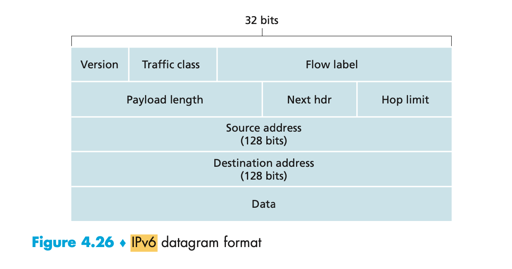
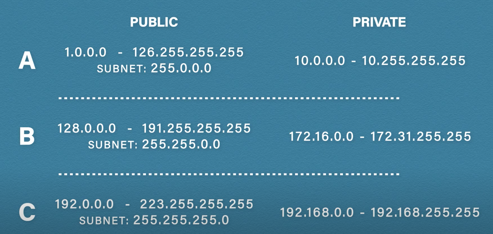
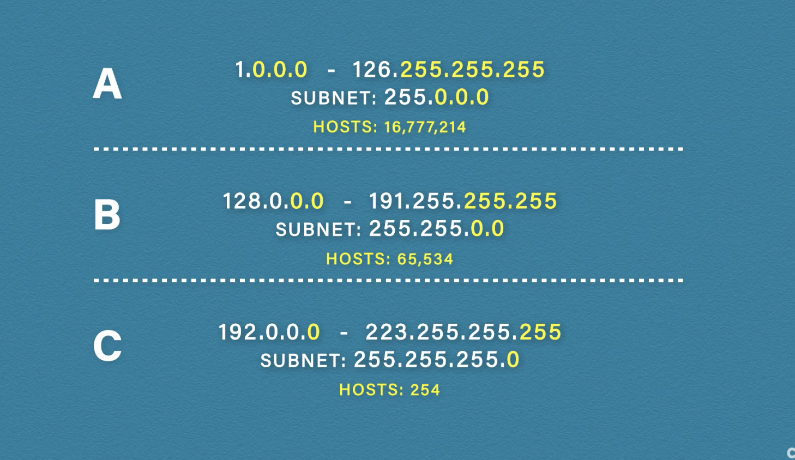
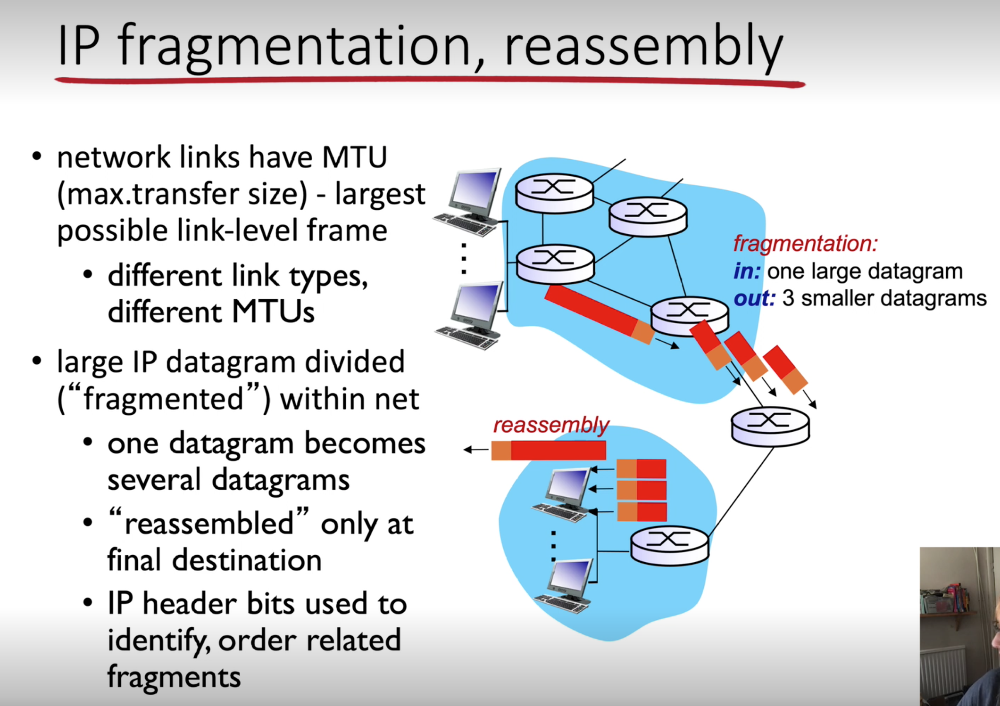
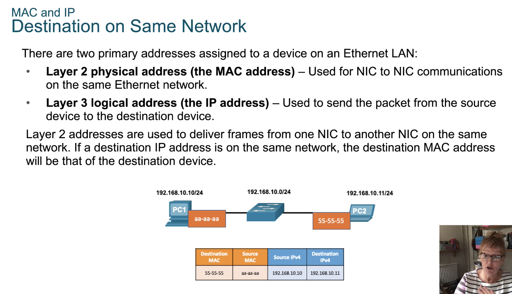
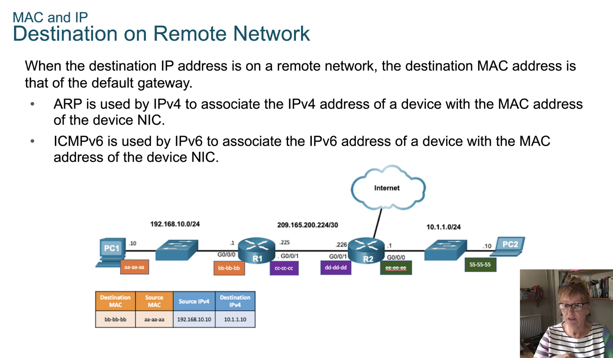
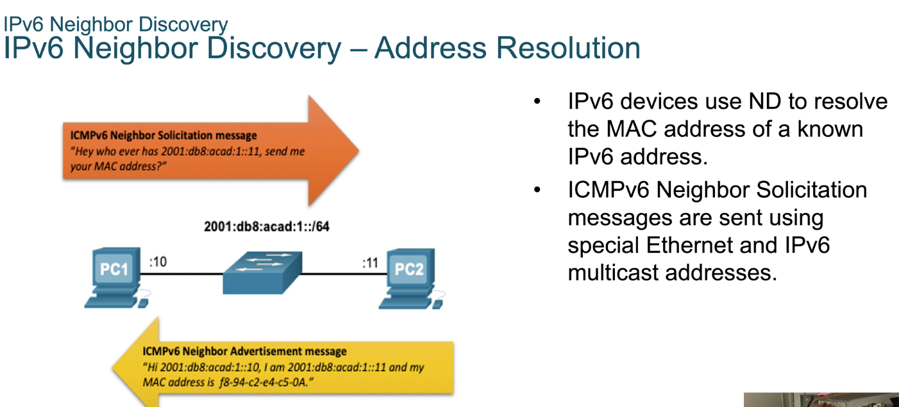

#### Main Topics

*Lesson 1, we focus on the basics of the transport layer and will:

* Examine what the layer consists of * Introduce routing and forwarding

* Lesson 2 we focus on addressing. Particular topics include:
    * IPv4
    * IPv6
    * How they are constructed and their differences
* Lesson 3 we focus on Network Addresses and how they are used on a network.

#### Sub titles:

* [What is the network layer?](#what-is-the-network-layer)

# What is the network layer?

* The network layer is concerned with getting packets from the source all the way to the destination.
* The packets may be required to make many hops via the intermediate routers before they reach their destination.
* This is the lowest layer that deals with end-to-end transmission.
    * In order to achieve its goals, the network layer must know about the topology of the communication network.

* One of the major responsibilities of the network layer protocol is host-to-host data delivery.
    * In doing this, the network layer has to deal with network layer addressing, packetisation and fragmentation,
      routing (and forwarding), as well as the concept of internetworking (connecting links of various types into a
      united internetwork view)
* There are two logical types of packet-switched networks: datagram networks and virtual circuit networks.
   

* Some of the key roles of the network layer are:
    * Forwarding packets from the sending to the receiving host.
    * On the sending side: encapsulating transport packets into datagrams.
    * On the receiving side: delivering packets to the transport layer.
    * Network layer protocols exist in every host & router.
    * Router examines header fields in all datagrams.

* The main functions of the network layer are:
    * **Forwarding**: moving packets from router’s input to appropriate router output.
    * **Routing**: determining the route taken by packet from source to destination. The algorithms that calculate these
      paths are referred to as ‘**routing algorithms**’.

## Interplay between routing and forwarding

* **Connection Setup**
    * Before datagrams (data packets) flow, two end hosts and intervening routers establish a virtual connection (VC).
    * This allows the sender and receiver to set up the necessary state information
        * for example, sequence number and initial flow-control window size
    * This is in order to set up the state before network-layer data packets within a given source-to-destination
      connection can begin to flow.
       

* **Datagram Network**
    * On packet-switched computer networks data are communicated in bit chunks that are called ‘packets’.
        * Packet-switched networks that provide a connectionless, unreliable service (e.g. the Internet) are called
          datagram networks.
        * In datagram networks, there is no concept of a session state in the network core.
        * Routers treat each datagram independently and their per-datagram behaviour is statistical (the destination
          network address determines the choice of outgoing interface).
        * Therefore, different datagrams travelling from sender to receiver in a datagram network can take different
          paths.
           

# IPv4 and IPv6

* The Internet layer is responsible for exchanging packets over a network between identified end devices.
    * There are 2 common protocols IPv4, IPv6

* Both protocols provide devices with a unique IP address to allow for packet delivery
* Because of the growth of the Internet, IPv4 can no longer support unique addresses for every device that requires
  Internet access, so Network Address Translation (NAT) is used to ‘hide’ non-unique private IP addresses behind unique
  public IP addresses.

* IPv4 can receive either TCP segments or UDP datagrams from the transport layer, which it encapsulates within packets.
* IPv4 Header tags
    * Source address : the 32-bit address assigned to the NIC of the host that created a packet, not the MAC address
    * Destination address : the 32-bit address of the device to which the packet is sent.
    * Data : this is the payload (pure data) that an IP carries, typically a segment or datagram from the transport
      layer. This will vary across devices and mediums .
    * Protocol : the transport layer protocol encapsulated within the packet. Protocols are identified using a service
      access point (SAP) number, which is 06 for TCP and 17 for UDP. Because the SAP of the transport layer protocol is
      identified in each packet, IP can deliver segments to the correct transport layer protocol on the receiving
      device.
    * Header checksum : checks for damage during transmission. If IPv4 discovers a damaged header, the entire packet is
      dropped. Because IPv4 does not guarantee reliable delivery of packets, it relies on TCP to arrange for
      retransmission of the segment encapsulated within the dropped packet.
    * Time to live (TTL) : specifies a lifetime for packets, which if exceeded will cause the packet to be dropped. The
      actual value initially placed in the TTL field depends on a computer’s operating system, but the maximum value is
        255. Each router that receives a packet as it is forwarded towards its destination will reduce the value of the
             TTL field by ‘1’. If a router receives a packet with a TTL value of ‘1’, it will discard the packet. This
             protects the Internet from endlessly forwarding packets that have become stuck in a loop.
* Encapsulating a segment or datagram within an IPv4 header adds an additional 20 bytes of data, and this can sometimes
  be exceeded if some of the optional fields are used.            
   

* The maximum size of the payload that can be encapsulated within a data link layer frame is dependent on the specific
  link type and is referred to as the Maximum Transmission Unit (MTU).
    * For example, Ethernet has an MTU of 1500 bytes and WiFi (wireless IEEE 802.11 protocol) has an MTU of 2400 bytes.
    * If the size of the IP datagram is larger than the link MTU, the transmitter (i.e. a source host or a router on the
      path) needs to fragment the datagram to fit into frames.
        * his is called **fragmentation** . After fragmentation, individual fragments travel to the destination host
          independently from each other and they are reassembled into the full IP datagram only at the last destination
          host.

## IP version 6 (IPv6)

* IPv4 is 32-bit , but IPv6 is 128 bits, which means that there are 2^28 IPv6 addresses.
* The packet format of IPv6 is simpler than the IPv4, which speeds up processing at routers.
* **Improvements in IPv6**
    * Increased address space: it uses 128-bit addressing, which provides a phenomenal number of addresses (
      approximately 3.4×1038). Although the address is still binary, it is represented using hexadecimal for ease of
      use, e.g. 2001:db8:acad:1:1:1:1/64.
    * Packet handling : it uses a simplified header with fewer fields than IPv4, making it easier for routers to
      process. For example, as there is no longer a header checksum, routers do not need to perform the error checking
      function and can rely entirely on TCP.
    * Eliminates NAT : it provides a large address space, so it is possible to use IPv6 public addresses on all
      networks, thus making NAT redundant. This also makes the operation of routers more straightforward.

 

* Version (4-bits): It represents the version of Internet Protocol, i.e. 0110.
* Traffic Class (8-bits): These 8 bits are divided into two parts. The most significant 6 bits are used for Type of
  Service to let the Router Known what services should be provided to this packet. The least significant 2 bits are used
  for Explicit Congestion Notification (ECN).
* Flow Label (20-bits): This label is used to maintain the sequential flow of the packets belonging to a communication.
  The source labels the sequence to help the router identify that a particular packet belongs to a specific flow of
  information. This field helps avoid re-ordering of data packets. It is designed for streaming/real-time media.
* Payload Length (16-bits): This field is used to tell the routers how much information a particular packet contains in
  its payload. Payload is composed of Extension Headers and Upper Layer data. With 16 bits, up to 65535 bytes can be
  indicated; but if the Extension Headers contain Hop-by-Hop Extension Header, then the payload may exceed 65535 bytes
  and this field is set to 0.
* Next Header (8-bits): This field is used to indicate either the type of Extension Header, or if the Extension Header
  is not present then it indicates the Upper Layer PDU. The values for the type of Upper Layer PDU are same as IPv4’s.
* Hop Limit (8-bits): This field is used to stop packet to loop in the network infinitely. This is same as TTL in IPv4.
  The value of Hop Limit field is decremented by 1 as it passes a link (router/hop). When the field reaches 0 the packet
  is discarded.
* Source Address (128-bits): This field indicates the address of originator of the packet.
* Destination Address (128-bits): This field provides the address of intended recipient of the packet.

# Network Addresses

* The Internet Protocol (IP) is a data-oriented, best-effort protocol (doesn't guarantee delivery) used for
  communicating data across a network.
* Transmission using IP may result in duplicated packets and/or packets that are out of sequence.
* All of these contingencies are addressed by an upper-layer protocol (such as TCP) for applications that require
  reliable delivery.
* An IP address is a logical identifier for a computer or device on a network and its key feature is that they can be
  routed across networks.
* The IP address will be the unique identifier for that device (as well as the MAC) within the domain or network.
* The format of an IPv4 address is a 32-bit numeric address written as four numbers separated by full stops, sometimes
  referred to as a "dotted-quad" (IPv4). The range of each number can be from 0 to 255.
    * For example, 2.165.12.230 would be a valid IP address.

   

### Classful Addressing

* The idea is to make address allocation scalable.
* In classful addressing, an IP address is divided into three sections:
    * Class type: Identifies the class type (A, B, or C).
    * Network Number: Identifies the network.
    * Host Number: Identifies the host.
    * Class A addresses support 16 million hosts on each of 126 networks.
        * 1.0.0.0 - 126.255.255.255, subnet 255.0.0.0
    * Class B addresses support 65,000 hosts on each of 16,000 networks.
        * 128.0.0.0 - 191.255.255.255, subnet 255.255.0.0
    * Class C addresses support 254 hosts on each of 2 million networks.
        * 192.0.0.0 - 223.255.255.255, subnet 255.255.255.0
* The number of unassigned Internet addresses is running out, so Classless Inter-Domain Routing (CIDR) is gradually
  replacing the classful addressing system and IPV6 addresses.

   

### Private Addresses

* Network hosts that do not need to have their addresses visible on the public Internet, so they are on a LAN only, can
  be assigned a private IP address (those that sit behind the router or default gateway).

* The following are the four IP address ranges reserved for private networks:
    * Class A: 10.0.0.0—10.255.255.255
    * Class B: 172.16.0.0—172.31.255.255
    * Class C: 192.168.0.0—192.168.255.255
    * APIPA : 169.254.0.0—169.254.255.255

* The Loopback address is 127.0.0.1.
    * An APIPA-generated address has high order octets with a value of 169.254.
    * A Class C registered IP address has a first octet value of 192 to 223 excluding the private range noted previously

* Public addresses has to be unique, but private addresses can use again and again. Thus saving millions public ip
  addresses.
   

* [IP addresses Video](https://www.youtube.com/watch?v=LIzTo6e4FgY)

## Fragmentation & IP Packet Structure

* IP exists at the Internet layer and passes datagrams to the network access for transmission on the network.
* The various network interfaces impose a limit on the maximum payload size that can be delivered per frame, which is
  called the maximum transmission unit (MTU).
* If the MTU of the network interface device, such as an Ethernet unit, is smaller than the IP datagram, the IP module
  must divide the datagram into smaller fragments.
* Each fragment is then put into a separate IP packet for delivery across the network. Information embedded in the IP
  header informs the receiving host that the IP datagram is part of a larger block of data and must be reassembled.
* The process of fragmenting and reassembling IP datagrams is analogous to the segmentation and reassembly of segments
  performed by TCP.
   
   

## Address Resolution Protocol (ARP)

* When an IP module requests a datagram be transmitted by the network layer, be it in an end system or an intermediate
  router, IP must first translate between the IP address and this unique physical address using another Internet layer
  service, known as the Address Resolution Protocol (ARP).
* The Address Resolution Protocol is a method for translating between the Internet layer and the network layer address.
* The ARP module in a computer or router maintains a translation table of the logical to physical mappings of which it
  is aware, called the ARP cache.
* Using the Internet and TCP/IP in an example, the basic steps of ARP translation are
    * ARP checks the local cache to see if it knows the mapping between the IP address and a physical address (the Media
      Access Control [MAC] address).
    * If there is no match, ARP broadcasts an ARP request to the local network. The broadcast is received by every
      computer and router to which the host is connected.
    * If a computer with a matching IP address exists on the local network, it sends its MAC address back. The ARP
      module adds this translation to the ARP cache for future use.
    * If a router on the local network realises that the requested IP address is outside the local network, it sends
      back its MAC address, in order for the IP datagram to be forwarded to it.

* The same process is used to forward IP datagrams between routers as a packet traverses the network. When a router is
  designated as the next hop, the MAC address of the router, rather than the receiving computer, is provided as the IP
  to MAC translation.

   
   

* “ARP poisoning”, that's when a host requests the MAC address of the default gateway and a threat actor sends a
  gratuitous ARP listing, listing themselves as the default gateway. The unsuspecting host then sends all of the
  messages to the threat actor who in turn forwards them out through the router but records all the data that was sent.
    * DHCP snooping builds a table of IP addresses to MAC addresses, so like your ARP table. If a threat actor tries to
      insert their own MAC address, the table recognises this change and shuts off the port that the threat actor is
      attached to.

* IPv6 Neighbour Discovery (ND) protocol provides
    * Address resolution
    * Router discovery
    * Redirection services
* ICMPv6 Neighbour Solicitation (NS) and Neighbour Advertisement (NA) messages are used for device-to-device messaging
  such as address resolution.
* NS is also used to make sure that no other device in the network has the same IPv6 address.
* ICMTPv6 Router Solicitation (RS) and Router Advertisement (RA) messages are u for messaging between devices and
  routers for router discovery.
* ICMPv6 redirect messages are used by routers for better next-hop selection.
   

# Questions

* The name of a transport-layer packet is segment and that the name of a link-layer packet is frame. What is the name of
  a network-layer packet? Recall that both routers and link-layer switches are called packet switches. What is the
  fundamental difference between a router and link-layer switch?
    * A network-layer packet is a datagram. A router forwards a packet based on the packet’s IP (layer 3) address. A
      link-layer switch forwards a packet based on the packet’s MAC (layer 2) address.
* Network layer functionality can be broadly divided into data plane functionality and control plane functionality. What
  are the main functions of the data plane? Of the control plane?
    * The main function of the data plane is packet forwarding, which is to forward datagrams from their input links to
      their output links. For example, the data plane’s input ports perform physical layer function of terminating an
      incoming physical link at a router, perform link-layer function to interoperate with the link layer at the other
      side of the incoming link, and perform lookup function at the input ports. The main function of the control plane
      is routing, which is to determine the paths a packet takes from its source to its destination. A control plane is
      responsible for executing routing protocols, responding to attached links that go up or down, communicating with
      remote controllers, and performing management functions
* There is a distinction between the forwarding function and the routing function performed in the network layer. What
  are the key differences between routing and forwarding?
    * The key differences between routing and forwarding is that forwarding is a router’s local action of transferring
      packets from its input interfaces to its output interfaces, and forwarding takes place at very short timescales (
      typically a few nanoseconds), and thus is typically implemented in hardware. Routing refers to the network-wide
      process that determines the end-to-end paths that packets take from sources to destinations. Routing takes place
      on much longer timescales (typically seconds), and is often implemented in software.

## Quiz IPv4 & IPv6

* What is the valid range of values that may appear in an IPv4 octet? Give your answer in decimal as well as binary.
    * The range of values that an IPv4 octet can take on is 0 through 255 in decimal, which stems from the values
      00000000 through 11111111 in binary.

* Name some of the benefits of IPv6 over IPv4.
    * IPv6 has the following characteristics, among others, that make it preferable to IPv4: more available addresses,
      simpler header, options for authentication and other security.

* What is the term for the auto-configuration technology responsible for addresses that start with 169.254?
    * Automatic Private IP Addressing (APIPA) is the technology that results in hosts automatically configuring
      themselves with addresses that begin with 169.254.
    * When a workstation cannot obtain an IP address from a DHCP server, often an IP address will be autogenerated by
      automatic private IP addressing (APIPA). The IP addresses are in the range 169.254.0.1 to 169.254.255.254. The
      correct response is B. The other responses are valid IP addresses that are either statically assigned or
      dynamically assigned by a DHCP server.

* What does the IP Properties selection, 'Obtain an IP Address Automatically' indicate?
    * Filling in the Obtain an IP Address Automatically radio button in IP Properties configures the host as a DHCP
      client.

* What effect will an inappropriate DHCP server have on hosts using static IP addresses?
    * None; DHCP servers cannot override statically assigned IP information

* What is the name for a 48-bit (6-byte) numerical address physically assigned to a network interface, such as a NIC?
    * A MAC address, sometimes called a hardware address or even a burned-in address.

* What gives IPv6 the ability to reference more addresses than IPv4?
    * The fact that it has 128-bit (16-octet) addresses, compared to IPv4’s 32-bit (4-octet) addresses.

* What predecessor to DHCP, on which DHCP is based, was used to assign a workstation its IP information and to supply it
  with a boot image?
    * BootP, the Bootstrap Protocol, used the same port numbers as DHCP but supplied more simplified information to a
      diskless workstation and allowed the workstation to download a remote boot image.

* What is the Class C range of values for the first octet in decimal and in binary?
    * 192–223, 110xxxxx.

* What is the 127.0.0.1 address used for?
    * Loopback or diagnostics.

# TODO

* [What is an IP address](https://computer.howstuffworks.com/internet/basics/what-is-an-ip-address.htm)
* [IP addressing and subnetting ](https://www.cisco.com/c/en/us/support/docs/ip/routing-information-protocol-rip/13788-3.html#anc0)
* Go back 4.5.4 Wireshark activities