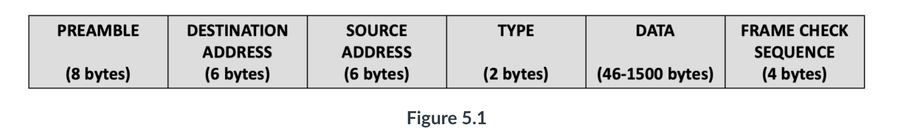
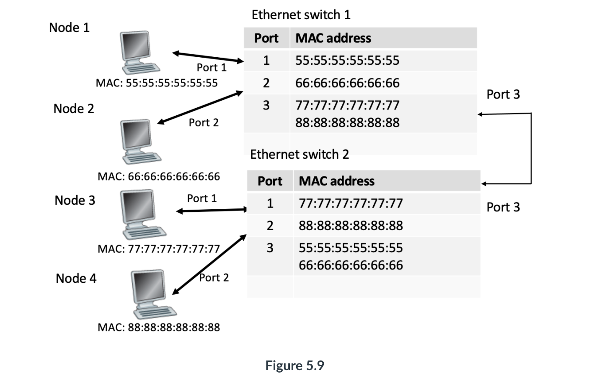
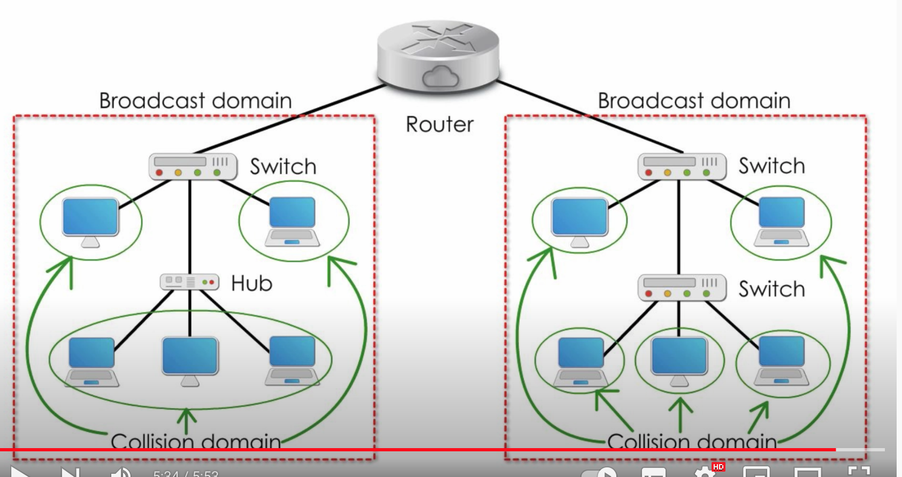
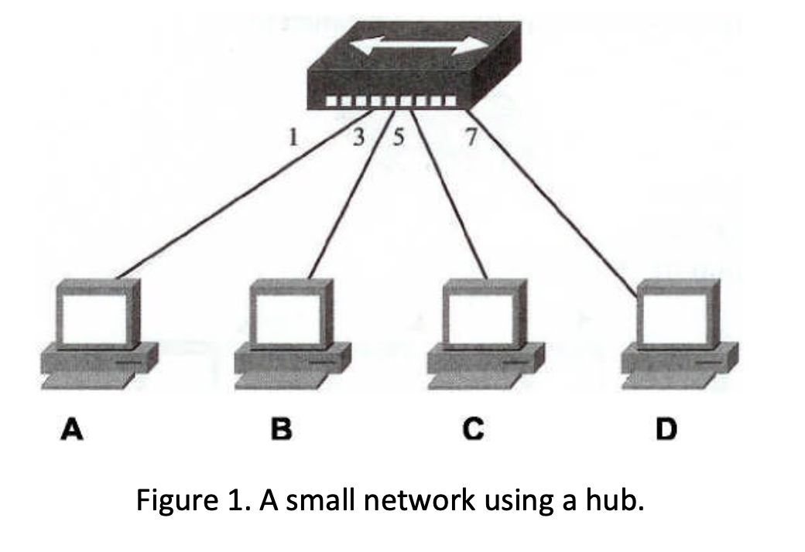
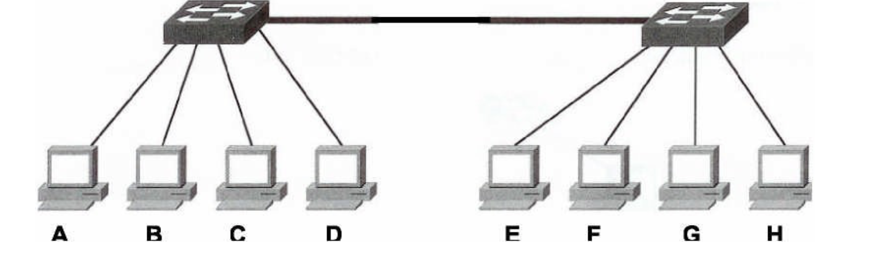
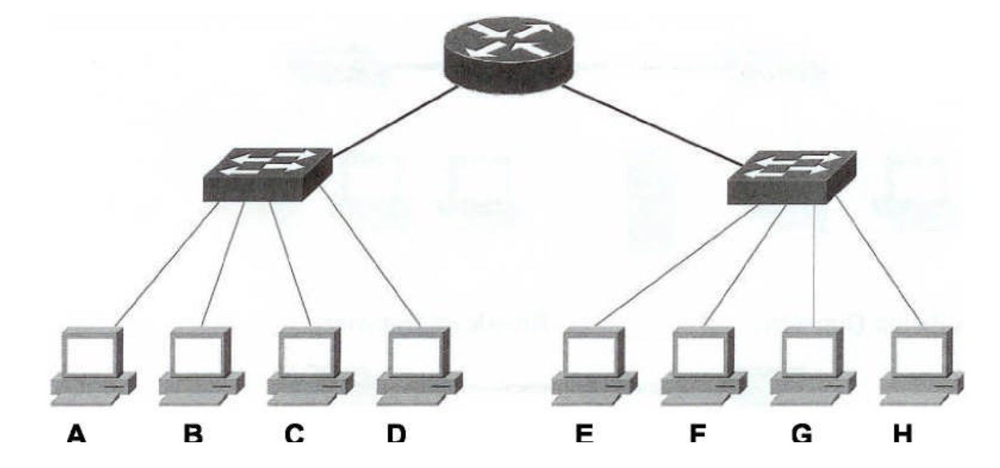

#### Main Topics

* Lesson 1
    * What the layer consists of
    * Broadcast domains
    * Collision domains
    * NAT
* Lesson 2:
    * ICSMA/CD
    * Error correction
* Lesson 3
    * Channel partitioning protocols
    * Switched LANs

#### Sub titles:

* [Link Layer](#link-layer)

# Link Layer

* The link layer sits at the bottom of the stack
* The datalink layer is responsible for
    * Ethernet addressing which is often referred to as MAC addressing,
    * framing and preparation of data for transmission on a LAN
        * The framing consists of combining bits into bytes, and bytes into frames, which are then encapsulated and
          passed down the layer to the physical layer.
* Messages are passed across the LAN using MAC addressing system and cyclic redundancy checks (CRC) provides error
  detection at this level.
* The network access layer accepts packets from the Internet layer and prepares them for transmission over a wide range
  of physical transmission media.
* Frames that are transmitted over a media are guided by the network protocols which include how and when they can
  transmit. This is referred to as media access control (MAC).

* The datalink layer provides error-free transfer of data frames over the physical layer:
    * Link establishment and termination
    * Frame traffic control
    * Frame sequencing
    * Frame acknowledgement
    * Frame error checking
    * Media access management

* The IEEE Ethernet Datalink layer has two sublayers :
    * Media Access Control (MAC)
    * Logical Link Control (LLC)

* Devices which work at Layer 2 include:
    * Switch
    * Network adapter
    * Bridge

* The network access layer is concerned with both software and hardware transmission which include the network interface
  card NIC’s and wifi adapters.
    * Adapters contain a signal to be sent to identify the type of transmission media and the software for framing and
      media access control services and speed of medium type.

* Ethernet has become the most common network standard and technology and is a family of related protocols standardised
  by the IEEE. However, the physical cable is often called Ethernet too.
    * Ethernet standards define the protocols and technology used within the network access layer.
* One function of Ethernet is to encapsulate Internet layer packets into PDU's called frames .
   
* The important fields to note are:
    * Destination address : the 48-bit MAC address assigned to the NIC. Unlike IP, this address is assigned permanently
      to the NIC during manufacture.
    * Source address : the 48-bit MAC address of the device to which the frame is sent.
    * Type : the SAP identifying the Internet layer protocol packet encapsulated within the frame. A SAP of 0x800 is
      used for IPv4, and 0x86DD for IPv6.
    * Data : the payload (amount of data) carried by the frame, typically a packet from either IPv4 or IPv6. The maximum
      size of a packet that a frame can carry is 1500 bytes.
    * Frame check sequence (FCS) : a mathematically generated code used to check that the frame has not been damaged
      during transmission – similar in function to the checksum used by TCP. Unlike TCP, if Ethernet determines that a
      frame has been damaged, it drops it and relies on TCP to arrange for retransmission of the segment the frame
      contained.

* Possible services that can be offered by a link-layer protocol include:
    * **Framing**. Almost all link-layer protocols encapsulate each network-layer data- gram within a link-layer frame
      before transmission over the link.
        * A frame consists of a data field, in which the network-layer datagram is inserted, and a number of header
          fields.
    * **Link access**. A medium access control (MAC) protocol specifies the rules by which a frame is transmitted onto
      the link.
        * For point-to-point links that have a single sender at one end of the link and a single receiver at the other
          end of the link, the MAC protocol is simple (or nonexistent)—the sender can send a frame whenever the link is
          idle.
        * The more interesting case is when multiple nodes share a single broadcast link—the so-called multiple access
          problem.
            * Here, the MAC protocol serves to coordinate the frame transmissions of the many nodes.

    * **Reliable delivery**. When a link-layer protocol provides reliable delivery service, it guarantees to move each
      network-layer datagram across the link without error.
        * Similar to a transport-layer reliable delivery service, a link-layer reliable delivery service can be achieved
          with acknowledgments and retransmissions
        * A link-layer reliable delivery service is often used for links that are prone to high error rates, such as a
          wireless link, with the goal of correcting an error locally—on the link where the error occurs—rather than
          forcing an end-to-end retransmission of the data by a transport- or application-layer protocol.
            * However, link-layer reliable delivery can be considered an unnecessary overhead for low bit-error links,
              including fiber, coax, and many twisted-pair copper links. For this reason, many wired link-layer
              protocols do not provide a reliable delivery service.

    * **Error detection and correction**. The link-layer hardware in a receiving node can incorrectly decide that a bit
      in a frame is zero when it was transmitted as a one, and vice versa.
        * Such bit errors are introduced by signal attenuation and electromagnetic noise.
        * Because there is no need to forward a datagram that has an error, many link-layer protocols provide a
          mechanism to detect such bit errors.
        * This is done by having the transmitting node include error-detection bits in the frame, and having the
          receiving node perform an error check.
        * Error detection in the link layer is usually more sophisticated and is implemented in hardware. Error
          correction is similar to error detection, except that a receiver not only detects when bit errors have
          occurred in the frame but also determines exactly where in the frame the errors have occurred (and then
          corrects these errors

## Ethernet switch operation

* when we're referring to switches, we are talking about Ethernet switches.
    * unmanaged switches (not programmable or customisable), so they just plug and play.
* A switch is a link-layer device and it selectively forwards frames to one or more outgoing ports.
    * it uses CSMA/CD - CSMA is “carrier-sense multiple access” and CD is “collision detection”,
* Frames goes in one port, traffic comes in one port and it goes out of all of the others, but only valid packets.
* If an address is on the switch's forwarding table, then it only comes out on the relevant port of the switch that can
  access the end device.
    * Otherwise, the switch pushes the packet out on all ports, apart from the one that the message originates from.
* Plug-and-play switches use buffers, they work at the application layer and nodes are not known by their MAC address
  initially; in an IP network ARP is used.
    * So ARP is “address resolution protocol” and it's the system which translates an IP address into a MAC address and
      backwards.

* Switches forward frames using the destination address to make switching decisions.
   
* In above the topology includes a second Ethernet switch, which is connected to the existing switch via Port 3. Devices
  node3 and node4 have been moved to Switch 2, and their MAC addresses have been added dynamically (or automatically) to
  the MAC address table against the new ports to which they are connected.
    * Because Switch 1 connects to Switch 2 via Port 3, the MAC addresses for node3 and node4 are listed against Port 3
      on Switch 1 – this is the path Switch 1 will use to forward frames destined for either of these node's.

* Because switches dynamically add source MAC addresses to their MAC address tables, the switches have a mechanism for
  dynamically unlearning them.
    * This prevents the table being filled with MAC address entries for devices that have been disconnected from the
      network.
    * Thus, most switches only maintain entries that are currently being used for frame forwarding.
    * Once frame forwarding finishes, switches delete MAC address entries after a short delay of typically 5 minutes.

## Broadcast and Collision domains

* ARP creates a segment, which is encapsulated within a packet address, using the source IP address of PC1. However, the
  destination IP address is the ‘255.255.255.255’ address reserved by IPv4 for broadcasting to all devices within an IP
  subnet.
* The broadcast packet is encapsulated by the NIC into a frame, again using the source IP address of PC1. The
  destination MAC address is FF:FF:FF:FF:FF:FF, which is reserved by Ethernet for broadcasts to all devices within the
  local network.
* The broadcast MAC address FF:FF:FF:FF:FF:FF is used as the destination of ARP requests to find the MAC of a given IP
  address. So, all devices in the network, despite the destination MAC is not matching their own, pick up this message
  as they know it's a broadcast message, and process it.
* A broadcast domain is an area in which any "network broadcast" is sent to every device in the broadcast domain.
    * For example, if a workstation is set up to get its IP address from a DHCP server it uses a "broadcast address"
      that is sent over the network to retrieve the IP address from the DHCP server.

* A collision domain is an area where collisions can occur in a network.
* A hub creates an expense both collision domain and bordcast domain
* A switch separetes collision domains but creates one broadcast domain
* A router separetes collision and boardcast domains.
   

* Since no "intelligent functions" can take place with a hub (they only clean-up, amplify and retime signals) we have
  one big broadcast domain and one big collision domain.
    * Once the hub finds information being transmitted over a port it does not go to the next port, it starts back over
      at the port 1! Therefore you want your more important devices on the first ports.
    * When any collision happens, grounding both them transmit and receive pins for a short while (jamming), to stop the
      collision and then the workstation randomly picks a number of milliseconds to wait to retransmit its information,
      called back-of algorithm
       
* In a switch each port becomes its own collision domain.
* A switch, unlike a hub, also has the possibility to store information to be sent out later
    * if workstation A and D were transmitting at the same time, the switch could store information from one workstation
      while passing on the transmission from the other over the backbone. This is called store-and-forward.
* A switch is an intelligent device. It allows an administrator to change the priorities of the ports to determine who
  gets to transmit first in the event of tie.
    * The information from the other ports would be stored and transmitted later after the first one is done.
* with a switch, there are many collision domains (one per port) and one big broadcast domain.
* By keeping the broadcast domain as small as possible we keep our "overhead" traffic as minimal as possible and,
  therefore, lessen any possible network traffic.
    * This switch has 1 broadcast and 8 collision domains.
       

* With multiple switches there exists the possibility for excessive broadcasts that could slow our network down.
    * A router could be used to reduce the broadcast domain size.
    * Recall, each interface on a router, in fact, is its own broadcast domain.
    * now eight collision domains and two broadcast domains
       

