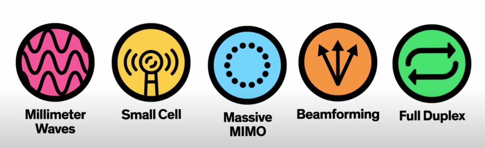
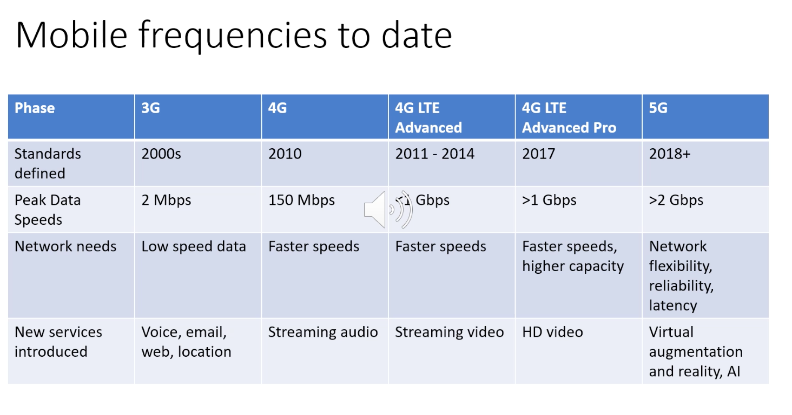

#### Main Topics

* In Lesson 1, we will focus upon the basics of Wireless communications and will examine:
    * Wireless technologies
    * Wireless security
* In lesson 2 we focus on wireless standards & concepts. Particular topics include:
    * Wireless standards
    * Wireless Antennas and APs
* In lesson 3, we focus on wireless security. We include the following:
    * Open and secured access
    * UK Mobile networks

#### Sub titles:

* [Cellular Wireless Technologies](#cellular-wireless-technologies)
   

# Cellular Wireless Technologies

 

* [Everything You Need to Know About 5G](https://www.youtube.com/watch?v=GEx_d0SjvS0)
* There are two parts to any cellular network – the access network and the core network.
* The increase of mobile wireless devices and their performance sit within the access network, and demands increase
  constantly.
* The core network, however, has been slower in comparison and more incremental.
* Whether the range of protocols in the IP will cope or address the needs of the changing architecture remains to be
  seen.
* The next generation of applications will have strict resource requirements and networks will need to work closely with
  application requirements. So, if the current TCP/IP protocols won’t suffice, what should the protocols be for 5G and
  the future?

## 5G

* It began in 2019 and it was designed to improve and provide speeds of a much higher throughput, and higher than 2
  Gigabits per second while simultaneously offering improved scale, latency, capacity and reliability.
* All 5G devices will have to have new hardware that's compatible.
* 5G is designed to provide higher speeds with improved capacity, scale, latency and reliability
* The bandwidth that is available within a spectrum determines the network performance available for users.
    * In low-band spectrum, bandwidth is typically limited so data rates tend to be low.
    * In mid-band and high-band spectrum, the available bandwidth can be many times greater thus data rates can be much
      higher and faster.
* The frequency spectrum has licensed and unlicensed sections where
    * The licensed bit is governmentally authorised, purchases at auctions and operator managed.
        * The managed nature reduces the interference significantly.
    * Unlicensed and are available for all to use freely, ie WiFi/microwave
* Low band frequent < 2.5 GHz (such as TV)
    * Allows for wide area coverage
    * Has the ability to penetrate buildings, works well indoors
    * Limited BW available
    * Leads to lower data rates and congestion
    * Nearly all freqs have been allocated
* Mid band (2,5 - 6 GHz)
    * Greater capacity and speed
    * Less congested
    * More freq available
    * Shorter range
    * Signal can not go through objects
    * Require signal enhancement
* High-band > 6 GHz
    * which is in some 5G solutions, operates in the range above 6 Gigahertz – but only for a few hundred metres,
        * and so it is largely used for fixed or low mobility users.
    * Offers high capacity and speed
    * Short-range, a few 100 meters
    * Fixed users
    * Dense due to distance
    * Smaller aerials due to limited range
* Multiple Input Multiple Output (MIMO)
    * Common for devices with many aerials to enhance connectivity and speed
    * Uses complex algorithms
    * MASSIVE MIMO is the key element of 5G
    * More aerials at the base station
    * Improves throughput
* The size of the aerial or antenna is dictated by the wavelength of the signal the aerial has to transmit or receive.
* Higher frequency bands have smaller wavelengths and vice versa.
* Because of the large number of aerials required for massive MIMO, high frequency bands are better of 2GHz and over.