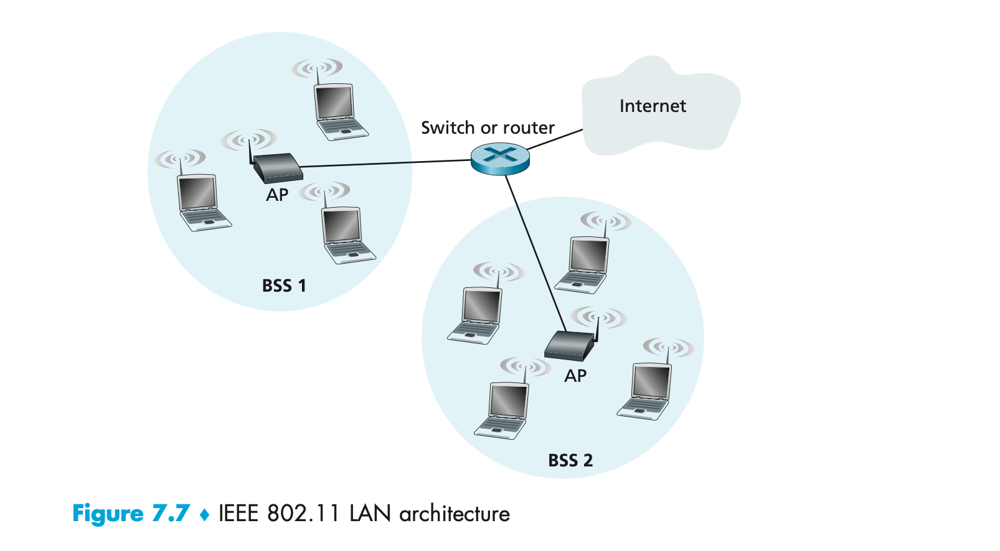

#### Main Topics

* In Lesson 1, we will focus upon the basics of Wireless communications and will examine:
    * Wireless technologies
    * Wireless security
* In lesson 2 we focus on wireless standards & concepts. Particular topics include:
    * Wireless standards
    * Wireless Antennas and APs
* In lesson 3, we focus on wireless security. We include the following:
    * Open and secured access
    * UK Mobile networks

#### Sub titles:

* [Cellular Wireless Technologies](#cellular-wireless-technologies)
    * [5G](#5g)
    * [IOT](#iot)
    * [802.11](#80211)
* [Wireless security](#wireless-security)
    * [Rogue APs](#rogue-aps)
    * [Ad Hoc Networks](#ad-hoc-networks)
    * [Denial of Service](#denial-of-service)
    * [Passive Attacks](#passive-attacks)
* [Questions](#questions)
* [802.11 Wireless standards](#80211-wireless-standards)
    * [Wireless Antennas](#wireless-antennas)
        * [Signal Degradation](#signal-degradation)
* [Wireless and Mobile Networks](#wireless-and-mobile-networks)
* [Open and secured access](#open-and-secured-access)
    * [UK Mobile Networks](#uk-mobile-networks)

# Cellular Wireless Technologies

 

* [Everything You Need to Know About 5G](https://www.youtube.com/watch?v=GEx_d0SjvS0)
   

* There are two parts to any cellular network – the access network and the core network.
* The increase of mobile wireless devices and their performance sit within the access network, and demands increase
  constantly.
* The core network, however, has been slower in comparison and more incremental.
* Whether the range of protocols in the IP will cope or address the needs of the changing architecture remains to be
  seen.
* The next generation of applications will have strict resource requirements and networks will need to work closely with
  application requirements. So, if the current TCP/IP protocols won’t suffice, what should the protocols be for 5G and
  the future?

## 5G

* It began in 2019 and it was designed to improve and provide speeds of a much higher throughput, and higher than 2
  Gigabits per second while simultaneously offering improved scale, latency, capacity and reliability.
* All 5G devices will have to have new hardware that's compatible.
* 5G is designed to provide higher speeds with improved capacity, scale, latency and reliability
* The bandwidth that is available within a spectrum determines the network performance available for users.
    * In low-band spectrum, bandwidth is typically limited so data rates tend to be low.
    * In mid-band and high-band spectrum, the available bandwidth can be many times greater thus data rates can be much
      higher and faster.
* The frequency spectrum has licensed and unlicensed sections where
    * The licensed bit is governmentally authorised, purchases at auctions and operator managed.
        * The managed nature reduces the interference significantly.
    * Unlicensed and are available for all to use freely, ie WiFi/microwave
* Low band frequent < 2.5 GHz (such as TV)
    * Allows for wide area coverage
    * Has the ability to penetrate buildings, works well indoors
    * Limited BW available
    * Leads to lower data rates and congestion
    * Nearly all freqs have been allocated
* Mid band (2,5 - 6 GHz)
    * Greater capacity and speed
    * Less congested
    * More freq available
    * Shorter range
    * Signal can not go through objects
    * Require signal enhancement
* High-band > 6 GHz
    * which is in some 5G solutions, operates in the range above 6 Gigahertz – but only for a few hundred metres,
        * and so it is largely used for fixed or low mobility users.
    * Offers high capacity and speed
    * Short-range, a few 100 meters
    * Fixed users
    * Dense due to distance
    * Smaller aerials due to limited range
* Multiple Input Multiple Output (MIMO)
    * Common for devices with many aerials to enhance connectivity and speed
    * Uses complex algorithms
    * MASSIVE MIMO is the key element of 5G
    * More aerials at the base station
    * Improves throughput
* The size of the aerial or antenna is dictated by the wavelength of the signal the aerial has to transmit or receive.
* Higher frequency bands have smaller wavelengths and vice versa.
* Because of the large number of aerials required for massive MIMO, high frequency bands are better of 2GHz and over.

## IOT

* Some of the technologies IoT devices rely on are
    * **Z-Wave -** It utilises a wifi mesh topology on the 900MHz ISM band which doesn't collide with the 802.11
      networks and doesn't require a license.
      *Technological devices such as the following home devices use this protocol: lighting control, security systems,
      thermostats, windows, locks, swimming pools and garage door openers.
    * **Ant+:** Another wireless protocol for monitoring sensor data such as a person’s heart rate or a bicycle’s tire
      pressure, and can be utilised for other activities such as control of systems like indoor lighting or a television
      set. ANT+ is designed and maintained and owned by Garmin.
    * **RFID:** Objects are given an RFID tag so that the object is uniquely identifiable and accessible wirelessly.
* Truly smart objects will be embedded with both an RFID tag and a sensor to measure data. The sensor may capture
  fluctuations in the surrounding temperature, changes in quantity, or other types of information.
* The rationale for 5G was to create ways to monitor performance and assure the quality of service (QoS).
* Compared with previous generations of wireless communications the 5G technology expands the broadband capability of
  mobile networks to provide specific capabilities and the IoT
* Digital transformation will introduce further dimensions in the forms of attacks, values and vulnerabilities and raise
  issues such as security, safety and robustness.

## 802.11

 

* The AP Access point in a wireless scenario is a bridge and also reach a point.
* It works on a star basis more than a mesh.
* All 802.11 MAC frames fall under one of the three types: management, control, or data.
* Management frames are used to manage the BSS. This includes probing, associating, roaming, and disconnecting clients
  from the BSS.
    * Stations send association requests to access points (APs) requesting to join the BSS. In this frame, the station
      sends all its capabilities to the AP; it will only include capabilities that the AP has also advertised in the
      beacon or probe response frame. The AP responds to the station using an association response frame that includes
      an association ID (AID). Each station within the BSS has a unique AID.
    * Stations send reassociation requests to APs that wish to roam to. The primary difference between reassociation and
      association requests is that the station will indicate the current AP it is connected to as well. If the station
      does not receive a reassociation response, ie due to load balancing, it will remain connected to the original AP
      and search for other APs.
    * As part of the active and passive scanning processes, stations send probe requests with a specific SSID, wildcard,
      or no value (null) in the “SSID Parameter Set” field to search for wireless networks. When the field is
      wildcard/null, the client is requesting any AP nearby to respond with all SSIDs using a probe response frame. When
      it contains a specific SSID, the client is requesting any AP nearby to respond if they support that SSID.
    * APs send beacons at a regular interval called the target beacon transmit time (TBTT) to advertise the SSIDs they
      service.
    * Authentication frames are used to join the BSS as part of the open system authentication process.
    * A type of management frame sent from either the station or the AP. Disassociation frames are used to terminate the
      station’s association; it is a notification and does not expect a response.
    * Deauthentication frames are used to reset the state machine for an associated client. The authentication process
      takes place prior to association therefore, if a station is deauthenticated, it is also disassociated.

* Control frames are used to control access to the medium and are used for frame acknowledgement. Control frames only
  contain a header and trailer.
    * PS-Poll frames are used in the legacy 802.11-1997 power save method to request frames buffered on the AP while the
      client was sleeping.
    * Other subtypes include RTS, CTS, ACK, CF-END, CF-END+CF-ACK
* Terminology
    * AP: Access Point
    * STA: Station. Each AP has a station associated with it too.
    * BSS: Basic Service Set where multiple STAs are connected to an AP.
    * IBSS: Independent BSS where the BSS isn't linked to any other BSS.
    * ESS: An extended service set is a wireless network, created by multiple access points, which appears to users as a
      single, seamless network
    * DS: A distributed system where a central point, ie a router, connects multiple BSSs.

# Wireless security

## Rogue APs

* APs that have been connected to your wired infrastructure without your knowledge are rogue AP’s. This may have been
  intentional or unintentional, an innocent member of staff who wanted access to the wifi or less innocently by a
  hacker, this would likely have some sinister intent.
* This is achieved by someone placing their AP on a different channel from your legitimate AP and then setting the SSID
  in the convention that yours is set.
* Wireless clients identify the network by SSID, not the MAC address or the IP address of the AP so this is a simple way
  to jam the channel that your AP is on.
* With the right DHCP software the hacker can issue clients an IP address and then they have theoretically ‘kidnapped’
  all your clients over to their network and can perform peer-to-peer attacks.
* Mitigation
    * A method to keep rogue APs out of the wireless network is to employ a wireless LAN controller (WLC) to manage your
      APs.
    * APs and controllers communicate using Lightweight Access Point Protocol (LWAPP) or the newer CAPWAP, and one of
      the message types they share is called Radio Resource Management (RRM).
    * Essentially, your APs monitor all channels by momentarily switching from their configured channel and by
      collecting packets to check for rogue activity.
    * If an AP is detected that isn’t usually managed by the controller, it’s classified as a rogue, and if a wireless
      control system is in use, that rogue can be plotted and located.

## Ad Hoc Networks

* Ad hoc networks are created peer to peer or directly between stations and not through an AP.
* This can be a dangerous configuration because there’s no corporate security in place, and since these networks are
  often created by unsophisticated users which can result in a peer-to-peer attack.
* Mitigation
    * With certain networks and hardware (Cisco for example) ad hoc networks can be identified over the air by the type
      of frames they send, which are different from those belonging to an infrastructure network.
    * When these frames are identified, the network can prevent harmful intrusions by sending out something known as
      de-authentication frames to keep your stations from associating via ad hoc mode.

## Denial of Service

* Sometimes the hacker just wants to cause some major network grief as opposed to stealing data, this can be done by
  jamming the frequency where your WLAN resides to cause a complete interruption/disruption of service (DOS) until the
  jamming signal is traced and disabled. This type of assault is known as a denial of service (DoS) attack.
* Mitigation
    * To deal with DOS attacks where someone is jamming the frequency, there is little you can do.
    * However, many DoS, man-in-the-middle, and penetration attacks operate by de-authenticating, or disassociating,
      stations from their networks.
    * Some DoS attacks take the form of simply flooding the wireless network with probe or ping requests or association
      frames, which effectively overwhelms the network and makes it unavailable for normal transmissions.
    * These types of management frames are sent unauthenticated and unencrypted.
    * Since de-authentication and disassociation frames are classified as management frames, the Management Frame
      Protection (MFP) mechanism can be used to prevent the attack.
* There are two types of MFP you can use, referred to as infrastructure and client.
    * Infrastructure Mode: This requires configuration on the AP. Wireless LAN Controllers (CISCO) generate a specific
      signature for each WLAN, which is added to each management frame it sends, and any attempt to alter this is
      detected by the Message Integrity Check (MIC) in the frame.
        * Therefore, when an AP receives a management frame from an unknown SSID, it reports the event to the controller
          and an alarm is generated.
    * Client Mode: Often rogue APs attempt to impersonate the company AP. With client MFP, all management frames between
      the APs and the stations are protected because clients can detect and drop spoofed or invalid management frames.

## Passive Attacks

* Passive attacks usually involve wireless sniffing. During a passive attack, the hacker captures large amounts of raw
  frames to analyse online with sniffing software to try to discover a key and decrypt it “on the fly.”
* Mitigation
    * In addition to the corporate tools already described, you can use an intrusion detection system (IDS) or an
      intrusion protection system (IPS) to guard against passive attacks:
        * IDS - An intrusion detection system (IDS) is used to detect several types of malicious behaviours which can
          include network attacks against vulnerable services; data-driven attacks on applications; host-based attacks
          like privilege escalation; unauthorized logins; access to sensitive files; and malware like viruses, Trojan
          horses, and worms.
        * IPS - An intrusion prevention system (IPS) is a computer security device that monitors network and/or system
          activities for malicious or unwanted behaviour and can react, in real time, to block or prevent those
          activities. For example, a network-based IPS will operate inline to monitor all network traffic.

# Questions:

* If a node has a wireless connection to the Internet, does that ode have to be mobile? Explain. Suppose that a user
  with a laptop walks around her house with her laptop, and always accesses the Internet through the same access point.
  Is this user mobile from a Network standpoint? explain your answer.?
    * No. A node can remain connected to the same access point throughout its connection to the Internet (hence, not be
      mobile). A mobile node is the one that changes its point of attachment into the network over time. Since the user
      is always accessing the Internet through the same access point, she is not mobile.
* Consider a TCP connection going over Mobile IP. True or False : The TCP connection phase between the correspondent and
  the mobile host goes through the mobiles home network, but the data transfer phase is directly between the
  correspondent and the mobile host, bypassing the home network..
    * False
* In mobile IP, what effect will mobility have on end-to-end delays of datagram between the source and destination?
    * Because datagrams must be first forward to the home agent, and from there to the mobile, the delays will generally
      be longer than via direct routing. Note that it is possible, however, that the direct delay from the correspondent
      to the mobile (i.e., if the datagram is not routed through the home agent) could actually be smaller than the sum
      of the delay from the correspondent to the home agent and from there to the mobile. It would depend on the delays
      on these various path segments. Note that indirect routing also adds a home agent processing (e.g., encapsulation)
      delay.
* Consider two mobile devices in a foreign network having a foreign agent. Is it possible for the two mobile nodes to
  use the same care-of-address in mobile IP? Explain your answer.
    * Two mobiles could certainly have the same care-of-address in the same visited network. Indeed, if the
      care-of-address is the address of the foreign agent, then this address would be the same. Once the foreign agent
      decapsulates the tunneled datagram and determines the address of the mobile, then separate addresses would need to
      be used to send the datagrams separately to their different destinations (mobiles) within the visited network.
* What are the differences between the following types of wireless channel impairments : path loss, multipath
  propagation, interference from other sources?
    * Path loss is due to the attenuation of the electromagnetic signal when it travels through matter. Multipath
      propagation results in blurring of the received signal at the receiver and occurs when portions of the
      electromagnetic wave reflect off objects and ground, taking paths of different lengths between a sender and
      receiver. Interference from other sources occurs when the other source is also transmitting in the same frequency
      range as the wireless network.

# 802.11 Wireless standards

* Wifi signals are two-way communications and are referred to as half-duplex.
* WLANS use RFs that are transmitted from the antennas in the air creating radio waves.
* These can then be absorbed, refracted or reflected by walls, water and metal surfaces resulting in low signal
  strength.
* Increasing the transmitting power, you can gain transmission distance but will suffer from heavy distortion.
* By using the higher frequencies you get better data rates but at a decreased distance.
* Using a lower frequency gives you slower speeds but of a greater distance.

## Wireless Antennas

* Wireless antennas act as both transmitters and receivers.
* There are two classes of antennas on the market today:  Omnidirectional (or point-to-multipoint) and directional, or
  Yagi (point-to-point).
    * Yagi antennas usually provide a greater range than Omni antennas of equivalent gain, because Yagis focus all their
      power in a single direction, whereas Omnis must disperse the same amount of power in all directions at the same
      time.
* A downside to using a directional antenna is that you’ve got to be much more precise when aligning communication
  points. Try and think about car aerials and how they transmit and receive.

### Signal Degradation

* Signal strength can vary according to many factors. The weaker the signal, the less reliable the connection. Factors
  are;
    * Distance - The farther away from the WAP you are, the weaker the signal. Most APs have a very limited maximum
      range that equals less than 100 meters for most systems. You can extend this range to some degree using amplifiers
      or repeaters, or even by using different antennas.
    * Barriers, ie walls - The more walls and other barriers a wireless signal has to pass through, the more
      attenuated (reduced) the signal becomes. Also, the thicker the wall, the more it interrupts the signal.
    * Protocols Used - The various wireless 802.11 protocols have different maximum ranges. As discussed earlier, the
      maximum effective range varies depending on the 802.11 protocol used.
    * Interference - Because 802.11 wireless protocols operate in the 900 MHz, 2.4 GHz, and 5 GHz ranges, interference
      can come from many sources. These include wireless devices like Bluetooth, cordless telephones, mobile phones, car
      remotes, other wireless LANs, and any other device that transmits a radio frequency (RF) near the frequency bands
      that 802.11 protocols use. Even microwave ovens—a huge adversary of 802.11b and 802.11g.

# Wireless and Mobile Networks

* wireless (mobile) phone subscribers now exceeds # wired phone subscribers (5-to-1)!
* wireless Internet-connected devices equals wireline Internet-connected devices
    * laptops, Internet-enabled phones promise anytime untethered Internet access✦two important (but different)
      challenges

* wireless:communication over wireless link
* mobility:handling the mobile user who changes point of attachment to network

* wireless hosts
    * laptop, smartphone
    * run applications
    * may be stationary (non-mobile) or mobile
    * wireless does notalways mean mobility
* base stations:
    * typically connected to wired network
    * relay - responsible for sending packets between wired network and wireless host(s) in its “area”
        * e.g., cell towers, 802.11 access points
* Wireless link
    * typically used to connect mobile(s) to base station
    * also used as backbone link
    * multiple access protocol coordinates link access various data rates, transmission distance

* Wireless network taxonomy
    * single hop:
        * infrastructure(e.g., APs): host connects to base station (WiFi,WiMAX, cellular) which connects to larger
          Internet
        * noinfrastructure: no base station, noconnection to larger Internet (Bluetooth, ad hoc nets)
    * multiple hop:
        * infrastructure(e.g., APs): host may have torelay through severalwireless nodes to connect to larger Internet:
          mesh net
        * noinfrastructure: no base station, noconnection to larger Internet. May have torelay to reach other a given
          wireless nodeMANET, VANET

* Wireless Link Characteristics
    * differences from wired link
        * decreased signal strength: radio signal attenuates as it propagates through matter (path loss)
        * interference from other sources: standardized wireless network frequencies (e.g., 2.4 GHz) shared by other
          devices (e.g., phone); devices (motors) interfere as well
        * multipath propagation: radio signal reflects off objects ground, arriving ad destination at slightly different
          times
    * make communication across (even a point to point) wireless link much more “difficult”
    * SNR: signal-to-noise ratio✦larger SNR – easier to extract signal from noise (a “good thing”)
    * SNR versus BER tradeoffs
        * given physical layer: increase power -> increase SNR->decrease BER
        * given SNR: choose physical layer that meets BER requirement, giving highest thruput
        * SNR may change with mobility: dynamically adapt physical layer (modulation technique, rate)
* Here is the PP presentation : [Presentation](./doc/6/wireless and cellular networks.pptx)

# Open and secured access

* “open-access” mode is where all the security features of a wireless device, ie a router, turned off for ease of
  initial connection and setup. This mode isn't suggested either for businesses or even homes.
* 802.11 basic security includes the use of SSIDs, open or shared-key authentication, static WEP, and optional Media
  Access Control (MAC) authentication/MAC filtering.
* Remote Authentication Dial-In User Service (RADIUS) is a networking protocol that offers several security benefits:
  authorisation, centralised access, and a record of the users and/or computers that connect to and access our networks’
  services.
    * The provision of authentication, authorisation, and accounting is called AAA, or “triple A,” and it’s part of the
      IEEE 802.1X security standard.
* Hackers uncovered ways to break through WEP’s defences and that's why IEEE came up with Temporal Key Integrity
  Protocol, TKIP, which envelopes the pre-existing WEP encryption key and upgrades it to a much more of impenetrable
  128-bit encryption.
    * TKIP also has the advantage in that it actually changes each packet’s key. Packet keys are made up of three
      things: a base key, the transmitting device’s MAC address, and the packet’s serial number.
    * Each packet is now uniquely identified, the collision attacks that used to happen using WEP are cancelled. Part of
      the packet’s serial number is also the initialisation vector, prevents something called replay attacks. So,
      replaying packets from some past wireless connection will not happen; those “recycled” packets won’t be in.¬
* Extensible Authentication Protocol (EAP) is used by WPA2 for authentication and is a framework that includes the
  802.1X framework.
    * Certificates used for credentials during authentication is an EAP method and you must have Public Key
      Infrastructure (
      PKI) in your network which means that a certificate server to issue these certificates must be in place. The
      certificate consists of a public and private key pair which are installed on all devices and renewed regularly.
      This is called assymetric because different keys are used for encryption and decryption.
    * Using certificates as a means of identifying the device or the user is considered the highest form of
      authentication and authorisation when compared to names and passwords.
* EAP - Extensible Authentication Protocol (EAP) is a framework for port-based access control that uses the same three
  components that are used in RADIUS and can include certificates, a PKI, or simple passwords.
* PEAP - Protected Extensible Authentication Protocol, also known as Protected EAP or simply PEAP, is a protocol that
  encapsulates the Extensible Authentication Protocol (EAP) within an encrypted and authenticated Transport Layer
  Security (TLS) tunnel. It requires only a server-side PKI certificate to create a secure TLS tunnel to protect user
  authentication.
* EAP-FAST - EAP-FAST works in two stages. In the first stage, a TLS tunnel is established. Unlike PEAP, however,
  EAP-FAST’s first stage is established by using a pre-shared key called a Protected Authentication Credential (PAC)
    * In the second stage, a series of type/ length/value (TLV)-encoded data is used to carry user authentication.
* EAP Transport Layer Security (EAP-TLS) is the most secure method, but it’s also the most difficult to configure and
  maintain. To use EAP-TLS, you must install a certificate on both the authentication server and the client. An
  authentication server pair of keys and a client pair of keys need to be generated first, signed using a PKI, and
  installed on the devices. On the station side, the keys can be issued for the machine itself and/or for the user. * In
  the authentication stage, the station, along with the authentication server (RADIUS, etc.), exchange certificates and
  identify each other. Mutual authentication is a solid beneficial feature, which ensures that the station it’s
  communicating with is the proper authentication server. After this process is completed, random session keys are
  created for encryption. * Finally, a pre-shared key can be used to secure wireless transmissions. This is the most
  labour intensive as it requires that all devices use the same key as the AP and that the keys be changed frequently to
  provide adequate security.

## UK Mobile Networks

* There are only four main corporations in the UK mobile phone network: EE, 02, Three and Vodaphone. All others are
  piggy-backed off these.
* The following technologies exist:
    * GSM - Global System Mobile (GSM) is a type of cellphone that contains a Subscriber Identity Module (SIM) chip.
      These chips contain all the information about the subscriber and must be present in the phone for it to function.
      One of the dangers with these phones is cell phone cloning, a process where copies of the SIM chip are made,
      allowing another user to make calls as the original user. Secret key cryptography is used (using a common secret
      key) when authentication is performed between the phone and the network.
    * FDMA - Frequency Division Multiple Access (FDMA) is one of the modulation techniques used in cellular wireless
      networks. It divides the frequency range into bands and assigns a band to each subscriber. This was used in 1G
      cellular networks.
    * TDMA - Time Division Multiple Access (TDMA) increases the speed over FDMA by dividing the channels into time slots
      and assigning slots to calls. This also helps to prevent eavesdropping in calls.
    * CDMA - Code Division Multiple Access (CDMA) assigns a unique code to each call or transmission and spreads the
      data across the spectrum, allowing a call to make use of all frequencies.

# QUIZ

* What is the frequency range of the IEEE 801.11g standard?
    * 5GHz
* Why would you use WPA instead of WEP 2?
    * The values of WPA keys can change dynamically while the system is used.
* The IEEE 802.11b/g basic standard has how many non-overlapping channels?
    * 3
* AP's come set up with what type of security enabled by default?
    * none
* What is the maximum data rate for 802.11b standard?
    * 11Mbps
* You connect a new host to your wireless network. The host is set to receive a DHCP address and the WEP key is entered
  correctly, however the host cannot connect to the network. What might e problem be?
    * MAC filtering is enabled on the AP

# TODO:

* No read Chapter 8, Section 8.6 "Securing TCP Connections: SSL", in ethier edition of Computer Networking: A Top Down
  Approach that examines how cryptography can enhance TCP with security services, including confidential ity, data
  integrity, and end-point authentication.

* READ
    * Chapter 6, Section 6.3.2 (6th Ed.) "The 802.11 Mac Protocol" or Chapter 7, Section 7.3.2 (7th Ed.)
    * Chapter 6 Section 6.3.3. (6th Ed.) "The IEEE 802.11 Frame" or Chapter 7, Section 7.3.3 (7th Ed.)
      of Computer Networking: A Top Down Approach on the 802.11
    * Chapter 6, Section 6.5.2 (6th Ed.) "Routing to a Mobile Node" or Chapter 7, Section 7.5.2 (7th Ed.), of Computer
      Networking: A Top Down Approach on direct routing to a mobile node.

* Additional readings
    * [CDMA vs. GSM: What's the Difference?](https://uk.pcmag.com/old-wireless-carriers/11593/cdma-vs-gsm-whats-the-difference)
    * [Cellular Networks and Technology](https://www.ofcom.org.uk/spectrum/information/cellular-networks-and-technology)
    * [Fundamentals of Communications Access Technologies: FDMA, TDMA, CDMA, OFDMA, AND SDMA](https://www.electronicdesign.com/technologies/communications/article/21802209/electronic-design-fundamentals-of-communications-access-technologies-fdma-tdma-cdma-ofdma-and-sdma)