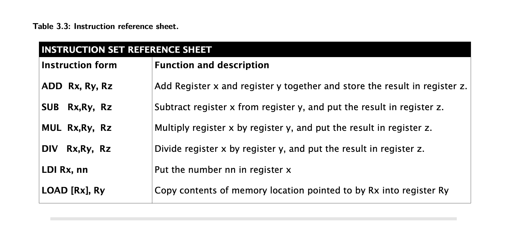
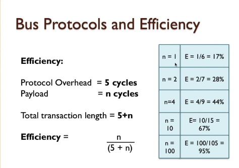
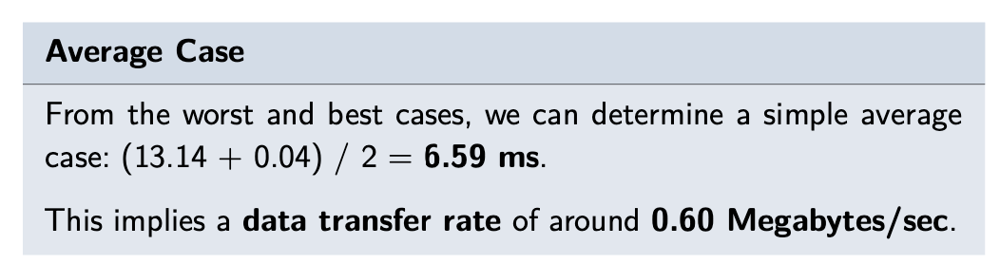
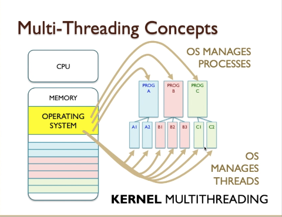
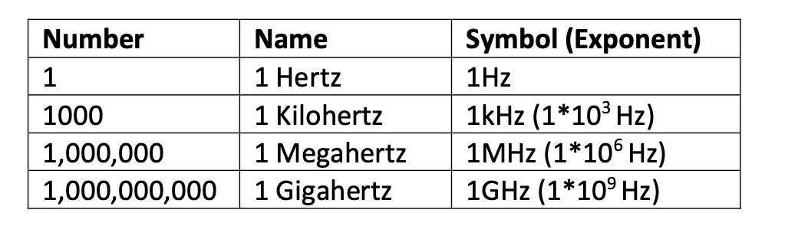

## MSC Algorithm and Data Structure Lesson Notes

This module is for MSC Algorithm and Data Structure lesson notes.

TBC

## Overview

* [Week 1](#week-1): hardware fundamentals which is a complete model of computer architecture in terms of hardware and
  operating system.
* [Week 2](#week-2): Computer memory with focusing types of memories, capabilities and performance
* [Week 3](#week-3): Component of systems and how they work together to make up a complete system - Building the system
    - busses and components
* [Week 4](#week-4) and [Week 5](#week-5): Exploring the nature of computer systems with the investigation of the
  operating systems, how they manage workload and maximise efficiency and their role on memory and storage management.
* [Week 6](#week-6): Basic principle of computer network from hardware and operating system perspective
* [Week 7](#week-7): Review of security and resilience issues of computer systems.

# WEEK 1

* [Fundamentals](#fundamentals)
    * [John von Neumann Model](#john-von-neumann-model)
        * [John von Neumann Model Bottleneck](#john-von-neumann-model-bottleneck)
    * [Clock signals](#clock-signals)
    * [Software view point](#software-view-point)
    * [Electronics](#electronics)
        * [Speed versus complexity](#speed-versus-complexity)
* [Processors: the heart of the machine.](#processors-the-heart-of-the-machine)
    * [Heat and power constraints](#heat-and-power-constraints)
    * [CPU architecture](#cpu-architecture)
    * [Beating the performance barrier](#beating-the-performance-barrier)
    * [Processor frequency](#processor-frequency)
        * [Scalar execution model](#scalar-execution-model)
        * [Pipelining](#pipelining)
        * [Superscalar execution model](#superscalar-execution-model)
        * [Data flow analysis](#data-flow-analysis)
        * [Branch Prediction](#branch-prediction)
        * [Speculative execution](#speculative-execution)
    * [Performance Balance](#performance-balance)
    * [Instruction micro-sequencing](#instruction-micro-sequencing)
    * [Introduction to Pipelining](#introduction-to-pipelining)
* [Terminology of Instructions](#terminology-of-instructions)
* [Computers Everywhere](#computers-everywhere)
    * [General purpose computers](#general-purpose-computers)
    * [Embedded Systems](#embedded-systems)
    * [Mainframes and supercomputers](#mainframes-and-supercomputers)
    * [Ambdal's Law](#ambdals-law)

# Fundamentals

* **Power**: Electrical power consumed by computer component or system often measured in Watt(W), milliWat(mW)(1x10^-3),
  microWat(
  uW)(1x10^-6) and nanoWat(nW)(1x10^-9)
* **Frequency**: how often given activities happen in any one second.
    * In computer system it refers to a basic operating cycle called a clock cycle.
    * The basic measure of frequency is Hertz(Hz).
    * Most computer works in high frequencies thats why MegaHertz(MHz) or Gigahertz(GHz) are using as normal units of
      measurement for computer.
* **Clock** : is a repetitive signal which alternates between binary zero and one, and provides a synchronising
  capability
  for system components.
* **Clock Cycle**: The frequency of activities is typically regulated by a **clock signal** and this repeative pulse
  dictates each event cycle and operates of frequency of event.
* **Data Capacity**: The number of data items a device or system can manage or store.
    * Data capacity is large multiples of bytes and bits that's why binary measurement units are using.
* **Data Rate**: The quantity of data can be transfer one point to another in a given amount of time mostly one second.
    * For example 100 milion bytes per second = 95.3 binary Megabytes/sec
* A bit is single binary value
    * 1 byte = 8 bit
    * 1 kilobyte(KB) = 1024 byte
    * 1 megabyte(MB) = 1024 KB
    * 1 gigabyte(GB) = 1024 MB
    * 1 terrabyte(TB) = 1024 GB
* MB to denote megabytes, and Mb to denote megabits.
* since the standard scientific units of kilo, mega, giga, etc are more generally based upon decimal powers 10^3, 10^6,
  10^9, etc. However, the binary version of these units correspond to 2^10, 2^20, 2^30 giving slightly different values.
    * A binary megabyte for example is 1,048,576 bytes, and a million bytes is 95.3 binary Megabytes^!.

* General purpose Computers: They are design to perform adequately across a wide range of uses, but they are rarely
  optimal in any of those cases.
* Application Specific Computers: They are designed to be highly efficient on a defined task to be achieve a high
  performance on the task. This computers are the cost effective versions of the general computers.
* A very simple computer system, as a first-order model, might be presented 2.3 Block diagram

## John von Neumann Model

* This is a key concept of the computer architecture proposed by John von Neumann 1945
* Most frequently used model for computer systems ever since.
* CPU, Memory andIO devices, those are the three essential components in Neumann architecture.
* A **bus** is a collection of wires that provide data and control signals and possibly addresses.
  Multiple devices are connected to a bus and can communicate with other devices via this connection.
    * Busses allow many devices to share one communication route for Information. However, it is important to note
      that only one device can control the bus at atime (the bus master).
* A **CPU** - Central Processing Unit is a digital electronic circuit built from many transistors. It can hold a small
  amount of temporary data and perform mathematical operations upon them. A CPU can also sequence operations according
  to a program it reads from memory, step by step.
    * it means :  a CPU performs a sequence of (often mathematical) operations upon temporary data it holds, and this
      sequence is dictated by a program found in memory.
    * this component better as the Processor,this is the component that does most of the hard work – the computations,
      the data translations and executes the program code in your computer when its running programs.
    * In the simplest computer system, all devices connect to a system bus, the CPU is always the bus master, and all
      devices appear as if they are part of the visible memory of the computer system. This allows for very
      straightforward programming models to access devices and modules within the system, though not necessarily
      the most optimal performance.
    * Extended definition of CPU:
        * A CPU is a digital electronic circuit, manufactured from a silicon technology defined as being at one
          particular technology node, consuming a certain amount of power, and generating a certain amount of heat
          during its operation
        * A CPU fetches program instructions from memory using a concept known as the **fetch-execute cycle**,
          and as each instruction is fetched, it is executed, performing one of a number of possible operations upon
          data held within the CPU registers.
        * These operations include mathematical and logical operations, and operations that change the flow of the
          program to execute parts chosen by the result of testing conditions encountered
          during a program sequence.
* Memory System and this is where data items can be stored as numerical values and this is where instruction code from
  the processor can be stored, also as numerical values.
* IO ( Input, Output ) interface is essentially mechanisms that allow devices to plug into the computer.
    * for example, a keyboard is an input device, and a video screen is an output device


### John von Neumann Model Bottleneck

* Having a single bus creates the problem that's known as the von Neumann/Princeton bottleneck that limits the number of
  devices that can use the bus at a given time to 2. Other devices have to wait and this leads to running the jobs in
  serial and costs time.
* If a CPU wishes to fetch data from memory, it cannot also fetch an instruction from memory at the same time.
* Likewise, if an IO device was capable of accessing memory directly then it would similarly be prevented from doing so
  whenever the CPU was already accessing memory. This constraint, due to many devices wanting to use one shared bus, is
  known as the von Neumann bottleneck.
* There are some alternatives to prevent this problem:
    * Harvard Architecture addresses this by utilising 2 different busses, one for the program memory and one for the
      data memory & IO. So, fetch and decode/execute can happen in parallel, ie pipelined. This permits instructions and
      data to be accessed simultaneously, permitting a speed gain.
    * Another potential solution is using an on-chip cache which reduces the CPU's access to code and data memory and
      frees up the bus for other peripherals.

## Clock signals

* In computer systems binary signals have two states, these are usually represented
  by voltages so something near to zero volts would be a zero in binary and a signal which has a higher value,
  typically 1.8 volts or 3.3 volts, would represent a logic “1” so a clock signal is actually just a
  signal whose voltage turns on and off repeatedly over a period of time.
* Over a period of time that a number of clock signals can be fitted into a period, so we’d
  expect that a clock signal turns on, turns off again and that will repeat and that will repeat
  , and that would repeat again and this repetitive behaviour is what a **clock signal**
  essentially does.
  
* Clock cycle is showing with blue line.
* That is the basic definition of a **clock** – a rising edge (zero to one) and a falling edge (one to zero) – and these
  edges are what we
  use to synchronise events in the clock signal regime in a computer system.
* It turns out that one of those on-off transitions is what we refer to as one clock cycle,
* so when we talk about a clock cycle we’re talking about a complete process of going from zero to one and then back to
  zero again before it repeats.
  
* we can also define that clock cycle in terms of a clock period, so this takes a certain amount of time, so there’s an
  amount of time “t”, typically in milliseconds or microseconds or nanoseconds in a clock system, and that value t
  represents a period of time - the clock period.
* If t was 0.01 seconds, which is 10 milliseconds, then f, by virtue of the formula we have just discussed, would be 1
  divided by 0.01, which equals 100 Hertz.
    * be referred to as “cycles per second”

## Software view point

* software is a series of instructions relating to a complex set of actions to be performed by a digital circuit (the
  CPU) and rather than manipulating threads of cotton, we manipulate data values.
* we can divide software into **source code**, which is in some way intelligible to a human, and **machine code**, which
  is
  nothing more than a series of binary numbers, and rarely understood by visual inspection by a programmer.
* In modern computing, there are 2 **high-level languages, HLL**
    * **Compiled** where the source code is compiled by a compiler that automatically converts high-level statements
      into low-level machine code.
    * **Interpreted** approach, translates source code written a high-level language interactively and executes a
      pre-defined piece of low-level code for each statement.
    * Writing the code directly in the **assembly** language, is the 3rd option, where the textual representation of
      each instruction is used.
* [Compiler vs Interpreter](https://www.youtube.com/watch?v=e4ax90XmUBc)

## Electronics

* **Transistors**: Invented in the late 1950's, a transistor is a kind of switch,at least as far as digital electronics
  is
  concerned ,and when properly used they can operate in a binary signalling regime
  (on and off, one and zero).
* **Transistor Operation**: A simplified description of transistor behaviour in switching mode might be as follows:
  Atypical transistor uses a control signal (the Gate) to control the flow of a signal from the input (the Source) to
  the output (the
  Drain). However, multiple transistors can be combined to create logical switching functions.
* **Logical Operation**: Imagine that our Gate control signal can switch from zero to one, and by combining two
  transistors
  in the right way, we can create a switching arrangement that produces corresponding outputs one and zero. That is to
  say, the
  output is the opposite of the input. This is known as an inverter, or a logical NOT operation: the simplest logic
  gate.
  The output is NOT the input, if you wish to think of it in those terms.
* **AND and OR**: We can also combine transistors in such away that they create gates with two inputs. Then the circuit
  can
  be arranged such that a signal output can only be binary one when both inputs are one (the AND gate function, where
  input-a AND input-b must both be one at the same time to generate an output of one)
  .Likewise,as lightly different arrangement causes the circuit to generate a one If either input is one (generates one
  if input-a OR input-b are one), creating an OR gate.

* The behaviour of three very simple logic functions with the definitions of **AND, OR,** and **NOT**.
* These circuits are referred to as **logic gates**. So we typically talk about the **AND gate, the OR gate, and the NOT
  gate** (or Just an inverter). A further gate, the **XOR gate** performs an exclusive or function, where an output is
  one only when anyone (but not both) inputs are one.
* truth tables:
  
* Mixtures of these eight logic (AND, OR, NOT, XOP, NAND, NOR, NEXOR(XNOR), buffer) gates can also be combined into more
  complex circuits, including circuits that add binary bits together (arithmetic), or perform other mathematical
  operations such as multiplying, comparing, and so on. These circuits are called **combinational circuits**.

### Speed versus complexity

* All of these logic gates and logic circuits **consume power** and **generate heat**
* Making the clock signal faster, makes the system operate faster. However, as the circuit gets more complex, each layer
  introduces an additional delay and the clock cannot go faster than the circuit can handle. This is known as the
  **speed vs complexity** dilemma.
* To overcome this, multicore CPUs came to life. Instead of trying to push the CPU to get faster and faster, multiple
  CPU are arranged in parallel. This way, complexity still increases but the operations are allowed to happen in
  parallel.
  
* Circuit (b) is more complex, and slower, than circuit (a). Intuitively you might also expect circuit (c) to have
  increased delay compared to (b). After all, circuit (c) is certainly more complex than circuit (b). Whilst it
  is true that increased complexity often, even typically, causes increased delay, it is sometimes possible to have more
  gates but not slow down the circuitry. Indeed, in circuit (c) what we have done is use parallelism, because there are
  actually two separate circuits operating side by side. This is a key principle underlying the idea of multicore
  processor
* The industry transition from the Complex Instruction Set Computers (CISC) to the Reduced Instruction Set Computers (
  RISC), reduced ISC, mentality. This helps because CISC had a lot of instructions that were rarely and ineffectively
  used. However, CISC processors still find applications in areas where specialised instructions are required to carry
  out hardware-accelerated jobs, ie image processing.

# Processors: the heart of the machine.

* Since the mid 1970's, the vast majority of computer systems have been built around a key component: the single-chip
  microprocessor.
* Prior to this time, computer systems were almost always built from a large number of discrete components.
* These were often individual transistors in small metal canisters, or very simple digital logic components implemented
  individually as very simple logic chips also known **integrated circuits.**
* But even further back, computer circuits were built from radio valves filling hundreds of racks, and a multitude of
  cabinets.

## Heat and power constraints

* Every time a transistor switches on or off, it consumes some power, known as **dynamic power**.
* The faster the on-off transitions occur, the more power is consumed.
* And what happens to all of this power? when a circuit consumes
  energy,one of the unwanted by-products is **heat**.
* Incidentally, silicon chips also consume power when the transistors are idle, like a car motor ticking over whilst
  waiting at a road junction. This is known as **static power**.
* As Moore's Lawl has predicted successfully for many decades, the number of transistors on a given chip area doubles
  every two years.
* In 20 years, the size required to fit a transistor dropped from 1um to 10nm.
    * This dimension is known as the feature size.
    * Each incremental advance in silicon technology is called the technology node.
* Although transistors get smaller and smaller, designers want to use more and more transistors per chip, and those
  transistors operate faster too. The complexity of processors is thus an ever-increasing feature of computing.
* Where we have smaller circuits consuming more power and thus generating more heat we can say that **power density**
  and then **thermal density** increases. This is recognised as a serious problem. This is why a modern processor system
  is
  often cooled by a large heat¬sink. a module designed to draw heat away from the processor so that it does not
  overheat.
* 

## CPU architecture

* **instructions** are different computational operations performing by CPU
* Some characteristics of instructions
    * Data Is held in temporary storage components within the CPU, called **registers**. Instructions operate upon these
      register contents.
    * Many operations are directly mathematical: add, subtract, multiply, divide, and so on.
    * Some of these instructions operate only on integers (whole numbers) whilst other operations may be able to act
      upon floating
      point or fixed point numbers. Not all processors support both kinds of computation.
    * Some instructions are logical operations. These perform boolean **logic operations** on data.
    * Some instructions transfer data to and from memory. These are known as **Load/Store operations**.
    * Some instructions test conditions and choose which part of the program to execute next.
* Execution means: A program consists of a number of instructions, and a CPU executes (performs) each instruction in
  turn.
* In order to execute an instruction, the CPU must first **fetch** it from memory, where our program is usually stored.
    * Fetching an instruction, and then executing it, is known as the **fetch-execute cycle**.
* **linear program sequence**: execution of CPU one instruction after another in a continuous list,
* **Program-flow instructions**: Some Instructions test conditions and choose what part of the program to execute next'.
    * The flow of a fetch-execute cycle sequence, as it moves through memory, is generally **non-linear** (more
      accurately it is linear for short sequences), interspersed with a number of Jumps to other parts of the memory
      where the next short linear sequence is located.
    * Program-flow instructions are therefore frequently encountered.

## Beating the performance barrier

* Performance is the achievement of certain goals whilst consuming certain resources.
    * Another way to express this is cost versus benefit or cost-benefit.
    * We sometimes refer to this as a performance metric.
* **mips** is simply millions of instructions per second,a simplistic measure of the computational throughput a
  processor Is capable of.
* **peak mips**, which measures the maximum possible mips a processor can achieve under the best possible conditions
    * Often when we talk of billions of instructions per second, it is common to use GOPS and GFLOPS (Giga-operations
      per second, and Giga floating-point operations per second), and these can also be peak measures in some cases.
* Example for cost measurements:
    * A given CPU can execute one million instructions per second(**mips**) (meaning it has a throughput of one mips)
    * The CPU may well require 1 milliwatt of power to do this.
    * Assume that one watt of electricity costs 1/lOth cent,
    * Assume the CPU costs $100, and is used for 1yr continuously.
    * The CPU dimensions are 20x20x5mm
* Answer:
  _* Cost efficiency for power is calculated by figuring out the mips/W
    * to calculate the cost of running the CPU for a given duration
    * Find the duration in seconds
    * Multiply the duration with the power consumption in 1 second
    * Then multiply by the unit cost of electricity and convert the units to W, Dollars etc.
    * Finally, add the cost of owning the CPU._
        * This CPU performs 1 mips per milliwatt (because we use 1mw of power and get 1mips in return), or 1000 mips per
          watt, if you prefer.
        * One year equates to **365x24x60x60 =31,536,000** seconds,
        * and each second we consume 1 milliwatt at 1mips, requiring **31,536 watts (31 Kw)**.
        * At 0.1 cent per watt, this electricity will cost **31.54** dollars.
        * And 100 dolar CPU price plus makes this CPU for one year is **131.54 dollars**.

* This calculation is important to predict **cost-effectiveness** of a CPU
* ### **IMPORTANT !!**
* **Another Example :**
    * 
    * **Most processing per hour?**
        * CPU -A
        * 
    * **Most Cost efficient for power**
        * mips-per-watt measure, or watts per mips.
        * the lowest watts per mip, or the highest mips per watt, CPU D
        * CPU-D
        * 
    * **Most performance per dollar**
        * **Performance per dollar = cost / mips**
        * CPU C
        * 
    * **Least Expensive to buy and run for one year at 1 mips**
        * CPU C - 106 dollar
        * 
    * **Worst and best power density at peak mips**
        * **_Power density is calculated as Power/Volume, ie W/mm3, bigger the worse._**
        * CPU A has the worst power density at peak mips and CPU D has the best.
        * Here image is wrong powers needs to be in order like 40W, 11W, 15W and 5W not 11W in every calculation
        * 

* To compare CPUs there are some test programs to run same workload for each CPU in run called **benchmarks**

## Processor frequency

* **clock frequency** is measurement how fast a processor can perform a key internal circut operation
    * We measure clock per second or Hertz
* The same identical operation on another processor mig require more or less or same number of clock cycles thats why
  clock frequency is not guarantee highed mips or benchmark score by itself.
* For this we use **clock per instruction (CPI)**
* 
* in this example better Z>X>Y
    * Simply looked at CPI

### Scalar execution model

* When a CPU can execute one instruction at a time
* Execution of instructions is serial. Instruction needs to finish before the next begin.

### Pipelining

* The execution of an instruction involves multiple stages of operation, including fetching the instruction, decoding
  the opcode, fetching operands, performing a calculation, and so on.
* Pipelining enables a processor to work simultaneously on multiple instructions by performing a different phase for
  each of the multiple instructions at the
  same time.
* The processor overlaps operations by moving data or instructions into a conceptual pipe with all stages
  of the pipe processing simultaneously.
* For example, while one instruction is being executed, the computer is decoding the next instruction. This is the same
  principle as seen in an assembly line.
* Instructions do not always need complicated before the next one begin, we called this concept as **overlapped
  instruction execution**
* Pipelining allows to run more instruction in fewer clock cycle, meaning inherent CPI decreases, brings better
  performance
* This kind of operations is only possible where the 2 instructions do not depend upon one on each other
* The next instruction clearly can not use the result of the previous unless its waits for the preceding instruction to
  finish.
* This potential dependency known **pipeline hazard** or **data hazard**
* With care and using concept known **data-flow analysis**, code can be written avoid many of this problems.

### Superscalar execution model

* Multiple instructions can start at the same time this called multiple issue,
    * This is the ability to issue more than one instruction in every processor clock cycle.
* This is the base of the super scalar execution model
* In effect, multiple parallel pipelines are used.

### Data flow analysis

* The processor analyzes which instructions are dependent on each other’s results, or data, to create an optimized
  schedule of instructions.
* In fact, instructions are scheduled to be executed when ready, independent of the original program order. This
  prevents unnecessary delay.

### Branch Prediction

* The processor looks ahead in the instruction code fetched from memory and predicts which branches, or groups of
  instructions, are likely to be processed next.
* If the processor guesses right most of the time, it can prefetch the correct instructions and buffer them so that the
  processor is kept busy.
* The more sophisticated examples of this strategy predict not just the next branch but multiple branches ahead.
* Thus, branch prediction potentially increases the amount of work available for the processor to execute.
* Branch means also jump in computer architecture
* Static branch prediction
    * In static prediction, all decisions are made at compile-time.
    * Some static predictors always assume that the jump won't happen and some others assume that the backward jump will
      occur, which optimizes the loop operations.
    * Branch delay slots are used to run independent instructions. So, if the branch is taken, the execute cycle is used
      to execute these independent operations.
* Dynamic branch prediction
    * This basically is an educated guess based on the branch history kept by the CPU.
        * Processor keeps track of how often particular branches are found to be true or false via a branch history
          table.
    * When the dynamic branch predictor hasn't got enough data to use, it can fall back to the static prediction.
* On the other hand, if the prediction is wrong, then that fetched instruction has to be discarded and the CPU then
  switches to the correct location (which by now it will know).
    * This is known as a **branch mis-prediction penalty**, and this may be of the order of a few clock cycles
      typically.
* Hit Rate:
    * branch prediction saves one clock cycle and an incorrect prediction suffers a 2 clock cycle penalty, then how do
      we know we are getting a good deal? We can evaluate this if we know the branch prediction hit rate, which is the
      success rate of the prediction algorithm:
    * 
    * with saving 1,2 clock cycles lets say 1 of 6 instructions can be branches/jumps , for 1 mips (1 milion per sec)
        * it makes 1,2 X 1.000.000 / 6 = 200.000 clock cycles per second saved.

### Speculative execution

* Using branch prediction and data flow analysis, some processors speculatively execute instructions ahead of their
  actual appearance in the program execution, holding the results in temporary locations.
* This enables the processor to keep its execution engines as busy as possible by executing instructions that are likely
  to be needed.

## Performance Balance

* **Performance balance:** an adjustment/tuning of the organization and architecture to compensate for the mismatch
  among
  the capabilities of the various components.
    * Designers constantly strive to balance the throughput and processing demands of the processor components, main
      memory, I/O devices, and the interconnection structures.
* The problem created by such mismatches is particularly critical at the interface between processor and main memory.
  While processor speed has grown rapidly, the speed with which data can be transferred between main memory and the
  processor has lagged badly.
* The interface between the processor and main memory is the most crucial pathway in the entire computer because it is
  responsible for carrying a constant flow of program instructions and data between the memory and the processor.
* **To improve performance balance**
    * Increase the memory bus width
    * Incorporate cache on the dynamic random-access memory (DRAM)
    * Use close-to-the-processor caches
    * Increase the memory bus frequency and use a hierarchy of busses and caches
* Another bottleneck is the increasing I/O demands.
    * Strategies here include caching and buffering schemes plus the use of higher-speed interconnection buses and more
      elaborate structures of buses.

## Instruction micro-sequencing

* The internal organisation of the CPU is called the microarchitecture.
    * **Registers** hold numbers of certain size, ie 8, 16, 32 etc bits.
    * **Program Counter**, PC, keeps track of the next instruction in the memory so it can be fetched.
    * The **arithmetic Logic unit (ALU)** does arithmetic or logical operations on data held in registers
* When one instruction is executed at a time, this is known as the scalar execution and it's broken into
  micro-instructions such as Fetch, Decode, Read, Execute, Write.
    * When an instruction is going through different stages of its lifecycle, it's referred to as the instruction being
      in flight.
* Micro-sequencing is what happens inside a microprocessor when it is executing an instruction
* So an instruction does not execute in a single clock cycle as an atomic operation,
  a single indivisible operation, its actually executed internally as a number of steps in a micro
  sequence.
* **Memory read operation resulting from memory a data-fetch (reads data value) or instruction-fetch (reads
  instructions)**
* 
* 
* 
* 

## Introduction to Pipelining

* With pipelining, a processor can simultaneously work on multiple instructions. In other words, the execution of
  multiple instructions are overlapped.
* The 1st optimisation is, back to back register read/writes can be combined into a single clock cycle.
    * Making 2 parallel reads requires 2 read ports for the Register File and as read and write ports are different,
      register R/W can happen in parallel anyway. Such a register file would have 2+1=3 ports.
    * See how RegisterRead 2 and 3 are combined into a single cycle in the image below.
* Then, as soon as the 1st instruction is fetched, the memory/address bus is available, so, the 2nd instruction can be
  fetched
* As one instruction is completing per clock cycle, marked by the RW operations, the CPI is 1.
    * Although different from pipelining, superscalar architectures allow starting more than 1 instruction on the same
      core, multiple issue.
    * While there is not a universal agreement on the definition, superscalar design techniques typically include
      parallel instruction decoding, parallel register renaming, speculative execution, and out-of-order execution.
    * These techniques are typically employed along with complementing design techniques such as pipelining, caching,
      branch prediction, and multi-core in modern microprocessor designs.
* There is an issue called 'register hazard'. For example when we have ADD R2,R3,R6 and SUB R6,5,R6 and if they are
  pipelined SUB reads an earlier value of R6 before ADD completes and updates R6.
    * More generically, when two instructions depend on each other, this leads to pipeline or data hazard.
    * 
* There are 2 ways to solve:
* inserting delay slots automatically when the hazard is detected by the CPU
    * we are introducing delays and you will notice that now the number of
      instruction completions is now taking fewer instruction completions over more cycles, so the
      CPI is dropping here. So this is not the most efficient solution.
    * 
* Another and more efficient option is Static Instruction Scheduling, where the compiler re-orders the instructions and
  moves the instructions that aren't dependent on the target register in between.
    * 

## Terminology of Instructions

* 




* 
    * 

* 
    * 

* 
    * 

* Write a program to compute the following: 9 x (9+3)

``` 
LDI R1,9
LDI R2,3
ADD R1,R2,R3
MUL R1,R3,R1
HALT
```

* Write a program to compute the following:(3x5) - (6 x 4)

```
LDI R1,3
LDI R2,5
MUL R1,R2,R3
LDI R1,6
LDI R2,4
MUL R1,R2,R4
SUB R4,R3, R1
HALT
```

# Computers Everywhere

* At the simplest level of abstraction, computer systems can therefore be divided loosely into two groups. The
  **general-purpose machines** and those **application-specific**.

## General purpose computers

* As computers became more sophisticated and powerful, their uses expanded to many more tasks.
* At this point, many computers began to be designed with the general market in mind: one machine that can do many
  things for many customers was more cost-effective to mass-produce and sell.
* But, at the same time, these general-purpose computer systems became less efficient at very specific tasks. There is a
  saying 'Jack of all trades, and master of none.
* it is not just desktops and laptops that are general purpose computers. In recent years,smartphones and tablet
  computers have become widely popular and powerful enough to be used in similar ways; these are also general purpose
  computers.
* Application-specific systems that are engineered to the last detail to be highly efficient at the one, or few,
  tasks they are designed for.
* Features of General Purpose Computers
    * A large amount of memory (large in terms of the everyday u that allows a wide range of tasks to be performed.
    * A large amount of local disk storage (again, large in everyday terms),
    * Built from readily available, off-the-shelf, mass-market components,
    * Can run a variety of operating systems,
    * Can run a wide variety of software,
    * Has lots of different kinds of connections for peripheral devices.
    * Is relatively inexpensive.

## Embedded Systems

* The term embedded system refers to the use of electronics and software within a product, as opposed to a
  general-purpose computer.
* A combination of computer hardware and software, and perhaps additional mechanical or other parts, designed to perform
  a dedicated function. In many cases, embedded systems are part of a larger system or product, as in the case of an
  anti lock braking system in a car.
* Embedded systems may or may not be accessible from outside and their user interaction can be limited.
* 
* there are a number of elements that differ from the typical desktop or laptop computer:
    * There may be a variety of interfaces that enable the system to measure, manip- ulate, and otherwise interact with
      the external environment. Embedded sys- tems often interact (sense, manipulate, and communicate) with external
      world through sensors and actuators and hence are typically reactive systems; a reactive system is in continual
      interaction with the environment and executes at a pace determined by that environment.
    * The human interface may be as simple as a flashing light or as complicated as real-time robotic vision. In many
      cases, there is no human interface.
    * The diagnostic port may be used for diagnosing the system that is being controlled—not just for diagnosing the
      computer.
    * Special-purpose field programmable (FPGA), application-specific (ASIC), or even non digital hardware may be used
      to
      increase performance or reliability.
    * Software often has a fixed function and is specific to the application.
    * Efficiency is of paramount importance for embedded systems. They are optimized for energy, code size, execution
      time, weight and dimensions, and cost.
* There are several noteworthy areas of similarity to general-purpose computer systems as well:
    * Even with nominally fixed function software, the ability to field upgrade to fix bugs, to improve security, and to
      add functionality, has become very important for embedded systems, and not just in consumer devices.
    * One comparatively recent development has been of embedded system platforms that support a wide variety of apps.
      Good examples of this are smart- phones and audio/visual devices, such as smart TVs.

## Mainframes and supercomputers

* Connecting one main computer via dumb terminals (hey were simply remote interfaces to the 'real' computer system. This
  was also an early form of networked computing infrastructure.) and allow users to use hos computers are called main
  frames
    * Any user could run their application and perform a task right at their desk. In order to give the impression that
      everyone had equal access, the concept of time-slicing was utilised.
* Going in the opposite direction,there were some computing domains
  where sharing out small slices of compute time to lots of general purpose users was not the primary goal. Instead, the
  demand was to run hugely complex computational tasks,with massive amounts of data,and to do so as fast as possible. A
  system designed to fulfil that kind of function is known as a **super computer**.

## Ambdal's Law

* Ambdal's Law deals with the potential speedup of a program using multiple processors compared to a single processor.
* Amdahl’s Law predicts the maximum speedup possible in a system and where some proportion of its activity P is
  optimised
* Amdahl's Law states that if a P percentage of a system is optimised, the maximum possible speedup is 1/(1-P). If P=0,
  this gives 1, which means no change in speed. P=0.5 gives 2, so, in the best case, if the improved half diminishes to
  0, this gives us 2 times the initial speed but can't exceed it.
    * the speedup using a parallel processor with N processors that fully exploits the parallel portion of the program
      is as follows
    * **True Speedup**: This formula gives infinity for P=1 as it isn't very realistic. To fix this, the formula is
      updated as 1/((1-P)+(
      P/N)) where N is the speedup factor for the optimization (N represents number of processor dividing the workload).
    * Example, if 80% can be optimised and we have 2 cores, this gives us 1/(0.2 + (0.8/2))=1.7. So, that 20% that can't
      be parallelised avoids the x2 speed and by incorporating N, we know how much we are going to improve rather than
      assuming the idealistic case of assigning '0' time.
    * Also note that when the CPU count approaches infinity, the formula gets closer to the original for of 1/(1-P).
* 
* 
* 
* we’re assuming it’s a thousand in this case: remember, in reality, when we look at the case where
  there’s a thousand processors, we are dividing that 80% that we know can be optimised by
  execution in parallel, we’re dividing that amongst a thousand processors, but we’re not
  diminishing the remaining 20% at all.
* And you can see that, no matter how many processors you have, the 0.2
  portion of the equation will always be there, and that means we can never achieve a better
  speedup than 5, in the best-case possible scenario. And that’s what Amdahl’s original
  expression for Amdahl’s Law tells you - maximum speedup is 5, and here we’re approaching
  very closely the maximum and adding more processors at this point will have very little
  benefit.

## TODO Week 1 :

* 1.6 Activity did not finalise

# WEEK 2

* [Making Memory](#making-memory)
    * [Volatile and Non-Volatile Memory](#volatile-and-non-volatile-memory)
        * [Non-volatile memories](#non-volatile-memories)
        * [Questions](#questions)
* [DRAM (Dynamic Random Access Memory)](#dram-dynamic-random-access-memory)
    * [Memory Timing Concept](#memory-timing-concept)
    * [Boosting Memory Performance](#boosting-memory-performance)
        * [Burst Mode Access](#burst-mode-access)
            * [Mixed burst mode](#mixed-burst-mode)
        * [Fast Page Mode Access](#fast-page-mode-access)
    * [Storage Technology Trends](#storage-technology-trends)
    * [Locality](#locality)
* [The Performance Challenge](#the-performance-challenge)
    * [Cache for Speedup](#cache-for-speedup)
    * [Multi-level Cache](#multi-level-cache)
        * [Anatomy of a Real Cache Hierarchy](#anatomy-of-a-real-cache-hierarchy)
            * [ Performance Impact of Cache Parameters](#performance-impact-of-cache-parameters)
            * [Memory Mountain](#memory-mountain)
    * [QUIZ - WEEK 2](#quiz---week-2)
    * [Quick calculations](#quick-calculations-)
* [More about memory](#more-about-memory)
    * [Memory maps](#memory-maps)
    * [Cache Coherency](#cache-coherency)
    * [Activity - Memory Maps](#activity---memory-maps)
* [Readings](#readings---week-2)
* [TODO Week 2](#todo-week-2)

# Making Memory

* learn about :
    * Concepts of memory storage and terminology
    * Volatile and non-volatile memories
    * Static and dynamic memory technologies
* A computer memory retains information (data) for a period of time.
* A computer memory, on the other hand, is typically a permanent part of the computer system, and can be either volatile
  or non-volatile.
* However, storage devices are secondary data storage mediums, often capable of being removed from the computer
  system, and are typically non-volatile.

## Volatile and Non-Volatile Memory

* Volatile memory: DRAM and SRAM
    * Static Randomly Access Memory (SRAM) and the Dynamic Random Access Memory (DRAM).
* Static Randomly Access Memory (SRAM)
    * Uses 6T bit cell
    * Operates using purely digital circuitry, and the 6T bit-cell will remain in a zero or one state for as long as
      power is provided.
    * Even a short glitch leads to information loss or data corruption.
    * Is very fast
    * Has lower storage density and occupies more space than DRAM
    * Is more expensive than DRAM per bit
    * SRAM is roughly 3 times slower than the CPU's clock.
* DRAM
    * Uses capacitors (A capacitor is almost like a mini-battery, but it loses its charge quickly.) which take less
      space than 6T bit cell.
    * is relatively slow compared to SRAM
    * Has certain additional circuit operating requirements, known as a refresh cycle
    * Comes in SIMM and DIMM modules
    * DRAM access time (the time taken to read a data value) is 5-20 times slower than CPU speed.
    * This potential slow relative speed of memory means that a CPU could spend a lot of time simply waiting for DRAM to
      respond to a request for data instead of working on it.
      can be one to three times slower.
    * DRAM’s come in a number of formats, the most popular of which are small circuit boards known as **SIMM** and **
      DIMM** modules. These can be slotted into a socket on a motherboard of a computer system, and just as easily
      removed, making the system easily configurable and upgradeable.

### Non-volatile memories

* Non-Programmable (Read-Only) Memory:
    * Permanently manufactured with aparticular data content.
    * Manufactured as an Integrated circuit (1C) with fixed content.
    * Expensive to design, and to update (needs redesign).
    * Cheap when mass produced.
    * Sometimes referred to as Read-Only Memory (ROM).
    * Data content is never lost.

* One-Time Programmable Memory
    * Manufactured with an array preset to ablank state.
    * Can then be programmed to aparticular data content.
    * Once data is programmed it can never be erased.
    * Cheaper to manufacture.
    * Changes to content just require changes to the data being ’burned’ into the memory.
    * Data content is never lost.
    * Often known as PROM (Programmable Read Only Memory).

* Once programmed ROM and PROM can never be altered
* PROM comes un-programmed from the factory and customer programs them once.
* A true ROM (i.e. one that is manufactured as an 1C with a fixed content) is used where a permanent data content is
  required, and this is to be mass produced in very large numbers. ROM is used where content must never be altered.
    * For example, a program in an implanted medical device is safety critical and must never be able to be corrupted or
      deliberately hacked. ROM is a safe solution here.
    * However, it is very expensive to manufacture aROM from start to finish. The chips may only cost $5 but the design
      cost could be $250,000. To avoid such large up-front costs, we often use PROM instead.

* Programmable Non-Volatile Memory :
    * Can be erased and reprogrammed many times.
    * Data is retained even when no power is present.
    * Erasure and reprogramming can be done in several ways:
    * Non-volatile memory : EPROM and PROM
        * EPROM: Erasable Programmable ROM, is erased by UV light, and programmed by electrical signals.
        * EEROM: Electrically Erasable ROM, erased by an electrical signal, programmed by an electrical signal.
        * EAROM: Electrically Alterable ROM, is reprogrammable by electrical signals.
        * Flash Memory: A variation of EEROM, has large capacity, cheap, relatively fast to read and write data.
            * it is removable, non-volatile

### Questions:

* Which Memory protocol allows consecutive locations to be accessed in quick succession?
    * Burst Mode
* Fast Page Mode memory is fast because:
    * It allows multiple columns to be addressed in turn
* Describe what Cycle time means.
    * Cycle time is the time taken for a memory device to complete a whole memory access and be ready to start again
      with the next memory transaction.
* Which of these memories are non-volatile:
    * EPROM
    * PROM
* Which of these memories can never be altered once configured for their use:
    * ROM
    * PROM

# DRAM (Dynamic Random Access Memory)

## Memory Timing Concept:

* DRAM (Dynamic Random Access Memory) requires information to be provided in a form of an address, which tels the DRAM
  where in the memory chip it should access the data.
    * Because there are many millions of locations and we then generate a “data write” or a “data read”.
* There’s a protocol that is a set of procedures that allows a DRAM to perform a read operation.
* First CPU supplies a ROW (1 Clock cycle), which is half of the address
* The next we get a column (COL), which is the other half of the address. ROW and COL gives us the whole address
* The next we WAIT, because DRAM requires some time for internal circuitry to perform the read operation
* after wait, the DRAM is able to locate the particular item in the memory within the ROW and COL grid of
  its storage array that we want to access and it can output that piece of information called Data on the bus, we class
  that as READ
* 
* Access time: the time after DRAM compates the address (after COL) and until the end of the READ (which the CPU can
  then access the data from.)
* 
* READ latency: It is beginning from the ROW until the end of READ.
    * This helps us to understand how fast can read data from memory
* Recovery cycle: one DRAM finish READD data, depending on initial architecture of DRAM, does not do anything, we caled
  recovery cycle.
* 
* Cycle Time: From beginning to the end of the after READ waiting we called Cycle time. It is probably the most
  important timing quantity for a memory because it dictates how quickly we can complete an entire READ cycle and then
  be ready to start the next READ cycle.
* Performance calculationL
* Finding the number of reading per second:
    * So the read rate of the memory is different to the clock rate so don’t get those two things confused. 1333
      Megahertz is not the same as the amount of read transactions that the memory can perform.
* 
* If each read is 32 bits, which is four bytes, then we end up with a memory bandwidth of 266 million (which we’ve
  already worked out is the reads per second) multiplied by 4 (the number of bytes read per operation)  and that equates
  to 1064 million bytes per second.
* 
* 

## Boosting Memory Performance

* There are some technics to boost the memory performance
* Standard Read operation:
* 
* 
    * after getting ROW and COL addresses of data, we started to read.
    * we found in the previous video that the standard access time for a single READ is 5 clock cycle
    * And this is very inefficient because if we’re only reading one item and
      transferring one data item on the data BUS in every 5 clock cycles, then the efficiency of that
      system is no better than 20%.
* There are 2 technics to Improve:
    * Burst Mode Access
    * Fast Page Mode Access

### Burst Mode Access

* Normally after READ, DRAM causes a delay and finally after that delay we get to read the item of interest so we’ve
  read the first location here and now instead of finishing the operation at this point Burst Mode continues to look at
  the next location and the next location and the next location in a consecutive manner.
* 
* So it's now going to continue to read and there are no delays now because we’ve already accessed the row of interest
  and we just simply need to select the item within the column that we’re interested in and this will continue **until
  we come to a point where, when we’ve completed the read burst,**
* we’ve actually read four items in a row and in this case the **Burst length** is four.
* 4 reads, taking a total of 8 clock cycles, so the average is 2 clock cycles per read better than 5 clock cyles read.

#### Mixed burst mode

* Example: In a system with 1333MHz clock rate, normal mode requires 7 clocks per block and the burst mode requires 2.5
  clocks per block and can only be used for 40% of the time on average. What will be the average data rate for a 32 bits
  system?
* 2.5*0.4 + 7*0.6 = 5.2 clocks/block
* 1333x10^6 / 5.2 = 256.35e6 blocks/s = 256.35e6 * 4B = 1025.4 MB/s = 978 MiB/s

## Fast Page Mode Access

* In Page Mode, after we READ we continue to provide Random COL and READ another value.
* The length of a Page Mode access sequence can be quite long if we want it to be - in this case
  we’ve made it 4 reads long - and that means 4 reads.
* 
* 4 read, requires 11 clock cycle, makes 2,75 clock cycle per READ
* When we compare and convert 5 clock cyles into a number of gigabytes per second for different cases here
* On this basis we are assuming a frequency of 1333MHz which is a fairly common standard for memory bus timing, and a
  32-bit read, which again is a fairly common standard, that means 4 bytes per read.
* 
* approximately 1GB per second in standard mode
* Burst mode, with the reduction in average cycle time, we end up with about 2.5GB per second.
* Page mode, for a short sequence of access, is equivalent to that of burst mode, has a lower performance - 1.8GB per
  second
    * but as page mode is used for longer and longer sequences, it tends towards an ultimate top range value of
      approximately 2.5GB per second as well.
    * page mode sequences have the flexibility of not having to be in a continuous incrementing sequence.

## Storage Technology Trends

* Since 1985
    * SRAM access times and cost per megabyte have decreased by a factor of about 100
    * DRAM cost per megabyte has decreased by a factor of 44,000 but access times have decreased by only a factor of 10
    * Disk storage costs per megabyte have dropped by a factor of 3,000,000 and access times have improved much more
      slowly, by only a factor of 25
    * CPU cycle times improved 500 times within the same period. So, DRAM and Disk performances are lagging behind the
      CPU.
    * While the SRAM keeps up, the gap between DRAM, disk performance and CPU performance is widening.
    * Modern computers make heavy use of SRAM based caches to try to bridge the processor-memory gap.
        * This approach works because of a fundamental property of application programs known as locality,
* 
* 

## Locality

* Programmers should understand the principle of locality because, in general, programs with good locality run faster
  than programs with the poor locality.
* All levels of computer systems, from the hardware to the operating system, to application programs, are designed to
  exploit locality.
* The hardware uses cache memories that hold blocks of the most recently referenced instructions and data items.
* At the OS level, the principle of locality allows the system to use the main memory as a cache of the most recently
  referenced chunks of the virtual address space.
* Temporal locality: If at one point a particular memory location is referenced, then it is likely that the same
  location will be referenced again in the near future.
    * In this case it is common to make efforts to store a copy of the referenced data in faster memory storage, to
      reduce the latency of subsequent references.
* Spatial locality: If a particular storage location is referenced at a particular time, then it is likely that nearby
  memory locations will be referenced in the near future.
    * In this case it is common to attempt to guess the size and shape of the area around the current reference for
      which it is worthwhile to prepare faster access for subsequent reference.
* 
    * sumvec function enjoys good locality.
    * The elements of vector v are read sequentially, one after the other, in the order they are stored in memory
    * Thus, with respect to variable v, the function has good spatial locality but poor temporal locality since each
      vector element is accessed exactly once.
    * Since the function has either good spatial or temporal locality with respect to each variable in the loop body
    * A function such as sumvec that visits each element of a vector sequentially is said to have a stride-1 (sequential
      pattern) reference pattern
    * Visiting every kth element of a contiguous vector is called a stride-k reference pattern. Stride-1 reference
      patterns are a common and important source of spatial locality in programs.
    * In general, as the stride increases, the spatial locality decreases.
* 
    * The result is a nice stride-1 reference pattern with excellent spatial locality.
    * The doubly nested loop reads the elements of the array in row-major order. That is, the inner loop reads the
      elements
      of the first row, then the second row, and so on.
    * The sumarrayrows function enjoys good spatial locality because it references the array in the same row-major order
      that the array is stored
* 
    * poor spatial locality
    * because it scans the array column-wise instead of row-wise.
    * Since C arrays are laid out in memory row-wise, the result is a stride-N reference pattern,

* Since program instructions are stored in memory and must be fetched by the CPU, we can also evaluate the locality of a
  program with respect to its instruction fetches
    * Having a sequentially ordered set of instructions in the loop body and repeating the loop multiple times also
      gives good temporal locality as the instruction pipelining gets a high hit ratio.

* Summary:
    * Programs that repeatedly reference the same variables enjoy good temporal locality.
        * For programs with stride-k: reference patterns, the smaller the stride, the
          better the spatial locality.
    * Programs with stride-1 reference patterns have good spatial locality.
        * Programs that hop around memory with large strides have poor spatial locality.
    * Loops have good temporal and spatial locality with respect to instruction fetches.
        * The smaller the loop body and the greater the number of loop iterations, the better the locality.

* **Question:**
* 

* **Answer:**
    * To create a stride-1 reference pattern, the loops must be permuted so that the rightmost indices change most
      rapidly.
  ```
  int productarray3d(int a[N][N][N]) 2{
    for (j = N-1; j >= 0; j--) {
       for (k = N-1; k >= 0; k--) {
         for (i = N-1; i >= 0; i--) {
            product *= a[j][k][i];
         }
       }
    }
      return product;
   }
  ```
  This is an important idea. Make sure you understand why this particular loop permutation results in a stride-1 access
  pattern.

* **Question:**
* 

* **Answer**
    * The key to solving this problem is to visualize how the array is laid out in memory and then analyze the reference
      patterns.
    * Function clear1 accesses the array using a stride-1 reference pattern and thus clearly has the best
      spatial locality.
    * Function clear2 scans each of the N structs in order, which is good, but within each struct it hops around in a
      non-stride-1 pattern at the following offsets from the beginning of the struct: 0, 12, 4, 16, 8, 20 .
    * So clear2 has worse spatial locality than clear1. Function clear3 not only hops around within each struct,
      but also hops from struct to struct. So clear3 exhibits worse spatial locality than clear2 and clear1.

* [RAM Benchmarks](https://ram.userbenchmark.com/)

# The Performance Challenge

* We improve the speed of the memory architecture by using some additional architectural structures , known as Cache,
  and cache is just a fast memory device
* Main memory (DRAM) is large, slow and cheap. Cache is quick, small and quite expensive.
* As we noted earlier, SRAM is smaller, more expensive, but much faster than DRAM.
    * The concept of cache Is to provide a small amount of fast SRAM a long side a large amount of slow DRAM.
* So far, we have assumed that caches hold only program data. But, in fact, caches can hold instructions as well as data

## Cache for Speedup

* let's say all of the memory accesses require five clock cycles
* let's assume CPU read s from cache with 2 clock cycle.
* 
* why would we read data from cache instead of from memory?
    * cache keeps copies of memory contents that are used frequently.
    * So, given that if you were to analyse a program, perhaps 10% of the data in the code will be accessed very
      frequently and the other 90% of the data in the code might be accessed very infrequently.
    * We could keep copies of the frequently accessed 10% in the cache memory, thereby the CPU would be able to go the
      cache memory and get a result very quickly instead of going to the slow memory and getting the result, taking a
      long time.
* a mixture of CPU and memory and CPU and cache,
* 
* To calculate average clock cycles we need to include hit rates
* If CPU can find data in Cache we called **hit**, if can not and go to memory we called **missed**
* 

## Multi-level Cache

* Modern processors tend to have on chip cache (on-chip cache) integrated into the silicon chip design, because there
  are so many
  transistors available in modern CPUs.
    * It is not difficult to integrate a section of the CPU circuitry to contain an additional cache.
* Lets assume build in cache has 1 cycle
* CPU cache hit rate is 90% and chip cache hit rates %80
* 
* 1.5 – that’s the average memory speed of the system using on chip cache, that would give us quite a significant
  increase in memory bandwidth
* When this example processor is used in asystem where the external memory already has a cache, it would be referred to
  as a **two-level** cache hierarchy, where the on-chip cache represents level one and the external cache represents
  level two.
* benefits of using on-chip cache:
    * The on-chip cache can be optimised to work with the CPU circuitry to hide the address setup clock cycles, using
      overlapping activities (pipelining) to make these appear to take zero time. This means that the on-chip cache can
      deliver anew data item for every clock cycle.
    * The width of the on-chip cache can be fairly arbitrary, matched to the internals of the CPU rather than external
      memory, and potentially organised in ways that maximise cache performance for that specific processor under
      specific conditions.
    * The instruction cache and data cache can be accessed simultaneously, and it is rare that both caches have amiss
      at the same time, meaning that even if one cache misses, it can use the external memory bus whilst the other
      cache continues as if nothing has happened.
    * The split cache gives the impression that the memory bus no longer has the von Neumann bottleneck. On-chip at
      least, it is much closer to a Harvard architecture.
* 
* multiple levels of cache allows other activities to continue in parallel with the CPU
* So while the CPU is doing its accessing of data in the cache, you can have something else happening an IO device could
  access memory
* we have a situation where the cache may want to fill up some of its content in order to make sure it contains the
  correct information so that later on when the CPU comes along and wants to use that cache it will get more hits, that
  is one way that the cache can improve its performance
* whereby two IO devices want to talk to each other and they also need to use the bus, because the CPU is busy
  internally accessing its cache, the external bus is available for any combination of these devices to be able to
  transfer data to each other.
* That concurrency, that parallelism is another way that on chip cache can boost performance
* Operating in parallel. So now, with the ability to operate the CPU such that it can access both instruction and data
  cache simultaneously, we could reasonably argue that average access time is actually half this amount, or 0.68 clock
  cycles .
    * This is evident, because if we can read two values at atime with an average access time of 1.35 clocks, then the
      average per single value is 1.35 divided by 2, giving 0.68 clocks per access.
* If we were again to assume the processor/system clock frequency is 1000 MHz, then we can also say that instruction
  bandwidth for the multilevel system with split cache is 1000/0.68 =1470 Million reads/sec, and the same for data
  bandwidth.

### Anatomy of a Real Cache Hierarchy

* And furthermore than on-chip cache, this cache may be split into two parts (a dual cache), these being instruction
  cache and data cache.
* A cache that holds instructions only is called an i-cache.
* A cache that holds program data only is called a d-cache.
* A cache that holds both instructions and data is known as a unified cache.
* With two separate caches, the processor can read an instruction word and a data word at the same time
* I-caches are typically read-only, and thus simpler
* The two caches are often optimized to different access patterns and can have different block sizes, associativities,
  and capacities.
* Also, having separate caches ensures that data accesses do not create conflict misses with instruction accesses, and
  vice versa, at the cost of a potential increase in capacity misses.

#### Performance Impact of Cache Parameters


* Cache performance is evaluated with a number of metrics:
    * **Miss rate**. The fraction of memory references during the execution of a program, or a part of a program, that
      miss. It is computed as # misses/ # references.
    * **Hit rate**. The fraction of memory references that hit. It is computed as 1 − miss rate.
    * **Hit time.** The time to deliver a word in the cache to the CPU, including the time for set selection, line
      identification, and word selection. Hit time is on the order of several clock cycles for L1 caches.
    * **Miss penalty**. Any additional time required because of a miss. The penalty for L1 misses served from L2 is on
      the order of 10 cycles; from L3, 50 cycles; and from main memory, 200 cycles.
* Impact of Cache Size:
    * A larger cache will tend to increase the hit rate. On the other hand, it is always harder to make large memories
      run faster.
    * As a result, larger caches tend to increase the hit time. This explains why an L1 cache is smaller
      than an L2 cache, and an L2 cache is smaller than an L3 cache.
* Impact of Block Size:
    * for a given cache size, larger blocks imply a smaller number of cache lines, which can hurt the hit rate in
      programs with more temporal locality than spatial locality.
    * Larger blocks also have a negative impact on the miss penalty, since larger blocks cause larger transfer times.
* Impact of Associativity:
    * The issue here is the impact of the choice of the parameter E, the number of cache lines per set.
    * The advantage of higher associativity (i.e., larger values of E) is that it decreases the vulnerability of the
      cache to thrashing due to conflict misses
    * Higher associativity can increase hit time, because of the increased complexity, and it can also increase the miss
      penalty because of the increased complexity of choosing a victim line.
* Impact of Write Strategy:
    * Write-through caches are simpler to implement and can use a write buffer that works independently of the cache to
      update memory.
    * Furthermore, read misses are less expensive because they do not trigger a memory write
    * In general, caches further down the hierarchy are more likely to use write-back than write-through.

#### Memory Mountain

* The rate that a program reads data from the memory system is called the **read throughpu**t, or sometimes the read
  bandwidth.
* If a program reads n bytes over a period of s seconds, then the read throughput over that period is n/s,
  typically expressed in units of megabytes per second (MB/s).
* If we were to write a program that issued a sequence of read requests from a tight program loop, then the measured
  read throughput would give us some insight into the performance of the memory system for that particular sequence of
  reads.
* The size and stride arguments to the run function allow us to control the degree of temporal and spatial locality in
  the resulting read sequence.
    * Smaller values of size result in a smaller working set size, and thus better temporal locality.
    * Smaller values of stride result in better spatial locality.
    * If we call the run function repeatedly with different values of size and stride, then we can recover a fascinating
      two-dimensional function of read throughput versus temporal and spatial locality. This function is called a
      **memory mountain** .
* the performance of the memory system is not characterized by a single number.
    * Instead, it is a mountain of temporal
      and spatial locality whose elevations can vary by over an order of magnitude.
    * Wise programmers try to structure their programs so that they run in the peaks instead of the valleys.
    * The aim is to exploit temporal locality so that heavily used words are fetched from the L1 cache, and to exploit
      spatial locality so that as many words as possible are
      accessed from a single L1 cache line.

## QUIZ - WEEK 2

* **Question 1:** Calculate the number of addressable locations for a memory device with the following total number of
  address lines
  a. 16
  b. 24
  c. 9
* Answer:
  a. 2^16 = 65,536
  b. 2^24 = 16,777,216
  c. 2^9 = 512

* **Question 2:** A memory device has 16 address lines and 64 data lines. Calculate the storage capacity of the memory
  in
  bytes and kilobytes.
* Answer:
    * From question 1 we know that 16 addresses gives us 65536 locations. If each location has 64 data lines (64 bits)
      then this is 8 bytes (8*8=64). So we have:-
    * 8 x 65536 = 524,288 bytes
    * Divide by 1024 to get 512 Kilobytes

* **Question 3:** A memory has the following timing characteristics:-
    * Access time 3 clock cycles.
    * Zero Recovery cycles needed.
    * RAS(ROW Access) and CAS(COL Access) are 1 cycle each.
      Calculate the average memory read time.
* Answer:
    * Calculate the average memory read time.
    * If we Add ROW, COL, and 3 access time cycles we get 5 cycles.
    * So the average read time is 5 cycles.

* **Question 4:** For the memory speed calculated in (3), determine the data rate if the memory is 16bits wide and has a
  clock rate of 1GHz.
* Answer:
    * At 1GHz we get 1000/5 = 200 Million reads per second.
    * Each read is 2 bytes (16 bits), so we get 2x200 Million = 400 Million bytes per second
    * 400,000,000 / (1024*1024) = 381.467 MBps
* **Question 5:** A system has a main memory has a read time of 6 clock cycles, a cache with a read time of 1 clock
  cycle,
  and a hit rate of 75%.
  a. Calculate the average memory read time
  b. Calculate the worst case read time.
* Answer:
    * Average read time:
        * HIT 75% , requires 1 clock cycle, 1 x 75% = 0.75
        * MISS 25%, requires 1+6 = 7 cycles, 7 x 25% = 1.75
        * TOTAL = 0.75 +1.75 = 2.5 cycles. (average read time)
    * The worst case is when a cache miss occurs, resulting in a cache read (1) and a memory read (6) so worst case = 7
      cycles.

# Quick calculations :

* n address lines can address 2^n locations.
* n address lines where each memory block is K bits gives 2^n * K / 8 Bytes of memory.
* If a system's memory is 16 bits wide, has a clock rate of 1GHz and requires 5 clock cycles to access the memory, then
  the data rate is 10^9 * (16/8) / 5 = 400 MB/s = 381.47 MiB/s = 3.2Gbps

# More about memory

## Memory maps


* Memory can be split into several parts.
* memory can be represented by DRAM and by ROM, and also by cache.
    * DRAM is the main section of memory where data is stored.
    * ROM, as we’ve discussed previously, is a non-volatile memory and that contains some code that is always present,
        * so that when you turn the computer system on there’s always some program code available to execute, and that’s
          usually located at location zero of the memory.
    * the I/O devices potentially appear as part of the memory because they look just like memory locations
* 
* 
* the entire addressable memory space as a box represents memory as system.
* It stats zero to the largest location available in system
* If this system has a 16-bit address range then the maximum address will be FFFFh in hexadecimal.
    * That’s ( 2^16 -1 ). We use hexadecimal when we refer to memory maps because it’s more convenient
* Memory starts with ROM
    * It is 4K, then will allocate from 0 (000h) -> 4095 (0FFFh) (less than 4096)
* Then DRAM is 32K occupies the next address in memory just above ROM
    * 0 F F F is 1 0 0 0 and because that is 32K long if we calculate one thousand in
      hexadecimal plus 32,000 in hexadecimal we’ll end up with this address here: 8 F F F h.
* I/O devices into the memory.
    * IO devices can map into memory addresses,
    * they’re separated by relatively small amounts here and they only occupy a few locations.
    * What does it mean small memory?
        * What we mean is that internally, inside this IO
          device, let’s suppose this is a USB interface for example, there will be a number of registers,
          effectively storage locations where values can be placed to configure the device, or perhaps
          to read values to get information about the status of the device - these are known as registers.
        * They will appear like memory locations, but there are only a very few memory locations in a
          typical IO device, so for example in this case I reserved eight locations for IO device 1, F000h
          to F007h, that’s eight locations.
        * what happens if, for example, an IO device only has three locations that are actually valid?
            * it would be organised something like this:
            * If we map that into a section of memory that is bigger than the number of registers, then effectively what
              happens is the registers repeat
              at a two-to-the-n binary boundary.
            * So for example, if there are three registers, that would represent a group of four, the final register not
              being used at all, and that will just repeat any number of times to fill up that block of memory. And the
              programmer doesn’t really care about this, because all they need to know is: go to location F000, you can
              access register 1 of the IO device. The fact that there are duplicates in other parts of the memory is
              irrelevant to the programmer, and we simply ignore that.
        * However, the final block of memory (10 Mapping) is unusual. What this memory map suggests is that lO devices
          are mapped into memory addresses. This memory mapped 10 makes some sense if we remember that 10 devices (or at
          least their interface circuits) are often connected to the system bus along side memory and CPU and are there
          for a potentially visible to the CPU as if they are memory spaces.
        * For example,a keyboard and mouse might have the following address designations:
            * 
* And finally, there’s an area of memory that we haven’t allocated to anything.
    * This would be designated as unused memory
* 

## Cache Coherency

* One important thing that we might note is that if 1I registers look like memory addresses, then they could, in theory,
  end up in cache.
    * In the case of our keyboard,if we keep reading a key value from cache,we will not see new key-presses (only the
      first
      one to go into cache).
    * This is a case where memory content should not be cached.
    * 
* Another scenario is where two processors share access to the same memory are a (a shared memory system).
    * Clearly,if either processor is caching the content of the shared memory block, it will be unaware of any changes
      made by the other processor,which defeats the point of having shared memory.
    * 
* This cache coherency issue is a well known problem.
* how can we avoid this from happening?
    * So what we can do is, we can mark a block of memory, and say any values, any address values within a certain range
      shouldn’t go into Cache and shouldn’t be read from Cache.
    * Those values are in a privileged part of memory where Caching doesn’t take place and that will prevent that
      problem from happening.

## Activity - Memory Maps

1. Draw a memory map for each of the following cases:

* i. A system with 32K of memory, 4K ROM, 4K RAM, and 8K Flash Memory.
* ii. A system with 1MByte of memory, 128K ROM, 512K RAM, and three IO devices with 8 registers each, mapped to the top
  area of memory.
* 
* 

2. (Difficult) A system exists where two computer systems share a portion of memory. Both systems have a 64K address
   space, 8K ROM, 32K RAM. System one has a further 4K RAM mapped at the top of memory, which is shared with system two,
   where the same RAM appears directly after the ROM.
    * Detail Explanation : the IO devices don't hold 1024 registers but instead hold 8 registers each. However, each
      register can be 32 bits which means that each IO device can be 256 bits. Remember that you are dealing with memory
      here. In reality, each register can hold between 8 bits and 64 bits based on the size of the memory addresses
      being used by the system so again, the decision is up to the designer and the system they are working with.

* 

# Readings - Week 2:

* If you would still like to know more, then here are some suggested resources:
    * Article: (Science and Technology research News), (World’s Smallest DRAM Cell Promises Low-Power Memory in Future
      Mobile Devices)[https://www.ibm.com/blogs/research/2019/09/worlds-smallest-dram/]. You may find this article
      interesting in showing how memory technology is continuing to advance, driven by improvements in chip fabrication
      techniques.
    * News: (Samsung Newsroom), (Samsung Begins Mass Production of Industry’s First 12Gb LPDDR5 Mobile DRAM for Premium
      Smartphones)[https://news.samsung.com/global/samsung-begins-mass-production-of-industrys-first-12gb-lpddr5-mobile-dram-for-premium-smartphones]
      . This is an industry report on a new smartphone processor - an opportunity to find some of the keywords and ideas
      we have discussed in a real world case.
    * Article: (Semiconductor Digest), (DRAM, NAND and Emerging Memory Technology Trends and Developments in
      2019)[https://www.semiconductor-digest.com/dram-nand-and-emerging-memory-technology-trends-and-developments-in-2019/]

## NOTES:

* if each location has 64 data lines(64 bits)?
    * Each location stores a **word**, which will be as wide as the data bus. So, if the data bus is 64-bits then the
      location has 64-bits
    * **Bandwidth** is the rate at which information is passed. The bus width is a factor in this, but not the sole
      determinant. Clock speed and the overheads required also have an impact. But you can say the wider the data bus
      is, the higher bandwidth it will have.

# TODO Week 2:

* Computer Organization and Architecture, section 5.2, pages 192-196[ Explains Hamming Code Read.]
* From bytes to Hexadecimal convertion study!!!

# WEEK 3

* Building the System
* In Lesson 1, we will focus upon the basics of bringing together system components - motherboards, busses, interfaces,
  and system requirements. In particular we will learn about the following:
    * Motherboards
    * Bus Systems and interfaces,
    * Concurrency in Bus Systems,
    * Example Bus Standards,
    * Rack mount and server technology,
    * How IO devices interact with the system.
* In lesson 2 we focus on data storage technologies, primarily disk systems and their predecessors, exploring the
  capabilities of disk systems and performance tradeoffs. Particular topics include:
    * Early storage systems - how they evolved into disk systems
    * Modern disk storage systems and principles,
    * Disk performance evaluation,
    * The negative impact of fragmentation,
    * Techniques for improving disk performance,
    * Solid State Drives - an emerging technology,
    * Storage Reliability.
* In lesson 3, we focus on System Peripherals and their connectivity, including underlying network technology
  principles. We touch upon the following:
    * Concepts of peripherals Input and output devices,
    * Overview of input devices,
    * Overview of output devices,
    * Connectivity via wired and wire-free systems

# Building the System

## Bus Evaluations

* The **motherboard** has all of the circuit connections, chip-sockets, busses, and miscellaneous additional chips to
  allow a complete high performance computer system to be built, simply by plugging in and/or connecting the appropriate
  modules and chips to configure the system.
* As wires get longer, the frequencies that are **attenuated** get lower.
* 

### The system bus vs the dedicated bus

* At the very least, we would expect CPU and memory to communicate via this bus, and also some form of Input/Output
  device interface to be visible on the same bus (the basic von Neumann Model).
* This system bus is also sometimes referred to as the **host bus** (where the CPU is the host), but also somewhat less
  intuitively the **local bus** and the **front-side bus, a memory bus, or the main bus**.
* Definition of a bus isn’t just a group of wires connecting devices together, but connecting multiple devices together.
  A bus allows multiple devices to engage in data transfers.
    * In the simplest mode, the data transfer is between any two devices connected to that bus, but there are scenarios
      where multiple devices can receive data from one or more other devices sending that data (known as a **broadcast
      or multicast**).
* In both of these scenarios there is the concept of a **bus master** and a bus **slave device (or devices**).
    * The master is in control of the data transfer, and decides when it begins , what is transferred, and when to end
      the process.
    * The start, middle, and end of the data transfer process may be referred to as a **bus transaction**.
* Apart from the system bus, there may be **secondary busses** in our computer system. These can connect to the system
  bus
  via an interface chip (known as a **bus bridge or auxiliary bus controller**), or even connect directly to the CPU
  using a
  **dedicated bus** in its own right.
* **Bus hierarchy** is a term which reflects the fact that the bus architecture has a tiered structure, such that the
  CPU has a host bus or system bus at the top level, and there are auxiliary busses that are subordinate to that.
* If this direct connection can only connect **point to point**, then it is not a bus in the standard def- inition. We
  may
  well have a bus in which only two devices exist because that is all that we have added to the system, but that is not
  classically a direct point-to-point connection either.
* 
* a **PCI bridge** for example, supports a **PCI bus**.
    * The bus bridge creates a connection that the CPU can recognise on its host bus, but which also allows the CPU to
      communicate with devices on the other side of the bridge (those on the
      auxiliary bus).
    * This can be the same type of bus, but is possible even if they use a different interface standard and bus
      protocol.
    * A bus bridge is often just a particular chip on the motherboard. The advantage of this is that a CPU need not
      provide every possible bus connectivity that might be selected by a designer; instead the system designer
      simply supplies the appropriate bridge component.
* A further observation is that devices on the auxiliary bus can communicate with each other without necessarily
  involving the CPU, but on occasions can also communicate with the CPU via the bridge.
    * Therefore, individual busses can potentially operate independently of each other. A bridge permits both
      compartmentalisation and cooperation.
* The CPU in this example also has a dedicated bus connecting to the GPU (Graphic Processing Unit) component. This is a
  highly specialised bus connection, going directly between the GPU and the CPU (not via the system bus). This allows it
  to operate continuously without interfering with the system bus bandwidth, and without system bus transactions
  interfering with its own behaviour. In this case, the device connected is a GPU and dedicated busses are often used to
  permit high performance GPU communication to the CPU (among a number of other scenarios).

#### Concurrency in bus architecture

* the host bus and the auxiliary bus can run **concurrently** (means several entities operating (e.g. transferring data)
  at the same time.) , provided they do not want to cooperate in a data transfer between their two buses.
    * Equally, while these two busses are operating concurrently, the dedicated bus can also be operating.
    * These three busses may not interfere with each other at all during these operations and therefore will not hinder
      each other’s performance.
* With concurrency, the system has effectively been subdivided, or partitioned into more or less independent parts that
  can work simultaneously on different things.
    * The only exception to this is if the CPU decided to communicate with an auxiliary device (or vice versa), via the
      bus bridge, in which case both busses would be involved in the transaction and neither bus could be used by any
      other devices at that time.
* This is an important observation, because being able to do three things at once means more work done in less time. It
  can also be measured in another way:
    * For example: Suppose the system bus has a data transfer bandwidth of 200 Megabytes/sec, the auxiliary bus has a
      data transfer bandwidth of 500 Megabytes/sec, and the dedicated bus has a data transfer bandwidth of 1
      Gigabyte/sec.
    * we can determine that the system has an **effective transfer bandwidt**h of 1.7 Gigabytes/sec (1000 + 200 + 500 =
      1700
      Megabytes/sec.).
    * If we wished to boost performance further, we could add multiple bus bridges to the host bus and have other
      independent groups of auxiliary bus devices each adding a further 500 Megabytes/sec of system bandwidth.
* When a system has heavy work to do in particular categories of activity, it can be made more efficient by using a
  concurrent bus hierarchy, provided that the right kind of busses and devices exist, and their behaviours are
  compatible with efficient **bus utilisation**

### Bus standards

* Bus standards are important for :
    * First of all, a well defined standard, maintained by a recognised organisation, provides precise electrical and
      functional operating principles for that bus, allowing any manufacturer to develop a device that is bus compatible
      with that standard. This ensures technology is interchangeable, and where possible, open to
      competition
* We refer to these **semi-obsolete standards** as legacy bus standards, and computer systems either do not support them
  any more, or provide support primarily for convenience to allow older technologies to continue to be used for a period
  of time. A good example of this is the VESA bus standard, which was largely replaced by the PCI bus in the 1990s.
* 

### A generic system bus

* Generic means a very standard example of a system bus system without any specialisations
* **Clock driver** is the circuit that generates the regular on/off signal pulse that represents the **system clock**
* All devices in the system use this same clock, even the master device. The clock signal acts as a synchronisation
  mechanism and determines when each event begins and ends on the bus.
* **Address lines** : These are a group of wires that represent the unique numerical address of a memory location with
  which the master wishes to interact.
    * In a system with 10 address lines, these would normally be named **A0** through to **A9**. The number of address
      lines is
      related to the addressable memory of the system.
    * addresses are binary, the relationship is determined by the base-2 number system,
    * 
* **D0-Dn**, represent the **size of data values** that can be transferred across the bus.
    * This might be a byte, in which case we would expect to see data lines D0 to D7 being represented.
    * However, many computer systems have 16, 32, or perhaps even 64 data lines.
* **RAS** and **CAS** relate to **Row-Address-Select**, and **Column-Address-Select** signals.
    * These are required by memory chips to allow them to be given the row and column information required to access
      individual memory locations.
    * Some processors generate these signals directly, while others make use of an additional chip called a **memory**
      **controller**.
* Important signals are also needed: **RD (read) and WR (write)**.
    * These signals are used to control which direction the data is transferred:
        * if the master sends data to the slave it is a **write transaction** and the WR signal is enabled.
        * On the other hand, if the master receives data from the slave, it is performing a **read transaction** and RD
          is enabled instead.
        * So RD and WR indicate if the slave device is being read from or written to.

### PCI: a very successful Bus Standard

* Some of the key features of the original PCI bus standard are as follows:
    * 33 MHz Bus Frequency,
    * 32 bit Data Width,
    * 32 bit Address Range,
    * Bus Arbitration requires 5 clock cycles,
    * Bus Turnaround requires 1 clock cycle,
* The PCI bus employs **bus multiplexing**, but not in the same way as we encountered earlier for DRAM addressing.
* Instead of subdividing the address into two parts, the PCI bus uses a single bus to transfer address and data values.
* This is known as the **address-data bus**.
* This way, 32 address lines and 32 data lines can actually be the same wires, just at different times.
* The raw bandwidth is 33 x 10^6s -1 x (32/8)B = 132 Million Bytes/sec makes 126 Megabytes/sec
* Due to the way the PCI bus works, address and data do not need to be transmitted at the same time. This is therefore
  another form of multiplexing (data/address multiplexing).
* Bus bandwidth estimate:
    * 
* this calculation tells us is the **raw bandwidth** of the bus, but not the whole picture.
    * Raw bandwidth represents how many data transfers a bus can take if one per clock cycle.
    * Bus systems have protocols that use some clock cycles for controlling the transfer
    * This leaves less cycles for data
    * The protocol overhead might be one or two cycles per sequence of data transfers (blocks or payloads)
* **Bus arbitration** is a process whereby a controller (in this case a PCI controller chip), decides which one among
  the
  devices in the system is allowed to be **granted ownership** of the bus at the next opportunity.
    * It then spends some clock cycles setting up the data transfer - **a total of 5 clock cycles**.
* Once a device has finished with the bus, it must relinquish or **release ownership** of the bus, so that another
  device
  can use it. This requires 1 clock cycle under normal conditions (the **turnaround cycle**).
* Thats mean 1 data transfer : to transfer one 32-bit data word on the bus requires **seven clock cycles** (**five for
  arbitration, one for the actual data, and finally one for turnaround).**
* This **protocol overhead** impacts performance significantly.
    * If it takes **seven clock cycles to transmit one data word**, then our 132 Million bytes/sec is never going to be
      achieved,
    * Indeed, we can only achieve **1/7th of this peak bandwidth**, resulting in data transfer rates of around 18 to 19
      Million bytes/sec, a very poor substitute for our original expectations.
* How we can improve ?
    * For example: if we transfer **10 data words** in a single transaction, rather than one, then the
      cost is **16 cycles (5 arbitration, 10 data, 1 turnaround)**.
    * This equates to a data transfer efficiency of around 62% (10/16), and a data transfer rate of over 78
      Megabytes/sec (62% x 126 Megabytes/sec).
* So it would seem that the answer to our problems is to increase data transfer block lengths to large numbers, and
  enjoy data transfer rates close to the maximum possible
    * however here are problems with this idea:
        * We do not always want to transfer data in large blocks, so there will always be cases where short and low
          efficiency transactions will occur.
        * The longer the block size, the longer other devices have to wait until their next turn. This impacts upon
          fairness, and ability to respond quickly to events. it means the bus is locked by one device for longer and
          longer periods. This means that other devices have to wait longer to start their turn at using the bus, and
          this is often not ideal for performance of some services where timing is important.
* **Question: Transfer Rate and efficiency Calculation**
    * A bus system has a protocol overhead of 5 cycles, a bus width of 32 bits, and a bus frequency of 200 MHz.
      a. Calculate the data transfer rate for single transactions
      b. Calculate the data transfer efficiency with block sizes of 16 bytes.
* **Answer:**
* a. For a single transaction, the time required to transfer 4 bytes (32 bits) is 6 clock cycles, (5 overhead, and one
  data).
    * Therefore we can transfer 4/6 = 0.66 bytes per clock cycle.
    * At 200 million clocks per second, the data rate is 133 Million bytes per second.
* b. For a 16 byte transaction, this requires 4 data transfers (4 x 32 bits). So the time required to transfer 16 bytes
  is 5+4 = 9 clock cycles. Or 16/9 bytes per clock = 1.77 bytes per clock cycle.
    * The ideal performance should be 4 bytes per clock with zero overhead, so the efficiency in this case is 1.77/4 =
      0.44, or 44%

### Data rate matching and buffers

* When a device on a fast bus is trying to send a block of data to a device on a slower bus on the other side of the
  bridge, we consider the idea of a **producer** and a **consumer**, which are in effect the sender and the receiver
  during a
  bus transaction, or succession of transactions between the two entities.
* When a producer creates data faster than a receiver can consume that data, the receiver must **buffer** that data
  locally, until it can work through the backlog.
* This is something like an in-tray piling up in an office. As long as the buffer never gets completely full, the
  producer can continue to send data as fast as the bus will permit.

### USB: Universal Serial Bus

* Whereas PCI is ideal for internal devices such as modules plugged into a computer system motherboard, the USB system
  is optimised for convenient external peripheral connectivity (in other words, USB is a peripheral bus standard).
* USB1.0 Key Features
    * The USB bus can supply limited power to a connected device. Data is transmitted in packets, along with a header,
      and an error check code.
    * Data rates of up to 12 Mbits/sec are possible for USB 1.0.
    * Packets can contain anywhere from 0 to 8192 payload data bits.
* One of the features that makes USB popular is, albeit, in small amounts, it can also power connected devices.
* USB supports plug-and-play (known as a hot-swappable) where devices can be plugged/unplugged when the system is
  powered up and this isn't
  possible with PCI for example.
* USB ports on computers can be connected to USB hubs which can provide expansion.
* USB is legacy compatibility. It means new USB buses can run on old USB bus too.
* The USB standard is designed to facilitate fast and convenient connection and disconnection of peripherals, and
  sometimes these are plugged in and unplugged whilst the system is running
* any USB port can connect to a USB hub, rather than a peripheral, and this provides expansion capability.
* Hubs can be cascaded, up to the point where the total number of devices in the system is a maximum of 127 devices

#### More common bus standards

* **Thunderbolt** in particular has become very widespread due to the prevalence of certain touchpads and smartphones
* **Firewire** is also widely used in APPLE products such as laptops and desktop machines
* For disk storage systems, there are a whole class of bus standards, including **SCSI, IDE, SATA** (but also Firewire
  to some extent, particularly for external drives), and these provide various kinds of high speed data channels for
  disk storage units
* 

### Industrial and embedded standards

* In industrial settings, computer systems have to have resilience, fault-tolerance, immunity to electrical noise caused
  by heavy machinery, and operate on power levels that are unnecessary or undesirable in office or domestic scenarios.

#### I2C (Inter-Integrated Chip) bus standard.

* 
* **I2C bus** is typically a dedicated I2C interface chip, and a number of devices connected to the I2C bus which that
  chip supports
* The I2C system uses a very straightforward protocol, the **SCL (Serial Clock Line)** provides synchronisation, and is
  always generated by the bus master, so that the devices on the bus which are receiving data will know when data bits
  are present.
* The **SDA line (Serial Data)** provides the means to transmit data bits, one bit per clock pulse.
* Any device on the I2C bus can be master
    * Any device may attempt to become master, and as a result, several devices might try to do this at the same time.
      However, the protocol is able to deal with this using a conflict resolution algorithm.
* **back-off-and-retry** arbitration mechanism, is often used where there is no central controller for a bus system.
* In most situations, even if two or more masters attempt to gain possession of the bus, only one will succeed.
* This is based on the assumption that two masters will not communicate with the same slave device simultaneously
* I2C systems are normally designed such that two masters never access the same slave, or never without some form of
  mutual agreement.
* Bus Master resolution protocol
    * Potential Master waits if SDA appears to be active already (it cannot be master if another device is already busy)
    * When SDA is inactive, the master attempts to start a transmission.
    * The would-be master monitors the state of SDA, and if it is not as expected, then this means another device is
      attempting to be master too. The device then backs off and stops trying to be master.
    * Otherwise, if no conflict is observed, the would-be device assumes master status, and proceeds.

#### CAN (Controller Area Network) bus

* CAS was originally designed for the automotive industry, to allow many electronic devices distributed around the
  chassis and bodywork of a vehicle to link together via a two-wire interface.
* The alternative was for every device to have a bundle of wires leading back to the central control module of the
  vehicle, and these ’wiring looms’ as they are referred to, were complex and difficult to maintain.
* An important feature of CAN bus data transfer is the idea of **differential signalling**.
    * Rather than having a single wire transmitting zeros and ones, the CAN bus system uses two wires, transmitting
      mirror image data patterns, such that if the first line transmits 0-1-0 as zeros and positive voltages, the second
      line would transmit zeros and negative voltages.
    * This duplication help eliminating the electrical noise.
* D+ represents the normal signal, including noise, and D- represents the inverted signal, but with the same noise (
  not the inverse noise)
* 

### Rack-mount, hot-swap, and servers

* The server platform is the modern equivalent of a mainframe, providing computing resources to many users as if
  simultaneously.
    * To achieve this, servers are built with particular specifications, often based on racks full of
      motherboards (a **rack-mount system**), each with processors housing multiple processing cores, large disk arrays,
      and large amounts of memory.
    * Single server racks could quite easily support several hundred processor cores.
* Such systems also rely upon the ability for engineers to connect and disconnect modules such as hard-disk units
  which may have failed, without having to turn off the computer system.
    * This is known as **hot-swapping**, and is one of the design requirements of many server systems.
    * As we have noted, some bus systems, such as USB and SATA permit this, whilst other bus systems do not.

### IO device mapping and IO servicing

* any suitable IO device or interface chip can appear as a group of memory addresses. This is known as **device
  mapping**. The CPU, or indeed any other device connected to the bus, can see these IO addresses, and potentially read
  from or
  write to them.
* Memory-mapped IO devices are serviced in 2 ways
    * **Polling** Either the CPU actively polls the devices if new information is ready or the device is ready to accept
      new data
    * Or **Interrupts**, the device signals the CPU by using some special pins to let it know that it's ready.
        * With the interrupts, the CPU doesn't waste any time checking the IO device.
* CPU driven data transfer : Once a device has gained the attention of the CPU, the CPU will typically then control a
  data transfer, from the device to an area of memory, or vice-versa
* Direct memory access (DMA): it allows an IO device to take over control of the system bus (become bus master) and
  transfer data to the chosen destination without CPU involvement.
* There is a trade-off between having very long DMA transfers, causing other devices to wait a long time to get their
  turn at using the bus (service latency), versus much shorter transfers that allow all devices to get frequent use of
  the bus in turns, but with the penalty of lower data transfer efficiency.

## Bus Protocols and Efficiency

* In a computer system, only one device at a time controls the bus, known as the bus master. This normally is the CPU
  however, other peripherals like the IO, can take charge too.
* In the Direct Memory Access, DMA, condition, IO can take control of the bus and directly write to memory for example.
* This relieves the CPU from having to deal with such transfers.
* For example : this case the IO interface is trying to access Memory.
* In actual fact, the IO Interface, first of all, has to ask permission to use the bus from the CPU –
  in this case because the CPU is the Bus controller – so it emits a bus request which is one clock
  cycle where effectively that’s a signal where the IO Interface says ‘I would like to use the bus
  please’, the CPU if it is able to then acknowledges and the says ‘yes, you can now use the bus
    * two news boxes in same shade, BUS REQ and BUS ACK.
* At the end the IO Interface then has to release the bus to say ‘Thank you, I am finished with using the
  bus now, you can resume your ownership of the bus’ and the CPU can then become bus master
  again.”
    * BUS REL comes to the end
* 
* All of that together collectively forms what we call a **bus protocol** and that impacts on
  performance because it introduces the idea of **bus protocol overhead**
* so what we have is **a bus protocol where we have 5 cycles of overhead plus n cycles of payload.**
* definition of **bus efficiency** starting by defining what the bus protocol overhead is, 5 cycles, as we noted, how
  big is the payload – n cycles where n is some number that depends on the transaction
* 
* **What we are actually saying here is the efficiency is how many bytes I want to transmit divided by how many clock
  cycles it takes to do that transmission, including the overhead**
* The payload size and the protocol overhead have a significant impact on the efficiency of the bus in terms of data
  transfers,
* and this is why we prefer to transfer data In bursts for example Burst Mode DRAM and also we like to transfer data
  in bursts in something called DMA – Direct Memory Access – when an IO device talks to memory
* it likes to do that in blocks rather than in single locations because of the efficiency overhead that
  that implies.

## Busses And Concurrency

* To avoid bus collusions secondary/auxiliary busses can be created, which are connected to the main bus via bus
  bridges. This allows concurrency, aka concurrent bus operations.
* With concurrency, the system has effectively been subdivided, or partitioned into more or less independent parts that
  can work simultaneously on different things. This works well until the CPU decides to talk to components of aux
  busses.
* The CPU does very little communication with these busses just for some housekeeping and most of the job is done
  between peripherals, ie by DMA.
* This architectures also allows CPU to fully utilise the main bus.
* Bridges also allow connecting secondary busses with different protocols and even the CPU doesn't have to know much
  about the full protocol as the bridges handle this job.
* In this scenario we try to read data from disks and send that data onto a network
* 

# 3.4 Activity: Bus standards

* 
* ISA
    * ISA stands for Industry Standard Architecture.
    * It is a 16-bit internal bus used in IBM's PC/AT and similar machines in the 1980s.
    * Originally called the PC Bus (8-bit version) or AT Bus (16-bit version), ISA was the name used later to avoid
      using IBM's AT trademark. The history of this is quite interesting with IBM and Compaq battling it out in the ISA
      vs EISA fight.
    * Does not support hot-swapping.
    * Backward compatible.
    * Obsolete in general purpose machines, but still used in industrial PCs mainly due to legacy compatibility as the
      original technology has not been updated.
* VESA
    * VESA stands for Video Electronics Standards Association, and the VESA Local bus was referred to as the VL-bus or
      VLB.
    * Created as a stopgap to support ISA's limited bandwidth.
    * It is an expansion bus designed to work alongside the ISA bus, intended to accelerate graphics operations.
    * It achieves this by providing a direct path to expedite memory-mapped I/O and DMA.
    * Dependent on the x86 architecture.
    * Difficult to install and remove, resulting in breakages and earning the name Very Long Bus.
* AGP
    * Like the VESA, AGP is also an expansion bus which attaches to the video card to improve 3D graphics.
    * AGP provides a point-to-point pathway, avoiding the system bus and resulting in higher clock speeds.
    * It benefits from address and data being sent separately; this limits idle states in the bus during read
      operations.
    * It simplifies bus handshaking* as PCI bus transactions have varying lengths, whereas AGP transfers are always a
      multiple of 8 bytes long.
    * AGP was replaced by PCIe in 2004, and Windows discontinued support in 2016.
    * Handshaking is an alternative to the strobe approach, where the producer sends the data and does not know whether
      the consumer has received the data. Handshake approach introduces a control signal that effectively acknowledges
      and regulates the data transfer.

# Asynchronous bus protocols

* 

* Step 1 “Memory read address when seeing ReadReq: This step occurs when the cpu sends address to the bus. The address
  must be decoded before data can be read from the memory.
* Step 2, 3, 4: Corresponds to the time it takes to make the data ready for a read/write operation on the bus. This is
  also known as the memory access time. This time takes 3 handshakes. However, if there also is given a minimum access
  time, the time required is max(3xClk, min_access_time). Because these values are estimates. The largest value between
  the two is chosen as the best estimate.
* Steps 5, 6, 7: Correspond to the time it takes for an I/O device to read the data from the bus. This also takes 3
  handshake times.

# Advanced Bus exercises

* A few things to consider before approaching the questions:
    * A synchronous bus is tied directly to a synchronising clock and therefore does not require handshake operations to
      manage transactions, while an asynchronous bus does require handshake operations to ensure that channels are
      available and ready.
    * Memory access times are specified as fixed durations, such that they can accommodate the maximum number of
      required operations for a given transaction and will include a little additional time (a few nanoseconds); this
      allows for the fact that in the real physical world the frequency of a signal is not entirely stable.
    * Transactions cannot overlap so an initial memory read is often required to prevent any overlap between
      transactions.
    * The calculations that can be performed to determine the speed and bandwidth of a bus and bandwidth requirements
      are estimations, as they cannot cover every potential scenario for a given bus specification. As such, they are
      based on establishing potential maximum values as the most reliable performance indicator.
* Note for all 3 questions below:
    * ns = nanoseconds
    * MHz = Megahertz
    * CK = clock cycle

## Question 1:

* You have been given a task to calculate the performance of the following buses:
    * a) a synchronous bus with the following specification: 50 Mhz frequency, 19 nsec clock cycle (CK), send
      address/data takes 1CK each, and a 125 nsec memory access time.
    * b) An asynchronous bus with the following specifications: each handshake takes 40 nsec, with the same 125 nsec
      memory access time.
* Assuming both buses can transfer 4 bytes of data, which bus has a higher bandwidth?

### Answer 1:

* a) Synchronous bus has  **[ (send address + data) + memory access ]** operations for one transaction.
* And 1 transaction requires **1CK(19nsec) + 1 CK(19nsec) + 125 nsec = 163nsec**
* Sending 1 byte of data requires 1/163nsec = 1/163.10^-9
* Sending 4 byte of data requires **[( 4 * (1/163.10^-9 ) ) * 1/10^6 ] = 24.5 MB/sec (approximately)**
* And this is the Synchronous bus bandwidth for 4 byte data transfer

* b) Asynchronous bus
  has **[ initial read req + memory access time(includes data ready and handshake makes 3 more operations)  + ( read + handshake + acknowledge) ]**
  operations for one transaction.
* as we know memory access is limited with 125 and wont change and calsulation is
  like **[40nsec + 125nsec + (3*40nsec) ]
  = 285nsec**
* Sending 1 byte of data requires 1/285nsec = 1/285.10^-9
* Sending 4 byte of data requires **[( 4 * (1/285.10^-9 ) ) * 1/10^6 ] = 14 MB/sec (approximately)**
* And this is the asynchronous bus bandwidth for 4 byte data transfer

* **Therefore, the synchronous bus has the higher bandwidth at 24.5MB/s.**

## Question 2:

* A 64-bit synchronous bus has a frequency(f) of 250 Mhz, a 4nsec clock cycle (CK), send address/data takes 1CK each,
  2CKs between bus operations, a memory access time of 100nsec/block, bus transfer and reading next data overlap, block
  size 32 bytes.
    * How much bandwidth is needed to transmit 1024bytes of data across the bus?

### Answer 2:

* This bus transaction operations are [ (send address + data + 2 idle) + memory access ]
* Block size is 32 byte, that's mean in 1 transaction we can transfer 32 bytes data.
* with a 64-bit bus = 8 byte, to transmit 32 byte we need to operate [ (send address + data + 2 idle) ] 32/8 = 4 times
* [ (send address + data + 2 idle) ] operation takes 1CK + 1CK + 2CK = 4CK , for 32 bytes 4*4 = 16CK
* In addition to this we need **1CK** for **initial read** in each transaction because operations are not immediate
* the memory access time 100nsec = 25 CKs and 1 transaction total Cks are:
    * **(initial Read operation + 4* (send address + data + 2 idle) + memory access)**
    * and makes **( 1CK + 16CK + 25 ) = 42CK= 168nsec** just to transfer 32 byte data in 1 transaction.
* 1024 byte requires 1024/32 = 32 transactions to transmit completely
* and this requires **32*168nsec = 5376nsec**
* and this requires  **[( 124 * (1/5376.10^-9 ) ) * 1/10^6 ] = 190,5 MB/sec (approximately)**

## Question 3:

* A 128-bit synchronous bus with f = 125 Mhz, an 8 nsec clock cycle (CK), send address/data takes 1CK each, 2CKs between
  bus operations, a memory access time of 200 nsec, bus transfer and reading next data overlap, block size is 32 bytes.
  What is the bandwidth for 512 bytes to be transferred across the bus?

### Answer 3:

* This bus transaction operations are [ (send address + data + 2 idle) + memory access ]
* Block size is 32 byte, that's mean in 1 transaction we can transfer 32 bytes data.
* with a 128-bit bus = 16 byte, to transmit 32 byte we need to operate [ (send address + data + 2 idle) ] 32/16 = 2
  times
* [ (send address + data + 2 idle) ] operation takes 1CK + 1CK + 2CK = 4CK , for 32 bytes 4*2 = 8CK
* In addition to this we need **1CK** for **initial read** in each transaction because operations are not immediate
* the memory access time 200nsec = 25 CKs and 1 transaction total CKs are:
    * **(initial Read operation + 2* (send address + data + 2 idle) + memory access)**
    * and makes **( 1CK + 8CK + 25CK ) = 34CK= 272nsec** just to transfer 32 byte data in 1 transaction.
* 512 byte requires 512/32 = 16 transactions to transmit completely
* and this requires **16*272nsec = 4352nsec**
* and this requires  **[( 512 * (1/4352.10^-9 ) ) * 1/10^6 ] = 117,65 MB/sec (approximately)**

# Storage Technologies

* As memory is volatile, computers use backing store or disk storage to keep data permanently.
* First punched cards and then magnetics tapes are used to store data.
* For a tape storage system there are 2 factors that affect the time
    * rotational latency + seek time(head armature movement time to move onto the right track), which is the predominant
      factor
    * And Read/Write data transfer time
* A disk cache also is used to help with the read performance. This works because
    * A file can be read over and over
    * Read starts, halts and resumes

## Disk Performance Concepts

* Data Rate Example:
* Data rate :
    * **the amount of data transmitted** during a specified time period between two points **/** **the speed at which
      data is transferred** from one device to another or between a peripheral device and the computer
* 

* A hard disk unit is based upon recording data onto the surface of a **Magnetic Material** in such a way that binary
  data values may be stored and then read again. The **Platter** is a rotating disk of metal or other material, which
  rotates at high speeds. Each disk is divided into tracks, and these are then divided into **Sectors**, where small
  blocks or data can be stored.
* **RPM(revolutions per minute)** are important for performance:
    * RPM represents the rate at which the disk surface rotates, typically this can be 5000 up to 10000 rpm.
    * The faster the disk rotates, the quicker a sector can be brought into position under a read head to access data.
    * Faster rotation also means quicker data read rates from a sector.
* A file may appear to contain a certain number of bytes, but occupy more than that on the disk when stored, because
    * A file can be any size in theory, one byte, two, five thousand, but when stored on a disk, only whole sectors can
      be used in most disk systems.
    * This means that if , for example a sector is 1024 bytes long, a 5000 byte file needs 5 sectors, and that is 5 x
      1024 = 5120 bytes.
    * In general files are almost always slightly larger on the disk unit than they appear to be in real terms because
      of this.
* A disk unit has a rpm of 7200rpm. Calculate how long it will take (worst case) for a sector to rotate into position
  at a read/write head.
    * The rotational speed is 7200 revolutions per minute, or 7200/60 = 120 revolutions per second.
    * If the disk rotates 120 times per second then one rotation is 1/120th of a second or 0.0083 seconds. (8.3ms).
    * This is the worst case time for a sector to rotate into position.
* The same disk unit has a head seek time of 2 milliseconds. Calculate the worst case and average access times for the
  disk.
    * If we already have 8.3 ms for rotation, and we add 2 ms for head seek time then the worst case must be 10.3ms.
    * **The best case will be as near to zero as is measurable**. Therefore **the average is half way** between zero and
      10.3 = 5.15 ms.
* If the same disk has a sector size of 2048 bytes per sector, and 100 sectors per track,what is the data transfer
  **rate(bytes per sec)**  that this disk unit can sustain?
    * **With a hard disk here so the calculation should be in binary** - see the lesson notes p7.
    * If there are 100 sectors, then the whole track contains 204,800 bytes.
    * A whole track can be read **120 times per second** for this disk, therefore we can read **120 x 204,800 bytes per
      second = 24.576,000 bytes per second**.
    * Now change this to binary megabytes MB per second by calculating the following **((24,576,000)/(1024*1024) =
      23.43MB**
      per second.

------------------------------

* **TODO : Not understand**
* A drive has a rotational speed of 5400 rpm, a data read rate of 100 Megabytes/sec, and a sector
  size of 2 KB. What are the worst, best, and average times to access our 3 KB data?
    * 90 rev / s, 1 rev in 11.11 ms.
    * A 3KB file occupies 2 sectors of 2 KB, so the disk unit needs to read 4KB in order to complete its read
      activity for that block of data
        * At 100 Megabytes per sec, this requires about (4.10^3 * 100.10^-6 = 4.10^-5 = 0.04ms = 40us) 40 microseconds =
          0.04ms
    * **Worst case:** Full rotation + head seek time (assume 2ms) + 4KB read time based on 100MB/s = 11.11 ms + 2 ms +
      0.04ms = 13.15 ms. 4 KB / 13.15 ms = 0.3 MB/s
        * If we account for the actual 3 KB file data, then it becomes 0.22 MB/s
    * **Best case:** No seek + 40 us(micro second) = 40 us. 4 KB / 40 us = 97.7 MB/s
        * For 3KB => 73.24 MB/s
    * **Avg access time** (13.14 + 0.04)/2 = 6.59ms , 0.59 MB/s
    * Performance estimates:
    * 
    * 
    * 
    * 

* For the same example above assume the worst cases for contiguous vs fragmented files
    * Worst case cont = 4KB in 13.15 ms
    * Worst case frag = 4KB in 26.26 ms (11.11 + 2ms + 0.02)x2

------------------------------

## Hard Disk Drive, HDD

* Tracks that are aligned at the same location but on different platters are called cylinders.
* Each track is divided into sectors and that's why a file occupies multiples of sector size.
* In the best case, a file perfectly fits into n sector and worst case wastes a whole sector just for 1 B data. So, the
  average waste is 0.5 sector.
    * **Wasted space percentage is (n x SectorSize - ActualFileSize) / (n x SectorSize)**

### Tracks, Sectors and Fragmentation

* 
* The concept being of a **circular platter**, typically a metal disk made of aluminium, for example, coated with a
  magnetic powder, which allows small domains of magnetism to be recorded.
* These platters are then arranged, typically, on a spindle so that we can place multiple platters within a single hard
  disk unit, and they all rotate at the same speed.
* Each of those platters has a surface area, where we can store bits and we want to access that surface area in an
  organised fashion.
* each platter has a series of rings of data storage capability on its surface called **track**
* the **head units**, of which there are one per side of a platter is mounted on an **armature** and all the heads
  typically move simultaneously in such a way that if the head moves in and out
* **tracks** can represent quite a large amount of information and often files are quite
  small and so what we tend to do is open this tacks to a number of portions, known as **sectors**
    * and that means that a small file can occupy one or two sectors rather than occupy an entire
      track which would very wasteful.
* How do the files actually map into the sectors of a disk?
    * **Fragmented :** If sectors that hold a file are further away from each other, this is called fragmentation and it
      causes more head moves and disk rotations to access the data. Fragmentation also makes the operation times less
      predictable.
    * **Contiguous :** If file stored sectors are in the same track right to next each other, this called Contiguous. In
      this case performance of reading file will be quicker, We have a tightly predictable timing.
        * And we’ll get the opportunity, and the benefit of having larger and more continuous data
          transfer operations, which will make bus transfers of data much more efficient.
* 

## Solid State Drives (SSD)

* 
* An SSD is a large array of memory chips and a controller.
* As there are no moving parts in SSDs, switching between different files doesn't introduce any time penalty.
* There’s an additional circuit, known as the controller, and the job of the controller is to try to
  make the SSD unit look as much as a disk unit as possible to the hardware and the operating
  system.
* When a read req comes: The controller translates that read request into a read request that relates to its internal
  architecture, which in this case is memory chips, and then it decides using some kind of lookup
  mechanism to find out which memory chip it should access in order to read the data for the file
* Just like a hard disk where you have sectors, and files may be spread across multiple sectors, in
  theory, large files could be spread across multiple memory chips
* Advantages:
    * SSD Concept is really fast uses microseconds than miliseconds.
    * the access time is very short, it’s possible for the operating system to interleave multiple file accesses without
      any noticeable penalties.
* Disadvantages:
    * Wear Concept: One downside of SSDs is wear which happens due to atomic level effects in bit cells every time a
      location is read or written.
        * after reading and writing those cells for a large number of times repeatedly, those
          memory cells will start suffering something called fatigue, where writing data valid to that
          memory cell might result in an error
    * Solution : Wear-leveling
        * Wear levelling, which spreads the write traffic across different locations, can help tackling this.
          Manufacturers specify a guaranteed write limit, for example, for a 1TB drive it can be 3 Petabytes.
* 

## Reliability and fault tolerance

* For disk unit failures, we can use redundant storage arrays. In simple terms, two or more disks can store the same
  data, and if one fails, another is still available.
* The RAID disk system (redundant array of independent disks) provides a number of different versions of disk
  duplication (redundancy) to provide for various scenarios and levels of resilience against data loss.
    * **RAIDO**: simply combines multiple drives, using a technique known as disk striping.
        * As they can be read in parallel, this increases the speed but can also increase the failure rate too due to
          having more disks to fail.
    * **RAID1**: uses disk mirroring. In this case, two or more drives have identical content. The advantages are;
        * (a) if one drive fails, the others remain accessible
        * (b) the drive that can read the data first will always deliver the data ahead of the others

# Peripherals and interfaces

* Ethernet uses Carrier Sense/Multiple Access/Collusion Detect, **CSMA/CD** protocol
* **Carrier Sense** is the stage where the device checks if the ethernet line is already in use
* **Multiple Access** is sending data if Ethernet is awailable
* **Collusion detect**, is basically doing is transmitting data, binary ones and zeros onto that wire and then it's
  saying am I seeing the same information that I am transmitting.
* If multiple devices attempt to become active at the same time, collusion detection mechanism detects this
    * Then, involved nodes step immediately and go into **back-off-and-retry** mode where each node waits for a random
      amount of time.
    * If the number of nodes is small, then the latency due to having to wait before starting a transfer is quite low.
      As the node count increases, so does the chances of collisions and the duration of latency.
* Network protocol efficiency is **Payload/(Payload + Protocol Overhead)**. Payload + Protocol Overhead is called the
  **Packet Size**.

# WEEK 4

# Operating System Concepts

## Boot! - From Power-on to Login

* We'd expect to see a hard disk unit or some other storage device implemented in the system and that's where the
  software is usually stored along with user data.
* Boot process is from the power on to the login process.
* When we power on the computer CPU does not know what to do.
* Who needs to say what to do to CPU?
    * Software might exist on the hard disk, but we can't access the disk yet because we haven't initialised the
      computer system
    * Software can't exist in the memory if it's RAM, because that's volatile and when we turned the memory on, we
      turn the computer on and the memory contains no valid information.
* We have BIOS ROM (Basic Input Output System, BIOS, aka bootloader/bootstrap,)(Read only Memory) that is the basic
  operating systems of the computer system that allows it to perform the very fundamental tasks
* After powers on BIOS chip is present therefore CPU knows what to do initial state .
* DPU is starting to read the instructions from the BIOS ROM is to check what resources are available in
  the system
* There are some important steps:
* First: Memory Check
    * CPU makes Memory check to be sure its existence and enough storage
    * it will typically go through a simple procedure, reading and writing to that memory, repetitively across the
      entire address range in order to detect that the memory is actually functioning properly and how much memory
      is available.
* Second: read Boot Sector from Hard disk
    * The next stage involves the hard disk unit via an I/O interface
    * the CPU knows that it needs to find a bootable device and one example of that is the hard
      disk. If it's been formatted correctly as a bootable disk unit, the CPU should theoretically be able
      to read information on that disk and proceed, and it knows how to access the disk by the I/O
      interface as it’s encoded in the BIOS ROM program code
    * Problem : how does the CPU knows how to read the disk?
        * BIOS ROM does not contains all info because hard disks can formated differently, ie Apple, linux, Windows
        * So overcome this hard disk has a boot sector, that is some particular of sectors (magnetic tracks divided to
          some sectors, i.e zero sector) which is always known bia CPU or BIOS ROM.
        * It has the boot sector code. It’s a short program sequence which tells the CPU how to access the disk in this
          particular format that the disk is being configured to use.
        * It provides a simple short program sequence, which tells the CPU specifically how to access this kind of disk
        * That might also tell us, for example, where the operating system files are or what the name of the file is on
          the disk, and then the operating system could potentially be loaded from that point forward
        * 
* Third: loading Kernel to Memory
    * After reading boot sector CPU knows which files to upload to memory
    * And it will proceed at this point to load the operating system and in particular
    * it loads the essential part of the operating system into memory called the operating system kernel.
    * This kernel tells the CPU how to utilise all of the remaining devices in the system in a way that is consistent.
* Forth: IO devices access
    * after load the content of operating system files to memory, CPU can now access
      the additional interfaces, it knows how to access things like computers, screens, keyboards and
      any other devices that may be plugged into the system
* 

## The OS and Abstraction

* User Applications (i.e. Microsoft Word) can not develop apps that compatable for every possible of hardware.
* To avoid this problem, the operating systems provide a very important feature. It is OS abstraction
* User apps uses OS kernel to reach related computer hardwares like hard disk and memory(DRAM disk). Apps corporate with
  the OS kernel.
* By doing this abstraction, that means that the user apps could be written without any knowledge of the underlying
  hardware.
* **OS Kernel:** A collection of modules that permit access to the main functionality of the system.
* **3rd party drivers:** OS uses these to communicate with the HW.
* **OS utilities:** These are OS-vendor-provided utilities to handle system config, file managements tasks and even
  basic tools like text editors.
* **User Apps:** Apps developed or purchased by the user and that run on the system.
* 

## OS Types

* **Command Line OS:** Entirely text-based human interfaces and text-based commands.
* **Graphical OS:** Use graphical representation of the system to provide a graphically interactive experience.

# QUIZ: Operating Systems

* Given that a computer system contains (a) OS Kernel, (b) BIOS) and (c) Boot-sector code, identify which of these
  represents the correct order of execution from power-on:
    * b,c,a
* The important piece of program code, stored in a non-volatile memory, which the CPU starts to execute immediately
  after power-on is known as?
    * BIOS
* In Von Neumann architecture, the user apps cooperate with layers to get to the hardware, what is the first layer of
  communication before it gets to the drivers?
  Correct!
    * OS Kernel
* Operating systems can be categorises into two major differentiated standards of user interactivity, which can be
  referred to as:
    * Command line and graphical operating systems
* How does the CPU know how to read the disk?
    * Boot Sector
* What is the best possible performance gain for a system with 8 cores and 4-way hyperthreading?
    * 32

## The purpose of the kernel

* **Control access to the lower level HW:** Kernel provides functions/routines/modules to provide reliable and secure
  means of accessing the HW.
* **Memory management:** Managing mem alloc/free, virtual mem, memory access by permissions.
* **Managing CPU time allocation:** Handles task scheduling
* **Manage fault conditions gracefully** by assuring that the other programs aren't affected by faults.
* **Controls the access rights** functions of the system on a per user basis.
* **Managing IO device**s, including Plug&PLay.
* **Abstraction:** By using the drives the OS abstracts the user from the low-level details of the HW differences, ie,
  the user usually doesn't need to know if the storage device they are accessing is SCSI, SATA or Flash. Drivers wrap
  the required functionality and offer a common API.
* **The OS taskmaster:** Whenever a user program is required to run, OS will take the responsibility of managing it.
    * Program cycles need to be managed for many programs to run concurrently. These concurrent jobs are called
      processes.
    * Task is a looser term that's used to define many things.
    * Concurrency is also a loose term and sometimes processes just appear to be running concurrently just by switching
      between them rapidly or they actually run concurrently by being split across multiple physical cores. However,
      even on multicore systems, it isn't likely to have enough cores to accommodate all the tasks at the same time.
    * Task-switching allows the sharing of CPU resources to make the best of the available CPU.
    * Where an OS maintains a policy to decide which task should be executed next and how much time it is allowed, this
      is known as task-scheduling.
* **Process and Thread**
    * If a program is a process, then a process can also contain threads.
        * Threads are effectively mini-programs that run concurrently as part of the same program.
        * Or, a thread can be defined as a logical flow that runs in the context of a process.
        * Each thread has its own unique ThreadID, TID, and all threads running in a process share the entire virtual
          address space.
    * Each of these processes and threads require allocation of CPU time, memory resources, and access to various
      hardware elements, which are almost certainly managed by the OS.
    * There might be hundreds of processes and threads on a desktop system. However, many of the kernel threads and
      processes will be working with low effort in the background.
        * These are often related to services, ie network capabilities. Such special-purpose tasks are sometimes
          referred to as daemons or service daemons.

* A computer system can be **general-purpose** or **application-specific**, the same is true for operating systems.
    * General-Purpose: Examples of such operating systems include Linux, MICROSOFT WINDOWS, MAC-OS.
        * These systems aim to provide every reasonable capability for the general computer user: the home PC, the
          office desktop, the server-based computing environment, and so on.
    * Mobile: For smartphones and tablets, APPLE IOS, ANDROID and Windows Mobile are the most common OSes.
        * These OS versions, particularly ANDROID and IOS are heavily optimised for mobile devices, delivering smooth
          user interface experiences, saving battery power, minimising the OS code footprint.
    * RTOS (Real-Time Operating Systems): These are somewhat more specialised toward deployment in specific
      applications, where the demands of an industrial or a control-system related problem are a priority.
        * In automotive or healthcare applications where safety features must be validated
          and legally proven to operate correctly under all possible operating conditions, RTOS functionality becomes
          more critical.
        * RTOSes have features to ensure that when faults occur, the system can always recover to a known-good state
          rapidly, and indeed within a known maximum timescale.
        * They lack many features of other OSes but they are sacrificed in return of higher reliability.
        * RTLinux, 'WINDOWS Embedded', OSE and QNX are some examples.

# Exceptions

* Exceptions are a form of exceptional control flow that are implemented partly by the hardware and partly by the
  operating system.
* Events generated by the external hardware or software faults lead to abrupt changes in the control flow and are called
  Exceptional Control Flow.
* An exception is an abrupt change in the control flow in response to some change in the processor’s state.
    * The state is encoded in various bits and signals inside the processor. The change in state is known as an event.
    * The exception may or may not be related to the current operation. For example, page faults or div by 0 are related
      but
      a timer event isn't.
* When the exception handler finishes processing, one of three things happens:
    * The handler returns control to the current instruction Icurr, the instruction that was executing when the event
      occurred.
    * The handler returns control to Inext,the instruction that would have executed next had the exception not occurred.
    * The handler aborts the interrupted program.
* Examples to Exceptional control flow (ECF) at different levels
    * **Application level:** A process can send a signal to another process that abruptly transfers control to a signal
      handler in the recipient
    * **OS level:** The kernel transfers control from one user process to another through the context switches.
    * **Hardware level:** events detected by the hardware trigger abrupt control transfers to exception handlers.

## Exception Handling

* Exceptions handling involves close cooperation between hardware and software.
* Each type of possible exception in a system is assigned a unique nonnegative integer exception number. Some of these
  numbers are assigned by the designers of the processor. Other numbers are assigned by the designers of the operating
  system kernel (the memory-resident part of the operating system).
* Exception differences from process call:
    * As with a procedure call, the processor pushes a return address on the stack before branching to the handler.
      However, depending on the class of except was executing when the event occurred) or the next instruction (the
      instruction that would have executed after the current instruction had the event not occurred).
    * The processor also pushes some additional processor state onto the stack that will be necessary to restart the
      interrupted program when the handler returns.
    * When control is being transferred from a user program to the kernel, all of these items are pushed onto the
      kernel’s stack rather than onto the user’s stack
    * Exception handlers run in kernel mode, which means they have complete access to all system resources.

## Exception classes

* Exceptions can be divided into four classes: interrupts, traps, faults, and aborts.
* 

### Interrupts

* Interrupts occur asynchronously as a result of signals from I/O devices that are external to the processor.
* Hardware interrupts don't occur as a result of the execution of an instruction by the CPU.
* Exception handlers for hardware interrupts are often called interrupt handlers.
* External HW components such as network adapters, disk controllers etc trigger interrupt by signalling a pin on the CPU
  and placing the exception number that identifies the device that raised the interrupt on the system bus.
* After the current instruction finishes executing, the processor notices that the interrupt pin has gone high, reads
  the exception number from the system bus, and then calls the appropriate interrupt handler.
* When the handler returns, it returns the control to the next instruction.
* The program continues executing as though the interrupt had never happened

### Traps and system calls

* Traps are intentional exceptions that occur as a result of executing an instruction.
* Like interrupt handlers, trap handlers return control to the next instruction.
* The most important use of traps is to provide a procedure-like interface between user programs and the kernel, known
  as a system call.
    * Services such as reading a file, forking a process etc, that are requested by the user programs are passed on to
      the kernel via system calls.
    * Execution of the **syscall n** instruction by the user programs causes a trap to an exception handler that decodes
      the
      arguments and calls the appropriate kernel routine.
    * Despite looking like a normal function call, a system call runs in the kernel mode, so, it can execute privileged
      instructions.

### Faults

* Faults result from error conditions that a handler might be able to correct.
* When a fault occurs, the processor transfers control to the fault handler.
* If the handler is able to correct the error condition, it returns control to the faulting instruction and re-executes
  it.
    * Otherwise, the handler returns to an abort routine in the kernel that terminates the application program that
      caused the fault.
* A page fault occurs when the page that corresponds to the requested virtual address isn't resident in the memory and
  needs to be fetched from the disk.
    * After the fault handler loads the page, the control is transferred to back to the user operation.

### Aborts

* Aborts result from unrecoverable fatal errors, typically hardware errors such as parity errors that occur when DRAM or
  SRAM bits are corrupted.
* Abort handlers never return control to the application program.
    * The handler returns control to an abort routine that terminates the application program.

### Linux x86/64

* Faults and Aborts Examples
    * Divide error. A divide error (exception 0) occurs when an application attempts to divide by zero or when the
      result of a divide instruction is too big for the destination operand. Unix does not attempt to recover from
      divide errors, opting instead to abort the program. Linux shells typically report divide errors as “Floating
      exceptions.”
    * General protection fault. The infamous general protection fault (exception 13) occurs for many reasons, usually
      because a program references an unde- fined area of virtual memory or because the program attempts to write to a
      read-only text segment. Linux does not attempt to recover from this fault. Linux shells typically report general
      protection faults as “Segmentation faults.”
    * Page fault. A page fault (exception 14) is an example of an exception where the faulting instruction is restarted.
      The handler maps the appropriate page of virtual memory on disk into a page of physical memory and then restarts
      the faulting instruction. We will see how page faults work in detail in Chapter 9.
    * Machine check. A machine check (exception 18) occurs as a result of a fatal hardware error that is detected during
      the execution of the faulting in- struction. Machine check handlers never return control to the application
      program.
* Tracks System Calls
    * 
* Each system call has a unique integer number that corresponds to an offset in a jump
  table in the kernel. (Notice that this jump table is not the same as the exception table.)
* C methods can either use the syscall functions or convenience wrappers, aka system-level functions, such as 'write'.
* All arguments to Linux system calls on an x86-64 system are passed through general-purpose registers rather than the
  stack. int main()

# Workload Management

## Tasks and Process

* Processes are programs that run under the control of the operating system
    * When a program begins, the OS allocates it a memory space that is private to that process.
    * It also adds the program to a task-list, to allow it to be given regular intervals of CPU time, time slice, to
      perform its activities.
    * **Time-slicing** relates to the amount of time allocated to a process, not to a thread. This is used as the basis
      for scheduling, at the process not thread level.
    * This isolation is called the compartmentalisation of processes.
        * This gives more privacy and security of data within a process
        * Also resilience to being affected if another process crashes.
    * As each process has its own private memory, accessing each others' memory requires special methods.
* A program can be divided into subsections/sub-modules/mini-programs known as **threads**.
    * Each thread performs a specific task and collectively they help the process/program to achieve its goals.
    * A thread does not exist on its own but must be created within a process.
    * Threads within the same process can access the same process memory.
* **Both threads and processes** can run collectively on a system and together they are referred to as **tasks**.
* **Multi tasking:**
    * In the past, When multiple programs need to be executed one at a time, by following priority order, this can
      either be done manually or by using a job scheduler.
        * Each job is executed from start to finish and on completion, next program is loaded and started.
    * In modern tech, To be able to accommodate multiple programs in a way that they appear to be running
      simultaneously,
      the multitasking concept is used.
        * In multitasking, all programs are loaded into memory, which is a downside in terms of memory use, then small
          portions of programs are executed in their time slices and then the Operating System switches to the next
          program, so, they
          keep executing by taking turns.
        * If a program completes, it's removed from the memory.

### Process Identifier (PIDs) and housekeeping

* In order to keep track of processes, the OS uses the following concepts
    * Process Identifier, PID, is a unique number that's assigned to a process when it's started.
    * Process Control Block, PCB, is a more detailed record of a process's key information. It keeps
        * The Process State
        * Information about its parent process
        * Task priority & privileges
        * IO attribute related info
* All this information is used for task management, by the scheduler, to manage each process according to the rules and
  configurations of the OS, the process itself and its owner.

## Multithreading Concepts

* threads allow multiple parallel activities to appear to be happening simultaneously within a
  particular process. like moving character, updating score of game and playing music at background.
* There are 2 concepts:
* **User multithreading:**
    * OS responsible on managing process but applications responsible for managing the threads
    * So OS does not have any knowledge thread management of applications and all app can manage differently.
    * This brings inconsistency, so OS can not interract and manage the threads, not visiable for OS.
    * 
* **Kernel Multithreading:**
    * This model manages all progress and threads that applications are using.
    * all of these threads are managed using a consistent policy and all processes have
      to conform to that policy, but that gives us consistency, and it also means that programmers of these
      programs don’t need to worry about threading at any detailed level, they know that the operating system will take
      care of that.
    * User apps can use API as part of the operating system to request the creation of threads.And then the operating
      system takes on the responsibility of managing them
    * 

## Task Scheduling

* Running multiple jobs using time-slicing, such that part of the CPU time was allocated to each job.
* The task switching overhead occurs due to storing and restoring various data structures, register values and memory
  regions when switching between tasks.
    * This limits how fast tasks can be switched.
* The task scheduler in the OS manages the job of task switching, by using the policies that are known as the scheduling
  algorithms.
* In the worst case, task switching might result in the tasks taking longer to complete than the serial execution, due
  to the switching overhead.
    * However, task switching can still achieve higher throughput, work done in a given amount of time.
    * Also, serial execution won't allow servicing multiple requests concurrently and providing a better user
      experience.

### Scheduling Algorithms

* A non-preemptive scheduler goes through the task queue or list, resuming each task in turn, and allowing it to run
  until that task yields control back to the scheduler.
    * The tasks decide how long they get and this can lead to an unfair share of CPU time.
* **Simplesched (SS)**:
    * This scheduler has a list of currently running tasks, aka task list, which grows and shrinks as new programs are
      started and removed.
    * This uses a simple round-robin model where the items in the list are visited in order and when the end is reached,
      it starts all over again, going about indefinitely.
    * With SS, every task gets an equal amount of CPU time and is executed once per full pass through the list.
    * When the next task is picked from the list, the currently running task is suspended, and the next task is resumed.
        * This switching mechanism is known as a **context switch**.
        * A **context switch** is the procedure of saving the volatile machine state associated with a running thread,
          loading another thread’s volatile state, and starting the new thread’s execution
        * This involves copying the paused CPU state into the process control block (PCB) and restoring the resuming
          process's PCB back into the CPU.
    * Despite being fair, SS has no concept of prioritisation/task priority and therefore, important tasks will have to
      wait for less important ones to finish.
    * SS will also allow certain tasks to waste the CPU time in idle or when waiting for I/O, ie from the disk.
* **Pre-emptive, preemptive, scheduling**:
    * A regular time-keeping element triggers the switch between the current and the next process. This is achieved by a
      regular timer interrupt, system ie Repetitive Interrupt Timer (RIT), which sends a signal to the CPU after a
      certain amount of time, timeslice or quanta, has elapsed.
    * Preemptive scheduler uses queue rather than a list to be able to employ priorities too.
    * Depending on the assigned priority, tasks can be allocated different timeslice lengths.
    * Preemptive scheduler also introduces the concept of allowing tasks to yield the control back to the scheduler if
      they have nothing to do.
    * Even when different timeslices are used for different priorities, this allows the scheduling to be deterministic
      when the completion and waiting times of each task is exactly known.
        * However, yielding makes things indeterministic and only the worst-case completion times can be known. The
          variation in the completion times is known as jitter and is an important issue for safety-critical and
          real-time systems.
    * **Example:** A system with 5 ms task switching overhead, 20ms quanta allocated to each task and 100 tasks in the
      queue; 25msx100=2500ms is required to execute all the tasks. So, one task is executed 1/2.5=0.4 times in 1s and
      each task gets 20ms/2500ms=0.8% of the CPU time.
    * If 50 of the tasks yield straight away; 25x50 + 5x50=1500ms total time. An active task receives 20/1500=1.33% of
      CPU time and 1/1.5=0.66 times execution per second.
* **Multiple queues:**
    * The method described above still wastes time by scheduling in&out the tasks that yield immediately because they
      still aren't ready due to an I/O wait.
    * To address this issue, multiple queues can be utilised. For example, one queue for Ready tasks and another for IO
      Waiting tasks.
    * When a task signals that it's waiting for I/O when yielding, it's put on the I/O wait queue until its I/O
      operation completes and then it's moved back to the ready queue.
    * Until the I/O completion interrupt is received, ie after the DMA is completed, requesting threads can put
      themselves on sleep and this frees up CPU time for others.
    * However, if more and more tasks are blocked on I/O, this might stall the system on I/O operations.
* **Priorities**:
    * Linux priorities change between -20 and +19, 0 being the default and -20 the highest priority.
    * Priorities can be taken into account in different ways;
        * Either allocate different time slices to tasks depending on the priority
        * Or, keep the quanta fixed but service the tasks with lower priorities less often. A priority queue can help to
          place higher priority tasks ahead.
        * It's also possible to have different queues for priority groups, ie high/medium/low.
        * RTOS might use Earliest Deadline First, EDF, scheduling model where the most urgent task is given the highest
          priority.

## Activity : What is your computer actually doing

* When a thread is selected to run, it runs for an amount of time called a quantum.
* A quantum is the length of time a thread is allowed to run before another thread at the same priority level (or
  higher, which can occur on a
  multiprocessor system) is given a turn to run.
* Quantum values can vary from system to system and process to process for any of three reasons:
    * system configuration settings (long or short quantums),
    * foreground/background status of the process,
    * or use of the job object to alter the quantum
* A thread might not get to complete its quantum, however. Because Windows implements a pre-emptive scheduler, if
  another thread with a higher priority becomes ready to run, the currently running thread might be pre-empted before
  finishing its time slice
* In fact, a thread can be selected to run next and be pre-empted before even beginning its quantum!
* The routines that perform these duties are collectively called the kernel’s dispatcher.
    * The following events might require thread dispatching:
    * A thread becomes ready to execute—for example, a thread has been newly created or has just been released from the
      wait state.
    * A thread leaves the running state because its time quantum ends, it terminates, it yields execution, or it enters
      a wait state.
    * A thread’s priority changes, either because of a system service call or because Windows itself changes the
      priority value.
    * A thread’s processor affinity changes so that it will no longer run on the processor on which it was running.

## From scalar to superscalar

* Executing one instruction at a time is called scalar operation and has already been discussed to be limiting.
* In a more advanced model, Instruction Level Parallelism, ILP, can be used where the independent instructions are
  executed in parallel but dependent instructions still have to wait for each other.
    * The ability to start multiple instructions in parallel is known as the superscalar execution.
    * However, ILP has its limitations too. Even with clever algorithms and optimisers, in a short sequence, it's rare
      to execute 4 instructions in parallel. For longer sequences, this usually is down to 2 or 3 instructions per clock
      cycle, IPC - inter-process communication .
    * Therefore, for a single core achieving 8 ILP isn't quite possible.

## Multicore

* The amount of increase that's required in the number of transistors, IC complexity and heat for higher ILP isn't
  justified by the performance gain.
* Therefore after 4-6 ILP, CPU manufacturers developed Thread Level Parallelism, TLP.
* So, introducing multiple cores, 4 to 8 typically for Desktop systems, can boost the performance.
    * However, as they share the same system bus, physical memory and I/O resources, they still need to be shared
      between these cores.
    * A multicore architecture will have a structure that includes multi-level cache hierarchy, methods of dealing with
      memory coherence and some capability to exchange information rapidly between cores.

# Process Parallelism

* In **uniprocessor system (one single CPU system)**, each thread executed in turns in a small portion for process to
  repeat.
    * By interleaving between the processes and the threads for short periods the CPU system gains
      the impression that all of those pieces of code are executing simultaneously.
    * Of course, they’re not really executing simultaneously because we only have a single processor.
    * 
* **Multiprocessor multithreading** comes to improve performance of CPU
    * This consept we have multiple CPUs
    * In the case of multiprocessor multithreading each process could be allocated to a separate CPU
      so that CPU1 executes parts of program A, CPU2 executes parts of program B, and CPU3
      executes parts of program C and they repeadetaly process threads.
    * in this case each process or program is completely isolated on its own dedicated CPU.
    * And those CPUs will still execute multithreading, because each of these processes will still
      potentially have threads, but the threads will remain solely within the domain of a single CPU.
    * Each CPU can dedicate a full resource, a full computational resource, to a single process but multiple threads.
    * Disadvantages: memory has to be shared between threads
    * 
* **Hyperthreading, or simultaneous multithreading**:
    * In this model has multiple CPUs and also each CPU supports multiple threads simultaneously.
    * Hyper-threading improves process efficiency not thread level efficiency
    * In this process, these threads are being executed in very fine slices, much finer than normal multithreading.
    * Each CPU individualy gives the impression of paralellism (kind of pseudo-parallel fashion).
    * Nonetheless, it allows resource utilisation to be much more efficient.
    * The CPU is only doing one thing at a time and therefore that coordination and that access and that sharing of data
      is much more coherent
      and much easier to manage
    * Hyper-threading technology converts a single physical processor into two virtual processors, in turn, you get
      better processor performance since it’s improving the CPU’s efficiency, so it is improving the CPU’s efficiency
      not thread efficiency. Hyperthreading processes quicker, but the efficiency or inefficiency remains the same.
* Disadvantages:
    * unipreccessor multithread system, there is a single processor and a single memory, so all of the memory is
      accessible to one processor and that is exactly the ideal situation. There are no blockages there, no
      complications in accessing that data
    * multiprocessor system, ll of these CPUs are attempting to share information where some of that information is in
      each of the individual CPUs’ memories.
    * “shared memory” is a way to maje data to accessable for other CPUs
    * if it’s a dedicated multiprocessor system where all the CPUs can have access to a memory but then you have
      potential congestion and conflicts in terms of CPUs wanting to access the data simultaneously

# How programmers use threads

* For C language Programming Posix Threads (pthreads) is thread management interface into the operating system
* Some concepts are fairly straightforward - creating and terminating threads makes perfect sense. It also makes perfect
  sense for a thread’s memory resources to be released after a thread terminates.
* However, we do not always want a thread to discard its memory resource as soon as it terminates, and we may
  additionally want to know when that termination occurs. To handle this we have the idea of joinable and detached
  threads.
* Importantly, if a thread is designated as joinable, rather than detached, then it can terminate without discarding its
  memory (another thread may want to continue to access this resource even after the resource-owning thread has
  terminated). Some other thread ultimately has to take responsibility for releasing those resources.

# Thread safety

* A function is said to be thread-safe if and only if it will always produce correct results when called repeatedly from
  multiple concurrent threads.
  Thread unsafe functions are grouped as
    * Functions that do not protect shared, global variables.
    * Functions that keep state across multiple invocations.
    * Functions that return a pointer to a static variable.
    * Functions that call thread-unsafe functions where the calee is type-2 thread-unsafe. If it's type 1 or 3, the
      caller can still be thread-safe, if protected properly, ie by a mutex etc.
* Reentrant functions are a subset of thread-safe functions and are more efficient then non-reentrant thread safe
  methods.
    * A type-2 thread-unsafe function can be made thread-safe only by rewriting it as reentrant.
        * If all function arguments are passed by value and all data references are to local auto stack variables, then
          the function is explicitly reentrant.
        * If the function is accepting pointers as parameters, then the reentrancy becomes implicit and depends on the
          callers being careful about protecting the access to those pointers.
        * In the case of implicit reentracy, it's a property of both the caller and the callee.

# Races

* A race occurs when the correctness of a program depends on one thread reaching point x in its control before another
  thread reaches point y.

# Concurrent programming with threads

* We do not always want a thread to discard its memory resource as soon as it terminates, and we may additionally want
  to know when that termination occurs.
    * Joinable and detached threads are developed to handle these.
    * If a thread is designated as joinable, rather than detached, then it can terminate without discarding its memory,
      so
      another thread can access that memory. However, some other thread ultimately has to take responsibility for
      releasing
      those resources.
    * A joinable thread can be reaped and killed by other threads. Its memory resources (such as the stack) are not
      freed
      until it's reaped by another thread. In contrast, a detached thread cannot be reaped or killed by other threads.
      Its
      memory resources are freed automatically by the system when it terminates.
        * For example, a peer thread created to handle each received request by a web server is an example where
          detached
          threads are used so the main thread doesn't have to wait for their completion.

# WEEK 5

# Memory Allocation

* **Static memory allocation** occurs when the program allocates a block of memory right at the start and it retains
  that fixed memory during its lifetime.
* **Dynamic memory allocation** occurs when a program decides at some point during its operation that it needs a
  particular size of memory, then, requests it via the memory manager and releases it back when it's done using it.
* Local variables created in method lifecycles are allocated from the stack.

# Linking

* First, the source code is compiled into machine code so the program can be executed.
    * However, before the compiled code can be loaded into memory for execution, it needs to be linked against the other
      referenced libraries, either system or 3rd party.
    * Therefore, the loaded program itself takes space in the memory too, in addition to the memory it uses during its
      lifetime.
* **Static linking** is where all the parts of the program, including external libraries, are combined into a
  self-contained single block of the program.
    * This makes everything available for the program to run and removes external dependencies.
* **Dynamic linking** is where the external and 3rd party libraries are left as references in the program executable.
  Then, once the program is loaded, its dependencies are loaded separately when needed too.
    * Dynamic linking keeps the initial memory footprint small
    * When the same libraries are shared between different programs, they don't have to be included in each program
      individually.
* Dynamic linking allows using the memory more efficiently as the libraries for unused functionality aren't loaded into
  memory. Especially for large applications that only use a fraction of its whole functionality at a given time, this is
  memory saving.
    * However, when a functionality is used for the first time, then it has to be loaded from the disk and it comes with
      a speed penalty.

## Virtual Memory

* 
* When the physical memory is fully used by the active applications, the apparent storage capacity of the memory can be
  extended by leveraging storage devices, ie HardDisk / SSD, and mapping them to the virtual memory space.
* Then, the least used memory pages are swapped out to the disk and required pages are swapped in to memory.
* The swapping operations are managed by the paging supervisor.
* Technically, the virtual memory space can be extended as much as the storage capacity, however, swapping pages in/out
  is costly and this would slow the system down immensely.
* As swapping in&out whole program memory would be inefficient, memory is split into pages and deemed to be least
  required pages are swapped out when the physical memory is full.
* **Page table** is the index table in which the OS keeps track of which page is kept where, ie resident in the physical
  memory or the disk.
* **Page fault** occurs when the required page is not resident in the physical memory and needs to be fetched from the
  disk.
* 
* The paging allows demand paging where the pages of a process are kept in the memory when they are needed.
* When a process branches to an instruction or references a data on a page that isn't in main memory, a page fault is
  triggered and this tells the OS to bring in the desired page.
* The OS has to decide which page to throw away when bringing in a new one. This is known as the page replacement and if
  not done right, the processor spends a lot of time paging data in/out which leaves less for actual operations.
    * This phenomenon is known as **thrashing**.
        * Thrashing occurs when a computer's virtual memory resources are overused, leading to a constant state of
          paging and page faults, inhibiting most application-level processing.
    * There are different page replacement/management algorithms. One commonly used algorithm is the Least Recently
      Used.
* As page tables can be big, it's common to keep the page tables in the virtual memory too and then it also becomes
  subject to paging.
* An alternative approach to the use of one- or two-level page tables is the use of an inverted page table.
* However, if the page table is also swapped out, each memory access might end up requiring 2 accesses, one for the page
  table and one for the actual memory content. To overcome this, most virtual memory schemes make use of a special cache
  for page table entries, usually called a **translation lookaside buffer** (TLB).

## Task Privacy and Isolation

* Memory allocated to each task is expected to be isolated from the rest of the tasks, so, tasks can keep their data
  private.
    * When a process tries to access the memory of another process, this isn't allowed and violates privacy.
    * Rogue access isn't allowed for 2 reasons; to avoid accidental damage by another process and also deliberate damage
      or stealing data.
    * 
* However, when the processes need to legitimately exchange data, they need some mechanisms and this concept is called
  the interprocess communication
* **Pipe :**
    * Tasks use a pre-determined name to access a pipe to communicate with another task.
    * Pipes are usually backed by buffers, so, when the receiving thread isn't active, the data can be held in the
      buffer.
    * However, when there are multiple tasks communicating with each other, agreeing on pipe names or hard coding
      becomes a problem.
    * 
* **Message queues (IPS - inter-process communication):** As pipes allow communication between 2 points, this is
  limiting when a process wants to receive
  messages from multiple processes. The producer-consumer idea suits such situations better.
    * A message is normally made up of a short header and the payload, where the header determines what kind of message
      is being sent.
    * If there are multiple processors for one queue, either one random process picks, processes and removes a message
      or the message is left in the queue or pushed back to the queue afterwards.
    * 
* **Shared memory:** It's possible for a process to make a block of memory it allocated available to its subprocesses.
    * Modification of the same memory area is protected by a semaphore/mutex, which guarantees mutual exclusion.
    * Shared memory is more practical than using message queues.

# Memory Management

## Swapping

* Processes that are waiting for I/O can be swapped to disk, so their memory can be used by other processes.
    * Using virtual memory will improve the performance over simple swapping.

## Partitioning

* Memory can be divided into equal or unequal size partitions.
    * When a process is brought into memory, it's loaded into the smallest partition in which it can fit, however, this
      still doesn't stop the memory waste completely.
    * Therefore, variable-sized partitions are used too.
* As processes memories aren't equal, swapping the processes in and out leaves holes in the memory and situations like
  having a lot of enough memory but not being able to load processes due to not having enough contiguous memory do
  arise.
    * This problem is known as fragmentation where the used and free memory block are scattered in a non-contiguous
      fashion and is solved by compaction, where the OS shifts the processes' memory back to back to create a contiguous
      free memory.
    * Fragmentation also occurs due to allocated and freed memory of different sizes.
    * However, this is time-consuming and wastes the cpu time.
* All this memory shifting and swapping in/out brings out the need to keep the memory addresses as logical addresses.
  Then, to have a mapping between the logical and physical address spaces.
    * When the processor executes a process, it automatically converts its logical address to a physical address by
      adding the base address for that process.
    * As physical memory is more expensive than storage, virtual memory allows extending the memory at the cost of
      swapping expense.
    * Swapping, aka paging, is the process of flipping the memory content of applications between the physical memory
      and storage.

## Paging

* Both unequal fixed-size and variable-size partitions are inefficient in the use of memory. However, if the memory is
  partitioned into equal fixed-size chunks that are relatively small, and each process is also divided into small
  fixed-size chunks of some size. Then the chunks of a program, known as pages, could be assigned to available chunks of
  memory, known as frames, or page frames. At most, then, the wasted space in memory for that process is a fraction of
  the last page.
* With paging, the page frames for a process don't need to be contiguous either and logical-to-physical address
  translations are made by using the paging table.
* Memory Management Unit, MMU, hardware is also involved in the address translation.

## Privileges and restrictions

* OS imposes restrictions based on the user types. This helps to protect the system from being tempered by unauthorised
  users.
* However, there is also protecting the memory contents aspect of these restrictions, from both accidental and
  deliberate damage.
* Linux has Kernel/system and user mode privilege levels
    * Kernel mode: The code running in this mode is allowed to access every area of the memory. Processes running in the
      kernel mode are the kernel processes.
    * User mode: When a process runs in the user mode, a user process, it cannot access the memory arbitrarily and
      execute certain CPU instructions.
        * Attempts to violate the access rights is caught and stopped by the kernel and might result in getting the
          process killed.
        * User-mode processes can access these restricted resources via the kernel, by making system calls.

# Activity: Memory management knowledge test

* Physical memory and why this restricts computer capabilities.
    * Physical memory is the memory system of a computer that is made from actual memory chips.
    * Physical memory has a fixed size based on how many ram chips or dimms are present.
    * Fixed memory size would mean that the computer is only capable of having a limited number of applications
      running at once.

* Virtual memory is.
    * Virtual memory is a memory space that actually extends onto disk storage.
    * VM appears to be much bigger than physical memory, and therefore allows the operating system to have many more
      applications running at the same time.
    * Applications do not know the difference, they simply see memory via the operating system interfaces/layers.

* Concept of thrashing and explain why it is undesirable.
    * Thrashing occurs when several applications are swapping memory content back and forth to disk in a repetitive
      fashion.
    * This takes a lot of time since disk access is relatively slow.
    * The time left to do actual work is reduced, so performance suffers.
    * It can be reduced by having a sufficiently large physical memory for the main demands of the key applications in
      question.

# File systems

* Due to the disk being split into fixed-sized sectors, the actual file size and the size occupied on the disk aren't
  always the same.
    * On average, every file will waste 0.5 sectors of data storage capacity, which is 2048 bytes for a sector size of
      4096 bytes.
* As each file consists of multiple sectors, the file system uses a file allocation table keep track of which sector
  belongs to which file.
* A file system
    * Keeps track of the individual identity of files on a disk.
    * Knows which sectors relate to which files.
    * Conforms to a standard to make disks interchangeable across systems.
    * Achieves a degree of efficiency, balancing competing requirements.
    * Has some fault tolerance of disk problems.
    * (May) provide a degree of security assurance.
* So a file system has to respect efficiency, and also the concept of interchangeability.
* The file system not only keeps track of where files are on the disk, but it also facilitates deletion of files and
  reuse of the space created by doing so.
* FAT, File Allocation Table, is one of the earliest file systems.
    * Legacy FAT systems supported a small number of sectors per disk but modern variations support up to 4 Billion
      sectors.
    * This allows choosing the sector size appropriately to optimise the access time rather than fitting the whole disk
      size into a small number of sectors.
* NTFS New Technology File System, an evolution from FAT, which includes capabilities for much larger drives and files (
  FAT32 limits files to 4Gbyte), and also includes some fault-tolerance features to prevent data loss due to power
  outages etc.
* APFS APPLE File System, used on APPLE devices such as laptops and desktop machines, smartphones, and so on.
* EXT Extended File System (various versions Ext2, Ext3, Ext4 etc), used with Linux primarily.
* The boot sector is responsible for ensuring that the computer system can start up and begin loading the operating
  system, which is stored on the disk using the chosen file format.
    * Not all disks have to be bootable of course.

## Volumes and partitions

* The subsections that are created by dividing the total capacity of a drive unit are called partitions.
    * Each of these can be formatted to appear as if it's a separate drive.
* Things can work the other way too where multiple drives/partitions are aggregated into a single entity. This is called
  a spanned volume.
* If a volume is smaller or the same size as a single drive, then it's no different than a partition. However, volumes
  can span across multiple physical drives too.
* A directory is simply a named container used to hold a group (a subset)  of files belonging to the file system.
    * The root directory is the top-most directory above which no other directory exists.

## File system directory structures

* Data Storage structured with some kind of disk unit, a hard disk
    * And disk can be divided partitions, the top partition has a block called root directory and has sub-directories
      and files in it.
    * disks can sometimes be divided into partitions and each of those partitions can be recognised by the operating
      system as a separate drive, in terms of the visibility of the file system, even though both of
      those partitions may actually reside on the single drive unit
    * that’s a typical structure, a disk unit, a partition, a root directory, subdirectories and
      then files
    * 
* There are some ways to control the directory structures
* Symbolic link:
    * it takes a reference point from some existing place within the file system
    * it creates a link to that location in the file system via something called a symbolic link, which makes it appear
      as though it’s present at another place in the file system, like an alias,
        * for example, it may consider this portion of the file system, the reference point being the beginning of that
          subdirectory
    * you can interact with that files system exactly the same as we would in the real location.
    * The reason we do that is to help make available directory structures to individual users, for
      example, on a user-by-user basis
    * 
* Virtual Root:
    * When you want a particular user to be able to view part of the file system by preventing to see the remaining file
      system.
    * virtual root directory and this allows the operating system to designate a particular directory, in the directory
      tree or the hierarchy, to appear to that particular user to be the root directory of the system
    * 
* Hidden File Path:
    * When we sont want to be visiable some files from users, we can hidden them.
    *  

# Activity: File systems knowledge check

* The diagram below shows a set of four disk units partitioned in various ways. Using the terminology relating to
  volumes and partitions, explain what each of the items A to E represent, and what is particular about disk 4.
    * 
    * Disk 1 has been divided into two partitions, appearing as drives A and B(sometimes refer to these as logical
      drives)
    * There is no free space on Disk1.
    * Disk 2 contains a partition for logical drive D, and also has a partition for logical drive C.
    * However, Logical drive C spans multiple volumes (it has partitions on disk 2 and 3)
    * Drive C is known as a spanned volume.
    * Disk 3 is only partially used. There is unconfigured space left that could be used for another partition if
      desired.
    * Disk 4 has a large partition for drive E, and a boot partition.
    * Disk4 is therefore a bootable drive, and therefore Disk4 is used to boot up the system.
* Name three ways in which the ability to access and change a file can be controlled by an operating system/file system.
    * Make the file read only
    * Make the file a hidden file
    * Make the containing directory hidden
    * Set the file to belong to a particular user group with specific permissions.
    * Set a user’s virtual root directory below the file position the hierarchy, making it inaccessible.
* Explain the terms root directory and symbolic link
    * A **root directory** is the primary directory in the system on a particular disk (or logical disk). There are no
      directories above this in the directory structure. It contains all other directories hierarchically.
    * A **symbolic link** is a way to make a directory or file appear in a particular place in the file system
      hierarchy,
      even though it is actually located somewhere else. This is typically used for convenience.

# File formats and storage options

## File attributes

* Most file systems support the concept of files having attributes. These help to control
    * how files can be used
    * allow users and administrators to track such things as when a file was created
    * when it was last modified, last read, and so on.
* File type examples are
    * Hidden: not normally visible to users
    * Executable: Allows a file to be executed or not. A user with insufficient permissions won't be able to execute a
      non-executable file.
    * System: A file belongs to the OS/kernel.
    * Read-only: Files that can be viewed but not altered/deleted.
    * Archive: Some OSs use these for backup purposes.
* Linux has more complex permissions where read, write, execute permissions can be set individually for the owner, group
  and others.

## File compression

* There are lossless compression techniques where the original data can be fully restored and lossy compressions where
  the approximation of the original is regenerated.
* Files can be compressed to save space. If a 10KB file takes 8KB after compression, the compression ratio is 10/8=1.25,
  Original Size / Compressed Size.
    * 
* Different compression algorithms work better with a certain type of content. For example, text, image, data
  records, sensor and unstructured data are usually compressed differently.
* Example: Compressing an image with Run Length Encoding, RLE.
    * [Run Length Encoding (RLE)](https://en.wikipedia.org/wiki/Run-length_encoding) is a compression technique.
    * Run-length encoding (RLE) is a form of lossless data compression in which runs of data (sequences in which the
      same data value occurs in many consecutive data elements) are stored as a single data value and count, rather than
      as the original run. This is most efficient on data that contains many such runs, for example, simple graphic
      images such as icons, line drawings, Conway's Game of Life, and animations.
    * For files that do not have many runs, RLE could increase the file size.
* 
* Huffman and LZSS are examples to compression methods used in filesystems.
    * For a 26 letter alphabet, Huffman code represents each letter with 2 bits, so, 4 letters can be coded with 8 bits
      = 1 Byte, instead of 4.
    * To further optimise things, more frequent letters are assigned single digit codes and less frequent ones use more
      digits.
* For automatically compressed filesystems, the factors that need to be taken into consideration are
    * Compressing a file requires CPU effort,
    * CPU effort uses power and time,
    * N. Compressed files are smaller so use less disk space
    * Less data means less effort moving it about,
    * Smaller files can be accessed faster and have less fragmentation.
* If the **read time = Seek Time + Sector Count x Sector Read Time**
  *Then for a compressed filesystem, it's **Seek Time + Compressed Sector Count x Sector Read Time + Decompression
  Time**

## File encryption

* Often, in the process of performing file compression, it is beneficial to also apply encryption. This is a technique
  that transforms the data content into a form, using a mathematical process, that can only be recovered by reversing
  that mathematical process when in possession of some key information.
* As the computers get stronger, decrypting files with brute force takes a shorter time. This isn't a problem for
  everyday users but to keep files secure for a longer time, they need to be re-encrypted with stronger methods over
  time.
* No encryption is unbreakable but stronger ones take longer to crack.
* Some drives, ie USB pen drives, come with built-in encryption.

## Filesystem resilience

* The physical integrity of data can be protected, to a lesser or greater extent, by using suitable disk hardware
  configurations, such as RAID storage arrays.
* For example, to make the file overwrite resiliently, the old copy can be deleted only after the successful creation of
  the new copy. If this isn't done, a fault during overwriting can lead to having both the old and new copies being
  incomplete.

## File formats

* There are different file formats such as
    * ASCII
    * XML
    * Binary file
* Some file formats are very human friendly, but relatively inefficient, whereas others are distinctly unintelligible
  without program support, but compact and more efficient for the computer system.

## File structures and encodings

* For example, a BMP file consists
    * Header: Basic information such as file size and other data.
    * Image Information: A short block of data defining things like image dimensions, number of colours per pixel, and
      additional options.
    * Optional Colour Table: a table defining colours used in the image if they are not the default ones.
    * PixelData: A block of data containing 3 bytes for every pixel in the image.

## TODO : Week 5

* More info [File Systems](https://en.wikipedia.org/wiki/File_system)

# WEEK 6

# Open Systems Interconnection, OSI, reference model

* [OSI Model](https://en.wikipedia.org/wiki/OSI_model)
* 
* it's a conceptual framework, which describes the functions of a network, beginning with the application layer, which
  directly serves the end user right down to the physical layer and everything in between.
* **Application Layer**: this is everything that the end user sees. So HTTP operates at this layer and so does your web
  browser as well.
* **Presentation Layer**: This layer makes sure that the data is in a usable format and protocols like encryption and
  SSH operates at this layer.
* **Session Layer:** all about maintaining connections and sessions
* **Transport Layer** : all about transmitting data using protocols like TCP and UDP
* **Network Layer:** this layer is concerned with logically routing network packets based on IP addresses.
* **Data Link Layer:** it is concerned with physically transmitting data based on MAC addresses
* **Physical Layer:** this is all about transmitting bits and bytes over physical devices,like the cables and hubs that
  make up the network
* OSI model allows offers data security by encryption at different levels.
* 0SI model defines a theoretical system of layers and TCP/IP is a practical implementation of it.
* One of the most important aspects of the OSI model is the transport layer. This ensures that rather than a single
  connection existing, multiple data flows can coexist.
    * It does this by interacting with the network layer, where packets are sent and received, on behalf of instances of
      the session layer, which connects to the user and their particular need of use of the network.
    * So in fact, a live network may have multiple Application-Presentation-Session layer stacks, all talking to a local
      transport layer that manages multiple sessions. This is an example of resource multiplexing.
* Layers below the transport layer are responsible for ensuring that data is transmitted in manageable portions, using
  packets and frames
    * They ensure data arrives after being sent, detect and deal with errors, re-send data after faults, and making sure
      physical data values are transmitted in suitable ways according to agreed standards.
    * This allows a reliable service provision to be established and maintained. User applications don't need any
      knowledge of the underlying network technology for this.
    * TCP segment and IP packet headers
    * 
    * 
* UDP segment
* 
* Ethernet Fragment
* 

## Bridging, Switching

* Every connection between a client and server requires a unique socket.
* 1030 is a port and (10.1.1.2 , TCP , port 1030) is a socket.
* Where the nodes of a network are in the immediate area, it's called a Local Area Network and when they span across
  distant locations, it's a Wide Area Network.
* Ethernet is a networking technology where the individual nodes are connected, as in a bus system.
    * There is no central control or coordination mechanism regarding who and when transmits.
    * Therefore, Ethernet uses **Carrier Sense Multiple Access Collision Detection, CSMA/CD**, to detect collisions due
      to
      multiple nodes attempting to transmit at the same time and resolve them by a simple back-off and retry (within a
      random amount of time) mechanism.
* The raw bandwidth represents how much data can be transferred over the physical connection, ie 100 Mb/s. However, the
  protocol overhead reduces this below this physical limit.
* 
* If in an ethernet network with 4 nodes, 2 nodes are using 98 Mb/s, this leaves very little bandwidth to other nodes
  and increases the number of back-off&retries.
    * However, if the network is split into 2 by a bridge and there is 10Mb/s traffic flowing between the two sides of
      the bridge, this would give 90 + 90 + 10 = 190 Mb/s bandwidth. This gives 90% capacity improvement.
    * Also, note that each side of the bridge would use 90 + 10 = 100 Mb/s but when the total bandwidth is calculated,
      10Mb/s is calculated only once as it's shared.
    * Bridges allow splitting a network into 2 segments or joining two network segments.
    * When the sender and recipient of a message are at the same side of the bridge, the bridge doesn't forward that
      message to the other side.
    * However, if they are at the opposite sides, then the bridge recognises this and forwards the traffic.
    * 
* Another option is to use a switch that routes the traffic only to the relevant node(s), which can be unicast or
  multicast.
    * 
    * 
* A network hub is a simple device that receives incoming packets on any connected port and resending them out on all of
  the other ports.
    * There is no filtering, it is simply a way to connect several devices or networks together reliably so they can
      communicate jointly.
* A network switch performs a very similar job to a bridge in practice.
    * However, a switch acts as a kind of interchange between three or more segments.
    * In addition to the filtering that bridge does, the switch doesn't just need to know that the destination isn't at
      the same side as the source but also which port it's connected to.
    * This also includes other downstream switches and is done via lookup tables.
* Once multiple network segments are introduced, with multiple switches, network segments can link to each other via
  more than one path. This might provide resilience to failures in network segments or increase available data transfer
  capacity.
    * However, it also adds to the complexity of the network switching strategy, ie the speed of routes can be different
      and change dynamically, so, this requires different switching policies.
* **Multicast:** When a node decides to transmit data on that the information arrives at the switch and it inspects the
  destination address of that data and the switch sees that the destination address isn't a single address it's actually
  a multicast address.
    * In this case, the information will be routed to all of the destination devices where that multicast address
      matches this the situation
    * So actually broadcast information in the sense or selectively broadcast information across parts of the network
      using this multicast technique.

## Routing

* Routing can be done based on a fixed set of rules.
    * This is known as static routing, it's fast and predictable.
    * However, if the network fails, there is no resilience.
* Another approach is dynamically adaptive routing, whereby information about the network is constantly passed to all
  switches in the network using additional packets but at the cost of using some network bandwidth.
    * This information then allows switches and routers to make choices based on real-time network behaviour including
      different factors such as speed and load.
    * Dynamic routing also offers resilience to network faults.
* Routers offer functionality that's very similar to bridges and switches. However, a dedicated router is generally
  designed to connect a local area network to a larger system, ie WAN. This can be via dial-up, adsl or fibre.
    * As these technologies are based on sharing the connection across multiple users, uninterrupted and unfluctuating
      service cannot be guaranteed.
        * However, dedicated hard/custom-subscriber or leased lines offer this.

## Quiz : Network Basics

* For the following cases, identify where in the OSI reference model you would expect to see that functionality.
    * A chat App (e.g. twitter) :
        * Application Layer, (TOP) this would certainly be in the application layer. The app
          relies entirely upon having access to network facilities via the OSI stack in the operating system.
    * An electronic circuit that converts groups of 8 bits into 8 bits plus a syncronising signal :
        * (BOTTOM) Definitely in the Data Link layer. Any encoding prior to conversion from data to electronic signals
          is handled in the Data Link Layer, ready for transmission via the Physical layer.
    * A capability that checks the content of a block of data and uses an algorithm to detect transmission errors.
        * (MIDDLE) Most likely the transport layer, but with the description not being very precise, it is possible that
          this might be performed or assisted by the Data-Link Layer.
* Valid points that explain why the OSI system makes it easier to implement networking with software applications.
    * By providing an abstract view of the network the OSI makes it possible for applications and programmers to use
      network capabilities with little knowledge of the underlying complexity.
    * Lower layers of the OSI ensure that data is sent and received reliably, and corrects errors. This means that the
      applications do not need to implement much in the way of detecting data errors.
    * The lowest layers of OSI represent hardware, and all of the layers above can operate the same way regardless of
      which network system is used, almost as if there is no difference.

# Getting Connected

# Network node identification

* MAC Address (Media Access Control Address) is a permanently assigned identifier that is preset by the manufacturer of
  every network interface.
    * MAC addresses consist of six pairs of hexadecimal digits, which provides 256^6 possible unique codes.
    * MAC address allows labelling each device uniquely and if two devices have the same MAC address, that's due to a
      deliberate alternation to impersonate another device.
* Internet Protocol (IP) address is a dynamic identifier, assigned to any device to allow it to be identified on the
  internet, regardless of the MAC address of the device.
    * IPv4 is made up of 4 8-bit segments, ie 177.221.030.127.
    * The max number of addresses is 256^4 = 4.3 Billion unique values.
    * IPv6 allows 3.4 x 10^38 unique addresses
* A port is a number between 1 and 65535 inclusive that signifies a logical gate in a device.
* Socket acts as the interface between application and transport layer for a program
* Socket has 2 main purposes
    * listen to incoming request, typically on the server-side in a client-server model
    * send data onto network
* A socket contains 3 things
    * An IP address
    * A transport protocol
    * A port number
* The DNS Server allows any textual internet domain name, URL, to be translated into an IP address for subsequent direct
  access.
* Sites can be directly accessed via their IPs but as IP addresses can dynamically change, using the URL is a more
  reliable method.
* Internet Corporation for Assigned Names and Numbers, ICANN, manages the domain and subdomain names.
* Certain IP ranges such as 10.X.X.X, 172.16.X.X, 192.168.X.X are designated for closed networks , ie home or
  university,
  so, they aren't directly connected to the internet (local IPs).
* When a new network device connects to the local network or WAN, ie broadband, its IP is assigned via Dynamic Host
  Configuration Protocol, DHCP.
* Leading 0s in IPv4 addresses mean that the address is octal, ie 192.168.0.046 means 192.168.0.38 decimal.
    * That's why 192.168.0.046 is not equal 192.168.0.46
* 

# Network Services

* A network service is any capability that operates on a user's computer and facilitates some service via the network.
    * like email systems, web browsers, remote file systems, A/V conferencing etc.
* All of these services rely upon some underlying operating system components, or additional modules that interact with
  the operating system.
    * SSH (Secure Shell) used to permit login on remote computers via the network, access to the command shell and
      execution of commands, and passing back responses to the initiator.
    * FTP (File Transfer Protocol) used to facilitate exchange of data files between two systems on a network.
    * HTTP (HyperText Transfer Protocol) used to support web browser services, including queries sent by browsers and
      responses sent by web-servers.
        * The Octal system has digits 0 to 7 (a base-8 number system), as compared to decimal (base-10), Hexadecimal (
          base-16), and of course Binary (base-2).
    * SMTP (Simple Mail Transfer Protocol) used to support email transmission and reception in conjunction with
      mail-servers.
    * POP (Post Office Protocol) used to support email transmission and reception in conjunction with mail-servers.
    * CGI(Common Gateway Interface)a mechanism by which servers and web-browsers can exchange data.
    * X11: Also known as X-windows, an essential component for many remote graphical operating system applications.

## Sockets Interface

* The server and user's program has a socket ID assigned to it when starts up and initiates a connection and attempts to
  link to application on the remote machine,
    * For example:
        * Server 144.32.128.230:1228 (Socket ID=1228)
        * Client 144.146.128.200:3007 (Socket ID=3007)
* Remember that many programs can run on one computer and connect to many other computers doing the same thing.
    * Therefore, it is not enough to simply have the IP addresses alone.
* Certain socket addresses have reserved like 1023,
    * any other connection, the operating system will assign unique socket IDs between 1024 and 65535 to any processes
      requiring them.

# Distributed systems

* In its simplest form, client/server architecture is based on the server offering some services to the client and those
  two exchanging information over a communication channel, ie TCP/SSH etc.
* The drawback of this approach is, both the server and client need bespoke software components and updating both ends
  separately.
* However, if the server is designed as a web server, then the can simply be a browser, which saves us from having to
  maintain 2 different components.

# Netstat

* Netstat is an operating system commands that allows us to see internet and network connectivities happening in our
  computer.
* 'netstat – n' to display active connections showing numeric IP address and port numbers.
* Here is the [netstat](https://docs.oracle.com/cd/E19504-01/802-5753/6i9g71m3i/index.html) commands

# IPv6

* An IPv6 address uses 128 bits as opposed to 32 bits in IPv4. IPv6 addresses are written using hexadecimal. Each
  hexadecimal number uses 4 bits which means an IPv6 address uses 32 hexadecimal numbers. These numbers are grouped in
  4's giving 8 groups or blocks. The groups are written with a colon as a separator. Shortening techniques are employed
  to reduce the length of IPv6 addresses.
* An IPv6 address is split into two parts:
    * a network and a node component.
    * Each component has 64 bits.
    * The network component is the first 64 bits of the address and is used for routing.
    * The node component is the later 64 bits and is used to identify the address of the interface.
    * The network node can be split further into a block of 48 bits and a block of 16 bits.
        * The upper 48-bit section is used for global network addresses. The lower 16-bit section is
          controlled by network administrators and is used for subnets on an internal network.
* [Google statistics](https://www.google.com/intl/en/ipv6/statistics.html) shows us that th epercentage of users that
  access Google over IPv6 in the last 10 years has grown by around 40%.
* The problem is that switching from IPv4 to IPv6 is not simple and there are several challenges related to the full
  adoption of IPv6 such as hardware limitations, huge infrastructure costs and lack of training and skills. Many older
  devices, including personal computers, are not compatible with IPv6. In addition, many router s and servers do not
  support IPv6.
* Compared to IPv4, IPv6 uses a simplified header with fewer fields which makes it easier for routers to process. As
  there is no checksum in the header, IPv6 leaves error checking entirely to TCP, again speeding up processing.
  IPv6 also does not allow for fragmentation of datagrams.
    * To send IPv6 datagrams over a network that consists of IPv4 routers (that can't process IPv6 datagrams), tunneling
      is used. To do this, the sending host wraps the IPv6 datagram in an IPv4 datagram and send it as normal. When the
      IPv6-capable host at the destination receives this, it checks the header to determine it is an IPv6 datagram and
      extracts the payload accordingly.

# Virtualisation

* Virtualisation is a concept where an operating system and user applications can run on an emulation of a real machine.
    * Because a computer can potentially run several instances of these virtual machines (VMs),
    * then one well-specified computer system (i.e. a server) can emulate a number of virtual machines at the same time.
    * This also is the approach taken by cloud providers, rather than allocating physical PCs for each customer.
* A VM looks just like a regular OS installation where the user can have a terminal and even interactive graphical
  desktop experience, depending on how it's configured.
* Virtualisation can be both local and on the cloud.
    * Local virtualisation is commonly used by software developers to access different platform configurations rather
      than maintaining physical PCs.
* Hypervisor is intermediary software agent and Each concept Visualization relies upon it.
* There are 2 main types of virtualisation, native and hosted
    * Native allows a machine with a specific natively executed hypervisor component to provide multiple virtual
      machines which share the machine resources as if each user is the sole user of the machine.
    * Native, type-1, Hosted Hypervisor HV, doesn't need Host OS drivers to support different hardware features as there
      is no Host OS and the VMs sit directly on the hardware.
    * Hosted, type-2, Hosted Hypervisor HV, has a native/host OS installed on the hardware and has the hosted hypervisor
      engine installed as a software component. Then, the soft HV engine allows installing different guest OSs on top.
    * 

# WEEK 7

# Threats and weaknesses

## Security threats

* Security threats to computer systems can only happen when an unsafe entity is introduced to the system.
* If a computer system is never connected to the outside world, either to a network or a device, ie flash drive and only
  ever has trusted software installed, then security issues driven by the exploitation of technology loopholes should be
  virtually impossible.
* Security threats can take many forms:
    * Data theft,
    * Identity theft,
    * Deliberate corruption of data,
    * Denial of access to data,
    * Denial of access to a service or system,
    * Misappropriation of computing resources,
    * Imitation
    * Others

## Viruses

* Viruses are programs that are written to maliciously access or alter the behaviour of a computer system.
    * As they are programs, then they must be executed in order for them to do damage and once running, they can cause
      the damages that are mentioned in the list above.
* The virus might be executed by tricking the user to run a program, open a web page or even without the user knowing,
  by booting via a device that's infected with a boot-sector virus.
    * Limiting the boot device to be only the machine's primary hard disk, stops the boot viruses from being activated
      via removable storage.

## Virus checkers, aka anti-virus software

* Anti-virus software are programs that potentially inspect every single piece of information being transferred via
  relevant I/O devices.
* Anti-virus software aims to spot and stop viruses before they get the chance of running. Instead of checking every
  byte of data, known patterns are searched in expected locations to speed up the process.
    * One fundamental problem is, new viruses emerge every day, so, anti-virus databases need to be updated and
      distributed to users regularly.
    * Some viruses modify themselves by random mutations to make detection harder.
* Viruses
    * It could corrupt file content (as mentioned),
    * Encrypt your data and demand payment for its release (**ransomware**),
    * It could simply sit quietly in the background and log keystrokes and ≈attempt to steal passwords and credit card
      numbers (**key-loggers**).
    * It could take control of cameras and microphones and record things without the user knowing.
    * It could relay data files to a remote server (**data theft**)
    * It could use the infected computer to send spam emails,

## Virus examples

* **CryptoLocker**: a ransomware virus that encrypts files and makes them inaccessible.
* **ILOVEYOU**: spread via email attachments and once activated, overwrites the OS files and corrupts the user data.
* **MyDoom** takes control of computers and uses them to spoof Denial of Service attacks.
* **Storm Worm**: also spread by email, resulting in machines being taken over and used to send spam emails, including
  the further spreading of the virus.
* **Sasser**: This virus spreads by scanning remote computer network ports, and attempts to exploit security flaws in
  operating systems, that allow it to trick the computer into downloading the virus and then doing the same to other
  machines.
    * It doesn't do anything nasty to the system itself but just hogs the cpu and network structure to the point where
      the whole target company infrastructure becomes unusable.
* **Stuxnet**: allegedly designed by a national security agency as a cyberattack against Iranian nuclear weapons
  development facilities and transferred via an infected flash-drive whose user was unaware.

## Architectural exploits

* **Architectural Exploit:**
    * An Architectural Exploit is a virus strategy that allows a virus to see data that should be inaccessible due to OS
      protection, by exploiting the complex architecture of the processor in an unexpected way.
    * Note, normally a program or process is not permitted by the operating system to see data belonging to other
      processes.
* In computer security, a **side-channel attack** is any attack based on information gained from the implementation of a
  computer system, rather than weaknesses in the implemented algorithm itself, ie cracking the data by power analysis of
  the encryption algorithm.
    * **TLBleed** is an example of how complicated nature of systems can lead to exploits. In this example, the
      Translation Look-Aside Buffer (TLB)
      mechanism between the virtual memory and hardware is used to leak data.
    * The **Spectre** exploit uses the branch prediction and the timing variations of certain subsequent behaviours.
    * **DMA side-channel attack** is a method by which a device connected to a system can initiate DMA data transfers,
      and
      because the operating system is not involved, it cannot administer the normal memory privacy protections that
      apply at the software level.
        * A malicious person could plug in something when the machine is unattended, and access all of the computer's
          memory
          content, even if the machine is password locked.
        * BIOS settings may help to prevent such activities from being initiated by plug-in devices.
    * Hyperthreading can also be exploited in different ways if the OS is missing certain security features.

## Firewalls

* Firewalls are filters built into key network infrastructures and/or operating systems that block certain types of data
  and limit access to
    * particular resources on the network
    * to particular groups of recognised IP addresses,
    * or perhaps deny access to particular addresses whilst allowing everything else
* In theory, a firewall can prevent a system from being accessed by a third party trying to access the network from an
  external connection.
    * Some of these functionalities are often integrated into routers, whilst operating systems can have some of this
      functionality as standard.
* **Denial of Service Attacks**, DoS, are malicious behaviours that attempt to overload a server or network connection,
  such that normal users of the service cannot get their usual services.
    * Offending IP addresses can be detected and blocked but as attackers often have the ability to switch to different
      IPs, this doesn't usually provide an effective form of defense.
    * Cloud servers however are more prepared to mitigate such attacks, ie by switching in extra servers to handle the
      load and auto-blocking attackers early on and quickly, which would be very hard to do manually.

# The resilient system

# Encryption and validation

* Data theft can be addressed by encryption. There are different encoding/encryption standards such as
    * AES: Advanced Encryption Standard
    * RSA: Rivest—Shamir—Adleman algorithm
    * DES: Data Encryption Standard
    * SHA: Secure Hash Algorithm (not for encryption but to check data integrity)
* No cryptography method is entirely secure. Quantum cryptography is the best hope but it's far from being deployable.
* Increasing computer processing power makes existing encryption standards weaker.
    * Therefore, default encryption lengths increased from 64-bits to 128 and then 256.
* The dilemma is, more powerful hardware is required for encryption but this also makes such hardware available to
  hackers for breaking these encryptions.

## Data resilience

* Errors can be rare but no electronic circuit is error-free.
* Error detection and correction is possible but comes at a cost. A higher level of resilience means higher costs.
    * CRC (Cyclic Redundancy Checks) and parity checking methods can be applied in many contexts, including data
      storage, data transmission, and memory resilience.
* Parity concept is based on adding an extra bit each data group, ie row,column, so many bytes etc, based on the number
  of 1s in the data group.
    * Even parity, makes the 1s count even, including the parity itself. For example, if the data has an odd number of
      1s, then the even parity bit is also set to 1, so, we have an even number of 1s.
    * The core assumption of parity checking is, it can only detect when an odd number of bits are corrupted. However,
      if an even number of bits are flipped, then the parity still appears as correct.
    * By extending the parity calculations to vertical and horizontal, the resilience of parity can be increased.
        * It requires a minimum of 4-bit errors occurring in the same two rows and overlapping columns to create an
          error case that may be undetectable.
* Increasing the parity bit count provides extra protection but also increases the overhead and lower the data
  storage/transfer efficiency. So, this is balanced based on how tolerable errors are for a given application.
* 

## Resilient systems

* The Mean-Time-Between-Failure or MTBF is a statistically derived figure that gives us an indication of how likely the
  failure of a component is.
* When the MTBF is stated as 50K hours, for example, this is based on the Gaussian distribution and some components
  might fail earlier or later than that.
* If the failure of one unit is enough to make the whole system faulty, aka critical failure, then, the system's failure
  probability is the same as the independent failure rate of a component.
    * However, the possibility of critical failure can be reduced by redundancy, ie by pairing HDDs. Then, both drivers
      in a pair have to fail together to cause a critical failure and the probability is the join probability of
      individual failures.
    * In the case of pairing, once the 1st failure is identified, then the failed component can be swapped before the
      2nd one fails, if it supports hot-swapping, that even makes it quicker.
    * RAID disk arrays use these concepts too.
* for example to find that the proportion of HDD units failing after 10,000 hours is, let us say 1%, for a given
  product. Therefore, in a system that has only one HDD of that type, there is a 1% probability that the system will
  fail within 10,000 hours.
* Resilience via redundancy
* 

## UPS (Uninterruptible Power Supply) systems

* Providing a short term reserve power to a system would give resilience against power cuts and fluctuations.
* During those couple of minutes, the system can aim for a clean shutdown where any uncommitted data in RAMA is flushed
  to disk, open files are closed, critical processes are stopped, data loss is prevented and if it's a critical system,
  the system is put in safe mode.
* Uninterruptible Power Supply, UPS, serves such a purpose. When the UPS detects a power outage, it sends a signal to
  the computer to initiate the clean shutdown and power failure procedures.
* For server farms, more complicated and expensive UPS systems shut down less critical systems as quickly as possible
  and aim to sustain the critical systems for hours.

## Resilience and safety

* No system can be fault free and when faults happen, the system should have a way of handling this as cleanly as
  possible. For safety-critical systems, this is more important and the failure shouldn't compromise the safety
  requirements of the system.
    * Self-driving cars is one popular example of such challenges.
    * A complicated system like a self-driving car relies on multiple processors and many sensors. For example, an image
      processing CPU failure can be mitigated against redundancy, ie by using 3 CPUs instead of one. So, if one starts
      to disagree with the other 2 due to a failure, the system can still take the right decision, also switch to safe
      mode and initiate an emergency stop in a safe way.
    * There are new generation CPUs that are being designed for this purpose and in lock mode, all cores execute the
      same code.
    * The process of detecting the fault, switching to a safe mode and coming to stop without any danger is known as
      **graceful degradation**.
    * Different faults can be treated differently too. For example, if a particular sensor fails, the device might limit
      its maximum speed or if one CPU in a triple redundancy configuration fails, then the system might restart the
      failed one to see if things go back to normal, otherwise start the graceful degradation.

# Activity - week 7

* Read important [The dea of ‘lock mode’ ](https://www.theregister.com/2018/12/18/arm_cortex_a65ae/)

* List three ways that a computer virus could steal user data or information.
    * (a) By logging keys pressed on the keyboard.
    * (b) By copying local files to a remote server.
    * (c) By intercepting camera or microphone.
* Give three examples of ways in which a computer virus may interfere with data stored on a computer system.
    * By corrupting files
    * By encrypting files
    * By deleting files
* What is an Architectural Exploit?
    * An Architectural Exploit is a virus strategy that allows a virus to see data that should be inaccessible due to OS
      protection, by exploiting the complex architecture of the processor in an unexpected way. Note, normally a program
      or process is not permitted by the operating system to see data belonging to other processes.
* Explain the purpose of redundancy in a computer system, and note one disadvantage.
    * **Redundancy** is the principle where multiple components are used to provide the same capability, such that
      if any one of those components fails, the other(s) will be able to continue to provide that function. The system
      continues to operate at the same level of functionality.
    * A disadvantage of redundancy is of course that it requires more components, so it is more expensive.
    * Other disadvantages may be large space required, and more power consumed.
* Give an example where redundancy ensures the safe operation of a system is guaranteed (as far as possible).
    * An example is an automated vehicles control system, where multiple processors perform the same task, and agree on
      their calculations to ensure faults cannot cause wrong behaviours.
* A computer system has a keyboard, monitor and mouse, each with a failure rate of 0.5% in a given period.
    * (a) What is the probability of no failures in the given period.
      (b) What is the probability of both keyboard AND mouse failing in the same period.
    * (a) First of all we note that the probability of a single kind of failure or failures 0.5% and the probability
      that the individual failure does not occur is 99.5%. Therefore the probability of no failures is can be calculated
      as follows - 0.995*0.995*0.995 = 0.985 or 98.5%.
    * (b) For this to happen, both failure probabilities have to coincide. this equates to 0.005 x 0.005 = 0.000025
      therefore the failure rate would be 0.0025%

# Notes for me :

* millisecond = 1/1000th of a second
* microsecond = 1/1000000th of a second

# Terms and Computing Common Measurements

# Definitions and Orders of Magnitude for Common Computing Measures

This list of common computing terms and their abbreviations is intended as a simple guide to the most common
measurements used to describe computing units and are taken from the international SI standards.
Note: The inclusion of units and definitions is for information only and does not indicate that they will be used as
part of the module or that they are included in assessment questions.

## Time :

The most common units of time used in computing to measure time performance are listed in the following table:

* 

## Use of Decimal and Hexadecimal Notation

Hexadecimal notation is a numbering system. Unlike decimal notation (base 10) or binary notation (base 2), it uses 16
digits (base 16). It is used as a convenient way to represent binary notation, which can be difficult to read and prone
to error when manipulated by humans.

* 

## Data Size

A byte is a unit of digital information that most commonly consists of eight bits. Larger units based on the byte are
used to measure information using either decimal or binary units. Whilst at lower values, the differences between the
units are small, the differences between binary and decimal notations increase with size.
In this module, the default is the long-established approach of using binary megabytes, gigabytes, etc., unless stated
otherwise [1]. Broadly speaking, binary-based values are used for memory capacities, addressing, and mapping, whilst
decimal values are used for data rates and disk storage capacities.

* 

## Frequency

Frequency is measured using decimal values as the number of cycles per second.

* 

## Computing Performance

Floating point operations per second (FLOPS, flops or flop/s) is a measure of computer performance, useful in fields of
computation that require floating-point calculations. For such cases, it is a more accurate performance measure than
measuring instructions per second.

* 

References: [1] W. Stallings, Computer Organisation and Architecture. Global Edition, 11th ed. Pearson, London, UK,

2021. Chapter 10. Number systems.

* [To top](#overview)