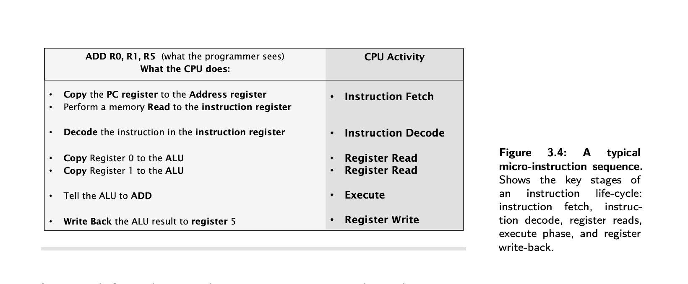

## MSC Algorithm and Data Structure Lesson Notes

This module is for MSC Algorithm and Data Structure lesson notes.

TBC

## Overview

* [Week 1](#week-1): hardware fundamentals which is a complete model of computer architecture in terms of hardware and
  operating system.
* [Week 2](#week-2): Computer memory with focusing types of memories, capabilities and performance
* [Week 3](#week-3): Component of systems and how they work together to make up a complete system - Building the system
    - busses and components
* [Week 4](#week-4) and [Week 5](#week-1): Exploring the nature of computer systems with the investigation of the
  operating systems, how they manage workload and maximise efficiency and their role on memory and storage management.
* [Week 6](#week-5): Basic principle of computer network from hardware and operating system perspective
* [Week 7](#week-6): Review of security and resilience issues of computer systems.

# WEEK 1

* [Fundamentals](#fundamentals)
    * [John von Neumann Model](#john-von-neumann-model)
        * [John von Neumann Model Bottleneck](#john-von-neumann-model-bottleneck)
    * [Clock signals](#clock-signals)
    * [Software view point](#software-view-point)
    * [Electronics](#electronics)
        * [Speed versus complexity](#speed-versus-complexity)
* [Processors: the heart of the machine.](#processors-the-heart-of-the-machine)
    * [Heat and power constraints](#heat-and-power-constraints)
    * [CPU architecture](#cpu-architecture)
    * [Beating the performance barrier](#beating-the-performance-barrier)
    * [Processor frequency](#processor-frequency)
        * [Scalar execution model](#scalar-execution-model)
        * [Pipelining](#pipelining)
        * [Superscalar execution model](#superscalar-execution-model)
        * [Data flow analysis](#data-flow-analysis)
        * [Branch Prediction](#branch-prediction)
        * [Speculative execution](#speculative-execution)
    * [Performance Balance](#performance-balance)
    * [Instruction micro-sequencing](#instruction-micro-sequencing)
    * [Introduction to Pipelining](#introduction-to-pipelining)
* [Terminology of Instructions](#terminology-of-instructions)
* [Computers Everywhere](#computers-everywhere)

# Fundamentals

* **Power**: Electrical power consumed by computer component or system often measured in Watt(W), milliWat(mW)(1x10^-3),
  microWat(
  uW)(1x10^-6) and nanoWat(nW)(1x10^-9)
* **Frequency**: how often given activities happen in any one second.
    * In computer system it refers to a basic operating cycle called a clock cycle.
    * The basic measure of frequency is Hertz(Hz).
    * Most computer works in high frequencies thats why MegaHertz(MHz) or Gigahertz(GHz) are using as normal units of
      measurement for computer.
* **Clock** : is a repetitive signal which alternates between binary zero and one, and provides a synchronising
  capability
  for system components.
* **Clock Cycle**: The frequency of activities is typically regulated by a **clock signal** and this repeative pulse
  dictates each event cycle and operates of frequency of event.
* **Data Capacity**: The number of data items a device or system can manage or store.
    * Data capacity is large multiples of bytes and bits that's why binary measurement units are using.
* **Data Rate**: The quantity of data can be transfer one point to another in a given amount of time mostly one second.
    * For example 100 milion bytes per second = 95.3 binary Megabytes/sec
* A bit is single binary value
    * 1 byte = 8 bit
    * 1 kilobyte(KB) = 1024 byte
    * 1 megabyte(MB) = 1024 KB
    * 1 gigabyte(GB) = 1024 MB
    * 1 terrabyte(TB) = 1024 GB
* MB to denote megabytes, and Mb to denote megabits.
* since the standard scientific units of kilo, mega, giga, etc are more generally based upon decimal powers 10^3, 10^6,
  10^9, etc. However, the binary version of these units correspond to 2^10, 2^20, 2^30 giving slightly different values.
    * A binary megabyte for example is 1,048,576 bytes, and a million bytes is 95.3 binary Megabytes^!.

* General purpose Computers: They are design to perform adequately across a wide range of uses, but they are rarely
  optimal in any of those cases.
* Application Specific Computers: They are designed to be highly efficient on a defined task to be achieve a high
  performance on the task. This computers are the cost effective versions of the general computers.
* A very simple computer system, as a first-order model, might be presented 2.3 Block diagram

## John von Neumann Model

* This is a key concept of the computer architecture proposed by John von Neumann 1945
* Most frequently used model for computer systems ever since.
* CPU, Memory andIO devices, those are the three essential components in Neumann architecture.
* A **bus** is a collection of wires that provide data and control signals and possibly addresses.
  Multiple devices are connected to a bus and can communicate with other devices via this connection.
    * Busses allow many devices to share one communication route for Information. However, it is important to note
      that only one device can control the bus at atime (the bus master).
* A **CPU** - Central Processing Unit is a digital electronic circuit built from many transistors. It can hold a small
  amount of temporary data and perform mathematical operations upon them. A CPU can also sequence operations according
  to a program it reads from memory, step by step.
    * it means :  a CPU performs a sequence of (often mathematical) operations upon temporary data it holds, and this
      sequence is dictated by a program found in memory.
    * this component better as the Processor,this is the component that does most of the hard work – the computations,
      the data translations and executes the program code in your computer when its running programs.
    * In the simplest computer system, all devices connect to a system bus, the CPU is always the bus master, and all
      devices appear as if they are part of the visible memory of the computer system. This allows for very
      straightforward programming models to access devices and modules within the system, though not necessarily
      the most optimal performance.
    * Extended definition of CPU:
        * A CPU is a digital electronic circuit, manufactured from a silicon technology defined as being at one
          particular technology node, consuming a certain amount of power, and generating a certain amount of heat
          during its operation
        * A CPU fetches program instructions from memory using a concept known as the **fetch-execute cycle**,
          and as each instruction is fetched, it is executed, performing one of a number of possible operations upon
          data held within the CPU registers.
        * These operations include mathematical and logical operations, and operations that change the flow of the
          program to execute parts chosen by the result of testing conditions encountered
          during a program sequence.
* Memory System and this is where data items can be stored as numerical values and this is where instruction code from
  the processor can be stored, also as numerical values.
* IO ( Input, Output ) interface is essentially mechanisms that allow devices to plug into the computer.
    * for example, a keyboard is an input device, and a video screen is an output device

</br>

### John von Neumann Model Bottleneck

* Having a single bus creates the problem that's known as the von Neumann/Princeton bottleneck that limits the number of
  devices that can use the bus at a given time to 2. Other devices have to wait and this leads to running the jobs in
  serial and costs time.
* If a CPU wishes to fetch data from memory, it cannot also fetch an instruction from memory at the same time.
* Likewise, if an IO device was capable of accessing memory directly then it would similarly be prevented from doing so
  whenever the CPU was already accessing memory. This constraint, due to many devices wanting to use one shared bus, is
  known as the von Neumann bottleneck.
* There are some alternatives to prevent this problem:
    * Harvard Architecture addresses this by utilising 2 different busses, one for the program memory and one for the
      data memory & IO. So, fetch and decode/execute can happen in parallel, ie pipelined. This permits instructions and
      data to be accessed simultaneously, permitting a speed gain.
    * Another potential solution is using an on-chip cache which reduces the CPU's access to code and data memory and
      frees up the bus for other peripherals.

## Clock signals

* In computer systems binary signals have two states, these are usually represented
  by voltages so something near to zero volts would be a zero in binary and a signal which has a higher value,
  typically 1.8 volts or 3.3 volts, would represent a logic “1” so a clock signal is actually just a
  signal whose voltage turns on and off repeatedly over a period of time.
* Over a period of time that a number of clock signals can be fitted into a period, so we’d
  expect that a clock signal turns on, turns off again and that will repeat and that will repeat
  , and that would repeat again and this repetitive behaviour is what a **clock signal**
  essentially does.
  </br>
* Clock cycle is showing with blue line.
* That is the basic definition of a **clock** – a rising edge (zero to one) and a falling edge (one to zero) – and these
  edges are what we
  use to synchronise events in the clock signal regime in a computer system.
* It turns out that one of those on-off transitions is what we refer to as one clock cycle,
* so when we talk about a clock cycle we’re talking about a complete process of going from zero to one and then back to
  zero again before it repeats.
  </br>
* we can also define that clock cycle in terms of a clock period, so this takes a certain amount of time, so there’s an
  amount of time “t”, typically in milliseconds or microseconds or nanoseconds in a clock system, and that value t
  represents a period of time - the clock period.
* If t was 0.01 seconds, which is 10 milliseconds, then f, by virtue of the formula we have just discussed, would be 1
  divided by 0.01, which equals 100 Hertz.
    * be referred to as “cycles per second”

## Software view point

* software is a series of instructions relating to a complex set of actions to be performed by a digital circuit (the
  CPU) and rather than manipulating threads of cotton, we manipulate data values.
* we can divide software into **source code**, which is in some way intelligible to a human, and **machine code**, which
  is
  nothing more than a series of binary numbers, and rarely understood by visual inspection by a programmer.
* In modern computing, there are 2 **high-level languages, HLL**
    * **Compiled** where the source code is compiled by a compiler that automatically converts high-level statements
      into low-level machine code.
    * **Interpreted** approach, translates source code written a high-level language interactively and executes a
      pre-defined piece of low-level code for each statement.
    * Writing the code directly in the **assembly** language, is the 3rd option, where the textual representation of
      each instruction is used.

## Electronics

* **Transistors**: Invented in the late 1950's, a transistor is a kind of switch,at least as far as digital electronics
  is
  concerned ,and when properly used they can operate in a binary signalling regime
  (on and off, one and zero).
* **Transistor Operation**: A simplified description of transistor behaviour in switching mode might be as follows:
  Atypical transistor uses a control signal (the Gate) to control the flow of a signal from the input (the Source) to
  the output (the
  Drain). However, multiple transistors can be combined to create logical switching functions.
* **Logical Operation**: Imagine that our Gate control signal can switch from zero to one, and by combining two
  transistors
  in the right way, we can create a switching arrangement that produces corresponding outputs one and zero. That is to
  say, the
  output is the opposite of the input. This is known as an inverter, or a logical NOT operation: the simplest logic
  gate.
  The output is NOT the input, if you wish to think of it in those terms.
* **AND and OR**: We can also combine transistors in such away that they create gates with two inputs. Then the circuit
  can
  be arranged such that a signal output can only be binary one when both inputs are one (the AND gate function, where
  input-a AND input-b must both be one at the same time to generate an output of one)
  .Likewise,as lightly different arrangement causes the circuit to generate a one If either input is one (generates one
  if input-a OR input-b are one), creating an OR gate.

* The behaviour of three very simple logic functions with the definitions of **AND, OR,** and **NOT**.
* These circuits are referred to as **logic gates**. So we typically talk about the **AND gate, the OR gate, and the NOT
  gate** (or Just an inverter). A further gate, the **XOR gate** performs an exclusive or function, where an output is
  one only when anyone (but not both) inputs are one.
* truth tables:
  </br>
* Mixtures of these eight logic (AND, OR, NOT, XOP, NAND, NOR, NEXOR(XNOR), buffer) gates can also be combined into more
  complex circuits, including circuits that add binary bits together (arithmetic), or perform other mathematical
  operations such as multiplying, comparing, and so on. These circuits are called **combinational circuits**.

### Speed versus complexity

* All of these logic gates and logic circuits **consume power** and **generate heat**
* Making the clock signal faster, makes the system operate faster. However, as the circuit gets more complex, each layer
  introduces an additional delay and the clock cannot go faster than the circuit can handle. This is known as the
  **speed vs complexity** dilemma.
* To overcome this, multicore CPUs came to life. Instead of trying to push the CPU to get faster and faster, multiple
  CPU are arranged in parallel. This way, complexity still increases but the operations are allowed to happen in
  parallel.
  </br>
* Circuit (b) is more complex, and slower, than circuit (a). Intuitively you might also expect circuit (c) to have
  increased delay compared to (b). After all, circuit (c) is certainly more complex than circuit (b). Whilst it
  is true that increased complexity often, even typically, causes increased delay, it is sometimes possible to have more
  gates but not slow down the circuitry. Indeed, in circuit (c) what we have done is use parallelism, because there are
  actually two separate circuits operating side by side. This is a key principle underlying the idea of multicore
  processor
* The industry transition from the Complex Instruction Set Computers (CISC) to the Reduced Instruction Set Computers (
  RISC), reduced ISC, mentality. This helps because CISC had a lot of instructions that were rarely and ineffectively
  used. However, CISC processors still find applications in areas where specialised instructions are required to carry
  out hardware-accelerated jobs, ie image processing.

# Processors: the heart of the machine.

* Since the mid 1970's, the vast majority of computer systems have been built around a key component: the single-chip
  microprocessor.
* Prior to this time, computer systems were almost always built from a large number of discrete components.
* These were often individual transistors in small metal canisters, or very simple digital logic components implemented
  individually as very simple logic chips also known **integrated circuits.**
* But even further back, computer circuits were built from radio valves filling hundreds of racks, and a multitude of
  cabinets.

## Heat and power constraints

* Every time a transistor switches on or off, it consumes some power, known as **dynamic power**.
* The faster the on-off transitions occur, the more power is consumed.
* And what happens to all of this power? when a circuit consumes
  energy,one of the unwanted by-products is **heat**.
* Incidentally, silicon chips also consume power when the transistors are idle, like a car motor ticking over whilst
  waiting at a road junction. This is known as **static power**.
* As Moore's Lawl has predicted successfully for many decades, the number of transistors on a given chip area doubles
  every two years.
* In 20 years, the size required to fit a transistor dropped from 1um to 10nm.
    * This dimension is known as the feature size.
    * Each incremental advance in silicon technology is called the technology node.
* Although transistors get smaller and smaller, designers want to use more and more transistors per chip, and those
  transistors operate faster too. The complexity of processors is thus an ever-increasing feature of computing.
* Where we have smaller circuits consuming more power and thus generating more heat we can say that **power density**
  and then **thermal density** increases. This is recognised as a serious problem. This is why a modern processor system
  is
  often cooled by a large heat¬sink. a module designed to draw heat away from the processor so that it does not
  overheat.

## CPU architecture

* **instructions** are different computational operations performing by CPU
* Some characteristics of instructions
    * Data Is held in temporary storage components within the CPU, called **registers**. Instructions operate upon these
      register contents.
    * Many operations are directly mathematical: add, subtract, multiply, divide, and so on.
    * Some of these instructions operate only on integers (whole numbers) whilst other operations may be able to act
      upon floating
      point or fixed point numbers. Not all processors support both kinds of computation.
    * Some instructions are logical operations. These perform boolean **logic operations** on data.
    * Some instructions transfer data to and from memory. These are known as **Load/Store operations**.
    * Some instructions test conditions and choose which part of the program to execute next.
* Execution means: A program consists of a number of instructions, and a CPU executes (performs) each instruction in
  turn.
* In order to execute an instruction, the CPU must first **fetch** it from memory, where our program is usually stored.
    * Fetching an instruction, and then executing it, is known as the **fetch-execute cycle**.
* **linear program sequence**: execution of CPU one instruction after another in a continuous list,
* **Program-flow instructions**: Some Instructions test conditions and choose what part of the program to execute next'.
    * The flow of a fetch-execute cycle sequence, as it moves through memory, is generally **non-linear** (more
      accurately it is linear for short sequences), interspersed with a number of Jumps to other parts of the memory
      where the next short linear sequence is located.
    * Program-flow instructions are therefore frequently encountered.
*

## Beating the performance barrier

* Performance is the achievement of certain goals whilst consuming certain resources.
    * Another way to express this is cost versus benefit or cost-benefit.
    * We sometimes refer to this as a performance metric.
* **mips** is simply millions of instructions per second,a simplistic measure of the computational throughput a
  processor Is capable of.
* **peak mips**, which measures the maximum possible mips a processor can achieve under the best possible conditions
* Example for cost measurements:
    * A given CPU can execute one million instructions per second(**mips**) (meaning it has a throughput of one mips)
    * The CPU may well require 1 milliwatt of power to do this.
    * Assume that one watt of electricity costs 1/lOth cent,
    * Assume the CPU costs $100, and is used for 1yr continuously.
    * The CPU dimensions are 20x20x5mm
* Answer:
  _* Cost efficiency for power is calculated by figuring out the mips/W
    * to calculate the cost of running the CPU for a given duration
    * Find the duration in seconds
    * Multiply the duration with the power consumption in 1 second
    * Then multiply by the unit cost of electricity and convert the units to W, Dollars etc.
    * Finally, add the cost of owning the CPU._
        * This CPU performs 1 mips per milliwatt (because we use 1mw of power and get 1mips in return), or 1000 mips per
          watt, if you prefer.
        * One year equates to **365x24x60x60 =31,536,000** seconds,
        * and each second we consume 1 milliwatt at 1mips, requiring **31,536 watts (31 Kw)**.
        * At 0.1 cent per watt, this electricity will cost **31.54** dollars.
        * And 100 dolar CPU price plus makes this CPU for one year is **131.54 dollars**.

* This calculation is important to predict **cost-effectiveness** of a CPU
* Another Example :
    * </br>
    * Which CPU can do the most processing in one hour?
        * highest mips per second is also makes highest per an hour. CPU-D 8 mips/1 mW = 8000 mips per watt.
    * Which CPU is most cost-efficient for power consumed?
        * _Performance per Dollar: Purchase price / mips_
        * CPU-C the best dollar for mips => $80/5= $16
    * Which CPU gives the most performance per dollar?
        * CPU-C 105$ per year
    * Which CPU is cheapest to buy and run for one year at 1mips? ▶Which CPU has the worst (highest) power density
        * _Power density is calculated as Power/Volume, ie W/mm3, bigger the worse._
        * CPU-A 6uW/mm^3
* To compare CPUs there are some test programs to run same workload for each CPU in run called **benchmarks**

## Processor frequency

* **clock frequency** is measurement how fast a processor can perform a key internal circut operation
    * We measure clock per second or Hertz
* The same identical operation on another processor mig require more or less or same number of clock cycles thats why
  clock frequency isnot guarantee highed mips or benchmark score by itself.
* For this we use **clock per instruction (CPI)**
* </br>
* in this example better Z>X>Y

### Scalar execution model

* When a CPU can execute one instruction at a time
* Execution of instructions is serial. Instruction needs to finish before the next begin.

### Pipelining

* The execution of an instruction involves multiple stages of operation, including fetching the instruction, decoding
  the opcode, fetching operands, performing a calculation, and so on.
* Pipelining enables a processor to work simultaneously on multiple instructions by performing a different phase for
  each of the multiple instructions at the
  same time.
* The processor overlaps operations by moving data or instructions into a conceptual pipe with all stages
  of the pipe processing simultaneously.
* For example, while one instruction is being executed, the computer is decoding the next instruction. This is the same
  principle as seen in an assembly line.
* Instructions do not always need complicated before the next one begin, we called this concept as **overlapped
  instruction execution**
* Pipelining allows to run more instruction in fewer clock cycle, meaning inherent CPI decreases, brings better
  performance
* This kind of operations is only possible where the 2 instructions do not depend upon one on each other
* The next instruction clearly can not use the result of the previous unless its waits for the preceding instruction to
  finish.
* This potential dependency known **pipeline hazard** or **data hazard**
* With care and using concept known **data-flow analysis**, code can be written avoid many of this problems.

### Superscalar execution model

* Multiple instructions can start at the same time this called multiple issue,
    * This is the ability to issue more than one instruction in every processor clock cycle.
* This is the base of the super scalar execution model
* In effect, multiple parallel pipelines are used.

### Data flow analysis

* The processor analyzes which instructions are dependent on each other’s results, or data, to create an optimized
  schedule of instructions.
* In fact, instructions are scheduled to be executed when ready, independent of the original program order. This
  prevents unnecessary delay.

### Branch Prediction

* The processor looks ahead in the instruction code fetched from memory and predicts which branches, or groups of
  instructions, are likely to be processed next.
* If the processor guesses right most of the time, it can prefetch the correct instructions and buffer them so that the
  processor is kept busy.
* The more sophisticated examples of this strategy predict not just the next branch but multiple branches ahead.
* Thus, branch prediction potentially increases the amount of work available for the processor to execute.
* Branch means also jump in computer architecture
* Static branch prediction
    * In static prediction, all decisions are made at compile-time.
    * Some static predictors always assume that the jump won't happen and some others assume that the backward jump will
      occur, which optimizes the loop operations.
    * Branch delay slots are used to run independent instructions. So, if the branch is taken, the execute cycle is used
      to execute these independent operations.
* Dynamic branch prediction
    * This basically is an educated guess based on the branch history kept by the CPU.
    * When the dynamic branch predictor hasn't got enough data to use, it can fall back to the static prediction.
* Hit Rate:
    * </br>

### Speculative execution

* Using branch prediction and data flow analysis, some processors speculatively execute instructions ahead of their
  actual appearance in the program execution, holding the results in temporary locations.
* This enables the processor to keep its execution engines as busy as possible by executing instructions that are likely
  to be needed.

## Performance Balance

* performance balance: an adjustment/tuning of the organization and architecture to compensate for the mismatch among
  the capabilities of the various components.
    * Designers constantly strive to balance the throughput and processing demands of the processor components, main
      memory, I/O devices, and the interconnection structures.
* The problem created by such mismatches is particularly critical at the inter- face between processor and main memory.
  While processor speed has grown rapidly, the speed with which data can be transferred between main memory and the
  processor has lagged badly.
* The interface between processor and main memory is the most crucial pathway in the entire
  computer because it is responsible for carrying a constant flow of program instructions and data between memory
  chips and the processor.
* The interface between the processor and main memory is the most crucial pathway in the entire computer because it is
  responsible for carrying a constant flow of program instructions and data between the memory and the processor.
* To improve performance
    * Increase the memory bus width
    * Incorporate cache on the dynamic random-access memory (DRAM)
    * Use close-to-the-processor caches
    * Increase the memory bus frequency and use a hierarchy of busses and caches
* Another bottleneck is the increasing I/O demands.
    * Strategies here include caching and buffering schemes plus the use of higher-speed interconnection buses and more
      elaborate structures of buses.

## Instruction micro-sequencing

* The internal organisation of the CPU is called the microarchitecture.
    * **Registers** hold numbers of certain size, ie 8, 16, 32 etc bits.
    * **Program Counter**, PC, keeps track of the next instruction in the memory so it can be fetched.
    * The **arithmetic Logic unit (ALU)** does arithmetic or logical operations on data held in registers
* When one instruction is executed at a time, this is known as the scalar execution and it's broken into
  micro-instructions such as Fetch, Decode, Read, Execute, Write.
    * When an instruction is going through different stages of its lifecycle, it's referred to as the instruction being
      in flight.
* Micro-sequencing is what happens inside a microprocessor when it is executing an instruction
* So an instruction does not execute in a single clock cycle as an atomic operation,
  a single indivisible operation, its actually executed internally as a number of steps in a micro
  sequence.
* </br>
* Memory read operation resulting from memory a data-fetch (reads data value) or instruction-fetch (reads instructions)
* </br>

## Introduction to Pipelining

* With pipelining, a processor can simultaneously work on multiple instructions. In other words, the execution of
  multiple instructions are overlapped.
* The 1st optimisation is, back to back register read/writes can be combined into a single clock cycle.
    * Making 2 parallel reads requires 2 read ports for the Register File and as read and write ports are different,
      register R/W can happen in parallel anyway. Such a register file would have 2+1=3 ports.
    * See how RegisterRead 2 and 3 are combined into a single cycle in the image below.
* Then, as soon as the 1st instruction is fetched, the memory/address bus is available, so, the 2nd instruction can be
  fetched
* As one instruction is completing per clock cycle, marked by the RW operations, the CPI is 1.
    * Although different from pipelining, superscalar architectures allow starting more than 1 instruction on the same
      core, multiple issue.
    * While there is not a universal agreement on the definition, superscalar design techniques typically include
      parallel instruction decoding, parallel register renaming, speculative execution, and out-of-order execution.
    * These techniques are typically employed along with complementing design techniques such as pipelining, caching,
      branch prediction, and multi-core in modern microprocessor designs.
* There is an issue called 'register hazard'. For example when we have ADD R2,R3,R6 and SUB R6,5,R6 and if they are
  pipelined SUB reads an earlier value of R6 before ADD completes and updates R6.
    * More generically, when two instructions depend on each other, this leads to pipeline or data hazard.
    * </br>
* There are 2 ways to solve:
* inserting delay slots automatically when the hazard is detected by the CPU
    * we are introducing delays and you will notice that now the number of
      instruction completions is now taking fewer instruction completions over more cycles, so the
      CPI is dropping here. So this is not the most efficient solution.
    * </br>
* Another and more efficient option is Static Instruction Scheduling, where the compiler re-orders the instructions and
  moves the instructions that aren't dependent on the target register in between.
    * </br>

## Terminology of Instructions

</br>
</br>

* </br>
    * </br>

* </br>
    * </br>

* </br>
    * </br>

* Write a program to compute the following: 9 x (9+3)

``` 
LDI R1,9
LDI R2,3
ADD R1,R2,R3
MUL R1,R3,R1
HALT
```

* Write a program to compute the following:(3x5) - (6 x 4)

```
LDI R1,3
LDI R2,5
MUL R1,R2,R3
LDI R1,6
LDI R2,4
MUL R1,R2,R4
SUB R4,R3, R1
HALT
```

# Computers Everywhere

* At the simplest level of abstraction, computer systems can therefore be divided loosely into two groups. The
  **general-purpose machines** and those **application-specific**.

## General purpose computers

* As computers became more sophisticated and powerful, their uses expanded to many more tasks.
* At this point, many computers began to be designed with the general market in mind: one machine that can do many
  things for many customers was more cost-effective to mass-produce and sell.
* But, at the same time, these general-purpose computer systems became less efficient at very specific tasks. There is a
  saying 'Jack of all trades, and master of none.
* it is not just desktops and laptops that are general purpose computers. In recent years,smartphones and tablet
  computers have become widely popular and powerful enough to be used in similar ways; these are also general purpose
  computers.
* Application-specific systems that are engineered to the last detail to be highly efficient at the one, or few,
  tasks they are designed for.
* Features of General Purpose Computers
    * A large amount of memory (large in terms of the everyday u that allows a wide range of tasks to be performed.
    * A large amount of local disk storage (again, large in everyday terms),
    * Built from readily available, off-the-shelf, mass-market components,
    * Can run a variety of operating systems,
    * Can run a wide variety of software,
    * Has lots of different kinds of connections for peripheral devices.
    * Is relatively inexpensive.

## Embedded Systems

* The term embedded system refers to the use of electronics and software within a product, as opposed to a
  general-purpose computer.
* A combination of computer hardware and software, and perhaps additional mechanical or other parts, designed to perform
  a dedicated function. In many cases, embedded systems are part of a larger system or product, as in the case of an
  anti lock braking system in a car.
* Embedded systems may or may not be accessible from outside and their user interaction can be limited.
* </br>
* there are a number of elements that differ from the typical desktop or laptop computer:
    * There may be a variety of interfaces that enable the system to measure, manip- ulate, and otherwise interact with
      the external environment. Embedded sys- tems often interact (sense, manipulate, and communicate) with external
      world through sensors and actuators and hence are typically reactive systems; a reactive system is in continual
      interaction with the environment and executes at a pace determined by that environment.
    * The human interface may be as simple as a flashing light or as complicated as real-time robotic vision. In many
      cases, there is no human interface.
    * The diagnostic port may be used for diagnosing the system that is being controlled—not just for diagnosing the
      computer.
    * Special-purpose field programmable (FPGA), application-specific (ASIC), or even non digital hardware may be used
      to
      increase performance or reliability.
    * Software often has a fixed function and is specific to the application.
    * Efficiency is of paramount importance for embedded systems. They are optimized for energy, code size, execution
      time, weight and dimensions, and cost.
* There are several noteworthy areas of similarity to general-purpose computer systems as well:
    * Even with nominally fixed function software, the ability to field upgrade to fix bugs, to improve security, and to
      add functionality, has become very important for embedded systems, and not just in consumer devices.
    * One comparatively recent development has been of embedded system platforms that support a wide variety of apps.
      Good examples of this are smart- phones and audio/visual devices, such as smart TVs.

## Mainframes and supercomputers

* Connecting one main computer via dumb terminals (hey were simply remote interfaces to the 'real' computer system. This
  was also an early form of networked computing infrastructure.) and allow users to use hos computers are called main
  frames
    * Any user could run their application and perform a task right at their desk. In order to give the impression that
      everyone had equal access, the concept of time-slicing was utilised.
* Going in the opposite direction,there were some computing domains
  where sharing out small slices of compute time to lots of general purpose users was not the primary goal. Instead, the
  demand was to run hugely complex computational tasks,with massive amounts of data,and to do so as fast as possible. A
  system designed to fulfil that kind of function is known as a **super computer**.

## Ambdal's Law

* Ambdal's Law deals with the potential speedup of a program using multiple processors compared to a single processor.
* Amdahl’s Law predicts the maximum speedup possible in a system and where some proportion of its activity P is
  optimised
* Amdahl's Law states that if a P percentage of a system is optimised, the maximum possible speedup is 1/(1-P). If P=0,
  this gives 1, which means no change in speed. P=0.5 gives 2, so, in the best case, if the improved half diminishes to
  0, this gives us 2 times the initial speed but can't exceed it.
    * the speedup using a parallel processor with N processors that fully exploits the parallel portion of the program
      is as follows
    * **True Speedup**: This formula gives infinity for P=1 as it isn't very realistic. To fix this, the formula is
      updated as 1/((1-P)+(
      P/N)) where N is the speedup factor for the optimization (N represents number of processor dividing the workload).
    * Example, if 80% can be optimised and we have 2 cores, this gives us 1/(0.2 + (0.8/2))=1.7. So, that 20% that can't
      be parallelised avoids the x2 speed and by incorporating N, we know how much we are going to improve rather than
      assuming the idealistic case of assigning '0' time.
    * Also note that when the CPU count approaches infinity, the formula gets closer to the original for of 1/(1-P).
* </br>
* </br>
* </br>
* we’re assuming it’s a thousand in this case: remember, in reality, when we look at the case where
  there’s a thousand processors, we are dividing that 80% that we know can be optimised by
  execution in parallel, we’re dividing that amongst a thousand processors, but we’re not
  diminishing the remaining 20% at all.
* And you can see that, no matter how many processors you have, the 0.2
  portion of the equation will always be there, and that means we can never achieve a better
  speedup than 5, in the best-case possible scenario. And that’s what Amdahl’s original
  expression for Amdahl’s Law tells you - maximum speedup is 5, and here we’re approaching
  very closely the maximum and adding more processors at this point will have very little
  benefit.

## TODO Week 1 :

* 1.6 Activity did not finalise

# WEEK 2

# WEEK 3

# WEEK 4

# WEEK 5

# WEEK 6

# WEEK 7