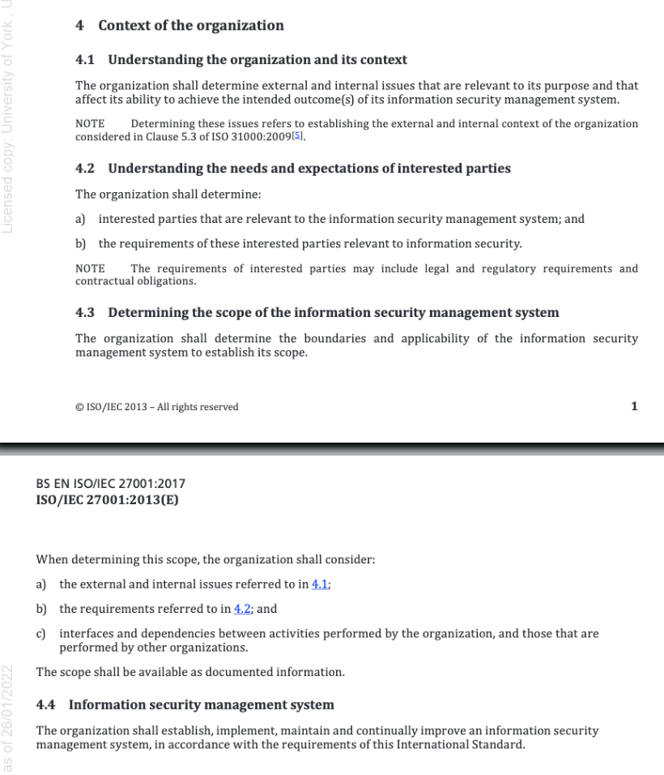
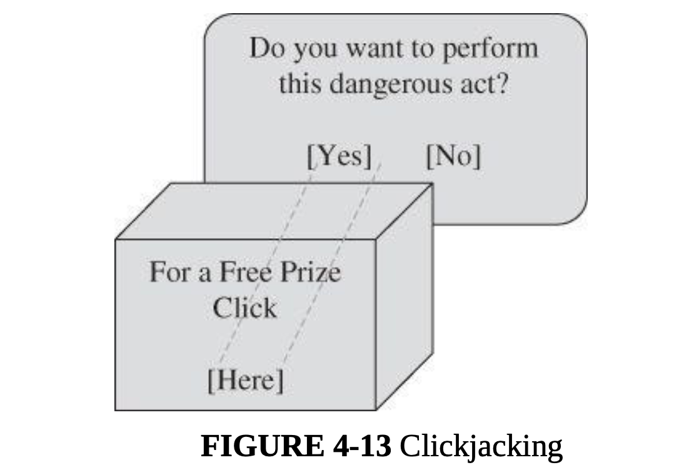
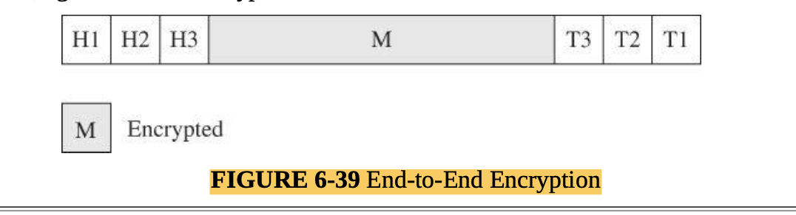
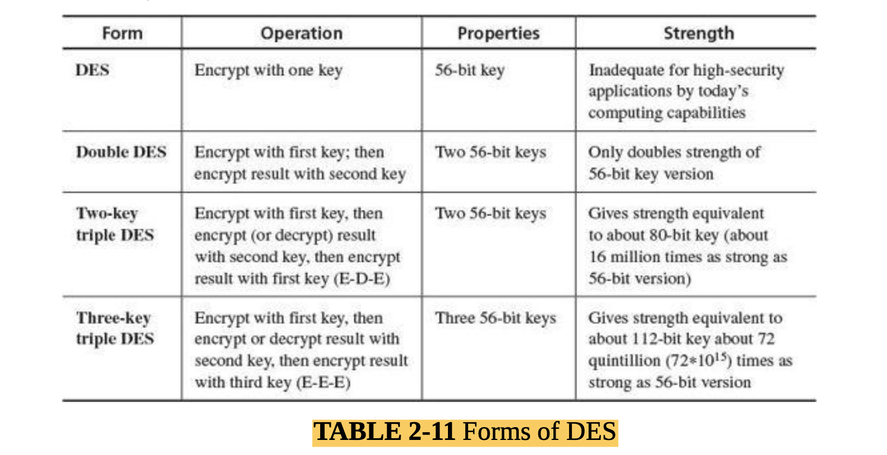
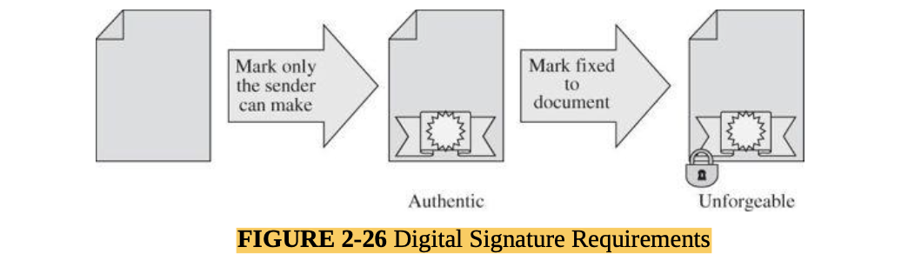

## MSC Cyber Security Threats Lesson Notes

# Module Weekly Outcomes (WLOs)

At the end of specific units, you will be able to:

# Week 1 Learning Outcomes

* Demonstrate understanding of the principles of cyber security and the CIA triad (MLO 1)
* Know how to, and be able to, use and interpret international standards (MLO 2, 3)
* Establish, and justify, contextual elements of a risk management plan (MLO 2, 3).

# Week 2 Learning Outcomes

* Identify human and human-related factors which adversely affect cyber security (MLO 1)
* Identify and explain the significance and effect of common flaws in some common human interface elements (MLO 1, 4, 5)
* Demonstrate understanding of the importance of input check and sanitisation as a security mechanism (MLO 4, 5).

# Week 3 Learning Outcomes

* Show an increased awareness of network traffic content and its implications for security issues (MLO 1)
* Use simple network monitoring methods to capture and perform initial inspection of evidence of potential security
  issues (MLO 4, 5)
* Explain how some simple security and pen-testing tools can aid in assessment of cyber security (MLO 4, 5).

# Week 4 Learning Outcomes

* Describe some common concepts in encryption (MLO 4, 5)
* Identify and break some simple encryption algorithms (MLO 1, 4)
* Explain how encryption is used to secure communications and services, and be able to deploy common security tokens (
  MLO 1, 4, 5).

# Week 5 Learning Outcomes

* Appreciate and explain the importance of databases in modern information systems (MLO 4, 5)
* Identify and describe some common attacks against databases and how to prevent or mitigate them (MLO 1, 5)
* Explain how data aggregation can increase threats to security (MLO 5).

# Week 6 Learning Outcomes

* Demonstrate an understanding of privacy issues and related legislation and regulations (MLO 2, 6)
* Describe how conflict can arise between privacy and security requirements (MLO 1, 6)
* Examine systems and documentation to determine compliance levels with externally derived privacy and other
  requirements (MLO 1, 2, 6).

# Week 7 Learning Outcomes

* Use the framework, introduced in week 1, to complete risk management plans (MLO 1, 2, 4, 5, 6)
* Explain how risk can be evaluated and a decision made about its acceptance (MLO 1, 2, 4, 5, 6)
* Select, and justify, appropriate treatments for risks from a range of options (MLO 1, 2, 4, 5, 6)

## Overview

- [Week-1](#week-1)
- [Week-2](#week-2)
- [Week-3](#week-3)
- [Week-4](#week-4)
- [Week-5](#week-5)
- [Week-7](#week-7)

# WEEK 1

#### Main Topics

* Demonstrate understanding of the principles of cyber security and the CIA triad (MLO 1)
* Know how to, and be able to, use and interpret international standards (MLO 2, 3)
* Establish, and justify, contextual elements of a risk management plan (MLO 2, 3).

#### Sub titles:

* [Definitions](#definitions)
* [Terminology](#terminology)
* [Threats and Risks](#threats-and-risks)
* [Risk Modelling and Assessment](#risk-modelling-and-assessment)
    * [Working with BS7799-3 and ISO/IEC 27001](#working-with-bs7799-3-and-isoiec-27001)
* [Activity 1 : Establishing context](#activity-1--establishing-context)
* [Why do this?](#why-do-this)
* [Activity 2: Establishing the ISMS boundary](#activity-2-establishing-the-isms-boundary)
* [Activity 3: Identifying consequences](#activity-3-identifying-consequences)

# Definitions

* let’s introduce 4 key concepts which make up a system :
    * Subjects - a subject is an entity, within a system, that performs an action. It can be a person, a program, a
      manual process or an automated system made up of many parts.
    * Actions - an action is an operation which results in a change to the system state by altering, creating or
      removing objects. Actions are performed by subjects.
    * Objects - an object is an entity, within a system, on which an action has an effect. Depending on context,
      subjects may also be objects (for example, in a personnel records systems - individual records about staff members
      would be objects, but members of the personnel department could also be considered subjects as they can perform
      actions on the records held in the system).
    * State - a snapshot of all the subjects and objects at a given point in time. It contains all data present in the
      system.

# Terminology

* Computer Security: concern with protection of the computer systems, and the information they process
* Information Security: focus on protectiong the information itself.
    * This may not always hold in digital form.
    * Ensuring availability and integrity of the information always include to security consideration.
* Cyber Security: hard to differentiating from Computer and Information Security.
    * The common approach is combination of both of them the communication systems that allows information exchanged
      between computer systems.
    * Unauthorised access or modification of non-digital forms can also have an impact on cyberspace.

* CIA (AIC) Triad : the existing of these fundamentals are guarentee that security is being maintained.
    * the CIA triad ensures that data cannot be leaked (is confidential), or altered by an unauthorised actor (integrity
      is maintained) and is ready for use when it is required (is available).
    * Confidentiality : This property ensures that object are only **accessible** by the subject which has the rights to
      access to the object
        * Confused by privacy. Privacy is usually out of the ISMS, needs to consider and ensure that legal requirement
          compile by.
    * Integrity: this property ensures that the object can be **altered** by the subject who has the right o do it.
    * Availability: This property ensures the object can be accessible and alterable when subject is required.
        * This includes precautions against unpredictable events such as floods, fires, asteroid strikes, global
          pandemics etc.
            

# Threats and Risks

* Threats : Something which can cause of a danger.
* Risk: is the probability to get damage from that threat
    * Risk = Likelihood * Impact.
    * For example: an asteroid landing on your house will have a very high impact (in all senses of the word) rating (
      it’s clearly a disaster, not just for you but probably for most of the planet), but the probability of it
      happening is pretty low - so overall, the risk it poses is quite low.
    * low risk: situations are just inconvenient and easy to recover from
    * high risk: situations can cause real damage or harm

* [OWASP Risk Rating Methodology](https://owasp.org/www-community/OWASP_Risk_Rating_Methodology)
    * Step 1: Identifying a Risk
    * Step 2: Factors for Estimating Likelihood
    * Step 3: Factors for Estimating Impact
    * Step 4: Determining Severity of the Risk
    * Step 5: Deciding What to Fix
    * Step 6: Customizing Your Risk Rating Model
* [Thread Modeling](https://owasp.org/www-community/Threat_Modeling)

# Risk Modelling and Assessment

* Understanding organization:
    * The thread sec profession needs to be sure first CIA functioning of the the context of organization and processes.
    * Then needs to understand threads and risks.

* There is some Guidlines for it:
    * BS7799-3 (2017) “Information security management systems. Guidelines for information security risk
      management” [BS 7799-3:2017](https://bsol-bsigroup-com.libproxy.york.ac.uk/PdfViewer/Viewer?pid=000000000030354572)
    * BS EN ISO/IEC 27001 (2017) “Information technology - Security Techniques - Information security management systems
      Requirements” [BS EN ISO/IEC 27001:2017](https://bsol-bsigroup-com.libproxy.york.ac.uk/PdfViewer/Viewer?pid=000000000030347472)

* Working with standards
    * [The BSI Guide to Standardization](https://www.bsigroup.com/en-GB/standards/Information-about-standards/how-are-standards-made/The-BSI-Guide-to-Standardization/)
    * [ISO/IEC Directives, Part 2](https://www.iso.org/sites/directives/current/part2/index.xhtml) (Particularly
      important are the differences between “must”, “shall”, “should”, “can” and “may” as defined in this document)

## Working with BS7799-3 and ISO/IEC 27001

* Introduction and Clauses 1-5 of BS7799-3. and Clauses 4 and 5.2 of ISO/IEC 27001
* Clause 5, in particular, highlights the importance of the risk identification and assessment process being a two-way
  activity. People at all levels in the organisation are often best placed to understand and explain the threats and
  risks that impact their work.

* Step by step guid to exploring the key issues
    * Right Top, Context Establishment and contains a reminder that ISO/IEC 27001 clauses 4, 5.2 and 6 provide further
      information  
        
        
        
        

# Activity 1 : Establishing context

* The Car company:
* The company has
    * a warehouse which contains stock of all parts which they sell, with quantities based on historic trends,
    * a contract with an external courier firm for delivery of ordered items
    * an opt-in mailing list that allows them to send details of promotions and new products to subscribers
    * contracts with several manufacturers and importers for supply of new products
    * Staff to look after purchasing, sales, warehouse inventory management, contract management, personnel and
      advertising

* Task: Applying the ISO/IEC 27001 Clauses 4 and 5.3 to the company, making any reasonable assumptions that you need to,
  to produce the following:
    * A statement of the purpose of the business
    * A list of internal and external issues that relate to the information security system(s) within the business
    * A list of the interested parties relevant to the information security management system and the
      issues/requirements specific to them
    * A statement of the boundary of the business’s information security system (i.e. where does their ability to
      control and/or responsibility for security end, and what is included inside the boundary?)
    * A list of roles, within the information security management system, and what the responsibilities and authorities
      for those roles are, or should be.

* **Answers**:
* Purpose - to generate income by selling car parts to retail and trade customers
* To do this, it needs systems to
    * a. maintain an accurate list of parts in stock
    * b. allow customers to place orders for parts in stock
    * c. process payments
    * d. ship order once payment has been received.
    * e. forecast demand for parts based on historical data
        * i. - so historic data must be correct
    * f. issue orders to suppliers
    * g. maintain a list of customers who want to be emailed
    * i. with preferences about contact type & frequency maintained
    * h. Send emails to subscribers as required
    * i. Perform personnel functions
        * i. Payroll
        * ii. Tax
    * j. Perform accounting functions
        * i. Tax
        * ii. Money in
        * iii. Money out
* Issues
    * a. Internally - protect data from unauthorised access, ensure that data held is accurate, ensure that data held is
      available when required
    * b. Externally - interface correctly with supplier systems to generate orders, interface correctly with banks and
      others to make payments, interface correctly with payment processors to receive payments
* Interested parties
    * a. Customers - ordering & receiving goods, making payments, not being spammed, not having data “stolen”
    * b. Suppliers - receiving orders, being paid on time
    * c. Staff - being paid on time, having correct tax deducted, not having data “leaked” or “stolen” internally or
      extenally
    * d. Shareholders - reputation and cash-flow
    * e. Society - reputation, perception of the company and perception of security
* ISMS boundary - The company is responsible for all systems which it has complete control of, but not responsible for
  any external systems upon which it relies. It will ensure that the data it exchanges with external systems conforms to
  specifications, but cannot reasonably be responsible for the data once it has left the company’s own systems. It will
  share responsibility for data in transit and will only allow data to be transferred in a secure manner.
* Roles
    * a. Directors - setting policy, authorising changes, ensuring good governance and compliance with law and good
      practice. Monitoring for signs of breach and dealing with the same if they occur.
    * b. IT staff - ensuring that systems comply with internal and external requirements, including use of good security
      practices and compliance with legal requirements. Monitoring systems for signs of breach, reporting and dealing
      with the same.
    * c. All staff - ensuring CIA triad by accessing and entering only those data that they are required or permitted
      to. Monitoring systems for signs of breach and reporting the same. Externals (at interface points) might be
    * d. Suppliers - providing clear interfaces, keeping their own systems secure, sending and receiving only required
      data
    * e. Customers - using the systems in the way are designed to be used, providing correct data

# Why do this?

  

* how to identfy those threts?
    * where BS 7799-3 Clause 6 comes into play

* “To implement an Information Security Management System (ISMS), ensure compliance with the law, prepare a business
  continuity plan, or meet specific security requirements of our services and/or products.”
    * “ISMS” - an Information Security Management System - clearly identifies the scope as being Information, not
      physical, security.
    * “Compliance with the law” - means we need to think about the laws that apply to the organisation and its
      activities. At a minimum, we’re probably going to have to consider GDPR, but there may be others such as Human
      Rights legislation, financial conduct regulations etc.
    * “Business continuity plan” - a means for keeping the organisation running, albeit at a reduced or minimal level,
      if a disaster happens. That means we need to identify activities within the organisation and prioritise them in
      order of importance to the organisation’s continued survival.
    * “Services and/or products” - again, we need to think about what the organisation does or makes and what the
      security requirements for each of those is.

# Activity 2: Establishing the ISMS boundary

* applying BS 7799-3 Clauses 6.1 through 6.3,
* **Answer**
* My answer to the previous exercise contains two big hints about this in the form of :
  ISMS boundary - The company is responsible for all systems which it has complete control of, but not responsible for
  any external systems upon which it relies. It will ensure that the data it exchanges with external systems conforms to
  specifications, but cannot reasonably be responsible for the data once it has left the company’s own systems. It will
  share responsibility for data in transit and will only allow data to be transferred in a secure manner.
* And the list of systems required :
* it needs systems to
    * a. maintain an accurate list of parts in stock
    * b. allow customers to place orders for parts in stock
    * c. process payments
    * d. ship order once payment has been received.
    * e. forecast demand for parts based on historic data
        * i. - so historic data must be correct
    * f. issue orders to suppliers
    * g. maintain a list of customers who want to be emailed
    * i. with preferences about contact type & frequency maintained
    * h. send emails to subscribers as required
    * i. perform personnel functions
        * i. Payroll
        * ii. Tax
    * j. perform accountancy functions
        * i. Tax
        * ii. Money in
        * iii. Money out
* All of the systems that I have listed lie inside the boundary, with the possible exceptions of
    * some customer payment (item c) handling (e.g. customer payments might be outsourced to something like PayPal)
    * HR & payroll (item i) which might be dealt with through an external agency as well
    * Mailing lists (items g and h), which could be outsourced to another third party like Mailchimp

# Activity 3: Identifying consequences

* identify the potential consequences of a breach in each of them (there may be more than one type of consequence in
  many cases), and how severely (high, medium, low, insignificant) it would affect the organisation if such a breach
  happened.

* Answer:
* For this, I’m going to assume that some of the systems identified have been outsourced, so can be dropped from the
  list for now - these are customer payment handling, mailing lists and payroll it needs systems to
    * a. maintain an accurate list of parts in stock
    * b. allow customers to place orders for parts in stock
      ~~* c. process payments~~
    * d. ship order once payment has been received.
    * e. forecast demand for parts based on historic data
        * i. - so historic data must be correct
    * f. issue orders to suppliers
      ~~* g. maintain a list of customers who want to be emailed
        * i. with preferences about contact type & frequency maintained~~
          ~~* h. Send emails to subscribers as required
    * i. Perform personnel functions
        * i. Payroll
        * ii. Tax~~
    * j. Perform accountancy functions
        * i. Tax
        * ii. Money in
        * iii. Money out

* So, for just a few of the elements listed above, I can start to construct a consequences table
  (without worrying about the exact nature of the breach yet)
    

* And so on....
* For each in-scope system/process we will have a list of adverse effects that a breach can have on the business, and an
  estimate for how severe that impact is. If we rank the impacted systems by severity of impact, we can start to
  prioritise.

# WEEK 2

#### Main Topics

* Identify human and human-related factors which adversely affect cyber security (MLO 1)
* Identify and explain the significance and effect of common flaws in some common human interface elements (MLO 1, 4, 5)
* Demonstrate understanding of the importance of input check and sanitisation as a security mechanism (MLO 4, 5).

#### Sub titles:

* [Human factors](#human-factors)
    * [The Web—User Side](#the-webuser-side)
        * [Browser Attacks](#browser-attacks)
        * [Authentication](#authentication)
* [Activities](#activities)
    * [2-factor authentication (2FA)](#2-factor-authentication-2fa)
* [Trust in the site](#trust-in-the-site)
    * [Protecting Web Sites Against Change](#protecting-web-sites-against-change)
        * [Malicious Web Content](#malicious-web-content)
            * [Protecting Against Malicious Web Pages](#protecting-against-malicious-web-pages)
        * [Google's "site:" search operator](#googles-site-search-operator)
* [Other web flaws](#other-web-flaws)
    * [Cross-Site Scripting](#cross-site-scripting)
    * [SQL Injection](#sql-injection)
    * [Dot-Dot-Slash](#dot-dot-slash)
    * [Server-Side Include](#server-side-include)
* [Social Engineering and attacks on the wetware](#social-engineering-and-attacks-on-the-wetware)
    * [Fake Email](#fake-email)
    * [Fake Email Messages as Spam](#fake-email-messages-as-spam)
    * [Phising](#phishing)
* [SPF (Sender Policy Framework)](#spf-sender-policy-framework)
* [DKIM (Domain Keys Identified Mail)](#dkim-domain-keys-identified-mail)
* [DMARC (Domain-based Message Authentication Reporting and Conformance)](#dmarc-domain-based-message-authentication-reporting-and-conformance)

# Human factors

* Information in computers are intangible, tahts why hard to understand humans the importance.
* Even they know the value of the data stored in it, they cause several breaches on the securities, like disclosing
  passwords, leaving laptops open etc.
* Even they aware of the potential securoty issues, hackers try to manipulate them with various technical or
  psychological ways.

## The Web—User Side

* Security issues for browsers arise from several complications to that simple description, such as these:
    * A browser often connects to more than the one address shown in the browser’s address bar.
    * Fetching data can entail accesses to numerous locations to obtain pictures, audio content, and other linked
      content.
    * Browser software can be malicious or can be corrupted to acquire malicious functionality.
    * Popular browsers support add-ins, extra code to add new features to the browser, but these add-ins themselves can
      include corrupting code.
    * Data display involves a rich command set that controls rendering, positioning, motion, layering, and even
      invisibility.
    * The browser can access any data on a user’s computer (subject to access control restrictions); generally the
      browser runs with the same privileges as the user.
    * Data transfers to and from the user are invisible, meaning they occur without the user’s knowledge or explicit
      permission.
* Browsers connect users to outside networks, but few users can monitor the actual data transmitted
* A browser’s effect is immediate and transitory: pressing a key or clicking a link sends a signal, and there is seldom
  a complete log to show what a browser communicated. In short, browsers are standard, straightforward pieces of
  software that expose users to significantly greater security threats than most other kinds of software

### Browser Attacks

* There are three attack vectors against a browser:
    * Go after the operating system so it will impede the browser’s correct and secure functioning.
    * Tackle the browser or one of its components, add-ons, or plug-ins so its activity is altered.
    * Intercept or modify communication to or from the browser.

* **Man-in-the-Browser:**
    * A man-in-the-browser attack is an example of malicious code that has infected a browser. Code inserted into the
      browser can read, copy, and redistribute anything the user enters in a browser. The threat here is that the
      attacker will intercept and reuse credentials to access financial accounts and other sensitive data.
    * Man-in-the-browser: Trojan horse that intercepts data passing through the browser
        
* **Keystroke Logger**
    * A keystroke logger (or key logger) is either hardware or software that records all keystrokes entered.
    * The logger either retains these keystrokes for future use by the attacker or sends them to the attacker across a
      network connection.

* Page-in-the-Middle
    * A page-in-the-middle attack is another type of browser attack in which a user is redirected to another page.
      Similar to the man-in-the-browser attack, a page attack might wait until a user has gone to a particular web site
      and present a fictitious page for the user.
        * As an example, when the user clicks “login” to go to the login page of any site, the attack might redirect the
          user to the attacker’s page, where the attacker can also capture the user’s credentials.
* **Program Download Substitution**
    * Coupled with a page-in-the-middle attack is a download substitution.
    * In a download substitution, the attacker presents a page with a desirable and seemingly innocuous program for the
      user to download, for example, a browser toolbar or a photo organizer utility.
    * What the user does not know is that instead of or in addition to the intended program, the attacker downloads and
      installs malicious code.
    * A user agreeing to install a program has no way to know what that program will actually do.
* **User-in-the-Middle**
    * A different form of attack puts a human between two automated processes so that the human unwittingly helps
      spammers register automatically for free email accounts.
    * A CAPTCHA is a puzzle that supposedly only a human can solve, so a server application can distinguish between a
      human who makes a request and an automated program generating the same request repeatedly.
    * CAPTCHA -> Completely Automated Public Turing test to tell Computers and Humans Apart
    * How captcha vulneribility can be eliminated?
        * By introducing some degree of randomness, such as an unpredictable number of characters in a string of text.

### Authentication

* The central failure of these in-the-middle attacks is faulty authentication.
* If A cannot be assured that the sender of a message is really B, A cannot trust the authenticity of anything in the
  message.
* **Human Authentication**
    * face-to-face authentication.
    * human-to-computer authentication that used sophisticated techniques such as biometrics and so-called smart
      identity cards.
    * These human factors can affect authentication in many contexts because humans often have a role in authentication,
      even of one computer to another.
* **Computer Authentication**
    * Computer authentication uses the same three primitives as human authentication, with obvious variations.
    * The problem, such as cryptographic key exchange, is how to develop a secret shared by only two computers.
    * In addition to obtaining solid authentication data, you must also consider how authentication is implemented.
    * if software can interfere with the authentication-checking code to make any value succeed, authentication is
      compromised. Thus, vulnerabilities in authentication include not just the authentication data but also the
      processes used to implement authentication.
    * Authentication discussion two-sided issue: The system needs assurance that the user is authentic, but the user
      needs that same assurance about the system.
        * This second issue has led to a new class of computer fraud called **phishing**, in which an unsuspecting user
          submits sensitive information to a malicious system impersonating a trustworthy one.
        * Common targets of **phishing** attacks are banks and other financial institutions: Fraudsters use the
          sensitive data they obtain from customers to take customers’ money from the real institutions.
        * Other phishing attacks are used to plant malicious code on the victim’s computer.

* Authentication is vulnerable at several points:
    * Usability and accuracy can conflict for identification and authentication: A more usable system may be less
      accurate. But users demand usability, and at least some system designers pay attention to these user demands.
    * Computer-to-computer interaction allows limited bases for authentication. Computer authentication is mainly based
      on what the computer knows, that is, stored or computable data. But stored data can be located by unauthorized
      processes, and what one computer can compute so can another.
    * Malicious software can undermine authentication by eavesdropping on (intercepting) the authentication data and
      allowing it to be reused later. Well- placed attack code can also wait until a user has completed authentication
      and then interfere with the content of the authenticated session.
    * Each side of a computer interchange needs assurance of the authentic identity of the opposing side. This is true
      for human-to-computer interactions as well as for computer-to-human.

* Successful Identification and Authentication
    * Appealing to everyday human activity gives some useful countermeasures for attacks against identification and
      authentication.
    * **Shared Secret**
        * Banks and credit card companies struggle to find new ways to make sure the holder of a credit card number is
          authentic.
            * For example, mums maiden name
        * financial institutions are asking new customers to file the answers to questions presumably only the right
          person will know
        * The basic concept is of a shared secret, something only the two entities on the end should know
            * To be effective, a shared secret must be something no malicious middle agent can know.
    * **One-Time Password**
        * As its name implies, a one-time password is good for only one use. To use a one-time password scheme, the two
          end parties need to have a shared secret list of passwords.
        * When one password is used, both parties mark the word off the list and use the next word the next time.
    * **Out-of-Band Communication**
        * Out-of-band communication means transferring one fact along a communication path separate from that of another
          fact.
            * For example, bank card PINs are always mailed separately from the bank card so that if the envelope
              containing the card is stolen, the thief cannot use the card without the PIN

    * **Continuous Authentication**
        * If two parties carry on an encrypted communication, an interloper wanting to enter into the communication must
          break the encryption or cause it to be reset with a new key exchange between the interceptor and one end.
        * Both of these attacks are complicated but not impossible.
            * However, this countermeasure is foiled if the attacker can intrude in the communication pre-encryption or
              post-decryption.
        * Encryption can provide continuous authentication, but care must be taken to set it up properly and guard the
          end points.

# Activities

* Secure Password submittion:
    * GET Method is not secure even by usinf HTTPS, because it sets userName and password on the Quesry paramaters which
      are visiable on URL
    * POST Form with SSL is the secure way to send username and passwords. Because data is sending on body and encripted
      with SSL.
* Data in the browser and in the server are rarely held in encrypted form because it slows processing down - so if
  anyone has access to either of those programs, there is potential for them to gain access to the unencrypted data.
* The only visible problem should be the GET method URL containing the request data - making it vulnerable to shoulder
  surfers. Everything going across the network, in either direction, should be in TLS1.3 packets and encrypted so that
  the even the nature of the protocol isn't obvious.

## 2-factor authentication (2FA)

* 2FA is involved in logon process, the system itself will generate a one-time password (OTP) which is sent to the user
  through another channel (e.g. email, mobile phone, code generating app).
* 2FA introduces an extra step for attackers - they need to obtain credentials AND control of the 2FA channel
* Use of mobile phone messaging is also a common way of sending the secondary credential to the user, because mobile
  phones are now very prevalent (a lot of people have them) and ubiquitous (people carry them around most of the time).

# Trust in the site

* 2 situation involving web content
    * false content
    * seeking to harm the viewer

* False or Misleading Content
    * The falsehoods that follow include both obvious and subtle forgeries.

* Defaced Web Site
    * The simplest attack, a website defacement, occurs when an attacker replaces or modifies the content of a
      legitimate web site.
    * For example, recent political attacks have subtly replaced the content of a candidate’s own site to imply falsely
      that a candidate had said or done something unpopular. Or using website modification as a first step, the attacker
      can redirect a link on the page to a malicious location, for example, to present a fake login box and obtain the
      victim’s login ID and password. All these attacks attempt to defeat the integrity of the web page.
    * A defacement is common not only because of its visibility but also because of the ease with which one can be done.
    * Web sites are designed so that their code is downloaded, enabling an attacker to obtain the full hypertext
      document and all programs directed to the client in the loading process.
    * An attacker can even view programmers’ comments left in as they built or maintained the code. The download process
      essentially gives the attacker the blueprints to the web site.

* Fake Web Site
    * The attacker can get all the images a real site uses; fake sites can look convincing.

* Fake Code
    * One transmission route we did not note was an explicit download: programs intentionally installed that may
      advertise one purpose but do something entirely different.
    * Perhaps the easiest way for a malicious code writer to install code on a target machine is to create an
      application that a user willingly downloads and installs.
    * smartphone apps are well suited for distributing false or misleading code because of the large number of young,
      trusting smartphone users.

### Protecting Web Sites Against Change

* Our favorite integrity control, encryption, is often inappropriate: Distributing decryption keys to all users defeats
  the effectiveness of encryption. However, two uses of encryption can help keep a site’s content intact.
* Integrity Checksums
    * Integrity checksums can detect altered content on a web site.
    * A checksum, hash code, or error detection code is a mathematical function that reduces a block of data (including
      an executable program) to a small number of bits.
    * Changing the data affects the function’s result in mostly unpredictable ways, meaning that it is
      difficult—although not impossible—to change the data in such a way that the resulting function value is not
      changed. Using a checksum, you trust or hope that significant changes will invalidate the checksum value.

* Signed Code or Data
    * Using an integrity checker helps the server-side administrator know that data are intact; it provides no assurance
      to the client. A similar, but more complicated approach works for clients, as well.
    * a digital signature is an electronic seal that can vouch for the authenticity of a file or other data object. The
      recipient can inspect the seal to verify that it came from the person or organization believed to have signed the
      object and that the object was not modified after it was signed.
    * A digital signature can vouch for the authenticity of a program, update, or dataset. The problem is, trusting the
      legitimacy of the signer.
    * A partial approach to reducing the risk of false code is signed code. Users can hold downloaded code until they
      inspect the seal. After verifying that the seal is authentic and covers the entire code file being downloaded,
      users can install the code obtained.
    * signed code may confirm that a piece of software received is what the sender sent, but not that the software does
      all or only what a user expects it to.

## Malicious Web Content

* Substitute Content on a Real Web Site
    * More mischievous attackers soon realized that in a similar way, they could replace other parts of a web site and
      do so in a way that did not attract attention.

* Web Bug
    * Tiny action points called web bugs can report page traversal patterns to central collecting points, compromising
      privacy.
    * a web page is made up of many files: some text, graphics, executable code, and scripts. When the web page is
      loaded, files are downloaded from a destination and processed; during the processing they may invoke other files (
      perhaps from other sites) which are in turn downloaded and processed, until all invocations have been satisfied.
    * When a remote file is fetched for inclusion, the request also sends the IP address of the requester, the type of
      browser, and the content of any cookies stored for the requested site. These cookies permit the page to display a
      notice such as “Welcome back, Elaine,” bring up content from your last visit, or redirect you to a particular web
      page.
    * Some advertisers want to count number of visitors and number of times each visitor arrives at a site. They can do
      this by a combination of cookies and an invisible image. A web bug, also called a clear GIF, 1x1 GIF, or tracking
      bug, is a tiny image, as small as 1 pixel by 1 pixel (depending on resolution, screens display at least 100 to 200
      pixels per inch), an image so small it will not normally be seen. Nevertheless, it is loaded and processed the
      same as a larger picture. Part of the processing is to notify the bug’s owner, the advertiser, who thus learns
      that another user has loaded the advertising image.

    * A single company can do the same thing without the need for a web bug. If you order flowers online, the florist
      can obtain your IP address and set a cookie containing your details so as to recognize you as a repeat customer. A
      web bug allows this tracking across multiple merchants.

    * Web bugs can also be used in email with images. A spammer gets a list of email addresses but does not know if the
      addresses are active, that is, if anyone reads mail at that address. With an embedded web bug, the spammer
      receives a report when the email message is opened in a browser. Or a company suspecting its email is ending up
      with competitors or other unauthorized parties can insert a web bug that will report each time the message is
      opened, whether as a direct recipient or someone to whom the message has been forwarded.
        

* Clickjacking
    * Clickjacking: Tricking a user into clicking a link by disguising what the link points to
    * The two technical tasks, changing the color to transparent and moving the page, are both possible because of a
      technique called framing, or using an iframe. An iframe is a structure that can contain all or part of a page, can
      be placed and moved anywhere on another page, and can be layered on top of or underneath other frames. Although
      important for managing complex images and content, such as a box with scrolling to enter a long response on a
      feedback page, frames also facilitate clickjacking.  
        

* Drive-By Download
    * Drive-by download: downloading and installing code other than what a user expects
    * Similar to the clickjacking attack, a drive-by download is an attack in which code is downloaded, installed, and
      executed on a computer without the user’s permission and usually without the user’s knowledge.

### Protecting Against Malicious Web Pages

* Access control accomplishes separation, keeping two classes of things apart. In this context, we want to keep
  malicious code off the user’s system; alas, that is not easy.
* Users download code to add new applications, update old ones, or improve execution.
* The other control is a responsibility of the web page owner: Ensure that code on a web page is good, clean, or
  suitable. Here again, the likelihood of that happening is small, for two reasons.
* Second, good (secure, safe) code is hard to define and enforce.

## Google's "site:" search operator

* Using Google’s “site:” search operator, you can specify that it should return only pages from the site you specify.
* If you don’t give any search terms at all, apart from the site, you should get a list of all pages indexed in Google (
  e.g. “site:york.ac.uk” should list all pages visible under the University’s domain).

# Other web flaws

* Someone interested in obtaining unauthorized data from the background database server crafts and passes SQL commands
  to the server through the web interface.
* Similar attacks involve writing scripts in Java. These attacks are called scripting or injection attacks because the
  unauthorized request is delivered as a script or injected into the dialog with the server.

## Cross-Site Scripting

* Scripting attack: forcing the server to execute commands (a script) in a normal data fetch request
* To a user (client) it seems as if interaction with a server is a direct link, so it is easy to ignore the possibility
  of falsification along the way. However, many web interactions involve several parties, not just the simple case of
  one client to one server.
* In an attack called cross-site scripting, executable code is included in the interaction between client and server and
  executed by the client or server.

* For Example :
    * http://www.google.com/search?name=&q=cross+site+scripting&ie=utf-8&oe=utf-8 &aq=t&rls=org.mozilla:en-US:
      official &client=firefox-a&lr=lang_en
    * This string would connect to badsite.com where it would execute the Java script xss that could do anything allowed
      by the user’s security context.

* Sometimes a volley from the client will contain a script for the server to execute. The attack can also harm the
  server side if the server interprets and executes the script or saves the script and returns it to other clients (who
  would then execute the script).
    * Such behavior is called a persistent cross-site scripting attack.

* A malicious user could post a comment with embedded HTML containing a script, such as but their browser would execute
  the malicious script.
    * For example : Cool story. KCTVBigFan

## SQL Injection

* SQL injection operates by inserting code into an exchange between a client and database server.
* To understand this attack, you need to know that database management systems (DBMSs) use a language called SQL (which,
  in this context, stands for structured query language) to represent queries to the DBMS.
* If the user can inject a string into this interchange, the user can force the DBMS to return a set of records. The
  DBMS evaluates the WHERE clause as a logical expression.
    * For Example:  QUERY = “SELECT * FROM trans WHERE acct=’”+ acctNum + ”’;”
    * If the user enters the account number as “‘2468’ OR ‘1’=‘1’” the resulting query becomes
    * QUERY = “SELECT * FROM trans WHERE acct=‘2468’ OR ‘1’=‘1’”
* Because ‘1’=‘1’ is always TRUE, the OR of the two parts of the WHERE clause is always TRUE, every record satisfies the
  value of the WHERE clause and so the DBMS will return all records in the database.
* The trick here, as with cross-site scripting, is that the browser application includes direct user input into the
  command, and the user can force the server to execute arbitrary SQL commands.

## Dot-Dot-Slash

* Enter the dot-dot. In both Unix and Windows, ‘..’ is the directory indicator for “predecessor.”
    * And ‘../..’ is the grandparent of the current location. So someone who can enter file names can travel back up the
      directory tree one .. at a time.

* For example, passing the following URL causes the server to return the requested file, autoexec.nt, enabling an
  attacker to modify or delete it.
    * http://yoursite.com/webhits.htw?CiWebHits &File=../../../../../winnt/system32/autoexec.nt

## Server-Side Include

* A potentially more serious problem is called a server-side include.
* The problem takes advantage of the fact that web pages can be organized to invoke a particular function automatically.
    * For example, many pages use web commands to send an email message in the “contact us” part of the displayed page.
    * The commands are placed in a field that is interpreted in HTML.

* One of the server-side include commands is exec, to execute an arbitrary file on the server. For instance, the
  server-side include command
    * <!—#exec cmd=”/usr/bin/telnet &”—>
* opens a Telnet session from the server running in the name of (that is, with the privileges of) the server.
* An attacker may find it interesting to execute commands such as chmod (change access rights to an object), sh (
  establish a command shell), or cat (copy to a file).

# Social Engineering and attacks on the wetware

## Fake Email

* an attacker can attempt to fool people with fake email messages.

## Fake Email Messages as Spam

* Spam is fictitious or misleading email, offers to buy designer watches, anatomical enhancers, or hot stocks, as well
  as get-rich schemes involving money in overseas bank accounts.
* Types of spam are rising:
    * fake “nondelivery” messages (“Your message x could not be delivered”)
    * false social networking messages, especially attempts to obtain login details
    * current events messages (“Want more details on [sporting event, political race, crisis] ?”)
    * shipping notices (“x company was unable to deliver a package to your address —shown in this link.”)

* Volume of Spam: more than %55 is spam mails
* Spammers make enough money to make the work worthwhile.
* **Why Send Spam?**
    * Advertising
    * Pump and Dump: popular spam topic is stocks
        * pump and dump game : A trader pumps—artificially inflates—the stock price by rumors and a surge in activity.
          The trader then dumps it when it gets high enough. The trader makes money as it goes up; the spam recipients
          lose money when the trader dumps holdings at the inflated prices, prices fall, and the buyers cannot find
          other willing buyers. Spam lets the trader pump up the stock price.
    * Malicious Payload
        * Clicking a link offering you a free prize, and you have actually just signed your computer up to be a
          controlled agent (and incidentally, you did not win the prize).
        * Spam email with misleading links is an important vector for enlisting computers as bots.
    * Links to Malicious Web Sites:

* **What to Do about Spam?**
    * Legal:
        * Spam is not yet annoying, harmful, or expensive enough to motivate international action to stop it.
        * Numerous countries and other jurisdictions have tried to make the sending of massive amounts of unwanted email
          illegal. In the United States, the CAN-SPAM act of 2003 and Directive 2002/58/EC of the European Parliament
          are two early laws restricting the sending of spam; most industrialized countries have similar legislation.
        * Defining the scope of prohibited activity is tricky, because countries want to support Internet commerce,
          especially in their own borders.
            * Almost immediately after it was signed, detractors dubbed the U.S. CAN-SPAM act the “You Can Spam” act
              because it does not require emailers to obtain permission from the intended recipient before sending email
              messages.
            * The act requires emailers to provide an opt-out procedure, but marginally legal or illegal senders will
              not care about violating that provision

    * Source Addresses:
        * source addresses in email can easily be forged. and Email senders are not reliable
        * Legitimate senders want valid source addresses as a way to support replies; illegitimate senders get their
          responses from web links, so the return address is of no benefit.
        * Accurate return addresses only provide a way to track the sender, which illegitimate senders do not want.
        * Internet protocols could enforce stronger return addresses
            * But Such a change would require a rewriting of the email protocols and a major overhaul of all email
              carriers on the Internet, which is unlikely unless there is another compelling reason, not security.
    * Screeners:
        * screeners, tools to automatically identify and quarantine or delete spam
        * Screeners are highly effective against amateur spam senders, but sophisticated mailers can pass through
          screeners.

    * Volume Limitations:
        * limiting the volume of a single sender or a single email system.
        * The problem is legitimate mass marketers, who send thousands of messages on behalf of hundreds of clients.
          Rate limitations have to allow and even promote commerce, while curtailing spam; balancing those two needs is
          the hard part.

    * Postage
        * A small fee could be charged for each email message sent, payable through the sender’s ISP.
        * The difficulty again would be legitimate mass mailers, but the cost of e-postage would simply be a recognized
          cost of business.

* **Fake (Inaccurate) Email Header Data**
    * one reason email attacks succeed is that the headers on email are easy to spoof, and thus recipients believe the
      email has come from a safe source
    * Proposals for more reliable email include authenticated Simple Mail Transport Protocol (SMTP) or SMTP-Auth (RFC
        2554) or Enhanced SMTP (RFC 1869), but so many nodes, programs, and organizations are involved in the Internet
              email system that it would be infeasible now to change the basic email transport scheme.

    * It is even possible to create and send a valid email message by composing all the headers and content on the fly,
      through a Telnet interaction with an SMTP service that will transmit the mail.
        * Consequently, headers in received email are generally unreliable.

## Phishing

* In a phishing attack, the email message tries to trick the recipient into disclosing private data or taking another
  unsafe action.
* A more pernicious form of phishing is known as spear phishing, email tempts recipients by seeming to come from sources
  the receiver knows and trusts.
    * What distinguishes spear phishing attacks is their use of social engineering: The email lure is personalized to
      the recipient, thereby reducing the user’s skepticism.

* **Protecting Against Email Attacks**
* need a way to ensure the authenticity of email from supposedly reliable sources.
    * PGP (Pretty Good Privacy):
        * PGP addresses the key distribution problem with what is called a “ring of trust” or a user’s “keyring.”
            * One user directly gives a public key to another, or the second user fetches the first’s public key from a
              server.
            * Some people include their PGP public keys at the bottom of email messages.
            * And one person can give a second person’s key to a third (and a fourth, and so on).
            * Thus, the key association problem becomes one of caveat emptor (let the buyer beware): If I trust you, I
              may also trust the keys you give me for other people.
            * The model breaks down intellectually when you give me all the keys you received from people, who in turn
              gave you all the keys they got from still other people, who gave them all their keys, and so forth.

        * Steps /actions of PGP
            * Create a random session key for a symmetric algorithm.
            * Encrypt the message, using the session key (for message confidentiality).
            * Encrypt the session key under the recipient’s public key.
            * Generate a message digest or hash of the message; sign the hash by encrypting it with the sender’s private
              key (for message integrity and authenticity).
            * Attach the encrypted session key to the encrypted message and digest. • Transmit the message to the
              recipient.

    * S/MIME (Secure Multipurpose Internet Mail Extensions):
        * S/MIME is the Internet standard for secure email attachments.
        * S/MIME is very much like PGP and its predecessors, PEM (Privacy-Enhanced Mail) and RIPEM.
        * The principal difference between S/MIME and PGP is the method of key exchange.
            * Basic PGP depends on each user’s exchanging keys with all potential recipients and establishing a ring of
              trusted recipients; it also requires establishing a degree of trust in the authenticity of the keys for
              those recipients.
            * S/MIME uses hierarchically validated certificates, usually represented in X.509 format, for key exchange.
            * Thus, with S/MIME, the sender and recipient do not need to have exchanged keys in advance as long as they
              have a common certifier they both trust.
        * S/MIME works with a variety of cryptographic algorithms, such as DES, AES, and RC2 for symmetric encryption.

# SPF (Sender Policy Framework)

* [What is SPF?](https://www.dmarcanalyzer.com/spf/)
* The Sender Policy Framework (SPF) is an email-authentication technique which is used to prevent spammers from sending
  messages on behalf of your domain. With SPF an organisation can publish authorized mail servers
* Together with the DMARC related information, this gives the receiver (or receiving systems) information on how
  trustworthy the origin of an email is. SPF is, just like DMARC, an email authentication technique that uses DNS (
  Domain Name Service).
* This gives you, as an email sender, the ability to specify which email servers are permitted to send email on behalf
  of your domain.
* An SPF record is a DNS record that has to be added to the DNS zone of your domain. In this SPF record you can specify
  which IP addresses and/or hostnames are authorized to send email from the specific domain.
* The mail receiver will use the “envelope from” address of the mail (mostly the Return-Path header) to confirm that the
  sending IP address was allowed to do so.
    * This will happen before receiving the body of the message.
    * When the sending email server isn’t included in the SPF record from a specific domain the email from this server
      will be marked as suspicious and can be rejected by the email receiver.
* SPF is one of the authentication techniques on which DMARC is based. DMARC uses the result of the SPF checks and add a
  check on the alignment of the domains to determine its results.
* SPF is a great technique to add authentication to your emails. However it has some limitations which you need to be
  aware of.
    * SPF does not validate the “From” header. This header is shown in most clients as the actual sender of the message.
      SPF does not validate the “header from”, but uses the “envelope from” to determine the sending domain
    * SPF will break when an email is forwarded. At this point the ‘forwarder’ becomes the new ‘sender’ of the message
      and will fail the SPF checks performed by the new destination.
    * SPF lacks reporting which makes it harder to maintain

# DKIM (Domain Keys Identified Mail)

* [What is DKIM](https://www.dmarcanalyzer.com/dkim/)
* DKIM (Domain Keys Identified Mail) is an email authentication technique that allows the receiver to check that an
  email was indeed sent and authorized by the owner of that domain.
    * This is done by giving the email a digital signature.
    * This DKIM signature is a header that is added to the message and is secured with encryption.

* DKIM signature certain that parts of the email among which the message body and attachments haven’t been modified.
    * DKIM validation is done on a server level.

* Implementing the DKIM standard will improve email deliverability.
    * If you use DKIM record together with DMARC (and even SPF) you can also protect your domain against malicious
      emails sent on behalf of your domains.

* In Practice:
    * The DKIM signature is generated by the MTA (Mail Transfer Agent).
    * It creates a unique string of characters called Hash Value.
    * This hash value is stored in the listed domain.
    * After receiving the email, the receiver can verify the DKIM signature using the public key registered in the DNS.
    * It uses that key to decrypt the Hash Value in the header and recalculate the hash value from the email it
      received.
    * If these two DKIM signatures are a match the MTA knows that the email has not been altered.
    * This gives the user confirmation that the email was actually sent from the listed domain.

    

# DMARC (Domain-based Message Authentication Reporting and Conformance)

* [What is DMARC?](https://www.dmarcanalyzer.com/dmarc/)
* DMARC is is an email validation system designed to protect your company’s email domain from being used for email
  spoofing, phishing scams and other cybercrimes.
* DMARC leverages the existing email authentication techniques SPF (Sender Policy Framework) DKIM (Domain Keys
  Identified Mail).
* DMARC adds an important function, reporting.
    * When a domain owner publishes a DMARC record into their DNS record, they will gain insight in who is sending email
      on behalf of their domain.
    * This information can be used to get detailed information about the email channel.
    * With this information a domain owner can get control over the email sent on his behalf.

* Securing your email with DMARC gives email receivers certainty whether an email is legit and has originated from you.
  This results in a positive impact on email delivery and also prevents others from sending email using your domain.

* DMARC does not only provides full insight in email channels, it also makes phishing attacks visible.
    * DMARC is more powerful: DMARC is capable of mitigating the impact of phishing and malware attacks, preventing
      spoofing, protect against brand abuse, scams and avoid business email compromise

* When the DMARC policy is enforced to reject, organizations are protected against:
    * Phishing on customers of the organisation
    * Brand abuse & scams
    * Malware and Ransomware attacks
    * Employees from spear phishing and CEO fraud to happen

* types of DMARC reports:
    * Aggregate DMARC reports (RUA)
        * Sent on a daily basis
        * Provides an overview of email traffic
        * Includes all IP addresses that have attempted to transmit email to a receiver using your domain name
    * Forensic DMARC reports (RUF)
        * Real time
        * Only sent for failures
        * Includes original message headers
        * May include original message

* DMARC Policies
    * Within DMARC it is possible to instruct email receivers what to do with an email which fails the DMARC checks.
    * DMARC policy instructs to handle the emails according the DMARC policy, but email receivers are not obligated to
      take the DMARC policy into account.
        * Email receivers sometimes use their own local policy.
    * Monitor policy: p=none :
        * This monitoring policy instructs email receivers to send DMARC reports to the address published in the RUA or
          RUF tag of the DMARC record.
        * The none policy only gives insight in who’s sending email on behalf of a domain and will not affect the
          deliverability.
    * Quarantine policy: p=quarantine:
        * the DMARC policy quarantine instructs email receivers to put emails failing the DMARC checks in the spam
          folder of the receiver.
        * This mail goes to spam folder
    * Reject policy: p=reject:
        * the DMARC policy reject instructs email receivers to not deliver emails failing the DMARC checks at all.
        * This policy mitigates the impact of spoofing.
        * Since the DMARC policy reject makes sure all incorrect setup emails (spoofing emails) will be deleted by the
          email receiver and not land in the inbox of the receiver.
* sites with No SPF, SPF with SOFTFAIL, only, and SPF with SOFTFAIL, and DMARC with action none were all “vulnerable.”
* DMARC – which takes SPF and DKIM, another form of authentication – into consideration, can either quarantine or reject
  emails, but when it’s set to none, no action is taken.

  
  

# WEEK 3

#### Main Topics

* Show an increased awareness of network traffic content and its implications for security issues
* Use simple network monitoring methods to capture and perform initial inspection of evidence of potential security
  issues
* Explain how some simple security and pen-testing tools can aid in assessment of cyber security

* module learning outcomes:
    * (MO1) Identify and analyse major threat types in a variety of systems
    * (MO4) Critically assess the relative merits of specific solution approaches for particular contexts
    * (MO5) Critically discuss leading-edge research in cyber security and the challenges faced.

* Network
    * in this chapter 6
    * Vulnerabilities
        * Threats in networks: wiretapping, modification, addressing
        * Wireless networks: interception, association, WEP, WPA
        * Denial of service and distributed denial of service
    * Protections
        * Cryptography for networks: SSL, IPsec, virtual private networks
        * Firewalls
        * Intrusion detection and protection systems
        * Managing network security, security information, and event management

#### Sub titles:

*

# Networks and networked services

* In a local environment, the physical wires are frequently secured physically or perhaps visually so wiretapping is not
  a major issue.
* With remote communication, the same notion of wires applies, but the wires are outside the control and protection of
  the user, so tampering with the transmission is a serious threat.

## Network Transmission Media

* When data items leave a protected environment, others along the way can view or intercept the data; other terms used
  are eavesdrop, wiretap, or sniff.
* Signal interception is a serious potential network vulnerability.
* Cable:
    * Each LAN connector (such as a computer board) has a unique address, called the MAC (for Media Access Control)
      address; each board and its drivers are programmed to label all packets from its host with its unique address (as
      a sender’s “return address”) and to take from the net only those packets addressed to its host.

* Packet Sniffing:
    * A device called a packet sniffer retrieves all packets on its LAN

* Radiation
    * Ordinary wire (and many other electronic components) emits radiation.
    * By a process called inductance an intruder can tap a wire and read radiated signals without making physical
      contact with the cable; essentially, the intruder puts an antenna close to the cable and picks up the
      electromagnetic radiation of the signals passing through the wire.
    * A cable’s inductance signals travel only short distances, and they can be blocked by other conductive materials,
    * or the attack to work, the intruder must be fairly close to the cable; therefore, this form of attack is limited
      to situations with physical access.

* Cable Splicing
    * The easiest form of intercepting a cable is by direct cut. If a cable is severed, all service on it stops.
    * As part of the repair, an attacker can splice in a secondary cable that then receives a copy of all signals along
      the primary cable. Interceptors can be a little less obvious but still accomplish the same goal
        * For example, the attacker might carefully expose some of the outer conductor, connect to it, then carefully
          expose some of the inner conductor and connect to it. Both of these operations alter the resistance, called
          the impedance, of the cable.
    * With a device called a sniffer someone can connect to and intercept all traffic on a network; the sniffer can
      capture and retain data or forward it to a different network.
    * Signals on a network are multiplexed, meaning that more than one signal is transmitted at a given time.
        * A LAN carries distinct packets, but data on a WAN may be heavily multiplexed as it leaves its sending host

* Optical Fiber
    * Optical fiber offers two significant security advantages over other transmission media.
        * First, the entire optical network must be tuned carefully each time a new connection is made. Therefore, no
          one can tap an optical system without detection. Clipping just one fiber in a bundle will destroy the balance
          in the network.
        * Second, optical fiber carries light energy, not electricity. Light does not create a magnetic field as
          electricity does. Therefore, an inductive tap is impossible on an optical fiber cable.
    * Microwave:
        * Microwave signals are not carried along a wire; they are broadcast through the air, making them more
          accessible to outsiders.
        * Microwave is a line-of-sight technology; the receiver needs to be on an unblocked line with the sender’s
          signal.
            * Typically, a transmitter’s signal is focused on its corresponding receiver because microwave reception
              requires a clear space between sender and receiver.
        * Not only can someone intercept a microwave transmission by interfering with the line of sight between sender
          and receiver, someone can also pick up an entire transmission from an antenna located close to but slightly
          off the direct focus point.
        * A microwave signal is usually not shielded or isolated to prevent interception
            * Microwave is, therefore, an insecure medium because the signal is so exposed.
            * However, because of the large volume of traffic carried by microwave links, an interceptor is unlikely to
              separate an individual transmission from all the others interleaved with it.
        * Microwave signals require true visible alignment, so they are of limited use in hilly terrain.

    * Satellite Communication:
        * Signals can be bounced off a satellite: from earth to the satellite and back to earth again.
        * Satellites are in orbit at a level synchronized to the earth’s orbit, so they appear to be in a fixed point
          relative to the earth.
        * Transmission to the satellite can cover a wide area around the satellite because nothing else is nearby to
          pick up the signal.
            * On return to earth, however, the wide dissemination radius, called the broadcast’s footprint, allows any
              antenna within range to obtain the signal without detection,
            * some signals can be intercepted in an area several hundred miles wide and a thousand miles long
        * However, because satellite communications are generally heavily multiplexed, the risk is small that any one
          communication will be intercepted.
            

* All network communications are potentially exposed to interception; thus, sensitive signals must be protected.
    

## Protocol Layers

* Network communications are performed through a virtual concept called the Open System Interconnection (or OSI) model.
* The OSI model, most useful conceptually, describes similar processes of both the sender and receiver.
    

* Interception can occur at any level of this model: For example, the application can covertly leak data, as we
  presented in Chapter 3, the physical media can be wiretapped,or a session between two subnetworks can be compromised.

## Addressing and Routing

* direct connections work only for a small number of parties. It would be infeasible for every Internet user to have a
  dedicated wire to every other user.
    * For reasons of reliability and size, the Internet and most other networks resemble a mesh, with data being boosted
      along paths from source to destination.

* Protocols:
    * A protocol is a language or set of conventions for how two computers will interact.
    * Independence is possible because we have defined protocols that allow a user to view the network at a high,
      abstract level of communication (viewing it in terms of user and data); the details of how the communication is
      accomplished are hidden within software and hardware at both ends.
    * The software and hardware enable us to implement a network according to a protocol stack, a layered architecture
      for communications;

* Addressing
    * At the network layer, a hardware device called a router actually sends the message from your network to a router
      on the network XXX .
        * The network layer adds two headers to show your computer’s address as the source and XXX’s address as the
          destination.
    * Together, the network layer structure with destination address, source address, and data is called a packet.
        * Packet: Smallest individually addressable data unit transmitted
    * MAC address: unique identifier of a network interface card that connects a computer and a network

    * **The message travel from computer to your router**
        * Every computer connected to a network has a network interface card (NIC) with a unique physical address,
          called a MAC address (for Media Access Control).
        * At the data-link level, two more headers are added, one for your computer’s NIC address (the source MAC) and
          one for your router’s NIC address.
        * A data-link layer structure with destination MAC, source MAC, and data is called a
          **frame**.
        * Every NIC puts data onto the communications medium when it has data to transmit and seizes from the network
          those frames with its own address as a destination address.

    * **On the receiving (destination) side**
        * The recipient network layer checks that the packet is really addressed to it.
        * Packets may not arrive in the order in which they were sent (because of network delays or differences in paths
          through the network), so the session layer may have to reorder packets.
        * The presentation layer removes compression and sets the appearance appropriate for the destination computer.
        * Finally, the application layer formats and delivers the data as a complete unit.
            
* Routing:
    * The Internet has many devices called routers, whose purpose is to redirect packets in an effort to get them closer
      to their destination.
    * Routers direct traffic on a path that leads to a destination.
    * Routers uses a table to determine the quickest path to the destination
    * Routers communicate with neighboring routers to update the state of connectivity and traffic flow; with these
      updates the routers continuously update their tables of best next steps.

* Ports
    * Port: number associated with an application program that serves or monitors for a network service
    * Many common services are bound to agreed-on ports, which are essentially just numbers to identify different
      services; the destination port number is given in the header of each packet or data unit.
    * Ports 0 to 4095 are called well-known ports and are by convention associated with specific services.
    * Daemons : services which runs on background without user input ie mail service

# Attacks on networks and networked services

* Attacks categories:
    * **“Bugging” (eavesdropping and wiretapping):**
        * Where the attacker observes data flowing on the network in order to copy it or obtain information which will
          assist another type of attack.
        * Note, though, that in modern systems which use switches in preference to hubs, an attacker can usually only
          observe data on the same subnet.
    * **Alteration (modification, fabrication: data corruption) :**
        * where the attacker changes data on the network, or inserts new data into the network in order to facilitate
          the attack - this can even involve the attacker assuming the identity of a legitimate network node through MAC
          and/or IP address spoofing in order to hide their presence
    * **Denial of service (Interruption: loss of service and Denial of service):**
        * where the attacker finds a way to interrupt or degrade normal network operations in order to disrupt
          operations.

# Threats to Network Communications

* 4 potential types of harms
    * interception, or unauthorized viewing
    * modification, or unauthorized change
    * fabrication, or unauthorized creation
    * interruption, or preventing authorized access

## Interception: Eavesdropping and Wiretapping

* Wiretapping is the name given to data interception, often covert and unauthorized.
* The name wiretap refers to the original mechanism, which was a device that was attached to a wire to split off a
  second pathway that data would follow in addition to the primary path.
* Now, of course, the media range from copper wire to fiber cables and radio signals, and the way to tap depends on the
  medium.
* Encryption is the strongest and most commonly used countermeasure against interception, although physical security (
  protecting the communications lines themselves), dedicated lines, and controlled routing (ensuring that a
  communication travels only along certain paths) have their roles, as well.

* What Makes a Network Vulnerable to Interception?
    * Anonymity:
        * An attacker can mount an attack from thousands of miles away and never come into direct contact with the
          system, its administrators, or users. The potential attacker is thus safe behind an electronic shield.
    * Many Points of Attack:
        * Access controls on one machine preserve the confidentiality of data on that processor.
        * However, when a file is stored in a network host remote from the user, the data or the file itself may pass
          through many hosts to get to the user.
        * One host’s administrator may enforce rigorous security policies, but that administrator has no control over
          other hosts in the network. Thus, the user must depend on the access control mechanisms in each of these
          systems.
    * Sharing
        * Because networks enable resource and workload sharing, networked systems open up potential access to more
          users than do single computers. Perhaps worse, access is afforded to more systems, so access controls for
          single systems may be inadequate in networks.
    * System Complexity":
        * Most users have no idea of all the processes active in the background on their computers.
        * The attacker can use this power to advantage by causing the victim’s computer to perform part of the attack’s
          computation
    * Unknown Perimeter:
        * A network’s expandability also implies uncertainty about the network boundary.
        * One host may be a node on two different networks, so resources on one network are accessible to the users of
          the other network as well.
        * Although wide accessibility is an advantage, this unknown or uncontrolled group of possibly malicious users is
          a security disadvantage.
        * A similar problem occurs when new hosts can be added to the network.
        * Every network node must be able to react to the possible presence of new, untrustable hosts.
            

    * Unknown Path:
        * there may be many paths from one host to another. Suppose that a user on host A1 wants to send a message to a
          user on host B3. That message might be routed through hosts C or D before arriving at host B3. Host C may
          provide acceptable security, but D does not.
            

## Modification, Fabrication: Data Corruption

* Network data corruption occurs naturally because of minor failures of transmission media. Corruption can also be
  induced for malicious purposes. Both must be controlled.
* The threat is that a communication will be changed during transmission. Sometimes the act involves modifying data en
  route; other times it entails crafting new content or repeating an existing communication. These three attacks are
  called modification, insertion, and replay, respectively.
* You should keep in mind that data corruption can be intentional or unintentional, from a malicious or nonmalicious
  source, and directed or accidental. Data corruption can occur during data entry, in storage, during use and
  computation, in transit, and on output and retrieval.
* The TCP/IP protocol suite (which we describe later in this chapter), is used for most Internet data communication.
  TCP/IP has extensive features to ensure that the receiver gets a complete, correct, and well-ordered data stream,
  despite any errors during transmission.
    

* Sequencing
    * A sequencing attack or problem involves permuting the order of data. Most commonly found in network
      communications, a sequencing error occurs when a later fragment of a data stream arrives before a previous one:
      Packet 2 arrives before packet 1.
    * Sequencing errors are actually quite common in network traffic.
    * Network protocols such as the TCP suite ensure the proper ordering of traffic

* Substitution
    * A substitution attack is the replacement of one piece of a data stream with another.
    * Substitution errors can occur with adjacent cables or multiplexed parallel communications in a network;
      occasionally, interference, called crosstalk. allows data to flow into an adjacent path.
    * A malicious attacker can perform a substitution attack by splicing a piece from one communication into another.
      Thus, Amy might obtain copies of two communications, one to transfer $100 to Amy, and a second to transfer
      $100,000 to Bill, and Amy could swap either the two amounts or the two destinations.
    * The obvious countermeasure against substitution attacks is encryption, covering the entire message (making it
      difficult for the attacker to see which section to substitute) or creating an integrity check (making modification
      more evident).

* Insertion
    * An insertion attack, which is almost a form of substitution, is one in which data values are inserted into a
      stream. An attacker does not even need to break an encryption scheme in order to insert authentic-seeming data; as
      long as the attacker knows precisely where to slip in the data, the new piece is encrypted under the same key as
      the rest of the communication.

* Replay
    * In a replay attack, legitimate data are intercepted and reused, generally without modification. A replay attack
      differs from both a wiretapping attack (in which the content of the data is obtained but not reused) and a
      man-in-the-middle attack
    * An unscrupulous merchant processes a credit card or funds transfer on behalf of a user and then, seeing that the
      transfer succeeded, resubmits another transaction on behalf of the user.
    * With a replay attack, the interceptor need not know the content or format of a transmission; in fact, replay
      attacks can succeed on encrypted data without altering or breaking the encryption.
    * Replay attacks can also be used with authentication credentials. Transmitting an identity and password in the
      clear is an obvious weakness, but transmitting an identity in the clear but with an encrypted password is
      similarly weak,
        

    * A similar example involves cookies for authentication.
    * If the attacker can intercept cookies being sent to (or extract cookies stored by) the victim’s browser, then
      returning that same cookie can let the attacker open an email session under the identity of the victim.
    * Replay attacks are countered with a sequencing number. T
    * Each recipient keeps the last message number received and checks each incoming message to ensure that its number
      is greater than the previous message received.

* Physical Replay
    * Similar attacks can be used against biometric authentication. A similar attack would involve training the camera
      on a picture of the room under surveillance, then replaying a picture while the thief moves undetected throughout
      the vault.
    * replay attacks can circumvent ordinary identification, authentication, and confidentiality defenses, and thereby
      allow the attacker to initiate and carry on an interchange under the guise of the victim. Sequence numbers help
      counter replay attacks.

### Modification Attacks in General

* general concept of integrity
    * precise
    * accurate
    * unmodified
    * modified only in acceptable ways
    * modified only by authorized people
    * modified only by authorized processes • consistent
    * internally consistent
    * meaningful and usable

## Interruption: Loss of Service

* Network design incorporates redundancy to counter hardware failures.
* Networks, and especially the Internet, have solidly assured service. From the earliest designs for the Internet,
  redundancy and fault tolerance were important characteristics, and the robustness remains. In part this strength is
  due to the mesh architecture of the Internet.
* we have to consider not only whether service is or is not present, but also whether the amount present is adequate.

* Routing
    * Internet routing protocols are complicated.
    * Routing supports efficient resource use and quality of service. Misused, it can cause denial of service.

* Excessive Demand
    * Denial-of-service attacks usually try to flood a victim with excessive demand.
    * Malicious denial-of-service attacks are usually effected through excessive demand. The goal is to overload the
      victim’s capacity or reduce the ability to serve other legitimate requesters.
* Component Failure

## Port Scanning

* Scanning is an inspection activity, and as such it causes no harm itself
* However, scanning is often used as a first step in an attack, a probe, to determine what further attacks might
  succeed.
* security professionals maintain and distribute similar lists, as well as tools to test for vulnerabilities
* Sending an attack against a machine that is not vulnerable is at least time consuming but worse, may even make the
  attacker stand out or become visible and identifiable
* An easy way to gather network information is to use a port scanner, a program that, for a particular Internet (IP)
  address, reports which ports respond to queries and which of several known vulnerabilities seem to be present.
* A port scan maps the topology and hardware and software components of a network segment.
* Port scanning tells an attacker three things:
    * which standard ports or services are running and responding on the target system,
    * what operating system is installed on the target system,
    * and what applications and versions of applications are present
* It can be obtained quietly, anonymously, without identification or authentication, drawing little or no attention to
  the scan.
* an attacker can devise an attack to exploit precisely that vulnerability. Thus, a port scan can be a first step in a
  more serious attack.
* Nmap has many options; an outsider can fingerprint owners and users, identify common services running on uncommon
  ports, map the connectivity (routes between) machines, or deduce the real kind of unknown device.
* Notice that with only a couple of commands the attacker in the two examples shown learns
    * how many hosts there are
    * what their IP addresses are
    * what their physical (MAC) addresses are
    * what brand each is
    * what operating system each runs, and what version
    * what ports respond to service requests
    * what service applications respond, and what program and version they are running
    * how long responses took (which reveals speed of various network connections and thus may indicate the design of
      the network)

* Harm from Port Scanning
    * Network and vulnerability scanners can be used positively for management and administration and negatively for
      attack planning.
    * Network and vulnerability scanners, of which Nmap is only one example, have two purposes, one good and one bad.
    * The good use is by network administrators or system owners who will explore their networks with the tool.
    * the bad use of a network scanner is to allow an attacker to learn about a system.
    * network administrators should use port scanners themselves to determine how much outsiders can learn of their
      network.

# Wireless Network Security

* Wireless communication will never be as secure as wired, because the exposed signal is more vulnerable.
* Wireless Communication
    * Wireless (and also wired) data communications are implemented through an orderly set of exchanges called a
      protocol

* The 802.11 Protocol Suite
    * The 802.11 protocols all describe how devices communicate in the 2.4 GHz radio signal band (essentially 2.4
      GHz–2.5 GHz) allotted to WiFi. T
    * a wireless network consists of an access point or router that receives, forwards and transmits data, and one or
      more devices, sometimes called stations, such as computers or printers, that communicate with the access point.
    * A NIC identifies itself (and hence its connected computer) by a supposedly unique MAC address.
        

* WiFi Access Range
    * Distance is an important consideration with WiFi, but it is hard to state precisely. Wireless signals degrade
      because of interference from intervening objects, such as walls, machinery, and trees, as well as distance; a
      receiver will not establish, or may drop, a connection with a poor signal, one that is weak or has lost a lot of
      data.
        

* WiFi Frames
    * Each WiFi data unit is called a frame. Each frame contains three fields: MAC header, payload, and FCS (frame check
      sequence).
    * The MAC header contains fixed-sized fields, including
        * frame type: control, management, or data
        * ToDS, FromDS: direction of this frame: to or from the access point
        * fragmentation and order control bits
        * WEP (wired equivalent privacy) or encryption bit: encryption, described shortly
        * up to four MAC addresses (physical device identifiers): sender and receiver’s addresses, plus two optional
          addresses for traffic filtering points

    * The payload or frame body is the actual data being transmitted, 0–2304 bytes whose structure depends on the
      application handling the data.
    * The frame check sequence is an integrity check (actually a cyclic redundancy) to ensure accurate transmission of
      the entire frame.
        

    * Management Frames:
        * Of the three frame types, management frames are the most important now because they control the establishment
          and handling of a series of data flows.
        * A beacon signal advertises a network accepting connections.
        * **Beacon**. Each access point periodically sends a beacon frame to announce its presence and relay
          information, such as timestamp, identifier, and other parameters regarding the access point
        * **Authentication**. A NIC initiates a request to interact with an access point by sending its identity in an
          authentication frame. The access point may request additional authentication data and finally either accepts
          or rejects the request. Either party sends a deauthentication frame to terminate an established interaction.
            * A NIC requests a connection by sending an authentication frame.
        * **Association request and response**. Following authentication, a NIC requests an access point to establish a
          session, meaning that the NIC and access point exchange information about their capabilities and agree on
          parameters of their interaction.
            * An important part of establishing the association is agreeing on encryption.
            * A deassociation request is a request to terminate a session.

    * SSID
        * An SSID is a string to identify a wireless access point.
        * A Service Set Identifier, or SSID, is the identification of an access point; it is a string of up to 32
          characters chosen by the access point’s administrator.
        * Obviously SSIDs need to be unique in a given area to distinguish one wireless network from another.

## Vulnerabilities in Wireless Networks

* Confidentiality
    * data values themselves are the most sensitive
    * the duration or volume of communication may also be sensitive
    * whether web page access, peer-to-peer networking, email, or network management, can also be confidential.
    * he mode in which two units communicate—encrypted or not and if encrypted, by what algorithm—is potentially
      sensitive.

* Integrity
    * WiFi radio receivers that receive two signals prefer the stronger one. So if a rogue access point intercepts a
      signal from a client and sends a strong signal back, appearing to come from the server’s access point, the rogue
      may be able to commandeer the communications stream.

* Availability
    * Availability involves three potential problems.
        * First, the most obvious, occurs when a component of a wireless communication stops working because hardware
          fails, power is lost, or some other catastrophe strikes.
        * A second problem of availability is loss of some but not all access, typically manifested as slow or degraded
          service. Service can be slow because of interference, for example, if tree leaves in a wind interfere with
          frame transmission, so the receiving end recognizes loss of some data and must request and wait for
          retransmission.
            * Service can also be slow if the demand for service exceeds the capacity of the receiving end, so either
              some service requests are dropped or the receiver handles all requests slowly.
        * third problem: the possibility of rogue network connection. Some WiFi access points are known as public hot
          spots and are intentionally available to anyone who wants to connect.

    * Free does not necessarily imply secure
    * In this case, although service is available, the security of that service may be limited.

* Unauthorized WiFi Access
    * WiFi protocols that access basically involves three steps:
        * The access point broadcasts its availability by sending a beacon, an invitation for devices to connect with
          it.
        * A device’s NIC responds with a request to authenticate, which the access point accepts.
        * The device’s NIC requests establishment of an association, which the access point negotiates and accepts.
    * threats at each of these points.
        * In step 1, anyone can pick up and reply to a broadcast beacon.
        * In step 2, the authentication is not rigorous; in basic WiFi mode the access point accepts any device, without
          authentication.
        * In step 3, any access point can accept an association with any device.

* WiFi Protocol Weaknesses
* Picking Up the Beacon
    * A client and an access point engage in the authentication and association handshake to locate each other
    * In what is called **open mode**, an access point continually broadcasts its appeal in its beacon, indicating that
      it is open for the next step in establishing a connection.
    * **Closed** or **stealth** mode, also known as SSID cloaking, reverses the order of the steps: The client must
      first send a signal seeking an access point with a particular SSID before the access point responds to that one
      query with an invitation to connect.
    * **In open mode an access point continually broadcasts its SSID; in closed mode a client continually broadcasts a
      request to connect to a given SSID from a given MAC address.**

        
    * Operating in closed mode would seem to be a successful way to prevent unauthorized access: If you do not know the
      SSID, you cannot request a connection. However, closed mode leaves the client exposed.
    * In open mode, the client is quiet, monitoring beacons, until it finds one to which it wants to connect; thus, the
      client is not constantly visible.
    * In open mode, however, the client effectively becomes a beacon, sending a continuing series of messages saying,

* SSID in All Frames
    * Broadcasting the desired SSID in closed mode reveals the identity of a sought-after access point.
    * Worse, in both closed and open modes, even after the initial handshake, all subsequent management and data frames
      contain this same SSID, so sniffing any one of these frames reveals the SSID.
    * Thus, anyone who sniffs the SSID can save the SSID (which is seldom changed in practice) to use later. A snooper
      can reasonably guess that the client will attempt to connect to this same access point again.
    * Thus, the rogue has the information needed to imitate either the client or the access point in the future.
    * Authentication in Wireless Networks
        * authentication in step 2 could be accomplished by accepting only devices on the positive accept list.

* Changeable MAC Addresses
    * An operating system can send any address as if it were the MAC address of a NIC.
    * Changing the NIC’s MAC address not only undermines MAC-based authentication on an access point, it can lead to a
      larger attack called MAC spoofing, in which one device impersonates another, thereby assuming another device’s
      communication session.

* Stealing the Association
    * Unfortunately, if a rogue process has intercepted an SSID and spoofed a MAC address, the two best points of access
      control have been lost.
    * In fact, some access point hardware and firmware is known to be flawed and will accept any association it can
      receive [AND04a]. These are known as promiscuous access points.

* Preferred Associations
    * To simplify connecting, the wireless interface software builds a list of favorite connection points (home, school,
      office) to which it will try to connect automatically.

## Failed Countermeasure: WEP (Wired Equivalent Privacy)

* Wired equivalent privacy, or WEP, was intended as a way for wireless communication to provide privacy equivalent to
  conventional wire communications.
* Weaknesses in WEP were identified as early as 2001, and the weaknesses are now so severe that a WEP connection can be
  cracked with available software in a few minutes
* WEP Security Weaknesses
    * The WEP protocol was meant to provide users immunity to eavesdropping and impersonation attacks, which, at the
      time, were not a serious threat
    * WEP uses an encryption key shared between the client and the access point. To authenticate a user, the access
      point sends a random number to the client, which the client encrypts using the shared key and returns to the
      access point.

* Weak Encryption Key
    * First, the WEP standard allows either a 64- or 128-bit encryption key, but each key begins with a 24-bit
      initialization vector (IV), which has the effect of reducing the key length to 40 or 104 bits.

* Static Key
    * The WEP encryption key is shared between sender and receiver
    * the same encryption key tends to be used for a long time.

* Weak Encryption Process
    * Even if the key is strong, it really has an effective length of only 40 or 104 bits because of the way it is used
      in the algorithm. A brute-force attack against a 40-bit key succeeds quickly.

* Weak Encryption Algorithm
    * The third problem with WEP is the way it performs encryption

* Initialization Vector Collisions
    * A final encryption problem with WEP concerns the initialization vector, which becomes the first 24 bits of the
      encryption key can predictible

* Faulty Integrity Check
    * As if encryption problems were not enough, WEP was not designed for strong integrity.
    * The integrity check uses a well-known algorithm.

* No Authentication
    * WEP uses short, infrequently changed encryption keys, it requires no authentication, and its integrity is easily
      compromised.

## Stronger Protocol Suite: WPA (WiFi Protected Access)

* The alternative to WEP is WiFi Protected Access or WPA, designed in 2003.
*
    1. Strictly speaking, there is a difference between these: WPA was the original replacement for WEP; WPA2 goes
       beyond WPA by requiring support for the strong AES encryption algorithm. Furthermore, to use the trademarked
       “WiFi Certified” designation, a device must be certified by the WiFi alliance. In practice, all WiFi devices sold
       now meet the WPA2 standard. In this book we follow common usage and use WPA to refer to both the WPA and WPA2
       protocols.
* Strengths of WPA over WEP
* Non-Static Encryption Key
    * WPA has a key change approach, called Temporal Key Integrity Program (TKIP), by which the encryption key is
      changed automatically on each packet.
    * WPA also uses a hierarchy of keys to establish a new key for each session. These keys permit the access point (
      called the authenticator) and the connecting device (called the supplicant) to create and exchange keys for
      confidentiality and integrity that are unique to the association session.
* Authentication
    * WPA employs the extensible authentication protocol (EAP) by which authentication can be done by password, token,
      certificate, or other mechanism.
* Strong Encryption
    * WPA2 adds AES as a possible encryption algorithm (although RC4 is also still supported for compatibility).
* Integrity Protection
    * WPA includes a 64-bit integrity check that is encrypted.
* Session Initiation
    * WPA fixes many shortcomings of WEP by using stronger encryption; longer, changing keys; and secure integrity
      checks.
    * Setup for WPA involves three protocol steps: authentication, a four-way handshake (to ensure that the client can
      generate cryptographic keys and to generate and install keys for both encryption and integrity on both ends), and
      an optional group key handshake (for multicast communication).

### Attacks on WPA

* Man-in-the-Middle
    * it is exploited when a clever attacker can intrude in a legitimate conversation, intercepting and perhaps changing
      both sides, in order to surreptitiously obtain or modify protected data.

* Incomplete Authentication
    * At one point the supplicant (client) is required to authenticate to the access point, but the supplicant has no
      basis for assurance that the access point is legitimate, that is, that a malicious party is not sending signals
      pretending to be an access point. Thus, the supplicant can be forced to reveal authentication data to an
      unauthorized third party.

* Exhaustive Key Search
    * the key management of WPA has come under scrutiny. WPA uses a 256-bit base key, which seems long enough to be
      secure.

# Denial of Service

* The source of a denial-of-service attack is typically difficult or impossible to determine with certainty.
* Denial of service is devastating to a commercial firm that depends on computing for customer interaction, as well as
  back-end functions like inventory management and scheduling.
* The source of such attacks is often unclear, because determining where the traffic was routed from most recently is
  not the same as identifying the original source of the attack.
* A denial-of-service, or DoS, attack is an attempt to defeat availability, the third of the three basic properties to
  be preserved in computer security.
* DDOS means a user is denied access to authorized services or data. Confidentiality and integrity are concerned with
  preventing unauthorized access; availability is concerned with preserving authorized access.
* Confidentiality and integrity tend to be binary: Data or objects either are or are not kept private and unmodified;
  availability can be more nuanced, in that there may be service but in insufficient quantity or at unacceptable
  responsiveness.

### How Service Is Denied

* how you might deny access in a computer network.
    * One potential weakness is the capacity of the system. If demand is higher than the system can handle, some data
      will not move properly through the network. These attacks are also known as volume-based or volumetric attacks.
    * Similarly to overwhelming basic network capacity, an attack can exhaust the application that services a particular
      network, in what is called an application- based attack.
    * Another way to deny service is to cut or disable the communications link between two points. Many users will be
      unable to receive service, especially if that link is a single point through which much traffic must pass.
    * A final cause of denied access is a hardware or software failure.
* DOS can occur from excessive volume, a failed application, a severed link, or hardware or software failure.

* Flooding
    * An attacker can try for the same overloading effect by presenting commands more quickly than a server can handle
      them; servers often queue unmet commands during moments of overload for service when the peak subsides, but if the
      commands continue to come too quickly, the server eventually runs out of space to store the demand. Such an attack
      is called an overload or flood.
    * A denial-of-service flooding attack can be termed volumetric, meaning it simply seeks to saturate or exhaust the
      capacity of a critical telecommunications link.

* Blocked Access
    * consider a traffic accident that stops traffic in both directions of a busy, two-lane road.
    * The attacker could exploit a software vulnerability in an application and cause the application to crash
    * Yet another approach would be for the attacker to manipulate access control data, deleting access permissions for
      the resource, or to disable the access control mechanism so that nobody could be approved for access

* Access Failure
    * If a network works, administrators are tempted to expand it incrementally instead of redesigning it to address
      increased usage.
    * Furthermore, as in this situation, several causes, no one of which is enough by itself to cause a problem, can
      interact in a way that becomes serious.

### Flooding Attacks in Detail

* Insufficient Resources
    * Flooding a victim is basically an unsophisticated attack, although the means of performing the flooding can become
      sophisticated.

* Insufficient Capacity
    * If the attacker’s bandwidth is greater than that of the victim, the attacker can overwhelm the victim with the
      asymmetry.
    * Flooding occurs because the incoming bandwidth is insufficient or resources—hardware devices, computing power,
      software, or table capacity —are inadequate.

### Network Flooding Caused by Malicious Code

* ICMP or Internet Control Message Protocols. Normally used for system diagnostics, these protocols do not have
  associated user application
* ICMP protocols include
    * ping, which requests a destination to return a reply, intended to show that the destination system is reachable
      and functioning
    * echo, which requests a destination to return the data sent to it, intended to show that the connection link is
      reliable (ping is actually a version of echo)
    * destination unreachable, which indicates that a destination address cannot be accessed
    * source quench, which means that the destination is becoming saturated and the source should suspend sending
      packets for a while
* Protocols can also be used to attack a system.
* peculiarities or oversights in the protocols or their implementations can open the way for an attacker to exploit a
  weakness to overwhelm the code supporting the protocol function

* Ping of Death
    * A ping of death is a simple attack, using the ping command that is ordinarily used to test response time from a
      host. Since ping requires the recipient to respond to the packet, all the attacker needs to do is send a flood of
      pings to the intended victim
        

* Smurf
    * The smurf attack is a variation of a ping attack.
    * It uses the same vehicle, a ping packet, with two extra twists.
        * First, the attacker chooses a network of unwitting victims that become accomplices.
        * The attacker spoofs the source address in the ping packet so that it appears to come from the victim, which
          means a recipient will respond to the victim.
        * Then, the attacker sends this request to the network in broadcast mode by setting the last byte of the address
          to all 1s; broadcast mode packets are distributed to all hosts on the subnetwork. The attack is depicted in
          image below, showing the single broadcast attack being reflected back on the victim. In this way the attacker
          uses the entire subnetwork to multiply the attack’s effect.

  

* Echo–Chargen
    * The echo–chargen attack works between two hosts. Chargen is an ICMP protocol that generates a stream of packets to
      test the network’s capacity. Echo is another ICMP protocol used for testing; a host receiving an echo returns
      everything it receives to the sender.
    * The attacker picks two victims, A and B, and then sets up a chargen process on host A that generates its packets
      as echo packets with a destination of host B. Thus, A floods B with echo packets. But because these packets
      request the recipient to echo them back to the sender, host B replies by returning them to host A. As shown in
      image, this series puts the network infrastructures of A and B into an endless loop, as A generates a string of
      echoes that B dutifully returns to A, just as in a game of tennis. Alternatively, the attacker can make B both the
      source and destination address of the first packet, so B hangs in a loop, constantly creating and replying to its
      own messages.

  

* SYN Flood
    * This attack uses the TCP protocol suite, making the session-oriented nature of these protocols work against the
      victim.
    * Attackers using this approach usually do one more thing: They spoof a nonexistent return address in the initial
      SYN packet. Why? For two reasons. First, the attacker does not want to disclose the real source address in case
      someone should inspect the packets in the SYN_RECV queue to try to identify the attacker. Second, the attacker
      wants to make the malicious SYN packets indistinguishable from legitimate SYN packets to establish real
      connections. Choosing a different (spoofed) source address for each one makes them unique, as ordinary traffic
      would be. A SYN–ACK packet to a nonexistent address results in an ICMP Destination Unreachable response, but this
      is not the ACK for which the TCP connection is waiting. (TCP and ICMP are different protocol suites, so an ICMP
      reply does not necessarily get back to the sender’s TCP handler.)

* Network Flooding by Resource Exhaustion
    * Switching from one application to another, called context switching, requires time and memory because the current
      state of the application is saved and the previous state of the next application is reloaded.
    * If there are few active processes and few context switches, the overhead for each switch is negligible, but as the
      number of active processes increases, the proportion of time spent in context switching also grows, which means
      the proportion of time for actual computing decreases. With too many processes, a system can enter a state called
      thrashing, in which its performance fails because of nearly continuous context switching.

* IP Fragmentation: Teardrop
    * The teardrop attack misuses a feature ironically intended to improve network communication.
    * in the teardrop attack, the attacker sends a series of datagrams that cannot fit together properly. One datagram
      might say it is position 0 for length 60 bytes, another position 30 for 90 bytes, and another position 41 for 173
      bytes. These three pieces overlap, so they cannot be reassembled properly. In an extreme case, the operating
      system locks up with these partial data units it cannot reassemble, thus leading to denial of service.

  

## Denial of Service by Addressing Failures

* another way the attacker can deny service is by preventing access, physically or logically.
* DNS Spoofing
    * At the heart of Internet addressing is a protocol called DNS or Domain Name System protocol. DNS is the database
      of translations of Internet names to addresses, and the DNS protocol resolves the name to an address. For
      efficiency, a DNS server builds a cache of recently used domain names; with an attack called DNS poisoning,
      attackers try to insert inaccurate entries into that cache so that future requests are redirected to an address
      the attacker has chosen.
    * DNS service is implemented on a remote server, so a man-in-the-middle attack involves the attacker’s intercepting
      and replying to a query before the real DNS server can respond. Such a situation, called DNS spoofing, is
    * Any server can respond to a DNS lookup request; the first responder wins. Being first lets an attacker redirect
      traffic.
        

* Rerouting Routing
    * One example of a man-in-the-middle attack involves one node’s redirecting a network so that all traffic flows
      through the attacking node, leading to a potential for interception. Network routers are a loose confederation of
      mutually trusting components that arrange for delivery of all data through a network, including the Internet.
    * Each router sends a message to other routers, listing addresses to which it has a path; the other routers then add
      their paths and forward the extended list to the other routers as well. In this way, all routers learn of the
      connections of other routers.
    * Routers operate on implicit trust; what a router reports is believed to be true. Routers do, however, sometimes
      malfunction or their administrators enter inaccurate data, so routing tables can become corrupted from
      nonmalicious (and malicious) causes.

* Router Takes Over a Network
    * Routers communicate available paths by the BGP (Border Gateway) protocol, which is complex, so attacks against it
      are sophisticated but certainly feasible.

* Source Routing and Address Spoofing
    * Internet traffic usually travels by the best available route; that is, each router determines the best next path (
      called the next hop) to which to direct a data unit. However, a sender, using a process called source routing, can
      specify some or all of the intermediate points by which a data unit is transferred. With strict source routing,
      the complete path from source to destination is specified; with loose source routing, certain (some or all)
      required intermediate points are specified.
    * One use of source routing is to test or troubleshoot routers by forcing traffic to follow a specific path that an
      engineer can then trace. A more vicious use of source routing is to force data to flow through a malicious router
      or network link. Obviously, adding source routing to a data stream allows the man in the middle to force traffic
      to flow through his router. Because of its potential for misuse, loose source routing is blocked by many Internet
      routers.

### Traffic Redirection

* Routers are aware only of the routers with which they share a direct network connection, and they use gateway
  protocols to share information about their capabilities. Each router advises its neighbors about how well it can reach
  other network addresses. This characteristic allows an attacker to disrupt the network.

* outers trust each other to provide accurate data. Occasionally, due to nonmalicious corruption a router will send
  faulty data, but these sporadic failures have localized effect and heal themselves over time thanks to network
  reliability. However, an intentionally misleading router (or a device maliciously impersonating a router) can persist
  because of implicit trust. As you know, a standard countermeasure to exclude impostors is identification and
  authentication. But for efficiency, router communication protocols were designed without authentication. Only now are
  authenticating steps being added to router protocols.

## DNS Attacks

* A domain name server queries other name servers to resolve domain names it does not know. For efficiency, it caches
  the answers it receives so that it can convert that name more rapidly in the future. An address mapped by a DNS server
  can be retained for weeks or months.

* Name Server Application Software Flaws:
    * In the most common implementations of Unix, name servers run software called Berkeley Internet Name Domain, or
      BIND, or named (a shorthand for “name daemon”). BIND has had numerous flaws, including a now familiar buffer
      overflow. By overtaking a name server or causing it to cache spurious entries, an attacker can redirect the
      routing of any traffic, with an obvious implication for denial of service.

* Top-Level Domain Attacks:
    * Another way to deny service through address resolution failures involves incapacitating the Internet’s DNS system
      itself. I
    * Denial-of-service attacks are often second-level attacks. First, the attacker lodges attack code in a target
      system and then, after the code is in place, the attacker triggers that code to implement a denial-of-service
      attack

* Session Hijack:
    * In a session hijack the attacker literally steals an established TCP connection by rewriting source and
      destination addresses.
    * The attacker can take advantage of this correction by inserting a packet that maintains synchronization with the
      receiver but destroys synchronization with the real sender. The attacker and the recipient are now resynchronized
      and continue the exchange begun by the original sender. In this way, as shown in figure below, the attacker has
      surreptitiously slid into the session, taking the place of the original sender. This inserted packet is a replay
      carefully constructed by a man in the middle
        

    * Meanwhile, as shown in below imege, the attacker sends an RST (reset) command to the original sender, convincing
      the sender that the receiver has closed the original connection. The sender can attempt to open a new connection
      with the recipient, unaware that the attacker is continuing the previous session. Depending on the application
      that was running, the attacker can accept the sender as a new user (possibly requiring the user to reauthenticate)
      or reject the user for duplicating a connection already in progress.
        
    * Thus, with a session hijack attack, an attacker can slide into an ongoing communication stream without being
      obvious to either of the two original parties; the communication continues with the attacker substituting for the
      original sender, while that sender is stopped.
    * The attacker simply blends into the communications stream, taking over the interaction from the original sender.
      The attack succeeds because the attacker can see and manipulate the TCP and IP headers, but of course these need
      to be visible throughout the network because they are what allows traffic to be delivered.

* DNS Cache Poisoning:
    * In cache poisoning an incorrect name-to-address DNS conversion is placed in and remains in a translation cache.
    * The DNS cache poisoning attack is a way to subvert the addressing to cause a DNS server to redirect clients to a
      specified address
    * A client requiring the address corresponding to a domain name sends a query to its local DNS name server.
    * that these queries remain open until answered and that a response matching the ID number for the query will be
      cached. If an attacker can guess the sequence of query ID numbers, the attacker can forge a response that
      satisfies an open query’s ID; that forged reply can provide any address as a response.
    * Thus, by predicting sequence numbers correctly and generating network traffic to a specific name server, the
      attacker can redirect traffic silently to a selected address.
    * This example shows the vulnerability of predictable sequence numbers. A countermeasure for this type of attack is
      an unpredictable series of sequence numbers, preferably drawn from a large range of possibilities.
    * For years, the Internet governing bodies have been working to implement a protection against such replay and
      hijack attacks. This objective is addressed with DNSSEC, the DNS security extension (RFC 4033 [ARE05]

* Exploiting Known Vulnerabilities:
    * A zero-day exploit is one for which an exploitation occurs before the vulnerability is publicly known and hence
      before a patch is available.

### Physical Disconnection

* A broken cable, faulty circuit board, or malfunctioning switch or router can cause a denial of service just as harmful
  as a hacker attack.
* Transmission Failure:
    * A break in the single communications line to your computer (for example, from the network to your network
      interface card or the telephone line to your modem) can be fixed only by establishment of an alternative link or
      repair of the damaged one.

* Component Failure:
    * Components, for example, routers, circuit boards, firewalls, monitoring devices, storage devices, and switches,
      fail for unidentified reasons.
    * Denial-of-service attacks pit one adversary against one target; a well- resourced target can usually outlast a
      less equipped attacker.

# Distributed Denial-of-Service

* Distributed denial-of-service attacks change the balance between adversary and victim by marshalling many forces on
  the attack side.
* To mount a distributed denial-of-service (or DDoS) attack, an attacker does two things, as illustrated in below. In
  the first stage, the attacker wants to conscript an army of compromised machines to attack a victim. Using any
  convenient attack (such as exploiting a buffer overflow or tricking the user to open and install unknown code from an
  email attachment), the mastermind plants a Trojan horse on a remote machine. That Trojan horse does not necessarily
  cause any obvious harm to the infected machine; in fact, the machine needs to remain healthy (and infected) so it can
  participate in the attack against the real victim. The foreign code file may be named for a popular editor or utility,
  bound to a standard operating system service, or entered into the list of processes (daemons) activated at startup.
* The attacker repeats this process with many target computers. Each of these compromised systems then becomes what is
  known as a zombie. The target systems’ users carry out their normal work, unaware of the resident zombie. Many current
  vulnerability attacks download code to the compromised machine to turn it into a zombie.
    

## Scripted Denial-of-Service Attacks

* Given a collection of denial-of-service attacks and a propagation method, one can easily write a procedure to plant a
  Trojan horse that can launch any or all of the denial-of-service attacks
* Compromised zombies to augment an attack are located by scanning random computers for unpatched vulnerabilities.

## Bots

* Zombies ( or bots, hackerese for robots) are machines running pieces of malicious code under remote control.

## Botnets

* Botnets, networks of bots, are used for massive denial-of-service attacks, implemented from many sites working in
  parallel against a victim.
* Botnet Command and Control Update:
    * a network of bots requires a command hierarchy; the bots require officers to tell them when to attack, against
      whom, and with what weapon. The bot headquarters is called a command-and-control center.
    * A botnet command-and-control center instructs specific machines to target a particular victim at a given time and
      duration.
    * Command-and-control centers control the individual bots, telling them when to start and stop an attack against
      which victim. Communication from the command-and-control center to the bots can be either pushed, with the center
      sending instructions to the bots, or pulled, with each bot responsible for periodically calling home to a
      controller to determine if there is work to do.

* Rent-A-Bot:
    * Botnet operators make money by renting compromised hosts for DDoS or other activity. The rent is mostly profit.
    * People who infect machines to turn them into bots are called botmasters. A botmaster may own (in the sense of
      control) hundreds or thousands of bots.
    * to bring in a little income, botmasters also sometimes rent out their botnets to others.

* Opt-In Botnets:
    * there are now postings for affinity groups to join together in protest. You download and install an attack script
      and show up at 11:00 am (GMT) Tuesday to protest by pointing your attacking computer at x.com. Join in when you
      want, drop out when you (or your computer) are tired. Join the movement

## Malicious Autonomous Mobile Agents

* Bots belong to a class of code known more generally as malicious autonomous mobile agents. Working largely on their
  own, these programs can infect computers anywhere they can access, causing denial of service as well as other kinds of
  harm. Of course, code does not develop, appear, or mutate on its own; there has to be a developer involved initially
  to set up the process and, usually, to establish a scheme for updates. Such an agent is sometimes called an
  inoculation agent.

* Autonomous Mobile Protective Agents:
* Coping with DDoS Attacks:
    * Bots are co-opted by an agent who exploits a vulnerability, typically one already known. Vulnerable machines can
      be discovered by scanning.
    * Most bots are conscripted using well-known vulnerabilities, for which patches have been distributed for some time.
      Thus, if the entire world would just install patches in a timely manner, the DDoS threat would diminish.

# Cryptography in Network Security

* symmetric (secret key) and asymmetric (public key) systems.

## Network Encryption

* use of encryption to counter network security threats
    * • Encryption protects only what is encrypted (which should be obvious but isn’t).
    * • Designing encryption algorithms is best left to professionals. Cryptography is filled with subtlety, and a
      seemingly minor change can have a major impact on security.
    * • Encryption is no more secure than its key management. If an attacker can guess or deduce a weak encryption key,
      the game is over.
    * • Encryption is not a panacea or silver bullet. A flawed system design with encryption is still a flawed system
      design.
* In network applications, encryption can be applied either between two hosts (called link encryption) or between two
  applications (called end-to-end encryption).

* Modes of Network Encryption:
    * Encryption can be employed in a network through two general modes: link and end-to- end.

* Link Encryption:
    * Link encryption is invisible to the user.
    * In link encryption, data are encrypted just before the system places them on the physical communications link. In
      this case, encryption occurs at layer 1 or 2 in the OSI model. (A similar situation occurs with TCP/IP protocols,
      which have a similar but shorter layered model.) Similarly, decryption occurs just as the communication arrives at
      and enters the receiving computer.
    * Link encryption covers a communication from one node to the next on the path to the destination.
        
        
    * Link encryption is especially appropriate when the transmission line is the point of greatest vulnerability. If
      all hosts on a network are reasonably secure but the communications medium is shared with other users or is not
      secure, link encryption is an easy control to use. Link encryption is also desirable when all communication on a
      single line should be protected, for example, if the link is between two offices of one company, where all
      internal communications would be protected.

* End-to-End Encryption:
    * As its name implies, end-to-end encryption provides security from one end of a transmission to the other. The
      encryption can be applied between the user and the host by a hardware device. Alternatively, the encryption can be
      done by software running on the host computer.
    * The encryption addresses potential flaws in lower layers in the transfer model
    * When end-to-end encryption is used, messages sent through several hosts are protected.
        
        

* Comparison of Encryption Methods:
    * With link mode, all transmissions are protected along a particular link.
    * But this encryption scheme implies that every other host receiving these communications must also have a
      cryptographic facility to decrypt the messages. Furthermore, all hosts must share keys. A message may pass through
      one or more intermediate hosts on the way to its final destination. If the message is encrypted along some links
      of a network but not others, then part of the advantage of encryption is lost. Therefore, link encryption is
      usually performed on all links of a network if it is performed at all.
    * Link-level encryption is especially well suited to implementing a private network by using public resources.
    * By contrast, end-to-end encryption is applied to “logical links,” which are virtual channels between two
      processes, at a level well above the physical path. Since the intermediate hosts along a transmission path do not
      need to encrypt or decrypt a message, they have no need for cryptographic facilities. Thus, encryption is used
      only for those messages and applications for which it is needed. Furthermore, the encryption can be done with
      software, so we can apply it selectively, one application at a time or even to one message within a given
      application.
    * Advantage of end-to-end encryption is also a disadvantage regarding encryption keys. Under end-to-end encryption,
      a virtual cryptographic channel exists between each pair of users. To provide proper security, each pair of users
      should share a unique cryptographic key. The number of keys required is thus equal to the number of pairs of
      users, which is n * (n – 1)/2 for n users. This number increases rapidly as the number of users increases.

  

### Browser Encryption

* SSH Encryption:
    * SSH (secure shell) is a pair of protocols (versions 1 and 2) originally defined for Unix but now available under
      most operating systems. SSH provides an authenticated and encrypted path to the shell or operating system command
      interpreter.
    * SSH protects against spoofing attacks and modification of data in communication.
    * The SSH protocol involves negotiation between local and remote sites for encryption algorithm (for example, DES or
      AES) and authentication (including public key and Kerberos).

* SSL and TLS Encryption:
    * SSL encryption covers communication between a browser and the remote web host.
    * The Secure Sockets Layer (SSL) protocol was originally designed by Netscape in the mid-1990s to protect
      communication between a web browser and server.
    * In the OSI network model, applications run at the highest (farthest from electrical signals) level, called level
      7, and SSL is implemented at level 4, above network addressing (level 3) and physical media (level 1).

* Cipher Suite:
    * Client and server negotiate encryption algorithms, called the cipher suite, for authentication, session
      encryption, and hashing.
    * When client and server begin an SSL session, the server sends a set of records listing the cipher suite
      identifiers it can use; the client responds with its preferred selection from that set.
        

* SSL Session:
    * SSL encryption protects only from the browser to the destination decryption point. Vulnerabilities before
      encryption or after decryption are unaffected.
    * To use SSL, the client requests an SSL session. The server responds with its public key certificate so that the
      client can determine the authenticity of the server. The client returns a symmetric session key encrypted under
      the server’s public key.
    * The chain of certificates and signers is important because of the potential for unscrupulous CAs
    * If an attacker wanted to establish a fake banking site, for example, getting an unscrupulous CA to issue a
      certificate for SSL would add to the site’s apparent credibility without necessarily providing security.
    * Below you can see that the DigiCert root certificate was issued by GTE CyberTrust Solutions. Other fields include
      period of validity, algorithms used, date of issuance, and contact details. Thus, an interested user could compare
      the full chain of certificates and signatures starting from a trusted root.

  
  

### Onion Routing

* Tor—onion routing—prevents an eavesdropper from learning source, destination, or content of data in transit in a
  network.
* Paul Syverson and colleagues [SYV97] introduced the concept of onion routing. That model uses a collection of
  forwarding hosts, each of whom knows only from where a communication was received and to where to send it next. Thus,
  to send untraceable data from A to B, A picks some number of forwarding hosts, call them X, Y, and Z. A begins by
  encrypting the communication under B’s public key. A then appends a header from Z to B, and encrypts the result under
  Z’s public key. A then puts a header on that from Y to Z and encrypts that under Y’s public key. A then puts a header
  on that communication from X to Y and encrypts that under X’s public key. Finally, A puts on a header to send the
  package to X.

## IP Security Protocol Suite (IPsec)

* IPsec implements encryption and authentication in the Internet protocols.
* As a part of the IPv6 suite, the IP security protocol suite, or IPsec, was adopted by the IETF. Designed to address
  fundamental shortcomings such as being subject to spoofing, eavesdropping, and session hijacking, the IPsec protocol
  defines a standard means for handling encrypted data. IPsec is implemented at the IP layer (3), so it protects data
  produced in all layers above it, in particular, TCP and UDP control information, as well as the application data.
  Therefore, IPsec requires no change to the existing large number of TCP and UDP protocols or applications.
* IPsec is somewhat similar to SSL, in that it supports authentication and confidentiality in a way that does not
  necessitate significant change either above it (in applications) or below it (in the TCP protocols). Like SSL, it was
  designed to be independent of specific cryptographic algorithms and to allow the two communicating parties to agree on
  a mutually supported set of protocols.

* IPsec Security Association:
    * IPsec is what is called a security association, which is essentially the set of security parameters for a secured
      communication channel.
    * A security association includes
        * • encryption algorithm and mode (for example, AES)
        * • encryption key
        * • encryption parameters, such as the initialization vector
        * • authentication protocol and key
        * • life span of the association, to permit long-running sessions to select a new cryptographic key as often as
          needed
        * • address of the opposite end of association
        * • sensitivity level of protected data (usable for classified data )

* Headers and Data:
    * IPsec encapsulated security payload contains descriptors to tell a recipient how to interpret encrypted content.
    * The fundamental data structures of IPsec are the authentication header (AH) and the encapsulated security
      payload (ESP). The ESP replaces (includes) the conventional TCP header and data portion of a packet,
    * The ESP contains both an authenticated portion and an encrypted portion,
        
        
* Key Management:
    * As with most cryptographic applications, the critical element is key management. IPsec addresses this need with
      the Internet Security Association Key Management Protocol, or ISAKMP. Like SSL, ISAKMP requires that a distinct
      key be generated for each security association.
    * In IPsec, ISAKMP is implemented through the ISAKMP key exchange, or IKE, which provides a way to agree on and
      manage protocols, algorithms, and keys.

* Modes of Operation:
    * IPsec can enforce either or both of confidentiality and authenticity. Confidentiality is achieved with symmetric
      encryption, and authenticity is obtained with an asymmetric algorithm for signing with a private key.
      Additionally, a hash function guards against modification.
    * In transport mode (normal operation), the IP address header is unencrypted. In tunnel mode, the recipient’s
      address is concealed by encryption, and IPsec substitutes the address of a remote device, such as a firewall, that
      will receive the transmission and remove the IPsec encryption.
        

## Virtual Private Networks

* A virtual private network simulates the security of a dedicated, protected communication line on a shared network.
* Link encryption can give a network’s users the sense that they are on a private network, even when it is part of a
  public network. Furthermore, applied at the link level, the encrypting and decrypting are invisible to users. For this
  reason, the approach is called a virtual private network (or VPN).
* The alternative is a virtual private network between the offices.
* Firewalls (described in the next section) can implement a VPN. When a user first establishes a communication with the
  firewall, the user can request a VPN session with the firewall.

  
  

### System Architecture

* Protected subnetworks can separate departments, projects, clients, areas —any subgroup requiring controlled access to
  data or communication.
* If you are trying to limit the information a port scan reveals about a network and its hosts and services, the natural
  approach is to segment the network, with many hosts on segments that are not immediately visible to the outside.
* network, whereas in Figure 6-50(b) only computer A is visible. The network of devices B– E in part (b) is known as a
  protected subnet, and device A is called a dual-homed gateway.
    
* First, host A becomes a single point of failure: If gateway A is not available for any reason
* Furthermore, the gateway device A becomes a potential bottleneck, so devices B through E share access through A; if A
  is slow or if one of B–E consumes a large amount of network bandwidth, the other machines’ performance suffers.
    

# Firewalls

* A firewall is a computer traffic cop that permits or blocks data flow between two parts of a network architecture. It
  is the only link between parts.
* A firewall is a device that filters all traffic between a protected or “inside” network and a less trustworthy or
  “outside” network. Usually a firewall runs on a dedicated device; because it is a single point through which traffic
  is channeled, performance is important, which means that only firewall functions should run on the firewall machine.
* Firewalls enforce predetermined rules governing what traffic can flow.
* two schools of thought as “that which is not expressly forbidden is permitted” (default permit) and “that which is not
  expressly permitted is forbidden” (default deny).

## Design of Firewalls:

* Policy:
    * A firewall implements a security policy, that is, a set of rules that determine what traffic can or cannot pass
      through the firewall
* Trust:
    * A firewall is a reference monitor, positioned to monitor all traffic, not accessible to outside attacks, and
      implementing only access control.
    * A firewall is a special form of reference monitor.
    * monitor has three characteristics:
        * • always invoked
        * • tamperproof
        * • small and simple enough for rigorous analysis

### Types of Firewalls

  

* Network Technology Background:
    * Types of firewalls include
        * • packet filtering gateways or screening routers
        * • stateful inspection firewalls
        * • application-level gateways, also known as proxies • circuit-level gateways
        * • guards
        * • personal firewalls

* Packet Filtering Gateway:
    * A packet filtering gateway or screening router is the simplest, and in some situations, the most effective type of
      firewall. A packet filtering gateway controls access on the basis of packet address (source or destination) or
      specific transport protocol type (such as HTTP web traffic), that is, by examining the control information of each
      single packet.
    * Packet filters—screening routers—limit traffic based on packet header data: addresses and ports on packets
    * Packet filters do not “see inside” a packet; they block or accept packets solely on the basis of the IP addresses
      and ports.
    * The primary disadvantage of packet filtering routers is a combination of simplicity and complexity. The router’s
      inspection is simplistic; to perform sophisticated filtering, the rules set needs to be very detailed. A detailed
      rules set will be complex and therefore prone to error.   
        

* Stateful Inspection Firewall:
    * Stateful inspection firewalls judge according to information from multiple packets.
    * A stateful inspection firewall maintains state information from one packet to another in the input stream.
        

* Application Proxy:
    * An application proxy simulates the behavior of a protected application on the inside network, allowing in only
      safe data.
    * An application proxy gateway, also called a bastion host, is a firewall that simulates the (proper) effects of an
      application at level 7 so that the application receives only requests to act properly.
    * The proxies on the firewall can be tailored to specific requirements, such as logging details about accesses.
    * The proxy can demand strong authentication (name, password, and challenge– response), validate the
      challenge–response itself, and then pass on only simple name and password authentication details in the form
      required by a specific internal host’s operating system.
        

* Circuit-Level Gateway:
    * A circuit-level gateway connects two separate subnetworks as if they were one contiguous unit.
    * A circuit-level gateway is a firewall that essentially allows one network to be an extension of another. It
      operates at OSI level 5, the session level, and it functions as a virtual gateway between two networks. A circuit
      is a logical connection that is maintained for a period of time, then torn down or disconnected. The firewall
      verifies the circuit when it is first created. After the circuit has been verified, subsequent data transferred
      over the circuit are not checked. Circuit-level gateways can limit which connections can be made through the
      gateway.
        

* Guard:
    * A guard is a sophisticated firewall.
    * A guard can implement any programmable set of conditions, even if the program conditions become highly
      sophisticated.
    * The guard determines what services to perform on the user’s behalf in accordance with its available information,
      such as whatever it can reliably ascertain of the (outside) user’s identity, previous interactions, and so forth

* Personal Firewalls:
    * A personal firewall is a program that runs on a single host to monitor and control traffic to that host. It can
      only work in conjunction with support from the operating system.
    * Firewalls typically protect a (sub)network of multiple hosts
    * A personal firewall is an application program that runs on the workstation it protects.

### Comparison of Firewall Types

  

* Outside users can access tools and data in a firewall’s demilitarized zone but cannot get to more sensitive resources
  on the more protected inside network.

* What Firewalls Can—and Cannot—Block:
    * • Firewalls can protect an environment only if the firewalls control the entire perimeter. That is, firewalls are
      effective only if no unmediated connections breach the perimeter. If even one inside host connects to an outside
      address, by a wireless connection for example, the entire inside net is vulnerable through the unprotected host.
    * • Firewalls do not protect data outside the perimeter; data that have properly passed (outbound) through the
      firewall are just as exposed as if there were no firewall.
    * • Firewalls are the most visible part of an installation to the outside, so they are the most attractive target
      for attack. For this reason, several different layers of protection, called defense in depth, are better than
      relying on the strength of just a single firewall.
    * • Firewalls must be correctly configured, that configuration must be updated as the internal and external
      environment changes, and firewall activity reports must be reviewed periodically for evidence of attempted or
      successful intrusion.
    * • Firewalls are targets for penetrators. While a firewall is designed to withstand attack, it is not impenetrable.
      Designers intentionally keep a firewall small and simple so that even if a penetrator breaks it, the firewall does
      not have further tools, such as compilers, linkers, loaders, and the like, to continue an attack.
    * • Firewalls exercise only minor control over the content admitted to the inside, meaning that inaccurate data or
      malicious code must be controlled by other means inside the perimeter.

* Network Address Translation (NAT):
    * Network address translation conceals real internal addresses; outsiders who do not know real addresses cannot
      access them directly.
    * Using a process called network address translation (NAT), the source firewall converts source address
      192.168.1.35:80 in the packet to the firewall’s own address, 173.203.129.90. T
        

* Data Loss Prevention:
    * Data loss prevention (DLP) refers to a set of technologies designed to detect and possibly prevent attempts to
      send data where it is not allowed to go.
    * DLP solutions will generally look for a variety of indicators:
        * • Keywords. Certain words or phrases, such as “secret,” “classified,” or “proprietary,” are strong indicators
          of sensitive data. DLP solutions may also allow customers to search for keywords that have specific meaning
          for a particular business, such as a codename for a new product.
        * • Traffic patterns. Some traffic patterns that may indicate suspicious behavior are bulk file transfers,
          connections to outside email or file sharing services, emails to unknown recipients, and connections to
          unknown network services.
        * • Encoding/encryption. DLP can be easily defeated by strong encryption, because no DLP solution can determine
          the sensitivity of a file it cannot read. To address this issue, DLP solutions commonly block outgoing files
          that they cannot decode or decrypt. Many malware scanners treat incoming files, such as encrypted email
          attachments, the same way.

# Intrusion Detection and Prevention Systems

* An intrusion detection system (IDS) is a device, typically another separate computer, that monitors activity to
  identify malicious or suspicious events.
* IDSs likewise have a response function. In many cases the response is to alert a human team that will then decide what
  further action is warranted. Sometimes, however, the IDS goes into protection mode to isolate a suspected intruder and
  constrain access. Such a system is called an Intrusion Protection System (IPS). We describe both IDS and IPS
  technology in this section.
* The components in the figure are the four basic elements of an intrusion detection system, based on the Common
  Intrusion Detection Framework of [STA96]. An IDS receives raw inputs from sensors. It saves those inputs, analyzes
  them, and takes some controlling action.
    
* DSs perform a variety of functions:
    * • monitoring users and system activity
    * • auditing system configuration for vulnerabilities and misconfigurations • assessing the integrity of critical
      system and data files
    * • recognizing known attack patterns in system activity
    * • identifying abnormal activity through statistical analysis
    * • managing audit trails and highlighting user violation of policy or normal activity
    * • correcting system configuration errors
    * • installing and operating traps to record information about intruders

### Types of IDSs

* Signature-based IDSs look for patterns; heuristic ones learn characteristics of unacceptable behavior over time.
* The two general types of intrusion detection systems are signature based and heuristic.
    * Signature-based intrusion detection systems perform simple pattern-matching and report situations that match a
      pattern (signature) corresponding to a known attack type.
    * Heuristic intrusion detection systems, also known as anomaly based, build a model of acceptable behavior and flag
      exceptions to that model; for the future, the administrator can mark a flagged behavior as acceptable so that the
      heuristic IDS will now treat that previously unclassified behavior as acceptable.
* Thus, heuristic intrusion detection systems are said to learn what constitute anomalies or improper behavior. This
  learning occurs as an artificial intelligence component of the tool, the inference engine, identifies pieces of
  attacks and rates the degree to which these pieces are associated with malicious behavior.
* Intrusion detection devices can be network based or host based. A network-based IDS is a stand-alone device attached
  to the network to monitor traffic throughout that network; a host-based IDS runs on a single workstation or client or
  host, to protect that one host.

* Signature-Based Intrusion Detection:
    * Signature-based IDSs are limited to known patterns.
    * The problem with signature-based detection is the signatures themselves. An attacker will try to modify a basic
      attack in such a way that it will not match the known signature of that attack.

* Heuristic Intrusion Detection:
    * Heuristic intrusion detection infers attacks by tracking suspicious activity.
    * heuristic intrusion detection looks for behavior that is out of the ordinary. The original work in this area (for
      example, [TEN90]) focused on the individual, trying to find characteristics of that person that might be helpful
      in understanding normal and abnormal behavior.
    * Inference engines work in two ways. Some, called state-based intrusion detection systems, see the system going
      through changes of overall state or configuration. They try to detect when the system has veered into unsafe
      modes.
    * Alternatively, intrusion detection can work from a model of known bad activity whereby the intrusion detection
      system raises an alarm when current activity matches the model to a certain degree. These are called model-based
      intrusion detection systems
    * To a heuristic intrusion detection system, all activity is classified in one of three categories: good/benign,
      suspicious, or unknown.

* Stateful Protocol Analysis:

* Front End Versus Internal IDSs:
    * An IDS can be placed either at the front end of a monitored subnetwork or on the inside. A front-end device
      monitors traffic as it enters the network and thus can inspect all packets; it can take as much time as needed to
      analyze them, and if it finds something that it classifies as harmful, it can block the packet before the packet
      enters the network. A front-end intrusion detection system may be visible on the outside, and thus it may be a
      target of attack itself.
    * On the other hand, a front-end IDS does not see inside the network, so it cannot identify any attack originating
      inside. An internal device monitors activity within the network. If an attacker is sending unremarkable packets to
      a compromised internal machine, instructing that machine to initiate a denial-of-service attack against other
      hosts on that network, a front-end IDS will not notice that attack. Thus, if one computer begins sending
      threatening packets to another internal computer

* Host Based and Network Based:
    * A HIDS monitors host traffic; a NIDS analyzes activity across a whole network to detect attacks on any network
      host.
    * Host-based intrusion detection (called HIDS) protects a single host against attack. It collects and analyzes data
      for that one host. The operating system supplies some of that data to the IDS, passing along approved and denied
      requests to access sensitive resources, logs of applications run, times and dates of actions and other
      security-relevant data
    * The goal of a host-based system is to protect one machine and its data. If an intruder disables that IDS, however,
      it can no longer protect its host. Being a process on the target computer also exposes the HIDS to the
      vulnerability of being detected.
    * A network-based IDS or NIDS is generally a separate network appliance that monitors traffic on an entire network.
      It receives data from firewalls, operating systems of the connected computers, other sensors such as traffic
      volume monitors and load balancers, and administrator actions on the network.

* Protocol-Level Inspection Technology:

## Intrusion Prevention Systems

* Intrusion prevention systems extend IDS technology with built-in protective response.
* an intrusion prevention system, or IPS, tries to block or stop harm. In fact, it is an intrusion detection system with
  a built-in response capability. The response is not just raising an alarm; the automatic responses include cutting off
  a user’s access, rejecting all traffic from address a.b.c.d, or blocking all users’ access to a particular file or
  program.

### Intrusion Response

* Responding to Alarms:
    * In general, responses fall into three major categories (any or all of which can be used in a single response):
        * • Monitor, collect data, perhaps increase amount of data collected. • Protect, act to reduce exposure.
        * • Signal an alert to other protection components.
        * • Call a human.

* Alarm:
* Adaptive Behavior:
    * Because of these limitations of humans, an IDS can sometimes be configured to take action to block the attack or
      reduce its impact.

* Counterattack:
    * A final action that can be taken on a detection of an attack is to mount an offense, to strike back.

### Goals for Intrusion Detection Systems:

* An IDS could use some—or all—of the following design approaches:
    * Filter on packet headers.
    * Filter on packet content.
    * Maintain connection state.
    * Use complex, multipacket signatures.
    * Use minimal number of signatures with maximum effect. • Filter in real time, online.
    * Hide its presence.
    * Use optimal sliding-time window size to match signatures.

* Stealth Mode:
    * Stealth mode IDS prevents the attacker from knowing an alarm has been raised.
    * If an attacker succeeded in logging in to a system within the protected network, wouldn’t trying to disable the
      IDS be the next step?
    * To counter those problems, most IDSs run in stealth mode, whereby an IDS has two network interfaces: one for the
      network (or network segment) it is monitoring and the other to generate alerts and perhaps perform other
      administrative needs. The IDS uses the monitored interface as input only; it never sends packets out through that
      interface. Often, the interface is configured so that the device has no published address through the monitored
      interface; that is, no router can route anything directly to that address because the router does not know such a
      device exists. It is the perfect passive wiretap. If the IDS needs to generate an alert, it uses only the alarm
      interface on a completely separate control network.
        

### IDS Strengths and Limitations

* An IDS that is not well defended is useless. Fortunately, stealth mode IDSs are difficult even to find on an internal
  network, let alone to compromise.
* IDSs look for known weaknesses, whether through patterns of known attacks or models of normal behavior. Similar IDSs
  may have identical vulnerabilities, and their selectioncriteria may miss similar attacks
* Another IDS limitation is its sensitivity, which is difficult to measure and adjust
* A final limitation is not of IDSs per se, but is one of use. An IDS does not run itself; someone has to monitor its
  track record and respond to its alarms

# Network Management

## Management to Ensure Service

* Capacity Planning:
    * One benign cause of denial of service is insufficient capacity: too much data for too little capability. Not
      usually viewed as a security issue, capacity planning involves monitoring network traffic load and performance to
      determine when to upgrade which aspects.

* Load balancing:
    * Network load balancing directs incoming traffic to resources with available capacity.
    * A load balancer is an appliance that redirects traffic to different servers while working to ensure that all
      servers have roughly equivalent workloads.

* Network Tuning:
    * Engineers can install new links, restructure network segments, or upgrade connectivity to ensure good network
      performance. Network tuning depends on solid data obtained by monitoring network traffic over time.
    * Rate limiting is a countermeasure that reduces the impact of an attack. With rate limiting, the volume of traffic
      allowed to a particular address is reduced. Routers can send a quench signal back to another router that is
      forwarding traffic; such a signal informs the sending router that the receiving router is overloaded and cannot
      keep up, therefore asking the sender to hold up on transmitting data.

* Network Addressing:
* Shunning:
    * Shunning and sinkholing are extreme network countermeasures blocking all traffic from or to a specific address.
    * With reliable source addresses, network administrators can set edge routers to drop packets engaging in a
      denial-of-service attack. This practice, called shunning, essentially filters out all traffic from implicated
      addresses. Real-time monitoring that detects an attack determines the addresses from which the attack is coming
      and acts quickly to block those addresses. A firewall can implement shunning of a particular address
    * Shunning has a downside, however. If an attacker can detect that a site implements shunning, the attacker can send
      attack traffic spoofed to appear to be from a legitimate source
        * or example; shunning that apparent attack has the negative outcome of denying legitimate traffic from Google
          or Facebook.

* Blacklisting and Sinkholing:
    * n extreme cases, the network administrator may decide to effectively disconnect the targeted system. The
      administrator can blacklist the target address, meaning that no traffic goes to that address, from legitimate or
      malicious sources alike. Alternatively, the administrator may redirect traffic to a valid address where the
      incoming traffic can be analyzed; this process is called sinkholing.

* All these administrative measures carry potential risks. Network monitoring affects network performance because
  intercepting, analyzing, and forwarding traffic takes time and therefore imposes a delay. I
* Network appliances such as firewalls, routers, switches, and load balancers often provide data for people to analyze
  and manage the network. Too much information can overwhelm a human network administrator, especially someone whose
  security skills are limited. Thus, management countermeasures are more appropriate for networks large or important
  enough to have an experienced security staff with adequate resources.

## Security Information and Event Management (SIEM)

* A Security Operations Center:
    * Instead, SiC Groceries will create a Security Operations Center (SOC) at a single location, perhaps their
      headquarters. A SOC is a team of security personnel dedicated to monitoring a network for security incidents and
      investigating and remediating those incidents.
    * To make its SOC effective, SiC Groceries will have to allow the SOC team remote access to monitor all of the
      network and security products throughout its enterprise, including all of its stores. The security personnel can
      manually log in to every device to check status and look for alerts, but that option does not scale, and it makes
      it difficult to identify even simple attack patterns, such as attacks on many stores emanating from the same
      source address.
    * security information and event management, or SIEM, tools come into play. SIEMs are software systems that collect
      security-relevant data from a variety of hardware and software products in order to create a unified security
      dashboard
        

* Data Collection:
    * SIEMs can regularly collect such log files from throughout an enterprise, updating SOC personnel on the company’s
      security status every few seconds.
    * But SIEMs don’t just collect the information; they can do a lot to help SOC analysts make sense of it. With all of
      that security event data in one place, analysts can look for patterns across the enterprise and over time frames
      spanning months or even years. Many SIEMs allow analysts to organize data in countless interesting ways.

* SIEM Challenges:
    * Cost. A commercial SIEM solution for a large company can cost millions of dollars, but some open-source SIEMs are
      free.
    * Data portability: Knowledge that you store in the SIEM, such as saved searches or data visualizations, tends to be
      SIEM specific and you will likely need to rebuild such knowledge bases when you switch products.
    * Log-source compatibility: Depending on the data type and the system that is generating a given set of logs, SIEMs
      may require you to install agents or intermediary servers to collect logs. Once you know the logs that are
      important to you, you can identify which SIEMs already read those data logs, which could read those logs with a
      bit of configuration, and which would require agents.
    * Deployment complexity: Because SIEMs can touch thousands of systems in an enterprise, deploying them is generally
      a complex undertaking.
    * Customization.
    * Data storage: SIEMs generally require vast quantities of storage, but the exact amount varies greatly according to
      system architecture and activity to be monitored.
    * Segregation and access control: SIEMs generally have robust segregation and role-based access control capabilities
      that allow administrators to limit users’ access to data and functionality, but mitigating insider risks posed by
      security personnel is a perpetual challenge.
    * Full-time maintenance. Because they interact with so many different systems, SIEMs are inherently complex, so
      deploying, maintaining, and customizing them are expert skills in themselves.
    * User training.

# Discussion: Port scanning

* The external interface has 4 open TCP ports:
    * port 80 - http (non-encrypted web TCP communications come through here)
    * port 443 - https (encrypted web TCP (using TLS) communications generally come through here)
    * port 139 - This is a NetBIOS service generally used on a local windows based network for facilitating
      communications between connected machines.
    * port 445 - microsoft-ds - otherwise known as "SMB over IP" (SMB is samba, which is often used to facilitate file
      transfer between networks with both linux and windows machines - there are other uses)
* All of these services are potentially vulnerable.
* Vulnerability in ports 80 an 443:
    * Assuming the host system is running as a web server which allows external traffic, having ports 80 and 443 is
      necessary. This gives access to the same demo applications that are running on the loopback interface (127.0.0.1).
* If the open ports were intentional (running a web server), then it would be necessary to implement multiple
  precautionary measures. Despite any precautions taken, there are massive security issues due to the unfiltered inputs
  in the demo web applications. This would allow an external threat agent to run a reverse shell attack on the server (
  the virtual machine in this case). One could gain shell/terminal access to the machine relatively easily.
* In order to protect the machine, it would be extremely important to change the vulnerable code on these web sites /
  applications.
* Port 445 should absolutely not be exposed to external networks (internet, etc). It opens up the potential for hackers
  to gain direct access to a machine without the users knowledge. On an internal network, there are natural reasons for
  this port to be open (as long as it is correctly configured). At minimum, as Simon Green suggested above, a firewall
  should be used to filter all external access to this port (this is still not particularly secure).
* Port 139 is presumably open to support file sharing set up through SAMBA (SMB) - in other words, ports 139 and 445 are
  open for the same reasons. As above, this port should not be open to external networks.
* To further protect ports 139 and 445, a VPN could be used to encrypt network traffic and MAC address filtering could
  also be used to prevent unknown systems from accessing the network (of course, MAC addresses can still be spoofed). A
  multi-pronged security approach would provide the best options.
* On top of this, these open ports could also suggest a lot about the network that this system is operating on. For
  example - it is likely using both windows and linux boxes, since samba file sharing is in place. Perhaps the system is
  connected to an older windows server? Perhaps this system in question is functioning as both an internal SAMBA server
  and an external web server (a very, very bad idea!).

* [14 Most Common Network Protocols And Their Vulnerabilities](https://www.geeksforgeeks.org/14-most-common-network-protocols-and-their-vulnerabilities/)

* [Attack Surface Analysis Cheat Sheet](https://cheatsheetseries.owasp.org/cheatsheets/Attack_Surface_Analysis_Cheat_Sheet.html)

# Tripwire

* While we have a Terminal window open, let’s look at another way of detecting an attack on the system. Once an attacker
  has obtained access, they are likely to plant some sort of malware on the system, often by modifying system files to
  grant them elevated privileges, or to perform some action whenever the code in those files is executed.
* A relatively simple way to detect alteration of a file is to maintain a database of hash values for each important
  system file, and periodically compare hashes of the files on the system to the historic database. If there is a
  mismatch, further action is required to determine if the file in question has been modified by an attacker, or as a
  result of some innocent activity (like regular operating system patching).
* One fairly popular tool for this purpose is Tripwire (Links to an external site.) [19] which has already been
  installed and run with the default configuration on your VM to build an initial database.
* Because it needs elevated privileges to run, we need to preface the tripwire command with sudo (“super-user do”, “run
  as root” or “run as administrator” - your account is in the group of users who are allowed to use this to temporarily
  acquire higher than normal privileges).
* So, in the Terminal window you should enter
    * sudo tripwire --check | more
    * (Note - the “| more” is optional, but it sends the output of Tripwire into a pager program which will display the
      results one page a time so you can take your time reading them. Press space to advance to the next page).
* And let it run to completion - it will take a few minutes because it’s checking the whole file system.
* As it runs, do you see any causes for concern?
* Now, let’s modify a program in a way that won’t affect its normal operation, but will add data to the file. We’re
  going to add a single byte to the end of the tripwire binary itself:
    * sudo sh -c ‘echo “D” >> /usr/sbin/tripwire’
    * (Be careful about the quotes - if you mix up the single and double quotes you’ll get some unexpected results. And
      be sure to use >> instead of > or you’ll overwrite the whole file).
* Now, repeat the tripwire check from before and see if anything has changed, particularly in the Unix Filesystem and
  following sections.
    * (Note: you can restore an unmodified version of Tripwire by using sudo cp /usr/bin/TripWire /usr/sbin/tripwire in
      the terminal window).

# WEEK 4

#### Main Topics

* By the end of this week, you should be able to:
    * Describe some common concepts in encryption
    * Identify and break some simple encryption algorithms
    * Explain how encryption is used to secure communications and services, and be able to deploy common security tokens
* This week we will be covering the following module learning outcomes:
    * (MO1) Identify and analyse major threat types in a variety of systems,
    * (MO4) Critically assess the relative merits of specific solution approaches for particular contexts,
    * (MO5) Critically discuss leading-edge research in cyber security and the challenges faced.

#### Sub titles:

*

# Encryption

* encryption fall into two categories
    * Symmetric encryption - where the sender and recipient use the same key to encrypt and decrypt data
    * Asymmetric - where the sender and recipient use different, but related, keys to encrypt and decrypt.

# Cryptography

* Cryptography conceals data against unauthorized access.

## Problems Addressed by Encryption

* Consider the steps involved in sending messages from a sender, S, to a recipient, R.
* If S entrusts the message to T, who then delivers it to R, T then becomes the transmission medium.
* If an outsider, O, wants to access the message (to read, change, or even destroy it), we call O an interceptor or
  intruder.
* Any time after S transmits the message via T, it is vulnerable to exploitation, and O might try to access it in any of
  the following ways:
    * • block it, by preventing its reaching R, thereby affecting the availability of the message
    * • intercept it, by reading or listening to the message, thereby affecting the confidentiality of the message
    * • modify it, by seizing the message and changing it in some way, affecting the message’s integrity
    * • fabricate an authentic-looking message, arranging for it to be delivered as if it came from S, thereby also
      affecting the integrity of the message

## Terminology

* Encryption is the process of encoding a message so that its meaning is not obvious; decryption is the reverse process,
  transforming an encrypted message back into its normal, original form.
* A system for encryption and decryption is called a cryptosystem.
* The original form of a message is known as plaintext, and the encrypted form is called ciphertext.
* Ciphertext: encrypted material; plaintext: material in intelligible form

### Encryption Keys

* Symmetric encryption: one key encrypts and decrypts.
* Asymmetric encryption: one key encrypts, a different key decrypts.
    
* A cryptanalyst’s chore is to break an encryption.
    * In cryptanalysis there are no rules: Any action is fair play.
* Work Factor:
    * Work factor: amount of effort needed to break an encryption (or mount a successful attack)
    * The difficulty of breaking an encryption is called its work factor.
    * An encryption algorithm is called breakable when, given enough time and data, an analyst can determine the
      algorithm.
    * consider a 25-character message that is expressed in just uppercase letters. A given cipher scheme may have 2625 (
      approximately 1035) possible decipherments, so the task is to select the right one out of 25 10 the 26 . If your
      computer could perform on the order of 10 operations per second, finding this decipherment would require on the
      order of 1025 seconds, or roughly 1017 years.

* Symmetric and Asymmetric Encryption Systems:
    * Symmetry is a major advantage of this type of encryption, but it also leads to a problem:
        * only A and B can use that key for their encrypted communications. If A wants to share encrypted communication
          with another user C, A and C need a different shared secret key
    * a property of symmetric encryption systems is that they require a means of key distribution.

* Stream and Block Ciphers:
    * Stream ciphers encrypt one bit or one byte at a time; block ciphers encrypt a fixed number of bits as a single
      chunk.
    * The advantage of a stream cipher is that it can be applied immediately to whatever data items are ready to
      transmit. But most encryption algorithms involve complex transformations; to do these transformations on one or a
      few bits at a time is expensive.
    * A block cipher encrypts a group of plaintext symbols as a single block.
        * Blocks for such algorithms are typically 64, 128, 256 bits or more.
            
            
            

### DES: The Data Encryption Standard

* The Data Encryption Standard (DES) [NBS77], a system developed for the U.S. government, was intended for use by the
  general public.
* DES encrypts 64-bit blocks by using a 56-bit key.
    * The algorithm begins by encrypting the plaintext as blocks of 64 bits. The key is 64 bits long, but in fact it can
      be any 56-bit number. (The extra 8 bits are often used as check digits but do not affect encryption in normal
      implementations. Thus we say that DES uses a key, the strength of which is 56 bits.) The user can pick a new key
      at will any time there is uncertainty about the security of the old key.

* Double and Triple DES:
    * The double encryption works in the following way. Take two keys, k1 and k2, and perform two encryptions, one on
      top of the other: E(k2, E(k1,m)).
    * wo encryptions with different 56-bit keys are equivalent in work factor to one encryption with a 57-bit key. Thus,
      the double encryption adds only a small amount of extra work for the attacker who is trying to infer the key(s)
      under which a piece of ciphertext was encrypted
    * double DES adds essentially no more security.

* Triple DES:
    * The so-called triple DES procedure is C = E(k3, E(k2, E(k1,m))). That is, you encrypt with one key, then with the
      second, and finally with a third. This process gives a strength roughly equivalent to a 112-bit key (because the
      double DES attack defeats the strength of one of the three keys, but it has no effect on the third key).
    * In summary, ordinary DES has a key space of 56 bits, double DES is scarcely better, but two-key triple DES gives
      an effective length of 80 bits, and three-key triple DES gives a strength of 112 bits.
    * A longer key means significantly more work for this attack to bear fruit, with the work factor doubling for each
      additional bit in key length.

    

* Security of DES:
    * even if conventional DES can be attacked, triple DES is still well beyond the power of these attacks.
    * et us say, for simplicity, that single-key DES can be broken in one hour. The simple double-key version could then
      be broken in two hours. But 280/256 = 224, which is over 16,700,000, meaning it would take 16 million hours,
      nearly 2,000 years, to defeat a two-key triple DES encryption, and considerably longer for the three-key version.

### AES: Advanced Encryption System

* After a public competition and review, NIST selected an algorithm named Rijndael as the new advanced encryption
  system; Rijndael is now known more widely as AES.
* Rijndael is a fast algorithm that can easily be implemented on simple processors
    

* Strength of the Algorithm:
    

### Public Key Cryptography

* The encryption algorithms we have presented so far are called symmetric or secret-key algorithms.
    * The two most widely used symmetric algorithms, DES and AES, operate similarly: Two users have copies of the same
      key.
    * One user uses the algorithm to encrypt some plaintext under the key, and the other user uses an inverse of the
      algorithm with the same key to decrypt the ciphertext
* With a public key encryption system, each user has two keys, one of which does not have to be kept secret.
    * Although counterintuitive, in fact the public nature of the key does not compromise the secrecy of the system.
    * Instead, the basis for public key encryption is to allow the key to be divulged but to keep the decryption
      technique secret.
    * Public key cryptosystems accomplish this goal by using two keys: one to encrypt and the other to decrypt.
    * Although these keys are produced in mathematically related pairs, an outsider is effectively unable to use one key
      to derive the other.

* Why should making the key public be desirable?
    * With a conventional symmetric key system, each pair of users needs a separate key. But with public key systems,
      anyone using a single public key can send a secret message to a user, and the message remains adequately protected
      from being read by an interceptor

* Characteristics:
    * We can reduce the problem of key proliferation by using a public key approach.
    * In a public key or asymmetric encryption system, each user has two keys: a public key and a private key.
    * The user may freely publish the public key because each key does only encryption or decryption, but not both. The
      keys operate as inverses, meaning that one key undoes the encryption provided by the other key. But deducing one
      key from the other is effectively impossible.
    * encrypted plaintext using the public key is decrypted by application of the private key; we write the relationship
      as **P = D(kPRIV, E(kPUB,P))**
    * That is, a user can decode with a private key what someone else has encrypted with the corresponding public key.
      Furthermore, with some public key encryption algorithms, including RSA, we have this relationship:
      **P = D(kPUB, E(kPRIV,P))**
    * In other words, a user can encrypt a message with a private key, and the message can be revealed only with the
      corresponding public key.
    * These two properties tell us that public and private keys can be applied in either order.

* The Rivest–Shamir–Adelman (RSA) Algorithm:
    * The Rivest–Shamir–Adelman (RSA) cryptosystem is a public key system.
    * because of the nature of the RSA algorithm, the keys can be applied in either order:
        * P = E(D(P)) = D(E(P))
        * or P = RSA(RSA(P, e), d) = RSA(RSA(P, d), e)
    * RSA does have the unfortunate property that the keys are long: 256 bits is considered the minimum usable length,
      but in most contexts experts prefer keys on the order of 1000 to 2000 bits.

  

### Public Key Cryptography to Exchange Secret Keys

* Simple Key Exchange Protocol:
    * Amy says: Bill, please send me your public key.
    * Bill replies: Here, Amy; this is my public key.
    * Amy responds: Thanks. I have generated a symmetric key for us to use for this interchange. I am sending you the
      symmetric key encrypted under your public key.

* Revised Key Exchange Protocol:
    * Amy sends her public key to Bill.
    * Bill sends his public key to Amy.
    * Amy creates a symmetric key, encrypts it using Bill’s public key, and sends half of the result to Bill. (Note:
      half of the result might be the first n/2 bits, all the odd numbered bits, or some other agreed-upon form.)
    * (4) Bill responds to Amy that he received the partial result (which he cannot interpret at this point, so he is
      confirming only that he received some bits). Bill encrypts any random number with his private key and sends half
      the bits to Amy.
    * Amy sends the other half of the encrypted result to Bill.
    * Bill puts together the two halves of Amy’s result, decrypts it using his private key and thereby obtains the
      shared symmetric key. Bill sends the other half of his encrypted random number to Amy.
    * Amy puts together the two halves of Bill’s random number, decrypts it using her private key, extracts Bill’s
      random number, encrypts it using the now-shared symmetric key, and sends that to Bill.
    * Bill decrypts Amy’s transmission with the symmetric key and compares it to the random number he selected in step
    * A match confirms the validity of the exchange.

    * At step 4 Bill picks any random number, which Amy later returns to Bill to show she has successfully received the
      encrypted value Bill sent.
        * Such a random value is called a nonce, a value meaningless in and of itself, to show activity (liveness) and
          originality (not a replay).
        * In some protocols the receiver decrypts the nonce, adds 1 to it, reencrypts the result, and returns it.
        * Other times the nonce includes a date, time, or sequence number to show that the value is current.
        * This concept is used in computer-to-computer exchanges that lack some of the characteristics of human
          interaction.

* Error Detecting Codes:
    * Error detecting codes come under many names, such as hash codes, message digests, checksums, integrity checks,
      error detection and correction codes, and redundancy tests.
        * Although these terms have fine differences of meaning, the basic purpose of all is to demonstrate that a block
          of data has been modified.
    * These problems all arise because the code is a many-to-one function: two or more inputs produce the same output.
      Two inputs that produce the same output are called a **
      collision**.

* Parity:
    * The simplest error detection code is a parity check. An extra bit, which we call a fingerprint, is added to an
      existing group of data bits, depending on their sum.
        

* Hash Codes:
    * Cryptography can be used to seal a file, encasing it so that any change becomes apparent.
        * One technique for providing the seal is to compute a function, sometimes called a **hash or checksum or
          message digest of the file**.

* One-Way Hash Functions:
    * Functions are much easier to compute than their inverses, are called one-way functions.
        * y = x^2 easier than y^1/2 = x

* File Change Detection:
    * The one-way property guards against malicious modification: An attacker cannot “undo” the function to see what the
      original file was, so there is no simple way to find a set of changes that produce the same function value.
    * Tripwire [KIM98] is a utility program that performs integrity checking on files. With Tripwire a system
      administrator computes a hash of each file and stores these hash values somewhere secure, typically offline. Later
      the administrator reruns Tripwire and compares the new hash values with the earlier ones.

* Cryptographic Checksum:
    * A cryptographic checksum is a cryptographic function that produces a checksum.
        * It is a digest function using a cryptographic key that is presumably known only to the originator and the
          proper recipient of the data.
        * The cryptography prevents the attacker from changing the data block (the plaintext) and also changing the
          checksum value (the ciphertext) to match.
        * The attacker can certainly change the plaintext, but the attacker does not have a key with which to recompute
          the checksum.
    * Two major uses of cryptographic checksums are code-tamper protection and message-integrity protection in transit.
        * Code tamper protection is implemented in the way we just described for detecting changes to files. Similarly,
          a checksum on data in communication identifies data that have been changed in transmission, maliciously or
          accidentally.
        * The U.S. government defined the Secure Hash Standard or Algorithm (SHS or SHA), actually a collection of
          algorithms, for computing checksums.

* Signatures:
    * The most powerful technique to demonstrate authenticity is a digital signature.
    * the signature must convince all who access the file.
    * A digital signature often uses asymmetric or public key cryptography.
        * As you just saw, a public key protocol is useful for exchange of cryptographic keys between two parties who
          have no other basis for trust.
        * Unfortunately, the public key cryptographic protocols involve several sequences of messages and replies, which
          can be time consuming if either party is not immediately available to reply to the latest request

* Properties of Digital Signatures:
    * A digital signature is a protocol that produces the same effect as a real signature:
        * It is a mark that only the sender can make but that other people can easily recognize as belonging to the
          sender.
        * Just like a real signature, a digital signature confirms agreement to a message.
    * A digital signature has two primary conditions:
        * • It must be unforgeable. If person S signs message M with signature Sig(S,M), no one else can produce the
          pair [M,Sig(S,M)].
        * • It must be authentic. If a person R receives the pair [M, Sig(S,M)] purportedly from S, R can check that the
          signature is really from S. Only S could have created this signature, and the signature is firmly attached to
          M.
            
    * Digital Signature
        
        

* Certificates: Trustable Identities and Public Keys:
    * Create signature with Hierarchy
        * A public key and user’s identity are bound together in a certificate, which is then signed by someone called a
          certificate authority, certifying the accuracy of the binding.
            
    * Create signature without Hierarchy

# Symmetric and Asymmetric encryption

* Symmetric encryption is often considered to be less computationally expensive than asymmetric, and thus more
  efficient.
    * However it does not necessarily fully solve the problems that encryption helps with. \
* good encryption systems should also provide for :
    * Non-repudiation - i.e. provide a guarantee that what is received is what was originally sent - so both parties see
      the same data/information.
    * Authentication of sender and/or recipient - i.e. provide a guarantee that only the intended sender and/or
      recipient could have originated or read the data.

* forgery and impersonation problem can solve by using an asymmetric encryption scheme - either for the whole
  transaction, or just for agreement/exchange of the key for a faster symmetric encryption session.
* In asymmetric encryption, each party can generate a pair of related keys. The relationship between these keys is such
  that
    * it is (relatively) easy to generate a pair
    * It is very difficult to determine one member of the pair from the other
    * Data encrypted with one key can only be decrypted with the other - and vice versa
* So, having generated a pair of keys, each party can designate one as a private key - which they will keep secret and
  the other as a public key - which they can broadcast to the world
    * A message encrypted with someone’s private key can only be decrypted with their public key - thus providing
      authentication of the sender.
    * A message encrypted with someone’s public key can only be decrypted with their private key - thus ensuring that
      only the intended recipient can read it.
    * A message encrypted with A’s private key and B’s public key can only have been sent by A and read by B etc. giving
      us both authentication and non-repudiation.

* how can we establish the authenticity of published public keys?
    * “in-person” exchange,
    * “chain of trust” mechanism.
    * By designating certain bodies as trustworthy and accepting their keys as genuine called “root authorities” who can
      assign trust to other public keys by signing them
        * The signature is really nothing more than a hashed value of the new key which is then encrypted with the root
          authority’s private key.
        * The assigned trust may simply indicate that the signed key can be used for communication of a specified type,
          or it may indicate that the signed key can also be used to assign trust to other keys through the same signing
          mechanism (delegated trust).
        * Various mechanisms exist for doing this, but the most common (used by web servers) is the X.509 certificate
          scheme.

# GPG/PGP email encryption

* GPG/PGP is a key generation and management tool.
* “full-generate-key” option to see all options that are possible.
    * `gpg --full-generate-key`
* Gpg will have added your new keys to its keyring file.
    * list all the keys that are held there with `gpg -k`

* to encrypt and sign files,but one of the more useful is to sign text message for onward transmission `gpg --clearsign`
  option
    * `gpg --clearsign mytext.txt`

* You should now have a mytext.txt.asc file
* Use `gpg --decrypt mytext.txt.asc` to check the status of the signed text.
* More ingo [The GNU Privacy Guard](https://www.gnupg.org/)
  and [The GNU Privacy Handbook](https://gnupg.org/gph/en/manual.html)
* To produce the signature GPG goes through the following steps:
    * Generate a hash of the file. Hashing is a one way function where a given input is transformed to an output by an
      algorithm. With a good hashing algorithm it should not be possible to go from the hash back to the input When I
      ran through the example mine was hashed using SHA256 (I was unable to determine if it was SHA-2 or SHA-3).
    * The hash is then encrypted with the private key of the user signing the file.
    * The original text is surrounded by "ASCII armour" and the PGP signature is appended to the bottom of the file.

* To verify a signature GPG goes through the following steps:
    * Use the ASCII armour to determine what portion of the file was originally signed.
    * Use the same SHA256 algorithm to produce a hash value of the file
    * Take the signature appended to the file and decrypt it using the public key of the user believed to have signed
      it. This will decrypt the hash value produced at the time the file was signed.
    * A comparision of the decrypted hash and the hash value produced in step 2 is done. If they match then the file
      hasn't been tampered with and was signed by the sender. If they do not match two situations could have occured:
        * The file was tampered with after it had been signed
        * The private key that produced the signature does not match the public key used in the verification process.
          This could suggest the person who signed it is not who you expected it to be.

# Activity: SSL/TLS certificates

## Step 1 : Establish yourself as a certification authority

* Anyone can become a CA, although browsers only automatically accept certificates with a chain of trust leading to a
  known trusted root CA.
* All that is required is a CA X.509 certificate.
* This can be created using open source tools such as `openssl`.
* create a new directory “ca-certs” and enter it ( `cd ca-certs` ).
* command to generate a new signing key.
    * `openssl genrsa -des3 -out my-ca.key 2048`
    * (N.B. the 2048 above refers to the number of bits to be used for the key – you can alter this to suit your own
      requirements, but 2048 represents a good trade off between processing time and key strength).
    * will be prompted for a passphrase. This is a secret used to unlock the encryption key when it is required. you may
      use any phrase you wish, providing you can remember it.
* Once the process has completed, you should have a file called my-ca.key in the current directory.
    * This contains your CA signing key, encrypted with your passphrase.
* Creating a CA certificate for yourself and sign it with your own key.
    * `openssl req -new -x509 -days 3650 -key my-ca.key -out my-ca.crt`
    * During this process, you will have to provide the passphrase that you used during key generation and then give
      some information about your CA, such as address etc
* To view the contents of you certificate
    * `openssl x509 -in my-ca.crt -text -noout`

## Step 2 : Creating a server certificate.

* In order to obtain a server certificate, the server needs a signing key which can be used to generate a certificate
  request.
    * To create a new server key
    * `openssl genrsa -des3 -out myhost.key 1024`

* Creates Certificate Signing Request which can be sent to a CA for final certification
    * `openssl req -new -key myhost.key -out myhost.csr`
    * in this process Fully Qualified Domain Name (FQDN) will ask (i.e localhost.localdomain)

* To sign will localhost's certificate with your CA's key and set the lifetime of the certificate.
    * `openssl x509 -req -in myhost.csr -out myhost.crt -sha256 -CA my-ca.crt -CAkey my-ca.key -CAcreateserial -days 3650`

# Https

* **Question**: HTTPS includes a provision for certificates to be installed on both client and server side, but the
  client is rarely used. Why might it be useful to have client-side certificates, and why do you think most people don’t
  use them ? Client-side certificates would provide another layer of authentication to allow a host or server to
  identify who a user is. They could also be used as part of two factor authentication to make passwords stronger (this
  may be a 'better' alternative the present common use of SMS for two-factor authentication which is prone to its own
  security issues). From this point, it would seem a good idea but (as often seems to be the case) it causes it's own
  problems:
    * **Answer**:
    * the difficulty in setting up digital certificates in the first place - people are familiar with use of usernames
      and passwords (even if they are not used that securely!) asking people to set up digital certificates may be
      beyond many.
    * most users login from multiple devices. This would mean that certificates would need to be synced over all of
      these devices.
    * the effort/cost for hosts to implement checking certificates - at present servers are set up to ask for
      authentication in the way of usernames and passwords, to add digital certificate checking would involve some work
      on their part when there is no real incentive for them to do so.

# WEEK 5

#### Main Topics

* At the end of this week, you should be able to:
    * Appreciate and explain the importance of databases in modern information systems
    * Identify and describe some common attacks against databases and how to prevent or mitigate them
    * Explain how data aggregation can increase threats to security
* This week we will be covering the following module learning outcomes:
    * (MO1) Identify and analyse major threat types in a variety of systems,
    * (MO4) Critically assess the relative merits of specific solution approaches for particular contexts,
    * (MO5) Critically discuss leading edge research in cyber security and the challenges faced.

#### Sub titles:

*

# Intro

* A database is a collection of data and a set of rules that organize the data by specifying certain relationships among
  the data.
* A database administrator is a person who defines the rules that organize the data and also controls who should have
  access to what parts of the data.
* The user interacts with the database through a program called a database manager or a database management system (
  DBMS)
* A database is a collection of tables, each containing records having one or more fields or elements.
* The logical structure of a database is called a schema.
* The name of each column is called an attribute of the database.
    * A relation is a set of columns.
    * Relations in a database show some connection among data in tables.

* Users interact with database managers through commands to the DBMS that retrieve, modify, add, or delete fields and
  records of the database. A command is called a query.
* We can also merge two subschema on a common element by using a join query.
* Databases support controlled, shared access to a single repository of data.
* Advantages of DB:
    * • shared access, so that many users can use one common, centralized set of data • controlled access, so that only
      authorized users are allowed to view or to modify data values
    * • minimal redundancy, so that individual users do not have to collect and maintain their own sets of data
    * • data consistency, so that a change to a data value affects all users of the data value
    * • data integrity, so that data values are protected against accidental or malicious undesirable changes

# Security Requirements of Databases

* list of requirements for database security.
    * • Physical database integrity. The data of a database are immune from physical problems, such as power failures,
      and someone can reconstruct the database if it is destroyed through a catastrophe.
    * • Logical database integrity. The structure of the database is preserved. With logical integrity of a database, a
      modification to the value of one field does not affect other fields, for example.
    * • Element integrity. The data contained in each element are accurate.
    * • Auditability. It is possible to track who or what has accessed (or modified) the elements in the database.
    * • Access control. A user is allowed to access only authorized data, and different users can be restricted to
      different modes of access (such as read or write).
    * • User authentication. Every user is positively identified, both for the audit trail and for permission to access
      certain data.
    * Availability. Users can access the database in general and all the data for which they are authorized.

* Integrity of the Database:
    * Integrity of the database as a whole is the responsibility of the DBMS, the operating system, and the (human)
      computing system manage
    * Therefore, one way of protecting the database as a whole is to regularly back up all files on the system. These
      periodic backups can be adequate controls against catastrophic failure.

* Element Integrity:
    * The integrity of database elements is their correctness or accuracy.
    * Databases achieve integrity of the database, its structure, and its individual elements.
    * This corrective action can be taken in three ways: by field checks, through access control, and with change log.
        * First, the DBMS can apply field checks, activities that test for appropriate values in a position. A field
          might be required to be numeric, an uppercase letter, or one of a set of acceptable characters. The check
          ensures that a value falls within specified bounds or is not greater than the sum of the values in two other
          fields.
        * A second integrity action is afforded by access control.
        * The third means of providing database integrity is maintaining a change log for the database. A change log
          lists every change made to the database; it contains both original and modified values. Using this log, a
          database administrator can undo any changes that were made in error.

    * Configuration Management and Access Control:
    * The proliferation of versions and releases can be controlled in three primary ways
        * • Separate files: A separate file can be kept for each different version or release. For instance, version 1
          may exist for machines that store all data in main memory, and version 2 is for machines that must put some
          data out to a disk
        * • Deltas: One version of the system is deemed the main version, and all other versions are considered to be
          variations from the main version. The database keeps track only of the differences, in a file called a delta
          file. The delta contains commands that are “applied” to the main version to transform it into the alternative
          version. This approach saves storage space but can become unwieldy.
        * • Conditional compilation: All versions are handled by a single file, and conditional statements are used to
          determine which statements apply under which conditions.

* Auditability:
    * For some applications administrators may want to generate an audit record of all access (read or write) to a
      database. Such a record can help to maintain the database’s integrity, or at least to discover after the fact who
      had affected what values and when.
    * A second advantage, as we see later, is that users can access protected data incrementally; that is, no single
      access reveals protected data, but a set of sequential accesses viewed together reveals the data, much like
      discovering the clues in a detective novel

* Access Control:
    * Databases are useful because they centralize the storage and maintenance of data. Limited access is both a
      responsibility and a benefit of this centralization.
    * Database management systems implement their own access control at a level finer than what an operating system
      handles.

* User Authentication:
    * The DBMS can require rigorous user authentication
    * Typically, the DBMS runs as an application program on top of the operating system. This system design means that
      there is no trusted path from the DBMS to the operating system, so the DBMS must be suspicious of any data it
      receives, including a user identity from the operating system

* Availability:
* Integrity/Confidentiality/Availability:
    * Integrity is also a property of the structure of the database (elements in one table correspond one to one with
      those of another) and of the relationships of the database (records having the same unique identifier, called a
      key, are related). Thus, integrity is a major concern in the design of database management systems
    * Confidentiality is likewise a key issue with databases because databases are often used to implement controlled
      sharing of sensitive data. Access to data can be direct (you request a record and the database provides it) or
      indirect (you request some records and from those results infer or intuit other data
    * availability is important because of the shared access motivation underlying database development. However,
      availability conflicts with confidentiality. The last sections of the chapter address availability in an
      environment in which confidentiality is also important.

# Reliability and Integrity

* When software engineers say that software has reliability, they mean that the software runs for very long periods of
  time without failing
* Database concerns about reliability and integrity can be viewed from three dimensions:
    * • Database integrity: concern that the database as a whole is protected against damage, as from the failure of a
      disk drive or the corruption of the master database index. These concerns are addressed by operating system
      integrity controls and recovery procedures.
    * • Element integrity: concern that the value of a specific data element is written or changed only by authorized
      users. Proper access controls protect a database from corruption by unauthorized users.
    * • Element accuracy: concern that only correct values are written into the elements of a database. Checks on the
      values of elements can help prevent insertion of improper values. Also, constraint conditions can detect incorrect
      values.

* Two-Phase Update:
    * A serious problem for a database manager is the failure of the computing system in the middle of data
      modification. If the data item to be modified was a long field or a record consisting of several attributes, only
      some of the new data might have been written to permanent storage. Therefore, the database file would contain
      incorrect data that had not been updated.
    * Update Technique:
        * During the first phase, called the intent phase, the DBMS gathers the resources it needs to perform the
          update. It may gather data, create dummy records, open files, lock out other users, and calculate final
          answers; in short, it does everything to prepare for the update, but it makes no changes to the database. The
          first phase is repeatable an unlimited number of times because it takes no permanent action. If the system
          fails during execution of the first phase, no harm is done because all these steps can be restarted and
          repeated after the system resumes processing.
        * The last event of the first phase, called committing, involves the writing of a commit flag to the database.
          The commit flag means that the DBMS has passed the point of no return: After committing, the DBMS begins
          making permanent changes.
        * If the system fails during the second phase, the database may contain incomplete data, but the system can
          repair these data by performing all activities of the second phase. After the second phase has been completed,
          the database is again complete.
        * When a two-phase commit is used, shadow values are maintained for key data points. A shadow data value is
          computed and stored locally during the intent phase, and it is copied to the actual database during the commit
          phase.
        * Once the DBMS begins the commit phase, it writes a COMMIT flag. When this flag is set, the DBMS will not
          perform any steps of the intent phase. Intent steps cannot be performed after committing because database
          values are modified in the commit phase. Notice, however, that the steps of the commit phase can be repeated
          an unlimited number of times, again with no negative effect on the correctness of the values in the database.

* Redundancy/Internal Consistency
    * Error Detection and Correction Codes:
        * One form of redundancy is error detection and correction codes, such as parity bits, Hamming codes [HAM50],
          and cyclic redundancy checks.
        * These codes can be applied to single fields, records, or the entire database. Each time a data item is placed
          in the database, the appropriate check codes are computed and stored; each time a data item is retrieved, a
          similar check code is computed and compared to the stored value.

* Recovery:
    * In the event of a failure, the database is reloaded from a backup copy and all later changes are then applied from
      the audit log.

* Concurrency/Consistency:
    * Database systems are often multiuser systems. Accesses by two users sharing the same database must be constrained
      so that neither interferes with the other. Simple locking is done by the DBMS. If two users attempt to read the
      same data item, there is no conflict because both obtain the same value.
    * Database management systems serve multiple users at once by implementing concurrency and sequencing.

# Database Disclosure

## Sensitive Data:

* Databases protect sensitive data by controlling direct or indirect access to the data.
* Several factors can make data sensitive.
    * • Inherently sensitive. The value itself may be so revealing that it is sensitive. Examples are the locations of
      defensive missiles or the median income of barbers in a town with only one barber.
    * • From a sensitive source. The source of the data may indicate a need for confidentiality. An example is
      information from an informer whose identity would be compromised if the information were disclosed.
    * • Declared sensitive. The database administrator or the owner of the data may have declared the data to be
      sensitive. Examples are classified military data or the name of the anonymous donor of a piece of art.
    * • Part of a sensitive attribute or record. In a database, an entire attribute or record may be classified as
      sensitive. Examples are the salary attribute of a personnel database or a record describing a secret space
      mission.
    * • Sensitive in relation to previously disclosed information. Some data become sensitive in the presence of other
      data. For example, the longitude coordinate of a secret gold mine reveals little, but the longitude coordinate in
      conjunction with the latitude coordinate pinpoints the mine.

## Types of Disclosures:

* Exact Data:
    * The most serious disclosure is the exact value of a sensitive data item itself. The user may know that sensitive
      data are being requested, or the user may request general data without knowing that some of it is sensitive. A
      faulty database manager may even deliver sensitive data by accident, without the user’s having requested it.

* Bounds:
    * Another exposure is disclosing bounds on a sensitive value, that is, indicating that a sensitive value, y, is
      between two values, L and H. Sometimes, by using a narrowing technique not unlike the binary search, the user may
      first determine that L ≤ y ≤ H and then see whether L ≤ y ≤ H/2, and so forth, thereby permitting the user to
      determine y to any desired precision.
    * Sometimes, however, bounds are a useful way to present sensitive data. It is common to release upper and lower
      bounds for data without identifying the specific records
* Negative Result:
    * Sometimes we can word a query to determine a negative result. That is, we can learn that z is not the value of y.
    * if a student does not appear on the honors list, you can infer that the person’s grade point average is below
      3.50. This information is not too revealing, however, because the range of grade point averages from 0.0 to 3.49
      is rather wide.

* Existence:
    * In some cases, the existence of data is itself a sensitive piece of data, regardless of the actual value. For
      example, an employer may not want employees to know that their telephone use is being monitored. In this case,
      discovering a NUMBER OF PERSONAL TELEPHONE CALLS field in a personnel file would reveal sensitive data.

* Probable Value:
    * it may be possible to determine the probability that a certain element has a certain value.
    * A database manager can control access by direct queries; disclosure can occur in more subtle ways that are harder
      to control.
    * From these queries you conclude there is a 25 percent likelihood that the president is a registered Tory.

* Direct Inference:
    * Inference is a way to infer or derive sensitive data from nonsensitive data. The inference problem is a subtle
      vulnerability in database security.

* Direct Attack:
    * In a direct attack, a user tries to determine values of sensitive fields by seeking them directly with queries
      that yield few records. The most successful technique is to form a query so specific that it matches exactly one
      data item.

* Inference by Arithmetic:
    * The indirect attack seeks to infer a final result based on one or more intermediate statistical results. But this
      approach requires work outside the database itself. In particular, a statistical attack seeks to use some
      apparently anonymous statistical measure to infer individual data
    * Sum:
    * Count:
    * Mean: The arithmetic mean (average) allows exact disclosure if the attacker can manipulate the subject population.
    * Median: By a slightly more complicated process, we can determine an individual value from the median, the midpoint
      of an ordered list of values.

* Tracker Attacks:
    * A tracker attack can fool the database manager into locating the desired data by using additional queries that
      produce small results. The tracker adds additional records to be retrieved for two different queries; the two sets
      of records cancel each other out, leaving only the statistic or data desired. The approach is to use intelligent
      padding of two queries. In other words, instead of trying to identify a unique value, we request n–1 other
      values (where there are n values in the database).

* Linear System Vulnerability:
    * Inference is difficult to control because it can occur from algebraic calculations beyond the scope of database
      management systems.
    * A tracker is a specific case of a more general vulnerability. With a little logic, algebra and luck in the
      distribution of the database contents, it may be possible to construct an algebraic linear system of equations
      that returns results relating to several different sets.
    * However, the queries’ equations can be solved for each of the unknown c values, revealing them all.
    * To see how,use basic algebra to note that q1 –q2 =c3 +c5,and q3 –q4 =c3 –c5.Then, subtracting these two equations,
      we obtain c5 = ((q1 – q2) – (q3 – q4))/2. Once we know c5, we can derive the others.
        

* Aggregation:
    * Related to the inference problem is aggregation, which means building sensitive results from less sensitive
      inputs.
    * Addressing the aggregation problem is difficult because it requires the database management system to track what
      results each user had already received and conceal any result that would let the user derive a more sensitive
      result. Aggregation is especially difficult to counter because it can take place outside the system.
    * Recent interest in data mining has raised concern again about aggregation. Data mining is the process of sifting
      through multiple databases and correlating multiple data elements to find useful information. Marketing companies
      use data mining extensively to find consumers likely to buy a product.
    * Aggregation is nearly impossible for a database management system to control because combining the data can occur
      outside the system, even by multiple colluding users.

* Analysis on Data:
* Hidden Data Attributes:
    * Objects such as pictures, music files, and documents are actually complex data structures having properties or
      attributes that add meaning to the data. These properties, called metadata, are not displayed with the picture or
      document, but they are not concealed; in fact, numerous applications support selecting, searching, sorting, and
      editing based on metadata.

* File Tags:
    * If the photo were posted without a narrative description, only people who knew Zane would see the image and know
      it was he. But when Zane applies for a job and the company does a web search to find out anything about him, the
      photo pops up because his name is in the metadata.

* Geotagging:
    * the practice of many cameras and smartphones of tagging each photo they take with the GPS coordinates where the
      photo was taken.
    * According to the authors, between 1 percent and 5 percent of photos at sites such as Flickr, YouTube, and
      Craigslist contain header data that gives the location where the picture was taken. Friedland and Sommer speculate
      that these numbers are low only because some photo-editing applications automatically remove or replace the
      metadata. These researchers point out the potential for misuse of the data by burglars, kidnappers, or other
      evildoers.

* Tracking Devices:
    * Cell phones continually search for a nearby tower, RFID tags for transportation or identification can be read by
      off-the-shelf devices, and GPS navigation devices both send and receive position data. Although we use these
      technologies for good purposes, we need to be aware that they can be used to build a relatively complete trail of
      our movements throughout the day
    * The problem with metadata is that it is not obvious to the object’s owner, but it is well structured and readily
      available to anyone who wants to use it.
    * Data tracking can occur with data the user or owner does not even know exist.

## Preventing Disclosure: Data Suppression and Modification

* There are no perfect solutions to the inference and aggregation problems. The approaches to controlling it follow the
  three paths listed below.
    * • Suppress obviously sensitive information. This action can be taken fairly easily. The tendency is to err on the
      side of suppression, thereby restricting the usefulness of the database. side of suppression, thereby restricting
      the usefulness of the database.
    * • Track what the user knows. Although possibly leading to the greatest safe disclosure, this approach is extremely
      costly. Information must be maintained on all users, even though most are not trying to obtain sensitive data.
      Moreover, this approach seldom takes into account what any two people may know together and cannot address what a
      single user can accomplish by using multiple IDs.
    * • Disguise the data. Random perturbation and rounding can inhibit statistical attacks that depend on exact values
      for logical and algebraic manipulation. The users of the database receive slightly incorrect or possibly
      inconsistent results.

* Suppression and concealing are two controls applied to data items. With suppression, sensitive data values are not
  forthcoming; the query is rejected without response. With concealing, the answer is close to but not exactly the
  actual value.
* Data suppression blocks release of sensitive data; data concealing releases part or an approximation of sensitive
  data.

## Security Versus Precision

* The conservative philosophy suggests rejecting any query that mentions a sensitive field. We may thereby reject many
  reasonable and nondisclosing queries.
* aims to protect all sensitive data while revealing as much nonsensitive data as possible called precision
* We can depict the relationship between security and precision with concentric circles.
    
* The ideal combination of security and precision allows us to maintain perfect confidentiality with maximum precision;
  in other words, we disclose all and only the nonsensitive data.

* Statistical Suppression:

* Limited Response Suppression:
    * Limited response suppression eliminates certain low-frequency elements from being displayed. It is not sufficient
      to delete them, however, if their values can also be inferred.
    * When one cell is suppressed in a table with totals for rows and columns, it is necessary to suppress at least one
      additional cell on the row and one on the column to confuse a snooper. Using this logic, all cells (except totals)
      would have to be suppressed in this small sample table. When totals are not presented, single cells in a row or
      column can be suppressed.

* Combined Results:
    * Another control combines rows or columns to protect sensitive values.
    * Another way of combining results is to present values in ranges. For example, instead of exact financial aid
      figures being released, results can be released for the ranges $0– 1999, $2000–3999, and $4000 and above.
    * Yet another method of combining is by rounding. This technique is actually a fairly well known example of
      combining by range.

* Random Sample:
    * With random sample control, a result is not derived from the whole database; instead the result is computed on a
      random sample of the database. The sample chosen is large enough to be valid. Because the sample is not the whole
      database, a query against this sample will not necessarily match the result for the whole database.
    * So that averaging attacks from repeated, equivalent queries are prevented, the same sample set should be chosen
      for equivalent queries. In this way, all equivalent queries will produce the same result, although that result
      will be only an approximation for the entire database.

* Concealment:
    * Aggregation need not directly threaten privacy. An aggregate (such as sum, median, or count) often depends on so
      many data items that the sensitivity of any single contributing item is hidden. Government statistics show this
      well: Census data, labor statistics, and school results show trends and patterns for groups (such as a
      neighborhood or school district), but do not violate the privacy of any single person.

* Blocking Small Sample Sizes:
    * As we explained, inference and aggregation attacks work better nearer the ends of the distribution. If very few or
      very many points are in a database subset, a small number of equations may disclose private data. The mean of one
      data value is that value exactly. With three data values, the means of each pair yield three equations in three
      unknowns, which you know can easily be solved with linear algebra.

* Random Data Perturbation:
    * It is sometimes useful to perturb the values of the database by a small error. For each xi that is the true value
      of data item i in the database, we can generate a small random error term εi and add it to xi for statistical
      results. The ε values are both positive and negative, so some reported values will be slightly higher than their
      true values and other reported values will be lower. Statistical measures such as sum and mean will be close but
      not necessarily exact. Data perturbation is easier to use than random sample selection because it is easier to
      store all the ε values in order to produce the same result for equivalent queries.
    * Data perturbation works for aggregation, as well. With perturbation you add a small positive or negative error
      term to each data value.

* Swapping:
    * To counter this kind of linking, some database administrators randomly perturb the data. The sex for Bailey and
      Chin might be interchanged, as might the race of Dewitt and Earhart. The count of individuals with these values
      would still be correct. Total aid for all males would be off by a bit
    * Thus, swapping, like perturbation, might be a reasonable compromise between data accuracy and disclosure.

* Query Analysis:
    * A more complex form of security uses query analysis. Here, a query and its implications are analyzed to determine
      whether a result should be provided. As noted earlier, query analysis can be quite difficult. One approach
      involves maintaining a query history for each user and judging a query in the context of what inferences are
      possible, given previous results.

# Exercises : SQL

## Inferences

* Exercise: Translate the tracker attack examples into SQL and try them on the database for this section.
    * SELECT COUNT(name) FROM 7_7 WHERE SEX=”F” AND RACE=”C” AND DORM=”Holmes”
    * Converts into
        * SELECT COUNT(name) FROM 7_7 WHERE SEX=”F”
    * From which we subtract the result of
        * SELECT COUNT(name) FROM 7_7 WHERE SEX=”F” AND (RACE!=”C” OR DORM!=”Holmes”)

## Complex queries

* Exercise: Table 7.11 cannot be produced by a single query, but if you combine the results of 2 queries you can get all
  the data needed to produce it. What are those two queries? (hint - you will need to use the “rollup” SQL keyword of
  MySQL - see 12.20.2 GROUP BY Modifiers (Links to an external site.) [24]).
    * Table 7.11
        * SELECT sex,dorm,count(name) from 7_7 group by sex,dorm with rollup SELECT sex,dorm,count(name) from 7_7 group
          by dorm,sex with rollup
* Exercise: Table 7.13 is much easier to produce. How would you do it? (hint, use of GROUP BY is likely to make it
  simple)
    * SELECT sex,drugs,count(name) from 7_7 group by sex,drugs order by sex, drugs

* Exercise: Table 7.14 is much harder, but try it for yourself - you may need to use conditional COUNTIF clauses to get
  it to work properly.
    * `SELECT sex, COUNT(IF(drugs=0 OR drugs=1,1,null)) ‘0 or 1’, COUNT(IF(drugs=2 OR drugs=3,1,null)) ‘2 or 3’, FROM 7_7 group_by sex`
    * The IF statement returns 1 if the condition is met, or null if it is not. COUNT only counts the non-nulls. The
      strings are optional (although we’ve set them, we haven’t used them) and can be used to set row headers which can
      be returned to the calling code.

# Discusions

* how else might you prevent inferential and statistical attacks?
    * There are several approaches that could be used to protect data against statistical attacks:
        * Random Data Perturbation - add a certain level of disturbance to the data, so then attackers cannot infer
          exact values;
        * Concealmentment - hiding and/or protecting sensitive data;
        * Providing a random sample for the statistical attack query.
    * These are just some of the valid approaches, however, a skilled attacker might find different ways to explore
      vulnerabilities, leading database managers to limit the accessibility of the database. Limiting the accessibility
      of the database can lead to the availability of data problems, therefore any technique applied should be chosen
      with caution.

# Cloud storage

* Often known as “somebody else’s computer”, Cloud services are increasingly popular because they offer reductions in
  cost by allowing several organisations to share the costs of maintenance through a service provider. However, cloud
  doesn’t have to be a service - it is possible to run your own private cloud

## Cloud Computing Concepts

* The cloud has five defining characteristics:
    * • On-demand self-service. If you are a cloud customer, you can automatically ask for computing resources (such as
      server time and network storage) as you need them.
    * • Broad network access. You can access these services with a variety of technologies, such as mobile phones,
      laptops, desktops, and mainframe computers.
    * • Resource pooling. The cloud provider can put together a large number of multiple and varied resources to provide
      your requested services. This “multitenant model” permits a single resource (or collection of resources) to be
      accessed by multiple customers, and a particular resource (such as storage, processing or memory) can be assigned
      and reassigned dynamically, according to the customers’ demands. This reconfiguration and reallocation are
      invisible to an individual customer; from the customer’s point of view, services are provided without knowledge of
      the underlying location or locations.
    * • Rapid elasticity. Services can quickly and automatically be scaled up or down to meet a customer’s need. To the
      customer, the system’s capabilities appear to be unlimited.
    * • Measured service. Like water, gas, or telephone service, use of cloud services and resources can be monitored,
      controlled, and reported to both provider and customer.

* Service Models:
    * Software as a service (SaaS):  the cloud provider gives a customer access to applications running in the cloud.
      Here, the customer has no control over the infrastructure or even most of the application capabilities; like
      renting and driving an automobile, the customer accesses and uses the application.
        * Software as a service: applications in the cloud
    * Platform as a service (PaaS), the customer has his or her own applications, but the cloud affords the languages
      and tools for creating them. Again, the customer has no control over the infrastructure that underlies the tools
      but may have some say in infrastructure configuration
        * Platform as a service: languages and tools to support application development in the cloud
    * Infrastructure as a service (IaaS), the cloud offers processing, storage, networks, and other computing resources
      that enable customers to run any kind of software. Here, customers can request operating systems, storage, some
      applications, and some network components.
        * Infrastructure as a service: processing, storage, network components in the cloud

    
    
    

* Deployment Models:
    * **Private cloud** has infrastructure that is operated exclusively by and for the organization that owns it, but
      cloud management may be contracted out to a third party.
    * **Community cloud** is shared by several organizations and is usually intended to accomplish a shared goal
    * **Public cloud**, available to the general public, is owned by an organization that sells cloud services
    * **Hybrid cloud** is composed of two or more types of clouds, connected by technology that enables data and
      applications to be moved around the infrastructure to balance loads among clouds

## Risk Analysis while Moving Cloud

* **Identify assets.** Moving to a cloud service generally means moving functionality and data. It is important that you
  document every function and data type that might move to the cloud service, since it’s easy to lose track and miss
  something important.
* **Determine vulnerabilities.** When considering cloud services, be sure to consider cloud-specific vulnerabilities.
  These will generally stem from having to access the system through an Internet connection, sharing hardware and
  networks with potential adversaries, and trusting a cloud provider. Be sure to consider the flipside as well: Not
  moving to the cloud may mean decreased availability, lower-quality staff that administers systems, and worse patch
  management.
* **Estimate likelihood of exploitation.** Many vulnerabilities will be either more or less difficult to exploit in a
  cloud environment, as well as across different cloud service models and providers. Be sure to consider these
  differences when weighing your options.
* **Compute expected loss.** Your expected loss will depend on a variety of factors, including the consequences of
  successful attacks and your ability to respond to attacks. Consider how the move to the cloud might influence those
  factors: Will a typical cloud provider be able to respond to the attack better than your company could? In the case of
  DDoS, for instance, there’s a good chance the answer is yes.
* **Survey and select new controls**. What matters most in this step is determining what controls the cloud service
  would need to have in place for your risk to be adequately managed. These may also be controls that you put in place
  to augment a cloud offering. Do your data need to be encrypted? What logging capabilities will you need from the cloud
  provider? What about authentication and access control options?
* **Project savings**. A move to cloud services is often justified by cost savings, but sometimes those savings don’t
  materialize. A company might estimate that they will save $1M per year on data center costs, but not realize that side
  effects of the migration will cost them $1.5M in new security controls. When weighing your options, try to understand
  all the costs you can expect to incur.

* Switching Cloud Providers:
    * Vendor lock-in inhibits your switching providers.
    * Vendor lock-in occurs when customers must continue buying a certain type of product from the same vendor they have
      already been using because the upfront cost of migrating to a different vendor’s product line would be
      significantly higher than the short-term cost of continuing with the existing vendor.

* Cloud as a Security Control:
    * Geographic diversity. If you have only one data center, you have all sorts of localized threats to worry about:
      natural disasters, fires, and Internet outages, to name a few.
    * Platform diversity. Many of the cyber attacks we discuss in this book are targeted at specific applications, OSs,
      or protocols.
    * Infrastructure diversity. In addition to the software stack, many other potential points of vulnerability will
      likely differ between you and your cloud provider, including hardware, network configuration, security controls,
      quality of security staff, IP addresses, and suppliers.

* Security Tools To handle
    * • Email filtering. SMTP already routes email to and from servers all over the Internet, so adding an extra hop to
      a cloud provider for filtering is very little trouble.
    * • DDoS protection. Cloud-based DDoS protection services update your DNS records to insert their servers as proxies
      between customers’ outward-facing services and the Internet.
    * • Network monitoring. Log analysis and SIEM tools (see section 6.9) have steep processor, memory, and storage
      requirements, and require expertise to use effectively. To help companies deal with these issues, some cloud-based
      solutions have emerged.

## Cloud Security Tools and Techniques

* Data Protection on Cloud
    * TLS
    * As with TLS, configuration, particularly your choice of cipher suite, can mean the difference between strong and
      weak security. Like TLS, SSH and many VPN products also support certificates, which, in addition to being a strong
      form of “something you have” authentication, can offer the added benefit of mutual authentication, allowing the
      client and server to authenticate each other.

* Cloud Storage:
    * Shared storage involves a threat of access from sharing neighbors.
    * data storage perspective, you should think about a number of security-related issues:
        * • How sensitive is the data I’ll be storing? D
        * • Will I need to share the data with anyone and, if so, what kinds of access controls will I require?
        * • Are the data subject to export controls or other regulations?
    * Changing cryptographic keys for large amounts of encrypted data is time consuming. A protocol using master and
      user keys makes changing efficient in use of time.
    * Sharing cryptographic keys with cloud storage providers potentially exposes sensitive data.

## Cloud Application Security

* couple of general threats that come up as a result of the cloud computing paradigm:
    * • Attacks against shared resources
    * • Insecure APIs.

# Cloud Identity Management

* Federated identity management. FIdM “enables identity information to be developed and shared among several entities
  and across trust domains...providing ‘single sign-on’ convenience and efficiencies to identified individuals, identity
  providers and relying parties.” [GAR14] In short, FIdM allows one organization or system to attest to another a user’s
  identity and authority.

* With FIdM, one system maintains a user’s identity information, and other systems query that one system when needed.
* FIdM deals effectively with all the cloud identity challenges we have outlined above.
    * With FIdM solutions, users can access all of a company’s cloud service providers with the same credentials they
      use to access company systems.
    * Because cloud customers control the authentication process, they can specify authentication requirements that make
      sense for them: minimum password length, multifactor authentication, or biometrics, for instance. FIdM also
      greatly simplifies the governance issue, ensuring, as it does, that only one system has the authority to create,
      modify, or delete user accounts: the customer’s identity management system (commonly LDAP or Microsoft Active
      Directory).

        

## Security Assertion Markup Language (SAML)

* The Security Assertion Markup Language (SAML) is an XML-based standard that defines a way for systems to securely
  exchange user identity and privilege information.
* Web only
* For authentication
* main implementation Shibboleh
* The SAML standard [OAS05a] specifies XML messages that parties can use to exchange identity information, as well as
  protocols and rules for those exchanges. SAML messages are usually transmitted over HTTP, and work best in the context
  of web-based applications. HTTP offers the added benefit of compatibility with TLS, the use of which we highly
  recommend for protection of SAML communications.
* SAML defines three parties who participate in identity exchange:
    * • The Service Provider (SP) or Relying Party: A SAML-enabled service, such
    * as the LMS, that needs to obtain identity information from a third party
    * • The Subject: The entity, be it user or system, that is attempting to log in to the SP
    * • The Identity Provider (IdP) or Asserting Party: A SAML-enabled system that can authenticate the Subject and make
      assertions about the Subject’s identity
* When a user tries to access an SP, the first thing the SP needs to do is figure out which IdP to reach, a problem
  called realm discovery.
* SAML defines three types of Assertions::
    * • “Authentication: The assertion subject was authenticated by a particular means at a particular time.”
    * • “Attribute: The assertion subject is associated with the supplied attributes.”
    * • “Authorization Decision: A request to allow the assertion subject to access the specified resource has been
      granted or denied.”
        
        

## OAuth

* Whereas SAML is designed to handle authentication, authorization, and single sign-on for users and systems,
  OAuth [HAR12] was built to handle a different aspect of FIdM: API access.
* OAuth 2.0 is an authorization standard rather than an authentication standard, and its primary purpose is authorizing
  third-party applications to access APIs on a user’s behalf.
* Web and App support
* OAuth does not exchange identity information, just authorization.
* OAuth provides a nice security benefit by allowing users to give third-party applications access to only the account
  resources they need (enforcing the principle of least privilege), and doing so without sharing passwords.
* OAuth defines four roles:
    * • The Resource Owner, analogous to the SAML subject, is the user with a password-protected online account.
    * • The Resource Server is the server on which the APIs reside.
    * • The Client, analogous to the SAML SP, is the application that is attempting to access the account APIs.
    * • The Authorization Server, analogous to the SAML IdP, is the server that can authenticate the resource owner and
      grant the client access to the resource server.
* To build an OAuth Client, you must first register with the service you want to access.
    * Registration generally means you give the Authorization Server your application’s URL, and the Authorization
      Server gives you a unique identifier (“Client ID”) and a Client Secret to use for authentication (note that this
      authenticates the OAuth Client, not a user).

* The Access Token is the credential that OAuth Clients use to log in to Resource Servers and make API calls on a user’s
  behalf.
    * A good security practice is to have Access Tokens expire after the length of a typical session (usually on the
      order of an hour or two) in order to limit risk if the tokens become compromised. Authorization Servers may give
      Confidential Clients more persistent access through Refresh Tokens. Clients can send Refresh Tokens to
      Authorization Servers whenever they need new Access Tokens. Confidential Clients typically store Refresh Tokens
      permanently, and those tokens continue to function until the user or service provider deauthorizes the client.
        

## OAuth for Authentication (OpenID Connect)

* You can combine with SAML or
* You can use OpenIdConnect standards
    * OpenID Connect (OIDC), a relatively new standard for federated authentication.

* OIDC is built on top of OAuth 2.0, which gives it a big feature advantage over SAML. Whereas SAML assumes its clients
  are web browsers, and therefore has poor support for native applications, OAuth, and by extension OIDC, supports both
  browsers and native applications.
* he biggest difference between OIDC and normal OAuth is the addition of an ID Token, which enables an Authorization
  Server to make authentication claims (similar to SAML authentication assertions) about a user.
* Other than that, the OIDC flow is essentially a normal OAuth flow, but one that focuses specifically on identity.
    * In place of an OAuth Resource Server, OIDC has a UserInfo Endpoint that delivers only one kind of resource: user
      identity information.
    * Instead of allowing an OAuth Client to access APIs on a Resource Owner’s behalf, OIDC allows OAuth Clients only to
      authenticate users and make UserInfo requests.

* Unlike OAuth, however, OIDC requires TLS for most communication flows, and the ID Token adds hash values for
  Authorization Codes and Access Tokens that makes them more difficult to misuse.
    

# Securing IaaS

* Shared Infrastructure:
    * The first of these is the threat of shared storage. When you delete a file in the cloud, the file system
      deallocates it—that is, forgets it exists—but the file stays on a hard drive somewhere until it is overwritten.
        * One option is to use a commercial encryption product to encrypt your sensitive files, in which case you need
          not care whether a deleted file gets overwritten, since it will be unreadable anyway.
        * This second option is more difficult to enforce than the first, however, and does not provide confidentiality
          for data that has not yet been deleted, so encryption should be your preferred route.
    * IaaS providers use logical access controls to make sure that users cannot sniff one another’s network traffic
      within the IaaS environment. Nonetheless, if you can afford the performance hit of encrypting all your potentially
      sensitive IaaS network traffic—including traffic that only travels among VMs within the same IaaS environment—TLS,
      SSH, or a VPN will provide a strong second layer of protection.

* Host Access:
    * IaaS provider will likely allow you to control hosts via a web-based console interface or an API in addition to
      any network services that the host itself may be running
        * The difference between the console and API that the IaaS offers versus the services running on your VM hosts
          is that you cannot put network protections in front of the console or the API.
    * Authentication options will vary by provider, but consider the following if available:
        * • Require multifactor authentication for the console interface.
        * • Do not share accounts, and do not give any account more privileges than necessary.
        * • Use OAuth rather than passwords to give applications access to API interfaces, and limit those applications’
          privileges as much as possible.
        * • Use FIdM wherever possible so you manage only one set of user accounts.

* Virtual env:
    * Creating a hardened VM can be a challenge, but once you have created the VM for a given function, maintaining it
      is mostly just patch management.
    * Your VMs will have to run SSH or some sort of screen-sharing software so that you can administer them. Limit
      access to these services: They are prime targets of attackers. One way to accomplish this is to use network ACLs
      to limit SSH and screen-sharing traffic so that the connections must originate from your IP address space.
        

# Summary Cloud

* The cloud has five defining characteristics:
    * • On-demand self-service • Broad network access
    * • Resource pooling
    * • Rapid elasticity
    * • Measured service
* There are three basic types of cloud offering—SaaS, PaaS,
    * And IaaS—as well as four basic service models: public, private, community, and hybrid. A choice of cloud offering
      and service model should be grounded in a careful risk analysis and a cloud provider assessment.
* Cloud services expose their customers to new threats but can be useful security tools. They are particularly helpful
  for availability and for augmenting the security of smaller organizations.
* Cloud customers can expect to have limited options for responding to security incidents that take place on cloud
  providers’ systems. Customers should work proactively with cloud providers to understand what support will be
  available under those circumstances.
* FIdM allows cloud customers to use cloud resources without requiring an extra set of login credentials. It also allows
  all login credentials and authentication options to be managed centrally by the customer organization. SAML and OIDC
  are currently the prevailing FIdM standards for authentication, and OAuth is the prevailing FIdM standard for API
  authorization.
* Securing IaaS means protecting your systems from the threats posed by shared infrastructure while taking full
  advantage of the security benefits of VMs and virtual networks. Prudent use of encryption, both for data-in-transit
  and data-at-rest, is critical when using shared infrastructure. VMs should be cordoned off in enclaves and configured
  to be highly specialized so as to minimize both their attack surfaces and the impact of successful attacks.

# WEEK 7

#### Main Topics

#### Sub titles:

*

# Returning to risk assessment

* Clause 6.4.3 requires you to produce some mechanism for estimating or assessing likelihood and gives some suggestions
  about the sort of scale that should be used.
    * Rather than using percentages or probabilities it suggest something like a minimum 5-point verbal scale which is
      unambiguous in what each point means (e.g. “once a year”, “once a quarter”, “once a month”, “weekly”, “daily”)
      rather using vague terms like “frequent” and “infrequent”.
    * Of course, it is impossible to get the scale exactly right and, as part of the regular review and update of the
      risk assessment, it will change over time as the organisation learns more about its own unique circumstances. As a
      starting point, though, some scale is better than none as it lets us consider the risks relative to each other.
        
        
        
* likelyhood scale
    * 1 = lowers to 5- higest
        

# Estimating & accepting risk

## Estimating

* We have both impact and likelihood estimates, we can finally produce an estimate of risk
    * i.e. the combination of the two. Clause 6.4.4 discusses this process and a table like Table 3 in that clause is a
      good way to produce consistent risk estimates.
* it is common for there to be debate about whether the risk values being produced are “correct” or not. If there is
  consensus that they are not then it indicates that either the risk evaluation grid (Table 3 is an example) is wrong or
  one or both of the impact and likelihood ranking scales is wrong.

  
  
  
  

* the qualitative risk matrix design should be driven by risk criteria of the organization(6.4.5).

## Accepting risk

* Much as we would like to prevent all risks from ever occurring, that simply isn’t possible.
    * Some are too rare to care about, and some are too expensive to deal with.

* We need to identify 2 subset of risk
    * Risks we will accept because they’re too expensive to deal with or not important enough to matter (i.e. they’re
      rare and/or low impact).
    * Risks we need to deal with in some way because their effect on the organisation has a significant adverse effect

* these levels need to be agreed and signed off at board level - not least because directors may be personally liable
  for adverse impacts on the organisation or the real-world entities represented by the affected objects within the
  system.

## 7.4.1 Activity: Risk acceptance criteria

* Risks with a risk evaluation score of Medium or lower shall be accepted, with the following exceptions:
    * Privacy policy and regulations - If the impact of the risk includes a breach in the company privacy policy, the
      risk shall not be accepted.
    * Customer promises - If the impact of the risk contradicts terms set out in any company policy regarding customer
      service and standard practice, the risk shall not be accepted.
    * Threat frequency - If the impact of the risk is likely to be recurring, or likely to lead to more severe threats,
      the risk shall not be accepted.
    * Legal obligations - If there is a legal obligation to employ measures to prevent a certain threat, the associated
      risk shall not be accepted.

* Risks with a score of low or very low can be accepted with consultation or judgement being required for a score of
  medium.
    * Anything that can lead to financial losses over the quarterly profit projection will not be accepted.
    * Any attacks that may lead to further, more advanced attacks(i.e higher ransoms) will not be accepted.
    * Any risks or attacks that access or expose any sensitive data about staff, stakeholders, customers etc will not be
      accepted.
    * If something is required by law to be in place then this must be immediately be placed on the 'not accepted' list.
* All risks classed as low or very low i.e very rare likelihood or very low impact can be accepted.

  
  
  

# Activity: Model response

* Likelihood scale
    * For our example car parts company, some types of event can be guaranteed to happen hourly (e.g. probes of the
      Internet router’s external port looking for vulnerabilities), possible even more frequently, while some will be
      much rarer (e.g. Tax Inspection or, if we’re doing it right, complaints about Data Protection and Security) so we
      need a non-linear scale.
        

* Risk Estimate
    * From my answers, I produced this initial table to show impact vs. frequency:
        
    * Risk measures run from VH = Very High to VL = Very Low and are entirely based on my own knowledge of this type of
      business.
    * Your answer will be correct, no matter what it is, because it’s an initial estimate which will be refined as
      understanding of the system evolves through its normal lifecycle and review.
        * For example, while reviewing this answer, I started to wonder if the impact scale was granular enough, with
          just 3 ratings, or if it needed to be expanded to 5 (adding Very High and Very Low) to allow for better
          distinction between incident types.
* Risk Acceptance
    * From our risk estimate table, we can see that we have risks ranging from VL to VH, based on likelihood (or, more
      accurately, frequency of occurrence) and impact on the business.
    * **Anything rated VH or H must be considered for treatment** - because it’s almost certainly going to happen, and
      it has the potential for major damage to the business. However, if the cost of the resulting damage and associated
      remediation, is less than the cost required to prevent or mitigate it, is it wise to spend that? Remember, when
      making these judgments, that cost may not be solely direct financial, but can include reputational and
      consequential (longer term) harm as well.
    * **But what about things rated M, L or VL?**
    * In my table, VL ratings are for rare and low impact events. It’s probably going to cost too much to prevent or
      reduce them so it may be acceptable to allow them to happen - BUT to have a plan to deal with them if they do
      happen (e.g. rather than putting fault-tolerant RAID storage onto every desktop computer in the organisation, to
      reduce the chance of hard drive failure, we’ll have proper backups and a plan to deploy a replacement machine if
      there’s a failure).
    * So, **what about M and L rated risks?** These either happens rarely, or have lower impact - but are still
      significant in business terms. These join the VH and H risks in the group that requires treatment.

# Scenario risk assessment

# SUMMARY

# Risk Assasment

[OWASP Risk Rating Methodology](https://owasp.org/www-community/OWASP_Risk_Rating_Methodology)

* Risk = Likelihood * Impact

Step 1: Identifying a Risk
Step 2: Factors for Estimating Likelihood
Step 3: Factors for Estimating Impact
Step 4: Determining Severity of the Risk
Step 5: Deciding What to Fix
Step 6: Customizing Your Risk Rating Model

## 1) Establishing the context

* Applying the ISO/IEC 27001 Clauses 4 and 5.3 to the company, making any reasonable assumptions that you need to, to
  produce the following:
    * A statement of the purpose of the business
    * A list of internal and external issues that relate to the information security system(s) within the business
    * A list of the interested parties relevant to the information security management system and the
      issues/requirements specific to them
    * A statement of the boundary of the business’s information security system (i.e. where does their ability to
      control and/or responsibility for security end, and what is included inside the boundary?)
    * A list of roles, within the information security management system, and what the responsibilities and authorities
      for those roles are, or should be.

## identfying threats

* BS 7799-3 Clause 6
* “To implement an Information Security Management System (ISMS), ensure compliance with the law, prepare a business
  continuity plan, or meet specific security requirements of our services and/or products.”
    * “ISMS” - an Information Security Management System - clearly identifies the scope as being Information, not
      physical, security.
    * “Compliance with the law” - means we need to think about the laws that apply to the organisation and its
      activities. At a minimum, we’re probably going to have to consider GDPR, but there may be others such as Human
      Rights legislation, financial conduct regulations etc.
    * “Business continuity plan” - a means for keeping the organisation running, albeit at a reduced or minimal level,
      if a disaster happens. That means we need to identify activities within the organisation and prioritise them in
      order of importance to the organisation’s continued survival.
    * “Services and/or products” - again, we need to think about what the organisation does or makes and what the
      security requirements for each of those is.

## 2) Establishing the ISMS boundary

* ISMS boundary - The company is responsible for all systems which it has complete control of, but not responsible for
  any external systems upon which it relies. It will ensure that the data it exchanges with external systems conforms to
  specifications, but cannot reasonably be responsible for the data once it has left the company’s own systems. It will
  share responsibility for data in transit and will only allow data to be transferred in a secure manner.
    * Example:
    * All of the systems that I have listed lie inside the boundary, with the possible exceptions of
        * some customer payment (item c) handling (e.g. customer payments might be outsourced to something like PayPal)
        * HR & payroll (item i) which might be dealt with through an external agency as well
        * Mailing lists (items g and h), which could be outsourced to another third party like Mailchimp

## 3)  Identifying consequences