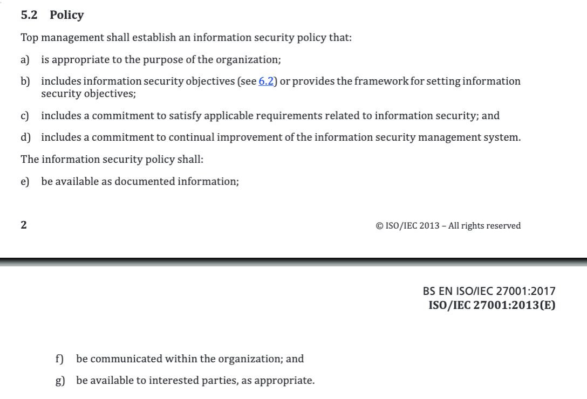

#### Main Topics

* Demonstrate understanding of the principles of cyber security and the CIA triad (MLO 1)
* Know how to, and be able to, use and interpret international standards (MLO 2, 3)
* Establish, and justify, contextual elements of a risk management plan (MLO 2, 3).

#### Sub titles:
* [Definitions](#definitions)
* [Terminology](#terminology)
* [Threats and Risks](#threats-and-risks)
* [Risk Modelling and Assessment](#risk-modelling-and-assessment)
    * [Working with BS7799-3 and ISO/IEC 27001](#working-with-bs7799-3-and-isoiec-27001)
* [Activity 1 : Establishing context](#activity-1--establishing-context)
* [Why do this?](#why-do-this)
* [Activity 2: Establishing the ISMS boundary](#activity-2-establishing-the-isms-boundary)
* [Activity 3: Identifying consequences](#activity-3-identifying-consequences)

# Definitions

* let’s introduce 4 key concepts which make up a system :
    * Subjects - a subject is an entity, within a system, that performs an action. It can be a person, a program, a
      manual process or an automated system made up of many parts.
    * Actions - an action is an operation which results in a change to the system state by altering, creating or
      removing objects. Actions are performed by subjects.
    * Objects - an object is an entity, within a system, on which an action has an effect. Depending on context,
      subjects may also be objects (for example, in a personnel records systems - individual records about staff members
      would be objects, but members of the personnel department could also be considered subjects as they can perform
      actions on the records held in the system).
    * State - a snapshot of all the subjects and objects at a given point in time. It contains all data present in the
      system.

# Terminology

* Computer Security: concern with protection of the computer systems, and the information they process
* Information Security: focus on protectiong the information itself.
    * This may not always hold in digital form.
    * Ensuring availability and integrity of the information always include to security consideration.
* Cyber Security: hard to differentiating from Computer and Information Security.
    * The common approach is combination of both of them the communication systems that allows information exchanged
      between computer systems.
    * Unauthorised access or modification of non-digital forms can also have an impact on cyberspace.

* CIA (AIC) Triad : the existing of these fundamentals are guarentee that security is being maintained.
    * the CIA triad ensures that data cannot be leaked (is confidential), or altered by an unauthorised actor (integrity
      is maintained) and is ready for use when it is required (is available).
    * Confidentiality : This property ensures that object are only **accessible** by the subject which has the rights to
      access to the object
        * Confused by privacy. Privacy is usually out of the ISMS, needs to consider and ensure that legal requirement
          compile by.
    * Integrity: this property ensures that the object can be **altered** by the subject who has the right o do it.
    * Availability: This property ensures the object can be accessible and alterable when subject is required.
        * This includes precautions against unpredictable events such as floods, fires, asteroid strikes, global
          pandemics etc.
            

# Threats and Risks

* Threats : Something which can cause of a danger.
* Risk: is the probability to get damage from that threat
    * Risk = Likelihood * Impact.
    * For example: an asteroid landing on your house will have a very high impact (in all senses of the word) rating (
      it’s clearly a disaster, not just for you but probably for most of the planet), but the probability of it
      happening is pretty low - so overall, the risk it poses is quite low.
    * low risk: situations are just inconvenient and easy to recover from
    * high risk: situations can cause real damage or harm

* [OWASP Risk Rating Methodology](https://owasp.org/www-community/OWASP_Risk_Rating_Methodology)
    * Step 1: Identifying a Risk
    * Step 2: Factors for Estimating Likelihood
    * Step 3: Factors for Estimating Impact
    * Step 4: Determining Severity of the Risk
    * Step 5: Deciding What to Fix
    * Step 6: Customizing Your Risk Rating Model
* [Thread Modeling](https://owasp.org/www-community/Threat_Modeling)

# Risk Modelling and Assessment

* Understanding organization:
    * The thread sec profession needs to be sure first CIA functioning of the the context of organization and processes.
    * Then needs to understand threads and risks.

* There is some Guidlines for it:
    * BS7799-3 (2017) “Information security management systems. Guidelines for information security risk
      management” [BS 7799-3:2017](https://bsol-bsigroup-com.libproxy.york.ac.uk/PdfViewer/Viewer?pid=000000000030354572)
    * BS EN ISO/IEC 27001 (2017) “Information technology - Security Techniques - Information security management systems
      Requirements” [BS EN ISO/IEC 27001:2017](https://bsol-bsigroup-com.libproxy.york.ac.uk/PdfViewer/Viewer?pid=000000000030347472)

* Working with standards
    * [The BSI Guide to Standardization](https://www.bsigroup.com/en-GB/standards/Information-about-standards/how-are-standards-made/The-BSI-Guide-to-Standardization/)
    * [ISO/IEC Directives, Part 2](https://www.iso.org/sites/directives/current/part2/index.xhtml) (Particularly
      important are the differences between “must”, “shall”, “should”, “can” and “may” as defined in this document)

## Working with BS7799-3 and ISO/IEC 27001

* Introduction and Clauses 1-5 of BS7799-3. and Clauses 4 and 5.2 of ISO/IEC 27001
* Clause 5, in particular, highlights the importance of the risk identification and assessment process being a two-way
  activity. People at all levels in the organisation are often best placed to understand and explain the threats and
  risks that impact their work.

* Step by step guid to exploring the key issues
    * Right Top, Context Establishment and contains a reminder that ISO/IEC 27001 clauses 4, 5.2 and 6 provide further
      information  
        
        
        
        

# Activity 1 : Establishing context

* The Car company:
* The company has
    * a warehouse which contains stock of all parts which they sell, with quantities based on historic trends,
    * a contract with an external courier firm for delivery of ordered items
    * an opt-in mailing list that allows them to send details of promotions and new products to subscribers
    * contracts with several manufacturers and importers for supply of new products
    * Staff to look after purchasing, sales, warehouse inventory management, contract management, personnel and
      advertising

* Task: Applying the ISO/IEC 27001 Clauses 4 and 5.3 to the company, making any reasonable assumptions that you need to,
  to produce the following:
    * A statement of the purpose of the business
    * A list of internal and external issues that relate to the information security system(s) within the business
    * A list of the interested parties relevant to the information security management system and the
      issues/requirements specific to them
    * A statement of the boundary of the business’s information security system (i.e. where does their ability to
      control and/or responsibility for security end, and what is included inside the boundary?)
    * A list of roles, within the information security management system, and what the responsibilities and authorities
      for those roles are, or should be.

* **Answers**:
* Purpose - to generate income by selling car parts to retail and trade customers
* To do this, it needs systems to
    * a. maintain an accurate list of parts in stock
    * b. allow customers to place orders for parts in stock
    * c. process payments
    * d. ship order once payment has been received.
    * e. forecast demand for parts based on historical data
        * i. - so historic data must be correct
    * f. issue orders to suppliers
    * g. maintain a list of customers who want to be emailed
    * i. with preferences about contact type & frequency maintained
    * h. Send emails to subscribers as required
    * i. Perform personnel functions
        * i. Payroll
        * ii. Tax
    * j. Perform accounting functions
        * i. Tax
        * ii. Money in
        * iii. Money out
* Issues
    * a. Internally - protect data from unauthorised access, ensure that data held is accurate, ensure that data held is
      available when required
    * b. Externally - interface correctly with supplier systems to generate orders, interface correctly with banks and
      others to make payments, interface correctly with payment processors to receive payments
* Interested parties
    * a. Customers - ordering & receiving goods, making payments, not being spammed, not having data “stolen”
    * b. Suppliers - receiving orders, being paid on time
    * c. Staff - being paid on time, having correct tax deducted, not having data “leaked” or “stolen” internally or
      extenally
    * d. Shareholders - reputation and cash-flow
    * e. Society - reputation, perception of the company and perception of security
* ISMS boundary - The company is responsible for all systems which it has complete control of, but not responsible for
  any external systems upon which it relies. It will ensure that the data it exchanges with external systems conforms to
  specifications, but cannot reasonably be responsible for the data once it has left the company’s own systems. It will
  share responsibility for data in transit and will only allow data to be transferred in a secure manner.
* Roles
    * a. Directors - setting policy, authorising changes, ensuring good governance and compliance with law and good
      practice. Monitoring for signs of breach and dealing with the same if they occur.
    * b. IT staff - ensuring that systems comply with internal and external requirements, including use of good security
      practices and compliance with legal requirements. Monitoring systems for signs of breach, reporting and dealing
      with the same.
    * c. All staff - ensuring CIA triad by accessing and entering only those data that they are required or permitted
      to. Monitoring systems for signs of breach and reporting the same. Externals (at interface points) might be
    * d. Suppliers - providing clear interfaces, keeping their own systems secure, sending and receiving only required
      data
    * e. Customers - using the systems in the way are designed to be used, providing correct data

# Why do this?

  

* how to identfy those threts?
    * where BS 7799-3 Clause 6 comes into play

* “To implement an Information Security Management System (ISMS), ensure compliance with the law, prepare a business
  continuity plan, or meet specific security requirements of our services and/or products.”
    * “ISMS” - an Information Security Management System - clearly identifies the scope as being Information, not
      physical, security.
    * “Compliance with the law” - means we need to think about the laws that apply to the organisation and its
      activities. At a minimum, we’re probably going to have to consider GDPR, but there may be others such as Human
      Rights legislation, financial conduct regulations etc.
    * “Business continuity plan” - a means for keeping the organisation running, albeit at a reduced or minimal level,
      if a disaster happens. That means we need to identify activities within the organisation and prioritise them in
      order of importance to the organisation’s continued survival.
    * “Services and/or products” - again, we need to think about what the organisation does or makes and what the
      security requirements for each of those is.

# Activity 2: Establishing the ISMS boundary

* applying BS 7799-3 Clauses 6.1 through 6.3,
* **Answer**
* My answer to the previous exercise contains two big hints about this in the form of :
  ISMS boundary - The company is responsible for all systems which it has complete control of, but not responsible for
  any external systems upon which it relies. It will ensure that the data it exchanges with external systems conforms to
  specifications, but cannot reasonably be responsible for the data once it has left the company’s own systems. It will
  share responsibility for data in transit and will only allow data to be transferred in a secure manner.
* And the list of systems required :
* it needs systems to
    * a. maintain an accurate list of parts in stock
    * b. allow customers to place orders for parts in stock
    * c. process payments
    * d. ship order once payment has been received.
    * e. forecast demand for parts based on historic data
        * i. - so historic data must be correct
    * f. issue orders to suppliers
    * g. maintain a list of customers who want to be emailed
    * i. with preferences about contact type & frequency maintained
    * h. send emails to subscribers as required
    * i. perform personnel functions
        * i. Payroll
        * ii. Tax
    * j. perform accountancy functions
        * i. Tax
        * ii. Money in
        * iii. Money out
* All of the systems that I have listed lie inside the boundary, with the possible exceptions of
    * some customer payment (item c) handling (e.g. customer payments might be outsourced to something like PayPal)
    * HR & payroll (item i) which might be dealt with through an external agency as well
    * Mailing lists (items g and h), which could be outsourced to another third party like Mailchimp

# Activity 3: Identifying consequences

* identify the potential consequences of a breach in each of them (there may be more than one type of consequence in
  many cases), and how severely (high, medium, low, insignificant) it would affect the organisation if such a breach
  happened.

* Answer:
* For this, I’m going to assume that some of the systems identified have been outsourced, so can be dropped from the
  list for now - these are customer payment handling, mailing lists and payroll it needs systems to
    * a. maintain an accurate list of parts in stock
    * b. allow customers to place orders for parts in stock
    * c. process payments
    * d. ship order once payment has been received.
    * e. forecast demand for parts based on historic data
        * i. - so historic data must be correct
    * f. issue orders to suppliers
    * g. maintain a list of customers who want to be emailed
        * i. with preferences about contact type & frequency maintained
    * h. Send emails to subscribers as required
    * i. Perform personnel functions
        * i. Payroll
        * ii. Tax
    * j. Perform accountancy functions
        * i. Tax
        * ii. Money in
        * iii. Money out

* So, for just a few of the elements listed above, I can start to construct a consequences table
  (without worrying about the exact nature of the breach yet)
    

* And so on....
* For each in-scope system/process we will have a list of adverse effects that a breach can have on the business, and an
  estimate for how severe that impact is. If we rank the impacted systems by severity of impact, we can start to
  prioritise.