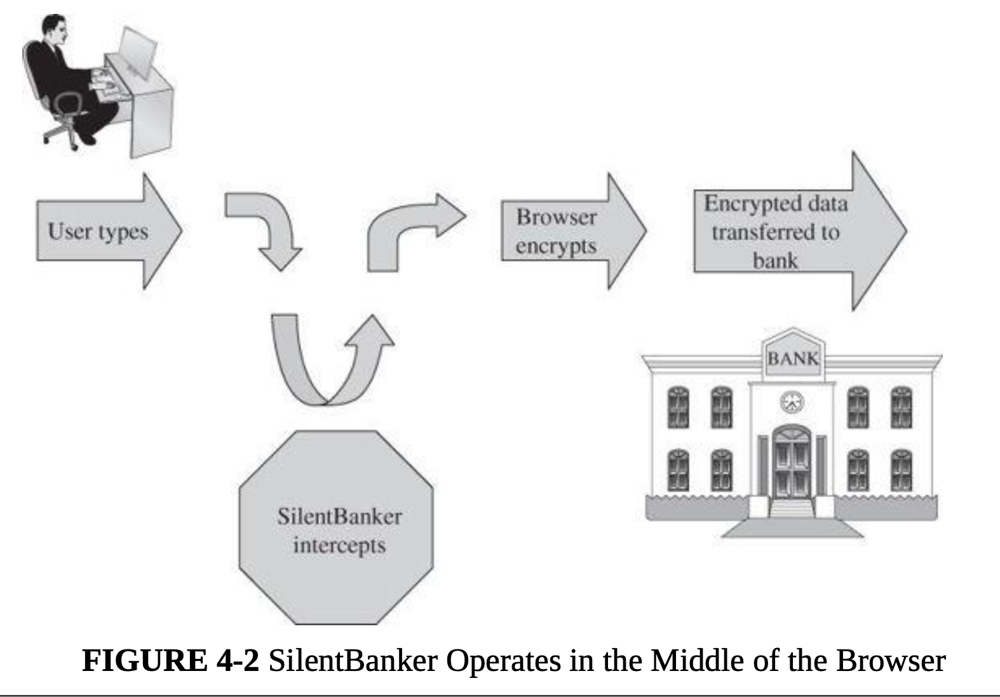
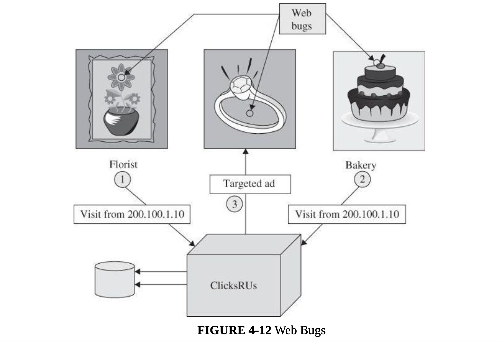
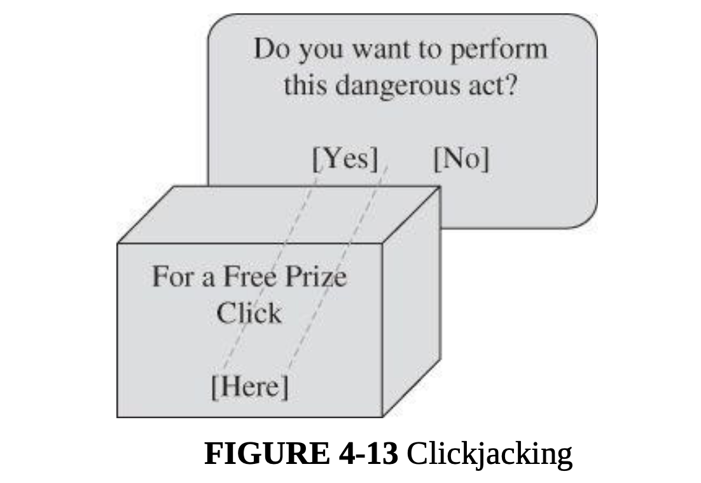

#### Main Topics

* Identify human and human-related factors which adversely affect cyber security (MLO 1)
* Identify and explain the significance and effect of common flaws in some common human interface elements (MLO 1, 4, 5)
* Demonstrate understanding of the importance of input check and sanitisation as a security mechanism (MLO 4, 5).

#### Sub titles:

# Human factors

* Information in computers are intangible, tahts why hard to understand humans the importance.
* Even they know the value of the data stored in it, they cause several breaches on the securities, like disclosing
  passwords, leaving laptops open etc.
* Even they aware of the potential securoty issues, hackers try to manipulate them with various technical or
  psychological ways.

## The Web—User Side

* Security issues for browsers arise from several complications to that simple description, such as these:
    * A browser often connects to more than the one address shown in the browser’s address bar.
    * Fetching data can entail accesses to numerous locations to obtain pictures, audio content, and other linked
      content.
    * Browser software can be malicious or can be corrupted to acquire malicious functionality.
    * Popular browsers support add-ins, extra code to add new features to the browser, but these add-ins themselves can
      include corrupting code.
    * Data display involves a rich command set that controls rendering, positioning, motion, layering, and even
      invisibility.
    * The browser can access any data on a user’s computer (subject to access control restrictions); generally the
      browser runs with the same privileges as the user.
    * Data transfers to and from the user are invisible, meaning they occur without the user’s knowledge or explicit
      permission.
* Browsers connect users to outside networks, but few users can monitor the actual data transmitted
* A browser’s effect is immediate and transitory: pressing a key or clicking a link sends a signal, and there is seldom
  a complete log to show what a browser communicated. In short, browsers are standard, straightforward pieces of
  software that expose users to significantly greater security threats than most other kinds of software

### Browser Attacks

* There are three attack vectors against a browser:
    * Go after the operating system so it will impede the browser’s correct and secure functioning.
    * Tackle the browser or one of its components, add-ons, or plug-ins so its activity is altered.
    * Intercept or modify communication to or from the browser.

* **Man-in-the-Browser:**
    * A man-in-the-browser attack is an example of malicious code that has infected a browser. Code inserted into the
      browser can read, copy, and redistribute anything the user enters in a browser. The threat here is that the
      attacker will intercept and reuse credentials to access financial accounts and other sensitive data.
    * Man-in-the-browser: Trojan horse that intercepts data passing through the browser
       
* **Keystroke Logger**
    * A keystroke logger (or key logger) is either hardware or software that records all keystrokes entered.
    * The logger either retains these keystrokes for future use by the attacker or sends them to the attacker across a
      network connection.

* Page-in-the-Middle
    * A page-in-the-middle attack is another type of browser attack in which a user is redirected to another page.
      Similar to the man-in-the-browser attack, a page attack might wait until a user has gone to a particular web site
      and present a fictitious page for the user.
        * As an example, when the user clicks “login” to go to the login page of any site, the attack might redirect the
          user to the attacker’s page, where the attacker can also capture the user’s credentials.
* **Program Download Substitution**
    * Coupled with a page-in-the-middle attack is a download substitution.
    * In a download substitution, the attacker presents a page with a desirable and seemingly innocuous program for the
      user to download, for example, a browser toolbar or a photo organizer utility.
    * What the user does not know is that instead of or in addition to the intended program, the attacker downloads and
      installs malicious code.
    * A user agreeing to install a program has no way to know what that program will actually do.
* **User-in-the-Middle**
    * A different form of attack puts a human between two automated processes so that the human unwittingly helps
      spammers register automatically for free email accounts.
    * A CAPTCHA is a puzzle that supposedly only a human can solve, so a server application can distinguish between a
      human who makes a request and an automated program generating the same request repeatedly.
    * CAPTCHA -> Completely Automated Public Turing test to tell Computers and Humans Apart
    * How captcha vulneribility can be eliminated?
        * By introducing some degree of randomness, such as an unpredictable number of characters in a string of text.

### Authentication

* The central failure of these in-the-middle attacks is faulty authentication.
* If A cannot be assured that the sender of a message is really B, A cannot trust the authenticity of anything in the
  message.
* **Human Authentication**
    * face-to-face authentication.
    * human-to-computer authentication that used sophisticated techniques such as biometrics and so-called smart
      identity cards.
    * These human factors can affect authentication in many contexts because humans often have a role in authentication,
      even of one computer to another.
* **Computer Authentication**
    * Computer authentication uses the same three primitives as human authentication, with obvious variations.
    * The problem, such as cryptographic key exchange, is how to develop a secret shared by only two computers.
    * In addition to obtaining solid authentication data, you must also consider how authentication is implemented.
    * if software can interfere with the authentication-checking code to make any value succeed, authentication is
      compromised. Thus, vulnerabilities in authentication include not just the authentication data but also the
      processes used to implement authentication.
    * Authentication discussion two-sided issue: The system needs assurance that the user is authentic, but the user
      needs that same assurance about the system.
        * This second issue has led to a new class of computer fraud called **phishing**, in which an unsuspecting user
          submits sensitive information to a malicious system impersonating a trustworthy one.
        * Common targets of **phishing** attacks are banks and other financial institutions: Fraudsters use the
          sensitive data they obtain from customers to take customers’ money from the real institutions.
        * Other phishing attacks are used to plant malicious code on the victim’s computer.

* Authentication is vulnerable at several points:
    * Usability and accuracy can conflict for identification and authentication: A more usable system may be less
      accurate. But users demand usability, and at least some system designers pay attention to these user demands.
    * Computer-to-computer interaction allows limited bases for authentication. Computer authentication is mainly based
      on what the computer knows, that is, stored or computable data. But stored data can be located by unauthorized
      processes, and what one computer can compute so can another.
    * Malicious software can undermine authentication by eavesdropping on (intercepting) the authentication data and
      allowing it to be reused later. Well- placed attack code can also wait until a user has completed authentication
      and then interfere with the content of the authenticated session.
    * Each side of a computer interchange needs assurance of the authentic identity of the opposing side. This is true
      for human-to-computer interactions as well as for computer-to-human.

* Successful Identification and Authentication
    * Appealing to everyday human activity gives some useful countermeasures for attacks against identification and
      authentication.
    * **Shared Secret**
        * Banks and credit card companies struggle to find new ways to make sure the holder of a credit card number is
          authentic.
            * For example, mums maiden name
        * financial institutions are asking new customers to file the answers to questions presumably only the right
          person will know
        * The basic concept is of a shared secret, something only the two entities on the end should know
            * To be effective, a shared secret must be something no malicious middle agent can know.
    * **One-Time Password**
        * As its name implies, a one-time password is good for only one use. To use a one-time password scheme, the two
          end parties need to have a shared secret list of passwords.
        * When one password is used, both parties mark the word off the list and use the next word the next time.
    * **Out-of-Band Communication**
        * Out-of-band communication means transferring one fact along a communication path separate from that of another
          fact.
            * For example, bank card PINs are always mailed separately from the bank card so that if the envelope
              containing the card is stolen, the thief cannot use the card without the PIN

    * **Continuous Authentication**
        * If two parties carry on an encrypted communication, an interloper wanting to enter into the communication must
          break the encryption or cause it to be reset with a new key exchange between the interceptor and one end.
        * Both of these attacks are complicated but not impossible.
            * However, this countermeasure is foiled if the attacker can intrude in the communication pre-encryption or
              post-decryption.
        * Encryption can provide continuous authentication, but care must be taken to set it up properly and guard the
          end points.

# Activities

* Secure Password submittion:
    * GET Method is not secure even by usinf HTTPS, because it sets userName and password on the Quesry paramaters which
      are visiable on URL
    * POST Form with SSL is the secure way to send username and passwords. Because data is sending on body and encripted
      with SSL.
* Data in the browser and in the server are rarely held in encrypted form because it slows processing down - so if
  anyone has access to either of those programs, there is potential for them to gain access to the unencrypted data.
* The only visible problem should be the GET method URL containing the request data - making it vulnerable to shoulder
  surfers. Everything going across the network, in either direction, should be in TLS1.3 packets and encrypted so that
  the even the nature of the protocol isn't obvious.

## 2-factor authentication (2FA)

* 2FA is involved in logon process, the system itself will generate a one-time password (OTP) which is sent to the user
  through another channel (e.g. email, mobile phone, code generating app).
* 2FA introduces an extra step for attackers - they need to obtain credentials AND control of the 2FA channel
* Use of mobile phone messaging is also a common way of sending the secondary credential to the user, because mobile
  phones are now very prevalent (a lot of people have them) and ubiquitous (people carry them around most of the time).

# Trust in the site

* 2 situation involving web content
    * false content
    * seeking to harm the viewer

* False or Misleading Content
    * The falsehoods that follow include both obvious and subtle forgeries.

* Defaced Web Site
    * The simplest attack, a website defacement, occurs when an attacker replaces or modifies the content of a
      legitimate web site.
    * For example, recent political attacks have subtly replaced the content of a candidate’s own site to imply falsely
      that a candidate had said or done something unpopular. Or using website modification as a first step, the attacker
      can redirect a link on the page to a malicious location, for example, to present a fake login box and obtain the
      victim’s login ID and password. All these attacks attempt to defeat the integrity of the web page.
    * A defacement is common not only because of its visibility but also because of the ease with which one can be done.
    * Web sites are designed so that their code is downloaded, enabling an attacker to obtain the full hypertext
      document and all programs directed to the client in the loading process.
    * An attacker can even view programmers’ comments left in as they built or maintained the code. The download process
      essentially gives the attacker the blueprints to the web site.

* Fake Web Site
    * The attacker can get all the images a real site uses; fake sites can look convincing.

* Fake Code
    * One transmission route we did not note was an explicit download: programs intentionally installed that may
      advertise one purpose but do something entirely different.
    * Perhaps the easiest way for a malicious code writer to install code on a target machine is to create an
      application that a user willingly downloads and installs.
    * smartphone apps are well suited for distributing false or misleading code because of the large number of young,
      trusting smartphone users.

### Protecting Web Sites Against Change

* Our favorite integrity control, encryption, is often inappropriate: Distributing decryption keys to all users defeats
  the effectiveness of encryption. However, two uses of encryption can help keep a site’s content intact.
* Integrity Checksums
    * Integrity checksums can detect altered content on a web site.
    * A checksum, hash code, or error detection code is a mathematical function that reduces a block of data (including
      an executable program) to a small number of bits.
    * Changing the data affects the function’s result in mostly unpredictable ways, meaning that it is
      difficult—although not impossible—to change the data in such a way that the resulting function value is not
      changed. Using a checksum, you trust or hope that significant changes will invalidate the checksum value.

* Signed Code or Data
    * Using an integrity checker helps the server-side administrator know that data are intact; it provides no assurance
      to the client. A similar, but more complicated approach works for clients, as well.
    * a digital signature is an electronic seal that can vouch for the authenticity of a file or other data object. The
      recipient can inspect the seal to verify that it came from the person or organization believed to have signed the
      object and that the object was not modified after it was signed.
    * A digital signature can vouch for the authenticity of a program, update, or dataset. The problem is, trusting the
      legitimacy of the signer.
    * A partial approach to reducing the risk of false code is signed code. Users can hold downloaded code until they
      inspect the seal. After verifying that the seal is authentic and covers the entire code file being downloaded,
      users can install the code obtained.
    * signed code may confirm that a piece of software received is what the sender sent, but not that the software does
      all or only what a user expects it to.

## Malicious Web Content

* Substitute Content on a Real Web Site
    * More mischievous attackers soon realized that in a similar way, they could replace other parts of a web site and
      do so in a way that did not attract attention.

* Web Bug
    * Tiny action points called web bugs can report page traversal patterns to central collecting points, compromising
      privacy.
    * a web page is made up of many files: some text, graphics, executable code, and scripts. When the web page is
      loaded, files are downloaded from a destination and processed; during the processing they may invoke other files (
      perhaps from other sites) which are in turn downloaded and processed, until all invocations have been satisfied.
    * When a remote file is fetched for inclusion, the request also sends the IP address of the requester, the type of
      browser, and the content of any cookies stored for the requested site. These cookies permit the page to display a
      notice such as “Welcome back, Elaine,” bring up content from your last visit, or redirect you to a particular web
      page.
    * Some advertisers want to count number of visitors and number of times each visitor arrives at a site. They can do
      this by a combination of cookies and an invisible image. A web bug, also called a clear GIF, 1x1 GIF, or tracking
      bug, is a tiny image, as small as 1 pixel by 1 pixel (depending on resolution, screens display at least 100 to 200
      pixels per inch), an image so small it will not normally be seen. Nevertheless, it is loaded and processed the
      same as a larger picture. Part of the processing is to notify the bug’s owner, the advertiser, who thus learns
      that another user has loaded the advertising image.

    * A single company can do the same thing without the need for a web bug. If you order flowers online, the florist
      can obtain your IP address and set a cookie containing your details so as to recognize you as a repeat customer. A
      web bug allows this tracking across multiple merchants.

    * Web bugs can also be used in email with images. A spammer gets a list of email addresses but does not know if the
      addresses are active, that is, if anyone reads mail at that address. With an embedded web bug, the spammer
      receives a report when the email message is opened in a browser. Or a company suspecting its email is ending up
      with competitors or other unauthorized parties can insert a web bug that will report each time the message is
      opened, whether as a direct recipient or someone to whom the message has been forwarded.
       

* Clickjacking
    * Clickjacking: Tricking a user into clicking a link by disguising what the link points to
    * The two technical tasks, changing the color to transparent and moving the page, are both possible because of a
      technique called framing, or using an iframe. An iframe is a structure that can contain all or part of a page, can
      be placed and moved anywhere on another page, and can be layered on top of or underneath other frames. Although
      important for managing complex images and content, such as a box with scrolling to enter a long response on a
      feedback page, frames also facilitate clickjacking.  
       

* Drive-By Download
    * Drive-by download: downloading and installing code other than what a user expects
    * Similar to the clickjacking attack, a drive-by download is an attack in which code is downloaded, installed, and
      executed on a computer without the user’s permission and usually without the user’s knowledge.

### Protecting Against Malicious Web Pages

* Access control accomplishes separation, keeping two classes of things apart. In this context, we want to keep
  malicious code off the user’s system; alas, that is not easy.
* Users download code to add new applications, update old ones, or improve execution.
* The other control is a responsibility of the web page owner: Ensure that code on a web page is good, clean, or
  suitable. Here again, the likelihood of that happening is small, for two reasons.
* Second, good (secure, safe) code is hard to define and enforce.

## Google's "site:" search operator

* Using Google’s “site:” search operator, you can specify that it should return only pages from the site you specify.
* If you don’t give any search terms at all, apart from the site, you should get a list of all pages indexed in Google (
  e.g. “site:york.ac.uk” should list all pages visible under the University’s domain).

# Other web flaws

* Someone interested in obtaining unauthorized data from the background database server crafts and passes SQL commands
  to the server through the web interface.
* Similar attacks involve writing scripts in Java. These attacks are called scripting or injection attacks because the
  unauthorized request is delivered as a script or injected into the dialog with the server.

## Cross-Site Scripting

* Scripting attack: forcing the server to execute commands (a script) in a normal data fetch request
* To a user (client) it seems as if interaction with a server is a direct link, so it is easy to ignore the possibility
  of falsification along the way. However, many web interactions involve several parties, not just the simple case of
  one client to one server.
* In an attack called cross-site scripting, executable code is included in the interaction between client and server and
  executed by the client or server.

* For Example :
    * http://www.google.com/search?name=&q=cross+site+scripting&ie=utf-8&oe=utf-8 &aq=t&rls=org.mozilla:en-US:
      official &client=firefox-a&lr=lang_en
    * This string would connect to badsite.com where it would execute the Java script xss that could do anything allowed
      by the user’s security context.

* Sometimes a volley from the client will contain a script for the server to execute. The attack can also harm the
  server side if the server interprets and executes the script or saves the script and returns it to other clients (who
  would then execute the script).
    * Such behavior is called a persistent cross-site scripting attack.

* A malicious user could post a comment with embedded HTML containing a script, such as but their browser would execute
  the malicious script.
    * For example : Cool story. KCTVBigFan

## SQL Injection

* SQL injection operates by inserting code into an exchange between a client and database server.
* To understand this attack, you need to know that database management systems (DBMSs) use a language called SQL (which,
  in this context, stands for structured query language) to represent queries to the DBMS.
* If the user can inject a string into this interchange, the user can force the DBMS to return a set of records. The
  DBMS evaluates the WHERE clause as a logical expression.
    * For Example:  QUERY = “SELECT * FROM trans WHERE acct=’”+ acctNum + ”’;”
    * If the user enters the account number as “‘2468’ OR ‘1’=‘1’” the resulting query becomes
    * QUERY = “SELECT * FROM trans WHERE acct=‘2468’ OR ‘1’=‘1’”
* Because ‘1’=‘1’ is always TRUE, the OR of the two parts of the WHERE clause is always TRUE, every record satisfies the
  value of the WHERE clause and so the DBMS will return all records in the database.
* The trick here, as with cross-site scripting, is that the browser application includes direct user input into the
  command, and the user can force the server to execute arbitrary SQL commands.

## Dot-Dot-Slash

* Enter the dot-dot. In both Unix and Windows, ‘..’ is the directory indicator for “predecessor.”
    * And ‘../..’ is the grandparent of the current location. So someone who can enter file names can travel back up the
      directory tree one .. at a time.

* For example, passing the following URL causes the server to return the requested file, autoexec.nt, enabling an
  attacker to modify or delete it.
    * http://yoursite.com/webhits.htw?CiWebHits &File=../../../../../winnt/system32/autoexec.nt

## Server-Side Include

* A potentially more serious problem is called a server-side include.
* The problem takes advantage of the fact that web pages can be organized to invoke a particular function automatically.
    * For example, many pages use web commands to send an email message in the “contact us” part of the displayed page.
    * The commands are placed in a field that is interpreted in HTML.

* One of the server-side include commands is exec, to execute an arbitrary file on the server. For instance, the
  server-side include command
    * <!—#exec cmd=”/usr/bin/telnet &”—>
* opens a Telnet session from the server running in the name of (that is, with the privileges of) the server.
* An attacker may find it interesting to execute commands such as chmod (change access rights to an object), sh (
  establish a command shell), or cat (copy to a file).

# Social Engineering and attacks on the wetware

## Fake Email

* an attacker can attempt to fool people with fake email messages.

## Fake Email Messages as Spam

* Spam is fictitious or misleading email, offers to buy designer watches, anatomical enhancers, or hot stocks, as well
  as get-rich schemes involving money in overseas bank accounts.
* Types of spam are rising:
    * fake “nondelivery” messages (“Your message x could not be delivered”)
    * false social networking messages, especially attempts to obtain login details
    * current events messages (“Want more details on [sporting event, political race, crisis] ?”)
    * shipping notices (“x company was unable to deliver a package to your address —shown in this link.”)

* Volume of Spam: more than %55 is spam mails
* Spammers make enough money to make the work worthwhile.
* **Why Send Spam?**
    * Advertising
    * Pump and Dump: popular spam topic is stocks
        * pump and dump game : A trader pumps—artificially inflates—the stock price by rumors and a surge in activity.
          The trader then dumps it when it gets high enough. The trader makes money as it goes up; the spam recipients
          lose money when the trader dumps holdings at the inflated prices, prices fall, and the buyers cannot find
          other willing buyers. Spam lets the trader pump up the stock price.
    * Malicious Payload
        * Clicking a link offering you a free prize, and you have actually just signed your computer up to be a
          controlled agent (and incidentally, you did not win the prize).
        * Spam email with misleading links is an important vector for enlisting computers as bots.
    * Links to Malicious Web Sites:

* **What to Do about Spam?**
    * Legal:
        * Spam is not yet annoying, harmful, or expensive enough to motivate international action to stop it.
        * Numerous countries and other jurisdictions have tried to make the sending of massive amounts of unwanted email
          illegal. In the United States, the CAN-SPAM act of 2003 and Directive 2002/58/EC of the European Parliament
          are two early laws restricting the sending of spam; most industrialized countries have similar legislation.
        * Defining the scope of prohibited activity is tricky, because countries want to support Internet commerce,
          especially in their own borders.
            * Almost immediately after it was signed, detractors dubbed the U.S. CAN-SPAM act the “You Can Spam” act
              because it does not require emailers to obtain permission from the intended recipient before sending email
              messages.
            * The act requires emailers to provide an opt-out procedure, but marginally legal or illegal senders will
              not care about violating that provision

    * Source Addresses:
        * source addresses in email can easily be forged. and Email senders are not reliable
        * Legitimate senders want valid source addresses as a way to support replies; illegitimate senders get their
          responses from web links, so the return address is of no benefit.
        * Accurate return addresses only provide a way to track the sender, which illegitimate senders do not want.
        * Internet protocols could enforce stronger return addresses
            * But Such a change would require a rewriting of the email protocols and a major overhaul of all email
              carriers on the Internet, which is unlikely unless there is another compelling reason, not security.
    * Screeners:
        * screeners, tools to automatically identify and quarantine or delete spam
        * Screeners are highly effective against amateur spam senders, but sophisticated mailers can pass through
          screeners.

    * Volume Limitations:
        * limiting the volume of a single sender or a single email system.
        * The problem is legitimate mass marketers, who send thousands of messages on behalf of hundreds of clients.
          Rate limitations have to allow and even promote commerce, while curtailing spam; balancing those two needs is
          the hard part.

    * Postage
        * A small fee could be charged for each email message sent, payable through the sender’s ISP.
        * The difficulty again would be legitimate mass mailers, but the cost of e-postage would simply be a recognized
          cost of business.

* **Fake (Inaccurate) Email Header Data**
    * one reason email attacks succeed is that the headers on email are easy to spoof, and thus recipients believe the
      email has come from a safe source
    * Proposals for more reliable email include authenticated Simple Mail Transport Protocol (SMTP) or SMTP-Auth (RFC
        2554) or Enhanced SMTP (RFC 1869), but so many nodes, programs, and organizations are involved in the Internet
              email system that it would be infeasible now to change the basic email transport scheme.

    * It is even possible to create and send a valid email message by composing all the headers and content on the fly,
      through a Telnet interaction with an SMTP service that will transmit the mail.
        * Consequently, headers in received email are generally unreliable.

* **Phishing**
    * In a phishing attack, the email message tries to trick the recipient into disclosing private data or taking
      another unsafe action.
    * A more pernicious form of phishing is known as spear phishing, email tempts recipients by seeming to come from
      sources the receiver knows and trusts.
        * What distinguishes spear phishing attacks is their use of social engineering: The email lure is personalized
          to the recipient, thereby reducing the user’s skepticism.

* **Protecting Against Email Attacks**
* need a way to ensure the authenticity of email from supposedly reliable sources.
    * PGP (Pretty Good Privacy):
        * PGP addresses the key distribution problem with what is called a “ring of trust” or a user’s “keyring.”
            * One user directly gives a public key to another, or the second user fetches the first’s public key from a
              server.
            * Some people include their PGP public keys at the bottom of email messages.
            * And one person can give a second person’s key to a third (and a fourth, and so on).
            * Thus, the key association problem becomes one of caveat emptor (let the buyer beware): If I trust you, I
              may also trust the keys you give me for other people.
            * The model breaks down intellectually when you give me all the keys you received from people, who in turn
              gave you all the keys they got from still other people, who gave them all their keys, and so forth.

        * Steps /actions of PGP
            * Create a random session key for a symmetric algorithm.
            * Encrypt the message, using the session key (for message confidentiality).
            * Encrypt the session key under the recipient’s public key.
            * Generate a message digest or hash of the message; sign the hash by encrypting it with the sender’s private
              key (for message integrity and authenticity).
            * Attach the encrypted session key to the encrypted message and digest. • Transmit the message to the
              recipient.

    * S/MIME (Secure Multipurpose Internet Mail Extensions):
        * S/MIME is the Internet standard for secure email attachments.
        * S/MIME is very much like PGP and its predecessors, PEM (Privacy-Enhanced Mail) and RIPEM.
        * The principal difference between S/MIME and PGP is the method of key exchange.
            * Basic PGP depends on each user’s exchanging keys with all potential recipients and establishing a ring of
              trusted recipients; it also requires establishing a degree of trust in the authenticity of the keys for
              those recipients.
            * S/MIME uses hierarchically validated certificates, usually represented in X.509 format, for key exchange.
            * Thus, with S/MIME, the sender and recipient do not need to have exchanged keys in advance as long as they
              have a common certifier they both trust.
        * S/MIME works with a variety of cryptographic algorithms, such as DES, AES, and RC2 for symmetric encryption.      