#### Main Topics

* Show an increased awareness of network traffic content and its implications for security issues
* Use simple network monitoring methods to capture and perform initial inspection of evidence of potential security
  issues
* Explain how some simple security and pen-testing tools can aid in assessment of cyber security

* module learning outcomes:
    * (MO1) Identify and analyse major threat types in a variety of systems
    * (MO4) Critically assess the relative merits of specific solution approaches for particular contexts
    * (MO5) Critically discuss leading-edge research in cyber security and the challenges faced.

* Network
    * in this chapter 6
    * Vulnerabilities
        * Threats in networks: wiretapping, modification, addressing
        * Wireless networks: interception, association, WEP, WPA
        * Denial of service and distributed denial of service
    * Protections
        * Cryptography for networks: SSL, IPsec, virtual private networks
        * Firewalls
        * Intrusion detection and protection systems
        * Managing network security, security information, and event management

#### Sub titles:

*

# Networks and networked services

* In a local environment, the physical wires are frequently secured physically or perhaps visually so wiretapping is not
  a major issue.
* With remote communication, the same notion of wires applies, but the wires are outside the control and protection of
  the user, so tampering with the transmission is a serious threat.

## Network Transmission Media

* When data items leave a protected environment, others along the way can view or intercept the data; other terms used
  are eavesdrop, wiretap, or sniff.
* Signal interception is a serious potential network vulnerability.
* Cable:
    * Each LAN connector (such as a computer board) has a unique address, called the MAC (for Media Access Control)
      address; each board and its drivers are programmed to label all packets from its host with its unique address (as
      a sender’s “return address”) and to take from the net only those packets addressed to its host.

* Packet Sniffing:
    * A device called a packet sniffer retrieves all packets on its LAN

* Radiation
    * Ordinary wire (and many other electronic components) emits radiation.
    * By a process called inductance an intruder can tap a wire and read radiated signals without making physical
      contact with the cable; essentially, the intruder puts an antenna close to the cable and picks up the
      electromagnetic radiation of the signals passing through the wire.
    * A cable’s inductance signals travel only short distances, and they can be blocked by other conductive materials,
    * or the attack to work, the intruder must be fairly close to the cable; therefore, this form of attack is limited
      to situations with physical access.

* Cable Splicing
    * The easiest form of intercepting a cable is by direct cut. If a cable is severed, all service on it stops.
    * As part of the repair, an attacker can splice in a secondary cable that then receives a copy of all signals along
      the primary cable. Interceptors can be a little less obvious but still accomplish the same goal
        * For example, the attacker might carefully expose some of the outer conductor, connect to it, then carefully
          expose some of the inner conductor and connect to it. Both of these operations alter the resistance, called
          the impedance, of the cable.
    * With a device called a sniffer someone can connect to and intercept all traffic on a network; the sniffer can
      capture and retain data or forward it to a different network.
    * Signals on a network are multiplexed, meaning that more than one signal is transmitted at a given time.
        * A LAN carries distinct packets, but data on a WAN may be heavily multiplexed as it leaves its sending host

* Optical Fiber
    * Optical fiber offers two significant security advantages over other transmission media.
        * First, the entire optical network must be tuned carefully each time a new connection is made. Therefore, no
          one can tap an optical system without detection. Clipping just one fiber in a bundle will destroy the balance
          in the network.
        * Second, optical fiber carries light energy, not electricity. Light does not create a magnetic field as
          electricity does. Therefore, an inductive tap is impossible on an optical fiber cable.
    * Microwave:
        * Microwave signals are not carried along a wire; they are broadcast through the air, making them more
          accessible to outsiders.
        * Microwave is a line-of-sight technology; the receiver needs to be on an unblocked line with the sender’s
          signal.
            * Typically, a transmitter’s signal is focused on its corresponding receiver because microwave reception
              requires a clear space between sender and receiver.
        * Not only can someone intercept a microwave transmission by interfering with the line of sight between sender
          and receiver, someone can also pick up an entire transmission from an antenna located close to but slightly
          off the direct focus point.
        * A microwave signal is usually not shielded or isolated to prevent interception
            * Microwave is, therefore, an insecure medium because the signal is so exposed.
            * However, because of the large volume of traffic carried by microwave links, an interceptor is unlikely to
              separate an individual transmission from all the others interleaved with it.
        * Microwave signals require true visible alignment, so they are of limited use in hilly terrain.

    * Satellite Communication:
        * Signals can be bounced off a satellite: from earth to the satellite and back to earth again.
        * Satellites are in orbit at a level synchronized to the earth’s orbit, so they appear to be in a fixed point
          relative to the earth.
        * Transmission to the satellite can cover a wide area around the satellite because nothing else is nearby to
          pick up the signal.
            * On return to earth, however, the wide dissemination radius, called the broadcast’s footprint, allows any
              antenna within range to obtain the signal without detection,
            * some signals can be intercepted in an area several hundred miles wide and a thousand miles long
        * However, because satellite communications are generally heavily multiplexed, the risk is small that any one
          communication will be intercepted.
           

* All network communications are potentially exposed to interception; thus, sensitive signals must be protected.
   

## Protocol Layers

* Network communications are performed through a virtual concept called the Open System Interconnection (or OSI) model.
* The OSI model, most useful conceptually, describes similar processes of both the sender and receiver.
   

* Interception can occur at any level of this model: For example, the application can covertly leak data, as we
  presented in Chapter 3, the physical media can be wiretapped,or a session between two subnetworks can be compromised.

## Addressing and Routing

* direct connections work only for a small number of parties. It would be infeasible for every Internet user to have a
  dedicated wire to every other user.
    * For reasons of reliability and size, the Internet and most other networks resemble a mesh, with data being boosted
      along paths from source to destination.

* Protocols:
    * A protocol is a language or set of conventions for how two computers will interact.
    * Independence is possible because we have defined protocols that allow a user to view the network at a high,
      abstract level of communication (viewing it in terms of user and data); the details of how the communication is
      accomplished are hidden within software and hardware at both ends.
    * The software and hardware enable us to implement a network according to a protocol stack, a layered architecture
      for communications;

* Addressing
    * At the network layer, a hardware device called a router actually sends the message from your network to a router
      on the network XXX .
        * The network layer adds two headers to show your computer’s address as the source and XXX’s address as the
          destination.
    * Together, the network layer structure with destination address, source address, and data is called a packet.
        * Packet: Smallest individually addressable data unit transmitted
    * MAC address: unique identifier of a network interface card that connects a computer and a network

    * **The message travel from computer to your router**
        * Every computer connected to a network has a network interface card (NIC) with a unique physical address,
          called a MAC address (for Media Access Control).
        * At the data-link level, two more headers are added, one for your computer’s NIC address (the source MAC) and
          one for your router’s NIC address.
        * A data-link layer structure with destination MAC, source MAC, and data is called a
          **frame**.
        * Every NIC puts data onto the communications medium when it has data to transmit and seizes from the network
          those frames with its own address as a destination address.

    * **On the receiving (destination) side**
        * The recipient network layer checks that the packet is really addressed to it.
        * Packets may not arrive in the order in which they were sent (because of network delays or differences in paths
          through the network), so the session layer may have to reorder packets.
        * The presentation layer removes compression and sets the appearance appropriate for the destination computer.
        * Finally, the application layer formats and delivers the data as a complete unit.
          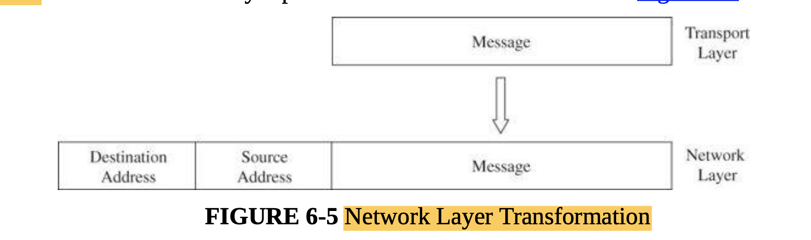 
* Routing:
    * The Internet has many devices called routers, whose purpose is to redirect packets in an effort to get them closer
      to their destination.
    * Routers direct traffic on a path that leads to a destination.
    * Routers uses a table to determine the quickest path to the destination
    * Routers communicate with neighboring routers to update the state of connectivity and traffic flow; with these
      updates the routers continuously update their tables of best next steps.

* Ports
    * Port: number associated with an application program that serves or monitors for a network service
    * Many common services are bound to agreed-on ports, which are essentially just numbers to identify different
      services; the destination port number is given in the header of each packet or data unit.
    * Ports 0 to 4095 are called well-known ports and are by convention associated with specific services.
    * Daemons : services which runs on background without user input ie mail service

# Attacks on networks and networked services

* Attacks categories:
    * **“Bugging” (eavesdropping and wiretapping):**
        * Where the attacker observes data flowing on the network in order to copy it or obtain information which will
          assist another type of attack.
        * Note, though, that in modern systems which use switches in preference to hubs, an attacker can usually only
          observe data on the same subnet.
    * **Alteration (modification, fabrication: data corruption) :**
        * where the attacker changes data on the network, or inserts new data into the network in order to facilitate
          the attack - this can even involve the attacker assuming the identity of a legitimate network node through MAC
          and/or IP address spoofing in order to hide their presence
    * **Denial of service (Interruption: loss of service and Denial of service):**
        * where the attacker finds a way to interrupt or degrade normal network operations in order to disrupt
          operations.

# Threats to Network Communications

* 4 potential types of harms
    * interception, or unauthorized viewing
    * modification, or unauthorized change
    * fabrication, or unauthorized creation
    * interruption, or preventing authorized access

## Interception: Eavesdropping and Wiretapping

* Wiretapping is the name given to data interception, often covert and unauthorized.
* The name wiretap refers to the original mechanism, which was a device that was attached to a wire to split off a
  second pathway that data would follow in addition to the primary path.
* Now, of course, the media range from copper wire to fiber cables and radio signals, and the way to tap depends on the
  medium.
* Encryption is the strongest and most commonly used countermeasure against interception, although physical security (
  protecting the communications lines themselves), dedicated lines, and controlled routing (ensuring that a
  communication travels only along certain paths) have their roles, as well.

* What Makes a Network Vulnerable to Interception?
    * Anonymity:
        * An attacker can mount an attack from thousands of miles away and never come into direct contact with the
          system, its administrators, or users. The potential attacker is thus safe behind an electronic shield.
    * Many Points of Attack:
        * Access controls on one machine preserve the confidentiality of data on that processor.
        * However, when a file is stored in a network host remote from the user, the data or the file itself may pass
          through many hosts to get to the user.
        * One host’s administrator may enforce rigorous security policies, but that administrator has no control over
          other hosts in the network. Thus, the user must depend on the access control mechanisms in each of these
          systems.
    * Sharing
        * Because networks enable resource and workload sharing, networked systems open up potential access to more
          users than do single computers. Perhaps worse, access is afforded to more systems, so access controls for
          single systems may be inadequate in networks.
    * System Complexity":
        * Most users have no idea of all the processes active in the background on their computers.
        * The attacker can use this power to advantage by causing the victim’s computer to perform part of the attack’s
          computation
    * Unknown Perimeter:
        * A network’s expandability also implies uncertainty about the network boundary.
        * One host may be a node on two different networks, so resources on one network are accessible to the users of
          the other network as well.
        * Although wide accessibility is an advantage, this unknown or uncontrolled group of possibly malicious users is
          a security disadvantage.
        * A similar problem occurs when new hosts can be added to the network.
        * Every network node must be able to react to the possible presence of new, untrustable hosts.
           

    * Unknown Path:
        * there may be many paths from one host to another. Suppose that a user on host A1 wants to send a message to a
          user on host B3. That message might be routed through hosts C or D before arriving at host B3. Host C may
          provide acceptable security, but D does not.
          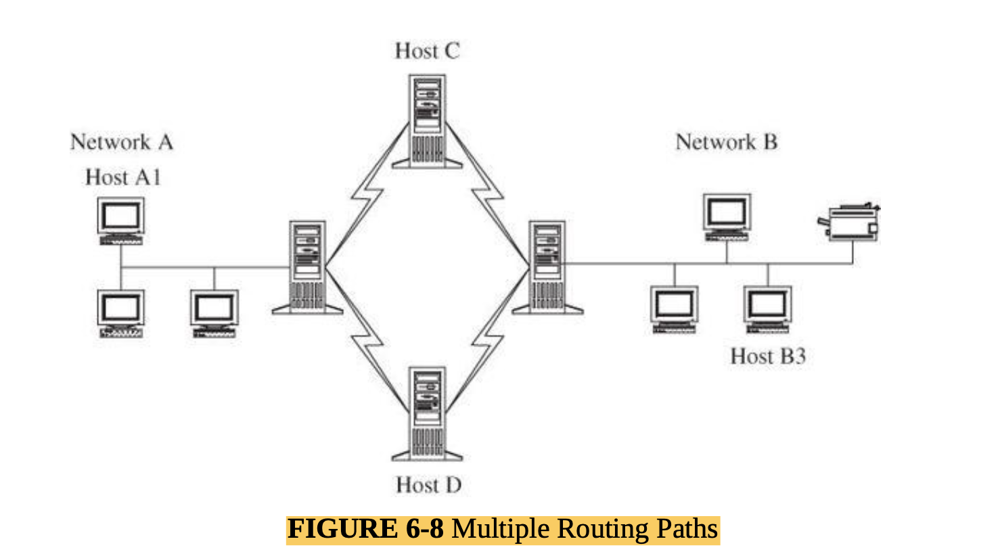 

## Modification, Fabrication: Data Corruption

* Network data corruption occurs naturally because of minor failures of transmission media. Corruption can also be
  induced for malicious purposes. Both must be controlled.
* The threat is that a communication will be changed during transmission. Sometimes the act involves modifying data en
  route; other times it entails crafting new content or repeating an existing communication. These three attacks are
  called modification, insertion, and replay, respectively.
* You should keep in mind that data corruption can be intentional or unintentional, from a malicious or nonmalicious
  source, and directed or accidental. Data corruption can occur during data entry, in storage, during use and
  computation, in transit, and on output and retrieval.
* The TCP/IP protocol suite (which we describe later in this chapter), is used for most Internet data communication.
  TCP/IP has extensive features to ensure that the receiver gets a complete, correct, and well-ordered data stream,
  despite any errors during transmission.
   

* Sequencing
    * A sequencing attack or problem involves permuting the order of data. Most commonly found in network
      communications, a sequencing error occurs when a later fragment of a data stream arrives before a previous one:
      Packet 2 arrives before packet 1.
    * Sequencing errors are actually quite common in network traffic.
    * Network protocols such as the TCP suite ensure the proper ordering of traffic

* Substitution
    * A substitution attack is the replacement of one piece of a data stream with another.
    * Substitution errors can occur with adjacent cables or multiplexed parallel communications in a network;
      occasionally, interference, called crosstalk. allows data to flow into an adjacent path.
    * A malicious attacker can perform a substitution attack by splicing a piece from one communication into another.
      Thus, Amy might obtain copies of two communications, one to transfer $100 to Amy, and a second to transfer
      $100,000 to Bill, and Amy could swap either the two amounts or the two destinations.
    * The obvious countermeasure against substitution attacks is encryption, covering the entire message (making it
      difficult for the attacker to see which section to substitute) or creating an integrity check (making modification
      more evident).

* Insertion
    * An insertion attack, which is almost a form of substitution, is one in which data values are inserted into a
      stream. An attacker does not even need to break an encryption scheme in order to insert authentic-seeming data; as
      long as the attacker knows precisely where to slip in the data, the new piece is encrypted under the same key as
      the rest of the communication.

* Replay
    * In a replay attack, legitimate data are intercepted and reused, generally without modification. A replay attack
      differs from both a wiretapping attack (in which the content of the data is obtained but not reused) and a
      man-in-the-middle attack
    * An unscrupulous merchant processes a credit card or funds transfer on behalf of a user and then, seeing that the
      transfer succeeded, resubmits another transaction on behalf of the user.
    * With a replay attack, the interceptor need not know the content or format of a transmission; in fact, replay
      attacks can succeed on encrypted data without altering or breaking the encryption.
    * Replay attacks can also be used with authentication credentials. Transmitting an identity and password in the
      clear is an obvious weakness, but transmitting an identity in the clear but with an encrypted password is
      similarly weak,
       

    * A similar example involves cookies for authentication.
    * If the attacker can intercept cookies being sent to (or extract cookies stored by) the victim’s browser, then
      returning that same cookie can let the attacker open an email session under the identity of the victim.
    * Replay attacks are countered with a sequencing number. T
    * Each recipient keeps the last message number received and checks each incoming message to ensure that its number
      is greater than the previous message received.

* Physical Replay
    * Similar attacks can be used against biometric authentication. A similar attack would involve training the camera
      on a picture of the room under surveillance, then replaying a picture while the thief moves undetected throughout
      the vault.
    * replay attacks can circumvent ordinary identification, authentication, and confidentiality defenses, and thereby
      allow the attacker to initiate and carry on an interchange under the guise of the victim. Sequence numbers help
      counter replay attacks.

### Modification Attacks in General

* general concept of integrity
    * precise
    * accurate
    * unmodified
    * modified only in acceptable ways
    * modified only by authorized people
    * modified only by authorized processes • consistent
    * internally consistent
    * meaningful and usable

## Interruption: Loss of Service

* Network design incorporates redundancy to counter hardware failures.
* Networks, and especially the Internet, have solidly assured service. From the earliest designs for the Internet,
  redundancy and fault tolerance were important characteristics, and the robustness remains. In part this strength is
  due to the mesh architecture of the Internet.
* we have to consider not only whether service is or is not present, but also whether the amount present is adequate.

* Routing
    * Internet routing protocols are complicated.
    * Routing supports efficient resource use and quality of service. Misused, it can cause denial of service.

* Excessive Demand
    * Denial-of-service attacks usually try to flood a victim with excessive demand.
    * Malicious denial-of-service attacks are usually effected through excessive demand. The goal is to overload the
      victim’s capacity or reduce the ability to serve other legitimate requesters.
* Component Failure

## Port Scanning

* Scanning is an inspection activity, and as such it causes no harm itself
* However, scanning is often used as a first step in an attack, a probe, to determine what further attacks might
  succeed.
* security professionals maintain and distribute similar lists, as well as tools to test for vulnerabilities
* Sending an attack against a machine that is not vulnerable is at least time consuming but worse, may even make the
  attacker stand out or become visible and identifiable
* An easy way to gather network information is to use a port scanner, a program that, for a particular Internet (IP)
  address, reports which ports respond to queries and which of several known vulnerabilities seem to be present.
* A port scan maps the topology and hardware and software components of a network segment.
* Port scanning tells an attacker three things:
    * which standard ports or services are running and responding on the target system,
    * what operating system is installed on the target system,
    * and what applications and versions of applications are present
* It can be obtained quietly, anonymously, without identification or authentication, drawing little or no attention to
  the scan.
* an attacker can devise an attack to exploit precisely that vulnerability. Thus, a port scan can be a first step in a
  more serious attack.
* Nmap has many options; an outsider can fingerprint owners and users, identify common services running on uncommon
  ports, map the connectivity (routes between) machines, or deduce the real kind of unknown device.
* Notice that with only a couple of commands the attacker in the two examples shown learns
    * how many hosts there are
    * what their IP addresses are
    * what their physical (MAC) addresses are
    * what brand each is
    * what operating system each runs, and what version
    * what ports respond to service requests
    * what service applications respond, and what program and version they are running
    * how long responses took (which reveals speed of various network connections and thus may indicate the design of
      the network)

* Harm from Port Scanning
    * Network and vulnerability scanners can be used positively for management and administration and negatively for
      attack planning.
    * Network and vulnerability scanners, of which Nmap is only one example, have two purposes, one good and one bad.
    * The good use is by network administrators or system owners who will explore their networks with the tool.
    * the bad use of a network scanner is to allow an attacker to learn about a system.
    * network administrators should use port scanners themselves to determine how much outsiders can learn of their
      network.

# Wireless Network Security

* Wireless communication will never be as secure as wired, because the exposed signal is more vulnerable.
* Wireless Communication
    * Wireless (and also wired) data communications are implemented through an orderly set of exchanges called a
      protocol

* The 802.11 Protocol Suite
    * The 802.11 protocols all describe how devices communicate in the 2.4 GHz radio signal band (essentially 2.4
      GHz–2.5 GHz) allotted to WiFi. T
    * a wireless network consists of an access point or router that receives, forwards and transmits data, and one or
      more devices, sometimes called stations, such as computers or printers, that communicate with the access point.
    * A NIC identifies itself (and hence its connected computer) by a supposedly unique MAC address.
       

* WiFi Access Range
    * Distance is an important consideration with WiFi, but it is hard to state precisely. Wireless signals degrade
      because of interference from intervening objects, such as walls, machinery, and trees, as well as distance; a
      receiver will not establish, or may drop, a connection with a poor signal, one that is weak or has lost a lot of
      data.
      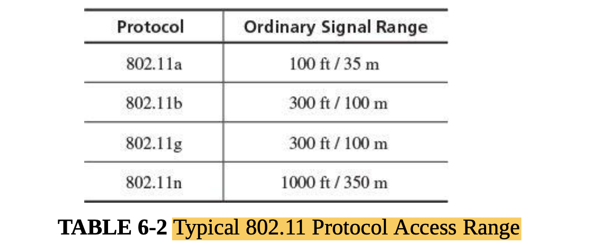 

* WiFi Frames
    * Each WiFi data unit is called a frame. Each frame contains three fields: MAC header, payload, and FCS (frame check
      sequence).
    * The MAC header contains fixed-sized fields, including
        * frame type: control, management, or data
        * ToDS, FromDS: direction of this frame: to or from the access point
        * fragmentation and order control bits
        * WEP (wired equivalent privacy) or encryption bit: encryption, described shortly
        * up to four MAC addresses (physical device identifiers): sender and receiver’s addresses, plus two optional
          addresses for traffic filtering points

    * The payload or frame body is the actual data being transmitted, 0–2304 bytes whose structure depends on the
      application handling the data.
    * The frame check sequence is an integrity check (actually a cyclic redundancy) to ensure accurate transmission of
      the entire frame.
       

    * Management Frames:
        * Of the three frame types, management frames are the most important now because they control the establishment
          and handling of a series of data flows.
        * A beacon signal advertises a network accepting connections.
        * **Beacon**. Each access point periodically sends a beacon frame to announce its presence and relay
          information, such as timestamp, identifier, and other parameters regarding the access point
        * **Authentication**. A NIC initiates a request to interact with an access point by sending its identity in an
          authentication frame. The access point may request additional authentication data and finally either accepts
          or rejects the request. Either party sends a deauthentication frame to terminate an established interaction.
            * A NIC requests a connection by sending an authentication frame.
        * **Association request and response**. Following authentication, a NIC requests an access point to establish a
          session, meaning that the NIC and access point exchange information about their capabilities and agree on
          parameters of their interaction.
            * An important part of establishing the association is agreeing on encryption.
            * A deassociation request is a request to terminate a session.

    * SSID
        * An SSID is a string to identify a wireless access point.
        * A Service Set Identifier, or SSID, is the identification of an access point; it is a string of up to 32
          characters chosen by the access point’s administrator.
        * Obviously SSIDs need to be unique in a given area to distinguish one wireless network from another.

## Vulnerabilities in Wireless Networks

* Confidentiality
    * data values themselves are the most sensitive
    * the duration or volume of communication may also be sensitive
    * whether web page access, peer-to-peer networking, email, or network management, can also be confidential.
    * he mode in which two units communicate—encrypted or not and if encrypted, by what algorithm—is potentially
      sensitive.

* Integrity
    * WiFi radio receivers that receive two signals prefer the stronger one. So if a rogue access point intercepts a
      signal from a client and sends a strong signal back, appearing to come from the server’s access point, the rogue
      may be able to commandeer the communications stream.

* Availability
    * Availability involves three potential problems.
        * First, the most obvious, occurs when a component of a wireless communication stops working because hardware
          fails, power is lost, or some other catastrophe strikes.
        * A second problem of availability is loss of some but not all access, typically manifested as slow or degraded
          service. Service can be slow because of interference, for example, if tree leaves in a wind interfere with
          frame transmission, so the receiving end recognizes loss of some data and must request and wait for
          retransmission.
            * Service can also be slow if the demand for service exceeds the capacity of the receiving end, so either
              some service requests are dropped or the receiver handles all requests slowly.
        * third problem: the possibility of rogue network connection. Some WiFi access points are known as public hot
          spots and are intentionally available to anyone who wants to connect.

    * Free does not necessarily imply secure
    * In this case, although service is available, the security of that service may be limited.

* Unauthorized WiFi Access
    * WiFi protocols that access basically involves three steps:
        * The access point broadcasts its availability by sending a beacon, an invitation for devices to connect with
          it.
        * A device’s NIC responds with a request to authenticate, which the access point accepts.
        * The device’s NIC requests establishment of an association, which the access point negotiates and accepts.
    * threats at each of these points.
        * In step 1, anyone can pick up and reply to a broadcast beacon.
        * In step 2, the authentication is not rigorous; in basic WiFi mode the access point accepts any device, without
          authentication.
        * In step 3, any access point can accept an association with any device.

* WiFi Protocol Weaknesses
* Picking Up the Beacon
    * A client and an access point engage in the authentication and association handshake to locate each other
    * In what is called **open mode**, an access point continually broadcasts its appeal in its beacon, indicating that
      it is open for the next step in establishing a connection.
    * **Closed** or **stealth** mode, also known as SSID cloaking, reverses the order of the steps: The client must
      first send a signal seeking an access point with a particular SSID before the access point responds to that one
      query with an invitation to connect.
    * **In open mode an access point continually broadcasts its SSID; in closed mode a client continually broadcasts a
      request to connect to a given SSID from a given MAC address.**
      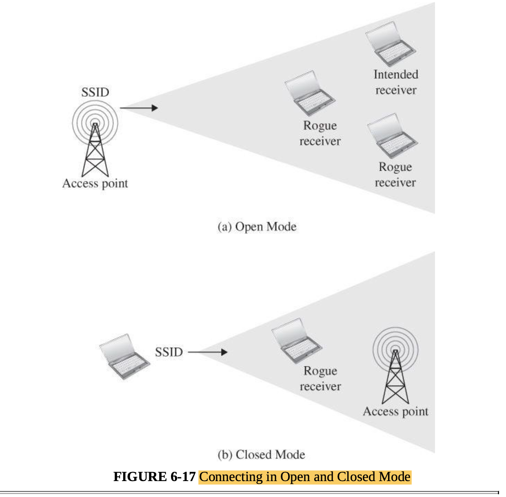 
    * Operating in closed mode would seem to be a successful way to prevent unauthorized access: If you do not know the
      SSID, you cannot request a connection. However, closed mode leaves the client exposed.
    * In open mode, the client is quiet, monitoring beacons, until it finds one to which it wants to connect; thus, the
      client is not constantly visible.
    * In open mode, however, the client effectively becomes a beacon, sending a continuing series of messages saying,

* SSID in All Frames
    * Broadcasting the desired SSID in closed mode reveals the identity of a sought-after access point.
    * Worse, in both closed and open modes, even after the initial handshake, all subsequent management and data frames
      contain this same SSID, so sniffing any one of these frames reveals the SSID.
    * Thus, anyone who sniffs the SSID can save the SSID (which is seldom changed in practice) to use later. A snooper
      can reasonably guess that the client will attempt to connect to this same access point again.
    * Thus, the rogue has the information needed to imitate either the client or the access point in the future.
    * Authentication in Wireless Networks
        * authentication in step 2 could be accomplished by accepting only devices on the positive accept list.

* Changeable MAC Addresses
    * An operating system can send any address as if it were the MAC address of a NIC.
    * Changing the NIC’s MAC address not only undermines MAC-based authentication on an access point, it can lead to a
      larger attack called MAC spoofing, in which one device impersonates another, thereby assuming another device’s
      communication session.

* Stealing the Association
    * Unfortunately, if a rogue process has intercepted an SSID and spoofed a MAC address, the two best points of access
      control have been lost.
    * In fact, some access point hardware and firmware is known to be flawed and will accept any association it can
      receive [AND04a]. These are known as promiscuous access points.

* Preferred Associations
    * To simplify connecting, the wireless interface software builds a list of favorite connection points (home, school,
      office) to which it will try to connect automatically.

## Failed Countermeasure: WEP (Wired Equivalent Privacy)

* Wired equivalent privacy, or WEP, was intended as a way for wireless communication to provide privacy equivalent to
  conventional wire communications.
* Weaknesses in WEP were identified as early as 2001, and the weaknesses are now so severe that a WEP connection can be
  cracked with available software in a few minutes
* WEP Security Weaknesses
    * The WEP protocol was meant to provide users immunity to eavesdropping and impersonation attacks, which, at the
      time, were not a serious threat
    * WEP uses an encryption key shared between the client and the access point. To authenticate a user, the access
      point sends a random number to the client, which the client encrypts using the shared key and returns to the
      access point.

* Weak Encryption Key
    * First, the WEP standard allows either a 64- or 128-bit encryption key, but each key begins with a 24-bit
      initialization vector (IV), which has the effect of reducing the key length to 40 or 104 bits.

* Static Key
    * The WEP encryption key is shared between sender and receiver
    * the same encryption key tends to be used for a long time.

* Weak Encryption Process
    * Even if the key is strong, it really has an effective length of only 40 or 104 bits because of the way it is used
      in the algorithm. A brute-force attack against a 40-bit key succeeds quickly.

* Weak Encryption Algorithm
    * The third problem with WEP is the way it performs encryption

* Initialization Vector Collisions
    * A final encryption problem with WEP concerns the initialization vector, which becomes the first 24 bits of the
      encryption key can predictible

* Faulty Integrity Check
    * As if encryption problems were not enough, WEP was not designed for strong integrity.
    * The integrity check uses a well-known algorithm.

* No Authentication
    * WEP uses short, infrequently changed encryption keys, it requires no authentication, and its integrity is easily
      compromised.

## Stronger Protocol Suite: WPA (WiFi Protected Access)

* The alternative to WEP is WiFi Protected Access or WPA, designed in 2003.
*
    1. Strictly speaking, there is a difference between these: WPA was the original replacement for WEP; WPA2 goes
       beyond WPA by requiring support for the strong AES encryption algorithm. Furthermore, to use the trademarked
       “WiFi Certified” designation, a device must be certified by the WiFi alliance. In practice, all WiFi devices sold
       now meet the WPA2 standard. In this book we follow common usage and use WPA to refer to both the WPA and WPA2
       protocols.
* Strengths of WPA over WEP
* Non-Static Encryption Key
    * WPA has a key change approach, called Temporal Key Integrity Program (TKIP), by which the encryption key is
      changed automatically on each packet.
    * WPA also uses a hierarchy of keys to establish a new key for each session. These keys permit the access point (
      called the authenticator) and the connecting device (called the supplicant) to create and exchange keys for
      confidentiality and integrity that are unique to the association session.
* Authentication
    * WPA employs the extensible authentication protocol (EAP) by which authentication can be done by password, token,
      certificate, or other mechanism.
* Strong Encryption
    * WPA2 adds AES as a possible encryption algorithm (although RC4 is also still supported for compatibility).
* Integrity Protection
    * WPA includes a 64-bit integrity check that is encrypted.
* Session Initiation
    * WPA fixes many shortcomings of WEP by using stronger encryption; longer, changing keys; and secure integrity
      checks.
    * Setup for WPA involves three protocol steps: authentication, a four-way handshake (to ensure that the client can
      generate cryptographic keys and to generate and install keys for both encryption and integrity on both ends), and
      an optional group key handshake (for multicast communication).

### Attacks on WPA

* Man-in-the-Middle
    * it is exploited when a clever attacker can intrude in a legitimate conversation, intercepting and perhaps changing
      both sides, in order to surreptitiously obtain or modify protected data.

* Incomplete Authentication
    * At one point the supplicant (client) is required to authenticate to the access point, but the supplicant has no
      basis for assurance that the access point is legitimate, that is, that a malicious party is not sending signals
      pretending to be an access point. Thus, the supplicant can be forced to reveal authentication data to an
      unauthorized third party.

* Exhaustive Key Search
    * the key management of WPA has come under scrutiny. WPA uses a 256-bit base key, which seems long enough to be
      secure.

# Denial of Service

* The source of a denial-of-service attack is typically difficult or impossible to determine with certainty.
* Denial of service is devastating to a commercial firm that depends on computing for customer interaction, as well as
  back-end functions like inventory management and scheduling.
* The source of such attacks is often unclear, because determining where the traffic was routed from most recently is
  not the same as identifying the original source of the attack.
* A denial-of-service, or DoS, attack is an attempt to defeat availability, the third of the three basic properties to
  be preserved in computer security.
* DDOS means a user is denied access to authorized services or data. Confidentiality and integrity are concerned with
  preventing unauthorized access; availability is concerned with preserving authorized access.
* Confidentiality and integrity tend to be binary: Data or objects either are or are not kept private and unmodified;
  availability can be more nuanced, in that there may be service but in insufficient quantity or at unacceptable
  responsiveness.

### How Service Is Denied

* how you might deny access in a computer network.
    * One potential weakness is the capacity of the system. If demand is higher than the system can handle, some data
      will not move properly through the network. These attacks are also known as volume-based or volumetric attacks.
    * Similarly to overwhelming basic network capacity, an attack can exhaust the application that services a particular
      network, in what is called an application- based attack.
    * Another way to deny service is to cut or disable the communications link between two points. Many users will be
      unable to receive service, especially if that link is a single point through which much traffic must pass.
    * A final cause of denied access is a hardware or software failure.
* DOS can occur from excessive volume, a failed application, a severed link, or hardware or software failure.

* Flooding
    * An attacker can try for the same overloading effect by presenting commands more quickly than a server can handle
      them; servers often queue unmet commands during moments of overload for service when the peak subsides, but if the
      commands continue to come too quickly, the server eventually runs out of space to store the demand. Such an attack
      is called an overload or flood.
    * A denial-of-service flooding attack can be termed volumetric, meaning it simply seeks to saturate or exhaust the
      capacity of a critical telecommunications link.

* Blocked Access
    * consider a traffic accident that stops traffic in both directions of a busy, two-lane road.
    * The attacker could exploit a software vulnerability in an application and cause the application to crash
    * Yet another approach would be for the attacker to manipulate access control data, deleting access permissions for
      the resource, or to disable the access control mechanism so that nobody could be approved for access

* Access Failure
    * If a network works, administrators are tempted to expand it incrementally instead of redesigning it to address
      increased usage.
    * Furthermore, as in this situation, several causes, no one of which is enough by itself to cause a problem, can
      interact in a way that becomes serious.

### Flooding Attacks in Detail

* Insufficient Resources
    * Flooding a victim is basically an unsophisticated attack, although the means of performing the flooding can become
      sophisticated.

* Insufficient Capacity
    * If the attacker’s bandwidth is greater than that of the victim, the attacker can overwhelm the victim with the
      asymmetry.
    * Flooding occurs because the incoming bandwidth is insufficient or resources—hardware devices, computing power,
      software, or table capacity —are inadequate.

### Network Flooding Caused by Malicious Code

* ICMP or Internet Control Message Protocols. Normally used for system diagnostics, these protocols do not have
  associated user application
* ICMP protocols include
    * ping, which requests a destination to return a reply, intended to show that the destination system is reachable
      and functioning
    * echo, which requests a destination to return the data sent to it, intended to show that the connection link is
      reliable (ping is actually a version of echo)
    * destination unreachable, which indicates that a destination address cannot be accessed
    * source quench, which means that the destination is becoming saturated and the source should suspend sending
      packets for a while
* Protocols can also be used to attack a system.
* peculiarities or oversights in the protocols or their implementations can open the way for an attacker to exploit a
  weakness to overwhelm the code supporting the protocol function

* Ping of Death
    * A ping of death is a simple attack, using the ping command that is ordinarily used to test response time from a
      host. Since ping requires the recipient to respond to the packet, all the attacker needs to do is send a flood of
      pings to the intended victim
      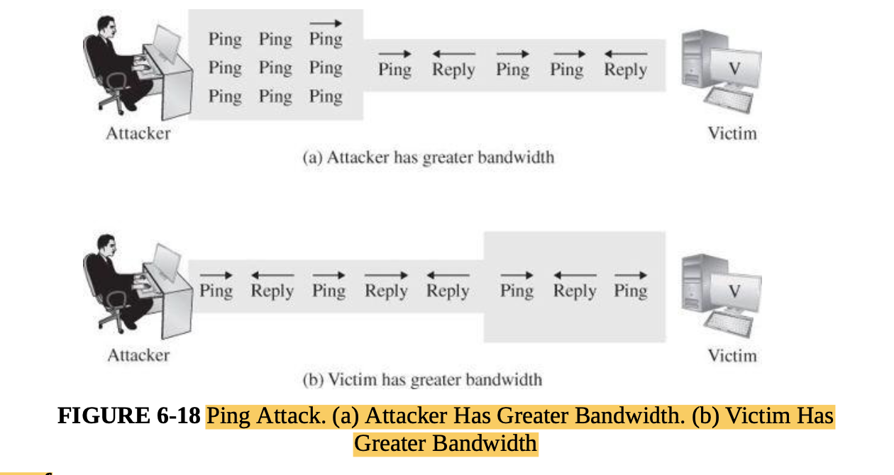 

* Smurf
    * The smurf attack is a variation of a ping attack.
    * It uses the same vehicle, a ping packet, with two extra twists.
        * First, the attacker chooses a network of unwitting victims that become accomplices.
        * The attacker spoofs the source address in the ping packet so that it appears to come from the victim, which
          means a recipient will respond to the victim.
        * Then, the attacker sends this request to the network in broadcast mode by setting the last byte of the address
          to all 1s; broadcast mode packets are distributed to all hosts on the subnetwork. The attack is depicted in
          image below, showing the single broadcast attack being reflected back on the victim. In this way the attacker
          uses the entire subnetwork to multiply the attack’s effect.
           

* Echo–Chargen
    * The echo–chargen attack works between two hosts. Chargen is an ICMP protocol that generates a stream of packets to
      test the network’s capacity. Echo is another ICMP protocol used for testing; a host receiving an echo returns
      everything it receives to the sender.
    * The attacker picks two victims, A and B, and then sets up a chargen process on host A that generates its packets
      as echo packets with a destination of host B. Thus, A floods B with echo packets. But because these packets
      request the recipient to echo them back to the sender, host B replies by returning them to host A. As shown in
      image, this series puts the network infrastructures of A and B into an endless loop, as A generates a string of
      echoes that B dutifully returns to A, just as in a game of tennis. Alternatively, the attacker can make B both the
      source and destination address of the first packet, so B hangs in a loop, constantly creating and replying to its
      own messages.
       

* SYN Flood
    * This attack uses the TCP protocol suite, making the session-oriented nature of these protocols work against the
      victim.
    * Attackers using this approach usually do one more thing: They spoof a nonexistent return address in the initial
      SYN packet. Why? For two reasons. First, the attacker does not want to disclose the real source address in case
      someone should inspect the packets in the SYN_RECV queue to try to identify the attacker. Second, the attacker
      wants to make the malicious SYN packets indistinguishable from legitimate SYN packets to establish real
      connections. Choosing a different (spoofed) source address for each one makes them unique, as ordinary traffic
      would be. A SYN–ACK packet to a nonexistent address results in an ICMP Destination Unreachable response, but this
      is not the ACK for which the TCP connection is waiting. (TCP and ICMP are different protocol suites, so an ICMP
      reply does not necessarily get back to the sender’s TCP handler.)

* Network Flooding by Resource Exhaustion
    * Switching from one application to another, called context switching, requires time and memory because the current
      state of the application is saved and the previous state of the next application is reloaded.
    * If there are few active processes and few context switches, the overhead for each switch is negligible, but as the
      number of active processes increases, the proportion of time spent in context switching also grows, which means
      the proportion of time for actual computing decreases. With too many processes, a system can enter a state called
      thrashing, in which its performance fails because of nearly continuous context switching.

* IP Fragmentation: Teardrop
    * The teardrop attack misuses a feature ironically intended to improve network communication.
    * in the teardrop attack, the attacker sends a series of datagrams that cannot fit together properly. One datagram
      might say it is position 0 for length 60 bytes, another position 30 for 90 bytes, and another position 41 for 173
      bytes. These three pieces overlap, so they cannot be reassembled properly. In an extreme case, the operating
      system locks up with these partial data units it cannot reassemble, thus leading to denial of service.
      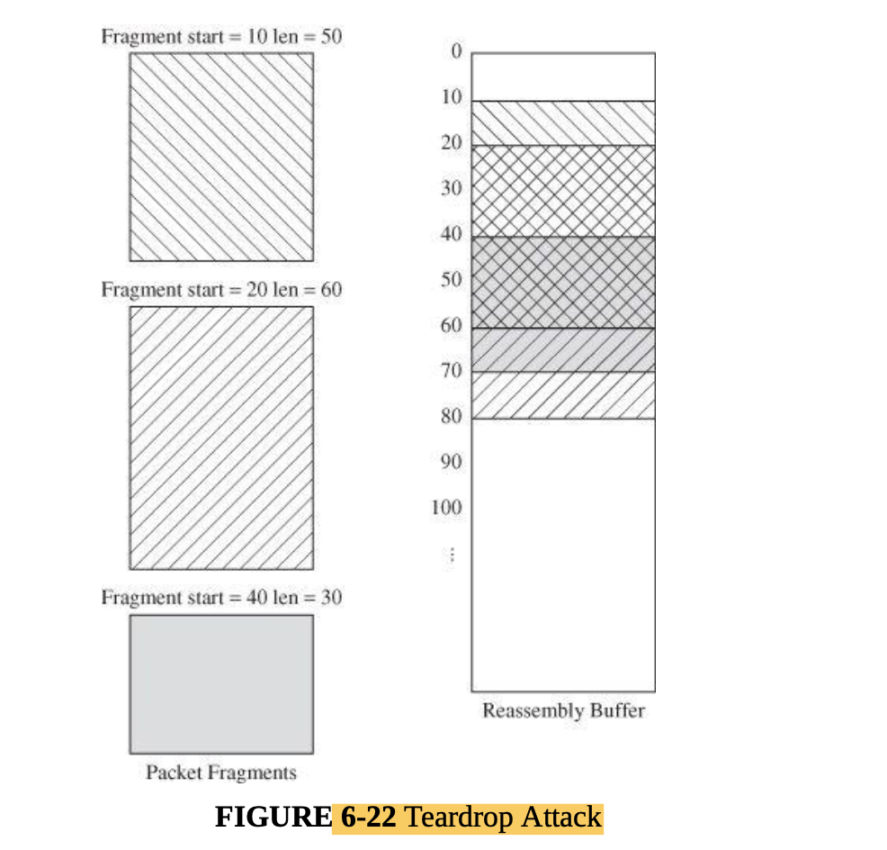 

## Denial of Service by Addressing Failures

* another way the attacker can deny service is by preventing access, physically or logically.
* DNS Spoofing
    * At the heart of Internet addressing is a protocol called DNS or Domain Name System protocol. DNS is the database
      of translations of Internet names to addresses, and the DNS protocol resolves the name to an address. For
      efficiency, a DNS server builds a cache of recently used domain names; with an attack called DNS poisoning,
      attackers try to insert inaccurate entries into that cache so that future requests are redirected to an address
      the attacker has chosen.
    * DNS service is implemented on a remote server, so a man-in-the-middle attack involves the attacker’s intercepting
      and replying to a query before the real DNS server can respond. Such a situation, called DNS spoofing, is
    * Any server can respond to a DNS lookup request; the first responder wins. Being first lets an attacker redirect
      traffic.
       

* Rerouting Routing
    * One example of a man-in-the-middle attack involves one node’s redirecting a network so that all traffic flows
      through the attacking node, leading to a potential for interception. Network routers are a loose confederation of
      mutually trusting components that arrange for delivery of all data through a network, including the Internet.
    * Each router sends a message to other routers, listing addresses to which it has a path; the other routers then add
      their paths and forward the extended list to the other routers as well. In this way, all routers learn of the
      connections of other routers.
    * Routers operate on implicit trust; what a router reports is believed to be true. Routers do, however, sometimes
      malfunction or their administrators enter inaccurate data, so routing tables can become corrupted from
      nonmalicious (and malicious) causes.

* Router Takes Over a Network
    * Routers communicate available paths by the BGP (Border Gateway) protocol, which is complex, so attacks against it
      are sophisticated but certainly feasible.

* Source Routing and Address Spoofing
    * Internet traffic usually travels by the best available route; that is, each router determines the best next path (
      called the next hop) to which to direct a data unit. However, a sender, using a process called source routing, can
      specify some or all of the intermediate points by which a data unit is transferred. With strict source routing,
      the complete path from source to destination is specified; with loose source routing, certain (some or all)
      required intermediate points are specified.
    * One use of source routing is to test or troubleshoot routers by forcing traffic to follow a specific path that an
      engineer can then trace. A more vicious use of source routing is to force data to flow through a malicious router
      or network link. Obviously, adding source routing to a data stream allows the man in the middle to force traffic
      to flow through his router. Because of its potential for misuse, loose source routing is blocked by many Internet
      routers.

### Traffic Redirection

* Routers are aware only of the routers with which they share a direct network connection, and they use gateway
  protocols to share information about their capabilities. Each router advises its neighbors about how well it can reach
  other network addresses. This characteristic allows an attacker to disrupt the network.

* outers trust each other to provide accurate data. Occasionally, due to nonmalicious corruption a router will send
  faulty data, but these sporadic failures have localized effect and heal themselves over time thanks to network
  reliability. However, an intentionally misleading router (or a device maliciously impersonating a router) can persist
  because of implicit trust. As you know, a standard countermeasure to exclude impostors is identification and
  authentication. But for efficiency, router communication protocols were designed without authentication. Only now are
  authenticating steps being added to router protocols.

## DNS Attacks

* A domain name server queries other name servers to resolve domain names it does not know. For efficiency, it caches
  the answers it receives so that it can convert that name more rapidly in the future. An address mapped by a DNS server
  can be retained for weeks or months.

* Name Server Application Software Flaws:
    * In the most common implementations of Unix, name servers run software called Berkeley Internet Name Domain, or
      BIND, or named (a shorthand for “name daemon”). BIND has had numerous flaws, including a now familiar buffer
      overflow. By overtaking a name server or causing it to cache spurious entries, an attacker can redirect the
      routing of any traffic, with an obvious implication for denial of service.

* Top-Level Domain Attacks:
    * Another way to deny service through address resolution failures involves incapacitating the Internet’s DNS system
      itself. I
    * Denial-of-service attacks are often second-level attacks. First, the attacker lodges attack code in a target
      system and then, after the code is in place, the attacker triggers that code to implement a denial-of-service
      attack

* Session Hijack:
    * In a session hijack the attacker literally steals an established TCP connection by rewriting source and
      destination addresses.
    * The attacker can take advantage of this correction by inserting a packet that maintains synchronization with the
      receiver but destroys synchronization with the real sender. The attacker and the recipient are now resynchronized
      and continue the exchange begun by the original sender. In this way, as shown in figure below, the attacker has
      surreptitiously slid into the session, taking the place of the original sender. This inserted packet is a replay
      carefully constructed by a man in the middle
       

    * Meanwhile, as shown in below imeage, the attacker sends an RST (reset) command to the original sender, convincing
      the sender that the receiver has closed the original connection. The sender can attempt to open a new connection
      with the recipient, unaware that the attacker is continuing the previous session. Depending on the application
      that was running, the attacker can accept the sender as a new user (possibly requiring the user to reauthenticate)
      or reject the user for duplicating a connection already in progress.
       
    * Thus, with a session hijack attack, an attacker can slide into an ongoing communication stream without being
      obvious to either of the two original parties; the communication continues with the attacker substituting for the
      original sender, while that sender is stopped.
    * The attacker simply blends into the communications stream, taking over the interaction from the original sender.
      The attack succeeds because the attacker can see and manipulate the TCP and IP headers, but of course these need
      to be visible throughout the network because they are what allows traffic to be delivered.

* DNS Cache Poisoning:
    * In cache poisoning an incorrect name-to-address DNS conversion is placed in and remains in a translation cache.
    * The DNS cache poisoning attack is a way to subvert the addressing to cause a DNS server to redirect clients to a
      specified address
    * A client requiring the address corresponding to a domain name sends a query to its local DNS name server.
    * that these queries remain open until answered and that a response matching the ID number for the query will be
      cached. If an attacker can guess the sequence of query ID numbers, the attacker can forge a response that
      satisfies an open query’s ID; that forged reply can provide any address as a response.
    * Thus, by predicting sequence numbers correctly and generating network traffic to a specific name server, the
      attacker can redirect traffic silently to a selected address.
    * This example shows the vulnerability of predictable sequence numbers. A countermeasure for this type of attack is
      an unpredictable series of sequence numbers, preferably drawn from a large range of possibilities.
    * For years, the Internet governing bodies have been working to implement a protection against such replay and
      hijack attacks. This objective is addressed with DNSSEC, the DNS security extension (RFC 4033 [ARE05]

* Exploiting Known Vulnerabilities:
    * A zero-day exploit is one for which an exploitation occurs before the vulnerability is publicly known and hence
      before a patch is available.

### Physical Disconnection

* A broken cable, faulty circuit board, or malfunctioning switch or router can cause a denial of service just as harmful
  as a hacker attack.
* Transmission Failure:
    * A break in the single communications line to your computer (for example, from the network to your network
      interface card or the telephone line to your modem) can be fixed only by establishment of an alternative link or
      repair of the damaged one.

* Component Failure:
    * Components, for example, routers, circuit boards, firewalls, monitoring devices, storage devices, and switches,
      fail for unidentified reasons.
    * Denial-of-service attacks pit one adversary against one target; a well- resourced target can usually outlast a
      less equipped attacker.

# Distributed Denial-of-Service

* Distributed denial-of-service attacks change the balance between adversary and victim by marshalling many forces on
  the attack side.
* To mount a distributed denial-of-service (or DDoS) attack, an attacker does two things, as illustrated in below. In
  the first stage, the attacker wants to conscript an army of compromised machines to attack a victim. Using any
  convenient attack (such as exploiting a buffer overflow or tricking the user to open and install unknown code from an
  email attachment), the mastermind plants a Trojan horse on a remote machine. That Trojan horse does not necessarily
  cause any obvious harm to the infected machine; in fact, the machine needs to remain healthy (and infected) so it can
  participate in the attack against the real victim. The foreign code file may be named for a popular editor or utility,
  bound to a standard operating system service, or entered into the list of processes (daemons) activated at startup.
* The attacker repeats this process with many target computers. Each of these compromised systems then becomes what is
  known as a zombie. The target systems’ users carry out their normal work, unaware of the resident zombie. Many current
  vulnerability attacks download code to the compromised machine to turn it into a zombie.
  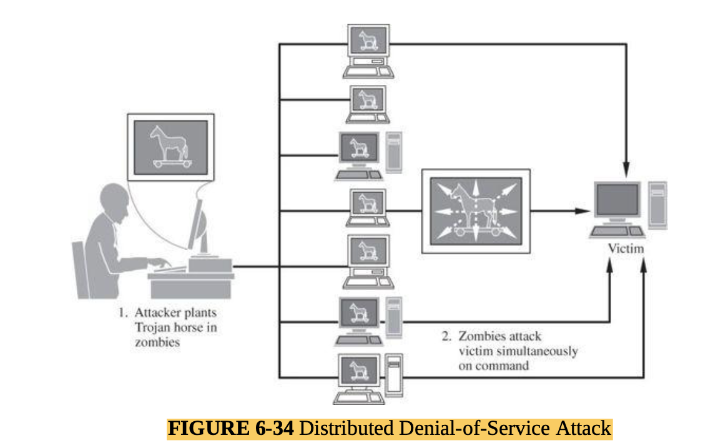 

## Scripted Denial-of-Service Attacks

* Given a collection of denial-of-service attacks and a propagation method, one can easily write a procedure to plant a
  Trojan horse that can launch any or all of the denial-of-service attacks
* Compromised zombies to augment an attack are located by scanning random computers for unpatched vulnerabilities.

## Bots

* Zombies ( or bots, hackerese for robots) are machines running pieces of malicious code under remote control.

## Botnets

* Botnets, networks of bots, are used for massive denial-of-service attacks, implemented from many sites working in
  parallel against a victim.
* Botnet Command and Control Update:
    * a network of bots requires a command hierarchy; the bots require officers to tell them when to attack, against
      whom, and with what weapon. The bot headquarters is called a command-and-control center.
    * A botnet command-and-control center instructs specific machines to target a particular victim at a given time and
      duration.
    * Command-and-control centers control the individual bots, telling them when to start and stop an attack against
      which victim. Communication from the command-and-control center to the bots can be either pushed, with the center
      sending instructions to the bots, or pulled, with each bot responsible for periodically calling home to a
      controller to determine if there is work to do.

* Rent-A-Bot:
    * Botnet operators make money by renting compromised hosts for DDoS or other activity. The rent is mostly profit.
    * People who infect machines to turn them into bots are called botmasters. A botmaster may own (in the sense of
      control) hundreds or thousands of bots.
    * to bring in a little income, botmasters also sometimes rent out their botnets to others.

* Opt-In Botnets:
    * there are now postings for affinity groups to join together in protest. You download and install an attack script
      and show up at 11:00 am (GMT) Tuesday to protest by pointing your attacking computer at x.com. Join in when you
      want, drop out when you (or your computer) are tired. Join the movement

## Malicious Autonomous Mobile Agents

* Bots belong to a class of code known more generally as malicious autonomous mobile agents. Working largely on their
  own, these programs can infect computers anywhere they can access, causing denial of service as well as other kinds of
  harm. Of course, code does not develop, appear, or mutate on its own; there has to be a developer involved initially
  to set up the process and, usually, to establish a scheme for updates. Such an agent is sometimes called an
  inoculation agent.

* Autonomous Mobile Protective Agents:
* Coping with DDoS Attacks:
    * Bots are co-opted by an agent who exploits a vulnerability, typically one already known. Vulnerable machines can
      be discovered by scanning.
    * Most bots are conscripted using well-known vulnerabilities, for which patches have been distributed for some time.
      Thus, if the entire world would just install patches in a timely manner, the DDoS threat would diminish.

# Cryptography in Network Security

* symmetric (secret key) and asymmetric (public key) systems.

## Network Encryption

* use of encryption to counter network security threats
    * • Encryption protects only what is encrypted (which should be obvious but isn’t).
    * • Designing encryption algorithms is best left to professionals. Cryptography is filled with subtlety, and a
      seemingly minor change can have a major impact on security.
    * • Encryption is no more secure than its key management. If an attacker can guess or deduce a weak encryption key,
      the game is over.
    * • Encryption is not a panacea or silver bullet. A flawed system design with encryption is still a flawed system
      design.
* In network applications, encryption can be applied either between two hosts (called link encryption) or between two
  applications (called end-to-end encryption).

* Modes of Network Encryption:
    * Encryption can be employed in a network through two general modes: link and end-to- end.

* Link Encryption:
    * Link encryption is invisible to the user.
    * In link encryption, data are encrypted just before the system places them on the physical communications link. In
      this case, encryption occurs at layer 1 or 2 in the OSI model. (A similar situation occurs with TCP/IP protocols,
      which have a similar but shorter layered model.) Similarly, decryption occurs just as the communication arrives at
      and enters the receiving computer.
    * Link encryption covers a communication from one node to the next on the path to the destination.
       
      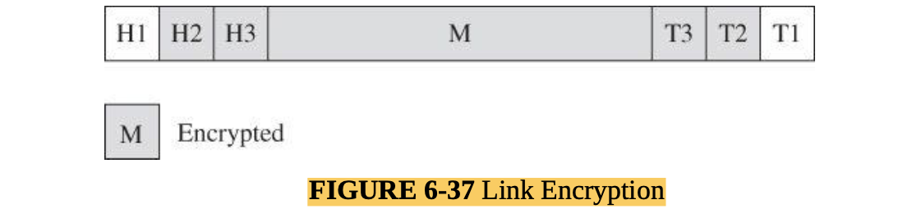 
    * Link encryption is especially appropriate when the transmission line is the point of greatest vulnerability. If
      all hosts on a network are reasonably secure but the communications medium is shared with other users or is not
      secure, link encryption is an easy control to use. Link encryption is also desirable when all communication on a
      single line should be protected, for example, if the link is between two offices of one company, where all
      internal communications would be protected.

* End-to-End Encryption:
    * As its name implies, end-to-end encryption provides security from one end of a transmission to the other. The
      encryption can be applied between the user and the host by a hardware device. Alternatively, the encryption can be
      done by software running on the host computer.
    * The encryption addresses potential flaws in lower layers in the transfer model
    * When end-to-end encryption is used, messages sent through several hosts are protected.
      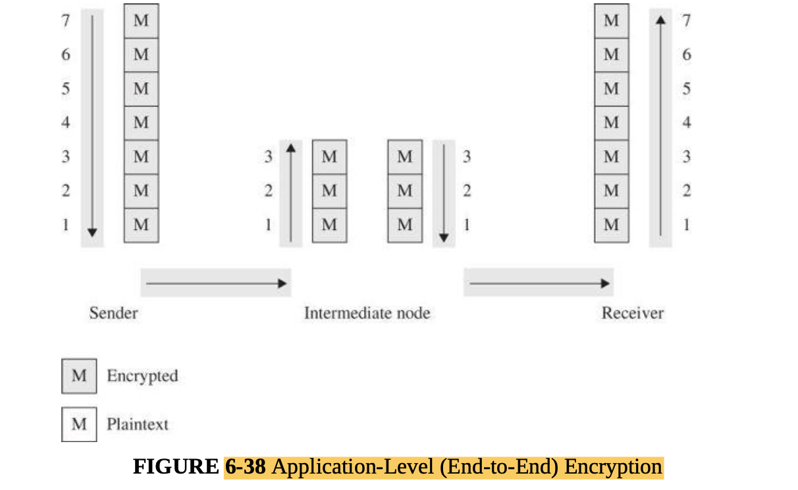 
       

* Comparison of Encryption Methods:
    * With link mode, all transmissions are protected along a particular link.
    * But this encryption scheme implies that every other host receiving these communications must also have a
      cryptographic facility to decrypt the messages. Furthermore, all hosts must share keys. A message may pass through
      one or more intermediate hosts on the way to its final destination. If the message is encrypted along some links
      of a network but not others, then part of the advantage of encryption is lost. Therefore, link encryption is
      usually performed on all links of a network if it is performed at all.
    * Link-level encryption is especially well suited to implementing a private network by using public resources.
    * By contrast, end-to-end encryption is applied to “logical links,” which are virtual channels between two
      processes, at a level well above the physical path. Since the intermediate hosts along a transmission path do not
      need to encrypt or decrypt a message, they have no need for cryptographic facilities. Thus, encryption is used
      only for those messages and applications for which it is needed. Furthermore, the encryption can be done with
      software, so we can apply it selectively, one application at a time or even to one message within a given
      application.
    * advantage of end-to-end encryption is also a disadvantage regarding encryption keys. Under end-to-end encryption,
      a virtual cryptographic channel exists between each pair of users. To provide proper security, each pair of users
      should share a unique cryptographic key. The number of keys required is thus equal to the number of pairs of
      users, which is n * (n – 1)/2 for n users. This number increases rapidly as the number of users increases.
       

### Browser Encryption

* SSH Encryption:
    * SSH (secure shell) is a pair of protocols (versions 1 and 2) originally defined for Unix but now available under
      most operating systems. SSH provides an authenticated and encrypted path to the shell or operating system command
      interpreter.
    * SSH protects against spoofing attacks and modification of data in communication.
    * The SSH protocol involves negotiation between local and remote sites for encryption algorithm (for example, DES or
      AES) and authentication (including public key and Kerberos).

* SSL and TLS Encryption:
    * SSL encryption covers communication between a browser and the remote web host.
    * The Secure Sockets Layer (SSL) protocol was originally designed by Netscape in the mid-1990s to protect
      communication between a web browser and server.
    * In the OSI network model, applications run at the highest (farthest from electrical signals) level, called level
      7, and SSL is implemented at level 4, above network addressing (level 3) and physical media (level 1).

* Cipher Suite:
    * Client and server negotiate encryption algorithms, called the cipher suite, for authentication, session
      encryption, and hashing.
    * When client and server begin an SSL session, the server sends a set of records listing the cipher suite
      identifiers it can use; the client responds with its preferred selection from that set.
       
* SSL Session:
    * SSL encryption protects only from the browser to the destination decryption point. Vulnerabilities before
      encryption or after decryption are unaffected.
    * To use SSL, the client requests an SSL session. The server responds with its public key certificate so that the
      client can determine the authenticity of the server. The client returns a symmetric session key encrypted under
      the server’s public key.
    * The chain of certificates and signers is important because of the potential for unscrupulous CAs
    * If an attacker wanted to establish a fake banking site, for example, getting an unscrupulous CA to issue a
      certificate for SSL would add to the site’s apparent credibility without necessarily providing security.
    * Below you can see that the DigiCert root certificate was issued by GTE CyberTrust Solutions. Other fields include
      period of validity, algorithms used, date of issuance, and contact details. Thus, an interested user could compare
      the full chain of certificates and signatures starting from a trusted root.
       
       

### Onion Routing

* Tor—onion routing—prevents an eavesdropper from learning source, destination, or content of data in transit in a
  network.
* Paul Syverson and colleagues [SYV97] introduced the concept of onion routing. That model uses a collection of
  forwarding hosts, each of whom knows only from where a communication was received and to where to send it next. Thus,
  to send untraceable data from A to B, A picks some number of forwarding hosts, call them X, Y, and Z. A begins by
  encrypting the communication under B’s public key. A then appends a header from Z to B, and encrypts the result under
  Z’s public key. A then puts a header on that from Y to Z and encrypts that under Y’s public key. A then puts a header
  on that communication from X to Y and encrypts that under X’s public key. Finally, A puts on a header to send the
  package to X.

## IP Security Protocol Suite (IPsec)

* IPsec implements encryption and authentication in the Internet protocols.
* As a part of the IPv6 suite, the IP security protocol suite, or IPsec, was adopted by the IETF. Designed to address
  fundamental shortcomings such as being subject to spoofing, eavesdropping, and session hijacking, the IPsec protocol
  defines a standard means for handling encrypted data. IPsec is implemented at the IP layer (3), so it protects data
  produced in all layers above it, in particular, TCP and UDP control information, as well as the application data.
  Therefore, IPsec requires no change to the existing large number of TCP and UDP protocols or applications.
* IPsec is somewhat similar to SSL, in that it supports authentication and confidentiality in a way that does not
  necessitate significant change either above it (in applications) or below it (in the TCP protocols). Like SSL, it was
  designed to be independent of specific cryptographic algorithms and to allow the two communicating parties to agree on
  a mutually supported set of protocols.

* IPsec Security Association:
    * IPsec is what is called a security association, which is essentially the set of security parameters for a secured
      communication channel.
    * A security association includes
        * • encryption algorithm and mode (for example, AES)
        * • encryption key
        * • encryption parameters, such as the initialization vector
        * • authentication protocol and key
        * • life span of the association, to permit long-running sessions to select a new cryptographic key as often as
          needed
        * • address of the opposite end of association
        * • sensitivity level of protected data (usable for classified data )

* Headers and Data:
    * IPsec encapsulated security payload contains descriptors to tell a recipient how to interpret encrypted content.
    * The fundamental data structures of IPsec are the authentication header (AH) and the encapsulated security
      payload (ESP). The ESP replaces (includes) the conventional TCP header and data portion of a packet,
    * The ESP contains both an authenticated portion and an encrypted portion,
      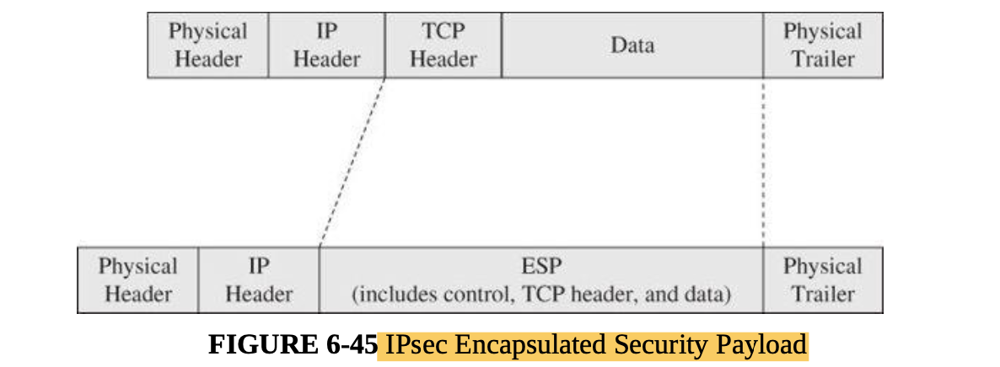 
       
* Key Management:
    * As with most cryptographic applications, the critical element is key management. IPsec addresses this need with
      the Internet Security Association Key Management Protocol, or ISAKMP. Like SSL, ISAKMP requires that a distinct
      key be generated for each security association.
    * In IPsec, ISAKMP is implemented through the ISAKMP key exchange, or IKE, which provides a way to agree on and
      manage protocols, algorithms, and keys.

* Modes of Operation:
    * IPsec can enforce either or both of confidentiality and authenticity. Confidentiality is achieved with symmetric
      encryption, and authenticity is obtained with an asymmetric algorithm for signing with a private key.
      Additionally, a hash function guards against modification.
    * In transport mode (normal operation), the IP address header is unencrypted. In tunnel mode, the recipient’s
      address is concealed by encryption, and IPsec substitutes the address of a remote device, such as a firewall, that
      will receive the transmission and remove the IPsec encryption.
      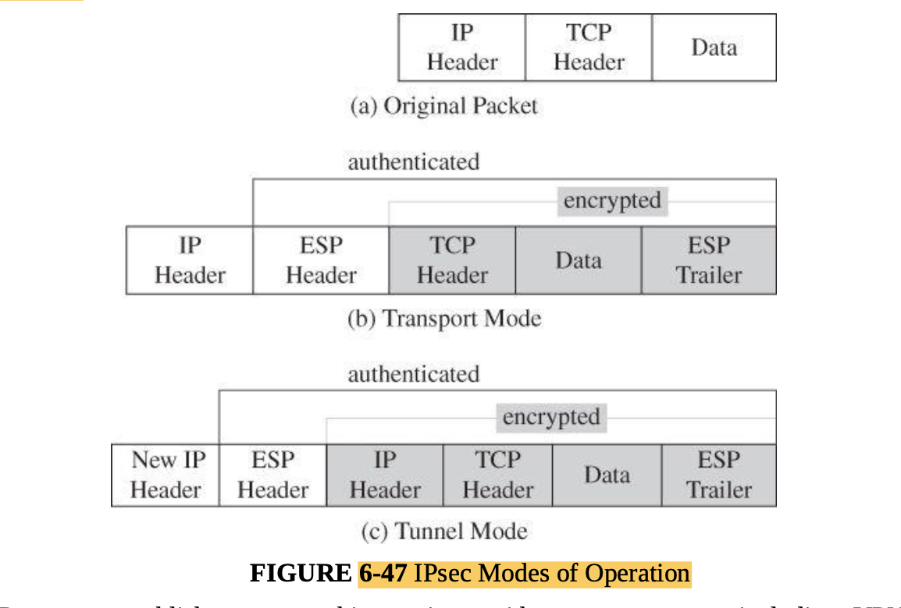 

## Virtual Private Networks

* A virtual private network simulates the security of a dedicated, protected communication line on a shared network.
* Link encryption can give a network’s users the sense that they are on a private network, even when it is part of a
  public network. Furthermore, applied at the link level, the encrypting and decrypting are invisible to users. For this
  reason, the approach is called a virtual private network (or VPN).
* The alternative is a virtual private network between the offices.
* Firewalls (described in the next section) can implement a VPN. When a user first establishes a communication with the
  firewall, the user can request a VPN session with the firewall.
  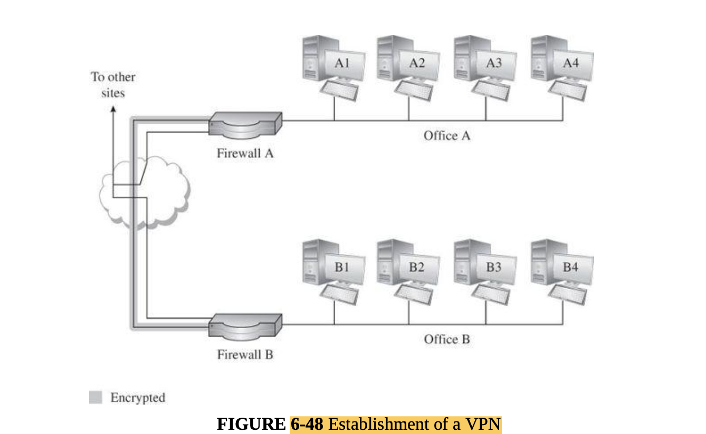 
   

### System Architecture

* Protected subnetworks can separate departments, projects, clients, areas —any subgroup requiring controlled access to
  data or communication.
* If you are trying to limit the information a port scan reveals about a network and its hosts and services, the natural
  approach is to segment the network, with many hosts on segments that are not immediately visible to the outside.
* network, whereas in Figure 6-50(b) only computer A is visible. The network of devices B– E in part (b) is known as a
  protected subnet, and device A is called a dual-homed gateway.
   
* First, host A becomes a single point of failure: If gateway A is not available for any reason
* Furthermore, the gateway device A becomes a potential bottleneck, so devices B through E share access through A; if A
  is slow or if one of B–E consumes a large amount of network bandwidth, the other machines’ performance suffers.
  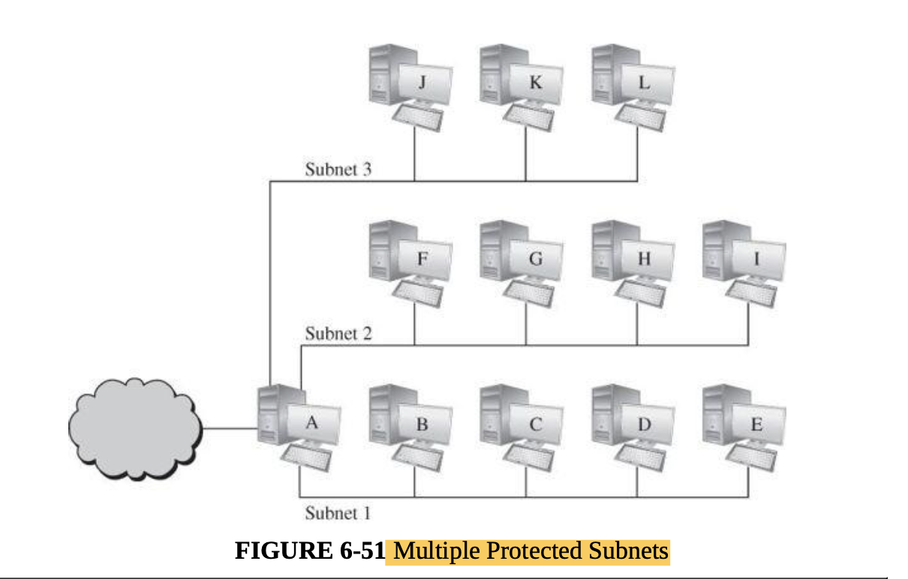 

# Firewalls

* A firewall is a computer traffic cop that permits or blocks data flow between two parts of a network architecture. It
  is the only link between parts.
* A firewall is a device that filters all traffic between a protected or “inside” network and a less trustworthy or
  “outside” network. Usually a firewall runs on a dedicated device; because it is a single point through which traffic
  is channeled, performance is important, which means that only firewall functions should run on the firewall machine.
* Firewalls enforce predetermined rules governing what traffic can flow.
* two schools of thought as “that which is not expressly forbidden is permitted” (default permit) and “that which is not
  expressly permitted is forbidden” (default deny).

## Design of Firewalls:

* Policy:
    * A firewall implements a security policy, that is, a set of rules that determine what traffic can or cannot pass
      through the firewall
* Trust:
    * A firewall is a reference monitor, positioned to monitor all traffic, not accessible to outside attacks, and
      implementing only access control.
    * A firewall is a special form of reference monitor.
    * monitor has three characteristics:
        * • always invoked
        * • tamperproof
        * • small and simple enough for rigorous analysis

### Types of Firewalls

 

* Network Technology Background:
    * Types of firewalls include
        * • packet filtering gateways or screening routers
        * • stateful inspection firewalls
        * • application-level gateways, also known as proxies • circuit-level gateways
        * • guards
        * • personal firewalls

* Packet Filtering Gateway:
    * A packet filtering gateway or screening router is the simplest, and in some situations, the most effective type of
      firewall. A packet filtering gateway controls access on the basis of packet address (source or destination) or
      specific transport protocol type (such as HTTP web traffic), that is, by examining the control information of each
      single packet.
    * Packet filters—screening routers—limit traffic based on packet header data: addresses and ports on packets
    * Packet filters do not “see inside” a packet; they block or accept packets solely on the basis of the IP addresses
      and ports.
    * The primary disadvantage of packet filtering routers is a combination of simplicity and complexity. The router’s
      inspection is simplistic; to perform sophisticated filtering, the rules set needs to be very detailed. A detailed
      rules set will be complex and therefore prone to error.   
       

* Stateful Inspection Firewall:
    * Stateful inspection firewalls judge according to information from multiple packets.
    * A stateful inspection firewall maintains state information from one packet to another in the input stream.
      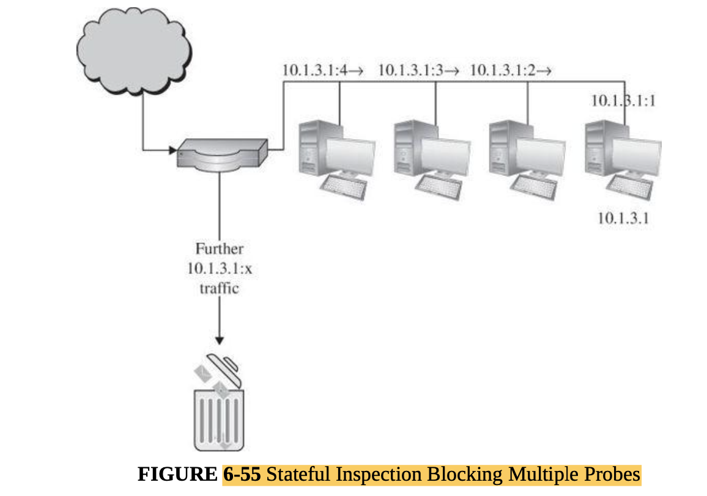 

* Application Proxy:
    * An application proxy simulates the behavior of a protected application on the inside network, allowing in only
      safe data.
    * An application proxy gateway, also called a bastion host, is a firewall that simulates the (proper) effects of an
      application at level 7 so that the application receives only requests to act properly.
    * The proxies on the firewall can be tailored to specific requirements, such as logging details about accesses.
    * The proxy can demand strong authentication (name, password, and challenge– response), validate the
      challenge–response itself, and then pass on only simple name and password authentication details in the form
      required by a specific internal host’s operating system.
       

* Circuit-Level Gateway:
    * A circuit-level gateway connects two separate subnetworks as if they were one contiguous unit.
    * A circuit-level gateway is a firewall that essentially allows one network to be an extension of another. It
      operates at OSI level 5, the session level, and it functions as a virtual gateway between two networks. A circuit
      is a logical connection that is maintained for a period of time, then torn down or disconnected. The firewall
      verifies the circuit when it is first created. After the circuit has been verified, subsequent data transferred
      over the circuit are not checked. Circuit-level gateways can limit which connections can be made through the
      gateway.
      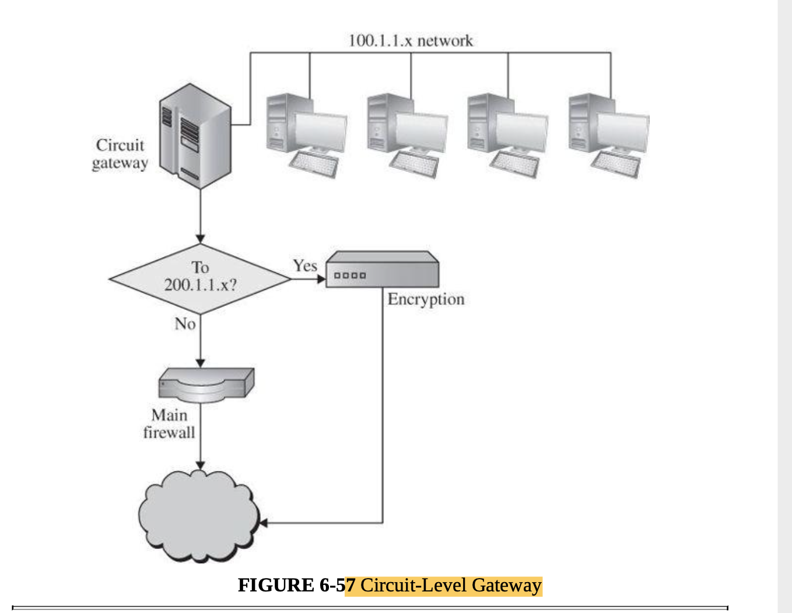 

* Guard:
    * A guard is a sophisticated firewall.
    * A guard can implement any programmable set of conditions, even if the program conditions become highly
      sophisticated.
    * The guard determines what services to perform on the user’s behalf in accordance with its available information,
      such as whatever it can reliably ascertain of the (outside) user’s identity, previous interactions, and so forth

* Personal Firewalls:
    * A personal firewall is a program that runs on a single host to monitor and control traffic to that host. It can
      only work in conjunction with support from the operating system.
    * Firewalls typically protect a (sub)network of multiple hosts
    * A personal firewall is an application program that runs on the workstation it protects.

### Comparison of Firewall Types

 

* Outside users can access tools and data in a firewall’s demilitarized zone but cannot get to more sensitive resources
  on the more protected inside network.

* What Firewalls Can—and Cannot—Block:
    * • Firewalls can protect an environment only if the firewalls control the entire perimeter. That is, firewalls are
      effective only if no unmediated connections breach the perimeter. If even one inside host connects to an outside
      address, by a wireless connection for example, the entire inside net is vulnerable through the unprotected host.
    * • Firewalls do not protect data outside the perimeter; data that have properly passed (outbound) through the
      firewall are just as exposed as if there were no firewall.
    * • Firewalls are the most visible part of an installation to the outside, so they are the most attractive target
      for attack. For this reason, several different layers of protection, called defense in depth, are better than
      relying on the strength of just a single firewall.
    * • Firewalls must be correctly configured, that configuration must be updated as the internal and external
      environment changes, and firewall activity reports must be reviewed periodically for evidence of attempted or
      successful intrusion.
    * • Firewalls are targets for penetrators. While a firewall is designed to withstand attack, it is not impenetrable.
      Designers intentionally keep a firewall small and simple so that even if a penetrator breaks it, the firewall does
      not have further tools, such as compilers, linkers, loaders, and the like, to continue an attack.
    * • Firewalls exercise only minor control over the content admitted to the inside, meaning that inaccurate data or
      malicious code must be controlled by other means inside the perimeter.

* Network Address Translation (NAT):
    * Network address translation conceals real internal addresses; outsiders who do not know real addresses cannot
      access them directly.
    * Using a process called network address translation (NAT), the source firewall converts source address
      192.168.1.35:80 in the packet to the firewall’s own address, 173.203.129.90. T
       

* Data Loss Prevention:
    * Data loss prevention (DLP) refers to a set of technologies designed to detect and possibly prevent attempts to
      send data where it is not allowed to go.
    * DLP solutions will generally look for a variety of indicators:
        * • Keywords. Certain words or phrases, such as “secret,” “classified,” or “proprietary,” are strong indicators
          of sensitive data. DLP solutions may also allow customers to search for keywords that have specific meaning
          for a particular business, such as a codename for a new product.
        * • Traffic patterns. Some traffic patterns that may indicate suspicious behavior are bulk file transfers,
          connections to outside email or file sharing services, emails to unknown recipients, and connections to
          unknown network services.
        * • Encoding/encryption. DLP can be easily defeated by strong encryption, because no DLP solution can determine
          the sensitivity of a file it cannot read. To address this issue, DLP solutions commonly block outgoing files
          that they cannot decode or decrypt. Many malware scanners treat incoming files, such as encrypted email
          attachments, the same way.

# Intrusion Detection and Prevention Systems

* An intrusion detection system (IDS) is a device, typically another separate computer, that monitors activity to
  identify malicious or suspicious events.
* IDSs likewise have a response function. In many cases the response is to alert a human team that will then decide what
  further action is warranted. Sometimes, however, the IDS goes into protection mode to isolate a suspected intruder and
  constrain access. Such a system is called an Intrusion Protection System (IPS). We describe both IDS and IPS
  technology in this section.
* The components in the figure are the four basic elements of an intrusion detection system, based on the Common
  Intrusion Detection Framework of [STA96]. An IDS receives raw inputs from sensors. It saves those inputs, analyzes
  them, and takes some controlling action.
  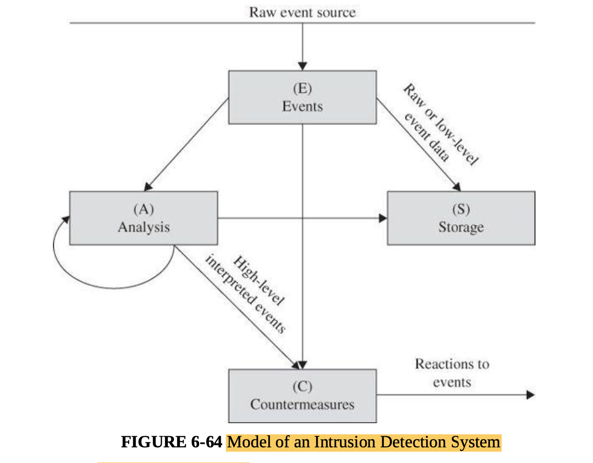 
* DSs perform a variety of functions:
    * • monitoring users and system activity
    * • auditing system configuration for vulnerabilities and misconfigurations • assessing the integrity of critical
      system and data files
    * • recognizing known attack patterns in system activity
    * • identifying abnormal activity through statistical analysis
    * • managing audit trails and highlighting user violation of policy or normal activity
    * • correcting system configuration errors
    * • installing and operating traps to record information about intruders

### Types of IDSs

* Signature-based IDSs look for patterns; heuristic ones learn characteristics of unacceptable behavior over time.
* The two general types of intrusion detection systems are signature based and heuristic.
    * Signature-based intrusion detection systems perform simple pattern-matching and report situations that match a
      pattern (signature) corresponding to a known attack type.
    * Heuristic intrusion detection systems, also known as anomaly based, build a model of acceptable behavior and flag
      exceptions to that model; for the future, the administrator can mark a flagged behavior as acceptable so that the
      heuristic IDS will now treat that previously unclassified behavior as acceptable.
* Thus, heuristic intrusion detection systems are said to learn what constitute anomalies or improper behavior. This
  learning occurs as an artificial intelligence component of the tool, the inference engine, identifies pieces of
  attacks and rates the degree to which these pieces are associated with malicious behavior.
* Intrusion detection devices can be network based or host based. A network-based IDS is a stand-alone device attached
  to the network to monitor traffic throughout that network; a host-based IDS runs on a single workstation or client or
  host, to protect that one host.

* Signature-Based Intrusion Detection:
    * Signature-based IDSs are limited to known patterns.
    * The problem with signature-based detection is the signatures themselves. An attacker will try to modify a basic
      attack in such a way that it will not match the known signature of that attack.

* Heuristic Intrusion Detection:
    * Heuristic intrusion detection infers attacks by tracking suspicious activity.
    * heuristic intrusion detection looks for behavior that is out of the ordinary. The original work in this area (for
      example, [TEN90]) focused on the individual, trying to find characteristics of that person that might be helpful
      in understanding normal and abnormal behavior.
    * Inference engines work in two ways. Some, called state-based intrusion detection systems, see the system going
      through changes of overall state or configuration. They try to detect when the system has veered into unsafe
      modes.
    * Alternatively, intrusion detection can work from a model of known bad activity whereby the intrusion detection
      system raises an alarm when current activity matches the model to a certain degree. These are called model-based
      intrusion detection systems
    * To a heuristic intrusion detection system, all activity is classified in one of three categories: good/benign,
      suspicious, or unknown.

* Stateful Protocol Analysis:

* Front End Versus Internal IDSs:
    * An IDS can be placed either at the front end of a monitored subnetwork or on the inside. A front-end device
      monitors traffic as it enters the network and thus can inspect all packets; it can take as much time as needed to
      analyze them, and if it finds something that it classifies as harmful, it can block the packet before the packet
      enters the network. A front-end intrusion detection system may be visible on the outside, and thus it may be a
      target of attack itself.
    * On the other hand, a front-end IDS does not see inside the network, so it cannot identify any attack originating
      inside. An internal device monitors activity within the network. If an attacker is sending unremarkable packets to
      a compromised internal machine, instructing that machine to initiate a denial-of-service attack against other
      hosts on that network, a front-end IDS will not notice that attack. Thus, if one computer begins sending
      threatening packets to another internal computer

* Host Based and Network Based:
    * A HIDS monitors host traffic; a NIDS analyzes activity across a whole network to detect attacks on any network
      host.
    * Host-based intrusion detection (called HIDS) protects a single host against attack. It collects and analyzes data
      for that one host. The operating system supplies some of that data to the IDS, passing along approved and denied
      requests to access sensitive resources, logs of applications run, times and dates of actions and other
      security-relevant data
    * The goal of a host-based system is to protect one machine and its data. If an intruder disables that IDS, however,
      it can no longer protect its host. Being a process on the target computer also exposes the HIDS to the
      vulnerability of being detected.
    * A network-based IDS or NIDS is generally a separate network appliance that monitors traffic on an entire network.
      It receives data from firewalls, operating systems of the connected computers, other sensors such as traffic
      volume monitors and load balancers, and administrator actions on the network.

* Protocol-Level Inspection Technology:

## Intrusion Prevention Systems

* Intrusion prevention systems extend IDS technology with built-in protective response.
* an intrusion prevention system, or IPS, tries to block or stop harm. In fact, it is an intrusion detection system with
  a built-in response capability. The response is not just raising an alarm; the automatic responses include cutting off
  a user’s access, rejecting all traffic from address a.b.c.d, or blocking all users’ access to a particular file or
  program.

### Intrusion Response

* Responding to Alarms:
    * In general, responses fall into three major categories (any or all of which can be used in a single response):
        * • Monitor, collect data, perhaps increase amount of data collected. • Protect, act to reduce exposure.
        * • Signal an alert to other protection components.
        * • Call a human.

* Alarm:
* Adaptive Behavior:
    * Because of these limitations of humans, an IDS can sometimes be configured to take action to block the attack or
      reduce its impact.

* Counterattack:
    * A final action that can be taken on a detection of an attack is to mount an offense, to strike back.

### Goals for Intrusion Detection Systems:

* An IDS could use some—or all—of the following design approaches:
    * Filter on packet headers.
    * Filter on packet content.
    * Maintain connection state.
    * Use complex, multipacket signatures.
    * Use minimal number of signatures with maximum effect. • Filter in real time, online.
    * Hide its presence.
    * Use optimal sliding-time window size to match signatures.

* Stealth Mode:
    * Stealth mode IDS prevents the attacker from knowing an alarm has been raised.
    * If an attacker succeeded in logging in to a system within the protected network, wouldn’t trying to disable the
      IDS be the next step?
    * To counter those problems, most IDSs run in stealth mode, whereby an IDS has two network interfaces: one for the
      network (or network segment) it is monitoring and the other to generate alerts and perhaps perform other
      administrative needs. The IDS uses the monitored interface as input only; it never sends packets out through that
      interface. Often, the interface is configured so that the device has no published address through the monitored
      interface; that is, no router can route anything directly to that address because the router does not know such a
      device exists. It is the perfect passive wiretap. If the IDS needs to generate an alert, it uses only the alarm
      interface on a completely separate control network.
      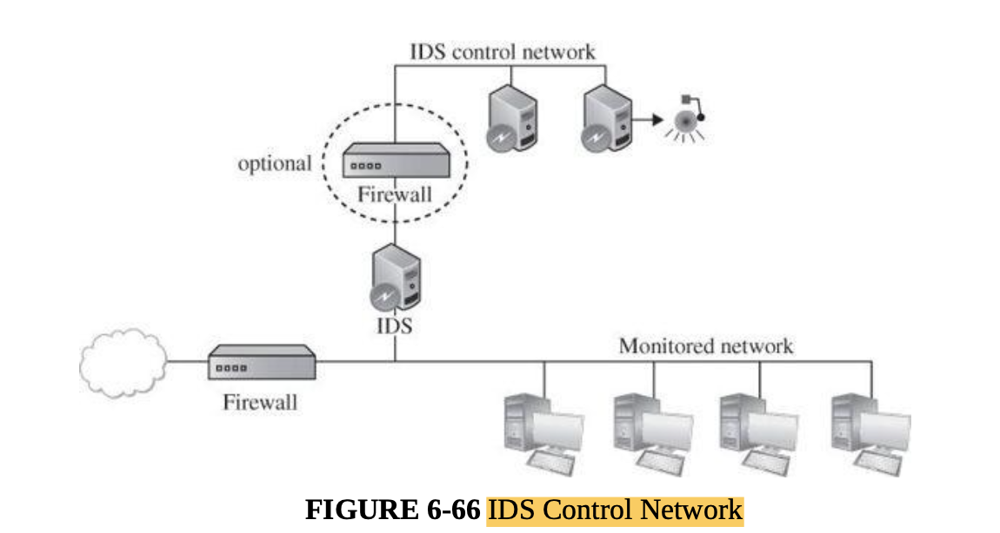 

### IDS Strengths and Limitations

* An IDS that is not well defended is useless. Fortunately, stealth mode IDSs are difficult even to find on an internal
  network, let alone to compromise.
* IDSs look for known weaknesses, whether through patterns of known attacks or models of normal behavior. Similar IDSs
  may have identical vulnerabilities, and their selectioncriteria may miss similar attacks
* Another IDS limitation is its sensitivity, which is difficult to measure and adjust
* A final limitation is not of IDSs per se, but is one of use. An IDS does not run itself; someone has to monitor its
  track record and respond to its alarms

# Network Management

## Management to Ensure Service

* Capacity Planning:
    * One benign cause of denial of service is insufficient capacity: too much data for too little capability. Not
      usually viewed as a security issue, capacity planning involves monitoring network traffic load and performance to
      determine when to upgrade which aspects.

* Load balancing:
    * Network load balancing directs incoming traffic to resources with available capacity.
    * A load balancer is an appliance that redirects traffic to different servers while working to ensure that all
      servers have roughly equivalent workloads.

* Network Tuning:
    * Engineers can install new links, restructure network segments, or upgrade connectivity to ensure good network
      performance. Network tuning depends on solid data obtained by monitoring network traffic over time.
    * Rate limiting is a countermeasure that reduces the impact of an attack. With rate limiting, the volume of traffic
      allowed to a particular address is reduced. Routers can send a quench signal back to another router that is
      forwarding traffic; such a signal informs the sending router that the receiving router is overloaded and cannot
      keep up, therefore asking the sender to hold up on transmitting data.

* Network Addressing:
* Shunning:
    * Shunning and sinkholing are extreme network countermeasures blocking all traffic from or to a specific address.
    * With reliable source addresses, network administrators can set edge routers to drop packets engaging in a
      denial-of-service attack. This practice, called shunning, essentially filters out all traffic from implicated
      addresses. Real-time monitoring that detects an attack determines the addresses from which the attack is coming
      and acts quickly to block those addresses. A firewall can implement shunning of a particular address
    * Shunning has a downside, however. If an attacker can detect that a site implements shunning, the attacker can send
      attack traffic spoofed to appear to be from a legitimate source
        * or example; shunning that apparent attack has the negative outcome of denying legitimate traffic from Google
          or Facebook.

* Blacklisting and Sinkholing:
    * n extreme cases, the network administrator may decide to effectively disconnect the targeted system. The
      administrator can blacklist the target address, meaning that no traffic goes to that address, from legitimate or
      malicious sources alike. Alternatively, the administrator may redirect traffic to a valid address where the
      incoming traffic can be analyzed; this process is called sinkholing.

* All these administrative measures carry potential risks. Network monitoring affects network performance because
  intercepting, analyzing, and forwarding traffic takes time and therefore imposes a delay. I
* Network appliances such as firewalls, routers, switches, and load balancers often provide data for people to analyze
  and manage the network. Too much information can overwhelm a human network administrator, especially someone whose
  security skills are limited. Thus, management countermeasures are more appropriate for networks large or important
  enough to have an experienced security staff with adequate resources.

## Security Information and Event Management (SIEM)

* A Security Operations Center:
    * Instead, SiC Groceries will create a Security Operations Center (SOC) at a single location, perhaps their
      headquarters. A SOC is a team of security personnel dedicated to monitoring a network for security incidents and
      investigating and remediating those incidents.
    * To make its SOC effective, SiC Groceries will have to allow the SOC team remote access to monitor all of the
      network and security products throughout its enterprise, including all of its stores. The security personnel can
      manually log in to every device to check status and look for alerts, but that option does not scale, and it makes
      it difficult to identify even simple attack patterns, such as attacks on many stores emanating from the same
      source address.
    * security information and event management, or SIEM, tools come into play. SIEMs are software systems that collect
      security-relevant data from a variety of hardware and software products in order to create a unified security
      dashboard
       

* Data Collection:
    * SIEMs can regularly collect such log files from throughout an enterprise, updating SOC personnel on the company’s
      security status every few seconds.
    * But SIEMs don’t just collect the information; they can do a lot to help SOC analysts make sense of it. With all of
      that security event data in one place, analysts can look for patterns across the enterprise and over time frames
      spanning months or even years. Many SIEMs allow analysts to organize data in countless interesting ways.

* SIEM Challenges:
    * Cost. A commercial SIEM solution for a large company can cost millions of dollars, but some open-source SIEMs are
      free.
    * Data portability: Knowledge that you store in the SIEM, such as saved searches or data visualizations, tends to be
      SIEM specific and you will likely need to rebuild such knowledge bases when you switch products.
    * Log-source compatibility: Depending on the data type and the system that is generating a given set of logs, SIEMs
      may require you to install agents or intermediary servers to collect logs. Once you know the logs that are
      important to you, you can identify which SIEMs already read those data logs, which could read those logs with a
      bit of configuration, and which would require agents.
    * Deployment complexity: Because SIEMs can touch thousands of systems in an enterprise, deploying them is generally
      a complex undertaking.
    * Customization.
    * Data storage: SIEMs generally require vast quantities of storage, but the exact amount varies greatly according to
      system architecture and activity to be monitored.
    * Segregation and access control: SIEMs generally have robust segregation and role-based access control capabilities
      that allow administrators to limit users’ access to data and functionality, but mitigating insider risks posed by
      security personnel is a perpetual challenge.
    * Full-time maintenance. Because they interact with so many different systems, SIEMs are inherently complex, so
      deploying, maintaining, and customizing them are expert skills in themselves.
    * User training.  