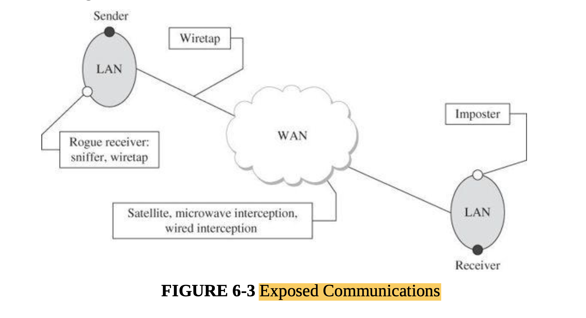
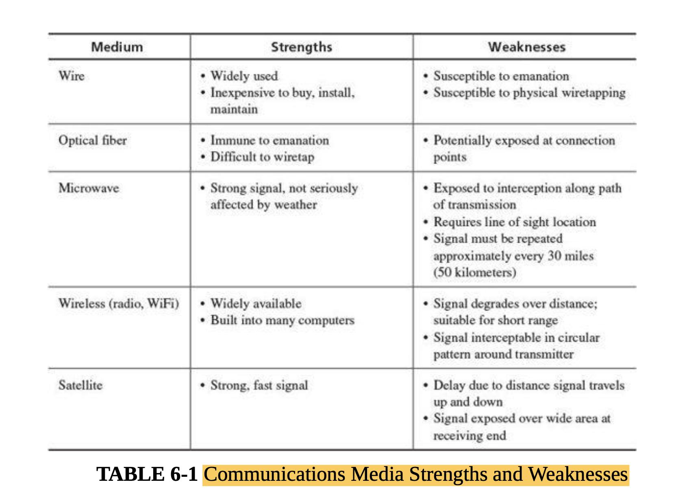
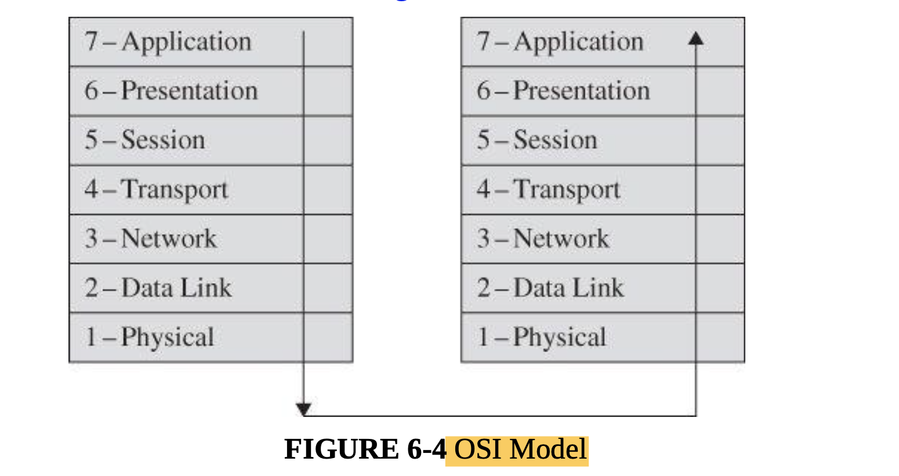

#### Main Topics

* Show an increased awareness of network traffic content and its implications for security issues
* Use simple network monitoring methods to capture and perform initial inspection of evidence of potential security
  issues
* Explain how some simple security and pen-testing tools can aid in assessment of cyber security

* module learning outcomes:
    * (MO1) Identify and analyse major threat types in a variety of systems
    * (MO4) Critically assess the relative merits of specific solution approaches for particular contexts
    * (MO5) Critically discuss leading-edge research in cyber security and the challenges faced.

* Network
    * in this chapter 6
    * Vulnerabilities
        * Threats in networks: wiretapping, modification, addressing
        * Wireless networks: interception, association, WEP, WPA
        * Denial of service and distributed denial of service
    * Protections
        * Cryptography for networks: SSL, IPsec, virtual private networks
        * Firewalls
        * Intrusion detection and protection systems
        * Managing network security, security information, and event management

#### Sub titles:

# Networks and networked services

* In a local environment, the physical wires are frequently secured physically or perhaps visually so wiretapping is not
  a major issue.
* With remote communication, the same notion of wires applies, but the wires are outside the control and protection of
  the user, so tampering with the transmission is a serious threat.

## Network Transmission Media

* When data items leave a protected environment, others along the way can view or intercept the data; other terms used
  are eavesdrop, wiretap, or sniff.
* Signal interception is a serious potential network vulnerability.
* Cable:
    * Each LAN connector (such as a computer board) has a unique address, called the MAC (for Media Access Control)
      address; each board and its drivers are programmed to label all packets from its host with its unique address (as
      a sender’s “return address”) and to take from the net only those packets addressed to its host.

* Packet Sniffing:
    * A device called a packet sniffer retrieves all packets on its LAN

* Radiation
    * Ordinary wire (and many other electronic components) emits radiation.
    * By a process called inductance an intruder can tap a wire and read radiated signals without making physical
      contact with the cable; essentially, the intruder puts an antenna close to the cable and picks up the
      electromagnetic radiation of the signals passing through the wire.
    * A cable’s inductance signals travel only short distances, and they can be blocked by other conductive materials,
    * or the attack to work, the intruder must be fairly close to the cable; therefore, this form of attack is limited
      to situations with physical access.

* Cable Splicing
    * The easiest form of intercepting a cable is by direct cut. If a cable is severed, all service on it stops.
    * As part of the repair, an attacker can splice in a secondary cable that then receives a copy of all signals along
      the primary cable. Interceptors can be a little less obvious but still accomplish the same goal
        * For example, the attacker might carefully expose some of the outer conductor, connect to it, then carefully
          expose some of the inner conductor and connect to it. Both of these operations alter the resistance, called
          the impedance, of the cable.
    * With a device called a sniffer someone can connect to and intercept all traffic on a network; the sniffer can
      capture and retain data or forward it to a different network.
    * Signals on a network are multiplexed, meaning that more than one signal is transmitted at a given time.
        * A LAN carries distinct packets, but data on a WAN may be heavily multiplexed as it leaves its sending host

* Optical Fiber
    * Optical fiber offers two significant security advantages over other transmission media.
        * First, the entire optical network must be tuned carefully each time a new connection is made. Therefore, no
          one can tap an optical system without detection. Clipping just one fiber in a bundle will destroy the balance
          in the network.
        * Second, optical fiber carries light energy, not electricity. Light does not create a magnetic field as
          electricity does. Therefore, an inductive tap is impossible on an optical fiber cable.
    * Microwave:
        * Microwave signals are not carried along a wire; they are broadcast through the air, making them more
          accessible to outsiders.
        * Microwave is a line-of-sight technology; the receiver needs to be on an unblocked line with the sender’s
          signal.
            * Typically, a transmitter’s signal is focused on its corresponding receiver because microwave reception
              requires a clear space between sender and receiver.
        * Not only can someone intercept a microwave transmission by interfering with the line of sight between sender
          and receiver, someone can also pick up an entire transmission from an antenna located close to but slightly
          off the direct focus point.
        * A microwave signal is usually not shielded or isolated to prevent interception
            * Microwave is, therefore, an insecure medium because the signal is so exposed.
            * However, because of the large volume of traffic carried by microwave links, an interceptor is unlikely to
              separate an individual transmission from all the others interleaved with it.
        * Microwave signals require true visible alignment, so they are of limited use in hilly terrain.

    * Satellite Communication:
        * Signals can be bounced off a satellite: from earth to the satellite and back to earth again.
        * Satellites are in orbit at a level synchronized to the earth’s orbit, so they appear to be in a fixed point
          relative to the earth.
        * Transmission to the satellite can cover a wide area around the satellite because nothing else is nearby to
          pick up the signal.
            * On return to earth, however, the wide dissemination radius, called the broadcast’s footprint, allows any
              antenna within range to obtain the signal without detection,
            * some signals can be intercepted in an area several hundred miles wide and a thousand miles long
        * However, because satellite communications are generally heavily multiplexed, the risk is small that any one
          communication will be intercepted.
           

* All network communications are potentially exposed to interception; thus, sensitive signals must be protected.
   

## Protocol Layers

* Network communications are performed through a virtual concept called the Open System Interconnection (or OSI) model.
  T
* The OSI model, most useful conceptually, describes similar processes of both the sender and receiver.
   

* Interception can occur at any level of this model: For example, the application can covertly leak data, as we
  presented in Chapter 3, the physical media can be wiretapped,or a session between two subnetworks can be compromised.

## Addressing and Routing

* direct connections work only for a small number of parties. It would be infeasible for every Internet user to have a
  dedicated wire to every other user.
    * For reasons of reliability and size, the Internet and most other networks resemble a mesh, with data being boosted
      along paths from source to destination.

* Protocols:
    * A protocol is a language or set of conventions for how two computers will interact.
    * Independence is possible because we have defined protocols that allow a user to view the network at a high,
      abstract level of communication (viewing it in terms of user and data); the details of how the communication is
      accomplished are hidden within software and hardware at both ends.
    * The software and hardware enable us to implement a network according to a protocol stack, a layered architecture
      for communications;

* Addressing
    * At the network layer, a hardware device called a router actually sends the message from your network to a router
      on the network XXX .
        * The network layer adds two headers to show your computer’s address as the source and XXX’s address as the
          destination.
    * Together, the network layer structure with destination address, source address, and data is called a packet.
        * Packet: Smallest individually addressable data unit transmitted
    * MAC address: unique identifier of a network interface card that connects a computer and a network

    * **The message travel from computer to your router**
        * Every computer connected to a network has a network interface card (NIC) with a unique physical address,
          called a MAC address (for Media Access Control).
        * At the data-link level, two more headers are added, one for your computer’s NIC address (the source MAC) and
          one for your router’s NIC address.
        * A data-link layer structure with destination MAC, source MAC, and data is called a
          **frame**.
        * Every NIC puts data onto the communications medium when it has data to transmit and seizes from the network
          those frames with its own address as a destination address.

    * **On the receiving (destination) side**
        * The recipient network layer checks that the packet is really addressed to it.
        * Packets may not arrive in the order in which they were sent (because of network delays or differences in paths
          through the network), so the session layer may have to reorder packets.
        * The presentation layer removes compression and sets the appearance appropriate for the destination computer.
        * Finally, the application layer formats and delivers the data as a complete unit.
           
* Routing:
    * The Internet has many devices called routers, whose purpose is to redirect packets in an effort to get them closer
      to their destination.
    * Routers direct traffic on a path that leads to a destination.
    * Routers uses a table to determine the quickest path to the destination
    * Routers communicate with neighboring routers to update the state of connectivity and traffic flow; with these
      updates the routers continuously update their tables of best next steps.

* Ports
    * Port: number associated with an application program that serves or monitors for a network service
    * Many common services are bound to agreed-on ports, which are essentially just numbers to identify different
      services; the destination port number is given in the header of each packet or data unit.
    * Ports 0 to 4095 are called well-known ports and are by convention associated with specific services.