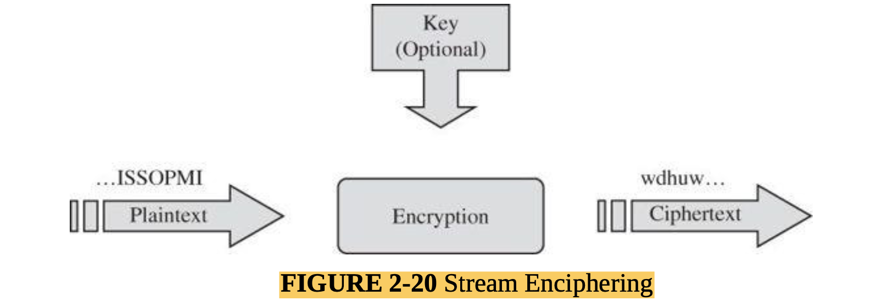
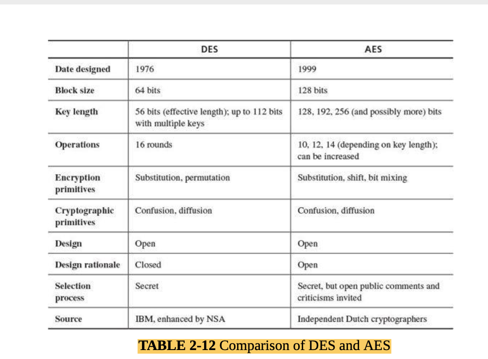
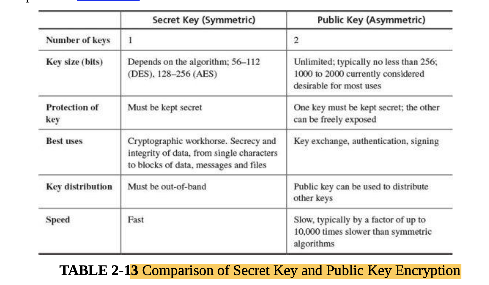
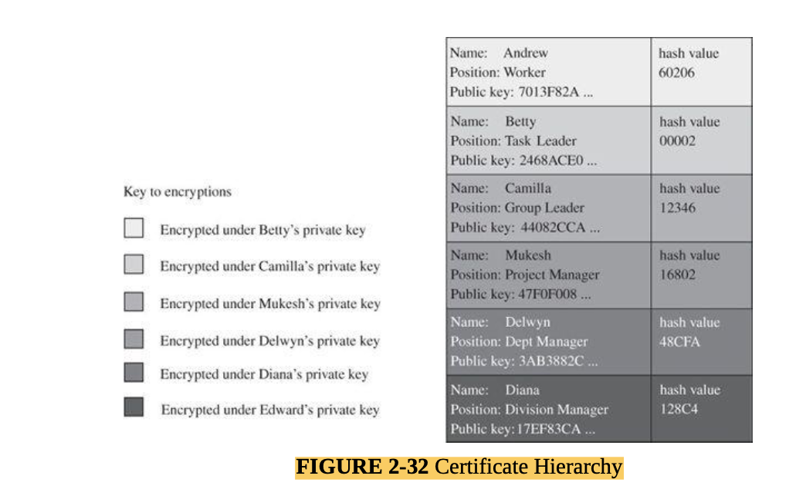

#### Main Topics

* By the end of this week, you should be able to:
    * Describe some common concepts in encryption
    * Identify and break some simple encryption algorithms
    * Explain how encryption is used to secure communications and services, and be able to deploy common security tokens
* This week we will be covering the following module learning outcomes:
    * (MO1) Identify and analyse major threat types in a variety of systems,
    * (MO4) Critically assess the relative merits of specific solution approaches for particular contexts,
    * (MO5) Critically discuss leading-edge research in cyber security and the challenges faced.

#### Sub titles:

*

# Encryption

* encryption fall into two categories
    * Symmetric encryption - where the sender and recipient use the same key to encrypt and decrypt data
    * Asymmetric - where the sender and recipient use different, but related, keys to encrypt and decrypt.

# Cryptography

* Cryptography conceals data against unauthorized access.

## Problems Addressed by Encryption

* Consider the steps involved in sending messages from a sender, S, to a recipient, R.
* If S entrusts the message to T, who then delivers it to R, T then becomes the transmission medium.
* If an outsider, O, wants to access the message (to read, change, or even destroy it), we call O an interceptor or
  intruder.
* Any time after S transmits the message via T, it is vulnerable to exploitation, and O might try to access it in any of
  the following ways:
    * • block it, by preventing its reaching R, thereby affecting the availability of the message
    * • intercept it, by reading or listening to the message, thereby affecting the confidentiality of the message
    * • modify it, by seizing the message and changing it in some way, affecting the message’s integrity
    * • fabricate an authentic-looking message, arranging for it to be delivered as if it came from S, thereby also
      affecting the integrity of the message

## Terminology

* Encryption is the process of encoding a message so that its meaning is not obvious; decryption is the reverse process,
  transforming an encrypted message back into its normal, original form.
* A system for encryption and decryption is called a cryptosystem.
* The original form of a message is known as plaintext, and the encrypted form is called ciphertext.
* Ciphertext: encrypted material; plaintext: material in intelligible form

### Encryption Keys

* Symmetric encryption: one key encrypts and decrypts.
* Asymmetric encryption: one key encrypts, a different key decrypts.
    
* A cryptanalyst’s chore is to break an encryption.
    * In cryptanalysis there are no rules: Any action is fair play.
* Work Factor:
    * Work factor: amount of effort needed to break an encryption (or mount a successful attack)
    * The difficulty of breaking an encryption is called its work factor.
    * An encryption algorithm is called breakable when, given enough time and data, an analyst can determine the
      algorithm.
    * consider a 25-character message that is expressed in just uppercase letters. A given cipher scheme may have 2625 (
      approximately 1035) possible decipherments, so the task is to select the right one out of 25 10 the 26 . If your
      computer could perform on the order of 10 operations per second, finding this decipherment would require on the
      order of 1025 seconds, or roughly 1017 years.

* Symmetric and Asymmetric Encryption Systems:
    * Symmetry is a major advantage of this type of encryption, but it also leads to a problem:
        * only A and B can use that key for their encrypted communications. If A wants to share encrypted communication
          with another user C, A and C need a different shared secret key
    * a property of symmetric encryption systems is that they require a means of key distribution.

* Stream and Block Ciphers:
    * Stream ciphers encrypt one bit or one byte at a time; block ciphers encrypt a fixed number of bits as a single
      chunk.
    * The advantage of a stream cipher is that it can be applied immediately to whatever data items are ready to
      transmit. But most encryption algorithms involve complex transformations; to do these transformations on one or a
      few bits at a time is expensive.
    * A block cipher encrypts a group of plaintext symbols as a single block.
        * Blocks for such algorithms are typically 64, 128, 256 bits or more.
            
            
            

### DES: The Data Encryption Standard

* The Data Encryption Standard (DES) [NBS77], a system developed for the U.S. government, was intended for use by the
  general public.
* DES encrypts 64-bit blocks by using a 56-bit key.
    * The algorithm begins by encrypting the plaintext as blocks of 64 bits. The key is 64 bits long, but in fact it can
      be any 56-bit number. (The extra 8 bits are often used as check digits but do not affect encryption in normal
      implementations. Thus we say that DES uses a key, the strength of which is 56 bits.) The user can pick a new key
      at will any time there is uncertainty about the security of the old key.

* Double and Triple DES:
    * The double encryption works in the following way. Take two keys, k1 and k2, and perform two encryptions, one on
      top of the other: E(k2, E(k1,m)).
    * wo encryptions with different 56-bit keys are equivalent in work factor to one encryption with a 57-bit key. Thus,
      the double encryption adds only a small amount of extra work for the attacker who is trying to infer the key(s)
      under which a piece of ciphertext was encrypted
    * double DES adds essentially no more security.

* Triple DES:
    * The so-called triple DES procedure is C = E(k3, E(k2, E(k1,m))). That is, you encrypt with one key, then with the
      second, and finally with a third. This process gives a strength roughly equivalent to a 112-bit key (because the
      double DES attack defeats the strength of one of the three keys, but it has no effect on the third key).
    * In summary, ordinary DES has a key space of 56 bits, double DES is scarcely better, but two-key triple DES gives
      an effective length of 80 bits, and three-key triple DES gives a strength of 112 bits.
    * A longer key means significantly more work for this attack to bear fruit, with the work factor doubling for each
      additional bit in key length.

    

* Security of DES:
    * even if conventional DES can be attacked, triple DES is still well beyond the power of these attacks.
    * et us say, for simplicity, that single-key DES can be broken in one hour. The simple double-key version could then
      be broken in two hours. But 280/256 = 224, which is over 16,700,000, meaning it would take 16 million hours,
      nearly 2,000 years, to defeat a two-key triple DES encryption, and considerably longer for the three-key version.

### AES: Advanced Encryption System

* After a public competition and review, NIST selected an algorithm named Rijndael as the new advanced encryption
  system; Rijndael is now known more widely as AES.
* Rijndael is a fast algorithm that can easily be implemented on simple processors
    

* Strength of the Algorithm:
    

### Public Key Cryptography

* The encryption algorithms we have presented so far are called symmetric or secret-key algorithms.
    * The two most widely used symmetric algorithms, DES and AES, operate similarly: Two users have copies of the same
      key.
    * One user uses the algorithm to encrypt some plaintext under the key, and the other user uses an inverse of the
      algorithm with the same key to decrypt the ciphertext
* With a public key encryption system, each user has two keys, one of which does not have to be kept secret.
    * Although counterintuitive, in fact the public nature of the key does not compromise the secrecy of the system.
    * Instead, the basis for public key encryption is to allow the key to be divulged but to keep the decryption
      technique secret.
    * Public key cryptosystems accomplish this goal by using two keys: one to encrypt and the other to decrypt.
    * Although these keys are produced in mathematically related pairs, an outsider is effectively unable to use one key
      to derive the other.

* Why should making the key public be desirable?
    * With a conventional symmetric key system, each pair of users needs a separate key. But with public key systems,
      anyone using a single public key can send a secret message to a user, and the message remains adequately protected
      from being read by an interceptor

* Characteristics:
    * We can reduce the problem of key proliferation by using a public key approach.
    * In a public key or asymmetric encryption system, each user has two keys: a public key and a private key.
    * The user may freely publish the public key because each key does only encryption or decryption, but not both. The
      keys operate as inverses, meaning that one key undoes the encryption provided by the other key. But deducing one
      key from the other is effectively impossible.
    * encrypted plaintext using the public key is decrypted by application of the private key; we write the relationship
      as **P = D(kPRIV, E(kPUB,P))**
    * That is, a user can decode with a private key what someone else has encrypted with the corresponding public key.
      Furthermore, with some public key encryption algorithms, including RSA, we have this relationship:
      **P = D(kPUB, E(kPRIV,P))**
    * In other words, a user can encrypt a message with a private key, and the message can be revealed only with the
      corresponding public key.
    * These two properties tell us that public and private keys can be applied in either order.

* The Rivest–Shamir–Adelman (RSA) Algorithm:
    * The Rivest–Shamir–Adelman (RSA) cryptosystem is a public key system.
    * because of the nature of the RSA algorithm, the keys can be applied in either order:
        * P = E(D(P)) = D(E(P))
        * or P = RSA(RSA(P, e), d) = RSA(RSA(P, d), e)
    * RSA does have the unfortunate property that the keys are long: 256 bits is considered the minimum usable length,
      but in most contexts experts prefer keys on the order of 1000 to 2000 bits.

  

### Public Key Cryptography to Exchange Secret Keys

* Simple Key Exchange Protocol:
    * Amy says: Bill, please send me your public key.
    * Bill replies: Here, Amy; this is my public key.
    * Amy responds: Thanks. I have generated a symmetric key for us to use for this interchange. I am sending you the
      symmetric key encrypted under your public key.

* Revised Key Exchange Protocol:
    * Amy sends her public key to Bill.
    * Bill sends his public key to Amy.
    * Amy creates a symmetric key, encrypts it using Bill’s public key, and sends half of the result to Bill. (Note:
      half of the result might be the first n/2 bits, all the odd numbered bits, or some other agreed-upon form.)
    * (4) Bill responds to Amy that he received the partial result (which he cannot interpret at this point, so he is
      confirming only that he received some bits). Bill encrypts any random number with his private key and sends half
      the bits to Amy.
    * Amy sends the other half of the encrypted result to Bill.
    * Bill puts together the two halves of Amy’s result, decrypts it using his private key and thereby obtains the
      shared symmetric key. Bill sends the other half of his encrypted random number to Amy.
    * Amy puts together the two halves of Bill’s random number, decrypts it using her private key, extracts Bill’s
      random number, encrypts it using the now-shared symmetric key, and sends that to Bill.
    * Bill decrypts Amy’s transmission with the symmetric key and compares it to the random number he selected in step
    * A match confirms the validity of the exchange.

    * At step 4 Bill picks any random number, which Amy later returns to Bill to show she has successfully received the
      encrypted value Bill sent.
        * Such a random value is called a nonce, a value meaningless in and of itself, to show activity (liveness) and
          originality (not a replay).
        * In some protocols the receiver decrypts the nonce, adds 1 to it, reencrypts the result, and returns it.
        * Other times the nonce includes a date, time, or sequence number to show that the value is current.
        * This concept is used in computer-to-computer exchanges that lack some of the characteristics of human
          interaction.

* Error Detecting Codes:
    * Error detecting codes come under many names, such as hash codes, message digests, checksums, integrity checks,
      error detection and correction codes, and redundancy tests.
        * Although these terms have fine differences of meaning, the basic purpose of all is to demonstrate that a block
          of data has been modified.
    * These problems all arise because the code is a many-to-one function: two or more inputs produce the same output.
      Two inputs that produce the same output are called a **
      collision**.

* Parity:
    * The simplest error detection code is a parity check. An extra bit, which we call a fingerprint, is added to an
      existing group of data bits, depending on their sum.
        

* Hash Codes:
    * Cryptography can be used to seal a file, encasing it so that any change becomes apparent.
        * One technique for providing the seal is to compute a function, sometimes called a **hash or checksum or
          message digest of the file**.

* One-Way Hash Functions:
    * Functions are much easier to compute than their inverses, are called one-way functions.
        * y = x^2 easier than y^1/2 = x

* File Change Detection:
    * The one-way property guards against malicious modification: An attacker cannot “undo” the function to see what the
      original file was, so there is no simple way to find a set of changes that produce the same function value.
    * Tripwire [KIM98] is a utility program that performs integrity checking on files. With Tripwire a system
      administrator computes a hash of each file and stores these hash values somewhere secure, typically offline. Later
      the administrator reruns Tripwire and compares the new hash values with the earlier ones.

* Cryptographic Checksum:
    * A cryptographic checksum is a cryptographic function that produces a checksum.
        * It is a digest function using a cryptographic key that is presumably known only to the originator and the
          proper recipient of the data.
        * The cryptography prevents the attacker from changing the data block (the plaintext) and also changing the
          checksum value (the ciphertext) to match.
        * The attacker can certainly change the plaintext, but the attacker does not have a key with which to recompute
          the checksum.
    * Two major uses of cryptographic checksums are code-tamper protection and message-integrity protection in transit.
        * Code tamper protection is implemented in the way we just described for detecting changes to files. Similarly,
          a checksum on data in communication identifies data that have been changed in transmission, maliciously or
          accidentally.
        * The U.S. government defined the Secure Hash Standard or Algorithm (SHS or SHA), actually a collection of
          algorithms, for computing checksums.

* Signatures:
    * The most powerful technique to demonstrate authenticity is a digital signature.
    * the signature must convince all who access the file.
    * A digital signature often uses asymmetric or public key cryptography.
        * As you just saw, a public key protocol is useful for exchange of cryptographic keys between two parties who
          have no other basis for trust.
        * Unfortunately, the public key cryptographic protocols involve several sequences of messages and replies, which
          can be time consuming if either party is not immediately available to reply to the latest request

* Properties of Digital Signatures:
    * A digital signature is a protocol that produces the same effect as a real signature:
        * It is a mark that only the sender can make but that other people can easily recognize as belonging to the
          sender.
        * Just like a real signature, a digital signature confirms agreement to a message.
    * A digital signature has two primary conditions:
        * • It must be unforgeable. If person S signs message M with signature Sig(S,M), no one else can produce the
          pair [M,Sig(S,M)].
        * • It must be authentic. If a person R receives the pair [M, Sig(S,M)] purportedly from S, R can check that the
          signature is really from S. Only S could have created this signature, and the signature is firmly attached to
          M.
            
    * Digital Signature
        
        

* Certificates: Trustable Identities and Public Keys:
    * Create signature with Hierarchy
        * A public key and user’s identity are bound together in a certificate, which is then signed by someone called a
          certificate authority, certifying the accuracy of the binding.
            
    * Create signature without Hierarchy

# Symmetric and Asymmetric encryption

* Symmetric encryption is often considered to be less computationally expensive than asymmetric, and thus more
  efficient.
    * However it does not necessarily fully solve the problems that encryption helps with. \
* good encryption systems should also provide for :
    * Non-repudiation - i.e. provide a guarantee that what is received is what was originally sent - so both parties see
      the same data/information.
    * Authentication of sender and/or recipient - i.e. provide a guarantee that only the intended sender and/or
      recipient could have originated or read the data.

* forgery and impersonation problem can solve by using an asymmetric encryption scheme - either for the whole
  transaction, or just for agreement/exchange of the key for a faster symmetric encryption session.
* In asymmetric encryption, each party can generate a pair of related keys. The relationship between these keys is such
  that
    * it is (relatively) easy to generate a pair
    * It is very difficult to determine one member of the pair from the other
    * Data encrypted with one key can only be decrypted with the other - and vice versa
* So, having generated a pair of keys, each party can designate one as a private key - which they will keep secret and
  the other as a public key - which they can broadcast to the world
    * A message encrypted with someone’s private key can only be decrypted with their public key - thus providing
      authentication of the sender.
    * A message encrypted with someone’s public key can only be decrypted with their private key - thus ensuring that
      only the intended recipient can read it.
    * A message encrypted with A’s private key and B’s public key can only have been sent by A and read by B etc. giving
      us both authentication and non-repudiation.

* how can we establish the authenticity of published public keys?
    * “in-person” exchange,
    * “chain of trust” mechanism.
    * By designating certain bodies as trustworthy and accepting their keys as genuine called “root authorities” who can
      assign trust to other public keys by signing them
        * The signature is really nothing more than a hashed value of the new key which is then encrypted with the root
          authority’s private key.
        * The assigned trust may simply indicate that the signed key can be used for communication of a specified type,
          or it may indicate that the signed key can also be used to assign trust to other keys through the same signing
          mechanism (delegated trust).
        * Various mechanisms exist for doing this, but the most common (used by web servers) is the X.509 certificate
          scheme.

# GPG/PGP email encryption

* GPG/PGP is a key generation and management tool.
* “full-generate-key” option to see all options that are possible.
    * `gpg --full-generate-key`
* Gpg will have added your new keys to its keyring file.
    * list all the keys that are held there with `gpg -k`

* to encrypt and sign files,but one of the more useful is to sign text message for onward transmission `gpg --clearsign`
  option
    * `gpg --clearsign mytext.txt`

* You should now have a mytext.txt.asc file
* Use `gpg --decrypt mytext.txt.asc` to check the status of the signed text.
* More ingo [The GNU Privacy Guard](https://www.gnupg.org/)
  and [The GNU Privacy Handbook](https://gnupg.org/gph/en/manual.html)
* To produce the signature GPG goes through the following steps:
    * Generate a hash of the file. Hashing is a one way function where a given input is transformed to an output by an
      algorithm. With a good hashing algorithm it should not be possible to go from the hash back to the input When I
      ran through the example mine was hashed using SHA256 (I was unable to determine if it was SHA-2 or SHA-3).
    * The hash is then encrypted with the private key of the user signing the file.
    * The original text is surrounded by "ASCII armour" and the PGP signature is appended to the bottom of the file.

* To verify a signature GPG goes through the following steps:
    * Use the ASCII armour to determine what portion of the file was originally signed.
    * Use the same SHA256 algorithm to produce a hash value of the file
    * Take the signature appended to the file and decrypt it using the public key of the user believed to have signed
      it. This will decrypt the hash value produced at the time the file was signed.
    * A comparision of the decrypted hash and the hash value produced in step 2 is done. If they match then the file
      hasn't been tampered with and was signed by the sender. If they do not match two situations could have occured:
        * The file was tampered with after it had been signed
        * The private key that produced the signature does not match the public key used in the verification process.
          This could suggest the person who signed it is not who you expected it to be.

# Activity: SSL/TLS certificates

## Step 1 : Establish yourself as a certification authority

* Anyone can become a CA, although browsers only automatically accept certificates with a chain of trust leading to a
  known trusted root CA.
* All that is required is a CA X.509 certificate.
* This can be created using open source tools such as `openssl`.
* create a new directory “ca-certs” and enter it ( `cd ca-certs` ).
* command to generate a new signing key.
    * `openssl genrsa -des3 -out my-ca.key 2048`
    * (N.B. the 2048 above refers to the number of bits to be used for the key – you can alter this to suit your own
      requirements, but 2048 represents a good trade off between processing time and key strength).
    * will be prompted for a passphrase. This is a secret used to unlock the encryption key when it is required. you may
      use any phrase you wish, providing you can remember it.
* Once the process has completed, you should have a file called my-ca.key in the current directory.
    * This contains your CA signing key, encrypted with your passphrase.
* Creating a CA certificate for yourself and sign it with your own key.
    * `openssl req -new -x509 -days 3650 -key my-ca.key -out my-ca.crt`
    * During this process, you will have to provide the passphrase that you used during key generation and then give
      some information about your CA, such as address etc
* To view the contents of you certificate
    * `openssl x509 -in my-ca.crt -text -noout`

## Step 2 : Creating a server certificate.

* In order to obtain a server certificate, the server needs a signing key which can be used to generate a certificate
  request.
    * To create a new server key
    * `openssl genrsa -des3 -out myhost.key 1024`

* Creates Certificate Signing Request which can be sent to a CA for final certification
    * `openssl req -new -key myhost.key -out myhost.csr`
    * in this process Fully Qualified Domain Name (FQDN) will ask (i.e localhost.localdomain)

* To sign will localhost's certificate with your CA's key and set the lifetime of the certificate.
    * `openssl x509 -req -in myhost.csr -out myhost.crt -sha256 -CA my-ca.crt -CAkey my-ca.key -CAcreateserial -days 3650`

# Https

* **Question**: HTTPS includes a provision for certificates to be installed on both client and server side, but the
  client is rarely used. Why might it be useful to have client-side certificates, and why do you think most people don’t
  use them ? Client-side certificates would provide another layer of authentication to allow a host or server to
  identify who a user is. They could also be used as part of two factor authentication to make passwords stronger (this
  may be a 'better' alternative the present common use of SMS for two-factor authentication which is prone to its own
  security issues). From this point, it would seem a good idea but (as often seems to be the case) it causes it's own
  problems:
    * **Answer**:
    * the difficulty in setting up digital certificates in the first place - people are familiar with use of usernames
      and passwords (even if they are not used that securely!) asking people to set up digital certificates may be
      beyond many.
    * most users login from multiple devices. This would mean that certificates would need to be synced over all of
      these devices.
    * the effort/cost for hosts to implement checking certificates - at present servers are set up to ask for
      authentication in the way of usernames and passwords, to add digital certificate checking would involve some work
      on their part when there is no real incentive for them to do so.
