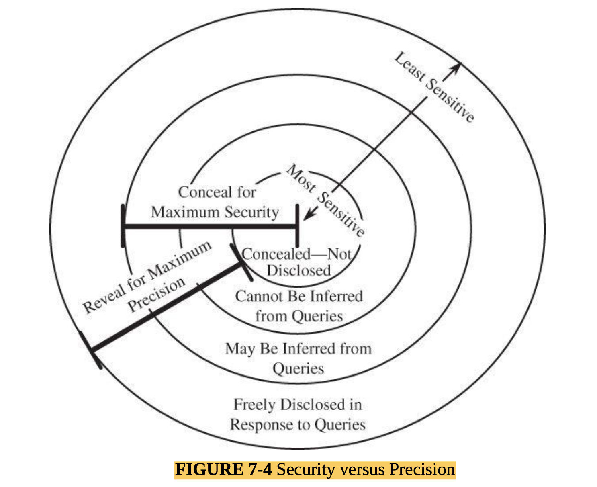
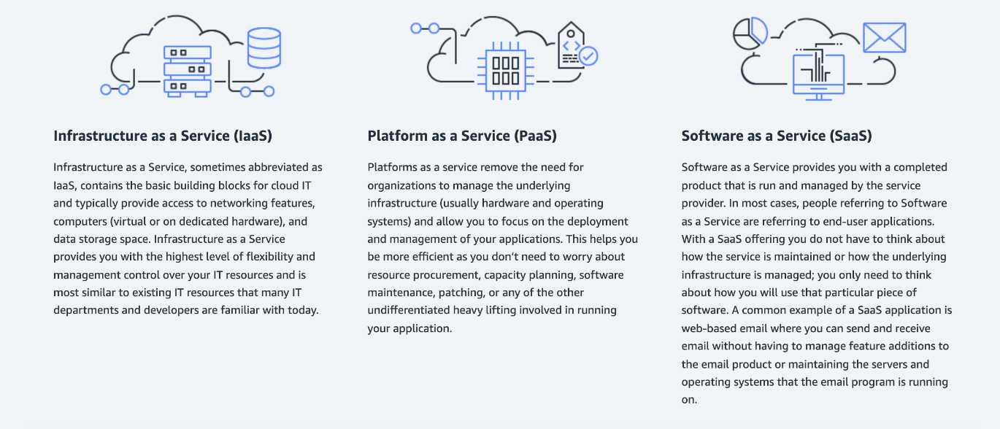
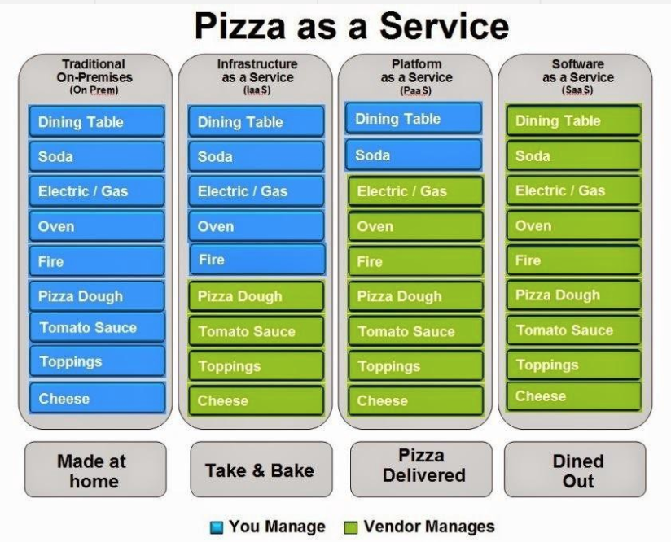
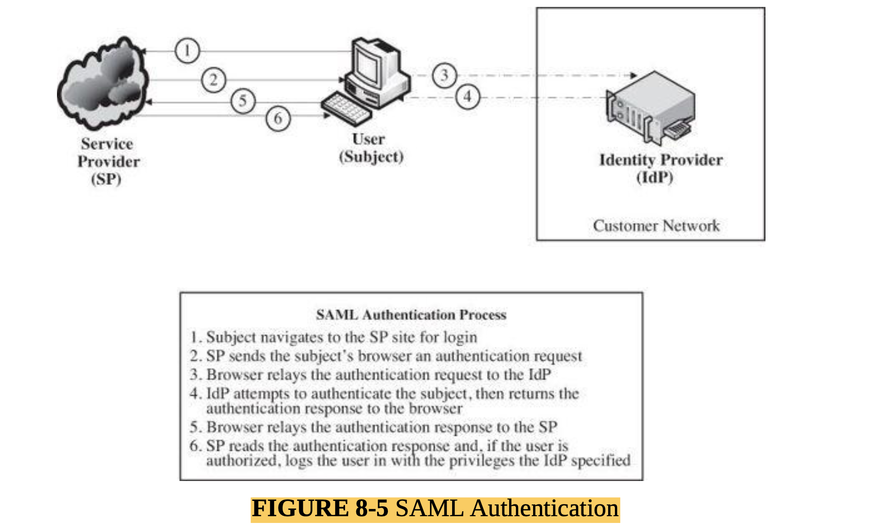
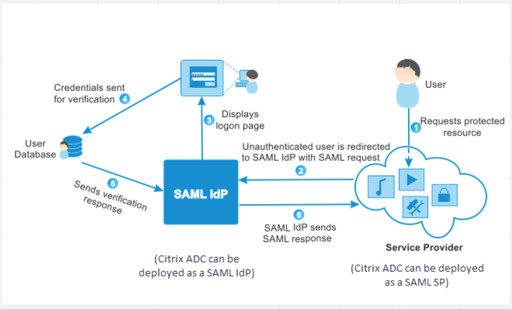
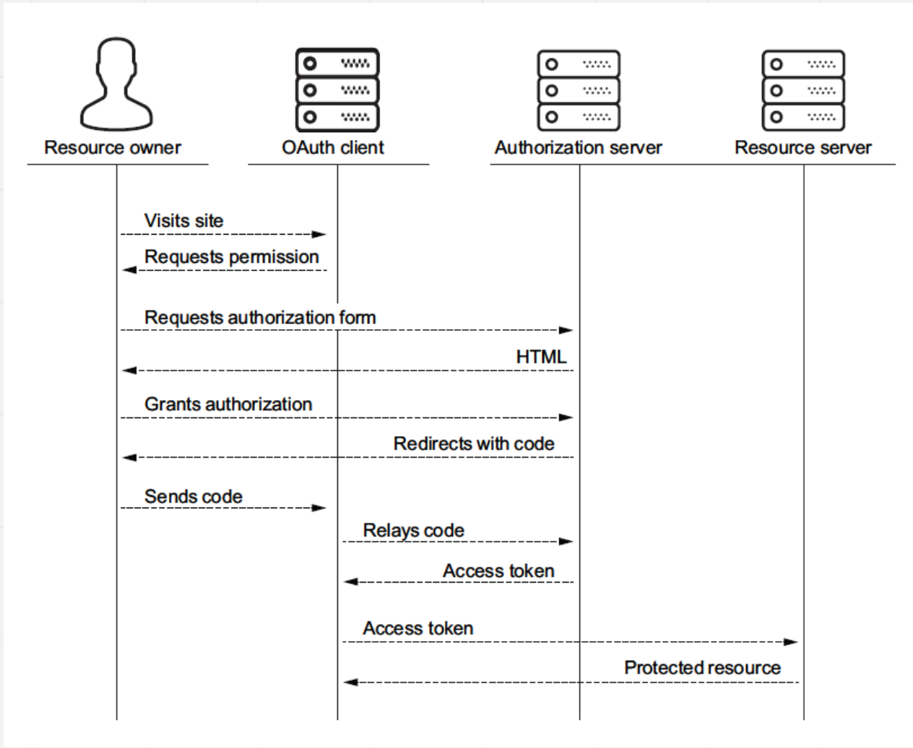

#### Main Topics

* At the end of this week, you should be able to:
    * Appreciate and explain the importance of databases in modern information systems
    * Identify and describe some common attacks against databases and how to prevent or mitigate them
    * Explain how data aggregation can increase threats to security
* This week we will be covering the following module learning outcomes:
    * (MO1) Identify and analyse major threat types in a variety of systems,
    * (MO4) Critically assess the relative merits of specific solution approaches for particular contexts,
    * (MO5) Critically discuss leading edge research in cyber security and the challenges faced.

#### Sub titles:

*

# Intro

* A database is a collection of data and a set of rules that organize the data by specifying certain relationships among
  the data.
* A database administrator is a person who defines the rules that organize the data and also controls who should have
  access to what parts of the data.
* The user interacts with the database through a program called a database manager or a database management system (
  DBMS)
* A database is a collection of tables, each containing records having one or more fields or elements.
* The logical structure of a database is called a schema.
* The name of each column is called an attribute of the database.
    * A relation is a set of columns.
    * Relations in a database show some connection among data in tables.

* Users interact with database managers through commands to the DBMS that retrieve, modify, add, or delete fields and
  records of the database. A command is called a query.
* We can also merge two subschema on a common element by using a join query.
* Databases support controlled, shared access to a single repository of data.
* Advantages of DB:
    * • shared access, so that many users can use one common, centralized set of data • controlled access, so that only
      authorized users are allowed to view or to modify data values
    * • minimal redundancy, so that individual users do not have to collect and maintain their own sets of data
    * • data consistency, so that a change to a data value affects all users of the data value
    * • data integrity, so that data values are protected against accidental or malicious undesirable changes

# Security Requirements of Databases

* list of requirements for database security.
    * • Physical database integrity. The data of a database are immune from physical problems, such as power failures,
      and someone can reconstruct the database if it is destroyed through a catastrophe.
    * • Logical database integrity. The structure of the database is preserved. With logical integrity of a database, a
      modification to the value of one field does not affect other fields, for example.
    * • Element integrity. The data contained in each element are accurate.
    * • Auditability. It is possible to track who or what has accessed (or modified) the elements in the database.
    * • Access control. A user is allowed to access only authorized data, and different users can be restricted to
      different modes of access (such as read or write).
    * • User authentication. Every user is positively identified, both for the audit trail and for permission to access
      certain data.
    * Availability. Users can access the database in general and all the data for which they are authorized.

* Integrity of the Database:
    * Integrity of the database as a whole is the responsibility of the DBMS, the operating system, and the (human)
      computing system manage
    * Therefore, one way of protecting the database as a whole is to regularly back up all files on the system. These
      periodic backups can be adequate controls against catastrophic failure.

* Element Integrity:
    * The integrity of database elements is their correctness or accuracy.
    * Databases achieve integrity of the database, its structure, and its individual elements.
    * This corrective action can be taken in three ways: by field checks, through access control, and with change log.
        * First, the DBMS can apply field checks, activities that test for appropriate values in a position. A field
          might be required to be numeric, an uppercase letter, or one of a set of acceptable characters. The check
          ensures that a value falls within specified bounds or is not greater than the sum of the values in two other
          fields.
        * A second integrity action is afforded by access control.
        * The third means of providing database integrity is maintaining a change log for the database. A change log
          lists every change made to the database; it contains both original and modified values. Using this log, a
          database administrator can undo any changes that were made in error.

    * Configuration Management and Access Control:
    * The proliferation of versions and releases can be controlled in three primary ways
        * • Separate files: A separate file can be kept for each different version or release. For instance, version 1
          may exist for machines that store all data in main memory, and version 2 is for machines that must put some
          data out to a disk
        * • Deltas: One version of the system is deemed the main version, and all other versions are considered to be
          variations from the main version. The database keeps track only of the differences, in a file called a delta
          file. The delta contains commands that are “applied” to the main version to transform it into the alternative
          version. This approach saves storage space but can become unwieldy.
        * • Conditional compilation: All versions are handled by a single file, and conditional statements are used to
          determine which statements apply under which conditions.

* Auditability:
    * For some applications administrators may want to generate an audit record of all access (read or write) to a
      database. Such a record can help to maintain the database’s integrity, or at least to discover after the fact who
      had affected what values and when.
    * A second advantage, as we see later, is that users can access protected data incrementally; that is, no single
      access reveals protected data, but a set of sequential accesses viewed together reveals the data, much like
      discovering the clues in a detective novel

* Access Control:
    * Databases are useful because they centralize the storage and maintenance of data. Limited access is both a
      responsibility and a benefit of this centralization.
    * Database management systems implement their own access control at a level finer than what an operating system
      handles.

* User Authentication:
    * The DBMS can require rigorous user authentication
    * Typically, the DBMS runs as an application program on top of the operating system. This system design means that
      there is no trusted path from the DBMS to the operating system, so the DBMS must be suspicious of any data it
      receives, including a user identity from the operating system

* Availability:
* Integrity/Confidentiality/Availability:
    * Integrity is also a property of the structure of the database (elements in one table correspond one to one with
      those of another) and of the relationships of the database (records having the same unique identifier, called a
      key, are related). Thus, integrity is a major concern in the design of database management systems
    * Confidentiality is likewise a key issue with databases because databases are often used to implement controlled
      sharing of sensitive data. Access to data can be direct (you request a record and the database provides it) or
      indirect (you request some records and from those results infer or intuit other data
    * availability is important because of the shared access motivation underlying database development. However,
      availability conflicts with confidentiality. The last sections of the chapter address availability in an
      environment in which confidentiality is also important.

# Reliability and Integrity

* When software engineers say that software has reliability, they mean that the software runs for very long periods of
  time without failing
* Database concerns about reliability and integrity can be viewed from three dimensions:
    * • Database integrity: concern that the database as a whole is protected against damage, as from the failure of a
      disk drive or the corruption of the master database index. These concerns are addressed by operating system
      integrity controls and recovery procedures.
    * • Element integrity: concern that the value of a specific data element is written or changed only by authorized
      users. Proper access controls protect a database from corruption by unauthorized users.
    * • Element accuracy: concern that only correct values are written into the elements of a database. Checks on the
      values of elements can help prevent insertion of improper values. Also, constraint conditions can detect incorrect
      values.

* Two-Phase Update:
    * A serious problem for a database manager is the failure of the computing system in the middle of data
      modification. If the data item to be modified was a long field or a record consisting of several attributes, only
      some of the new data might have been written to permanent storage. Therefore, the database file would contain
      incorrect data that had not been updated.
    * Update Technique:
        * During the first phase, called the intent phase, the DBMS gathers the resources it needs to perform the
          update. It may gather data, create dummy records, open files, lock out other users, and calculate final
          answers; in short, it does everything to prepare for the update, but it makes no changes to the database. The
          first phase is repeatable an unlimited number of times because it takes no permanent action. If the system
          fails during execution of the first phase, no harm is done because all these steps can be restarted and
          repeated after the system resumes processing.
        * The last event of the first phase, called committing, involves the writing of a commit flag to the database.
          The commit flag means that the DBMS has passed the point of no return: After committing, the DBMS begins
          making permanent changes.
        * If the system fails during the second phase, the database may contain incomplete data, but the system can
          repair these data by performing all activities of the second phase. After the second phase has been completed,
          the database is again complete.
        * When a two-phase commit is used, shadow values are maintained for key data points. A shadow data value is
          computed and stored locally during the intent phase, and it is copied to the actual database during the commit
          phase.
        * Once the DBMS begins the commit phase, it writes a COMMIT flag. When this flag is set, the DBMS will not
          perform any steps of the intent phase. Intent steps cannot be performed after committing because database
          values are modified in the commit phase. Notice, however, that the steps of the commit phase can be repeated
          an unlimited number of times, again with no negative effect on the correctness of the values in the database.

* Redundancy/Internal Consistency
    * Error Detection and Correction Codes:
        * One form of redundancy is error detection and correction codes, such as parity bits, Hamming codes [HAM50],
          and cyclic redundancy checks.
        * These codes can be applied to single fields, records, or the entire database. Each time a data item is placed
          in the database, the appropriate check codes are computed and stored; each time a data item is retrieved, a
          similar check code is computed and compared to the stored value.

* Recovery:
    * In the event of a failure, the database is reloaded from a backup copy and all later changes are then applied from
      the audit log.

* Concurrency/Consistency:
    * Database systems are often multiuser systems. Accesses by two users sharing the same database must be constrained
      so that neither interferes with the other. Simple locking is done by the DBMS. If two users attempt to read the
      same data item, there is no conflict because both obtain the same value.
    * Database management systems serve multiple users at once by implementing concurrency and sequencing.

# Database Disclosure

## Sensitive Data:

* Databases protect sensitive data by controlling direct or indirect access to the data.
* Several factors can make data sensitive.
    * • Inherently sensitive. The value itself may be so revealing that it is sensitive. Examples are the locations of
      defensive missiles or the median income of barbers in a town with only one barber.
    * • From a sensitive source. The source of the data may indicate a need for confidentiality. An example is
      information from an informer whose identity would be compromised if the information were disclosed.
    * • Declared sensitive. The database administrator or the owner of the data may have declared the data to be
      sensitive. Examples are classified military data or the name of the anonymous donor of a piece of art.
    * • Part of a sensitive attribute or record. In a database, an entire attribute or record may be classified as
      sensitive. Examples are the salary attribute of a personnel database or a record describing a secret space
      mission.
    * • Sensitive in relation to previously disclosed information. Some data become sensitive in the presence of other
      data. For example, the longitude coordinate of a secret gold mine reveals little, but the longitude coordinate in
      conjunction with the latitude coordinate pinpoints the mine.

## Types of Disclosures:

* Exact Data:
    * The most serious disclosure is the exact value of a sensitive data item itself. The user may know that sensitive
      data are being requested, or the user may request general data without knowing that some of it is sensitive. A
      faulty database manager may even deliver sensitive data by accident, without the user’s having requested it.

* Bounds:
    * Another exposure is disclosing bounds on a sensitive value, that is, indicating that a sensitive value, y, is
      between two values, L and H. Sometimes, by using a narrowing technique not unlike the binary search, the user may
      first determine that L ≤ y ≤ H and then see whether L ≤ y ≤ H/2, and so forth, thereby permitting the user to
      determine y to any desired precision.
    * Sometimes, however, bounds are a useful way to present sensitive data. It is common to release upper and lower
      bounds for data without identifying the specific records
* Negative Result:
    * Sometimes we can word a query to determine a negative result. That is, we can learn that z is not the value of y.
    * if a student does not appear on the honors list, you can infer that the person’s grade point average is below
      3.50. This information is not too revealing, however, because the range of grade point averages from 0.0 to 3.49
      is rather wide.

* Existence:
    * In some cases, the existence of data is itself a sensitive piece of data, regardless of the actual value. For
      example, an employer may not want employees to know that their telephone use is being monitored. In this case,
      discovering a NUMBER OF PERSONAL TELEPHONE CALLS field in a personnel file would reveal sensitive data.

* Probable Value:
    * it may be possible to determine the probability that a certain element has a certain value.
    * A database manager can control access by direct queries; disclosure can occur in more subtle ways that are harder
      to control.
    * From these queries you conclude there is a 25 percent likelihood that the president is a registered Tory.

* Direct Inference:
    * Inference is a way to infer or derive sensitive data from nonsensitive data. The inference problem is a subtle
      vulnerability in database security.

* Direct Attack:
    * In a direct attack, a user tries to determine values of sensitive fields by seeking them directly with queries
      that yield few records. The most successful technique is to form a query so specific that it matches exactly one
      data item.

* Inference by Arithmetic:
    * The indirect attack seeks to infer a final result based on one or more intermediate statistical results. But this
      approach requires work outside the database itself. In particular, a statistical attack seeks to use some
      apparently anonymous statistical measure to infer individual data
    * Sum:
    * Count:
    * Mean: The arithmetic mean (average) allows exact disclosure if the attacker can manipulate the subject population.
    * Median: By a slightly more complicated process, we can determine an individual value from the median, the midpoint
      of an ordered list of values.

* Tracker Attacks:
    * A tracker attack can fool the database manager into locating the desired data by using additional queries that
      produce small results. The tracker adds additional records to be retrieved for two different queries; the two sets
      of records cancel each other out, leaving only the statistic or data desired. The approach is to use intelligent
      padding of two queries. In other words, instead of trying to identify a unique value, we request n–1 other
      values (where there are n values in the database).

* Linear System Vulnerability:
    * Inference is difficult to control because it can occur from algebraic calculations beyond the scope of database
      management systems.
    * A tracker is a specific case of a more general vulnerability. With a little logic, algebra and luck in the
      distribution of the database contents, it may be possible to construct an algebraic linear system of equations
      that returns results relating to several different sets.
    * However, the queries’ equations can be solved for each of the unknown c values, revealing them all.
    * To see how,use basic algebra to note that q1 –q2 =c3 +c5,and q3 –q4 =c3 –c5.Then, subtracting these two equations,
      we obtain c5 = ((q1 – q2) – (q3 – q4))/2. Once we know c5, we can derive the others.
        

* Aggregation:
    * Related to the inference problem is aggregation, which means building sensitive results from less sensitive
      inputs.
    * Addressing the aggregation problem is difficult because it requires the database management system to track what
      results each user had already received and conceal any result that would let the user derive a more sensitive
      result. Aggregation is especially difficult to counter because it can take place outside the system.
    * Recent interest in data mining has raised concern again about aggregation. Data mining is the process of sifting
      through multiple databases and correlating multiple data elements to find useful information. Marketing companies
      use data mining extensively to find consumers likely to buy a product.
    * Aggregation is nearly impossible for a database management system to control because combining the data can occur
      outside the system, even by multiple colluding users.

* Analysis on Data:
* Hidden Data Attributes:
    * Objects such as pictures, music files, and documents are actually complex data structures having properties or
      attributes that add meaning to the data. These properties, called metadata, are not displayed with the picture or
      document, but they are not concealed; in fact, numerous applications support selecting, searching, sorting, and
      editing based on metadata.

* File Tags:
    * If the photo were posted without a narrative description, only people who knew Zane would see the image and know
      it was he. But when Zane applies for a job and the company does a web search to find out anything about him, the
      photo pops up because his name is in the metadata.

* Geotagging:
    * the practice of many cameras and smartphones of tagging each photo they take with the GPS coordinates where the
      photo was taken.
    * According to the authors, between 1 percent and 5 percent of photos at sites such as Flickr, YouTube, and
      Craigslist contain header data that gives the location where the picture was taken. Friedland and Sommer speculate
      that these numbers are low only because some photo-editing applications automatically remove or replace the
      metadata. These researchers point out the potential for misuse of the data by burglars, kidnappers, or other
      evildoers.

* Tracking Devices:
    * Cell phones continually search for a nearby tower, RFID tags for transportation or identification can be read by
      off-the-shelf devices, and GPS navigation devices both send and receive position data. Although we use these
      technologies for good purposes, we need to be aware that they can be used to build a relatively complete trail of
      our movements throughout the day
    * The problem with metadata is that it is not obvious to the object’s owner, but it is well structured and readily
      available to anyone who wants to use it.
    * Data tracking can occur with data the user or owner does not even know exist.

## Preventing Disclosure: Data Suppression and Modification

* There are no perfect solutions to the inference and aggregation problems. The approaches to controlling it follow the
  three paths listed below.
    * • Suppress obviously sensitive information. This action can be taken fairly easily. The tendency is to err on the
      side of suppression, thereby restricting the usefulness of the database. side of suppression, thereby restricting
      the usefulness of the database.
    * • Track what the user knows. Although possibly leading to the greatest safe disclosure, this approach is extremely
      costly. Information must be maintained on all users, even though most are not trying to obtain sensitive data.
      Moreover, this approach seldom takes into account what any two people may know together and cannot address what a
      single user can accomplish by using multiple IDs.
    * • Disguise the data. Random perturbation and rounding can inhibit statistical attacks that depend on exact values
      for logical and algebraic manipulation. The users of the database receive slightly incorrect or possibly
      inconsistent results.

* Suppression and concealing are two controls applied to data items. With suppression, sensitive data values are not
  forthcoming; the query is rejected without response. With concealing, the answer is close to but not exactly the
  actual value.
* Data suppression blocks release of sensitive data; data concealing releases part or an approximation of sensitive
  data.

## Security Versus Precision

* The conservative philosophy suggests rejecting any query that mentions a sensitive field. We may thereby reject many
  reasonable and nondisclosing queries.
* aims to protect all sensitive data while revealing as much nonsensitive data as possible called precision
* We can depict the relationship between security and precision with concentric circles.
    
* The ideal combination of security and precision allows us to maintain perfect confidentiality with maximum precision;
  in other words, we disclose all and only the nonsensitive data.

* Statistical Suppression:

* Limited Response Suppression:
    * Limited response suppression eliminates certain low-frequency elements from being displayed. It is not sufficient
      to delete them, however, if their values can also be inferred.
    * When one cell is suppressed in a table with totals for rows and columns, it is necessary to suppress at least one
      additional cell on the row and one on the column to confuse a snooper. Using this logic, all cells (except totals)
      would have to be suppressed in this small sample table. When totals are not presented, single cells in a row or
      column can be suppressed.

* Combined Results:
    * Another control combines rows or columns to protect sensitive values.
    * Another way of combining results is to present values in ranges. For example, instead of exact financial aid
      figures being released, results can be released for the ranges $0– 1999, $2000–3999, and $4000 and above.
    * Yet another method of combining is by rounding. This technique is actually a fairly well known example of
      combining by range.

* Random Sample:
    * With random sample control, a result is not derived from the whole database; instead the result is computed on a
      random sample of the database. The sample chosen is large enough to be valid. Because the sample is not the whole
      database, a query against this sample will not necessarily match the result for the whole database.
    * So that averaging attacks from repeated, equivalent queries are prevented, the same sample set should be chosen
      for equivalent queries. In this way, all equivalent queries will produce the same result, although that result
      will be only an approximation for the entire database.

* Concealment:
    * Aggregation need not directly threaten privacy. An aggregate (such as sum, median, or count) often depends on so
      many data items that the sensitivity of any single contributing item is hidden. Government statistics show this
      well: Census data, labor statistics, and school results show trends and patterns for groups (such as a
      neighborhood or school district), but do not violate the privacy of any single person.

* Blocking Small Sample Sizes:
    * As we explained, inference and aggregation attacks work better nearer the ends of the distribution. If very few or
      very many points are in a database subset, a small number of equations may disclose private data. The mean of one
      data value is that value exactly. With three data values, the means of each pair yield three equations in three
      unknowns, which you know can easily be solved with linear algebra.

* Random Data Perturbation:
    * It is sometimes useful to perturb the values of the database by a small error. For each xi that is the true value
      of data item i in the database, we can generate a small random error term εi and add it to xi for statistical
      results. The ε values are both positive and negative, so some reported values will be slightly higher than their
      true values and other reported values will be lower. Statistical measures such as sum and mean will be close but
      not necessarily exact. Data perturbation is easier to use than random sample selection because it is easier to
      store all the ε values in order to produce the same result for equivalent queries.
    * Data perturbation works for aggregation, as well. With perturbation you add a small positive or negative error
      term to each data value.

* Swapping:
    * To counter this kind of linking, some database administrators randomly perturb the data. The sex for Bailey and
      Chin might be interchanged, as might the race of Dewitt and Earhart. The count of individuals with these values
      would still be correct. Total aid for all males would be off by a bit
    * Thus, swapping, like perturbation, might be a reasonable compromise between data accuracy and disclosure.

* Query Analysis:
    * A more complex form of security uses query analysis. Here, a query and its implications are analyzed to determine
      whether a result should be provided. As noted earlier, query analysis can be quite difficult. One approach
      involves maintaining a query history for each user and judging a query in the context of what inferences are
      possible, given previous results.

# Exercises : SQL

## Inferences

* Exercise: Translate the tracker attack examples into SQL and try them on the database for this section.
    * SELECT COUNT(name) FROM 7_7 WHERE SEX=”F” AND RACE=”C” AND DORM=”Holmes”
    * Converts into
        * SELECT COUNT(name) FROM 7_7 WHERE SEX=”F”
    * From which we subtract the result of
        * SELECT COUNT(name) FROM 7_7 WHERE SEX=”F” AND (RACE!=”C” OR DORM!=”Holmes”)

## Complex queries

* Exercise: Table 7.11 cannot be produced by a single query, but if you combine the results of 2 queries you can get all
  the data needed to produce it. What are those two queries? (hint - you will need to use the “rollup” SQL keyword of
  MySQL - see 12.20.2 GROUP BY Modifiers (Links to an external site.) [24]).
    * Table 7.11
        * SELECT sex,dorm,count(name) from 7_7 group by sex,dorm with rollup SELECT sex,dorm,count(name) from 7_7 group
          by dorm,sex with rollup
* Exercise: Table 7.13 is much easier to produce. How would you do it? (hint, use of GROUP BY is likely to make it
  simple)
    * SELECT sex,drugs,count(name) from 7_7 group by sex,drugs order by sex, drugs

* Exercise: Table 7.14 is much harder, but try it for yourself - you may need to use conditional COUNTIF clauses to get
  it to work properly.
    * `SELECT sex, COUNT(IF(drugs=0 OR drugs=1,1,null)) ‘0 or 1’, COUNT(IF(drugs=2 OR drugs=3,1,null)) ‘2 or 3’, FROM 7_7 group_by sex`
    * The IF statement returns 1 if the condition is met, or null if it is not. COUNT only counts the non-nulls. The
      strings are optional (although we’ve set them, we haven’t used them) and can be used to set row headers which can
      be returned to the calling code.

# Discusions

* how else might you prevent inferential and statistical attacks?
    * There are several approaches that could be used to protect data against statistical attacks:
        * Random Data Perturbation - add a certain level of disturbance to the data, so then attackers cannot infer
          exact values;
        * Concealmentment - hiding and/or protecting sensitive data;
        * Providing a random sample for the statistical attack query.
    * These are just some of the valid approaches, however, a skilled attacker might find different ways to explore
      vulnerabilities, leading database managers to limit the accessibility of the database. Limiting the accessibility
      of the database can lead to the availability of data problems, therefore any technique applied should be chosen
      with caution.

# Cloud storage

* Often known as “somebody else’s computer”, Cloud services are increasingly popular because they offer reductions in
  cost by allowing several organisations to share the costs of maintenance through a service provider. However, cloud
  doesn’t have to be a service - it is possible to run your own private cloud

## Cloud Computing Concepts

* The cloud has five defining characteristics:
    * • On-demand self-service. If you are a cloud customer, you can automatically ask for computing resources (such as
      server time and network storage) as you need them.
    * • Broad network access. You can access these services with a variety of technologies, such as mobile phones,
      laptops, desktops, and mainframe computers.
    * • Resource pooling. The cloud provider can put together a large number of multiple and varied resources to provide
      your requested services. This “multitenant model” permits a single resource (or collection of resources) to be
      accessed by multiple customers, and a particular resource (such as storage, processing or memory) can be assigned
      and reassigned dynamically, according to the customers’ demands. This reconfiguration and reallocation are
      invisible to an individual customer; from the customer’s point of view, services are provided without knowledge of
      the underlying location or locations.
    * • Rapid elasticity. Services can quickly and automatically be scaled up or down to meet a customer’s need. To the
      customer, the system’s capabilities appear to be unlimited.
    * • Measured service. Like water, gas, or telephone service, use of cloud services and resources can be monitored,
      controlled, and reported to both provider and customer.

* Service Models:
    * Software as a service (SaaS):  the cloud provider gives a customer access to applications running in the cloud.
      Here, the customer has no control over the infrastructure or even most of the application capabilities; like
      renting and driving an automobile, the customer accesses and uses the application.
        * Software as a service: applications in the cloud
    * Platform as a service (PaaS), the customer has his or her own applications, but the cloud affords the languages
      and tools for creating them. Again, the customer has no control over the infrastructure that underlies the tools
      but may have some say in infrastructure configuration
        * Platform as a service: languages and tools to support application development in the cloud
    * Infrastructure as a service (IaaS), the cloud offers processing, storage, networks, and other computing resources
      that enable customers to run any kind of software. Here, customers can request operating systems, storage, some
      applications, and some network components.
        * Infrastructure as a service: processing, storage, network components in the cloud

    
    
    

* Deployment Models:
    * **Private cloud** has infrastructure that is operated exclusively by and for the organization that owns it, but
      cloud management may be contracted out to a third party.
    * **Community cloud** is shared by several organizations and is usually intended to accomplish a shared goal
    * **Public cloud**, available to the general public, is owned by an organization that sells cloud services
    * **Hybrid cloud** is composed of two or more types of clouds, connected by technology that enables data and
      applications to be moved around the infrastructure to balance loads among clouds

## Risk Analysis while Moving Cloud

* **Identify assets.** Moving to a cloud service generally means moving functionality and data. It is important that you
  document every function and data type that might move to the cloud service, since it’s easy to lose track and miss
  something important.
* **Determine vulnerabilities.** When considering cloud services, be sure to consider cloud-specific vulnerabilities.
  These will generally stem from having to access the system through an Internet connection, sharing hardware and
  networks with potential adversaries, and trusting a cloud provider. Be sure to consider the flipside as well: Not
  moving to the cloud may mean decreased availability, lower-quality staff that administers systems, and worse patch
  management.
* **Estimate likelihood of exploitation.** Many vulnerabilities will be either more or less difficult to exploit in a
  cloud environment, as well as across different cloud service models and providers. Be sure to consider these
  differences when weighing your options.
* **Compute expected loss.** Your expected loss will depend on a variety of factors, including the consequences of
  successful attacks and your ability to respond to attacks. Consider how the move to the cloud might influence those
  factors: Will a typical cloud provider be able to respond to the attack better than your company could? In the case of
  DDoS, for instance, there’s a good chance the answer is yes.
* **Survey and select new controls**. What matters most in this step is determining what controls the cloud service
  would need to have in place for your risk to be adequately managed. These may also be controls that you put in place
  to augment a cloud offering. Do your data need to be encrypted? What logging capabilities will you need from the cloud
  provider? What about authentication and access control options?
* **Project savings**. A move to cloud services is often justified by cost savings, but sometimes those savings don’t
  materialize. A company might estimate that they will save $1M per year on data center costs, but not realize that side
  effects of the migration will cost them $1.5M in new security controls. When weighing your options, try to understand
  all the costs you can expect to incur.

* Switching Cloud Providers:
    * Vendor lock-in inhibits your switching providers.
    * Vendor lock-in occurs when customers must continue buying a certain type of product from the same vendor they have
      already been using because the upfront cost of migrating to a different vendor’s product line would be
      significantly higher than the short-term cost of continuing with the existing vendor.

* Cloud as a Security Control:
    * Geographic diversity. If you have only one data center, you have all sorts of localized threats to worry about:
      natural disasters, fires, and Internet outages, to name a few.
    * Platform diversity. Many of the cyber attacks we discuss in this book are targeted at specific applications, OSs,
      or protocols.
    * Infrastructure diversity. In addition to the software stack, many other potential points of vulnerability will
      likely differ between you and your cloud provider, including hardware, network configuration, security controls,
      quality of security staff, IP addresses, and suppliers.

* Security Tools To handle
    * • Email filtering. SMTP already routes email to and from servers all over the Internet, so adding an extra hop to
      a cloud provider for filtering is very little trouble.
    * • DDoS protection. Cloud-based DDoS protection services update your DNS records to insert their servers as proxies
      between customers’ outward-facing services and the Internet.
    * • Network monitoring. Log analysis and SIEM tools (see section 6.9) have steep processor, memory, and storage
      requirements, and require expertise to use effectively. To help companies deal with these issues, some cloud-based
      solutions have emerged.

## Cloud Security Tools and Techniques

* Data Protection on Cloud
    * TLS
    * As with TLS, configuration, particularly your choice of cipher suite, can mean the difference between strong and
      weak security. Like TLS, SSH and many VPN products also support certificates, which, in addition to being a strong
      form of “something you have” authentication, can offer the added benefit of mutual authentication, allowing the
      client and server to authenticate each other.

* Cloud Storage:
    * Shared storage involves a threat of access from sharing neighbors.
    * data storage perspective, you should think about a number of security-related issues:
        * • How sensitive is the data I’ll be storing? D
        * • Will I need to share the data with anyone and, if so, what kinds of access controls will I require?
        * • Are the data subject to export controls or other regulations?
    * Changing cryptographic keys for large amounts of encrypted data is time consuming. A protocol using master and
      user keys makes changing efficient in use of time.
    * Sharing cryptographic keys with cloud storage providers potentially exposes sensitive data.

## Cloud Application Security

* couple of general threats that come up as a result of the cloud computing paradigm:
    * • Attacks against shared resources
    * • Insecure APIs.

# Cloud Identity Management

* Federated identity management. FIdM “enables identity information to be developed and shared among several entities
  and across trust domains...providing ‘single sign-on’ convenience and efficiencies to identified individuals, identity
  providers and relying parties.” [GAR14] In short, FIdM allows one organization or system to attest to another a user’s
  identity and authority.

* With FIdM, one system maintains a user’s identity information, and other systems query that one system when needed.
* FIdM deals effectively with all the cloud identity challenges we have outlined above.
    * With FIdM solutions, users can access all of a company’s cloud service providers with the same credentials they
      use to access company systems.
    * Because cloud customers control the authentication process, they can specify authentication requirements that make
      sense for them: minimum password length, multifactor authentication, or biometrics, for instance. FIdM also
      greatly simplifies the governance issue, ensuring, as it does, that only one system has the authority to create,
      modify, or delete user accounts: the customer’s identity management system (commonly LDAP or Microsoft Active
      Directory).

        

## Security Assertion Markup Language (SAML)

* The Security Assertion Markup Language (SAML) is an XML-based standard that defines a way for systems to securely
  exchange user identity and privilege information.
* Web only
* For authentication
* main implementation Shibboleh
* The SAML standard [OAS05a] specifies XML messages that parties can use to exchange identity information, as well as
  protocols and rules for those exchanges. SAML messages are usually transmitted over HTTP, and work best in the context
  of web-based applications. HTTP offers the added benefit of compatibility with TLS, the use of which we highly
  recommend for protection of SAML communications.
* SAML defines three parties who participate in identity exchange:
    * • The Service Provider (SP) or Relying Party: A SAML-enabled service, such
    * as the LMS, that needs to obtain identity information from a third party
    * • The Subject: The entity, be it user or system, that is attempting to log in to the SP
    * • The Identity Provider (IdP) or Asserting Party: A SAML-enabled system that can authenticate the Subject and make
      assertions about the Subject’s identity
* When a user tries to access an SP, the first thing the SP needs to do is figure out which IdP to reach, a problem
  called realm discovery.
* SAML defines three types of Assertions::
    * • “Authentication: The assertion subject was authenticated by a particular means at a particular time.”
    * • “Attribute: The assertion subject is associated with the supplied attributes.”
    * • “Authorization Decision: A request to allow the assertion subject to access the specified resource has been
      granted or denied.”
        
        

## OAuth

* Whereas SAML is designed to handle authentication, authorization, and single sign-on for users and systems,
  OAuth [HAR12] was built to handle a different aspect of FIdM: API access.
* OAuth 2.0 is an authorization standard rather than an authentication standard, and its primary purpose is authorizing
  third-party applications to access APIs on a user’s behalf.
* Web and App support
* OAuth does not exchange identity information, just authorization.
* OAuth provides a nice security benefit by allowing users to give third-party applications access to only the account
  resources they need (enforcing the principle of least privilege), and doing so without sharing passwords.
* OAuth defines four roles:
    * • The Resource Owner, analogous to the SAML subject, is the user with a password-protected online account.
    * • The Resource Server is the server on which the APIs reside.
    * • The Client, analogous to the SAML SP, is the application that is attempting to access the account APIs.
    * • The Authorization Server, analogous to the SAML IdP, is the server that can authenticate the resource owner and
      grant the client access to the resource server.
* To build an OAuth Client, you must first register with the service you want to access.
    * Registration generally means you give the Authorization Server your application’s URL, and the Authorization
      Server gives you a unique identifier (“Client ID”) and a Client Secret to use for authentication (note that this
      authenticates the OAuth Client, not a user).

* The Access Token is the credential that OAuth Clients use to log in to Resource Servers and make API calls on a user’s
  behalf.
    * A good security practice is to have Access Tokens expire after the length of a typical session (usually on the
      order of an hour or two) in order to limit risk if the tokens become compromised. Authorization Servers may give
      Confidential Clients more persistent access through Refresh Tokens. Clients can send Refresh Tokens to
      Authorization Servers whenever they need new Access Tokens. Confidential Clients typically store Refresh Tokens
      permanently, and those tokens continue to function until the user or service provider deauthorizes the client.
        

## OAuth for Authentication (OpenID Connect)

* You can combine with SAML or
* You can use OpenIdConnect standards
    * OpenID Connect (OIDC), a relatively new standard for federated authentication.

* OIDC is built on top of OAuth 2.0, which gives it a big feature advantage over SAML. Whereas SAML assumes its clients
  are web browsers, and therefore has poor support for native applications, OAuth, and by extension OIDC, supports both
  browsers and native applications.
* he biggest difference between OIDC and normal OAuth is the addition of an ID Token, which enables an Authorization
  Server to make authentication claims (similar to SAML authentication assertions) about a user.
* Other than that, the OIDC flow is essentially a normal OAuth flow, but one that focuses specifically on identity.
    * In place of an OAuth Resource Server, OIDC has a UserInfo Endpoint that delivers only one kind of resource: user
      identity information.
    * Instead of allowing an OAuth Client to access APIs on a Resource Owner’s behalf, OIDC allows OAuth Clients only to
      authenticate users and make UserInfo requests.

* Unlike OAuth, however, OIDC requires TLS for most communication flows, and the ID Token adds hash values for
  Authorization Codes and Access Tokens that makes them more difficult to misuse.
    

# Securing IaaS

* Shared Infrastructure:
    * The first of these is the threat of shared storage. When you delete a file in the cloud, the file system
      deallocates it—that is, forgets it exists—but the file stays on a hard drive somewhere until it is overwritten.
        * One option is to use a commercial encryption product to encrypt your sensitive files, in which case you need
          not care whether a deleted file gets overwritten, since it will be unreadable anyway.
        * This second option is more difficult to enforce than the first, however, and does not provide confidentiality
          for data that has not yet been deleted, so encryption should be your preferred route.
    * IaaS providers use logical access controls to make sure that users cannot sniff one another’s network traffic
      within the IaaS environment. Nonetheless, if you can afford the performance hit of encrypting all your potentially
      sensitive IaaS network traffic—including traffic that only travels among VMs within the same IaaS environment—TLS,
      SSH, or a VPN will provide a strong second layer of protection.

* Host Access:
    * IaaS provider will likely allow you to control hosts via a web-based console interface or an API in addition to
      any network services that the host itself may be running
        * The difference between the console and API that the IaaS offers versus the services running on your VM hosts
          is that you cannot put network protections in front of the console or the API.
    * Authentication options will vary by provider, but consider the following if available:
        * • Require multifactor authentication for the console interface.
        * • Do not share accounts, and do not give any account more privileges than necessary.
        * • Use OAuth rather than passwords to give applications access to API interfaces, and limit those applications’
          privileges as much as possible.
        * • Use FIdM wherever possible so you manage only one set of user accounts.

* Virtual env:
    * Creating a hardened VM can be a challenge, but once you have created the VM for a given function, maintaining it
      is mostly just patch management.
    * Your VMs will have to run SSH or some sort of screen-sharing software so that you can administer them. Limit
      access to these services: They are prime targets of attackers. One way to accomplish this is to use network ACLs
      to limit SSH and screen-sharing traffic so that the connections must originate from your IP address space.
        

# Summary Cloud

* The cloud has five defining characteristics:
    * • On-demand self-service • Broad network access
    * • Resource pooling
    * • Rapid elasticity
    * • Measured service
* There are three basic types of cloud offering—SaaS, PaaS,
    * And IaaS—as well as four basic service models: public, private, community, and hybrid. A choice of cloud offering
      and service model should be grounded in a careful risk analysis and a cloud provider assessment.
* Cloud services expose their customers to new threats but can be useful security tools. They are particularly helpful
  for availability and for augmenting the security of smaller organizations.
* Cloud customers can expect to have limited options for responding to security incidents that take place on cloud
  providers’ systems. Customers should work proactively with cloud providers to understand what support will be
  available under those circumstances.
* FIdM allows cloud customers to use cloud resources without requiring an extra set of login credentials. It also allows
  all login credentials and authentication options to be managed centrally by the customer organization. SAML and OIDC
  are currently the prevailing FIdM standards for authentication, and OAuth is the prevailing FIdM standard for API
  authorization.
* Securing IaaS means protecting your systems from the threats posed by shared infrastructure while taking full
  advantage of the security benefits of VMs and virtual networks. Prudent use of encryption, both for data-in-transit
  and data-at-rest, is critical when using shared infrastructure. VMs should be cordoned off in enclaves and configured
  to be highly specialized so as to minimize both their attack surfaces and the impact of successful attacks.