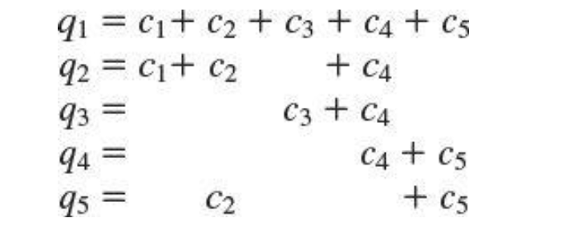

#### Main Topics

* At the end of this week, you should be able to:
    * Appreciate and explain the importance of databases in modern information systems
    * Identify and describe some common attacks against databases and how to prevent or mitigate them
    * Explain how data aggregation can increase threats to security
* This week we will be covering the following module learning outcomes:
    * (MO1) Identify and analyse major threat types in a variety of systems,
    * (MO4) Critically assess the relative merits of specific solution approaches for particular contexts,
    * (MO5) Critically discuss leading edge research in cyber security and the challenges faced.

#### Sub titles:

*

# Intro

* A database is a collection of data and a set of rules that organize the data by specifying certain relationships among
  the data.
* A database administrator is a person who defines the rules that organize the data and also controls who should have
  access to what parts of the data.
* The user interacts with the database through a program called a database manager or a database management system (
  DBMS)
* A database is a collection of tables, each containing records having one or more fields or elements.
* The logical structure of a database is called a schema.
* The name of each column is called an attribute of the database.
    * A relation is a set of columns.
    * Relations in a database show some connection among data in tables.

* Users interact with database managers through commands to the DBMS that retrieve, modify, add, or delete fields and
  records of the database. A command is called a query.
* We can also merge two subschema on a common element by using a join query.
* Databases support controlled, shared access to a single repository of data.
* Advantages of DB:
    * • shared access, so that many users can use one common, centralized set of data • controlled access, so that only
      authorized users are allowed to view or to modify data values
    * • minimal redundancy, so that individual users do not have to collect and maintain their own sets of data
    * • data consistency, so that a change to a data value affects all users of the data value
    * • data integrity, so that data values are protected against accidental or malicious undesirable changes

# Security Requirements of Databases

* list of requirements for database security.
    * • Physical database integrity. The data of a database are immune from physical problems, such as power failures,
      and someone can reconstruct the database if it is destroyed through a catastrophe.
    * • Logical database integrity. The structure of the database is preserved. With logical integrity of a database, a
      modification to the value of one field does not affect other fields, for example.
    * • Element integrity. The data contained in each element are accurate.
    * • Auditability. It is possible to track who or what has accessed (or modified) the elements in the database.
    * • Access control. A user is allowed to access only authorized data, and different users can be restricted to
      different modes of access (such as read or write).
    * • User authentication. Every user is positively identified, both for the audit trail and for permission to access
      certain data.
    * Availability. Users can access the database in general and all the data for which they are authorized.

* Integrity of the Database:
    * Integrity of the database as a whole is the responsibility of the DBMS, the operating system, and the (human)
      computing system manage
    * Therefore, one way of protecting the database as a whole is to regularly back up all files on the system. These
      periodic backups can be adequate controls against catastrophic failure.

* Element Integrity:
    * The integrity of database elements is their correctness or accuracy.
    * Databases achieve integrity of the database, its structure, and its individual elements.
    * This corrective action can be taken in three ways: by field checks, through access control, and with change log.
        * First, the DBMS can apply field checks, activities that test for appropriate values in a position. A field
          might be required to be numeric, an uppercase letter, or one of a set of acceptable characters. The check
          ensures that a value falls within specified bounds or is not greater than the sum of the values in two other
          fields.
        * A second integrity action is afforded by access control.
        * The third means of providing database integrity is maintaining a change log for the database. A change log
          lists every change made to the database; it contains both original and modified values. Using this log, a
          database administrator can undo any changes that were made in error.

    * Configuration Management and Access Control:
    * The proliferation of versions and releases can be controlled in three primary ways
        * • Separate files: A separate file can be kept for each different version or release. For instance, version 1
          may exist for machines that store all data in main memory, and version 2 is for machines that must put some
          data out to a disk
        * • Deltas: One version of the system is deemed the main version, and all other versions are considered to be
          variations from the main version. The database keeps track only of the differences, in a file called a delta
          file. The delta contains commands that are “applied” to the main version to transform it into the alternative
          version. This approach saves storage space but can become unwieldy.
        * • Conditional compilation: All versions are handled by a single file, and conditional statements are used to
          determine which statements apply under which conditions.

* Auditability:
    * For some applications administrators may want to generate an audit record of all access (read or write) to a
      database. Such a record can help to maintain the database’s integrity, or at least to discover after the fact who
      had affected what values and when.
    * A second advantage, as we see later, is that users can access protected data incrementally; that is, no single
      access reveals protected data, but a set of sequential accesses viewed together reveals the data, much like
      discovering the clues in a detective novel

* Access Control:
    * Databases are useful because they centralize the storage and maintenance of data. Limited access is both a
      responsibility and a benefit of this centralization.
    * Database management systems implement their own access control at a level finer than what an operating system
      handles.

* User Authentication:
    * The DBMS can require rigorous user authentication
    * Typically, the DBMS runs as an application program on top of the operating system. This system design means that
      there is no trusted path from the DBMS to the operating system, so the DBMS must be suspicious of any data it
      receives, including a user identity from the operating system

* Availability:
* Integrity/Confidentiality/Availability:
    * Integrity is also a property of the structure of the database (elements in one table correspond one to one with
      those of another) and of the relationships of the database (records having the same unique identifier, called a
      key, are related). Thus, integrity is a major concern in the design of database management systems
    * Confidentiality is likewise a key issue with databases because databases are often used to implement controlled
      sharing of sensitive data. Access to data can be direct (you request a record and the database provides it) or
      indirect (you request some records and from those results infer or intuit other data
    * availability is important because of the shared access motivation underlying database development. However,
      availability conflicts with confidentiality. The last sections of the chapter address availability in an
      environment in which confidentiality is also important.

# Reliability and Integrity

* When software engineers say that software has reliability, they mean that the software runs for very long periods of
  time without failing
* Database concerns about reliability and integrity can be viewed from three dimensions:
    * • Database integrity: concern that the database as a whole is protected against damage, as from the failure of a
      disk drive or the corruption of the master database index. These concerns are addressed by operating system
      integrity controls and recovery procedures.
    * • Element integrity: concern that the value of a specific data element is written or changed only by authorized
      users. Proper access controls protect a database from corruption by unauthorized users.
    * • Element accuracy: concern that only correct values are written into the elements of a database. Checks on the
      values of elements can help prevent insertion of improper values. Also, constraint conditions can detect incorrect
      values.

* Two-Phase Update:
    * A serious problem for a database manager is the failure of the computing system in the middle of data
      modification. If the data item to be modified was a long field or a record consisting of several attributes, only
      some of the new data might have been written to permanent storage. Therefore, the database file would contain
      incorrect data that had not been updated.
    * Update Technique:
        * During the first phase, called the intent phase, the DBMS gathers the resources it needs to perform the
          update. It may gather data, create dummy records, open files, lock out other users, and calculate final
          answers; in short, it does everything to prepare for the update, but it makes no changes to the database. The
          first phase is repeatable an unlimited number of times because it takes no permanent action. If the system
          fails during execution of the first phase, no harm is done because all these steps can be restarted and
          repeated after the system resumes processing.
        * The last event of the first phase, called committing, involves the writing of a commit flag to the database.
          The commit flag means that the DBMS has passed the point of no return: After committing, the DBMS begins
          making permanent changes.
        * If the system fails during the second phase, the database may contain incomplete data, but the system can
          repair these data by performing all activities of the second phase. After the second phase has been completed,
          the database is again complete.
        * When a two-phase commit is used, shadow values are maintained for key data points. A shadow data value is
          computed and stored locally during the intent phase, and it is copied to the actual database during the commit
          phase.
        * Once the DBMS begins the commit phase, it writes a COMMIT flag. When this flag is set, the DBMS will not
          perform any steps of the intent phase. Intent steps cannot be performed after committing because database
          values are modified in the commit phase. Notice, however, that the steps of the commit phase can be repeated
          an unlimited number of times, again with no negative effect on the correctness of the values in the database.

* Redundancy/Internal Consistency
    * Error Detection and Correction Codes:
        * One form of redundancy is error detection and correction codes, such as parity bits, Hamming codes [HAM50],
          and cyclic redundancy checks.
        * These codes can be applied to single fields, records, or the entire database. Each time a data item is placed
          in the database, the appropriate check codes are computed and stored; each time a data item is retrieved, a
          similar check code is computed and compared to the stored value.

* Recovery:
    * In the event of a failure, the database is reloaded from a backup copy and all later changes are then applied from
      the audit log.

* Concurrency/Consistency:
    * Database systems are often multiuser systems. Accesses by two users sharing the same database must be constrained
      so that neither interferes with the other. Simple locking is done by the DBMS. If two users attempt to read the
      same data item, there is no conflict because both obtain the same value.
    * Database management systems serve multiple users at once by implementing concurrency and sequencing.

# Database Disclosure

## Sensitive Data:

* Databases protect sensitive data by controlling direct or indirect access to the data.
* Several factors can make data sensitive.
    * • Inherently sensitive. The value itself may be so revealing that it is sensitive. Examples are the locations of
      defensive missiles or the median income of barbers in a town with only one barber.
    * • From a sensitive source. The source of the data may indicate a need for confidentiality. An example is
      information from an informer whose identity would be compromised if the information were disclosed.
    * • Declared sensitive. The database administrator or the owner of the data may have declared the data to be
      sensitive. Examples are classified military data or the name of the anonymous donor of a piece of art.
    * • Part of a sensitive attribute or record. In a database, an entire attribute or record may be classified as
      sensitive. Examples are the salary attribute of a personnel database or a record describing a secret space
      mission.
    * • Sensitive in relation to previously disclosed information. Some data become sensitive in the presence of other
      data. For example, the longitude coordinate of a secret gold mine reveals little, but the longitude coordinate in
      conjunction with the latitude coordinate pinpoints the mine.

## Types of Disclosures:

* Exact Data:
    * The most serious disclosure is the exact value of a sensitive data item itself. The user may know that sensitive
      data are being requested, or the user may request general data without knowing that some of it is sensitive. A
      faulty database manager may even deliver sensitive data by accident, without the user’s having requested it.

* Bounds:
    * Another exposure is disclosing bounds on a sensitive value, that is, indicating that a sensitive value, y, is
      between two values, L and H. Sometimes, by using a narrowing technique not unlike the binary search, the user may
      first determine that L ≤ y ≤ H and then see whether L ≤ y ≤ H/2, and so forth, thereby permitting the user to
      determine y to any desired precision.
    * Sometimes, however, bounds are a useful way to present sensitive data. It is common to release upper and lower
      bounds for data without identifying the specific records
* Negative Result:
    * Sometimes we can word a query to determine a negative result. That is, we can learn that z is not the value of y.
    * if a student does not appear on the honors list, you can infer that the person’s grade point average is below
      3.50. This information is not too revealing, however, because the range of grade point averages from 0.0 to 3.49
      is rather wide.

* Existence:
    * In some cases, the existence of data is itself a sensitive piece of data, regardless of the actual value. For
      example, an employer may not want employees to know that their telephone use is being monitored. In this case,
      discovering a NUMBER OF PERSONAL TELEPHONE CALLS field in a personnel file would reveal sensitive data.

* Probable Value:
    * it may be possible to determine the probability that a certain element has a certain value.
    * A database manager can control access by direct queries; disclosure can occur in more subtle ways that are harder
      to control.
    * From these queries you conclude there is a 25 percent likelihood that the president is a registered Tory.

* Direct Inference:
    * Inference is a way to infer or derive sensitive data from nonsensitive data. The inference problem is a subtle
      vulnerability in database security.

* Direct Attack:
    * In a direct attack, a user tries to determine values of sensitive fields by seeking them directly with queries
      that yield few records. The most successful technique is to form a query so specific that it matches exactly one
      data item.

* Inference by Arithmetic:
    * The indirect attack seeks to infer a final result based on one or more intermediate statistical results. But this
      approach requires work outside the database itself. In particular, a statistical attack seeks to use some
      apparently anonymous statistical measure to infer individual data
    * Sum:
    * Count:
    * Mean: The arithmetic mean (average) allows exact disclosure if the attacker can manipulate the subject population.
    * Median: By a slightly more complicated process, we can determine an individual value from the median, the midpoint
      of an ordered list of values.

* Tracker Attacks:
    * A tracker attack can fool the database manager into locating the desired data by using additional queries that
      produce small results. The tracker adds additional records to be retrieved for two different queries; the two sets
      of records cancel each other out, leaving only the statistic or data desired. The approach is to use intelligent
      padding of two queries. In other words, instead of trying to identify a unique value, we request n–1 other
      values (where there are n values in the database).

* Linear System Vulnerability:
    * Inference is difficult to control because it can occur from algebraic calculations beyond the scope of database
      management systems.
    * A tracker is a specific case of a more general vulnerability. With a little logic, algebra and luck in the
      distribution of the database contents, it may be possible to construct an algebraic linear system of equations
      that returns results relating to several different sets.
    * However, the queries’ equations can be solved for each of the unknown c values, revealing them all.
    * To see how,use basic algebra to note that q1 –q2 =c3 +c5,and q3 –q4 =c3 –c5.Then, subtracting these two equations,
      we obtain c5 = ((q1 – q2) – (q3 – q4))/2. Once we know c5, we can derive the others.
        

* Aggregation:
    * Related to the inference problem is aggregation, which means building sensitive results from less sensitive
      inputs.
    * Addressing the aggregation problem is difficult because it requires the database management system to track what
      results each user had already received and conceal any result that would let the user derive a more sensitive
      result. Aggregation is especially difficult to counter because it can take place outside the system.
    * Recent interest in data mining has raised concern again about aggregation. Data mining is the process of sifting
      through multiple databases and correlating multiple data elements to find useful information. Marketing companies
      use data mining extensively to find consumers likely to buy a product.
    * Aggregation is nearly impossible for a database management system to control because combining the data can occur
      outside the system, even by multiple colluding users.

* Analysis on Data:
* Hidden Data Attributes:
    * Objects such as pictures, music files, and documents are actually complex data structures having properties or
      attributes that add meaning to the data. These properties, called metadata, are not displayed with the picture or
      document, but they are not concealed; in fact, numerous applications support selecting, searching, sorting, and
      editing based on metadata.

* File Tags:
    * If the photo were posted without a narrative description, only people who knew Zane would see the image and know
      it was he. But when Zane applies for a job and the company does a web search to find out anything about him, the
      photo pops up because his name is in the metadata.

* Geotagging:
    * the practice of many cameras and smartphones of tagging each photo they take with the GPS coordinates where the
      photo was taken.
    * According to the authors, between 1 percent and 5 percent of photos at sites such as Flickr, YouTube, and
      Craigslist contain header data that gives the location where the picture was taken. Friedland and Sommer speculate
      that these numbers are low only because some photo-editing applications automatically remove or replace the
      metadata. These researchers point out the potential for misuse of the data by burglars, kidnappers, or other
      evildoers.

* Tracking Devices:
    * Cell phones continually search for a nearby tower, RFID tags for transportation or identification can be read by
      off-the-shelf devices, and GPS navigation devices both send and receive position data. Although we use these
      technologies for good purposes, we need to be aware that they can be used to build a relatively complete trail of
      our movements throughout the day
    * The problem with metadata is that it is not obvious to the object’s owner, but it is well structured and readily
      available to anyone who wants to use it.
    * Data tracking can occur with data the user or owner does not even know exist.

## Preventing Disclosure: Data Suppression and Modification

* There are no perfect solutions to the inference and aggregation problems. The approaches to controlling it follow the
  three paths listed below.
    * • Suppress obviously sensitive information. This action can be taken fairly easily. The tendency is to err on the
      side of suppression, thereby restricting the usefulness of the database. side of suppression, thereby restricting
      the usefulness of the database.
    * • Track what the user knows. Although possibly leading to the greatest safe disclosure, this approach is extremely
      costly. Information must be maintained on all users, even though most are not trying to obtain sensitive data.
      Moreover, this approach seldom takes into account what any two people may know together and cannot address what a
      single user can accomplish by using multiple IDs.
    * • Disguise the data. Random perturbation and rounding can inhibit statistical attacks that depend on exact values
      for logical and algebraic manipulation. The users of the database receive slightly incorrect or possibly
      inconsistent results.

* Suppression and concealing are two controls applied to data items. With suppression, sensitive data values are not
  forthcoming; the query is rejected without response. With concealing, the answer is close to but not exactly the
  actual value.
* Data suppression blocks release of sensitive data; data concealing releases part or an approximation of sensitive
  data.

## Security Versus Precision

* The conservative philosophy suggests rejecting any query that mentions a sensitive field. We may thereby reject many
  reasonable and nondisclosing queries.
* aims to protect all sensitive data while revealing as much nonsensitive data as possible called precision
* We can depict the relationship between security and precision with concentric circles.
    
* The ideal combination of security and precision allows us to maintain perfect confidentiality with maximum precision;
  in other words, we disclose all and only the nonsensitive data.

* Statistical Suppression:

* Limited Response Suppression:
    * Limited response suppression eliminates certain low-frequency elements from being displayed. It is not sufficient
      to delete them, however, if their values can also be inferred.
    * When one cell is suppressed in a table with totals for rows and columns, it is necessary to suppress at least one
      additional cell on the row and one on the column to confuse a snooper. Using this logic, all cells (except totals)
      would have to be suppressed in this small sample table. When totals are not presented, single cells in a row or
      column can be suppressed.

* Combined Results:
    * Another control combines rows or columns to protect sensitive values.
    * Another way of combining results is to present values in ranges. For example, instead of exact financial aid
      figures being released, results can be released for the ranges $0– 1999, $2000–3999, and $4000 and above.
    * Yet another method of combining is by rounding. This technique is actually a fairly well known example of
      combining by range.

* Random Sample:
    * With random sample control, a result is not derived from the whole database; instead the result is computed on a
      random sample of the database. The sample chosen is large enough to be valid. Because the sample is not the whole
      database, a query against this sample will not necessarily match the result for the whole database.
    * So that averaging attacks from repeated, equivalent queries are prevented, the same sample set should be chosen
      for equivalent queries. In this way, all equivalent queries will produce the same result, although that result
      will be only an approximation for the entire database.

* Concealment:
    * Aggregation need not directly threaten privacy. An aggregate (such as sum, median, or count) often depends on so
      many data items that the sensitivity of any single contributing item is hidden. Government statistics show this
      well: Census data, labor statistics, and school results show trends and patterns for groups (such as a
      neighborhood or school district), but do not violate the privacy of any single person.

* Blocking Small Sample Sizes:
    * As we explained, inference and aggregation attacks work better nearer the ends of the distribution. If very few or
      very many points are in a database subset, a small number of equations may disclose private data. The mean of one
      data value is that value exactly. With three data values, the means of each pair yield three equations in three
      unknowns, which you know can easily be solved with linear algebra.

* Random Data Perturbation:
    * It is sometimes useful to perturb the values of the database by a small error. For each xi that is the true value
      of data item i in the database, we can generate a small random error term εi and add it to xi for statistical
      results. The ε values are both positive and negative, so some reported values will be slightly higher than their
      true values and other reported values will be lower. Statistical measures such as sum and mean will be close but
      not necessarily exact. Data perturbation is easier to use than random sample selection because it is easier to
      store all the ε values in order to produce the same result for equivalent queries.
    * Data perturbation works for aggregation, as well. With perturbation you add a small positive or negative error
      term to each data value.

* Swapping:
    * To counter this kind of linking, some database administrators randomly perturb the data. The sex for Bailey and
      Chin might be interchanged, as might the race of Dewitt and Earhart. The count of individuals with these values
      would still be correct. Total aid for all males would be off by a bit
    * Thus, swapping, like perturbation, might be a reasonable compromise between data accuracy and disclosure.

* Query Analysis:
    * A more complex form of security uses query analysis. Here, a query and its implications are analyzed to determine
      whether a result should be provided. As noted earlier, query analysis can be quite difficult. One approach
      involves maintaining a query history for each user and judging a query in the context of what inferences are
      possible, given previous results.

    