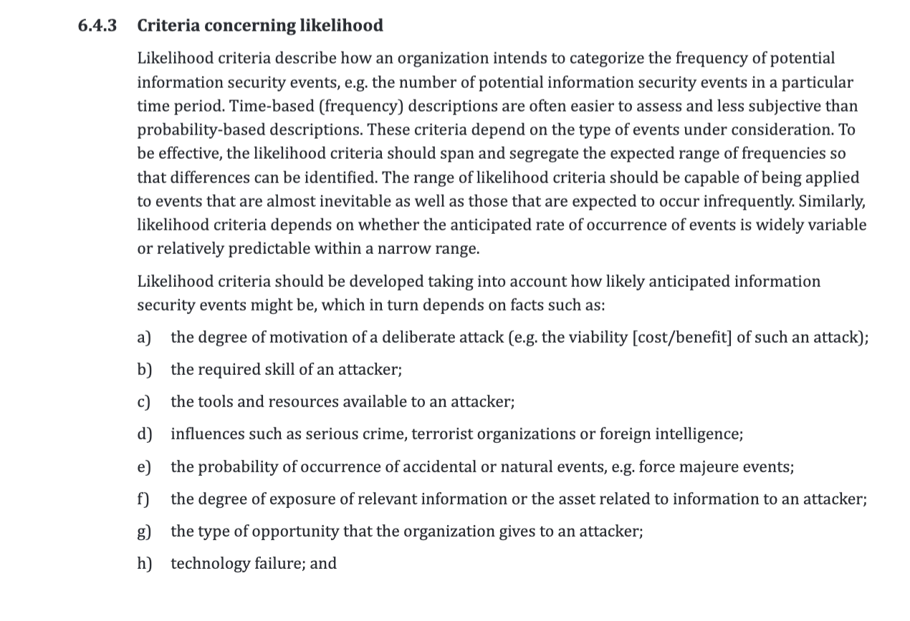
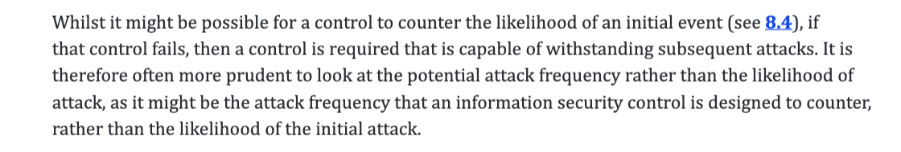
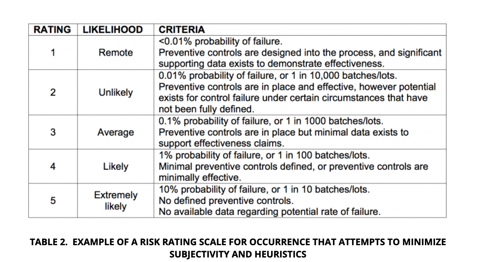
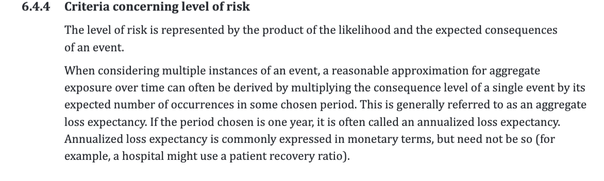
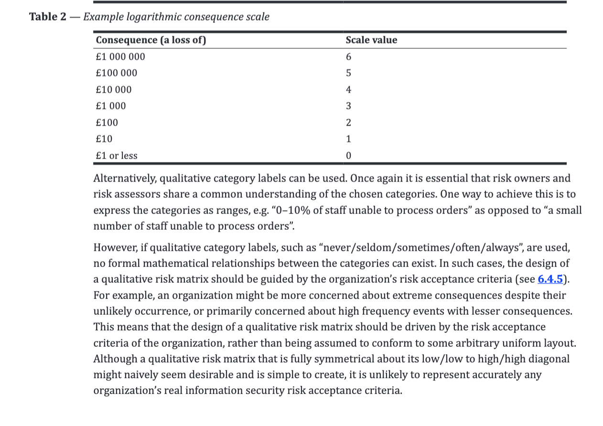
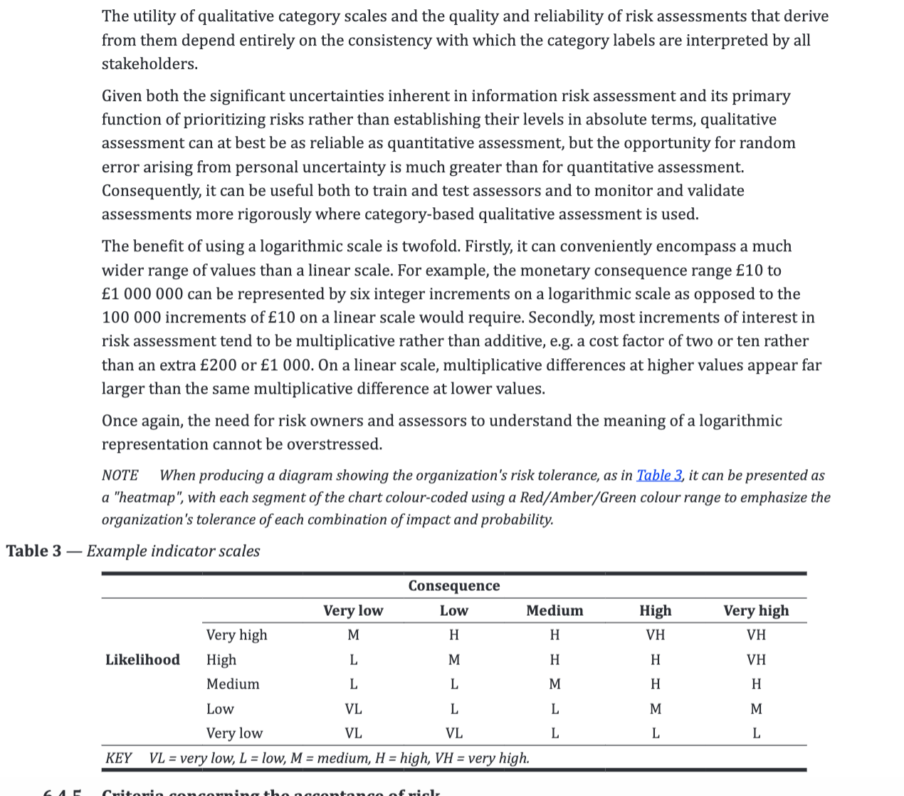
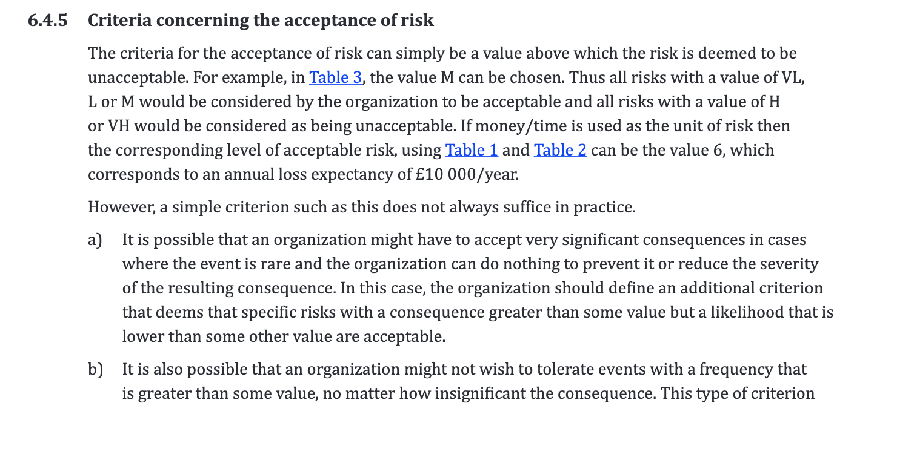
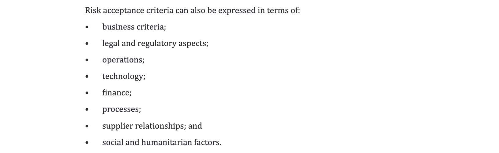
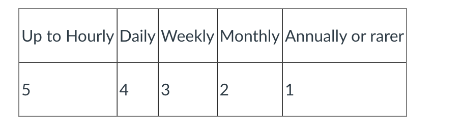

#### Main Topics

#### Sub titles:

*

# Returning to risk assessment

* Clause 6.4.3 requires you to produce some mechanism for estimating or assessing likelihood and gives some suggestions
  about the sort of scale that should be used.
    * Rather than using percentages or probabilities it suggest something like a minimum 5-point verbal scale which is
      unambiguous in what each point means (e.g. “once a year”, “once a quarter”, “once a month”, “weekly”, “daily”)
      rather using vague terms like “frequent” and “infrequent”.
    * Of course, it is impossible to get the scale exactly right and, as part of the regular review and update of the
      risk assessment, it will change over time as the organisation learns more about its own unique circumstances. As a
      starting point, though, some scale is better than none as it lets us consider the risks relative to each other.
        
        
        
* likelyhood scale
    * 1 = lowers to 5- higest
        

# Estimating & accepting risk

## Estimating

* We have both impact and likelihood estimates, we can finally produce an estimate of risk
    * i.e. the combination of the two. Clause 6.4.4 discusses this process and a table like Table 3 in that clause is a
      good way to produce consistent risk estimates.
* it is common for there to be debate about whether the risk values being produced are “correct” or not. If there is
  consensus that they are not then it indicates that either the risk evaluation grid (Table 3 is an example) is wrong or
  one or both of the impact and likelihood ranking scales is wrong.

  
  
  
  

* the qualitative risk matrix design should be driven by risk criteria of the organization(6.4.5).

## Accepting risk

* Much as we would like to prevent all risks from ever occurring, that simply isn’t possible.
    * Some are too rare to care about, and some are too expensive to deal with.

* We need to identify 2 subset of risk
    * Risks we will accept because they’re too expensive to deal with or not important enough to matter (i.e. they’re
      rare and/or low impact).
    * Risks we need to deal with in some way because their effect on the organisation has a significant adverse effect

* these levels need to be agreed and signed off at board level - not least because directors may be personally liable
  for adverse impacts on the organisation or the real-world entities represented by the affected objects within the
  system.

## 7.4.1 Activity: Risk acceptance criteria

* Risks with a risk evaluation score of Medium or lower shall be accepted, with the following exceptions:
    * Privacy policy and regulations - If the impact of the risk includes a breach in the company privacy policy, the
      risk shall not be accepted.
    * Customer promises - If the impact of the risk contradicts terms set out in any company policy regarding customer
      service and standard practice, the risk shall not be accepted.
    * Threat frequency - If the impact of the risk is likely to be recurring, or likely to lead to more severe threats,
      the risk shall not be accepted.
    * Legal obligations - If there is a legal obligation to employ measures to prevent a certain threat, the associated
      risk shall not be accepted.

* Risks with a score of low or very low can be accepted with consultation or judgement being required for a score of
  medium.
    * Anything that can lead to financial losses over the quarterly profit projection will not be accepted.
    * Any attacks that may lead to further, more advanced attacks(i.e higher ransoms) will not be accepted.
    * Any risks or attacks that access or expose any sensitive data about staff, stakeholders, customers etc will not be
      accepted.
    * If something is required by law to be in place then this must be immediately be placed on the 'not accepted' list.
* All risks classed as low or very low i.e very rare likelihood or very low impact can be accepted.

  
  
  

# Activity: Model response

* Likelihood scale
    * For our example car parts company, some types of event can be guaranteed to happen hourly (e.g. probes of the
      Internet router’s external port looking for vulnerabilities), possible even more frequently, while some will be
      much rarer (e.g. Tax Inspection or, if we’re doing it right, complaints about Data Protection and Security) so we
      need a non-linear scale.
        

* Risk Estimate
    * From my answers, I produced this initial table to show impact vs. frequency:
        
    * Risk measures run from VH = Very High to VL = Very Low and are entirely based on my own knowledge of this type of
      business.
    * Your answer will be correct, no matter what it is, because it’s an initial estimate which will be refined as
      understanding of the system evolves through its normal lifecycle and review.
        * For example, while reviewing this answer, I started to wonder if the impact scale was granular enough, with
          just 3 ratings, or if it needed to be expanded to 5 (adding Very High and Very Low) to allow for better
          distinction between incident types.
* Risk Acceptance
    * From our risk estimate table, we can see that we have risks ranging from VL to VH, based on likelihood (or, more
      accurately, frequency of occurrence) and impact on the business.
    * **Anything rated VH or H must be considered for treatment** - because it’s almost certainly going to happen, and
      it has the potential for major damage to the business. However, if the cost of the resulting damage and associated
      remediation, is less than the cost required to prevent or mitigate it, is it wise to spend that? Remember, when
      making these judgments, that cost may not be solely direct financial, but can include reputational and
      consequential (longer term) harm as well.
    * **But what about things rated M, L or VL?**
    * In my table, VL ratings are for rare and low impact events. It’s probably going to cost too much to prevent or
      reduce them so it may be acceptable to allow them to happen - BUT to have a plan to deal with them if they do
      happen (e.g. rather than putting fault-tolerant RAID storage onto every desktop computer in the organisation, to
      reduce the chance of hard drive failure, we’ll have proper backups and a plan to deploy a replacement machine if
      there’s a failure).
    * So, **what about M and L rated risks?** These either happens rarely, or have lower impact - but are still
      significant in business terms. These join the VH and H risks in the group that requires treatment.

# Scenario risk assessment