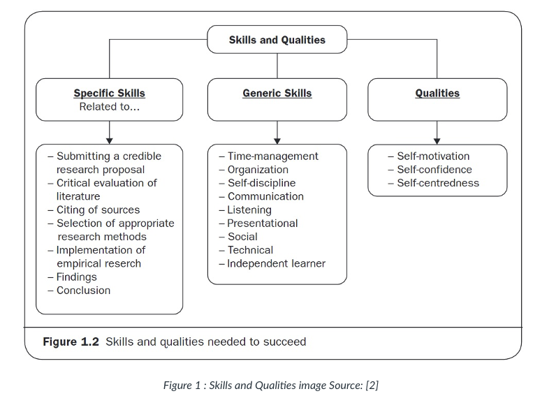

## MSC Independent Research Proposal Lesson Notes

# Week 1

## Literature review

* The literature review should be an account of what other people have done in this field before. It includes a
  literature review, accounts of other people’s research and any historical survey necessary to place your investigation
  in context.
* You will need a literature review even if the central focus of your research project is based on some original
  empirical work of your own. Some research projects consist solely of a critical evaluation of literature. In this
  case, there would obviously be an expectation that it would be more comprehensive in its range and more thorough in
  analysis. Good accounts of what has gone before organise the material into themes and draw out the main points on
  which previous writers agree or disagree.
* A literature review or review of others’ research findings is, therefore, more than a series of mini-book reviews or a
  chronological account of who did what and when. It should lay the foundation for your own analysis by identifying the
  significant issues that have arisen from earlier work.
* Your conclusion of the literature review must include derivation(s) of your research question(s) and how they relate
  to previous work. For example, you might want to test someone’s hypothesis; repeat someone’s research method with a
  different group or in a different location; test whether some theory expounded in the literature is supported in
  certain circumstances. A perfectly acceptable (and highly recommended) approach would be to adapt the methodology from
  a previous paper or dissertation (cutting the scale of the study down if necessary) and apply it to a setting that you
  are interested in - perhaps a different country or industry.

## Literature Review Recap

* **What is the literature review? Three bullet points:**
  * description of the literature
  * process of locating, scanning, reading and evaluating relevant books, articles and other
  materials
  * review of other, previously published, findings
  Doing a literature review is a process of locating, scanning, reading and evaluating relevant books, articles and
  other materials to find out who the key writers are, what has already been said, the prevailing theories and
  hypotheses, and what questions are being asked about the research topic and objectives that
  you are interested in. It is a review of other, previously published, findings.

* **Why is it necessary?**
  * The literature review helps to define the field of study in which your
  research topic is situated, it supports the identification of the research problem and formulation
  of the research question. It demonstrates to the examiner that you can critically evaluate
  existing work in the field, elicit main issues from which to create a coherent argument and
  produce an academically grounded piece of work. The absence of a literature review in your
  research report risks a discussion of findings and conclusions that are borne from conjecture and
  opinion rather than substantiated critical analysis.”

* **What is meant by critical writing? Bullet points:**
  * Critical evaluation is the distinguishing factor between a poor or good literature review.
  * Your critical appraisal should demonstrate the following skills:
  * weigh up the arguments from multiple perspectives,
  * evaluate your own and others’ ideas,
  * consider the strengths and weaknesses of arguments
  * identify gaps and limitations in existing literature.
  * skills: weigh up the arguments from multiple
  perspectives, evaluate your own and others’ ideas, consider the strengths and weaknesses of
  arguments and identify gaps and limitations in existing literature. Evidence of critical evaluation
  skills can be found where authors are cited, their work described and insight, in the form of a
  reasoned argument or opinion about that work, in relation to your own research objectives, is
  given.

* **Hints and tips from an examiner’s perspective:**
  * Do focus on literature that is relevant to your research topic
  * Do go beyond describing who has said what by evaluating how and why this is relevant to your own research question
  * Do make sure that you reference correctly using IEEE referencing style.
  * Don’t drift away from your research focus
  * Don’t plagiarise i.e. present the work of others as your own
  * Don’t introduce or discuss literature that you have read without warning or without
  * explaining why it is relevant to your research objectives

## Skill based Resource

