## MSC Research Methods  Lesson Notes

This module is for MSC Research Methods lessons notes.

## Overview

- [Week-1](#week-1)
- [Week-2](#week-2)
- [Week-3](#week-3)
- [Week-4](#week-4)
- [Week-5](#week-5)
- [Week-6](#week-6)
- [Week-7](#week-7)
- [Books](/research-methods/Books.md)

* Week 1: Introduction to Academic Writing and research, creating research questions
* Week 2: Research methods and methodologies
* Week 3: Quantitative research methods
* Week 4: Quantitative data collection and analysis
* Week 5: Qualitative research methods
* Week 6: Qualitative data collection and analysis
* Week 7: Writing up and present research

# WEEK 1

#### Main Topics

* Show a clear understanding of what research is
* Discuss research approaches
* Demonstrate an understanding of academic writing

#### Sub titles:

* [Academic writing](#academic-writing)
* [Paraphrasing](#paraphrasing)
* [Academic analytical writing](#academic-analytical-writing)
* [The research process](#the-research-process)
* [What is research?](#what-is-research)
* [Formulating your research question(s)](#formulating-your-research-questions)
* [Validating your research question(s)](#validating-your-research-questions)
* [Activity](#activity)
* [Important](#important)

# Academic writing

* Academic writing is different from general writing and great importance is placed on the structure of the work and the
  use of citations/referencing
* It must be write in formal language
    * contain no colloquialisms
    * slang or contractions (such as "don't", "can't" etc)
    * avoid personal pronouns (unless directed otherwise)
    * must adhere to a formal structure,
    * The tone must remain objective throughout
    * avoiding emotive language
    * cater to the audience
    * The rules of grammar must be followed
    * spell checked
       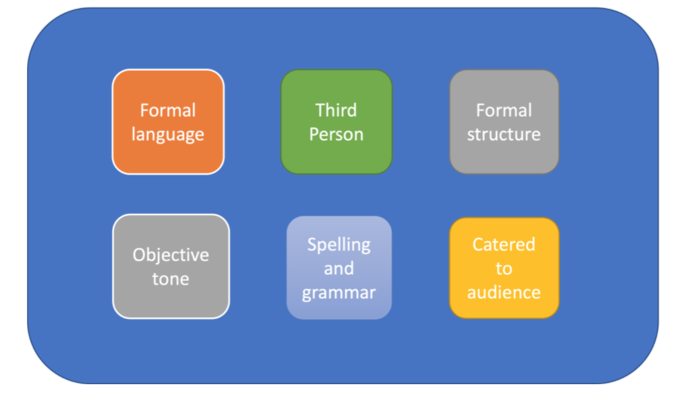

* Faults:
    * poor referencing
        * you must introduce and discuss external resources to develop your point but DO NOT LET A QUOTE OR CITATION
          MAKE YOUR POINT FOR YOU!
        * it is important to include a paragraph after paragraph of quotes/citations to make their point
        * All quotes or references need to be in support of a point or assertion YOU are making and must not be
          standalone.

* Descriptive vs Academic Writing
    * Descriptive writing - represent facts and not contains who, what, where, how or why questions
    * Academic writing is evaluative and critical, investigating the significance of facts
       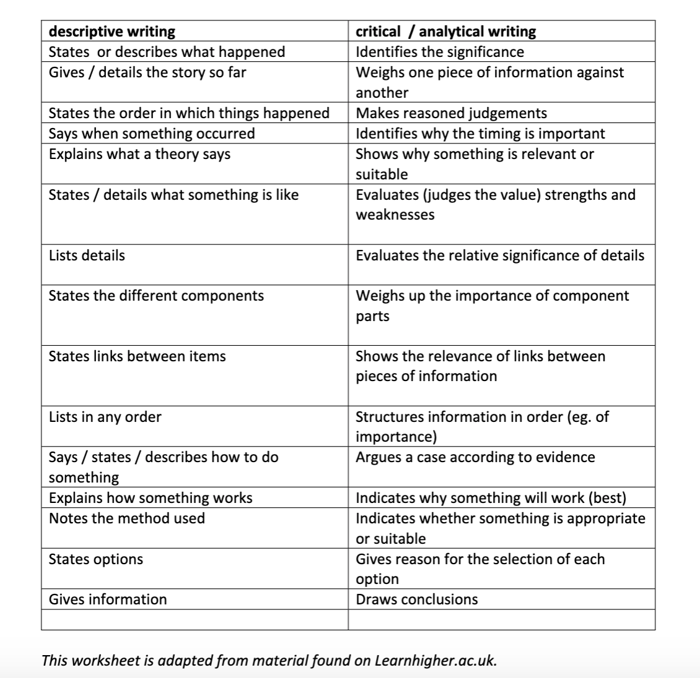

* Making assertions in paragraphs
    * If you make a claim or assertion, you must back it up with evidence.
        * Statement is speculative without evidence and must be evidenced
    * Example : "Just because most programmers are good mathematicians does not mean that there are no non-mathematician
      programmers". This sentence is premised on the assumption about 'most programmers' which is not backed up with
      data or evidence. Also, the term 'mathematician' is problematic as it is value-laden and subjective.

* **Typically a paragraph might be constructed thus:**
    1. Introduce topic.
    2. Make a claim – back it up with a reference
    3. Make another supporting claim – back it up with a reference
    4. {Make a claim opposing your topic – back it up with evidence}. This strengthens your argument but not everyone
       does this
    5. Close your argument/paragraph.
        

* Each paragraph should end with a final statement that brings together the ideas brought up in the paragraph and which
  can also be used as the transition to the next sentence.
* Make sure your work is coherent – each point should be linked to the previous and subsequent points to improve the
  flow and logic of the piece.
* It might feel frustrating at first but you must remember when writing for academia that you must always always support
  your claims with research. Don't leave any claims as speculative – where and when your claim is endorsed in
  literature.

* Summarise
    * The claim is where you where you make your main point – it's a key part of academic argument. If there's no claim,
      there's no argument.
        * You need to support your claim with evidence.
    * We are talking about facts here, not opinions – good evidence backs up the points you make.
    * Justification is where you explain why the evidence supports the claim – sometimes this can be left out if it's
      obvious or a widely held belief.
    * Claim, evidence and justification all combine to produce a clear argument.
    * Counter-arguments are important. If you include them in your writing it shows that you have considered more than
      one side of an argument.
    * Tell your reader your limitations. This doesn't mean that your writing is lower quality but actually helps the
      reader understand your context better.

* Paragraph conclusion
    * Concluding your paragraph, repeat the ideas in the topic sentence in different words, but don’t just copy the
      topic sentence. Summarise the main point or points of the paragraph
        * Never end a paragraph by introducing a new idea.
        * Example :
            * Successful programming requires practice and research. [topic point]
            * In conclusion, coding skills build up over time with repeated attempts and learning from other examples of
              code. [summarising point]

    * Conclusion signals
       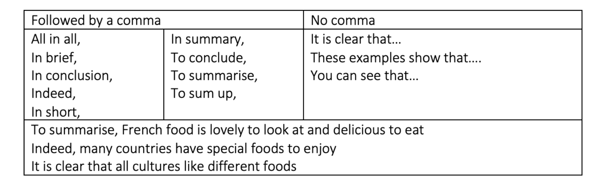

* **Unity** in a paragraph is when all the supporting sentences in a paragraph discuss only one idea. From the start to
  the end of the paragraph, each sentence is directly related to the topic. A paragraph should contain a single theme or
  focus.
* **Coherence** in a paragraph is when it flows smoothly from beginning to end, with no sudden jumps.
    * Do this by using nouns and pronouns consistently through each paragraph.
    * Use transition signals to show relationships between ideas and put ideas into logical order.
* **Nouns/pronouns**
    * if you begin with a plural noun such as users, don’t change it to a singular. Do not change to 'he' or 'she' for
      no reason.
    * If you use the pronoun you at the beginning of the paragraph, make sure you use it throughout.
    * Use a plural noun rather than a singular noun when writing about a group of people of all sexes.
    * When you use pronouns, the plural forms they, them and their are less awkward than he, she, him or her and fall in
      line with gender identity.

* Tenses
    * Be consistent with tenses in your writing
    * When discussing or introducing others' opinions, use the present tense, e.g 'Smith believes' or 'Smith claims'
      rather than 'Smith believed' or 'Smith claimed'.
    * However, if that person died many years ago or was writing in a different era, it may be appropriate to use the
      past tense.
    * You cannot switch tenses in a sentence - for example "Many years ago, Smith asked mathematicians what they think
      is the hardest algorithm ever". This starts with the past tense but then moves to the present, which is confusing,
      and mathematicians may have changed their minds since they were asked, which makes it inaccurate.
    * It is common practice to use the future tense in introductory sections of academic work, such as 'The purpose of
      this essay is to...' or 'This paper will explore...'
        * However, it is considered more assertive to write in the present - 'The purpose of this essay is to...' or '
          This report explores...'.

* Contractions
    * ~~Don't use contractions~~. Do not use contractions. Use the full form.

# Paraphrasing

* Sometimes you will elect to cite exactly what they have said, using quotation marks, but at other times you might want
  to express their ideas in your own words (known as "paraphrasing".
* Doing this correctly is an important part of academic writing and good practice. Try to simplify others' work and
  ideas and describe them using different sentence structures and expressions. You must also always credit the original
  author with phrases such as "according to Jones [2]"...

* How different words must be ?
    * you must demonstrate that you have understood someone else's ideas and can summarise them in your own style or
      words without borrowing or copying their phrases.
        * Work is deemed to be plagiarised when you just change a few words to an otherwise reproduced section of
          others' work.

* Paraphrasing example : [here](./doc/Paraphrasing%20exercises.docx)

# Academic analytical writing

* Analytical writing engages with and applies theoretical concepts
* Evaluates the strengths and weaknesses of ideas
* Unpacks the significance of evidence
* Synthesises and engages with sources to support and create an overall argument

* Ask yourself the following:
    * What does this evidence mean? What is its significance?
    * How does this point relate back to my central argument?
    * What is the connection between the different ideas?
    * What does this theory reveal about this particular topic?
    * What is the relevance of this evidence or point? How can I link it to my work?

* Further tips:
    * Evaluate the evidence; do not just state it
    * Unpack the meaning of terms, ideas and definitions
    * Synthesise secondary material into your overall argument
    * Evaluate the strengths and weaknesses of other arguments or studies
    * Engage with theory and apply it to your argument

# The research process

* Careful identification of the research problem, methodical data collection and thorough analysis lead to credible and
  trustworthy conclusions, all of which contribute towards good research.

* Identify a research topic - this would usually be an issue, problem or phenomenon that is of interest and worthy of
  investigation
* Formulate research questions - consult relevant academic literature and other sources of information to explore the
  issue in more depth and identify feasible research objectives
* Frame research question(s) - decide on specific question(s) to ask about the issue; frame the question clearly
* Choose methodology/approach - think about how to conduct the research; consider the optimal approach to enable you to
  address the research objectives
* Select methods of data collection - choose how to collect the data; consider which methods will enable you to gather
  the sort of data you need to respond to the research question(s)
* Collect data - consider who and what you need to gain access to in terms of data collection; think about sampling;
  ensure ethical consideration is given to all aspects of data gathering
* Analyse data - choose how to analyse the data; draw from a range of analytical approaches most relevant to the type of
  data collected. Triangulate from different sources if appropriate
* Draw conclusions - discuss findings in relation to what is already known about the issue (academic literature and
  other relevant contextual information). Identify key results/outcomes, recommendations, limitations of research and
  opportunities for further research
* Disseminate research findings - think about who to communicate findings to (stakeholders) and choose an effective way
  to do that (report, academic paper, presentation etc.)

* For a computer research project, emphasis will be on ensuring that findings are translated into actionable outcomes
  and there will be a phase beyond dissemination which focuses on decision making, action and evaluation.

# What is research?

* academic and scientific research
* The systematic investigation into and study of materials and sources in order to establish facts and reach new
  conclusions.
   
* Why do research?  
   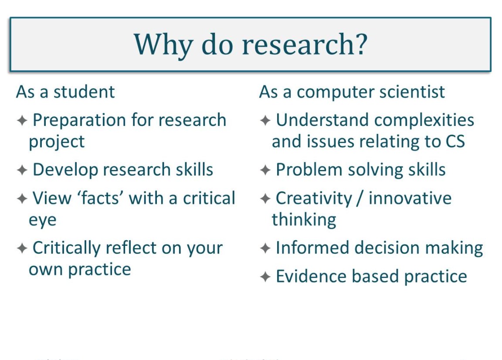

* Research may have very practical focus specific to an organization or problem
* Researh may be concerned with building theory which can be generalised across many context (basic)
   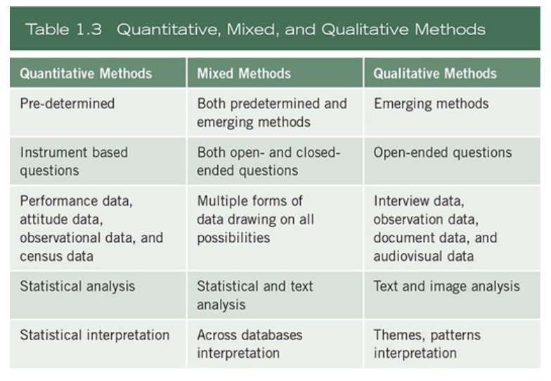
   

* 3 reasons for literature research
    * you can avoid merely repeating what others have done; that is, you can conduct a replication with extension,
      generating new knowledge.
    * you can see what methods and procedures have worked for others and adopt them for your own work
    * you can learn about the different ways that others have investigated the topic of interest to you

# Formulating your research question(s)

* Some considerations when creating your research question.
   

* [how to write great research question? ](./doc/Mattick_et_al-2018-The_Clinical_Teacher.pdf)

# Validating your research question(s)

* Is your research question important?
    * At the smallest level – it is interesting to you and your supervisor, but on a large scale it might have to be
      interesting enough to attract funding, to be important to your institute

* Is your research question novel?
    * You need to have a good understanding of the body of research and evidence in the relevant area before you can
      establish this – this must be done before the analysis or data collection.
    * Read widely to provide some evidence towards the answer. What is known about your question? What are the possible
      outcomes for your question's? Are they all original, or just some of them?
    * Prototyping a research question – you must continually express your research question in a way that that allows
      you to critique, observe and refine it.
    * The form that a research question takes is an argument, beginning with statement of knowledge and ending with a
      question.

* Can you research it?
    * The research question itself often implies the methods or requirements that are appropriate to use in addressing
      it.
    * If you are comparing samples or populations, you need to use quantitative statistical claims which then affect
      your design.
    * If you are investigating how some person makes sense of some scientific concept, you will need to talk to them,
      thereby making it qualitative in nature.

* Is your research question feasible?
    * You need to consider:
        * Is there a method that will produce the right data to answer it?
        * Do you have the skills to undertake it?
        * Do you have the time to do it?
        * Do you have the resources to do it?
* Is your research question valid?
    * Internal and external validity differ – for internal validity your study would need to assess perhaps the
      decision-making process or practical process of some task or process.
    * Using best practices should ensure that you adhere to internal validity.
    * Externally valid means that your research will focus on a tiny percentage of the population or world. It is the
      extent to which the conclusions you draw about these tiny things can be generalised to other external things (
      people, places, things).
    * Most methods with high internal validity often have low external validity and vice versa.
* Is your research question coherent?
    * Coherence is the thread of logic running through the entire study - the chain of reasoning or the argument.

* **Evaluate your research question's checklist**
    * Focused on a single problem or issue
    * Researchable using primary and/or secondary sources
    * Feasible to answer within the timeframe and practical constraints
    * Specific enough to answer thoroughly
    * Complex enough to develop the answer over the space of a paper or thesis
    * Relevant to your field of study

# Activity

* It is about [DanielSiek Report](./doc/Danielsiek%20et%20al%202017-1.pdf)
* Introduction
    * Self-efficacy is the personal belief of one's ability to succeed in a situation or task
    * How a teacher teaches can influence self-efficacy
    * Knowing the impact of teaching on self-efficacy requires measurement
    * There is no measure of self-efficacy in introductory algorithms courses
    * What is a conceptually valid measure of self-efficacy in algorithm courses?
* Method
    * We partnered with four institutions to measure self-efficacy
    * We adapted a previously designed instrument to an algorithm course context
    * We administered the adapted instrument in four classes, obtaining 130 responses
* Results
    * We verified the data had sufficient sphericity to be factorable
    * We performed a factor analysis, finding four factors that explained 66% of the variance
    * The factors were consistent with the instrument's intended measurements, indicating construct validity
    * Cronbachs Alpha was 0.938 suggested reliability
    * The instrument did not correlate with measures of self-regulation, suggesting divergent validity
    * The instrument did correlate with measurements of personality traits, suggesting nomological validity
* Conclusion
    * Therefore the instrument we designed is a conceptually valid measure of self-efficacy in introductory algorithm
      courses.

# Important

* [IEE Referencing Style Guidline](https://subjectguides.york.ac.uk/referencing-style-guides/ieee)
* [Academic Writing](./doc/Academic%20writing.ppsx)
* [Academic writing](https://subjectguides.york.ac.uk/skills/writing)
* [Writing Center](https://www.york.ac.uk/students/studying/skills/writing-centre/)
* [IEEE referencing style](https://subjectguides.york.ac.uk/referencing-style-guides/ieee)
* [Academic Skills Community](https://www.york.ac.uk/students/studying/skills/community/)
* [What is academic writing](https://subjectguides.york.ac.uk/academic-writing/general-writing)
* [Writing structuring your response](https://subjectguides.york.ac.uk/skills/essay-structure)
* [Pharasing in Academic Writing](./doc/Paraphrasing%20in%20academic%20writing.docx)
* [Academick Pharasing Bank Manchaster](https://www.phrasebank.manchester.ac.uk/)
* [Super Vocab](http://www.uefap.com/vocab/select/awl.htm)
* [Computer Scinece theses York](https://pure.york.ac.uk/portal/en/organisations/computer-science(e2d7acdb-0ce1-48d7-ae25-d4124313e8ed).html)
* [E-theses ](https://etheses.whiterose.ac.uk/cgi/search/simple?q=computer+science&_action_search=&_order=bytitle&basic_srchtype=ALL&_satisfyall=ALL)
* [Developing strong Research Questions](https://www.scribbr.com/research-process/research-questions/)

# WEEK 2

#### Main Topics

* Research methods and methodologies
* Research approaches
* Planning research
* Literature review

#### Sub titles:

* [Research terminology and definitions](#research-terminology-and-definitions)
* [Philosophical Worldviews](#philosophical-worldviews)
* [Research Designs](#research-designs)
* [Methodology & methods](#methodology--methods)
    * [Sage Research Methods Resource](#sage-research-methods-resource)
        * [Model for Research](#model-for-research)

* [Research methodology & strategy](#research-methodology--strategy)
* [Research Strategy](#research-strategy)
* [Research approaches](#research-approaches)
* [The purpose of research](#the-purpose-of-research)
* [Stakeholder perspective in research design](#stakeholder-perspective-in-research-design)
* [Quiz](#quiz)
* [Research Philosophies](#research-philosophies)
* [Philosophy of CS](#philosophy-of-cs)
* [Literature reviews](#literature-reviews)

# Research terminology and definitions

* Methods
    * Research methods include all the techniques or methods that you adopt for conducting the research. These may be
      thought of as the data collection methods - experiments, surveys, interviews, observation etc.
* Methodology
    * Research methodology is the way in which the problems are systematically solved. Methodology is the science which
      studies **how** research is conducted, the steps taken to study a research problem, and the logic behind those
      steps. It is important as a researcher to understand the methods but also the scientific approach called
      methodology.
* Research Approaches : qualitative and quantitative
    * Research approaches are plans and the procedures for research that span the steps from broad assumptions to
      detailed methods of data collection, analysis, and interpretation.
* Informing this decision should be the philosophical assumptions the researcher brings to the study; procedures of
  inquiry (called research designs); and specific research methods of data collection, analysis, and interpretation.
* Research design considers issues such as "what", "when", "how much" and so forth.
    * It is the conceptual structure in which the research is constructed and includes the blueprint for the collection,
      measurement and analysis of the data
    * 3 types research design :
        * Exploratory research design
        * Descriptive and diagnostic research design
        * Hypothesis testing research design
* Research Philosophy
    * This refers to a system of beliefs and assumptions about the development of knowledge.
    * Assumptions you make throughout your research process which will include the realities you encounter in your
      research (ontological assumptions), about human knowledge (epistemological assumptions) and about the way your own
      values influence your research process (axiological assumptions).

* Research Paradigm
    * The research paradigm can be considered as the beliefs of the world that the researcher chooses to live in
    * 2 types : positivism and interpretivism
    * These shape and inform the views held on the research and in turn impact on the ontological, epistemological and
      methodological choices made by the researcher.

       
* Assumptions
    * Ontology assumptions refer to the nature of reality. You will have your own assumptions about the world that your
      research sits in, your perceptions which shape the way that you see and study your research objects, thus your
      choice of what to research.
    * Epistemology refers to assumptions about knowledge and what is acceptable, valid and legitimate knowledge and how
      that can be communicated to others (Burrel and Morgan, 2016).
    * Methodology relates to how we are to discover and validate what we think exists, what methods we will use to
      collect the data.
    * Axiology refers to the role of values and ethics. As a researcher, you need to reflect on the impact of your own
      values and beliefs and you must recognise these beliefs in the research. This may be as simple as choosing one
      topic over another as you think one is more important.
       

# Philosophical Worldviews

* Although philosophical ideas remain largely hidden in research (Slife & Williams, 1995), they still influence the
  practice of research and need to be identified.
* We have chosen to use the term worldview as meaning “a basic set of beliefs that guide action” (Guba, 1990, p. 17).
    * The philosophical worldview proposed in the study
    * A definition of basic ideas of that worldview
    * How the worldview shaped their approach to research
* postpositivism, constructivism, transformative, and pragmatism.
* The Postpositivist Worldview
    * The postpositivist assumptions have represented the traditional form of research, and these assumptions hold true
      more for quantitative research than qualitative research.
    * This worldview is sometimes called the scientific method, or doing science research. It is also called
      positivist/postpositivist research, empirical science, and postpositivism
    * Postpositivists hold a deterministic philosophy in which causes (probably) determine effects or outcomes.
    * It is also reductionistic in that the intent is to reduce the ideas into a small, discrete set to test, such as
      the variables that comprise hypotheses and research questions.
* Assumptions
    * Knowledge is conjectural (and antifoundational)—absolute truth can never be found. Thus, evidence established in
      research is always imperfect and fallible. It is for this reason that researchers state that they do not prove a
      hypothesis; instead, they indicate a failure to reject the hypothesis.
    * Research is the process of making claims and then refining or abandoning some of them for other claims more
      strongly warranted. Most quantitative research, for example, starts with the test of a theory.
    * Data, evidence, and rational considerations shape knowledge. In practice, the researcher collects information on
      instruments based on measures completed by the participants or by observations recorded by the researcher.
    * Research seeks to develop relevant, true statements, ones that can serve to explain the situation of concern or
      that describe the causal relationships of interest. In quantitative studies, researchers advance the relationship
      among variables and pose this in terms of questions or hypotheses.
    * Being objective is an essential aspect of competent inquiry; researchers must examine methods and conclusions for
      bias. For example, standard of validity and reliability are important in quantitative research.
       

* The Constructivist Worldview
    * Constructivism or social constructivism (often combined with interpretivism) is such a perspective, and it is
      typically seen as an approach to qualitative research
    * Social constructivists believe that individuals seek understanding of the world in which they live and work.
    * Individuals develop subjective meanings of their experiences—meanings directed toward certain objects or things.
    * These meanings are varied and multiple, leading the researcher to look for the complexity of views rather than
      narrowing meanings into a few categories or ideas.
    * The goal of the research is to rely as much as possible on the participants’ views of the situation being studied.
    * The questions become broad and general so that the participants can construct the meaning of a situation,
      typically forged in discussions or interactions with other persons.
    * The more open-ended the questioning, the better, as the researcher listens carefully to what people say or do in
      their life settings.
    * Often these subjective meanings are negotiated socially and historically.
    * The researcher’s intent is to make sense of (or interpret) the meanings others have about the world. Rather than
      starting with a theory (as in postpositivism), inquirers generate or inductively develop a theory or pattern of
      meaning.
    * Assumptions
        * Human beings construct meanings as they engage with the world they are interpreting. Qualitative researchers
          tend to use open-ended questions so that the participants can share their views.
        * Humans engage with their world and make sense of it based on their historical and social perspectives—we are
          all born into a world of meaning bestowed upon us by our culture. Thus, qualitative researchers seek to
          understand the context or setting of the participants through visiting this context and gathering information
          personally. They also interpret what they find, an interpretation shaped by the researcher’s own experiences
          and background.
        * The basic generation of meaning is always social, arising in and out of interaction with a human community.
          The process of qualitative research is largely inductive; the inquirer generates meaning from the data
          collected in the field.

* The Transformative Worldview
    * Another group of researchers holds to the philosophical assumptions of the transformative approach.
    * This position arose during the 1980s and 1990s from individuals who felt that the postpositivist assumptions
      imposed structural laws and theories that did not fit marginalized individuals in our society or issues of power
      and social justice, discrimination, and oppression that needed to be addressed.
    * A transformative worldview holds that research inquiry needs to be intertwined with politics and a political
      change agenda to confront social oppression at whatever levels it occurs (Mertens, 2010). Thus, the research
      contains an action agenda for reform that may change lives of the participants, the institutions in which
      individuals work or live, and the researcher’s life.
    * Moreover, specific issues need to be addressed that speak to important social issues of the day, issues such as
      empowerment, inequality, oppression, domination, suppression, and alienation. The researcher often begins with one
      of these issues as the focal point of the study.

    * Key features of the transformative worldview or paradigm:
        * It places central importance on the study of lives and experiences of diverse groups that have traditionally
          been marginalized. Of special interest for these diverse groups is how their lives have been constrained by
          oppressors and the strategies that they use to resist, challenge, and subvert these constraints.
        * In studying these diverse groups, the research focuses on inequities based on gender, race, ethnicity,
          disability, sexual orientation, and socioeconomic class that result in asymmetric power relationships.
        * The research in the transformative worldview links political and social action to these inequities.
        * Transformative research uses a program theory of beliefs about how a program works and why the problems of
          oppression, domination, and power relationships exist.

* The Pragmatic Worldview
    * Instead of focusing on methods, researchers emphasize the research problem and question and use all approaches
      available to understand the problem (see Rossman & Wilson, 1985).
    * pragmatism provides a philosophical basis for research:
        * Pragmatism is not committed to any one system of philosophy and reality. This applies to mixed methods
          research in that inquirers draw liberally from both quantitative and qualitative assumptions when they engage
          in their research.
        * Individual researchers have a freedom of choice. In this way, researchers are free to choose the methods,
          techniques, and procedures of research that best meet their needs and purposes.
        * Pragmatists do not see the world as an absolute unity. In a similar way, mixed methods researchers look to
          many approaches for collecting and analyzing data rather than subscribing to only one way (e.g., quantitative
          or qualitative).
        * Truth is what works at the time. It is not based in a duality between reality independent of the mind or
          within the mind. Thus, in mixed methods research, investigators use both quantitative and qualitative data
          because they work to provide the best understanding of a research problem.
        * The pragmatist researchers look to the what and how to research based on the intended consequences—where they
          want to go with it. Mixed methods researchers need to establish a purpose for their mixing, a rationale for
          the reasons why quantitative and qualitative data need to be mixed in the first place.
        * Pragmatists agree that research always occurs in social, historical, political, and other contexts. In this
          way, mixed methods studies may include a postmodern turn, a theoretical lens that is reflective of social
          justice and political aims.
        * Pragmatists have believed in an external world independent of the mind as well as that lodged in the mind. But
          they believe that we need to stop asking questions about reality and the laws of nature (Cherryholmes, 1992).
          “They would simply like to change the subject” (Rorty, 1990, p. xiv).
        * Thus, for the mixed methods researcher, pragmatism opens the door to multiple methods, different worldviews,
          and different assumptions, as well as different forms of data collection and analysis.

# Research Designs

 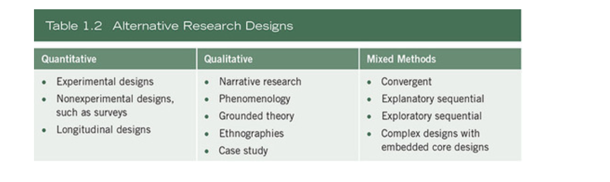

* Quantitative Designs
    * Survey research provides a quantitative or numeric description of trends, attitudes, or opinions of a population
      by studying a sample of that population. It includes cross-sectional and longitudinal studies using questionnaires
      or structured interviews for data collection—with the intent of generalizing from a sample to a population (
      Fowler, 2008).
    * Experimental research seeks to determine if a specific treatment influences an outcome. The researcher assesses
      this by providing a specific treatment to one group and withholding it from another and then determining how both
      groups scored on an outcome.
* Qualitative Designs
    * Narrative research is a design of inquiry from the humanities in which the researcher studies the lives of
      individuals and asks one or more individuals to provide stories about their lives (Riessman, 2008). This
      information is then often retold or restoried by the researcher into a narrative chronology. Often, in the end,
      the narrative combines views from the participant’s life with those of the researcher’s life in a collaborative
      narrative (Clandinin & Connelly, 2000).
    * Phenomenological research is a design of inquiry coming from philosophy and psychology in which the researcher
      describes the lived experiences of individuals about a phenomenon as described by participants. This description
      culminates in the essence of the experiences for several individuals who have all experienced the phenomenon. This
      design has strong philosophical underpinnings and typically involves conducting interviews (Giorgi, 2009;
      Moustakas, 1994).
    * Grounded theory is a design of inquiry from sociology in which the researcher derives a general, abstract theory
      of a process, action, or interaction grounded in the views of participants. This process involves using multiple
      stages of data collection and the refinement and interrelationship of categories of information (Charmaz, 2006;
      Corbin & Strauss, 2007, 2015).
    * Ethnography is a design of inquiry coming from anthropology and sociology in which the researcher studies the
      shared patterns of behaviors, language, and actions of an intact cultural group in a natural setting over a
      prolonged period of time. Data collection often involves observations and interviews. Case studies are a design of
      inquiry found in many fields, especially evaluation, in which the researcher develops an in-depth analysis of a
      case, often a program, event, activity, process, or one or more individuals. Cases are bounded by time and
      activity, and researchers collect detailed information using a variety of data collection procedures over a
      sustained period of time (Stake, 1995; Yin, 2009, 2012, 2014).
* Mixed Methods Designs
    * Procedures for expanding mixed methods developed such as follows:
        * Ways to integrate the quantitative and qualitative data, such as one database, could be used to check the
          accuracy (validity) of the other database.
        * One database could help explain the other database, and one database could explore different types of
          questions than the other database.
        * One database could lead to better instruments when instruments are not well- suited for a sample or
          population.
        * One database could build on other databases, and one database could alternate with another database back and
          forth during a longitudinal study.

# Methodology & methods

* **Methodology**
* Explains the method you use to solve the problem, address the issue or answer the question.
* Study of the steps taken and the logic behind them.
* Examples
    * Qualitative Research
        * Qualitative research is an approach for exploring and understanding the meaning individuals or groups ascribe
          to a social or human problem.
        * Content Analysis: derived from interviews, focus groups, open ended surveys, videos and documents.
        * History:  historical research involves understanding, studying, and explaining past events.
            * Its purpose is to arrive at some conclusions concerning past occurrences that may help to anticipate or
              explain present or future events.
        * Ethnographic :  can include virtually any group or organisation.
    * Quantitative Research
        * Quantitative research is an approach for testing objective theories by examining the relationship among
          variables.
        * Experimental : Experimental research is any research conducted with a scientific approach, where a set of
          variables are kept constant while the other set of variables are being measured as the subject of experiment.
        * Quasi-experimental: Quasi-experiments manipulate presumed causes to discover their effects, but the researcher
          does not assign units to conditions randomly.
            * Quasi-experiments are necessary because it is not always possible to randomise.
        * Causal-comparative: Causal-comparative research attempts to identify a cause-effect relationship between two
          or more groups.
            * Causal-comparative studies involve comparison in contrast to correlation research which looks at
              relationships.
            * This degree of relation is expressed as a correlation coefficient.
        * Single subject: refers unique type of research methodologies that facilities into vension evaluation for the
          individual case.
        * Meta Analysis:  which is a statistical technique for amalgamating, summarising and reviewing previous
          quantitative research.
        * Survey: which involves the collection of information from a sample of individuals through their responses to
          questions.
    * Mixed methods research is an approach to inquiry involving collecting both quantitative and qualitative data,
      integrating the two forms of data, and using distinct designs that may involve philosophical assumptions and
      theoretical frameworks.
    * Research by practitioner
        * Action: is a process where participants examine their own practice to improve it. It can be an immediate
          problem or reflective process of problem solving.

       

       

* **Method**
* The spesific techniques, producedures and or instruments you can use in order to answer the question or hypotesis.
* There is, process, tools and methods used to collect and analyse data.
* Examples:
    * Statistics, they analyse the data rather than just describing it - use it to tell a story that focuses on
      answering the research question.
    * Literature reviews, building and collecting your research on and relating it to existing knowledge.
    * Interviews which can be defined as a qualitative research technique which involves conducting intensive individual
      interviews with a small number of respondents to explore their perspectives on a particular idea, program or
      situation’. regarding specific issues closely related to the research question or hypothesis.
    * Focus group
    * Dissertations, which is a method by which you are going to deliver the results of your research,what you deliver
      might take different shapes, depending on the context.
    * Research design. this might require the adoption of existing tools or the development of novel ones, to answer the
      question of the research. So it is not just the answer to the question, but one needs to figure out the needs to
      answer the question.
    * Surveys: which are about questioning individuals on a topic or topics and then describing their responses.
    * Case studies which aim to analyse specific issues within the boundaries of a specific environment, situation or
      organisation.
    * Experiments, which are used in order to analyse cause and effect relationships.
    * Observations and as the name implies, is a way of collecting data through observing.

       
       

### Sage Research Methods Resource

* [Sage Research MethodsLinks](https://methods-sagepub-com.libproxy.york.ac.uk/) to an external site. is a valuable
  online resource containing material in all aspects of the research process.
* [Sage Research Methods overwiew](https://www.youtube.com/watch?v=rppKj7xHA-I)

## Model for Research

* There is a natural order which connects key elements of the research process.
* Understanding how elements research are connected is essential to designing quality research
* Research is not always a linear process, even though it may be depicted this way in models for research.
   
   
   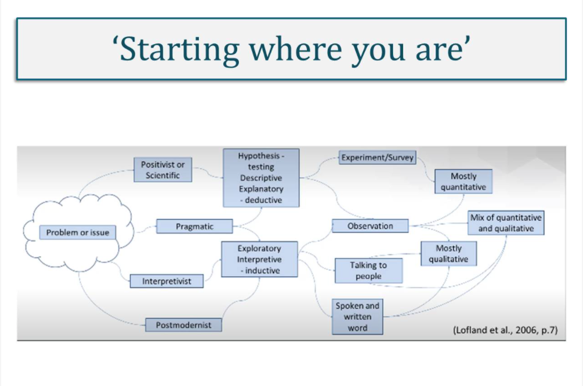

# Research methodology & strategy

* Research methodology is the element of the research process that describes and justifies the choice of strategy and
  data collection methods within a research project.
* quantitative, qualitative and mixed method research, based upon how theory is used

## Research Strategy

* a research strategy is a plan of how to conduct the research, connecting the theoretical aspects of the research
  design to the more practical elements of how to collect and analyse research data.
* **Quantitative strategies**
    * Experiment : A means of carrying out research (to test a hypothesis) in which a controlled change is made to a
      variable for an experimental group with all other potential variables kept constant, and the effect observed. The
      effect is then assumed to be the result of the change.
        * [A Quantitative Analysis of Model-Driven Code Generation through Software Experimentation  Download A Quantitative Analysis of Model-Driven Code Generation through Software Experimentation.](./doc/Model%20driven%20code.pdf)
    * Survey: A mechanism intended to gather primary data from a population or sample.
        * [ Experimental Economics and Experimental Computer. Science: A Survey  Download Experimental Economics and Experimental Computer. Science: A Survey.](./doc/11-grossklags.pdf)
* **Qualitative Strategies**
    * Ethnography: Research that studies a cultural group in a natural setting over a prolonged period of time by
      collecting primarily observational and interview data.
        * [ The use of ethnography in computer science research: a systematic literature review](./doc/7801-33240-1-PB.pdf)
    * Action research: Research that involves close collaboration between researchers and practitioners to make some
      sort of change through cycles of action and reflection, with the aim of achieving measurable and practical
      benefits for the organization or community.
        * [A Quantitative Analysis of Model-Driven Code Generation through Software Experimentation  Download A Quantitative Analysis of Model-Driven Code Generation through Software Experimentation](./doc/Model%20driven%20code.pdf)
    * Grounded theory: Research that derives a general, abstract theory of a process, action or interaction, grounded in
      the views of the participants being studied.
        * [A Framework for Evaluating Qualitative Research. Methods in Computer Programming Education.](./doc/2005-PPIG-17th-dunican.pdf)
    * Narrative inquiry: Research that studies the lived experiences of individuals through the use of stories, oral and
      life histories.
        * [Qualitative Research in Computer Science Education](./doc/QualitativeResearch.pdf)
* **Mixed method strategies**
    * Archival and documentary research: Research that involves searching for and extracting evidence from documents and
      archival (public and private) records.
        * [A Digital Archive of Research Papers in Computer Science  Download A Digital Archive of Research Papers in Computer Science.](./doc/A_Digital_Archive_of_Research_Papers_in_Computer_S.pdf)
    * Case study: Research that explores in depth a bounded programme, event, activity, process, individuals or groups,
      as a single or multiple ‘case’ over a sustained period of time, using a variety of data collection methods.
        * [A Reflection on Case Study Research in Computer Download A Reflection on Case Study Research in Computer Science](./doc/AnaNunesFinal.pdf)

# Research approaches

* Once you have determined your research question and defined your variables, you can establish your research setting.
  For some, this will be a laboratory setting using a controlled environment.
* Research approaches are plans and the procedures for research that span the steps from broad assumptions to detailed
  methods of data collection, analysis, and interpretation.

* Applied research takes place in a neutral environment where people are acting normally, whereas basic theoretical
  research is more likely to take place in a lab.
    * Applied research attempts to address practical questions rather than theoretical questions, whereas theoretical
      research tests or expands on theory, with no direct application intended.
* You may next choose your methodology. When we make changes in a situation to see how these changes affect behaviour,
  this is known as a 'quasi-experimental' approach.
* Sometimes you may be interested in obtaining an extensive amount of information from the research participants. A case
  study is appropriate for one or more (few) individuals so that you can gather a rich body of data.
* If you are interested in a more holistic approach when studying people, qualitative research is the approach required.

* Typical scenarios of research can illustrate how these three elements combine into a research design.
    * Quantitative approach: Postpositivist worldview, experimental design, and pretest and posttest measures of
      attitudes
        * In this scenario, the researcher tests a theory by specifying narrow hypotheses and the collection of data to
          support or refute the hypotheses. An experimental design is used in which attitudes are assessed both before
          and after an experimental treatment. The data are collected on an instrument that measures attitudes, and the
          information is analyzed using statistical procedures and hypothesis testing.
    * Qualitative approach: Constructivist worldview, ethnographic design, and observation of behavior
        * In this situation, the researcher seeks to establish the meaning of a phenomenon from the views of
          participants. This means identifying a culture-sharing group and studying how it develops shared patterns of
          behavior over time (i.e., ethnography). One of the key elements of collecting data in this way is to observe
          participants’ behaviors during their engagement in activities
    * Qualitative approach: Transformative worldview, narrative design, and open-ended interviewing
        * For this study, the inquirer seeks to examine an issue related to oppression of individuals. To study this,
          stories are collected of individual oppression using a narrative approach. Individuals are interviewed at some
          length to determine how they have personally experienced oppression.
    * Mixed methods approach: Pragmatic worldview, collection of both quantitative and qualitative data sequentially in
      the design
        * The researcher bases the inquiry on the assumption that collecting diverse types of data best provides a more
          complete understanding of a research problem than either quantitative or qualitative data alone. The study
          begins with a broad survey in order to generalize results to a population and then, in a second phase, focuses
          on qualitative, open- ended interviews to collect detailed views from participants to help explain the initial
          quantitative survey.
           

* Deductive approach (theory-testing)
    * This is an approach that uses a priori questions or hypotheses that the research will test by means of experiment
      or systematic observation.
    * Knowledge is pre-supposed, and research will determine whether that knowledge is true or not.
    * The deduction is associated with positivism and the tradition of scientific inquiry, drawing logical conclusions
      through the process of reasoning, and working from a general rule or universal principle towards a specific
      conclusion and singular truth.
    * Properties
        * theory testing
        * explains causal relationships between concepts and variables
        * hypothesis-testing using a systematic method of experiment and observation
        * largely concerned with objective, quantitative data
        * follows principles of reductionism. A hypothesis is proven to be either true or false
        * generalisability: from the general to the specific
        * can be quick to complete
* Inductive approach  (theory-building)
    * This is the establishment of facts from within the data (in vivo), upon which theories or concepts are built.
    * Knowledge emerges through observation and empirical data.
    * Induction is the direct opposite of deduction, associated with interpretivism and epitomised by ‘grounded theory’.
    * It involves working from specific observations and the inquiry of subjective experience to establish patterns,
      consistencies and meanings to explain the phenomena being researched, in order to reach a binding principle or
      general conclusion.
    * One criticism of the inductive approach is the risk of jumping to conclusions and making erroneous inferences from
      empirical data, thus raising concerns of reliability and validity of conclusions drawn from the value-laden,
      subjective process.
    * Properties
        * theory building
        * exploration of phenomena through observation and empirical data
        * looks for patterns, consistencies and meaning to explain phenomena
        * largely concerned with subjective, qualitative data
        * generalisability: from the specific to the general
        * can be time-consuming
* Abductive
    * Abductive reasoning or inference is an approach in research for determining the course of scientific research.
    * Essentially, a hypothesis is made after the examination and explanation of some evidence.
    * Artificial Intelligence research undertaken by scientists and mathematicians uses this approach extensively in
      order to design computers capable of thinking or behaving like human beings.
    * The approach is not used by scientific research alone; archaeology, economics and theology also adopt this
      approach.
    * Properties
        * theory modification
        * aims for 'best possible' explanation through logical inference
        * works within the pragmatist paradigm
        * draws from both quantitative and qualitative data
        * generalisability: moves between the general and specific
        * can be time-consuming

* Methodology
    * Main Characteristics
    * Advantages
    * Disadvantages
* Experiments
    * Main Characteristics
    * Advantages
    * Disadvantages
* Quasi-experiments
    * Main Characteristics
    * Advantages
    * Disadvantages
* Correlational studies
    * Main Characteristics
    * Advantages
    * Disadvantages
* Surveys, tests and questionnaires
    * Main Characteristics
    * Advantages
    * Disadvantages
* Case studies
    * Main Characteristics
    * Advantages
    * Disadvantages
* Observational research
    * Main Characteristics
    * Advantages
    * Disadvantages
* Longitudinal research
    * Main Characteristics
    * Advantages
    * Disadvantages
* Archival research
    * Main Characteristics
    * Advantages
    * Disadvantages
* Qualitative research
    * Main Characteristics
    * Advantages
    * Disadvantages

# The purpose of research

* Understanding the purpose of research brings clarity to the research design process as it aligns what you want to know
  with how to find this out.
* Purpose of research. Bullet list and graphic of 3 question marks:
    * What sort of ‘finding out’ are you doing?
    * What sort of ‘data’ you need
    * Broadly, research can be:
        * exploratory
            * Here the purpose is to find out what is going on and gain new insights into a particular phenomena or
              computing technology issue in order to generate ideas about further research that might be needed.
        * descriptive
            * Here the purpose of the research would be to provide a neutral and accurate account of the people, events
              and/or situations, drawing from extensive prior knowledge
            * This sort of research confirms existing understanding of social and organisational phenomena, what is
              happening, but is not concerned with explaining why things happen.
        * explanatory
            * This is where you seek to understand a particular phenomenon by identifying and explaining causal
              relationships between aspects of the phenomena under study. It seeks to increase depth of understanding of
              the subject or topic and assess the impact of change to norms and processes within the causal
              relationships identified.
            * One drawback could be that causality may be confirmed but not proven.
        * scientific
            * his is where the research paradigm is usually typed by the making of formal hypothesis and with the use of
              quantitative methods to assess their validity. Conclusions are drawn to imply that the hypothesis is true
              or false.

* The purpose of statement. Bullet point list with:
    * Intent
    * what
    * who
    * where
    * why
    * Example
        * an interpretivist research project might read as an
            * This research is an **ethnographic** study to **explore** the **cultural meaning** attributed by **office
              workers** to the building layouts of **call centres in India**
        * a purpose statement for positivist research project
            * This research is an **experiment** to **test** the hypothesis that regular use by **compliance officers**
              of hotline reporting **correlates** positively with better performance in **commercial UK firms**

* The research purpose is stated after the research problem has been identified and in support of it, clarifying what
  needs to be found out.
    * It lays the foundation for the logic behind the research and can affirm personal reason[s] for doing it.

* The purpose of research offers clarity and direction on what and how to address an identified research problem
* The purpose statement establishes the intent of the research (who, what, where, why).
* Language used is indicative of the research philosophy underpinning the research purpose.

## Stakeholder perspective in research design

* Having established the purpose of the research, the purpose statement communicates the intentions of the research to
  interested parties.
* When designing a research project, it is essential to understand who the key stakeholders are.

# Quiz

* Empirical knowledge is often closely related to knowledge based on
    * science
* Developing a belief because of data that support that belief relies on what method of knowing?
    * a priori method
* Knowledge that is backed up by a strict set of logical statements and proofs is based on what way of knowing?
    * a priori method
* One of the limitations of knowledge based on science is that such knowledge
    * may not be answerable with the scientific method
* Objectivity in scientific measurement relates to
    * defining terms in clear and consistent ways
* Suppose you defined the concept of happiness in a research project as the number of times a person smiled in a given
  five-minute period. The characteristic of research associated with specifying your measurement of happiness is
    * objective
* If a person drew a conclusion about some topic based on opinion and prior beliefs, a researcher would claim that such
  a conclusion was not scientific because it was not
    * data-driven

# Research Philosophies

* Research philosophy refers to the system of beliefs and assumptions through which we develop knowledge.
* It describes how we think about the world, how we determine truth and reality; how we know what we know; and how these
  thought processes influence our interpretations and how we ascribe meaning to our physical environment and social
  interactions.
* These assumptions shape how we perceive the initial research problem,how we formulate the research question, our
  choice of methods and how we interpret data and draw conclusions.
* Research philosophy contains important assumptions about reality (ontology), knowledge (epistemology) and our values (
  axiology).
    * These assumptions shape decisions on all aspects of the research process and taking into consideration research
      paradigms.
* Assumption of research Philosophy
    * Ontogology: how we understand reality and existance
        * Ontogology concerns the nature of reality, the assumptions we make about way in which the world works.
            * is realy out thereexising as objective entity, independent of social actora as they interrect with
              asscribe meaning to and interpret the world that they inhabit?
            * For example; does an organization exist independently of the people within it? or is an oragnisation a
              social constract, existing throught sharing with it? Or is an organization a soxial construct existing
              throught shared meanigs and understanding between indivuduals about work and workplace ?
        * Your response to the above will be indicative of either Objectivism or Subjectivism:
            * Objectivism is where entities exist independent of social actors; the social reality we research is
              external to us.
                * Social structures (such as organisations) are independent, universal and enduring in character,
                  therefore, can be studied,
                * observed and measured through scientific inquiry where objective and law-like generalisations, a
                  singular truth, can be drawn about the reality of the social entity.
            * Subjectivism, on the other hand, believes that social entities (such as an organisation) are ‘constructed’
              through perceptions and actions of people.
                * Individuals interpret and attach meaning to social phenomena according to their own experience of it,
                * so there are therefore multiple realities and multiple truths to be discovered about any one given
                  social situation.
    * Epistomology: how we know what we know. Knowledge is communicated through facts, data and explanation and the
      types of knowledge gathered and shared will be influenced by the epistemological assumptions held by the
      researcher about what is valid and legitimate data, aligning with the ontological stance taken.
        * Positivism : hard facts, free from value (objective)
            * Is strongly associated with scientific inquiry, seeks out hard, objective facts free from value.
            * The type of data prevalent in positivist research is numerical and statistical data. It’s quantitative.
            * A positivist epistemology may lead to a research project that, through observable facts and statistically
              significant data, can report confidently on what has taken place and predict what happens next, but it
              might not be able to explain how and why. giving a rich and complex view of that phenomena but, as it is
              based on highly contextual and subjective data, would not be able to generalise the findings or predict
              future trends and behaviours.
        * Interpretivism: soft facts and values (subjective) intertwined and hard to disentangle
    * Axilology: how our own values influence our decisions.
        * refers to the role of values and ethics in the research process.

   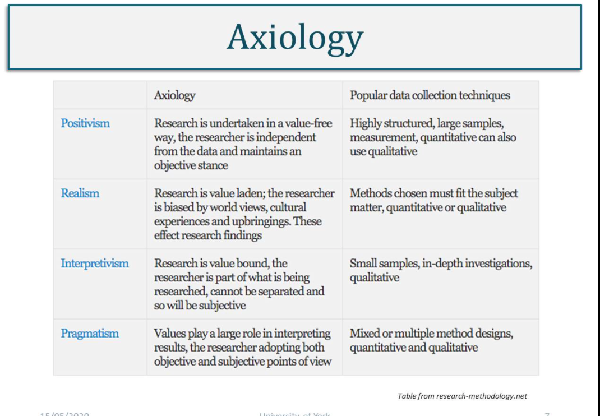
   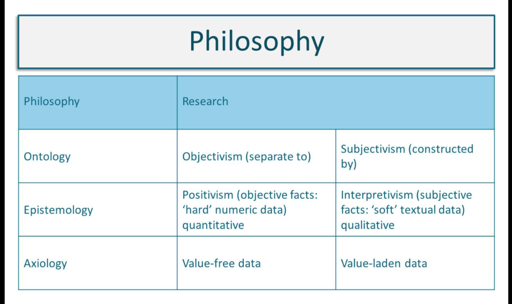

## Philosophy of CS

* The Philosophy of Computer Science is concerned with:
    * Ontological
    * Methodological
    * Ethical issues that arise from the academic principle, as well as the, practise of software development
    * Analysis of computer artefacts
    * Human-made computing systems
    * Lifecycle model of evolvement
    * Abstract nature of computer programs
* The Philosophy of computer science
    * The ontological problem: what is a computer program?
    * The implementation problem: what is the link between an abstract algorithm and the machine that implements it?
    * The problem of correctness: what does it mean for a computer program to be correct?
    * The computing notion: what is computing? the limits of computability and the interpretation of the Turing-Church
      thesis, the link between the programs and the machines that compute those programs
* CS as a discipline
    * Domain questions. What phenomena are of interest in the discipline? What are the core problems or topics of
      interest? What are the boundaries of the discipline?
    * Structural or ontological questions. What is a theory? How is this term understood in the discipline? Or what is
      theory composed of? What forms do contributions to knowledge take? How is theory expressed? What types of claims
      or statements can be made? What types of questions are addressed?
    * Epistemological questions. How is theory constructed? How can scientific knowledge be acquired? How is theory
      tested? What research methods can be used? What criteria are applied to judge the soundness and the rigour of
      research methods?
    * Socio-political questions. How is the disciplinary knowledge understood by stakeholders against the backdrop of
      human affairs? Where and by whom has the theory been developed? How is knowledge applied? Are there social,
      ethical, or political issues associated with the use of disciplinary knowledge?

# Literature reviews

* **From Ozgur Notes**
* down three reasons for conducting a literature search on the topic of your research.
    * you can avoid merely repeating what others have done; that is, you can conduct a replication with extension,
      generating new knowledge.
    * you can see what methods and procedures have worked for others and adapt them for your own work
    * you can learn about the different ways that others have investigated the topic of interest to you
* The LR allows to
    * integrate what others have done and said,
    * criticize previous scholarly works
    * build bridges between related topics
    * identify the central issues in a field.
* The outcome of a literature review should be that the researcher has an extensive understanding of relevant theories
  and concepts in relation to their research topic and is able to recognize the strengths and limitations of the
  ‘perceived wisdom’ of previous research and published sources in relation to their own research question.
    * Critical engagement with the existing body of knowledge on the research topic helps to identify a logical starting
      point for the research question(s).
* The LR can be presented
    * At the beginning to frame the problem
    * As a separate section and this is suitable for the postpositivist approach
    * At the end, to discuss the results and this is more suitable for qualitative research where the literature doesn't
      drive the research but is used to discuss the patterns found.
* Use the literature in a quantitative study deductively—as a basis for advancing research questions or hypotheses.
* Some common databases are: Google Scholar, Web of Science, EBSCO, ProQuest, and JSTOR
* The definition of terms can be found within LR or as a separate section.

# WEEK 3

#### Main Topics

* quantitative research
* Develop an understanding of quantitative methods
* Debate appropriate use of variables
* Be aware of Computer Science research methods
* Argue the appropriate use of induction versus deduction

#### Sub titles:

* [Research Methods in Computer Science 2](#research-methods-in-computer-science)
* contiune to fix

# Research Methods in Computer Science

* There are a number of factors to consider when undertaking research in Computer Science, which in itself is a wide,
  multi-disciplinary field and is therefore open to interpretation. In the first instance you might need to consider:
    * What tools you will need to investigate, which techniques and what process you are going to implement
    * What social and cognitive processes are surrounding them?
    * How will you organise all of the tasks?
    * What assessment techniques are available to you?
    * Which assessment technique is appropriate to your study?

* When evaluating a study in computer science your study should have theoretical and analytical evidence included, which
  should be:
    * Theoretical/Analytical
        * Proof oriented, proving properties of abstract notions
        * Solve mathematical problems – coding theory/probability, graphical models
    * Empirical
        * Evidence orientated, extrapolated from observed phenomenon
        * Controlled experiments
        * Case studies
        * Survey research
        * Ethnographies
        * Action research
    * Empirical Investigations
        * Common tasks
        * Identify goals, questions and measures
        * Choose research method(s)
        * Planning, design and investigate
        * Data collection
        * Results
        * Validity considerations
        * Conclusions

 

## Methods for research in computer science

* Method
    * CS is mainly based on logic and mathematics. However, Computer Science can be characterised as an empirical
      discipline, programs can be seen as experiment and their structure and behaviours can be studied.
    * Academically speaking, "research" is the activity of systematic enquiry/investigation in a particular area, with
      the goal of discovering new knowledge.
* Experimental method
    * The experiments show what occurs from real world experiments and implementation.
    * This method is used in many fields in Computer Science like artificial neural networks, automatic theorem proving,
      natural languages, analysing performances and behaviours etc. In all experiments the results should be
      reproducible
* Simulation method
    * Simulation methods are used in CS as they allow for the investigation of systems that can be outside of the
      experimental domain, systems that are under construction or complex phenomena cannot be reproduced in a lab, ie
      astronomy, physics and economics, or virtual reality or artificial life.
* Theoretical method
    * The theoretical approaches to Computer Science are based on classical methodology since they are related to maths
      and logic.
    * some of the main techniques when dealing with problems are iteration, recursion and induction.
    * Theoretical CS is dedicated to design and algorithm analysis in order to find solutions or better solutions, such
      as performance issues,
        * for example. The CS methodologies try to define the limits of computation and the computational paradigm but
          can also help in finding new theories.

## Quantitative and Qualitative data

* **Quantitative**
    * based on meanings derived from numbers
    * collection results in numerical and standardised data
    * analysis conducted through use of diagrams and statistics
    * 'thin' abstraction or description from data
* **Qualitative**
    * based on meanings expressed through words
    * collection results in non-standardised data requiring classification into categories
    * analysis conducted through use of conceptualisation
    * 'thick' abstraction or description from data

* the next stage in the research process is to analyse it
    * Data analysis is the way we make sense of data – it is how we select, organise and interpret information and
      evidence in relation to our research question.
    * Data analysis techniques are specific tools that are used to organise, categorise and code data to find results
      from which we can draw conclusions.
* The data to be collected and its subsequent analysis should be decided in the early planning stage of any research
  proposal.
    * It isn't good to collect data without knowing what you are going to do with it.

# Types of data

* Primary or secondary data.
    * Primary data refers to the data that you go out and collect yourself in relation to your research study.
        * Original data collected from first hand
    * Secondary (second-hand) data is already exist and collected by others.
* These 2 can be distinguished by asking these questions:
    * Who collected?
        * Primary: collected by researcher
        * Secondary: collected by someone else
    * For what purpose?
        * primary data is collected for the specific research problem being studied and it is therefore highly relevant.
        * secondary data has been collected for other purposes, and might therefore have less relevance to your
          research.
    * How it was collected?
        * Primary data collection is a very involved process, whereas secondary data collection can be very rapid and
          easy.
        * secondary data collection is less resource intensive.
    * At what cost?
* Quantitative vs Qualitative
    * Numerical vs textual
    * Breadth vs depth
    * Objective vs subjective
    * Scientific vs interpretive
    * Deductive vs inductive

* Different types of data suit different research questions.
* Primary data tends to be more time and cost intensive than secondary data.
* Both primary and secondary data can be used within a research project.
* Data must be relavant to the research question
* Data is only usefull if completely analysed

 
 

## Sampling techniques

* Sampling is the process of selecting who or what to collect data from.
* Probability sampling techniques are essential to quantitative research as they ensure that the chance of selection
  from the identified target population is statistically relevant.
    * Used when researchers want to be able to make inferences from their sample and generalize from the results,
      probability sampling is most prevalent in survey and experimental based research strategies.
    * A key characteristic of probability sampling is that it is randomized, where individuals or cases within the
      sample have equal chance of being selected.   
       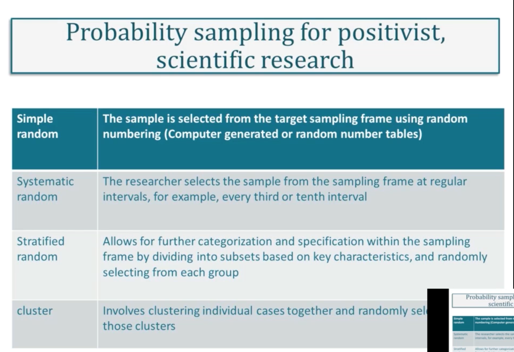

* Non-probability sampling is an alternative approach to choosing who to speak to or what to observe in research that
  doesn't require generalization from statistically proven results or when the sampling frame is not immediately obvious
  or is difficult to identity.
   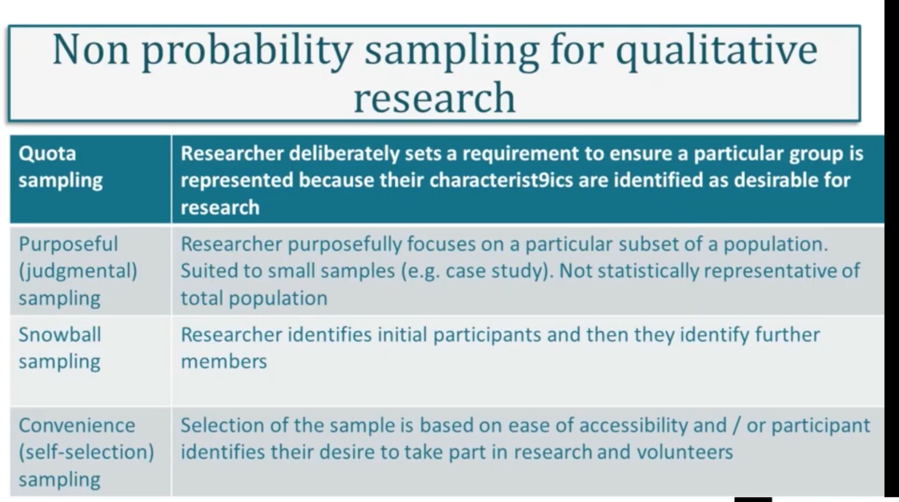
   

## Concepts, Constructs and Variables

* Explanations require the development of concepts or generalisable properties or characteristics associated with
  objects, events, or people.
* A construct is an abstract concept that is specifically chosen to explain a given phenomenon.
    * A construct may be simple, uni-dimensional such as a cars' weight, or multi-dimensional such as a person’s
      communication skills, which may consist of several concepts such as the person’s vocabulary, syntax, and spelling.
* Variable and construct are sometimes used interchangeably.
    * Variables may be classified as independent, dependent, moderating, mediating, or control variables.
    * Variables that explain other variables are called independent variables
    * those that are explained by other variables are dependent variables
    * those that are explained by independent variables while also explaining dependent variables are mediating
      variables (or intermediate variables);
    * those that influence the relationship between independent and dependent variables are called moderating variables.

## Levels of abstraction

* Going from the general to the particular, from abstract to concrete:
    * Theory – abstract statements that make claims about the world and how it works
    * Concepts – building blocks of theory which are abstracts and cannot be measured
    * Indicators – phenomena which point to the existence of the concepts
    * Variables – components of the indicators which can be measured
    * Values – actual units of measurements of the variables
* Example
    * Theory – poverty leads to poor health
    * Concepts – poverty, poor health
    * Indicators – low income, poor living conditions, restricted diet etc
    * Variables of poor living conditions – levels of overcrowding, provision of sanitary conditions, vermin
      infestation, litter etc
    * Values of levels of overcrowding – number of people per room, surface area of living areas, number of dwellings
      per square mile etc.
       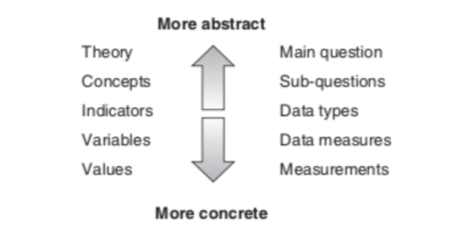

## Quantitative Research statistics

# Descriptive and Inferential Analysis (Continue Week 4)

* There are two forms of quantitative data analysis
* **Descriptive statistics** - used to reveal patterns in the data, count frequency of occurrence in the data and show
  the distribution of variables within the data
    * Descriptive statistics are used to organise and describe data numerically, often through showing measures of
      central tendency (e.g. mean, median, mode) or data spread (e.g. standard deviation, range).
    * These help you to visualise or understand what data is telling you.
    * Frequency distribution: The frequency distribution of a variable is a summary of the frequency of individual
      values or ranges for that variable.
    * Central tendency: This is the estimate of the centre of the distribution of values. There are three main estimates
      of central tendency: mean, median and mode
    * Dispersion: Is the spread around the central tendency and two common measures are range and standard deviation.

* **Inferential statistics** - a more complex set of statistical tests used to analyse associations between variables,
  such as significance, correlation, probability and regression analysis. Each statistical test has a specific function
  and the selection of which one to use will depend on the hypotheses being investigated and the type of data that has
  been collected.
    * Inferential statistics allow researchers to draw conclusions from their data by testing hypotheses using
      statistical tests and by calculating estimates of clinical significance such as effect sizes or odds ratios.
* With quantitative research, the analysis must be considered at the early stages of planning.
* For these to run accurately, the data that is used must be ‘clean’, meaning that it contains no mistakes or errors
  that would skew or corrupt the statistical test. Data entry is, therefore, a job that needs to be given careful
  attention.

* **Analysis of Variance (ANOVA)**
    * Used when more than two group means are being tested simultaneously
    * Seeing if group means differ from one another on a particular score or variable
    * Test statistic = F-test
    * It is simple analysis of variance
    * Factorial-Design ANOVA is used when more than one factor is examined and multiple independent variables are used
      with one dependent variable and example being the 3x2 factorial design which has two variables which have three
      levels.Univariate analysis

* **Univariate Analysis**
    * This is the analysis of a single variable and refers to a set of techniques that can be used to describe the
      properties of this one variable. Univariate Analysis includes
        * Frequency Distribution
        * Central Tendency
        * Dispersion
* **Bivariate Analysis**
* This method examine show two variables are related to each others and is often referred to as 'correlation', a number
  between -1 and +1 denoting the strength of the relationship between the two variables.

# Statistical Inference

* Statistical inference is the process of using what you can observe to make an educated guess about something you
  cannot observe.
* In research, we infer beyond what we can see as we cannot possibly see all human behaviour. In an experimental
  situation, there are two sets of people:
    * **the sample** – the people from whom we take measurements;
    * **the population** – the infinite, unknowable, immeasurable set of people we want to learn something about.
* What inferential statistics lets us do is look at our sample and make inferences about how our experimental
  manipulations would work on the population if we were able to test everyone.

## Statistical Hypothesis testing

* This is a a method for proving a confidence about an answer.
* . The hypothesis is tested by using calculations for a quantity given some assumptions – it tests whether the
  assumption holds true or is incorrect.
* The null hypothesis or H0 is the default assumption (nothing has changed in the assumption).
* A violated or incorrect assumption is called hypothesis 1 or H1 for short.
* A statistical test may result in two common forms, **p-value and critical values**
* The **p-value** is the value returned from a hypothesis test – the value that can be used to interpret the result and
  accept or reject the null hypothesis. This is done by comparing the p-value to a value chosen beforehand.
* The **significance level** is represented by the Greek lower case letter alpha. A common value for this is 5% or 0.05
  to give a more robust interpretation of the null hypothesis.
* The p-value is compared to the pre-chosen alpha value and if it is less, meaning a change was detected, the null
  hypothesis can be rejected.
    * If p-value > alpha then do not reject the null hypothesis
    * If p-value <= alpha then reject the null hypothesis (significant result)
* The p-value is probabilistic so you can only know what is likely not what is true or false in this situation
* If the p-value is less than 0.05 or 5%, it means that we have a 5% chance of being incorrect in rejecting the null
  hypothesis or having a Type I error (the mistaken rejection of an actually true null hypothesis, a false positive).
* If p>0.05, we do not have enough evidence to reject the null hypothesis or accept the alternative hypothesis
* Standard error: Every sample has some level of error and if it is smaller than the sample mean, it is good.
* Confidence interval: A confidence interval displays the probability that a parameter will fall between a pair of
  values around the mean, ie mean +/- 3*stdev. A 95% CI means that you are 95% confident of the time that the parameter
  is within the two standard deviations.

## Understanding the practical significance

* Statistical significance is not always the same as clinical significance. Even if a result is statistically
  significant, we still need to consider clinical significance, because this tells us how important a study’s findings
  are likely to be in the real world.
* Efect Size: The effect size quantifies the difference between two or more groups.
    * Effect sizes are based on the mean and standard deviation of the outcome scores in each group and are often
      standardised so that differences across several different outcome measures with different units can easily be
      compared.
    * Effect sizes of 0.2 or below are usually considered small, effect sizes over 0.5 are medium and effect sizes over
      0.8 are large.
* Odds ratio: Similar logic with effect size: However, unlike an effect size, it is often used for categorical data and
  provides a more relative measure of effect.
    * The odds ratio will be 1, when outcome is same for each groups
    * If the odds ratio is less than 1 then it means the control group is better than the intervention.
* Confidence interval:  Confidence intervals are used to indicate the level of uncertainty around an effect reported in
  a research study.
* Estimating: means we are unlikely to measure exactly the right result
    * If we were to run our study lots of times, we might get a slightly different result each time. Confidence
      intervals help us to decide how much these different estimates are likely to vary.
    * By having an upper and lower confidence limit, we can show the range of values between which we think the true
      result lies

* Non-probablity samples
    * Convenience samples – samples that are readily available but that don’t necessarily represent a well-defined
      population.
    * Quota samples – samples that include sub-groups that are not randomly selected (e.g. making sure that a sample
      includes 50% each of female and male participants that come from a convenience sample.
    * Purposive (judgmental) samples – convenience samples of participants with pre-selected characteristics that are of
      interest to the researcher.
    * Respondent-driven (chain-referral) samples – there are several chain-referral techniques. First, we can find
      samples that result from key informants. Second, we could find a selection of participants who then recommend
      other participants who in turn recommend others, and the researcher contacts these other people. Third, we can
      find whereabouts the members of the group of interest congregate and sample them. Fourth, we can find participants
      who recruit further participants. In this technique, the researcher does not do the recruiting.

## Factors influencing the choice of a statistical test

* When choosing which statistical test to use you may reference:
   

* [York Statistik guide](https://subjectguides.york.ac.uk/maths-skills-centre/statistics)

# Hypothesis driven research

* You must have at least one control or independent variable and one dependent variable which is what you will measure
  although this variable may change – establishing if it does or not change is the point of the experiment.
* The independent variable is something you feel might cause a change in the dependent variable. Once you have chosen
  your independent variable, you can state your null hypothesis – this is the notion that any changes in your
  independent variable will not lead to significant change in your dependent variable.
* The hypothesis that changing the first variable does change the second is called alternative hypothesis.

## Errors

* There are two types of errors that can arise when testing a hypothesis,
    * Type I error – the researcher rejects the null hypothesis when it is correct – this is also called a false
      positive.
    * Type II error is when the researcher accepts the null hypothesis when it is false – also called a false negative.

* Random error
    * Factors such as noise can contribute to instrumental or random error – this can be eliminated completely by taking
      a sufficient number of independent measurements
    * Random errors have rules for reducing its consequences.
* Systematic errors
    * Make the measurements repeatedly and average the results together, while errors cannot be cured there is a process
      to catch many forms of systematic errors called calibration.
    * This may be down to faulty instruments. To counteract this the precaution is to use a certain value a standard
      before calibration.

# Quiz

* A variable whose value changes as a result of manipulation of some other variable is called the dependent variable.
    * dependent

* The variable manipulated by a researcher in an experiment is called the independent variable.
    * independent

* When researchers use existing data to create groups for comparison, the approach is known as
    * quasi-experimental

* An independent variable whose groups differ on a nominal scale is called a
    * qualitative variable

* Independent variables that change along a continuum are called
    * quantitative variables

* What are the ideal criteria for data that permit us to use parametric statistics in data analysis?
    * Suggested points:
        * (a) Equal sample sizes across groups
        * (b) Equal variances across groups
        * (c) Normal distribution of data

# WEEK 4

#### Main Topics

* Demonstrate an understanding of hypothesis testing
* Demonstrate the use of t-testing
* Articulate the difference between inductive and deductive research

#### Sub titles:

* [Quantitative research](#quantitative-research)
* [Types of Sampling](#types-of-sampling)
* [Inferential statistical](#inferential-statistical)

# Quantitative research

* Quantitative Research is based on closed questions and once the problem has been established it should not change.
* The checklist to assess the quality of the problem definition:
    * Is it researchable? Is the subject accessible? Is there a willingness to participate?
    * Is it relevant? Will the outcome be fit for the purpose of the stakeholders?
    * Is the project informative? Does the research generate new and fresh findings or does it just regenerate what we
      already know?
    * Is it reliable? Is the work consistent and does it generate the same results when it is repeated?
    * Is it effective? This effectiveness has two meanings - it can either apply to the way the research is being
      carried out, or it can apply to whether the research provides an effective answer to the original question.

* Developing a hypothesis plays an important role in QR.
* These are theoretical expectations that are met by empirical results gathered during the research activities.
* Ex post facto design is a quasi-experimental study examining how an independent variable, present prior to the study,
  affects a dependent variable.
    * Quasi-experimental simply means participants are not randomly assigned.
    * Both the true experiment, de facto, and ex post facto are attempting to say: this independent variable is causing
      changes in a dependent variable.
    * Ex post facto designs are different from true experiments because ex post facto designs do not use random
      assignment.

 
 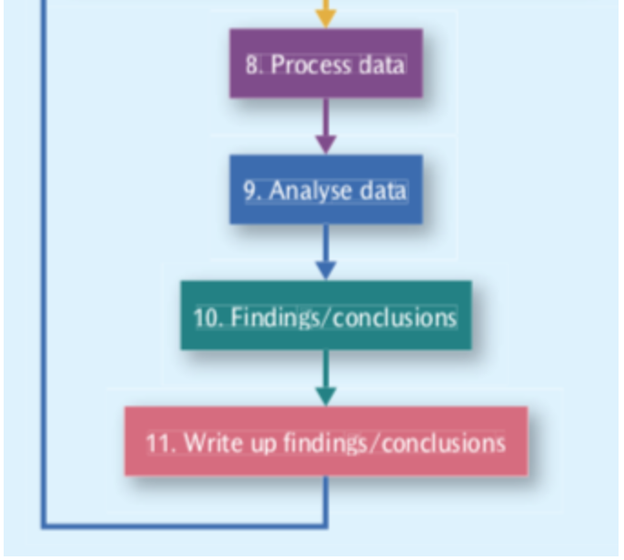

# Significance Testing

* A statistical result may be considered significant if it can be shown that the probability of it being rejected due to
  chance is 5% or less.
* This probability is called the p-value, 5% is called the significance level (α), and the desired relationship between
  the p-value and α is denoted as p≤0.05.
* The significance level is the maximum level of risk that you are willing to accept as the price of your inference from
  the sample of the population.
* If the p-value is less than 0.05 or 5%, it means that we have a 5% chance of being incorrect in rejecting the null
  hypothesis or having a Type I error (the mistaken rejection of an actually true null hypothesis, a false positive).
* If p>0.05, we do not have enough evidence to reject the null hypothesis or accept the alternative hypothesis
* Standard error: Every sample has some level of error and if it is smaller than the sample mean, it is good.
* Confidence interval: A confidence interval displays the probability that a parameter will fall between a pair of
  values around the mean, ie mean +/- 3 * standard deviation. A 95% CI means that you are 95% confident of the time that
  the parameter is within the two standard deviations.

# Types of Sampling

* Simple random samples – when the population is specified, we use some strategy for selecting participants without
  bias (e.g. each has a specified probability of being selected). It can involve random number tables, flipping a coin,
  or any other unbiased procedure.
* Systematic samples – when the population is specified and listed, the researcher selects every nth person (e.g. every
  10th, 25th, etc.) for participation
* Stratified random samples – when there are sub-groups of interest in the population, we may want to make sure they are
  included. We determine the proportion of the entire sample that should come from each sub-group and sample randomly
  from each one so that the proportions we desire are attained.
* Cluster samples – when simple random sampling might be difficult to carry out (e.g. potential participants are spread
  out geographically and it would be costly to do extensive traveling), we can break down the entire population into
  clusters and then choose clusters randomly.
* probability sampling - If a research project is set up so everybody in the population of interest has an equal chance
  of being included
    * The ability to generalize from the sample used in a research project to an entire population is one of the
      advantages of using probability sampling
* Quota sampling is a variation of nonprobability sampling.
* stratified sampling - is counterpart in probability sampling
* Purposive sampling involves using research participants from specifically identified subpopulations
* chain-referral sampling - When researchers contact a single participant who leads them to other participants who, in
  turn, lead to even more participants,

# Inferential statistical

 
 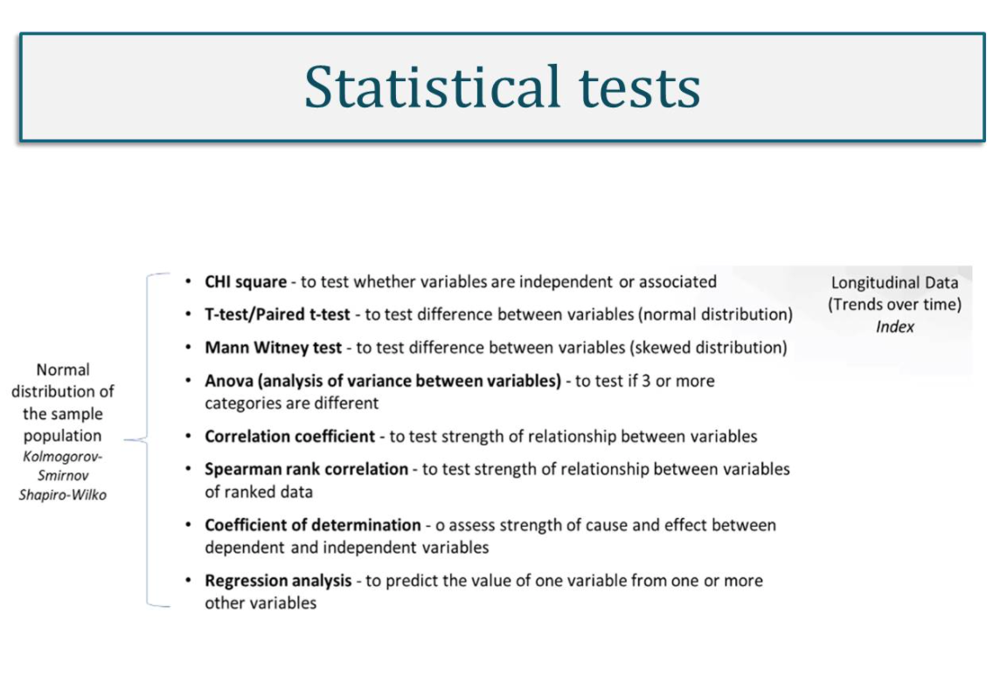
 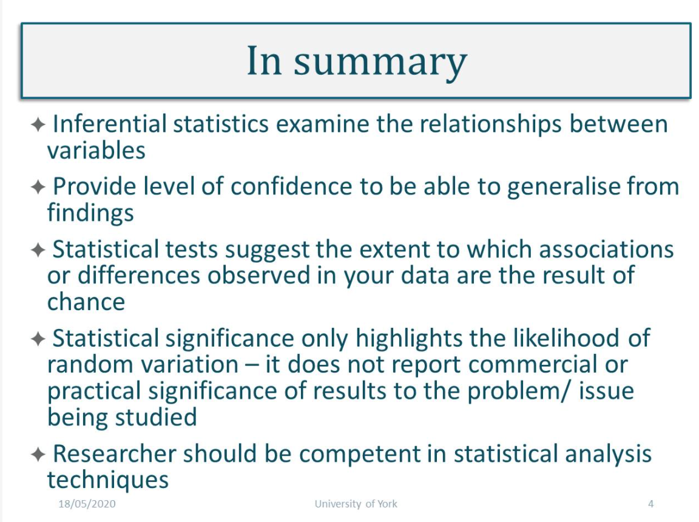

# WEEK 5

#### Main Topics

* Ensure a good understanding of methodologies used in qualitative research
* Evidence examples of when a mixed model approach is appropriate
* Identify research contexts suitable for research methods

#### Sub titles:

* [Qualitative research methods](#qualitative-research-methods)
* [Typical strategies for collecting primary data in research](#typical-strategies-for-collecting-primary-data-in-research)
* [TODO](#todo)

# Qualitative research methods

* Qualitative research uses words as opposed to the quantification in the collection of data.
* As a research strategy it is broadly inductivist, constructionist and interpretivist, but not necessarily all these
  things.
* Other features:
    * an inductive view of the relationship between theory and research, whereby the former is generated out of the
      latter (however, see the section below on abduction as a qualification of this view);
    * an epistemological position described as interpretivist, meaning that, in contrast to the adoption of a natural
      scientific model in quantitative research, the stress is on the understanding of the social world through an
      examination of the interpretation of that world by its participants; and
    * an ontological position described as constructionist, which implies that social properties are outcomes of the
      interactions between individuals, rather than phenomena ‘out there’ and separate from those involved in their
      construction.
* Desck-based (secondary data)
    * when selecting secondary source data, the researcher must take care to ensure it is:
        * Reliable: by asking questions such as who collected it, what were the sources of data, how and when was the
          data collected, was there any measurement bias within the methods used, what level of accuracy was achieved in
          collecting the data?
        * Suitable: by scrutinizing the original primary source of data – how was it defined, what units of collection
          were used and what was the scope, nature and purpose of the original research?
        * Adequate: by ensuring that the secondary data has a level of accuracy that is adequate for the purpose of the
          present enquiry; if it is inadequate, it should not be used.

# Typical strategies for collecting primary data in research

* Most commonly used strategies:
* **Case Study**:
    * What it can do
        * inquiry within a bounded real-life setting
        * exploratory, explanatory, descriptive research
        * deductive and inductive
        * single or multiple
    * Methods of data collection
        * interviews/focus groups
        * observation
        * questionnaires
        * document analysis (secondary data)
    * Benefits and limitations
        * case study allows for complexity, context and ‘messiness’ of a social setting
        * it allows for cross-organisational and inter-organisational comparisons
        * it is not useful for single theme research when a unitary approach can be used
        * it is not useful for research in a short time-frame
        * it can be difficult to know when to stop gathering data.

* Survey:
    * What it can do
        * deductive approach
        * explanatory and descriptive research
        * describes trends, attitudes and opinions of a given population
        * tests for associations between variables
    * Methods of data collection
        * questionnaire
        * structured observation
        * structured interviews
    * Benefits and limitations
        * effective for gathering a large amount of data from a large number of people
        * cost effective in terms of time and money
        * potential for generalisations to be made due to standardized approach
        * over-reliance on single instrument for data collection
        * explains ‘what’ and ‘how’ but not necessarily ‘why’
        * lack of depth and limited insight into the phenomenon being researched

* Action Research:
    * What it can do
        * applied ‘research in action’
        * pragmatic
        * feedback loop
        * participatory social process
    * Methods of data collection
        * observation
        * interviews/focus groups
        * questionnaires
        * document analysis
    * Benefits and limitations
        * focuses on practical solutions for real-world problems
        * participatory approach draws insights from stakeholders
        * allows for complexity and reflection on issues as they arise
        * difficult to manage feedback loop in a timely and responsive way
        * challenge of knowing when to stop collecting data
        * focus of the research can veer off course between reflection and action.

* Ethnography
    * What it can do
        * exploratory and descriptive research
        * in-depth observation in natural setting
        * researcher immersed within research site –firsthand interaction with ‘lived experience’
    * Methods of data collection
        * participant observation
        * interviews
        * field notes/diaries
        * digital and visual media
    * Benefits and limitations
        * gain in-depth knowledge of the phenomenon being researched
        * difficult to generalise from findings and risk of bias (researcher subjectivity)
        * resource-intensive
        * requires building rapport and trust between researcher and participants
        * ethical implications regarding access, participation and reflexivity.

* Grounded Theory
    * What it can do
        * inductive approach
        * exploratory
        * no preconceptions on what will be discovered
        * genuine, authentic reflection of issues important to participant
    * Methods of data collection
        * interviews
        * focus groups
        * observations
        * storytelling/narratives
    * Benefits and limitations
        * grounded theory produces data driven by the participants
        * it brings fresh perspectives to theory building
        * it offers rich in-depth insights to social phenomena that may be otherwise undiscovered
        * it produces qualitative, subjective data which may be problematic for stakeholders who seek evidence based on
          facts and figures
        * it is resource-intensive, protracted and difficult to do well.

* Stress tests
    * a. In an experiment, you would create different levels of stress in at least two groups and see how they differed.
      People would be placed in different groups randomly. You specify the groups associated with the IV and measure the
      DV.
    * b. In a case study, you study a single individual (or a few) in great depth. To study stress, you would keep
      detailed notes about the conditions in which the person experienced stress and how he or she coped, along with
      other reactions.
    * c. In archival research, you could identify some naturally occurring event and see how it affected people in terms
      of stress, such as increases in admissions to psychiatric facilities, death or suicide rates, divorces, or other
      records that could be associated with stress

* [Strengths and limitations of qualitative and quantitative research methods](https://en.calameo.com/read/004705816d2c2e2577576)

* Qualitative and quantitative research both operate upon the same spectrum but at different end of it. This means that
  they have many similarities (such as a need for validity and questions of repeatability) but many difference as well.
  The authors provide a good table of the differences upon page 3 but in essence it can be summarised thus:
* Quantitative research concentrates upon using numerical information to generalise whereas qualitative research uses
  non-numerical information to focus and understand the issue in great detail.
* In this neither approach, nor indeed any of their sub-approaches such as case studies or correlation studies, are
  better. In fact, in many situations a sufficient understanding can only be attained through combining both
  quantitative and qualitative research within the literature. Computer Science is often an exception to this.
* Within computer science we have a number of different areas, some of which are strictly mechanical. If we are looking
  at changing computer architecture to increase processing speeds for instance, qualitative research would be unlikely
  to generate new insights. However, for those areas that involve data that is not specific (such as opinions and
  feelings of users about an interface) using qualitative methods is necessary.
* An example of this is A/B testing which uses correlation study to provide quantitative data. As proven a method as
  this is, it provides no understanding of why an option was selected over another. This requires an approach like a
  survey and is one of the reasons websites still have the pop-ups asking you to give your opinion on how things went
  today.
* Within computer science it is also likely that most of the quantitative study’s are correlational in nature. To a
  large extent this will be due to the availability of data. With the advent of the IoT individual datapoints are being
  generated in staggering volume. These lend themselves to correlational study and most of the models within data
  science, such as decision trees, neural networks and regression, involve this.

* Quantitative and qualitative approaches towards research produce different outcomes and have different purposes and
  therefore, except for the broad brush terms, the paper highlights that there are different approaches for the
  different fields. In terms of surveys and correlational studies, the authors are right that they suit the quantitative
  approach more effectively, however the qualitative approach, for example in an interview senario could equally be
  termed as a survey or correlation study depending on how the interview is structured. The key phrase here is "mostly
  adopted" because the difference in approaches is not as black and white.
* In terms of computer science, the advantages and disadvantages of qualitative methods are arguably no different to
  other areas of research interest, especially where human variables are included.

# TODO:

* [5.7] videos
* [5.7.1 Examples of methods for primary data collection](https://onlinestudy.york.ac.uk/courses/871/pages/5-dot-7-1-activity-examples-of-methods-for-primary-data-collection?module_item_id=59112)
  activities

# WEEK 6

#### Main Topics

* Demonstrate an understanding of Thematic analysis technique for qualitative data
* Understand how to draw conclusions from your data
* Demonstrate a clear understanding of qualitative analysis methods

#### Sub titles:

* [Analysing and presenting qualitative data](#analysing-and-presenting-qualitative-data)
* [Thematic Analysing of qualitative data](#thematic-analysing-of-qualitative-data)
* [Drawing valid conclusions from research data](#drawing-valid-conclusions-from-research-data)
* [Quiz](#quiz)
* [Quality of research design](#quality-of-research-design)

# Analysing and presenting qualitative data

 
 
 
 

# Thematic Analysing of qualitative data

* Thematic analysis is a qualitative data analysis method that involves reading through a data set (such as transcripts
  from in depth interviews or focus groups), and identifying patterns in meaning across the data.
* Thematics Analysis is a foundational method of analysis in qualitative research and is often used by researchers who
  are less familiar with more complex types of analysis used in qualitative or quantitative research. I

* When should I use?
    * You want to identify patterns in data
    * You are new to qualitative analysis
    * You want to involve research participants in the analysis process

* Advantages of Thematic Analysis
    * Thematic analysis is a flexible approach to qualitative analysis that enables researchers to generate new insights
      and concepts derived from data. One of many benefits of thematic analysis is that novice researchers who are just
      learning how to analyze qualitative data will find thematic analysis an accessible approach.

* Disadvantages of Thematic Analysis
    * Because thematic analysis is such a flexible approach, it means that there are many different ways to interpret
      meaning from the data set. It can feel intimidating to interpret what data is or isn’t important to emphasize.
      Furthermore, since thematic analysis focuses on looking for patterns across interviews, phenomena that occur in
      only one individual account can be overlooked.

# Drawing valid conclusions from research data

* Drawing valid conclusions. Bullet points:
* Methodical approach:
    * revisit Research Purpose/Question
    * triangulate data sources
    * consider audience
    * draft conclusions
    * review and recognize limitations
    * close the conclusions
* Pitfalls to avoid:
    * don’t over interpret or under interpret the data
    * ensure report actual findings, not desired
    * avoid broad generalization from narrow data
    * avoid inconsistency in argument

* Cameron and Price (2009) suggest a logical and methodical approach to writing conclusions.

1. They first suggest you revisit the Research Purpose and Question: reflect back on the research purpose, make sure
   you’re answering the question, and use both to frame the conclusions which should, in turn, address each component
   part of the research question.
2. Triangulate your data sources – in qualitative and mixed method research, triangulation is the process of drawing
   data from all sources and cross referencing the findings from each to seek convergence and corroboration of results.
   It’s a way of ensuring data validity. All the data should be gathered together and checked for consistency and
   completeness.
3. And then you need to consider your audience – the conclusions drawn from the triangulated results need to be
   disseminated appropriately. Different stakeholders are likely to have slightly different expectations on the intended
   purpose of the research. Indeed, it is not uncommon for tailored reports to be issued separately to different
   stakeholder groups from a research project.
4. Draft your conclusions – the main argument presents the claims and/or assumptions being made directly supported with
   evidence from the data which leads unambiguously to logical conclusion. Where there are multiple findings, there
   needs to be a coherence within and between these different arguments and claims and there has to be a narrative flow.
   It’s almost like the overall story, connecting all the arguments and claims together.
5. Review and recognize the limitations of your research – at every stage in the conclusions, there should be clear
   evidence to support the claims being made; referring back to the data and checking the veracity of the argument is a
   good way to maintain the integrity of the data and to identify any limitations within it, for example with sampling,
   data collection or analysis or constraints placed on the research, for example, those relating to resources and time.
   These limitations should be acknowledged and any avenues for further research identified.
6. And, finally, close your conclusions – your final message should be focused, succinct and appropriate to the needs of
   the specific audience. There are pitfalls to avoid when producing robust conclusions, in particular when reporting
   data. Valid, credible conclusions are those that report data accurately, without over interpretation – i.e.
   stretching the feasibility of the findings to meet your desired outcomes and without under interpretation, where
   conclusions are too brief or weakened due to lack of supporting evidence or argument. Generalisation is relevant to
   large data sets with representative sample populations and should only be made when supported by the data.
   Inconsistencies or gaps in arguments need to be acknowledged and recognized to

# QUIZ

* Data collection that involves every member of the population of interest is called a
    * census

* Survey researchers choose to use samples from a population rather than conducting a census because
    * with large populations, you don’t need to survey everybody in order to get a good depiction of what the population
      is like

* If a researcher wanted to survey a population that had 100 million people, a good strategy for finding out about the
  population would be to
    * survey no more than about 1,500 people to get a good picture of the population

* The tendency to give the same rating on a survey to different questions, regardless of the content of the questions,
  is known as
    * non-differentiation

* A survey item on which respondents provide their own answers is
    * open -ended

* A survey item on which respondents must choose from a set of answers provided on a questionnaire is
    * a closed-ended question

* On a questionnaire that contained a question asking you to list risky activities in which you have engaged, such a
  question would

# Quality of research design

* Reliability and validity are central to judgements about the quality of research in the natural sciences and
  quantitative research in the social sciences.
* Reliability
* Reliability refers to replication and consistency. If the same or a different researcher is able to replicate a
  research design and achieve the same findings, then that research would be seen as being reliable.

* Validity
* Validity refers to the
    * Appropriateness of the measures used
    * Accuracy of the analysis of the results
    * And generalisability of the findings.

* Internal, aka measurement, validity refers to the extent to which your findings can be attributed to the intervention
  you are researching rather than to flaws in your research design.
* Criterion, aka predictive validity assesses if the questions are actually measuring what they are intended to measure.
* External validity is concerned with the question: can a study's research findings be generalised to other relevant
  contexts?
* Construct validity refers to the extent to which a set of questions actually measures the presence of the construct
  you intended them to measure.

* The methods described above are appropriate to assess quantitative research based on positivist assumptions. However,
  they are often considered philosophically and technically inappropriate in relation to qualitative research based on
  interpretive assumptions.
* Validation
    * Validation is the process of verifying research data, analysis and interpretation to establish their validity,
      credibility and authenticity.
    * Triangulation involves using more than one source of data and method of collection to assure the described above.
    * In a research study based on positivist assumptions, triangulation will help to reveal the reality in the data.

# WEEK 7

#### Main Topics

* Evalution
* validity and ethics in research
* evaluating good quality research
* reflexivity in research practice
* reviewing the research module

#### Sub titles:

# Validity & Ethics

* Research methods literature impresses upon us that research design must ensure that data, and subsequent results, are
  relevant, reliable, valid and credible. This is pertinent at all stages of the research process, from identifying a
  feasible research question, collecting relevant data appropriately, analysing data to elicit meaningful results and
  disseminating findings.

* Research ethics concerns conducting research in a responsibly and morally defensible way.
   
* Ethics is a set of values that guide what we do, and these values underpin our behaviours and actions and influence
  how we interact with, and treat, one another.

* 3 underpins for ethical practice
    * Obligations: legal, professional, cultural, personal
    * Responsibilities: participants, stakeholders, wider research community
    * Standards: avoid harm, informed consent, respect privacy, avoid deception.
       

* research ethics is a critical aspect of conducting good research.
    * it concerns the appropriateness of researcher behaviour and actions in relation to the rights of the participants,
      the sponsors and the wider research community
    * potential ethics issues can occur at each stage of the research process
    * codes of conduct, research proposal and approval processes exist to highlight potential ethical issues in advance
      of the research being conducted
       

* Research journey:
    * The following questions can be helpful prompts for reflection:
        * How did that go?
        * What was happening there?
        * How did I feel about it?
        * What might I have done differently?
        * What can I learn from this?
        * What didn’t ‘fit’?
        * Why was I surprised?
        * What was I expecting?
        * What was I thinking?
        * How did that affect how I acted?
        * How might I have thought differently?
        * What impact might that have had?
