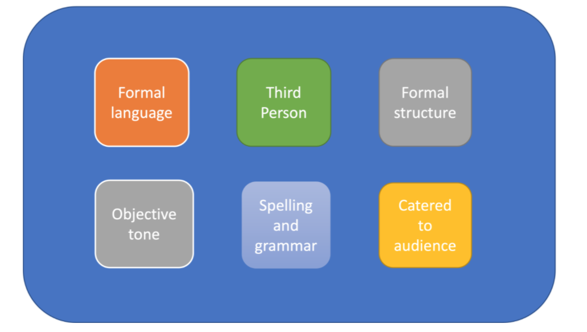
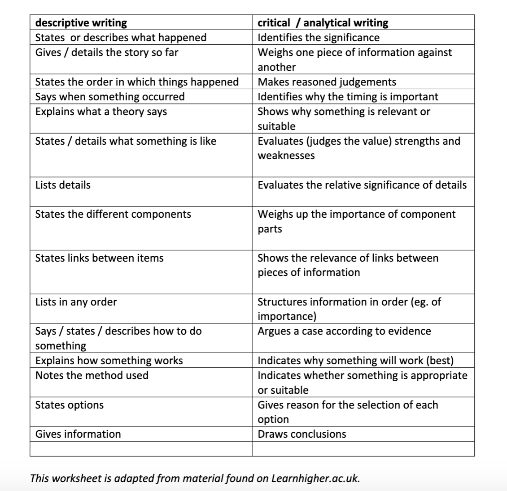
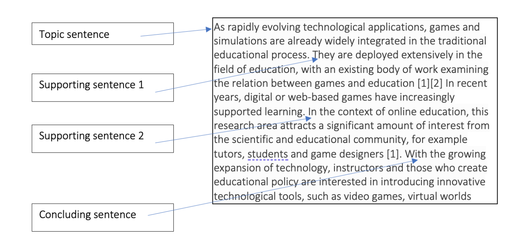
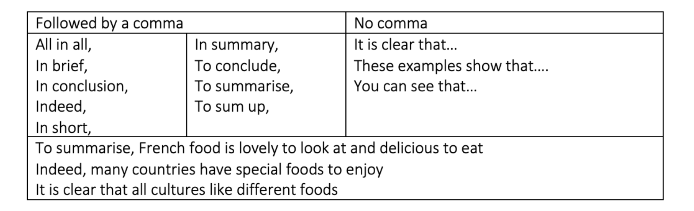
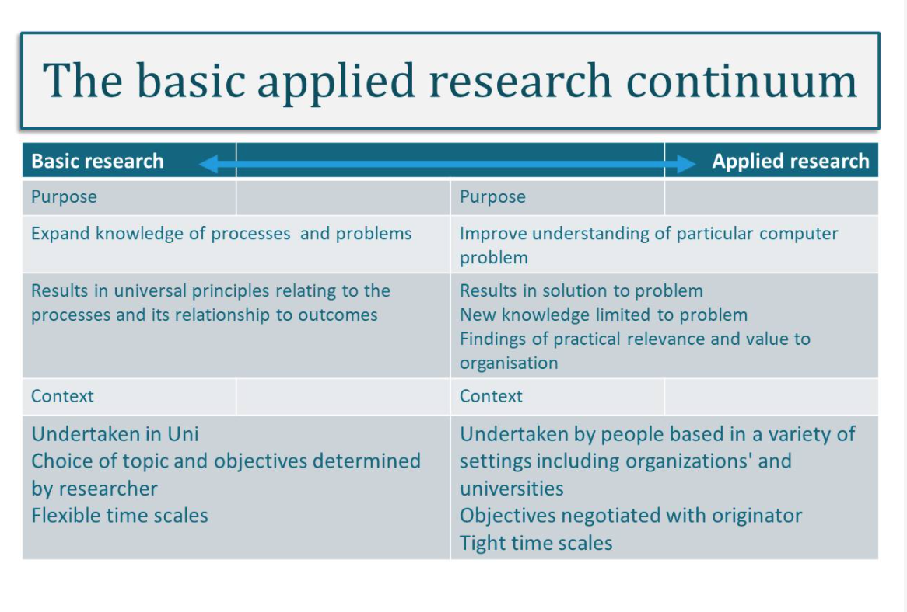
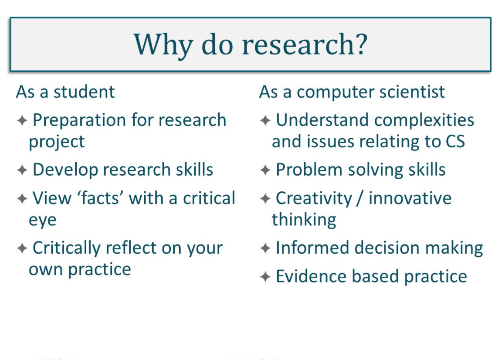
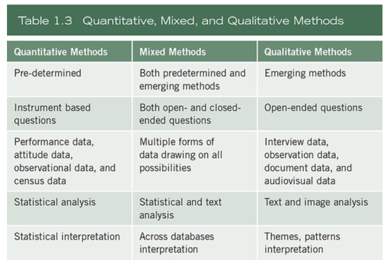
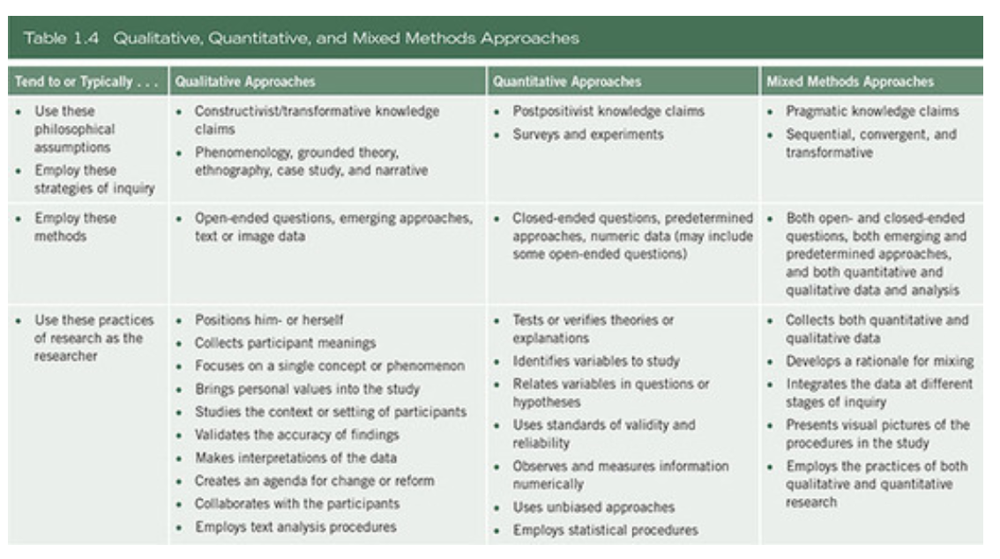
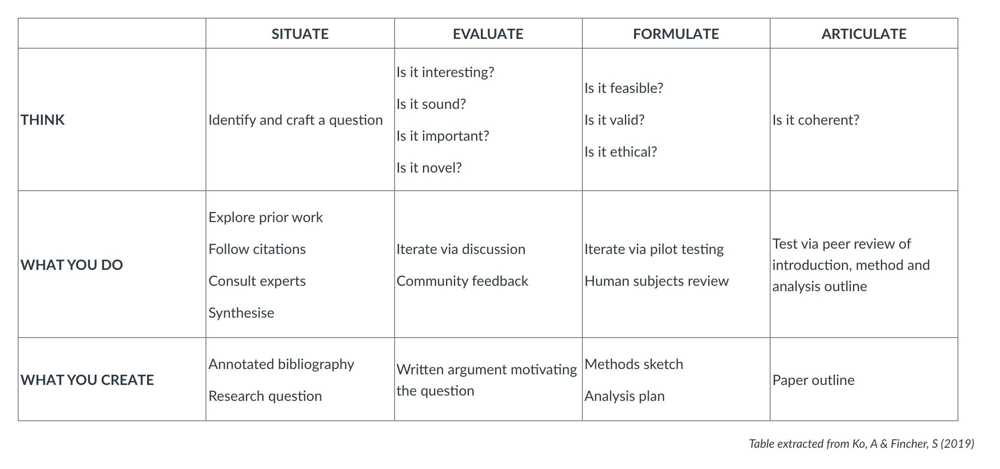

#### Main Topics

* Show a clear understanding of what research is
* Discuss research approaches
* Demonstrate an understanding of academic writing

#### Sub titles:

* [Academic writing](#academic-writing)
* [Paraphrasing](#paraphrasing)
* [Academic analytical writing](#academic-analytical-writing)
* [The research process](#the-research-process)
* [What is research?](#what-is-research)
* [Formulating your research question(s)](#formulating-your-research-questions)
* [Validating your research question(s)](#validating-your-research-questions)
* [Activity](#activity)
* [Important](#important)

# Academic writing

* Academic writing is different from general writing and great importance is placed on the structure of the work and the
  use of citations/referencing
* It must be write in formal language
    * contain no colloquialisms
    * slang or contractions (such as "don't", "can't" etc)
    * avoid personal pronouns (unless directed otherwise)
    * must adhere to a formal structure,
    * The tone must remain objective throughout
    * avoiding emotive language
    * cater to the audience
    * The rules of grammar must be followed
    * spell checked
       

* Faults:
    * poor referencing
        * you must introduce and discuss external resources to develop your point but DO NOT LET A QUOTE OR CITATION
          MAKE YOUR POINT FOR YOU!
        * it is important to include a paragraph after paragraph of quotes/citations to make their point
        * All quotes or references need to be in support of a point or assertion YOU are making and must not be
          standalone.

* Descriptive vs Academic Writing
    * Descriptive writing - represent facts and not contains who, what, where, how or why questions
    * Academic writing is evaluative and critical, investigating the significance of facts
       

* Making assertions in paragraphs
    * If you make a claim or assertion, you must back it up with evidence.
        * Statement is speculative without evidence and must be evidenced
    * Example : "Just because most programmers are good mathematicians does not mean that there are no non-mathematician
      programmers". This sentence is premised on the assumption about 'most programmers' which is not backed up with
      data or evidence. Also, the term 'mathematician' is problematic as it is value-laden and subjective.

* **Typically a paragraph might be constructed thus:**
    1. Introduce topic.
    2. Make a claim – back it up with a reference
    3. Make another supporting claim – back it up with a reference
    4. {Make a claim opposing your topic – back it up with evidence}. This strengthens your argument but not everyone
       does this
    5. Close your argument/paragraph.
        

* Each paragraph should end with a final statement that brings together the ideas brought up in the paragraph and which
  can also be used as the transition to the next sentence.
* Make sure your work is coherent – each point should be linked to the previous and subsequent points to improve the
  flow and logic of the piece.
* It might feel frustrating at first but you must remember when writing for academia that you must always always support
  your claims with research. Don't leave any claims as speculative – where and when your claim is endorsed in
  literature.

* Summarise
    * The claim is where you where you make your main point – it's a key part of academic argument. If there's no claim,
      there's no argument.
        * You need to support your claim with evidence.
    * We are talking about facts here, not opinions – good evidence backs up the points you make.
    * Justification is where you explain why the evidence supports the claim – sometimes this can be left out if it's
      obvious or a widely held belief.
    * Claim, evidence and justification all combine to produce a clear argument.
    * Counter-arguments are important. If you include them in your writing it shows that you have considered more than
      one side of an argument.
    * Tell your reader your limitations. This doesn't mean that your writing is lower quality but actually helps the
      reader understand your context better.

* Paragraph conclusion
    * Concluding your paragraph, repeat the ideas in the topic sentence in different words, but don’t just copy the
      topic sentence. Summarise the main point or points of the paragraph
        * Never end a paragraph by introducing a new idea.
        * Example :
            * Successful programming requires practice and research. [topic point]
            * In conclusion, coding skills build up over time with repeated attempts and learning from other examples of
              code. [summarising point]

    * Conclusion signals
       

* **Unity** in a paragraph is when all the supporting sentences in a paragraph discuss only one idea. From the start to
  the end of the paragraph, each sentence is directly related to the topic. A paragraph should contain a single theme or
  focus.
* **Coherence** in a paragraph is when it flows smoothly from beginning to end, with no sudden jumps.
    * Do this by using nouns and pronouns consistently through each paragraph.
    * Use transition signals to show relationships between ideas and put ideas into logical order.
* **Nouns/pronouns**
    * if you begin with a plural noun such as users, don’t change it to a singular. Do not change to 'he' or 'she' for
      no reason.
    * If you use the pronoun you at the beginning of the paragraph, make sure you use it throughout.
    * Use a plural noun rather than a singular noun when writing about a group of people of all sexes.
    * When you use pronouns, the plural forms they, them and their are less awkward than he, she, him or her and fall in
      line with gender identity.

* Tenses
    * Be consistent with tenses in your writing
    * When discussing or introducing others' opinions, use the present tense, e.g 'Smith believes' or 'Smith claims'
      rather than 'Smith believed' or 'Smith claimed'.
    * However, if that person died many years ago or was writing in a different era, it may be appropriate to use the
      past tense.
    * You cannot switch tenses in a sentence - for example "Many years ago, Smith asked mathematicians what they think
      is the hardest algorithm ever". This starts with the past tense but then moves to the present, which is confusing,
      and mathematicians may have changed their minds since they were asked, which makes it inaccurate.
    * It is common practice to use the future tense in introductory sections of academic work, such as 'The purpose of
      this essay is to...' or 'This paper will explore...'
        * However, it is considered more assertive to write in the present - 'The purpose of this essay is to...' or '
          This report explores...'.

* Contractions
    * ~~Don't use contractions~~. Do not use contractions. Use the full form.

# Paraphrasing

* Sometimes you will elect to cite exactly what they have said, using quotation marks, but at other times you might want
  to express their ideas in your own words (known as "paraphrasing".
* Doing this correctly is an important part of academic writing and good practice. Try to simplify others' work and
  ideas and describe them using different sentence structures and expressions. You must also always credit the original
  author with phrases such as "according to Jones [2]"...

* How different words must be ?
    * you must demonstrate that you have understood someone else's ideas and can summarise them in your own style or
      words without borrowing or copying their phrases.
        * Work is deemed to be plagiarised when you just change a few words to an otherwise reproduced section of
          others' work.

* Paraphrasing example : [here](./doc/Paraphrasing%20exercises.docx)

# Academic analytical writing

* Analytical writing engages with and applies theoretical concepts
* Evaluates the strengths and weaknesses of ideas
* Unpacks the significance of evidence
* Synthesises and engages with sources to support and create an overall argument

* Ask yourself the following:
    * What does this evidence mean? What is its significance?
    * How does this point relate back to my central argument?
    * What is the connection between the different ideas?
    * What does this theory reveal about this particular topic?
    * What is the relevance of this evidence or point? How can I link it to my work?

* Further tips:
    * Evaluate the evidence; do not just state it
    * Unpack the meaning of terms, ideas and definitions
    * Synthesise secondary material into your overall argument
    * Evaluate the strengths and weaknesses of other arguments or studies
    * Engage with theory and apply it to your argument

# The research process

* Careful identification of the research problem, methodical data collection and thorough analysis lead to credible and
  trustworthy conclusions, all of which contribute towards good research.

* Identify a research topic - this would usually be an issue, problem or phenomenon that is of interest and worthy of
  investigation
* Formulate research questions - consult relevant academic literature and other sources of information to explore the
  issue in more depth and identify feasible research objectives
* Frame research question(s) - decide on specific question(s) to ask about the issue; frame the question clearly
* Choose methodology/approach - think about how to conduct the research; consider the optimal approach to enable you to
  address the research objectives
* Select methods of data collection - choose how to collect the data; consider which methods will enable you to gather
  the sort of data you need to respond to the research question(s)
* Collect data - consider who and what you need to gain access to in terms of data collection; think about sampling;
  ensure ethical consideration is given to all aspects of data gathering
* Analyse data - choose how to analyse the data; draw from a range of analytical approaches most relevant to the type of
  data collected. Triangulate from different sources if appropriate
* Draw conclusions - discuss findings in relation to what is already known about the issue (academic literature and
  other relevant contextual information). Identify key results/outcomes, recommendations, limitations of research and
  opportunities for further research
* Disseminate research findings - think about who to communicate findings to (stakeholders) and choose an effective way
  to do that (report, academic paper, presentation etc.)

* For a computer research project, emphasis will be on ensuring that findings are translated into actionable outcomes
  and there will be a phase beyond dissemination which focuses on decision making, action and evaluation.

# What is research?

* academic and scientific research
* The systematic investigation into and study of materials and sources in order to establish facts and reach new
  conclusions.
   
* Why do research?  
   

* Research may have very practical focus specific to an organization or problem
* Researh may be concerned with building theory which can be generalised across many context (basic)
   
   

* 3 reasons for literature research
    * you can avoid merely repeating what others have done; that is, you can conduct a replication with extension,
      generating new knowledge.
    * you can see what methods and procedures have worked for others and adopt them for your own work
    * you can learn about the different ways that others have investigated the topic of interest to you

# Formulating your research question(s)

* Some considerations when creating your research question.
   

* [how to write great research question? ](./doc/Mattick_et_al-2018-The_Clinical_Teacher.pdf)

# Validating your research question(s)

* Is your research question important?
    * At the smallest level – it is interesting to you and your supervisor, but on a large scale it might have to be
      interesting enough to attract funding, to be important to your institute

* Is your research question novel?
    * You need to have a good understanding of the body of research and evidence in the relevant area before you can
      establish this – this must be done before the analysis or data collection.
    * Read widely to provide some evidence towards the answer. What is known about your question? What are the possible
      outcomes for your question's? Are they all original, or just some of them?
    * Prototyping a research question – you must continually express your research question in a way that that allows
      you to critique, observe and refine it.
    * The form that a research question takes is an argument, beginning with statement of knowledge and ending with a
      question.

* Can you research it?
    * The research question itself often implies the methods or requirements that are appropriate to use in addressing
      it.
    * If you are comparing samples or populations, you need to use quantitative statistical claims which then affect
      your design.
    * If you are investigating how some person makes sense of some scientific concept, you will need to talk to them,
      thereby making it qualitative in nature.

* Is your research question feasible?
    * You need to consider:
        * Is there a method that will produce the right data to answer it?
        * Do you have the skills to undertake it?
        * Do you have the time to do it?
        * Do you have the resources to do it?
* Is your research question valid?
    * Internal and external validity differ – for internal validity your study would need to assess perhaps the
      decision-making process or practical process of some task or process.
    * Using best practices should ensure that you adhere to internal validity.
    * Externally valid means that your research will focus on a tiny percentage of the population or world. It is the
      extent to which the conclusions you draw about these tiny things can be generalised to other external things (
      people, places, things).
    * Most methods with high internal validity often have low external validity and vice versa.
* Is your research question coherent?
    * Coherence is the thread of logic running through the entire study - the chain of reasoning or the argument.

* **Evaluate your research question's checklist**
    * Focused on a single problem or issue
    * Researchable using primary and/or secondary sources
    * Feasible to answer within the timeframe and practical constraints
    * Specific enough to answer thoroughly
    * Complex enough to develop the answer over the space of a paper or thesis
    * Relevant to your field of study

# Activity

* It is about [DanielSiek Report](./doc/Danielsiek%20et%20al%202017-1.pdf)
* Introduction
    * Self-efficacy is the personal belief of one's ability to succeed in a situation or task
    * How a teacher teaches can influence self-efficacy
    * Knowing the impact of teaching on self-efficacy requires measurement
    * There is no measure of self-efficacy in introductory algorithms courses
    * What is a conceptually valid measure of self-efficacy in algorithm courses?
* Method
    * We partnered with four institutions to measure self-efficacy
    * We adapted a previously designed instrument to an algorithm course context
    * We administered the adapted instrument in four classes, obtaining 130 responses
* Results
    * We verified the data had sufficient sphericity to be factorable
    * We performed a factor analysis, finding four factors that explained 66% of the variance
    * The factors were consistent with the instrument's intended measurements, indicating construct validity
    * Cronbachs Alpha was 0.938 suggested reliability
    * The instrument did not correlate with measures of self-regulation, suggesting divergent validity
    * The instrument did correlate with measurements of personality traits, suggesting nomological validity
* Conclusion
    * Therefore the instrument we designed is a conceptually valid measure of self-efficacy in introductory algorithm
      courses.

# Important

* [IEE Referencing Style Guidline](https://subjectguides.york.ac.uk/referencing-style-guides/ieee)
* [Academic Writing](./doc/Academic%20writing.ppsx)
* [Academic writing](https://subjectguides.york.ac.uk/skills/writing)
* [Writing Center](https://www.york.ac.uk/students/studying/skills/writing-centre/)
* [IEEE referencing style](https://subjectguides.york.ac.uk/referencing-style-guides/ieee)
* [Academic Skills Community](https://www.york.ac.uk/students/studying/skills/community/)
* [What is academic writing](https://subjectguides.york.ac.uk/academic-writing/general-writing)
* [Writing structuring your response](https://subjectguides.york.ac.uk/skills/essay-structure)
* [Pharasing in Academic Writing](./doc/Paraphrasing%20in%20academic%20writing.docx)
* [Academick Pharasing Bank Manchaster](https://www.phrasebank.manchester.ac.uk/)
* [Super Vocab](http://www.uefap.com/vocab/select/awl.htm)
* [Computer Scinece theses York](https://pure.york.ac.uk/portal/en/organisations/computer-science(e2d7acdb-0ce1-48d7-ae25-d4124313e8ed).html)
* [E-theses ](https://etheses.whiterose.ac.uk/cgi/search/simple?q=computer+science&_action_search=&_order=bytitle&basic_srchtype=ALL&_satisfyall=ALL)
* [Developing strong Research Questions](https://www.scribbr.com/research-process/research-questions/)