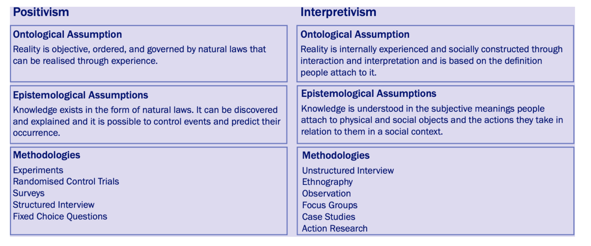
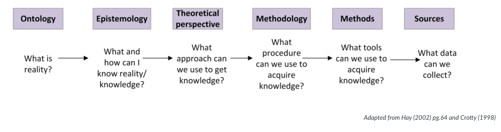
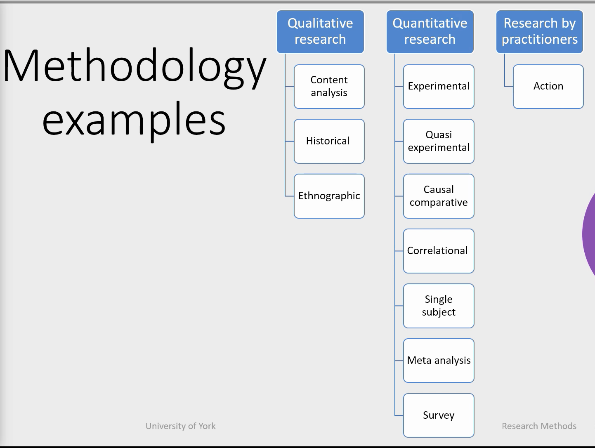
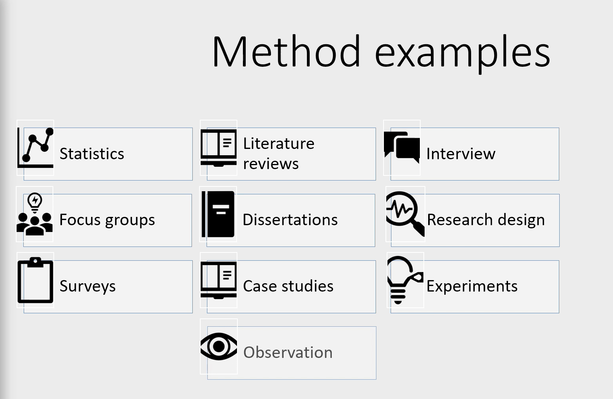
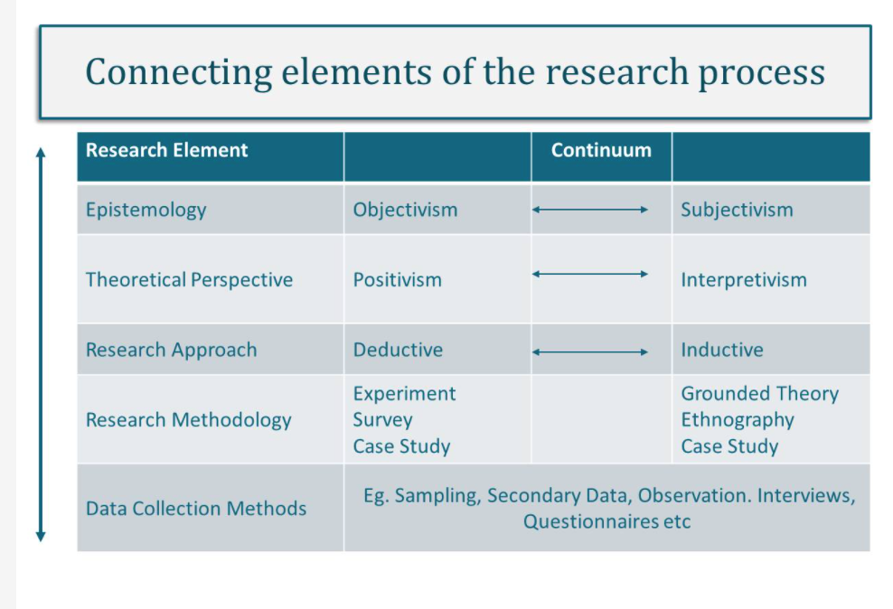
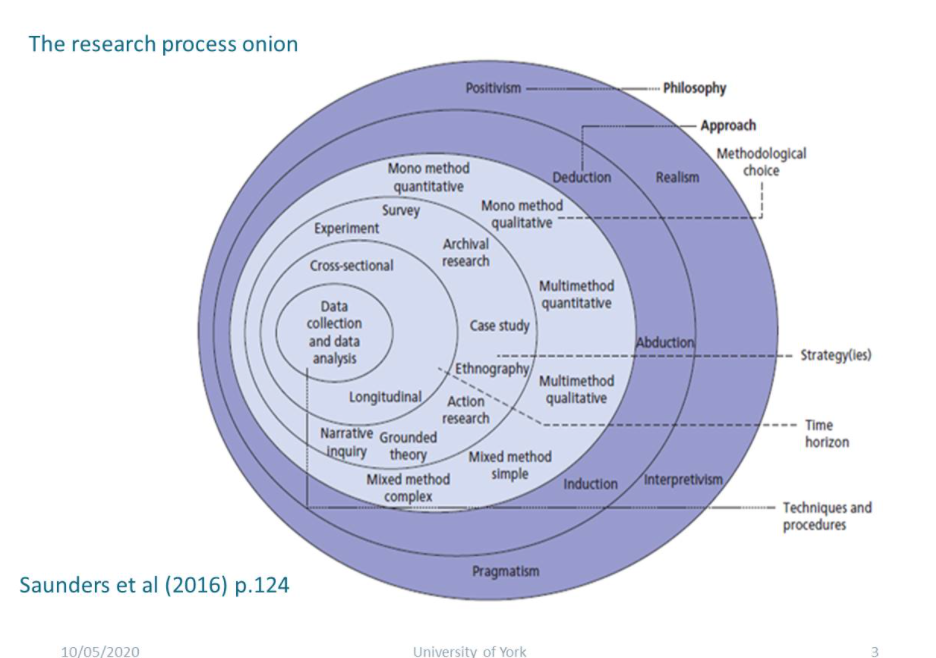
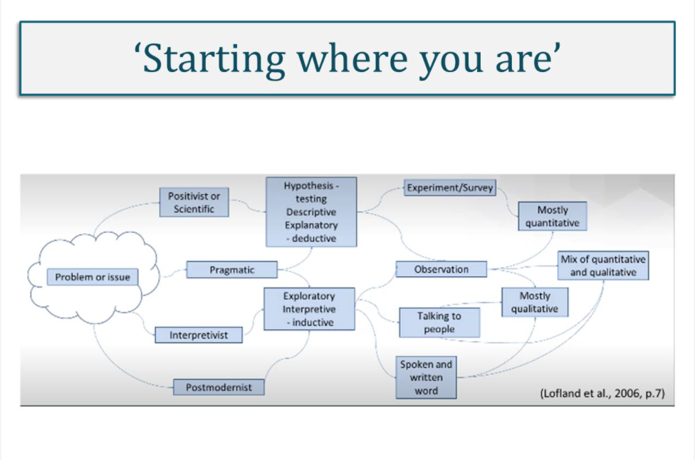

#### Main Topics

* Research methods and methodologies
* Research approaches
* Planning research
* Literature review

#### Sub titles:

* [Research terminology and definitions](#research-terminology-and-definitions)

# Research terminology and definitions

* Methods
    * Research methods include all the techniques or methods that you adopt for conducting the research. These may be
      thought of as the data collection methods - experiments, surveys, interviews, observation etc.
* Methodology
    * Research methodology is the way in which the problems are systematically solved. Methodology is the science which
      studies **how** research is conducted, the steps taken to study a research problem, and the logic behind those
      steps. It is important as a researcher to understand the methods but also the scientific approach called
      methodology.
* Research Approaches : qualitative and quantitative
* Research design considers issues such as "what", "when", "how much" and so forth.
    * It is the conceptual structure in which the research is constructed and includes the blueprint for the collection,
      measurement and analysis of the data
    * 3 types research design :
        * Exploratory research design
        * Descriptive and diagnostic research design
        * Hypothesis testing research design
* Research Philosophy
    * This refers to a system of beliefs and assumptions about the development of knowledge. Assumptions you make
      throughout your research process which will include the realities you encounter in your research (ontological
      assumptions), about human knowledge (epistemological assumptions) and about the way your own values influence your
      research process (axiological assumptions).

* Research Paradigm
    * The research paradigm can be considered as the beliefs of the world that the researcher chooses to live in
    * 2 types : positivism and interpretivism
    * These shape and inform the views held on the research and in turn impact on the ontological, epistemological and
      methodological choices made by the researcher.

       
* Assumptions
    * Ontology assumptions refer to the nature of reality. You will have your own assumptions about the world that your
      research sits in, your perceptions which shape the way that you see and study your research objects, thus your
      choice of what to research.
    * Epistemology refers to assumptions about knowledge and what is acceptable, valid and legitimate knowledge and how
      that can be communicated to others (Burrel and Morgan, 2016).
    * Methodology relates to how we are to discover and validate what we think exists, what methods we will use to
      collect the data.
    * Axiology refers to the role of values and ethics. As a researcher, you need to reflect on the impact of your own
      values and beliefs and you must recognise these beliefs in the research. This may be as simple as choosing one
      topic over another as you think one is more important.
       

# Methodology & methods

* **Methodology**
* Explains the method you use to solve the problem, address the issue or answer the question.
* Study of the steps taken and the logic behind them.
* Examples
    * Qualitative Research
        * Content Analysis: derived from interviews, focus groups, open ended surveys, videos and documents.
        * History:  historical research involves understanding, studying, and explaining past events.
            * Its purpose is to arrive at some conclusions concerning past occurrences that may help to anticipate or
              explain present or future events.
        * Ethnographic :  can include virtually any group or organisation.
    * Quantitative Research
        * Experimental : Experimental research is any research conducted with a scientific approach, where a set of
          variables are kept constant while the other set of variables are being measured as the subject of experiment.
        * Quasi-experimental: Quasi-experiments manipulate presumed causes to discover their effects, but the researcher
          does not assign units to conditions randomly.
            * Quasi-experiments are necessary because it is not always possible to randomise.
        * Causal-comparative: Causal-comparative research attempts to identify a cause-effect relationship between two
          or more groups.
            * Causal-comparative studies involve comparison in contrast to correlation research which looks at
              relationships.
            * This degree of relation is expressed as a correlation coefficient.
        * Single subject: refers unique type of research methodologies that facilities into vension evaluation for the
          individual case.
        * Meta Analysis:  which is a statistical technique for amalgamating, summarising and reviewing previous
          quantitative research.
        * Survey: which involves the collection of information from a sample of individuals through their responses to
          questions.
    * Research by practitioner
        * Action: is a process where participants examine their own practice to improve it. It can be an immediate
          problem or reflective process of problem solving.

       

* **Method**
* The spesific techniques, producedures and or instruments you can use in order to answer the question or hypotesis.
* There is, process, tools and methods used to collect and analyse data.
* Examples:
    * Statistics, they analyse the data rather than just describing it - use it to tell a story that focuses on
      answering the research question.
    * Literature reviews, building and collecting your research on and relating it to existing knowledge.
    * Interviews which can be defined as a qualitative research technique which involves conducting intensive individual
      interviews with a small number of respondents to explore their perspectives on a particular idea, program or
      situation’. regarding specific issues closely related to the research question or hypothesis.
    * Focus group
    * Dissertations, which is a method by which you are going to deliver the results of your research,what you deliver
      might take different shapes, depending on the context.
    * Research design. this might require the adoption of existing tools or the development of novel ones, to answer the
      question of the research. So it is not just the answer to the question, but one needs to figure out the needs to
      answer the question.
    * Surveys: which are about questioning individuals on a topic or topics and then describing their responses.
    * Case studies which aim to analyse specific issues within the boundaries of a specific environment, situation or
      organisation.
    * Experiments, which are used in order to analyse cause and effect relationships.
    * Observations and as the name implies, is a way of collecting data through observing.

       

### Sage Research Methods Resource

* [Sage Research MethodsLinks](https://methods-sagepub-com.libproxy.york.ac.uk/) to an external site. is a valuable
  online resource containing material in all aspects of the research process.
* [Sage Research Methods overwiew](https://www.youtube.com/watch?v=rppKj7xHA-I)

## Model for Research

* There is a natural order which connects key elements of the research process.
* Understanding how elements research are connected is essential to designing quality research
* Research is not always a linear process, even though it may be depicted this way in models for research.
   
   
   
  
# Research methodology & strategy

