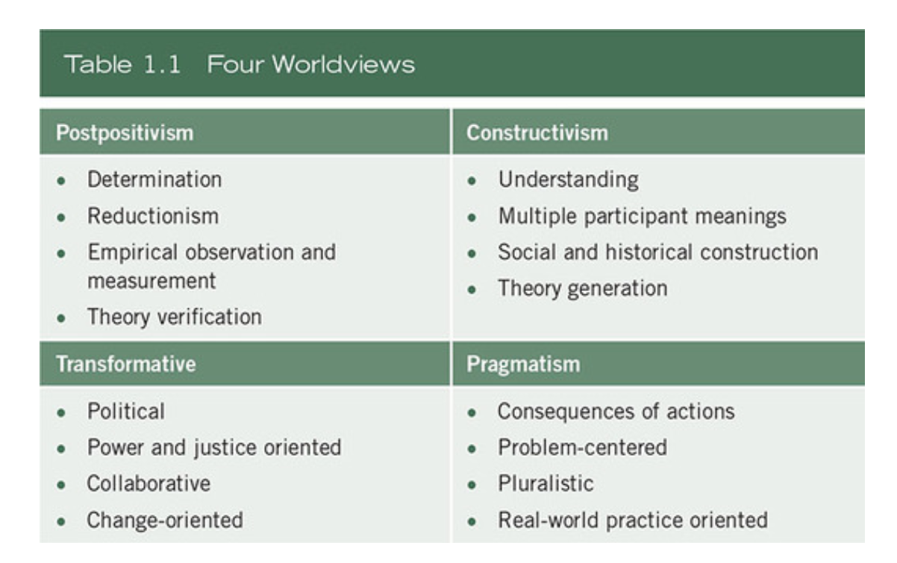
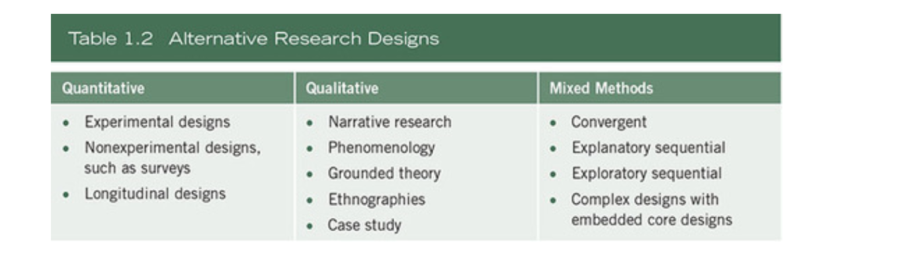
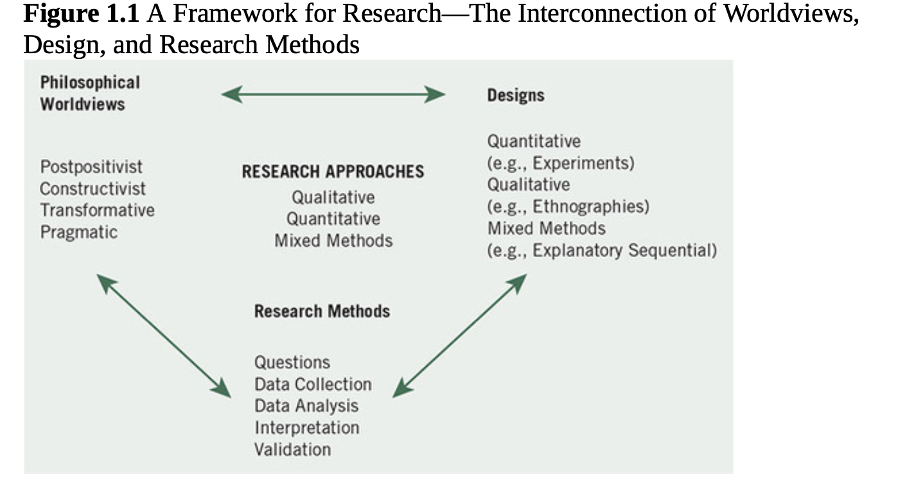
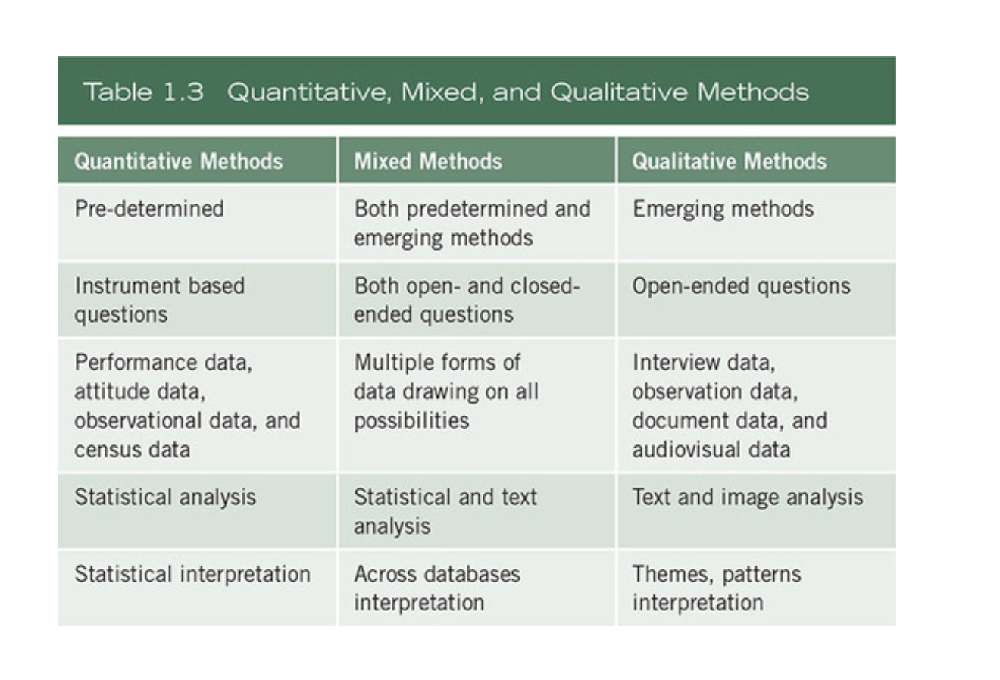
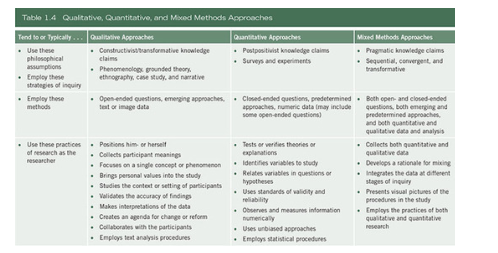
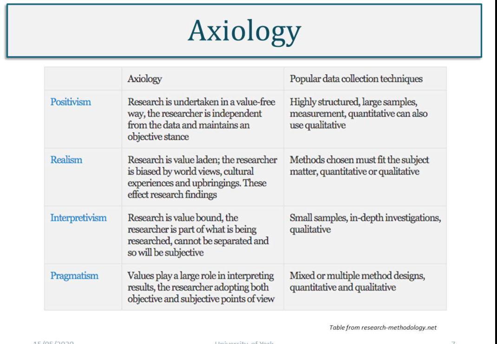
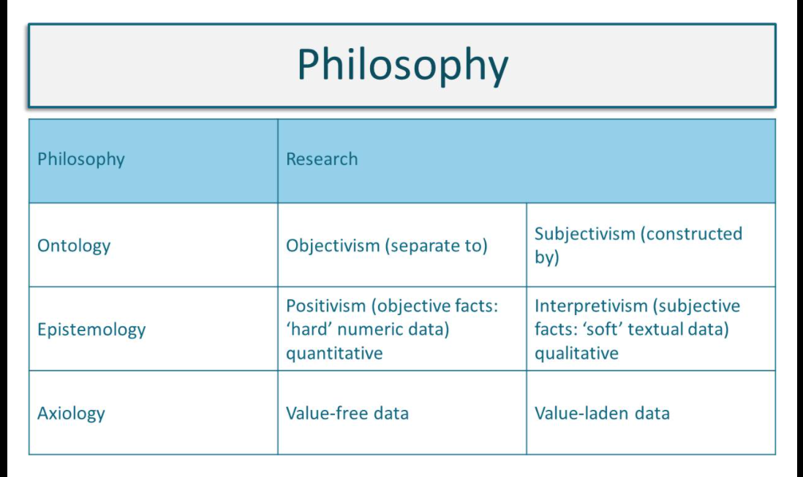

#### Main Topics

* Research methods and methodologies
* Research approaches
* Planning research
* Literature review

#### Sub titles:

* [Research terminology and definitions](#research-terminology-and-definitions)
* [Philosophical Worldviews](#philosophical-worldviews)
* [Research Designs](#research-designs)
* [Methodology & methods](#methodology--methods)
    * [Sage Research Methods Resource](#sage-research-methods-resource)
        * [Model for Research](#model-for-research)

* [Research methodology & strategy](#research-methodology--strategy)
* [Research Strategy](#research-strategy)
* [Research approaches](#research-approaches)
* [The purpose of research](#the-purpose-of-research)
* [Stakeholder perspective in research design](#stakeholder-perspective-in-research-design)
* [Quiz](#quiz)
* [Research Philosophies](#research-philosophies)
* [Philosophy of CS](#philosophy-of-cs)
* [Literature reviews](#literature-reviews)

# Research terminology and definitions

* Methods
    * Research methods include all the techniques or methods that you adopt for conducting the research. These may be
      thought of as the data collection methods - experiments, surveys, interviews, observation etc.
* Methodology
    * Research methodology is the way in which the problems are systematically solved. Methodology is the science which
      studies **how** research is conducted, the steps taken to study a research problem, and the logic behind those
      steps. It is important as a researcher to understand the methods but also the scientific approach called
      methodology.
* Research Approaches : qualitative and quantitative
    * Research approaches are plans and the procedures for research that span the steps from broad assumptions to
      detailed methods of data collection, analysis, and interpretation.
* Informing this decision should be the philosophical assumptions the researcher brings to the study; procedures of
  inquiry (called research designs); and specific research methods of data collection, analysis, and interpretation.
* Research design considers issues such as "what", "when", "how much" and so forth.
    * It is the conceptual structure in which the research is constructed and includes the blueprint for the collection,
      measurement and analysis of the data
    * 3 types research design :
        * Exploratory research design
        * Descriptive and diagnostic research design
        * Hypothesis testing research design
* Research Philosophy
    * This refers to a system of beliefs and assumptions about the development of knowledge.
    * Assumptions you make throughout your research process which will include the realities you encounter in your
      research (ontological assumptions), about human knowledge (epistemological assumptions) and about the way your own
      values influence your research process (axiological assumptions).

* Research Paradigm
    * The research paradigm can be considered as the beliefs of the world that the researcher chooses to live in
    * 2 types : positivism and interpretivism
    * These shape and inform the views held on the research and in turn impact on the ontological, epistemological and
      methodological choices made by the researcher.

       
* Assumptions
    * Ontology assumptions refer to the nature of reality. You will have your own assumptions about the world that your
      research sits in, your perceptions which shape the way that you see and study your research objects, thus your
      choice of what to research.
    * Epistemology refers to assumptions about knowledge and what is acceptable, valid and legitimate knowledge and how
      that can be communicated to others (Burrel and Morgan, 2016).
    * Methodology relates to how we are to discover and validate what we think exists, what methods we will use to
      collect the data.
    * Axiology refers to the role of values and ethics. As a researcher, you need to reflect on the impact of your own
      values and beliefs and you must recognise these beliefs in the research. This may be as simple as choosing one
      topic over another as you think one is more important.
       

# Philosophical Worldviews

* Although philosophical ideas remain largely hidden in research (Slife & Williams, 1995), they still influence the
  practice of research and need to be identified.
* We have chosen to use the term worldview as meaning “a basic set of beliefs that guide action” (Guba, 1990, p. 17).
    * The philosophical worldview proposed in the study
    * A definition of basic ideas of that worldview
    * How the worldview shaped their approach to research
* postpositivism, constructivism, transformative, and pragmatism.
* The Postpositivist Worldview
    * The postpositivist assumptions have represented the traditional form of research, and these assumptions hold true
      more for quantitative research than qualitative research.
    * This worldview is sometimes called the scientific method, or doing science research. It is also called
      positivist/postpositivist research, empirical science, and postpositivism
    * Postpositivists hold a deterministic philosophy in which causes (probably) determine effects or outcomes.
    * It is also reductionistic in that the intent is to reduce the ideas into a small, discrete set to test, such as
      the variables that comprise hypotheses and research questions.
* Assumptions
    * Knowledge is conjectural (and antifoundational)—absolute truth can never be found. Thus, evidence established in
      research is always imperfect and fallible. It is for this reason that researchers state that they do not prove a
      hypothesis; instead, they indicate a failure to reject the hypothesis.
    * Research is the process of making claims and then refining or abandoning some of them for other claims more
      strongly warranted. Most quantitative research, for example, starts with the test of a theory.
    * Data, evidence, and rational considerations shape knowledge. In practice, the researcher collects information on
      instruments based on measures completed by the participants or by observations recorded by the researcher.
    * Research seeks to develop relevant, true statements, ones that can serve to explain the situation of concern or
      that describe the causal relationships of interest. In quantitative studies, researchers advance the relationship
      among variables and pose this in terms of questions or hypotheses.
    * Being objective is an essential aspect of competent inquiry; researchers must examine methods and conclusions for
      bias. For example, standard of validity and reliability are important in quantitative research.
       

* The Constructivist Worldview
    * Constructivism or social constructivism (often combined with interpretivism) is such a perspective, and it is
      typically seen as an approach to qualitative research
    * Social constructivists believe that individuals seek understanding of the world in which they live and work.
    * Individuals develop subjective meanings of their experiences—meanings directed toward certain objects or things.
    * These meanings are varied and multiple, leading the researcher to look for the complexity of views rather than
      narrowing meanings into a few categories or ideas.
    * The goal of the research is to rely as much as possible on the participants’ views of the situation being studied.
    * The questions become broad and general so that the participants can construct the meaning of a situation,
      typically forged in discussions or interactions with other persons.
    * The more open-ended the questioning, the better, as the researcher listens carefully to what people say or do in
      their life settings.
    * Often these subjective meanings are negotiated socially and historically.
    * The researcher’s intent is to make sense of (or interpret) the meanings others have about the world. Rather than
      starting with a theory (as in postpositivism), inquirers generate or inductively develop a theory or pattern of
      meaning.
    * Assumptions
        * Human beings construct meanings as they engage with the world they are interpreting. Qualitative researchers
          tend to use open-ended questions so that the participants can share their views.
        * Humans engage with their world and make sense of it based on their historical and social perspectives—we are
          all born into a world of meaning bestowed upon us by our culture. Thus, qualitative researchers seek to
          understand the context or setting of the participants through visiting this context and gathering information
          personally. They also interpret what they find, an interpretation shaped by the researcher’s own experiences
          and background.
        * The basic generation of meaning is always social, arising in and out of interaction with a human community.
          The process of qualitative research is largely inductive; the inquirer generates meaning from the data
          collected in the field.

* The Transformative Worldview
    * Another group of researchers holds to the philosophical assumptions of the transformative approach.
    * This position arose during the 1980s and 1990s from individuals who felt that the postpositivist assumptions
      imposed structural laws and theories that did not fit marginalized individuals in our society or issues of power
      and social justice, discrimination, and oppression that needed to be addressed.
    * A transformative worldview holds that research inquiry needs to be intertwined with politics and a political
      change agenda to confront social oppression at whatever levels it occurs (Mertens, 2010). Thus, the research
      contains an action agenda for reform that may change lives of the participants, the institutions in which
      individuals work or live, and the researcher’s life.
    * Moreover, specific issues need to be addressed that speak to important social issues of the day, issues such as
      empowerment, inequality, oppression, domination, suppression, and alienation. The researcher often begins with one
      of these issues as the focal point of the study.

    * Key features of the transformative worldview or paradigm:
        * It places central importance on the study of lives and experiences of diverse groups that have traditionally
          been marginalized. Of special interest for these diverse groups is how their lives have been constrained by
          oppressors and the strategies that they use to resist, challenge, and subvert these constraints.
        * In studying these diverse groups, the research focuses on inequities based on gender, race, ethnicity,
          disability, sexual orientation, and socioeconomic class that result in asymmetric power relationships.
        * The research in the transformative worldview links political and social action to these inequities.
        * Transformative research uses a program theory of beliefs about how a program works and why the problems of
          oppression, domination, and power relationships exist.

* The Pragmatic Worldview
    * Instead of focusing on methods, researchers emphasize the research problem and question and use all approaches
      available to understand the problem (see Rossman & Wilson, 1985).
    * pragmatism provides a philosophical basis for research:
        * Pragmatism is not committed to any one system of philosophy and reality. This applies to mixed methods
          research in that inquirers draw liberally from both quantitative and qualitative assumptions when they engage
          in their research.
        * Individual researchers have a freedom of choice. In this way, researchers are free to choose the methods,
          techniques, and procedures of research that best meet their needs and purposes.
        * Pragmatists do not see the world as an absolute unity. In a similar way, mixed methods researchers look to
          many approaches for collecting and analyzing data rather than subscribing to only one way (e.g., quantitative
          or qualitative).
        * Truth is what works at the time. It is not based in a duality between reality independent of the mind or
          within the mind. Thus, in mixed methods research, investigators use both quantitative and qualitative data
          because they work to provide the best understanding of a research problem.
        * The pragmatist researchers look to the what and how to research based on the intended consequences—where they
          want to go with it. Mixed methods researchers need to establish a purpose for their mixing, a rationale for
          the reasons why quantitative and qualitative data need to be mixed in the first place.
        * Pragmatists agree that research always occurs in social, historical, political, and other contexts. In this
          way, mixed methods studies may include a postmodern turn, a theoretical lens that is reflective of social
          justice and political aims.
        * Pragmatists have believed in an external world independent of the mind as well as that lodged in the mind. But
          they believe that we need to stop asking questions about reality and the laws of nature (Cherryholmes, 1992).
          “They would simply like to change the subject” (Rorty, 1990, p. xiv).
        * Thus, for the mixed methods researcher, pragmatism opens the door to multiple methods, different worldviews,
          and different assumptions, as well as different forms of data collection and analysis.

# Research Designs

 

* Quantitative Designs
    * Survey research provides a quantitative or numeric description of trends, attitudes, or opinions of a population
      by studying a sample of that population. It includes cross-sectional and longitudinal studies using questionnaires
      or structured interviews for data collection—with the intent of generalizing from a sample to a population (
      Fowler, 2008).
    * Experimental research seeks to determine if a specific treatment influences an outcome. The researcher assesses
      this by providing a specific treatment to one group and withholding it from another and then determining how both
      groups scored on an outcome.
* Qualitative Designs
    * Narrative research is a design of inquiry from the humanities in which the researcher studies the lives of
      individuals and asks one or more individuals to provide stories about their lives (Riessman, 2008). This
      information is then often retold or restoried by the researcher into a narrative chronology. Often, in the end,
      the narrative combines views from the participant’s life with those of the researcher’s life in a collaborative
      narrative (Clandinin & Connelly, 2000).
    * Phenomenological research is a design of inquiry coming from philosophy and psychology in which the researcher
      describes the lived experiences of individuals about a phenomenon as described by participants. This description
      culminates in the essence of the experiences for several individuals who have all experienced the phenomenon. This
      design has strong philosophical underpinnings and typically involves conducting interviews (Giorgi, 2009;
      Moustakas, 1994).
    * Grounded theory is a design of inquiry from sociology in which the researcher derives a general, abstract theory
      of a process, action, or interaction grounded in the views of participants. This process involves using multiple
      stages of data collection and the refinement and interrelationship of categories of information (Charmaz, 2006;
      Corbin & Strauss, 2007, 2015).
    * Ethnography is a design of inquiry coming from anthropology and sociology in which the researcher studies the
      shared patterns of behaviors, language, and actions of an intact cultural group in a natural setting over a
      prolonged period of time. Data collection often involves observations and interviews. Case studies are a design of
      inquiry found in many fields, especially evaluation, in which the researcher develops an in-depth analysis of a
      case, often a program, event, activity, process, or one or more individuals. Cases are bounded by time and
      activity, and researchers collect detailed information using a variety of data collection procedures over a
      sustained period of time (Stake, 1995; Yin, 2009, 2012, 2014).
* Mixed Methods Designs
    * Procedures for expanding mixed methods developed such as follows:
        * Ways to integrate the quantitative and qualitative data, such as one database, could be used to check the
          accuracy (validity) of the other database.
        * One database could help explain the other database, and one database could explore different types of
          questions than the other database.
        * One database could lead to better instruments when instruments are not well- suited for a sample or
          population.
        * One database could build on other databases, and one database could alternate with another database back and
          forth during a longitudinal study.

# Methodology & methods

* **Methodology**
* Explains the method you use to solve the problem, address the issue or answer the question.
* Study of the steps taken and the logic behind them.
* Examples
    * Qualitative Research
        * Qualitative research is an approach for exploring and understanding the meaning individuals or groups ascribe
          to a social or human problem.
        * Content Analysis: derived from interviews, focus groups, open ended surveys, videos and documents.
        * History:  historical research involves understanding, studying, and explaining past events.
            * Its purpose is to arrive at some conclusions concerning past occurrences that may help to anticipate or
              explain present or future events.
        * Ethnographic :  can include virtually any group or organisation.
    * Quantitative Research
        * Quantitative research is an approach for testing objective theories by examining the relationship among
          variables.
        * Experimental : Experimental research is any research conducted with a scientific approach, where a set of
          variables are kept constant while the other set of variables are being measured as the subject of experiment.
        * Quasi-experimental: Quasi-experiments manipulate presumed causes to discover their effects, but the researcher
          does not assign units to conditions randomly.
            * Quasi-experiments are necessary because it is not always possible to randomise.
        * Causal-comparative: Causal-comparative research attempts to identify a cause-effect relationship between two
          or more groups.
            * Causal-comparative studies involve comparison in contrast to correlation research which looks at
              relationships.
            * This degree of relation is expressed as a correlation coefficient.
        * Single subject: refers unique type of research methodologies that facilities into vension evaluation for the
          individual case.
        * Meta Analysis:  which is a statistical technique for amalgamating, summarising and reviewing previous
          quantitative research.
        * Survey: which involves the collection of information from a sample of individuals through their responses to
          questions.
    * Mixed methods research is an approach to inquiry involving collecting both quantitative and qualitative data,
      integrating the two forms of data, and using distinct designs that may involve philosophical assumptions and
      theoretical frameworks.
    * Research by practitioner
        * Action: is a process where participants examine their own practice to improve it. It can be an immediate
          problem or reflective process of problem solving.

       

       

* **Method**
* The spesific techniques, producedures and or instruments you can use in order to answer the question or hypotesis.
* There is, process, tools and methods used to collect and analyse data.
* Examples:
    * Statistics, they analyse the data rather than just describing it - use it to tell a story that focuses on
      answering the research question.
    * Literature reviews, building and collecting your research on and relating it to existing knowledge.
    * Interviews which can be defined as a qualitative research technique which involves conducting intensive individual
      interviews with a small number of respondents to explore their perspectives on a particular idea, program or
      situation’. regarding specific issues closely related to the research question or hypothesis.
    * Focus group
    * Dissertations, which is a method by which you are going to deliver the results of your research,what you deliver
      might take different shapes, depending on the context.
    * Research design. this might require the adoption of existing tools or the development of novel ones, to answer the
      question of the research. So it is not just the answer to the question, but one needs to figure out the needs to
      answer the question.
    * Surveys: which are about questioning individuals on a topic or topics and then describing their responses.
    * Case studies which aim to analyse specific issues within the boundaries of a specific environment, situation or
      organisation.
    * Experiments, which are used in order to analyse cause and effect relationships.
    * Observations and as the name implies, is a way of collecting data through observing.

       
       

### Sage Research Methods Resource

* [Sage Research MethodsLinks](https://methods-sagepub-com.libproxy.york.ac.uk/) to an external site. is a valuable
  online resource containing material in all aspects of the research process.
* [Sage Research Methods overwiew](https://www.youtube.com/watch?v=rppKj7xHA-I)

## Model for Research

* There is a natural order which connects key elements of the research process.
* Understanding how elements research are connected is essential to designing quality research
* Research is not always a linear process, even though it may be depicted this way in models for research.
   
   
   

# Research methodology & strategy

* Research methodology is the element of the research process that describes and justifies the choice of strategy and
  data collection methods within a research project.
* quantitative, qualitative and mixed method research, based upon how theory is used

## Research Strategy

* a research strategy is a plan of how to conduct the research, connecting the theoretical aspects of the research
  design to the more practical elements of how to collect and analyse research data.
* **Quantitative strategies**
    * Experiment : A means of carrying out research (to test a hypothesis) in which a controlled change is made to a
      variable for an experimental group with all other potential variables kept constant, and the effect observed. The
      effect is then assumed to be the result of the change.
        * [A Quantitative Analysis of Model-Driven Code Generation through Software Experimentation  Download A Quantitative Analysis of Model-Driven Code Generation through Software Experimentation.](./doc/Model%20driven%20code.pdf)
    * Survey: A mechanism intended to gather primary data from a population or sample.
        * [ Experimental Economics and Experimental Computer. Science: A Survey  Download Experimental Economics and Experimental Computer. Science: A Survey.](./doc/11-grossklags.pdf)
* **Qualitative Strategies**
    * Ethnography: Research that studies a cultural group in a natural setting over a prolonged period of time by
      collecting primarily observational and interview data.
        * [ The use of ethnography in computer science research: a systematic literature review](./doc/7801-33240-1-PB.pdf)
    * Action research: Research that involves close collaboration between researchers and practitioners to make some
      sort of change through cycles of action and reflection, with the aim of achieving measurable and practical
      benefits for the organization or community.
        * [A Quantitative Analysis of Model-Driven Code Generation through Software Experimentation  Download A Quantitative Analysis of Model-Driven Code Generation through Software Experimentation](./doc/Model%20driven%20code.pdf)
    * Grounded theory: Research that derives a general, abstract theory of a process, action or interaction, grounded in
      the views of the participants being studied.
        * [A Framework for Evaluating Qualitative Research. Methods in Computer Programming Education.](./doc/2005-PPIG-17th-dunican.pdf)
    * Narrative inquiry: Research that studies the lived experiences of individuals through the use of stories, oral and
      life histories.
        * [Qualitative Research in Computer Science Education](./doc/QualitativeResearch.pdf)
* **Mixed method strategies**
    * Archival and documentary research: Research that involves searching for and extracting evidence from documents and
      archival (public and private) records.
        * [A Digital Archive of Research Papers in Computer Science  Download A Digital Archive of Research Papers in Computer Science.](./doc/A_Digital_Archive_of_Research_Papers_in_Computer_S.pdf)
    * Case study: Research that explores in depth a bounded programme, event, activity, process, individuals or groups,
      as a single or multiple ‘case’ over a sustained period of time, using a variety of data collection methods.
        * [A Reflection on Case Study Research in Computer Download A Reflection on Case Study Research in Computer Science](./doc/AnaNunesFinal.pdf)

# Research approaches

* Once you have determined your research question and defined your variables, you can establish your research setting.
  For some, this will be a laboratory setting using a controlled environment.
* Research approaches are plans and the procedures for research that span the steps from broad assumptions to detailed
  methods of data collection, analysis, and interpretation.

* Applied research takes place in a neutral environment where people are acting normally, whereas basic theoretical
  research is more likely to take place in a lab.
    * Applied research attempts to address practical questions rather than theoretical questions, whereas theoretical
      research tests or expands on theory, with no direct application intended.
* You may next choose your methodology. When we make changes in a situation to see how these changes affect behaviour,
  this is known as a 'quasi-experimental' approach.
* Sometimes you may be interested in obtaining an extensive amount of information from the research participants. A case
  study is appropriate for one or more (few) individuals so that you can gather a rich body of data.
* If you are interested in a more holistic approach when studying people, qualitative research is the approach required.

* Typical scenarios of research can illustrate how these three elements combine into a research design.
    * Quantitative approach: Postpositivist worldview, experimental design, and pretest and posttest measures of
      attitudes
        * In this scenario, the researcher tests a theory by specifying narrow hypotheses and the collection of data to
          support or refute the hypotheses. An experimental design is used in which attitudes are assessed both before
          and after an experimental treatment. The data are collected on an instrument that measures attitudes, and the
          information is analyzed using statistical procedures and hypothesis testing.
    * Qualitative approach: Constructivist worldview, ethnographic design, and observation of behavior
        * In this situation, the researcher seeks to establish the meaning of a phenomenon from the views of
          participants. This means identifying a culture-sharing group and studying how it develops shared patterns of
          behavior over time (i.e., ethnography). One of the key elements of collecting data in this way is to observe
          participants’ behaviors during their engagement in activities
    * Qualitative approach: Transformative worldview, narrative design, and open-ended interviewing
        * For this study, the inquirer seeks to examine an issue related to oppression of individuals. To study this,
          stories are collected of individual oppression using a narrative approach. Individuals are interviewed at some
          length to determine how they have personally experienced oppression.
    * Mixed methods approach: Pragmatic worldview, collection of both quantitative and qualitative data sequentially in
      the design
        * The researcher bases the inquiry on the assumption that collecting diverse types of data best provides a more
          complete understanding of a research problem than either quantitative or qualitative data alone. The study
          begins with a broad survey in order to generalize results to a population and then, in a second phase, focuses
          on qualitative, open- ended interviews to collect detailed views from participants to help explain the initial
          quantitative survey.
           

* Deductive approach (theory-testing)
    * This is an approach that uses a priori questions or hypotheses that the research will test by means of experiment
      or systematic observation.
    * Knowledge is pre-supposed, and research will determine whether that knowledge is true or not.
    * The deduction is associated with positivism and the tradition of scientific inquiry, drawing logical conclusions
      through the process of reasoning, and working from a general rule or universal principle towards a specific
      conclusion and singular truth.
    * Properties
        * theory testing
        * explains causal relationships between concepts and variables
        * hypothesis-testing using a systematic method of experiment and observation
        * largely concerned with objective, quantitative data
        * follows principles of reductionism. A hypothesis is proven to be either true or false
        * generalisability: from the general to the specific
        * can be quick to complete
* Inductive approach  (theory-building)
    * This is the establishment of facts from within the data (in vivo), upon which theories or concepts are built.
    * Knowledge emerges through observation and empirical data.
    * Induction is the direct opposite of deduction, associated with interpretivism and epitomised by ‘grounded theory’.
    * It involves working from specific observations and the inquiry of subjective experience to establish patterns,
      consistencies and meanings to explain the phenomena being researched, in order to reach a binding principle or
      general conclusion.
    * One criticism of the inductive approach is the risk of jumping to conclusions and making erroneous inferences from
      empirical data, thus raising concerns of reliability and validity of conclusions drawn from the value-laden,
      subjective process.
    * Properties
        * theory building
        * exploration of phenomena through observation and empirical data
        * looks for patterns, consistencies and meaning to explain phenomena
        * largely concerned with subjective, qualitative data
        * generalisability: from the specific to the general
        * can be time-consuming
* Abductive
    * Abductive reasoning or inference is an approach in research for determining the course of scientific research.
    * Essentially, a hypothesis is made after the examination and explanation of some evidence.
    * Artificial Intelligence research undertaken by scientists and mathematicians uses this approach extensively in
      order to design computers capable of thinking or behaving like human beings.
    * The approach is not used by scientific research alone; archaeology, economics and theology also adopt this
      approach.
    * Properties
        * theory modification
        * aims for 'best possible' explanation through logical inference
        * works within the pragmatist paradigm
        * draws from both quantitative and qualitative data
        * generalisability: moves between the general and specific
        * can be time-consuming

* Methodology
    * Main Characteristics
    * Advantages
    * Disadvantages
* Experiments
    * Main Characteristics
    * Advantages
    * Disadvantages
* Quasi-experiments
    * Main Characteristics
    * Advantages
    * Disadvantages
* Correlational studies
    * Main Characteristics
    * Advantages
    * Disadvantages
* Surveys, tests and questionnaires
    * Main Characteristics
    * Advantages
    * Disadvantages
* Case studies
    * Main Characteristics
    * Advantages
    * Disadvantages
* Observational research
    * Main Characteristics
    * Advantages
    * Disadvantages
* Longitudinal research
    * Main Characteristics
    * Advantages
    * Disadvantages
* Archival research
    * Main Characteristics
    * Advantages
    * Disadvantages
* Qualitative research
    * Main Characteristics
    * Advantages
    * Disadvantages

# The purpose of research

* Understanding the purpose of research brings clarity to the research design process as it aligns what you want to know
  with how to find this out.
* Purpose of research. Bullet list and graphic of 3 question marks:
    * What sort of ‘finding out’ are you doing?
    * What sort of ‘data’ you need
    * Broadly, research can be:
        * exploratory
            * Here the purpose is to find out what is going on and gain new insights into a particular phenomena or
              computing technology issue in order to generate ideas about further research that might be needed.
        * descriptive
            * Here the purpose of the research would be to provide a neutral and accurate account of the people, events
              and/or situations, drawing from extensive prior knowledge
            * This sort of research confirms existing understanding of social and organisational phenomena, what is
              happening, but is not concerned with explaining why things happen.
        * explanatory
            * This is where you seek to understand a particular phenomenon by identifying and explaining causal
              relationships between aspects of the phenomena under study. It seeks to increase depth of understanding of
              the subject or topic and assess the impact of change to norms and processes within the causal
              relationships identified.
            * One drawback could be that causality may be confirmed but not proven.
        * scientific
            * his is where the research paradigm is usually typed by the making of formal hypothesis and with the use of
              quantitative methods to assess their validity. Conclusions are drawn to imply that the hypothesis is true
              or false.

* The purpose of statement. Bullet point list with:
    * Intent
    * what
    * who
    * where
    * why
    * Example
        * an interpretivist research project might read as an
            * This research is an **ethnographic** study to **explore** the **cultural meaning** attributed by **office
              workers** to the building layouts of **call centres in India**
        * a purpose statement for positivist research project
            * This research is an **experiment** to **test** the hypothesis that regular use by **compliance officers**
              of hotline reporting **correlates** positively with better performance in **commercial UK firms**

* The research purpose is stated after the research problem has been identified and in support of it, clarifying what
  needs to be found out.
    * It lays the foundation for the logic behind the research and can affirm personal reason[s] for doing it.

* The purpose of research offers clarity and direction on what and how to address an identified research problem
* The purpose statement establishes the intent of the research (who, what, where, why).
* Language used is indicative of the research philosophy underpinning the research purpose.

## Stakeholder perspective in research design

* Having established the purpose of the research, the purpose statement communicates the intentions of the research to
  interested parties.
* When designing a research project, it is essential to understand who the key stakeholders are.

# Quiz

* Empirical knowledge is often closely related to knowledge based on
    * science
* Developing a belief because of data that support that belief relies on what method of knowing?
    * a priori method
* Knowledge that is backed up by a strict set of logical statements and proofs is based on what way of knowing?
    * a priori method
* One of the limitations of knowledge based on science is that such knowledge
    * may not be answerable with the scientific method
* Objectivity in scientific measurement relates to
    * defining terms in clear and consistent ways
* Suppose you defined the concept of happiness in a research project as the number of times a person smiled in a given
  five-minute period. The characteristic of research associated with specifying your measurement of happiness is
    * objective
* If a person drew a conclusion about some topic based on opinion and prior beliefs, a researcher would claim that such
  a conclusion was not scientific because it was not
    * data-driven

# Research Philosophies

* Research philosophy refers to the system of beliefs and assumptions through which we develop knowledge.
* It describes how we think about the world, how we determine truth and reality; how we know what we know; and how these
  thought processes influence our interpretations and how we ascribe meaning to our physical environment and social
  interactions.
* These assumptions shape how we perceive the initial research problem,how we formulate the research question, our
  choice of methods and how we interpret data and draw conclusions.
* Research philosophy contains important assumptions about reality (ontology), knowledge (epistemology) and our values (
  axiology).
    * These assumptions shape decisions on all aspects of the research process and taking into consideration research
      paradigms.
* Assumption of research Philosophy
    * Ontogology: how we understand reality and existance
        * Ontogology concerns the nature of reality, the assumptions we make about way in which the world works.
            * is realy out thereexising as objective entity, independent of social actora as they interrect with
              asscribe meaning to and interpret the world that they inhabit?
            * For example; does an organization exist independently of the people within it? or is an oragnisation a
              social constract, existing throught sharing with it? Or is an organization a soxial construct existing
              throught shared meanigs and understanding between indivuduals about work and workplace ?
        * Your response to the above will be indicative of either Objectivism or Subjectivism:
            * Objectivism is where entities exist independent of social actors; the social reality we research is
              external to us.
                * Social structures (such as organisations) are independent, universal and enduring in character,
                  therefore, can be studied,
                * observed and measured through scientific inquiry where objective and law-like generalisations, a
                  singular truth, can be drawn about the reality of the social entity.
            * Subjectivism, on the other hand, believes that social entities (such as an organisation) are ‘constructed’
              through perceptions and actions of people.
                * Individuals interpret and attach meaning to social phenomena according to their own experience of it,
                * so there are therefore multiple realities and multiple truths to be discovered about any one given
                  social situation.
    * Epistomology: how we know what we know. Knowledge is communicated through facts, data and explanation and the
      types of knowledge gathered and shared will be influenced by the epistemological assumptions held by the
      researcher about what is valid and legitimate data, aligning with the ontological stance taken.
        * Positivism : hard facts, free from value (objective)
            * Is strongly associated with scientific inquiry, seeks out hard, objective facts free from value.
            * The type of data prevalent in positivist research is numerical and statistical data. It’s quantitative.
            * A positivist epistemology may lead to a research project that, through observable facts and statistically
              significant data, can report confidently on what has taken place and predict what happens next, but it
              might not be able to explain how and why. giving a rich and complex view of that phenomena but, as it is
              based on highly contextual and subjective data, would not be able to generalise the findings or predict
              future trends and behaviours.
        * Interpretivism: soft facts and values (subjective) intertwined and hard to disentangle
    * Axilology: how our own values influence our decisions.
        * refers to the role of values and ethics in the research process.

   
   

## Philosophy of CS

* The Philosophy of Computer Science is concerned with:
    * Ontological
    * Methodological
    * Ethical issues that arise from the academic principle, as well as the, practise of software development
    * Analysis of computer artefacts
    * Human-made computing systems
    * Lifecycle model of evolvement
    * Abstract nature of computer programs
* The Philosophy of computer science
    * The ontological problem: what is a computer program?
    * The implementation problem: what is the link between an abstract algorithm and the machine that implements it?
    * The problem of correctness: what does it mean for a computer program to be correct?
    * The computing notion: what is computing? the limits of computability and the interpretation of the Turing-Church
      thesis, the link between the programs and the machines that compute those programs
* CS as a discipline
    * Domain questions. What phenomena are of interest in the discipline? What are the core problems or topics of
      interest? What are the boundaries of the discipline?
    * Structural or ontological questions. What is a theory? How is this term understood in the discipline? Or what is
      theory composed of? What forms do contributions to knowledge take? How is theory expressed? What types of claims
      or statements can be made? What types of questions are addressed?
    * Epistemological questions. How is theory constructed? How can scientific knowledge be acquired? How is theory
      tested? What research methods can be used? What criteria are applied to judge the soundness and the rigour of
      research methods?
    * Socio-political questions. How is the disciplinary knowledge understood by stakeholders against the backdrop of
      human affairs? Where and by whom has the theory been developed? How is knowledge applied? Are there social,
      ethical, or political issues associated with the use of disciplinary knowledge?

# Literature reviews

* **From Ozgur Notes**
* down three reasons for conducting a literature search on the topic of your research.
    * you can avoid merely repeating what others have done; that is, you can conduct a replication with extension,
      generating new knowledge.
    * you can see what methods and procedures have worked for others and adapt them for your own work
    * you can learn about the different ways that others have investigated the topic of interest to you
* The LR allows to
    * integrate what others have done and said,
    * criticize previous scholarly works
    * build bridges between related topics
    * identify the central issues in a field.
* The outcome of a literature review should be that the researcher has an extensive understanding of relevant theories
  and concepts in relation to their research topic and is able to recognize the strengths and limitations of the
  ‘perceived wisdom’ of previous research and published sources in relation to their own research question.
    * Critical engagement with the existing body of knowledge on the research topic helps to identify a logical starting
      point for the research question(s).
* The LR can be presented
    * At the beginning to frame the problem
    * As a separate section and this is suitable for the postpositivist approach
    * At the end, to discuss the results and this is more suitable for qualitative research where the literature doesn't
      drive the research but is used to discuss the patterns found.
* Use the literature in a quantitative study deductively—as a basis for advancing research questions or hypotheses.
* Some common databases are: Google Scholar, Web of Science, EBSCO, ProQuest, and JSTOR
* The definition of terms can be found within LR or as a separate section.