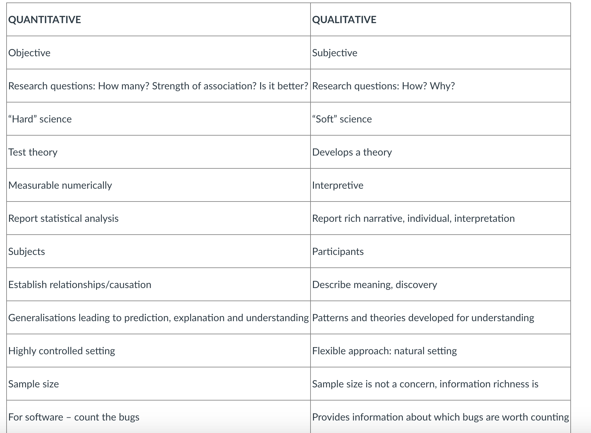
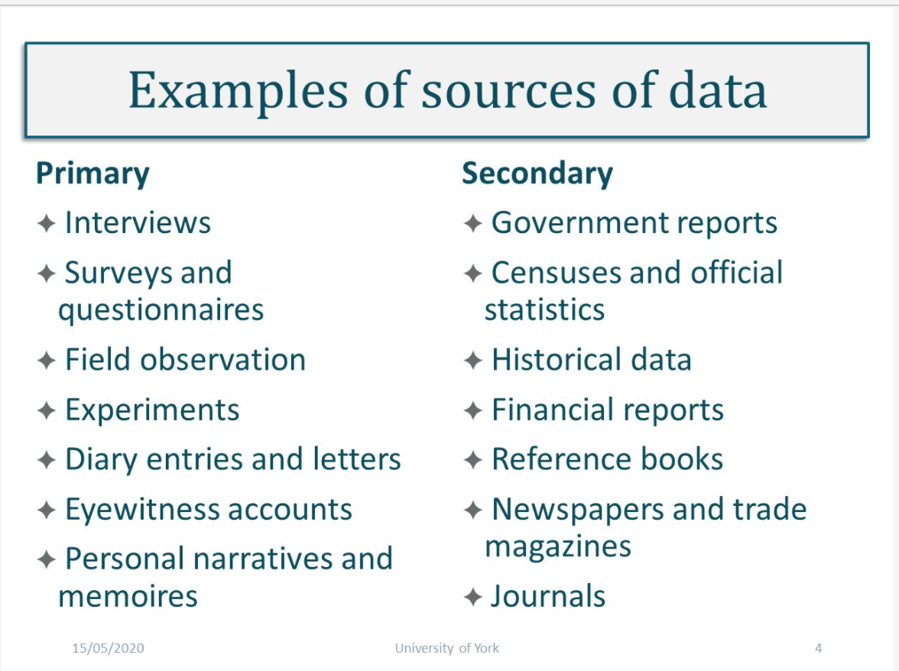
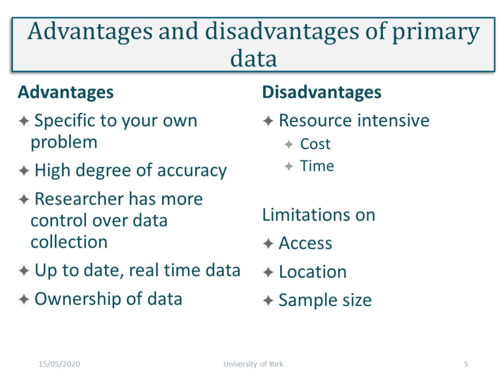
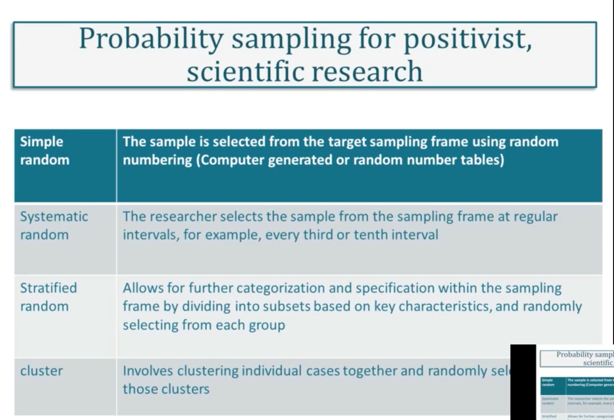
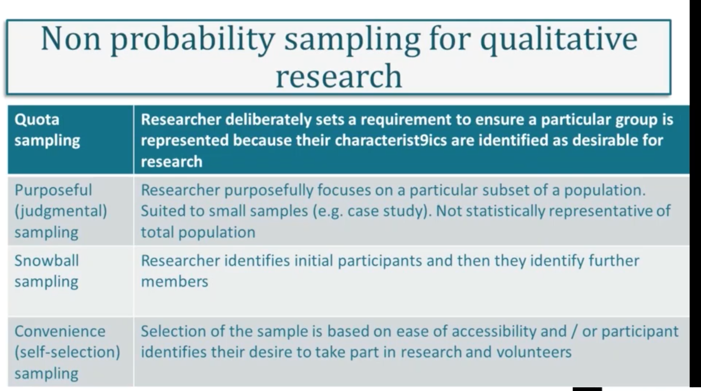
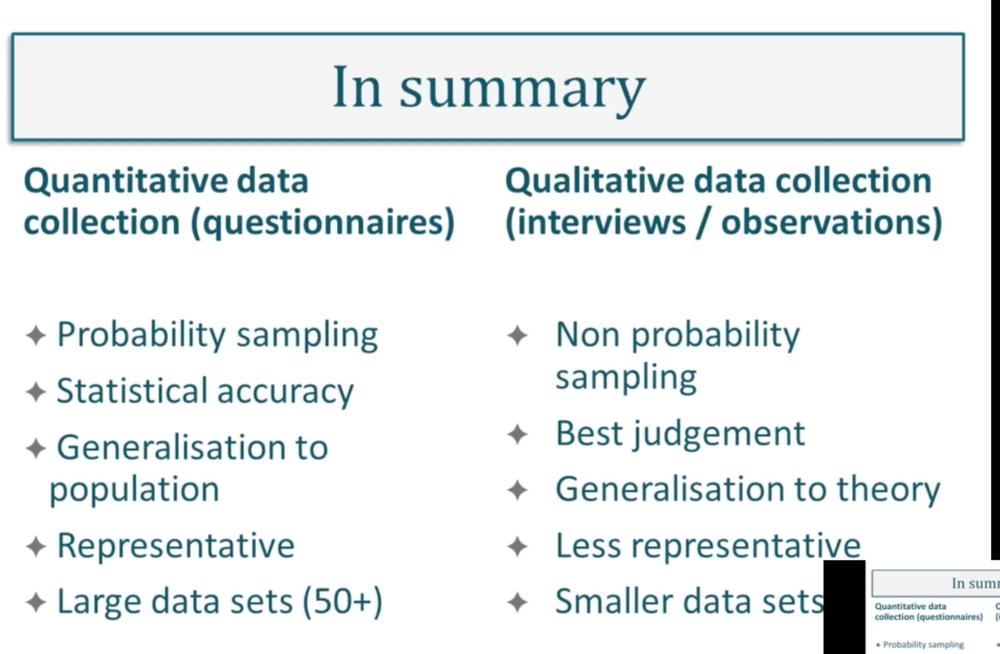
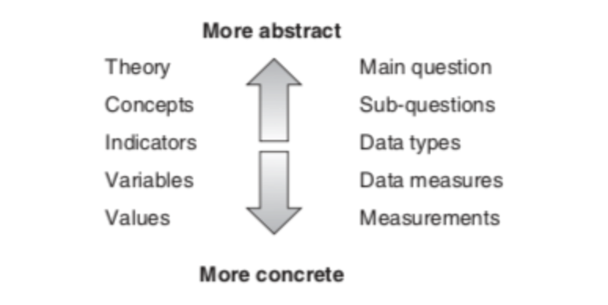

#### Main Topics

* quantitative research
* Develop an understanding of quantitative methods
* Debate appropriate use of variables
* Be aware of Computer Science research methods
* Argue the appropriate use of induction versus deduction

#### Sub titles:

* [Research Methods in Computer Science 2](#research-methods-in-computer-science)

# Research Methods in Computer Science

* There are a number of factors to consider when undertaking research in Computer Science, which in itself is a wide,
  multi-disciplinary field and is therefore open to interpretation. In the first instance you might need to consider:
    * What tools you will need to investigate, which techniques and what process you are going to implement
    * What social and cognitive processes are surrounding them?
    * How will you organise all of the tasks?
    * What assessment techniques are available to you?
    * Which assessment technique is appropriate to your study?

* When evaluating a study in computer science your study should have theoretical and analytical evidence included, which
  should be:
    * Theoretical/Analytical
        * Proof oriented, proving properties of abstract notions
        * Solve mathematical problems – coding theory/probability, graphical models
    * Empirical
        * Evidence orientated, extrapolated from observed phenomenon
        * Controlled experiments
        * Case studies
        * Survey research
        * Ethnographies
        * Action research
    * Empirical Investigations
        * Common tasks
        * Identify goals, questions and measures
        * Choose research method(s)
        * Planning, design and investigate
        * Data collection
        * Results
        * Validity considerations
        * Conclusions

 

## Methods for research in computer science

* Method
    * CS is mainly based on logic and mathematics. However, Computer Science can be characterised as an empirical
      discipline, programs can be seen as experiment and their structure and behaviours can be studied.
    * Academically speaking, "research" is the activity of systematic enquiry/investigation in a particular area, with
      the goal of discovering new knowledge.
* Experimental method
    * The experiments show what occurs from real world experiments and implementation.
    * This method is used in many fields in Computer Science like artificial neural networks, automatic theorem proving,
      natural languages, analysing performances and behaviours etc. In all experiments the results should be
      reproducible
* Simulation method
    * Simulation methods are used in CS as they allow for the investigation of systems that can be outside of the
      experimental domain, systems that are under construction or complex phenomena cannot be reproduced in a lab, ie
      astronomy, physics and economics, or virtual reality or artificial life.
* Theoretical method
    * The theoretical approaches to Computer Science are based on classical methodology since they are related to maths
      and logic.
    * some of the main techniques when dealing with problems are iteration, recursion and induction.
    * Theoretical CS is dedicated to design and algorithm analysis in order to find solutions or better solutions, such
      as performance issues,
        * for example. The CS methodologies try to define the limits of computation and the computational paradigm but
          can also help in finding new theories.

## Quantitative and Qualitative data

* **Quantitative**
    * based on meanings derived from numbers
    * collection results in numerical and standardised data
    * analysis conducted through use of diagrams and statistics
    * 'thin' abstraction or description from data
* **Qualitative**
    * based on meanings expressed through words
    * collection results in non-standardised data requiring classification into categories
    * analysis conducted through use of conceptualisation
    * 'thick' abstraction or description from data

* the next stage in the research process is to analyse it
    * Data analysis is the way we make sense of data – it is how we select, organise and interpret information and
      evidence in relation to our research question.
    * Data analysis techniques are specific tools that are used to organise, categorise and code data to find results
      from which we can draw conclusions.
* The data to be collected and its subsequent analysis should be decided in the early planning stage of any research
  proposal.
    * It isn't good to collect data without knowing what you are going to do with it.

# Types of data

* Primary or secondary data.
    * Primary data refers to the data that you go out and collect yourself in relation to your research study.
        * Original data collected from first hand
    * Secondary (second-hand) data is already exist and collected by others.
* These 2 can be distinguished by asking these questions:
    * Who collected?
        * Primary: collected by researcher
        * Secondary: collected by someone else
    * For what purpose?
        * primary data is collected for the specific research problem being studied and it is therefore highly relevant.
        * secondary data has been collected for other purposes, and might therefore have less relevance to your
          research.
    * How it was collected?
        * Primary data collection is a very involved process, whereas secondary data collection can be very rapid and
          easy.
        * secondary data collection is less resource intensive.
    * At what cost?
* Quantitative vs Qualitative
    * Numerical vs textual
    * Breadth vs depth
    * Objective vs subjective
    * Scientific vs interpretive
    * Deductive vs inductive

* Different types of data suit different research questions.
* Primary data tends to be more time and cost intensive than secondary data.
* Both primary and secondary data can be used within a research project.
* Data must be relavant to the research question
* Data is only usefull if completely analysed

 
 

## Sampling techniques

* Sampling is the process of selecting who or what to collect data from.
* Probability sampling techniques are essential to quantitative research as they ensure that the chance of selection
  from the identified target population is statistically relevant.
    * Used when researchers want to be able to make inferences from their sample and generalize from the results,
      probability sampling is most prevalent in survey and experimental based research strategies.
    * A key characteristic of probability sampling is that it is randomized, where individuals or cases within the
      sample have equal chance of being selected.   
       

* Non-probability sampling is an alternative approach to choosing who to speak to or what to observe in research that
  doesn't require generalization from statistically proven results or when the sampling frame is not immediately obvious
  or is difficult to identity.
   
   

## Concepts, Constructs and Variables

* Explanations require the development of concepts or generalisable properties or characteristics associated with
  objects, events, or people.
* A construct is an abstract concept that is specifically chosen to explain a given phenomenon.
    * A construct may be simple, uni-dimensional such as a cars' weight, or multi-dimensional such as a person’s
      communication skills, which may consist of several concepts such as the person’s vocabulary, syntax, and spelling.
* Variable and construct are sometimes used interchangeably.
    * Variables may be classified as independent, dependent, moderating, mediating, or control variables.
    * Variables that explain other variables are called independent variables
    * those that are explained by other variables are dependent variables
    * those that are explained by independent variables while also explaining dependent variables are mediating
      variables (or intermediate variables);
    * those that influence the relationship between independent and dependent variables are called moderating variables.

## Levels of abstraction

* Going from the general to the particular, from abstract to concrete:
    * Theory – abstract statements that make claims about the world and how it works
    * Concepts – building blocks of theory which are abstracts and cannot be measured
    * Indicators – phenomena which point to the existence of the concepts
    * Variables – components of the indicators which can be measured
    * Values – actual units of measurements of the variables
* Example
    * Theory – poverty leads to poor health
    * Concepts – poverty, poor health
    * Indicators – low income, poor living conditions, restricted diet etc
    * Variables of poor living conditions – levels of overcrowding, provision of sanitary conditions, vermin
      infestation, litter etc
    * Values of levels of overcrowding – number of people per room, surface area of living areas, number of dwellings
      per square mile etc.
       

## Quantitative Research statistics