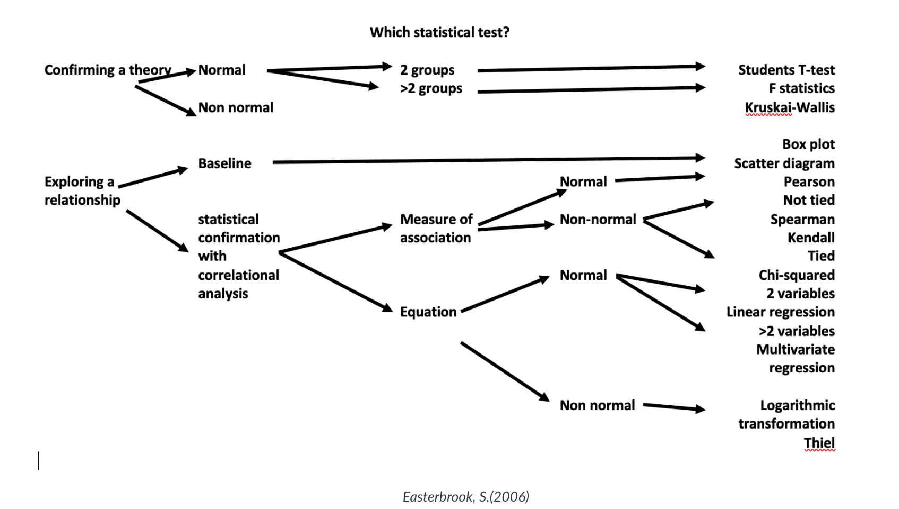

#### Main Topics

* quantitative research
* Develop an understanding of quantitative methods
* Debate appropriate use of variables
* Be aware of Computer Science research methods
* Argue the appropriate use of induction versus deduction

#### Sub titles:

* [Research Methods in Computer Science 2](#research-methods-in-computer-science)
* contiune to fix

# Research Methods in Computer Science

* There are a number of factors to consider when undertaking research in Computer Science, which in itself is a wide,
  multi-disciplinary field and is therefore open to interpretation. In the first instance you might need to consider:
    * What tools you will need to investigate, which techniques and what process you are going to implement
    * What social and cognitive processes are surrounding them?
    * How will you organise all of the tasks?
    * What assessment techniques are available to you?
    * Which assessment technique is appropriate to your study?

* When evaluating a study in computer science your study should have theoretical and analytical evidence included, which
  should be:
    * Theoretical/Analytical
        * Proof oriented, proving properties of abstract notions
        * Solve mathematical problems – coding theory/probability, graphical models
    * Empirical
        * Evidence orientated, extrapolated from observed phenomenon
        * Controlled experiments
        * Case studies
        * Survey research
        * Ethnographies
        * Action research
    * Empirical Investigations
        * Common tasks
        * Identify goals, questions and measures
        * Choose research method(s)
        * Planning, design and investigate
        * Data collection
        * Results
        * Validity considerations
        * Conclusions

 

## Methods for research in computer science

* Method
    * CS is mainly based on logic and mathematics. However, Computer Science can be characterised as an empirical
      discipline, programs can be seen as experiment and their structure and behaviours can be studied.
    * Academically speaking, "research" is the activity of systematic enquiry/investigation in a particular area, with
      the goal of discovering new knowledge.
* Experimental method
    * The experiments show what occurs from real world experiments and implementation.
    * This method is used in many fields in Computer Science like artificial neural networks, automatic theorem proving,
      natural languages, analysing performances and behaviours etc. In all experiments the results should be
      reproducible
* Simulation method
    * Simulation methods are used in CS as they allow for the investigation of systems that can be outside of the
      experimental domain, systems that are under construction or complex phenomena cannot be reproduced in a lab, ie
      astronomy, physics and economics, or virtual reality or artificial life.
* Theoretical method
    * The theoretical approaches to Computer Science are based on classical methodology since they are related to maths
      and logic.
    * some of the main techniques when dealing with problems are iteration, recursion and induction.
    * Theoretical CS is dedicated to design and algorithm analysis in order to find solutions or better solutions, such
      as performance issues,
        * for example. The CS methodologies try to define the limits of computation and the computational paradigm but
          can also help in finding new theories.

## Quantitative and Qualitative data

* **Quantitative**
    * based on meanings derived from numbers
    * collection results in numerical and standardised data
    * analysis conducted through use of diagrams and statistics
    * 'thin' abstraction or description from data
* **Qualitative**
    * based on meanings expressed through words
    * collection results in non-standardised data requiring classification into categories
    * analysis conducted through use of conceptualisation
    * 'thick' abstraction or description from data

* the next stage in the research process is to analyse it
    * Data analysis is the way we make sense of data – it is how we select, organise and interpret information and
      evidence in relation to our research question.
    * Data analysis techniques are specific tools that are used to organise, categorise and code data to find results
      from which we can draw conclusions.
* The data to be collected and its subsequent analysis should be decided in the early planning stage of any research
  proposal.
    * It isn't good to collect data without knowing what you are going to do with it.

# Types of data

* Primary or secondary data.
    * Primary data refers to the data that you go out and collect yourself in relation to your research study.
        * Original data collected from first hand
    * Secondary (second-hand) data is already exist and collected by others.
* These 2 can be distinguished by asking these questions:
    * Who collected?
        * Primary: collected by researcher
        * Secondary: collected by someone else
    * For what purpose?
        * primary data is collected for the specific research problem being studied and it is therefore highly relevant.
        * secondary data has been collected for other purposes, and might therefore have less relevance to your
          research.
    * How it was collected?
        * Primary data collection is a very involved process, whereas secondary data collection can be very rapid and
          easy.
        * secondary data collection is less resource intensive.
    * At what cost?
* Quantitative vs Qualitative
    * Numerical vs textual
    * Breadth vs depth
    * Objective vs subjective
    * Scientific vs interpretive
    * Deductive vs inductive

* Different types of data suit different research questions.
* Primary data tends to be more time and cost intensive than secondary data.
* Both primary and secondary data can be used within a research project.
* Data must be relavant to the research question
* Data is only usefull if completely analysed

 
 

## Sampling techniques

* Sampling is the process of selecting who or what to collect data from.
* Probability sampling techniques are essential to quantitative research as they ensure that the chance of selection
  from the identified target population is statistically relevant.
    * Used when researchers want to be able to make inferences from their sample and generalize from the results,
      probability sampling is most prevalent in survey and experimental based research strategies.
    * A key characteristic of probability sampling is that it is randomized, where individuals or cases within the
      sample have equal chance of being selected.   
       

* Non-probability sampling is an alternative approach to choosing who to speak to or what to observe in research that
  doesn't require generalization from statistically proven results or when the sampling frame is not immediately obvious
  or is difficult to identity.
   
   

## Concepts, Constructs and Variables

* Explanations require the development of concepts or generalisable properties or characteristics associated with
  objects, events, or people.
* A construct is an abstract concept that is specifically chosen to explain a given phenomenon.
    * A construct may be simple, uni-dimensional such as a cars' weight, or multi-dimensional such as a person’s
      communication skills, which may consist of several concepts such as the person’s vocabulary, syntax, and spelling.
* Variable and construct are sometimes used interchangeably.
    * Variables may be classified as independent, dependent, moderating, mediating, or control variables.
    * Variables that explain other variables are called independent variables
    * those that are explained by other variables are dependent variables
    * those that are explained by independent variables while also explaining dependent variables are mediating
      variables (or intermediate variables);
    * those that influence the relationship between independent and dependent variables are called moderating variables.

## Levels of abstraction

* Going from the general to the particular, from abstract to concrete:
    * Theory – abstract statements that make claims about the world and how it works
    * Concepts – building blocks of theory which are abstracts and cannot be measured
    * Indicators – phenomena which point to the existence of the concepts
    * Variables – components of the indicators which can be measured
    * Values – actual units of measurements of the variables
* Example
    * Theory – poverty leads to poor health
    * Concepts – poverty, poor health
    * Indicators – low income, poor living conditions, restricted diet etc
    * Variables of poor living conditions – levels of overcrowding, provision of sanitary conditions, vermin
      infestation, litter etc
    * Values of levels of overcrowding – number of people per room, surface area of living areas, number of dwellings
      per square mile etc.
       

## Quantitative Research statistics

# Descriptive and Inferential Analysis (Continue Week 4)

* There are two forms of quantitative data analysis
* **Descriptive statistics** - used to reveal patterns in the data, count frequency of occurrence in the data and show
  the distribution of variables within the data
    * Descriptive statistics are used to organise and describe data numerically, often through showing measures of
      central tendency (e.g. mean, median, mode) or data spread (e.g. standard deviation, range).
    * These help you to visualise or understand what data is telling you.
    * Frequency distribution: The frequency distribution of a variable is a summary of the frequency of individual
      values or ranges for that variable.
    * Central tendency: This is the estimate of the centre of the distribution of values. There are three main estimates
      of central tendency: mean, median and mode
    * Dispersion: Is the spread around the central tendency and two common measures are range and standard deviation.

* **Inferential statistics** - a more complex set of statistical tests used to analyse associations between variables,
  such as significance, correlation, probability and regression analysis. Each statistical test has a specific function
  and the selection of which one to use will depend on the hypotheses being investigated and the type of data that has
  been collected.
    * Inferential statistics allow researchers to draw conclusions from their data by testing hypotheses using
      statistical tests and by calculating estimates of clinical significance such as effect sizes or odds ratios.
* With quantitative research, the analysis must be considered at the early stages of planning.
* For these to run accurately, the data that is used must be ‘clean’, meaning that it contains no mistakes or errors
  that would skew or corrupt the statistical test. Data entry is, therefore, a job that needs to be given careful
  attention.

* **Analysis of Variance (ANOVA)**
    * Used when more than two group means are being tested simultaneously
    * Seeing if group means differ from one another on a particular score or variable
    * Test statistic = F-test
    * It is simple analysis of variance
    * Factorial-Design ANOVA is used when more than one factor is examined and multiple independent variables are used
      with one dependent variable and example being the 3x2 factorial design which has two variables which have three
      levels.Univariate analysis

* **Univariate Analysis**
    * This is the analysis of a single variable and refers to a set of techniques that can be used to describe the
      properties of this one variable. Univariate Analysis includes
        * Frequency Distribution
        * Central Tendency
        * Dispersion
* **Bivariate Analysis**
* This method examine show two variables are related to each others and is often referred to as 'correlation', a number
  between -1 and +1 denoting the strength of the relationship between the two variables.

# Statistical Inference

* Statistical inference is the process of using what you can observe to make an educated guess about something you
  cannot observe.
* In research, we infer beyond what we can see as we cannot possibly see all human behaviour. In an experimental
  situation, there are two sets of people:
    * **the sample** – the people from whom we take measurements;
    * **the population** – the infinite, unknowable, immeasurable set of people we want to learn something about.
* What inferential statistics lets us do is look at our sample and make inferences about how our experimental
  manipulations would work on the population if we were able to test everyone.

## Statistical Hypothesis testing

* This is a a method for proving a confidence about an answer.
* . The hypothesis is tested by using calculations for a quantity given some assumptions – it tests whether the
  assumption holds true or is incorrect.
* The null hypothesis or H0 is the default assumption (nothing has changed in the assumption).
* A violated or incorrect assumption is called hypothesis 1 or H1 for short.
* A statistical test may result in two common forms, **p-value and critical values**
* The **p-value** is the value returned from a hypothesis test – the value that can be used to interpret the result and
  accept or reject the null hypothesis. This is done by comparing the p-value to a value chosen beforehand.
* The **significance level** is represented by the Greek lower case letter alpha. A common value for this is 5% or 0.05
  to give a more robust interpretation of the null hypothesis.
* The p-value is compared to the pre-chosen alpha value and if it is less, meaning a change was detected, the null
  hypothesis can be rejected.
    * If p-value > alpha then do not reject the null hypothesis
    * If p-value <= alpha then reject the null hypothesis (significant result)
* The p-value is probabilistic so you can only know what is likely not what is true or false in this situation
* If the p-value is less than 0.05 or 5%, it means that we have a 5% chance of being incorrect in rejecting the null
  hypothesis or having a Type I error (the mistaken rejection of an actually true null hypothesis, a false positive).
* If p>0.05, we do not have enough evidence to reject the null hypothesis or accept the alternative hypothesis
* Standard error: Every sample has some level of error and if it is smaller than the sample mean, it is good.
* Confidence interval: A confidence interval displays the probability that a parameter will fall between a pair of
  values around the mean, ie mean +/- 3*stdev. A 95% CI means that you are 95% confident of the time that the parameter
  is within the two standard deviations.

## Understanding the practical significance

* Statistical significance is not always the same as clinical significance. Even if a result is statistically
  significant, we still need to consider clinical significance, because this tells us how important a study’s findings
  are likely to be in the real world.
* Efect Size: The effect size quantifies the difference between two or more groups.
    * Effect sizes are based on the mean and standard deviation of the outcome scores in each group and are often
      standardised so that differences across several different outcome measures with different units can easily be
      compared.
    * Effect sizes of 0.2 or below are usually considered small, effect sizes over 0.5 are medium and effect sizes over
      0.8 are large.
* Odds ratio: Similar logic with effect size: However, unlike an effect size, it is often used for categorical data and
  provides a more relative measure of effect.
    * The odds ratio will be 1, when outcome is same for each groups
    * If the odds ratio is less than 1 then it means the control group is better than the intervention.
* Confidence interval:  Confidence intervals are used to indicate the level of uncertainty around an effect reported in
  a research study.
* Estimating: means we are unlikely to measure exactly the right result
    * If we were to run our study lots of times, we might get a slightly different result each time. Confidence
      intervals help us to decide how much these different estimates are likely to vary.
    * By having an upper and lower confidence limit, we can show the range of values between which we think the true
      result lies

* Non-probablity samples
    * Convenience samples – samples that are readily available but that don’t necessarily represent a well-defined
      population.
    * Quota samples – samples that include sub-groups that are not randomly selected (e.g. making sure that a sample
      includes 50% each of female and male participants that come from a convenience sample.
    * Purposive (judgmental) samples – convenience samples of participants with pre-selected characteristics that are of
      interest to the researcher.
    * Respondent-driven (chain-referral) samples – there are several chain-referral techniques. First, we can find
      samples that result from key informants. Second, we could find a selection of participants who then recommend
      other participants who in turn recommend others, and the researcher contacts these other people. Third, we can
      find whereabouts the members of the group of interest congregate and sample them. Fourth, we can find participants
      who recruit further participants. In this technique, the researcher does not do the recruiting.

## Factors influencing the choice of a statistical test

* When choosing which statistical test to use you may reference:
   

* [York Statistik guide](https://subjectguides.york.ac.uk/maths-skills-centre/statistics)

# Hypothesis driven research

* You must have at least one control or independent variable and one dependent variable which is what you will measure
  although this variable may change – establishing if it does or not change is the point of the experiment.
* The independent variable is something you feel might cause a change in the dependent variable. Once you have chosen
  your independent variable, you can state your null hypothesis – this is the notion that any changes in your
  independent variable will not lead to significant change in your dependent variable.
* The hypothesis that changing the first variable does change the second is called alternative hypothesis.

## Errors

* There are two types of errors that can arise when testing a hypothesis,
    * Type I error – the researcher rejects the null hypothesis when it is correct – this is also called a false
      positive.
    * Type II error is when the researcher accepts the null hypothesis when it is false – also called a false negative.

* Random error
    * Factors such as noise can contribute to instrumental or random error – this can be eliminated completely by taking
      a sufficient number of independent measurements
    * Random errors have rules for reducing its consequences.
* Systematic errors
    * Make the measurements repeatedly and average the results together, while errors cannot be cured there is a process
      to catch many forms of systematic errors called calibration.
    * This may be down to faulty instruments. To counteract this the precaution is to use a certain value a standard
      before calibration.

# Quiz

* A variable whose value changes as a result of manipulation of some other variable is called the dependent variable.
    * dependent

* The variable manipulated by a researcher in an experiment is called the independent variable.
    * independent

* When researchers use existing data to create groups for comparison, the approach is known as
    * quasi-experimental

* An independent variable whose groups differ on a nominal scale is called a
    * qualitative variable

* Independent variables that change along a continuum are called
    * quantitative variables

* What are the ideal criteria for data that permit us to use parametric statistics in data analysis?
    * Suggested points:
        * (a) Equal sample sizes across groups
        * (b) Equal variances across groups
        * (c) Normal distribution of data

