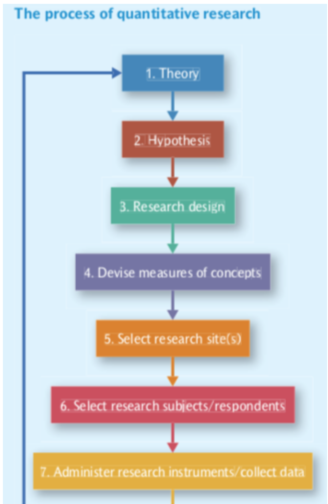
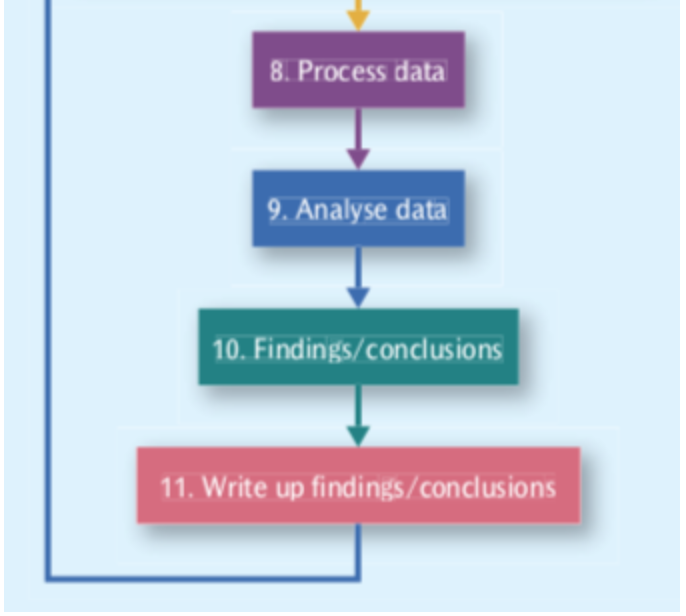
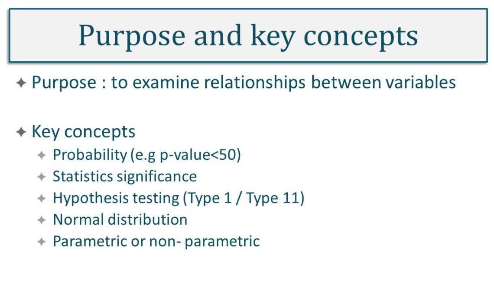
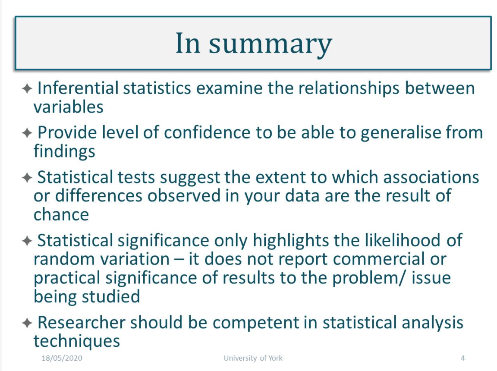

#### Main Topics

* Demonstrate an understanding of hypothesis testing
* Demonstrate the use of t-testing
* Articulate the difference between inductive and deductive research

#### Sub titles:

* [Quantitative research](#quantitative-research)
* [Types of Sampling](#types-of-sampling)
* [Inferential statistical](#inferential-statistical)

# Quantitative research

* Quantitative Research is based on closed questions and once the problem has been established it should not change.
* The checklist to assess the quality of the problem definition:
    * Is it researchable? Is the subject accessible? Is there a willingness to participate?
    * Is it relevant? Will the outcome be fit for the purpose of the stakeholders?
    * Is the project informative? Does the research generate new and fresh findings or does it just regenerate what we
      already know?
    * Is it reliable? Is the work consistent and does it generate the same results when it is repeated?
    * Is it effective? This effectiveness has two meanings - it can either apply to the way the research is being
      carried out, or it can apply to whether the research provides an effective answer to the original question.

* Developing a hypothesis plays an important role in QR.
* These are theoretical expectations that are met by empirical results gathered during the research activities.
* Ex post facto design is a quasi-experimental study examining how an independent variable, present prior to the study,
  affects a dependent variable.
    * Quasi-experimental simply means participants are not randomly assigned.
    * Both the true experiment, de facto, and ex post facto are attempting to say: this independent variable is causing
      changes in a dependent variable.
    * Ex post facto designs are different from true experiments because ex post facto designs do not use random
      assignment.

 
 

# Significance Testing

* A statistical result may be considered significant if it can be shown that the probability of it being rejected due to
  chance is 5% or less.
* This probability is called the p-value, 5% is called the significance level (α), and the desired relationship between
  the p-value and α is denoted as p≤0.05.
* The significance level is the maximum level of risk that you are willing to accept as the price of your inference from
  the sample of the population.
* If the p-value is less than 0.05 or 5%, it means that we have a 5% chance of being incorrect in rejecting the null
  hypothesis or having a Type I error (the mistaken rejection of an actually true null hypothesis, a false positive).
* If p>0.05, we do not have enough evidence to reject the null hypothesis or accept the alternative hypothesis
* Standard error: Every sample has some level of error and if it is smaller than the sample mean, it is good.
* Confidence interval: A confidence interval displays the probability that a parameter will fall between a pair of
  values around the mean, ie mean +/- 3 * standard deviation. A 95% CI means that you are 95% confident of the time that
  the parameter is within the two standard deviations.

# Types of Sampling

* Simple random samples – when the population is specified, we use some strategy for selecting participants without
  bias (e.g. each has a specified probability of being selected). It can involve random number tables, flipping a coin,
  or any other unbiased procedure.
* Systematic samples – when the population is specified and listed, the researcher selects every nth person (e.g. every
  10th, 25th, etc.) for participation
* Stratified random samples – when there are sub-groups of interest in the population, we may want to make sure they are
  included. We determine the proportion of the entire sample that should come from each sub-group and sample randomly
  from each one so that the proportions we desire are attained.
* Cluster samples – when simple random sampling might be difficult to carry out (e.g. potential participants are spread
  out geographically and it would be costly to do extensive traveling), we can break down the entire population into
  clusters and then choose clusters randomly.
* probability sampling - If a research project is set up so everybody in the population of interest has an equal chance of being included
  * The ability to generalize from the sample used in a research project to an entire population is one of the advantages of using probability sampling
* Quota sampling is a variation of nonprobability sampling.  
* stratified sampling - is counterpart in probability sampling 
* Purposive sampling involves using research participants from specifically identified subpopulations
* chain-referral sampling  - When researchers contact a single participant who leads them to other participants who, in turn, lead to even more participants,

# Inferential statistical

 
 
 

