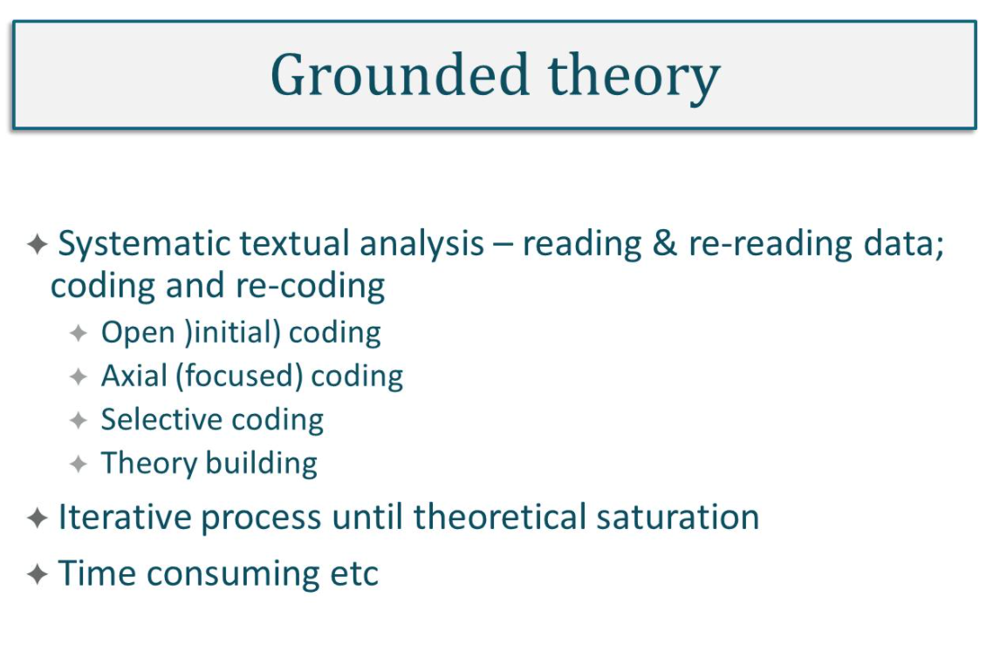

#### Main Topics

* Demonstrate an understanding of Thematic analysis technique for qualitative data
* Understand how to draw conclusions from your data
* Demonstrate a clear understanding of qualitative analysis methods

#### Sub titles:

* [Analysing and presenting qualitative data](#analysing-and-presenting-qualitative-data)
* [Thematic Analysing of qualitative data](#thematic-analysing-of-qualitative-data)
* [Drawing valid conclusions from research data](#drawing-valid-conclusions-from-research-data)
* [Quiz](#quiz)
* [Quality of research design](#quality-of-research-design)

# Analysing and presenting qualitative data

 
 
 
 

# Thematic Analysing of qualitative data

* Thematic analysis is a qualitative data analysis method that involves reading through a data set (such as transcripts
  from in depth interviews or focus groups), and identifying patterns in meaning across the data.
* Thematics Analysis is a foundational method of analysis in qualitative research and is often used by researchers who
  are less familiar with more complex types of analysis used in qualitative or quantitative research. I

* When should I use?
    * You want to identify patterns in data
    * You are new to qualitative analysis
    * You want to involve research participants in the analysis process

* Advantages of Thematic Analysis
    * Thematic analysis is a flexible approach to qualitative analysis that enables researchers to generate new insights
      and concepts derived from data. One of many benefits of thematic analysis is that novice researchers who are just
      learning how to analyze qualitative data will find thematic analysis an accessible approach.

* Disadvantages of Thematic Analysis
    * Because thematic analysis is such a flexible approach, it means that there are many different ways to interpret
      meaning from the data set. It can feel intimidating to interpret what data is or isn’t important to emphasize.
      Furthermore, since thematic analysis focuses on looking for patterns across interviews, phenomena that occur in
      only one individual account can be overlooked.

# Drawing valid conclusions from research data

* Drawing valid conclusions. Bullet points:
* Methodical approach:
    * revisit Research Purpose/Question
    * triangulate data sources
    * consider audience
    * draft conclusions
    * review and recognize limitations
    * close the conclusions
* Pitfalls to avoid:
    * don’t over interpret or under interpret the data
    * ensure report actual findings, not desired
    * avoid broad generalization from narrow data
    * avoid inconsistency in argument

* Cameron and Price (2009) suggest a logical and methodical approach to writing conclusions.

1. They first suggest you revisit the Research Purpose and Question: reflect back on the research purpose, make sure
   you’re answering the question, and use both to frame the conclusions which should, in turn, address each component
   part of the research question.
2. Triangulate your data sources – in qualitative and mixed method research, triangulation is the process of drawing
   data from all sources and cross referencing the findings from each to seek convergence and corroboration of results.
   It’s a way of ensuring data validity. All the data should be gathered together and checked for consistency and
   completeness.
3. And then you need to consider your audience – the conclusions drawn from the triangulated results need to be
   disseminated appropriately. Different stakeholders are likely to have slightly different expectations on the intended
   purpose of the research. Indeed, it is not uncommon for tailored reports to be issued separately to different
   stakeholder groups from a research project.
4. Draft your conclusions – the main argument presents the claims and/or assumptions being made directly supported with
   evidence from the data which leads unambiguously to logical conclusion. Where there are multiple findings, there
   needs to be a coherence within and between these different arguments and claims and there has to be a narrative flow.
   It’s almost like the overall story, connecting all the arguments and claims together.
5. Review and recognize the limitations of your research – at every stage in the conclusions, there should be clear
   evidence to support the claims being made; referring back to the data and checking the veracity of the argument is a
   good way to maintain the integrity of the data and to identify any limitations within it, for example with sampling,
   data collection or analysis or constraints placed on the research, for example, those relating to resources and time.
   These limitations should be acknowledged and any avenues for further research identified.
6. And, finally, close your conclusions – your final message should be focused, succinct and appropriate to the needs of
   the specific audience. There are pitfalls to avoid when producing robust conclusions, in particular when reporting
   data. Valid, credible conclusions are those that report data accurately, without over interpretation – i.e.
   stretching the feasibility of the findings to meet your desired outcomes and without under interpretation, where
   conclusions are too brief or weakened due to lack of supporting evidence or argument. Generalisation is relevant to
   large data sets with representative sample populations and should only be made when supported by the data.
   Inconsistencies or gaps in arguments need to be acknowledged and recognized to

# QUIZ

* Data collection that involves every member of the population of interest is called a
    * census

* Survey researchers choose to use samples from a population rather than conducting a census because
    * with large populations, you don’t need to survey everybody in order to get a good depiction of what the population
      is like

* If a researcher wanted to survey a population that had 100 million people, a good strategy for finding out about the
  population would be to
    * survey no more than about 1,500 people to get a good picture of the population

* The tendency to give the same rating on a survey to different questions, regardless of the content of the questions,
  is known as
    * non-differentiation

* A survey item on which respondents provide their own answers is
    * open -ended

* A survey item on which respondents must choose from a set of answers provided on a questionnaire is
    * a closed-ended question

* On a questionnaire that contained a question asking you to list risky activities in which you have engaged, such a
  question would

# Quality of research design

* Reliability and validity are central to judgements about the quality of research in the natural sciences and
  quantitative research in the social sciences.
* Reliability
* Reliability refers to replication and consistency. If the same or a different researcher is able to replicate a
  research design and achieve the same findings, then that research would be seen as being reliable.

* Validity
* Validity refers to the
    * Appropriateness of the measures used
    * Accuracy of the analysis of the results
    * And generalisability of the findings.

* Internal, aka measurement, validity refers to the extent to which your findings can be attributed to the intervention
  you are researching rather than to flaws in your research design.
* Criterion, aka predictive validity assesses if the questions are actually measuring what they are intended to measure.
* External validity is concerned with the question: can a study's research findings be generalised to other relevant
  contexts?
* Construct validity refers to the extent to which a set of questions actually measures the presence of the construct
  you intended them to measure.

* The methods described above are appropriate to assess quantitative research based on positivist assumptions. However,
  they are often considered philosophically and technically inappropriate in relation to qualitative research based on
  interpretive assumptions.
* Validation
    * Validation is the process of verifying research data, analysis and interpretation to establish their validity,
      credibility and authenticity.
    * Triangulation involves using more than one source of data and method of collection to assure the described above.
    * In a research study based on positivist assumptions, triangulation will help to reveal the reality in the data.
