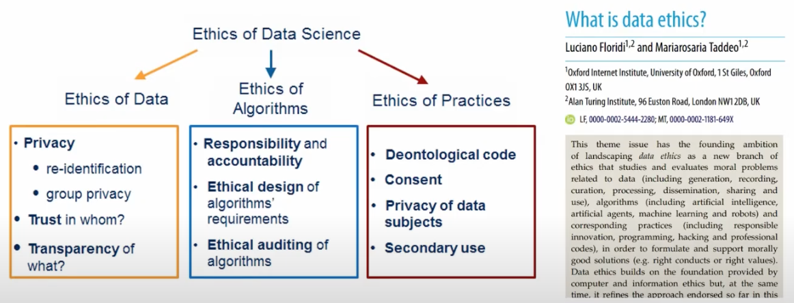
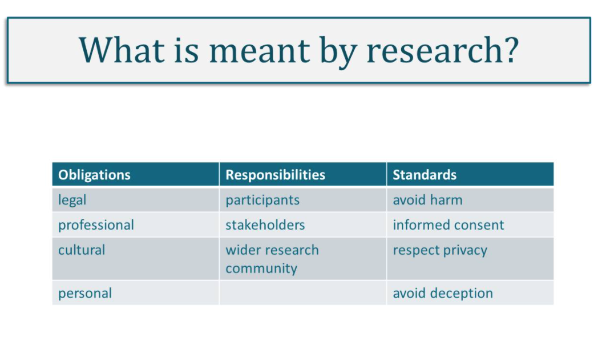
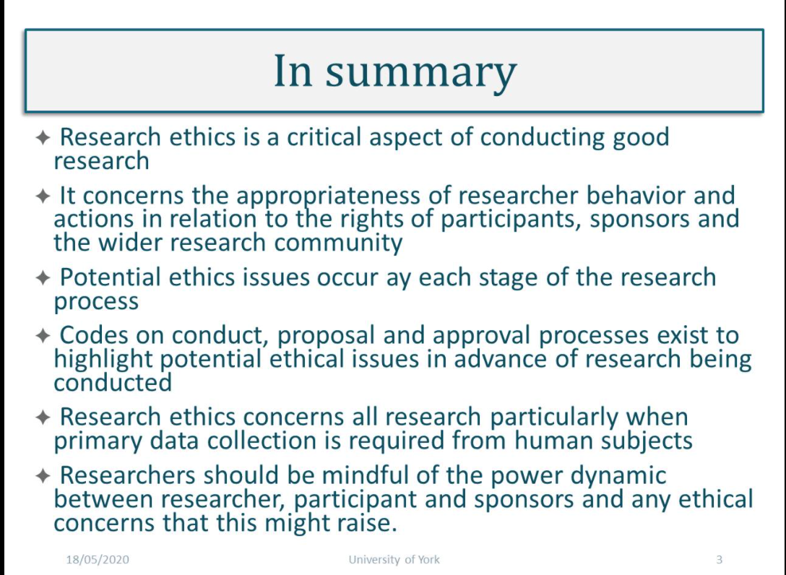

#### Main Topics

* Evalution
* validity and ethics in research
* evaluating good quality research
* reflexivity in research practice
* reviewing the research module

#### Sub titles:

# Validity & Ethics

* Research methods literature impresses upon us that research design must ensure that data, and subsequent results, are
  relevant, reliable, valid and credible. This is pertinent at all stages of the research process, from identifying a
  feasible research question, collecting relevant data appropriately, analysing data to elicit meaningful results and
  disseminating findings.

* Research ethics concerns conducting research in a responsibly and morally defensible way.
   
* Ethics is a set of values that guide what we do, and these values underpin our behaviours and actions and influence
  how we interact with, and treat, one another.

* 3 underpins for ethical practice
    * Obligations: legal, professional, cultural, personal
    * Responsibilities: participants, stakeholders, wider research community
    * Standards: avoid harm, informed consent, respect privacy, avoid deception.
       

* research ethics is a critical aspect of conducting good research.
    * it concerns the appropriateness of researcher behaviour and actions in relation to the rights of the participants,
      the sponsors and the wider research community
    * potential ethics issues can occur at each stage of the research process
    * codes of conduct, research proposal and approval processes exist to highlight potential ethical issues in advance
      of the research being conducted
       

* Research journey:
    * The following questions can be helpful prompts for reflection:
        * How did that go?
        * What was happening there?
        * How did I feel about it?
        * What might I have done differently?
        * What can I learn from this?
        * What didn’t ‘fit’?
        * Why was I surprised?
        * What was I expecting?
        * What was I thinking?
        * How did that affect how I acted?
        * How might I have thought differently?
        * What impact might that have had?