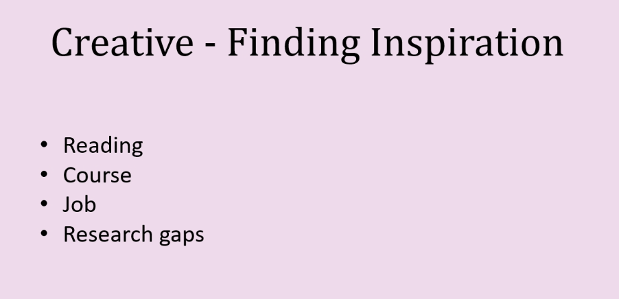

## MSC RESEARCH PROPOSAL Lesson Notes

This module is for MSC RESEARCH PROPOSAL lesson notes.

## Overview

# WEEK 1

# Intro

* The different types of computing projects identified by Dawson (2015) are as follows:
    * Research-based
    * Development
    * Evaluation
    * Industry-based
    * Problem solving

## The research process

* identify four common views of the research process: sequential, generalised, circulatory and evolutionary:
* Sequential:
    * Steps:
        1. Identify the broad area of study.
        2. Select a research topic.
        3. Decide on an approach.
        4. Plan how you will perform the research.
        5. Gather data and information.
        6. Analyse and interpret these data.
        7. Present the results and findings.
    * Greenfield breaks the research process into four steps:
        * Review the field – i.e., perform a literature survey.
        * Build a theory – based on your understanding and interpretations of the field.
        * Test the theory – does it work?
        * Reflect and integrate – i.e., update your ideas based on your ‘tests’ and contribute your newfound knowledge
          to others.
* Generalised: The generalised research process is identical to the sequential process in that a defined sequence of
  activities is performed one after the other.
* Circulatory. The circulatory approach recognises that any research is really only part of a continuous cycle of
  discovery and investigation. Quite often, research will un- cover more questions than it answers and, hence, the
  research process can begin again by attempting to answer these newfound questions.
* Evolutionary. The evolutionary concept takes the circulatory interpretation one step further and recognises that
  research must evolve and change over time, not necessar- ily following a defined circulatory pattern or repeating the
  same forms of analysis and interpretation that were performed before.

* Orna and Stevens (loc. cit.) identify the search definition as an attempt to answer the following questions:
    * ‘What am I looking for?’
    * ‘Why am I looking for it?’
    * ‘How shall I set about it?’
    * ‘Where shall I start looking?’

## Intellectual discovery

* When you are looking for questions to answer and answers to those questions, you will often follow a complex process
  of inductive and deductive reasoning.
* Inductive reasoning.
    * You start with your observations of the world and come to general conclusions about it. In other words, you build
      models and theories based on your interpretation of the world. Clearly, this interpretation will depend on the
      data and information you can draw from the world, the subject/problem you are studying and, importantly, what you
      already know and believe.
    * The knowledge that you can obtain from what you are studying is referred to as epistemology (Cornford and
      Smithson, 2006: 61). You can either draw general conclusions from what you observe and from what you are
      studying and apply them to other things (positivism), or you can only induce knowledge unique to yourself and the
      particular situation under study (anti-positivism).
* Deductive reasoning.
    * You start with your knowledge and understanding of the world and predict likely observations within it, even
      though you might not have encountered them before.
      Deductive reasoning is affected by your theory of reality, your own personal understanding of the world and your
      underlying assumptions about what you are investigating. This is referred to as ontology. Different people might
      deduce different things as their understanding differs from your own and they see things in different ways.
* If you are having difficulty solving a problem, two interesting methods of intellectual discovery listed by
  Greenfield (1996: 5) that might help are:
    * ‘The method of Pappus: assume the problem is solved and calculate backwards’
    * ‘The method of Terullus: assume a solution is impossible and try to prove why’

## Fields of study

* Research can be classified from three different perspectives; its field, its approach and its nature.
* "field" is a method to label groups of researchers with similar research interests. It is also referred to as an area
  of interest.
    * Applied computer science
    * Artificial intelligence
    * Computer architectures and hardware
    * Databases
    * Formal methods
    * Graphics and visualisation
    * Human computer interaction
    * Image processing, vision, pattern recognition
    * Information systems
    * Networking
    * Security and cryptography
    * Software engineering
    * Theoretical computer science
* "approach" is the term approach is used to refer to research methods that are used as part of the research process.
* Categories of the "nature":
    * Category 1: Pure theoretical development
    * Category 2: Research that reviews pure theory to ascertain its potential for practical application.
    * Category 3: Applied research that has in part practical application or outcome. Sharp et al (2002)

## Research topics and units of analysis

* `Research object’ - this is the topic or phenomenon from which you wish to generate knowledge. For the purposes of
  this module we will use the terms ‘topic’ or ‘phenomenon’ because in computer science, ‘research object’ is a term
  that is used to describe an aggregation of research on the web.
* The ‘Topic’ is used to describe/label the subject or subject matter you are concerned with. [2] Initially you will
  start with a broad topic which you will need to define more narrowly in order to ensure your project has a viable
  scope.
* While choosing topic you need to concider :
    * What phenomena are of interest in the field?
    * What are the main problems or topics of interest?
    * What are the boundaries of the field?
* How to develop a topic for your Research.
    * Specialist Themes: if you are in MsComputer Science with Data Analytics you need to choose a topic related with
      Data
    * Types Of Project:
        * Research-based
        * Development
        * Evaluation
        * Industry-based
        * Problem-solving
    * What makes a topic really good?
        * It is a topic that interests you
        * Make sure it is creative, not written about repeatedly
        * It is not too broad
    * 
    * 
* What is a good Research?
    * Open minds. You should work with an ‘open system of thought’. Be open minded to the questions posed. ‘Conventional
      wisdom and accepted doctrine . . . may turn out to be inadequate’.
    * Critical analysis. Examine data critically. Are these figures correct? Have they been affected in some way? What
      do these data really mean? Are alternative data available? Can these data be interpreted differently?
    * Generalisations. Researchers generalise and specify limits on the generalisations they identify. Generalisation
      allows research to be interpreted and applied to a wide variety of situations. However, researchers must know the
      limitations of these generalisa- tions. Generalisations stem from your own wisdom and evolve from your deductive
      reasoning which leads you to develop ideas about things you have not encountered before with certain caveats.

* Review of the Literature:
    * This literature review helps to determine whether the topic is worth studying, and it provides insight into ways
      in which the researcher can limit the scope to a needed area of inquiry.

## Clustering

* Dawson refers to three methods of clustering, as follows:
    * Research Territory Maps (RTM)/Affinity maps
    * Relevance tree
    * Spider diagram
* Clustering is a method of further defining your topic into related topics and links between them in the case of RTM’s.
* Or you can use a relevance tree to take a high-level thought process about a field and make it more specific.
* Although spider diagrams are similar to both of these in that they can provide a high-level diagram like an RTM they
  can also offer the opportunity to break down the topic like a relevance tree.

# WEEK 2

# Literature review: establishing relevance

# Research Process

* A literature survey will help you to justify your project, set your project context and provide an undertaking of how
  your project evolved. The latter helps if other researchers want to carry on with your research as they're able to see
  where you left off. Some may consider this stage as the foundation of your project. [1][2]
* The literature survey helps to develop the relevance of your possible topic. Your findings will help to establish the
  following key information about your topic:
    * Has it been researched before?
    * Is the topic important and, if so, to which fields of research?
    * What methodologies/methods have been used to study it before?

## Things to consider could include the following

1. The size of the research project (The final project has a time limitation)

2. Availability of the data

3. Depending on the project are there any ethics issues that would need addressing

4. What artifact will you produce in relation to the topic

5. Personally I would look at the topic that holds the most interest for you as you will be stuck with it throughout the
   final project.

### 2.3.1 Literature survey process

* **Price validation**:
* Topic: Developing a Time-Series Model Pipeline for Accurate Price Validation of Products
* Redefined Topic: Developing Pipeline to build Price Validator Service for Products by using deep learning LSTM Time
  Series Model.
* Known knows: Seasons can effect the demand of the products and change the prices. Merchants can make mistake to set
  prices and revert but this mistakes effect the consumers and leads the customers in wrong directions. ML can help to
  forecast the data by looking at historical data and prevent. A cloud base pipeline can hlp to build realtime price
  forecasting.

## Literature Research

* A literature search is a ‘systematic gathering of published information relating to a subject’ (University of Derby,
  1995). There are two important terms italicised within this state- ment that require further explanation.
* Systematic:  The first is systematic. A literature search should not be performed in an ad hoc manner, but should be
  approached in a structured and professional way.
    * However, remember that you will never actually stop literature searching as you might still be
      gathering/understanding material in parallel with the rest of your work to the conclusion of your project.
* Published: This implies that the material which you trace should be recognised.
    * sing only material from sources on the Internet (such as Wikipedia) will undermine the legitimacy of your project.
* **Golder Rules while performing a literature search:**
    * Allow plenty of time – it can, and probably will, take a long time. Therefore, you should start as soon as
      possible, avoid procrastinating (see Chapter 7) and steer clear of material unrelated to your chosen topic.
    * Ensure that you make note of the full reference of any material you obtain. This will save a significant amount
      of time at the end of your project because you won’t waste time trying to remember precise details of articles you
      have read but have since lost or returned to your local library. It is also important to avoid plagiarising the
      work of others (plagiarism). The full reference will also be needed if you wish to apply
      for inter-library loans.]
* While making research on internet:
    * Some points that you should consider when evaluating the quality of material on the Internet include (some of
      these points are adapted from Ohio State University Library, 2008):
        * What is the purpose of the site – is it to provide information or to sell a product?
        * When was the site updated? How up-to-date is the material on the site? Is it still relevant?
        * Is the site part of (or related to) an official organisation (a professional body, government department or
          academic institute or research group)? For example, the IEEE, the Project Management Institute, British
          Computer Society, etc.?
        * Are there any copyright issues associated with the material? Will you be able to use the material without
          breaching copyright?
        * Is there an author for the material? Is the author qualified to provide the information? Are they presenting
          opinions rather than facts? Are they biased?
        * Is the site recognised from other sources? Is it a recognised body? Are there other links to the site and is
          it reviewed anywhere?
        * Is the material biased? ‘Does the author have a “vested interest” in the topic’ or an axe to grind?

### Some tips for performing a literature search

We finish this section with a few tips on undertaking a literature search:

* Note interesting quotes and their full reference as you go along. This will be invalu- able later when you write your
  report and try to trace your references.
* Use review articles and books to help your search.
* Reference correctly from the start (covered in Chapter 8).
* Know when to stop – or at least when to move on to the next stage of your project. You will know this from your
  project plan and the research boundaries, which you have set yourself.
* Have a system to organise and catalogue the material you read. The following section provides a discussion on how to
  manage your information effectively.
* Read recognised leaders and original theorists in your field.
* Start with a broad search before you focus; don’t jump straight into the most complicated recent article on your
  subject. You may be put off by its apparent complexity.)

* **Managing Information:**
    * The best way to begin managing your research is by using the conceptual model you have created of your subject
      area (using your RTM, relevance tree or spider diagram). Use this model to identify the topics in which you are
      interested and how these topics link together.

## Critical Reading

* The main point of critical evaluation is that you **think** about what you are reading.
* Critical reading involves examining the evidence or arguments presented, identifying what may
  have influenced the evidence or arguments, understanding the limitations of a study, the design,
  the scope of the research, consider the interpretations made, and from these, you consider to
  what extent you may agree or disagree with the author.
* Sources:
    * Academic resources:
        * Experts in field
        * Journalist -peer reviewed
    * Common sources
        * Reading lists
        * Yorsearch
        * Google
        * Academic sources
        * Data sources
* **Evaluation Criteria**
    * A circle containing 8 key words in boxes equally spaced around its circumference:
        * Authority: who is the author? Not only that, are they an expert in their field?
        * Audience, who's the article written for ?
        * Purpose, for what purpose? What is presented? Is the argument valid?
        * Quality of the content, the research being done, the design
        * Content, The information that is being presented
        * Currency, is it current? Is it relevant?
        * Accuracy, are the arguments accurate?
        * Suitability, is it appropriate? These can be answered by a few simple questions - who
          is the author? What else have they published? Have they been cited by anybody? Where was it
          published? Is the journal peer-reviewed?
* **Evaluating Sources Activity.**
    * Taking the articles you have found, now ask yourself the following questions:
        * What is different about them?
        * What is similar about them?
        * What would make them valuable to you for your Research Proposal and your IRP
          assessment?
        * Can you foresee any problems with them?
          o What are their limitations?
* **Critical Reading questions.**
    * What does the author claim?
    * What are the arguments, and how does the author record their claims?
    * Are there any opposing arguments presented?
    * Is there any bias in the source?
    * What research method is used?
    * How does the author qualify the argument in the text?
* Example of critical analyse:
    * The research method and supporting evidence lack rigour which means the
      author’s argument and conclusion are unconvincing
* [Critical Reading](https://subjectguides.york.ac.uk/critical/reading)
* Rudestam and Newton (2007: 67–68) suggest some additional points which should be considered when reading and
  critically evaluating articles.
* They break their points down into five key areas: **Conceptualization, Theoretical Framework and Hypotheses, Research
  Design, Results and Discussion, Summary**.
* Those which supplement the points made above and are applicable for computing projects can be summarised as:
    * What is the major problem or issue being investigated?
    * How clearly are the major concepts defined/explained?
    * Is there a clear research question/hypothesis that can be, and is, tested?
    * What type of research design/methodology is employed? Is it suitable and reliable?
    * Have algorithms and statistical techniques been used appropriately? Can you apply them in your own work? What are
      the limitations of these techniques?
    * Is the choice of measures, sample sizes and data appropriate? Have extraneous factors/variables been considered?
    * Can generalisations be made from these results? What are the limitations of these generalisations?
    * Are the implications of the results discussed?
    * What is your overall assessment of the study – in terms of its adequacy for explaining
      the research problem and the contribution it is making?
* This critical reading is defined by Blaxter et al. (2006: 117) using a number of points, some of which are listed
  below.
* They define a critical reading as one that:
    * ‘goes beyond mere description by offering opinions, and making a personal response, to what has been written’;
    * ‘relates different writings to each other’;
    * ‘does not take what is written at face value’;
    * ‘views research writing as a contested terrain, within which alternative views and positions may be taken up’.

### SQR3 Model for critical reading

* SQR3 stands for survey, question, read, recite, review
* Survey :
    * I highlight the titles first
    * Looking for charts and highlight, clear to jumps up
* Question:
    * Write questions what I want to have this paper to answer
    * I can see how this author dis/agree with my previous thought process
    * What do I need to know ? What do I want to get from this?
* Read:
    * Read selectively and section a time
    * I might have stick notes and write what does this section is telling me ? (Read and put definition )
    * Continue this for all sections.
    * Then look back to your questions and answer them what you find in any section
        * And if it answers your any question you can write sticky that this section answers
* Recite:
    * keypart :  in your own words
    * you gonna praphrasing some of those elements to support you in your discussion, use them in your reasearch
    * You need to think how can you summarise this article with your own words
        * What you say about it?
        * What the information?
        * What is the keypoints?
    * Then looking at your questions and answer them orally, without looking notes, then you can be sure you understand
      the paper.
* Review:
    * Check your notes, are they clear? Could you answer your questions on them? Did you fond your questions answers? Do
      you have more questions?
    * Review again and answer and notes does it make sence
    * Look at your questions later next days and try to recall

## Writing Literature review

* identify the purpose of a literature review as, amongst other things:
    * to refine your research question and objectives;
    * to highlight research possibilities that have either been explicitly identified by other authors or have possibly
      been overlooked in the past;
    * to avoid repeating the work of others;
    * to identify research methods and strategies that may be usefully applied in your own research.
* There are no specific, infallible rules you can apply to write the perfect literature review.
    * Saunders et al (2007: 61) identify three common ways for presenting literature reviews:
        * as a single chapter;
        * as a series of chapters;
        * subsumed within the report as various issues are tackled.
* When writing your literature review remember what it is **NOT**:
    * It is not a report that lists all the papers and books you have read whether they are relevant or not. You must be
      selective about that to which you refer.
    * It must not dedicate a page or paragraph to each article in turn merely reporting on their content. Haywood and
      Wragg (1982: 2) refer to this as ‘the furniture sales catalogue, in which everything merits a one-paragraph
      entry no matter how skilfully it has been conducted’ (see Figure 5.6).
* Example – An artificial neural network approach to rainfall-runoff modelling
    * Notice how this introduction/literature review begins by justifying the content of the paper with reference to a
      WMO report.
    * It continues by showing how the subject area has evolved over the years.
    * Literature reviews often employ this kind of approach – focusing in on the topic of concern through a
      chronological discussion of
      literature in the field.
    * This approach generally leads to a natural focus on the topic of concern.
    * The review then moves on to explain a little bit more about the area of study, setting the scene for the reader,
      before focussing
      more precisely and discussing some recent developments in research within the field.
    * The literature review concludes by highlighting current limitations in the field, once again justifying the
      relevance and importance of the paper by showing how it aims to fill these gaps.
* Literature review should cover the following four points:
    * Arrange relevant literature in the field.
    * Critically evaluate past and current research in the field.
    * Identify your project within a wider context.
    * Justify the existence of your project by identifying a gap in the field and showing how your project will fill
      that gap (particularly important at research degree level).

# WEEK 3

# Research design

* Research methods:
* Experiments:
    * Characteristics:
        - Controlled manipulation of variables.
        - Random assignment of participants to groups.
        - Cause-and-effect relationships can be established.
    * Advantages:
        - High level of control over variables.
        - Can establish causal relationships.
        - Replication and generalization of findings are possible.
    * Disadvantages:

    - Artificial laboratory setting may lack ecological validity.
        - Ethical concerns with certain experimental manipulations.
        - Time-consuming and expensive to conduct.
* Quasi-experiments:
    * Characteristics:
        - Similar to experiments but lack random assignment of participants.
    * Advantages:
        - Allows studying variables that cannot be randomly assigned.
        - Can provide insights into real-world contexts.
        - Less time-consuming and costly compared to experiments.
    * Disadvantages:
        - Causal relationships are harder to establish.
        - Selection bias may affect results.
        - Limited control over extraneous variables.
* Correlational studies:
    * Characteristics:
        - Examines the relationship between variables without manipulation.
    * Advantages:
        - Can identify relationships between variables.
        - Allows prediction of one variable based on another.
        - Useful for studying naturally occurring phenomena.
    * Disadvantages:
        - Cannot establish causation.
        - Directionality and third-variable problems.
        - Difficulty in determining temporal precedence.
* Surveys, tests, and questionnaires:
    * Characteristics:
        - Collects data through self-report measures.
    * Advantages:
        - Efficient way to gather large amounts of data.
        - Can explore attitudes, beliefs, and behaviors.
        - Allows for standardized comparisons.
    * Disadvantages:
        - Response bias and social desirability effects.
        - Limited depth of understanding compared to qualitative methods.
        - Reliance on participants' accuracy and honesty.
* Case studies:
    * Characteristics:
        - In-depth investigation of a single individual, group, or phenomenon.
    * Advantages:
        - Provides rich and detailed qualitative data.
        - Allows exploration of complex and unique cases.
        - Useful for generating hypotheses and theory building.
    * Disadvantages:
        - Limited generalizability.
        - Potential for researcher bias and subjectivity.
        - Difficult to establish causality and control extraneous variables.
* Observational research:
    * Characteristics:
        - Systematic observation and recording of behaviors in natural settings.
    * Advantages:
        - Provides insights into real-life behaviors.
        - Can study phenomena that cannot be manipulated.
        - Allows for the examination of social interactions.
    * Disadvantages:
        - Observer bias and subjectivity.
        - Limited control over variables.
        - Ethical concerns when observing private behaviors.
* Longitudinal research:
    * Characteristics:
        - Study of the same participants over an extended period.
    * Advantages:
        - Captures changes and development over time.
        - Provides insights into stability and individual differences.
        - Allows examination of cause-and-effect relationships.
    * Disadvantages:
        - Time-consuming and resource-intensive.
        - Attrition and participant dropout.
        - Potential for practice effects and measurement biases.
* Archival research:
    * Characteristics:
        - Utilizes existing records and data for analysis.
    * Advantages:
        - Cost-effective and time-efficient.
        - Provides historical or large-scale data.
        - Can study long-term trends and patterns.
    * Disadvantages:
        - Limited control over data quality and validity.
        - Biased or incomplete records.
        - Potential for confounding variables and limited variables of interest.
* Qualitative research:
    * Characteristics:
        - Focuses on understanding meanings, experiences, and social phenomena.
    * Advantages:
        - In-depth exploration of complex social processes.
        - Captures subjective experiences and perspectives.
        - Generates rich and detailed data.
    * Disadvantages:
        - Limited generalizability.
        - Potential for researcher bias and subjectivity.
        - Time-consuming data collection and analysis.

# Research Questions and Hypothesis

* The first signpost is the purpose statement, which establishes the central intent for the study.
* The next would be the research questions or hypotheses that narrow the purpose statement to predictions about what
  will be learned or questions to be answered in the study

## Qualitative Research Questions

* These research questions assume two forms: (a) a central question and (b) associated subquestions.
* Ask one or two central research questions.
    * The central question is a broad question that asks for an exploration of the central phenomenon or concept in a
      study.
    * ask, “What is the broadest question that I can ask in the study?”
    * In qualitative research, the intent is to explore the general, complex set of factors surrounding the central
      phenomenon and present the broad, varied perspectives or meanings that participants hold.
* Ask no more than five to seven subquestions in addition to your central questions
* Relate the central question to the specific qualitative strategy of inquiry.
* Begin the research questions with the words **what** or **how to** convey an open and emerging design.
    * The word why often implies that the researcher is trying to explain why something occurs, and this suggests to us
      probable cause-and-effect thinking that we associate with quantitative research and that limits the explanations
      rather than opening them up for participant views.
* Focus on a single phenomenon or concept. As a study develops over time, factors will emerge that may influence this
  single phenomenon, but begin a study with a single focus to explore in great detail. We often ask, “What is the one,
  single concept that you want to explore?”
* Use exploratory verbs that convey the language of emerging design. These verbs tell the reader that the study will do
  the following:
    * Report (or reflect) the stories (e.g., narrative research)
    * Describe the essence of the experience (e.g., phenomenology)
    * Discover or generate (e.g., grounded theory)
    * Seek to understand (e.g., ethnography)
    * Explore a process (e.g., case study)
* Use these more exploratory verbs as nondirectional rather than directional words of quantitative research, such as
  affect, influence, impact, determine, cause, and relate.
* Expect the research questions to evolve and change during the study in a manner consistent with the assumptions of an
  emerging design. Often in qualitative studies, the questions are under continual review and reformulation (as in a
  grounded theory study)
* Use open-ended questions without reference to the literature or theory unless otherwise indicated by a qualitative
  strategy of inquiry.
* Specify the participants and the research site for the study if the information has not yet been given.
* Here is a typical script for a qualitative central question:
    * _________ (How or what?) is the _________ (“story for” for narrative research; “meaning of” the phenomenon for
      phenomenology; “theory that explains the process of” for grounded theory; “culture-sharing pattern” for
      ethnography; “issue” in the “case” for case study) of _________ (central phenomenon) for _________ (participants)
      at _________ (research site).
        * Example 1:  A Qualitative Central Question From an Ethnography
            * Study: Mac an Ghaill and Haywood (2015) researched the changing cultural conditions inhabited by a group
              of
              British-born, working-class Pakistani and Bangladeshi young men over a 3-year period. They did not
              specifically
              construct a research question, but we would suggest it as follows:
            * Question : What are the core beliefs related to ethnicity, religion, and cultural belonging of the group
              of
              British- born, working-class Pakistani and Bangladeshi young men over a 3-year time period, and how do the
              young
              men construct and understand their geographically specific experiences of family, schooling, and social
              life, as
              well as growing up and interacting within their local community in a rapidly changing Britain?
            * This question would have begun with “what,” and it would single out the central phenomenon—core
              beliefs—for the
              young men. The young men are the participants in the study, and, as an ethnography, the study clearly
              attempts to
              examine the cultural beliefs of these young Pakistani and Bangladeshi young men. Further, from the
              question, we
              can see that the study is situated in Britain.
        * Example 2: Qualitative Central Questions From a Case Study
            * Padula and Miller (1999) conducted a multiple case study that described the experiences of women who went
              back to school, after a time away, in a psychology doctoral program at a major midwestern research
              university. The intent was to document the women’s experiences, providing a gendered and feminist
              perspective for women in the literature. The authors asked three central questions that guided the
              inquiry:
            * Questions:
                * How do women in a psychology doctoral program describe their decision to return to school?
                * How do women in a psychology doctoral program describe their re-entry experiences?
                * How does returning to graduate school change these women’s lives?
            * These three central questions all began with the word how; they included open- ended verbs, such as
              describe, and they focused on three aspects of the doctoral experience—returning to school, reentering,
              and changing. They also mentioned the participants as women in a doctoral program at a midwestern research
              university.

## Quantitative Research Questions and Hypotheses

* Quantitative research questions inquire about the relationships among variables that the investigator seeks to know.
* They are frequently used in social science research and especially in survey studies.
* Quantitative hypotheses, on the other hand, are predictions the researcher makes about the expected outcomes of
  relationships among variables.
* They are numeric estimates of population values based on data collected from samples.
* Testing of hypotheses employs statistical procedures in which the investigator draws inferences about the population
  from a study sample
* Hypotheses are used often in experiments or intervention trials in which investigators compare groups. Advisers
  sometimes recommend their use in a formal research project, such as a dissertation or thesis, as a means of stating
  the direction a study will take
* Quantitve research question examples:
    * What is the frequency and variation of scores on ____________(name the variable) for ______________(participants)
      in the study?
* Example focused on examining the relationship among variables:
    * Does _________ (name the theory) explain the relationship between _________ (independent variable) and _________ (
      dependent variable), controlling for the effects of _________ (mediating variable)?
* Example a script for a quantitative null hypothesis might be as follows:
    * There is no significant difference between _________ (the control and experimental groups on the independent
      variable) on _________ (dependent variable).

* Guidelines for writing good quantitative research questions and hypotheses
    * The use of variables in research questions or hypotheses is typically limited to three basic approaches.
        * The researcher may compare groups on an independent variable to see its impact on a dependent variable (this
          would be an experiment or group comparisons).
        * Alternatively, the investigator may relate one or more independent variables to one or more dependent
          variables (this would be a survey that correlates variables).
        * Third, the researcher may describe responses to the independent, mediating, or dependent variables (this would
          be a descriptive study). Most quantitative research falls into one or more of these three categories.
    * The most rigorous form of quantitative research follows from a test of a theory and the
      specification of research questions or hypotheses that logically follow from the relationship among variables in
      the theory.
    * The independent and dependent variables must be measured separately and not measured on the same concept. This
      procedure reinforces the cause-and- effect logic of quantitative research.
    * To eliminate redundancy, write only research questions or hypotheses—not both—unless the hypotheses build on the
      research questions. Choose the form based on tradition, recommendations from an adviser or faculty committee, or
      whether past research indicates a prediction about outcomes.
    * If hypotheses are used, there are two forms:
        * **Null hypotheses:** A null hypothesis represents the traditional approach: It makes a prediction that in the
          general
          population, no relationship or no significant difference exists between groups on a variable. The wording is,
          “There is no difference (or relationship)” between the groups.
        * alternative hypotheses:
            * **Directional :**  The investigator makes a prediction about the expected outcome,
              basing this prediction on prior literature and studies on the topic that suggest a potential outcome.
                * For example, the researcher may predict that “scores will be higher for Group A than for Group B” on
                  the
                  dependent variable or that “Group A will change more than Group B” on the outcome.
                * These examples illustrate a directional hypothesis because an expected prediction (e.g., higher, more
                  change) is made
            * **Nondirectional hypothesis:** a prediction is made, but the exact form of differences (e.g., higher,
              lower, more, less) is not specified because the researcher does not know what can be predicted from past
              literature. Thus, the investigator might write, “There is a difference” between the two groups.
    * Unless the study intentionally employs demographic variables as predictors, use nondemographic variables (i.e.,
      attitudes or behaviors) as **mediating variables**. These are variables that “stand between” the independent and
      dependent variables.
        * Demographic variables are often used as **moderating variables** that affect the influence of the
          independent variable on the dependent variable. Because quantitative studies attempt to verify theories,
          demographic variables (e.g., age, income level, educational level) typically enter these studies as moderating
          variables instead of major independent variables.
    * Use the same pattern of word order in the questions or hypotheses to enable a reader to easily identify the major
      variables. This calls for repeating key phrases and positioning the variables with the independent first and
      concluding with the dependent in left-to-right order

* Example 7.3 A Null Hypothesis:
    * An investigator might examine three types of reinforcement for children with autism: (a) verbal cues, (b) a
      reward, and (c) no reinforcement. The investigator collects behavioral measures assessing social interaction of
      the children with their siblings. A null hypothesis might read as follows:
    * There is no significant difference between the effects of verbal cues, rewards, and no reinforcement in terms of
      social interaction for children with autism and their siblings.

* Example 7.4 Directional Hypotheses:
    * Mascarenhas (1989) studied the differences between types of ownership (state-owned, publicly traded, and private)
      of firms in the offshore drilling industry. Specifically, the study explored such differences as domestic market
      dominance, international presence, and customer orientation. The study was a controlled field study using
      quasi-experimental procedures
    * Hypothesis 1: Publicly traded firms will have higher growth rates than privately held firms.
    * Hypothesis 2: Publicly traded enterprises will have a larger international scope than state-owned and privately
      held firms.
    * Hypothesis 3: State-owned firms will have a greater share of the domestic market than publicly traded or privately
      held firms.
    * Hypothesis 4: Publicly traded firms will have broader product lines than state-owned and privately held firms.
    * Hypothesis 5: State-owned firms are more likely to have state-owned enterprises as customers overseas.
    * Hypothesis 6: State-owned firms will have a higher customer-base stability than privately held firms.
    * Hypothesis 7: In less visible contexts, publicly traded firms will employ more advanced technology than
      state-owned and privately held firms. (pp. 585–588)

* Example 7.5 Nondirectional and Directional Hypotheses
    * Sometimes directional hypotheses are created to examine the relationship among variables rather than to compare
      groups because the researcher has some evidence from past studies of the potential outcome of the study. For
      example, Moore (2000) studied the meaning of gender identity for religious and secular Jewish and Arab women in
      Israeli society.
        * H1(nondirectional): Gender identity of religious and secular Arab and Jewish women are related to different
          sociopolitical social orders that reflect the different value systems they embrace.
        * H2(directional): Religious women with salient gender identity are less socio-politically active than secular
          women with salient gender identities.
        * H3(directional): The relationships among gender identity, religiosity, and social actions are weaker among
          Arab women than among Jewish women.
* Example 7.6 Standard Use of Language in Hypotheses
    * There is no relationship between utilization of ancillary support services and academic persistence for
      nontraditional-aged women college students.
    * There is no relationship between family support systems and academic persistence for nontraditional- aged college
      women.
    * There is no relationship between ancillary support services and family support systems for non- traditional-aged
      college women.

## Preparing a project proposal

### Introduction

* When preparing your proposal, follow these two golden rules:
    * Follow any guidelines precisely. Most institutions require specific information; for example, project title,
      project objectives, resource requirements and so forth. Failure to complete these sections may mean your proposal
      is rejected without even being read, for example, because you failed to get an academic signature or did not
      complete an essential section properly.
    * Proofread thoroughly and get someone else to check it. Any errors or omissions will appear sloppy and put your
      commitment and proposed project in a bad light.

### Implicit content

* In general, your proposal should address five principal areas.
    * **Introduction to the subject area**. This will provide the reader with an understanding of the field in which
      your project lies and an idea of where and how your project fits into this field.
        * This aspect will set your project into an overall context and will show that it is bound within a recognised
          field – not an idea that you’ve had that makes no sense and has no recognisable foundation.
    * **Current research in the field.** This will emphasise that your project is not based in a field that is
      out-of-date
      and that you are aware of current issues within that field of study. It will also imply that you have done some
      preliminary research into the topic area and are not approaching your project with little background or
      motivation.
    * **Identify a gap.** You should be able to identify some aspect of the field that requires further investigation or
      study.
    * **Identify how your work fills the gap.** Having identified a gap in the field, your proposal should show how your
      project intends to fill this gap, or at least go some way to investigating it further. This will emphasise the
      contribution your project will make.
    * **Identify risks and solutions.** It is also useful in a project proposal to highlight any risks your project
      might face, and ways you envisage dealing with them.
        * If you do not identify potential risks to your project, your proposal’s assessor will not know whether you
          have considered the risks.

### Explicit sections

* project proposals should include.
* If you receive no guidance as to the content of your project proposal, include, at
  the very least, the first three of the following sections in your document.

#### Title

* This should be clear and concise. Try to avoid using acronyms if possible.
* Examples of clear and concise titles include:
    * ‘Evaluation of soft systems methods as analysis tools in small software houses’;
    * ‘Artificial neural networks for software development cost estimation’;
    * ‘Development of process models for building graphical software tools’.

#### Aims and objectives

* **Aims** identify at the highest level what it is you hope to achieve with your project – what you intend to achieve
  overall.
* **Objectives**, on the other hand, identify specific, measurable achievements that build towards the ultimate aim of
  your project. They are more precise than aims as they are ‘quantitative and qualitative measures by which completion
  of the project will be judged’ (Turner, 1993: 108).
* You will use your aims and objectives to assess your project at the end. For example, did you really achieve all that
  you set out to do? Because of this, aims and objectives should be clear and unambiguous
* Example:
    * Aim:
        * Evaluate artificial intelligence techniques for modelling weather patterns.
    * Objectives:
        * Identify and evaluate existing weather pattern modelling techniques.
        * Identify artificial intelligence approaches suitable for modelling weather patterns.
        * Design and develop at least three artificial intelligent systems for modelling weather patterns.
        * Compare and contrast the developed systems with one another and existing approaches to modelling weather
          patterns.

#### Expected outcomes/deliverables

* This section of your proposal will identify precisely what you intend to submit at the end of the project.
* It may well identify a written report that covers particular points and makes certain recommendations.
* It can describe programs and user documentation and it might include models and algorithms that will be developed to
  address specific problems. You might also be delivering a functional specification for a piece of software, a
  prototype, or a test plan.

#### Keywords

* Keywords are used to identify the topic areas your project draws on
* People use keywords to see at a glance what subjects your project relates to which might not be clear from your
  project’s title alone.

#### Introduction/background/overview

* This section provides an overview of your project and introduces the background work to it.
* In this section you might wish to include reasons why you feel you are a suitable candidate for performing the
  project (why you feel you can do
  it, what skills are required and how you fulfil these requirements), why the topic interests you specifically, and why
  you chose the project in the first place.
* This section might also include an introduction to the industry or organisation being investigated or evaluated.
  Overall, this section will set the
  scene for the project.

#### Related research

* This section identifies other work, publications and research related to your topic.
* It will demonstrate that your project does not exist in an academic vacuum but relates to other research topics and
  fields of current interest.
* Related research can also help demonstrate your understanding of your topic area, showing the reader that you are
  aware of what is currently happening in the field and are conversant with other topics that impinge upon it.

#### Type of project

* You might wish to identify the type of project you are undertaking, for example, research-based, development,
  evaluation, etc.
* However, make sure these terms are recognised and provide more detail if appropriate.

#### Research questions and hypotheses

* Your project proposal may also include the research question you intend to investigate and, hopefully, answer to some
  extent within your project.
* While research questions on their own are ‘open-ended opportunities to satisfy one’s curiosity’ (Rudestam and Newton,
  2005: 74), they are often linked closely with one or more hypotheses. A hypothesis is ‘a tentative proposition which
  is subject to verification through subsequent investigation’
* Although you do not have to define hypotheses alongside a research question, they do present potential ‘answers’ to
  the question(s) you have posed and provide definitive statements that will focus your research.

#### Methods

* This section describes the research and project methods you will use in performing your project. This section should
  not identify methods that you might be investigating as part of your project, but those methods you are actually
  using.
* It might include development methods that you are using as part of a systems development (for example, SSADM)
* Research methods would include those introduced in Chapter 2, such as action research, case study, survey and
  experiment.

#### Resource requirements

* You might need to identify any resource requirements for your project, such as hard- ware, software and access to
  particular computers
* If you have access to particular resources, this fact should be pointed out in this section.
* Note, if you are relying on an external source (a company, for example) for computer access, hardware, software, case
  studies and the like, it will be your responsibility to en- sure these are available and to bear any risk if the
  resources fail.

#### Project plan

* This emphasises that the project is ‘doable’ in the time allowed; it shows that you have some idea of the work
* involved and you have a clear pathway to follow in order to complete that work. The best way to present a project plan
  is by using a visual representation such as a **Gantt chart.**

### Reviewing your proposal

* 

* A project proposal should include, at least implicitly: 
  * background, 
  * related research, 
  * identification of a gap, 
  * how your project fills that gap 
  * and risks and contingency plans.
* Project proposals should include, at the very least, the sections 
  * project title, 
  * aims and objectives 
  * and expected outcomes/deliverables.