## MSC Software Engineering Lesson Notes

This module is for MSC Software Engineering lessons notes.

## Overview

- [Week-1](#week-1)
- [Week-2](#week-2)
- [Week-3](#week-3)
- [Week-4](#week-4)
- [Week-5](#week-5)
- [Week-6](#week-6)
- [Week-7](#week-7)
- [Books](/software-engineering/Books.md)

# WEEK 1

#### Main Topics

1) **Software Process Models** : <br>
   waterfall model to incremental, spiral, unified process, prototyping and agile development,

2) **Software design models** :<br> Unified Modeling Language (UML)

#### Sub titles:

* [What is software engineering?](#what-is-software-engineering)
    * [Lifecycle Methods](#lifecycle-methods)
        * [Waterfall](#waterfall)
        * [Waterfall with iteration](#waterfall-with-iterations)
        * [Incremental](#incremental)
        * [Prototyping](#prototyping)
        * [Iterative and incremental development](#iterative-and-incremental-development)
        * [Spiral](#spiral)
    * [Methodological Approaches](#methodological-approaches)
        * [Unified Software Development Process](#unified-software-development-process)
        * [Agile](#agile-development)
* [Agile Development](#agile-development)
* [Software Models in UML](#software-models-in-uml)
    * [Introduction](#introduction-to-unified-modeling-language-uml)
        * [Use Case Diagram](#use-case-diagram)
        * [Class Diagram](#class-diagram)
        * [Instance Diagram](#instance-diagram)
        * [Sequence Diagram](#sequence-diagram)
        * [Activity Diagram](#activity-diagram)
    * [Questions](#questions)

---

# What is software engineering?

**Software :**<br> The combination og programs and documentation, such as requirement models, design model, test
specifications, user manuals, maintenance manual

**Software Engineer:**<br>
Engineering discipline which is concerns all aspect of a software production (design, analysis, testing, operations and
programming )
and aims to develop high-quality of software systematic and organised manner.

* Software Engineering methods:<br>
    * development process (e.g. Waterfall)
    * techniques (e.g. Object-oriented analysis and design)
    * notations (e.g. UML)
    * case tools (e.g. Eclipse, Visual Paradigm)

**The importance of Software Engineering :**<br>
According to Sommerville Book (2016 pp.22-23). There are 2 reasons:<br>
> 1) Individuals and society increasingly rely on advanced software systems. We need to be able to produce reliable and
     trustworthy systems economically and quickly
>2) It is usually cheaper, in the long run, to use software engineering methods and techniques for software systems
    rather than just write programs as a personal programming project. Failure to use software engineering methods leads
    to higher costs for testing, quality assurance, and long-term maintenance.

**Some project activities :**<br>requirements, analysis, feedback, validation, design, implementation, verification,
delivery, support

## Lifecycle Methods:

**Software Processes :**
<br> Software processes are to organise the order of the software activities.<br>
From an abstract level :<br>
**_linear , Iterative , Parallel_**

</br>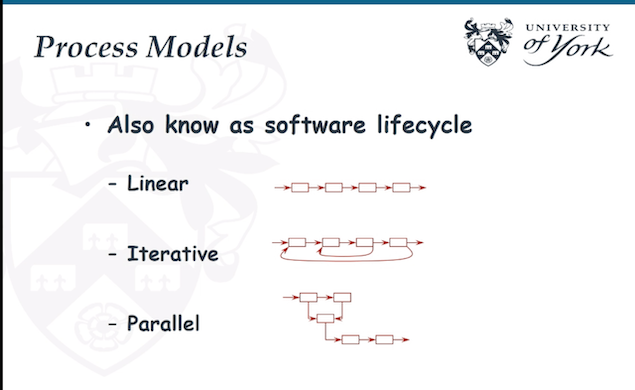

### Selecting appropriate life-cycle model

* Identify important factors that need to be considered when selecting an appropriate software project life-cycle
  model with brief justifications.
    * Nature of the organization (e.g. aviation vs. education)
    * Size and nature of the project (e.g. large/small, research vs. development project)
    * Funding (e.g. money)
    * Resources (e.g. personnel)
    * Type of application (e.g. online banking system vs. game)
    * Requirements uncertainty

</br>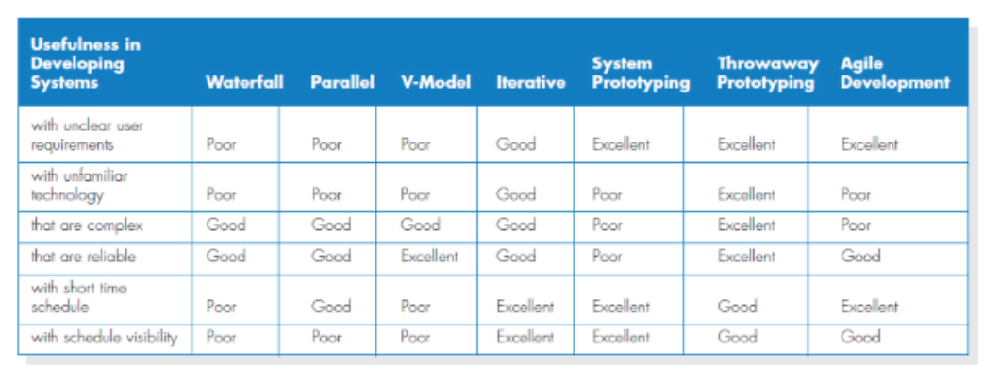

### WaterFall:

* Simple model
* Suitable for projects which have clean requirements. Suitable for projects requirements are stable and not likely
  change during development process, where less need got user involement.
* Documentation oriented.
    * Need to sign-off one or more documentation for each step.
    * The documents from the previous stage will be passed onto the next stage for the sake of communication.
* This will not allow you flow back in early stage of the project. Hard to make any changes during process.

_Process from - to:_

* **requirement** -> **design** -> **implementation** -> **verification** -> **maintenance**

</br>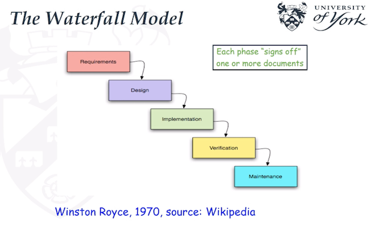

</br>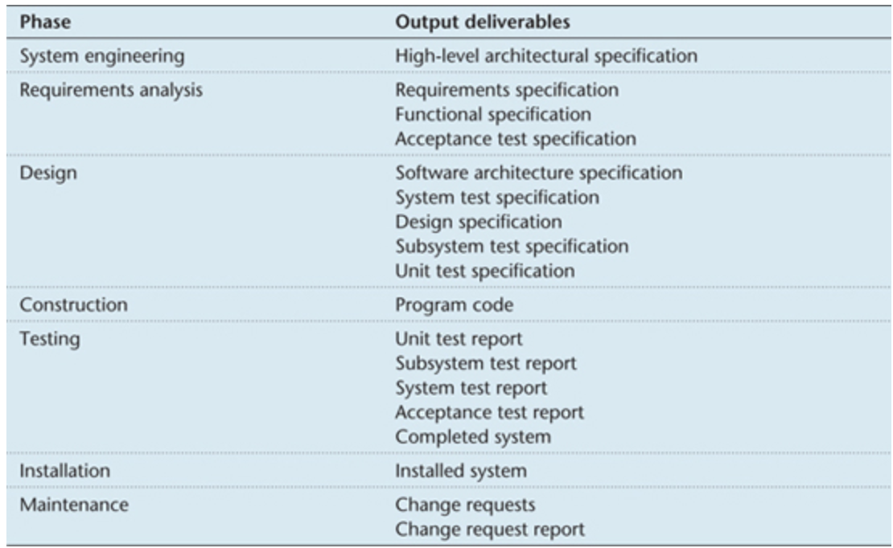

#### Pitfalls:

* Project phases can overlap and activities can have to repeated.
* That can be a great elapse between initial system requirements and the final version. Needs can change during this
  time and users can have a software which are suitable for yesterday needs but not the latest requirements.
* Not adapt to the technological developments and user requirements during the process. Sometimes to include the new
  technologies requires redoing whole structure from beginning.

### Waterfall with Iterations:

* Same as Waterfall process
* Not practical end effective in practice

</br>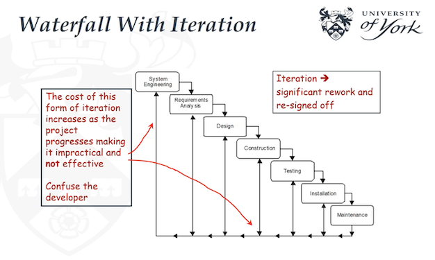

### Incremental:

* If you partly requirements, you can use incremental process.<br>
* You develop a part of functionality in each increment.<br>
* **Each increment is a small waterfall model**. <br>
* In each increment requirements are frozen before starting.<br>
* Changes in each increment can address for the next incrementation flow<br>

</br>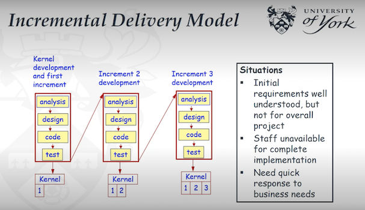

### Prototyping:

* Suitable for projects that has not clearly understood requirements, then repeated refinement of prototype maybe an
  effective way of producing the final system.
* Prototype is a partially complete software system
    * Not final working system- that the incomplete and less-resilient.
    * Lack of full functionally. May have limited data capacity
* Builds quickly to explore some aspect of requirements.
* Can discharged is not fit on needs.
* Commonly uses rapid development tools.
* Prototype can use for:
    * May be focus human–computer interface,
        * to understand what kind of data required from user or needs to provide to user
    * To investigate to find the most suitable interface for user.
    * To determine whether a platform can support the requirements or not.
    * To determine the efficacy of some technologies or the appropriateness of a technological choice
* Prototype is mostly used as part of other life-cycle models, for example spiral models.

</br>

Stages required to prepare a prototype are as follows.

* Perform an initial analysis:
    * Initial requirements should be the general requirements of the system, so that particular aspects can be
      identified.
* Define prototype objectives:
    * Should have clearly stated objectives. This helps to decide if they have been achieved.
    * Objectives of prototype should be agreed with user to prevent some misunderstanding what will be achieved.
        * Such as client can expct to delivery working solution at the end.
* Specify prototype:
    * Prototype is not the intent for the complete solution, but in any case important that have the requisite
      behaviour.
    * The approach to specification needs to be appropriate for the type of prototype.
        * Creating a user interface prototype will be different from to test some technical aspect prototypes.
* Construct prototype:
    * To use rapid development tools for prototypes can be important.
* Evaluate prototype and recommend changes:
    * When objectives are not meet, the prototype should evaluate.
* If the prototype is not completed, repeat the process from the specify prototype stage.

#### Advantages:

* Early demonstrations of system functionality help identify any misunderstandings between developer and client.
* Client requirements that have been missed are identified.
* Difficulties in the interface can be identified.
* The feasibility and usefulness of the system can be tested, even though, by its very nature, the prototype is
  incomplete.
* Can also used to explore other aspects of the system. e.g feasibility

#### Pitfalls:

* The client may perceive the prototype as part of the final system, may not understand the effort that will be required
  to produce a working production system and may expect delivery soon.
* The prototype may divert attention from functional to only interface issues.
* Prototyping requires significant user involvement, which may not be available.
* Managing the prototyping lifecycle requires careful decision making.

### Iterative and incremental development.

* Iterative development may result incremental delivery.
    * some approach on increments can be only for internal release to development team not for external release to the
      client
* In iterative approach:
    * The project has some series of development activities that are repeating.
    * Each repetitions is an iteration that is a mini-project which is working solutions.
    * Iterative development is less concerned with tracking the progress of individual features. Instead, focus is put
      on creating a working prototype first and adding features in development cycles where the Increment Development
      steps are done for every cycle. Agile Modeling is a typical iterative approach.
* Incremental approach:
    * Starts with some initial requirements to scope the problem and identifies major requirements.
    * Requirements are to deliver most benefit to the client and selected to focus the first increment of development to
      delivery.
    * Each incrementation gives feedback to the developers also for the next increments.
    * Each increment is the part of the final delivered solution and can include all artifacts, such as documentation
      and working solution.
    * Incremental development is done in steps from design, implementation, testing/verification, maintenance. These can
      be broken down further into sub-steps but most incremental models follow that same pattern. The Waterfall Model is
      a traditional incremental development approach.
* Many current approach are categorized as iterative and incremental approach for:
    * Iteration -> nature of development process
    * Incrementation -> nature of system delivery

</br>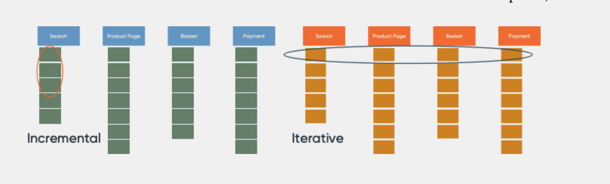

### Spiral:

Boehm's Spiral model (1988):

* Risk-reduction model
* Supports incremental delivery.
* Prototyping may be used during risk analysis or software development.
* Mostly suitable for project with a number of risks e.g. unclear requirements or technical uncertainties

#### Advantages:

* Risk reduction: reduce the risk to fail the project.
* Functionally can be added in another phase, because it is iterative nature of the process
* Software produce early: at the each iteration we have something to show for our development and we can get feedback
  earl from users.

#### Pitfalls:

* Specific expertise: Risk analyse require highly specific expertise.
* Highly depend on risk analyse: Risk analyse has to be right.
* Complex: can be costly to implement.

</br>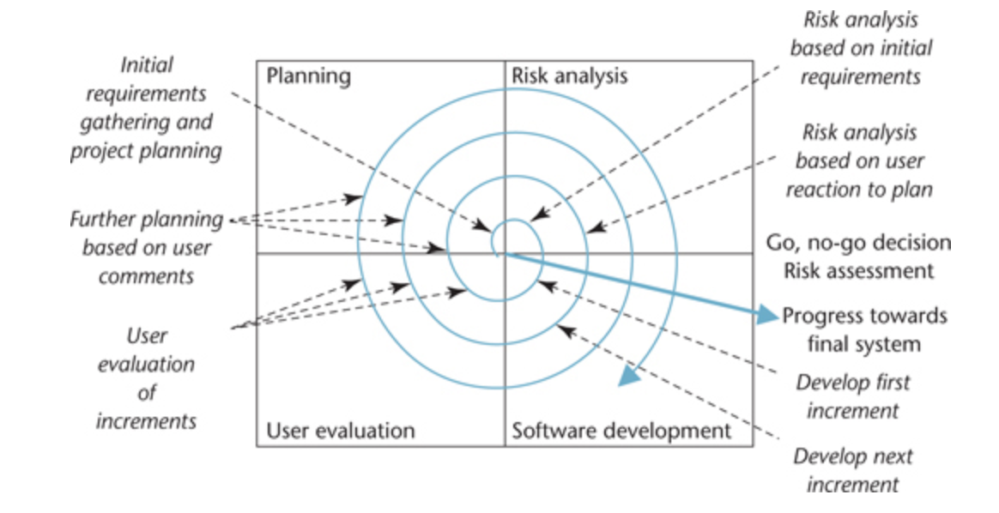

## Methodological Approaches

* A Methodology contains:
    * an approach to software development
    * a set of techniques and notations that support the approach
    * a lifecycle model to structure the development process
    * a unifying set of procedures and philosophy
* A methodological approach is a coherent and consistent systematic approach to development.
* For example, RUP is an object-oriented methodology that uses UML and follows an iterative and incremental lifecycle.
* A Responsibility Assignment Matrix (RAM) is useful to assign roles and responsibilities for a project. An example of
  defined roles are;
    * Responsible, ie the application development role builds the software increments.
    * Accountable, the role that is accountable for the completion of the task.
    * Consulted, the role whose opinions are sought.
    * Informed, the role that is kept up to date on progress.

### Unified Software Development Process

* Unified Software Development Process (USDP) is a single common methodological approach for object-oriented software
  development by bringing together best practice in the 1990
* USDP reflected the emphasis in the 1990s on iterative and incremental lifecycles.
* Related to object-oriented (OO) development and the Unified Modelling Language (UML).
* Key aspects:
    * **Use-Case driven**
    * Architecture centric
    * Iterative and Incremental
* A development cycle for the USDP is comprises four phases.
    * **Inception** is concerned with determining the scope and purpose of the project. _Focuses on the scope the
      project_.
    * **Elaboration** focuses on requirements capture and determining the structure of the system. _Focus requirements._
    * **Construction**’s main aim is to build the software system. _Focus implementation_
    * **Transition** deals with product installation and rollout. _Focus deployment_

</br>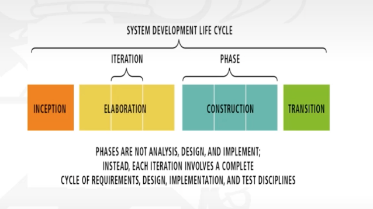

* Combines many best practices:
    * Iterative
    * Manage requirements (e.g. use cases)
    * Visually model software (e.g. UML)
    * Control changes to software (e.g. seamless of OO, round trip engineering)
    * **Verify software quality (e.g. testing is part of the development process)**

* It also controls changes smoothly due to the seamless of object-oriented development and round-trip engineering.
    * Seamless object-oriented development means the same class model is used in the analysis, design and implementation
      stage so you can synchronise them via round trip engineering, for example you can generate a design from the
      program code.

</br>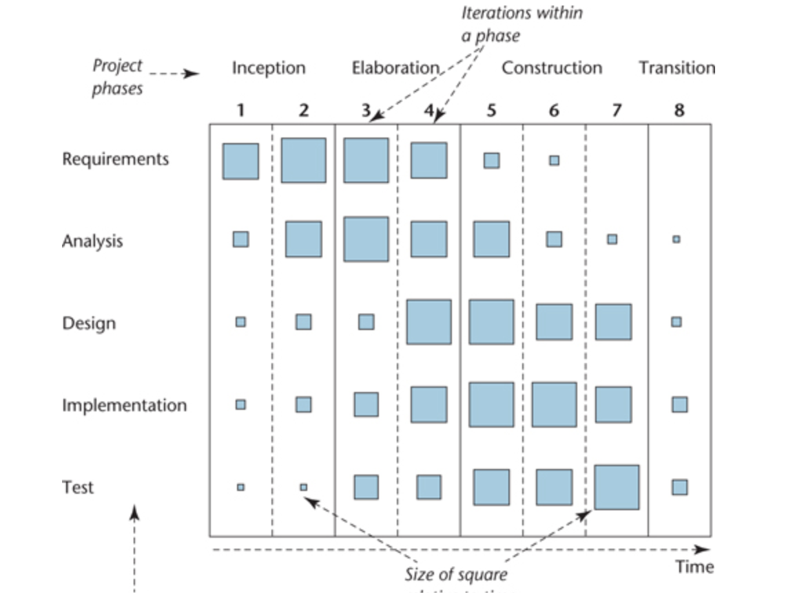

# Agile Development

Agile:<br>

* Agile has incremental development methods
* Involve customers in development process to get rapid feedback on changing requirement
* Minimise documentation by using informal communication rather than formal meetings with written documents.
* This agile approach was developed for software developed small and medium-sized business system.
* Successful in these 2 kind of system: (Why? because it is possible to have continues communication between clients and
  teams )
    * Product development where a software company is developing a small or medium-sized products
    * In an environment which customer can involve in the development process and few external stakeholders and
      regulations effect the system.
* Three instances of agile methods given in the text:
    * Extreme Programming (Beck 1999),
    * Scrum (Schwaber and Beedle 2001),
    * DSDM (Stapleton 2003).

## Plan-driven software development process

* Plan-driven software development process is working with specific requirements then design, build, test.
* Not rapid development process
* If there is an update require in requirements, it is redesigning and retesting
* Waterfall is an example
* This plan-driven approach was developed for software developed by large teams, working for different companies.

## Common Characteristics of agile methods

* The processes of specification, design and implementation are interleaved. There is no detailed system specification,
  and design documentation is minimized or generated automatically by the programming environment used to implement the
  system. The user requirements document is an outline definition of the most important characteristics of the system.
* Incremental development. Stakeholders and end-users are involved in evaluating each increment. They may propose
  changes to the software and new requirements that should be implemented in a later version of the system.
* Extensive tools are using to support the development process:
    * Automated Testing tools
    * Tools to support configuration managment
    * System integration
    * Tools to automate user interface production.

</br>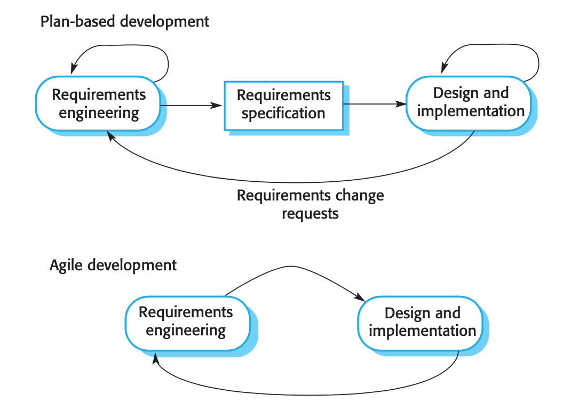

## Essential distinction between plan-driven and agile approaches

Essential distinction to system specifications:

* Plan - driven process : Require a formal documentation to communicate between stages of the process.
    * For example; after requirements get ready then design and implementation process starts and output of requirement
      process are getting input for the next step
* Agile: The requirements and the design and implementation are developed together rather than seperated.

## Core values for agile development

* Individuals and interactions over processes and tools
* Working software over comprehensive documentation
* Customer collaboration over contract negotiation
* Responding to change over following a plan

</br>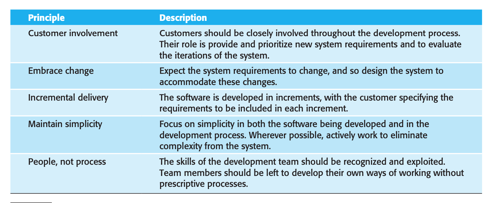

## Agile development techniques

### Extreme Programming (XP)

* Requirements are expressed as scenarios (called user stories), which are implemented directly as a series of tasks.
* Programmers work in pairs and develop tests for each task before writing the code. All tests must be successfully
  executed when new code is integrated into the system. There is a short time gap between releases of the system.
* These are very light weight planning and design phases.
* **Focus is on the software: coding and testing.**
* The overall process is iterative and incremental.
* Reflection the principles of agile manifesto:
    * Requirements are based on simple customer stories or scenarios to decide which functionality should implement.
    * The customer representative take a part during development and responsible to define the acceptance test.
    * Pair programming
    * Benefits:
        * Regular system release
        * Test first approach
        * Refactoring
        * continuous integration
    * Maintaining simplicity by refactoring and simple design XP practices:<br>
      </br>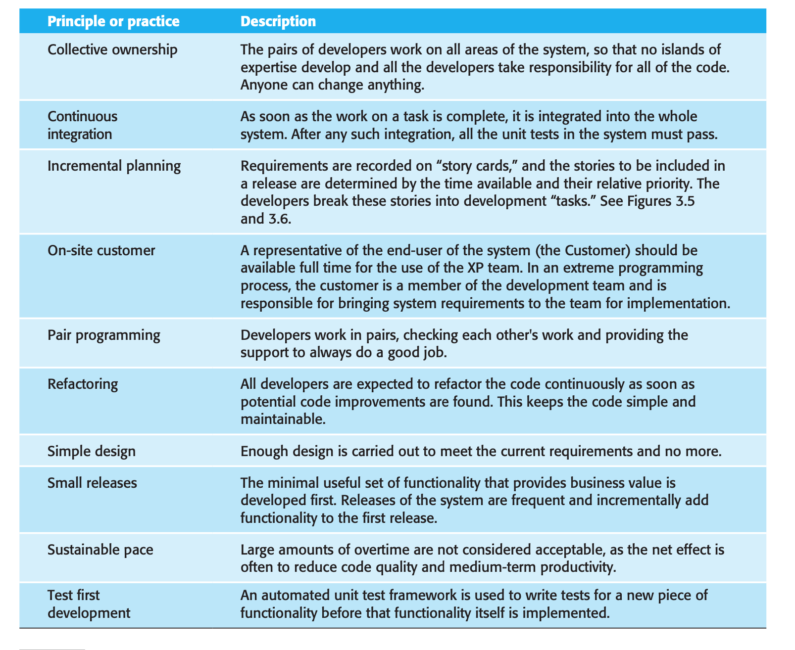

### User Stories:

* A scenario of use that might be experienced by a system user. (A short description of a software feature from an
  end-user perspective)
* Customer works with development team to create user stories
* max 3 sentences long
* Customer decide the priority,
* Implementation should be less than 2 weeks.
* Can be added, deleted and modify
* Problem is completeness : hard to cover all essential func for system.

### Design

* Output: Class-responsibility-collaboration (CRC) card and prototypes are necessary.
* Occurs continuously as coding through refactoring.
* KISS principle

</br>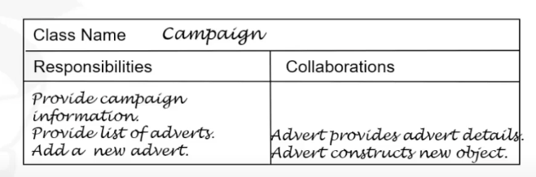

### Refactoring

* Refactoring means that the programming team look for possible improvements to the software and implements them
  immediately.
* Improves the software structure and readability, helps to prevent structure from deterioration
* When refactoring is part of the development process, the software should always be easy to understand and change as
  new requirements are proposed

### Test-First Development

* Testing is automated and center to the development
* Development can not proceed until all test have been successfully executed.
* Write the tests before coding. TDD(Test Driven Development)
* Require a clear relationship between requirements and code implementation with tasks.
* The role of the customer to help to develop and run acceptance tests.
* Test automation is essential.
    * Automated test frameworks helps to write easily executable tests and submit set of tests.
* Basic cycle
    * Add a test
    * Run all tests an check the new one fails
    * implement the code to satisfy the functionalty
    * Check that new test success
    * Run all tests again to avoid regression
    * Refactor code

### Pair Programming

* Pairing and coding together in development process.
* Advantages:
    * Collective ownership and responsible for the system.
    * Acts as an informal code review, because looked by at least 2 people. This discovers bugs more quickly than
      individual testing.
    * Encourage the refactoring and improve software structure. This reduces maintenance costs.
    * Information sharing in pair programming is implicit. Reduce the overall risk to project when team member leaves.

### Agile Project Management

Scrum :

* Follows agile manifesto and principles, but some practices are not mandatory such as test driven development and pair
  programming.
* Meetings:
    * Daily Meeting: During sprint Team members are doing every day.
    * Review: Demonstrate what they did during sprint to the stake holders
        * It is a means of process improvement. The team reviews the way they have worked and reflects on how things
          could have been done better.
        * It provides input on the product and the product state for the product backlog review that precedes the next
          sprint.

* Benefits:
    * Project broke down set of manageble parts that stake holders can relate to.
    * Improve visinility and communication between team members.
    * Customers see the development incremently and give feedback
    * Improve trust between customer and team.

Scrum Roles:<br>
</br>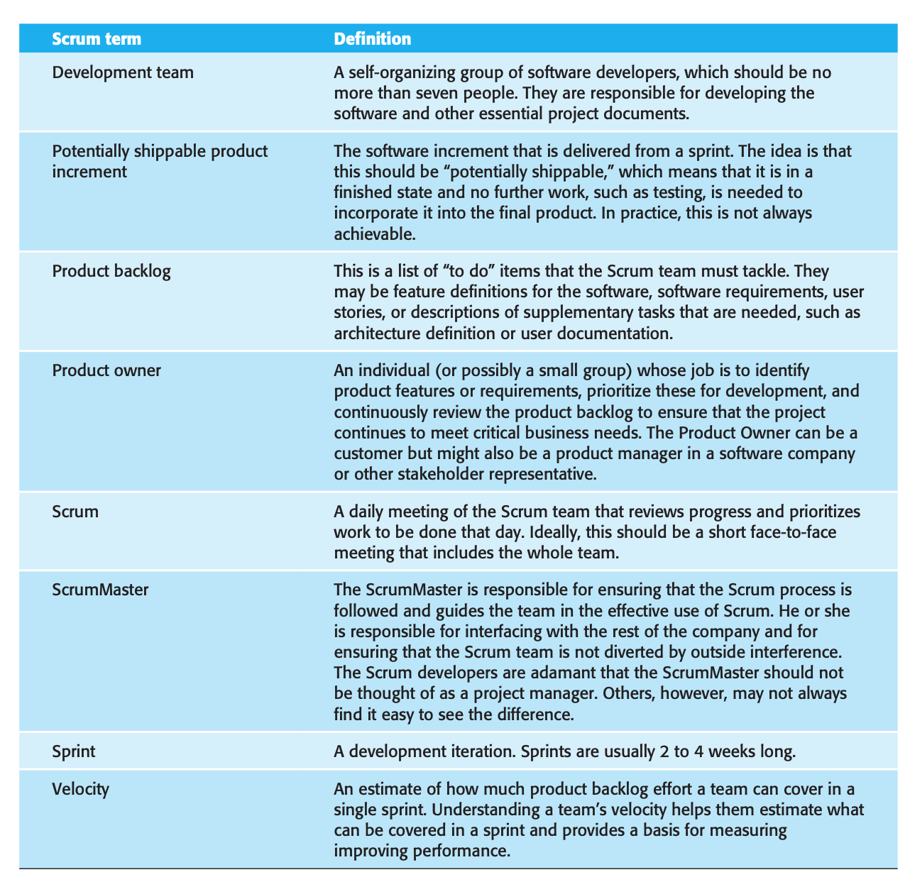

## Practical problems with agile methods

* Lack documentation
* Lack a formal design there is no complex diagrams and no complex specifications.
* Unusual ideas, like pair programming
* Agile methods are designed for small co-located teams
* Complexity on contract negotiation. Cause you dont have upfront requirements

# Software Models in UML

* A Software model is an abstraction of a system or subsystem from a particular perspective or view of the system:
    * Use case view
    * Logical view
    * Implementation view
    * Deployment view

* Expressing software models:
    * **English** :  expressive but suffering from ambiguity problem.
    * **Mathematics**: accurate but often scares the developers
    * **Graphical**: combines strengths of both descriptive and mathematical models. Can be seen by the user and other
      developers, ie UML

## Introduction to Unified Modeling Language (UML)

* UML is a language for specifying, visualizing, constructing and documenting the artefacts of software systems, as well
  as for business modeling and other non-software systems at various stages.
    * Uses for expressing the software artifact.
    * [Official UML web page](https://www.omg.org/spec/UML/)

* **How is UML categorised?**
    * Contains set of diagrams a formal language.
        * 3 different diagrams:
            * **Structure Diagram:** shows static structure of the system.
                * Class Diagram, Object Diagram, Component Diagram, Package Diagram, and Deployment Diagram.
            * **Behaviour Diagram:** What tha system, subsytstem or an object is doing.
                * Use Case Diagram, Activity Diagram, and State Machine Diagram.
            * **Interaction Diagram:** shows how object interacts eachother
                * Sequence Diagram and Communication Diagram.
        * Object Containing Langugae (OCL) is formal language to describe expressions on UML.

### Use Case Diagram

* A collection of actors, use cases and their communications
* Describes the behaviour of a system from user's standpoint: functional description and its major process.

</br>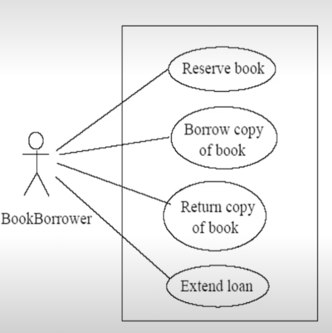

### Class Diagram

* Shows the classes in system and their relations.
* Typically shows the static overview of the system

</br>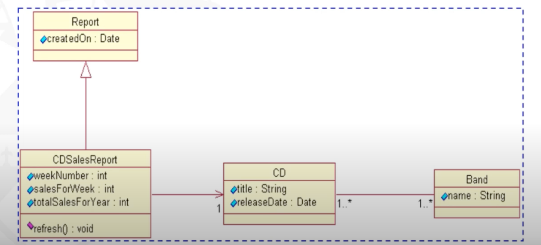

### Instance Diagram

* Also called object diagram
* Shows a set of objects and their relations and their relations at a particular run time.
* Only have two counterparts:
    * object name and attributes with values

</br>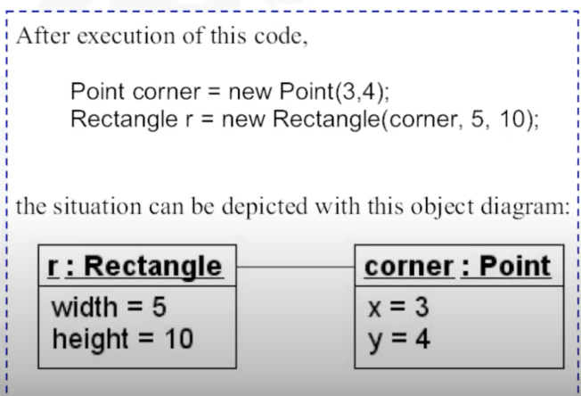

### Sequence Diagram

* A type of interaction diagram
* Shows the object interaction in a time-ordering fashion.

</br>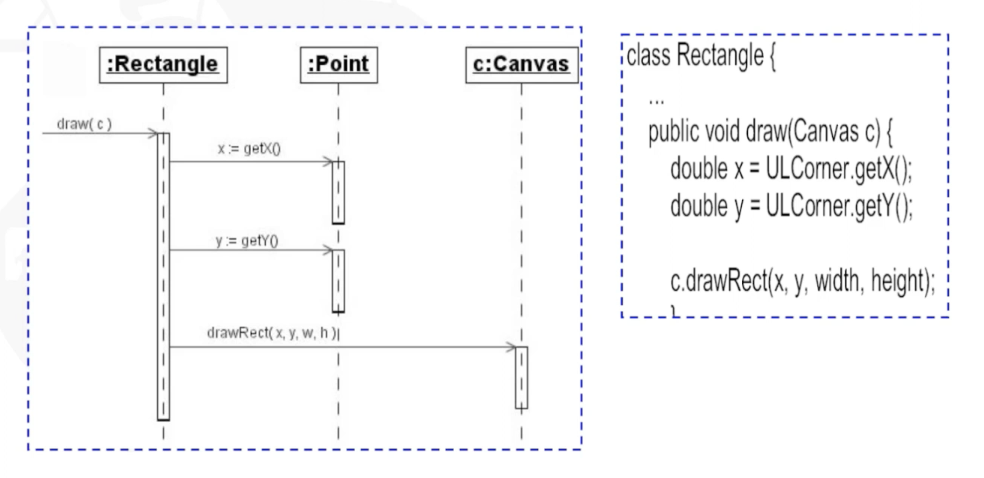

### Activity Diagram

* Activity diagrams can be used to model different aspects of a system.
* Used for:
    * to model a process or task (in business modelling for instance);
    * to describe a system function that is represented by a use case;
    * in operation specifications, to describe the logic of an operation;
    * in USDP to model the activities that make up the lifecycle.
* Notations:
    * **Action**: action is shown as a rectangle with rounded corners, and the name of action written in it.
    * **ActivityEdges**: set of actions linked together by flows from one to another
    * **Decision node** : Decision points ehich action to do
    * **Guard condition**: alternative flows are each labelled with a guard condition, if it is true we called guard
      condition or not we called alternative guard. Actions of the decision nodes next True/false actions.
    * **Initial node:** start point, represent with dot
    * **Final node:** end point, represent with circuled dot.
    * **Frame**:  every diagram can be drawn in a frame, a rectangle with the heading of the diagram in the top left
      hand corner.
* Executable UML: Activity diagrams that can model the implementation of operations and can be compiled into a
  programming language
    * the operation name and class name can be used as the name of an action;
    * an object can be shown as providing the input to or output of an action.

</br>

## Questions:

* What are the relationships between diagrams and models?
    * Diagrams are not equal to models they are different.
    * Modal is bigger then diagram
        * A modal can have one or more diagrams and supporting data and documentation. For example, user case modal has
          use case diagram, decriptions and prototypes.
    * A diagram is a graphical view of a part of a model for a particular purpose.
* If I learned UML, the model I produced is guaranteed to be good, Do you agrree?
    * Has Syntax
        * How symbols look
        * How they are combined
    * Has Semantic
        * what the meanings are
    * No guarantee that modal is good or bad. Depends on the writer to write a good one
* Do I need to keep UML notations?
    * YES 100%, if you use **CASE (Computer Aided Software Engineering)** tool generates code
    * Possibly No, if diagrams are for communicating between customers, developers etc.
* **UML is not !**
    * a programming language
    * a case tool
    * a method

* In USDP, are the phases and activities the same?
    * No, in iterative lifecycles like USDP the activities are independent of the phases and it is the mix of activities
      that changes as the project proceeds
* In a simplified waterfall, are the phases the same with activities?
    * Yes,In the Waterfall Lifecycle, activities and phases are one and the same.
* What are the **main activities in the system development process?**
    * requirements capture and modelling
    * requirements analysis
    * system architecture and design
    * class design
    * interface design
    * data management
    * design construction
    * testing
    * implementation.

</br>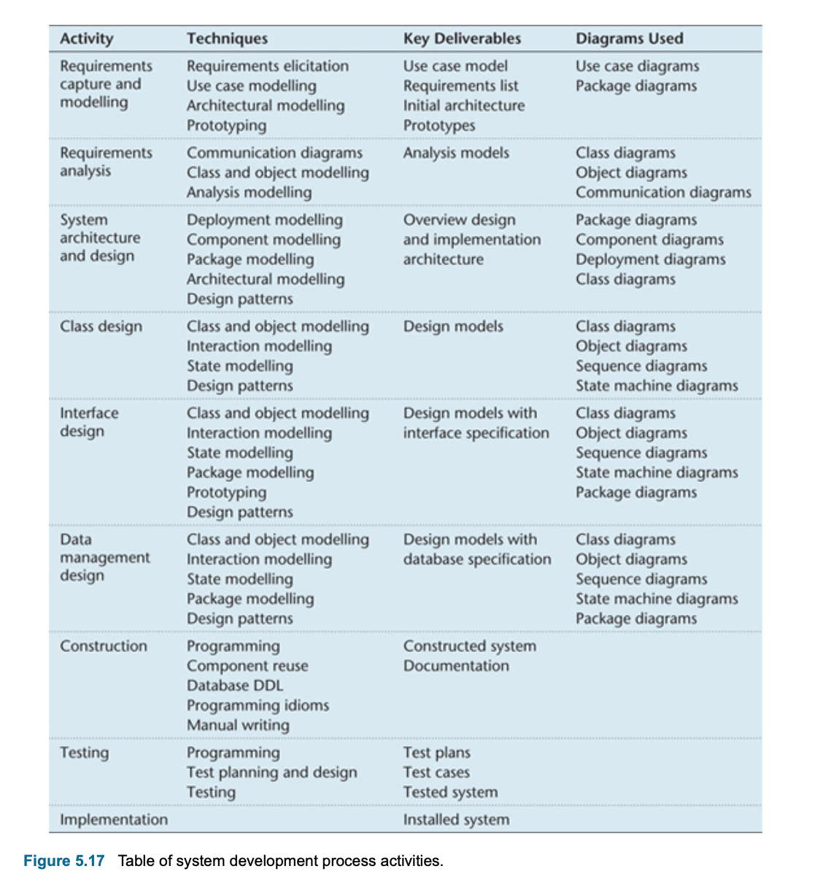

# Sources

* [Iterative and Incremental lifecylecle Model](https://agility.im/frequent-agile-question/difference-incremental-iterative-development/#:~:text=Incremental%20Incremental%20development%20is%20a,these%20is%20complete%20before%20releasing.)
    * [Stack overflow - ItterativeVSIncreental](https://softwareengineering.stackexchange.com/questions/231770/what-is-the-difference-between-the-incremental-and-iterative-approach-to-softwar)

# WEEK 2

#### Main Topics

1) **Apply appropriate requirement elicitation techniques** : <br>
    * Typically, examining the aim, strengths, weaknesses and applicable situations for background reading, interviews,
      questionnaires, observation and document sampling
    * Exploring in depth the guidelines for conducting a good interview and constructing good questionnaires.
2) **Create a use case model** :<br>
    * Looking into the concept of use cases and use case diagram notations, paying particular attention to use case
      relation and actor-generalisation relationships
    * Exploring use case descriptions in both general and step-by-step form with prototype support.

#### Sub titles:

* [Requirement capture](#requirement-capture)
    * [Introduction](#introduction)
    * [User Requirements](#user-requirements)
        * [Current System](#current-system)
        * [New Requirements](#new-requirements)
            * [Functional Requirements](#functional-requirements)
            * [Non-Functional Requirements](#non-functional-requirements)
            * [Usability Requirements](#usability-requirements)
    * [Fact-Finding Technics](#fact-finding-technics)
        * [Background reading](#background-reading)
        * [Interviewing](#Interviewing)
        * [Observation](#observation)
        * [Document sampling](#document-sampling)
        * [Questionnaires](#questionnaires)
            * [Inspection List](#inspection-list)
    * [User Involvement](#user-involvement)
    * [Documentation Requirement](#documentation-requirement)
* [Use case model](#use-case-model)
    * [Notation](#notation)
        * [System](#systems)
        * [Actor](#actor)
        * [Use Case](#use-case)
        * [Relationships](#relationships)
            * [Association](#association-)
            * [Extend](#extend-)
            * [Include](#include-)
            * [Generalization & Specialization](#generalization--specialization-)
    * [Supporting use cases with prototyping](#supporting-use-cases-with-prototyping)
    * [CASE tool support](#case-tool-support)
    * [Business modelling with use case diagrams](#business-modelling-with-use-case-diagrams)
    * [Testing and use cases](#testing-and-use-cases)
* [Requirements Capture and Modelling](#requirements-capture-and-modelling)
    * [Capturing Use Case Diagram](#capturing-use-case-diagram)
* [Summary](#summary)
* [Questions](#questions)

# Requirement capture

## Introduction

* The analyst needs to gather requirements
    * Read up on the organization
    * carry out interviews
    * observe people at work
    * collect samples of documents
    * Use questionnaires.
* Use case diagram is using to document stakeholders' requirements.

## User Requirements

* Needs to have a clear understanding what users would like to achieve with software
* Classified in 2 types

### Current System

* Legacy system: a legacy system is an old method, technology, computer system, or application program, "of, relating
  to, or being a previous or outdated computer system," yet still in use.
* Gaining clear understanding of how the existing system works: parts of the existing system will be carried forward
  into the new one.
* Advocates of Agile argue that focus needs to on understanding user requirements for the new system not the not on the
  functionality of the old system.
* Cases to investigate the old system:
    * Some of exist functionality can be required in new system
    * Some data which is existing in current system can be required to migrate to new system.
    * A technical documentation of the existing system functionality (algorithm) can be required for the new system
    * Some existing defect that we need to avoid in the new system.
    * Stying existing system can help us to understand the organization in general .
    * Parts of the existing system may be retained, For example manuel steps.
    * Understanding the people jobs in existing system, can help to categorise the users of new system.
    * To set some performances targets for the new system by checking the old one.

### New Requirements

* 3 different categories to get the information for new requirements

#### Functional Requirements

* Describe what a system does or is expected to do, often referred to as its functionality.
* Functional requirements include:
    * Descriptions of the processing that the system will be required to carry out
    * Details of the inputs into the system
    * Details of the outputs that are expected
    * Details of data that must be held in the system

#### Non-Functional Requirements

* Non-functional requirements are those that describe aspects of the system that are concerned with how well it provides
  the functional requirements.
* Non-functional requirements include:
    * Performance criteria such as desired response times for updating data in the system or retrieving data from the
      system - **Performance**
    * Ability of the system to cope with a high level of simultaneous access by many users - **Scalability**
    * Availability of the system with the minimum of downtime - **Reliability**
    * Time taken to recover from a system failure - **Recover**
    * Anticipated volumes of data, either in terms of transaction throughput or of what must be stored - **Monitoring**
    * Security considerations such as resistance to attacks, and the ability to detect attacks. - **Security**

#### Usability Requirements

* Usability requirements are those that ensure that there is a good match and relation between software and the users of
  the system.
* The International Organization for Standardization (ISO) has defined the usability of a product as:
    * the extent to which specified users can achieve specified goals with effectiveness, efficiency and satisfaction in
      a specified context of use.
* Need to gather the information:
    * characteristics of the users
    * the tasks that the users undertake, including the goals that they are trying to achieve
    * situational factors that describe the situations that could arise during system use
    * acceptance criteria by which the user will judge the delivered system.

## Fact-Finding Technics

* **SQIRO**— sampling, questionnaires, interviewing, reading (or research) and observation.

### Background reading

* It is to have a good understanding of the organization, and its business objectives.
    * Also help to understand organization mission, possibility some future requirements, and gives info for current
      system.
* This kind of documentations are suitable sources to get information:
    * company reports
    * organization charts
    * policy manuals
    * job descriptions
    * reports
    * documentation of existing systems.
* Advantages:
    * Helps to understand organization mission before arrange some meetings with company employees
    * Helps to make some preparation for the other fact-findings
    * May provide formally defined information requirement for the current system
* Disadvantages:
    * The written documentation often can be outdated or not relevant with current system.
* Appropriate situations
    * When the analyst is not familiar with the organization
    * initial stages of fact finding

### Interviewing

* Aim is to get an in-depth understanding of the organization’s objectives, users’ requirements and people’s roles
* Most used fact-finding technique
* A system analysis interview is a structured meeting between the analyst and an interviewee who is usually an employee
  of the organization being investigated.
* A system analyst’s job is about 40% technical and 60% human relations.
* An interview can gather info from :
    * Management; their objectives for the organization and for the new system.
    * Staff; their existing job and information needs
    * Customers; expectations and habits
* **Dynamic Systems Development Method (DSDM)** is a method which is using group discussion,
* Guideline:
    * Before Interview;
        * Arrange an appointment for interviews
        * Give some info about the interview duration, topic, subject of interview
        * Arrange interview if it is neccesaary and dont waste employee's time.
        * Inform the interviewee's manager and giev some info about the interview cycle and schedule.
        * Have a clear objectives and prepare relevant questions before interview.
    * At the start of interview:
        * Time boxing and start in time
        * introduce yourself and give intro info about interview subject
        * Take notes and inform the interviewee and get permission.
    * During interview:
        * Control the direction of the interview, keep on track the subject.
        * Use a different kind of questions to get different type of information.
        * Listen interviewee and encourage him/her to give you more info
        * Try to avoid to focus on problems too much , try to make positive
        * Be sensitive about data which you collect during the interview
        * Use opportunity to get some additional information or samples during interview
* Advantages:
    * **Personal contact** help to be more responsive and this helps to have high-quality information.
    * Analyst can get more in deep information than from the other technics.
    * If interviewee has nothing to say can terminate immediately.
* Disadvantages:
    * Time-consuming, can be the most costly fact finding technic
    * Require analyse after the interviews by collecting the outputs from interviews, notes must be written up or tapes
      transcribed after the interview
    * Interviews can be bias if the interviewer has a closed mind about the problem.
    * If interviewees provide conflicting information this can be difficult to resolve later
* Appropriate situations
    * most projects
    * at the stage in fact finding when in-depth information is required

### Observation

* Aim is to see what really happens, not what people say happens
* Watching people in their work places while they are working to work process.
* Can help to understand seeing the employees ways to handle the problems or exceptional cases which they forget during
  interview.
* Includes:
    * seeing how people carry out processes
    * seeing what happens to documents
    * obtaining quantitative data as baseline for improvements provided by new system
    * following a process through end-to-end
* Can be open-ended or based on a schedule
* Advantages:
    * First-hand experience to see the way that current system operations.
    * Real time data collection
    * Verifying the information which is provided from other fact-finding technics
    * Baseline data about performance and the users od the current system.
* Disadvantages:
    * Most people don't like being observed
    * Need train and skills to have the most efficiency
    * logistical problems for the analyst with staff who work shifts or travel long distances
    * Can have some ethical problems while observing the sensitive / private data
* Appropriate situations
    * Essential to get quantitative data about people's job.
    * to verify information from other sources
    * Probably the best way to follow items from start to finish.
    * Can be useful in the situations where different interviewees have provided conflicting information about the way
      the system works.

### Document sampling

* Can use for 2 ways:
    * Can help to determine the people's role, and the input/output data of the current system is using.
    * Can carry out some statistical analysis of the documents
* Includes:
    * obtaining copies of empty and completed documents
    * counting numbers of forms filled in and lines on the forms
    * screenshots of existing computer systems

* Advantages:
    * Can use to get quantitative data of the document style (average number of lines etc)
    * Can use to find our the error rates of documents
* Disadvantages:
    * If the new system will be totaly different from current one, they can be redundant to look at it.
* Appropriate situations
    * The first way of the fact can be almost always appropriate.They can provide supporting evidence information from
      gathering interviews and observations.
    * The second way, the statistical approach is appropriate in situations where large volumes of data are being
      processed, and particularly where error rates are high, and a reduction in errors is one of the criteria for
      usability.

### Questionnaires

* Aims to obtain the views of a large number of people in a way that can be analysed statistically
* Research instrument can use for fact-finding
* Includes:
    * postal, web-based and email questionnaires
    * open-ended and closed questions
    * gathering opinion as well as facts
* Types if questionsL
    * Yes / No Questions (sometimes IDK option adding)
    * Multi-choice questions
    * Open-ended questions
    * Scaled questions
* Questionnaires are best suited for eliciting user cases from a large number of people or from people from different
  geographic areas, for example they are useful if an organisation has so many branches through out the country or the
  world.

</br>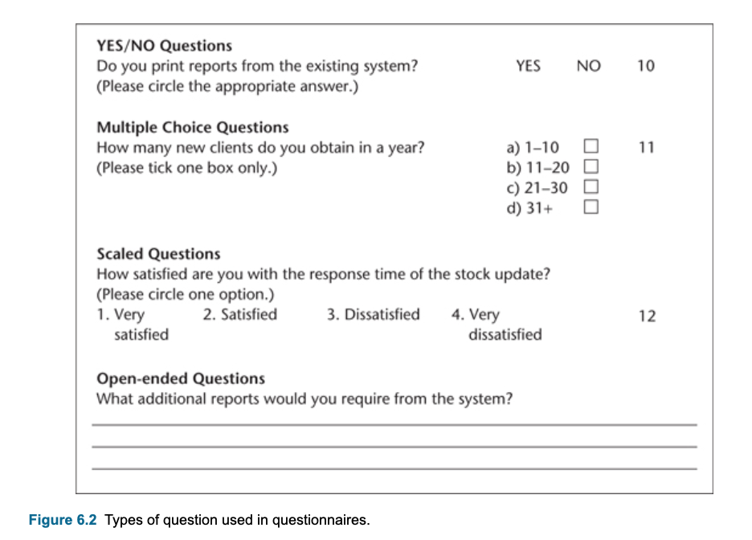

* Guidelines: Using questionnaires requires good planning
    * Coding: Decide how to code the results at the end. Every question needs to capable for coding.
    * Analysis: Needs to plan in advance. Carrying out a statistical analysis or some special software programs of the
      responses, require a statistician before finalize the questions to avoid for using poorly designed questions.
    * Piloting: Try out questions in small pilot groups to understand the questions can understandable or answerable.
    * Sample size and structure: To use serious statistical techniques, it requires some limited representation of
      different types of segments, by age, gender, department etc.
    * Delivery: how do you delivery to respondents the questionnaires and collect from them back?
    * Respondent information: Which additional information do you would like to collect when they reply you back the
      questionnaires (such as name of the respondents)? While collecting (storing) the sensible info (name of the
      person, age etc) don't forget to consider GDPR.
    * Covering letter or email: In cover letter,needs to have purpose of the questionnaire, having support from
      management and thanks to being part of it with an estimation time or deadline for return .
    * Structure: Give a title, start with explanatory material and notes on how to complete it, Follow this with
      questions about the respondent (if required).. Group questions together by subject.Avoid lots of instructions
      like: ‘If you answered YES to Q.7, now go to Q. 13’. Keep it reasonably short.
    * Return rate: Not everyone will necessarily respond. if you can identify who has not responded and email them
      reminders. Equally, you can email a thank you to those who do respond.
    * Feedback: A summary of the report can share with relevant respondents, departments to show them the outcomes of
      the study and their effect.

* Advantages:
    * An economical way of gathering data from many people.
    * effective way of gathering information from people who are geographically dispersed
    * a well designed questionnaire can be analysed by computer.
* Disadvantages:
    * Hard to create a good questionnaires.
    * No automated follow-up mechanism
    * Non digital questionnaires (postal) response rate is low.
* Appropriate situations
    * when views of large numbers of people need to be obtained
    * when staff of organization are geographically dispersed
    * for systems that will be used by the general public and a profile of the users is required

### Other techniques

* Expert systems are computer system that designed to represent of the human expertation to solve problems, such as
  systems for medical diagnosis, stock market trading and geological analysis for mineral prospecting.

### Inspection List

* Does the questionnaire have a meaningful title?
* Is it clear who produced the questionnaire?
* Are the instructions on how to complete the questionnaire clear?
* Is it made clear for whom the questionnaire is intended, to avoid inappropriate people responding?
* Are the instructions on where to send the questionnaire clear?
* Is the date made clear by which time the questionnaire should be returned?
* Are respondent thanked for their time?
* Are the objectives of the survey made clear?
* Is there a sizeable “Any Other Comments” box?
* Do close questions have balanced likert-type scales with no more than 5 choices?
* Do open-ended questions have sufficient space for a response?
* Is every question free from ambiguity (She fed her dog biscuits...)?
* Are any explanatory comments to questions free of bias?
* There should not be too many open-ended questions. Are there too many?

## User Involvement

* All people who have interest of the success of the system, and some gains/lost of the implementation of the system are
  called **stakeholders**.
* Include the category of people :
    * senior management: with overall responsibility for running the organization
    * financial managers with budgetary control over the project
    * managers of the user department(s)
    * representatives of the IT department delivering the project
    * representatives of users.
* Users will be involved in different roles
    * subjects of interviews to establish requirements representatives on project committees
    * those involved in evaluating prototypes
    * those involved in testing
    * subjects of training courses end-users of the new system.

</br>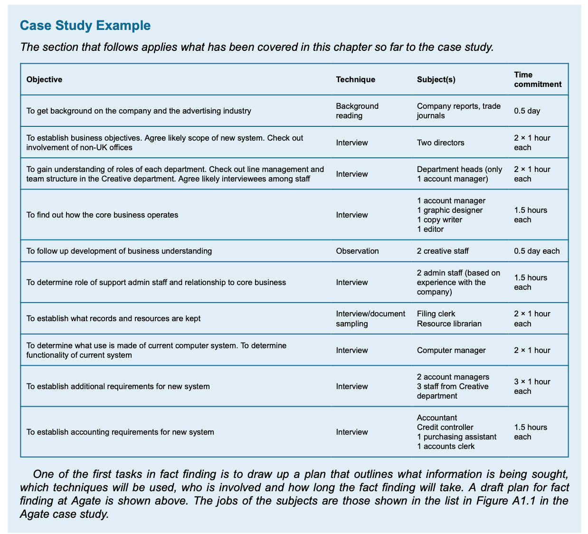

## Documentation Requirement

* UML is using to produce models of the system from different perspectives.
* **Computer Aided Software Engineering (CASE)** tools are using to draw the diagrammatic models and maintain the
  associated data that are showed in the diagrams.
* Also to store the documentations which does not fit
    * records of interviews and observations
    * details of problems
    * copies of existing documents and where they are used details of requirements
    * details of users
    * minutes of meetings.

* In projects to store this documents in digitally, a document management system or a version control system are using.
* **Use cases are used to model functional requirements, but not good to store non-functional requirements**.
* Use case model and supplementary requirements (those not provided by use cases) constitute a traditional requirements
  specification and we need to keep them both.
* Some documentation management software solutions are helping to track the impact of the changes on the project.

# Use case model

* **Use case modelling** is the transformation technique, and the resulting model is **Use case model**
    * The process for developing the use cases is called use case modelling.
* Based on the list of selected requirements, use cases can be developed.
* The output from use case modelling is the use case model.
* Use case model is the part of the requirement model
* Documents the functionality of the system from users perspective
* Use case model contains:
    * **use case diagram**,
    * **use case description**
    * **prototypes**
* Use case modelling is an iterative process.

</br>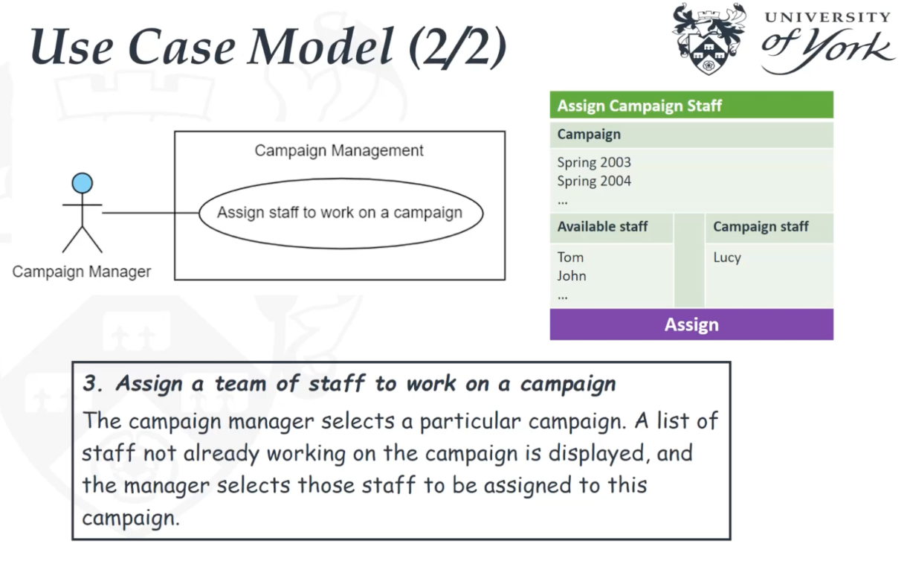

## Notation

* Use case diagrams shows 3 aspect of the system
    * Actor
    * System boundary
    * Use Cases

</br>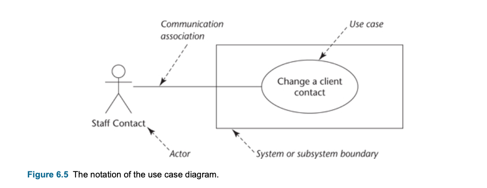

* As an example building a Banking app
  </br>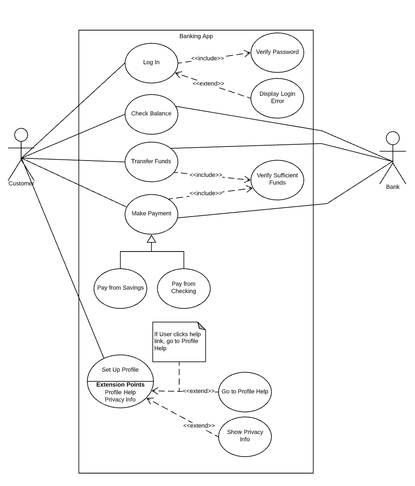

### Systems

* System is what ever you are developing, ie website, business process, software component or app etc.
* Represents with rectangle , with the name on top.
    * Helping to define the scope of the system.

### Actor

* Represent roles of users, other systems or devices that communicating with the particular use case.
* Represents with stick figure
* Actor is someone or something that uses the system to achieve a goal.
    * Can be a person, an organization, another system or an external device.
* Actors are external object of the system, needs to stay out of the system rectangle.
* Actors need to be type or categories (ie customer, bank etc), they should not have a spesific names (ie John, X bank
  etc),
* 2 types actor:
    * **Primary Actor:** initiate/starts the use of the system (ie customer)
    * **Secondary Actor:** reactionary, it acts when primary actor does something (ie bank)
* **Each actor has to interact at least one use case**

### Use Case

* Use case are using to document the scope of the system and the developers understanding of the user requirements.
* Use case supported by **behavioral specifications**.
    * Rather than (or as well as) using text, a use case can be linked to another diagram that specifies its behaviour
    * Typically a Communication Diagram, a Sequence Diagram, a State Machine or more than one of these
* Use case specify a desired interaction between a user and a system
    * Not specify the internal process of system
* Represents an action that accomplishes some sort of task within the system.
* **Short desc**: Describes what the system does
* They place within the rectangle, because they are the actions occurres within the system.
* They start with a verb and reinforce an action
* They are sufficiently descriptive.
    * Must help to user to achieve a discrete goal.
        * Withdraw cash -> yes a use case
        * Enter password or may not -> no , because it is not a dicrete goal which user want to achieve
* **Use case description** is a short description of the interaction between the actor and the system.
    * Can be a simple paragraph
        * Assign staff to work on a campaign : The campaign manager wishes to record which staff are working on a
          particular campaign. This information is used to validate timesheets and to calculate staff year-end bonuses.
    * Can be a **step-by-step** breakdown of interaction between actor and system
* **Essential use cases** describe the ‘essence’ of the use case in terms that are free of any technological or
  implementation details,
    * Real use cases describe the concrete detail of the use case in terms of its design.
    * During analysis stage, use cases created essential mostly at the beginning.
* Why is important ? Jesse Liberty says
    * > Use Cases are the cornerstone of your analysis. Creating a reasonably exhaustive set of use cases is the single
      best insurance you can buy to ensure that you are building the system the customer needs
* **Template of use case:**
    * name of use case
    * pre-conditions (must be true before the use case can take place)
    * post-conditions (must be true after the use case has taken place)
    * purpose (what the use case is intended to achieve)
    * description (in summary or in the format above).

* **Alternative courses**: Possible alternative routes from a use case
* **Scenario**: used to describe the alternative courses or specific paths through the use case such as response to
  errors where the use case represents the general case.
* **Step-by-step** form of use case description
  </br>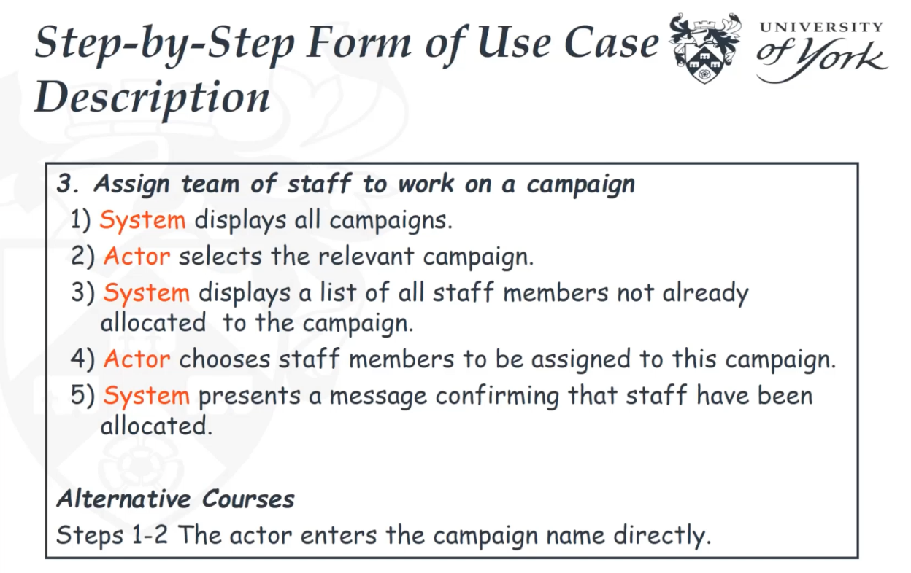

### Relationships

---

* Each item in model has to interact with each other.
* **Stereotype** :  is a special use of a model element that is constrained to behave in a particular way.
    * Stereotypes can be shown by using a keyword, such as ‘extend’ or ‘include’, like «extend».
* Types of relationships:

### Association :

* Signifies basic communication or interaction
* Represents with solid line

### Include :

* Include applies when there is a sequence of common behaviour that uses in some number of use cases to avoid
  copying/duplicating the same description into each use case.
    * in other words, use an <<include>> relationship when you have some behaviour that repeats across several use cases
      and you don’t want to keep repeating the description.
* Shows dependency between base use case and included use case
* Base use case requires **always** the included use case inorder to be complete.
    * Everytime base use case executed, included use case executed as well.
* Represent with dashed line with an arrow that is written **<<include>>** on it
    * **from Base use case --> to included use case.**
* **The include use cases never stands alone** because it is not a discrete goal that a user wants to achieve.
    * And also because of that you can not connect include use case directly to the actor, it is wrong

</br>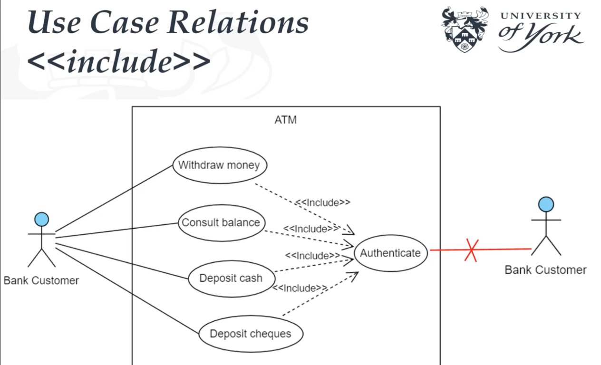

### Extend :

* Extend is using to show that a use case provides additional functionality that may be required in another use case.
* Base case requires **some times** the extended case
* Extend use case happens only if certain criterias are met
* A condition can be placed in a note joined to the dependency arrow (Note that it is not put in square brackets, unlike
  conditions in other diagrams.)
* Represent another option to extend the behavior of the base use case.
* Represent with dashed line with an arrow that is written **<<extend>>** on it
    * **from Extend use case --> to base use case.**
* **Extension points :** detail version of extend relationship
* **Extend can be stand alone,** because it helps to user to achieve an additional discrete goal

</br>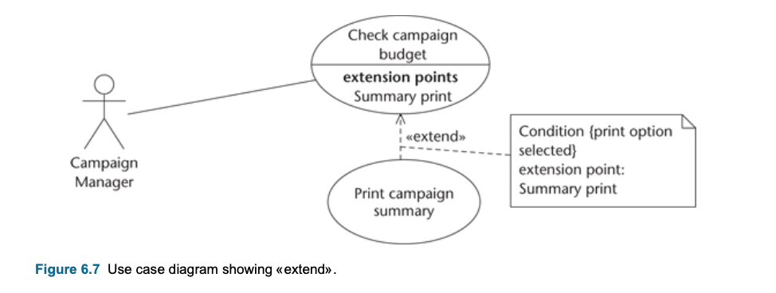

</br>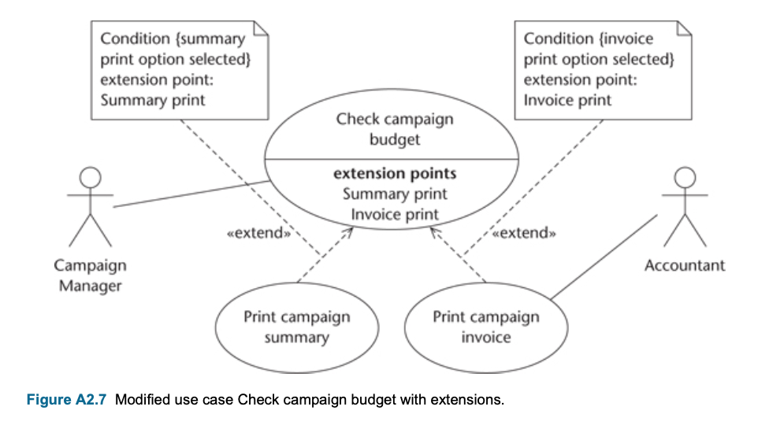

Example:<br>
</br>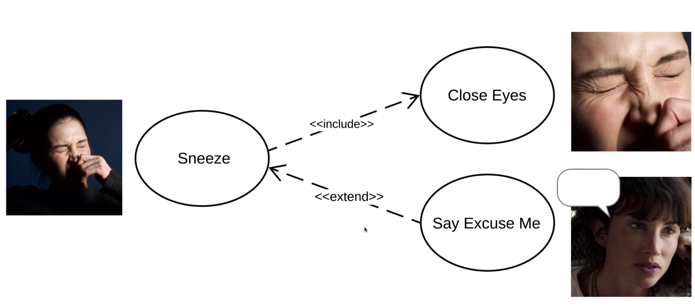

* **Multiple base use cases can point the same included/extend use cases.**
* **Important** to not overuse, can cause to divide the functional use cases into many small cases that does not contain
  any value for users.

### Generalization & Specialization :

* Also known as inheritance
* You can generalize actors and use cases.
    * ie customer is parent of new customer and returned customer
    * ie make payment is parent of the types of the payment use cases such as checking or savings
* Works as **parent (General use case ) / child relation (Specialised use case)** relation.
    * Each child shares the common behavioral of parent, but each child adds something more on its own
* Represent with solid line arrow
    * from child to parent
* Another usage, there may be similar use cases where the common functionality is best represented by generalizing out
  that functionality into a **super-use case** and showing it separately

</br>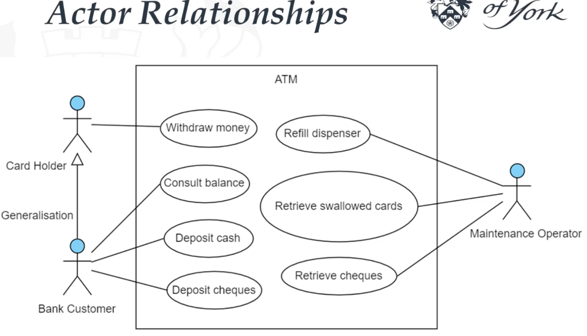


---

## Supporting use cases with prototyping

* Prototypes are helpful to support use cases.
* Is a working model of the system with partical functionaly.
* Collecting feedback with prototypes can help to get useful info for requirements.
* Prototype do not have to develop as software program. The prototype can be hand-drawing storyboard or developed by
  using a rapid development environment
    * UI can be sketched out with papers to show user formaly or informaly.
    * Sequence of the screen layouts can show in storyboard

</br>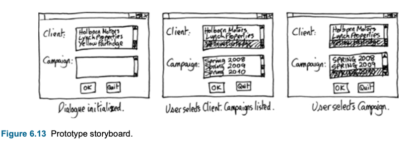

## CASE tool support

* Drawing diagram and maintaining documents can be mmore easy with CASE tools.
* CASE tool needs to provide to analysis to drawing use case diagrams and also facilities to maintain the repository
  associated with the diagram elements and to produce reports
    * Automatically generated reports can be merged into documents that are produced for the client organization.
    * The behaviour specification of each use case forms part of the requirements model or requirements specification,
      which it is necessary to get the client to agree to.

## Business modelling with use case diagrams

* Use case diagrams can also use in the beginning of the project to model an organization operations.
* Business modeling is using when:
    * a new businins is setting up
    * an existing business is being re-engineer
    * in a complex project to ensure the business operation is understood before the requirements creation.
* There are other approaches to business modelling, the most prominent of which use process charts, which are similar to
  activity diagrams. The idea that it is possible to model business processes and then have them automated directly
  through the use of workflow tools and services

</br>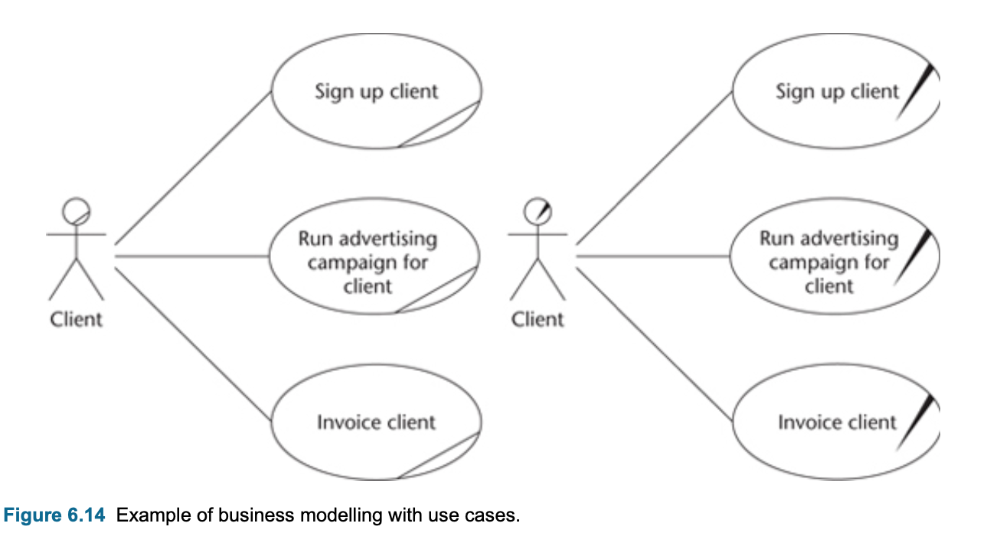

## Testing and use cases

* Use cases can form the basis of scenarios that can be used as test cases when the system has been developed
* The steps in this use case can run with an agreed set of test data to check that the system performed as required.
* Use cases alone are not the full specification of what needs testing but they provide a good basis for developing test
  cases,

# Requirements Capture and Modelling

* Main activities in and products of each phase
* Requirement capture process starts with requirement elicitation with project initiation document as the input.
* From the requirement elicitation documents, candidate requirements can be identified
* Capturing process is generally not feasible to develop all the features in the one increment, so the selected
  requirements will form the scope of the current increment.
* Based on the list of selected requirements, use cases can be developed.
* **MoSCoW** method is the heuristic for prioritising requirements. it is an acronym
    * _Must have_ requirements are crucial
    * _Should have_ requirements are important
    * _Could have_ requirements are less important
    * _Won’t have_ this time around requirements can reasonably be left for development in a later increment.

</br>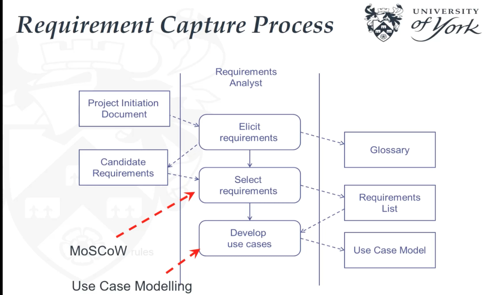

## Capturing use case diagram:

* Conduct fact-finding with end-users
* Take each discrete goal
    * Identify actors
    * name it, and
    * write a short description of the flow of events, 1 or 2 paragraphs

* Add structure to the use case model, ie include/extend relationships and actor generalisation
* Iterative process
    * Uses cases may get more detailed as you prototype and as customers realise the potential of the new system
* How many use cases are appropriate?
    * Too many are difficult to manage, and too few will be too complex. 20-30 might be a good number to strike the
      balance.
* When we need to seperate the use cases ?
    * When there is a significant difference between the goal of the use case oan actor experience.
        * ie ATM use case Deposit Money use case can separate in 2 use cases : Deposit Cash and Deposit Cheques.

</br>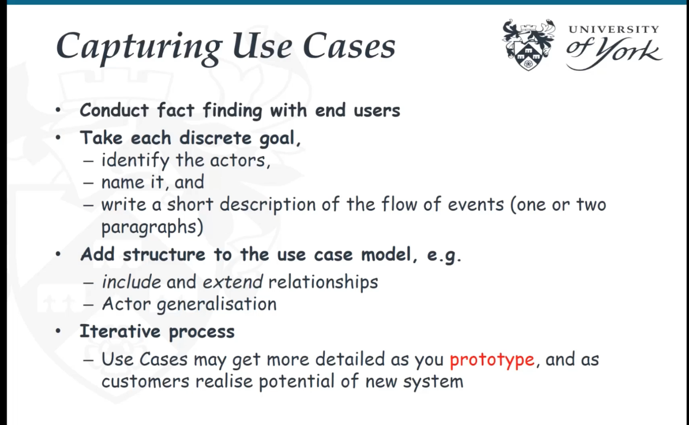

# Summary:

* Analysts investigating an organization’s requirements for a new information system may use five main fact-finding
  techniques—background reading, interviews, observation, document sampling and questionnaires.
* Fact-finding techniques use to gain an understanding of the current system and its operation, of the enhancements the
  users require to the current system and of the new requirements that users have for the new system.
* **Initial Architecture** is based on the packages that use cases are grouped. ie. Campaign Management, Staff
  Management and Advert Preparation.
    * in this stage packages reflex the business context not the code/language implementation.
* **Glossary** : A glossary of terms has been drawn up, which lists the specialist terms that apply to the domain of
  this project—advertising campaigns.

* **Activities of Requirements Modelling**

</br>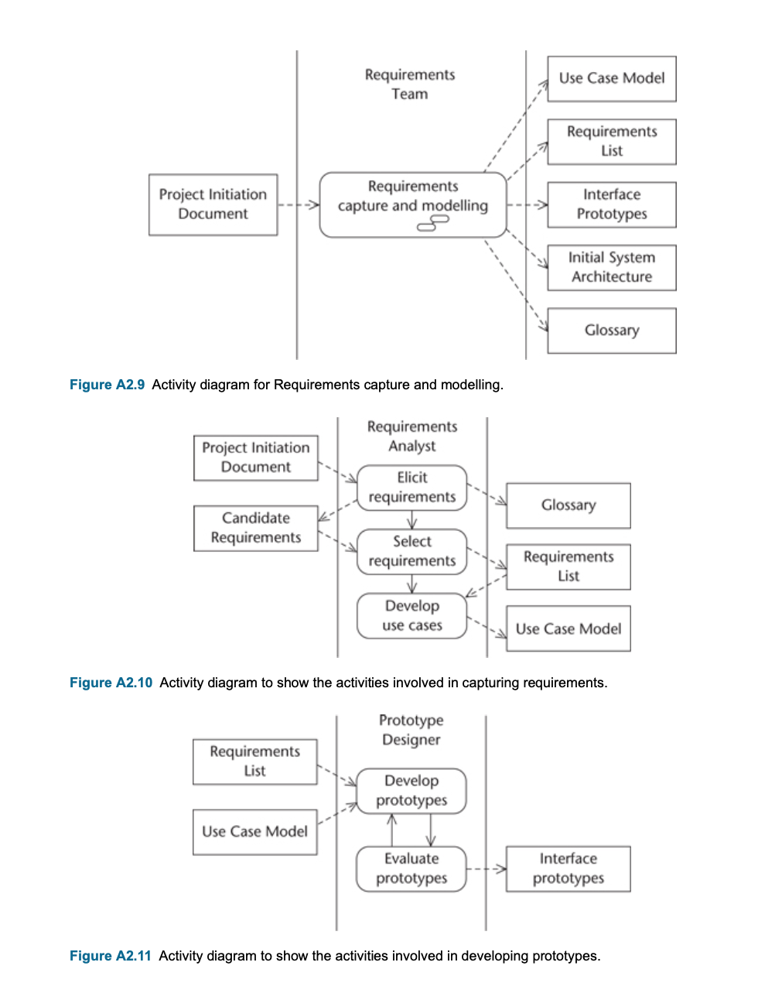
<br>
</br>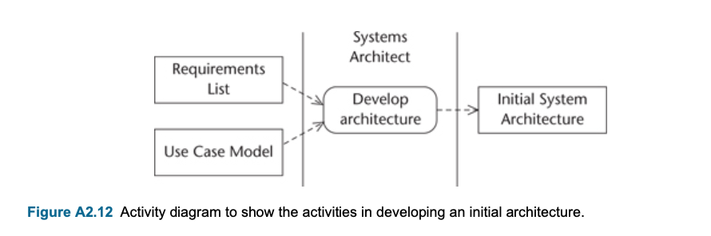

# Questions:

* What is the most appropriate situation to use the use case Include relation?
    * When you have some behaviour that repeats across several use cases and you don’t want to keep repeating the
      description, so the whole purpose is repetition avoidance.
* Does the included use case stand-alone? And why?
    * No, because it is part of other use cases, and used on its own it doesn't help the user to achieve a discrete
      goal.
* What is the most appropriate situation to use the use case Extend relation?
    * A use case provides additional functionality that may be required by the base use case (the use case being
      extended).
* Does the extended use case stand-alone? And why?
    * Yes, because it helps the user to achieve an additional discrete goal.
* What are the implications for actor generalisation?
    * The specialised actor inherits the use cases of the generalised actor.
* What are the approaches to developing prototypes?
    * Hand-drawn storyboarding, or using a rapid development environment.
* What is the role of prototypes in a use case model?
    * They support use case description. **As a general rule, one use case is supported by one interface prototype**
* Is the following use case description essential or real use case? - "Lists all campaigns for the client in a Java list
  box, sorted into alphabetical order by campaign title"
    * Real use case
* What is the problem with a real use case at the analysis stage?
    * Real use cases are more difficult to maintain
* What is the difference between a scenario and a use case?
    * A scenario is a specific sequence of actions. A use case might expand out to many scenarios, i.e. alternative
      courses. Scenarios are to use cases as instances are to classes

* For the table on p.170, why are some entries on the right-hand-side column labelled “Not applicable”?
    * Non-functional requirements are listed as 'Not applicable'
* For the table on p.171, can you identify a few actor generalisations among the actors?
    * Accountant --> Campaign Manager
    * Staff --> Staff Contact, Campaign Staff

# SOURCE

* [Visual Padigm Use Case](https://online.visual-paradigm.com/diagrams/tutorials/use-case-diagram-tutorial/)

# WEEK 3

#### Main Topics

1) Conduction requirement analysis and creating an analysis class model <br>
2) Conducting interaction modelling and creating communication diagrams <br>

**Relevant module learning :** <br>

* Investigate and analyse a problem
* Write a software requirement specification
* Design blueprint expressed in UML which provides a basis for code generation.

#### Sub titles:

* [Requirement analysis and class diagram](#requirement-analysis-and-class-diagram)
    * [Analysis model](#analysis-model)
    * [Why requirement analysis?](#why-requirement-analysis)
    * [Major analysis activities](#major-analysis-activities)
    * [Class diagram: concept and notations](#class-diagram-concept-and-notations)
    * [Analysis Class Diagram: Concepts and Notation](#analysis-class-diagram-concepts-and-notation)
        * [Classes and objects](#classes-and-objects)
        * [Attributes](#attributes)
        * [Links between instances](#links-between-instances)
        * [Associations between classes](#associations-between-classes)
        * [Multiplicity](#multiplicity)
        * [Operations](#operations)
        * [Object State](#object-state)
        * [Stability of the analysis class diagram](#stability-of-the-analysis-class-diagram)
* [Refining the requirements model](#refining-the-requirements-model)
    * [Finding and modelling generalization](#finding-and-modelling-generalization)
    * [Finding and modelling composition (Aggregation, composition)](#finding-and-modelling-composition-aggregation-composition)
* [Class Modelling](#class-modelling)
    * [Class Stereotypes](#class-stereotypes)
        * [Boundry Classes](#boundry-classes)
        * [Entity Classes](#entity-classes)
        * [Controller Classes](#control-classes)
    * [Guidelines for Identifying Classes](#guidelines-for-identifying-classes)
    * [From Use Case to Class Diagram](#from-use-case-to-class-diagram)
* [Interaction modelling](#interaction-modelling)
    * [Class Responsibility Collaboration Cards (CRC)](#class-responsibility-collaboration-cards-crc)
    * [Sequence diagram notations](#sequence-diagram-notations)
* [Questions](#questions)
* [Sources](#sources)

# Requirement analysis and class diagram

* Requirement analysis helps to explore the structure of logic at behind of surface
* At the end of requirement analyse, we can have analysis model that can be use for design after.
* Class diagram is the core diagram in requirement model.

## Analysis model

* **An analysis model** is a set of analysis classes that are contained in a diagram that collects the behaviour of the
  required application system in a way that independent of in any implementation approach.
* Analysis aims to identify:
    * A software structure that can meet the requirements
    * Common elements among the requirements that need only be defined once
    * Pre-existing elements that can be reused
    * The interaction between different requirements
* how to Model the Analysis :
    * The main technique for analysing requirement is the class diagram
    * 2 main ways to produce:
        * Directly based on knowledge of the application domain (from a Domain Model)
        * By producing a separate class diagram for each use case, then assembling them into a single model (an Analysis
          Class Model)

## Why requirement analysis?

* Requirements (Use Case) model alone is not enough
    * There may be repetition
    * Some parts may already exist as standard components
    * Use cases give little information about structure of software system
* Requirement analysis models are:
    * correct, coherent and understandable for users
    * unambiguous and useful for design
* Analysis model is way beyond from user model completeness with
    * its level of detail,
    * its analysis of logical structure of the problem domain
    * the ways of logical element interaction.

## Major analysis activities

* 3 major activities for requirement analysis:
    * **Class modelling:** static structure of the system
        * Actions:
            * Identifying possible classes
            * Adding associations, attributes and some operations, and producing the first cut class diagram.
            * Analysing possible inheritance, reusable components and revising the class diagram
    * **Interaction modelling:** object interaction of a use case
        * Actions:
            * Composing sequence and/or communication diagrams for some use cases and then revising the class diagram.

    * **Attributes and operations specification**
        * involves OCL, activity diagram and state machines.

</br>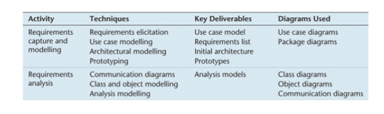<br>

## Class diagram: concept and notations

* Class diagram describes the type of the objects in the system and various kind of relation between each other.
* Stages of the development for class diagramming:
    * Conceptional class diagram : less detailed
    * Analyse class diagrams : detailed with type data.
    * Design class diagram : more detailed with code to implement the classes.

</br>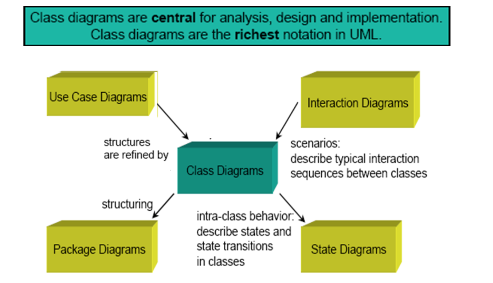

## Analysis Class Diagram: Concepts and Notation

### Classes and objects

* The analysis class diagram contains classes that represent the more permanet aspects of the application domain, but
  specifically those that are relevant to the application under development.
* **Class** is a description of a set of objects with similar features, semantics and constrains.
* **An Object (instance)** is an abstraction of something in a problem domain

#### Class

</br>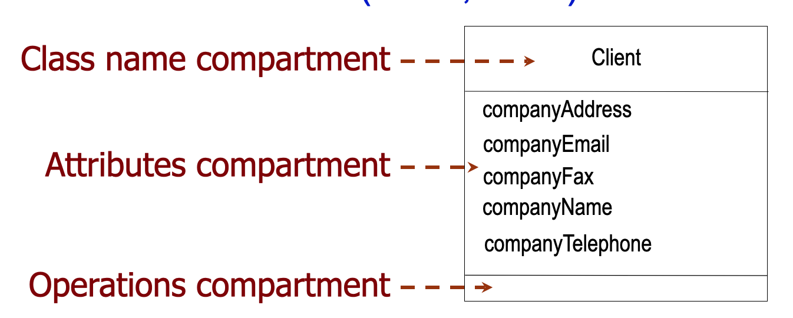

#### Object

</br>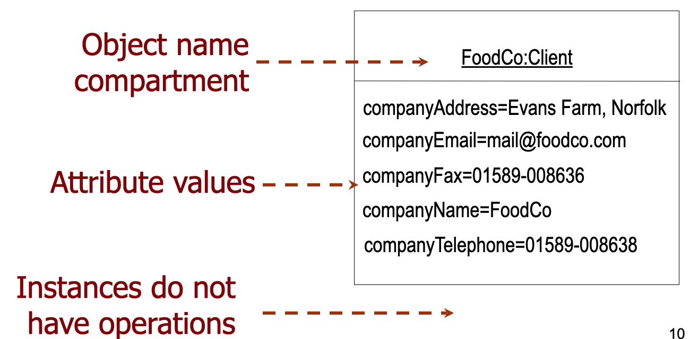

### Attributes

* Attributes are part of the essential description of a class.
* They are common structure of what class can 'know'
* Each object has its unique value for each attribute in class
    * To describe an instance completely needs to give a value for each attribute.
    * attribute = 'value'

### Links between instances

* A link is a logical connection between two or more objects.
* Alink can also connect instances of the same class.
* Less commonly, a link can connect an instance to itself.
* :Client (the colon before the class name indicates an anonymous instance of the class, in other words any client)

</br>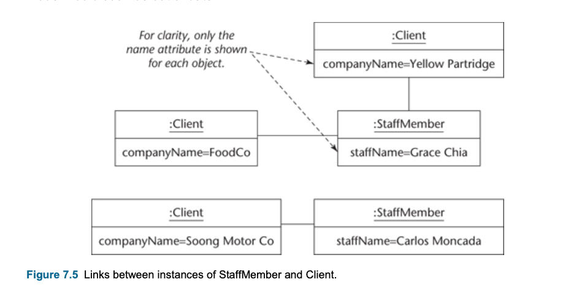

### Associations between classes

* Association is an abstraction that connects two classes and represent possibility of link between their instances.
* General rule: If two objects are linked, their classes are said to have an association
* Every association must have a descriptive name.
* The text at the association end gives a name to the role that the instances of the class at that end of the
  association play in relation to instances of the class at the other end of the association.
* The association end name represents a data value that holds a reference to an instance of another domain class rather
  than a value like an integer or a string

</br>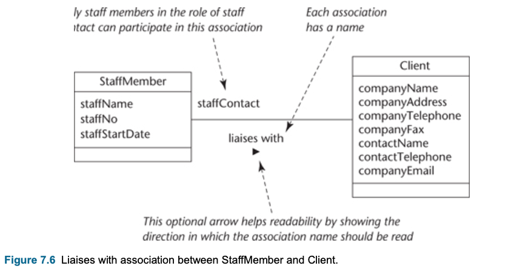<br>
</br>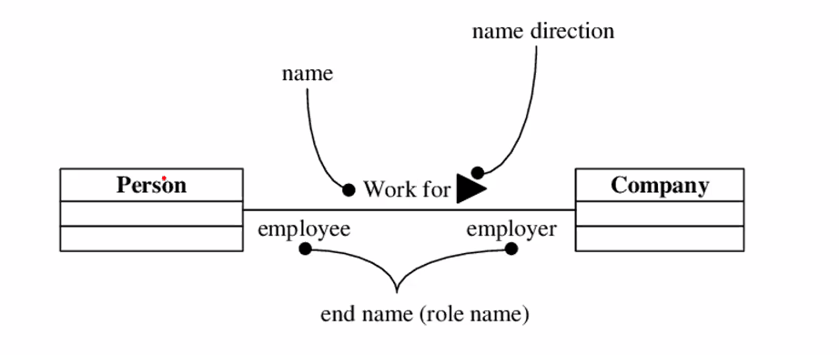

### Multiplicity

* The multiplicity is of an association is a description of the number of objects that can participate the association.
* Represent enterprise (or business) rules
    * These always come in pairs:
        * Associations must be read separately from both ends
        * Each bank customer may have 1 or more accounts
        * Every account is for 1, and only 1, customer

* This example, each StaffMember liaises with zero or more Clients, and each Client has only one staffMember to liaises
  </br>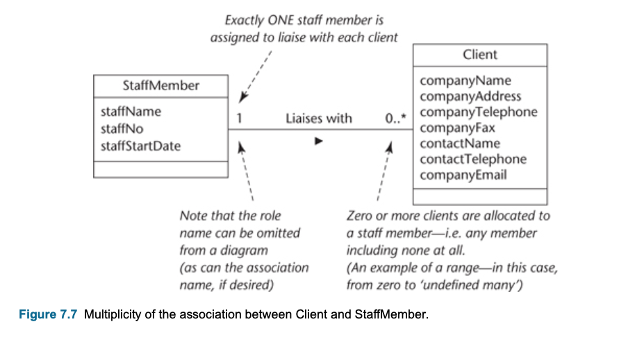
  <br>
  </br>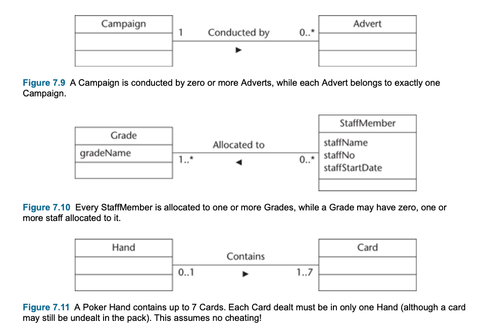

### Operations

* Operations are the common behaviour shared by all instance of a class.
* primary operations : constructor
* naming convention:
    * operation names are written beginning with a lower-case letter.
    * There is no separate notation for showing the operations of an object instance.
* Operations are defined for a class and are valid for every instance of the class.
* Operations describe what instances of a class can do:
    * Set or reveal attribute values
    * Perform calculations
    * Send messages to other objects
    * Create or destroy links

</br>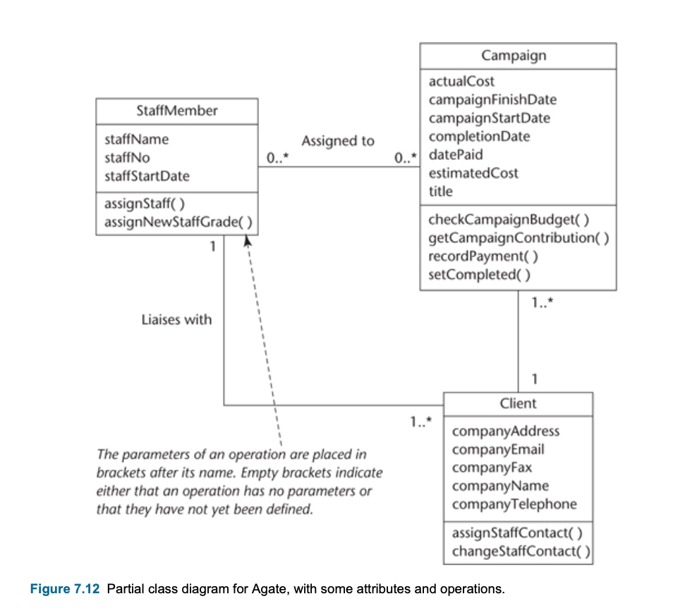

### Object State

* An object’s state is related to its attributes, its links and its operations
* Current state is an encapsulation of the value of attributes and links
* State constrains behaviour - it determines whether or not an operation can fire
* Executing an operation often causes a change of state

### Stability of the analysis class diagram

* Instances are subject to three main types of change during system execution.
    * they are created.
    * they can be destroyed.
    * they can be updated.

# Refining the Requirements Model

* The aim of refining and adding further structure to analyse model is to create conditions for reuse.
* **OOA (Object oriented Analys) gives 3 mechanism for reuse:**
    * Fundamental abstraction mechanism of:
        * **Generalization:** Generalization is a form of abstraction that means concentrating on those aspects of a
          design
          or specification that are relevant to more than one situation, while ignoring those that are only relevant to
          a specific situation
        * **Encapsulation:** Encapsulation and information hiding together represent a kind of abstraction that, focuses
          on
          the external behaviour of something and ignores the internal details of how the behaviour is produced.
    * the specification of reusable software components
    * the application of analysis patterns. & Component-based development is based on the specification of composite
      structures that can function as reusable software components

* Whey we reuse ?
    * Generally speaking, it is a waste of time and effort to produce from scratch anything that has already been
      produced elsewhere to a satisfactory standard. In simply words component reuse can save money, time and effort

* Why has it been hard to achieve reuse?
    * Reuse is not always appropriate – can’t assume an existing component meets a new need
    * The ‘not invented here’ syndrome
    * Reuse can be difficult to manage - Poor model organisation makes it hard to identify suitable components
    * Analysis work is harder to reuse than either designs or software - Requirements and designs are more difficult to
      reuse than code

* How object-orientation contributes to reuse
    * Object-oriented software development relies on two main forms of abstraction that help to achieve reuse: first,
      **generalization** and second, **encapsulation** combined with information hiding.
        * **Generalization**: Generalization in software is a lot like this. The aim is to identify features of a
          specification or design that are likely to be useful in systems, or for purposes, for which they were not
          specifically developed.
            * Generalization allows the creation of new specialised classes when needed
        * **Encapsulation and information hiding** : Composition involves encapsulating a group of classes that
          collectively
          have the capacity to be a reusable subassembly: in other words, an independent module.
            * Encapsulation makes components easier to use in systems for which they were not originally designed
        * Aggregation and composition can be used to encapsulate components

## Finding and modelling generalization

* Generalisation is a special type of association between classes, it provides **“is-a”, “kind -of”** relation.
* The superclass operation is expected to be overridden in its subclasses. While both AdminStaff and CreativeStaff
  require an operation calculateBonus(), it works differently in each case.
* Generalisation is the same as inheritance
    * Generalisation within a programming language is often called inheritance
* More general bits of description are abstracted out from specialized classes. For example, the properties for a person
  are abstracted out from the HourlyPaidDriver and represented separately.
* Why then include the operation in the superclass at all?
    * it is an attempt at ‘future-proofing’. A superclass may later acquire other subclasses that are as yet unknown.
* When we add generalization structures?
    * Two classes are similar in most details, but differ in some respects
    * May differ:
        * In behaviour (operations or methods)
        * In data (attributes)
        * In associations with other classes
* **Abstract and concrete classes:**
    * Abstract classes has any instances.
    * Only a superclass in a generalization hierarchy can be abstract. All other classes can have one or more instances,
      and are said to be **concrete** or **instantiated**
    * Abstract class is indicated by the {abstract} annotation below the class name
* How generalization helps to achieve reuse?
    * The reason for creating a generalization hierarchy is to enable the specifications of its superclasses to be
      reused in other contexts. Often this reuse is within the current application.
* Main benefit of generalization is hierarchies can usually be extended without significant effects on existing
  structures.
* A top-down approach to finding generalization
    * If an association can be described by the expression is a **kind of**, then it can usually be modelled as
      generalization
* A bottom-up approach to finding generalization
    * An alternative approach is to look for similarities among classes in your model, and consider whether the model
      can be ‘tidied up’ or simplified by introducing superclasses that abstract out the similarities.
* When not to use generalization
    * Generalization can be overused, so some judgement is needed to determine its likely future usefulness on each
      occasion.
    * we should not anticipate subclasses that are not justified by currently known requirement
    * On the one hand, generalization is modelled to permit future subclassing in situations that the analyst cannot
      reasonably anticipate.
* Multiple inheritance : is often appropriate for a class to inherit from more than one superclass
* **Interface**
    * The purpose of generalisation is for inheritance, which is the key mechanism for reuse.
    * When generalisation applies to interface, it is called interface realisation, represented by an empty arrow with
      dashed line.
    * Interface is a special form of class with the  <<interface>>  stereotype.
    * An interface contains  **no concrete implementations** apart from a collection of abstract methods.
    * A class that implements an interface must implement all the abstract methods defined in the interface. In the
      Runnable example, both Animal and the Human class should implement the run method specified in the runnable
      interface.
    * Classes that extend interfaces will become interfaces.

* **Difference between abstract and interface** : An abstract class contains at least one abstract method, whereas all
  methods in an interface class are abstract.

</br>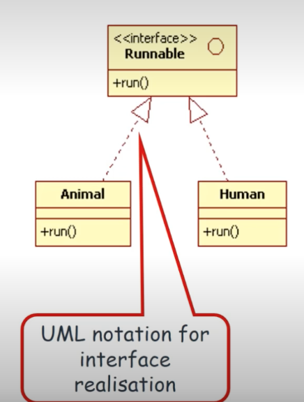<br>
</br>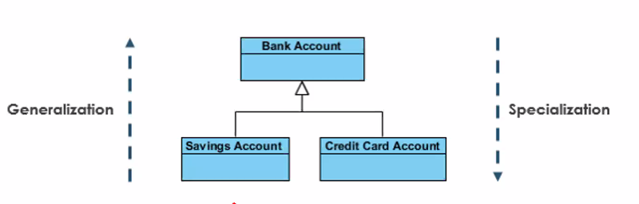<br>
</br>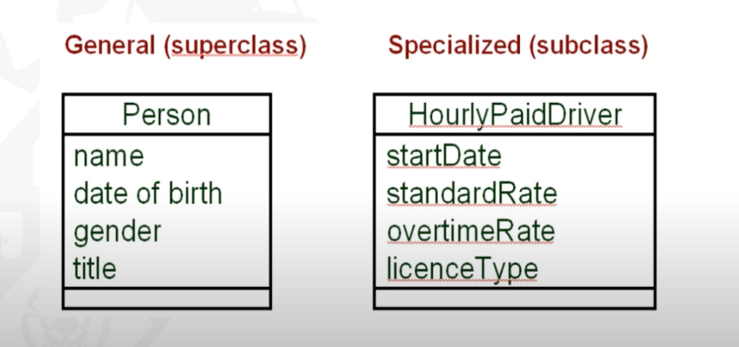<br>
</br>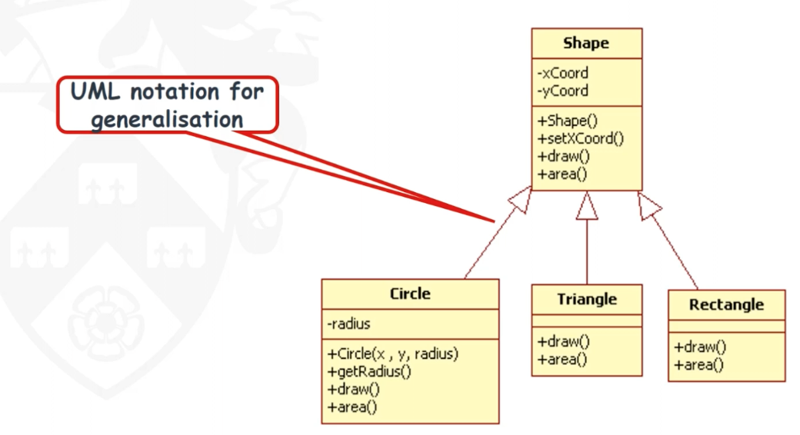<br>

## Finding and modelling composition (Aggregation, composition)

* Composition and aggregation are specific cases of association.
* Composition (or composite aggregation) is based on the concept of aggregation, which is a feature of many
  object-oriented programming languages.
    * **Aggregation** represents a **whole–part** relationship between classes,
        * Aggregation is a special type of association between classes, it is a “weaker” notion of the whole-part
          relation.
        * Unfilled diamond
        * **Composition** shows a **stronger form of ownership of the part by the whole**.
            * A composition is ‘stronger’ notion of whole-part relation.
            * Each part may belong to only one whole at a time. The whole and the parts share the same lifecycle. When
              the whole is destroyed, so are all its parts.
            * Filled diamond

* Composition and aggregation may both be identified during requirements analysis, but their main application is during
  design and implementation activities, where they can be used to encapsulate a structure of objects as a potentially
  reusable subassembly.
* **Difference between composition and aggregation** : Composition is stronger than aggregation which means the whole
  and
  the part share the same lifecycle. For composition, if you destroy the whole, the part will disappear. For
  aggregation, if you destroy the whole, the part may not disappear.

</br>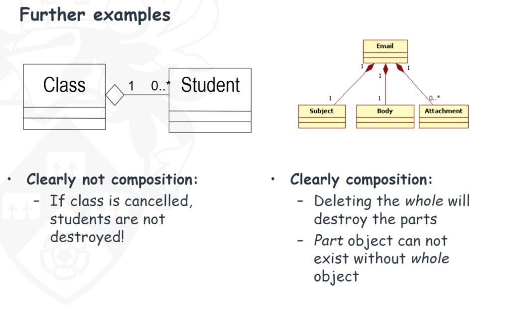<br>
</br>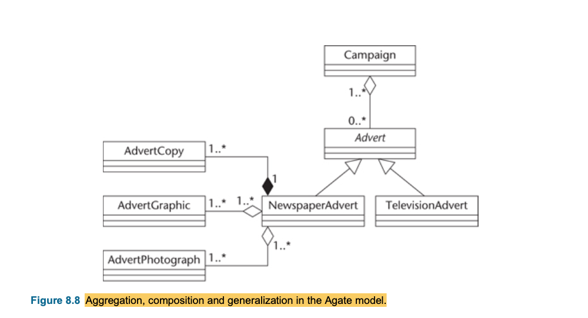<br>

# Class modelling

* Class modelling involves - static structure of the system
    * identifying possible classes,
    * adding associations, attributes and some operations and producing the first cut class diagram,
    * analysing possible inheritance, reusable components and updating the class diagram.

## Class Stereotypes

* Special use of a model element that is constrained to behave in a particular way
* Stereotypes are shown where they add useful meaning to a model, but their use is not obligatory.
* 3 type sterotypes which widely using: boundary, control and entity classes

### Boundry classes

* Boundary classes ‘model interaction between the system and its actors’ (Jacobson et al., 1999).
* Boundary class represents interaction with the user
  </br>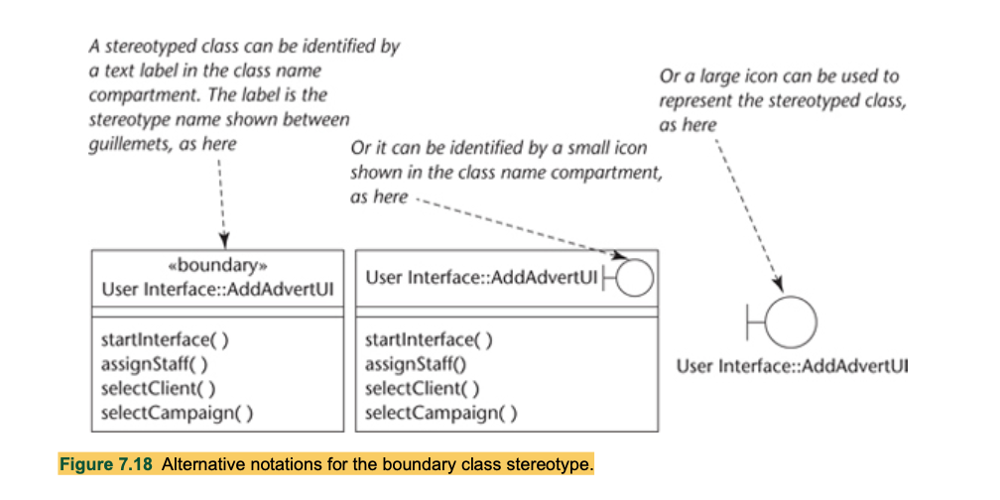<br>

### Entity classes

* Entity classes1 model ‘information and associated behaviour of some phenomenon or concept such as an individual, a
  real-life object or a real-life event’ (Jacobson et al., 1999).
* Instances of an entity class usually require persistent storage of their information. This can sometimes help to
  decide whether an entity class is the appropriate modelling construct.
* Entity classes represent the behaviour of things in the application domain and storage of information that is directly
  associated with those things (possibly including some elements of calculation and scheduling).

</br>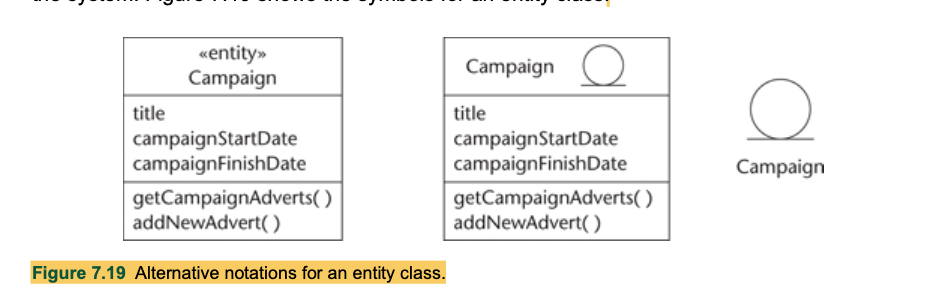<br>

### Control classes

* Control classes ‘represent coordination, sequencing, transactions and control of other objects’ (Jacobson et al.,
  1999).
* Control classes represent the calculation and scheduling aspects of the logic of their use cases —at any rate, those
  parts that are not specific to the behaviour of a particular entity class and that are specific to the use case

</br>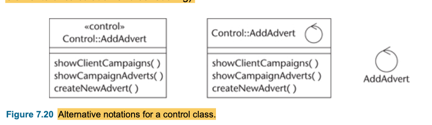<br>

## Guidelines for Identifying Classes

* **Only focus on entity classes in the requirement analysis phase**
    * _Class stereotypes can be omitted in the class diagram_
    * Boundary and control classes can be delayed until the system design phase
* Use cases are the best place to look for entity classes
* **General Rules:**
    * Read through the use case descriptions line by line, try to pick up only important  (physical)  things or  (
      abstract)  concepts in the application domain which store information or knowledge in order to achieve its
      objective.
    * Actors do not normally need to be modelled as entity classes as they stay out of the system boundary.
    * Not usually necessary to contain a class to represent the entire system.
        * for example University of York Administration System, since you will not have many instances of it.
    * If synonyms used, choose the one that is least ambiguous, least colloquial, or most frequently used. - ie, use
      Helicopter instead of chopper or whirlybird
    * Names needs to express a logical meaning rather than a physical implementation.
    * Be prepared to iterate
* **Ask yourself to be sure to model a class:**
    * Will have it separate attributes that will take on different values? - if yes then keep it as class
    * Will it be many intances? - if yes then it is a class.
    * If it only has meaning to describe another item rather than being described, then it is an attribute.
* **Consider:**
    * Operations (actions) are modelled as responsibilities for a class.
    * Associations may sometimes better be modelled as class.

## From Use Case to Class Diagram

* for the first class diagram
    * how many campaigns can a staff works on, this needs further clarification from the user.
* for the second class diagram
    * Is this the same Staff class as before, or it is just a subclass of Staff?
    * How many Clients contact can one staff have?
* for third class diagram
    * Can an advert belong to more than one campaign? If so, this could be just a normal association, not an
      aggregation.

</br>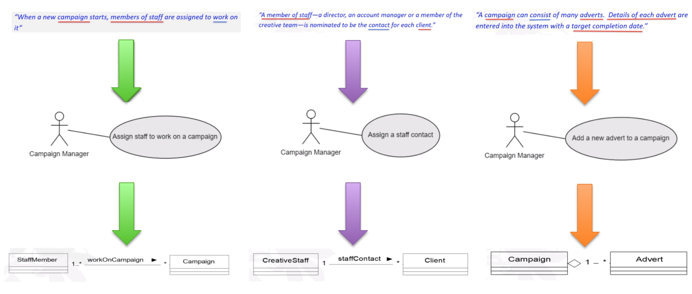<br>

# Interaction modelling

* **Use case realization** is how the objects from each use case work together to deliver the overall functionality for
  the use case
    * Use case realisation is how we develop the use case model into another model that is closer to its
      implementation/function
* Letting us depict how objects from each use case work together to deliver the use cases function
* How to identify classes from use cases
    * The class modelling (use case -> class diagram) has given us the structure
    * How do we depict functionality of use cases?
    * Interaction modelling will help and is the second step in the requirement analysis phase
* A sequence diagram shows elements as they interact, organised according to objects (horizontally) and time (
  vertically)
* We can prepare to make a sequence diagram by using CRC cards
* The second step in the requirement phase is interaction modelling
* Interaction and collaboration between objects leading to the identification of classes, their attributes and their
  associated responsibilities.
* What is object interaction?
    * rather than think in terms of operation invocation we use the metaphor of message passing to describe object
      interaction, as this emphasizes that objects are encapsulated and essentially autonomous.
* What is the aim of modelling object interactions?
    * The aim of modelling object interaction is to determine the most appropriate scheme of messaging between objects
      in order to support a particular user requirement.
* Once the CRC cards and sequence diagram is complete, the class diagram can be revised with attributes and operations

## Class Responsibility Collaboration Cards (CRC)

* Class Responsibility Collaboration (CRC) cards provide an effective technique for exploring the possible ways of
  allocating responsibilities to classes and the collaborations that are necessary to fulfil the responsibilities
    * CRC provides an effective technique for exploring the possible ways of allocating responsibilities to classes and
      the collaboration that are necessary to fulfil the responsibilities.
* CRC cards can also be used effectively when designing object interaction in more detail to identify and allocate
  operations.
* Responsibilities are a high level description of what a class can do
* Role play the interaction and negotiate the most appropriate responsibility allocation.
* Usage:
    * Conduct brainstorming session
        * Which objects are involved in use case
    * Allocate object to team member who will role play the object
    * Act out use case
        * Exploring responsibilities and collaboration
    * Identify and record any missing or redundant objects

* Team members can take these strategies:
    * Each role player tries to be lazy and they persuade other players their classes should accept responsibility for a
      given task.
    * Each role player tries to be hardworking and they persuade other players their class should not accept
      responsibility for a given task.
* The results are recorded in CRC cards paper CASE.

</br>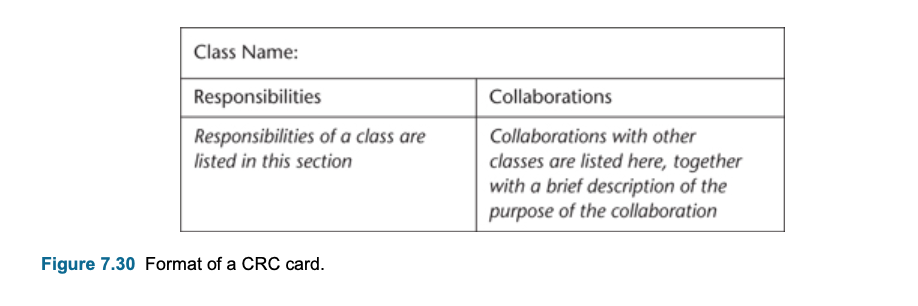<br>
</br>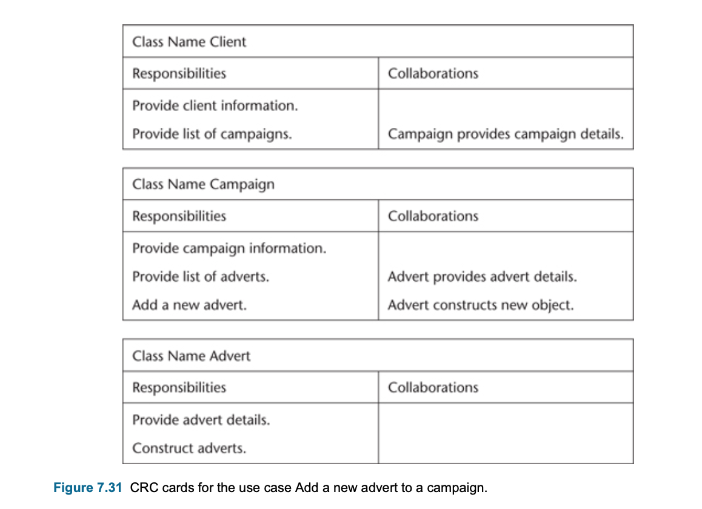<br>

## Sequence diagram notations

* [What is Sequence diagram ?](https://www.visual-paradigm.com/guide/uml-unified-modeling-language/what-is-sequence-diagram/)
* Lifeline: Represents an individual participant in the interaction
* Activations: Period during which an element is performing an operation
* Message: A message defines a particular communication between lifelines of an interaction
* Create message: message that represents the instantiation of (target) lifeline
* Destroy message: message that represents the request of destroying the lifecycle of target lifeline
* Self message: message starts and finishes to the same lifeline
* Recursive message: message starts and finishes to lifeline on top of the activated lifeline

</br>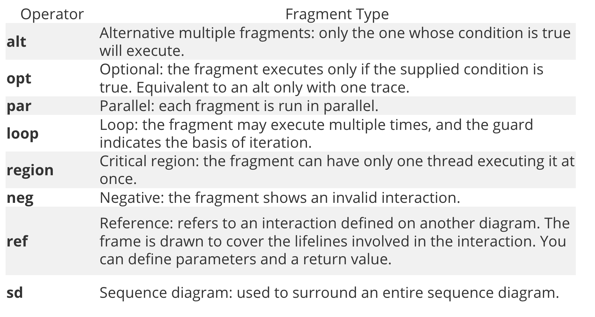<br>
</br>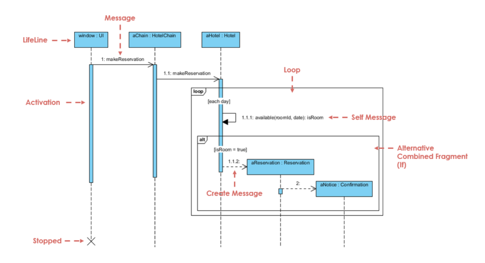<br>
</br>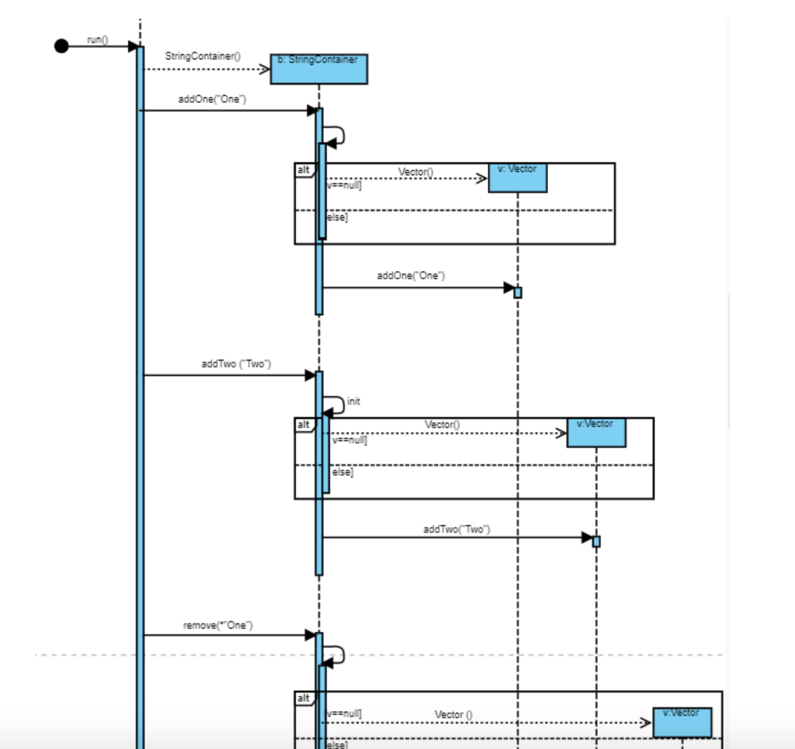<br>
</br>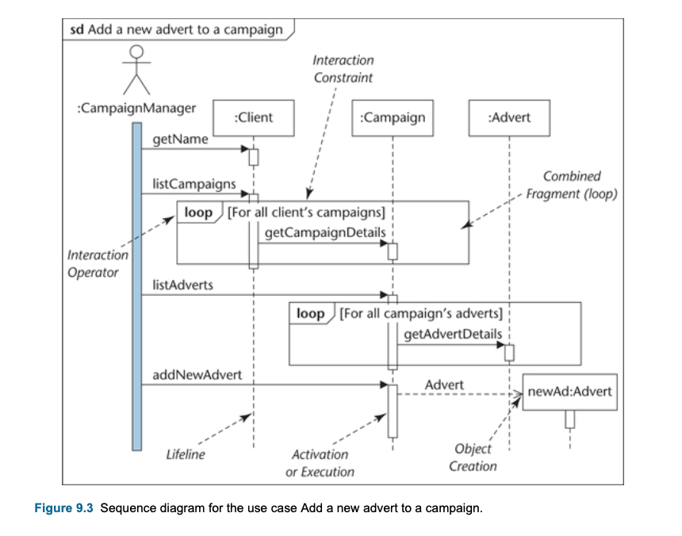<br>

# Questions:

* What is the differences between class and instance attributes?
    * Class attributes are shared amongst all instances of that class. An instance attribute is local to that object
      instance

</br>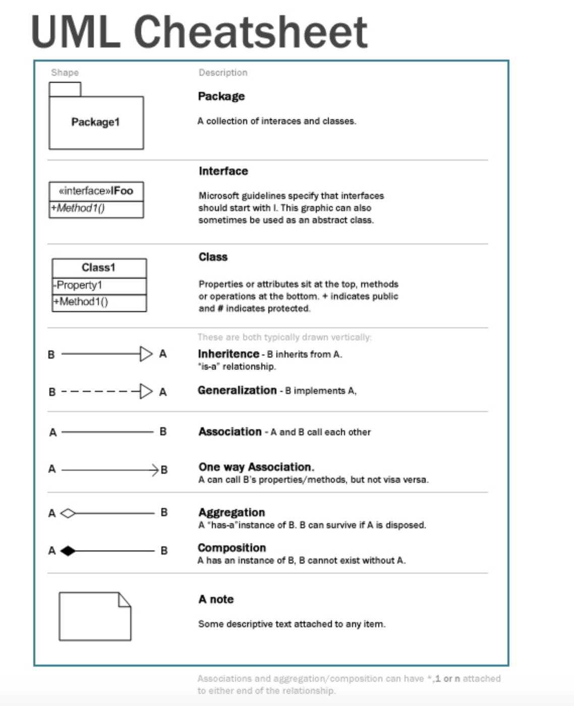<br>

# Sources

[UML Cheatsheat](https://yetanotherchris.dev/cheatsheet/uml-cheat-sheet/) <br>
[UML Cheatsheat 2](https://loufranco.com/wp-content/uploads/2012/11/cheatsheet.pdf) <br>
[UML Cheatsheat 3](https://www.guru99.com/uml-cheatsheet-reference-guide.html) <br>
[Association vs. Dependency vs. Aggregation vs. Composition](https://nirajrules.wordpress.com/2011/07/15/association-vs-dependency-vs-aggregation-vs-composition/) <br>

[VP Class diagram](https://online.visual-paradigm.com/diagrams/tutorials/class-diagram-tutorial/)
[VP Sequence Diagram](https://online.visual-paradigm.com/diagrams/tutorials/sequence-diagram-tutorial/)

# WEEK 4

#### Main Topics

1) Specify constraints and operations for a class diagram using OCL <br>
2) Model state related behaviour using state machines <br>

Relevant module learning outcomes for this week:

* Investigate and analyse a problem, write a software requirement specification and design blueprint expressed in UML
  which provides a basis for code generation

#### Title

* Lesson 1 : Operation specification with natural language
* Lesson 2 : Operation specification with OCLE
* Lesson 3 : State modelling

#### Sub titles:

* [Operation specification](#operation-specification)
    * [Describing Operation logic](#describing-operation-logic)
        * [Non-algorithmic approaches - declarative](#non-algorithmic-approaches-declarative)
        * [Algorithmic approaches - procedural](#algorithmic-approaches-procedural)
* [Object constraint language (OCL)](#object-constraint-language-ocl)
    * [OCL Keywords](#ocl-keywords)
    * [Examples](#examples)
        * [Bank Account](#bank-account)
        * [Campaign](#campaign)
        * [Person](#person)
        * [Crate](#crate)
* [State Machines](#state-machines)
    * [State Modelling](#state-modelling)
    * [Notation](#notation)
    * [Preparing a State Machine](#preparing-a-state-machine)
        * [Behavioural Approach](#a-behavioural-approach)
        * [Lifecycle Approach](#a-lifecycle-approach)
    * [Questions](#questions-for-state-machine)
* [Summary](#summary)
* [Sources](#sources)

# Operation specification

* Specify what an operation should do.
    * Operation specifications describe the detailed behaviour of the system.
* The two general ways of doing this are respectively called ‘algorithmic’ (or ‘procedural’) and ‘non-algorithmic’ (or
  ‘declarative’).
* Some common technics :
    * White box: (How)
        * Structured English or Pseudo-Code
        * Activity Diagram
    * Black box: (What)
        * Pre and post-condition pairs
            * Pre-conditions: condition must be true before an operation execute
            * Post-condition: Result of an operation after its execution

* **Analysis by contract** is a preferred approach for object oriented development
    * Typically written as pre and post condition pairs:
    * Focus on **what** the operation should achieve (a black box approach) rather than **how** the operation should
      work (a white box approach).

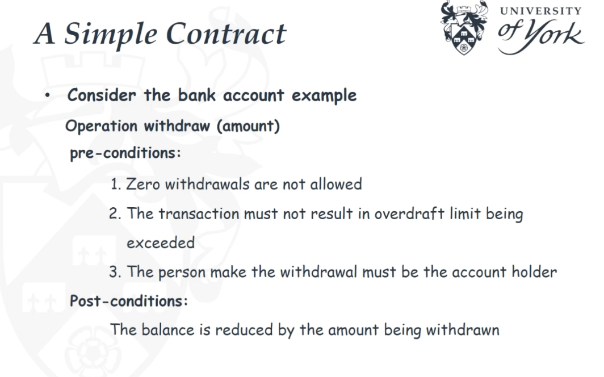

* Two main purposes of an operation specification
    * From an analysis perspective, an operation specification is created at a point when the analyst’s understanding of
      some aspect of an application domain can be fed back to users, ensuring that the proposals meet users’
      requirements.
    * From a design perspective, an operation specification is a basis for a more detailed design specification, which
      later guides a programmer to a method that is an appropriate implementation of the operation in code. An operation
      specification can also be used to verify that the method does indeed meet its specification, which in turn
      describes what the users intended, thus checking that the requirements have been implemented.
* Specification by contract means that operations are defined primarily in terms of the services they deliver, and the
  input they receive (usually just the operation signature).

## Describing Operation Logic

* There are 2 ways:
    * Non-algorithmic approaches (declarative):
    * Algorithmic approach (procedural):

### Non-algorithmic approaches (declarative):

* A non-algorithmic approach concentrates on describing the logic of an operation as a black box.
* Why generally preferred in OO world:
    * First, the implementation of a class should be hidden from the rest of the system and thus only the designers and
      programmers responsible for a particular class need concern themselves with internal implementation details.
    * Second, process carried out by any one operation is simple, it does not require a complex specification.
* 2 types :
    * **Decision table:**
        * is a matrix that shows the conditions under which a decision is made, the actions that may result and how the
          two are related
        * Situations that require non-algorithmic specification of logic, reflecting a range of alternative behaviours
    * **Pre and post-condition:**
        * any operation specification must pass the following two tests.
            * A user should be able to check that it correctly expresses the business logic.
            * A class designer should be able to produce a detailed design of the operation for a programmer to code.

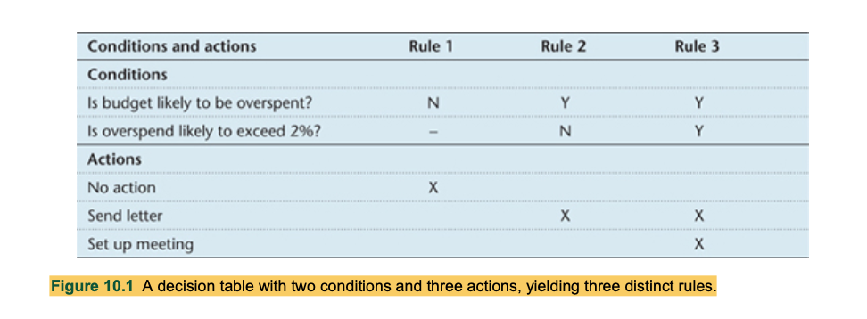

### Algorithmic approaches (procedural)

* An algorithm describes the internal logic of a process or decision by breaking it down into small steps, and sequence
  of steps
* 4 types :
    * **Control structures in algorithms:**
        * Algorithms are generally organized procedurally, which is to say that they use the fundamental programming
          control structures of sequence, selection and iteration
    * **Structured English :**
        * This is a ‘dialect’ of written English that is about halfway between everyday non-technical language and a
          formal programming language.
        * 3 type control structure:
            * if-then-else
            * nested if (case)
            * iteration
                * do while : ending the repetition tested before
                * repeat until: ending the repetition tested after
    * **Pseudo-code:**
        * Pseudo-code differs from Structured English in that it is closer to the vocabulary and syntax of a specific
          programming language
        * pseudo-code remains only a skeleton of a program, intended only to illustrate its logical structure without
          including full design and implementation detail
    * **Activity diagrams**
        * Activity diagrams can be used to specify the logic of procedurally complex operations

# Object constraint language (OCL)

* For any OCL expression, you need to specify the context. The context of an invariant is normally a class.
* An invariant means a property of a model element is always true.
    * The example specifies the invariant that a customer should be no less than 18 years old.
* Pre- or Post-conditions is always an operation
    * **pre** **and** post are the keywords
* OCL is used to specify invariants of objects and pre- and post conditions of operations. Makes UML (class)
  diagrams more precise.
* OCL is an excellent tool for formally specifying the constraints and operation contracts that cannot be expressed in a
  UML model, e.g. class diagrams.
* OCL expressions use vocabulary of UML class diagram. OCL is a pure expression language with its expressiveness in
  terms of UML object models.
* OCL attribute accesses “navigate” through UML class diagram.
* Queries (= side-effect-free operations) can be used in OCL
  expressions.

### **OCL keywords:**

* context :  specifies about which elements we are talking.
* inv
* pre - post
* self : keyword is similar to the keyword this in Java.
* @pre : indicates the value of an attribute or association at the start of the execution of the operation. @pre can
  only be used in a post-condition expression.
* result : is similar to the return statement in Java
* and - or - not
* implies,
* if - then - else - endif

#### **OCL Data types**

* Real: *, +, -, * , /,  >=, <=, >, <
* Integer : *, +, -, * , /,  >=, <=, >, <
* String : size()
* Boolean : and - or - not, implies, if - then - else - endif

#### **OCL arithmetic operators**

* +, -, * and /

#### **OCL comparison operators**

* <, > =, <=, >,

#### **String operation**

* size

#### **OCL Set operators**

* size():integer
* isEmpty()
* notEmpty()
* select(Boolean Expression): collection : returns sub collection for a given condition
* count(object): integer
* sum()
* exists(Boolean Expression): Boolean : checks whether there exist any elements that satisfy a condition
* forAll(Boolean Expression): Boolean : checks whether there for all elements that satisfy a condition
* includes(object):Boolean
* excludes(object):Boolean : not yet
* including(object):collection : to add
* excluding(object):collection
* collect(a property):collection : returns different collection of the property

#### **OCL type operators**

* oclIsTypeOf : operation to check whether an object is a particular type as specified in the parameter. For example, in
  the Context of Customer, the self object should be of type of Customer so a truth value is expected to be returned.

#### **Properties on a class diagram**

* classes,
* attributes,
* association roles
* query operations
* Enumeration type

#### **Navigator**

* Dot notation .
* Association-ends by navigations: The result of navigation is either a model or a collection of a model types

#### **Notation for collection feature call**

* Arrow ->
    * A property of the collection itself is accessed by using an arrow ‘->’ followed by the name of the property

```
context
Person
inv:
    self.employer->size() < 3 
```

#### **Comment notation**

* Double hyphen

#### Logic

* True OR-ed with anything is True
* False AND-ed with anything is False
* False IMPLIES anything is True
* anything IMPLIES True is True

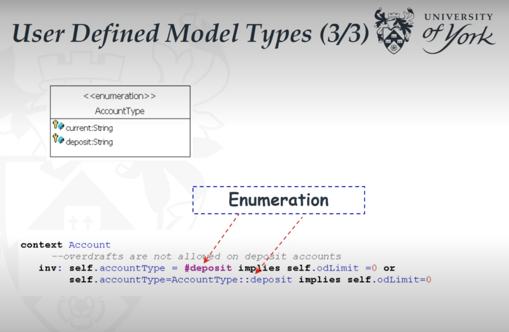

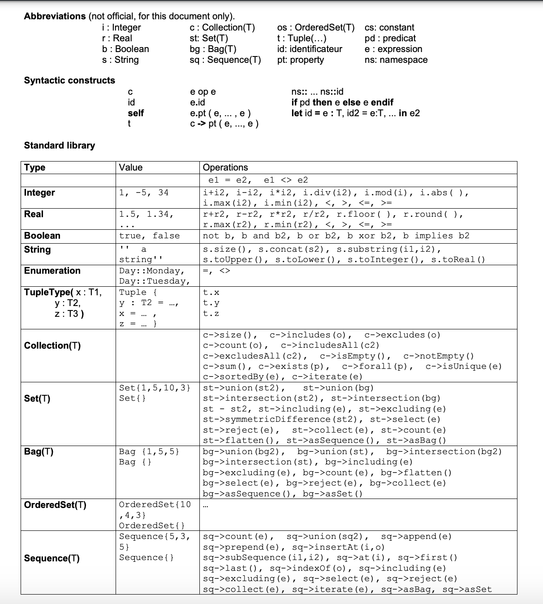

## Examples

```
// -- Invariants
context Company
inv: self.numberOfEmployees > 50

context c:Company
inv: c.numberOfEmployees > 50

context c:Company
inv enoughEmployees: // -- named invariant
    c.numberOfEmployees > 50

// -- Pre and Post conditions
context Person::income(d:Date):Integer
post: result = 5000

context Person::income(d:Date):Integer
pre: d > 2000
post: result = 5000

context Person::income(d:Date): Integer // -- with optional condition names
pre: parameterOK: d > 2000
post: resultOK: result = 5000

// -- Let Expression :The let expression allows one to define a variable which can be used in the constraint.

context Person
inv: let income: Integer = self.job.salary->sum() in
    if isUnemployed then
        income < 100
    else
        income >= 100
    endif

// Combine Props
// [1] Married people are of age >= 18
context Person
inv:
    self.wife-> notEmpty() implies self.wife.age >= 18 and 
    self.husband->notEmpty() implies self.husband.age >= 18

// [2] a company has at most 50 employees
context Company
inv:
    self.employee->size() <= 50

```

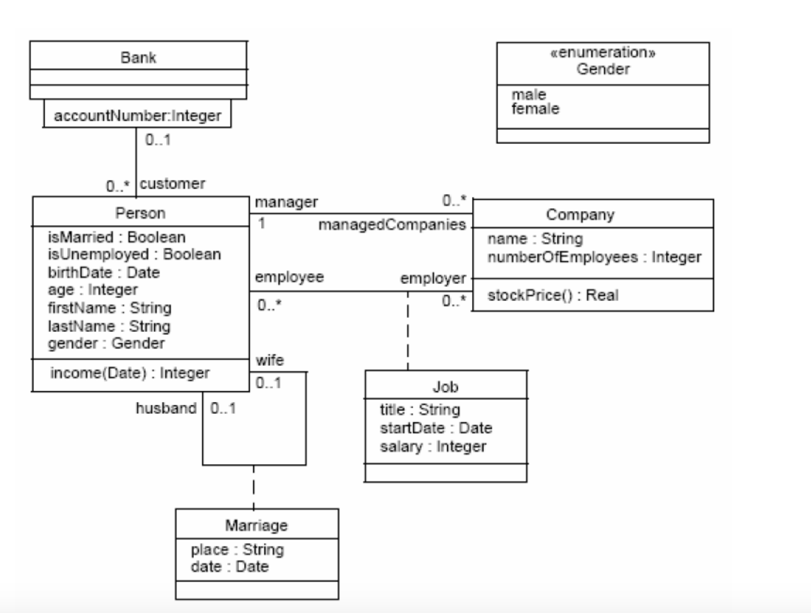

### Pre- Post  constraints

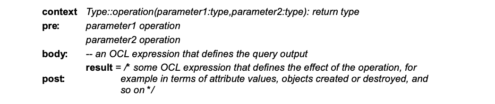

### Properties: AssociationEnds and Navigation

* Starting from a specific object, we can navigate an association on the class diagram to refer to other objects and
  their properties.
* To do so, we navigate the association by using the opposite association-end:
    * ```object.associationEndName```
* The value of this expression is the set of objects on the other side of the associationEndName association.
    * If the multiplicity of the association-end has a maximum of one (“0..1” or “1”), then the value of this expression
      is an object.
* By default, navigation will result in a Set. When the association is adorned with {ordered}, the navigation results in
  an OrderedSet.
* When the name of an association-end is missing at one of the ends of an association, the name of the type at the
  association end starting with a lowercase character is used as the rolename.

```
context
Company
inv: self.manager.isUnemployed = false // -- self.manager is a Person, because the multiplicity of the association is one
inv: self.employee->notEmpty()  // -- is a set
```

### Iterate Operation

* The operations **reject, select, forAll, exists, collect,** can all be described in terms of iterate. An accumulation
  builds one value by iterating over a collection.
    * ``` collection->iterate( elem : Type; acc : Type = <expression> | expression-with-elem-and-acc ) ```

```
collection->collect(x:T | x.property)
// -- is identical to:
collection->iterate(x:T ;acc : T2 = Bag{} | acc->including(x.property))


self.employé->select(age > 50)
self.employé->select(p | p.age > 50)
self.employé->select(p:Personne | p.age > 50)
self.enfants->forall(age < 10)
self.enfants->exists(sexe = Sexe::Masculin)


// The complete select syntax now looks like one of:
    collection->select(v:Type | boolean - expression -with-v) 
    collection->select(v | boolean - expression -with-v)
    collection->select(boolean - expression)

```

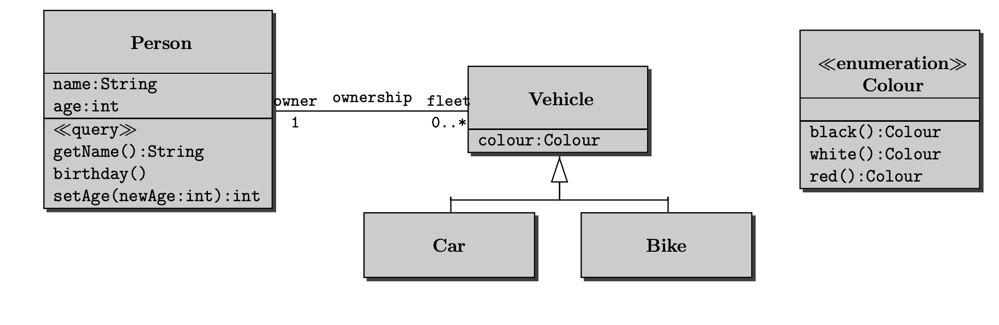

```
// A vehicle owner must be at least 18 years old
context Vehicle
inv: self.owner.age >=18

// A car owner must be at least 18 years old
context Car
inv: self.owner.age >=18

// Nobody has more than 3 vehicles
context Person
inv: self.fleet -> size() <=3

// All cars of a person are black
context Person
inv: self.fleet -> forAll(v | v.colour = #black)

// Nobody has more than 3 black vehicles
context Person
inv: self.fleet- select(v | v.colour= #black)-> size()<=3

context Person
inv: self.fleet–>iterate(v; acc:Integer=0
    | if (v.colour=#black)
    then acc + 1 else acc endif) <=3

// A person younger than 18 owns no cars.”
context Person
inv: age<18 implies self.fleet–>forAll(v | not v.oclIsKindOf(Car))

// These is a red car
context Car
inv: Car.allInstances()->exists(c | c.colour=#red)

// Apply operations
// “If setAge(. . . ) is called with a non-negative argument then the argument becomes the new value of the attribute age
context Person::setAge(newAge:int)
pre: newAge >= 0
post: self.age = newAge

// Calling birthday() increments the age of a person by 1.
context Person::birthday()
post: self.age = self.age@pre + 1

// Calling getName() delivers the value of the attribute name.
context Person::getName()
post: result = name
```

### Bank Account

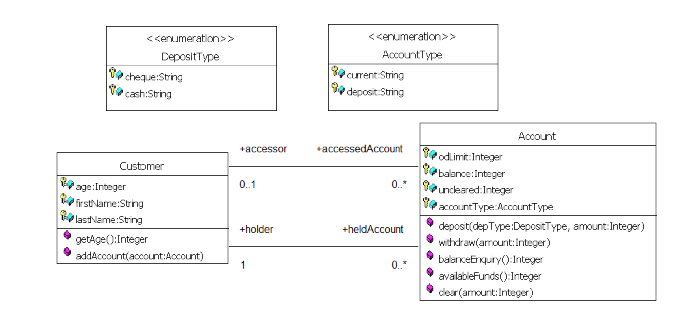

```
// CUSTOMER
context Customer
//--Test comparison operator
inv: (firstName<>lastName) <>  (firstName=lastName)

//--oclIsTypeOf
inv: self.oclIsTypeOf(Customer)

//-- Navigation result is a collection
inv: self.heldAccount->size()<=5

//-- Query operation
inv: self.getAge()>=18

//--Query operation with brackets omittted
inv: self.getAge>=18

//--Customer should have at least one account with balance more than 200
inv: self.heldAccount -> select (balanceEnquiry()>200) ->notEmpty or
self.heldAccount -> exists (balanceEnquiry()>200)

//--Customer should have all accounts with balance more than 200
inv: self.heldAccount -> forAll (balanceEnquiry()>200)

//-- A customer can have no more than 5 accounts
//-- Navigation result is a collection
inv: self.heldAccount->size()<=5

/* Customer must be no less than 18 years old*/
inv: age>=18

inv: self.age>=18

//-- The sum of a Customer balance for all accounts should be no less than 10
inv: self.heldAccount->collect(balanceEnquiry())->sum>=10

/* Customer must be no less than 18 years old*/
inv: age>=18
inv: self.heldAccount->collect(balanceEnquiry())->sum>=1000

context Customer::addAccount(account:Account)
// --the person shouldn't already own the account
pre: not heldAccount->includes(account)
//--the acount is owned by the new customer and account is added to the customer
post:(account.holder = self) and
heldAccount = heldAccount@pre->including(account)

// ACCOUNT
context Account
//-- An account can only have one holder
inv zero: self.holder->size = 1

//-- overdraft limit may not exeed
inv one: 	self.balance >= -self.odLimit

//-- customer under 18 years of age are not allowed overdrafts
//-- Navigation result is a query operation
inv two: 	self.holder.getAge()<= 18 implies self.odLimit =0

//--overdrafts are not allowed on deposit accounts
inv three: 	self.accountType = #deposit implies self.odLimit =0 or
self.accountType=AccountType::deposit implies self.odLimit=0


context Account::deposit(depType: DepositType, amount:Integer)
//-- zero deposits are not allowed
//-- the deposit must be applied to the right account
pre:	amount>0 and accessor = holder
// --if the amount deposited is in cash,
// --if is added to the balance; if it is a cheque, it is added to the uncleared amount
post:	(depType=#cash implies self.balance = balance@pre + amount) or
(depType=#cheque implies self.uncleared = uncleared@pre + amount)


context Account::withdraw(amount:Integer)
//--zero withdrawals are not allowed
//--the transaction must not result in the overdraft limit being exceeded
//--the person making the withdrawal must be the account holder
pre:amount>0 and
balance-amount>= -odLimit and
accessor = holder
//--the balance is reduced by the amount withdrawn
post:balance = balance@pre-amount


context Account::balanceEnquiry():Integer
//--balance details may only be given to the holder of the account
pre: accessor = holder
//--the balance is returned
post: result = balance


context Account::availableFunds():Integer
//--details of funds available may only be given to the holder of the account
pre: accessor = holder
//--the available fund are calculated from the current balance and the customer's overdraft limit
post: result = balance + odLimit


context Account::clear(amount:Integer)
//--you cannot clear more than the cleared amount
pre: uncleared>=amount
//--the cleared amount is subtracted from the uncleared amount
//--the balance is increased by the cleared amount
post: (uncleared = uncleared@pre + amount) and
(balance = balance@pre + amount)

```

### Campaign

```

context Campaign
inv: self.estimatedCost=self.advert.getEstimatedCost()->sum() *(1 + ohRate)

context Campaign::upDateEstimatedCost()
post:
if self.estimatedCost > estimatedCost@pre and
    self.estimatedCost>budget and
    self.estimatedCost<= budget*1.02
then self.clientLetterRequired= 'true'
else self.clientLetterRequired = 'false'
endif

context Campaign::checkCampaignBudget():Real
pre: self<> 'null'
post: result=self.budget-self.estimatedCost and
self.estimatedCost=self.advert.getEstimatedCost()->sum()


context CreativeStaff::changeGrade(grade:Grade, gradeChangeDate:Date)
pre: grade.oclIsTypeOf(Grade)and
gradeChangeDate.isNotEarlierThan(today)
post: self.staffGrade->notEmpty and
self.staffGrade.previous->notEmpty and
self.staffGrade.getGradeStartDate()=gradeChangeDate and
self.staffGrade.previous.getGradeFinishDate()=gradeChangeDate.minus(1)

```

### Person

```
context Person
inv: self.gender=Gender::male or self.gender=Gender::female
inv: self.savings>=500
inv: self.husband->notEmpty() implies self.husband.gender=Gender::male
context Company
inv: self.CEO->size()<=1
inv: self.employee->select(self.employee.getAge<60)->size()<100N
```

### Crate

```
context Crate
// -- the number of bottles may not exceed its capacity
inv: bottles->size()<=capacity
// --each bottle must fit in the crate
inv: bottles->forAll (b|b.getDiameter<self.maxDiameter)
// -- the total weight must be less than the maximum
inv: totalWeight() <= maxWeight
// -- totalWeight() is derived
inv: totalWeight() = self.bottles.totalWeight()->sum() + self.weight

context Crate::addBottle( b : Bottle )
// -- there must be room in the crate
pre: bottles->size() < capacity
// -- the maximum weight for the crate may not be exceeded
pre: totalWeight() + b.totalWeight() <= maxWeight
// -- the bottle is not yet in the crate
pre: bottles->excludes(b)
// --the bottle is added successfully>br/>  
post: bottles = bottles@pre->including(b)
```

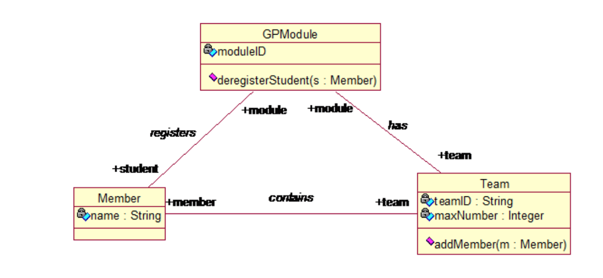

```
// There are two pre-requisites for a GPModule team: the number of members on a team should be no more than maxNumber and a team ID should contain no more than 10 characters.
context Team 
inv f1: member->size()<=maxNumber
inv f2: teamID.size()<=10

// The operation addMember is used to allocate a member to a team. It has two pre-requisites that the member does not belong to any team and the team cannot exceed a maximum number limit by adding the member. It has one post-requisite that the member is successfully allocated to the team.
context Team::addMember(m:Member)
pre: m.team->size()=0 and
     member->size()<maxNumber
post: member->includes(m)

// The operation deregisterStudent is used to deregister a student when a student quits a module. It has one pre-requisite that the student must be one of the students who is registered to the module. It has two post-requisites that the student is not registered with the module and the student is removed from his/her team.
context GPModule::deregisterStudent(s:Member)
pre:student->includes(s)
post:student->excludes(s) and s.team->size()=0


```

## Exam Questions

### 2018

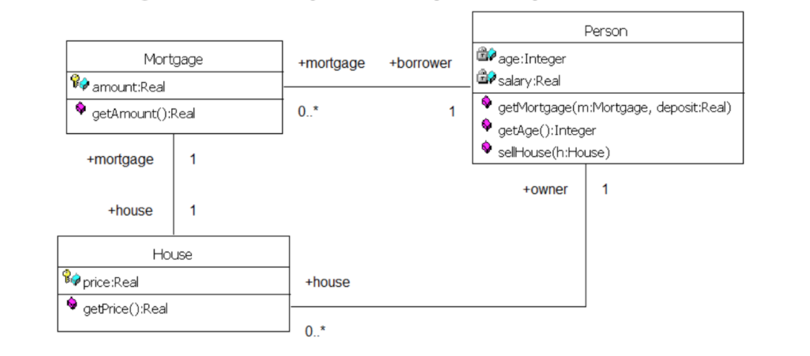

```
// 1 [8 marks] There are two pre-requisites for a mortgage: 
// i) the age of the borrower must be no less than 18 and no more than 65 years old and 
// ii) the borrower of a mortgage on a house must be the owner of the house.
context Mortgage
inv f1: self.borrower.getAge()>=18 and  self.borrower.getAge()<=65
inv f2: self.borrower = self.house.owner

//2. [12 marks] The operation getMortgage is used to access a mortgage for a borrower. 
// It has two pre-requisites: i) a minimum deposit of 5% of the house’s value is needed for a mortgage and 
// ii) by receiving the mortgage the total amount of the borrower’s mortgage will not exceed five times of his/her salary. It has one post-requisite that the mortgage is successfully granted to the applicant.
context Person::getMorgage(m: Morgage,d: deposit)
pre: self.home.getPrice() * 0.05 <= d and
    self.morgage.getAmount()->sum() + m.getAmount() < self.salary * 5
post: self.morgage->includes(m)

//3. [10 marks] The operation sellHouse is used for a house owner to sell his house. It has
// one pre-requisite that the house in question belongs to the owner. It has two post-
// requisites: i) the house is successfully sold and ii) the mortgage for the house is removed from the house owner.
context Person::sellHouse(h: House)
pre: self.house->includes(h)
post: self.house->excludes(h) and
    self.morgage.house->excludes(h)

```

### 2017

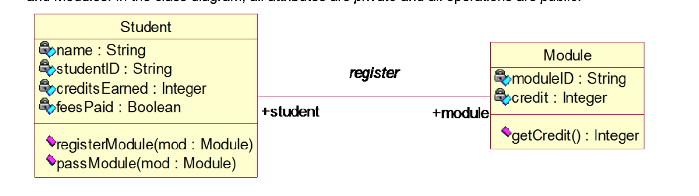

```
// 1. [8 marks] There are two pre-requisites for a module: the moduleID should contain exactly four characters and the number of students on each module must be at least 10.
context Module
inv f1: self.moduleId.size()=4
inv f2: self.student->size()>=10


// [12 marks] The operation registerModule is used to register a student to a module. It has two pre-requisites: that the student must not already be registered to that module; and the student has paid for the fees. It has one post-requisite: that the student is successfully registered.
context Student::registerModul(mod : Module)
pre: self.module->excludes(mod) and
    self.feesPaid=true
post: self.module->includes(mod)

//  [10 marks] The operation passModule is used to update student credits earned when they pass 	a module. It has one pre-requisite: that the module must be one of the modules the student has been registered to. It has one post-requisite: that the creditsEarned now held in the object Student must be equal to the previous credit with the credit of this module added into the total.
context Student::passModule(mod: Module)
pre: self.module->includes(mod)
pro: self.creditEarned= self.creaditEarn@pre + mod.getCredit()

```

# State Machines

* State Machine models one class, how it responds to all the events that affect it.
* All objects have a state, and it determines the value of the object attribute value.
* A state occupies for a period of time
* Not all events cause a state-change
* Object performs a different action for the same event depending on the object's state.
* State modelling can help to identify the operations that are required
* To model state related behaviour, UML state machines are used.
* A state machine is a description of all the possible lifecycles that an object of a class might follow
    * State machines model one class, how it responds to all the events that affect it
    * It can also be seen as a more detailed view of a class.

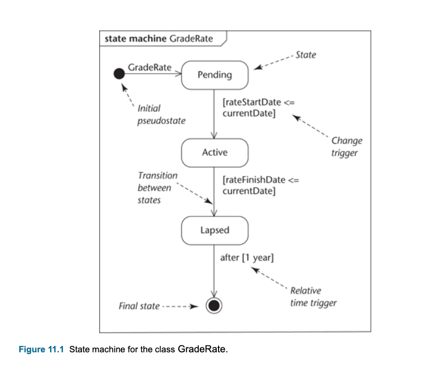

## State Modelling

* Collect together all events, from all sequence diagrams, for one class.
* The first step is to check the classes with heavy messaging.
* Examine which one cause state change and result states,
* This gives us first cut state chart with a few states and events.
* We should revise accordingly the class diagram.
* Needs to check always:
    * Every event should appear as an incoming message for the appropriate object on an interaction diagram (s).
    * Every event should correspond to an operation on the appropriate class (but note that not all operations
      correspond to events).
    * Every action should correspond to the execution of an operation on the appropriate class.
* In sequence diagram , we can see the objects on top as participant and messages are events.

## Notation

* Initial pseudostate : starting point, indicated by a small solid filled circle
    * This is only a notational convenience. An object cannot remain in its initial pseudo state, but must immediately
      move into another named state
* Final state : final state, is shown by a bull’s-eye symbol.
    * This too is a notational convenience and an object cannot leave its final state once it has been entered.
* State :
* Transition : Movement from one state to another, and is initiated by a trigger.
* Trigger : is an event that can cause a state change
    * When its triggering event occurs a transition is said to fire
    * A transition is shown as an open arrow from the source state to the target state.
* Change trigger : occurs when a condition becomes true,This is usually described as a Boolean expression (true/false).
  First and last transitions does not have this.
    * This form of conditional event is different from a guard condition, which is normally evaluated at the moment that
      its associated event fires.
* Call trigger : occurs when an object receives a call for one of its operations, either from another object or from
  itself
    * Call triggers correspond to the receipt of a call message and are annotated by the signature of the operation as
      the trigger for the transition.
* Signal trigger : occurs when an object receives a signal
    * As with call triggers the event is annotated with the signature of the operation invoked.
    * There is no syntactic difference between call triggers and signal triggers, It is assumed that a naming convention
      is used to distinguish between them.
    * **A call trigger is a normal message, a signal trigger is an asynchronous message**
* Relative time trigger : is caused by the passage of a designated period of time after a specified event (frequently
  the entry to the current state)
    * Relative time triggers are shown by time expressions near the transitions.
* Guard condition (Guard) : is a Boolean expression that is evaluated at the time the trigger fires
    * The transition only takes place if the guard condition evaluates to true
    * A guard condition is a constraint that may involve parameters of the trigger, attributes or links of the object
      that owns the state machine.
    * A guard is shown in square brackets—‘[‘...’]’.
    * [contractSigned] is a guard condition in example
* Activity-expression : is executed when a trigger causes the transition to fire
    * begins with the ‘/’ delimiter character
    * setCampaignActive is example
    * activity-expression with multiple actions
        * **left-mouse-down(location) [validItemSelected] / menuChoice = pickMenuItem(location); menuChoice.highlight**
* Action : are considered to be atomic (that is, they cannot be subdivided) and cannot be interrupted once they have
  been started
    * ‘run-to- completion’ : Once initiated this action must execute fully before any other action is considered
    * What does an action start with /

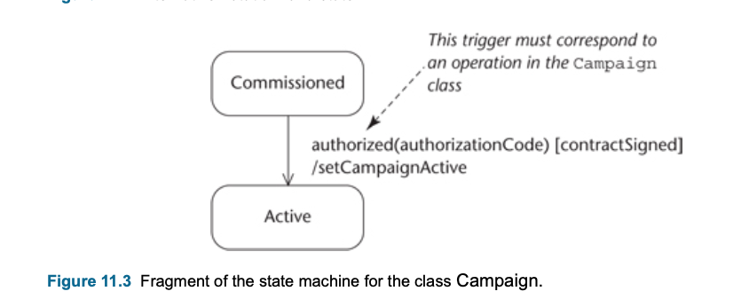<br>
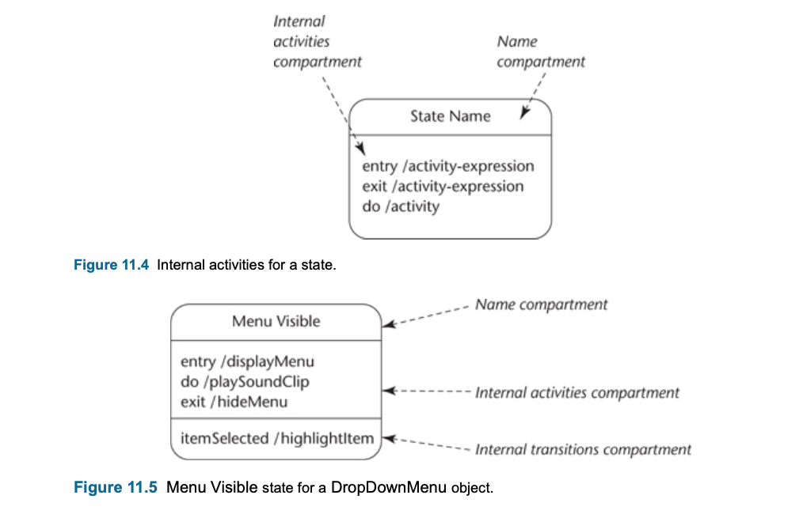

* The name compartment holds the name of the state. States may be unnamed and anonymous.
* State internal activity : The internal activities compartment lists the internal activities or state activities that
  are executed in that state
    * State activities may ‘persist’ for a period of time, perhaps the duration of the state
    * Three kinds of internal event have a special notation.
        * Entry activities and the exit activities
            * These cannot have guard conditions as they are invoked implicitly on entry to the state and exit from the
              state respectively.
            * may also involve parameters of incoming transitions (provided that these appear on all incoming
              transitions) and attributes and links of the owning object
            * It is important to emphasize that any transition into a state causes the entry activity to fire and all
              transitions out of a state cause the exit activity to fire.
            * **‘entry’ ‘/’ activity-name ‘(’ parameter-list ‘)’**  and  **‘exit’ ‘/’ activity-name ‘(’ parameter-list
              ‘)’**
    * do activity
        * **‘do’ ‘/’ activity-name ‘(’ parameter-list ‘)’**
* Internal transition : compartment lists internal transitions.
    * Each of these transitions is described in the same way as a trigger.
    * Internal transitions do not cause a state change and do not invoke the exit or entry activities.
* Vertex: Each node in a state machine diagram

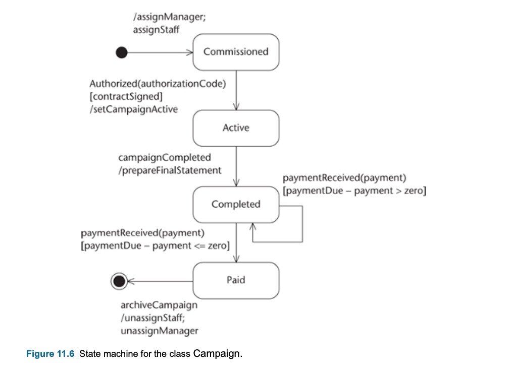<br>

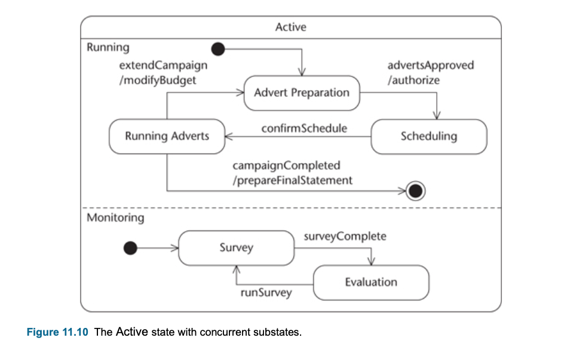

* Composite states : is the state that has several substates, nested states.
    * A single state that contains a nested state diagram within it known as **submachine**
    * Submachine syntax : state name ‘:’ reference-state-machine–diagram-name
* Concurrent states : as a product of two (or more) distinct sets of substates, each state of which can be entered and
  exited independently of substates in the other set.
    * Splitting the state into two concurrent nested submachines.
* Synchronised concurrent states
* A **fork** pseudostate splitting the transition into two paths, each leading to a specific concurrent substate. It
  also shows that the containing state is not exited until both parallel nested submachines are exited with transitions
  that merge at the **join** pseudostate.

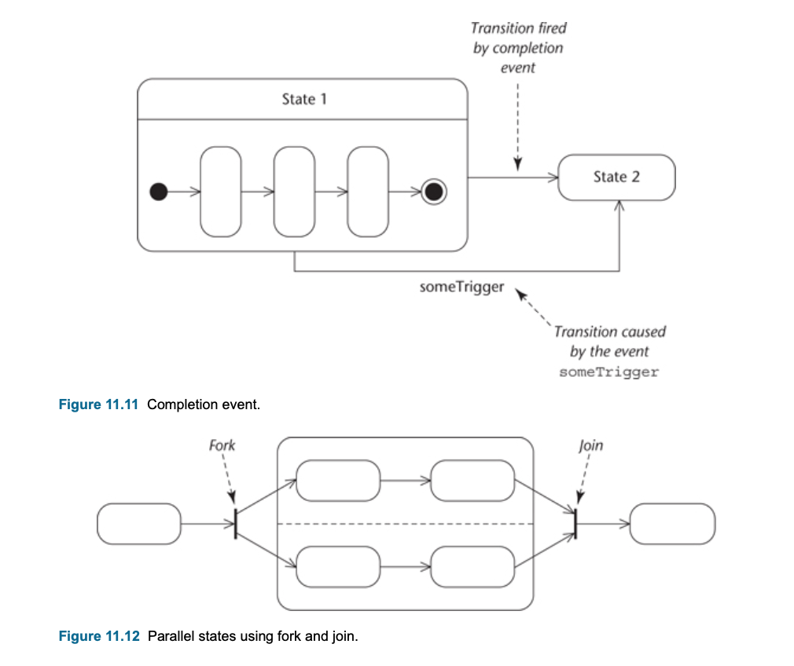

## Preparing a State Machine

* Use case diagram -->  interaction diagrams (sequence diagrams or communication diagrams) --> state machines
* The lifecycle approach is less formal than the behavioural approach

### A behavioural approach

* The initial source of the behaviour approach is **interaction diagrams**
*
    1. Examine all interaction diagrams that involve each class that has heavy messaging.
*
    2. For each class for which a state machine is being built follow steps 3 to 9.
*
    3. On each interaction diagram identify the incoming messages that may correspond to events for the class being
       considered. Also identify the possible resulting states.
*
    4. Document these events and states on a state machine.
*
    5. Elaborate the state machine as necessary to cater for additional interactions as these become evident, and add
       any exceptions.
*
    6. Develop any nested state machines (unless this has already been done in an earlier step).
*
    7. Review the state machine to ensure consistency with use cases. In particular, check that any constraints that are
       implied by the state machine are appropriate.
*
    8. Iterate steps 4, 5 and 6 until the state machine captures the necessary level of detail.
*
    9. Check the consistency of the state machine with the class diagram, with interaction diagrams and with any other
       state machine

### A lifecycle approach

* This approach does not use interaction diagrams as an initial source of possible events and states. Instead, they are
  identified directly **from use cases** and from any other requirements documentation that happens to be available.
*
    1. Identify major system events.
*
    2. Identify each class that is likely to have a state dependent response to these events.
*
    3. For each of these classes produce a first-cut state machine by considering the typical lifecycle of an instance
       of the class.
*
    4. Examine the state machine and elaborate to encompass more detailed event behaviour.
*
    5. Enhance the state machine to include alternative scenarios.
*
    6. Review the state machine to ensure that it is consistent with the use cases. In particular, check that the
       constraints that the state machine implies are appropriate.
*
    7. Iterate through steps 4, 5 and 6 until the state machine captures the necessary level of detail.
*
    8. Ensure consistency with class diagram and interaction diagrams and other state machines.

## Questions for State Machine

*
    1. What is the difference between a call trigger and a signal trigger?

    * A call trigger is a normal message, a signal trigger is an asynchronous message
*
    2. What does an action start with?

    * /
*
    3. When there is more than one action, what are the actions separated by?

    * ;
*
    4. Does internal transition cause state change?

    * No
*
    5. Does internal transition invoke exit and entry activity?

    * No
*
    6. For a state with internal activities, any transition into the state causes which activity to fine?

    * Entry
*
    7. For a state with internal activities, any transition out of the state causes which activity to fine?

    * Exit
* All of them correct !
    * A transition to a state with concurrent substates means simultaneously entering the concurrent substates.
    * A transition out of a composite state applies to all its substates (no matter how deeply nested).
    * The use of the join pseudostate means that the composite state is not exited until both concurrent nested state
      machines are exited.

### Activity

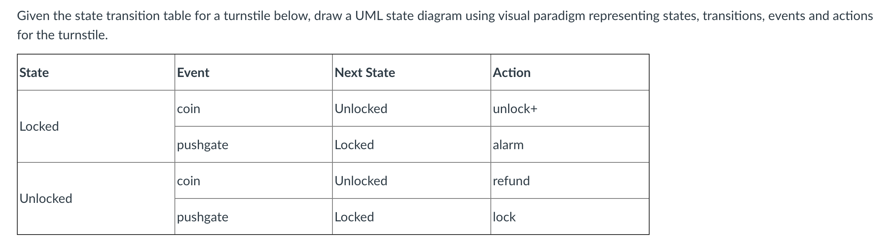 <br>
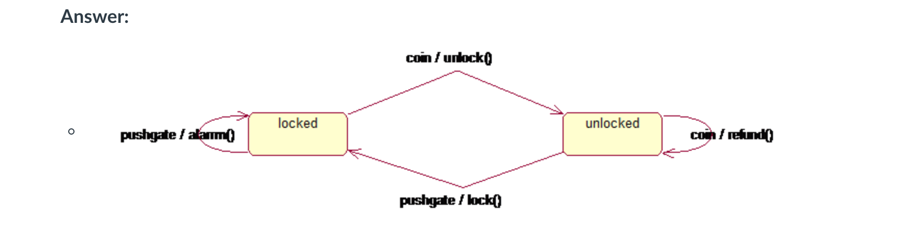

# Summary

* Operation specifications are the most detailed description of the behaviour of a system model. As such, they are also
  one of the more significant elements in the project repository. They provide an important link between the system’s
  users, who typically possess a detailed understanding of the required system behaviour, and the designers and
  programmers who must implement this in software. Accurate specification of operations is essential if the software is
  to be coded correctly.
* In this chapter we introduced the ‘contract’ as a framework for specifying operations, in terms of the service
  relationship between classes. Contracts are a particularly useful element of operation specification since they
  concentrate on the correctness of each object’s behaviour.
* We also described several techniques for describing operation logic. Non-algorithmic techniques, such as decision
  tables and pre- and post-condition pairs, take a black box approach and concentrate on specifying only the inputs to
  an operation (its pre-conditions) and the intended results of an operation (its post-conditions). In many cases,
  particularly where the operations themselves are simple, this is all the specification that a programmer needs to code
  the operation correctly. Algorithmic techniques, such as Structured English, pseudo-code and activity diagrams, take a
  white box approach, and this means that they concentrate on defining the internal logic of operations. These
  techniques are particularly useful when an operation is computationally complex. They are also useful when we need to
  model some larger element of system behaviour, such as a use case, that has not yet been decomposed to the level of
  individual operations that can be assigned to specific classes.
* Many elements of an operation specification can be written in OCL (UML’s Object Constraint Language). OCL is intended
  for use as a formal language for specifying constraints and queries on an object model, and this includes operation
  pre- and post-conditions and invariants.

* **State machine summary is missing.**

# Examples

* [1](https://modeling-languages.com/wp-content/uploads/2012/03/OCLChapter.pdf)
* [2](http://www.inf.ed.ac.uk/teaching/courses/seoc/2015_2016/tutorials/exerciseWk9.pdf)
* [3](http://www-sop.inria.fr/members/Charles.Andre/CAdoc/ESINSA/UMLOCL-memo.pdf)

# Sources

[OCLE](http://lci.cs.ubbcluj.ro/ocle/) <br>
[Ocla Specofocation OMG](https://www.omg.org/spec/OCL/2.4/PDF) <br>
[Introduction to OCLA](https://formal.iti.kit.edu/~beckert/teaching/Verification-SS06/10OCL.pdf) <br>
[OCL Cheat Sheet](https://scribetools.readthedocs.io/en/latest/_downloads/UMLOCL-CheatSheet-18.pdf)

[State Machine Diagram Tutorial](https://online.visual-paradigm.com/diagrams/tutorials/state-machine-diagram-tutorial/) <br>

# WEEK 5

#### Main Topics

1) Assess software architecture patterns and applicable situations <br>
2) Produce a design class model <br>
3) Apply design pattern to teh class design <br>

Relevant module learning outcomes for this week:<br>

* Investigate and analyse a problem, write a software requirement specification and design blueprint expressed in UML
  which provides a basis for code generation,
* Apply a range of design patterns and principles to solve particular design problems

#### Sub titles:

* [Intro](#intro)
    * [12 Quality Criteria For Good Design.](#12-quality-criteria-for-good-design)
* [High-level design](#high-level-design)
    * [Criteria for package design](#criteria-for-package-design)
    * [Software architecture patterns](#software-architecture-patterns)
        * [Closed Architecture](#closed-architecture)
        * [Open Architecture](#open-architecture)
        * [Repository Architecture](#repository-architecture)
        * [Client-server Architecture](#client-server-architecture)
        * [Peer to peer architecture (P2P)](#peer-to-peer-architecture-p2p)
        * [Broker architecture](#broker-architecture)
        * [MVC (Model-View-Controller)](#mvc-model-view-controller)
* [Low Level](#low-level-design)
    * [Criteria for good class design](#criteria-for-good-class-design)
    * [Attributes and operation specification](#attributes-and-operation-specification)
    * [Designing associations and constraints](#designing-associations-and-constraints)
    * [Constraints Design](#constraints-design)
* [Software design patterns](#software-design-patterns)
    * [GOF Design Patterns (Gang of four)](#gof-design-patterns-gang-of-four)
        * [Creational Pattern](#creational-pattern)
            * [Singleton](#singleton)
        * [Structural Pattern](#structural-pattern)
            * [Composite Pattern](#composite-pattern)
        * [Behavioral Pattern](#behavioral-pattern)
            * [strategy PAttern](#strategy-pattern)
* [Questions](#questions)

# Intro

* **Analysis** is often said to be about the **What?** of a system, **Design** described as being about the **How?**
    * The models that are produced by design activities show how the various parts of the system will work together; the
      models produced by analysis activities show what is in the system and how those parts are related to one another"
* Analysis means in Greek, break down in peaces.
    * Analysis activity characterized as asking while analysing; what happened in current system and what is required to
      new system
    * Analyse activity results is specification of what the system will do based on the requirements.
* Design is "how the system will be constructed without actually building it’.
    * Design is about producing a solution that meets the requirement that have been analysed.

* Seamlessness of object oriented approach is that the same model (the class diagram or object model) is used right
  through the life of the project
    * Analysis identifies classes, those classes are refined in design, and the eventual programs will be written in
      terms of classes
* The first is _implementation-independent_ or **logical design** and the second is _implementation-dependent_ or **
  physical design.**
* The OMG promotes an initiative called Model-Driven Architecture (MDA).
    * This approach is based on the idea that a system can be modelled in UML to create a platform-independent model (
      PIM), and that this PIM can then be transformed using automated modelling and programming tools into a
      platform-dependent model (PDM) for a specific platform.
    * The same PIM can be translated into many different PDMs for different platforms.

* System design is concerned with the design of the components of the system and the setting of standards: for example,
  for the design of the human–computer interface. Within the constraints of the enterprise architecture and the system
  architecture, the system designer chooses appropriate technologies and sets standards that will be used across the
  system. Design patterns can be used in system architecture, system design and detailed design, but the choice of
  patterns that will be used in the implementation is most relevant to system design.
    * During system design the designers make decisions that will affect the system as a whole.The most important aspect
      of this is the overall architecture of the system.
* Detailed design is concerned with designing individual elements to fit the architecture, to conform to the standards
  and to provide the basis for an effective and efficient implementation. In an object-oriented system, the detailed
  design is mainly concerned with the design of objects and classes. Detailed design also addresses the user interface
  and database design.
    * Detailed design has been about designing inputs, outputs, processes and file or database structures; these same
      aspects of the system also have to be designed in an object- oriented system, but they will be organized in terms
      of classes.

</br>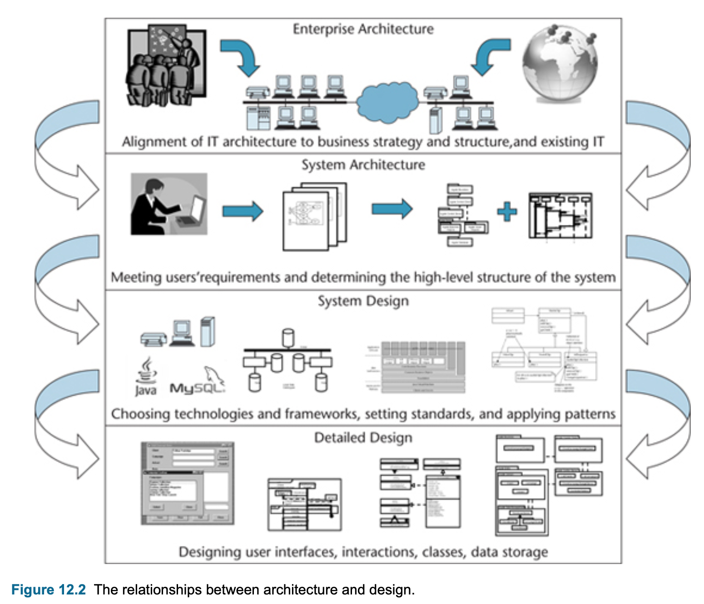

# 12 Quality Criteria For Good Design

* **Functional** is the system performs the functions that are expected to work correctly and completely.
* **Efficient** means the functionality needs to efficiently in terms of time and resources (optimal solution)
* **Economical** applies not only to the fixed costs of the hardware and software that will be required to run it, but
  also to the running costs of the system.
* **Reliable** must be in 2 ways
    * Hardware & software failure
    * Integrity of the data in the system
* **Secure** system needs to design against malicious attack by outsiders and against unauthorized use by insiders.
* **Flexible** is the ability of the system to adapt to changing business requirements as time passes.
* **General** describes the extent to which a system is general-purpose
* **Buildable** is the clear and not unnecessarily complex design in programmer perspective.
* **Manageable** design allows the project manager to estimate the amount of work involved in implementing the various
  subsystems.
* **Maintainable** is about making maintenance easy and cheaper. Maintenance is cited as taking up as much as 60% of the
  data-processing budget of organizations and maintenance programmers spends up to 50% their time to understand the
  code.
* **Usable** is about to design system user-friendly, enjoyable and reducing error rates made by user.
* **Reusable** is to improve possibility of reuse, It has 3 ways
    * considering of inheritance to improve reuse
    * looking for opportunities to use design patterns
    * seeking to reuse existing classes or components either directly or by subclassing them.

# High-level design

* High-level design concerns the big picture of the system
* There are 2 extremes:
    * One object that does everything. Any attributes and operations are all bundled together like a lump of spaghetti
    * Having to many objects, Everything is ‘decomposed’, and each object has perhaps one attribute and one domain
      method
* Abstractions are levels at which you operate mentally.
* Package is a general-purpose mechanism for organising elements into related groups, e.g grouping class together
* Package provides levels of abstraction to software system.
* Package in the UML helps:
    * To group elements
    * To provide a namespace for the grouped elements
    * A package may contain other packages, thus providing for a hierarchical organization of packages.
    * UML elements can be grouped into packages.
* A dependency exist between two classes if changes to the definition of one class may cause changes to the other.
* A dependency between two packages exist if any dependency exists between any 2 classes in the packages.
* Here is 4 pachages has dependency each other, eg, Business has a dependency to Database.

</br>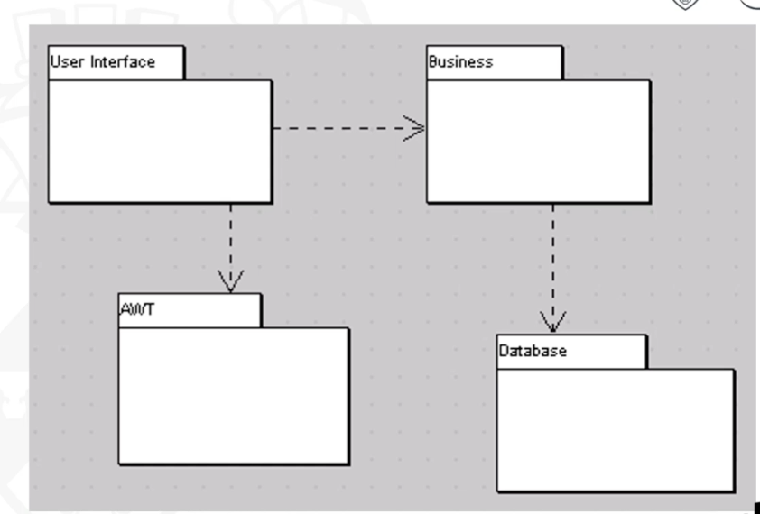

## Criteria for package design

* When a package changes, all packages depend on it needs to change or rebuild.
* Coupling is the independent measure of package/classes.
    * The more independent a package is, the more robust it is to changes.
* Package cohesion refers to interfaces and classes within a package that fulfil a similar purpose, service or function.
    * Package relational cohesion (or package internal coupling) can be quantified using the formula:
        * RC=numberOfInternalRelations/numberOfTypesm, RC=3/4=0.75 where 3 is the number of messages between classes and
          4 is the total number of classes within the package
        * The bigger RC is the higher cohesion
* Desigred good design is low coupling and hight cohesion.

## Software Architecture Patterns

* The purpose of architecture patterns is re-use
* Packages are general purpose mechanism for organizing elements into groups.
* Subsystems have clearly defined responsibilities, behaviour to do the real work
    * flagged with <<subsystem>>
* Issues and Approaches in SW Arhitecture design :
    * Considering decomposing via vertical layering and horizontal portioning.
    * Communication protocols between subsytems with strong encapsulation via an API
    * The overall control flow for a particular event might dominate the design and can use Event driven arch?

### Closed Architecture

* Each layer depend on one layer below.
* 3-5 layer is typical
* Advantage: Low coupling
* Disadvantage: Each layer introduce a speed & storage overhead. e.g bottleneck

</br>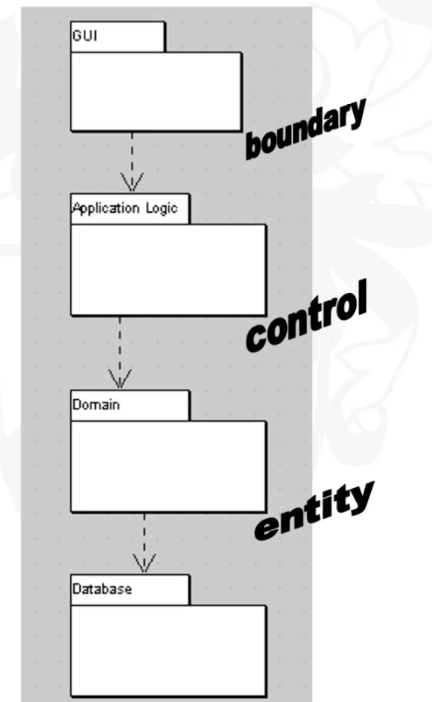

### Open Architecture

* higher layer can access any layer below
* Advantage: This can avoid performance bottlenecks.
* Disadvantage: it suffers the penalty of increased coupling due to extra dependencies.

</br>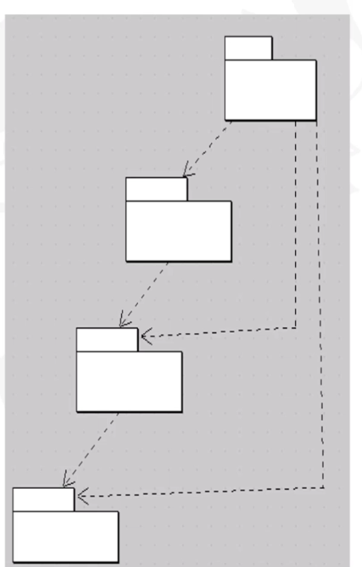

### Repository Architecture

* This is a system that allow several interfacing components to share the same data.
* Advantage : Easy to add a subsystem
* Disadvantage: Repository can be a bottleneck due to excessive queue requests.
  </br>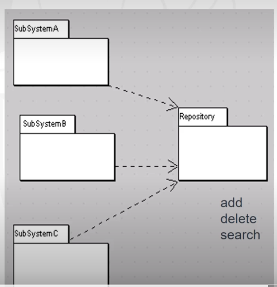

### Client-server architecture

* Multiple client requests and receive service from a centralized host server.
* Client needs to know server, but server does not know the client. Server wont effect any client changes by this way.
  </br>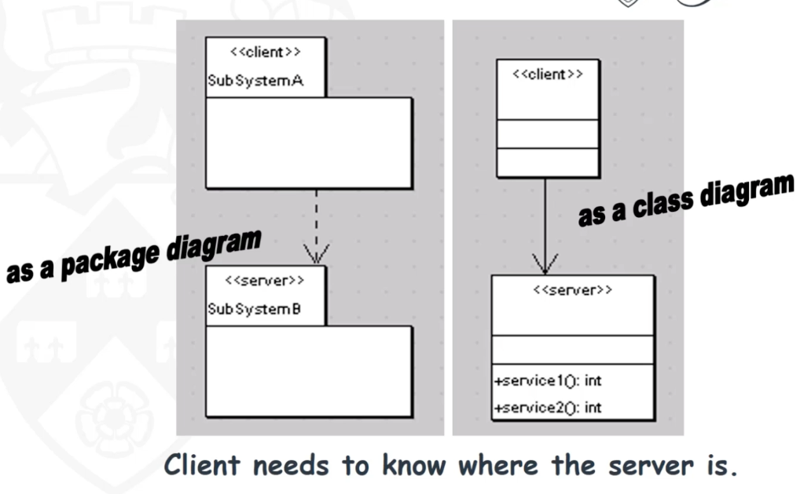

### Peer to peer architecture (P2P)

* Commanly use in network architecture in which each subsystem has the same capabilities and responsibilities. eg multi
  agent apps
* Disadvantages: introduces more coupling and control flow hazards, so it is more difficult to implement and maintain
  </br>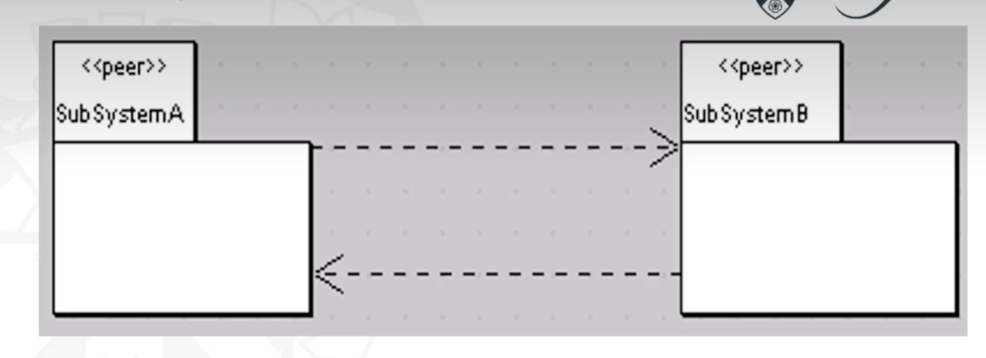

### Broker architecture

* Client does not need to know where the server, client communicate with broker and broker knows where server is. e.g.
  in a distributed ecommerce system

</br>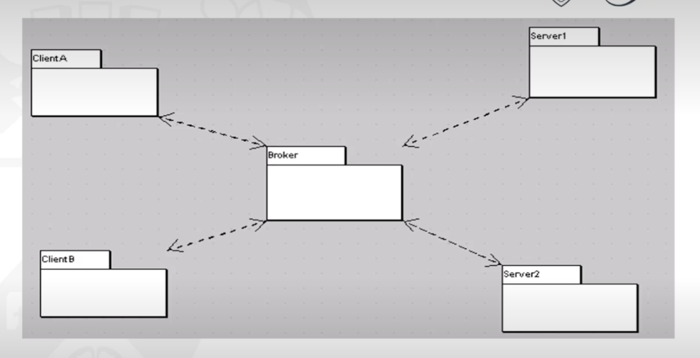

### MVC (Model-View-Controller)

* Separate app in 3 components:
    * Model : Represent data and business logic
    * View: represent UI
    * Controller: handles user request
* MVC suitable for apps that has multiple views for a single data source
* Views register with Models and when modal change , propogation process will notify all views to change.
* Modal is independent from View and Controller, only needs to say "I've changed"
* The propagation mechanism reduces the package coupling to some extent.
* The responsibilities of the components of an MVC architecture are listed below.
    * Model. The model provides the central functionality of the application and is aware of each of its dependent view
      and controller components.
    * View. Each view corresponds to a particular style and format of presentation of information to the user. The view
      retrieves data from the model and updates its presentations when data has been changed in one of the other views.
      The view creates its associated controller.
    * Controller. The controller accepts user input in the form of events that trigger the execution of operations
      within the model. These may cause changes to the information and in turn trigger updates in all the views ensuring
      that they are all up to date.
    * Propagation mechanism. This enables the model to inform each view that the model data has changed and as a result
      the view must update itself. It is also often called the dependency mechanism.

</br>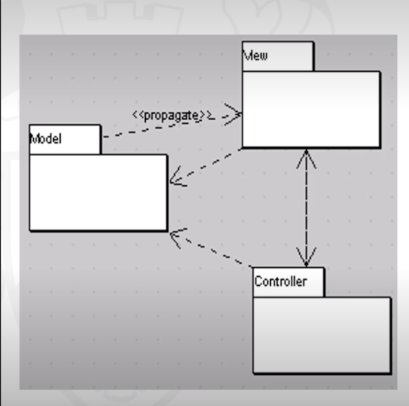<br>

[10 Common architecture](https://towardsdatascience.com/10-common-software-architectural-patterns-in-a-nutshell-a0b47a1e9013)

</br>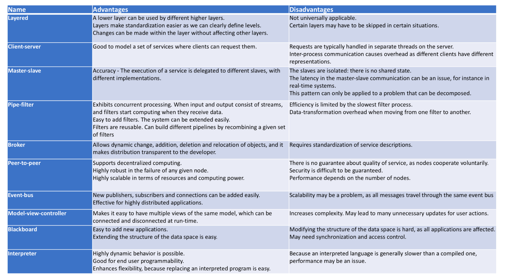<br>

# Low-level design

* Low-level design concerns the input, output, processes and files or database structure
* Low level design activities involve:
    * Designing the entity classes in the analysis model including attributes, associations and operations.
    * Adding control classes using one for every use case as a general rule
    * Adding boundary classes, e.g. Java AWT or Java Swing or JGoodies packages for the GUI
    * Do the target relational databases support the ODBC standard? If so, can use Java Database Connectivity

## Criteria for good class design

* Coupling describes the degree of interconnectedness between design components and is reflected by the number of links
  an object has and by the degree of interaction the object has with other objects.
    * Interaction coupling is a measure of the number of message types an object sends to other objects and the number
      of parameters passed with these message types. eg unnecessary atttributes in object cause to carry messages whole
      app
        * Interaction coupling should be kept to a minimum to reduce the possibility of changes rippling through the
          interfaces and to make reuse easier
    * Inheritance coupling describes the degree to which a subclass actually needs the features it inherits from its
      base class

</br>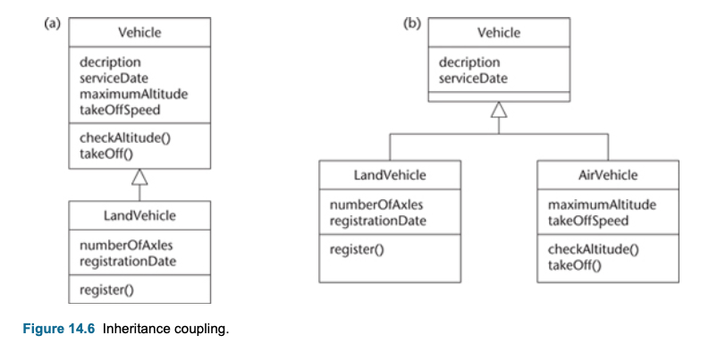<br>

* Cohesion is a measure of the degree to which an element contributes to a single purpose
    * Operation cohesion measures the degree to which an operation focuses on a single functional requirement.
    * Class cohesion reflects the degree to which a class is focused on a single requirement
    * Specialization cohesion addresses the semantic cohesion of inheritance hierarchies.

</br>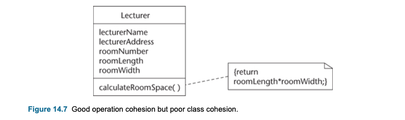<br>
</br>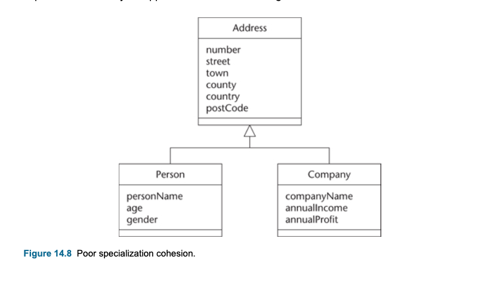<br>
</br>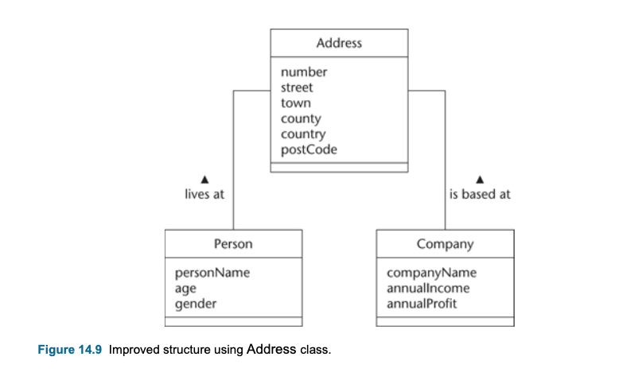<br>

## Attributes and operation specification

* Attributes data types are show with this formule:
    * ``` <property> ::= [<visibility>] [‘/’] <name> [‘:’ <prop-type>] [‘[’ <multiplicity> ‘]’] [‘=’ <default>] [‘{’ <property-string > [‘,’ <property-string >]* ‘}’] ```
    * For example :
        * with default value -> balance: Money = 0.00
        * not null -> accountName: String {not null}
        * multipilicity -> qualification: String[0..10]
        * class (static) variable attribute/method -> underlined
* The values of some attributes can be derived from other attributes in the same class or other classes.
    * They may have been identified in analysis, but will not be implemented as attributes in design.
    * derived attribute indicated in UML by the symbol ‘/’ before the name of the attributed
* **Primary operations** are certain standard operations that are normally included in all classes.
    * Constructor, Destructor, Get operation, Set operation
    * Usually primary operation does not show in class diagram, because assumed that this primary
* Visibility functionality is already available, thats why mostly in diagrams prefer show main functionaly , thats why
  primary operation can omitted.
    * Protected means the feature may be used either by the class that includes it, or by a subclass or descendant of
      that class, or by classes in the same package

* Operation signatures: eg credit(amount: Money): Boolean
    * ``` <parameter-list> ::= <parameter> [‘,’<parameter>]* <parameter> ::= [<direction>] <parameter-name> ‘:’ <type-expression> [‘[’<multiplicity>‘]’ [‘=’ <default>] [‘{’ < property-string >[‘,’ < property-string >]* ‘}’] ```

* Naming:
    * Singular names for classes, eg Customer
    * Attribute names needs to be unabbreviated names with a noun from the domain. eg firstName is better fName
    * Operations should be named with a strong verb, eg validateNumber() is better than numberChecking()

</br>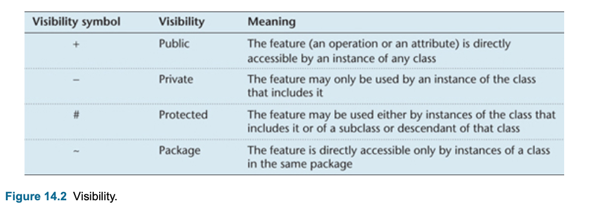<br>
</br>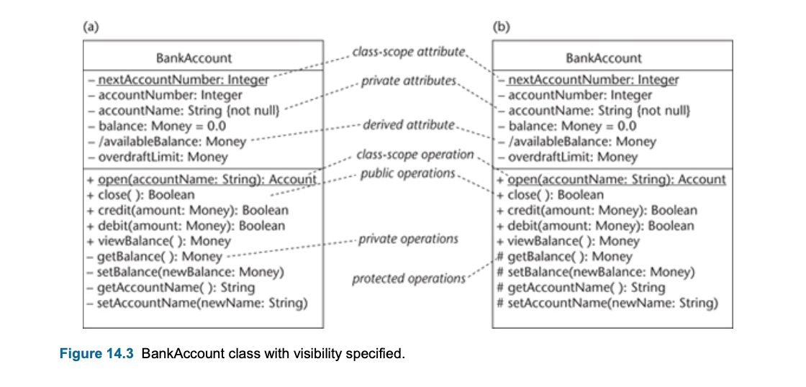<br>

## Designing associations and constraints

* one-to-one association (one way)

</br>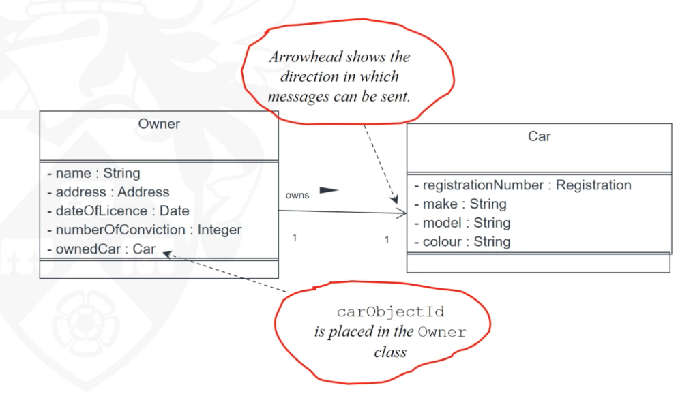<br>

* one-to-many (one way)
    * There is also another way to do by using a collection class in it, but still there is a one-to-many association
    * . One-to-many association can be designed with one collection class and many-to-many with two collection classes.
      </br>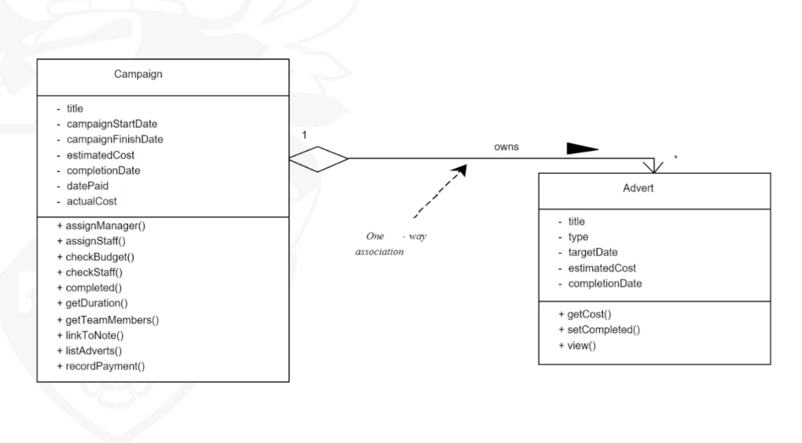<br>
      </br>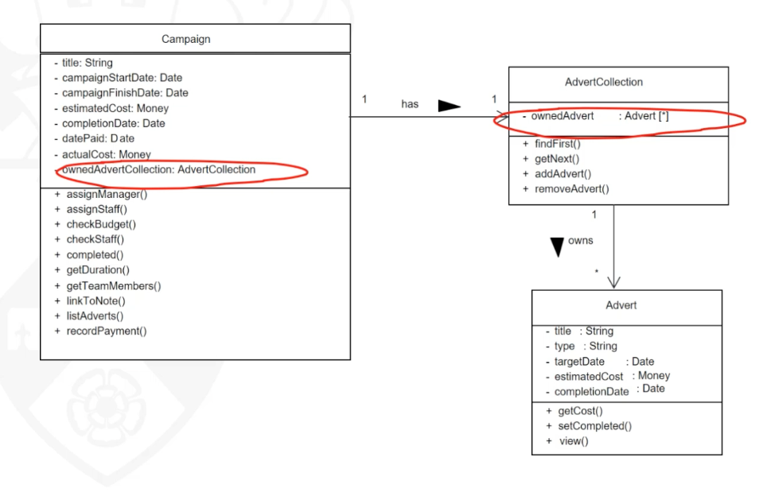<br>

* many-to-many (two way)
    * in the second sample 2 ways association is turning one way one-to-many association
    * When we revert many to many to -> one to one or one to many, we reducing coupling.  
      </br>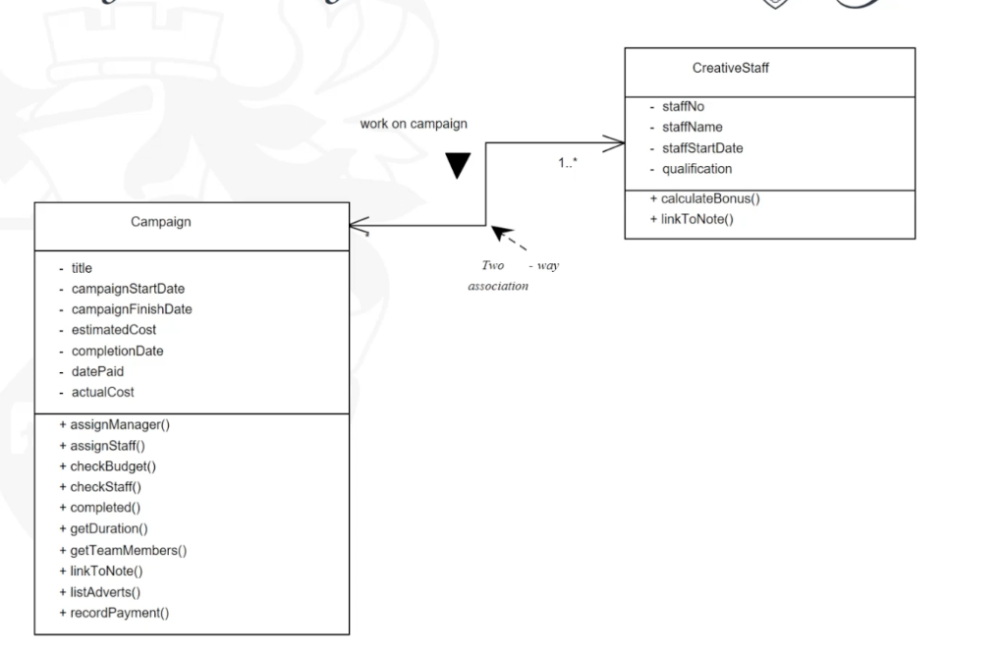<br>
      </br>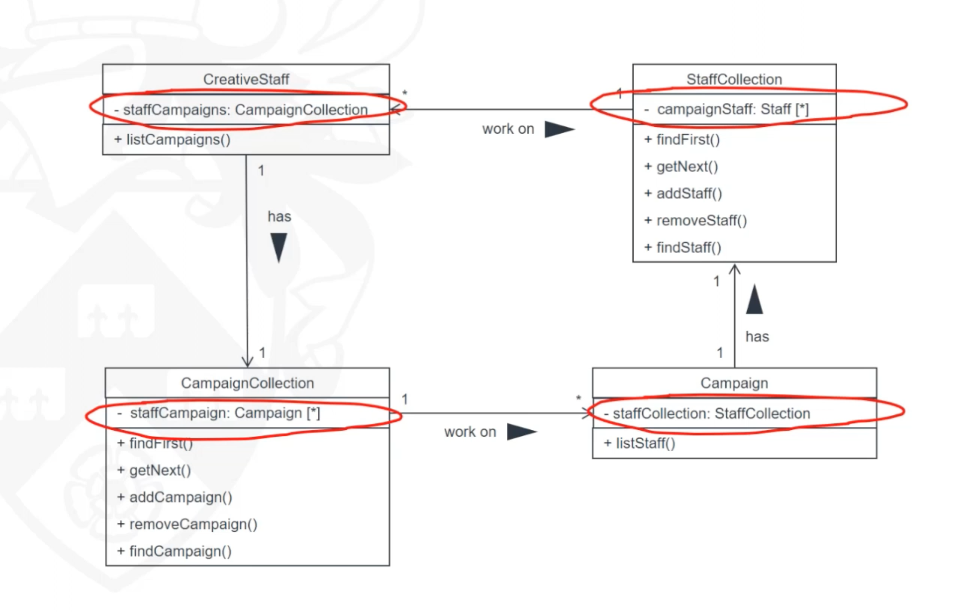<br>

## Constraints Design

* Referential constraints :  Referential integrity ensures that an object identifier in an object is actually referring
  to an object that exists,
    * eg one campaign has one manager.
* Design dependency constraints: Dependency constraints ensures that derived attributes, where one attribute may be
  calculated from other attributes, are maintained consistently.
    * eg totalAdvertCost attribute needs to update when an advert add or remove.

* Design associations constraint: ?????
* Domain integrity constraints : Domain integrity ensures that attributes only hold permissible values
    * eg, cost type needs to be float, it checks the data type while setting attribute
    * eg, customer age needs to be more than 18, check age wile customer object created

# Software design patterns

* An OO pattern is an abstraction of a small group of classes.
* Patterns are not frameworks and not actual design. Frameworks are larger than patterns
* Framework is partially codifies a design for solving a family of problems in a specific domain.
* Levels of reuse:
    * the overall architecture level,
    * Frameworks that are at a macro-architecture level,
    * Instantiated patterns are at a micro-architecture level,
    * individual class is at the lowest level of reuse.

</br>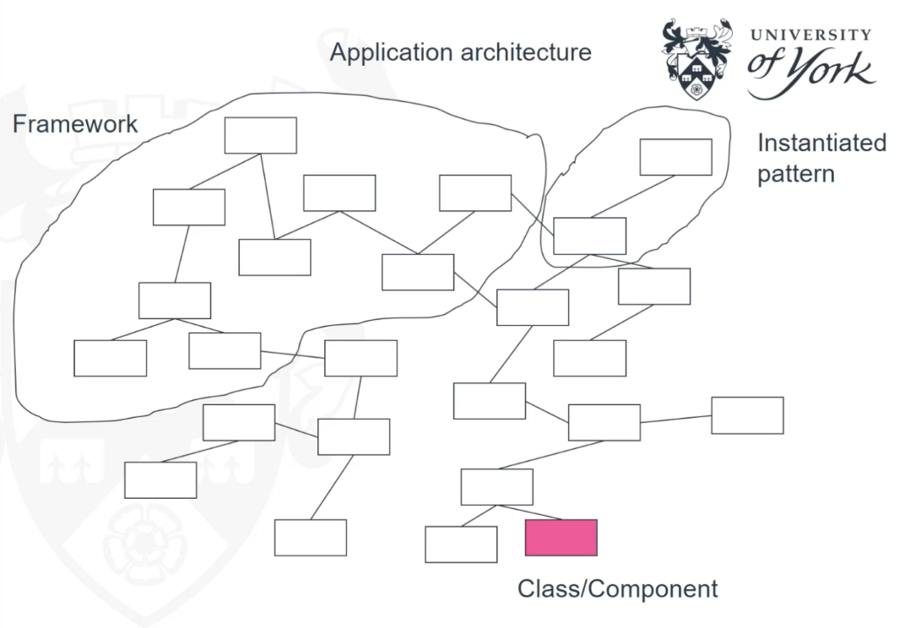<br>

* Why we use ?
    * Saves analyse and design time
    * Solution is thought to be good
    * Easier to communicate with higher level of abstraction
    * But it is not always clear when a pattern is applicaple, It requires expertise for the appropriate use of
      patterns.

* The major differences between patterns and frameworks:
    * Patterns are more abstract and general than frameworks. A pattern is a description of the way that a type of
      problem can be solved, but the pattern is not itself a solution.
    * Unlike a framework, a pattern cannot be directly implemented in a particular software environment. A successful
      implementation is only an example of a design pattern.
    * Patterns are more primitive than frameworks. A framework can employ several patterns but a pattern cannot
      incorporate a framework.

* A **pattern catalogue** is a group of patterns that are related to some extent and may be used together or
  independently of each other.
* The patterns in a **pattern language** are more closely related, and work together to solve problems in a specific
  domain
* The **pattern template** determines the style and structure of the pattern description, and these vary in the emphasis
  they place on different aspects of patterns.
    * Name. A pattern should be given a meaningful name that reflects the knowledge embodied by the pattern.
        * This may be a single word or a short phrase
    * Problem. This is a description of the problem that the pattern addresses (the intent of the pattern)
        * It should identify and describe the objectives to be achieved, within a specified context and constraining
          forces.
    * Context. The context of the pattern represents the circumstances or preconditions under which it can occur.
        * The context should provide sufficient detail to allow the applicability of the pattern to be determined.
    * Forces. The forces of a pattern are the constraints or issues that must be addressed by the solution
    * Solution. The solution is a description of the static and dynamic relationships among the parts of the pattern.
        * The structure, the participants and their collaborations are all described.
        * A solution should resolve all the forces in the given context.
        * A solution that does not resolve all the forces fails.

# GOF Design Patterns (Gang of four)

* A catalogue of 23 design patterns that are still widely used today.
* The GOF patterns are categorized as **creational**, **structural** or **behavioural** to reflect their different
  purposes.
* The GOF patterns are generally concerned with increasing the ease with which an application can be changed, by
  reducing the coupling among its elements and maximizing their cohesion.
* **Changeability** involves several different aspects (Buschmann et al., 1996): maintainability, extensibility,
  restructuring and portability. D
    * Maintainability is concerned with the ease with which errors in the information system can be corrected.
    * Extensibility addresses the inclusion of new features and the replacement of existing components with new improved
      versions. It also involves the removal of unwanted features.
    * Restructuring focuses on the reorganization of software components and their relationships to provide increased
      flexibility.
    * Portability deals with modifying the system so that it may execute in different operating environments, such as
      different operating systems or different hardware.

## Creational Pattern

* A creational design pattern is concerned with the construction of object instances.

### Singleton

* Singleton pattern helps to ensure to create one instance of an object.
* The solution involves three elements:
    * private constructor that restricts the outside access.
    * static operation getCompanyInstance,
    * static variable companyInstance.
    * allows global access to the static operation.
* With this solution private constructure can access by static operation.
* Template
    * Name. Singleton.
    * Problem. How can a class be constructed that should have only one instance and that can be accessed globally
      within the application?
    * Context. In some applications it is important that a class has exactly one instance. A sales order processing
      application may be dealing with sales for one company. It is necessary to have a Company object that holds details
      of the company’s name, address, taxation reference number and so on. Clearly there should be only one such object.
      Alternative forms of a singleton object may be required depending upon initial circumstances.
    * Forces. One approach to making an object globally accessible is to make it a global variable, but in general this
      is not a good design solution as it violates information hiding. Another approach is not to create an object
      instance at all but to use class operations and attributes (called ‘static’ in C++ and Java). However, this limits
      the extensibility of the model since polymorphic redefinition of class operations is not possible in all
      development environments (for example C++).
    * Solution. Create a class with a class operation getInstance(), which, when the class is first accessed, creates
      the relevant object instance and returns the object identity to the requesting object. On subsequent accesses of
      the getInstance() operation no additional instance is created but the object identity of the existing object is
      returned.

</br>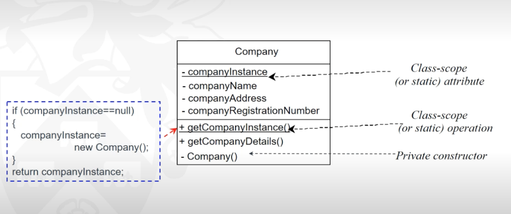<br>
</br>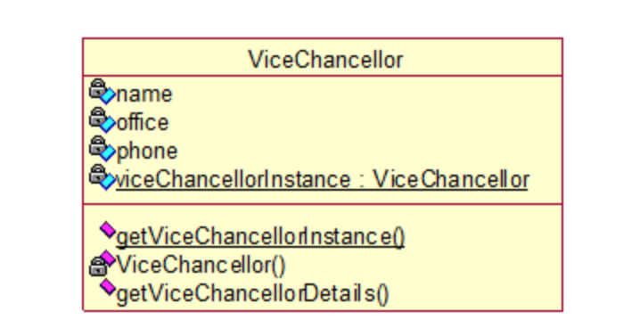<br>

## Structural Pattern

* Structural patterns address issues concerned with the way in which classes and objects are organized.

### Composite Pattern

* Can use composite pattern when object represents a tree structure.
    * For example, assambly a computer requires sub node as cabinet (harddrive and Motherboard (CPU, RAM )) and periphel
      devices (mouse , keyboard)
    * When we would like to reach eg price attribute we can see that from leaf to composite object has price info
* leaf and composite nodes should have common features/functions which can accessable from to any nodes.
* Then we can create a common abstract class to create a contract between and generalise composite and leaf objects,
* Composite object is also can have other composite object list in it too, that creates an assosication between contract
  and composite object.
* Template
    * Name. Composite.
    * Problem. There is a requirement to represent whole–part hierarchies so that both whole and part objects offer the
      same interface to client objects.
    * Context. In an application both composite and component objects exist and are required to offer the same
      behaviour. Client objects should be able to treat composite or component objects in the same way. A commonly used
      example for the composite pattern is a graphical drawing package. Using this software package a user can create (
      from the perspective of the software package) atomic objects like circle or square and can also group a series of
      atomic objects or composite objects together to make a new composite object. It should be possible to move or copy
      this composite object in exactly the same way as it is possible to move or copy an individual square or a circle.
      See Figs 8.5 and 8.6 which illustrate a straightforward composition without using the Composite pattern.
    * Forces. The requirement that the objects, whether composite or component, offer the same interface suggests that
      they belong to the same inheritance hierarchy. This enables operations to be inherited and to be polymorphically
      redefined with the same signature. The need to represent whole–part hierarchies indicates the need for an
      aggregation structure.
    * Solution. The solution resolves the issues by combining inheritance and aggregation hierarchies. Both subclasses,
      Leaf and Composite, have a polymorphically redefined operation anOperation(). In Composite this redefined
      operation invokes the relevant operation from its components using a simple loop construct. The Composite subclass
      also has additional operations to manage the aggregation hierarchy so that components may be added or removed.

</br>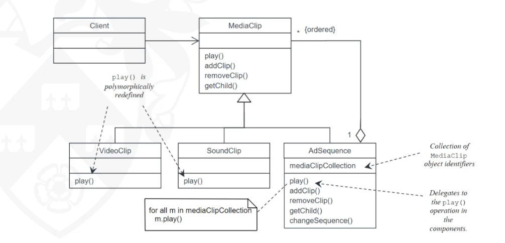<br>
</br>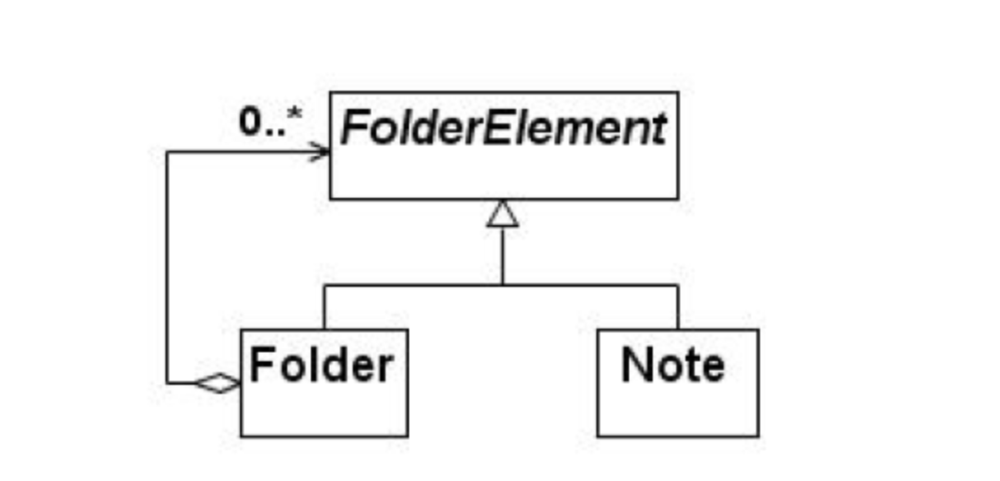<br>

## Behavioral Pattern

* Behavioural patterns address the problems that arise when responsibilities are assigned to classes and in designing
  algorithms.

### Strategy Pattern

* When the behaviour is changing depends on the state of the object, we can use if-else blocks to solve, but this
  solution can cause tight coupling and low cohesion problem after some time later and make very complex test and
  maintain.
* To prevent from this problem, State pattern allocates each state related behaviour to individual state class, then
  represent an abstract class that has common functionalty of states that has its own implementation in it.
* Force of state pattern:
    * The state related behaviour can be constructed via a public method that invoke various private state related
      operations. However, this results in a large complex object that is difficult to construct, test and maintain.
* Solution of state pattern:
    * Separate the original behaviour and allocate to the individual state object. The original object becomes an
      aggregate of its state, only one of which is active at any one time.
* Template
    * Name. State.
    * Problem. An object exhibits different behaviour when its internal state changes making the object appear to change
      class at run-time.
    * Context. In some applications an object may have complex behaviour that is dependent upon its state. In other
      words, the response to a particular message varies according to the object’s state. One example is the calcCosts()
      operation in the Campaign class.
    * Forces. The object has complex behaviour, which should be factored into less complex elements. One or more
      operations have behaviour that varies according to the state of the object. Typically the operation would have
      large, multi-part conditional statements depending on the state. One approach is to have separate public
      operations for each state but client objects would need to know the state of the object so that they could invoke
      the appropriate operation. For example, four operations calcCostsCommissioned(), calcCostsActive(),
      calcCostsCompleted() and calcCostsPaid() would be required for the Campaign object. The client object would need
      to know the state of the Campaign object in order to invoke the relevant calcCosts() operation. This would result
      in undesirably tight coupling between the client object and the Campaign object. An alternative approach is to
      have a single public calcCosts() operation that invokes the relevant private operation (calcCostsCommissioned()
      would be private). However, the inclusion of a separate private operation for each state may result in a large
      complex object that is difficult to construct, test and maintain.
    * Solution. The State pattern separates the state-dependent behaviour from the original object and allocates this
      behaviour to a series of other objects, one for each state. These state objects then have sole responsibility for
      that state’s behaviour. The original object, shown as Context in Fig. 15.18, delegates responsibility to the
      appropriate state object. The original object becomes an aggregate of its states, only one of which is active at
      one time. The state objects form an inheritance hierarchy.

</br>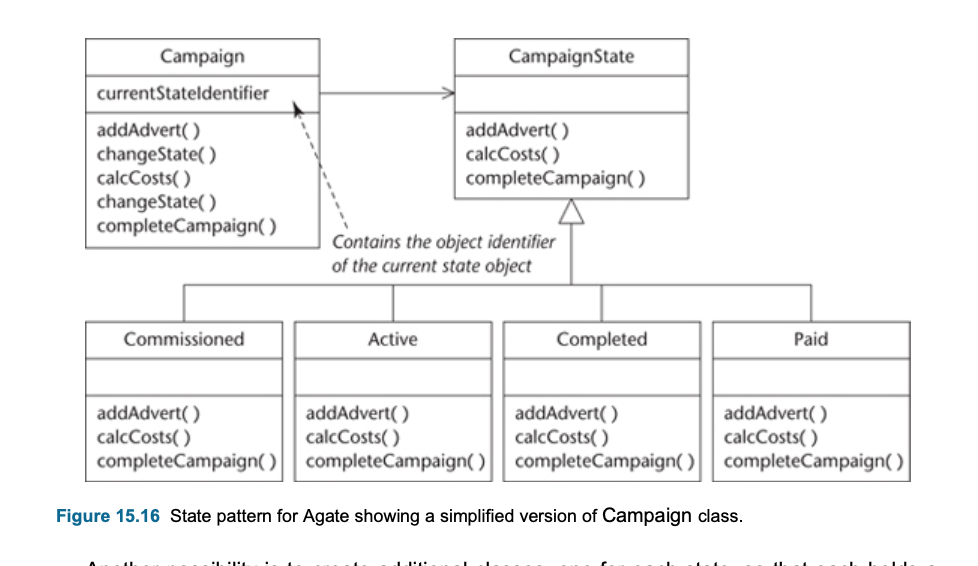<br>

### Observer Pattern

* Pattern name: Observer
* Description: Separates the display of the state of an object from the object itself and allows alternative displays to
  be provided. When the object state changes, all displays are automatically notified and updated to reflect the change.
* Problem description: In many situations, you have to provide multiple displays of state information, such as a
  graphical display and a tabular display. Not all of these may be known when the information is specified. All alter-
  native presentations should support interaction and, when the state is changed, all displays must be updated. This
  pattern may be used in situations where more than one display format for state information is required and where it is
  not necessary for the object that maintains the state information to know about the specific display formats used.
* Solution description: This involves two abstract objects, Subject and Observer, and two concrete objects,
  ConcreteSubject and ConcreteObject, which inherit the attributes of the related abstract objects. The abstract objects
  include general operations that are applicable in all situations. The state to be displayed is maintained in
  ConcreteSubject, which inherits operations from Subject allowing it to add and remove Observers (each observer
  corresponds to a display) and to issue a notification when the state has changed. The ConcreteObserver maintains a
  copy of the state of ConcreteSubject and implements the Update() interface of Observer that allows these copies to be
  kept in step. The ConcreteObserver automatically displays the state and reflects changes whenever the state is
  updated. The UML model of the pattern is shown in image below.
* Consequences: The subject only knows the abstract Observer and does not know details of the concrete class. Therefore
  there is minimal coupling between these objects. Because of this lack of knowledge, optimizations that enhance display
  performance are impractical. Changes to the subject may cause a set of linked updates to observers to be generated,
  some of which may not be necessary.

</br>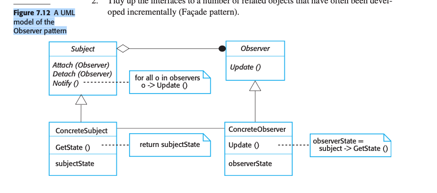<br>

# Questions

* What is the key problem with closed architecture?
    * Each layer introduces a speed & storage overhead
* What's the key strength and weakness with an open layered architecture?
    * Strength: Can bypass layers and avoid performance bottlenecks.
    * Weakness: But suffer the penalty of increased coupling due to extra dependencies.
* What is a possible issue with a repository architecture?
    * Repository can become a bottleneck, e.g. queue requests.
* In a client-server architecture, does the client know the server?
    * Yes
* In a client-server architecture, does the server know the client?
    * No
* In contrast with the client-server architecture, why is peer-to-peer architecture not easy to maintain?
    * Because it introduces more coupling and control flow hazards
* In a broker architecture, does the client need to know where the server is?
    * No
* In the MVC architecture, does a view know the model?
    * Yes
* In the MVC architecture view component, as long as the update message remains unchanged, do you need to recompile the
  model component if changes are made in the view?
    * No
* What is the effect of propagation mechanism with respect to package coupling?
    * Reduce coupling to some extent

[Design Patterns](https://sourcemaking.com/design_patterns)
[Composite pattern](https://www.youtube.com/watch?v=mp5lwolO-wM)

# TODO:

* activity 5.8 check again!

# WEEK 6

#### Main Topics

* Design tests for black box and white box testing
* Design and conduct JUnit tests
* Critically evaluate various approaches to software testing
* Apply a range of refactoring techniques to improve code quality

Relevant Module Learning Outcomes

* Critically evaluate and apply a range of tools and techniques for automated software testing, including test-driven
  development,
* Apply a range of refactoring techniques to improve code quality

#### Sub titles:

* [Specification-based testing](#specification-based-testing)
    * [Five Level Testing](#five-level-testing)
        * [Unit Testing](#unit-testing)
        * [Integration Testing](#integration-testing)
        * [Subsystem testing](#subsystem-testing)
        * [System testing](#subsystem-testing)
        * [Regression Testing](#regression-testing)
        * [User Acceptance Testing](#user-acceptance-testing)
    * [3 Level Testing](#3-level-testing)
    * [Test Planning](#test-planning)
    * [Specification-based testing (Black box testing)](#specification-based-testing-black-box-testing)
* [Structural Testing (White box testing)](#structural-testing-white-box-testing)
    * [Control Flow Graph](#control-flow-graph)
    * [Statement and Branch coverage](#statement-and-branch-coverage)
    * [Conditional coverage](#conditional-coverage)
* [White and Black test is used for](#white-and-black-test-is-used-for)
* [JUnit and refactoring](#junit-and-refactoring)

# Specification-based testing

* “Software testing consists of the dynamic verification of the behaviour of a program on a finite set of test cases,
  suitably selected from the usually infinite executions domain, against the expected behaviour.” (SWEBOK 2004)
* Overal process:
    * Identify parts of the software to be tested (SUT)
    * Identify interesting input values
    * Identify expected results (functional) and execution characteristics (non-functional)
    * Run the software on the input values
    * Compare results & execution characteristics to expectations

</br>

* **limitation of testing**: Testing can only show the presence of errors, never their absence
    * We should be aware of the limitations of testing Why?
        * theoretically we cannot test for termination
        * practically there is the sheer number of cases, e.g. multiplying two integers today would mean 2128
          combinations and it is practical to test them all.

* **Motivation for software testing** :  The underlying motive for software testing is to make apparent aspects of
  **software quality**, using methods that can be economically and effectively applied and with sufficient accuracy to
  allow the taking of informed risk-decisions.
    * testing is essential evidence to determine whether the quality of the software matches specifications or exceeds
      expectations

* Testing of software is necessary to **ensure that it meets the requirements**, both to check that the software
  complies with the requirements (**verification**), and to check that it has been written correctly and effectively (**
  validation**).
    * **verification** checks that the right software has been written;
    * **validation** checks that the software has been written right.

## Five Level Testing

* Testing can take place at as many as five levels:
    * unit testing
    * integration testing
    * subsystem testing
    * system testing
    * acceptance testing.

### Unit Testing

* Unit testing : units are likely be individual classes
    * Testing classes should include **desk check**, n which the tester manually walks through the source code of the
      class before compilation
        * Code needs to compile and the result of compilation should be error free.
    * To test the running of a class the tester will require some kind of test program (the term **harness** is often
      used) that will create one or more instances of a class, populate them with data and invoke both instance
      operations and class operations.
    * Needs to test the operations that have been implemented will be tested to ensure that they comply with the
      pre-conditions and that the post-conditions are met when they have complete.
* Programmers will develop their own tools to provide **harnesses** within which to test classes and subsystems
  according to company standards

### Integration Testing

* Unit testing merges into integration testing when groups of classes are tested together.
    * The obvious test unit at this point is either the use case to test the system from the user’s perspective or the
      component to test the correct working of components and the interaction between components.
* Integration starts when units and components are tested.
* Integration testing tests the interactions between components to make sure sub-elements are combined into a coherent
  composite element. Integration testing assesses consistency of interfaces, e.g. message signatures and parameters.
* Three approaches for integration testing
    * top-down
        * This method starts with the top-level element, with the called elements replaced by stubs
        * A stub simulates an aspect of a called procedure’s execution, typically returning hard- wired results, for
          example the use of System.out.println () when you debug your Java programs.
        * As the top-most modules are tested, stub leaves are replaced with the actual components and their callees are
          stubbed out.
        * The resulting graph is a call tree or dependency graph.
        * Good approach for assigning main control structures, because the environment of testing is the actual
          execution environment, control problems or fundamental architectural problems can be revealed from the very
          beginning.

</br>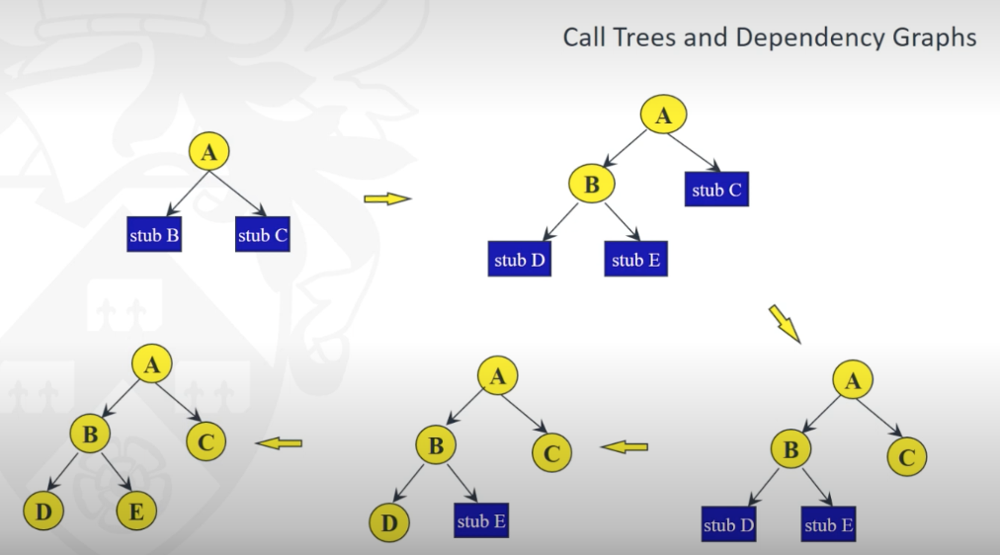

    * bottom-up
        * starts at lowest level (units) and progressively combines into larger subsystems until final system is reached
        * Integration of lower level elements requires a driver.
        * It is good that bottom up testing allows parallel testing
        * But environment of testing is not actual execution environment, control problems or fundamental architectural
          problems may not surface until very late.

</br>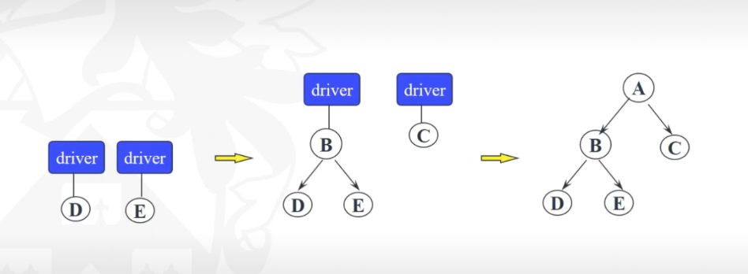

    * big-bang approach
        * All the method links, edits, compiles and runs all the modules together.
        * Often reveals some errors
        * May possibly be used to create a backbone network, which can subsequently act as a test harness.
        * it is only interesting for small to moderate size projects.

</br>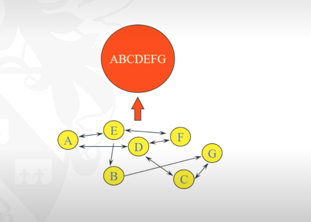

### Subsystem testing

* Use cases that share the same persistent data should be tested together.
* This kind of testing should check that applications work correctly when multiple clients are accessing the database
  and that transactional database updates are carried out correctly.
* This is one form of subsystem testing in which the subsystems are built around different business functions that make
  use of the same stored data.

### System testing

* System testing is defined as the testing of a complete and fully integrated software product.
    * This validates the complete and fully integrated software product
* System testing falls in black-box testing wherein knowledge of the inner design of the code is not a pre-requisite and
  is done by the testing team.

### Regression Testing

* **Regression testing** : If significant changes are made to a system, then some of the tests must be run again to
  ensure that the changes have not broken existing functionality.

### User Acceptance Testing

* Final state is **user acceptance test**, during which the system is evaluated by the users against the original
  requirements before the client signs the project off.
* Documentation produced during requirements capture and analysis will be used to check the finished product, in
  particular use case scenarios and non-functional requirements.

## 3 Level Testing

* Testing is sometimes described as taking place at three levels.
    * Level 1
        * Tests individual modules (e.g. classes or components).
        * Then tests whole programs (e.g. use cases).
        * Then tests whole suites of programs (e.g. the Agate application).
    * Level 2
        * Also known as alpha testing or verification.
        * Executes programs in a simulated environment.
        * Particularly tests inputs that are:
            * negative values when positive ones are expected (and vice versa)
            * out of range or close to range limits
            * invalid combinations.
    * Level 3
        * Also known as beta testing or validation.
        * Tests programs in live user environment:
            * for response and execution times with large volumes of data
            * for recovery from error or failure.

## Test Planning

* Test documentation shows details of each test and its expected outcomes with plan
  </br>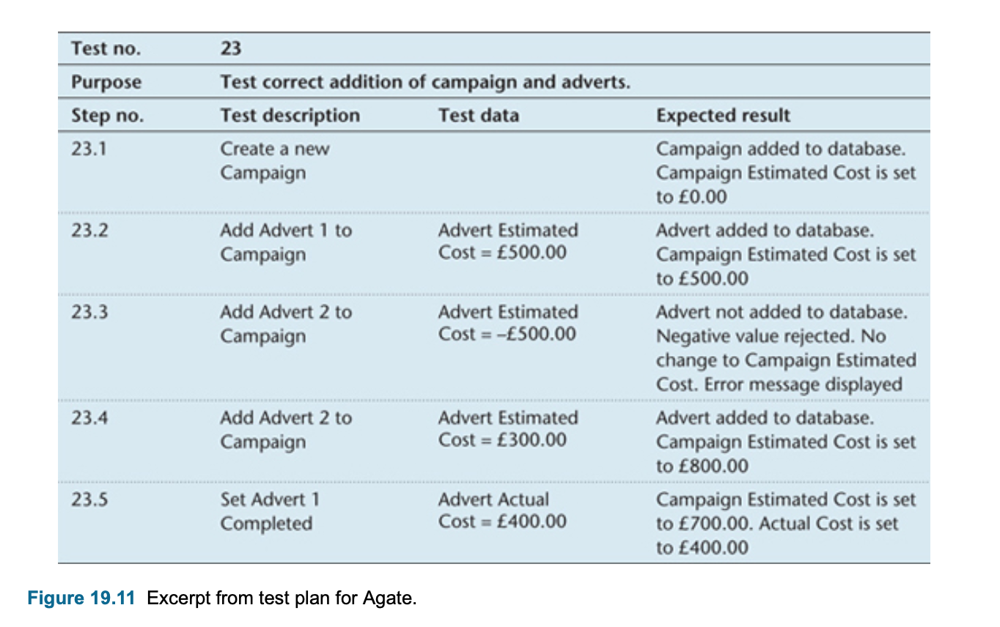

# Specification-based testing (Black box testing)

* Black box testing is asking ‘Never mind how it works, what does it produce?’
* No need to know specialist programming knowledge or access to source code.
* The software is treated as a black box.
* Black box testing does not investigate how the processing is carried out
* Black box testing tests the quality of performance of the software
* It is also necessary to check how well the software has been designed internally
* Ask questions:
    * Does it do what it’s meant to do?
    * Does it do it as fast as it’s meant to do it?
* Specification-based testing allows the behaviour of an application to be evaluated without regard to its internal
  logic, i.e. a representative range of inputs are selected and evaluation is made on the basis of whether the outputs
  seen are as expected.
* Its principles apply at many levels, e.g. system functional specification and unit design specification.
* For most systems, it is impossible to exercise the program with all inputs. We have to choose a set of test inputs
  i.e. representative input.
    * This is somewhat subjective: a matter of feeling and confidence.
* Representative inputs can be derived from equivalence classes.
    * Equivalent classes and boundary value analysis are the key concept related to specification-based testing.
* The input space can be partitioned into classes. Inputs in the same class are expected to be handled by the
  specification ‘in the same way’.
* Once we have the equivalence classes, we can then choose representative inputs. The number ofpoints chosen really
  depends on how ‘representative’ you think your chosen points are.
    * Bear in mind that the (implicit) assumption is that all points in the class are representative of the whole class
* An example to see how equivalence classes can be used to detect errors.
  </br>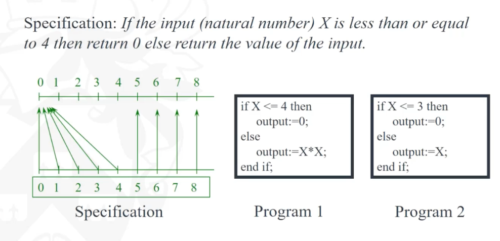

* Black box tests are based on the actual requirements, not the internals.
* Let’s pick one representative input from each class: 1 and 7. So for input 1, the specified output is 0,the test
  result is 0 so it passes. For input 7, the specified output is 7,but the test output is 49, so the error is detected.

</br>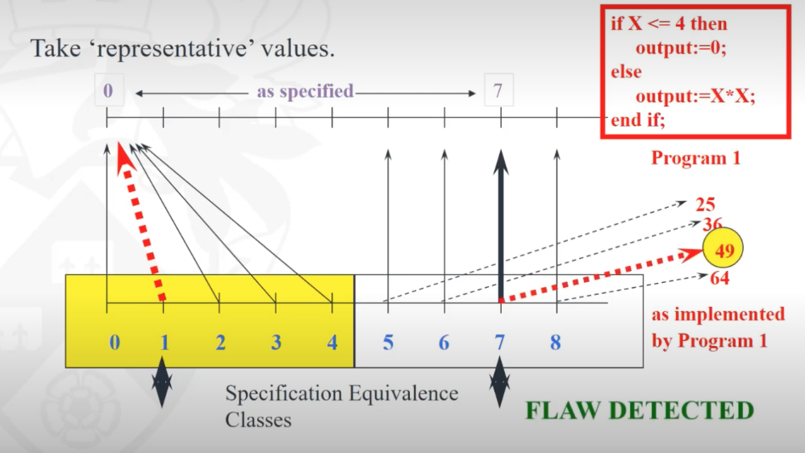

* Equvalence classes are good to detect errors
* But there is some potential problems
    * First, you may not detect errors with additional deliberately implemented (but not documented!) functionality.
    * Second, implementers may choose to refine a specification class into smaller classes, e.g. for efficiency reasons.
      Implementation may only be correct for some subclasses.
    * Third, misplacement of implemented boundaries may be missed. This can be dealt with by using boundary value
      analysis.
* Boundary value analysis is to select values at or near where behaviour should change.
* equivalence classes for
    * abs(x): two equivalence classes: x>=0, x<0
    * min(x, y): two equivalence classes: x>=y, x<y

* For a function:  If the input (natural number) X is less than or equal to 10 then return 0 else return the value of
  the input,
    * Representative input:
        * T1=(X=5), output=0
        * T2=(X=15), output=15
    * Boundary values:
        * T2=(X=9), output=0
        * T2=(X=10), output=0
        * T2=(X=11), output=11

# Structural testing (White Box Testing)

* Structural testing is also known as “white-box”, “glass-box”, or “code-based” testing
* White box testing is asking for ‘Never mind what it’s for, how well does it work?
* It tests the internal workings of the software and whether the software works as specified
* White box testing tests the quality of construction of the software.
* Ask questions
    * Is it not just a solution to the problem, but a good solution?
* Structural testing judges test suite thoroughness based on the structure (e.g. control flow graphs) of the program
  itself
* Testing adequacy is defined in terms of graph coverage, e.g. statement, branch, condition, and path coverage
* Structural testing is a powerful unit testing technique.
    * Many authors believe that structural testing will discover about 35% of bugs.
    * The coverage measures can also be used to guide testing.
* Structural testing, however, does not reveal missing functions and specification errors.

## Control Flow Graph

* Block : Rectangle represents a sequence of program statements
* Decision: decision represented by a diamond. It is the point at which control flow can diverge e.g. if and case
  statements.
* Junction: circle representing junctions. Junction is point at which control flow can merge e.g., end if, end loop.

</br>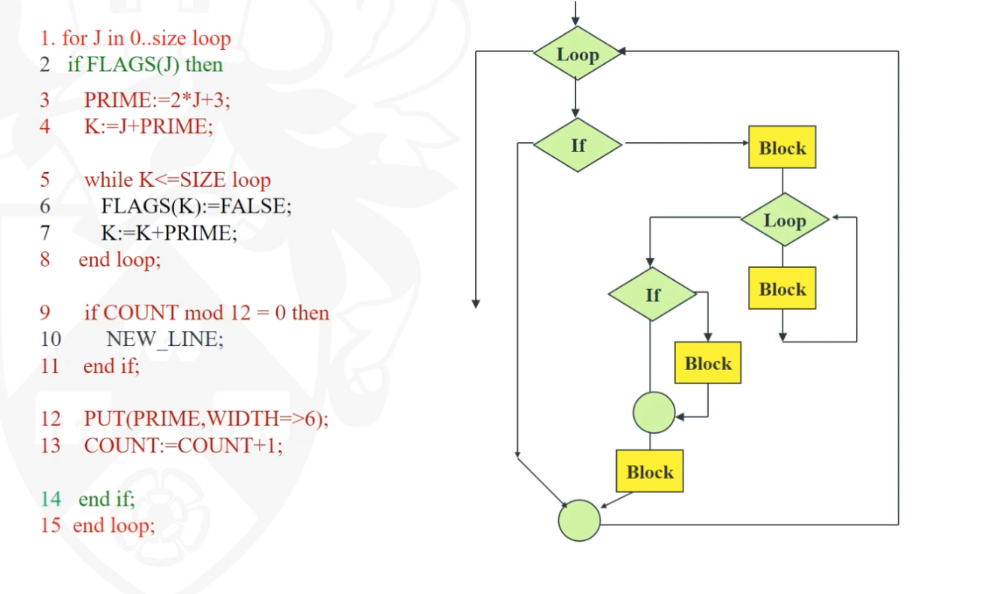

## Statement and Branch coverage

* Statement coverage aims to execute each statement (i.e. block node in the CFG) at least once.
* 100% statement coverage is a frequently specified requirement.
    * In this example, the test T1 will exercise the statement Z:=X+5; once, therefore gives statement coverage.But what
      if “B>6” should have been “B>=5”? This error cannot be detected by the test.

</br>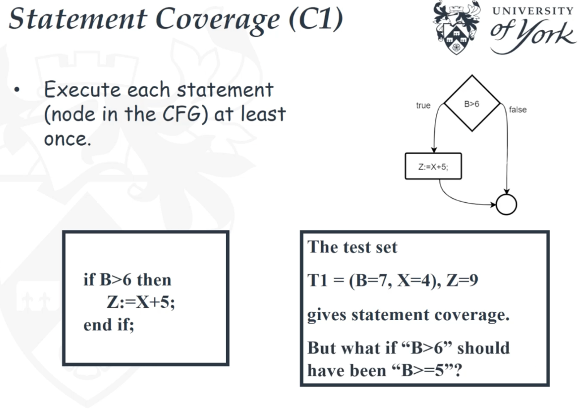

* Branch or decision coverage aims to have each branch (edge in the CFG) executed at least once.
    * For example the decision point (X>0 and Y>0) has two branches: the true branch and the false branch.Test T1 will
      exercise the false branch and T2 will exercise the true branch. The two tests therefore provides 100% branch
      coverage as well as statement coverage.

</br>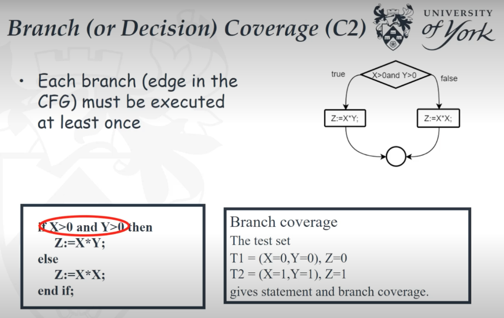

* How to choose the path to get coverage?
    * The advice is to pick simple, functionally sensible paths first, then pick additional paths that are small
      variations on previous paths.
    * Pick additional paths that have obvious functional meaning, and pick the paths that have no obvious functional
      meaning only if it is necessary to provide coverage.
    * Better focus on small parts of the program rather than large parts.


* Descriptions of structural Coverage:
    * Statement coverage is the proportion of source statements exercised by the test set. Statement coverage is a
      relatively weak criterion, but provides a level of confidence that some basic testing has been done.
    * Decision or branch coverage is a measure of branches that have been evaluated to both true and false in testing.
      When branches contain multiple conditions, branch coverage can be 100% without instantiating all conditions to
      true/false.

    * Condition coverage measures the proportion of conditions within decision expressions that have been evaluated to
      both true and false. Note that 100% condition coverage does not guarantee 100% decision coverage. For example,
      “if (A || B) {do something} else {do something else}” is tested with [0 1], [1 0], then A and B will both have
      been evaluated to 0 and 1, but the else branch will not be taken because neither test leaves both A and B false.

    * MC/DC requires that every condition in a decision in the program has taken on all possible outcomes at least once,
      each condition has been shown to independently affect the decision outcome, and that each entry and exit point
      have been traversed at least once.

### Task

* Consider the following method:

```
 int ABS(int x)
        {
        if(x< 0)
        x=-x;
        return x;
        }
```

* {T= value , output}
* Design a minimal set of tests to achieve statement coverage only. -> The test set {T1= -1,1} can achieve statement
  coverage
* Design a minimal set of tests to achieve branch coverage. -> The test set { T1= -1, 1; T2= -2, 2 } can achieve branch
  coverage
* Draw a control flow graph that represents the method code.

</br>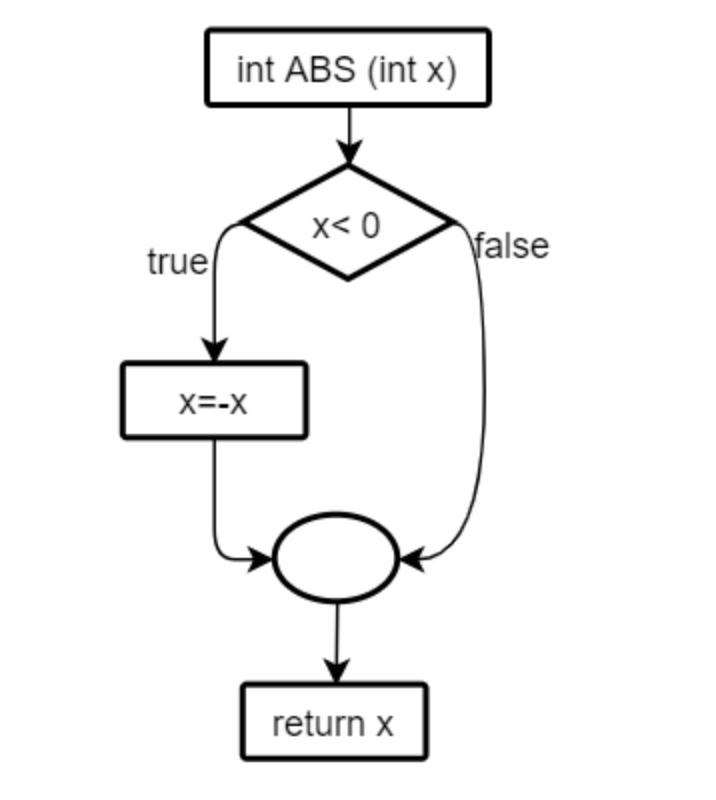

## Conditional coverage

* Conditional coverage requires each condition in a compound predicate to take on each truth value: true once and false
  once.
* With **multiple-condition**  coverage, test cases are written to cover all possible combinations of condition
  outcomes.
* Multiple-condition coverage also satisfies decision (or branch) coverage and condition coverage.
* The problem with multiple condition coverage is that test suite size is an exponential blowup, e.g. 2 conditions need
  4 tests, 3 conditions 8 tests and 4 conditions 16 tests etc.
* MC/DC (Multiple condition \ decision condition) refers to modified condition and decision coverage.
* The set of tests that achieves MC/DC coverage must **satisfy three conditions**: Branch coverage, Condition coverage ,
  Each condition makes a difference with respect to the outcome
* Making a difference means when a variable takes on different values, you will get the different outcome (assuming
  other variables remain the same).
    * For example tests 2-4 are sufficient to show that each variable makes a difference, with each variable
      independently affects the outcome.
    * But Tests 1-3, however, do not achieve MC/DC because variable A in test 1 and test 3 does not make a difference to
      the outcome when B=true.
* MC/DC achieves a good balance of thoroughness and test size

  </br>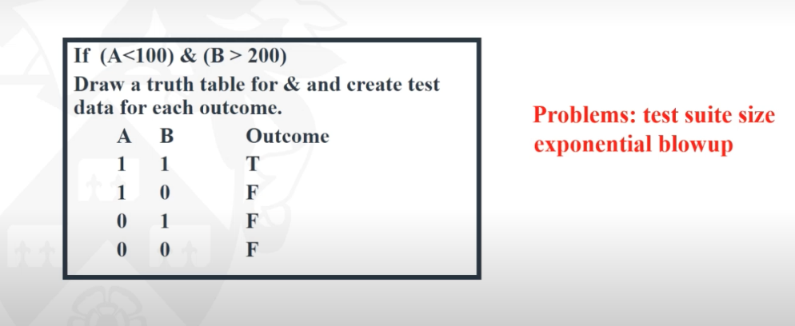
  </br>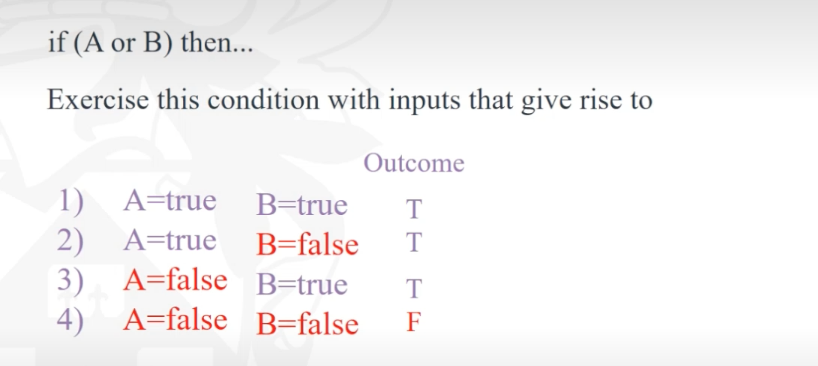

* [MC/DC Youtube video](https://www.youtube.com/watch?v=9i9xpxn6pzM)
    * Create a truth table,
    * Select one condition and a test then search for the similar test condition with filiped value of selected
      condition
    * if result is also filipd then those 2 test can use .

</br>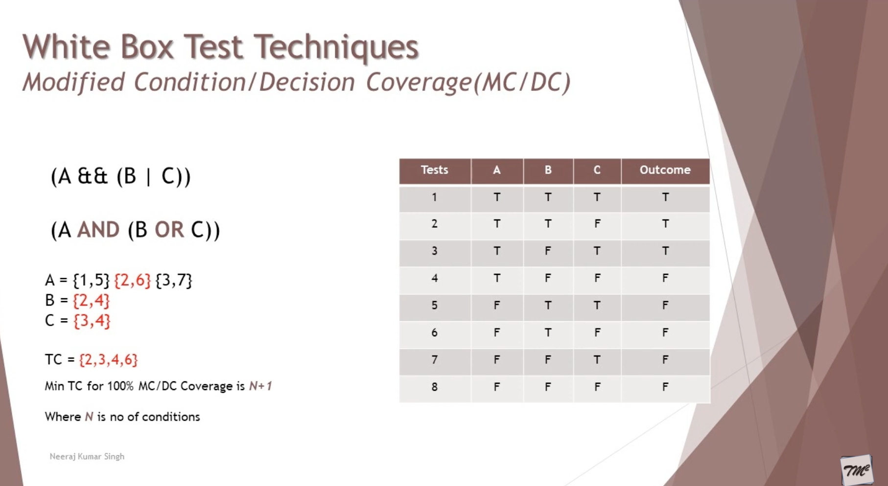

## Activity

* Design tests for white-box testing:
    * Draw a control flow graph
    * Write a test that can achieve statement, but not branch coverage for the max method

  </br>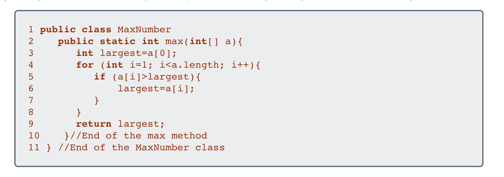
  </br>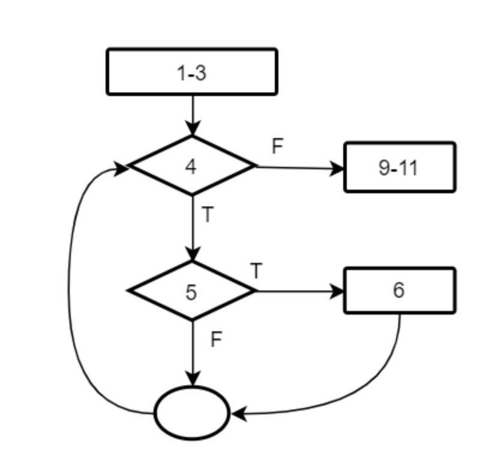

    * Answer :  T= {1, 2, 3, 4} will achieve statement but not branch coverage. It leaves 5F->O branch unexecuted.

# White and Black test is used for

* completeness (black box and white box)
* correctness (black box and white box)
* reliability (white box)
* maintainability (white box).

# JUnit and refactoring

## Unit testing

* Unit (or module or component) testing is the lowest level of testing where each unit is individually tested to ensure
  that its behaviour meets its specification.
* Units are tested under the control of a test harness, e.g. Junit.
* To run a unit teat in Junit we have to flag with @Test annotation
* To all methods in Junit [Junit Source Lib Doc](http://junit.sourceforge.net/javadoc/)
* You can setup fixtures before/after **all test methods** run test by using

  </br>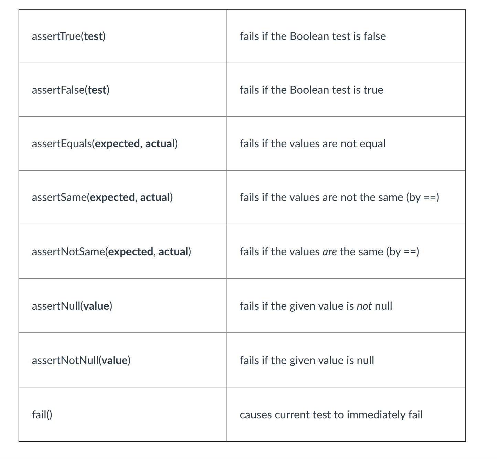

```
@Before public void setup(){...}
@After public void teardown(){...}
```

* If you want to set up test fixtures **once** before/after the entire test class

```
@BeforeClass public static void setUpBeforeClass(){...}
@AfterClass public static void tearDownAfterClass(){...}
```

## Refactoring

* Refactoring is the process of improving the design of existing code without changing its observable behaviour
* Refactoring is supported by unit tests.
* Refactoring aims to replace code that **‘smells’**, e.g. duplicated code, big method, class with many instance
  variables, class with lots of code, high coupling between many objects, long parameter lists and many other ways in
  which bad code is written.
* There are about 100 named refactoring methods, such as:
    * **The Extract method:** Transforms a long method into a shorter one by factoring out a portion into a private
      helper method.
    * **Extract a constant:** replaces a literal constant with a constant variable
    * **Extract local variables:** introduces explaining temporary variable

* The major points that you should take away from this the lab:
    * Refactoring involves making structural changes to source code.
    * Even tasks that seem simple (e.g. renaming a class field) would be hard to do with normal IDE features (like
      search and replace). Refactoring without tool support is not practical.
    * IDE's refactoring support effectively understands Java program structure to allow you to make serious changes
      across many files in your project.
    * Having unit tests that show how a system works allows you to refactor without fear of breaking your design.

# Cyclomatic complexity

* The cyclomatic complexity of a section of source code is the maximum number of linearly independent paths within
  it—where "linearly independent" means that each path has at least one edge that is not in one of the other paths. For
  instance, if the source code contained no control flow statements (conditionals or decision points), the complexity
  would be 1, since there would be only a single path through the code. If the code had one single-condition IF
  statement, there would be two paths through the code: one where the IF statement evaluates to TRUE and another one
  where it evaluates to FALSE, so the complexity would be 2. Two nested single-condition IFs, or one IF with two
  conditions, would produce a complexity of 3.
* Mathematically, the cyclomatic complexity of a structured program[a] is defined with reference to the control-flow
  graph of the program, a directed graph containing the basic blocks of the program, with an edge between two basic
  blocks if control may pass from the first to the second. The complexity M is then defined as[2]

* M = E − N + 2P, where
    * E = the number of edges of the graph.
    * N = the number of nodes of the graph.
    * P = the number of connected components.

* How do you know how many paths to look for? The computation of cyclomatic complexity provides the answer. Cyclomatic
  complexity is a software metric that provides a quantitative measure of the logical complexity of a program.
    * When used in the context of the basis path testing method, the value computed for cyclomatic complexity defines
      the number of independent paths in the basis set of a program and provides you with an upper bound for the number
      of tests that must be conducted to ensure that all statements have been executed at least once.
    * Cyclomatic complexity can be used to target modules as candidates for extensive unit testing. Modules with high
      cyclomatic complexity are more likely to be error prone than modules whose cyclomatic complexity is lower.
      Therefore, extra effort should be spent to test these modules.

# Source

* [Junit Tutorial](https://help.eclipse.org/2021-03/index.jsp?topic=%2Forg.eclipse.jdt.doc.user%2FgettingStarted%2Fqs-junit.htm)
* [Junit Source Lib Doc](http://junit.sourceforge.net/javadoc/)
* [Refactoring](https://www.refactoring.com/)
    * [Refactoring 2](https://www.ibm.com/developerworks/java/library/os-ecref/os-ecref-pdf.pdf)

# TODO:

* Read in Pressman’s book section 18.6.2-18.6.3.
* The Pressman book section 18.3-18.5 provides some additional reading on structured testing. Typically you might want
  to look into Cyclomatic Complexity metrics and its uses in path testing.

* Discusision : https://onlinestudy.york.ac.uk/courses/644/discussion_topics/16210?module_item_id=42791

# WEEK 7

## Main topics

* Apply and evaluate the quality assurance techniques including reviews and inspections.
* Understand change management and theory behind configuration management

Relevant Module Learning Outcomes for this week:

* Manage risk in making changes to an existing software system through rigorous engineering practices
* Critically evaluate the appropriateness of different software engineering techniques/tools in different circumstances,
  and on the quality of the design of an application.

## Sub Titles

* [Quality Managment](#quality-management)
    * [Intro](#intro)
    * [Quality Plan](#quality-plan)
    * [Software Quality](#software-quality)
    * [Software Standards](#software-standards)
    * [Reviews and inspections](#reviews-and-inspections)
        * [The review process](#the-review-process)
        * [Program inspections](#program-inspections)
* [Configuration management](#configuration-management)
    * [Version Managment](#version-managment)
    * [System building](#system-building)
* [Questions](#questions)
    * [What makes a good quality assurance manager](#what-makes-a-good-quality-assurance-manager)
    * [Activity software inspection](#activity-software-inspection)

# Quality management

## Intro

* Software quality management is concerned with ensuring that developed software systems are “fit for purpose.”
    * That is, systems should meet the needs of their users, should perform efficiently and reliably, and should be
      delivered on time and within budget.

* Quality management is both an organizational and an individual project issue
    * In organization level : quality management is concerned with establishing a framework of organizational processes
      and standards that will lead to high-quality software.
    * In Project level: quality management involves the application of specific quality processes, checking that these
      planned processes have been followed, and ensuring that the project outputs meet the defined project standards.
* Software quality management technique:
    * **Quality assurance** is the definition of processes and standards that should lead to high-quality products and
      the introduction of quality processes into the manufacturing process.
    * **Quality control** is the application of these quality processes to weed out products that are not of the
      required level of quality. Both quality assurance and quality control are part of quality management.
* Quality management provides an independent check on the software development process.
* **The QM team** checks:
    * The project deliverables to ensure that they are consistent with organizational standards and goals
    * They also check process documentation, which records the tasks that have been completed by each team working on
      this project.
* The QM team should be independent and not part of the software development group so that they can take an objective
  view of the quality of the software

## Quality Plan

* The quality plan should **set out the desired software qualities** and **describe how these qualities are to be
  assessed**.
    * It defines what “high-quality” software actually means for a particular system
* Outline structure for a quality plan
    * **Product introduction** A description of the product, its intended market, and the quality expectations for the
      product.
    * **Product plans** The critical release dates and responsibilities for the product, along with plans for
      distribution and product servicing.
    * **Process descriptions** The development and service processes and standards that should be used for product
      development and management.
    * **Quality goals** The quality goals and plans for the product, including an identification and justification of
      critical product quality attributes.
    * **Risks and risk management** The key risks that might affect product quality and the actions to be taken to
      address these risks.

## Software Quality

* The manufacturing industry established the fundamentals of quality management in a drive to improve the quality of the
  products that were being made.
* The underlying assumption was that products could be completely specified and procedures could be established that
  could check a manufactured product against its specification.
* It's often impossible to come to an objective conclusion about whether or not a software system meets its
  specification:
    * It is difficult to write complete and unambiguous software requirements.
    * Specifications usually integrate requirements from several classes of stake-holder. The excluded stakeholders may
      therefore perceive the system as a poor-quality system, even though it implements the agreed requirements.
    * It is impossible to measure certain quality characteristics (e.g., maintainability)
      directly, and so they cannot be specified in an unambiguous way.
* Because of these problems, the assessment of software quality is a subjective process.
    * The quality management team uses their judgment to decide if an acceptable level of quality has been achieved.
      They decide whether or not the software is fit for its intended purpose.
* This decision involves answering questions about the system’s characteristics.
    * For example:
        1. Has the software been properly tested, and has it been shown that all requirements have been implemented?
        2. Is the software sufficiently dependable to be put into use?
        3. Is the performance of the software acceptable for normal use?
        4. Is the software usable?
        5. Is the software well structured and understandable?
        6. Have programming and documentation standards been followed in the development process?

* **The subjective quality of a software system is largely based on its non-functional characteristics.**
    * If the software’s functionality is not what is expected, then users will often just work around this deficiency.
      However, if the software is unreliable or too slow, then it is practically impossible for them to achieve their
      goals.
* Software quality is not just about whether the software functionality has been correctly implemented, but also depends
  on non-functional system attributes as shown below.
    * These attributes reflect the software dependability, usability, efficiency, and maintainability.
      </br>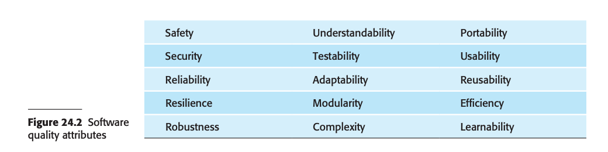
* It is not possible for any system to be optimized for all of these attributes. For example, improving security may
  lead to loss of performance.
* The quality plan should therefore define the most important quality attributes for the software that is being
  developed.
    * It may be that efficiency is critical and other factors have to be sacrificed to achieve it.
* The plan should also include a definition of the quality assessment process.
    * This process should be an agreed way of assessing whether some quality, such as maintainability or robustness, is
      present in the product.

* Traditional software quality management is based on the assumption that the quality of software is directly related to
  the quality of the software development process.
    * This assumption comes from manufacturing systems where product quality is intimately related to the production
      process.
    * A manufacturing process involves configuring, setting up, and operating the machines involved in the process
    * Once the machines are operating correctly, product quality naturally follows.
* here is a clear link between process and product quality in manufacturing because the process is relatively easy to
  standardize and monitor.
    * However, software is designed rather than manufactured, and the relationship between process quality and product
      quality is more complex.
    * Software design is a creative process, so the influence of individual skills and experience is significant.
    * External factors, such as the novelty of an application or commercial pressure for an early product release, also
      affect product quality irrespective of the process used

* Defined processes are important, but quality managers should also aim to develop a **“quality culture”** in which
  everyone responsible for software development is committed to achieving a high level of product quality.
    * They should encourage the team to take responsibility for the quality of their work
* While standards and procedures are the basis of quality management, good-quality managers recognize that there are
  intangible aspects to software quality (elegance, readability, etc.) that cannot be embodied in standards.

## Software Standards

* Software standards play an important role in plan-based software quality management.
* An important part of quality assurance is the definition or selection of standards that should apply to the software
  development process or software product.
* Software standards are important for three reasons:
    * Standards capture wisdom that is of value to the organization. This knowledge is often acquired only after a great
      deal of trial and error. Building it into a standard helps the company reuse this experience and avoid previous
      mistakes.
    * Standards provide a framework for defining what quality means in a particular setting.
    * Standards assist consistency and continuity when work carried out by one person is taken up and continued by
      another.

* Two related types of software engineering standard may be defined and used in software quality management:
    * **Product standards** These apply to the software product being developed. They include document standards, such
      as the structure of requirements documents, documentation standards, such as a standard comment header for an
      object class definition, and coding standards, which define how a programming language should be used.
    * **Process standards** These define the processes that should be followed during software development. They should
      encapsulate good development practice. Process standards may include definitions of specification, design, and
      validation processes, process support tools, and a description of the documents that should be written during
      these processes.

</br>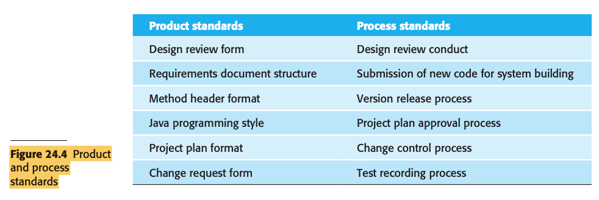

* Standards have to deliver value, in the form of increased product quality.
* Product standards have to be designed so that they can be applied and checked in a cost-effective way, and process
  standards should include the definition of processes that check if product standards have been followed.
* The software engineering standards that are used within a company are usually adapted from broader national or
  international standards
    * National and international standards have been developed covering software engineering terminology, programming
      languages such as Java and C++, notations such as charting symbols, procedures for deriving and writing software
      requirements, quality assurance procedures, and software verification and validation processes (IEEE 2003).
* Software engineers sometimes consider standards to be overprescriptive and irrelevant to the technical activity of
  software development. This is particularly likely when project standards require tedious documentation and work
  recording.
    * Quality managers should do to avoid this:
        * **Involve software engineers** in the selection of product standards If developers understand why standards
          have been selected, they are more likely to be committed to these standards.
        * **Review and modify standards** regularly to reflect changing technologies Standards are expensive to develop,
          and they tend to be enshrined in a company standards handbook.
        * **Make sure that tool support is available to support standards-based development** Developers often find
          standards to be a bugbear when conformance to them involves tedious manual work that could be done by a
          software tool.
* Different types of software need different development processes, so standards have to be adaptable.There is no point
  in prescribing a particular way of working if it is inappropriate for a project or project team.
    * However, when changes are made, it is important to ensure that these changes do not lead to a loss of product
      quality.
* They should decide which of the organizational standards should be used without change, which should be modified, and
  which should be ignored. New standards may have to be created in response to customer or project requirements.

## Reviews and inspections

* Reviews and inspections are quality assurance activities that check the quality of project deliverables.
* This involves checking the software, its documentation, and records of the process to discover errors and omissions as
  well as standards violations.
* During a review, several people examine the software and its associated documentation, looking for potential problems
  and nonconformance with standards.
    * The review team makes informed judgments about the level of quality of the software or project documents.
    * Project managers may then use these assessments to make planning decisions and allocate resources to the
      development process.
* Quality reviews are based on documents that have been produced during the software development process.
    * As well as software specifications, designs, code, process models, test plans, configuration management
      procedures, process standards, and user manuals may all be reviewed
* Reviews are not just about checking conformance to standards. They are also used to help discover problems and
  omissions in the software or project documentation.
    * The conclusions of the review should be formally recorded as part of the quality management process.
    * If problems have been discovered, the reviewers’ comments should be passed to the author of the software or
      whoever is responsible for correcting errors or omissions.

* Reviewing is a public process of error detection, compared with the more private component-testing process.
* Quality reviews are not management progress reviews, although information about the software quality may be used in
  making management decision
* Progress reviews compare the actual progress in a software project against the planned progress. Their prime concern
  is whether or not the project will deliver useful software on time and on budget.

### The review process

</br>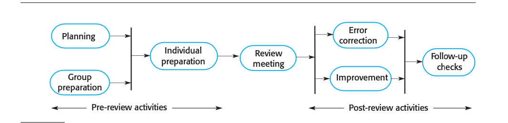

* The review processes are structured into three phases:
    * **Pre-review activities** These are preparatory activities that are essential for the review to be effective.
        * Typically, pre-review activities are concerned with review planning and review preparation.
            * Review planning involves setting up a review team, arranging a time and place for the review, and
              distributing the documents to be reviewed
    * **The review meeting** During the review meeting, an author of the document or program being reviewed should “walk
      through” the document with the review team.
        * The review itself should be relatively short—two hours at most.
    * **Post-review activities** After a review meeting has ended, the issues and problems raised during the review
      must be addressed.
        * Actions may involve fixing software bugs, refactoring software so that it conforms to quality standards, or
          rewriting documents.

### Program inspections

* Program inspections are **peer reviews** where team members collaborate to find bugs in the program that is being
  developed.
* Inspections may be part of the software verification and validation processes.
* Program inspections involve team members from different backgrounds who make a careful, line-by-line review of the
  program source code.
    * Defects may be logical errors, anomalies in the code that might indicate an erroneous condition or features that
      have been omitted from the code
    * The review team examines the design models or the program code in detail and highlights anomalies and problems for
      repair.
* During an inspection, a checklist of common programming errors is often used to focus the search for bugs
* Companies that use inspections have found that they are effective in finding bugs
* According to some researches where the defect detection rate is about 25%, with inspections, where the defect
  detection rate was 60%.
* But still some people avoid to use inspection, because:
    * Software engineers with experience in program testing are sometimes unwilling to accept the fact that inspections
      can be more effective for defect detection than testing.
    * Managers may be suspicious because inspections require additional costs during design and development.

* Check list:
  </br>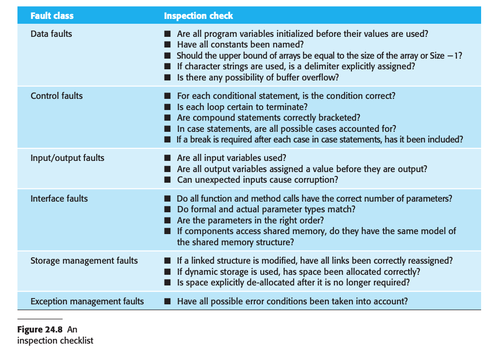

# Configuration management

* Configuration management (CM) is concerned with the policies, processes, and tools for managing changing software
  systems.
* The configuration management of a software system product involves four closely related activities
    * **Version control** This involves keeping track of the multiple versions of system components and ensuring that
      changes made to components by different developers do not interfere with each other.
    * **System building** This is the process of assembling program components, data, and libraries, then compiling and
      linking these to create an executable system.
    * **Change management** This involves keeping track of requests for changes to delivered software from customers and
      developers, working out the costs and impact of making these changes, and deciding if and when the changes should
      be implemented.
    * **Release management** This involves preparing software for external release and keeping track of the system
      versions that have been released for customer use.
* Agile development, where components and systems are changed several times a day, is impossible without using CM tools.
* The development of a software product or custom software system takes place in three distinct phases:
    * A development phase where the development team is responsible for managing the software configuration and new
      functionality is being added to the software. The development team decides on the changes to be made to the
      system.
    * A system testing phase where a version of the system is released internally for testing. This may be the
      responsibility of a quality management team or an individual or group within the development team. At this
      stage, no new functionality is added to the system. The changes made at this stage are bug fixes, performance
      improvements, and security vulnerability repairs. There may be some customer involvement as beta testers during
      this phase.
    * A release phase where the software is released to customers for use. After the release has been distributed,
      customers may submit bug reports and change requests. New versions of the released system may be developed to
      repair bugs and vulnerabilities and to include new features suggested by customers.
* For large systems, there is never just one “working” version of a system; there are always several versions of the
  system at different stages of development.

* In large software projects, configuration management is sometimes part of software quality management.
    * The quality manager is responsible for both quality management and configuration management. When a pre-release
      version of the software is ready, the development team hands it over to the quality management team.
    * The QM team checks that the system quality is acceptable. If so, it then becomes a controlled system, which means
      that all changes to the system have to be agreed on and recorded before they are implemented.

</br>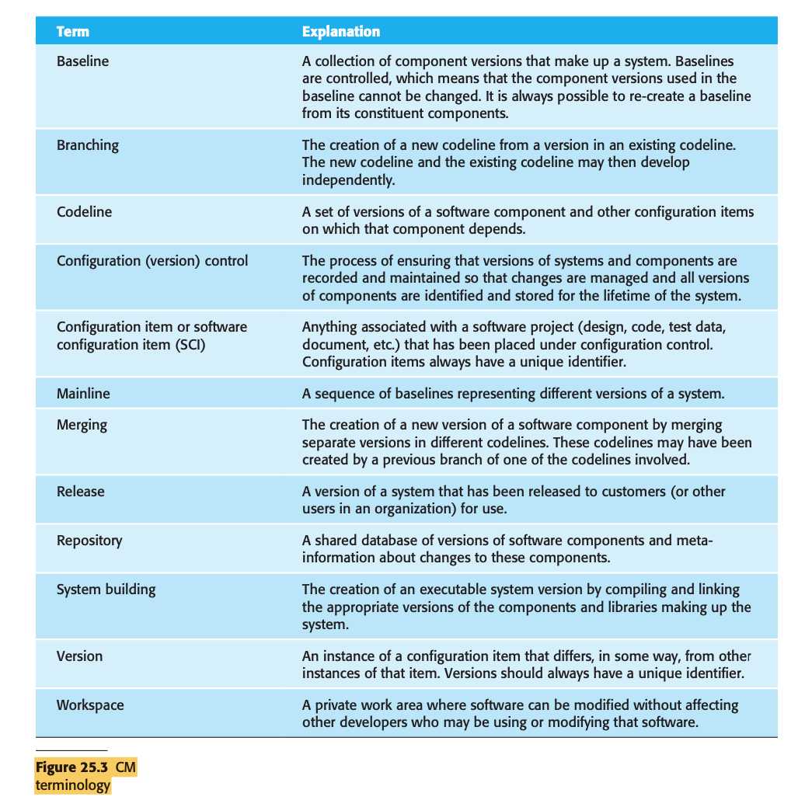

## Version Managment

* Version management is the process of keeping track of different versions of software components and the systems in
  which these components are used.
    * It also involves ensuring that changes made by different developers to these versions do not interfere with each
      other.
    * In other words, version management is the process of managing codelines and baselines.

* A **codeline** is a sequence of versions of source code, with later versions in the sequence derived from earlier
  versions.
    * Codelines normally apply to components of systems so that there are different versions of each component
* A **baseline** is a definition of a specific system.
    * The baseline specifies the component versions that are included in the system and identifies the libraries used,
      configuration files, and other system information
    * Baselines may be specified using a configuration language in which you define what components should be included
      in a specific version of a system
    * Baselines are important because you often have to re-create an individual version of a system. For example, a
      product line may be instantiated so that there are specific system versions for each system customer. You may have
      to re-create the version delivered to a customer if they report bugs in their system that have to be repaired.
      </br>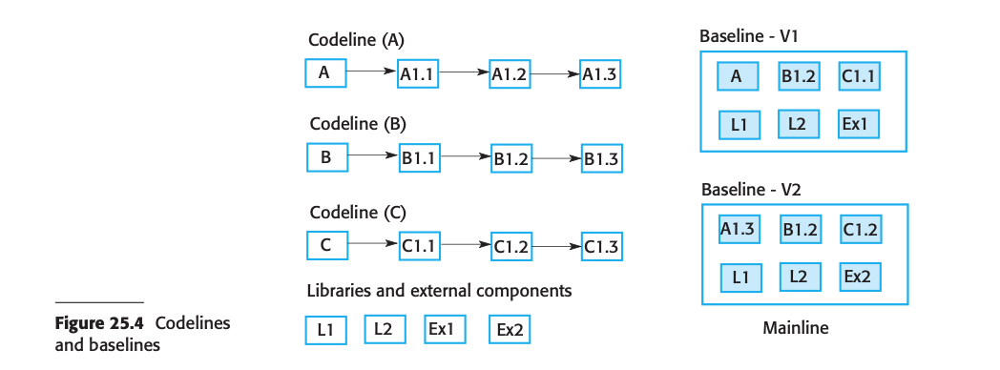

* There are two types of modern version control system:
    * **Centralized systems,** where a single master repository maintains all versions of the software components that
      are being developed. Subversion (Pilato, Collins-Sussman, and Fitzpatrick 2008) is a widely used example of a
      centralized VC system.
    * **Distributed systems**, where multiple versions of the component repository exist at the same time. Git (Loeliger
      and McCullough 2012), is a widely used example of a distributed VC system.
* Centralized and distributed VC systems provide comparable functionality but implement this functionality in different
  ways. Key features of these VC systems include:
    * **Version and release identification** Managed versions of a component are assigned unique identifiers when they
      are submitted to the system.
    * **Change history recording** The VC system keeps records of the changes that have been made to create a new
      version of a component from an earlier version
    * **Independent development** Different developers may be working on the same component at the same time.
    * **Project support** A version control system may support the development of several projects, which share
      components. It is usually possible to check in and check out all of the files associated with a project rather
      than having to work with one file or directory at a time.
    * **Storage management** Rather than maintain separate copies of all versions of a component, the version control
      system may use efficient mechanisms to ensure that duplicate copies of identical files are not maintained.
* To support independent development without interference, all version control systems use the concept of a project
  repository and a private workspace.
    * The project repository maintains the “master” version of all components, which is used to create baselines for
      system building.

* When modifying components, developers **copy (check-out)** these from the repository into their workspace and work on
  these copies. When they have completed their changes, the changed components are **returned (checked-in)** to the
  repository.
    * However, centralized and distributed VC systems support independent development of shared components in different
      ways.

* **In centralized systems,** developers check out components or directories of components from the project repository
  into their private workspace and work on these copies in their private workspace. When their changes are complete,
  they check-in the components back to the repository. This creates a new component version that may then be shared.
    * If two or more people are working on a component at the same time, each must check out the component from the
      repository.
    * If a component has been checked out, the version control system warns other users wanting to check out that
      component that it has been checked out by someone else.
    * The system will also ensure that when the modified components are checked in, the different versions are assigned
      different version identifiers and are stored separately
      </br>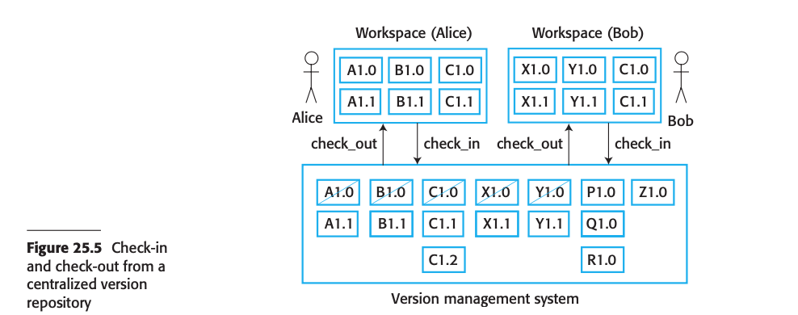

* **In a distributed VC system**, such as Git, a different approach is used.
    * A “master” repository is created on a server that maintains the code produced by the development team. Instead of
      simply checking out the files that they need, **a developer creates a clone of the project repository** that is
      downloaded and installed on his or her computer
    * Developers work on the files required and maintain the new versions **on their private repository on their own
      computer**.
    * When they have finished making changes, they **“commit”** these changes and **update their private server**
      repository.
    * They may then “**push**” these changes to **the project repositor**y or tell the integration manager that changed
      versions are available.
    * He or she may then “**pull**” these files to the project repository (see Figure 25.6).
      </br>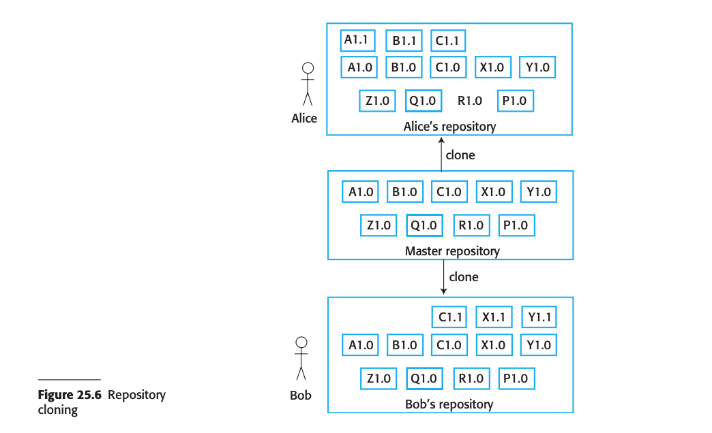

* In distibuted model of development has a number of **advantages**:
    * It provides a backup mechanism for the repository. If the repository is corrupted, work can continue and the
      project repository can be restored from local copies.
    * It allows for offline working so that developers can commit changes if they do not have a network connection.
    * Project support is the default way of working. Developers can compile and test the entire system on their local
      machines and test the changes they have made.

* Distributed version control is essential for open-source development where several people may be working
  simultaneously on the same system without any central coordination.

* There is no way for the open-source system “manager” to know when changes will be made.
    * In this case, as well as a private repository on their own computer, developers also maintain a public server
      repository to which they push new versions of components that they have changed.
    * It is then up to the open-source system “manager” to decide when to pull these changes into the definitive system.

* A consequence of the independent development of the same component is that codelines may branch
    * It is generally recommended when working on a system that a new branch should be created so that changes do not
      accidentally break a working system.

* At some stage, it may be necessary to merge codeline branches to create a new version of a component that includes all
  changes that have been made.
    * If the changes made involve completely different parts of the code, the component versions may be merged
      automatically by the version control system by combining the code changes.
    * This is the normal mode of operation when new features have been added.
    * However, the changes made by different developers sometimes overlap. The changes may be incompatible and interfere
      with each other.
    * In this case, a developer has to check for clashes and make changes to the components to resolve the
      incompatibilities between the different versions.

</br>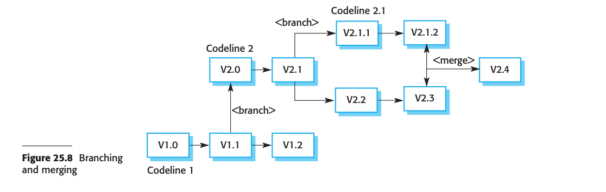

* When a new version is created, the system simply stores a delta, a list of differences, between the new version and
  the older version used to create that new version.
    * One of the problems with a delta-based approach to storage management is that it can take a long time to apply all
      of the deltas.
* As disk storage is now relatively cheap, Git uses an alternative, faster approach.
    * Git does not use deltas but applies a standard compression algorithm to stored files and their associated
      meta-information. It does not store duplicate copies of files. Retrieving a file simply involves decompressing it,
      with no need to apply a chain of operations. Git also uses the notion of packfiles where several smaller files are
      combined into an indexed single file. This reduces the overhead associated with lots of small files. Deltas are
      used within packfiles to further reduce their size.

## System building

* System building is the process of creating a complete, executable system by compiling and linking the system
  components, external libraries, configuration files, and other information.
* System-building tools and version control tools must be integrated as the build process takes component versions from
  the repository managed by the version control system.
* System building involves assembling a large amount of information about the software and its operating environment.
    * Therefore, it always makes sense to use an automated build tool to create a system build. Ideally, you should be
      able to build a complete system with a single command or mouse click.
* Tools for system integration and building include some or all of the following features:
    * **Build script generation** The build system should analyze the program that is being built, identify dependent
      components, and automatically generate a build script (configuration file).
    * **Version control** system integration The build system should check out the required versions of components from
      the version control system.
    * **Minimal recompilation** The build system should work out what source code needs to be recompiled and set up
      compilations if required.
    * **Executable system creation** The build system should link the compiled object code files with each other and
      with other required files, such as libraries and configuration files, to create an executable system.
    * **Test automation** Some build systems can automatically run automated tests using test automation tools such as
      JUnit. These check that the build has not been “broken” by changes.
    * **Reporting** The build system should provide reports about the success or failure of the build and the tests that
      have been run.
    * **Documentation generation** The build system may be able to generate release notes about the build and system
      help pages.

</br>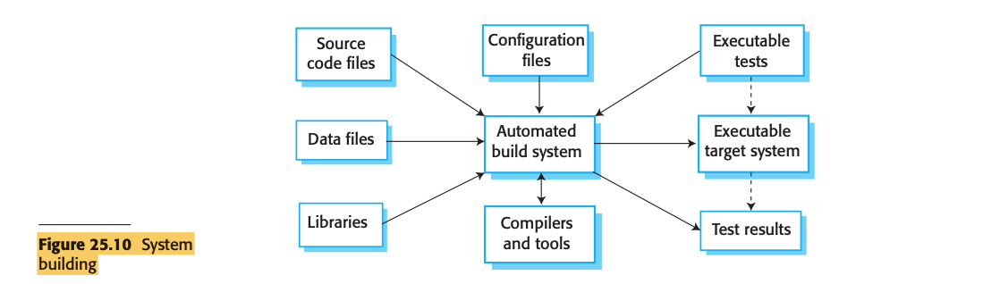

* Building is a complex process, which is potentially error-prone, as three different system platforms may be involved:
    * **The development system**, which includes development tools such as compilers and source code editors.
    * **The build server**, which is used to build definitive, executable versions of the system. This server maintains
      the definitive versions of a system.
    * **The target environment**, which is the platform on which the system executes. This may be the same type of
      computer that is used for the development and build systems.
* Agile methods recommend that very frequent system builds should be carried out, with automated testing used to
  discover software problems.
* Frequent builds are part of a process of continuous integration
* In keeping with the agile methods notion of making many small changes, continuous integration involves rebuilding the
  mainline frequently, after small source code changes have been made
* The steps in continuous integration are:
    * Extract the mainline system from the VC system into the developer’s private workspace.
    * Build the system and run automated tests to ensure that the built system passes all tests.
        * if not inform who made the changes
    * Make the changes to the system components.
    * Build the system in a private workspace and rerun system tests
    * Once the system has passed its tests, check it into the build system server but do not commit it as a new system
      baseline in the VC system.
    * Build the system on the build server and run the tests.
    * If the system passes its tests on the build system, then commit the changes you have made as a new baseline in the
      system mainline.

</br>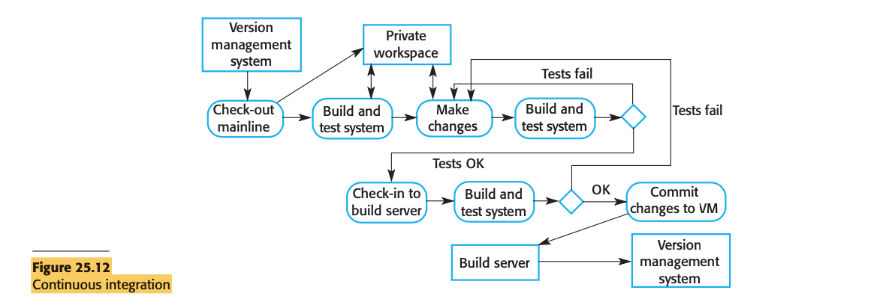

* Jenkins is a sample for continuous integration tool
* The advantage of continuous integration is that it allows problems caused by the interactions between different
  developers to be discovered and repaired as soon as possible
    * The most recent system in the mainline is the definitive working system.
* Continues integration is good but it is not always possible to implement
    * **If the system is very large**, it may take a long time to build and test, especially if integration with other
      application systems is involved
    * **If the development platform is different from the target platform**, it may not be possible to run system tests
      in the developer’s private workspace. There may be differences in hardware, operating system, or installed
      software
* For large systems or for systems where the execution platform is not the same as the development platform, continuous
  integration is usually impossible. In those circumstances, frequent system building is supported using a daily build
  system
* Frequent building encourages thorough unit testing of components.
* Psychologically, developers are put under pressure **not to “break the build”**; that is, they try to avoid checking
  in versions of components that cause the whole system to fail.
* The signature identifies each source code version and is changed when the source code is edited.
    * By comparing the signatures on the source and object code files, it is possible to decide if the source code
      component was used to generate the object code component.

* 2 types signature may use:
    * **Modification timestamps** The signature on the source code file is the time and date when that file was
      modified.
    * **Source code checksums** The signature on the source code file is a checksum calculated from data in the file.
      A checksum function calculates a unique number using the source text as input.
        * The checksum approach has the advantage of allowing many different versions of the object code of a component
          to be maintained at the same time.

</br>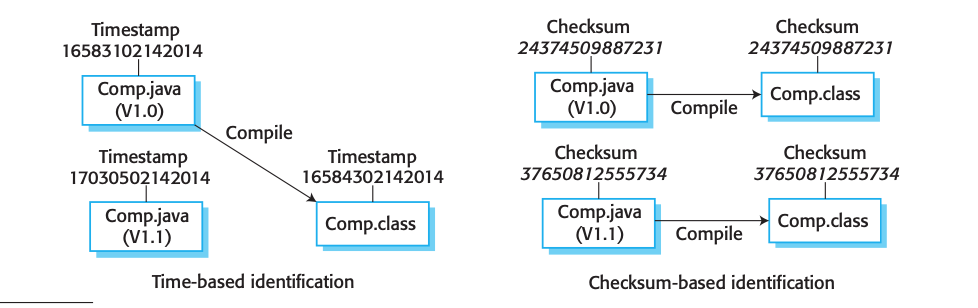

## Change management

* Change management is intended to ensure that the evolution of the system is controlled and that the most urgent and
  cost-effective changes are prioritized.
* Change management is the process of analyzing the costs and benefits of proposed changes, approving those changes
  that are cost-effective, and tracking which components in the system have been changed
* This process should come into effect when the software is handed over for release to customers or for deployment
  within an organization.
* Tools to support change management may be relatively simple issue or bug tracking systems or software that is
  integrated with a configuration management package for large-scale systems, such as Rational Clearcase
* Issue tracking systems allow anyone to report a bug or make a suggestion for a system change, and they keep track of
  how the development team has responded to the issues
* Change requests may be submitted using a change request form (CRF).
    * Stakeholders may be system owners and users, beta testers, developers, or the marketing department of a company.
    * The CRF records the recommendations regarding the change, the estimated costs of the change, and the dates when
      the change was requested, approved, implemented, and validated
    * The CRF may also include a section where a developer outlines how the change may be implemented.
    * The degree of formality in the CRF varies depending on the size and type of organization that is developing the
      system.

* After a change request has been submitted, it is checked to ensure that it is valid. The checker may be from a
  customer or application support team or, for internal requests, may be a member of the development team
* For valid change requests, the next stage of the process is change assessment and costing.
    * This function is usually the responsibility of the development or maintenance team as they can work out what is
      involved in implementing the change

* Following cost analysis, a separate group decides if it is cost-effective for the business to make the change to the
  software.
    * For military and government systems, this group is often called the change control board (CCB). it may be called
      something like a “product development group” responsible for making decisions about how a software system should
      evolve.

* The CCB or product development group considers the impact of the change from a strategic and organizational rather
  than a technical point of view
* The factors that influence the decision on whether or not to implement a change include:
    * **The consequences of not making the change** When assessing a change request, you have to consider what will
      happen if the change is not implemented.
    * **The benefits of the change** Will the change benefit many users of the system, or will it only benefit the
      change proposer?
    * **The number of users affected by the change** If only a few users are affected, then the change may be assigned a
      low priority.
    * **The costs of making the change** If making the change affects many system components (hence increasing the
      chances of introducing new bugs) and/or takes a lot of time to implement, then the change may be rejected.
    * **The product release cycle** If a new version of the software has just been released to customers, it may make
      sense to delay implementation of the change until the next planned release

* In some agile methods, customers are directly involved in deciding whether a change should be implemented.
* The changes that involve software improvement are left to the discretion of the programmers working on the system.
    * Refactoring, where the software is continually improved, is not seen as an overhead but as a necessary part of the
      development process.

</br>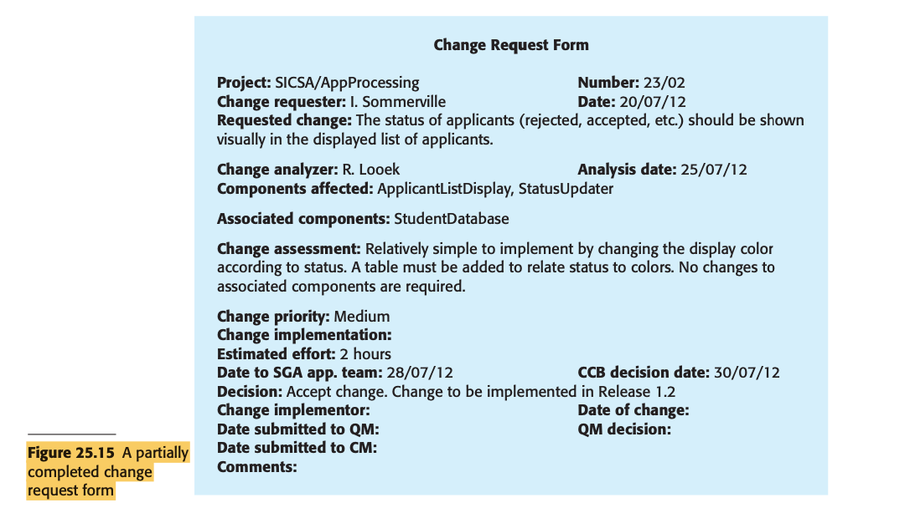

# Questions

* Why should a QM team be independent and not part of the software development group?
    * They can take an objective view of the quality of the software

* Is the following statement correct? YES
    * QA people should try to detect and prevent problems (not correct them!)
* SQA person is a Helper: Assisting the software team in achieving high quality,
* Who reviews?
    * Not the author of the work product but his peers.

### What makes a good Quality Assurance Manager?

* Communication skills
    * Excellent written and verbal communication is an essential skill. They need to be able to communicate with both
      non-technical and technical team members well and be able to report overall status of the team effectively. Bad
      communication could result in a poor process and missing the types of issues that the process is intended to
      prevent.
* Organisational skills
    * Organisation is another essential skill, as an SQA manager is required to oversee and handle multiple work tasks
      and software projects. An SQA manager needs to be highly organised to be able to effectively manage these multiple
      project tasks at once.
* Maintaining knowledge
    * Knowledge of programming languages and system architecture are a must have skill, a SQA manager needs a strong
      knowledge base in these areas to effectively understand what the client needs, to keep up an understanding with
      the work of the team and to identify potential problems, bridging the gap between the non-technical and technical.
      An SQA manager needs to be in the know about an SQA process.
* Analytics skills
    * The ability to analyse the data at both micro and macro levels with a keen eye for monitoring these details is a
      critical skill for a SQA manager to assist in guiding their team but also being able to recognise and discover
      hidden errors themselves.
* Team player
  *The ability to work as a part of a team is vital, creating the right environment to cultivate a quality culture,
  supporting growth, building trust and fostering an environment of collaboration.

[Top 10 Characteristics of Quality Managers](https://accountlearning.com/top-10-characteristics-quality-managers/)

### Activity-Software Inspection

* **Conceptual specificity** : A class’s concept has a certain level of specificity e.g. the concept of a motorbike is
  more specific than the concept of a vehicle. Classes of greater generality  (such as ‘Vehicle’) should be found higher
  in the class hierarchy.
* **Conceptual consistency** : Conceptually inconsistent classes should not have a superclass-subclass relationship e.g.
  the superclass of ‘SailingVehicle’ should not have a subclass of vehicles that negate this essential property of
  sailing such as ‘Hovercraft’. Remember: “Sweet beer is bad”.
* **Conceptual distance**: subclass should be more similar to its superclass than to any other nonsubclass class e.g.
  ‘Motorbike’ is closer to ‘EnginePoweredLandVehicle’ than to say a separate class called ‘ManufacturedItem’ so
  ‘EnginePoweredLandVehicle’ should be the superclass of ‘Motorbike’.

* Other possible defects on class diagrams:
    * The names given to roles should be clear and unambiguouse.g. a company as an “Employer” of one or more persons is
      better than a company is a “Payer” because the latter could mean paying consultants or paying people for damages
      or paying to lay people off.
    * The multiplicity lower and upper bounds may be wronge.g. a land vehicle usually has to have at least one wheel and
      the maximum number of wheels is typically no more than fifty (road trains in Australia).

