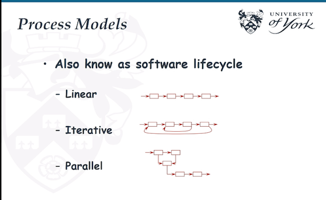
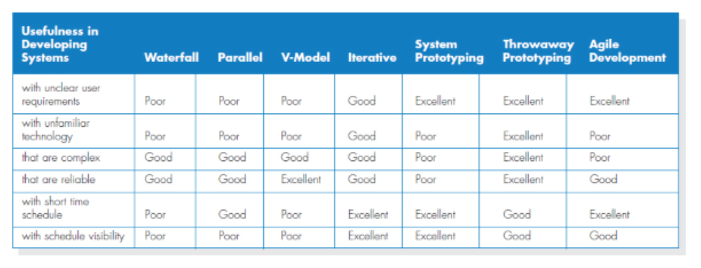
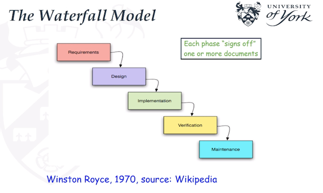
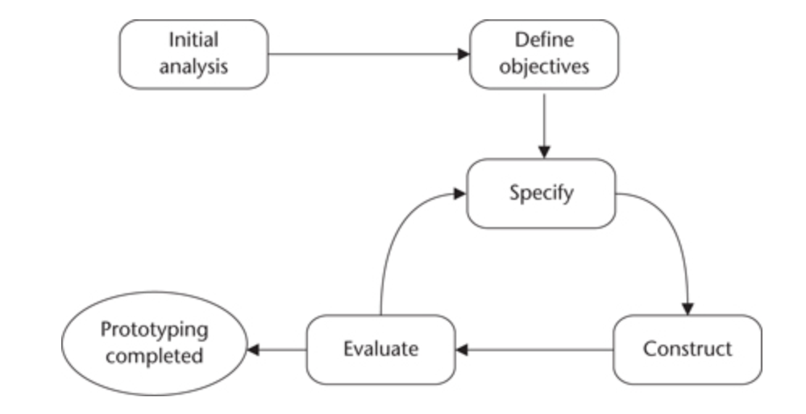
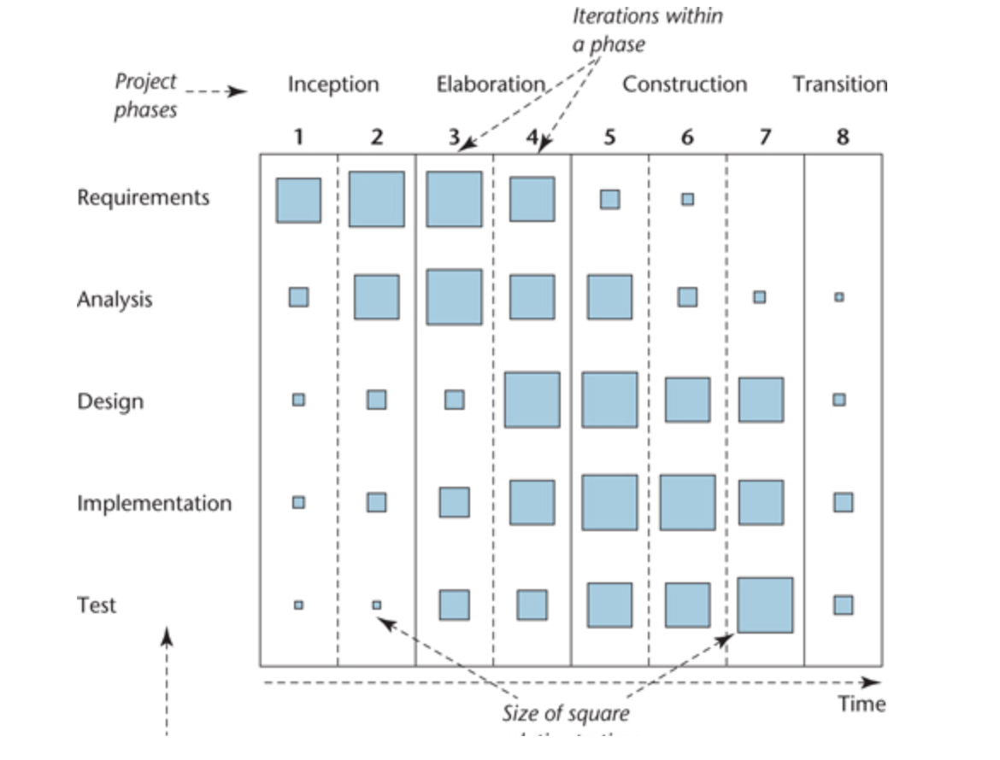
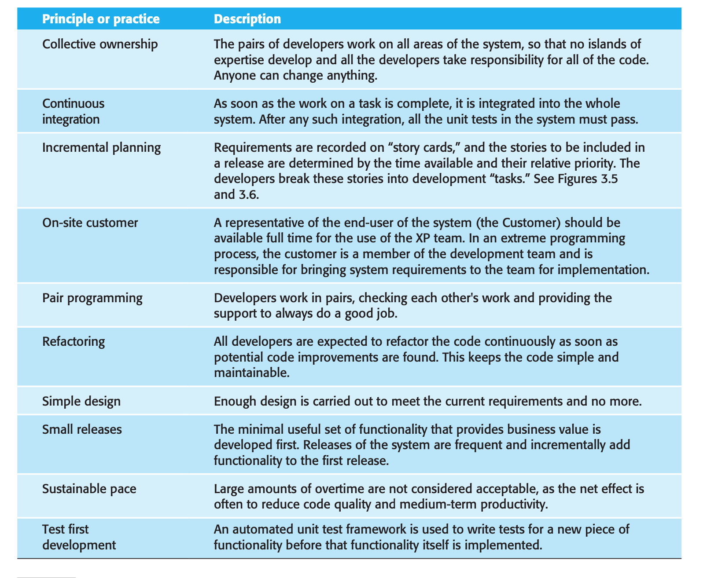
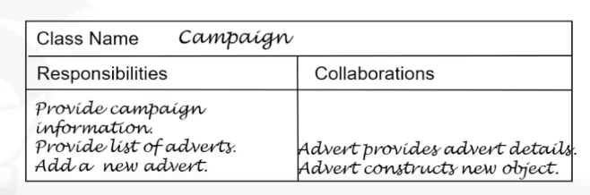
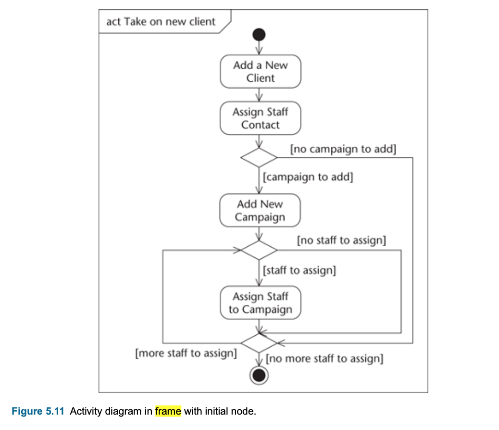

#### Main Topics

1) **Software Process Models** :  
   waterfall model to incremental, spiral, unified process, prototyping and agile development,

2) **Software design models** :  Unified Modeling Language (UML)

#### Sub titles:

* [What is software engineering?](#what-is-software-engineering)
    * [Lifecycle Methods](#lifecycle-methods)
        * [Waterfall](#waterfall)
        * [Waterfall with iteration](#waterfall-with-iterations)
        * [Incremental](#incremental)
        * [Prototyping](#prototyping)
        * [Iterative and incremental development](#iterative-and-incremental-development)
        * [Spiral](#spiral)
    * [Methodological Approaches](#methodological-approaches)
        * [Unified Software Development Process](#unified-software-development-process)
        * [Agile](#agile-development)
* [Agile Development](#agile-development)
* [Software Models in UML](#software-models-in-uml)
    * [Introduction](#introduction-to-unified-modeling-language-uml)
        * [Use Case Diagram](#use-case-diagram)
        * [Class Diagram](#class-diagram)
        * [Instance Diagram](#instance-diagram)
        * [Sequence Diagram](#sequence-diagram)
        * [Activity Diagram](#activity-diagram)
    * [Questions](#questions)

---

# What is software engineering?

**Software :**  The combination og programs and documentation, such as requirement models, design model, test
specifications, user manuals, maintenance manual

**Software Engineer:** 
Engineering discipline which is concerns all aspect of a software production (design, analysis, testing, operations and
programming )
and aims to develop high-quality of software systematic and organised manner.

* Software Engineering methods: 
    * development process (e.g. Waterfall)
    * techniques (e.g. Object-oriented analysis and design)
    * notations (e.g. UML)
    * case tools (e.g. Eclipse, Visual Paradigm)

**The importance of Software Engineering :** 
According to Sommerville Book (2016 pp.22-23). There are 2 reasons: 
> 1) Individuals and society increasingly rely on advanced software systems. We need to be able to produce reliable and trustworthy systems economically and quickly
>2) It is usually cheaper, in the long run, to use software engineering methods and techniques for software systems rather than just write programs as a personal programming project. Failure to use software engineering methods leads to higher costs for testing, quality assurance, and long-term maintenance.

**Some project activities :** requirements, analysis, feedback, validation, design, implementation, verification,
delivery, support

## Lifecycle Methods:

**Software Processes :**
  Software processes are to organise the order of the software activities. 
From an abstract level : 
**_linear , Iterative , Parallel_**

### Selecting appropriate life-cycle model

* Identify important factors that need to be considered when selecting an appropriate software project life-cycle
  model with brief justifications.
    * Nature of the organization (e.g. aviation vs. education)
    * Size and nature of the project (e.g. large/small, research vs. development project)
    * Funding (e.g. money)
    * Resources (e.g. personnel)
    * Type of application (e.g. online banking system vs. game)
    * Requirements uncertainty

### WaterFall:

* Simple model
* Suitable for projects which have clean requirements. Suitable for projects requirements are stable and not likely
  change during development process, where less need got user involement.
* Documentation oriented.
    * Need to sign-off one or more documentation for each step.
    * The documents from the previous stage will be passed onto the next stage for the sake of communication.
* This will not allow you flow back in early stage of the project. Hard to make any changes during process.

_Process from - to:_

* **requirement** -> **design** -> **implementation** -> **verification** -> **maintenance**

#### Pitfalls:

* Project phases can overlap and activities can have to repeated.
* That can be a great elapse between initial system requirements and the final version. Needs can change during this
  time and users can have a software which are suitable for yesterday needs but not the latest requirements.
* Not adapt to the technological developments and user requirements during the process. Sometimes to include the new
  technologies requires redoing whole structure from beginning.

### Waterfall with Iterations:

* Same as Waterfall process
* Not practical end effective in practice

### Incremental:

* If you partly requirements, you can use incremental process. 
* You develop a part of functionality in each increment. 
* **Each increment is a small waterfall model**.  
* In each increment requirements are frozen before starting. 
* Changes in each increment can address for the next incrementation flow 

### Prototyping:

* Suitable for projects that has not clearly understood requirements, then repeated refinement of prototype maybe an
  effective way of producing the final system.
* Prototype is a partially complete software system
    * Not final working system- that the incomplete and less-resilient.
    * Lack of full functionally. May have limited data capacity
* Builds quickly to explore some aspect of requirements.
* Can discharged is not fit on needs.
* Commonly uses rapid development tools.
* Prototype can use for:
    * May be focus human–computer interface,
        * to understand what kind of data required from user or needs to provide to user
    * To investigate to find the most suitable interface for user.
    * To determine whether a platform can support the requirements or not.
    * To determine the efficacy of some technologies or the appropriateness of a technological choice
* Prototype is mostly used as part of other life-cycle models, for example spiral models.

Stages required to prepare a prototype are as follows.

* Perform an initial analysis:
    * Initial requirements should be the general requirements of the system, so that particular aspects can be
      identified.
* Define prototype objectives:
    * Should have clearly stated objectives. This helps to decide if they have been achieved.
    * Objectives of prototype should be agreed with user to prevent some misunderstanding what will be achieved.
        * Such as client can expct to delivery working solution at the end.
* Specify prototype:
    * Prototype is not the intent for the complete solution, but in any case important that have the requisite
      behaviour.
    * The approach to specification needs to be appropriate for the type of prototype.
        * Creating a user interface prototype will be different from to test some technical aspect prototypes.
* Construct prototype:
    * To use rapid development tools for prototypes can be important.
* Evaluate prototype and recommend changes:
    * When objectives are not meet, the prototype should evaluate.
* If the prototype is not completed, repeat the process from the specify prototype stage.

#### Advantages:

* Early demonstrations of system functionality help identify any misunderstandings between developer and client.
* Client requirements that have been missed are identified.
* Difficulties in the interface can be identified.
* The feasibility and usefulness of the system can be tested, even though, by its very nature, the prototype is
  incomplete.
* Can also used to explore other aspects of the system. e.g feasibility

#### Pitfalls:

* The client may perceive the prototype as part of the final system, may not understand the effort that will be required
  to produce a working production system and may expect delivery soon.
* The prototype may divert attention from functional to only interface issues.
* Prototyping requires significant user involvement, which may not be available.
* Managing the prototyping lifecycle requires careful decision making.

### Iterative and incremental development.

* Iterative development may result incremental delivery.
    * some approach on increments can be only for internal release to development team not for external release to the
      client
* In iterative approach:
    * The project has some series of development activities that are repeating.
    * Each repetitions is an iteration that is a mini-project which is working solutions.
    * Iterative development is less concerned with tracking the progress of individual features. Instead, focus is put
      on creating a working prototype first and adding features in development cycles where the Increment Development
      steps are done for every cycle. Agile Modeling is a typical iterative approach.
* Incremental approach:
    * Starts with some initial requirements to scope the problem and identifies major requirements.
    * Requirements are to deliver most benefit to the client and selected to focus the first increment of development to
      delivery.
    * Each incrementation gives feedback to the developers also for the next increments.
    * Each increment is the part of the final delivered solution and can include all artifacts, such as documentation
      and working solution.
    * Incremental development is done in steps from design, implementation, testing/verification, maintenance. These can
      be broken down further into sub-steps but most incremental models follow that same pattern. The Waterfall Model is
      a traditional incremental development approach.
* Many current approach are categorized as iterative and incremental approach for:
    * Iteration -> nature of development process
    * Incrementation -> nature of system delivery

### Spiral:

Boehm's Spiral model (1988):

* Risk-reduction model
* Supports incremental delivery.
* Prototyping may be used during risk analysis or software development.
* Mostly suitable for project with a number of risks e.g. unclear requirements or technical uncertainties

#### Advantages:

* Risk reduction: reduce the risk to fail the project.
* Functionally can be added in another phase, because it is iterative nature of the process
* Software produce early: at the each iteration we have something to show for our development and we can get feedback
  earl from users.

#### Pitfalls:

* Specific expertise: Risk analyse require highly specific expertise.
* Highly depend on risk analyse: Risk analyse has to be right.
* Complex: can be costly to implement.

## Methodological Approaches

* A Methodology contains:
    * an approach to software development
    * a set of techniques and notations that support the approach
    * a lifecycle model to structure the development process
    * a unifying set of procedures and philosophy
* A methodological approach is a coherent and consistent systematic approach to development.
* For example, RUP is an object-oriented methodology that uses UML and follows an iterative and incremental lifecycle.
* A Responsibility Assignment Matrix (RAM) is useful to assign roles and responsibilities for a project. An example of
  defined roles are;
    * Responsible, ie the application development role builds the software increments.
    * Accountable, the role that is accountable for the completion of the task.
    * Consulted, the role whose opinions are sought.
    * Informed, the role that is kept up to date on progress.

### Unified Software Development Process

* Unified Software Development Process (USDP) is a single common methodological approach for object-oriented software
  development by bringing together best practice in the 1990
* USDP reflected the emphasis in the 1990s on iterative and incremental lifecycles.
* Related to object-oriented (OO) development and the Unified Modelling Language (UML).
* Key aspects:
    * **Use-Case driven**
    * Architecture centric
    * Iterative and Incremental
* A development cycle for the USDP is comprises four phases.
    * **Inception** is concerned with determining the scope and purpose of the project. _Focuses on the scope the
      project_.
    * **Elaboration** focuses on requirements capture and determining the structure of the system. _Focus requirements._
    * **Construction**’s main aim is to build the software system. _Focus implementation_
    * **Transition** deals with product installation and rollout. _Focus deployment_

* Combines many best practices:
    * Iterative
    * Manage requirements (e.g. use cases)
    * Visually model software (e.g. UML)
    * Control changes to software (e.g. seamless of OO, round trip engineering)
    * **Verify software quality (e.g. testing is part of the development process)**

* It also controls changes smoothly due to the seamless of object-oriented development and round-trip engineering.
    * Seamless object-oriented development means the same class model is used in the analysis, design and implementation
      stage so you can synchronise them via round trip engineering, for example you can generate a design from the
      program code.

# Agile Development

Agile: 

* Agile has incremental development methods
* Involve customers in development process to get rapid feedback on changing requirement
* Minimise documentation by using informal communication rather than formal meetings with written documents.
* This agile approach was developed for software developed small and medium-sized business system.
* Successful in these 2 kind of system: (Why? because it is possible to have continues communication between clients and
  teams )
    * Product development where a software company is developing a small or medium-sized products
    * In an environment which customer can involve in the development process and few external stakeholders and
      regulations effect the system.
* Three instances of agile methods given in the text:
    * Extreme Programming (Beck 1999),
    * Scrum (Schwaber and Beedle 2001),
    * DSDM (Stapleton 2003).

## Plan-driven software development process

* Plan-driven software development process is working with specific requirements then design, build, test.
* Not rapid development process
* If there is an update require in requirements, it is redesigning and retesting
* Waterfall is an example
* This plan-driven approach was developed for software developed by large teams, working for different companies.

## Common Characteristics of agile methods

* The processes of specification, design and implementation are interleaved. There is no detailed system specification,
  and design documentation is minimized or generated automatically by the programming environment used to implement the
  system. The user requirements document is an outline definition of the most important characteristics of the system.
* Incremental development. Stakeholders and end-users are involved in evaluating each increment. They may propose
  changes to the software and new requirements that should be implemented in a later version of the system.
* Extensive tools are using to support the development process:
    * Automated Testing tools
    * Tools to support configuration managment
    * System integration
    * Tools to automate user interface production.

## Essential distinction between plan-driven and agile approaches

Essential distinction to system specifications:

* Plan - driven process : Require a formal documentation to communicate between stages of the process.
    * For example; after requirements get ready then design and implementation process starts and output of requirement
      process are getting input for the next step
* Agile: The requirements and the design and implementation are developed together rather than seperated.

## Core values for agile development

* Individuals and interactions over processes and tools
* Working software over comprehensive documentation
* Customer collaboration over contract negotiation
* Responding to change over following a plan

## Agile development techniques

### Extreme Programming (XP)

* Requirements are expressed as scenarios (called user stories), which are implemented directly as a series of tasks.
* Programmers work in pairs and develop tests for each task before writing the code. All tests must be successfully
  executed when new code is integrated into the system. There is a short time gap between releases of the system.
* These are very light weight planning and design phases.
* **Focus is on the software: coding and testing.**
* The overall process is iterative and incremental.
* Reflection the principles of agile manifesto:
    * Requirements are based on simple customer stories or scenarios to decide which functionality should implement.
    * The customer representative take a part during development and responsible to define the acceptance test.
    * Pair programming
    * Benefits:
        * Regular system release
        * Test first approach
        * Refactoring
        * continuous integration
    * Maintaining simplicity by refactoring and simple design XP practices: 
      

### User Stories:

* A scenario of use that might be experienced by a system user. (A short description of a software feature from an
  end-user perspective)
* Customer works with development team to create user stories
* max 3 sentences long
* Customer decide the priority,
* Implementation should be less than 2 weeks.
* Can be added, deleted and modify
* Problem is completeness : hard to cover all essential func for system.

### Design

* Output: Class-responsibility-collaboration (CRC) card and prototypes are necessary.
* Occurs continuously as coding through refactoring.
* KISS principle

### Refactoring

* Refactoring means that the programming team look for possible improvements to the software and implements them
  immediately.
* Improves the software structure and readability, helps to prevent structure from deterioration
* When refactoring is part of the development process, the software should always be easy to understand and change as
  new requirements are proposed

### Test-First Development

* Testing is automated and center to the development
* Development can not proceed until all test have been successfully executed.
* Write the tests before coding. TDD(Test Driven Development)
* Require a clear relationship between requirements and code implementation with tasks.
* The role of the customer to help to develop and run acceptance tests.
* Test automation is essential.
    * Automated test frameworks helps to write easily executable tests and submit set of tests.
* Basic cycle
    * Add a test
    * Run all tests an check the new one fails
    * implement the code to satisfy the functionalty
    * Check that new test success
    * Run all tests again to avoid regression
    * Refactor code

### Pair Programming

* Pairing and coding together in development process.
* Advantages:
    * Collective ownership and responsible for the system.
    * Acts as an informal code review, because looked by at least 2 people. This discovers bugs more quickly than
      individual testing.
    * Encourage the refactoring and improve software structure. This reduces maintenance costs.
    * Information sharing in pair programming is implicit. Reduce the overall risk to project when team member leaves.

### Agile Project Management

Scrum :

* Follows agile manifesto and principles, but some practices are not mandatory such as test driven development and pair
  programming.
* Meetings:
    * Daily Meeting: During sprint Team members are doing every day.
    * Review: Demonstrate what they did during sprint to the stake holders
        * It is a means of process improvement. The team reviews the way they have worked and reflects on how things
          could have been done better.
        * It provides input on the product and the product state for the product backlog review that precedes the next
          sprint.

* Benefits:
    * Project broke down set of manageble parts that stake holders can relate to.
    * Improve visinility and communication between team members.
    * Customers see the development incremently and give feedback
    * Improve trust between customer and team.

Scrum Roles: 

## Practical problems with agile methods

* Lack documentation
* Lack a formal design there is no complex diagrams and no complex specifications.
* Unusual ideas, like pair programming
* Agile methods are designed for small co-located teams
* Complexity on contract negotiation. Cause you dont have upfront requirements

# Software Models in UML

* A Software model is an abstraction of a system or subsystem from a particular perspective or view of the system:
    * Use case view
    * Logical view
    * Implementation view
    * Deployment view

* Expressing software models:
    * **English** :  expressive but suffering from ambiguity problem.
    * **Mathematics**: accurate but often scares the developers
    * **Graphical**: combines strengths of both descriptive and mathematical models. Can be seen by the user and other
      developers, ie UML

## Introduction to Unified Modeling Language (UML)

* UML is a language for specifying, visualizing, constructing and documenting the artefacts of software systems, as well
  as for business modeling and other non-software systems at various stages.
    * Uses for expressing the software artifact.
    * [Official UML web page](https://www.omg.org/spec/UML/)

* **How is UML categorised?**
    * Contains set of diagrams a formal language.
        * 3 different diagrams:
            * **Structure Diagram:** shows static structure of the system.
                * Class Diagram, Object Diagram, Component Diagram, Package Diagram, and Deployment Diagram.
            * **Behaviour Diagram:** What tha system, subsytstem or an object is doing.
                * Use Case Diagram, Activity Diagram, and State Machine Diagram.
            * **Interaction Diagram:** shows how object interacts eachother
                * Sequence Diagram and Communication Diagram.
        * Object Containing Langugae (OCL) is formal language to describe expressions on UML.

### Use Case Diagram

* A collection of actors, use cases and their communications
* Describes the behaviour of a system from user's standpoint: functional description and its major process.

### Class Diagram

* Shows the classes in system and their relations.
* Typically shows the static overview of the system

### Instance Diagram

* Also called object diagram
* Shows a set of objects and their relations and their relations at a particular run time.
* Only have two counterparts:
    * object name and attributes with values

### Sequence Diagram

* A type of interaction diagram
* Shows the object interaction in a time-ordering fashion.

### Activity Diagram

* Activity diagrams can be used to model different aspects of a system.
* Used for:
    * to model a process or task (in business modelling for instance);
    * to describe a system function that is represented by a use case;
    * in operation specifications, to describe the logic of an operation;
    * in USDP to model the activities that make up the lifecycle.
* Notations:
    * **Action**: action is shown as a rectangle with rounded corners, and the name of action written in it.
    * **ActivityEdges**: set of actions linked together by flows from one to another
    * **Decision node** : Decision points ehich action to do
    * **Guard condition**: alternative flows are each labelled with a guard condition, if it is true we called guard
      condition or not we called alternative guard. Actions of the decision nodes next True/false actions.
    * **Initial node:** start point, represent with dot
    * **Final node:** end point, represent with circuled dot.
    * **Frame**:  every diagram can be drawn in a frame, a rectangle with the heading of the diagram in the top left
      hand corner.
* Executable UML: Activity diagrams that can model the implementation of operations and can be compiled into a
  programming language
    * the operation name and class name can be used as the name of an action;
    * an object can be shown as providing the input to or output of an action.

## Questions:

* What are the relationships between diagrams and models?
    * Diagrams are not equal to models they are different.
    * Modal is bigger then diagram
        * A modal can have one or more diagrams and supporting data and documentation. For example, user case modal has
          use case diagram, decriptions and prototypes.
    * A diagram is a graphical view of a part of a model for a particular purpose.
* If I learned UML, the model I produced is guaranteed to be good, Do you agrree?
    * Has Syntax
        * How symbols look
        * How they are combined
    * Has Semantic
        * what the meanings are
    * No guarantee that modal is good or bad. Depends on the writer to write a good one
* Do I need to keep UML notations?
    * YES 100%, if you use **CASE (Computer Aided Software Engineering)** tool generates code
    * Possibly No, if diagrams are for communicating between customers, developers etc.
* **UML is not !**
    * a programming language
    * a case tool
    * a method

* In USDP, are the phases and activities the same?
    * No, in iterative lifecycles like USDP the activities are independent of the phases and it is the mix of activities
      that changes as the project proceeds
* In a simplified waterfall, are the phases the same with activities?
    * Yes,In the Waterfall Lifecycle, activities and phases are one and the same.
* What are the **main activities in the system development process?**
    * requirements capture and modelling
    * requirements analysis
    * system architecture and design
    * class design
    * interface design
    * data management
    * design construction
    * testing
    * implementation.

# Sources

* [Iterative and Incremental lifecylecle Model](https://agility.im/frequent-agile-question/difference-incremental-iterative-development/#:~:text=Incremental%20Incremental%20development%20is%20a,these%20is%20complete%20before%20releasing.)
    * [Stack overflow - ItterativeVSIncreental](https://softwareengineering.stackexchange.com/questions/231770/what-is-the-difference-between-the-incremental-and-iterative-approach-to-softwar)