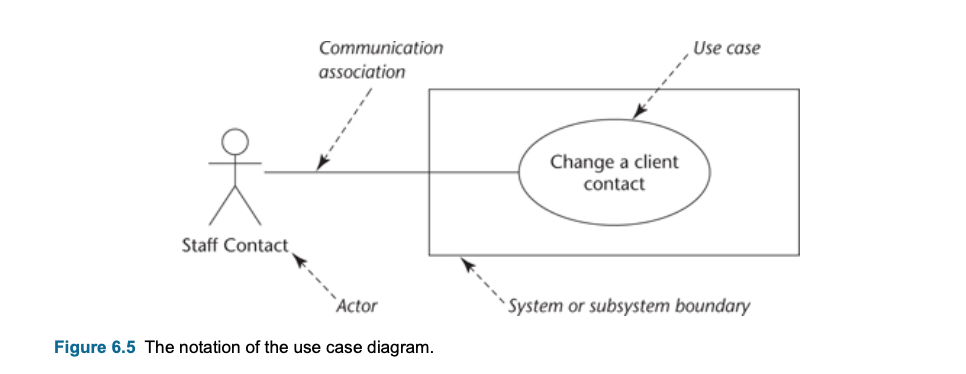
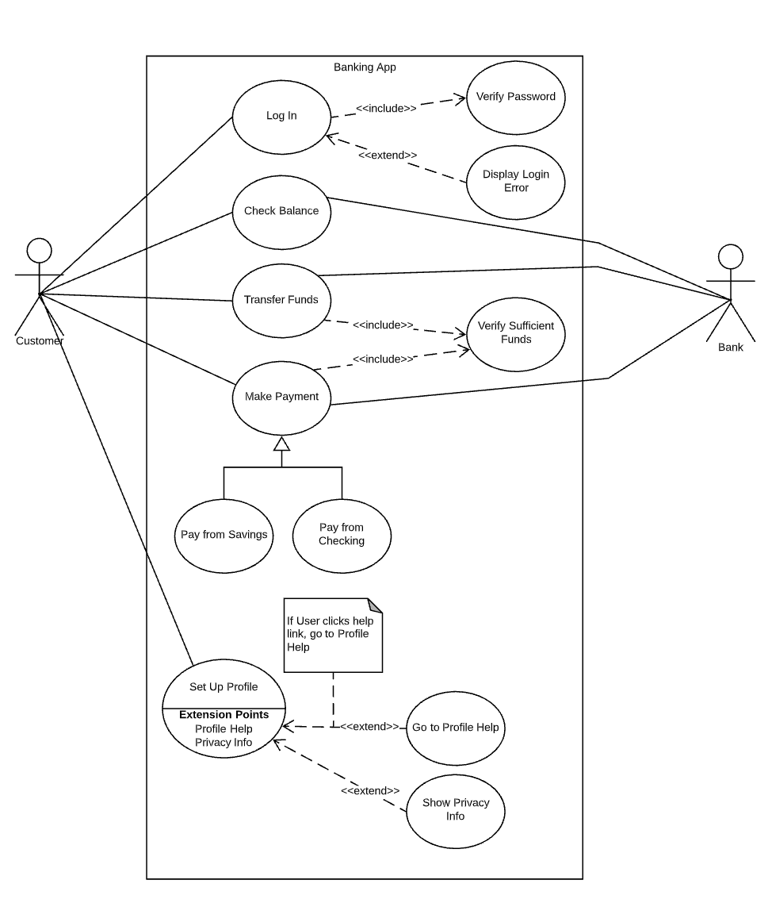
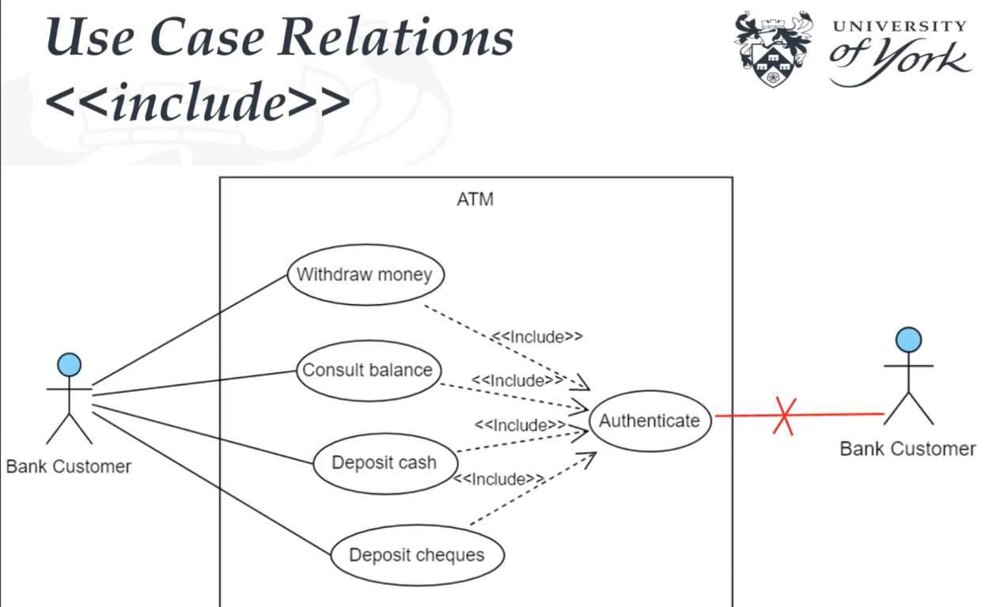
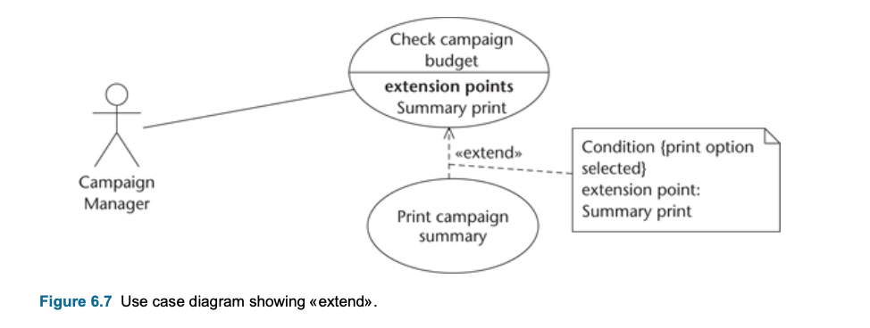
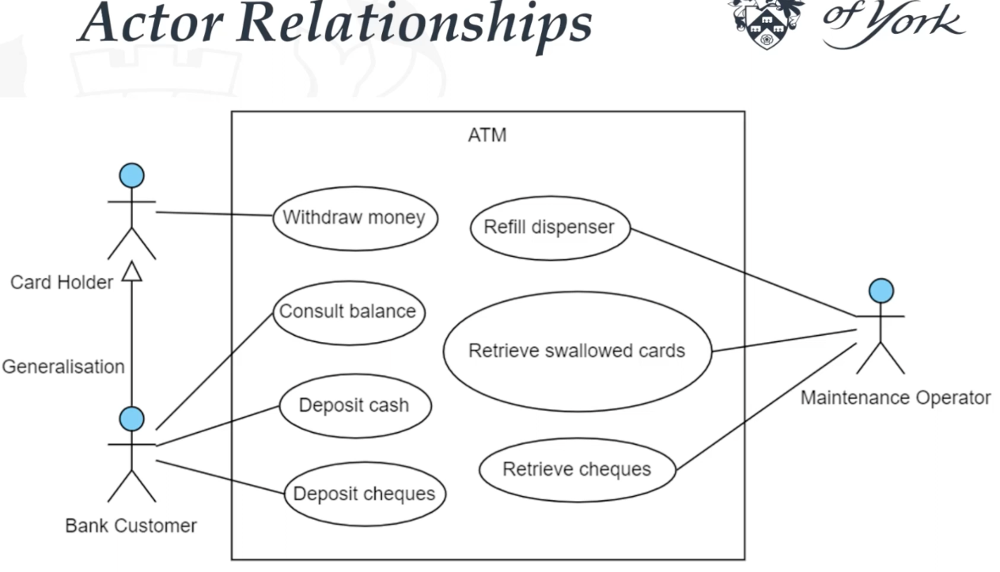
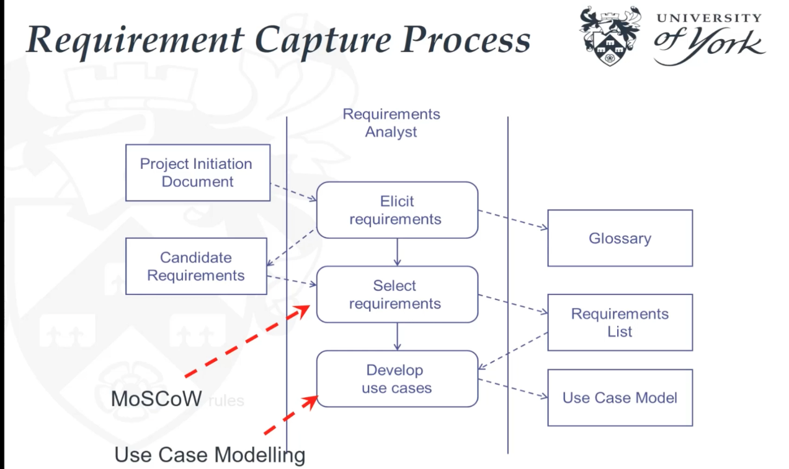
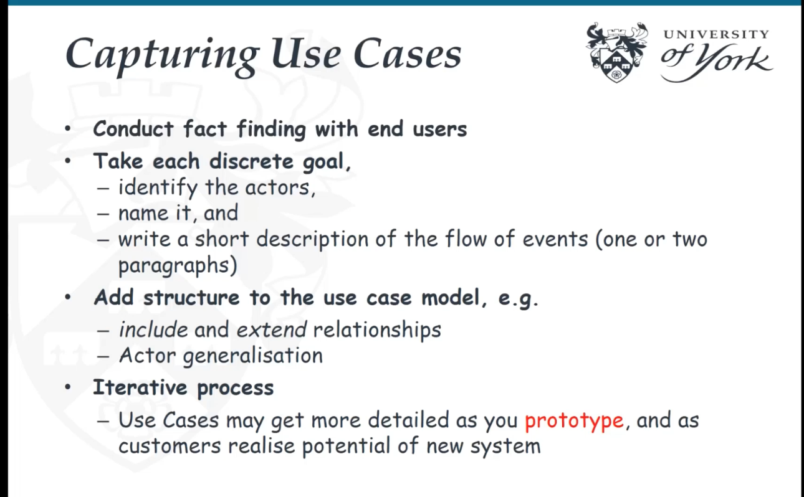
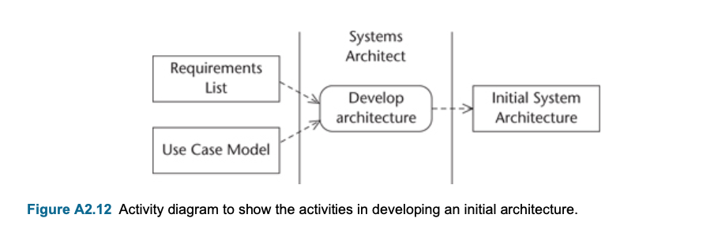

#### Main Topics

1) **Apply appropriate requirement elicitation techniques** :  
    * Typically, examining the aim, strengths, weaknesses and applicable situations for background reading, interviews,
      questionnaires, observation and document sampling
    * Exploring in depth the guidelines for conducting a good interview and constructing good questionnaires.
2) **Create a use case model** : 
    * Looking into the concept of use cases and use case diagram notations, paying particular attention to use case
      relation and actor-generalisation relationships
    * Exploring use case descriptions in both general and step-by-step form with prototype support.

#### Sub titles:

* [Requirement capture](#requirement-capture)
    * [Introduction](#introduction)
    * [User Requirements](#user-requirements)
        * [Current System](#current-system)
        * [New Requirements](#new-requirements)
            * [Functional Requirements](#functional-requirements)
            * [Non-Functional Requirements](#non-functional-requirements)
            * [Usability Requirements](#usability-requirements)
    * [Fact-Finding Technics](#fact-finding-technics)
        * [Background reading](#background-reading)
        * [Interviewing](#Interviewing)
        * [Observation](#observation)
        * [Document sampling](#document-sampling)
        * [Questionnaires](#questionnaires)
            * [Inspection List](#inspection-list)
    * [User Involvement](#user-involvement)
    * [Documentation Requirement](#documentation-requirement)
* [Use case model](#use-case-model)
    * [Notation](#notation)
        * [System](#systems)
        * [Actor](#actor)
        * [Use Case](#use-case)
        * [Relationships](#relationships)
            * [Association](#association-)
            * [Extend](#extend-)
            * [Include](#include-)
            * [Generalization & Specialization](#generalization--specialization-)
    * [Supporting use cases with prototyping](#supporting-use-cases-with-prototyping)
    * [CASE tool support](#case-tool-support)
    * [Business modelling with use case diagrams](#business-modelling-with-use-case-diagrams)
    * [Testing and use cases](#testing-and-use-cases)
* [Requirements Capture and Modelling](#requirements-capture-and-modelling)
    * [Capturing Use Case Diagram](#capturing-use-case-diagram)
* [Summary](#summary)
* [Questions](#questions)

# Requirement capture

## Introduction

* The analyst needs to gather requirements
    * Read up on the organization
    * carry out interviews
    * observe people at work
    * collect samples of documents
    * Use questionnaires.
* Use case diagram is using to document stakeholders' requirements.

## User Requirements

* Needs to have a clear understanding what users would like to achieve with software
* Classified in 2 types

### Current System

* Legacy system: a legacy system is an old method, technology, computer system, or application program, "of, relating
  to, or being a previous or outdated computer system," yet still in use.
* Gaining clear understanding of how the existing system works: parts of the existing system will be carried forward
  into the new one.
* Advocates of Agile argue that focus needs to on understanding user requirements for the new system not the not on the
  functionality of the old system.
* Cases to investigate the old system:
    * Some of exist functionality can be required in new system
    * Some data which is existing in current system can be required to migrate to new system.
    * A technical documentation of the existing system functionality (algorithm) can be required for the new system
    * Some existing defect that we need to avoid in the new system.
    * Stying existing system can help us to understand the organization in general .
    * Parts of the existing system may be retained, For example manuel steps.
    * Understanding the people jobs in existing system, can help to categorise the users of new system.
    * To set some performances targets for the new system by checking the old one.

### New Requirements

* 3 different categories to get the information for new requirements

#### Functional Requirements

* Describe what a system does or is expected to do, often referred to as its functionality.
* Functional requirements include:
    * Descriptions of the processing that the system will be required to carry out
    * Details of the inputs into the system
    * Details of the outputs that are expected
    * Details of data that must be held in the system

#### Non-Functional Requirements

* Non-functional requirements are those that describe aspects of the system that are concerned with how well it provides
  the functional requirements.
* Non-functional requirements include:
    * Performance criteria such as desired response times for updating data in the system or retrieving data from the
      system - **Performance**
    * Ability of the system to cope with a high level of simultaneous access by many users - **Scalability**
    * Availability of the system with the minimum of downtime - **Reliability**
    * Time taken to recover from a system failure - **Recover**
    * Anticipated volumes of data, either in terms of transaction throughput or of what must be stored - **Monitoring**
    * Security considerations such as resistance to attacks, and the ability to detect attacks. - **Security**

#### Usability Requirements

* Usability requirements are those that ensure that there is a good match and relation between software and the users of
  the system.
* The International Organization for Standardization (ISO) has defined the usability of a product as:
    * the extent to which specified users can achieve specified goals with effectiveness, efficiency and satisfaction in
      a specified context of use.
* Need to gather the information:
    * characteristics of the users
    * the tasks that the users undertake, including the goals that they are trying to achieve
    * situational factors that describe the situations that could arise during system use
    * acceptance criteria by which the user will judge the delivered system.

## Fact-Finding Technics

* **SQIRO**— sampling, questionnaires, interviewing, reading (or research) and observation.

### Background reading

* It is to have a good understanding of the organization, and its business objectives.
    * Also help to understand organization mission, possibility some future requirements, and gives info for current
      system.
* This kind of documentations are suitable sources to get information:
    * company reports
    * organization charts
    * policy manuals
    * job descriptions
    * reports
    * documentation of existing systems.
* Advantages:
    * Helps to understand organization mission before arrange some meetings with company employees
    * Helps to make some preparation for the other fact-findings
    * May provide formally defined information requirement for the current system
* Disadvantages:
    * The written documentation often can be outdated or not relevant with current system.
* Appropriate situations
    * When the analyst is not familiar with the organization
    * initial stages of fact finding

### Interviewing

* Aim is to get an in-depth understanding of the organization’s objectives, users’ requirements and people’s roles
* Most used fact-finding technique
* A system analysis interview is a structured meeting between the analyst and an interviewee who is usually an employee
  of the organization being investigated.
* A system analyst’s job is about 40% technical and 60% human relations.
* An interview can gather info from :
    * Management; their objectives for the organization and for the new system.
    * Staff; their existing job and information needs
    * Customers; expectations and habits
* **Dynamic Systems Development Method (DSDM)** is a method which is using group discussion,
* Guideline:
    * Before Interview;
        * Arrange an appointment for interviews
        * Give some info about the interview duration, topic, subject of interview
        * Arrange interview if it is neccesaary and dont waste employee's time.
        * Inform the interviewee's manager and giev some info about the interview cycle and schedule.
        * Have a clear objectives and prepare relevant questions before interview.
    * At the start of interview:
        * Time boxing and start in time
        * introduce yourself and give intro info about interview subject
        * Take notes and inform the interviewee and get permission.
    * During interview:
        * Control the direction of the interview, keep on track the subject.
        * Use a different kind of questions to get different type of information.
        * Listen interviewee and encourage him/her to give you more info
        * Try to avoid to focus on problems too much , try to make positive
        * Be sensitive about data which you collect during the interview
        * Use opportunity to get some additional information or samples during interview
* Advantages:
    * **Personal contact** help to be more responsive and this helps to have high-quality information.
    * Analyst can get more in deep information than from the other technics.
    * If interviewee has nothing to say can terminate immediately.
* Disadvantages:
    * Time-consuming, can be the most costly fact finding technic
    * Require analyse after the interviews by collecting the outputs from interviews, notes must be written up or tapes
      transcribed after the interview
    * Interviews can be bias if the interviewer has a closed mind about the problem.
    * If interviewees provide conflicting information this can be difficult to resolve later
* Appropriate situations
    * most projects
    * at the stage in fact finding when in-depth information is required

### Observation

* Aim is to see what really happens, not what people say happens
* Watching people in their work places while they are working to work process.
* Can help to understand seeing the employees ways to handle the problems or exceptional cases which they forget during
  interview.
* Includes:
    * seeing how people carry out processes
    * seeing what happens to documents
    * obtaining quantitative data as baseline for improvements provided by new system
    * following a process through end-to-end
* Can be open-ended or based on a schedule
* Advantages:
    * First-hand experience to see the way that current system operations.
    * Real time data collection
    * Verifying the information which is provided from other fact-finding technics
    * Baseline data about performance and the users od the current system.
* Disadvantages:
    * Most people don't like being observed
    * Need train and skills to have the most efficiency
    * logistical problems for the analyst with staff who work shifts or travel long distances
    * Can have some ethical problems while observing the sensitive / private data
* Appropriate situations
    * Essential to get quantitative data about people's job.
    * to verify information from other sources
    * Probably the best way to follow items from start to finish.
    * Can be useful in the situations where different interviewees have provided conflicting information about the way
      the system works.

### Document sampling

* Can use for 2 ways:
    * Can help to determine the people's role, and the input/output data of the current system is using.
    * Can carry out some statistical analysis of the documents
* Includes:
    * obtaining copies of empty and completed documents
    * counting numbers of forms filled in and lines on the forms
    * screenshots of existing computer systems

* Advantages:
    * Can use to get quantitative data of the document style (average number of lines etc)
    * Can use to find our the error rates of documents
* Disadvantages:
    * If the new system will be totaly different from current one, they can be redundant to look at it.
* Appropriate situations
    * The first way of the fact can be almost always appropriate.They can provide supporting evidence information from
      gathering interviews and observations.
    * The second way, the statistical approach is appropriate in situations where large volumes of data are being
      processed, and particularly where error rates are high, and a reduction in errors is one of the criteria for
      usability.

### Questionnaires

* Aims to obtain the views of a large number of people in a way that can be analysed statistically
* Research instrument can use for fact-finding
* Includes:
    * postal, web-based and email questionnaires
    * open-ended and closed questions
    * gathering opinion as well as facts
* Types if questionsL
    * Yes / No Questions (sometimes IDK option adding)
    * Multi-choice questions
    * Open-ended questions
    * Scaled questions
* Questionnaires are best suited for eliciting user cases from a large number of people or from people from different
  geographic areas, for example they are useful if an organisation has so many branches through out the country or the
  world.

    

* Guidelines: Using questionnaires requires good planning
    * Coding: Decide how to code the results at the end. Every question needs to capable for coding.
    * Analysis: Needs to plan in advance. Carrying out a statistical analysis or some special software programs of the
      responses, require a statistician before finalize the questions to avoid for using poorly designed questions.
    * Piloting: Try out questions in small pilot groups to understand the questions can understandable or answerable.
    * Sample size and structure: To use serious statistical techniques, it requires some limited representation of
      different types of segments, by age, gender, department etc.
    * Delivery: how do you delivery to respondents the questionnaires and collect from them back?
    * Respondent information: Which additional information do you would like to collect when they reply you back the
      questionnaires (such as name of the respondents)? While collecting (storing) the sensible info (name of the
      person, age etc) don't forget to consider GDPR.
    * Covering letter or email: In cover letter,needs to have purpose of the questionnaire, having support from
      management and thanks to being part of it with an estimation time or deadline for return .
    * Structure: Give a title, start with explanatory material and notes on how to complete it, Follow this with
      questions about the respondent (if required).. Group questions together by subject.Avoid lots of instructions
      like: ‘If you answered YES to Q.7, now go to Q. 13’. Keep it reasonably short.
    * Return rate: Not everyone will necessarily respond. if you can identify who has not responded and email them
      reminders. Equally, you can email a thank you to those who do respond.
    * Feedback: A summary of the report can share with relevant respondents, departments to show them the outcomes of
      the study and their effect.

* Advantages:
    * An economical way of gathering data from many people.
    * effective way of gathering information from people who are geographically dispersed
    * a well designed questionnaire can be analysed by computer.
* Disadvantages:
    * Hard to create a good questionnaires.
    * No automated follow-up mechanism
    * Non digital questionnaires (postal) response rate is low.
* Appropriate situations
    * when views of large numbers of people need to be obtained
    * when staff of organization are geographically dispersed
    * for systems that will be used by the general public and a profile of the users is required

### Other techniques

* Expert systems are computer system that designed to represent of the human expertation to solve problems, such as
  systems for medical diagnosis, stock market trading and geological analysis for mineral prospecting.

### Inspection List

* Does the questionnaire have a meaningful title?
* Is it clear who produced the questionnaire?
* Are the instructions on how to complete the questionnaire clear?
* Is it made clear for whom the questionnaire is intended, to avoid inappropriate people responding?
* Are the instructions on where to send the questionnaire clear?
* Is the date made clear by which time the questionnaire should be returned?
* Are respondent thanked for their time?
* Are the objectives of the survey made clear?
* Is there a sizeable “Any Other Comments” box?
* Do close questions have balanced likert-type scales with no more than 5 choices?
* Do open-ended questions have sufficient space for a response?
* Is every question free from ambiguity (She fed her dog biscuits...)?
* Are any explanatory comments to questions free of bias?
* There should not be too many open-ended questions. Are there too many?

## User Involvement

* All people who have interest of the success of the system, and some gains/lost of the implementation of the system are
  called **stakeholders**.
* Include the category of people :
    * senior management: with overall responsibility for running the organization
    * financial managers with budgetary control over the project
    * managers of the user department(s)
    * representatives of the IT department delivering the project
    * representatives of users.
* Users will be involved in different roles
    * subjects of interviews to establish requirements representatives on project committees
    * those involved in evaluating prototypes
    * those involved in testing
    * subjects of training courses end-users of the new system.

   

## Documentation Requirement

* UML is using to produce models of the system from different perspectives.
* **Computer Aided Software Engineering (CASE)** tools are using to draw the diagrammatic models and maintain the
  associated data that are showed in the diagrams.
* Also to store the documentations which does not fit
    * records of interviews and observations
    * details of problems
    * copies of existing documents and where they are used details of requirements
    * details of users
    * minutes of meetings.

* In projects to store this documents in digitally, a document management system or a version control system are using.
* **Use cases are used to model functional requirements, but not good to store non-functional requirements**.
* Use case model and supplementary requirements (those not provided by use cases) constitute a traditional requirements
  specification and we need to keep them both.
* Some documentation management software solutions are helping to track the impact of the changes on the project.

# Use case model

* **Use case modelling** is the transformation technique, and the resulting model is **Use case model**
    * The process for developing the use cases is called use case modelling.
* Based on the list of selected requirements, use cases can be developed.
* The output from use case modelling is the use case model.
* Use case model is the part of the requirement model
* Documents the functionality of the system from users perspective
* Use case model contains:
    * **use case diagram**,
    * **use case description**
    * **prototypes**
* Use case modelling is an iterative process.

    

## Notation

* Use case diagrams shows 3 aspect of the system
    * Actor
    * System boundary
    * Use Cases

   

* As an example building a Banking app
  

### Systems

* System is what ever you are developing, ie website, business process, software component or app etc.
* Represents with rectangle , with the name on top.
    * Helping to define the scope of the system.

### Actor

* Represent roles of users, other systems or devices that communicating with the particular use case.
* Represents with stick figure
* Actor is someone or something that uses the system to achieve a goal.
    * Can be a person, an organization, another system or an external device.
* Actors are external object of the system, needs to stay out of the system rectangle.
* Actors need to be type or categories (ie customer, bank etc), they should not have a spesific names (ie John, X bank
  etc),
* 2 types actor:
    * **Primary Actor:** initiate/starts the use of the system (ie customer)
    * **Secondary Actor:** reactionary, it acts when primary actor does something (ie bank)
* **Each actor has to interact at least one use case**

### Use Case

* Use case are using to document the scope of the system and the developers understanding of the user requirements.
* Use case supported by **behavioral specifications**.
    * Rather than (or as well as) using text, a use case can be linked to another diagram that specifies its behaviour
    * Typically a Communication Diagram, a Sequence Diagram, a State Machine or more than one of these
* Use case specify a desired interaction between a user and a system
    * Not specify the internal process of system
* Represents an action that accomplishes some sort of task within the system.
* **Short desc**: Describes what the system does
* They place within the rectangle, because they are the actions occurres within the system.
* They start with a verb and reinforce an action
* They are sufficiently descriptive.
    * Must help to user to achieve a discrete goal.
        * Withdraw cash -> yes a use case
        * Enter password or may not -> no , because it is not a dicrete goal which user want to achieve
* **Use case description** is a short description of the interaction between the actor and the system.
    * Can be a simple paragraph
        * Assign staff to work on a campaign : The campaign manager wishes to record which staff are working on a
          particular campaign. This information is used to validate timesheets and to calculate staff year-end bonuses.
    * Can be a **step-by-step** breakdown of interaction between actor and system
* **Essential use cases** describe the ‘essence’ of the use case in terms that are free of any technological or
  implementation details,
    * Real use cases describe the concrete detail of the use case in terms of its design.
    * During analysis stage, use cases created essential mostly at the beginning.
* Why is important ? Jesse Liberty says
    * > Use Cases are the cornerstone of your analysis. Creating a reasonably exhaustive set of use cases is the single best insurance you can buy to ensure that you are building the system the customer needs
* **Template of use case:**
    * name of use case
    * pre-conditions (must be true before the use case can take place)
    * post-conditions (must be true after the use case has taken place)
    * purpose (what the use case is intended to achieve)
    * description (in summary or in the format above).

* **Alternative courses**: Possible alternative routes from a use case
* **Scenario**: used to describe the alternative courses or specific paths through the use case such as response to
  errors where the use case represents the general case.
* **Step-by-step** form of use case description
  

### Relationships

---

* Each item in model has to interact with each other.
* **Stereotype** :  is a special use of a model element that is constrained to behave in a particular way.
    * Stereotypes can be shown by using a keyword, such as ‘extend’ or ‘include’, like «extend».
* Types of relationships:

### Association :

* Signifies basic communication or interaction
* Represents with solid line

### Include :

* Include applies when there is a sequence of common behaviour that uses in some number of use cases to avoid
  copying/duplicating the same description into each use case.
    * in other words, use an <<include>> relationship when you have some behaviour that repeats across several use cases
      and you don’t want to keep repeating the description.
* Shows dependency between base use case and included use case
* Base use case requires **always** the included use case inorder to be complete.
    * Everytime base use case executed, included use case executed as well.
* Represent with dashed line with an arrow that is written **<<include>>** on it
    * **from Base use case --> to included use case.**
* **The include use cases never stands alone** because it is not a discrete goal that a user wants to achieve.
    * And also because of that you can not connect include use case directly to the actor, it is wrong

### Extend :

* Extend is using to show that a use case provides additional functionality that may be required in another use case.
* Base case requires **some times** the extended case
* Extend use case happens only if certain criterias are met
* A condition can be placed in a note joined to the dependency arrow (Note that it is not put in square brackets, unlike
  conditions in other diagrams.)
* Represent another option to extend the behavior of the base use case.
* Represent with dashed line with an arrow that is written **<<extend>>** on it
    * **from Extend use case --> to base use case.**
* **Extension points :** detail version of extend relationship
* **Extend can be stand alone,** because it helps to user to achieve an additional discrete goal

Example: 

* **Multiple base use cases can point the same included/extend use cases.**
* **Important** to not overuse, can cause to divide the functional use cases into many small cases that does not contain
  any value for users.

### Generalization & Specialization :

* Also known as inheritance
* You can generalize actors and use cases.
    * ie customer is parent of new customer and returned customer
    * ie make payment is parent of the types of the payment use cases such as checking or savings
* Works as **parent (General use case ) / child relation (Specialised use case)** relation.
    * Each child shares the common behavioral of parent, but each child adds something more on its own
* Represent with solid line arrow
    * from child to parent
* Another usage, there may be similar use cases where the common functionality is best represented by generalizing out
  that functionality into a **super-use case** and showing it separately

---

## Supporting use cases with prototyping

* Prototypes are helpful to support use cases.
* Is a working model of the system with partical functionaly.
* Collecting feedback with prototypes can help to get useful info for requirements.
* Prototype do not have to develop as software program. The prototype can be hand-drawing storyboard or developed by
  using a rapid development environment
    * UI can be sketched out with papers to show user formaly or informaly.
    * Sequence of the screen layouts can show in storyboard

## CASE tool support

* Drawing diagram and maintaining documents can be mmore easy with CASE tools.
* CASE tool needs to provide to analysis to drawing use case diagrams and also facilities to maintain the repository
  associated with the diagram elements and to produce reports
    * Automatically generated reports can be merged into documents that are produced for the client organization.
    * The behaviour specification of each use case forms part of the requirements model or requirements specification,
      which it is necessary to get the client to agree to.

## Business modelling with use case diagrams

* Use case diagrams can also use in the beginning of the project to model an organization operations.
* Business modeling is using when:
    * a new businins is setting up
    * an existing business is being re-engineer
    * in a complex project to ensure the business operation is understood before the requirements creation.
* There are other approaches to business modelling, the most prominent of which use process charts, which are similar to
  activity diagrams. The idea that it is possible to model business processes and then have them automated directly
  through the use of workflow tools and services

## Testing and use cases

* Use cases can form the basis of scenarios that can be used as test cases when the system has been developed
* The steps in this use case can run with an agreed set of test data to check that the system performed as required.
* Use cases alone are not the full specification of what needs testing but they provide a good basis for developing test
  cases,

# Requirements Capture and Modelling

* Main activities in and products of each phase
* Requirement capture process starts with requirement elicitation with project initiation document as the input.
* From the requirement elicitation documents, candidate requirements can be identified
* Capturing process is generally not feasible to develop all the features in the one increment, so the selected
  requirements will form the scope of the current increment.
* Based on the list of selected requirements, use cases can be developed.
* **MoSCoW** method is the heuristic for prioritising requirements. it is an acronym
    * _Must have_ requirements are crucial
    * _Should have_ requirements are important
    * _Could have_ requirements are less important
    * _Won’t have_ this time around requirements can reasonably be left for development in a later increment.

   

## Capturing use case diagram:

* Conduct fact-finding with end-users
* Take each discrete goal
    * Identify actors
    * name it, and
    * write a short description of the flow of events, 1 or 2 paragraphs

* Add structure to the use case model, ie include/extend relationships and actor generalisation
* Iterative process
    * Uses cases may get more detailed as you prototype and as customers realise the potential of the new system
* How many use cases are appropriate?
    * Too many are difficult to manage, and too few will be too complex. 20-30 might be a good number to strike the
      balance.
* When we need to seperate the use cases ?
    * When there is a significant difference between the goal of the use case oan actor experience.
        * ie ATM use case Deposit Money use case can separate in 2 use cases : Deposit Cash and Deposit Cheques.

# Summary:

* Analysts investigating an organization’s requirements for a new information system may use five main fact-finding
  techniques—background reading, interviews, observation, document sampling and questionnaires.
* Fact-finding techniques use to gain an understanding of the current system and its operation, of the enhancements the
  users require to the current system and of the new requirements that users have for the new system.
* **Initial Architecture** is based on the packages that use cases are grouped. ie. Campaign Management, Staff
  Management and Advert Preparation.
    * in this stage packages reflex the business context not the code/language implementation.
* **Glossary** : A glossary of terms has been drawn up, which lists the specialist terms that apply to the domain of
  this project—advertising campaigns.

* **Activities of Requirements Modelling**

 

# Questions:

* What is the most appropriate situation to use the use case Include relation?
    * When you have some behaviour that repeats across several use cases and you don’t want to keep repeating the
      description, so the whole purpose is repetition avoidance.
* Does the included use case stand-alone? And why?
    * No, because it is part of other use cases, and used on its own it doesn't help the user to achieve a discrete
      goal.
* What is the most appropriate situation to use the use case Extend relation?
    * A use case provides additional functionality that may be required by the base use case (the use case being
      extended).
* Does the extended use case stand-alone? And why?
    * Yes, because it helps the user to achieve an additional discrete goal.
* What are the implications for actor generalisation?
    * The specialised actor inherits the use cases of the generalised actor.
* What are the approaches to developing prototypes?
    * Hand-drawn storyboarding, or using a rapid development environment.
* What is the role of prototypes in a use case model?
    * They support use case description. **As a general rule, one use case is supported by one interface prototype**
* Is the following use case description essential or real use case? - "Lists all campaigns for the client in a Java list
  box, sorted into alphabetical order by campaign title"
    * Real use case
* What is the problem with a real use case at the analysis stage?
    * Real use cases are more difficult to maintain
* What is the difference between a scenario and a use case?
    * A scenario is a specific sequence of actions. A use case might expand out to many scenarios, i.e. alternative
      courses. Scenarios are to use cases as instances are to classes

* For the table on p.170, why are some entries on the right-hand-side column labelled “Not applicable”?
    * Non-functional requirements are listed as 'Not applicable'
* For the table on p.171, can you identify a few actor generalisations among the actors?
    * Accountant --> Campaign Manager
    * Staff --> Staff Contact, Campaign Staff

  
# SOURCE

* [Visual Padigm Use Case](https://online.visual-paradigm.com/diagrams/tutorials/use-case-diagram-tutorial/)