#### Main Topics

1) Conduction requirement analysis and creating an analysis class model  
2) Conducting interaction modelling and creating communication diagrams  

**Relevant module learning :**  

* Investigate and analyse a problem
* Write a software requirement specification
* Design blueprint expressed in UML which provides a basis for code generation.

#### Sub titles:

* [Requirement analysis and class diagram](#requirement-analysis-and-class-diagram)
    * [Analysis model](#analysis-model)
    * [Why requirement analysis?](#why-requirement-analysis)
    * [Major analysis activities](#major-analysis-activities)
    * [Class diagram: concept and notations](#class-diagram-concept-and-notations)
    * [Analysis Class Diagram: Concepts and Notation](#analysis-class-diagram-concepts-and-notation)
        * [Classes and objects](#classes-and-objects)
        * [Attributes](#attributes)
        * [Links between instances](#links-between-instances)
        * [Associations between classes](#associations-between-classes)
        * [Multiplicity](#multiplicity)
        * [Operations](#operations)
        * [Object State](#object-state)
        * [Stability of the analysis class diagram](#stability-of-the-analysis-class-diagram)
* [Refining the requirements model](#refining-the-requirements-model)
    * [Finding and modelling generalization](#finding-and-modelling-generalization)
    * [Finding and modelling composition (Aggregation, composition)](#finding-and-modelling-composition-aggregation-composition)
* [Class Modelling](#class-modelling)
    * [Class Stereotypes](#class-stereotypes)
        * [Boundry Classes](#boundry-classes)
        * [Entity Classes](#entity-classes)
        * [Controller Classes](#control-classes)
    * [Guidelines for Identifying Classes](#guidelines-for-identifying-classes)
    * [From Use Case to Class Diagram](#from-use-case-to-class-diagram)
* [Interaction modelling](#interaction-modelling)
    * [Class Responsibility Collaboration Cards (CRC)](#class-responsibility-collaboration-cards-crc)
    * [Sequence diagram notations](#sequence-diagram-notations)
* [Questions](#questions)
* [Sources](#sources)

# Requirement analysis and class diagram

* Requirement analysis helps to explore the structure of logic at behind of surface
* At the end of requirement analyse, we can have analysis model that can be use for design after.
* Class diagram is the core diagram in requirement model.

## Analysis model

* **An analysis model** is a set of analysis classes that are contained in a diagram that collects the behaviour of the
  required application system in a way that independent of in any implementation approach.
* Analysis aims to identify:
    * A software structure that can meet the requirements
    * Common elements among the requirements that need only be defined once
    * Pre-existing elements that can be reused
    * The interaction between different requirements
* how to Model the Analysis :
    * The main technique for analysing requirement is the class diagram
    * 2 main ways to produce:
        * Directly based on knowledge of the application domain (from a Domain Model)
        * By producing a separate class diagram for each use case, then assembling them into a single model (an Analysis
          Class Model)

## Why requirement analysis?

* Requirements (Use Case) model alone is not enough
    * There may be repetition
    * Some parts may already exist as standard components
    * Use cases give little information about structure of software system
* Requirement analysis models are:
    * correct, coherent and understandable for users
    * unambiguous and useful for design
* Analysis model is way beyond from user model completeness with
    * its level of detail,
    * its analysis of logical structure of the problem domain
    * the ways of logical element interaction.

## Major analysis activities

* 3 major activities for requirement analysis:
    * **Class modelling:** static structure of the system
        * Actions:
            * Identifying possible classes
            * Adding associations, attributes and some operations, and producing the first cut class diagram.
            * Analysing possible inheritance, reusable components and revising the class diagram
    * **Interaction modelling:** object interaction of a use case
        * Actions:
            * Composing sequence and/or communication diagrams for some use cases and then revising the class diagram.

    * **Attributes and operations specification**
        * involves OCL, activity diagram and state machines.

 

## Class diagram: concept and notations

* Class diagram describes the type of the objects in the system and various kind of relation between each other.
* Stages of the development for class diagramming:
    * Conceptional class diagram : less detailed
    * Analyse class diagrams : detailed with type data.
    * Design class diagram : more detailed with code to implement the classes.

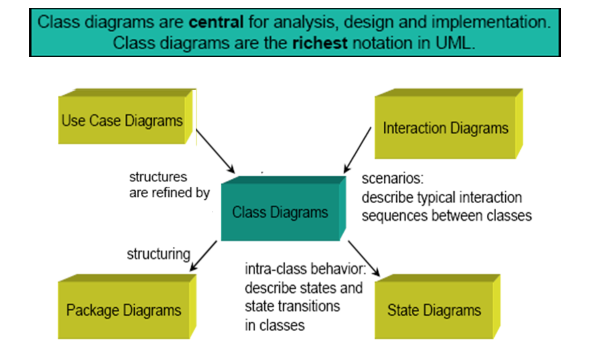   

## Analysis Class Diagram: Concepts and Notation

### Classes and objects

* The analysis class diagram contains classes that represent the more permanet aspects of the application domain, but
  specifically those that are relevant to the application under development.
* **Class** is a description of a set of objects with similar features, semantics and constrains.
* **An Object (instance)** is an abstraction of something in a problem domain

#### Class

  

#### Object

  

### Attributes

* Attributes are part of the essential description of a class.
* They are common structure of what class can 'know'
* Each object has its unique value for each attribute in class
    * To describe an instance completely needs to give a value for each attribute.
    * attribute = 'value'

### Links between instances

* A link is a logical connection between two or more objects.
* Alink can also connect instances of the same class.
* Less commonly, a link can connect an instance to itself.
* :Client (the colon before the class name indicates an anonymous instance of the class, in other words any client)

### Associations between classes

* Association is an abstraction that connects two classes and represent possibility of link between their instances.
* General rule: If two objects are linked, their classes are said to have an association
* Every association must have a descriptive name.
* The text at the association end gives a name to the role that the instances of the class at that end of the
  association play in relation to instances of the class at the other end of the association.
* The association end name represents a data value that holds a reference to an instance of another domain class rather
  than a value like an integer or a string

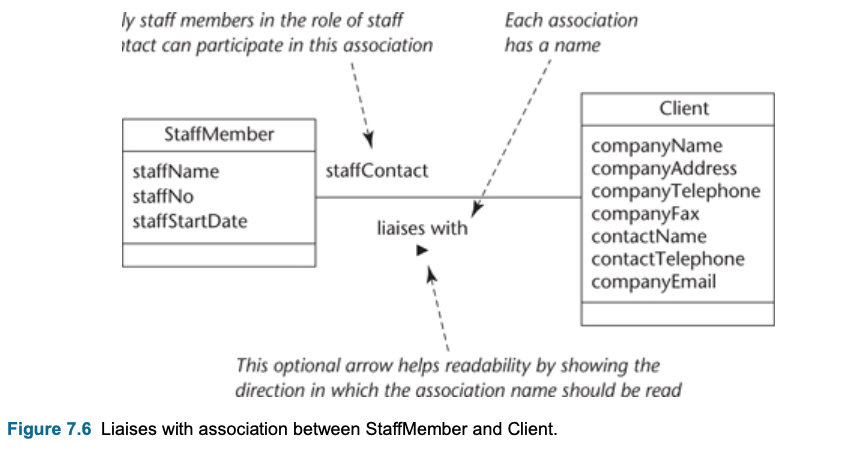 
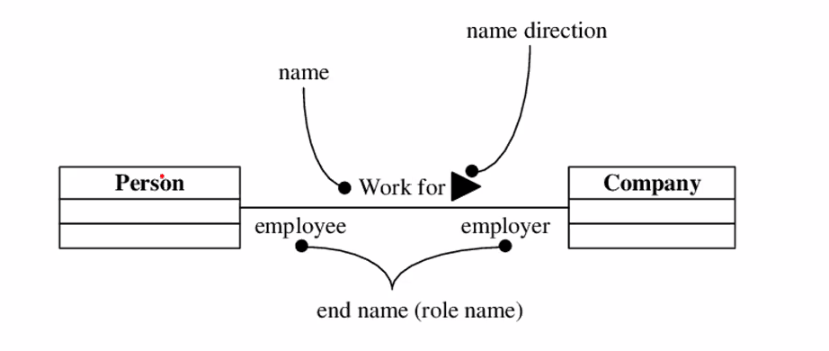

### Multiplicity

* The multiplicity is of an association is a description of the number of objects that can participate the association.
* Represent enterprise (or business) rules
    * These always come in pairs:
        * Associations must be read separately from both ends
        * Each bank customer may have 1 or more accounts
        * Every account is for 1, and only 1, customer

* This example, each StaffMember liaises with zero or more Clients, and each Client has only one staffMember to liaises
  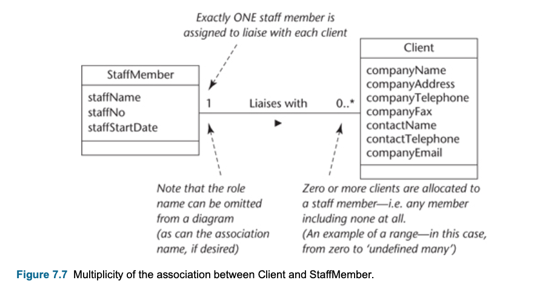
   
  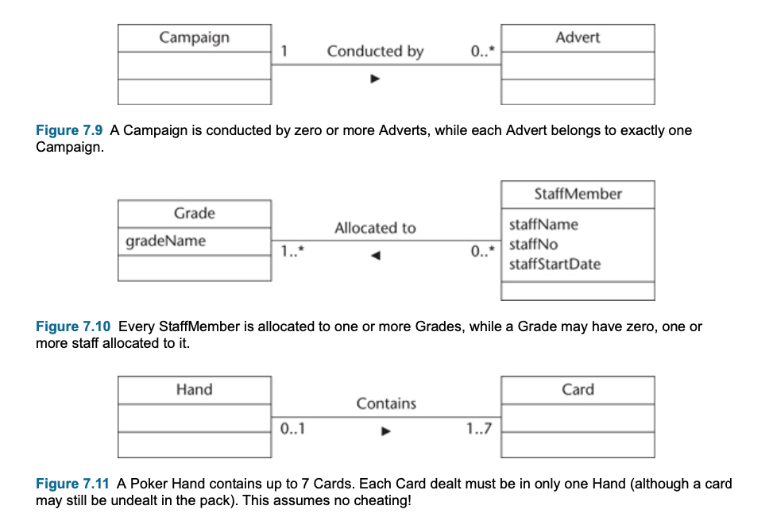

### Operations

* Operations are the common behaviour shared by all instance of a class.
* primary operations : constructor
* naming convention:
    * operation names are written beginning with a lower-case letter.
    * There is no separate notation for showing the operations of an object instance.
* Operations are defined for a class and are valid for every instance of the class.
* Operations describe what instances of a class can do:
    * Set or reveal attribute values
    * Perform calculations
    * Send messages to other objects
    * Create or destroy links

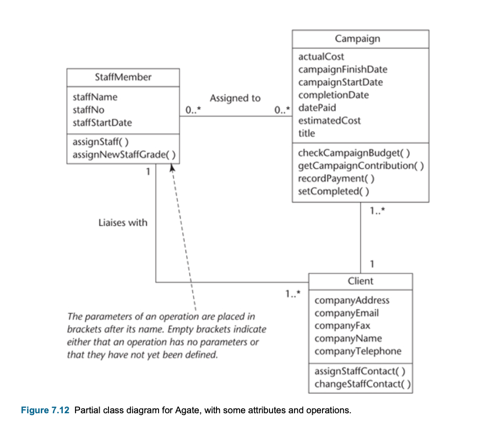

### Object State

* An object’s state is related to its attributes, its links and its operations
* Current state is an encapsulation of the value of attributes and links
* State constrains behaviour - it determines whether or not an operation can fire
* Executing an operation often causes a change of state

### Stability of the analysis class diagram

* Instances are subject to three main types of change during system execution.
    * they are created.
    * they can be destroyed.
    * they can be updated.

# Refining the Requirements Model

* The aim of refining and adding further structure to analyse model is to create conditions for reuse.
* **OOA (Object oriented Analys) gives 3 mechanism for reuse:**
    * Fundamental abstraction mechanism of:
        * **Generalization:** Generalization is a form of abstraction that means concentrating on those aspects of a design
          or specification that are relevant to more than one situation, while ignoring those that are only relevant to
          a specific situation
        * **Encapsulation:** Encapsulation and information hiding together represent a kind of abstraction that, focuses on
          the external behaviour of something and ignores the internal details of how the behaviour is produced.
    * the specification of reusable software components
    * the application of analysis patterns. & Component-based development is based on the specification of composite
      structures that can function as reusable software components

* Whey we reuse ?
    * Generally speaking, it is a waste of time and effort to produce from scratch anything that has already been
      produced elsewhere to a satisfactory standard. In simply words component reuse can save money, time and effort

* Why has it been hard to achieve reuse?
    * Reuse is not always appropriate – can’t assume an existing component meets a new need
    * The ‘not invented here’ syndrome
    * Reuse can be difficult to manage - Poor model organisation makes it hard to identify suitable components
    * Analysis work is harder to reuse than either designs or software - Requirements and designs are more difficult to
      reuse than code

* How object-orientation contributes to reuse
    * Object-oriented software development relies on two main forms of abstraction that help to achieve reuse: first,
      **generalization** and second, **encapsulation** combined with information hiding.
        * **Generalization**: Generalization in software is a lot like this. The aim is to identify features of a
          specification or design that are likely to be useful in systems, or for purposes, for which they were not
          specifically developed.
            * Generalization allows the creation of new specialised classes when needed
        * **Encapsulation and information hiding** : Composition involves encapsulating a group of classes that collectively
          have the capacity to be a reusable subassembly: in other words, an independent module.
            * Encapsulation makes components easier to use in systems for which they were not originally designed
        * Aggregation and composition can be used to encapsulate components

## Finding and modelling generalization

* Generalisation is a special type of association between classes, it provides **“is-a”, “kind -of”** relation.
* The superclass operation is expected to be overridden in its subclasses. While both AdminStaff and CreativeStaff
  require an operation calculateBonus(), it works differently in each case.
* Generalisation is the same as inheritance
    * Generalisation within a programming language is often called inheritance
* More general bits of description are abstracted out from specialized classes. For example, the properties for a person
  are abstracted out from the HourlyPaidDriver and represented separately.
* Why then include the operation in the superclass at all?
    * it is an attempt at ‘future-proofing’. A superclass may later acquire other subclasses that are as yet unknown.
* When we add generalization structures?
    * Two classes are similar in most details, but differ in some respects
    * May differ:
        * In behaviour (operations or methods)
        * In data (attributes)
        * In associations with other classes
* **Abstract and concrete classes:**
    * Abstract classes has any instances.
    * Only a superclass in a generalization hierarchy can be abstract. All other classes can have one or more instances,
      and are said to be **concrete** or **instantiated**
    * Abstract class is indicated by the {abstract} annotation below the class name
* How generalization helps to achieve reuse?
    * The reason for creating a generalization hierarchy is to enable the specifications of its superclasses to be
      reused in other contexts. Often this reuse is within the current application.
* Main benefit of generalization is hierarchies can usually be extended without significant effects on existing
  structures.
* A top-down approach to finding generalization
    * If an association can be described by the expression is a **kind of**, then it can usually be modelled as
      generalization
* A bottom-up approach to finding generalization
    * An alternative approach is to look for similarities among classes in your model, and consider whether the model
      can be ‘tidied up’ or simplified by introducing superclasses that abstract out the similarities.
* When not to use generalization
    * Generalization can be overused, so some judgement is needed to determine its likely future usefulness on each
      occasion.
    * we should not anticipate subclasses that are not justified by currently known requirement
    * On the one hand, generalization is modelled to permit future subclassing in situations that the analyst cannot
      reasonably anticipate.
* Multiple inheritance : is often appropriate for a class to inherit from more than one superclass
* **Interface**
    * The purpose of generalisation is for inheritance, which is the key mechanism for reuse.
    * When generalisation applies to interface, it is called interface realisation, represented by an empty arrow with
      dashed line.
    * Interface is a special form of class with the  <<interface>>  stereotype.
    * An interface contains  **no concrete implementations** apart from a collection of abstract methods.
    * A class that implements an interface must implement all the abstract methods defined in the interface. In the
      Runnable example, both Animal and the Human class should implement the run method specified in the runnable
      interface.
    * Classes that extend interfaces will become interfaces.

* **Difference between abstract and interface** : An abstract class contains at least one abstract method, whereas all
  methods in an interface class are abstract.

 
 
 
 

## Finding and modelling composition (Aggregation, composition)

* Composition and aggregation are specific cases of association.
* Composition (or composite aggregation) is based on the concept of aggregation, which is a feature of many
  object-oriented programming languages.
    * **Aggregation** represents a **whole–part** relationship between classes,
        * Aggregation is a special type of association between classes, it is a “weaker” notion of the whole-part
          relation.
        * Unfilled diamond
        * **Composition** shows a **stronger form of ownership of the part by the whole**.
            * A composition is ‘stronger’ notion of whole-part relation.
            * Each part may belong to only one whole at a time. The whole and the parts share the same lifecycle. When
              the whole is destroyed, so are all its parts.
            * Filled diamond

* Composition and aggregation may both be identified during requirements analysis, but their main application is during
  design and implementation activities, where they can be used to encapsulate a structure of objects as a potentially
  reusable subassembly.
* **Difference between composition and aggregation** : Composition is stronger than aggregation which means the whole and
  the part share the same lifecycle. For composition, if you destroy the whole, the part will disappear. For
  aggregation, if you destroy the whole, the part may not disappear.

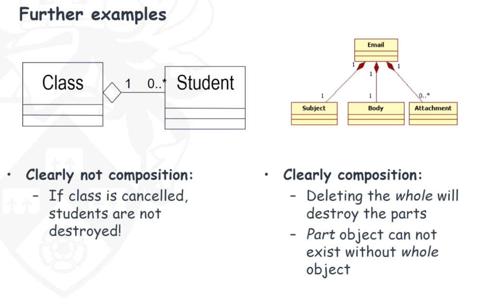 
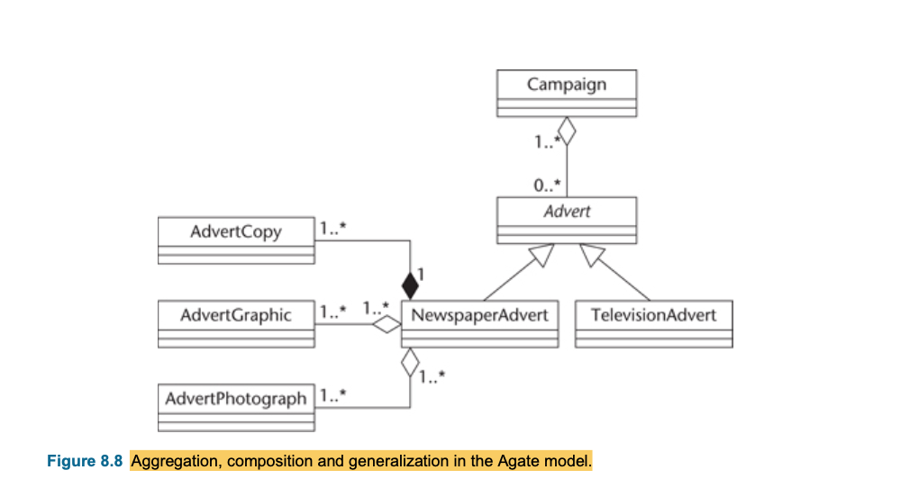 

# Class modelling

* Class modelling involves - static structure of the system
    * identifying possible classes,
    * adding associations, attributes and some operations and producing the first cut class diagram,
    * analysing possible inheritance, reusable components and updating the class diagram.

## Class Stereotypes

* Special use of a model element that is constrained to behave in a particular way
* Stereotypes are shown where they add useful meaning to a model, but their use is not obligatory.
* 3 type sterotypes which widely using: boundary, control and entity classes

### Boundry classes

* Boundary classes ‘model interaction between the system and its actors’ (Jacobson et al., 1999).
* Boundary class represents interaction with the user
  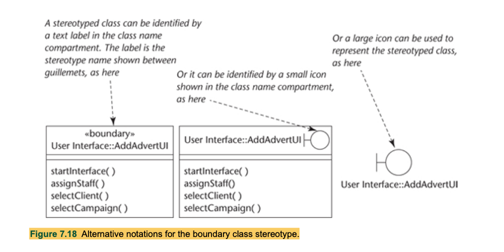 

### Entity classes

* Entity classes1 model ‘information and associated behaviour of some phenomenon or concept such as an individual, a
  real-life object or a real-life event’ (Jacobson et al., 1999).
* Instances of an entity class usually require persistent storage of their information. This can sometimes help to
  decide whether an entity class is the appropriate modelling construct.
* Entity classes represent the behaviour of things in the application domain and storage of information that is directly
  associated with those things (possibly including some elements of calculation and scheduling).

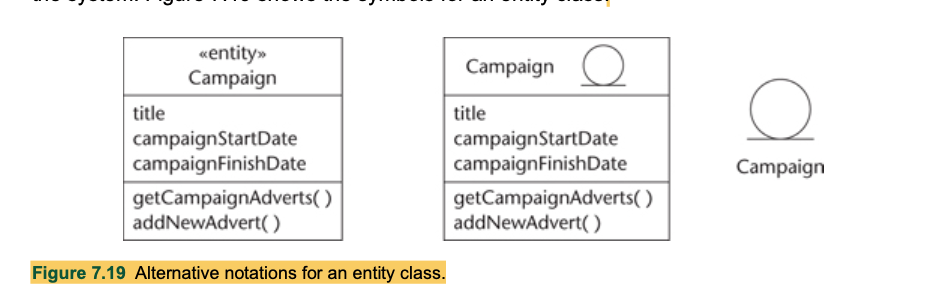 

### Control classes

* Control classes ‘represent coordination, sequencing, transactions and control of other objects’ (Jacobson et al.,
  1999).
* Control classes represent the calculation and scheduling aspects of the logic of their use cases —at any rate, those
  parts that are not specific to the behaviour of a particular entity class and that are specific to the use case

 

## Guidelines for Identifying Classes

* **Only focus on entity classes in the requirement analysis phase**
    * _Class stereotypes can be omitted in the class diagram_
    * Boundary and control classes can be delayed until the system design phase
* Use cases are the best place to look for entity classes
* **General Rules:**
    * Read through the use case descriptions line by line, try to pick up only important  (physical)  things or  (
      abstract)  concepts in the application domain which store information or knowledge in order to achieve its
      objective.
    * Actors do not normally need to be modelled as entity classes as they stay out of the system boundary.
    * Not usually necessary to contain a class to represent the entire system.
        * for example University of York Administration System, since you will not have many instances of it.
    * If synonyms used, choose the one that is least ambiguous, least colloquial, or most frequently used. - ie, use
      Helicopter instead of chopper or whirlybird
    * Names needs to express a logical meaning rather than a physical implementation.
    * Be prepared to iterate
* **Ask yourself to be sure to model a class:**
    * Will have it separate attributes that will take on different values? - if yes then keep it as class
    * Will it be many intances? - if yes then it is a class.
    * If it only has meaning to describe another item rather than being described, then it is an attribute.
* **Consider:**
    * Operations (actions) are modelled as responsibilities for a class.
    * Associations may sometimes better be modelled as class.

## From Use Case to Class Diagram

* for the first class diagram
    * how many campaigns can a staff works on, this needs further clarification from the user.
* for the second class diagram
    * Is this the same Staff class as before, or it is just a subclass of Staff?
    * How many Clients contact can one staff have?
* for third class diagram
    * Can an advert belong to more than one campaign? If so, this could be just a normal association, not an
      aggregation.

 

# Interaction modelling

* **Use case realization** is how the objects from each use case work together to deliver the overall functionality for
  the use case
    * Use case realisation is how we develop the use case model into another model that is closer to its
      implementation/function
* Letting us depict how objects from each use case work together to deliver the use cases function
* How to identify classes from use cases
    * The class modelling (use case -> class diagram) has given us the structure
    * How do we depict functionality of use cases?
    * Interaction modelling will help and is the second step in the requirement analysis phase
* A sequence diagram shows elements as they interact, organised according to objects (horizontally) and time (
  vertically)
* We can prepare to make a sequence diagram by using CRC cards
* The second step in the requirement phase is interaction modelling
* Interaction and collaboration between objects leading to the identification of classes, their attributes and their
  associated responsibilities.
* What is object interaction?
    * rather than think in terms of operation invocation we use the metaphor of message passing to describe object
      interaction, as this emphasizes that objects are encapsulated and essentially autonomous.
* What is the aim of modelling object interactions?
    * The aim of modelling object interaction is to determine the most appropriate scheme of messaging between objects
      in order to support a particular user requirement.
* Once the CRC cards and sequence diagram is complete, the class diagram can be revised with attributes and operations

## Class Responsibility Collaboration Cards (CRC)

* Class Responsibility Collaboration (CRC) cards provide an effective technique for exploring the possible ways of
  allocating responsibilities to classes and the collaborations that are necessary to fulfil the responsibilities
    * CRC provides an effective technique for exploring the possible ways of allocating responsibilities to classes and
      the collaboration that are necessary to fulfil the responsibilities.
* CRC cards can also be used effectively when designing object interaction in more detail to identify and allocate
  operations.
* Responsibilities are a high level description of what a class can do
* Role play the interaction and negotiate the most appropriate responsibility allocation.
* Usage:
    * Conduct brainstorming session
        * Which objects are involved in use case
    * Allocate object to team member who will role play the object
    * Act out use case
        * Exploring responsibilities and collaboration
    * Identify and record any missing or redundant objects

* Team members can take these strategies:
    * Each role player tries to be lazy and they persuade other players their classes should accept responsibility for a
      given task.
    * Each role player tries to be hardworking and they persuade other players their class should not accept
      responsibility for a given task.
* The results are recorded in CRC cards paper CASE.

 
 

## Sequence diagram notations

* [What is Sequence diagram ?](https://www.visual-paradigm.com/guide/uml-unified-modeling-language/what-is-sequence-diagram/)
* Lifeline: Represents an individual participant in the interaction
* Activations: Period during which an element is performing an operation
* Message: A message defines a particular communication between lifelines of an interaction
* Create message: message that represents the instantiation of (target) lifeline
* Destroy message: message that represents the request of destroying the lifecycle of target lifeline
* Self message: message starts and finishes to the same lifeline
* Recursive message: message starts and finishes to lifeline on top of the activated lifeline

 
 
 
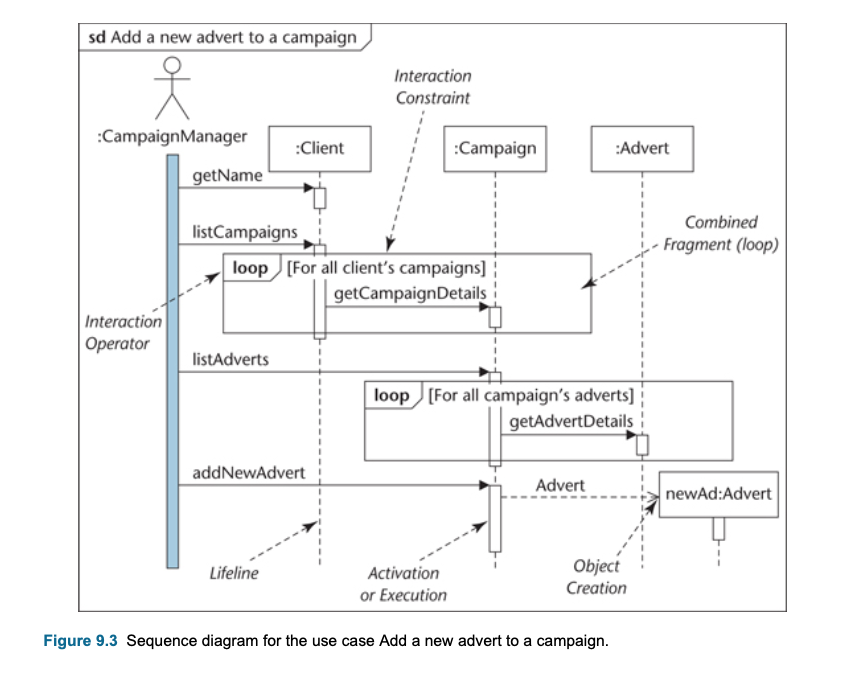 

# Questions:

* What is the differences between class and instance attributes?
    * Class attributes are shared amongst all instances of that class. An instance attribute is local to that object
      instance

 

# Sources
[UML Cheatsheat](https://yetanotherchris.dev/cheatsheet/uml-cheat-sheet/)  
[UML Cheatsheat 2](https://loufranco.com/wp-content/uploads/2012/11/cheatsheet.pdf)  
[UML Cheatsheat 3](https://www.guru99.com/uml-cheatsheet-reference-guide.html)  
[Association vs. Dependency vs. Aggregation vs. Composition](https://nirajrules.wordpress.com/2011/07/15/association-vs-dependency-vs-aggregation-vs-composition/)  

[VP Class diagram](https://online.visual-paradigm.com/diagrams/tutorials/class-diagram-tutorial/)
[VP Sequence Diagram](https://online.visual-paradigm.com/diagrams/tutorials/sequence-diagram-tutorial/)